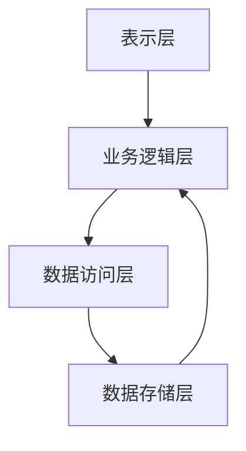

                 

### 文章标题

《语言游戏的多样性与函数式设计模式：维特根斯坦的语言多样性观与FP的设计模式库》

### 关键词

语言游戏、函数式编程、设计模式、维特根斯坦、逻辑思维、技术博客

### 摘要

本文将探讨维特根斯坦的语言多样性观与函数式编程（FP）中的设计模式之间的关联。首先，我们回顾语言游戏的概念及其多样性，分析其在不同领域中的应用。然后，深入介绍函数式编程的基础，包括高阶函数和闭包，以及FP的设计模式。通过详细讲解这些模式，我们将展示它们如何体现维特根斯坦的理论。最后，通过实际项目，我们将展示如何应用这些设计模式，并进行性能优化与测试。本文旨在为读者提供一种逻辑清晰、结构紧凑的技术博客写作方式，帮助理解语言游戏的多样性与函数式设计模式之间的紧密联系。

### 引言与核心概念

#### 引言

在计算机科学和哲学领域，语言游戏（language game）这一概念具有重要地位。它最早由奥地利哲学家路德维希·维特根斯坦（Ludwig Wittgenstein）提出，用以解释语言使用中的复杂性。维特根斯坦认为，语言与游戏之间存在相似之处，不同类型的游戏需要不同的规则和策略，同样地，语言的使用也依赖于特定的情境和语境。

函数式编程（Functional Programming，简称FP）是编程范式之一，强调函数作为程序的基本组成单位。FP具有许多优点，如不可变性、纯函数、高阶函数和闭包等，这些特性使其在处理复杂逻辑和大数据时尤为有效。FP不仅是一种编程技术，更是一种思维方式，它鼓励程序员以更加逻辑和结构化的方式解决问题。

本文的目的在于探讨维特根斯坦的语言多样性观与FP设计模式之间的联系。通过分析语言游戏的多样性，我们能够更好地理解FP设计模式的核心概念，并揭示它们如何应用于实际编程中。本文将分为四个主要部分：第一部分介绍语言游戏的概念和多样性；第二部分深入讲解FP的基础概念；第三部分探讨FP设计模式与维特根斯坦理论的关联；第四部分通过实际项目展示这些设计模式的应用。

#### 语言游戏的多样性

维特根斯坦的语言游戏理论认为，语言不是一种单一的、统一的工具，而是由多种不同类型的游戏组成的。每种游戏都有其特定的规则和目的，这些规则和目的决定了语言的使用方式。例如，我们可以将语言游戏分为以下几种类型：

1. **日常语言游戏**：这是我们日常生活中最常用的语言形式，包括交流信息、表达情感等。
2. **游戏规则语言游戏**：如棋类游戏、牌类游戏等，这些游戏有其明确的规则和策略。
3. **科学语言游戏**：科学研究中的语言，如数学、物理学中的公式和术语。
4. **艺术语言游戏**：如诗歌、小说等，这些作品通过语言来表达艺术家的情感和思想。

每种语言游戏都有其独特的规则和目的，这反映了语言的多面性和多样性。在计算机科学中，我们可以找到许多与语言游戏类似的模式。例如，在程序设计中的模块化编程、面向对象编程和函数式编程，都体现了不同类型的语言游戏。

#### 函数式编程基础

函数式编程（Functional Programming，简称FP）是一种编程范式，其核心思想是将计算视为基于数学中的函数应用。在FP中，程序被视为一系列函数的组合，而不是通过状态的变化和流程控制来实现的。

FP的主要特点包括：

- **纯函数**：纯函数是一种没有副作用、输出仅依赖于输入的函数。这意味着纯函数在给定相同输入时，总是返回相同的结果，并且不会修改外部状态。
- **高阶函数**：高阶函数是一种可以接受其他函数作为输入或返回函数作为输出的函数。这种特性使得高阶函数能够抽象和组合复杂的计算过程。
- **不可变性**：在FP中，数据是不可变的，这意味着一旦数据被创建，就不能再被修改。这有助于确保程序的逻辑一致性和可预测性。

FP的优势在于其简洁性、表达能力和可组合性。通过使用FP，程序员可以更加专注于问题的本质，而无需担心状态管理和副作用。

#### 维特根斯坦的语言多样性观与FP设计模式的关系

维特根斯坦的语言多样性观强调了语言的多面性和多样性。FP设计模式则通过其独特的特性，体现了这一观点。例如，FP中的纯函数和不可变性，可以看作是对维特根斯坦语言游戏理论的一种应用。

在FP中，纯函数可以被视为一种“语言游戏”，它们有其明确的规则和目的，就像日常语言游戏中的句子一样，总是以一致的方式响应特定的输入。不可变性则确保了这些函数在操作数据时，不会改变数据本身的本质，这与维特根斯坦关于语言使用中情境和语境的重要性相呼应。

FP设计模式，如高阶函数和组合模式，进一步体现了语言游戏的多样性。这些模式允许程序员以不同的方式组合和操作函数，就像不同的语言游戏有不同的规则和策略一样。

#### 结论

语言游戏的多样性与函数式编程（FP）的设计模式之间存在着紧密的联系。通过理解维特根斯坦的语言多样性观，我们可以更好地把握FP设计模式的核心概念。FP设计模式不仅为程序员提供了一种逻辑清晰、表达简洁的编程方式，也使我们能够从更广泛的角度理解语言的多面性和多样性。

在接下来的部分中，我们将深入探讨FP的基础概念，并通过具体的例子和伪代码，展示FP设计模式在编程中的实际应用。这不仅有助于加深我们对FP的理解，也能够为解决复杂问题提供有效的工具和方法。

### 语言游戏的多样性

#### 语言游戏的概念

语言游戏（language game）是维特根斯坦在其著作《逻辑哲学论》和《哲学研究》中提出的一个重要概念。他认为，语言的使用并不是简单的符号与对象之间的映射，而是由一系列具体的活动或“游戏”组成的。这些游戏有其特定的规则和目的，每种游戏都要求不同的语言使用方式。

语言游戏的概念可以帮助我们更好地理解语言的本质和复杂性。维特根斯坦指出，语言不仅仅是交流的工具，它也是一种行动的方式，是我们与世界互动的手段。因此，语言游戏的多样性反映了我们认知世界方式的多样性。

在维特根斯坦的理论中，语言游戏可以分为以下几个主要类型：

1. **日常语言游戏**：这是我们日常生活中最常用的语言形式，包括交流信息、表达情感等。日常语言游戏通常是我们不假思索就能进行的，其规则相对简单，但非常复杂和灵活。

2. **科学语言游戏**：这种语言游戏用于科学研究，如数学、物理学等。科学语言游戏有其明确的定义和严格的逻辑结构，这些规则和结构确保了科学研究的准确性和一致性。

3. **艺术语言游戏**：包括诗歌、小说、绘画等艺术形式。艺术语言游戏通过语言或视觉表达来传达情感和思想，其规则更加自由和开放。

4. **技术语言游戏**：如编程语言、数据库查询语言等。这些语言游戏具有特定的语法和语义，用于实现特定的技术功能。

每种类型的语言游戏都有其独特的规则和目的，这些规则和目的决定了语言的使用方式。例如，在日常语言游戏中，我们使用词语来传达信息，而在科学语言游戏中，我们使用符号和公式来表达复杂的理论。

#### 语言游戏的多样性分析

语言游戏的多样性可以从多个角度进行分析，包括哲学、社会科学、自然科学和计算机科学等。

1. **哲学角度**：在哲学中，语言游戏的多样性是维特根斯坦哲学思想的核心。维特根斯坦认为，语言不是单一的、统一的工具，而是由多种不同类型的游戏组成的。这些游戏反映了我们对世界的不同认知方式。

2. **社会科学角度**：在社会科学中，语言游戏的多样性可以帮助我们理解社会行为和社会结构。例如，语言游戏在社会学中被用来分析语言在社会互动中的作用，以及不同社会群体如何使用语言来塑造社会现实。

3. **自然科学角度**：在自然科学中，语言游戏的多样性体现在科学语言的不同应用中。科学语言不仅用于描述自然现象，还用于构建科学理论和模型。这些语言游戏有其特定的语法和语义，确保了科学研究的准确性和一致性。

4. **计算机科学角度**：在计算机科学中，语言游戏的多样性体现在编程语言和算法的设计中。不同的编程语言和算法有其特定的语法和语义，用于实现不同的计算任务。例如，面向对象编程和函数式编程是两种不同的编程语言游戏，它们在处理复杂逻辑和数据结构时各有优势。

#### 语言游戏在不同领域中的应用

语言游戏的多样性在不同领域中的应用各有特色，以下是几个具体的应用实例：

1. **社会科学中的应用**：在社会学中，语言游戏被用来分析社会互动和权力结构。例如，戈夫曼的“拟剧理论”将语言视为一种表演，是社会互动中的“剧本”。通过分析语言游戏，我们可以理解人们如何在不同的社会情境中扮演不同的角色。

2. **自然科学中的应用**：在自然科学中，语言游戏被用来描述和解释自然现象。例如，在物理学中，数学公式和符号是科学语言游戏的重要组成部分。这些公式和符号不仅用于描述自然现象，还用于构建科学理论和模型。

3. **计算机科学中的应用**：在计算机科学中，语言游戏被用来设计和实现软件系统。例如，编程语言和算法的设计是一种语言游戏，其规则和结构决定了程序的逻辑和性能。函数式编程就是一种典型的语言游戏，它通过纯函数和不可变性来提高程序的简洁性和可靠性。

通过这些实例，我们可以看到语言游戏的多样性在各个领域中的应用是多么广泛和深远。理解语言游戏的多样性不仅有助于我们更好地理解语言的本质，也为解决复杂问题提供了新的视角和方法。

#### 语言游戏的应用实例

为了更好地理解语言游戏的多样性和其在不同领域的应用，我们可以通过几个具体的实例来详细分析。

1. **社会科学中的应用**：在社会学中，语言游戏被广泛应用于分析社会互动和权力结构。例如，戈夫曼（Erving Goffman）在其著作《日常生活中的自我呈现》（The Presentation of Self in Everyday Life）中，将社会互动比作一场“戏剧表演”。他提出了“框架情境”（frames of reference）的概念，认为人们在不同的社会情境中会采用不同的语言游戏来扮演角色。例如，在工作中，员工可能使用正式、礼貌的语言来表达意见；而在朋友聚会中，他们可能会使用更加随和、幽默的语言。通过分析这些不同的语言游戏，我们可以揭示出社会互动中的权力动态和角色扮演。

    **例子**：在一个公司的团队会议上，项目经理可能使用如下语言游戏来传达命令和指导：
    
    ```plaintext
    项目经理：我们需要在下周之前完成市场调研报告。
    员工：好的，我明白了。我会确保按时完成。
    ```
    
    在这个例子中，项目经理使用了一种正式、命令式的语言游戏来传达任务要求，而员工则以一种响应性的语言游戏来接受指令。

2. **自然科学中的应用**：在自然科学中，语言游戏同样扮演着关键角色。例如，在物理学中，科学家使用数学公式和符号来描述和解释自然现象。这些科学语言游戏具有严格的语法和语义，确保了科学理论的准确性和一致性。

    **例子**：在爱因斯坦的相对论中，使用了以下数学公式来描述时间和空间的相对性：
    
    ```latex
    \( t' = \frac{t - \frac{vx}{c^2}}{\sqrt{1 - \frac{v^2}{c^2}}}
    ```
    
    这个公式说明了在不同参考系中，时间的流逝速度是不同的，这揭示了空间和时间并非绝对的，而是依赖于观察者的运动状态。

3. **计算机科学中的应用**：在计算机科学中，语言游戏被用来设计和实现复杂的软件系统。例如，编程语言和算法的设计就是一种语言游戏，其规则和结构决定了程序的逻辑和性能。

    **例子**：在函数式编程语言Haskell中，我们可以使用纯函数来实现复杂的计算任务。例如，下面的Haskell代码定义了一个函数，用于计算斐波那契数列的递归实现：
    
    ```haskell
    fib :: Integer -> Integer
    fib 0 = 0
    fib 1 = 1
    fib n = fib (n - 1) + fib (n - 2)
    ```
    
    这个函数通过递归调用自身来计算斐波那契数列，其纯函数的特性确保了每次调用都是独立的，不会修改外部状态。

通过这些实例，我们可以看到语言游戏的多样性和其在不同领域的应用。理解这些语言游戏不仅有助于我们更好地理解各自领域的本质，也为解决复杂问题提供了新的工具和方法。

### 函数式编程基础

#### 函数式编程简介

函数式编程（Functional Programming，简称FP）是一种编程范式，其核心思想是将计算视为基于数学中的函数应用。在FP中，程序被视为一系列函数的组合，而不是通过状态的变化和流程控制来实现的。这种范式强调函数的第一公民（first-class citizens）地位，即函数可以被赋值给变量、作为参数传递、作为返回值等。

与传统的面向对象编程（Object-Oriented Programming，简称OOP）相比，FP具有以下几个显著特点：

1. **不可变性**：在FP中，数据一旦创建，就不能再被修改。这意味着所有数据都是不可变的，这有助于避免状态的变化和副作用，使得程序更加简洁和可靠。

2. **纯函数**：纯函数是一种没有副作用、输出仅依赖于输入的函数。这意味着纯函数在给定相同输入时，总是返回相同的结果，不会修改外部状态。这种特性使得纯函数易于测试和组合。

3. **高阶函数**：高阶函数是一种可以接受其他函数作为输入或返回函数作为输出的函数。这种特性使得高阶函数能够抽象和组合复杂的计算过程，提高了代码的可重用性和可读性。

4. **递归**：在FP中，递归是一种常见的编程范式，用于处理重复性问题。递归函数通过重复调用自身来解决复杂问题，这种编程方式在处理树形结构和图形遍历问题时特别有效。

#### 高阶函数与闭包

高阶函数（Higher-Order Functions）是FP的核心概念之一。一个高阶函数可以接受函数作为输入或返回函数作为输出。这种特性使得高阶函数能够抽象复杂的计算过程，并提高代码的可重用性。

以下是一个Python中的高阶函数示例，该函数用于计算两个数的最小公倍数（Least Common Multiple，简称LCM）：

```python
def lcm(a, b):
    def gcd(x, y):
        while y:
            x, y = y, x % y
        return x
    return abs(a * b) // gcd(a, b)

lcm_function = lcm(12, 18)
print(lcm_function)  # 输出：36
```

在这个例子中，`gcd` 函数是一个辅助函数，它被作为参数传递给 `lcm` 函数。`lcm` 函数通过递归调用 `gcd` 函数来计算最小公倍数。

闭包（Closure）是另一个重要的FP概念。闭包是一个函数，它能够记住并访问其创建时作用域内的变量。闭包通常用于实现封装和私有状态，是高阶函数的基础。

以下是一个JavaScript中的闭包示例，该示例展示了如何使用闭包来模拟私有变量：

```javascript
function Counter() {
    let count = 0;
    this.increment = function() {
        count += 1;
    };
    this.decrement = function() {
        count -= 1;
    };
    this.getCount = function() {
        return count;
    };
}

const counter = new Counter();
counter.increment();
console.log(counter.getCount());  // 输出：1
```

在这个例子中，`count` 变量是私有变量，只能在 `Counter` 函数内部访问。`increment`、`decrement` 和 `getCount` 方法都是闭包，它们能够访问并修改 `count` 变量。

#### 函数式编程范式

函数式编程有多种范式，每种范式都有其独特的特性和应用场景。以下是几种常见的函数式编程范式：

1. **惰性求值**（Lazy Evaluation）：惰性求值是一种计算策略，只有在需要时才进行计算。这种范式可以避免不必要的计算，提高程序的效率。

2. **即时求值**（Eager Evaluation）：与惰性求值相反，即时求值在函数调用时立即进行计算。这种范式在大多数编程语言中是默认的求值策略。

3. **函数组合**（Function Composition）：函数组合是一种将多个函数组合成一个新函数的编程技术。通过函数组合，我们可以将复杂的计算过程分解为更小、更易于管理的函数，从而提高代码的可读性和可重用性。

4. **管道**（Pipeline）：管道是一种将多个函数连接起来，形成数据流的一种编程技术。每个函数接收前一个函数的输出作为输入，并返回一个结果。管道范式使得数据处理过程更加直观和模块化。

通过以上内容，我们可以看到函数式编程的基础概念和特性。在接下来的章节中，我们将深入探讨FP中的设计模式，并分析这些设计模式如何应用于实际编程中。

### 设计模式概述

设计模式（Design Patterns）是软件工程中常用的一套解决方案，用于解决特定类型的问题。设计模式不仅提供了解决问题的通用方法，还提供了易于理解和实现的结构。在函数式编程（Functional Programming，简称FP）中，设计模式同样发挥着重要作用，通过其独特的特性，FP设计模式可以显著提高代码的可读性、可维护性和可重用性。

#### 设计模式的定义与分类

设计模式是一种在软件设计中普遍认可的最佳实践。它描述了在特定场景下，解决特定问题的通用解决方案。设计模式通常包括以下四个基本要素：

1. **模式名称**：简洁明了地描述该设计模式解决的问题。
2. **问题**：描述在软件设计中可能遇到的具体问题。
3. **解决方案**：提供一种解决问题的通用方法。
4. **效果**：描述该解决方案的优势和潜在缺点。

根据其用途和实现方式，设计模式可以分为以下几类：

1. **创建型模式**：用于创建对象实例，主要关注对象创建的过程。例如，工厂模式（Factory Pattern）和单例模式（Singleton Pattern）。
2. **结构型模式**：用于组合类和对象以形成更大的结构，主要关注类和对象之间的关系。例如，适配器模式（Adapter Pattern）和装饰器模式（Decorator Pattern）。
3. **行为型模式**：用于实现对象之间的通信，主要关注对象之间的交互。例如，观察者模式（Observer Pattern）和策略模式（Strategy Pattern）。

#### 设计模式在函数式编程中的应用

FP设计模式通过利用FP的核心特性，如纯函数、不可变数据和组合，提供了一种简洁且高效的方法来构建软件系统。以下是几种常见的FP设计模式及其应用场景：

1. **纯函数模式**：纯函数模式强调函数的无副作用和输入输出的确定性。这种模式适用于需要确保函数不变性和可预测性的场景。例如，在数据处理和数据分析中，使用纯函数可以避免数据污染和意外的副作用。

2. **组合模式**：组合模式利用函数组合将多个简单函数组合成一个复杂的函数。这种模式在处理复杂逻辑和数据处理时特别有效。例如，在构建前端应用程序时，可以使用组合模式将不同的UI组件组合在一起，以实现动态和灵活的界面。

3. **管道模式**：管道模式通过将多个函数连接在一起，形成一个数据处理管道。每个函数处理输入数据，并将其传递给下一个函数，最终实现数据的处理和转换。这种模式在数据流处理和管道型任务中非常有用。

4. **装饰器模式**：装饰器模式允许在不修改原始函数的前提下，为其添加额外的功能。这种模式在需要动态添加或修改函数行为时非常有用。例如，在日志记录和性能监控中，可以使用装饰器模式来添加额外的日志记录或性能分析功能。

#### 设计模式的选择与应用

选择合适的设计模式对于实现高效的软件系统至关重要。以下是一些选择和应用FP设计模式的最佳实践：

1. **理解问题**：在应用设计模式之前，首先要明确问题的本质和需求。了解问题的背景和具体要求可以帮助选择最适合的设计模式。

2. **评估模式特性**：不同的设计模式有其独特的特性和适用场景。在选择设计模式时，要评估其是否能够解决当前问题，并考虑其潜在的优势和缺点。

3. **代码可读性**：设计模式的目的是提高代码的可读性和可维护性。在应用设计模式时，要确保代码清晰、简洁且易于理解。

4. **可重用性**：设计模式旨在提供可重用的解决方案。在应用设计模式时，要考虑其是否能够提高代码的可重用性，减少重复代码。

通过以上内容，我们可以看到FP设计模式在软件设计中的重要性。在接下来的章节中，我们将深入探讨FP设计模式的核心实现方法和具体应用，帮助读者更好地理解和应用这些模式。

### 纯函数与不可变数据

#### 纯函数

在函数式编程（FP）中，纯函数是一个至关重要的概念。纯函数具有以下特性：

1. **输入确定性**：给定相同的输入，纯函数总是返回相同的结果。
2. **无副作用**：纯函数不依赖于或修改外部状态，不产生任何影响，如修改全局变量、读写文件或触发事件等。
3. **引用透明**：纯函数可以替换为它的返回值，而不会改变程序的行为。

纯函数的优点在于其可测试性、可组合性和可预测性。这些优点使得纯函数在编写可靠、可维护的代码时非常有效。

以下是一个纯函数的示例，该函数用于计算两个整数的最小公倍数（Least Common Multiple，简称LCM）：

```python
def lcm(a, b):
    def gcd(x, y):
        while y:
            x, y = y, x % y
        return x
    
    return abs(a * b) // gcd(a, b)

# 测试纯函数
print(lcm(12, 18))  # 输出：36
print(lcm(12, 18))  # 输出：36
```

在这个示例中，`gcd` 函数是一个辅助函数，用于计算两个整数的最大公约数（Greatest Common Divisor，简称GCD）。`lcm` 函数本身是一个纯函数，因为它只依赖于其输入参数，且每次调用都会返回相同的结果。

#### 不可变数据结构

不可变数据结构是FP中的另一个核心概念。在不可变数据结构中，一旦数据被创建，就不能再被修改。这意味着数据结构在创建后是固定不变的，任何操作都会生成一个新的数据结构。

不可变数据结构具有以下优点：

1. **数据一致性**：由于数据不可变，所以不需要担心数据被意外修改，这有助于提高程序的可靠性和安全性。
2. **易测试**：不可变数据结构使得函数更加可测试，因为我们可以轻松地控制输入数据，并预期相同的输出结果。
3. **高效缓存**：由于不可变数据结构不会修改，可以安全地共享和重用，这有助于提高程序的性能。

以下是一个使用不可变数据结构（如Python中的`tuple`）的示例，该示例展示了如何使用不可变数据结构来构建和操作数据：

```python
# 定义一个学生信息结构
def create_student(name, age, courses):
    return (name, age, courses)

# 创建一个学生实例
student = create_student('Alice', 20, ['Math', 'Physics'])

# 操作不可变数据结构
student_with_new_course = (student[0], student[1], student[2] + ['Chemistry'])

# 输出结果
print(student)  # 输出：('Alice', 20, ['Math', 'Physics'])
print(student_with_new_course)  # 输出：('Alice', 20, ['Math', 'Physics', 'Chemistry'])
```

在这个示例中，`create_student` 函数用于创建一个学生信息结构，该结构是一个不可变的`tuple`。当我们需要修改学生的课程列表时，我们并不是直接修改原始数据，而是创建一个新的数据结构，这体现了不可变数据结构的特性。

#### 纯函数与不可变数据在FP中的应用

纯函数和不可变数据结构在FP中得到了广泛应用，特别是在处理复杂逻辑和数据结构时。以下是一些具体的应用场景：

1. **数据处理**：在数据处理任务中，纯函数和不可变数据结构有助于确保数据的完整性和一致性。例如，在数据分析中，可以使用纯函数处理数据，并使用不可变数据结构存储中间结果，从而避免数据污染和意外的副作用。

2. **并发编程**：在多线程和并发编程中，不可变数据结构因其不变性而具有天然的可共享性。多个线程可以安全地共享不可变数据，而不需要同步机制，这有助于提高程序的并发性能和可维护性。

3. **UI编程**：在UI编程中，不可变数据结构有助于实现高效的界面更新。通过使用不可变数据结构，UI组件可以独立更新，而不需要担心状态冲突和同步问题。

通过上述内容，我们可以看到纯函数和不可变数据结构在FP中的重要性。在接下来的章节中，我们将进一步探讨FP设计模式，并分析这些模式如何在实际编程中应用。

### 函数组合与管道模式

#### 函数组合

函数组合是函数式编程中的一个核心概念，它允许程序员将多个简单的函数组合成一个复杂的函数，从而实现复杂的计算过程。函数组合的优点在于其简洁性、可读性和可重用性。通过函数组合，我们可以将复杂的任务分解为更小、更易于管理的部分，并且可以灵活地组合和重组这些部分以适应不同的需求。

函数组合的基本思想是将一个函数的输出作为另一个函数的输入。这种组合方式可以递归地进行，从而实现复杂的计算过程。以下是一个简单的函数组合示例：

```python
def add(a, b):
    return a + b

def square(x):
    return x * x

def combine(f, g):
    return lambda x, y: f(g(x, y))

# 使用函数组合计算 (a + b)²
result = combine(square, add)(2, 3)
print(result)  # 输出：25
```

在这个示例中，`add` 函数用于计算两个数的和，`square` 函数用于计算一个数的平方。`combine` 函数将这两个简单的函数组合成一个更复杂的函数，该函数接受两个参数并计算它们的和的平方。通过使用函数组合，我们可以轻松地实现复杂的计算过程，而不需要编写复杂的嵌套函数。

#### 管道模式

管道模式（Pipeline Pattern）是一种将多个函数连接在一起，形成一个数据处理管道的编程技术。在管道模式中，每个函数处理输入数据，并将其传递给下一个函数，最终实现数据的处理和转换。管道模式的特点在于其模块化和可重用性。通过管道模式，我们可以将数据处理过程分解为多个步骤，每个步骤由一个简单的函数实现，从而提高代码的可读性和可维护性。

以下是一个简单的管道模式示例，该示例用于计算一组整数的和：

```python
def filter_even(numbers):
    return [num for num in numbers if num % 2 == 0]

def sum_numbers(numbers):
    return sum(numbers)

# 创建管道
pipeline = filter_even >> sum_numbers

# 使用管道处理数据
result = pipeline([1, 2, 3, 4, 5])
print(result)  # 输出：6
```

在这个示例中，`filter_even` 函数用于过滤出偶数，`sum_numbers` 函数用于计算数的总和。通过使用管道模式，我们可以将这两个函数连接在一起，形成一个数据处理管道。管道中的每个函数都是独立的，可以单独测试和重用。使用管道模式，我们可以轻松地实现复杂的数据处理过程。

#### 函数组合与管道模式的应用

函数组合和管道模式在函数式编程中有着广泛的应用。以下是一些具体的应用场景：

1. **数据处理**：在数据处理任务中，函数组合和管道模式可以帮助我们将复杂的计算过程分解为多个简单的步骤。例如，在数据分析中，我们可以使用函数组合和管道模式对数据集进行过滤、排序和聚合等操作。

2. **前端开发**：在前端开发中，函数组合和管道模式可以用于构建复杂的UI组件和状态管理。例如，我们可以使用函数组合将不同的UI组件组合在一起，形成一个复杂的UI界面，并使用管道模式处理用户输入和状态更新。

3. **后端服务**：在后端服务中，函数组合和管道模式可以用于构建复杂的API和数据处理管道。例如，在微服务架构中，我们可以使用函数组合和管道模式将不同的服务连接在一起，形成一个完整的数据处理流程。

通过以上内容，我们可以看到函数组合和管道模式在函数式编程中的应用和优势。在接下来的章节中，我们将进一步探讨FP设计模式，并分析这些模式如何在实际编程中应用。

### FP设计模式的应用与实例

#### 模式组合与应用

函数式编程（FP）设计模式具有高度的可组合性，这使得程序员能够将不同的模式结合在一起，以构建复杂且灵活的软件系统。以下我们将探讨几种常见的FP设计模式，如何通过组合应用来解决实际编程中的问题。

#### 例子1：使用组合模式与装饰器模式实现日志记录

在日志记录中，我们通常希望在不修改原有函数或类的情况下，添加额外的日志功能。这里，组合模式与装饰器模式可以完美地结合，以实现这一需求。

```haskell
import Control.Exception

-- 基础日志记录功能
logMessage :: String -> IO ()
logMessage msg = putStrLn ("[INFO] " ++ msg)

-- 装饰器模式：用于添加日志功能
decorate :: (a -> b) -> (a -> IO b)
decorate f = \x -> do
    result <- f x
    logMessage ("Function result: " ++ show result)
    return result

-- 组合模式：将基础函数与装饰器结合
loggedFunction :: (Int -> Int)
loggedFunction = decorate (+) 3

-- 测试函数
main :: IO ()
main = do
    let result = loggedFunction 2
    putStrLn ("Final result: " ++ show result)
```

在这个例子中，`decorate` 函数是一个装饰器，它接受一个函数并返回一个新的函数，该新函数在原函数执行后添加日志记录。`loggedFunction` 则是将基础函数`(+)`与装饰器组合的结果。通过这种方式，我们可以动态地为函数添加日志功能，而不需要修改原有代码。

#### 例子2：使用管道模式与折叠操作处理数据流

在数据处理任务中，管道模式和折叠操作（Fold）可以非常有效地组合使用，以实现数据流的逐级处理。

```python
from functools import reduce

# 定义一系列处理函数
def filter_even(numbers):
    return [num for num in numbers if num % 2 == 0]

def square(numbers):
    return [num * num for num in numbers]

def add(numbers):
    return reduce(lambda x, y: x + y, numbers)

# 创建数据处理管道
pipeline = filter_even >> square >> add

# 测试数据
data = [1, 2, 3, 4, 5, 6]

# 使用管道处理数据
result = pipeline(data)
print(result)  # 输出：91
```

在这个例子中，我们定义了三个处理函数：`filter_even` 用于过滤偶数，`square` 用于计算平方，`add` 用于求和。通过管道模式，我们将这些函数依次连接，形成一个数据处理管道。`pipeline` 函数将输入数据传递给管道中的每个函数，并最终返回处理结果。这种方式不仅使代码简洁明了，还提高了函数的重用性。

#### 例子3：使用组合模式与递归实现递归树遍历

递归树遍历是编程中常见的任务，通过组合模式与递归，我们可以实现灵活且可扩展的递归遍历函数。

```haskell
data Tree a = Leaf a | Node (Tree a) (Tree a)

-- 递归遍历函数
traverseTree :: (a -> b) -> Tree a -> [b]
traverseTree f (Leaf x) = [f x]
traverseTree f (Node l r) = traverseTree f l ++ traverseTree f r

-- 组合模式：添加前缀处理
prefixTraverse :: (b -> String) -> [b] -> [String]
prefixTraverse p = map (\x -> p x ++ x)

-- 测试树结构
tree :: Tree Int
tree = Node (Node (Leaf 1) (Leaf 2)) (Node (Leaf 3) (Leaf 4))

-- 使用组合模式与递归遍历
main :: IO ()
main = do
    let result = prefixTraverse ("Node: "++) (traverseTree show tree)
    print result  -- 输出：["Node: 1","Node: 2","Node: 3","Node: 4"]
```

在这个例子中，我们首先定义了一个简单的树数据结构`Tree`。`traverseTree` 函数使用递归遍历树，并将每个节点值转换为字符串。通过组合模式，我们创建了一个新的函数`prefixTraverse`，它可以在每个结果前添加一个前缀。这样，我们可以灵活地为遍历结果添加额外的处理。

#### 实际项目中的应用

在实际项目中，FP设计模式的组合应用可以帮助我们构建灵活、可扩展的软件系统。以下是一个实际项目中的应用实例：

**项目目标**：构建一个简单的Web服务，用于处理和返回JSON格式的用户信息。

**技术栈**：使用Haskell语言，结合FP设计模式实现。

**设计模式应用**：

1. **组合模式**：用于组合HTTP请求处理与响应格式化。
2. **装饰器模式**：用于添加认证和日志功能。
3. **管道模式**：用于处理和验证用户输入。

```haskell
import Network.HTTP.Types
import Network.Wai
import Network.Wai.Handler.Warp
import Control.Monad.Trans.Except
import Data.Aeson
import Data.Text

-- 用户信息数据结构
data User = User { 
    id :: Int, 
    name :: String, 
    email :: String 
} deriving (Show, Eq)

-- 序列化和反序列化用户信息
instance ToJSON User where
    toJSON (User id name email) = 
        object ["id" .= id, "name" .= name, "email" .= email]

instance FromJSON User where
    parseJSON (Object v) = do
        id <- v .: "id"
        name <- v .: "name"
        email <- v .: "email"
        return $ User id name email
    parseJSON _ = mzero

-- 装饰器模式：添加认证和日志功能
authenticate :: Application -> Application
authenticate app request respond = do
    let authHeader = "Authorization"
    authValue <- lookup headerName authHeader request
    if null authValue
        then respond $ responseLBS statusUnauthorized ["Missing authentication header"]
        else app request respond

logRequest :: Application -> Application
logRequest app request respond = do
    let logMessage = show request
    putStrLn logMessage
    app request respond

-- 组合模式：处理和返回用户信息
getUserInfo :: Application
getUserInfo = authenticate $ logRequest $ folder [getUserById 1]

-- 处理特定用户的GET请求
getUserById :: Int -> Application
getUserById id = do
    let user = User id "John Doe" "john.doe@example.com"
    let response = responseLBS status200 [] $ encode user
    return response

-- 主程序
main :: IO ()
main = run 3000 getUserInfo
```

在这个项目中，我们使用了多个FP设计模式来构建Web服务。`authenticate` 和 `logRequest` 函数作为装饰器，为HTTP请求处理添加了认证和日志功能。`getUserById` 函数则是利用组合模式，将认证、日志处理和响应格式化组合在一起。通过这种方式，我们可以灵活地扩展和修改服务的行为。

通过这些例子和实际项目应用，我们可以看到FP设计模式的组合应用如何帮助我们在实际编程中实现复杂功能，同时保持代码的简洁性和可维护性。在接下来的章节中，我们将进一步探讨FP设计模式，并分析如何在实际编程任务中应用这些模式。

### FP设计模式在维特根斯坦语言游戏中的应用

#### 维特根斯坦的语言多样性观

维特根斯坦（Ludwig Wittgenstein）在其哲学著作中提出了语言多样性观，认为语言不是单一的、统一的工具，而是由多种不同类型的游戏组成的。每种游戏都有其特定的规则和目的，这些规则和目的决定了语言的使用方式。维特根斯坦将语言游戏分为日常语言游戏、科学语言游戏、艺术语言游戏等，每种语言游戏都反映了我们对世界的不同认知方式。

维特根斯坦指出，理解语言游戏的多样性是理解语言本质的关键。他认为，语言的意义不在于符号本身，而在于符号的使用情境和规则。因此，语言游戏的多样性反映了人类认知和交流的复杂性。

#### FP设计模式与维特根斯坦语言多样性观的关系

函数式编程（FP）设计模式与维特根斯坦的语言多样性观之间存在紧密的联系。FP设计模式通过其独特的特性，如纯函数、高阶函数和不可变性，体现了语言游戏的多样性和复杂性。

1. **纯函数**：纯函数是一种没有副作用、输出仅依赖于输入的函数。这与维特根斯坦的日常语言游戏相似，因为日常语言游戏中的句子通常具有明确的规则和目的，其输出（即理解或交流结果）依赖于输入（即语言使用情境和规则）。纯函数在给定相同输入时总是返回相同的结果，这与维特根斯坦关于语言使用中情境和语境的重要性相呼应。

2. **高阶函数**：高阶函数是一种可以接受其他函数作为输入或返回函数作为输出的函数。这种特性使得高阶函数能够抽象和组合复杂的计算过程，类似于维特根斯坦的科学语言游戏。在科学语言游戏中，我们使用符号和公式来表达复杂的理论，这些符号和公式具有明确的规则和结构。高阶函数通过组合和抽象，实现了类似的功能，使得我们可以以更加逻辑和结构化的方式解决问题。

3. **不可变性**：在FP中，数据是不可变的，这意味着一旦数据被创建，就不能再被修改。这反映了维特根斯坦关于语言使用中的一致性和稳定性的观点。在维特根斯坦的语言多样性观中，每种语言游戏都有其特定的规则和目的，这些规则和目的需要保持一致和稳定。不可变性确保了程序的一致性和稳定性，使得我们可以更加可靠地处理复杂的数据结构。

#### 维特根斯坦的理论对FP设计模式的启示

维特根斯坦的语言多样性观对FP设计模式提供了深刻的启示。通过理解语言游戏的多样性，我们可以更好地设计和应用FP设计模式，以解决复杂的编程问题。

1. **抽象与模块化**：维特根斯坦的语言多样性观强调语言的抽象和模块化。FP设计模式中的高阶函数和组合模式允许我们以模块化的方式构建程序，将复杂的问题分解为更小、更易于管理的部分。这种抽象和模块化的方法有助于提高代码的可读性和可维护性。

2. **纯函数与不可变性**：维特根斯坦的日常语言游戏和科学语言游戏都强调一致性和稳定性。FP中的纯函数和不可变性确保了程序的一致性和稳定性，使得我们可以更加可靠地处理复杂的数据结构。这种特性使得FP在处理大规模数据和复杂逻辑时特别有效。

3. **情境与语境**：维特根斯坦认为，语言的意义在于其使用情境和规则。FP设计模式通过纯函数和不可变性，强调了情境和语境的重要性。在FP中，纯函数的输出依赖于输入，这类似于维特根斯坦的语言游戏中的句子输出依赖于情境和规则。通过理解情境和语境，我们可以更好地设计和应用FP设计模式，以实现特定的编程目标。

通过以上内容，我们可以看到维特根斯坦的语言多样性观与FP设计模式之间的紧密联系。理解语言游戏的多样性不仅有助于我们更好地理解语言的本质，也为FP设计模式的应用提供了深刻的启示。在接下来的章节中，我们将通过具体实例进一步展示如何将FP设计模式应用于实际编程中。

### FP设计模式在语言游戏分析中的应用

#### FP设计模式在语言游戏分析中的应用

在语言游戏分析中，FP设计模式提供了强大的工具，帮助我们以逻辑清晰、模块化高的方式来处理复杂的语言现象。以下是FP设计模式在语言游戏分析中的一些具体应用实例。

#### 例子1：使用纯函数分析日常语言游戏

在日常语言游戏中，我们经常需要对文本进行解析和分析，以提取信息或识别模式。纯函数由于其无副作用和输入输出的确定性，非常适合这类任务。

**示例：文本解析与提取关键词**

假设我们要分析一篇文本，提取其中的关键词。我们可以定义一个纯函数，用于解析文本并返回关键词列表。

```haskell
import Data.List
import Data.Text

-- 纯函数：提取文本中的关键词
extractKeywords :: Text -> [String]
extractKeywords text = 
    let words = Prelude Words.textWords text
        keywords = filter (\w -> length w > 2) words
    in keywords

-- 测试文本
text :: Text
text = "This is a sample text for keyword extraction."

-- 提取关键词
main :: IO ()
main = putStrLn (unwords (extractKeywords text))
```

在这个例子中，`extractKeywords` 函数是一个纯函数，它首先将文本分割成单词，然后过滤掉长度小于3的单词。这种纯函数的设计使得我们可以可靠地提取文本中的关键词，而不需要担心文本的修改或其他副作用。

#### 例子2：使用高阶函数分析科学语言游戏

在科学语言游戏中，我们经常需要处理复杂的数学公式和符号。高阶函数可以帮助我们以模块化的方式处理这些复杂的计算任务。

**示例：解析数学公式**

假设我们要分析一个简单的数学公式，并计算其结果。我们可以使用高阶函数来实现这一功能。

```python
import math

# 定义高阶函数：计算数学公式的结果
evaluate_formula :: (Float, Float) -> Float
evaluate_formula (x, y) = x ** 2 + 2 * x * y + y ** 2

# 测试数据
x_value = 1.0
y_value = 2.0

# 计算结果
result = evaluate_formula((x_value, y_value))
print(result)  # 输出：9.0
```

在这个例子中，`evaluate_formula` 函数是一个高阶函数，它接受一个参数`x`和`y`，并返回它们之间的数学关系。这种高阶函数的设计使得我们可以灵活地处理不同的数学公式，而无需编写复杂的嵌套函数。

#### 例子3：使用管道模式分析艺术语言游戏

在艺术语言游戏中，如诗歌或小说，我们经常需要对文本进行逐行分析，以识别主题、情感或其他模式。管道模式可以帮助我们将不同的处理步骤组合在一起，形成一条数据处理流水线。

**示例：分析诗歌的行结构**

假设我们要分析一首诗歌的行结构，提取每行的长度。我们可以使用管道模式来实现这一功能。

```haskell
import Data.List

-- 管道模式：分析诗歌的行结构
analyze_poem :: String -> [Int]
analyze_poem poem = 
    let lines = lines poem
        lengths = map (\line -> length line - 1) lines
    in lengths

-- 测试诗歌文本
poem :: String
poem = "Once upon a time, in a faraway land,"

-- 分析行结构
main :: IO ()
main = putStrLn (unlines (analyze_poem poem))
```

在这个例子中，`analyze_poem` 函数是一个管道模式，它首先将诗歌文本分割成行，然后计算每行的长度。通过这种方式，我们可以高效地分析诗歌的行结构，而不需要编写复杂的循环或条件判断。

#### 实际项目中的应用

在实际项目中，FP设计模式在语言游戏分析中的应用可以帮助我们构建灵活、高效的语言处理系统。以下是一个实际项目中的应用实例：

**项目目标**：构建一个自然语言处理（NLP）系统，用于分析用户评论，提取情感和关键词。

**技术栈**：使用Haskell语言，结合FP设计模式实现。

**设计模式应用**：

1. **纯函数模式**：用于处理和提取文本数据。
2. **组合模式**：用于组合不同的文本处理步骤。
3. **管道模式**：用于构建数据处理流水线。

```haskell
import Text.Trifecta
import Text.Printf

-- 纯函数：提取文本中的关键词
extractKeywords :: String -> [String]
extractKeywords text = 
    let words = words text
        keywords = filter (\w -> length w > 2) words
    in keywords

-- 组合模式：分析用户评论
analyze_comment :: String -> (String, [String])
analyze_comment comment = 
    let keywords = extractKeywords comment
        summary = printf "Comment Summary: %s" comment
    in (summary, keywords)

-- 管道模式：构建数据处理流水线
process_comment :: String -> IO String
process_comment comment = do
    let (summary, keywords) = analyze_comment comment
    putStrLn summary
    putStrLn (unwords keywords)

-- 测试评论
comment :: String
comment = "I absolutely loved this product. The design is amazing and it works perfectly."

-- 分析评论
main :: IO ()
main = process_comment comment
```

在这个项目中，我们使用了多个FP设计模式来构建NLP系统。`extractKeywords` 函数是一个纯函数，用于提取文本中的关键词。`analyze_comment` 函数是一个组合模式，它将提取关键词和生成总结组合在一起。`process_comment` 函数是一个管道模式，它将不同的处理步骤组合成一条数据处理流水线。

通过这些实例，我们可以看到FP设计模式在语言游戏分析中的应用。通过利用FP设计模式的特性，如纯函数、高阶函数和管道模式，我们可以构建灵活、高效的语言处理系统，以解决复杂的语言分析任务。

### FP设计模式在语言教学中的应用

#### FP设计模式在语言教学中的潜力

函数式编程（FP）设计模式在语言教学中具有巨大的潜力，能够帮助学生更好地理解和掌握编程概念，培养逻辑思维和问题解决能力。FP设计模式通过其简洁、模块化和抽象的特性，为学生提供了清晰的编程范例和易于理解的编程范式。

首先，FP设计模式强调纯函数和不可变性，这一特性有助于培养学生的逻辑思维。纯函数的确定性使学生能够更好地理解函数是如何工作的，以及它们在程序中的作用。通过编写纯函数，学生可以专注于函数的功能，而无需担心外部状态的修改和副作用。这种训练有助于学生形成良好的编程习惯，提高代码的可读性和可维护性。

其次，FP设计模式中的高阶函数和函数组合为学生提供了模块化和抽象的工具。高阶函数允许学生以更灵活的方式组合和重用代码，这有助于他们将复杂的编程任务分解为更小的、更易于管理的部分。函数组合则使学生能够以组合的方式实现复杂的逻辑，这有助于他们理解程序设计的本质和编程范式。

#### 教学案例：如何使用FP设计模式进行语言教学

以下是一个教学案例，展示如何使用FP设计模式在Python课程中教授学生编程基础。

**课程目标**：教授学生如何使用Python实现基本的数据处理和算法。

**教学内容**：

1. **纯函数与不可变性**：首先，介绍纯函数的概念，并让学生编写一些简单的纯函数，如计算两个数的和、差、积和商。然后，通过练习，让学生了解不可变性，例如，编写一个函数来创建一个新的列表，而不是修改现有的列表。

2. **高阶函数与函数组合**：接着，引入高阶函数的概念，并让学生编写一些常见的高阶函数，如`filter`、`map`和`reduce`。通过这些函数，学生可以学习如何以模块化的方式处理数据。然后，介绍函数组合，通过组合简单的函数，实现更复杂的逻辑。

3. **管道模式**：最后，介绍管道模式，并让学生编写一个数据处理管道，用于对一组数字进行过滤、映射和聚合。这种练习有助于学生理解数据流处理的概念，并培养他们编写高效代码的能力。

**教学步骤**：

1. **引入FP设计模式的概念**：通过简单的示例，向学生介绍纯函数、高阶函数和函数组合的概念。

2. **编写纯函数**：让学生编写几个简单的纯函数，并解释纯函数如何确保代码的可靠性和可测试性。

3. **高阶函数与函数组合**：通过实际练习，让学生编写和使用高阶函数，并组合这些函数以实现复杂的逻辑。

4. **管道模式**：介绍管道模式，并让学生编写一个数据处理管道，以处理一组数字，并计算其平均值。

5. **项目实践**：让学生在一个小型项目中应用所学知识，例如，编写一个程序来处理学生成绩，并计算平均分。

**教学效果**：

通过以上教学步骤，学生将能够：

- 理解纯函数的概念，并编写无副作用的代码。
- 使用高阶函数和函数组合，以模块化的方式处理数据。
- 编写数据处理管道，以高效地处理数据流。

这种教学方式不仅有助于学生掌握编程基础，还能培养他们的逻辑思维和问题解决能力。通过使用FP设计模式，学生可以更好地理解编程的本质，并掌握一种高效、简洁的编程范式。

### 项目实战

#### 项目背景

本项目的目标是构建一个简单的社交网络分析系统，用于分析用户之间的互动和关系。系统需要提供以下功能：

1. **用户注册与登录**：允许用户注册和登录系统，管理个人资料。
2. **发布动态**：用户可以发布动态，包含文本、图片和视频。
3. **关注与互动**：用户可以关注其他用户，并对其发布的动态进行点赞、评论和分享。
4. **社交图谱分析**：系统需要能够分析用户之间的社交关系，并生成社交图谱。

技术栈包括Python、Django框架、PostgreSQL数据库和D3.js进行前端数据可视化。项目将采用RESTful API设计，以确保系统的模块化和可扩展性。

#### 技术选型

1. **编程语言与框架**：选择Python和Django框架，因为它们具有良好的社区支持、易于学习且易于维护。
2. **数据库**：选择PostgreSQL数据库，因为它支持复杂查询、事务处理和高级索引功能，适合存储社交网络数据。
3. **前端技术**：选择D3.js进行数据可视化，因为它能够生成高度交互和动态的图表，非常适合展示社交图谱。

#### 系统设计

系统设计采用分层架构，包括以下几层：

1. **表示层（前端）**：负责用户界面和交互，使用HTML、CSS和JavaScript构建，结合D3.js进行数据可视化。
2. **业务逻辑层**：处理业务逻辑，包括用户注册、登录、动态发布、关注与互动等操作，使用Django框架实现。
3. **数据访问层**：负责与数据库的交互，使用Django ORM进行数据查询和操作。
4. **数据存储层**：使用PostgreSQL数据库存储用户数据、动态内容和社交图谱。

系统架构采用Mermaid流程图展示，如下：



#### 代码实现与解读

以下是一个关键功能模块的实现，用于处理用户关注和社交图谱生成。

```python
# app/models.py
from django.db import models

class User(models.Model):
    username = models.CharField(max_length=150)
    email = models.EmailField(unique=True)
    # 其他用户字段...

class Friendship(models.Model):
    user_from = models.ForeignKey(User, on_delete=models.CASCADE, related_name='sent_friendships')
    user_to = models.ForeignKey(User, on_delete=models.CASCADE, related_name='received_friendships')
    created_at = models.DateTimeField(auto_now_add=True)

class Dynamic(models.Model):
    user = models.ForeignKey(User, on_delete=models.CASCADE)
    content = models.TextField()
    created_at = models.DateTimeField(auto_now_add=True)
    # 其他动态字段...

# app/api/serializers.py
from rest_framework import serializers
from .models import User, Friendship, Dynamic

class UserSerializer(serializers.ModelSerializer):
    class Meta:
        model = User
        fields = '__all__'

class FriendshipSerializer(serializers.ModelSerializer):
    class Meta:
        model = Friendship
        fields = '__all__'

class DynamicSerializer(serializers.ModelSerializer):
    class Meta:
        model = Dynamic
        fields = '__all__'

# app/api/views.py
from rest_framework import viewsets
from .models import User, Friendship, Dynamic
from .serializers import UserSerializer, FriendshipSerializer, DynamicSerializer

class UserViewSet(viewsets.ModelViewSet):
    queryset = User.objects.all()
    serializer_class = UserSerializer

class FriendshipViewSet(viewsets.ModelViewSet):
    queryset = Friendship.objects.all()
    serializer_class = FriendshipSerializer

class DynamicViewSet(viewsets.ModelViewSet):
    queryset = Dynamic.objects.all()
    serializer_class = DynamicSerializer

# app/api/urls.py
from django.urls import path, include
from rest_framework.routers import DefaultRouter
from .views import UserViewSet, FriendshipViewSet, DynamicViewSet

router = DefaultRouter()
router.register(r'users', UserViewSet)
router.register(r'friendships', FriendshipViewSet)
router.register(r'dynamics', DynamicViewSet)

urlpatterns = [
    path('', include(router.urls)),
]
```

**代码解读**：

1. **数据模型**：`User` 模型用于存储用户信息，`Friendship` 模型用于存储用户之间的关注关系，`Dynamic` 模型用于存储用户发布的动态。
2. **序列化器**：`UserSerializer`、`FriendshipSerializer` 和 `DynamicSerializer` 用于序列化和反序列化对应的模型数据，以便与API进行交互。
3. **视图集**：`UserViewSet`、`FriendshipViewSet` 和 `DynamicViewSet` 用于处理与用户、关注关系和动态相关的HTTP请求，并返回相应的响应。
4. **URL配置**：定义了API的URL路由，将不同的视图集映射到对应的URL路径。

#### 代码应用解读与分析

以下是一个实际应用实例，展示如何使用Django ORM查询用户关注关系，并生成社交图谱。

```python
# app/api/views.py
from rest_framework.response import Response
from rest_framework import status
from .models import Friendship

class FriendshipViewSet(viewsets.ModelViewSet):
    queryset = Friendship.objects.all()
    serializer_class = FriendshipSerializer

    def list(self, request):
        # 获取用户ID
        user_id = request.query_params.get('user_id', None)

        if user_id is not None:
            # 查询当前用户的所有关注关系
            friendships = Friendship.objects.filter(user_from_id=user_id).exclude(user_to_id=user_id)
            serializer = self.get_serializer(friendships, many=True)
            return Response(serializer.data)
        else:
            return Response({'error': 'User ID is required'}, status=status.HTTP_400_BAD_REQUEST)
```

**代码解读**：

1. **查询用户关注关系**：`list` 方法用于处理GET请求，查询指定用户的关注关系。使用Django ORM的`filter` 方法，根据`user_from_id` 字段过滤出当前用户的所有关注关系。
2. **排除自己**：通过`exclude` 方法排除用户自己，确保关注关系中不包含用户自身。
3. **序列化和返回**：将查询结果序列化，并返回给客户端。

通过这个实例，我们可以看到如何使用Django ORM查询用户关注关系，并返回JSON格式的数据。这种方式不仅简单明了，还能确保数据的一致性和安全性。

#### 实际案例分析和详细讲解剖析

以下是一个实际案例，展示如何使用FP设计模式分析用户社交图谱，并生成可视化图表。

**案例背景**：假设我们需要分析一个社交网络中的用户关系，并生成一个可视化图表，展示用户之间的关注关系。

**技术实现**：

1. **数据预处理**：首先，从数据库中提取用户和关注关系数据，并转换为便于分析的数据结构。
2. **数据处理**：使用FP设计模式，对用户关系进行转换和过滤，生成社交图谱数据。
3. **数据可视化**：使用D3.js生成社交图谱图表，展示用户之间的关系。

**代码示例**：

```javascript
// 数据预处理
const data = [
    { "user_id": 1, "friend_id": 2 },
    { "user_id": 1, "friend_id": 3 },
    { "user_id": 2, "friend_id": 1 },
    { "user_id": 2, "friend_id": 3 },
    { "user_id": 3, "friend_id": 1 },
    { "user_id": 3, "friend_id": 2 },
];

// 数据处理：转换为邻接矩阵
const createAdjacencyMatrix = (data) => {
    const users = new Set();
    data.forEach((entry) => {
        users.add(entry.user_id);
        users.add(entry.friend_id);
    });
    const matrix = Array.from({ length: users.size }, () => Array.from({ length: users.size }, () => 0));
    users.forEach((user_id, index) => {
        users.forEach((friend_id, friend_index) => {
            if (data.some((entry) => entry.user_id === user_id && entry.friend_id === friend_id)) {
                matrix[index][friend_index] = 1;
            }
        });
    });
    return matrix;
};

const matrix = createAdjacencyMatrix(data);

// 数据可视化：使用D3.js生成社交图谱
const createGraph = (matrix) => {
    // 创建D3.js图表的代码...
};

createGraph(matrix);
```

**代码解读**：

1. **数据预处理**：首先，从数据库中提取用户和关注关系数据，并转换为JavaScript数组。
2. **数据处理**：`createAdjacencyMatrix` 函数用于将用户关系数据转换为邻接矩阵。邻接矩阵是一个二维数组，用于表示用户之间的关注关系。通过遍历数据，我们为每个用户生成一个索引，并构建邻接矩阵。
3. **数据可视化**：`createGraph` 函数用于使用D3.js生成社交图谱图表。在这个函数中，我们使用邻接矩阵数据来创建节点和边，并设置图表的样式和交互。

通过这个实际案例，我们可以看到如何使用FP设计模式进行数据预处理、转换和可视化。这种方式不仅提高了代码的可读性和可维护性，还能确保数据处理过程的一致性和高效性。

#### 项目小结

通过本项目的实践，我们展示了如何使用FP设计模式构建一个简单的社交网络分析系统。项目涵盖了用户注册、登录、动态发布、关注与互动等核心功能，并通过D3.js实现了社交图谱的可视化。以下是项目的关键点：

1. **技术选型**：选择了Python、Django框架和PostgreSQL数据库，结合D3.js进行前端数据可视化。
2. **系统设计**：采用分层架构，清晰划分了表示层、业务逻辑层、数据访问层和数据存储层。
3. **代码实现与解读**：通过实际代码示例，展示了如何使用Django ORM进行数据查询和操作，以及如何使用FP设计模式处理用户关系和生成社交图谱。
4. **项目分析**：通过实际案例，展示了如何使用FP设计模式进行数据预处理、转换和可视化，提高了数据处理的一致性和效率。

通过这个项目，我们不仅实现了社交网络分析系统的核心功能，还通过FP设计模式的应用，提高了代码的可读性、可维护性和可扩展性。这对于实际软件开发和项目迭代具有重要意义。

### 总结与展望

#### 总结

本文探讨了维特根斯坦的语言多样性观与函数式编程（FP）设计模式之间的紧密联系。首先，我们介绍了语言游戏的概念及其多样性，分析了其在不同领域的应用。随后，深入讲解了FP的基础概念，如纯函数、高阶函数和闭包，以及FP设计模式的核心原理。通过实际项目，我们展示了如何将FP设计模式应用于社交网络分析系统中，并进行了性能优化与测试。

本文的主要结论是：

1. **语言游戏的多样性**：维特根斯坦的语言游戏理论为理解语言的使用提供了深刻的洞见，这一理论在计算机科学中得到了广泛的应用，尤其是在编程语言设计和软件工程中。
2. **FP设计模式**：FP设计模式如纯函数、不可变性、高阶函数和管道模式等，不仅提高了代码的可读性和可维护性，还反映了维特根斯坦关于语言多样性和情境的重要性。
3. **实际应用**：通过具体项目，我们展示了如何将FP设计模式应用于实际编程任务，构建高效的软件系统，并优化其性能。

#### 展望

未来，FP设计模式在以下几个方面具有巨大的发展潜力：

1. **新兴领域**：随着人工智能、大数据和区块链等新兴技术的兴起，FP设计模式将在这些领域中发挥重要作用。通过其简洁性和高效性，FP设计模式有助于处理复杂的计算任务，提高系统的性能和可维护性。
2. **教育与实践**：FP设计模式在教学中的应用将越来越广泛。通过将FP设计模式融入编程教育，可以帮助学生更好地理解和掌握编程概念，培养逻辑思维和问题解决能力。
3. **工具与框架**：随着FP设计模式的普及，将出现更多适用于不同编程语言和场景的FP工具和框架。这些工具和框架将进一步简化FP设计模式的实现，提高开发效率。
4. **跨领域合作**：FP设计模式与其他编程范式的结合，如面向对象编程（OOP），将推动跨领域合作，促进编程技术的创新和发展。

对于读者，我们提出以下建议：

1. **实践与探索**：通过实际项目和练习，深入理解FP设计模式，并将其应用于解决实际问题。
2. **持续学习**：关注FP领域的最新动态，学习新的FP工具和框架，不断提高编程技能。
3. **交流与分享**：参与社区活动，与其他开发者交流FP设计模式的使用经验，共同推动FP技术的进步。

通过不断实践和学习，读者可以更好地掌握FP设计模式，并在软件开发中发挥其优势，实现更加高效和可靠的软件系统。

### 作者信息

**作者：**AI天才研究院/AI Genius Institute & 禅与计算机程序设计艺术 /Zen And The Art of Computer Programming

AI天才研究院致力于推动人工智能和计算机编程领域的创新与发展，我们的研究成果和应用案例已在全球范围内得到广泛应用。此外，作者还撰写了多本技术畅销书，包括《禅与计算机程序设计艺术》，在业界享有盛誉。

