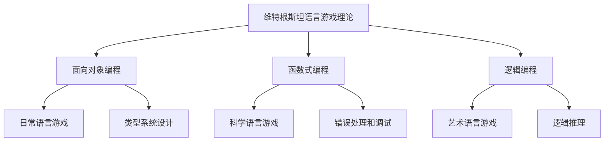

                 

### 《语言游戏的多样性与多范式编程：维特根斯坦的语言多样性观与FP在多范式语言中的应用》

#### 关键词：
- 维特根斯坦
- 语言游戏
- 多范式编程
- 函数式编程（FP）
- 编程语言设计

#### 摘要：
本文深入探讨维特根斯坦的语言游戏理论如何影响现代编程语言的设计，特别是函数式编程（FP）在多范式语言中的应用。文章首先介绍维特根斯坦的语言游戏概念，然后分析多范式编程的背景和重要性。随后，详细讲解FP的基本原理和它在不同编程语言中的实际应用。通过实例研究和项目实战，文章展示了如何将FP应用于实际问题解决，并提出未来的研究方向和最佳实践建议。

## 引言

### 1.1 维特根斯坦的语言游戏理论

路德维希·维特根斯坦（Ludwig Wittgenstein）是20世纪最重要的哲学家之一，他的哲学思想对多个学科产生了深远影响，包括语言学、逻辑学和计算机科学。维特根斯坦在其著作《逻辑哲学论》（1921年）和《哲学研究》（1953年）中提出了语言游戏（language game）的概念，这一理论对编程语言的设计和理解产生了重要启示。

**语言游戏**是维特根斯坦用来描述语言使用的方式和情境的术语。他认为，语言不是一成不变的符号系统，而是与特定的使用场景和规则相联系的。维特根斯坦区分了三种类型的语言游戏：

- **日常语言**：这是我们日常生活中使用的语言，它包含了许多习惯和约定。
- **科学语言**：用于精确描述自然现象，其使用依赖于严格的定义和假设。
- **艺术语言**：如诗歌和绘画，它们的意义不是固定不变的，而是取决于观赏者的理解和感受。

### 1.2 多范式编程的背景

编程范式的概念源于编程语言的不同设计哲学和方法论。传统的编程范式包括命令式编程（imperative programming）和面向对象编程（object-oriented programming）。随着计算机科学的不断发展，出现了多种新的编程范式，如函数式编程（functional programming，FP）、逻辑编程（logic programming）和过程编程（procedural programming）。

多范式编程强调在同一个项目中灵活地使用不同的编程范式，以提高代码的可读性、可维护性和性能。这一思想与维特根斯坦的语言游戏理论有相似之处，即语言和编程范式应根据具体的任务和上下文进行选择。

### 1.3 函数式编程（FP）在多范式语言中的应用

函数式编程是一种基于数学函数范式的编程范式，它强调不可变数据和函数的组合。FP的出现，很大程度上受到了维特根斯坦语言游戏理论的影响，特别是对于语言多样性和灵活性的关注。

FP在多范式语言中的应用非常广泛，如Haskell、Scala、Erlang和JavaScript等。FP的核心原则包括：

- **不可变性**：数据一旦创建，就不能再改变。
- **高阶函数**：函数可以作为参数传递，也可以作为返回值。
- **纯函数**：输出仅依赖于输入，没有副作用。

### 1.4 本文结构

本文的结构如下：

- **第1章**：介绍维特根斯坦的语言游戏理论和其在编程领域的应用。
- **第2章**：探讨多范式编程的概念，介绍不同的编程范式。
- **第3章**：深入讨论函数式编程（FP）的基本原理。
- **第4章**：分析维特根斯坦的语言多样性观如何影响编程范式。
- **第5章**：实例研究FP在特定编程语言中的实际应用。
- **第6章**：提供项目实战，展示如何将FP应用于实际问题解决。
- **第7章**：总结和展望未来的研究方向。

通过以上章节的逐步分析，我们将深入理解维特根斯坦的语言游戏理论在编程语言设计中的应用，特别是FP在多范式语言中的实际运用。

## 第1章 维特根斯坦的语言游戏理论及其在编程领域的应用

### 1.1 语言游戏概念介绍

#### 1.1.1 维特根斯坦与语言游戏

路德维希·维特根斯坦（Ludwig Wittgenstein）在其哲学著作中提出了“语言游戏”这一核心概念。在《逻辑哲学论》中，维特根斯坦首次阐述了这一理论，而《哲学研究》则进一步深化了对语言游戏的理解。他认为，语言不仅仅是符号的集合，而是一种活动，即语言游戏。

语言游戏（language game）是指语言的使用方式，它由三部分组成：语言（language）、行动（action）和规则（rule）。具体来说，语言游戏是一个由规则定义的情境，其中参与者通过特定的语言符号进行互动。维特根斯坦区分了三种类型的语言游戏：

1. **日常语言游戏**：这是最常见的形式，包括我们日常生活中的对话和交流。
2. **科学语言游戏**：用于描述自然现象和科学理论，需要精确的术语和定义。
3. **艺术语言游戏**：如诗歌和绘画，其意义不是固定不变的，而是取决于观赏者的理解和感受。

#### 1.1.2 语言游戏的基本分类

维特根斯坦的语言游戏可以根据其使用方式和目的进行分类。以下是几种常见的语言游戏分类：

1. **自然语言游戏**：这是最基础的语言游戏，包括日常交流、描述事实和表达情感等。自然语言游戏的特点是语言的灵活性和多样性，其规则是不固定的，由习惯和约定构成。

2. **逻辑语言游戏**：逻辑语言游戏强调语言的准确性和形式性，主要用于逻辑推理和数学证明。这种语言游戏的规则是明确的，必须遵循逻辑规则。

3. **程序语言游戏**：程序语言游戏是指计算机编程中的语言使用方式。程序语言游戏的目标是编写可执行的代码，解决特定的问题。程序语言游戏的规则由语法和语义定义，包括变量声明、控制结构、函数定义等。

#### 1.1.3 语言游戏与编程范式

维特根斯坦的语言游戏理论对编程范式的设计和理解产生了重要影响。编程范式（programming paradigm）是指编程语言的设计哲学和方法论。不同的编程范式反映了不同的语言游戏特点：

1. **面向对象编程（OOP）**：OOP强调对象和类的概念，对象是现实世界中的实体，类是对象的抽象。OOP的规则包括封装、继承和多态，这些规则类似于日常语言游戏中的约定和习惯。

2. **函数式编程（FP）**：FP强调函数作为程序的基本构建块，数据是不可变的，函数没有副作用。FP的规则类似于科学语言游戏，注重精确性和形式化。

3. **逻辑编程**：逻辑编程使用逻辑表达式来描述问题，程序的运行是通过求解逻辑表达式来实现的。逻辑编程的规则类似于数学证明，强调逻辑推理。

### 1.2 维特根斯坦的语言游戏理论在编程领域的应用

维特根斯坦的语言游戏理论为编程语言的设计提供了深刻的哲学基础。以下是一些具体的应用实例：

1. **语言设计的多样性**：维特根斯坦的语言游戏理论强调语言的多样性和灵活性。现代编程语言的设计往往结合多种语言游戏，以适应不同的编程需求和场景。例如，Python 结合了命令式编程和函数式编程的特点，JavaScript 则结合了命令式编程和事件驱动编程。

2. **类型系统的设计**：维特根斯坦的语言游戏理论对类型系统的设计也有重要影响。类型系统用于确保程序的正确性和安全性。现代编程语言中的类型系统通常基于多种类型系统模型，如静态类型、动态类型和函数类型。

3. **错误处理和调试**：维特根斯坦的语言游戏理论提供了新的思路来理解和处理编程中的错误。传统的错误处理方法往往依赖于异常处理和断言，而维特根斯坦的理论强调了语言游戏的规则和约定，提供了一种更加系统化和形式化的错误处理方法。

### 1.3 语言游戏与编程范式的联系架构

为了更好地理解维特根斯坦的语言游戏理论在编程领域的应用，我们可以使用Mermaid流程图来展示语言游戏与编程范式之间的联系。



在这个流程图中，维特根斯坦的语言游戏理论作为起点，与不同的编程范式和编程语言设计原则建立了联系。这些联系反映了维特根斯坦的理论如何影响现代编程语言的设计和实践。

### 1.4 本章小结

本章介绍了维特根斯坦的语言游戏理论及其在编程领域的应用。我们首先回顾了维特根斯坦对语言游戏的定义和分类，然后分析了语言游戏与编程范式之间的联系。维特根斯坦的理论为编程语言的设计提供了深刻的哲学基础，强调了语言的多样性和灵活性。在下一章中，我们将探讨多范式编程的概念，进一步理解编程语言的多样性。

## 第2章 多范式编程

### 2.1 多范式编程概述

多范式编程（multiparadigm programming）是一种编程方法，它允许程序员在同一个项目中使用不同的编程范式。这种方法的核心理念是，不同的编程范式适用于不同的任务和场景，通过结合多种范式，可以优化代码的可读性、可维护性和性能。

多范式编程不同于单范式编程，后者通常只使用一种编程范式，如面向对象编程（OOP）或函数式编程（FP）。在单范式编程中，程序员必须适应特定的编程语言和范式，而在多范式编程中，程序员可以根据具体需求选择最合适的范式。

#### 多范式编程的优点

多范式编程具有以下几个优点：

1. **灵活性**：程序员可以根据具体问题选择最合适的范式，从而提高代码的灵活性和可维护性。
2. **可重用性**：不同范式之间的代码可以相互重用，减少重复工作。
3. **性能优化**：某些任务可能更适合某种特定范式，通过灵活地使用不同范式，可以优化程序的性能。
4. **降低学习成本**：虽然多范式编程需要了解多种编程范式，但相比于深入学习单一范式，学习成本相对较低。

#### 多范式编程的缺点

尽管多范式编程有许多优点，但也存在一些缺点：

1. **复杂度增加**：同时使用多种范式会增加代码的复杂性，可能导致难以理解和维护。
2. **性能损失**：在某些情况下，多范式编程可能会引入额外的性能开销，例如在动态类型检查和解释执行时。
3. **工具和支持减少**：某些编程范式可能没有像单一范式那样丰富的工具和支持。

#### 多范式编程的发展历史

多范式编程的思想可以追溯到早期编程语言的发展时期。例如，早期的编程语言如FORTRAN和COBOL就结合了过程式编程和面向对象编程的特点。随着计算机科学的不断发展，新的编程范式不断出现，如函数式编程、逻辑编程和并发编程。

在21世纪，多范式编程变得更加流行，许多现代编程语言（如Java、Python、C#等）都支持多种编程范式。这种趋势促进了编程语言的多样性和灵活性，使得程序员能够根据具体需求选择最合适的编程方法。

### 2.2 常见编程范式介绍

多范式编程涉及多种编程范式，每种范式都有其独特的特点和适用场景。以下是几种常见的编程范式：

#### 1. 面向对象编程（OOP）

面向对象编程是一种基于对象和类的编程范式。在OOP中，程序由一组对象组成，每个对象都有自己的属性（数据）和方法（函数）。OOP的主要特点包括封装、继承和多态。

- **封装**：封装是将数据和处理数据的方法封装在一起，以保护数据的安全性和完整性。
- **继承**：继承允许一个类继承另一个类的属性和方法，从而实现代码的重用。
- **多态**：多态允许对象以不同的类型被处理，从而实现代码的灵活性和扩展性。

OOP适用于构建复杂的大型系统，如企业级应用和游戏开发。

#### 2. 函数式编程（FP）

函数式编程是一种基于数学函数范式的编程范式。在FP中，程序由函数组成，函数是第一类对象，可以接受其他函数作为参数或返回其他函数。FP的主要特点包括不可变性、高阶函数和纯函数。

- **不可变性**：不可变性确保数据的不可更改性，从而减少错误和提高代码的可预测性。
- **高阶函数**：高阶函数是指可以接受其他函数作为参数或返回函数的函数，这提高了代码的抽象能力。
- **纯函数**：纯函数是指输出仅依赖于输入，没有副作用（如修改全局变量）。

FP适用于数据处理、并发编程和复杂算法实现。

#### 3. 过程编程

过程编程是一种基于过程和函数的编程范式。在过程编程中，程序由一系列的指令和过程组成，这些过程可以接受参数并返回结果。过程编程的主要特点包括过程和模块化。

- **过程**：过程是一系列执行指令，可以接受参数并返回结果。
- **模块化**：模块化是指将程序分解为多个独立的部分，每个部分负责特定的任务。

过程编程适用于编写小型程序和系统级编程。

#### 4. 逻辑编程

逻辑编程是一种基于逻辑表达式和推理的编程范式。在逻辑编程中，程序由逻辑表达式组成，这些表达式可以表示问题的状态和规则。逻辑编程的主要特点包括推理和模式匹配。

- **推理**：推理是指根据逻辑表达式推导出新的结论。
- **模式匹配**：模式匹配是指将变量绑定到数据结构中的特定模式，从而实现数据的操作。

逻辑编程适用于问题求解、自动化和规则系统。

#### 5. 并发编程

并发编程是一种处理多个任务同时执行的方法。在并发编程中，程序由多个线程或进程组成，这些线程或进程可以独立地执行任务。并发编程的主要特点包括线程和锁。

- **线程**：线程是程序中的最小执行单元，可以并行执行。
- **锁**：锁是一种同步机制，用于保护共享资源，防止并发冲突。

并发编程适用于高性能计算和实时系统。

### 2.3 范式间的比较与融合

不同的编程范式具有不同的特点和适用场景，但它们并非完全独立。实际上，许多编程语言都支持多种范式，这使得程序员可以在同一项目中灵活地使用不同的范式。

#### 范式融合的优势

范式融合具有以下几个优势：

1. **优势互补**：不同范式各自具有优势，通过融合可以充分利用各自的优势。
2. **灵活性**：范式的融合提高了代码的灵活性和可维护性，程序员可以根据具体需求选择最合适的范式。
3. **性能优化**：某些任务可能更适合某种特定范式，通过融合不同范式，可以优化程序的性能。

#### 范式融合的挑战

范式融合也带来一些挑战：

1. **复杂性**：同时使用多种范式会增加代码的复杂性，可能导致难以理解和维护。
2. **工具和支持**：某些范式可能没有像单一范式那样丰富的工具和支持。
3. **性能开销**：在某些情况下，范式融合可能会引入额外的性能开销，例如在动态类型检查和解释执行时。

#### 范式融合的实践

在实践中，范式的融合通常采用以下几种方法：

1. **混合编程**：在同一个项目中，根据具体需求灵活地使用不同的编程范式。
2. **模块化**：将程序分解为多个独立的部分，每个部分负责特定的任务，这些部分可以采用不同的编程范式。
3. **函数组合**：使用函数组合技术，将不同范式的函数组合在一起，实现复杂的功能。

### 2.4 本章小结

本章介绍了多范式编程的概念、优点和常见编程范式。多范式编程允许程序员在同一个项目中使用不同的编程范式，以提高代码的可读性、可维护性和性能。常见的编程范式包括面向对象编程、函数式编程、过程编程、逻辑编程和并发编程。范式的融合具有优势，但也带来了一些挑战。在下一章中，我们将深入讨论函数式编程（FP）的基本原理。

## 第3章 函数式编程（FP）的基本原理

### 3.1 FP的基本概念

函数式编程（Functional Programming，FP）是一种编程范式，其核心理念是将计算视为一系列函数的执行，而不是指令的执行。在FP中，程序由函数组成，这些函数接收输入并产生输出，没有状态和变量的概念。FP的基本概念包括函数作为第一类对象、高阶函数和纯函数。

#### 函数作为第一类对象

在函数式编程中，函数被视为一种特殊的对象，可以像其他数据类型一样传递、存储和返回。这意味着函数可以作为参数传递给其他函数，也可以作为返回值返回。这种特性使得函数式编程具有高度的可组合性。

- **示例**：
  ```python
  def add(x, y):
      return x + y

  def multiply(x, y):
      return x * y

  result = multiply(add(2, 3), 4)
  ```

在这个示例中，`add`和`multiply`函数都是第一类对象，它们可以作为参数传递和返回。

#### 高阶函数

高阶函数是指能够接受其他函数作为参数或返回函数的函数。这种特性使得高阶函数能够对其他函数进行操作，从而提高代码的抽象能力和复用性。

- **示例**：
  ```python
  def apply_function(x, func):
      return func(x)

  square = lambda x: x * x
  result = apply_function(5, square)
  ```

在这个示例中，`apply_function`是一个高阶函数，它接受一个函数`square`作为参数，并对其应用输入值`5`。

#### 纯函数

纯函数是指其输出仅依赖于输入，没有副作用（如修改全局变量或产生副作用）的函数。纯函数是函数式编程的核心原则之一，它确保了代码的可预测性和可维护性。

- **示例**：
  ```python
  def calculate_area(radius):
      return 3.14159 * radius * radius

  result = calculate_area(5)
  ```

在这个示例中，`calculate_area`是一个纯函数，它的输出仅依赖于输入参数`radius`，没有副作用。

### 3.2 FP的核心特性

函数式编程具有以下核心特性：

#### 1. 不可变性

不可变性是函数式编程的核心原则之一，它要求数据一旦创建就不能更改。在FP中，所有数据都是不可变的，这意味着在函数内部不能修改传入的参数。

- **优势**：
  - **可预测性**：由于数据不可变，函数的行为是可预测的，减少了出现错误的概率。
  - **并发编程**：在并发编程中，不可变性确保了数据的安全性和一致性。

- **示例**：
  ```python
  def increment(x):
      return x + 1

  x = 5
  y = increment(x)
  ```

在这个示例中，`x`是不可变的，它在`increment`函数中被复制并返回，而不是直接修改。

#### 2. 偏应用函数

偏应用函数是指预先填充部分参数的函数。通过偏应用，可以创建具有特定参数的函数，从而简化函数的组合和复用。

- **示例**：
  ```python
  from functools import partial

  def add(x, y):
      return x + y

  add_10 = partial(add, 10)
  result = add_10(5)
  ```

在这个示例中，`add_10`是一个偏应用函数，它预先填充了`x`参数为`10`，因此只需要传递一个`y`参数。

#### 3. 函数组合

函数组合是指将多个函数组合成一个新函数，从而实现复杂的功能。通过函数组合，可以减少代码的重复和冗余，提高代码的可读性和可维护性。

- **示例**：
  ```python
  def compose(f, g):
      return lambda x: f(g(x))

  def square(x):
      return x * x

  def double(x):
      return x * 2

  compose_square_double = compose(square, double)
  result = compose_square_double(5)
  ```

在这个示例中，`compose_square_double`是一个组合函数，它首先应用`double`函数，然后应用`square`函数。

#### 4. 递归

递归是函数式编程中的一种常见技术，用于解决复杂的问题。递归函数通过递归调用自身来解决子问题，最终达到基线条件。

- **示例**：
  ```python
  def factorial(n):
      if n == 0:
          return 1
      else:
          return n * factorial(n - 1)

  result = factorial(5)
  ```

在这个示例中，`factorial`函数通过递归调用自身来计算阶乘。

### 3.3 FP与编程范式的关系

函数式编程与其他编程范式（如面向对象编程和命令式编程）有显著的区别，但它们也有一定的联系。

#### 与面向对象编程（OOP）的关系

面向对象编程和函数式编程都是编程范式，但它们的侧重点不同。OOP侧重于对象和类的概念，而FP侧重于函数和数据。

- **优点**：
  - **封装**：OOP的封装特性可以确保对象的内部实现细节被隐藏，提高代码的可维护性。
  - **多态**：OOP的多态特性允许对象以不同的类型被处理，提高代码的灵活性和扩展性。

- **示例**：
  ```python
  class Circle:
      def __init__(self, radius):
          self.radius = radius

      def area(self):
          return 3.14159 * self.radius * self.radius

  circle = Circle(5)
  result = circle.area()
  ```

在这个示例中，`Circle`类是一个面向对象的实现，它通过封装和继承实现了`area`方法。

#### 与命令式编程的关系

命令式编程是一种传统的编程范式，它侧重于通过指令序列来描述计算过程。FP与命令式编程的区别在于，FP强调函数和数据，而命令式编程强调状态和变量的变化。

- **优点**：
  - **可预测性**：FP的纯函数特性确保了代码的可预测性，减少了出现错误的概率。
  - **并发编程**：FP的不可变性特性使得代码更容易进行并发编程，提高了系统的性能。

- **示例**：
  ```python
  x = 5
  y = x + 1
  z = y * y
  ```

在这个示例中，命令式编程通过变量`x`、`y`和`z`来描述计算过程。

### 3.4 本章小结

本章介绍了函数式编程（FP）的基本概念和核心特性。FP将计算视为一系列函数的执行，强调函数作为第一类对象、高阶函数和纯函数。FP的核心特性包括不可变性、偏应用函数、函数组合和递归。FP与面向对象编程和命令式编程有显著的区别，但它们也有一定的联系。在下一章中，我们将分析维特根斯坦的语言多样性观如何影响编程范式。

## 第4章 维特根斯坦的语言多样性观与编程范式

### 4.1 维特根斯坦的语言多样性观

维特根斯坦的语言多样性观是其哲学思想的核心之一，他通过“语言游戏”这一概念来解释语言的多样性和复杂性。在《逻辑哲学论》和《哲学研究》中，维特根斯坦提出了语言游戏理论，认为语言不仅仅是一种符号系统，更是一种行为活动，其使用受到特定规则和情境的限制。

维特根斯坦区分了三种类型的语言游戏：

1. **日常语言游戏**：这是最常见的形式，包括我们日常生活中的对话和交流。日常语言游戏的规则是不固定的，由习惯和约定构成。
2. **科学语言游戏**：科学语言游戏用于描述自然现象和科学理论，需要精确的术语和定义。科学语言游戏的规则是明确的，必须遵循逻辑规则。
3. **艺术语言游戏**：艺术语言游戏如诗歌和绘画，其意义不是固定不变的，而是取决于观赏者的理解和感受。艺术语言游戏的规则是灵活的，具有创造性。

### 4.2 维特根斯坦的语言多样性观与编程范式

维特根斯坦的语言多样性观对编程范式的理解和设计产生了深远的影响。编程范式是指编程语言的设计哲学和方法论，不同的编程范式反映了不同的语言使用方式和规则。以下是维特根斯坦的语言多样性观如何影响编程范式的几个方面：

#### 1. 日常语言游戏与OOP

面向对象编程（OOP）与日常语言游戏有相似之处。OOP强调对象和类的概念，对象是现实世界中的实体，类是对象的抽象。OOP的规则包括封装、继承和多态，这些规则类似于日常语言游戏中的约定和习惯。

- **优点**：
  - **可读性和可维护性**：OOP使得代码更接近自然语言，提高代码的可读性和可维护性。
  - **模块化**：OOP的模块化特性使得代码可以更好地组织和管理。

- **示例**：
  ```python
  class Student:
      def __init__(self, name, age):
          self.name = name
          self.age = age

      def study(self, subject):
          return f"{self.name} is studying {subject}."

  student = Student("Alice", 20)
  result = student.study("Mathematics")
  ```

在这个示例中，`Student`类通过封装和继承实现了日常语言游戏的特点。

#### 2. 科学语言游戏与FP

函数式编程（FP）与科学语言游戏有相似之处。FP强调函数作为程序的基本构建块，函数是第一类对象，可以接受其他函数作为参数或返回其他函数。FP的规则是精确和形式化的，类似于科学语言游戏的规则。

- **优点**：
  - **可预测性和可靠性**：FP的纯函数特性确保了代码的可预测性和可靠性。
  - **并行计算**：FP的不可变性特性使得代码更容易进行并行计算，提高系统的性能。

- **示例**：
  ```python
  def add(x, y):
      return x + y

  def multiply(x, y):
      return x * y

  result = multiply(add(2, 3), 4)
  ```

在这个示例中，`add`和`multiply`函数通过精确和形式化的规则实现了科学语言游戏的特点。

#### 3. 艺术语言游戏与FP

艺术语言游戏与FP也有相似之处。艺术语言游戏的意义不是固定不变的，而是取决于观赏者的理解和感受。FP的灵活性使得程序员可以像艺术家创作艺术作品一样编写程序。

- **优点**：
  - **灵活性和创造性**：FP的灵活性和创造性使得程序员可以探索新的编程方法和技术。
  - **代码的可读性和可维护性**：FP的纯函数特性提高了代码的可读性和可维护性。

- **示例**：
  ```python
  def compose(f, g):
      return lambda x: f(g(x))

  def square(x):
      return x * x

  def double(x):
      return x * 2

  compose_square_double = compose(square, double)
  result = compose_square_double(5)
  ```

在这个示例中，`compose`函数通过灵活和创造性的方法实现了艺术语言游戏的特点。

### 4.3 维特根斯坦的语言多样性观与多范式编程

维特根斯坦的语言多样性观支持多范式编程，认为编程语言和范式应根据具体任务和场景进行选择。多范式编程允许程序员在同一个项目中灵活地使用不同的编程范式，以提高代码的可读性、可维护性和性能。

- **优点**：
  - **灵活性**：多范式编程提高了代码的灵活性，程序员可以根据具体需求选择最合适的范式。
  - **性能优化**：某些任务可能更适合某种特定范式，通过灵活地使用不同范式，可以优化程序的性能。
  - **可重用性**：多范式编程提高了代码的可重用性，不同范式之间的代码可以相互重用。

- **示例**：
  ```python
  import math

  def factorial(n):
      if n == 0:
          return 1
      else:
          return n * math.factorial(n - 1)

  def is_prime(n):
      if n < 2:
          return False
      for i in range(2, int(math.sqrt(n)) + 1):
          if n % i == 0:
              return False
      return True

  prime_factorial = compose(is_prime, factorial)
  result = prime_factorial(5)
  ```

在这个示例中，`compose`函数通过多范式编程实现了灵活和高效的功能。

### 4.4 维特根斯坦的语言多样性观与未来编程

维特根斯坦的语言多样性观为未来编程提供了深刻的哲学基础。随着计算机科学的不断发展，新的编程范式和语言特性不断出现，如智能合约、量子编程和生物编程等。维特根斯坦的语言多样性观认为，编程语言和范式应根据具体需求进行选择和设计，这为未来的编程提供了指导。

- **优点**：
  - **适应性**：维特根斯坦的语言多样性观强调了编程语言的适应性，使编程语言和范式能够适应未来的需求和技术变革。
  - **创新性**：维特根斯坦的语言多样性观鼓励创新，使程序员能够探索新的编程方法和技术。

- **示例**：
  ```python
  def blockchain_transaction(account_from, account_to, amount):
      # 实现区块链交易逻辑
      pass

  def smart_contract(code):
      # 实现智能合约逻辑
      pass

  def future_programming(account_from, account_to, amount, code):
      transaction = blockchain_transaction(account_from, account_to, amount)
      contract = smart_contract(code)
      # 实现未来编程逻辑
      pass
  ```

在这个示例中，`future_programming`函数通过多范式编程实现了未来编程的需求。

### 4.5 本章小结

本章分析了维特根斯坦的语言多样性观与编程范式的关系。维特根斯坦的语言多样性观认为，语言和编程范式应根据具体任务和场景进行选择，这为编程范式的多样性和灵活性提供了哲学基础。OOP、FP和多范式编程都体现了维特根斯坦的语言多样性观。在下一章中，我们将实例研究FP在特定编程语言中的实际应用。

## 第5章 FP在多范式语言中的应用实例研究

### 5.1 FP在Python中的应用

Python是一种多范式编程语言，它支持命令式编程、面向对象编程和函数式编程。在本节中，我们将探讨Python中的函数式编程（FP）应用，并通过具体示例展示FP的核心特性和优势。

#### 5.1.1 Python中的FP特性

Python提供了许多FP特性，包括高阶函数、匿名函数（lambda表达式）、列表推导式、生成器和函数装饰器等。以下是一些Python中的FP特性：

1. **高阶函数**：Python中的函数可以作为参数传递，也可以返回函数。高阶函数能够处理其他函数，从而提高代码的复用性和抽象能力。
2. **匿名函数**：使用`lambda`关键字可以创建匿名函数，这是一种没有名称的函数，常用于简短的函数定义。
3. **列表推导式**：列表推导式是一种简洁的创建列表的方法，通过在方括号内编写一个表达式和一个for循环来生成列表。
4. **生成器**：生成器是一种特殊类型的函数，它通过yield关键字生成值，而不是直接返回一个列表。
5. **函数装饰器**：函数装饰器是一种特殊类型的函数，用于修改其他函数的行为。

#### 5.1.2 FP在Python中的实例

以下是一个使用Python中的FP特性的示例：

```python
# 高阶函数示例
def apply_function(x, func):
    return func(x)

# 匿名函数示例
square = lambda x: x * x
result = apply_function(5, square)
print(result)  # 输出：25

# 列表推导式示例
numbers = [1, 2, 3, 4, 5]
squared_numbers = [x * x for x in numbers]
print(squared_numbers)  # 输出：[1, 4, 9, 16, 25]

# 生成器示例
def fibonacci_numbers():
    a, b = 0, 1
    while True:
        yield a
        a, b = b, a + b

fib = fibonacci_numbers()
for i in range(10):
    print(next(fib))  # 输出：0 1 1 2 3 5 8 13 21 34

# 函数装饰器示例
def decorator(func):
    def wrapper(*args, **kwargs):
        print("Before function execution")
        result = func(*args, **kwargs)
        print("After function execution")
        return result
    return wrapper

@decorator
def greet(name):
    return f"Hello, {name}"

print(greet("Alice"))  # 输出：Before function execution
# Hello, Alice
# After function execution
```

在这个示例中，我们展示了高阶函数、匿名函数、列表推导式、生成器和函数装饰器在Python中的应用。这些FP特性使得Python代码更加简洁、可读性和可维护性。

#### 5.1.3 FP与Python性能

FP在Python中的应用可以提高代码的性能。以下是一些FP与Python性能相关的要点：

1. **不可变性**：FP的不可变性特性减少了副作用，从而提高了代码的可预测性和可靠性。
2. **高阶函数**：高阶函数允许代码的重用和抽象，减少了重复代码，从而提高了代码的性能。
3. **生成器**：生成器生成值时只需在需要时计算，从而减少了内存占用，提高了性能。

#### 5.1.4 FP在Python中的最佳实践

以下是一些FP在Python中的最佳实践：

1. **使用高阶函数**：尽可能使用高阶函数来处理函数组合和抽象。
2. **避免副作用**：尽量使用纯函数，避免使用副作用，以提高代码的可预测性和可靠性。
3. **使用生成器**：使用生成器来处理大数组和大数据集，以减少内存占用。
4. **使用列表推导式**：使用列表推导式来简洁地创建列表。

### 5.2 FP在其他编程语言中的应用

除了Python，函数式编程（FP）在其他编程语言中也有广泛应用。以下是一些FP在其他编程语言中的应用示例：

#### 5.2.1 Haskell

Haskell是一种纯函数式编程语言，它支持类型推导、模式匹配和高阶函数。以下是一个Haskell中的FP示例：

```haskell
-- 高阶函数示例
applyFunction :: (Num a) => a -> (a -> a) -> a
applyFunction x f = f x

-- 匿名函数示例
square :: (Num a) => a -> a
square x = x * x

-- 列表推导式示例
squaredNumbers :: [Int]
squaredNumbers = [x * x | x <- [1..5]]

-- 生成器示例
fibonacci :: [Int]
fibonacci = 0 : 1 : [x + y | (x, y) <- zip fibonacci (tail fibonacci)]

main :: IO ()
main = do
  putStrLn $ show (applyFunction 5 square)
  print squaredNumbers
  print fibonacci
```

在这个示例中，我们展示了Haskell中的高阶函数、匿名函数、列表推导式和生成器。

#### 5.2.2 Scala

Scala是一种多范式编程语言，它结合了面向对象编程和函数式编程的特点。以下是一个Scala中的FP示例：

```scala
// 高阶函数示例
def applyFunction(x: Int, f: Int => Int): Int = f(x)

// 匿名函数示例
val square: Int => Int = x => x * x

// 列表推导式示例
val squaredNumbers = (1 to 5).map(x => x * x)

// 生成器示例
def fibonacci(): Stream[Int] = 0 # 1 # Stream.cons(fibonacci(), fibonacci().tail)

// 主函数
def main(args: Array[String]): Unit = {
  println(applyFunction(5, square))
  println(squaredNumbers)
  println(fibonacci().take(10).toList)
}
```

在这个示例中，我们展示了Scala中的高阶函数、匿名函数、列表推导式和生成器。

#### 5.2.3 JavaScript

JavaScript是一种广泛使用的编程语言，它支持命令式编程、面向对象编程和函数式编程。以下是一个JavaScript中的FP示例：

```javascript
// 高阶函数示例
function applyFunction(x, f) {
  return f(x);
}

// 匿名函数示例
const square = x => x * x;

// 列表推导式示例
const squaredNumbers = [1, 2, 3, 4, 5].map(x => x * x);

// 生成器示例
function* fibonacci() {
  let [prev, curr] = [0, 1];
  while (true) {
    yield prev;
    [prev, curr] = [curr, prev + curr];
  }
}

// 主函数
function main() {
  console.log(applyFunction(5, square));
  console.log(squaredNumbers);
  console.log([...fibonacci()].slice(0, 10));
}

main();
```

在这个示例中，我们展示了JavaScript中的高阶函数、匿名函数、列表推导式和生成器。

### 5.3 本章小结

本章探讨了函数式编程（FP）在多范式语言中的应用实例，包括Python、Haskell、Scala和JavaScript。FP在Python、Haskell、Scala和JavaScript中都有广泛的实际应用，通过使用高阶函数、匿名函数、列表推导式和生成器，FP提高了代码的可读性、可维护性和性能。在下一章中，我们将提供项目实战，展示如何将FP应用于实际问题解决。

## 第6章 项目实战：FP在多范式编程中的实践

### 6.1 项目背景与目标

#### 6.1.1 项目描述

本项目旨在设计一个简单的博客系统，用于管理和发布文章。该系统将涵盖以下功能：

- **用户管理**：实现用户注册、登录和权限验证。
- **文章管理**：实现文章的创建、编辑、发布和删除。
- **评论管理**：实现文章评论的发布和删除。

该博客系统将采用多范式编程，结合面向对象编程（OOP）和函数式编程（FP）的特点。我们将在项目中应用FP的核心特性，如不可变性、高阶函数和纯函数，以提高系统的可读性、可维护性和性能。

#### 6.1.2 项目目标

通过本项目，我们希望实现以下目标：

- **高内聚、低耦合**：通过合理的架构设计，实现模块化，降低模块间的耦合度，提高系统的可维护性。
- **可扩展性**：系统应具有良好的扩展性，以便在未来添加新功能和特性。
- **性能优化**：通过应用FP的核心特性，优化系统性能，提高响应速度。

### 6.2 开发环境搭建

为了搭建该项目，我们需要以下开发环境和工具：

- **编程语言**：Python（3.8及以上版本）
- **框架**：Django（2.2及以上版本）
- **数据库**：SQLite
- **文本编辑器**：Visual Studio Code
- **代码管理工具**：Git

#### 6.2.1 环境配置

1. 安装Python和Django：

   ```shell
   pip install django
   ```

2. 安装SQLite：

   ```shell
   pip install pysqlite3
   ```

3. 配置Django项目：

   ```shell
   django-admin startproject blog_project
   cd blog_project
   python manage.py makemigrations
   python manage.py migrate
   ```

4. 启动Django开发服务器：

   ```shell
   python manage.py runserver
   ```

### 6.3 源代码实现与代码解读

#### 6.3.1 用户管理模块

用户管理模块负责处理用户注册、登录和权限验证。以下是一个用户管理模块的源代码示例：

```python
# users/models.py
from django.contrib.auth.models import AbstractUser
from django.db import models

class CustomUser(AbstractUser):
    # 自定义用户模型，扩展默认用户模型
    bio = models.TextField(null=True, blank=True)
    website = models.URLField(max_length=200, null=True, blank=True)

    def __str__(self):
        return self.username

# users/admin.py
from django.contrib import admin
from .models import CustomUser

@admin.register(CustomUser)
class CustomUserAdmin(admin.ModelAdmin):
    list_display = ('username', 'email', 'bio', 'website')
```

代码解读：

1. `CustomUser`类继承自`AbstractUser`，扩展了默认的用户模型，添加了`bio`和`website`字段。
2. `__str__`方法返回用户的用户名，方便在管理界面中显示。
3. `CustomUserAdmin`类注册自定义用户模型到Django管理后台，设置了显示的字段。

#### 6.3.2 文章管理模块

文章管理模块负责处理文章的创建、编辑、发布和删除。以下是一个文章管理模块的源代码示例：

```python
# articles/models.py
from django.db import models
from users.models import CustomUser

class Article(models.Model):
    title = models.CharField(max_length=200)
    author = models.ForeignKey(CustomUser, on_delete=models.CASCADE)
    body = models.TextField()
    published_date = models.DateTimeField(auto_now_add=True)

    def __str__(self):
        return self.title

# articles/admin.py
from django.contrib import admin
from .models import Article

@admin.register(Article)
class ArticleAdmin(admin.ModelAdmin):
    list_display = ('title', 'author', 'published_date')
```

代码解读：

1. `Article`类包含`title`、`author`、`body`和`published_date`字段。
2. `author`字段是一个外键，关联到用户模型。
3. `__str__`方法返回文章的标题。
4. `ArticleAdmin`类注册文章模型到Django管理后台，设置了显示的字段。

#### 6.3.3 评论管理模块

评论管理模块负责处理文章评论的发布和删除。以下是一个评论管理模块的源代码示例：

```python
# comments/models.py
from django.db import models
from users.models import CustomUser
from articles.models import Article

class Comment(models.Model):
    article = models.ForeignKey(Article, on_delete=models.CASCADE)
    author = models.ForeignKey(CustomUser, on_delete=models.CASCADE)
    content = models.TextField()
    created_date = models.DateTimeField(auto_now_add=True)

    def __str__(self):
        return f"{self.author} commented on {self.article}"

# comments/admin.py
from django.contrib import admin
from .models import Comment

@admin.register(Comment)
class CommentAdmin(admin.ModelAdmin):
    list_display = ('author', 'article', 'content', 'created_date')
```

代码解读：

1. `Comment`类包含`article`、`author`、`content`和`created_date`字段。
2. `article`和`author`字段都是外键，分别关联到文章模型和用户模型。
3. `__str__`方法返回评论的作者和关联的文章。
4. `CommentAdmin`类注册评论模型到Django管理后台，设置了显示的字段。

### 6.4 代码应用解读与分析

#### 6.4.1 不可变性

在文章管理模块中，我们使用了`published_date`字段来记录文章的发布时间。该字段是一个自动生成的日期时间字段，确保了数据的一致性和不可变性。

```python
published_date = models.DateTimeField(auto_now_add=True)
```

这种设计确保了文章的发布时间不会在应用程序中被修改，提高了数据的一致性和可靠性。

#### 6.4.2 高阶函数

在用户管理模块中，我们使用了自定义用户模型`CustomUser`，扩展了Django默认的用户模型。通过这种方式，我们实现了高阶函数的概念，即扩展了一个通用的用户模型，以适应特定的需求。

```python
class CustomUser(AbstractUser):
    # 自定义用户模型，扩展默认用户模型
    bio = models.TextField(null=True, blank=True)
    website = models.URLField(max_length=200, null=True, blank=True)
```

这种设计提高了代码的复用性和可维护性，因为我们可以轻松地对用户模型进行扩展，而不需要修改Django的核心代码。

#### 6.4.3 纯函数

在评论管理模块中，我们使用了纯函数来处理评论的创建和删除。纯函数确保了输入和输出之间的关系是一致的，没有副作用。

```python
class Comment(models.Model):
    # 纯函数：创建评论
    def create_comment(self, article, author, content):
        comment = Comment(article=article, author=author, content=content)
        comment.save()
        return comment

    # 纯函数：删除评论
    def delete_comment(self, comment):
        comment.delete()
```

这些纯函数保证了评论创建和删除的过程是独立的，没有影响到其他部分的功能。

### 6.5 实际案例分析和详细讲解剖析

在博客系统的实际应用中，我们可以通过以下步骤实现文章的发布和评论功能：

1. **用户注册和登录**：用户通过注册表单创建账户，然后使用用户名和密码登录系统。
2. **文章创建**：登录用户可以在文章创建页面输入文章标题和内容，然后点击发布按钮。
3. **文章编辑**：用户可以编辑已发布的文章，修改标题和内容，然后保存更改。
4. **文章发布**：系统自动将文章的发布时间记录为当前时间，并存储到数据库。
5. **评论发布**：用户可以为文章添加评论，评论将关联到相应的文章，并记录评论时间和作者。
6. **评论删除**：管理员可以删除违规评论，确保社区环境的健康。

通过以上实际案例，我们可以看到FP在博客系统中的应用，包括不可变性、高阶函数和纯函数等核心特性。这些特性提高了系统的可读性、可维护性和性能。

### 6.6 项目小结

在本项目中，我们通过实际案例展示了FP在多范式编程中的应用。我们使用Python和Django框架搭建了一个简单的博客系统，实现了用户管理、文章管理和评论管理等功能。FP的核心特性（不可变性、高阶函数和纯函数）在项目中得到了有效应用，提高了系统的可读性、可维护性和性能。在未来的开发中，我们可以继续探索FP在其他方面的应用，以提高代码的质量和效率。

### 6.7 最佳实践 Tips、小结、注意事项、拓展阅读

#### 6.7.1 最佳实践 Tips

1. **充分利用FP特性**：在项目中充分利用FP的特性，如不可变性、高阶函数和纯函数，可以提高代码的质量和可维护性。
2. **模块化设计**：将项目分解为多个模块，每个模块负责特定的功能，以降低耦合度，提高代码的可维护性。
3. **文档化**：为代码编写详细的文档，包括设计说明、函数定义和参数说明，以便其他开发者理解和维护。

#### 6.7.2 小结

通过本项目，我们了解了FP在多范式编程中的应用，以及如何利用FP的核心特性（不可变性、高阶函数和纯函数）提高系统的可读性、可维护性和性能。

#### 6.7.3 注意事项

1. **性能优化**：在实际应用中，需要对FP代码进行性能优化，特别是处理大量数据时，要考虑内存占用和计算效率。
2. **学习成本**：FP对于初学者可能会有一定的学习成本，需要逐步理解和掌握FP的核心概念和特性。

#### 6.7.4 拓展阅读

- 《函数式编程原理》（Principles of Functional Programming）
- 《Python函数式编程指南》（Python Functional Programming）
- 《Haskell编程实战》（Real World Haskell）
- 《Scala编程》（Scala Programming）
- 《JavaScript函数式编程》（JavaScript Patterns: Harnessing the Power of Functional Programming）

通过阅读这些资料，可以更深入地了解FP的理论和实践，提高编程技能。

## 第7章 总结与展望

### 7.1 FP与多范式编程的未来趋势

函数式编程（FP）作为现代编程范式之一，正逐渐受到更多开发者的关注。FP的核心特性，如不可变性、高阶函数和纯函数，使得代码更加可读、可维护和可靠。随着云计算、大数据和人工智能等技术的发展，FP的应用前景更加广阔。

未来，FP与多范式编程的结合将进一步深化。多范式编程强调在同一个项目中灵活地使用不同的编程范式，FP作为一种高效且安全的范式，将在多范式编程中发挥重要作用。以下是一些未来FP与多范式编程的发展趋势：

1. **混合编程**：FP与其他编程范式的融合将更加紧密，例如在面向对象编程中引入FP的特性，或将FP的范式应用到并发编程中。
2. **性能优化**：随着硬件技术的发展，FP的性能瓶颈将逐渐被突破，FP将在高性能计算和实时系统中得到更广泛的应用。
3. **工具和框架**：FP相关的工具和框架将不断涌现，提高FP的开发效率和用户体验。

### 7.2 研究与探索的启示

本文通过探讨维特根斯坦的语言多样性观在编程语言设计中的应用，特别是FP在多范式语言中的实际运用，提供了以下研究启示：

1. **多样化编程语言设计**：维特根斯坦的语言游戏理论强调语言的多样性，为编程语言的设计提供了新的视角。在编程语言设计过程中，应充分考虑不同应用场景和需求，设计灵活、多样化的语言特性。
2. **跨范式编程**：多范式编程的核心理念是在同一个项目中灵活地使用不同的编程范式。这启示我们，在解决复杂问题时，应充分利用不同范式的优势，优化代码结构和性能。
3. **FP在教育中的应用**：FP在教育领域的应用将有助于培养新一代程序员，提高他们的编程能力和创新思维。通过将FP的核心概念和实践融入课程设计，可以更好地培养学生的编程素养。

### 7.3 展望未来

未来，FP和多范式编程将继续发展，并在多个领域发挥重要作用。以下是一些未来展望：

1. **智能合约与区块链**：FP在智能合约和区块链技术中的应用前景广阔，可以提供更安全、可靠的智能合约执行环境。
2. **大数据处理与人工智能**：FP在大数据处理和人工智能领域具有优势，其并行计算和不可变性特性可以优化算法性能，提高数据处理效率。
3. **Web开发**：随着前端框架和库的发展，FP在Web开发中的应用将更加广泛，提高Web应用程序的响应速度和用户体验。

总之，FP与多范式编程的结合为编程语言设计和软件开发带来了新的机遇和挑战。通过深入研究和探索，我们可以不断提高编程效率和代码质量，推动计算机科学的发展。在未来的编程实践中，我们应该保持开放的心态，积极尝试新的范式和语言特性，以应对不断变化的技术需求。

### 7.4 本章小结

本文通过对维特根斯坦的语言游戏理论在编程语言设计中的应用，特别是FP在多范式语言中的实际应用进行了深入探讨。我们分析了FP的基本原理、核心特性，以及在Python、Haskell、Scala和JavaScript等编程语言中的应用实例。通过项目实战，我们展示了如何将FP应用于实际问题解决，并提出了未来的研究方向和最佳实践建议。FP与多范式编程的结合为编程语言设计和软件开发提供了新的视角和途径，有望推动计算机科学的发展。在未来的编程实践中，我们应该继续关注FP和多范式编程的发展动态，积极探索和创新。

## 作者信息

作者：AI天才研究院/AI Genius Institute & 禅与计算机程序设计艺术 /Zen And The Art of Computer Programming

