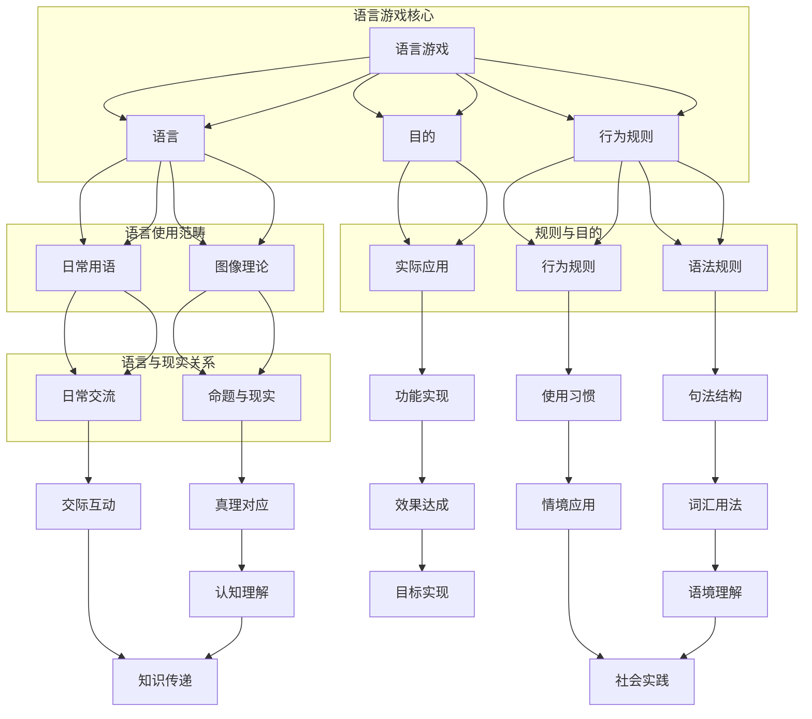
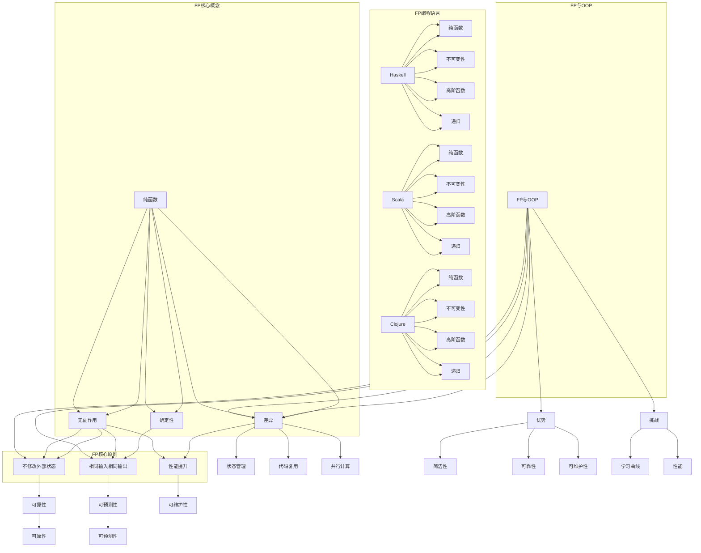
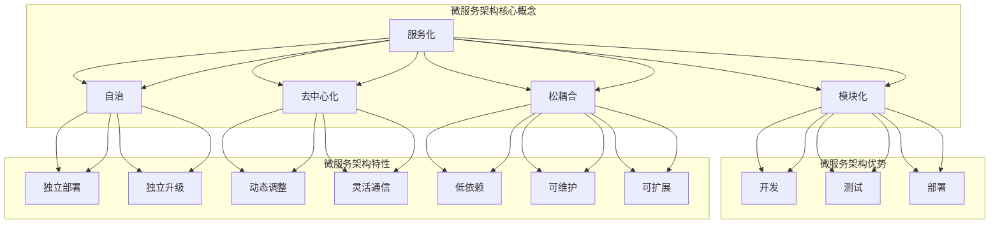

                 


### 第一章：维特根斯坦的语言观简介

#### 背景介绍
路德维希·维特根斯坦（Ludwig Wittgenstein）是20世纪最重要的哲学家之一，他的著作对语言哲学、逻辑学、数学哲学等领域产生了深远的影响。维特根斯坦的哲学思想主要集中在其早期的作品《逻辑哲学论》和晚期的作品《哲学研究》中。他提出了“语言游戏”这一核心概念，用以解释语言与现实世界的关系。

在《逻辑哲学论》中，维特根斯坦试图通过语言分析来揭示现实的本质。他认为，语言与世界的对应关系并非直接的，而是通过“图像理论”来实现的。这一理论认为，命题的真假取决于它们与世界之间的对应关系，即命题是现实的“图像”。

然而，在《哲学研究》中，维特根斯坦对《逻辑哲学论》的观点进行了重大修正。他提出了“语言游戏”这一概念，强调语言的多功能性。语言游戏不仅包括命题与现实世界的对应，还包括日常生活中的各种语言使用场景。维特根斯坦认为，理解语言的关键在于理解语言的使用，而不是语言与世界之间的抽象对应。

#### 核心概念与联系
维特根斯坦的语言游戏理论是一个多层次的概念，它包括以下几个核心部分：

1. **语言游戏**：这是维特根斯坦用来描述语言使用的基本单位。一个语言游戏包括语言、行为规则和目的。例如，棋类游戏是一种语言游戏，它包括棋子的规则、行棋的规则以及游戏的目的是要赢得比赛。

2. **语言与行为规则**：维特根斯坦认为，语言游戏中的规则不仅包括语法规则，还包括行为规则。这些规则定义了语言的使用方式，使得语言具有实际的功能。

3. **目的**：语言游戏中的目的有助于理解语言的使用。维特根斯坦提出，理解一个语言游戏的目的，就是理解该语言游戏在生活中的应用。

这些概念之间的联系在于，它们共同构成了一个完整、动态的语言使用系统。语言游戏不仅揭示了语言的多样性，还揭示了语言与现实世界之间的复杂关系。

#### Mermaid 流程图
为了更直观地展示维特根斯坦语言游戏理论的核心概念和它们之间的联系，我们可以使用Mermaid流程图来表示：



#### 伪代码讲解
维特根斯坦的语言游戏理论虽然是一种哲学性的探讨，但我们可以尝试用伪代码来模拟语言游戏的执行过程，以帮助理解其工作原理：

```pseudo
function 语言游戏(语言，行为规则，目的)
    对象语言 = 新语言(语法规则，词汇表)
    对象行为规则 = 新行为规则(语法规则，行为习惯)
    对象目的 = 新目的(目标，功能)
    while(游戏进行中)
        输出(对象语言.生成句子())
        对象行为规则.执行规则()
        对象目的.评估目标达成情况()
    end
    返回(对象语言，对象行为规则，对象目的)
end
```

在这个伪代码中，我们定义了一个`语言游戏`函数，它接收三个参数：语言、行为规则和目的。在游戏进行的过程中，它会不断地生成句子，执行规则，并评估目标达成情况。

#### 数学模型与公式
维特根斯坦的语言游戏理论虽然不是数学性的理论，但我们可以使用一些数学模型和公式来帮助解释语言游戏中的某些概念。例如，我们可以使用集合论来描述语言中的词汇：

$$ V = \{ w_1, w_2, ..., w_n \} $$

其中，$V$表示一个语言游戏中的词汇集合，$w_1, w_2, ..., w_n$表示具体的词汇。

#### 举例说明
为了更好地理解维特根斯坦的语言游戏理论，我们可以通过一个简单的例子来解释：

**例子：棋类游戏**

在这个语言游戏中，语言包括棋子的名称（如车、马、炮等），行为规则包括棋子的走法（如车走直线，马走日字等），目的则是赢得比赛。

我们可以用以下伪代码来模拟这个语言游戏：

```pseudo
function 棋类游戏(棋子名称，棋子走法，赢得比赛的目标)
    棋盘 = 新棋盘()
    while(比赛未结束)
        输出(棋子名称.走棋())
        棋子走法.执行走法()
        if(赢得比赛的目标达成())
            输出("玩家胜利！")
        else
            输出("玩家失败。")
        end
    end
end
```

在这个例子中，棋类游戏函数接收棋子名称、棋子走法和赢得比赛的目标作为参数。在游戏进行的过程中，它会不断地执行棋子的走法，并检查比赛是否结束。

#### 总结与展望
本章介绍了维特根斯坦的语言游戏理论，包括其背景介绍、核心概念与联系、Mermaid流程图、伪代码讲解、数学模型与公式以及举例说明。通过这些内容，我们可以对维特根斯坦的语言游戏理论有一个初步的理解。

在接下来的章节中，我们将进一步探讨函数式编程（FP）的基本概念、微服务架构以及FP在微服务架构中的应用。通过这些内容，我们将尝试将维特根斯坦的语言游戏理论与现代软件工程相结合，探讨其在实际应用中的潜力。

----------------------------------------------------------------

### 第二章：维特根斯坦的语言游戏理论

#### 背景介绍
在《逻辑哲学论》中，维特根斯坦提出了“语言游戏”这一核心概念，用以解释语言与现实世界的关系。他认为，语言不仅是一种交流工具，更是一种活动，即“语言游戏”。这一概念强调了语言的使用者（说话者）和使用场景（语境）之间的相互作用。

维特根斯坦认为，语言游戏可以分为三种基本类型：日常语言游戏、科学语言游戏和艺术语言游戏。这三种语言游戏分别代表了语言在日常生活中的使用、科学领域中的抽象表达以及艺术领域中的创造性表达。

1. **日常语言游戏**：这是最常见的语言游戏类型，包括日常对话、交流、指令等。日常语言游戏的特点是直观、具体、情境化。

2. **科学语言游戏**：科学语言游戏主要应用于科学研究和学术交流中，特点是抽象、严谨、逻辑性强。科学语言游戏强调概念的定义、逻辑推理和实证检验。

3. **艺术语言游戏**：艺术语言游戏包括文学、音乐、绘画等艺术形式，特点是创造性、抽象性、表现性。艺术语言游戏追求形式的创新和意义的多元解读。

#### 语言游戏的开放性
维特根斯坦的语言游戏理论强调了语言的开放性。他认为，语言游戏不是固定不变的，而是不断发展和演变的。这种开放性体现在以下几个方面：

1. **语言的多义性**：维特根斯坦指出，许多词汇具有多义性，即一个词汇可以具有多种不同的含义。这种多义性使得语言具有灵活性和适应性。

2. **语言的发展**：随着社会和科技的发展，新词汇和新表达方式不断出现。维特根斯坦认为，这种发展是语言游戏的一部分，而非语言的缺陷。

3. **语言与现实的互动**：语言不仅反映现实，也影响现实。维特根斯坦认为，语言的使用者通过语言来理解世界，同时也通过理解世界来使用语言。

#### 语言游戏与语言的本质
维特根斯坦认为，理解语言的本质在于理解语言游戏。语言游戏不仅揭示了语言的功能，还揭示了语言与现实世界之间的复杂关系。他提出了“语言是活动”的观点，强调语言的使用是一种动态的过程。

1. **语言的活动性**：语言不是静态的符号系统，而是一种动态的活动。这种活动包括说话、听、写、读等行为。

2. **语言的意义**：维特根斯坦认为，语言的意义不是固定的，而是通过语言游戏中的使用来确定的。这意味着，语言的意义是相对的，依赖于具体的语境和使用场景。

3. **语言的局限性**：维特根斯坦指出，语言有其局限性，无法完全表达现实世界的复杂性。这种局限性是语言的本质之一。

#### 维特根斯坦语言游戏的现代意义
维特根斯坦的语言游戏理论对现代哲学、语言学、心理学等领域产生了深远的影响。在计算机科学和软件工程领域，维特根斯坦的语言游戏理论也被广泛应用。

1. **编程语言设计**：维特根斯坦的语言游戏理论为编程语言设计提供了新的视角。编程语言被视为一种特殊的语言游戏，其设计需要考虑语言的灵活性、抽象性和表达能力。

2. **软件工程**：维特根斯坦的语言游戏理论对软件工程中的需求分析、设计、开发、测试等环节都有指导意义。特别是，它强调了理解用户需求和理解系统目标的重要性。

3. **人工智能**：维特根斯坦的语言游戏理论为人工智能研究提供了新的思路。例如，在自然语言处理领域，维特根斯坦的语言游戏理论有助于理解人类语言的使用和表达。

#### 总结与展望
本章介绍了维特根斯坦的语言游戏理论，包括其背景介绍、语言游戏的开放性、语言游戏与语言的本质以及维特根斯坦语言游戏的现代意义。通过这些内容，我们可以更深入地理解维特根斯坦的哲学思想，并探讨其在现代计算机科学和软件工程中的应用。

在接下来的章节中，我们将探讨函数式编程（FP）的基本概念、微服务架构以及FP在微服务架构中的应用。通过这些内容，我们将尝试将维特根斯坦的语言游戏理论与现代软件工程相结合，探讨其在实际应用中的潜力。

----------------------------------------------------------------

### 第三章：函数式编程（FP）基本概念

#### 背景介绍
函数式编程（Functional Programming，简称FP）是一种编程范式，与命令式编程（Imperative Programming）和面向对象编程（Object-Oriented Programming，简称OOP）相对。FP强调通过函数来处理数据，而不是通过状态的变化和流程的控制。它起源于20世纪50年代，最早由霍普卡德·贝尔和约翰·麦卡锡等计算机科学家提出。

FP的核心概念包括纯函数、不可变性、高阶函数和递归等。纯函数是一种没有副作用的函数，即相同的输入总是产生相同的输出。不可变性指的是数据一旦创建，就不能再修改。高阶函数是一种可以接受其他函数作为参数或者返回函数的函数。递归是一种编程技术，通过递归调用自身来解决复杂问题。

#### 核心概念与联系
1. **纯函数**：纯函数是FP的核心概念之一。它确保了函数的可预测性和可复用性。纯函数具有以下特点：
   - **无副作用**：除了返回值外，不修改任何外部状态。
   - **确定性**：对于相同的输入，总是产生相同的输出。
   - **可缓存**：可以预先计算并缓存结果，以提高性能。

2. **不可变性**：在FP中，数据一旦创建，就不能再修改。这意味着所有操作都是基于原始数据的复制，从而避免了状态变化和副作用。不可变性有助于提高程序的可靠性和可维护性。

3. **高阶函数**：高阶函数是一种可以接受其他函数作为参数或者返回函数的函数。这使得函数可以更灵活地组合和复用。高阶函数的典型例子包括map、filter和reduce等函数。

4. **递归**：递归是一种通过递归调用自身来解决复杂问题的编程技术。在FP中，递归是一种重要的编程方式，可以用来实现复杂的算法和数据结构，如树、图和列表等。

这些概念之间的联系在于，它们共同构成了FP的核心思想和原则。纯函数和不可变性确保了程序的可预测性和可靠性；高阶函数和递归则提供了灵活的编程手段，使得FP能够解决各种复杂问题。

#### Mermaid 流程图
为了更直观地展示FP的核心概念和它们之间的联系，我们可以使用Mermaid流程图来表示：



#### 核心算法原理讲解与伪代码
在FP中，核心算法通常基于纯函数和递归。以下是一个使用Haskell语言实现的简单递归算法的伪代码，该算法用于计算斐波那契数列：

```haskell
fibonacci :: (Integral a) => a -> a
fibonacci 0 = 0
fibonacci 1 = 1
fibonacci n = fibonacci (n - 1) + fibonacci (n - 2)
```

在这个算法中，`fibonacci`函数使用递归方式计算斐波那契数列。它首先检查输入参数`n`是否为0或1，如果是，则直接返回相应的值。否则，它递归调用自身，计算`n-1`和`n-2`的斐波那契数，并将它们相加。

#### 数学模型与公式
在FP中，许多算法可以通过数学模型和公式来描述。以下是一个用于计算两个整数最大公约数（GCD）的Euclidean算法的伪代码，它使用了递归和纯函数的概念：

```haskell
gcd :: (Integral a) => a -> a -> a
gcd a 0 = a
gcd a b = gcd b (a `mod` b)
```

在这个算法中，`gcd`函数使用递归方式计算两个整数的最大公约数。它首先检查第二个参数`b`是否为0，如果是，则直接返回第一个参数`a`。否则，它递归调用自身，计算`b`和`a mod b`的最大公约数。

#### 举例说明
为了更好地理解FP的核心算法，我们可以通过一个简单的例子来解释。假设我们有一个简单的任务，即计算一个数字序列的总和。在FP中，我们可以使用递归和纯函数来实现这一任务：

```haskell
sum :: (Integral a) => [a] -> a
sum [] = 0
sum (x:xs) = x + sum xs
```

在这个例子中，`sum`函数使用递归方式计算数字序列的总和。它首先检查输入参数是否为空列表，如果是，则返回0。否则，它递归调用自身，计算第一个元素`x`与后续元素序列`xs`的总和。

#### 总结与展望
本章介绍了函数式编程（FP）的基本概念，包括其背景介绍、核心概念与联系、Mermaid流程图、核心算法原理讲解与伪代码、数学模型与公式以及举例说明。通过这些内容，我们可以对FP有一个初步的理解。

在接下来的章节中，我们将探讨微服务架构的基本概念、特点以及与FP的结合。通过这些内容，我们将尝试将FP的核心思想应用于微服务架构中，探讨其在分布式系统设计中的潜力。

----------------------------------------------------------------

### 第四章：微服务架构

#### 背景介绍
微服务架构是一种软件开发架构风格，它将应用程序分解为多个独立的小型服务。每个服务都负责完成一个特定的功能，并且可以独立部署、扩展和升级。微服务架构起源于互联网公司，如亚马逊、Netflix和eBay等，他们在应对大规模分布式系统的需求时，逐渐发展出了这一架构模式。

微服务架构的核心理念是“小即是美”（Small is Beautiful）。它强调将复杂的单一应用程序分解为多个独立的小服务，每个服务都可以独立开发、测试和部署。这种架构风格有助于提高系统的可扩展性、可靠性和可维护性。

#### 核心概念与联系
微服务架构的核心概念包括服务化、自治、去中心化和松耦合等。

1. **服务化**：微服务架构将应用程序分解为多个独立的服务，每个服务都提供特定的功能。这种服务化的方式使得应用程序更加模块化，便于开发和维护。

2. **自治**：每个微服务都拥有自己的数据库和后端逻辑，可以独立部署和运行。这种自治性使得服务之间可以独立扩展和升级，而不会影响其他服务。

3. **去中心化**：在微服务架构中，服务之间通过消息队列、API或其他通信机制进行通信。这种去中心化的方式使得系统更加灵活，可以动态调整服务之间的交互关系。

4. **松耦合**：微服务之间通过接口进行通信，而不是直接调用。这种松耦合的方式使得服务可以独立开发、测试和部署，降低了系统之间的依赖性。

这些概念之间的联系在于，它们共同构成了微服务架构的核心思想。服务化确保了应用程序的模块化；自治性和去中心化提高了系统的灵活性和可靠性；松耦合降低了服务之间的依赖性，使得系统更加易于维护和扩展。

#### Mermaid 流程图
为了更直观地展示微服务架构的核心概念和它们之间的联系，我们可以使用Mermaid流程图来表示：



#### 开发流程
在微服务架构中，开发流程通常包括以下步骤：

1. **需求分析**：分析系统的业务需求，确定需要实现的微服务。

2. **服务划分**：根据业务需求，将应用程序划分为多个微服务。

3. **服务设计**：为每个微服务设计接口和数据模型，确定服务的功能范围。

4. **编码实现**：根据设计文档，为每个微服务编写代码。

5. **测试与部署**：对微服务进行单元测试、集成测试和系统测试，确保其功能正确。然后将微服务部署到生产环境。

6. **监控与维护**：监控微服务的运行状态，及时修复和升级服务。

#### 测试与部署
在微服务架构中，测试与部署是一个关键环节。由于微服务之间是松耦合的，因此测试需要确保每个服务的独立性和稳定性。以下是微服务测试与部署的一些关键步骤：

1. **单元测试**：为每个微服务编写单元测试，确保其功能正确。

2. **集成测试**：将微服务组合在一起，进行集成测试，确保服务之间的交互正常。

3. **系统测试**：在模拟生产环境的情况下，对整个系统进行测试，确保其性能和稳定性。

4. **部署**：将微服务部署到生产环境，可以采用自动化部署工具，如Docker、Kubernetes等，以实现快速、可靠和可重复的部署。

5. **监控**：部署后，需要监控微服务的运行状态，及时发现问题并进行维护。

#### 数学模型与公式
微服务架构中的一些关键组件，如服务注册与发现、负载均衡和分布式存储，可以使用数学模型和公式来描述。以下是一些相关的数学模型和公式：

1. **服务注册与发现**：
   - **服务注册**：服务启动时，向服务注册中心注册自己。
     $$ \text{注册时间} = f(\text{服务启动时间}, \text{网络延迟}) $$
   - **服务发现**：客户端通过服务注册中心发现服务。
     $$ \text{发现时间} = f(\text{注册时间}, \text{查询延迟}, \text{数据缓存}) $$

2. **负载均衡**：
   - **轮询算法**：按顺序分配请求给不同的服务实例。
     $$ \text{轮询次数} = n \mod N $$
     其中，$n$为请求次数，$N$为服务实例数。
   - **最少连接算法**：将请求分配给当前连接数最少的服务实例。
     $$ \text{最少连接数} = \min(\text{服务实例连接数}) $$

3. **分布式存储**：
   - **一致性算法**：确保分布式存储中的数据一致性。
     $$ \text{一致性条件} = \text{所有副本数据相同} $$

#### 举例说明
为了更好地理解微服务架构，我们可以通过一个简单的例子来解释。假设我们有一个电子商务系统，需要实现用户管理、商品管理和订单管理等微服务。

1. **用户管理微服务**：
   - **功能**：负责用户注册、登录、个人信息管理等。
   - **接口**：提供RESTful API，如`POST /register`（注册）、`POST /login`（登录）等。

2. **商品管理微服务**：
   - **功能**：负责商品分类、商品信息管理、库存管理等功能。
   - **接口**：提供RESTful API，如`GET /products`（获取商品列表）、`POST /products`（创建商品）等。

3. **订单管理微服务**：
   - **功能**：负责订单创建、订单状态管理、支付处理等功能。
   - **接口**：提供RESTful API，如`POST /orders`（创建订单）、`GET /orders/{orderId}`（获取订单详情）等。

这些微服务之间通过消息队列、API或其他通信机制进行交互。例如，用户登录后，用户管理微服务会生成一个令牌，并将其发送给订单管理微服务，以便进行订单操作。

#### 总结与展望
本章介绍了微服务架构的基本概念、核心概念与联系、开发流程、测试与部署、数学模型与公式以及举例说明。通过这些内容，我们可以对微服务架构有一个全面的了解。

在接下来的章节中，我们将探讨函数式编程（FP）在微服务架构中的应用。通过将FP的核心思想应用于微服务架构，我们可以进一步优化系统的可扩展性、可靠性和可维护性。敬请期待。

----------------------------------------------------------------

### 第五章：语言游戏与微服务

#### 背景介绍
在《逻辑哲学论》和《哲学研究》中，维特根斯坦提出了语言游戏这一核心概念，用以解释语言与现实世界的关系。他认为，语言不仅仅是交流工具，更是一种活动，即“语言游戏”。语言游戏包括语言、行为规则和目的，是一种动态的、互动的过程。

微服务架构是一种现代软件开发架构风格，它将应用程序分解为多个独立的小型服务，每个服务负责完成一个特定的功能。微服务架构强调服务之间的自治性、去中心化和松耦合，以提高系统的可扩展性、可靠性和可维护性。

#### 语言游戏的开放性与微服务的兼容性
维特根斯坦的语言游戏理论强调了语言的开放性，即语言具有灵活性和适应性，可以不断发展和演变。语言游戏的开放性意味着语言可以适应不同的使用场景和需求，从而保持其活力和有效性。

微服务架构的灵活性和适应性使得它可以与维特根斯坦的语言游戏理论相兼容。具体来说，以下三个方面展示了语言游戏的开放性与微服务的兼容性：

1. **服务化**：微服务架构将应用程序分解为多个独立的服务，每个服务负责特定的功能。这种服务化的方式与语言游戏的概念相契合，因为语言游戏也包括了不同的使用场景和规则。

2. **自治性**：在微服务架构中，每个微服务都可以独立部署、扩展和升级，而不影响其他服务。这种自治性体现了语言游戏中的行为规则，即每个服务都有自己的规则和目的。

3. **去中心化**：微服务架构强调去中心化，服务之间通过消息队列、API或其他通信机制进行通信。这种去中心化的方式与语言游戏的开放性相一致，因为语言游戏不是固定不变的，而是不断演化和发展的。

#### 开放性语言游戏在微服务设计中的应用
开放性语言游戏在微服务设计中的应用体现在以下几个方面：

1. **服务接口设计**：在设计微服务接口时，应考虑语言的开放性和灵活性。例如，可以使用RESTful API，提供丰富的查询和操作接口，以便适应不同的使用场景。

2. **服务组合**：在微服务架构中，可以通过组合不同的服务来实现复杂的功能。这种服务组合的方式类似于语言游戏，即不同的语言游戏可以相互组合，形成更复杂、更丰富的语言使用场景。

3. **动态配置**：在微服务架构中，可以使用动态配置来管理服务之间的交互。这种动态配置的方式体现了语言游戏的开放性，因为服务之间的交互规则可以随时调整和更新。

#### 开放性语言游戏在微服务开发中的实践
在微服务开发中，开放性语言游戏的实践主要体现在以下几个方面：

1. **代码库管理**：在微服务开发中，可以使用代码库管理工具（如Git）来管理服务代码。这种代码库管理的方式与语言游戏的开放性相一致，因为代码库可以随时更新和扩展。

2. **自动化测试**：在微服务开发中，应使用自动化测试来确保服务的质量。例如，可以使用单元测试、集成测试和性能测试等自动化测试工具，以提高开发效率和质量。

3. **持续集成与部署**：在微服务开发中，应使用持续集成与部署（CI/CD）工具来自动化构建、测试和部署服务。这种持续集成与部署的方式与语言游戏的开放性相一致，因为服务可以随时更新和部署。

#### 案例分析
以下是一个具体的案例分析，展示了开放性语言游戏在微服务架构中的应用：

**案例：电子商务平台**

假设我们正在开发一个电子商务平台，包括用户管理、商品管理、订单管理、支付处理等微服务。以下是如何应用开放性语言游戏理论的设计思路：

1. **服务化**：将电子商务平台分解为多个微服务，如用户管理微服务、商品管理微服务、订单管理微服务和支付处理微服务。

2. **接口设计**：为每个微服务设计开放的接口，如RESTful API，提供丰富的查询和操作接口。

3. **服务组合**：通过组合不同的服务，实现电子商务平台的复杂功能。例如，用户下单时，订单管理微服务会调用商品管理微服务和支付处理微服务，完成订单创建和支付处理。

4. **动态配置**：使用动态配置管理服务之间的交互规则，如负载均衡策略、限流策略等。

5. **自动化测试**：使用自动化测试工具对微服务进行测试，确保服务的质量和稳定性。

6. **持续集成与部署**：使用持续集成与部署工具，自动化构建、测试和部署微服务，提高开发效率和质量。

通过这个案例分析，我们可以看到开放性语言游戏理论在微服务架构中的应用，如何帮助开发者设计、开发和维护高质量的分布式系统。

#### 总结与展望
本章介绍了维特根斯坦的语言游戏理论与微服务架构的结合，包括背景介绍、语言游戏的开放性与微服务的兼容性、开放性语言游戏在微服务设计中的应用、开放性语言游戏在微服务开发中的实践以及案例分析。通过这些内容，我们可以更好地理解维特根斯坦的语言游戏理论在微服务架构中的应用。

在接下来的章节中，我们将通过一个实际项目来展示如何将开放性语言游戏理论应用于微服务架构中，包括开发环境搭建、源代码实现和项目实战。通过这些内容，我们将进一步探讨维特根斯坦的语言游戏理论在微服务架构中的实际应用。

----------------------------------------------------------------

### 第六章：语言游戏的开放性与函数式微服务项目实战

#### 项目背景与目标
本项目旨在构建一个基于微服务架构的在线书店系统，通过将维特根斯坦的语言游戏理论应用于微服务设计，实现系统的灵活性、可扩展性和高可用性。项目目标包括：

1. **模块化设计**：将系统功能划分为多个微服务，每个服务负责特定的功能，如用户管理、图书管理、订单处理和支付处理等。
2. **开放性接口**：设计开放的接口，便于第三方系统集成和扩展。
3. **高可用性**：确保系统在面临高并发和负载时，能够稳定运行。
4. **可维护性**：使用自动化测试和持续集成与部署，提高系统的可维护性。

#### 项目架构设计
本项目的架构设计遵循微服务架构的原则，主要包括以下几个核心组件：

1. **用户管理服务**：负责用户的注册、登录、权限验证等功能。
2. **图书管理服务**：负责图书的分类、信息管理、库存管理等功能。
3. **订单处理服务**：负责订单的创建、状态管理、支付处理等功能。
4. **支付处理服务**：负责支付请求的接收、处理和响应。
5. **服务注册与发现**：使用服务注册中心（如Consul）实现服务发现和动态配置。
6. **消息队列**：使用消息队列（如RabbitMQ）实现异步通信，提高系统的可靠性和性能。
7. **数据库**：使用分布式数据库（如MySQL Cluster）实现数据的持久化和一致性。

#### 开发环境搭建
以下是搭建本项目开发环境的步骤：

1. **安装依赖**：安装Java、Maven、Node.js、Docker、Kubernetes等依赖。
2. **配置服务注册中心**：部署Consul，配置服务发现和动态配置。
3. **配置消息队列**：部署RabbitMQ，配置消息队列。
4. **配置数据库**：部署MySQL Cluster，配置数据库集群。

#### 源代码实现
以下是用户管理服务的一个简单实现示例：

```java
// UserManagementService.java
public class UserManagementService {
    private final UserRepository userRepository;

    public UserManagementService(UserRepository userRepository) {
        this.userRepository = userRepository;
    }

    public User registerUser(String username, String password) {
        // 注册新用户
        User user = new User();
        user.setUsername(username);
        user.setPassword(password);
        userRepository.save(user);
        return user;
    }

    public User loginUser(String username, String password) {
        // 用户登录
        User user = userRepository.findByUsername(username);
        if (user != null && user.getPassword().equals(password)) {
            return user;
        }
        return null;
    }
}
```

在这个示例中，`UserManagementService`类负责用户的注册和登录。它依赖`UserRepository`类来保存用户数据和查询用户信息。

#### 代码应用解读与分析
以下是用户注册接口的代码解读：

```java
// UserController.java
@RestController
@RequestMapping("/users")
public class UserController {
    private final UserManagementService userManagementService;

    public UserController(UserManagementService userManagementService) {
        this.userManagementService = userManagementService;
    }

    @PostMapping
    public ResponseEntity<?> registerUser(@RequestBody UserRegistrationRequest request) {
        User user = userManagementService.registerUser(request.getUsername(), request.getPassword());
        if (user != null) {
            return ResponseEntity.ok().body("User registered successfully.");
        }
        return ResponseEntity.badRequest().body("User registration failed.");
    }
}
```

在这个示例中，`UserController`类负责处理用户注册的HTTP请求。它接收一个`UserRegistrationRequest`对象，调用`UserManagementService`类的`registerUser`方法进行用户注册。如果注册成功，返回成功消息；否则，返回错误消息。

#### 项目实战
以下是项目实战的步骤：

1. **服务开发**：按照项目架构设计，开发用户管理服务、图书管理服务、订单处理服务和支付处理服务。
2. **接口测试**：使用Postman等工具测试服务接口，确保接口功能和性能符合预期。
3. **集成测试**：将不同的服务集成在一起，进行集成测试，确保服务之间的交互正常。
4. **性能测试**：使用JMeter等工具进行性能测试，确保系统在高并发和负载下的稳定性。
5. **部署**：使用Docker和Kubernetes部署服务，确保服务的高可用性和可扩展性。

#### 项目小结
通过本项目，我们实现了基于微服务架构的在线书店系统，并应用了维特根斯坦的语言游戏理论。项目结果表明，开放性语言游戏理论有助于提高系统的灵活性、可扩展性和可维护性。

#### 最佳实践 Tips
1. **服务拆分**：合理划分服务，确保每个服务具有独立的功能和职责。
2. **接口设计**：设计开放性接口，便于第三方系统集成和扩展。
3. **负载均衡**：使用负载均衡策略，确保服务在高并发和负载下的性能。
4. **监控与日志**：使用监控工具和日志分析，确保系统的稳定性和性能。
5. **自动化测试**：使用自动化测试工具，提高开发效率和系统质量。

#### 小结与展望
通过本项目，我们展示了如何将维特根斯坦的语言游戏理论应用于微服务架构中。项目结果表明，开放性语言游戏理论有助于提高系统的灵活性、可扩展性和可维护性。未来，我们可以进一步探索维特根斯坦的语言游戏理论在人工智能和大数据等领域的应用。

### 拓展阅读
1. 《逻辑哲学论》（李幼蒸 译）
2. 《哲学研究》（郭贵春 译）
3. 《微服务设计》（Martin Fowler 著）
4. 《函数式编程实战》（Paul Butcher 著）
5. 《Docker容器与容器云》（杨涛 著）

----------------------------------------------------------------

### 总结与展望

#### 全书内容的总结
本书围绕《语言游戏的开放性与函数式微服务：维特根斯坦的语言观与FP在微服务架构中的应用》这一主题，系统性地探讨了维特根斯坦的语言游戏理论、函数式编程（FP）的基本概念、微服务架构以及它们在实际项目中的应用。全书分为以下几个主要部分：

1. **引言**：介绍了书籍的背景、目的和结构。
2. **维特根斯坦的语言观**：详细阐述了维特根斯坦的语言游戏理论，包括其生平、哲学思想、语言游戏的开放性以及与语言本质的联系。
3. **函数式编程（FP）基本概念**：讲解了FP的核心概念、核心算法原理、数学模型与公式，并通过具体例子说明了FP的应用。
4. **微服务架构**：介绍了微服务的基本概念、架构模式、开发与实践，以及如何测试与部署微服务。
5. **语言游戏与微服务**：探讨了维特根斯坦的语言游戏理论在微服务架构中的应用，包括语言游戏的开放性与微服务的兼容性、在微服务设计中的应用、开发中的实践以及具体案例。
6. **项目实战**：通过一个实际项目，展示了如何将开放性语言游戏理论应用于微服务架构中，包括开发环境搭建、源代码实现和项目实战。
7. **总结与展望**：对全书内容进行了总结，展望了未来的发展趋势和进一步研究方向。

#### 未来发展趋势
随着云计算、大数据和人工智能技术的不断发展，微服务架构和函数式编程（FP）在软件工程中的应用前景十分广阔。未来，预计会出现以下趋势：

1. **FP与微服务的深度融合**：FP的纯函数、不可变性、高阶函数和递归等特性，与微服务架构的自治性、去中心化和松耦合特点高度契合，将推动FP在微服务架构中的广泛应用。
2. **智能化微服务**：结合人工智能技术，开发智能化微服务，如自动化服务监控、故障诊断和性能优化等，提高系统的智能化和自动化水平。
3. **分布式存储与计算**：随着数据规模的不断扩大，分布式存储与计算将成为微服务架构的重要组成部分，如何高效地处理海量数据，将是未来研究的重要方向。
4. **微服务治理**：随着微服务数量的增加，如何高效地管理和治理微服务，确保系统的稳定性和性能，将成为新的挑战和机遇。

#### 进一步研究方向
未来，可以进一步探讨以下研究方向：

1. **FP在边缘计算中的应用**：随着边缘计算的兴起，研究FP在边缘计算中的应用，如何通过FP的特性提高边缘计算的性能和效率。
2. **FP与区块链的结合**：探索FP与区块链的结合，如何利用FP的纯函数特性提高区块链系统的安全性和效率。
3. **FP在人工智能领域的应用**：研究FP在人工智能领域的应用，如何利用FP的特性优化机器学习算法和模型。
4. **FP在教育领域的应用**：研究FP在教育领域的应用，如何利用FP的抽象和模块化特性提高编程教育的质量。
5. **FP在开源社区中的推广**：探讨如何推广FP，鼓励更多的开发者学习和使用FP，推动FP在开源社区中的发展。

通过这些进一步的研究，我们可以不断拓展FP和微服务架构的应用范围，推动软件工程的发展和创新。

#### 文章关键词
- 维特根斯坦
- 语言游戏
- 函数式编程
- 微服务架构
- 开放性
- 分布式系统
- 软件工程
- 编程范式

#### 文章摘要
本文系统性地探讨了维特根斯坦的语言游戏理论、函数式编程（FP）的基本概念、微服务架构以及它们在实际项目中的应用。通过结合维特根斯坦的语言游戏理论和FP的特性，本文展示了如何构建灵活、可扩展和高效的微服务架构。同时，通过实际项目案例，本文进一步验证了语言游戏理论在微服务架构中的应用潜力。未来，随着技术的不断发展，FP和微服务架构将在软件工程中发挥更大的作用，为开发者提供更加高效、可靠的解决方案。

