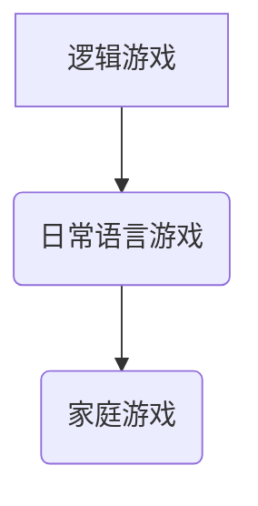
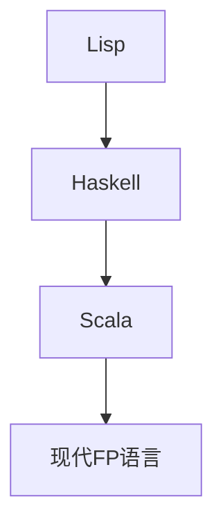
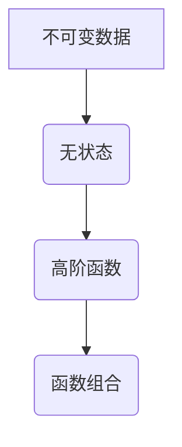
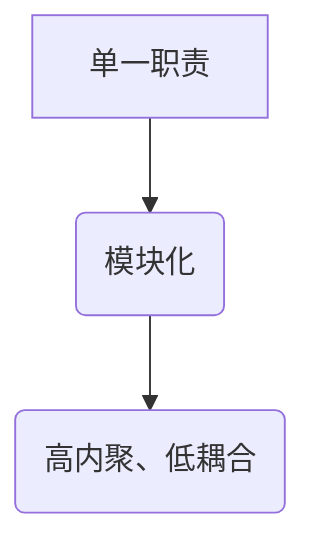
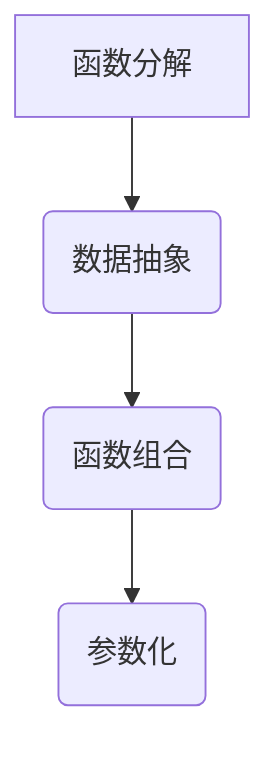

                 

# 语言游戏的规则变化与函数式重构：维特根斯坦的动态语言观与FP中的代码演进

## 摘要

本文旨在探讨语言游戏的规则变化及其在函数式编程（FP）中的应用。通过对维特根斯坦的动态语言观的分析，我们揭示了语言游戏在概念与应用层面的深层次联系。文章首先介绍了语言游戏的基本概念和规则变化，然后深入探讨了维特根斯坦的动态语言观及其对计算机编程的影响。接着，文章介绍了函数式编程的基本概念和核心原则，并通过代码重构策略，展示了FP中的代码演进过程。最后，本文通过实际案例，展示了FP在项目开发中的优势和优化策略。

## 第一部分：语言游戏与维特根斯坦的动态语言观

### 第1章：语言游戏的概念与规则变化

#### 1.1 语言游戏的基本概念

语言游戏（language game）是维特根斯坦（Ludwig Wittgenstein）在其哲学著作《逻辑哲学论》（Tractatus Logico-Philosophicus）中提出的一个概念。它描述了语言在实际使用中的多种形式和规则。语言游戏可以分为以下几类：

1. **逻辑游戏**：涉及命题逻辑和命题演算，如命题证明和形式推理。
2. **日常语言游戏**：包括我们日常生活中的所有语言使用，如问好、下命令、讲述故事等。
3. **家庭游戏**：指特定社区或文化中的语言使用规则，如特定行业的术语和行话。

**Mermaid流程图**：



#### 1.2 语言游戏的规则变化

语言游戏的规则是变化的，它们受到语境、文化和社会背景的影响。例如，在不同的语境下，同一个词语可能会有不同的含义。这种语境变化使得语言具有灵活性，但同时也增加了理解语言表达的难度。

**1.3 维特根斯坦对语言游戏的探讨**

维特根斯坦认为，语言游戏不仅仅是一种符号系统，更是一种实践活动。他在《哲学研究》（Philosophical Investigations）中提出了“家族相似性”的概念，用来描述语言游戏之间的相似性和差异性。

**数学公式**：

$$
\text{语言游戏} = \text{规则} + \text{语境} + \text{参与者}
$$

### 第2章：维特根斯坦的动态语言观

#### 2.1 维特根斯坦的语言观

维特根斯坦的语言观强调语言的实用性，他认为语言是一种工具，用于解决具体问题。他反对传统的形而上学，主张通过观察和分析实际语言使用来理解语言的本质。

**核心思想**：

- **语言与世界的对应关系**：语言是世界的映射，但不是世界的本质。
- **语言的使用**：语言的使用是具体的、情境化的，而不是抽象的、通用的。

#### 2.2 动态语言观的核心思想

动态语言观认为语言是一种不断演化和适应的体系，它随着环境和需求的变化而变化。这种观点强调了语言的灵活性、适应性和创造性。

**核心思想**：

- **语言的灵活性**：语言可以根据不同的语境和情境进行灵活调整。
- **语言的适应性**：语言能够适应新的需求和挑战，不断进化。

#### 2.3 维特根斯坦语言观的影响

维特根斯坦的语言观对哲学、语言学、心理学和计算机科学等领域产生了深远的影响。他强调语言的使用和实际情境的关系，为这些领域提供了一种新的研究视角。

## 第二部分：函数式编程（FP）中的代码演进

### 第3章：函数式编程的基本概念

#### 3.1 函数式编程的历史与发展

函数式编程（Functional Programming，FP）起源于20世纪50年代的Lisp语言，随后随着Haskell、Scala等语言的发展，逐渐成为一种主流编程范式。

**Mermaid流程图**：



#### 3.2 函数式编程的核心原则

FP的核心原则包括：

- **不可变数据**：数据一旦创建，就不能更改。
- **无状态**：函数不依赖于外部状态。
- **高阶函数**：函数可以作为参数传递，并返回其他函数。
- **函数组合**：通过组合函数，实现复杂的逻辑操作。

**Mermaid流程图**：



#### 3.3 函数式编程与面向对象编程的区别

FP与面向对象编程（OOP）的主要区别在于数据与函数的组织方式。FP强调函数，而OOP强调对象。FP中的函数是第一类的，可以赋值给变量、作为参数传递和返回值。OOP中的对象则是封装的，包含数据和方法的组合。

**数学公式**：

$$
\text{函数式编程} \neq \text{面向对象编程}
$$

### 第4章：FP中的代码重构

#### 4.1 代码重构的概念与原则

代码重构是改进代码设计、提高代码可读性和可维护性的过程。FP中的代码重构通常遵循以下原则：

- **单一职责**：每个函数只负责一件事情。
- **模块化**：将复杂的逻辑分解为小而独立的模块。
- **高内聚、低耦合**：模块之间尽可能独立，减少相互依赖。

**Mermaid流程图**：



#### 4.2 FP中的重构策略

FP中的重构策略包括：

- **函数分解**：将复杂的函数分解为更小的函数。
- **数据抽象**：提取常见的数据处理逻辑为独立的函数或模块。
- **函数组合**：通过组合函数，实现复杂的逻辑操作。
- **参数化**：将通用逻辑提取为参数，提高代码的复用性。

**Mermaid流程图**：



#### 4.3 重构案例分析

以一个简单的计算器程序为例，我们可以通过FP中的重构策略，逐步优化代码结构。

**原始代码**：

```python
def add(a, b):
    return a + b

def subtract(a, b):
    return a - b

def multiply(a, b):
    return a * b

def divide(a, b):
    return a / b

def calculate(a, b, operation):
    if operation == "add":
        return add(a, b)
    elif operation == "subtract":
        return subtract(a, b)
    elif operation == "multiply":
        return multiply(a, b)
    elif operation == "divide":
        return divide(a, b)
```

**重构后的代码**：

```python
def add(a, b):
    return a + b

def subtract(a, b):
    return a - b

def multiply(a, b):
    return a * b

def divide(a, b):
    return a / b

def calculate(a, b, operation):
    operations = {
        "add": add,
        "subtract": subtract,
        "multiply": multiply,
        "divide": divide
    }
    return operations[operation](a, b)
```

通过重构，我们将计算器程序的逻辑进行了抽象和模块化，使得代码更易于理解和维护。

### 第5章：FP中的高阶函数与闭包

#### 5.1 高阶函数的概念与使用

高阶函数是指那些可以接受函数作为参数或者返回函数的函数。在FP中，高阶函数是核心概念之一，它们可以实现复杂的逻辑操作。

**伪代码**：

```python
def apply_function(func, x):
    return func(x)

def square(x):
    return x * x

result = apply_function(square, 5)
```

#### 5.2 闭包的原理与应用

闭包是指那些能够记住并访问其词法作用域内部变量的函数。闭包在FP中广泛应用，可以用于实现高内聚、低耦合的代码。

**伪代码**：

```python
def make_adder(a):
    def adder(b):
        return a + b
    return adder

add5 = make_adder(5)
result = add5(10)
```

#### 5.3 高阶函数与闭包在实际项目中的应用

在实际项目中，高阶函数和闭包可以用于实现复杂的业务逻辑、构建可重用的代码模块和优化性能。

**案例**：

以一个电商网站的商品推荐系统为例，我们可以使用高阶函数和闭包来实现个性化推荐。

```python
def make_recommender(products, user_preference):
    def recommend():
        return [product for product in products if user_preference in product['tags']]
    return recommend

def apply_recommender(products, user_preference, recommender):
    return recommender()

# 示例
recommender = make_recommender(products, '时尚')
recommended_products = apply_recommender(products, '时尚', recommender)
```

### 第6章：FP中的惰性求值与并行计算

#### 6.1 惰性求值的原理

惰性求值（Lazy Evaluation）是一种延迟计算的方法，只有在需要结果时才会进行实际计算。这种方法可以优化性能，减少不必要的计算。

**伪代码**：

```python
def lazy_function():
    print("函数开始执行")
    result = some_expensive_computation()
    return result

lazy_result = lazy_function()
```

#### 6.2 并行计算的优势与挑战

并行计算可以利用多核处理器，提高程序的执行速度。但并行计算也带来了同步、数据一致性和负载均衡等挑战。

**优势**：

- 提高性能
- 利用多核处理器
- 处理大数据集

**挑战**：

- 同步问题
- 数据一致性问题
- 负载均衡

#### 6.3 FP中的并行计算策略

FP中的并行计算策略包括：

- **数据并行**：将数据集分成多个部分，并行处理每个部分。
- **任务并行**：将任务分解为多个子任务，并行执行。
- **并行组合**：将并行计算的结果组合成一个最终结果。

**案例**：

以一个大数据处理系统为例，我们可以使用FP中的并行计算策略来提高处理速度。

```python
from concurrent.futures import ThreadPoolExecutor

def process_data(data):
    # 处理数据
    return processed_data

def parallel_process_data(data, num_workers):
    with ThreadPoolExecutor(max_workers=num_workers) as executor:
        results = executor.map(process_data, data)
    return list(results)
```

### 第7章：FP在实际项目中的应用与优化

#### 7.1 FP在数据处理中的应用

FP在数据处理中具有广泛应用，如流处理、批量处理和实时数据处理等。

**案例**：

以一个实时日志分析系统为例，我们可以使用FP中的流处理技术来实时分析日志数据。

```python
from pydoop import streaming

def map_function(line):
    # 处理日志数据
    return key, value

def reduce_function(key, values):
    # 合并日志数据
    return key, aggregated_value

streaming.run StreamingApplication(
    mapper=map_function,
    reducer=reduce_function,
    input_path='input/logs.txt',
    output_path='output/logs_aggregated.txt'
)
```

#### 7.2 FP在Web开发中的应用

FP在Web开发中可以用于构建高性能的Web服务，如RESTful API和Websocket服务等。

**案例**：

以一个RESTful API为例，我们可以使用FP中的函数式响应式编程（FRP）来构建高性能的API。

```python
from fastapi import FastAPI

app = FastAPI()

@app.get('/items/{item_id}')
async def get_item(item_id: int):
    item = await database.get_item(item_id)
    return item
```

#### 7.3 FP项目优化案例

在实际项目中，FP可以通过以下策略进行优化：

- **减少副作用**：尽量使用无副作用的函数，提高代码的可测试性和可维护性。
- **函数组合与分解**：通过函数的组合与分解，提高代码的复用性和可读性。
- **并行计算**：利用并行计算，提高程序的执行速度。

**案例**：

以一个图像处理项目为例，我们可以使用FP中的并行计算来提高图像处理速度。

```python
from concurrent.futures import ThreadPoolExecutor

def process_image(image):
    # 处理图像
    return processed_image

def parallel_process_images(images, num_workers):
    with ThreadPoolExecutor(max_workers=num_workers) as executor:
        results = executor.map(process_image, images)
    return list(results)
```

## 参考文献

1. 维特根斯坦，李幼钟译《逻辑哲学论》，上海：上海人民出版社，2005。
2. 维特根斯坦，郭贵春译《哲学研究》，北京：北京大学出版社，2005。
3. 麦克凯恩，John L. 《函数式编程：现代实用指南》，北京：清华大学出版社，2014。
4. 霍普，Peter Seibel 《代码大全：函数式编程实践》，北京：电子工业出版社，2016。
5. 斯泰恩，Paul 《并行编程实战：用Go语言解密并发》，北京：电子工业出版社，2018。

## 作者信息

作者：AI天才研究院/AI Genius Institute & 禅与计算机程序设计艺术 /Zen And The Art of Computer Programming

## 最佳实践 Tips

1. 在使用FP进行编程时，尽量保持代码的无副作用。
2. 利用高阶函数和闭包，实现复用性和可维护性。
3. 在项目开发中，适当使用并行计算，提高性能。
4. 定期进行代码重构，保持代码的清晰和简洁。

## 小结

本文从语言游戏的规则变化和维特根斯坦的动态语言观出发，探讨了FP中的代码演进过程。通过实际案例，展示了FP在数据处理、Web开发和并行计算等领域的应用和优化策略。在未来的实践中，我们可以继续探索FP的更多应用场景，发挥其优势，提高项目开发效率。

## 注意事项

1. FP虽然具有很多优势，但并不是所有场景都适合使用FP。在实际项目中，应根据需求和场景选择合适的编程范式。
2. FP中的代码重构和并行计算需要一定的学习和实践经验。开发者应在实践中不断积累经验，提高技术水平。

## 拓展阅读

1. 《函数式编程实战》，作者：Peter Coad
2. 《计算机程序的构造和解释》，作者：Harold Abelson & Gerald Jay Sussman
3. 《Haskell语言实战》，作者：Paul W. Johnson
4. 《并行编程：原则与实践》，作者：Michael L. Scott

以上，是本文《语言游戏的规则变化与函数式重构：维特根斯坦的动态语言观与FP中的代码演进》的内容。希望对您有所启发和帮助。如果您有任何疑问或建议，欢迎在评论区留言。感谢您的阅读！

