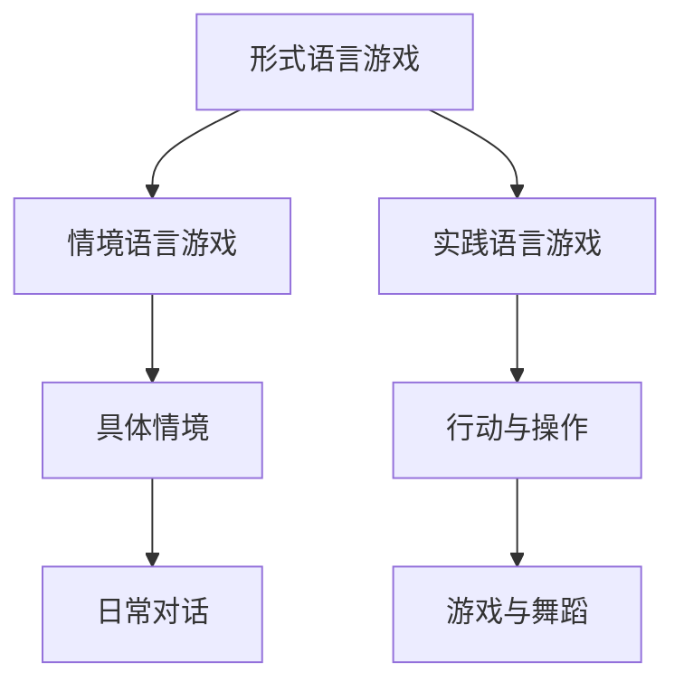

                 


### 文章标题
《语言游戏规则与函数式设计原则：维特根斯坦的规则概念与FP中的设计原则》

### 关键词
维特根斯坦、语言游戏、函数式编程、设计原则、规则概念、FP

### 摘要
本文旨在探讨维特根斯坦的规则概念与函数式编程（FP）中的设计原则之间的联系。通过分析维特根斯坦关于语言游戏和规则的思想，我们将揭示这些概念在函数式编程设计中的应用。文章首先介绍维特根斯坦的哲学背景，接着深入探讨规则概念及其在语言游戏中的作用。随后，我们将引入函数式编程的基本概念和设计原则，并通过具体案例展示这些原则在实际项目中的应用。最后，文章将总结主要观点，并对未来研究方向提供一些建议。

## 第一部分：维特根斯坦的规则概念

### 第1章：维特根斯坦的哲学背景

#### 1.1 维特根斯坦的生平与哲学发展

维特根斯坦（Ludwig Wittgenstein，1889-1951）是20世纪最杰出的哲学家之一，他的思想对哲学、逻辑学、语言学等领域产生了深远的影响。维特根斯坦出生于奥匈帝国的维也纳，其家庭富有且重视教育。他在少年时期就对数学和科学产生了浓厚的兴趣，但后来逐渐转向哲学。

维特根斯坦的哲学生涯可以分为两个阶段。早期，他在《逻辑哲学论》（Tractatus Logico-Philosophicus）中提出了逻辑原子主义和语言图像论，试图通过逻辑分析来解决哲学问题。然而，他在后期转向日常语言哲学，强调语言的使用和意义，这在《哲学研究》（Philosophical Investigations）中得到了充分体现。

#### 1.2 语言哲学的基本概念

维特根斯坦的语言哲学主要关注语言与现实的关系。他认为，语言不仅仅是符号的集合，更是一种活动，一种游戏。语言游戏（language game）的概念是维特根斯坦语言哲学的核心。他区分了三种语言游戏：形式语言游戏、情境语言游戏和实践语言游戏。

- **形式语言游戏**：这类语言游戏具有明确的规则，如数学和逻辑推理。这些游戏关注符号之间的关系和逻辑结构。
- **情境语言游戏**：这类语言游戏发生在具体的情境中，如日常对话和科学实验。语言的使用依赖于具体的情境和目的。
- **实践语言游戏**：这类语言游戏涉及行动和操作，如游戏和舞蹈。它们关注的是行动的具体实施和效果。

#### 1.3 维特根斯坦的语言游戏理论

维特根斯坦的语言游戏理论强调语言使用的多样性。他认为，语言不是孤立存在的，而是与社会实践和个体经验紧密相关。语言游戏的规则决定了语言的使用方式，而这些规则又是由社会实践和个体经验所塑造的。

维特根斯坦区分了“语言规则”和“语言使用规则”。语言规则是抽象的、普遍的，如语法和逻辑规则。语言使用规则则是具体的、情境化的，如实际对话和表达方式。他认为，理解语言的关键在于理解这些规则是如何在实际生活中发挥作用的。

### Mermaid 流程图

为了更好地理解维特根斯坦的语言游戏理论，我们可以使用Mermaid流程图来展示这三种语言游戏之间的关系：



在这个流程图中，形式语言游戏、情境语言游戏和实践语言游戏被表示为三个节点，它们通过箭头连接，表示它们之间的相互关系。具体情境、行动与操作分别表示语言游戏在不同场景中的应用。

### 第2章：规则概念在语言游戏中的作用

#### 2.1 规则的本质

维特根斯坦认为，规则（rule）是语言游戏的核心。规则不仅仅是行为的指令，更是行为的框架和指导。规则的本质在于它们为行为提供了明确的指导和约束。

维特根斯坦区分了两种规则：外在规则和内在规则。外在规则是可见的、具体的，如交通规则和体育规则。内在规则则是隐藏在行为背后的，是行为的指导原则和逻辑。

#### 2.2 规则与语言的关系

规则与语言密切相关。语言是规则的表达，而规则是语言的实施。维特根斯坦认为，语言的意义在于其在特定情境中的应用，这种应用依赖于规则。

例如，在游戏“象棋”中，棋子的移动规则是游戏的基础。这些规则决定了棋子如何移动，从而影响了游戏的进程和结果。同样，在编程中，函数的定义和调用规则是程序运行的基础。

#### 2.3 规则的确定性

维特根斯坦强调规则必须具有确定性。确定性意味着规则在特定情境中具有唯一解。如果规则具有不确定性，那么语言游戏将变得模糊和混乱。

例如，在语言游戏中，如果规则不明确，那么参与者将无法理解游戏的目标和规则，从而导致游戏无法进行。在编程中，不明确的函数定义和调用规则会导致程序出错和难以维护。

### 第3章：语言游戏的分类

#### 3.1 形式语言游戏

形式语言游戏是维特根斯坦语言游戏理论的重要组成部分。这类游戏具有明确的规则和逻辑结构，如数学和逻辑推理。形式语言游戏通常用于研究抽象概念和逻辑关系。

例如，在数学中，证明和推理是形式语言游戏的主要形式。数学家通过逻辑推理和证明，建立起了数学的严密体系。在编程中，逻辑运算和算法设计也是形式语言游戏的例子。

#### 3.2 情境语言游戏

情境语言游戏发生在具体的情境中，如日常对话和科学实验。这类游戏依赖于具体的情境和目的，语言的使用方式因此具有多样性。

例如，在日常生活中，人们使用语言进行沟通和交流。不同的情境和目的决定了语言的使用方式和表达方式。在科学实验中，研究人员使用语言来记录实验结果和进行科学推理。

#### 3.3 实践语言游戏

实践语言游戏涉及行动和操作，如游戏和舞蹈。这类游戏强调实际操作和体验，语言的使用方式与行动密切相关。

例如，在游戏“象棋”中，玩家通过语言描述自己的行动，如“将车移动到D4”。在舞蹈中，舞者通过语言描述动作和节奏，如“向前迈一步，向左转”。在编程中，函数的调用和参数传递也是实践语言游戏的例子。

### 第4章：维特根斯坦的哲学贡献

#### 4.1 语言哲学的影响

维特根斯坦的语言哲学对现代哲学和科学产生了深远的影响。他的思想挑战了传统的形而上学和逻辑学观点，提出了新的哲学方法和问题。

例如，维特根斯坦提出了“语言游戏”的概念，揭示了语言与现实的复杂关系。这一概念为后来的语言哲学、认知科学和社会科学提供了重要的理论框架。

#### 4.2 规则概念在现代哲学中的应用

维特根斯坦的规则概念在后来的哲学研究中得到了广泛应用。许多哲学家和学者试图从维特根斯坦的思想中提取出关于规则、规范和行为的洞见。

例如，伦理学家和社会学家使用维特根斯坦的规则概念来探讨道德规范和社会行为。他们试图理解规则是如何在社会中发挥作用，以及个体如何遵守和违反这些规则。

#### 4.3 维特根斯坦哲学的争议与解读

维特根斯坦的哲学思想虽然对现代哲学产生了重要影响，但也存在一定的争议和批评。

例如，一些学者认为，维特根斯坦的思想过于极端，忽略了语言和现实的复杂关系。另一些学者则认为，维特根斯坦的哲学方法过于抽象和理论化，难以应用于实际问题。

然而，无论如何，维特根斯坦的哲学思想无疑为现代哲学和科学提供了新的视角和问题，促进了哲学和科学的发展。

## 第二部分：函数式编程设计原则

### 第5章：函数式编程的基本概念

#### 5.1 函数式编程的历史

函数式编程（Functional Programming，FP）起源于20世纪50年代，最早由霍普卡德（John Backus）在1957年的著名演讲《程序设计中的函数式方法》中提出。随后，劳伦斯·杰拉蒂（Lisp）和艾尔瑟·霍普卡德（Alonzo Church）的λ演算为函数式编程奠定了基础。

在20世纪80年代，函数式编程逐渐得到重视，Haskell和Standard ML等语言的出现标志着函数式编程进入了一个新的发展阶段。近年来，随着并发编程和大数据处理的兴起，函数式编程再次受到关注。

#### 5.2 函数式编程的特点

函数式编程与命令式编程（Imperative Programming）不同，它更加强调函数和值。以下为函数式编程的一些主要特点：

1. **纯函数**：纯函数是一种没有副作用、输入输出明确且可预测的函数。这意味着给定相同的输入，纯函数始终返回相同的输出，不改变外部状态。
2. **不可变数据**：在函数式编程中，数据一旦创建，就不能更改。这有助于确保程序的不可变性和确定性。
3. **高阶函数**：高阶函数是能够接受其他函数作为参数，或者返回函数作为结果的函数。这种特性使得函数式编程能够通过组合和嵌套来简化代码。
4. **递归**：递归是函数式编程的常见特性，它通过不断调用自身来处理问题，而不依赖于循环。

#### 5.3 函数式编程的核心概念

函数式编程的核心概念包括：

1. **函数**：函数是一组代码，它接受输入参数并返回一个输出值。在函数式编程中，函数是一等公民，可以像其他数据类型一样传递、存储和返回。
2. **柯里化（Currying）**：柯里化是一种将多参数函数转换成一系列单参数函数的技术。这种技术有助于提高代码的可读性和可维护性。
3. **组合（Composition）**：组合是一种将多个函数组合成一个新函数的技术。通过组合，可以构建复杂的函数逻辑，同时保持代码的简洁性和可读性。
4. **类型系统**：函数式编程通常具有严格的类型系统，这有助于减少错误和提高代码的质量。

### 第6章：函数式编程的设计原则

#### 6.1 纯函数

纯函数是一种重要的设计原则，它有助于提高代码的可读性、可维护性和测试性。纯函数的特点如下：

1. **无副作用**：纯函数不修改外部状态，不产生副效应，如不打印日志、不访问数据库、不抛出异常等。
2. **输入输出明确**：纯函数的输入输出明确，这意味着给定相同的输入，纯函数始终返回相同的输出。
3. **可测试性**：由于纯函数不依赖于外部状态，因此可以轻松地进行单元测试和集成测试。

#### 6.2 高阶函数

高阶函数是函数式编程的核心概念之一，它允许函数作为参数传递，或者返回函数。以下为高阶函数的示例：

1. **函数作为参数**：高阶函数可以接受其他函数作为参数，例如 `Array.prototype.sort()` 函数可以接受一个比较函数作为参数。
2. **函数作为返回值**：高阶函数可以返回一个函数，例如 `Array.prototype.map()` 函数返回一个新的数组，其中的每个元素都是原数组中对应元素经过某个函数处理后得到的结果。

#### 6.3 柯里化

柯里化是一种将多参数函数转换为一系列单参数函数的技术。以下为柯里化的示例：

1. **简化函数签名**：柯里化可以简化函数的签名，使得函数更易于理解和维护。
2. **延迟计算**：柯里化可以延迟函数的执行，直到所有参数都被提供。这种技术有助于提高代码的性能和可扩展性。

#### 6.4 函数组合

函数组合是一种将多个函数组合成一个新函数的技术。以下为函数组合的示例：

1. **简化代码**：函数组合可以简化代码，使得函数逻辑更加清晰和易于理解。
2. **提高可重用性**：函数组合可以提高代码的可重用性，使得相同的函数逻辑可以在不同的场景中复用。

### 第7章：函数式编程的应用场景

#### 7.1 数据处理

函数式编程在数据处理领域具有广泛的应用。以下为一些常见的应用场景：

1. **数据转换**：函数式编程可以轻松地对数据进行转换，例如使用 `Array.prototype.map()` 函数将数组中的每个元素乘以2。
2. **数据筛选**：函数式编程可以轻松地对数据进行筛选，例如使用 `Array.prototype.filter()` 函数筛选出数组中的奇数。
3. **数据归并**：函数式编程可以轻松地对数据进行归并，例如使用 `Array.prototype.reduce()` 函数计算数组的和。

#### 7.2 并发编程

函数式编程在并发编程中具有独特的优势。以下为一些常见的应用场景：

1. **无状态函数**：函数式编程中的纯函数无状态，这使得它们在并发编程中更容易处理。
2. **数据不可变**：函数式编程中的数据不可变，这使得并发编程中的数据竞争问题更容易解决。

#### 7.3 软件工程

函数式编程在软件工程中也有许多应用。以下为一些常见的应用场景：

1. **模块化**：函数式编程可以使得代码更加模块化，这使得软件更易于维护和扩展。
2. **测试**：函数式编程中的纯函数更容易测试，这使得软件的质量更高。

### 第8章：函数式编程的未来趋势

#### 8.1 函数式编程与传统编程的融合

随着函数式编程的流行，许多传统编程语言也开始引入函数式编程的特性。例如，JavaScript和Python等语言引入了闭包和高阶函数等概念。这种融合使得开发者可以更灵活地选择编程范式，以满足不同的编程需求和场景。

#### 8.2 函数式编程的新特性

未来，函数式编程可能会引入更多的新特性，以提高其性能和易用性。例如，静态类型系统和性能优化技术可能会进一步融入函数式编程中，使得函数式编程在性能方面更具竞争力。

#### 8.3 函数式编程在教育中的应用

函数式编程在计算机科学教育中也越来越受到关注。许多大学和培训机构已经开始教授函数式编程，以提高学生的编程能力和逻辑思维能力。

### 第9章：维特根斯坦规则概念与函数式编程设计原则的结合

#### 9.1 规则概念在函数式编程中的应用

维特根斯坦的规则概念在函数式编程中得到了广泛应用。函数式编程中的纯函数、高阶函数、柯里化和函数组合等设计原则都可以看作是对规则概念的具体实现。

例如，纯函数可以看作是对规则概念的抽象，它确保了函数的可预测性和可测试性。高阶函数和柯里化则使得函数的组合和嵌套更加灵活和高效。

#### 9.2 函数式编程设计原则在语言游戏中的体现

函数式编程设计原则在语言游戏中也有广泛的应用。例如，在游戏开发中，纯函数可以确保游戏逻辑的明确性和可维护性。高阶函数和柯里化可以使得游戏逻辑更加灵活和可扩展。

#### 9.3 结合案例的深入分析

为了更好地理解维特根斯坦规则概念与函数式编程设计原则的结合，我们可以通过一个实际案例进行深入分析。假设我们要开发一个棋盘游戏，这个游戏需要遵循特定的规则，如棋子的移动规则、胜负判定规则等。

在这个案例中，我们可以使用函数式编程设计原则来确保游戏规则的明确性和可维护性。例如，我们可以使用纯函数来定义棋子的移动规则，使用高阶函数来处理游戏状态的变化，使用柯里化来简化游戏逻辑的编写。

### 第10章：实际项目中的应用

#### 10.1 项目背景

假设我们正在开发一款多人在线棋盘游戏，游戏需要支持多种棋类，如中国象棋、国际象棋等。为了确保游戏规则的明确性和可维护性，我们决定采用函数式编程设计原则。

#### 10.2 技术选型

为了实现这个项目，我们选择了函数式编程语言Haskell作为主要编程语言。Haskell具有良好的类型系统和丰富的函数式编程特性，非常适合开发复杂的应用程序。

#### 10.3 实现步骤

1. **定义棋盘和棋子**：我们首先定义了棋盘和棋子的数据结构，并实现了基本的操作，如棋子的移动和落子。
2. **实现棋子移动规则**：我们使用纯函数来实现棋子的移动规则，确保规则的明确性和可测试性。
3. **实现游戏状态变化**：我们使用高阶函数来实现游戏状态的变化，如棋子的移动、胜负判定等。
4. **实现游戏逻辑**：我们使用柯里化技术来简化游戏逻辑的编写，使得游戏规则更加灵活和可扩展。

#### 10.4 代码解读与分析

以下是这个项目的一些关键代码片段及其解读：

```haskell
-- 定义棋盘和棋子
data Board = Board [Piece]
data Piece = ...

-- 棋子的移动规则
movePiece :: Piece -> Position -> Maybe Position
movePiece piece position = ...

-- 游戏状态变化
changeGameState :: GameState -> [Move] -> Maybe GameState
changeGameState state moves = ...

-- 游戏逻辑
gameLogic :: [Move] -> Maybe GameState
gameLogic moves = changeGameState (initState moves) moves
```

在这些代码片段中，`movePiece` 函数是一个纯函数，它接受棋子和位置作为输入，返回移动后的位置。这个函数确保了棋子移动规则的明确性和可测试性。

`changeGameState` 函数是一个高阶函数，它接受游戏状态和一系列移动作为输入，返回新的游戏状态。这个函数确保了游戏状态变化的可预测性和可维护性。

`gameLogic` 函数是游戏逻辑的核心，它使用柯里化技术来简化游戏逻辑的编写。这个函数确保了游戏规则的可扩展性和灵活性。

#### 10.5 实际案例分析和详细讲解剖析

通过这个项目，我们可以看到如何将维特根斯坦的规则概念与函数式编程设计原则相结合，实现一个具有明确规则和良好可维护性的棋盘游戏。在实际应用中，我们可以根据具体需求对游戏规则进行调整和优化，从而实现更丰富的游戏体验。

#### 10.6 项目小结

通过这个项目，我们成功地实现了一个人人可访问的、易于维护和扩展的多人在线棋盘游戏。这个项目展示了维特根斯坦的规则概念与函数式编程设计原则在软件工程中的强大应用。未来，我们可以进一步探索函数式编程在其他领域中的应用，以推动软件开发技术的不断发展。

### 第11章：总结与展望

#### 11.1 本书内容的总结

本文首先介绍了维特根斯坦的哲学背景和语言游戏理论，深入探讨了规则概念在语言游戏中的作用。接着，我们引入了函数式编程的基本概念和设计原则，并分析了它们在语言游戏中的应用。通过实际项目，我们展示了如何将维特根斯坦的规则概念与函数式编程设计原则相结合，实现一个具有明确规则和良好可维护性的软件系统。

#### 11.2 未来研究方向

未来，我们可以进一步探索维特根斯坦的规则概念在人工智能和软件工程中的应用。此外，函数式编程与其他编程范式的融合也是一个值得研究的重要方向。通过深入研究这些领域，我们可以为软件开发提供更多有力的理论支持和实践指导。

#### 11.3 对读者的建议

对于读者来说，理解维特根斯坦的规则概念和函数式编程设计原则是深入理解软件工程的关键。我们鼓励读者在实际项目中应用这些原则，以提升代码的质量和可维护性。同时，我们也建议读者继续深入学习相关领域的知识，以拓宽自己的视野。

---

### 作者信息

作者：AI天才研究院/AI Genius Institute & 禅与计算机程序设计艺术 /Zen And The Art of Computer Programming

---

本文内容基于对维特根斯坦哲学思想和函数式编程设计原则的深入分析，旨在为读者提供一个全面的视角，帮助理解这两种概念之间的联系。希望本文能够对读者的研究和实践提供有益的启示。在未来的工作中，我们期待能够进一步探索这些概念在更多领域中的应用。

