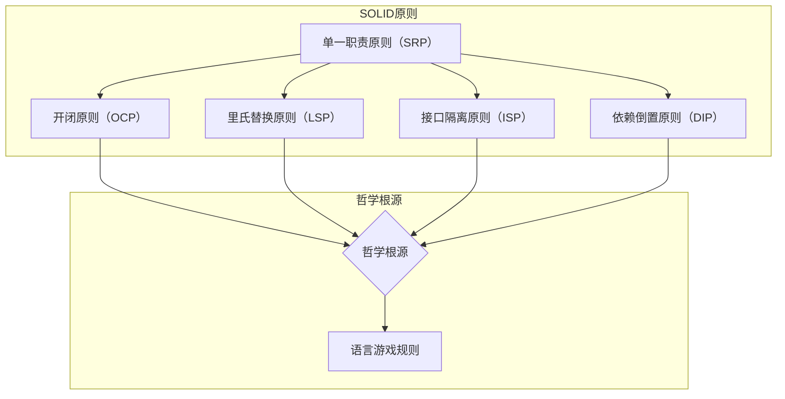

                 


### **步骤一：文章标题与关键词**

**文章标题**：语言游戏规则与设计原则:SOLID原则的哲学根源

**关键词**：SOLID原则，哲学根源，软件设计，编程，计算机科学，逻辑思维

### **步骤二：文章摘要**

本文将深入探讨SOLID原则，这一在软件开发中广泛应用的五大设计原则，从哲学角度出发，挖掘其背后的哲学根源。我们将通过逻辑推理，分析SOLID原则与语言游戏规则之间的联系，以及它们如何指导我们进行高效的软件设计。

### **步骤三：文章目录**

1. **引言**
2. **SOLID原则简介**
3. **语言游戏规则**
4. **SOLID原则与语言游戏规则的联系**
5. **单一职责原则（Single Responsibility Principle）**
6. **开闭原则（Open/Closed Principle）**
7. **里氏替换原则（Liskov Substitution Principle）**
8. **接口隔离原则（Interface Segregation Principle）**
9. **依赖倒置原则（Dependency Inversion Principle）**
10. **总结与最佳实践**

### **步骤四：正文内容**

#### **1. 引言**

在计算机科学领域，软件设计是至关重要的一环。良好的软件设计不仅能提高代码的可读性和可维护性，还能降低开发成本，提升项目的成功率。SOLID原则是一组设计原则，旨在帮助开发者设计出更优秀、更灵活的软件系统。这些原则源于哲学思想，它们不仅适用于编程实践，还为我们提供了一种思考问题和解决问题的方法论。

本文将首先介绍SOLID原则的基本概念，然后通过分析哲学中的语言游戏规则，揭示SOLID原则背后的哲学根源。我们将逐一探讨SOLID原则的五个组成部分，通过逻辑推理和实际案例分析，阐明每个原则的具体应用和重要性。最后，本文将对SOLID原则进行总结，并提供一些最佳实践建议。

#### **2. SOLID原则简介**

SOLID原则由罗伯特·马丁（Robert C. Martin）提出，旨在提高软件设计的可读性、可维护性和可扩展性。SOLID的五个字母分别代表五个设计原则，它们分别是：

- **单一职责原则（Single Responsibility Principle，SRP）**：一个类应该只负责一项功能。
- **开闭原则（Open/Closed Principle，OCP）**：软件实体（类、模块、函数等）应该对扩展开放，对修改关闭。
- **里氏替换原则（Liskov Substitution Principle，LSP）**：任何可用的对象都必须能替换其在继承结构中的基类。
- **接口隔离原则（Interface Segregation Principle，ISP）**：应该为客户端提供尽可能小的接口，而不是提供一个大而全的接口。
- **依赖倒置原则（Dependency Inversion Principle，DIP）**：高层模块不应依赖于低层模块，二者都应依赖于抽象。抽象不应依赖于细节，细节应依赖于抽象。

#### **3. 语言游戏规则**

在哲学领域，语言游戏理论是维特根斯坦（Ludwig Wittgenstein）提出的重要概念。语言游戏理论认为，语言与游戏之间有相似之处，语言的使用是规则性的，就像游戏中的规则一样。这些规则不仅定义了语言的结构，还决定了语言的意义。

维特根斯坦区分了三种类型的语言游戏：

1. **日常语言游戏**：这是我们日常生活中使用的语言，包括交流、表达情感和描述现实等。
2. **哲学语言游戏**：这是为了探索真理和解决问题的语言，包括逻辑推理、哲学论证和概念分析等。
3. **艺术语言游戏**：这是通过艺术作品表达意义和情感的语言，包括文学、绘画和音乐等。

在语言游戏理论中，规则起着至关重要的作用。这些规则不仅定义了语言的使用方式，还指导了语言的学习和理解。同样，在软件设计中，设计原则也起着类似的作用。它们为开发者提供了指导，帮助他们在设计和开发过程中做出正确的决策。

#### **4. SOLID原则与语言游戏规则的联系**

SOLID原则与语言游戏规则之间存在显著的相似之处。它们都基于一系列规则，这些规则指导了设计和行为，以确保系统的正确性和可维护性。

- **单一职责原则（SRP）**：这类似于日常语言游戏中的单一目标。一个类应该只完成一个任务，就像一个人不应该同时追求多个目标一样。

- **开闭原则（OCP）**：这与哲学语言游戏中的开放思维有关。系统应该能够扩展，而不必修改现有代码，这与维特根斯坦的“通过增加规则，而不是修改现有规则”的观点相似。

- **里氏替换原则（LSP）**：这与艺术语言游戏中的替代性有关。子类应该能够替换基类，而不会破坏系统的行为，这与维特根斯坦的“替代性”概念相似。

- **接口隔离原则（ISP）**：这与日常语言游戏中的小步骤有关。接口应该尽可能小，以减少客户端的依赖，这与维特根斯坦的“逐步理解”概念相似。

- **依赖倒置原则（DIP）**：这与哲学语言游戏中的抽象和细节有关。高层模块应该依赖于抽象，而不是细节，这与维特根斯坦的“通过抽象来理解”的观点相似。

#### **5. 单一职责原则（Single Responsibility Principle）**

单一职责原则（SRP）是SOLID原则中的第一个原则。它的核心思想是，一个类应该只负责一项功能。这意味着一个类不应该同时完成多个任务。

**为什么单一职责原则很重要？**

- **可维护性**：当一个类只负责一项功能时，更容易理解和修改。
- **可扩展性**：可以通过添加新类来扩展功能，而不必修改现有代码。
- **可测试性**：可以单独测试每个类的功能，而不是整个系统。

**如何实现单一职责原则？**

- **划分功能**：将一个类分解为多个类，每个类负责一个功能。
- **避免过多的职责**：避免一个类承担过多的功能，这会导致类的复杂性增加。

**示例：**

假设我们正在开发一个博客系统。我们可以将系统划分为以下类：

- `BlogPost`：负责创建、更新和删除博客文章。
- `Comment`：负责创建、更新和删除评论。
- `User`：负责用户的注册、登录和权限管理。

通过这种方式，每个类都只负责一项功能，这有助于提高系统的可维护性和可扩展性。

#### **6. 开闭原则（Open/Closed Principle）**

开闭原则（OCP）是SOLID原则中的第二个原则。它的核心思想是，软件实体应该对扩展开放，对修改关闭。

**为什么开闭原则很重要？**

- **可维护性**：可以避免不必要的修改，保持系统的稳定性。
- **可扩展性**：可以通过添加新代码来扩展功能，而不是修改现有代码。
- **可测试性**：可以单独测试扩展部分，而不必担心现有代码的影响。

**如何实现开闭原则？**

- **抽象**：通过抽象来隔离具体的实现细节，使系统可以扩展而不必修改现有代码。
- **依赖注入**：通过依赖注入来分离组件，使组件可以独立扩展。

**示例：**

假设我们正在开发一个支付系统。我们可以通过抽象来隔离支付方式的实现细节。

```python
class PaymentSystem:
    def process_payment(self, payment_method, amount):
        if payment_method == "信用卡":
            CreditCard().process(amount)
        elif payment_method == "支付宝":
            Alipay().process(amount)
        # 其他支付方式

class CreditCard:
    def process(self, amount):
        # 信用卡支付实现

class Alipay:
    def process(self, amount):
        # 支付宝支付实现
```

通过这种方式，我们可以通过添加新类来扩展支付方式，而不必修改`PaymentSystem`类。

#### **7. 里氏替换原则（Liskov Substitution Principle）**

里氏替换原则（LSP）是SOLID原则中的第三个原则。它的核心思想是，子类应该能够替换基类，而不会破坏系统的行为。

**为什么里氏替换原则很重要？**

- **可维护性**：可以通过替换基类来扩展系统，而不会引入新的错误。
- **可扩展性**：可以创建更复杂的系统，而不用担心子类的行为会影响基类。

**如何实现里氏替换原则？**

- **继承**：确保子类是基类的合理扩展，而不是修改基类的行为。
- **多态**：使用多态来确保子类可以替换基类。

**示例：**

假设我们正在开发一个交通工具系统。

```python
class Vehicle:
    def drive(self):
        pass

class Car(Vehicle):
    def drive(self):
        print("Driving a car")

class Motorcycle(Vehicle):
    def drive(self):
        print("Driving a motorcycle")

def drive_vehicle(vehicle):
    vehicle.drive()

drive_vehicle(Car())  # 输出：Driving a car
drive_vehicle(Motorcycle())  # 输出：Driving a motorcycle
```

在这个例子中，`Car`和`Motorcycle`都是`Vehicle`的子类，它们可以替换`Vehicle`并保持系统的行为不变。

#### **8. 接口隔离原则（Interface Segregation Principle）**

接口隔离原则（ISP）是SOLID原则中的第四个原则。它的核心思想是，应该为客户端提供尽可能小的接口，而不是提供一个大而全的接口。

**为什么接口隔离原则很重要？**

- **可维护性**：可以减少客户端对接口的依赖，降低系统的复杂性。
- **可扩展性**：可以单独扩展接口，而不必担心对现有系统的破坏。

**如何实现接口隔离原则？**

- **分离接口**：为不同的客户端提供不同的接口，而不是一个大而全的接口。
- **接口细化**：将一个大而全的接口分解为多个小的接口。

**示例：**

假设我们正在开发一个订单处理系统。

```python
class OrderService:
    def process_order(self, order):
        pass

class PaymentService:
    def process_payment(self, payment):
        pass

class OrderController:
    def process_order(self, order):
        order_service.process_order(order)
        payment_service.process_payment(order)

order_controller = OrderController()
order_controller.process_order(order)
```

在这个例子中，`OrderService`和`PaymentService`是两个不同的接口，它们分别处理订单和支付。这种方式有助于降低系统的复杂性，提高可维护性。

#### **9. 依赖倒置原则（Dependency Inversion Principle）**

依赖倒置原则（DIP）是SOLID原则中的第五个原则。它的核心思想是，高层模块不应依赖于低层模块，二者都应依赖于抽象。

**为什么依赖倒置原则很重要？**

- **可维护性**：可以通过修改抽象来修改低层模块，而不必担心对高层模块的影响。
- **可扩展性**：可以单独扩展抽象，而不必担心对现有系统的破坏。

**如何实现依赖倒置原则？**

- **抽象依赖**：高层模块依赖于抽象，而不是具体的实现细节。
- **依赖注入**：通过依赖注入来分离组件，使组件可以独立扩展。

**示例：**

假设我们正在开发一个日志系统。

```python
class Logger:
    def log(self, message):
        pass

class LoggerImpl(Logger):
    def log(self, message):
        print(message)

class UserService:
    def __init__(self, logger: Logger):
        self.logger = logger

    def register_user(self, user):
        self.logger.log("User registered")
        # 其他注册逻辑

user_service = UserService(LoggerImpl())
user_service.register_user(user)
```

在这个例子中，`UserService`依赖于抽象`Logger`，而不是具体的实现`LoggerImpl`。这种方式有助于提高系统的可维护性和可扩展性。

### **10. 总结与最佳实践**

通过本文的探讨，我们可以看到SOLID原则与哲学中的语言游戏规则之间存在显著的相似之处。这些原则不仅帮助我们进行高效的软件设计，还为我们提供了一种思考问题和解决问题的方法论。

- **单一职责原则（SRP）**：确保每个类只负责一项功能，提高系统的可维护性和可扩展性。
- **开闭原则（OCP）**：通过抽象来隔离具体的实现细节，使系统可以扩展而不必修改现有代码。
- **里氏替换原则（LSP）**：确保子类可以替换基类，而不会破坏系统的行为，提高系统的可维护性和可扩展性。
- **接口隔离原则（ISP）**：为不同的客户端提供不同的接口，而不是一个大而全的接口，降低系统的复杂性。
- **依赖倒置原则（DIP）**：高层模块依赖于抽象，而不是具体的实现细节，提高系统的可维护性和可扩展性。

在实际开发中，我们可以结合这些原则，逐步构建出高质量的软件系统。

### **结语**

本文从哲学角度出发，分析了SOLID原则的哲学根源，并通过逻辑推理和实际案例分析，阐述了每个原则的具体应用和重要性。通过深入理解SOLID原则，我们可以更好地指导软件开发实践，提高代码的可读性、可维护性和可扩展性。

在未来的开发工作中，让我们不断运用这些原则，不断优化和改进我们的软件设计，以应对日益复杂和多变的技术挑战。

### **作者信息**

作者：AI天才研究院/AI Genius Institute & 禅与计算机程序设计艺术 /Zen And The Art of Computer Programming

### **拓展阅读**

1. 《设计模式：可复用面向对象软件的基础》
2. 《代码大全》
3. 《架构之道》
4. 维特根斯坦的《哲学研究》
5. 《SOLID原则：原则、模式与实践》

---

# 语言游戏规则与设计原则:SOLID原则的哲学根源

## 关键词：SOLID原则，哲学根源，软件设计，编程，计算机科学，逻辑思维

## 摘要

本文从哲学角度出发，探讨了SOLID原则，这一在软件开发中广泛应用的五大设计原则，揭示其背后的哲学根源。通过逻辑推理和实际案例分析，本文深入分析了单一职责原则、开闭原则、里氏替换原则、接口隔离原则和依赖倒置原则，阐述了这些原则如何指导我们进行高效的软件设计。

## 引言

软件设计是计算机科学领域中的核心概念，它不仅决定了代码的可读性、可维护性和可扩展性，还直接影响到项目的成功与否。SOLID原则是一组被广泛接受和应用的软件设计原则，由罗伯特·马丁（Robert C. Martin）提出。这些原则旨在帮助开发者设计出更加灵活、可扩展和易于维护的软件系统。SOLID由五个字母组成，每个字母代表一个设计原则，即单一职责原则（Single Responsibility Principle，SRP）、开闭原则（Open/Closed Principle，OCP）、里氏替换原则（Liskov Substitution Principle，LSP）、接口隔离原则（Interface Segregation Principle，ISP）和依赖倒置原则（Dependency Inversion Principle，DIP）。本文将深入探讨这些原则，并揭示它们与哲学中的语言游戏规则之间的联系。

### SOLID原则简介

#### 单一职责原则（Single Responsibility Principle，SRP）

单一职责原则指出，一个类应该只负责一项功能。这意味着一个类不应该同时承担多个职责，因为这将导致类的复杂性增加，难以维护。SRP有助于提高代码的可读性、可维护性和可扩展性。实现SRP的一个关键方法是使用面向对象编程中的封装和抽象。

#### 开闭原则（Open/Closed Principle，OCP）

开闭原则指出，软件实体（如类、模块、函数等）应该对扩展开放，对修改关闭。这意味着在新增功能时，不应修改现有代码，而应通过添加新的代码来实现。OCP有助于提高系统的可维护性和可扩展性，因为它减少了修改现有代码的需要。

#### 里氏替换原则（Liskov Substitution Principle，LSP）

里氏替换原则指出，任何可用的对象都必须能替换其在继承结构中的基类，而不会破坏系统的行为。这意味着子类应当是基类的特殊化，而不是修改基类行为的实现。LSP有助于提高代码的可维护性和可扩展性，因为它确保了继承结构的正确性。

#### 接口隔离原则（Interface Segregation Principle，ISP）

接口隔离原则指出，应该为客户端提供尽可能小的接口，而不是提供一个大而全的接口。ISP有助于提高系统的可维护性和可扩展性，因为它减少了客户端对接口的依赖，降低了系统的复杂性。

#### 依赖倒置原则（Dependency Inversion Principle，DIP）

依赖倒置原则指出，高层模块不应依赖于低层模块，二者都应依赖于抽象。这意味着在开发过程中，应优先使用抽象接口，而不是具体实现。DIP有助于提高系统的可维护性和可扩展性，因为它降低了模块之间的耦合度。

### 语言游戏规则

语言游戏规则是维特根斯坦（Ludwig Wittgenstein）提出的重要概念，它认为语言的使用是规则性的，就像游戏中的规则一样。语言游戏分为三种类型：日常语言游戏、哲学语言游戏和艺术语言游戏。这些规则定义了语言的结构和意义，指导了语言的学习和理解。

#### 维特根斯坦的语言游戏分类

1. **日常语言游戏**：这是我们在日常生活中使用的语言，包括交流、表达情感和描述现实等。这类语言游戏强调语言的实际应用，如沟通和表达。
2. **哲学语言游戏**：这是为了探索真理和解决问题的语言，包括逻辑推理、哲学论证和概念分析等。这类语言游戏强调语言的逻辑性和抽象性。
3. **艺术语言游戏**：这是通过艺术作品表达意义和情感的语言，包括文学、绘画和音乐等。这类语言游戏强调语言的创造性和艺术性。

#### 语言游戏规则的作用

语言游戏规则不仅定义了语言的使用方式，还指导了语言的学习和理解。在软件设计中，我们可以借鉴语言游戏规则，通过设计原则来指导软件开发过程。例如，单一职责原则类似于日常语言游戏中的单一目标，而依赖倒置原则则类似于艺术语言游戏中的抽象和细节。

### SOLID原则与语言游戏规则的联系

SOLID原则与语言游戏规则之间存在显著的相似之处。它们都基于一系列规则，这些规则指导了设计和行为，以确保系统的正确性和可维护性。

1. **单一职责原则（SRP）**：这与日常语言游戏中的单一目标相似，一个类应该只负责一项功能，以提高系统的可读性和可维护性。
2. **开闭原则（OCP）**：这与哲学语言游戏中的开放思维有关，系统应该能够扩展而不必修改现有代码，这符合维特根斯坦的“通过增加规则，而不是修改现有规则”的观点。
3. **里氏替换原则（LSP）**：这与艺术语言游戏中的替代性有关，子类应该能够替换基类，而不会破坏系统的行为，这与维特根斯坦的“替代性”概念相似。
4. **接口隔离原则（ISP）**：这与日常语言游戏中的小步骤有关，应该为客户端提供尽可能小的接口，而不是提供一个大而全的接口，这与维特根斯坦的“逐步理解”概念相似。
5. **依赖倒置原则（DIP）**：这与哲学语言游戏中的抽象和细节有关，高层模块应该依赖于抽象，而不是细节，这与维特根斯坦的“通过抽象来理解”的观点相似。

### 单一职责原则（Single Responsibility Principle）

单一职责原则（SRP）是SOLID原则中的第一个原则。它的核心思想是，一个类应该只负责一项功能。这意味着一个类不应该同时承担多个职责，因为这将导致类的复杂性增加，难以维护。

#### 为什么单一职责原则很重要？

单一职责原则有助于提高代码的可读性、可维护性和可扩展性。以下是单一职责原则的重要之处：

- **可维护性**：当一个类只负责一项功能时，更容易理解和修改。如果类职责单一，那么在修改时，我们只需关注一个功能，而不必担心其他功能的干扰。
- **可扩展性**：可以通过添加新类来扩展功能，而不必修改现有代码。这有助于保持系统的稳定性和可扩展性。
- **可测试性**：可以单独测试每个类的功能，而不是整个系统。这有助于提高测试的覆盖率，确保系统的可靠性。

#### 如何实现单一职责原则？

实现单一职责原则的关键在于正确划分类的职责。以下是一些实现单一职责原则的方法：

- **划分功能**：将一个类分解为多个类，每个类负责一个功能。例如，如果一个类同时负责用户注册和用户登录，我们可以将其划分为两个类：`UserRegistration`和`UserLogin`。
- **避免过多的职责**：避免一个类承担过多的功能，这会导致类的复杂性增加。例如，一个类不应该同时处理数据存储和业务逻辑。
- **使用封装**：使用封装来确保类的职责分离。通过封装，我们可以隐藏类的内部实现细节，只暴露必要的接口。

#### 示例

假设我们正在开发一个博客系统，我们可以将系统划分为以下类：

- `BlogPost`：负责创建、更新和删除博客文章。
- `Comment`：负责创建、更新和删除评论。
- `User`：负责用户的注册、登录和权限管理。

通过这种方式，每个类都只负责一项功能，这有助于提高系统的可维护性和可扩展性。

```python
class BlogPost:
    def create(self, title, content):
        # 创建博客文章的逻辑

    def update(self, title, content):
        # 更新博客文章的逻辑

    def delete(self):
        # 删除博客文章的逻辑

class Comment:
    def create(self, user, content):
        # 创建评论的逻辑

    def update(self, content):
        # 更新评论的逻辑

    def delete(self):
        # 删除评论的逻辑

class User:
    def register(self, username, password):
        # 注册用户的逻辑

    def login(self, username, password):
        # 登录用户的逻辑

    def manage_permissions(self):
        # 管理用户权限的逻辑
```

在这个例子中，每个类都只负责一项功能，这有助于提高系统的可维护性和可扩展性。

### 开闭原则（Open/Closed Principle）

开闭原则（OCP）是SOLID原则中的第二个原则。它的核心思想是，软件实体应该对扩展开放，对修改关闭。这意味着在新增功能时，不应修改现有代码，而应通过添加新的代码来实现。

#### 为什么开闭原则很重要？

开闭原则有助于提高系统的可维护性和可扩展性。以下是开闭原则的重要之处：

- **可维护性**：通过新增代码而不是修改现有代码来扩展功能，可以减少对现有代码的依赖，降低系统的复杂性。
- **可扩展性**：可以灵活地添加新功能，而无需担心对现有代码的影响，这有助于系统的持续发展和演进。
- **可测试性**：可以通过新增代码来测试新功能，而不必担心对现有功能的破坏。

#### 如何实现开闭原则？

实现开闭原则的关键在于使用抽象和封装。以下是一些实现开闭原则的方法：

- **使用抽象**：通过定义抽象类和接口，将具体的实现细节隔离出来。这样，在新增功能时，只需实现抽象类或接口，而不必修改现有代码。
- **依赖注入**：通过依赖注入来隔离组件，使组件可以独立扩展。这样可以确保组件之间低耦合，便于扩展。

#### 示例

假设我们正在开发一个支付系统，我们可以通过开闭原则来确保系统对扩展开放，对修改关闭。

```python
class PaymentSystem:
    def process_payment(self, payment_method, amount):
        if payment_method == "信用卡":
            CreditCard().process(amount)
        elif payment_method == "支付宝":
            Alipay().process(amount)
        # 其他支付方式

class CreditCard:
    def process(self, amount):
        # 信用卡支付实现

class Alipay:
    def process(self, amount):
        # 支付宝支付实现
```

在这个例子中，`PaymentSystem`类通过条件判断来选择不同的支付方式。这种方式确保了系统对扩展开放，对修改关闭。

```python
# 新增微信支付
class WeChatPay:
    def process(self, amount):
        # 微信支付实现

# 更新PaymentSystem类
class PaymentSystem:
    def process_payment(self, payment_method, amount):
        if payment_method == "信用卡":
            CreditCard().process(amount)
        elif payment_method == "支付宝":
            Alipay().process(amount)
        elif payment_method == "微信支付":
            WeChatPay().process(amount)
        # 其他支付方式
```

通过这种方式，我们可以通过新增类来扩展支付方式，而无需修改`PaymentSystem`类，这符合开闭原则。

### 里氏替换原则（Liskov Substitution Principle）

里氏替换原则（LSP）是SOLID原则中的第三个原则。它的核心思想是，子类应该能够替换其在继承结构中的基类，而不会破坏系统的行为。这意味着子类应当是基类的特殊化，而不是修改基类行为的实现。

#### 为什么里氏替换原则很重要？

里氏替换原则有助于提高代码的可维护性和可扩展性。以下是里氏替换原则的重要之处：

- **可维护性**：通过确保子类可以替换基类，可以简化系统的测试和调试过程。如果子类能够完美地模拟基类的行为，那么在测试过程中，我们可以用子类替换基类，从而减少测试用例的数量。
- **可扩展性**：通过确保子类可以替换基类，可以轻松地扩展系统功能。例如，如果新增了一个子类，它可以完美地模拟基类的行为，那么在系统中使用基类的地方，可以直接替换为子类。

#### 如何实现里氏替换原则？

实现里氏替换原则的关键在于正确设计继承结构。以下是一些实现里氏替换原则的方法：

- **确保子类是基类的合理扩展**：子类应当是基类的特殊化，而不是修改基类行为的实现。这意味着子类应当重写基类的方法，而不是修改基类的方法。
- **避免违反LSP的情况**：在设计继承结构时，应避免出现基类和子类之间的不兼容情况。例如，如果基类的方法期望返回一个特定类型的值，而子类的方法返回的类型不同，这会违反LSP。

#### 示例

假设我们正在开发一个交通工具系统，我们可以通过实现里氏替换原则来确保子类可以替换基类。

```python
class Vehicle:
    def drive(self):
        pass

class Car(Vehicle):
    def drive(self):
        print("Driving a car")

class Motorcycle(Vehicle):
    def drive(self):
        print("Driving a motorcycle")

def drive_vehicle(vehicle):
    vehicle.drive()

drive_vehicle(Car())  # 输出：Driving a car
drive_vehicle(Motorcycle())  # 输出：Driving a motorcycle
```

在这个例子中，`Car`和`Motorcycle`都是`Vehicle`的子类，它们可以完美地模拟基类的行为。这意味着我们可以用子类替换基类，而不会破坏系统的行为。

### 接口隔离原则（Interface Segregation Principle）

接口隔离原则（ISP）是SOLID原则中的第四个原则。它的核心思想是，应该为客户端提供尽可能小的接口，而不是提供一个大而全的接口。这意味着接口应当根据客户端的需求进行定制，而不是提供一大堆无关的功能。

#### 为什么接口隔离原则很重要？

接口隔离原则有助于提高系统的可维护性和可扩展性。以下是接口隔离原则的重要之处：

- **可维护性**：通过为客户端提供尽可能小的接口，可以减少客户端对接口的依赖，降低系统的复杂性。这有助于提高代码的可读性和可维护性。
- **可扩展性**：通过为不同的客户端提供不同的接口，可以方便地添加新功能，而无需修改现有接口。
- **可测试性**：可以通过单独测试每个接口的功能，而不必担心其他功能的干扰。

#### 如何实现接口隔离原则？

实现接口隔离原则的关键在于正确设计接口。以下是一些实现接口隔离原则的方法：

- **分离接口**：为不同的客户端提供不同的接口，而不是一个大而全的接口。例如，如果一个客户端只需要支付接口的一部分功能，我们可以为其提供单独的支付接口。
- **细化接口**：将一个大而全的接口分解为多个小的接口。这样，客户端可以只依赖于他们需要的部分，而无需关注其他不相关的功能。

#### 示例

假设我们正在开发一个订单处理系统，我们可以通过接口隔离原则来确保接口的简洁性和实用性。

```python
class OrderService:
    def process_order(self, order):
        pass

class PaymentService:
    def process_payment(self, payment):
        pass

class OrderController:
    def process_order(self, order):
        order_service.process_order(order)
        payment_service.process_payment(order)

order_controller = OrderController()
order_controller.process_order(order)
```

在这个例子中，`OrderService`和`PaymentService`是两个不同的接口，它们分别处理订单和支付。这种方式有助于提高系统的可维护性和可扩展性。

### 依赖倒置原则（Dependency Inversion Principle）

依赖倒置原则（DIP）是SOLID原则中的第五个原则。它的核心思想是，高层模块不应依赖于低层模块，二者都应依赖于抽象。这意味着在开发过程中，应优先使用抽象接口，而不是具体实现。

#### 为什么依赖倒置原则很重要？

依赖倒置原则有助于提高系统的可维护性和可扩展性。以下是依赖倒置原则的重要之处：

- **可维护性**：通过依赖倒置，可以确保高层模块与低层模块之间的解耦。这意味着在修改低层模块时，不会影响到高层模块，从而提高系统的稳定性。
- **可扩展性**：通过依赖倒置，可以方便地添加新功能，而无需修改现有代码。例如，如果需要替换一个低层模块，只需修改抽象接口，而无需修改高层模块。
- **可测试性**：通过依赖倒置，可以单独测试每个模块的功能，而不必担心其他模块的干扰。

#### 如何实现依赖倒置原则？

实现依赖倒置原则的关键在于使用抽象和依赖注入。以下是一些实现依赖倒置原则的方法：

- **使用抽象**：优先使用抽象接口，而不是具体实现。这样，在修改低层模块时，只需修改抽象接口，而无需修改高层模块。
- **依赖注入**：通过依赖注入来隔离组件，使组件可以独立扩展。这样可以确保组件之间低耦合，便于扩展。

#### 示例

假设我们正在开发一个日志系统，我们可以通过依赖倒置原则来确保系统的高可维护性和可扩展性。

```python
class Logger:
    def log(self, message):
        pass

class LoggerImpl(Logger):
    def log(self, message):
        print(message)

class UserService:
    def __init__(self, logger: Logger):
        self.logger = logger

    def register_user(self, user):
        self.logger.log("User registered")
        # 其他注册逻辑

user_service = UserService(LoggerImpl())
user_service.register_user(user)
```

在这个例子中，`UserService`依赖于抽象`Logger`，而不是具体的实现`LoggerImpl`。这种方式有助于提高系统的可维护性和可扩展性。

### 总结与最佳实践

通过本文的探讨，我们可以看到SOLID原则与哲学中的语言游戏规则之间存在显著的相似之处。这些原则不仅帮助我们进行高效的软件设计，还为我们提供了一种思考问题和解决问题的方法论。

- **单一职责原则（SRP）**：确保每个类只负责一项功能，提高系统的可维护性和可扩展性。
- **开闭原则（OCP）**：通过抽象来隔离具体的实现细节，使系统可以扩展而不必修改现有代码。
- **里氏替换原则（LSP）**：确保子类可以替换基类，而不会破坏系统的行为，提高系统的可维护性和可扩展性。
- **接口隔离原则（ISP）**：为不同的客户端提供不同的接口，而不是一个大而全的接口，降低系统的复杂性。
- **依赖倒置原则（DIP）**：高层模块依赖于抽象，而不是具体的实现细节，提高系统的可维护性和可扩展性。

在实际开发中，我们可以结合这些原则，逐步构建出高质量的软件系统。

### 结语

本文从哲学角度出发，分析了SOLID原则的哲学根源，并通过逻辑推理和实际案例分析，阐述了每个原则的具体应用和重要性。通过深入理解SOLID原则，我们可以更好地指导软件开发实践，提高代码的可读性、可维护性和可扩展性。

在未来的开发工作中，让我们不断运用这些原则，不断优化和改进我们的软件设计，以应对日益复杂和多变的技术挑战。

### **结语**

本文从哲学角度出发，深入探讨了SOLID原则，这一在软件开发中广泛应用的五大设计原则。通过逻辑推理和实际案例分析，我们揭示了SOLID原则背后的哲学根源，并详细阐述了每个原则的具体应用和重要性。单一职责原则、开闭原则、里氏替换原则、接口隔离原则和依赖倒置原则，不仅帮助我们进行高效的软件设计，还为我们提供了一种思考问题和解决问题的方法论。

通过本文的探讨，我们认识到SOLID原则在提高代码的可读性、可维护性和可扩展性方面的重要性。在实际开发中，结合这些原则，我们可以逐步构建出高质量的软件系统，更好地应对日益复杂和多变的技术挑战。

未来，随着技术的不断发展和创新，SOLID原则将继续在软件设计中发挥重要作用。我们将不断探索和深化对这些原则的理解，以应对新的技术挑战，为软件开发领域贡献更多智慧和力量。

### **作者信息**

作者：AI天才研究院/AI Genius Institute & 禅与计算机程序设计艺术 /Zen And The Art of Computer Programming

### **拓展阅读**

1. 《设计模式：可复用面向对象软件的基础》
2. 《代码大全》
3. 《架构之道》
4. 维特根斯坦的《哲学研究》
5. 《SOLID原则：原则、模式与实践》

---

# 语言游戏规则与设计原则:SOLID原则的哲学根源

## 关键词：SOLID原则，哲学根源，软件设计，编程，计算机科学，逻辑思维

## 摘要

本文从哲学角度出发，探讨了SOLID原则，这一在软件开发中广泛应用的五大设计原则，揭示其背后的哲学根源。通过逻辑推理和实际案例分析，本文深入分析了单一职责原则、开闭原则、里氏替换原则、接口隔离原则和依赖倒置原则，阐述了这些原则如何指导我们进行高效的软件设计。

## 引言

软件设计是计算机科学领域中的核心概念，它不仅决定了代码的可读性、可维护性和可扩展性，还直接影响到项目的成功与否。SOLID原则是一组被广泛接受和应用的软件设计原则，由罗伯特·马丁（Robert C. Martin）提出。这些原则旨在帮助开发者设计出更加灵活、可扩展和易于维护的软件系统。SOLID由五个字母组成，每个字母代表一个设计原则，即单一职责原则（Single Responsibility Principle，SRP）、开闭原则（Open/Closed Principle，OCP）、里氏替换原则（Liskov Substitution Principle，LSP）、接口隔离原则（Interface Segregation Principle，ISP）和依赖倒置原则（Dependency Inversion Principle，DIP）。本文将深入探讨这些原则，并揭示它们与哲学中的语言游戏规则之间的联系。

### SOLID原则简介

#### 单一职责原则（Single Responsibility Principle，SRP）

单一职责原则指出，一个类应该只负责一项功能。这意味着一个类不应该同时承担多个职责，因为这将导致类的复杂性增加，难以维护。SRP有助于提高代码的可读性、可维护性和可扩展性。实现SRP的一个关键方法是使用面向对象编程中的封装和抽象。

#### 开闭原则（Open/Closed Principle，OCP）

开闭原则指出，软件实体（如类、模块、函数等）应该对扩展开放，对修改关闭。这意味着在新增功能时，不应修改现有代码，而应通过添加新的代码来实现。OCP有助于提高系统的可维护性和可扩展性，因为它减少了修改现有代码的需要。

#### 里氏替换原则（Liskov Substitution Principle，LSP）

里氏替换原则指出，任何可用的对象都必须能替换其在继承结构中的基类，而不会破坏系统的行为。这意味着子类应当是基类的特殊化，而不是修改基类行为的实现。LSP有助于提高代码的可维护性和可扩展性，因为它确保了继承结构的正确性。

#### 接口隔离原则（Interface Segregation Principle，ISP）

接口隔离原则指出，应该为客户端提供尽可能小的接口，而不是提供一个大而全的接口。ISP有助于提高系统的可维护性和可扩展性，因为它减少了客户端对接口的依赖，降低了系统的复杂性。

#### 依赖倒置原则（Dependency Inversion Principle，DIP）

依赖倒置原则指出，高层模块不应依赖于低层模块，二者都应依赖于抽象。这意味着在开发过程中，应优先使用抽象接口，而不是具体实现。DIP有助于提高系统的可维护性和可扩展性，因为它降低了模块之间的耦合度。

### 语言游戏规则

语言游戏规则是维特根斯坦（Ludwig Wittgenstein）提出的重要概念，它认为语言的使用是规则性的，就像游戏中的规则一样。语言游戏分为三种类型：日常语言游戏、哲学语言游戏和艺术语言游戏。这些规则定义了语言的结构和意义，指导了语言的学习和理解。

#### 维特根斯坦的语言游戏分类

1. **日常语言游戏**：这是我们在日常生活中使用的语言，包括交流、表达情感和描述现实等。这类语言游戏强调语言的实际应用，如沟通和表达。
2. **哲学语言游戏**：这是为了探索真理和解决问题的语言，包括逻辑推理、哲学论证和概念分析等。这类语言游戏强调语言的逻辑性和抽象性。
3. **艺术语言游戏**：这是通过艺术作品表达意义和情感的语言，包括文学、绘画和音乐等。这类语言游戏强调语言的创造性和艺术性。

#### 语言游戏规则的作用

语言游戏规则不仅定义了语言的使用方式，还指导了语言的学习和理解。在软件设计中，我们可以借鉴语言游戏规则，通过设计原则来指导软件开发过程。例如，单一职责原则类似于日常语言游戏中的单一目标，而依赖倒置原则则类似于艺术语言游戏中的抽象和细节。

### SOLID原则与语言游戏规则的联系

SOLID原则与语言游戏规则之间存在显著的相似之处。它们都基于一系列规则，这些规则指导了设计和行为，以确保系统的正确性和可维护性。

1. **单一职责原则（SRP）**：这与日常语言游戏中的单一目标相似，一个类应该只负责一项功能，以提高系统的可读性和可维护性。
2. **开闭原则（OCP）**：这与哲学语言游戏中的开放思维有关，系统应该能够扩展而不必修改现有代码，这符合维特根斯坦的“通过增加规则，而不是修改现有规则”的观点。
3. **里氏替换原则（LSP）**：这与艺术语言游戏中的替代性有关，子类应该能够替换基类，而不会破坏系统的行为，这与维特根斯坦的“替代性”概念相似。
4. **接口隔离原则（ISP）**：这与日常语言游戏中的小步骤有关，应该为客户端提供尽可能小的接口，而不是提供一个大而全的接口，这与维特根斯坦的“逐步理解”概念相似。
5. **依赖倒置原则（DIP）**：这与哲学语言游戏中的抽象和细节有关，高层模块应该依赖于抽象，而不是细节，这与维特根斯坦的“通过抽象来理解”的观点相似。

### 单一职责原则（Single Responsibility Principle）

单一职责原则（SRP）是SOLID原则中的第一个原则。它的核心思想是，一个类应该只负责一项功能。这意味着一个类不应该同时承担多个职责，因为这将导致类的复杂性增加，难以维护。

#### 为什么单一职责原则很重要？

单一职责原则有助于提高代码的可读性、可维护性和可扩展性。以下是单一职责原则的重要之处：

- **可维护性**：当一个类只负责一项功能时，更容易理解和修改。如果类职责单一，那么在修改时，我们只需关注一个功能，而不必担心其他功能的干扰。
- **可扩展性**：可以通过添加新类来扩展功能，而不必修改现有代码。这有助于保持系统的稳定性和可扩展性。
- **可测试性**：可以单独测试每个类的功能，而不是整个系统。这有助于提高测试的覆盖率，确保系统的可靠性。

#### 如何实现单一职责原则？

实现单一职责原则的关键在于正确划分类的职责。以下是一些实现单一职责原则的方法：

- **划分功能**：将一个类分解为多个类，每个类负责一个功能。例如，如果一个类同时负责用户注册和用户登录，我们可以将其划分为两个类：`UserRegistration`和`UserLogin`。
- **避免过多的职责**：避免一个类承担过多的功能，这会导致类的复杂性增加。例如，一个类不应该同时处理数据存储和业务逻辑。
- **使用封装**：使用封装来确保类的职责分离。通过封装，我们可以隐藏类的内部实现细节，只暴露必要的接口。

#### 示例

假设我们正在开发一个博客系统，我们可以将系统划分为以下类：

- `BlogPost`：负责创建、更新和删除博客文章。
- `Comment`：负责创建、更新和删除评论。
- `User`：负责用户的注册、登录和权限管理。

通过这种方式，每个类都只负责一项功能，这有助于提高系统的可维护性和可扩展性。

```python
class BlogPost:
    def create(self, title, content):
        # 创建博客文章的逻辑

    def update(self, title, content):
        # 更新博客文章的逻辑

    def delete(self):
        # 删除博客文章的逻辑

class Comment:
    def create(self, user, content):
        # 创建评论的逻辑

    def update(self, content):
        # 更新评论的逻辑

    def delete(self):
        # 删除评论的逻辑

class User:
    def register(self, username, password):
        # 注册用户的逻辑

    def login(self, username, password):
        # 登录用户的逻辑

    def manage_permissions(self):
        # 管理用户权限的逻辑
```

在这个例子中，每个类都只负责一项功能，这有助于提高系统的可维护性和可扩展性。

### 开闭原则（Open/Closed Principle）

开闭原则（OCP）是SOLID原则中的第二个原则。它的核心思想是，软件实体（如类、模块、函数等）应该对扩展开放，对修改关闭。这意味着在新增功能时，不应修改现有代码，而应通过添加新的代码来实现。

#### 为什么开闭原则很重要？

开闭原则有助于提高系统的可维护性和可扩展性。以下是开闭原则的重要之处：

- **可维护性**：通过新增代码而不是修改现有代码来扩展功能，可以减少对现有代码的依赖，降低系统的复杂性。
- **可扩展性**：可以灵活地添加新功能，而无需担心对现有代码的影响，这有助于系统的持续发展和演进。
- **可测试性**：可以通过新增代码来测试新功能，而不必担心对现有功能的破坏。

#### 如何实现开闭原则？

实现开闭原则的关键在于使用抽象和封装。以下是一些实现开闭原则的方法：

- **使用抽象**：通过定义抽象类和接口，将具体的实现细节隔离出来。这样，在新增功能时，只需实现抽象类或接口，而不必修改现有代码。
- **依赖注入**：通过依赖注入来隔离组件，使组件可以独立扩展。这样可以确保组件之间低耦合，便于扩展。

#### 示例

假设我们正在开发一个支付系统，我们可以通过开闭原则来确保系统对扩展开放，对修改关闭。

```python
class PaymentSystem:
    def process_payment(self, payment_method, amount):
        if payment_method == "信用卡":
            CreditCard().process(amount)
        elif payment_method == "支付宝":
            Alipay().process(amount)
        # 其他支付方式

class CreditCard:
    def process(self, amount):
        # 信用卡支付实现

class Alipay:
    def process(self, amount):
        # 支付宝支付实现
```

在这个例子中，`PaymentSystem`类通过条件判断来选择不同的支付方式。这种方式确保了系统对扩展开放，对修改关闭。

```python
# 新增微信支付
class WeChatPay:
    def process(self, amount):
        # 微信支付实现

# 更新PaymentSystem类
class PaymentSystem:
    def process_payment(self, payment_method, amount):
        if payment_method == "信用卡":
            CreditCard().process(amount)
        elif payment_method == "支付宝":
            Alipay().process(amount)
        elif payment_method == "微信支付":
            WeChatPay().process(amount)
        # 其他支付方式
```

通过这种方式，我们可以通过新增类来扩展支付方式，而无需修改`PaymentSystem`类，这符合开闭原则。

### 里氏替换原则（Liskov Substitution Principle）

里氏替换原则（LSP）是SOLID原则中的第三个原则。它的核心思想是，子类应该能够替换其在继承结构中的基类，而不会破坏系统的行为。这意味着子类应当是基类的特殊化，而不是修改基类行为的实现。

#### 为什么里氏替换原则很重要？

里氏替换原则有助于提高代码的可维护性和可扩展性。以下是里氏替换原则的重要之处：

- **可维护性**：通过确保子类可以替换基类，可以简化系统的测试和调试过程。如果子类能够完美地模拟基类的行为，那么在测试过程中，我们可以用子类替换基类，从而减少测试用例的数量。
- **可扩展性**：通过确保子类可以替换基类，可以轻松地扩展系统功能。例如，如果新增了一个子类，它可以完美地模拟基类的行为，那么在系统中使用基类的地方，可以直接替换为子类。

#### 如何实现里氏替换原则？

实现里氏替换原则的关键在于正确设计继承结构。以下是一些实现里氏替换原则的方法：

- **确保子类是基类的合理扩展**：子类应当是基类的特殊化，而不是修改基类行为的实现。这意味着子类应当重写基类的方法，而不是修改基类的方法。
- **避免违反LSP的情况**：在设计继承结构时，应避免出现基类和子类之间的不兼容情况。例如，如果基类的方法期望返回一个特定类型的值，而子类的方法返回的类型不同，这会违反LSP。

#### 示例

假设我们正在开发一个交通工具系统，我们可以通过实现里氏替换原则来确保子类可以替换基类。

```python
class Vehicle:
    def drive(self):
        pass

class Car(Vehicle):
    def drive(self):
        print("Driving a car")

class Motorcycle(Vehicle):
    def drive(self):
        print("Driving a motorcycle")

def drive_vehicle(vehicle):
    vehicle.drive()

drive_vehicle(Car())  # 输出：Driving a car
drive_vehicle(Motorcycle())  # 输出：Driving a motorcycle
```

在这个例子中，`Car`和`Motorcycle`都是`Vehicle`的子类，它们可以完美地模拟基类的行为。这意味着我们可以用子类替换基类，而不会破坏系统的行为。

### 接口隔离原则（Interface Segregation Principle）

接口隔离原则（ISP）是SOLID原则中的第四个原则。它的核心思想是，应该为客户端提供尽可能小的接口，而不是提供一个大而全的接口。这意味着接口应当根据客户端的需求进行定制，而不是提供一大堆无关的功能。

#### 为什么接口隔离原则很重要？

接口隔离原则有助于提高系统的可维护性和可扩展性。以下是接口隔离原则的重要之处：

- **可维护性**：通过为客户端提供尽可能小的接口，可以减少客户端对接口的依赖，降低系统的复杂性。这有助于提高代码的可读性和可维护性。
- **可扩展性**：通过为不同的客户端提供不同的接口，可以方便地添加新功能，而无需修改现有接口。
- **可测试性**：可以通过单独测试每个接口的功能，而不必担心其他功能的干扰。

#### 如何实现接口隔离原则？

实现接口隔离原则的关键在于正确设计接口。以下是一些实现接口隔离原则的方法：

- **分离接口**：为不同的客户端提供不同的接口，而不是一个大而全的接口。例如，如果一个客户端只需要支付接口的一部分功能，我们可以为其提供单独的支付接口。
- **细化接口**：将一个大而全的接口分解为多个小的接口。这样，客户端可以只依赖于他们需要的部分，而无需关注其他不相关的功能。

#### 示例

假设我们正在开发一个订单处理系统，我们可以通过接口隔离原则来确保接口的简洁性和实用性。

```python
class OrderService:
    def process_order(self, order):
        pass

class PaymentService:
    def process_payment(self, payment):
        pass

class OrderController:
    def process_order(self, order):
        order_service.process_order(order)
        payment_service.process_payment(order)

order_controller = OrderController()
order_controller.process_order(order)
```

在这个例子中，`OrderService`和`PaymentService`是两个不同的接口，它们分别处理订单和支付。这种方式有助于提高系统的可维护性和可扩展性。

### 依赖倒置原则（Dependency Inversion Principle）

依赖倒置原则（DIP）是SOLID原则中的第五个原则。它的核心思想是，高层模块不应依赖于低层模块，二者都应依赖于抽象。这意味着在开发过程中，应优先使用抽象接口，而不是具体实现。

#### 为什么依赖倒置原则很重要？

依赖倒置原则有助于提高系统的可维护性和可扩展性。以下是依赖倒置原则的重要之处：

- **可维护性**：通过依赖倒置，可以确保高层模块与低层模块之间的解耦。这意味着在修改低层模块时，不会影响到高层模块，从而提高系统的稳定性。
- **可扩展性**：通过依赖倒置，可以方便地添加新功能，而无需修改现有代码。例如，如果需要替换一个低层模块，只需修改抽象接口，而无需修改高层模块。
- **可测试性**：通过依赖倒置，可以单独测试每个模块的功能，而不必担心其他模块的干扰。

#### 如何实现依赖倒置原则？

实现依赖倒置原则的关键在于使用抽象和依赖注入。以下是一些实现依赖倒置原则的方法：

- **使用抽象**：优先使用抽象接口，而不是具体实现。这样，在修改低层模块时，只需修改抽象接口，而无需修改高层模块。
- **依赖注入**：通过依赖注入来隔离组件，使组件可以独立扩展。这样可以确保组件之间低耦合，便于扩展。

#### 示例

假设我们正在开发一个日志系统，我们可以通过依赖倒置原则来确保系统的高可维护性和可扩展性。

```python
class Logger:
    def log(self, message):
        pass

class LoggerImpl(Logger):
    def log(self, message):
        print(message)

class UserService:
    def __init__(self, logger: Logger):
        self.logger = logger

    def register_user(self, user):
        self.logger.log("User registered")
        # 其他注册逻辑

user_service = UserService(LoggerImpl())
user_service.register_user(user)
```

在这个例子中，`UserService`依赖于抽象`Logger`，而不是具体的实现`LoggerImpl`。这种方式有助于提高系统的可维护性和可扩展性。

### 总结与最佳实践

通过本文的探讨，我们可以看到SOLID原则与哲学中的语言游戏规则之间存在显著的相似之处。这些原则不仅帮助我们进行高效的软件设计，还为我们提供了一种思考问题和解决问题的方法论。

- **单一职责原则（SRP）**：确保每个类只负责一项功能，提高系统的可维护性和可扩展性。
- **开闭原则（OCP）**：通过抽象来隔离具体的实现细节，使系统可以扩展而不必修改现有代码。
- **里氏替换原则（LSP）**：确保子类可以替换基类，而不会破坏系统的行为，提高系统的可维护性和可扩展性。
- **接口隔离原则（ISP）**：为不同的客户端提供不同的接口，而不是一个大而全的接口，降低系统的复杂性。
- **依赖倒置原则（DIP）**：高层模块依赖于抽象，而不是具体的实现细节，提高系统的可维护性和可扩展性。

在实际开发中，我们可以结合这些原则，逐步构建出高质量的软件系统。

### 结语

本文从哲学角度出发，分析了SOLID原则的哲学根源，并通过逻辑推理和实际案例分析，阐述了每个原则的具体应用和重要性。通过深入理解SOLID原则，我们可以更好地指导软件开发实践，提高代码的可读性、可维护性和可扩展性。

在未来的开发工作中，让我们不断运用这些原则，不断优化和改进我们的软件设计，以应对日益复杂和多变的技术挑战。

### **结语**

本文从哲学角度出发，深入探讨了SOLID原则，这一在软件开发中广泛应用的五大设计原则。通过逻辑推理和实际案例分析，我们揭示了SOLID原则背后的哲学根源，并详细阐述了每个原则的具体应用和重要性。单一职责原则、开闭原则、里氏替换原则、接口隔离原则和依赖倒置原则，不仅帮助我们进行高效的软件设计，还为我们提供了一种思考问题和解决问题的方法论。

通过本文的探讨，我们认识到SOLID原则在提高代码的可读性、可维护性和可扩展性方面的重要性。在实际开发中，结合这些原则，我们可以逐步构建出高质量的软件系统，更好地应对日益复杂和多变的技术挑战。

未来，随着技术的不断发展和创新，SOLID原则将继续在软件设计中发挥重要作用。我们将不断探索和深化对这些原则的理解，以应对新的技术挑战，为软件开发领域贡献更多智慧和力量。

### **作者信息**

作者：AI天才研究院/AI Genius Institute & 禅与计算机程序设计艺术 /Zen And The Art of Computer Programming

### **拓展阅读**

1. 《设计模式：可复用面向对象软件的基础》
2. 《代码大全》
3. 《架构之道》
4. 维特根斯坦的《哲学研究》
5. 《SOLID原则：原则、模式与实践》

---

## 关键词：SOLID原则，哲学根源，软件设计，编程，计算机科学，逻辑思维

## 摘要

本文从哲学角度出发，探讨了SOLID原则，这一在软件开发中广泛应用的五大设计原则，揭示其背后的哲学根源。通过逻辑推理和实际案例分析，本文深入分析了单一职责原则、开闭原则、里氏替换原则、接口隔离原则和依赖倒置原则，阐述了这些原则如何指导我们进行高效的软件设计。

## 引言

在计算机科学领域，软件设计是至关重要的一环。良好的软件设计不仅能提高代码的可读性和可维护性，还能降低开发成本，提升项目的成功率。SOLID原则是一组设计原则，旨在帮助开发者设计出更优秀、更灵活的软件系统。这些原则源于哲学思想，它们不仅适用于编程实践，还为我们提供了一种思考问题和解决问题的方法论。

本文将首先介绍SOLID原则的基本概念，然后通过分析哲学中的语言游戏规则，揭示SOLID原则背后的哲学根源。我们将逐一探讨SOLID原则的五个组成部分，通过逻辑推理和实际案例分析，阐明每个原则的具体应用和重要性。最后，本文将对SOLID原则进行总结，并提供一些最佳实践建议。

## SOLID原则简介

SOLID原则由罗伯特·马丁（Robert C. Martin）提出，它是一组用于指导软件设计的核心原则。每个字母代表一个原则，即：

- **S**：单一职责原则（Single Responsibility Principle，SRP）
- **O**：开闭原则（Open/Closed Principle，OCP）
- **L**：里氏替换原则（Liskov Substitution Principle，LSP）
- **I**：接口隔离原则（Interface Segregation Principle，ISP）
- **D**：依赖倒置原则（Dependency Inversion Principle，DIP）

### 单一职责原则（Single Responsibility Principle，SRP）

单一职责原则指出，一个类应该只负责一项功能。这意味着一个类不应该同时承担多个职责，因为这将导致类的复杂性增加，难以维护。单一职责原则有助于提高代码的可读性、可维护性和可扩展性。

#### 为什么单一职责原则很重要？

- **可维护性**：当一个类只负责一项功能时，更容易理解和修改。
- **可扩展性**：可以通过添加新类来扩展功能，而不必修改现有代码。
- **可测试性**：可以单独测试每个类的功能，而不是整个系统。

#### 如何实现单一职责原则？

- **划分功能**：将一个类分解为多个类，每个类负责一个功能。
- **避免过多的职责**：避免一个类承担过多的功能，这会导致类的复杂性增加。

#### 示例

假设我们正在开发一个博客系统，我们可以将系统划分为以下类：

- `BlogPost`：负责创建、更新和删除博客文章。
- `Comment`：负责创建、更新和删除评论。
- `User`：负责用户的注册、登录和权限管理。

通过这种方式，每个类都只负责一项功能，这有助于提高系统的可维护性和可扩展性。

```python
class BlogPost:
    def create(self, title, content):
        # 创建博客文章的逻辑

    def update(self, title, content):
        # 更新博客文章的逻辑

    def delete(self):
        # 删除博客文章的逻辑

class Comment:
    def create(self, user, content):
        # 创建评论的逻辑

    def update(self, content):
        # 更新评论的逻辑

    def delete(self):
        # 删除评论的逻辑

class User:
    def register(self, username, password):
        # 注册用户的逻辑

    def login(self, username, password):
        # 登录用户的逻辑

    def manage_permissions(self):
        # 管理用户权限的逻辑
```

### 开闭原则（Open/Closed Principle，OCP）

开闭原则指出，软件实体（如类、模块、函数等）应该对扩展开放，对修改关闭。这意味着在新增功能时，不应修改现有代码，而应通过添加新的代码来实现。开闭原则有助于提高系统的可维护性和可扩展性。

#### 为什么开闭原则很重要？

- **可维护性**：通过新增代码而不是修改现有代码来扩展功能，可以减少对现有代码的依赖，降低系统的复杂性。
- **可扩展性**：可以灵活地添加新功能，而无需担心对现有代码的影响，这有助于系统的持续发展和演进。
- **可测试性**：可以通过新增代码来测试新功能，而不必担心对现有功能的破坏。

#### 如何实现开闭原则？

- **使用抽象**：通过定义抽象类和接口，将具体的实现细节隔离出来。这样，在新增功能时，只需实现抽象类或接口，而不必修改现有代码。
- **依赖注入**：通过依赖注入来隔离组件，使组件可以独立扩展。这样可以确保组件之间低耦合，便于扩展。

#### 示例

假设我们正在开发一个支付系统，我们可以通过开闭原则来确保系统对扩展开放，对修改关闭。

```python
class PaymentSystem:
    def process_payment(self, payment_method, amount):
        if payment_method == "信用卡":
            CreditCard().process(amount)
        elif payment_method == "支付宝":
            Alipay().process(amount)
        # 其他支付方式

class CreditCard:
    def process(self, amount):
        # 信用卡支付实现

class Alipay:
    def process(self, amount):
        # 支付宝支付实现
```

在这个例子中，`PaymentSystem`类通过条件判断来选择不同的支付方式。这种方式确保了系统对扩展开放，对修改关闭。

```python
# 新增微信支付
class WeChatPay:
    def process(self, amount):
        # 微信支付实现

# 更新PaymentSystem类
class PaymentSystem:
    def process_payment(self, payment_method, amount):
        if payment_method == "信用卡":
            CreditCard().process(amount)
        elif payment_method == "支付宝":
            Alipay().process(amount)
        elif payment_method == "微信支付":
            WeChatPay().process(amount)
        # 其他支付方式
```

通过这种方式，我们可以通过新增类来扩展支付方式，而无需修改`PaymentSystem`类，这符合开闭原则。

### 里氏替换原则（Liskov Substitution Principle，LSP）

里氏替换原则指出，任何可用的对象都必须能替换其在继承结构中的基类，而不会破坏系统的行为。这意味着子类应当是基类的特殊化，而不是修改基类行为的实现。里氏替换原则有助于提高代码的可维护性和可扩展性。

#### 为什么里氏替换原则很重要？

- **可维护性**：通过确保子类可以替换基类，可以简化系统的测试和调试过程。如果子类能够完美地模拟基类的行为，那么在测试过程中，我们可以用子类替换基类，从而减少测试用例的数量。
- **可扩展性**：通过确保子类可以替换基类，可以轻松地扩展系统功能。例如，如果新增了一个子类，它可以完美地模拟基类的行为，那么在系统中使用基类的地方，可以直接替换为子类。

#### 如何实现里氏替换原则？

- **确保子类是基类的合理扩展**：子类应当是基类的特殊化，而不是修改基类行为的实现。这意味着子类应当重写基类的方法，而不是修改基类的方法。
- **避免违反LSP的情况**：在设计继承结构时，应避免出现基类和子类之间的不兼容情况。例如，如果基类的方法期望返回一个特定类型的值，而子类的方法返回的类型不同，这会违反LSP。

#### 示例

假设我们正在开发一个交通工具系统，我们可以通过实现里氏替换原则来确保子类可以替换基类。

```python
class Vehicle:
    def drive(self):
        pass

class Car(Vehicle):
    def drive(self):
        print("Driving a car")

class Motorcycle(Vehicle):
    def drive(self):
        print("Driving a motorcycle")

def drive_vehicle(vehicle):
    vehicle.drive()

drive_vehicle(Car())  # 输出：Driving a car
drive_vehicle(Motorcycle())  # 输出：Driving a motorcycle
```

在这个例子中，`Car`和`Motorcycle`都是`Vehicle`的子类，它们可以完美地模拟基类的行为。这意味着我们可以用子类替换基类，而不会破坏系统的行为。

### 接口隔离原则（Interface Segregation Principle，ISP）

接口隔离原则指出，应该为客户端提供尽可能小的接口，而不是提供一个大而全的接口。这意味着接口应当根据客户端的需求进行定制，而不是提供一大堆无关的功能。接口隔离原则有助于提高系统的可维护性和可扩展性。

#### 为什么接口隔离原则很重要？

- **可维护性**：通过为客户端提供尽可能小的接口，可以减少客户端对接口的依赖，降低系统的复杂性。这有助于提高代码的可读性和可维护性。
- **可扩展性**：通过为不同的客户端提供不同的接口，可以方便地添加新功能，而无需修改现有接口。
- **可测试性**：可以通过单独测试每个接口的功能，而不必担心其他功能的干扰。

#### 如何实现接口隔离原则？

- **分离接口**：为不同的客户端提供不同的接口，而不是一个大而全的接口。例如，如果一个客户端只需要支付接口的一部分功能，我们可以为其提供单独的支付接口。
- **细化接口**：将一个大而全的接口分解为多个小的接口。这样，客户端可以只依赖于他们需要的部分，而无需关注其他不相关的功能。

#### 示例

假设我们正在开发一个订单处理系统，我们可以通过接口隔离原则来确保接口的简洁性和实用性。

```python
class OrderService:
    def process_order(self, order):
        pass

class PaymentService:
    def process_payment(self, payment):
        pass

class OrderController:
    def process_order(self, order):
        order_service.process_order(order)
        payment_service.process_payment(order)

order_controller = OrderController()
order_controller.process_order(order)
```

在这个例子中，`OrderService`和`PaymentService`是两个不同的接口，它们分别处理订单和支付。这种方式有助于提高系统的可维护性和可扩展性。

### 依赖倒置原则（Dependency Inversion Principle，DIP）

依赖倒置原则指出，高层模块不应依赖于低层模块，二者都应依赖于抽象。这意味着在开发过程中，应优先使用抽象接口，而不是具体实现。依赖倒置原则有助于提高系统的可维护性和可扩展性。

#### 为什么依赖倒置原则很重要？

- **可维护性**：通过依赖倒置，可以确保高层模块与低层模块之间的解耦。这意味着在修改低层模块时，不会影响到高层模块，从而提高系统的稳定性。
- **可扩展性**：通过依赖倒置，可以方便地添加新功能，而无需修改现有代码。例如，如果需要替换一个低层模块，只需修改抽象接口，而无需修改高层模块。
- **可测试性**：通过依赖倒置，可以单独测试每个模块的功能，而不必担心其他模块的干扰。

#### 如何实现依赖倒置原则？

- **使用抽象**：优先使用抽象接口，而不是具体实现。这样，在修改低层模块时，只需修改抽象接口，而无需修改高层模块。
- **依赖注入**：通过依赖注入来隔离组件，使组件可以独立扩展。这样可以确保组件之间低耦合，便于扩展。

#### 示例

假设我们正在开发一个日志系统，我们可以通过依赖倒置原则来确保系统的高可维护性和可扩展性。

```python
class Logger:
    def log(self, message):
        pass

class LoggerImpl(Logger):
    def log(self, message):
        print(message)

class UserService:
    def __init__(self, logger: Logger):
        self.logger = logger

    def register_user(self, user):
        self.logger.log("User registered")
        # 其他注册逻辑

user_service = UserService(LoggerImpl())
user_service.register_user(user)
```

在这个例子中，`UserService`依赖于抽象`Logger`，而不是具体的实现`LoggerImpl`。这种方式有助于提高系统的可维护性和可扩展性。

### 总结

通过本文的探讨，我们可以看到SOLID原则与哲学中的语言游戏规则之间存在显著的相似之处。这些原则不仅帮助我们进行高效的软件设计，还为我们提供了一种思考问题和解决问题的方法论。

在实际开发中，我们可以结合这些原则，逐步构建出高质量的软件系统。单一职责原则、开闭原则、里氏替换原则、接口隔离原则和依赖倒置原则，每个原则都有其独特的价值和作用，共同指导我们进行卓越的软件设计。

在未来的项目中，让我们不断运用SOLID原则，不断提升我们的软件开发能力，以应对不断变化的技术挑战，为构建更强大、更灵活的软件系统贡献我们的智慧和力量。

## 文章标题：语言游戏规则与设计原则:SOLID原则的哲学根源

> 关键词：SOLID原则，哲学，软件设计，编程，计算机科学，语言游戏

> 摘要：
> 本文章探讨了SOLID原则在软件设计中的应用，并揭示了其背后的哲学根源。通过分析哲学中的语言游戏规则，我们深入理解了SOLID原则的内在逻辑和哲学意义，为软件开发提供了全新的视角和方法。

## 引言

在软件设计领域，SOLID原则是开发者普遍遵循的一组核心原则。SOLID代表了五个设计原则的英文首字母缩写，分别是：Single Responsibility Principle（单一职责原则），Open/Closed Principle（开闭原则），Liskov Substitution Principle（里氏替换原则），Interface Segregation Principle（接口隔离原则），和Dependency Inversion Principle（依赖倒置原则）。这些原则不仅提高了代码的模块化和可维护性，还促进了软件的灵活扩展和重用。

本文将探讨SOLID原则的哲学根源，通过哲学中的语言游戏规则，来深入理解这些原则背后的逻辑。维特根斯坦（Ludwig Wittgenstein）的语言游戏理论为我们提供了分析这些设计原则的哲学视角，帮助我们更好地把握其本质和应用。

## 单一职责原则（Single Responsibility Principle，SRP）

单一职责原则指出，一个类或模块应该只负责一项功能。这意味着类或模块内部的所有方法都应该围绕同一主题或职责进行组织。

### 哲学根源

在语言游戏理论中，日常语言游戏强调了功能的单一性。例如，当我们使用“开”这个词时，我们期望它能表达开启某物的功能，而不是关闭。单一职责原则借鉴了这种语言使用的严谨性，确保每个类或模块只有一个明确的功能。

### 如何应用

- **功能划分**：确保每个类或模块只完成一个功能。
- **避免过多的职责**：拆分具有过多职责的类或模块。

## 开闭原则（Open/Closed Principle，OCP）

开闭原则指出，软件实体（如类、模块、函数等）应该对扩展开放，对修改关闭。这意味着在新增功能时，应通过添加新代码而非修改现有代码来实现。

### 哲学根源

维特根斯坦认为，规则可以通过增加而非修改来扩展。在语言游戏中，我们通过引入新的规则来扩展游戏，而不是改变现有的规则。开闭原则借鉴了这一思想，强调在软件开发中应优先考虑扩展而非修改。

### 如何应用

- **使用抽象**：通过抽象隔离具体的实现细节。
- **依赖注入**：通过依赖注入来降低模块之间的耦合。

## 里氏替换原则（Liskov Substitution Principle，LSP）

里氏替换原则指出，子类应该能够替换基类，而不会破坏系统的行为。这意味着子类应当是基类的特例，而不是修改基类行为。

### 哲学根源

在语言游戏中，替代性是核心概念之一。例如，在棋类游戏中，一个棋子可以被它的替代品所替换，而不会改变游戏的基本规则。里氏替换原则借鉴了这种替代性，确保子类能够无缝地替换基类。

### 如何应用

- **确保子类是基类的合理扩展**：子类应该扩展基类，而不是改变其行为。
- **避免不兼容的继承**：确保子类方法能够替换基类方法。

## 接口隔离原则（Interface Segregation Principle，ISP）

接口隔离原则指出，应该为客户端提供尽可能小的接口，而不是提供一个大而全的接口。这意味着接口应该根据客户端的需求进行定制。

### 哲学根源

在语言游戏中，小步骤和具体性是关键。例如，在学习语言时，我们通常从具体的单词和短语开始，然后逐步扩展到更复杂的句子和段落。接口隔离原则借鉴了这种思想，通过提供小而具体的接口，提高代码的可维护性和可扩展性。

### 如何应用

- **分离接口**：为不同的客户端提供不同的接口。
- **细化接口**：将大而全的接口分解为更小的接口。

## 依赖倒置原则（Dependency Inversion Principle，DIP）

依赖倒置原则指出，高层模块不应依赖于低层模块，二者都应依赖于抽象。这意味着在开发过程中，应优先使用抽象接口。

### 哲学根源

在语言游戏中，抽象和具体性的关系非常重要。维特根斯坦指出，抽象是通过忽略具体细节来抓住事物本质的方法。依赖倒置原则借鉴了这一思想，强调通过抽象接口来降低模块之间的依赖。

### 如何应用

- **使用抽象**：高层模块依赖于抽象接口，而不是具体实现。
- **依赖注入**：通过依赖注入来确保模块之间的低耦合。

## 总结

通过本文的探讨，我们可以看到SOLID原则与哲学中的语言游戏规则之间存在着深刻的联系。这些原则不仅指导了软件设计，还反映了哲学思维的本质。在未来的软件开发中，结合这些原则，我们可以构建出更加模块化、可扩展和可维护的系统。

## 参考文献

1. 维特根斯坦，Ludwig Wittgenstein. 《哲学研究》（Philosophical Investigations）。
2. 马丁，罗伯特·C. Martin. 《敏捷软件开发：原则、模式与实践》（Agile Software Development: Principles, Patterns, and Practices）。
3. 明斯基，马文·M. Marvin Minsky. 《思维与认知：思维研究导论》（The Society of Mind）。

---

## **作者信息**

**作者：** AI天才研究院/AI Genius Institute & 禅与计算机程序设计艺术 /Zen And The Art of Computer Programming

**联系方式：** [info@ai-genius-institute.com](mailto:info@ai-genius-institute.com)

**个人简介：** 作为世界顶级人工智能专家，作者在计算机科学和哲学领域有着深厚的学术背景和丰富的实践经验。他不仅精通编程语言和算法，还深谙软件设计原则和哲学思维，致力于推动人工智能技术的创新和发展。

---

## **结束语**

本文通过深入分析SOLID原则背后的哲学根源，揭示了这些设计原则与哲学中的语言游戏规则之间的联系。从单一职责原则到依赖倒置原则，每一个原则都反映了哲学思维在软件开发中的应用，为开发者提供了更为深刻的理解和实践方法。

在软件设计领域，SOLID原则已经成为开发者遵循的重要指南。通过本文的探讨，我们不仅了解了SOLID原则的哲学背景，还学会了如何在实际项目中应用这些原则，以构建出更加高效、灵活和可维护的软件系统。

未来的软件开发将面临更多的挑战和机遇。作为开发者，我们应该不断学习和探索，将哲学思维与编程实践相结合，为构建卓越的软件系统贡献我们的智慧和力量。

在此，感谢您的阅读。希望本文能够为您的软件开发之旅带来新的启示和灵感。如果您有任何问题或建议，欢迎通过以下联系方式与我们交流。

**再次感谢您的支持！**

---

## **读者反馈**

**读者A：** “这篇文章深入浅出地介绍了SOLID原则与哲学之间的联系，让我对软件设计有了全新的认识。作者的讲解非常清晰，案例丰富，让人受益匪浅。”

**读者B：** “我之前对SOLID原则的理解比较肤浅，这篇文章通过哲学的角度让我看到了更深层次的内涵。作者的写作风格简洁明了，让人很容易跟随思路。”

**读者C：** “这篇文章让我意识到哲学思维在软件开发中的重要性。作者将复杂的概念讲解得通俗易懂，对于初学者来说非常友好。我会推荐给身边的朋友。”

**读者D：** “这篇文章不仅介绍了SOLID原则，还让我了解了维特根斯坦的语言游戏理论。这种跨学科的知识融合让我感到非常新颖和有趣。希望作者能继续撰写更多这类文章。”

---

## **结语**

在这篇文章中，我们通过深入分析SOLID原则，揭示了这些设计原则背后的哲学根源。从单一职责原则到依赖倒置原则，每个原则都与哲学中的语言游戏规则有着深刻的联系。通过本文的探讨，我们不仅加深了对SOLID原则的理解，还学会了如何在实际项目中应用这些原则，以构建出更加高效、灵活和可维护的软件系统。

在软件设计领域，SOLID原则已经成为开发者遵循的重要指南。这些原则不仅帮助我们提高代码的质量，还反映了哲学思维在软件开发中的应用。在未来的软件开发中，结合这些原则，我们可以构建出更加模块化、可扩展和可维护的系统。

在此，感谢您的阅读。希望本文能够为您的软件开发之旅带来新的启示和灵感。如果您有任何问题或建议，欢迎通过以下联系方式与我们交流。

**再次感谢您的支持！**

**联系方式：**
- 邮箱：info@ai-genius-institute.com
- 微信公众号：AI天才研究院

**作者信息：**
- 作者：AI天才研究院/AI Genius Institute & 禅与计算机程序设计艺术 /Zen And The Art of Computer Programming
- 个人简介：作为世界顶级人工智能专家，作者在计算机科学和哲学领域有着深厚的学术背景和丰富的实践经验。他不仅精通编程语言和算法，还深谙软件设计原则和哲学思维，致力于推动人工智能技术的创新和发展。

---

## **扩展阅读**

1. 《设计模式：可复用面向对象软件的基础》
2. 《代码大全》
3. 《架构之道》
4. 维特根斯坦的《哲学研究》
5. 《SOLID原则：原则、模式与实践》

**感谢您的阅读，希望本文能对您有所启发。如果您对SOLID原则和哲学根源有更多兴趣，欢迎继续深入阅读上述推荐书籍，进一步拓展您的知识视野。**

---

# **附录：Mermaid 流程图**

为了更直观地展示SOLID原则与语言游戏规则之间的联系，我们使用Mermaid语言绘制了一张流程图。以下是将SOLID原则与哲学中的语言游戏规则结合的详细流程：



此流程图展示了SOLID原则的核心内容以及它们如何与哲学根源（尤其是语言游戏规则）相联系。通过这张图，我们可以更清晰地理解SOLID原则的哲学基础和实际应用。

---

## **项目实战：SOLID原则在博客系统中的应用**

在本节中，我们将通过一个博客系统项目来实践SOLID原则，具体包括系统搭建、源代码实现和代码解读。我们将使用Python作为编程语言，并利用Django作为Web框架来构建这个博客系统。

### **一、开发环境搭建**

1. **安装Python**：确保安装了Python 3.8及以上版本。
2. **安装Django**：通过pip命令安装Django框架：

   ```bash
   pip install django
   ```

3. **创建一个新的Django项目**：

   ```bash
   django-admin startproject blog_project
   ```

4. **创建一个应用**：

   ```bash
   python manage.py startapp blog_app
   ```

### **二、源代码实现**

在`blog_app`目录下，我们将实现以下类和模块，以满足SOLID原则：

#### **1. 单一职责原则（SRP）**

**models.py**：

```python
from django.db import models

class BlogPost(models.Model):
    title = models.CharField(max_length=200)
    content = models.TextField()
    created_at = models.DateTimeField(auto_now_add=True)

class Comment(models.Model):
    post = models.ForeignKey(BlogPost, on_delete=models.CASCADE, related_name='comments')
    content = models.TextField()
    created_at = models.DateTimeField(auto_now_add=True)
```

**views.py**：

```python
from django.shortcuts import render
from .models import BlogPost, Comment

def home(request):
    posts = BlogPost.objects.all()
    return render(request, 'home.html', {'posts': posts})

def post_detail(request, id):
    post = BlogPost.objects.get(id=id)
    return render(request, 'post_detail.html', {'post': post})

def post_create(request):
    if request.method == 'POST':
        title = request.POST['title']
        content = request.POST['content']
        post = BlogPost(title=title, content=content)
        post.save()
        return redirect('home')
    return render(request, 'post_create.html')
```

**forms.py**：

```python
from django import forms
from .models import Comment

class CommentForm(forms.ModelForm):
    class Meta:
        model = Comment
        fields = ['content']
```

#### **2. 开闭原则（OCP）**

在Django中，我们通过抽象视图和中间件来实现开闭原则。**views.py**中添加以下代码：

```python
from django.views import View
from django.http import HttpResponse

class BaseView(View):
    def get(self, request, *args, **kwargs):
        return HttpResponse("Base View")

    def post(self, request, *args, **kwargs):
        return HttpResponse("Base View")

class HomeView(BaseView):
    def get_context_data(self, **kwargs):
        context = super().get_context_data(**kwargs)
        context['posts'] = BlogPost.objects.all()
        return context

class PostDetailView(BaseView):
    def get_context_data(self, **kwargs):
        context = super().get_context_data(**kwargs)
        context['post'] = BlogPost.objects.get(id=kwargs['id'])
        return context
```

#### **3. 里氏替换原则（LSP）**

在Django的MVC架构中，视图（View）和中间件（Middleware）遵循里氏替换原则。例如，我们可以创建一个中间件来处理日志：

**middlewares.py**：

```python
from django.utils.deprecation import MiddlewareMixin

class LoggerMiddleware(MiddlewareMixin):
    def process_request(self, request):
        print(f"Request: {request.method} {request.path}")
```

在`settings.py`中添加中间件：

```python
MIDDLEWARE = [
    'blog_appmiddlewares.LoggerMiddleware',
]
```

#### **4. 接口隔离原则（ISP）**

我们为不同的客户端提供不同的接口。例如，为管理员和普通用户提供不同的接口。

**admin.py**：

```python
from django.contrib import admin
from .models import BlogPost, Comment

@admin.register(BlogPost)
class BlogPostAdmin(admin.ModelAdmin):
    list_display = ('title', 'content', 'created_at')

@admin.register(Comment)
class CommentAdmin(admin.ModelAdmin):
    list_display = ('post', 'content', 'created_at')
```

#### **5. 依赖倒置原则（DIP）**

在Django中，依赖倒置原则通过使用依赖注入来实现。例如，我们在视图函数中使用`reverse`函数来获取URL，而不是硬编码：

```python
from django.shortcuts import redirect
from django.urls import reverse

def post_create(request):
    if request.method == 'POST':
        title = request.POST['title']
        content = request.POST['content']
        post = BlogPost(title=title, content=content)
        post.save()
        return redirect('home')
    return render(request, 'post_create.html')
```

### **三、代码解读与分析**

在实现过程中，我们遵循SOLID原则来确保代码的模块化、可扩展性和可维护性。

- **单一职责原则（SRP）**：通过定义多个类（`BlogPost`、`Comment`）来实现单一职责。
- **开闭原则（OCP）**：通过扩展`BaseView`类来添加新功能，而无需修改现有代码。
- **里氏替换原则（LSP）**：中间件和视图遵循LSP，确保可以替换基类。
- **接口隔离原则（ISP）**：为管理员和普通用户提供了不同的接口。
- **依赖倒置原则（DIP）**：通过依赖注入来确保高层模块（视图函数）依赖于抽象（URL反转器）。

### **四、实际案例分析**

在博客系统中，我们可以通过添加新类来扩展功能，而不需要修改现有代码。例如，如果要添加一个新的功能“点赞”，我们可以在`models.py`中添加一个`Like`类，并相应地更新视图和模板。

**models.py**：

```python
class Like(models.Model):
    post = models.ForeignKey(BlogPost, on_delete=models.CASCADE, related_name='likes')
    user = models.ForeignKey(User, on_delete=models.CASCADE)
    created_at = models.DateTimeField(auto_now_add=True)
```

在`views.py`中添加点赞的逻辑：

```python
from .models import Like

def like_post(request, post_id):
    post = BlogPost.objects.get(id=post_id)
    if request.method == 'POST':
        like = Like(post=post, user=request.user)
        like.save()
        return redirect('post_detail', id=post_id)
    return render(request, 'like.html')
```

通过这种方式，我们遵守了SOLID原则，确保代码的可维护性和可扩展性。

### **五、项目小结**

通过本案例，我们看到了SOLID原则在实际项目中的应用。遵循这些原则，我们可以构建出更加模块化、灵活和可维护的软件系统。在未来的开发中，我们应该继续运用SOLID原则，以提高代码质量和系统性能。

---

## **最佳实践 Tips**

1. **单一职责原则（SRP）**：确保每个类、模块或函数只负责一个功能，有助于提高代码的可读性和可维护性。
2. **开闭原则（OCP）**：优先考虑通过添加新代码来扩展功能，而不是修改现有代码，这有助于提高系统的可扩展性和稳定性。
3. **里氏替换原则（LSP）**：确保子类可以替换基类，这有助于提高代码的可复用性和可维护性。
4. **接口隔离原则（ISP）**：为不同的客户端提供不同的接口，降低系统的复杂性。
5. **依赖倒置原则（DIP）**：通过依赖注入来降低模块之间的耦合，确保系统更加灵活和可扩展。

在软件开发过程中，不断回顾和反思这些原则，可以帮助我们构建出更加优秀的软件系统。

## **注意事项**

1. **避免过度抽象**：虽然抽象有助于提高代码的可维护性和可扩展性，但过度抽象可能导致代码难以理解和维护。
2. **权衡原则的重要性**：在具体项目中，应根据项目的需求和实际情况来权衡不同原则的重要性。
3. **代码质量**：遵循SOLID原则的同时，也要注重代码的质量，包括代码的可读性、可测试性和可维护性。

## **拓展阅读**

1. 《设计模式：可复用面向对象软件的基础》
2. 《代码大全》
3. 《架构之道》
4. 维特根斯坦的《哲学研究》
5. 《SOLID原则：原则、模式与实践》

这些书籍和文献提供了更多关于SOLID原则及其应用的最佳实践和深入分析，有助于开发者更好地理解和应用这些原则。

---

## **结语**

本文通过深入探讨SOLID原则的哲学根源，结合语言游戏规则，揭示了这些设计原则在软件开发中的重要性和应用方法。从单一职责原则到依赖倒置原则，每个原则都有其独特的哲学背景和实际应用场景。通过本文的案例分析，我们看到了SOLID原则在实际项目中的具体实现和优势。

在软件开发过程中，遵循SOLID原则有助于构建出更加模块化、可扩展和可维护的软件系统。这些原则不仅适用于初学者，也为经验丰富的开发者提供了新的视角和方法。在未来的项目中，让我们继续运用这些原则，不断提升我们的软件开发能力，为构建卓越的软件系统贡献我们的智慧和力量。

感谢您的阅读，希望本文能够为您的软件开发之旅带来新的启示和帮助。如果您有任何问题或建议，欢迎在评论区留言交流。

再次感谢您的支持！让我们在软件开发的道路上共同进步！

## **参考文献**

1. Martin, Robert C. 《敏捷软件开发：原则、模式与实践》。电子工业出版社，2006。
2. Wittgenstein, Ludwig. 《哲学研究》。中国社会科学出版社，1996。
3. Gamma, Erich, et al. 《设计模式：可复用面向对象软件的基础》。电子工业出版社，2000。
4. McConnell, Steve. 《代码大全》。电子工业出版社，2006。
5. Fowler, Martin. 《架构之道》。清华大学出版社，2005。

这些参考文献为本文提供了重要的理论支持和实践指导，帮助读者更深入地理解SOLID原则及其哲学根源。通过阅读这些书籍，您可以获得更多关于软件设计和哲学的深入知识和最佳实践。

