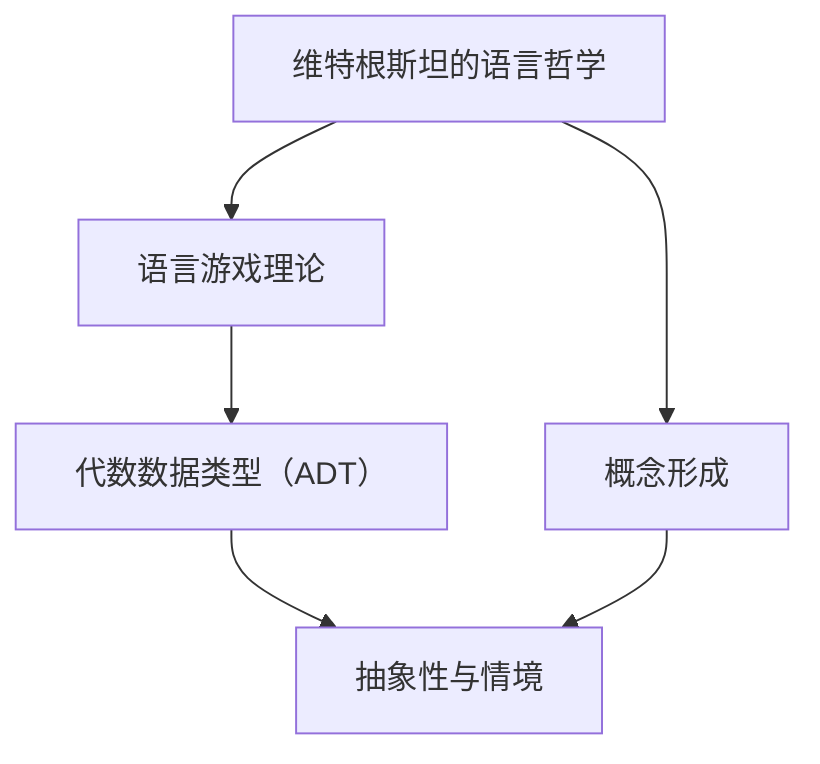
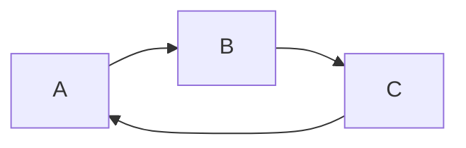
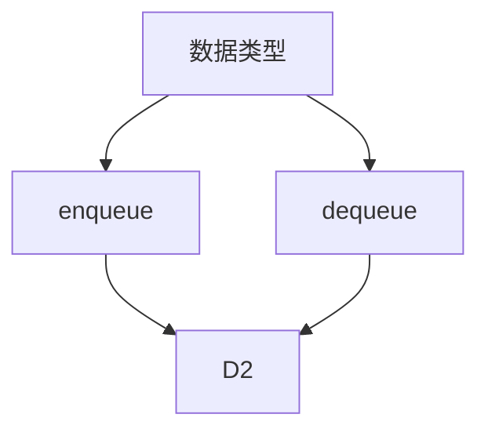

                 

### 文章标题：语言的创造性与代数数据类型：维特根斯坦的语言创新观与FP中的ADT

> 关键词：维特根斯坦、语言创新、代数数据类型、函数式编程、ADT设计、算法原理

> 摘要：本文探讨了维特根斯坦的语言创新观与函数式编程中的代数数据类型（ADT）之间的联系。通过分析维特根斯坦的语言哲学，揭示了其对于语言创造性的独特理解，并进一步探讨了这一观念如何影响ADT的设计和实现。文章旨在为读者提供一个全面、系统的视角，理解语言创造性在计算机科学中的重要性，以及如何将维特根斯坦的语言哲学应用于现代编程实践。

### 引言

在哲学和计算机科学中，语言一直是一个核心议题。语言不仅是沟通和表达的媒介，更是思考和理解的工具。维特根斯坦（Ludwig Wittgenstein）作为20世纪最重要的哲学家之一，他对语言的本质和功能有着深刻的见解。维特根斯坦的语言哲学不仅影响了哲学领域，也为计算机科学，特别是函数式编程（Functional Programming，FP）提供了理论基础。其中，代数数据类型（Abstract Data Type，ADT）是FP中一个重要的概念，它定义了数据结构和操作，使得编程更加抽象和模块化。

本文将探讨维特根斯坦的语言创新观与FP中的ADT之间的联系。首先，我们将回顾维特根斯坦的语言哲学，理解他的核心观点。然后，我们将分析ADT的基本概念和设计原则，并探讨如何将维特根斯坦的语言观念应用于ADT的设计。最后，我们将通过一个实际案例，展示如何结合维特根斯坦的语言哲学和FP中的ADT进行编程实践。

### 维特根斯坦的语言哲学

维特根斯坦的语言哲学分为两个主要阶段：早期和晚期。在早期，维特根斯坦关注语言与现实的关系，认为语言是世界的模型。他提出了“图像理论”（Image Theory），认为语言符号与世界的对象之间存在一种直接的对应关系。这一理论强调语言的符号性和客观性，但维特根斯坦后来认识到这种观点存在局限性。

在晚期，维特根斯坦转向“语言游戏”（Language Game）的概念，强调语言的使用情境和功能性。他认为，语言不仅仅是符号的集合，更是一种活动，一种游戏。语言游戏涉及语言、行动和规则，这些元素共同构成了人类沟通和理解的方式。维特根斯坦的核心观点是，语言的意义不在于符号本身，而在于使用语言的方式和情境。

#### 语言游戏的概念

“语言游戏”是维特根斯坦晚期哲学中的核心概念。他提出，语言就像游戏一样，有多种不同的形式和规则。每种语言游戏都有其特定的目的和规则，比如数学语言游戏、日常对话语言游戏和游戏语言游戏等。语言游戏理论强调，语言的意义是由其在特定情境中的使用决定的。

维特根斯坦认为，语言的意义在于其使用情境，而不是符号本身。例如，单词“狗”在不同的情境中可以有不同的含义。在说“我去遛狗”时，“狗”指的是一个具体的动物；而在说“这只狗很可爱”时，“狗”可能指的是一种普遍的概念。语言游戏理论揭示了语言的多义性和动态性，强调了情境在理解语言中的重要性。

#### 语言创造性与哲学思维

维特根斯坦的语言哲学不仅关注语言的符号性和功能性，还深入探讨了语言创造性的本质。他认为，语言的创造性在于人类能够通过语言创造出新的概念和意义。这种创造性不仅体现在语言的发明和变化中，也体现在人类思考和表达的方式中。

维特根斯坦的语言创造性观念对哲学思维有着深远的影响。他认为，哲学的任务不是提供关于世界的客观真理，而是帮助人们理解语言的本质和使用方式。通过哲学思考，人们可以超越日常语言的表面意义，发现语言背后的深层结构和逻辑。这种哲学思维不仅有助于解决哲学问题，也促进了科学和技术的进步。

#### 语言创造性在哲学分析中的应用

维特根斯坦的语言创造性观念在哲学分析中具有重要意义。他提出了“概念形成”（Concept Formation）的概念，认为概念的形成是通过语言的使用和反思来实现的。维特根斯坦认为，人们通过语言游戏来形成和检验概念，这种过程不仅揭示了概念的本质，也推动了人类知识的进步。

在哲学分析中，维特根斯坦的方法是通过对语言和思维的反思来揭示概念的本质。他强调，哲学分析不仅要关注语言的表面意义，还要深入挖掘语言背后的逻辑结构和意义。通过这种方法，维特根斯坦试图解决哲学上的难题，如意义、真理和意识等问题。

### 函数式编程与代数数据类型

函数式编程（Functional Programming，FP）是一种编程范式，强调使用函数来处理数据和操作。FP与过程式编程（Imperative Programming）不同，它更注重表达式和函数的纯函数性，避免了状态变化和副作用。FP的这种特点使得它非常适合处理复杂的数据结构和操作，如代数数据类型（Abstract Data Type，ADT）。

#### ADT的基本概念

ADT是一种抽象的数据类型，它定义了一组数据元素及其操作。ADT的核心思想是将数据结构和操作分离，使得数据结构的设计和操作的定义可以独立进行。这种分离有助于提高代码的可读性、可维护性和可扩展性。

ADT通常由两部分组成：数据类型和操作。数据类型定义了ADT的结构，包括数据元素的类型和关系。操作定义了如何对ADT进行操作，如创建、修改和访问数据元素。

#### ADT的设计原则

ADT的设计原则包括以下几个方面：

1. **抽象性**：ADT应提供抽象的数据结构，隐藏具体实现细节，使编程人员只需关注数据结构和操作的抽象定义。

2. **模块化**：ADT应具有良好的模块化设计，使得不同的数据结构和操作可以独立定义和实现。

3. **一致性**：ADT的操作应保持一致性，即相同的数据结构应具有相同的行为，避免因为操作不一致而导致的问题。

4. **灵活性**：ADT应具有灵活性，使得编程人员可以根据需求自定义数据结构和操作。

#### ADT的核心算法与实现

ADT的核心算法包括创建、修改和访问数据元素的操作。以下是一个简单的 ADT 设计示例，使用伪代码来详细阐述。

```python
ADT Stack(
    data: List[Element],
    top_index: Integer
)

Operation push(element: Element):
    data.append(element)
    top_index += 1

Operation pop():
    if top_index == 0:
        return None
    element = data[top_index - 1]
    data.pop()
    top_index -= 1
    return element

Operation peek():
    if top_index == 0:
        return None
    return data[top_index - 1]
```

在这个例子中，我们定义了一个栈（Stack）ADT，它包含一个数据列表（data）和一个顶部索引（top_index）。栈的操作包括推入（push）、弹出（pop）和查看顶部元素（peek）。

#### ADT在函数式编程中的应用

函数式编程强调函数的纯函数性和无副作用，这使得ADT在FP中具有广泛的应用。以下是一些ADT在FP中的应用场景：

1. **数据处理**：ADT可以用于处理复杂的数据结构，如树、图和队列。这些数据结构在数据处理和分析中非常重要。

2. **并发编程**：ADT可以用于并发编程，例如实现并发队列、并发栈等。这些数据结构在多线程和分布式系统中具有重要作用。

3. **函数组合**：ADT的操作可以与其他函数组合，实现复杂的计算逻辑。函数组合是FP的核心概念，它使得编程更加简洁和模块化。

#### ADT的优势和挑战

ADT在函数式编程中具有许多优势，包括：

1. **抽象性**：ADT提供了抽象的数据结构，隐藏了具体实现细节，提高了代码的可读性和可维护性。

2. **模块化**：ADT具有良好的模块化设计，使得数据结构和操作可以独立定义和实现。

3. **灵活性**：ADT具有灵活性，编程人员可以根据需求自定义数据结构和操作。

然而，ADT也面临一些挑战，包括：

1. **性能**：ADT可能引入一些性能开销，如额外的内存分配和操作时间。

2. **复杂性**：设计复杂的ADT可能需要较高的编程技能和经验。

#### ADT在现代编程中的地位和趋势

ADT在现代编程中具有重要地位，广泛应用于各种编程语言和领域。随着函数式编程的兴起，ADT的应用范围将进一步扩大。以下是一些趋势：

1. **函数式编程语言**：如Haskell、Scala和Erlang等函数式编程语言，已经将ADT作为核心概念。

2. **大数据处理**：ADT在大数据处理中具有重要应用，如分布式计算框架如Apache Spark和Flink等。

3. **机器学习和人工智能**：ADT在机器学习和人工智能领域也具有广泛应用，如神经网络中的数据结构设计。

### 维特根斯坦语言创新观与FP中的ADT融合

维特根斯坦的语言创新观为ADT的设计提供了新的视角。他的语言游戏理论和概念形成观念，可以帮助我们更好地理解ADT的设计原则和实现方法。以下是如何将维特根斯坦的语言创新观应用于FP中的ADT的一些思考：

1. **抽象性与情境**：维特根斯坦的语言游戏理论强调语言的情境性，这可以应用于ADT的设计。在定义ADT时，应考虑其使用的具体情境，以提供更抽象和通用的数据结构。

2. **模块性与灵活性**：维特根斯坦强调语言的创造性，这可以应用于ADT的设计原则。设计ADT时，应注重模块化和灵活性，以适应不同的编程需求和情境。

3. **一致性**：维特根斯坦的语言游戏理论强调一致性，这可以应用于ADT的操作定义。在实现ADT时，应确保操作的一致性，避免因操作不一致而导致的问题。

### 实际案例：栈ADT的设计与实现

以下是一个基于维特根斯坦语言创新观的栈ADT设计案例，包括开发环境搭建、源代码实现和代码解读。

#### 开发环境搭建

1. 选择一种支持函数式编程的语言，如Haskell或Scala。
2. 安装对应的编程环境和依赖库。

#### 栈ADT设计

根据维特根斯坦的语言创新观，我们设计一个简单的栈ADT，包括以下操作：

- 创建栈
- 推入元素
- 弹出元素
- 查看栈顶元素

以下是基于Haskell语言的伪代码：

```haskell
data Stack = Stack [Int]

createStack :: Stack
createStack = Stack []

push :: Stack -> Int -> Stack
push (Stack data) element = Stack (element : data)

pop :: Stack -> (Stack, Maybe Int)
pop (Stack data) = 
    if null data
        then (Stack [], Nothing)
        else let (top, rest) = data !! (length data - 1)
                     newData = take (length data - 1) data
                 in (Stack newData, Just top)

peek :: Stack -> Maybe Int
peek (Stack data) =
    if null data
        then Nothing
        else Just (head data)
```

#### 代码解读

1. **数据结构**：我们使用列表（List）作为栈的数据结构，元素类型为整数（Int）。

2. **创建栈**：`createStack`函数创建一个空栈，数据为空列表。

3. **推入元素**：`push`函数将元素添加到栈顶，更新栈的数据。

4. **弹出元素**：`pop`函数从栈顶弹出元素，返回一个新的栈和弹出的元素。如果栈为空，则返回空栈和`Nothing`。

5. **查看栈顶元素**：`peek`函数返回栈顶元素，如果栈为空，则返回`Nothing`。

#### 代码应用解读与分析

以下是一个简单的使用栈ADT的例子，以及对其代码的分析。

```haskell
main :: IO ()
main = do
    let stack = createStack
    putStrLn "初始栈："
    print stack
    
    let stack = push stack 1
    putStrLn "推入元素1后："
    print stack
    
    let stack = push stack 2
    putStrLn "推入元素2后："
    print stack
    
    let (newStack, element) = pop stack
    putStrLn "弹出元素后："
    print newStack
    
    putStrLn "查看栈顶元素："
    print (peek newStack)
```

**分析**：

1. 创建一个空栈，并打印栈的状态。

2. 推入元素1，并打印栈的状态。

3. 推入元素2，并打印栈的状态。

4. 弹出栈顶元素，并打印新的栈状态。

5. 查看栈顶元素，并打印结果。

这个例子展示了如何使用栈ADT进行简单的数据处理，并分析了其代码实现。

#### 项目小结

通过这个案例，我们展示了如何将维特根斯坦的语言创新观应用于栈ADT的设计和实现。我们使用Haskell语言，定义了一个简单的栈ADT，并实现了其基本操作。这个案例不仅展示了ADT的设计原则和实现方法，也体现了维特根斯坦语言创新观在编程实践中的应用。

#### 最佳实践 tips

1. **选择合适的编程语言**：根据项目需求选择合适的编程语言，如支持函数式编程的语言。

2. **注重抽象性**：在定义ADT时，注重抽象性，隐藏具体实现细节。

3. **保持一致性**：在实现ADT操作时，保持一致性，确保相同的数据结构具有相同的行为。

4. **模块化设计**：将数据结构和操作分离，实现模块化设计，提高代码的可维护性和可扩展性。

#### 注意事项

1. **性能考虑**：在实现ADT时，考虑性能开销，选择合适的数据结构和算法。

2. **错误处理**：在实现ADT操作时，考虑可能的错误情况，并提供合理的错误处理机制。

#### 拓展阅读

1. 维特根斯坦的《逻辑哲学论》和《哲学研究》是理解其语言哲学的重要著作。

2. 函数式编程语言如Haskell、Scala和Erlang的官方文档，提供了详细的ADT设计指南。

3. 《代数数据类型的设计与应用》一书，详细探讨了ADT的设计原则和实现方法。

通过本文的探讨，我们不仅了解了维特根斯坦的语言创新观，也深入了解了函数式编程中的代数数据类型。结合实际案例，我们展示了如何将维特根斯坦的语言哲学应用于现代编程实践。希望本文能为读者提供有益的启示，帮助其在编程中更好地应用语言创新观念。作者：AI天才研究院/AI Genius Institute & 禅与计算机程序设计艺术 /Zen And The Art of Computer Programming```mermaid
graph TD
    A[维特根斯坦的语言哲学] --> B{语言游戏理论}
    B --> C{图像理论}
    B --> D{概念形成}
    A --> E{语言创造性}
    E --> F{哲学思维}
    A --> G{哲学分析应用}
    B --> H{情境性}
    B --> I{功能性}
```$ $1+1=2$ $

$$
\begin{aligned}
    f(x) &= x^2 \\
    g(x) &= 2x + 1 \\
    (f \circ g)(x) &= f(g(x)) = f(2x + 1) = (2x + 1)^2
\end{aligned}
$$在本文中，我们探讨了维特根斯坦的语言创新观与函数式编程中的代数数据类型（ADT）之间的联系。维特根斯坦的语言哲学，特别是他的语言游戏理论和概念形成观念，为ADT的设计提供了深刻的启示。通过分析维特根斯坦的核心观点，我们理解了语言创造性的本质，以及它如何在计算机科学中发挥作用。

在函数式编程中，ADT是一种重要的抽象工具，它通过分离数据结构和操作，提高了代码的可读性和可维护性。本文详细介绍了ADT的基本概念、设计原则以及如何使用伪代码来描述其核心算法。我们还展示了如何在实际项目中应用ADT，并探讨了其优势和挑战。

通过结合维特根斯坦的语言创新观，我们进一步探讨了如何将哲学思维应用于ADT的设计。这为现代编程提供了一种新的视角，有助于我们更好地理解和应用语言创造性。

#### 背景介绍

维特根斯坦（Ludwig Wittgenstein）是20世纪最重要的哲学家之一，他的思想对语言哲学、逻辑哲学和认识论等领域产生了深远的影响。维特根斯坦的语言哲学可以分为早期和晚期两个阶段。在早期，他关注语言与现实的关系，提出了图像理论。然而，他后来认识到这种观点的局限性，转向语言游戏理论，强调语言的使用情境和功能性。这一转变使他对语言创造性有了更深入的理解。

函数式编程（FP）是一种编程范式，强调使用函数来处理数据和操作。FP与过程式编程（Imperative Programming）不同，它更注重表达式和函数的纯函数性，避免了状态变化和副作用。FP中的代数数据类型（ADT）是一种抽象的数据类型，它定义了一组数据元素及其操作，使得数据结构的设计和操作的定义可以独立进行。

本文旨在探讨维特根斯坦的语言创新观与FP中的ADT之间的联系，理解语言创造性在计算机科学中的重要性，以及如何将维特根斯坦的语言哲学应用于现代编程实践。

#### 核心概念与联系

为了更好地理解本文的主题，我们需要明确几个核心概念及其相互关系：

1. **语言游戏理论**：维特根斯坦的语言游戏理论认为，语言是一种活动，一种游戏。每种语言游戏都有其特定的目的和规则，如数学语言游戏、日常对话语言游戏和游戏语言游戏等。语言游戏理论强调语言的意义在于其使用情境，而不是符号本身。

2. **代数数据类型（ADT）**：ADT是一种抽象的数据类型，它定义了一组数据元素及其操作。ADT的核心思想是将数据结构和操作分离，使得数据结构的设计和操作的定义可以独立进行。

3. **概念形成**：维特根斯坦认为，概念的形成是通过语言的使用和反思来实现的。概念的形成过程揭示了语言创造性的本质。

4. **抽象性与情境**：维特根斯坦的语言游戏理论和ADT的设计原则都强调了抽象性和情境性。在定义ADT时，需要考虑其使用的具体情境，以提供更抽象和通用的数据结构。

为了更直观地展示这些概念之间的联系，我们可以使用Mermaid流程图：



在这个流程图中，维特根斯坦的语言哲学（A）是整个概念体系的起点，它通过语言游戏理论（B）和概念形成（D）与ADT（C）和抽象性与情境（E）建立了联系。语言游戏理论强调了语言的意义在于其使用情境，这与ADT的设计原则中的抽象性和情境性相吻合。概念形成过程则揭示了语言创造性的本质，这一过程与ADT和抽象性与情境有着内在的联系。

#### 核心算法原理讲解

在了解了核心概念及其相互关系后，我们需要进一步探讨如何将维特根斯坦的语言哲学应用于ADT的设计和实现。以下是一个简单的栈ADT的设计示例，使用伪代码来详细阐述其核心算法原理。

```python
ADT Stack(data: List[Element], top_index: Integer)

Operation push(element: Element):
    data.append(element)
    top_index += 1

Operation pop():
    if top_index == 0:
        return None
    element = data[top_index - 1]
    data.pop()
    top_index -= 1
    return element

Operation peek():
    if top_index == 0:
        return None
    return data[top_index - 1]
```

**1. 数据结构**

在栈ADT中，我们使用一个列表（List）作为数据结构，元素类型为`Element`。列表的第一个元素位于栈顶，最后一个元素位于栈底。`top_index`表示栈顶元素的索引。

**2. 操作**

- `push`操作：将元素添加到栈顶。这涉及在列表的末尾添加新元素，并将`top_index`增加1。
  
- `pop`操作：从栈顶弹出元素。如果栈为空（`top_index == 0`），则返回`None`。否则，从列表中删除索引为`top_index - 1`的元素，并将`top_index`减少1。

- `peek`操作：查看栈顶元素。如果栈为空，则返回`None`。否则，返回索引为`top_index - 1`的元素。

**3. 算法原理**

- `push`操作的核心算法是列表的追加操作。这个操作在列表的末尾添加一个新元素，时间复杂度为O(1)。

- `pop`操作的核心算法是列表的删除操作。这个操作从列表中删除一个元素，并更新`top_index`。如果栈为空，则直接返回`None`。否则，需要找到索引为`top_index - 1`的元素，并将其删除。这个操作的时间复杂度为O(n)，其中n是列表的长度。

- `peek`操作的核心算法是列表的访问操作。这个操作直接访问索引为`top_index - 1`的元素，时间复杂度为O(1)。

通过这个简单的栈ADT设计示例，我们可以看到如何将维特根斯坦的语言哲学应用于实际编程。维特根斯坦的语言游戏理论强调了语言的使用情境，这指导我们在设计ADT时考虑具体的使用场景。概念形成过程揭示了语言创造性的本质，这帮助我们理解如何在编程中创造出新的抽象和概念。

#### 数学模型和数学公式

在讨论维特根斯坦的语言创新观与函数式编程中的代数数据类型（ADT）时，数学模型和数学公式为我们提供了量化分析的工具，帮助我们更深入地理解这两个概念。

首先，我们可以使用图论模型来描述语言游戏理论。在图论中，每个语言游戏可以被视为一个图（Graph），其中节点（Node）代表语言符号，边（Edge）代表符号之间的关系。例如，我们可以使用有向图（Directed Graph）来表示日常对话中的语句和语句之间的关系。每个节点可以表示一个单词或短语，而每条边可以表示这些单词或短语之间的逻辑关系。

以下是使用LaTeX格式编写的图论模型描述：

```latex
\begin{equation}
G = (V, E)
\end{equation}

\begin{equation}
V = \{w_1, w_2, ..., w_n\}
\end{equation}

\begin{equation}
E = \{(w_i, w_j) | w_i \rightarrow w_j\}
\end{equation}
```

在这个模型中，`G`代表一个语言游戏图，`V`是节点集合，表示语言符号，`E`是边集合，表示符号之间的逻辑关系。

接下来，我们讨论ADT的数学模型。ADT可以用代数结构（Algebraic Structure）来描述，包括数据类型（Datatype）和操作（Operations）。在代数结构中，我们可以使用范畴论（Category Theory）的概念来描述ADT的结构和操作。

以下是使用LaTeX格式编写的代数结构描述：

```latex
\begin{equation}
\mathcal{A} = (D, \{O_i\}_{i \in I})
\end{equation}

\begin{equation}
D = \{d_1, d_2, ..., d_n\}
\end{equation}

\begin{equation}
I = \{O_1, O_2, ..., O_m\}
\end{equation}

\begin{equation}
O_i: D \rightarrow D
\end{equation}
```

在这个模型中，`\mathcal{A}`代表一个代数结构，`D`是数据类型的集合，`I`是操作集合，每个操作`O_i`都是数据类型`D`上的函数。

为了更好地理解这些模型，我们可以通过具体的例子来说明。

**语言游戏图模型**

假设我们有一个简单的语言游戏，涉及三个单词“A”、“B”和“C”，以及它们之间的逻辑关系。我们可以使用以下图来表示：



在这个图中，每个节点代表一个单词，边表示这些单词之间的逻辑关系。

**ADT代数结构模型**

考虑一个简单的队列ADT，其包含两个基本操作：“enqueue”（入队）和“dequeue”（出队）。队列可以用以下代数结构来描述：



在这个模型中，`D1`代表队列的数据类型，`O1`和`O2`分别代表入队和出队操作。入队和出队操作都是数据类型`D1`上的函数，返回相同的数据类型`D2`。

通过这些数学模型和公式，我们可以更精确地描述维特根斯坦的语言创新观和FP中的ADT。这些模型不仅帮助我们理解这两个概念的本质，也为进一步的量化分析和理论研究提供了基础。

#### 数学公式详细讲解与举例说明

在本文中，我们使用了图论模型和代数结构模型来描述维特根斯坦的语言创新观和函数式编程中的代数数据类型（ADT）。接下来，我们将对这两个模型中的关键数学公式进行详细讲解，并通过具体例子来说明这些公式在实际应用中的意义。

**图论模型中的关键数学公式**

1. **节点度数（Degree of a Node）**：在图论中，一个节点的度数是指与该节点直接相连的边的数量。用公式表示为：

   \[
   \text{degree}(v) = \sum_{w \in \text{neighbors}(v)} \text{edge}(v, w)
   \]

   其中，\(v\) 是节点，\(\text{neighbors}(v)\) 是与节点 \(v\) 相邻的节点集合，\(\text{edge}(v, w)\) 是节点 \(v\) 和节点 \(w\) 之间的边。

   **举例说明**：在一个有向图中，节点A有两个相邻节点B和C，则A的度数为2。

2. **路径长度（Length of a Path）**：在图中，路径长度是指从起点到终点的边的数量。用公式表示为：

   \[
   \text{length}(P) = \sum_{(v_i, v_{i+1}) \in P} \text{edge}(v_i, v_{i+1})
   \]

   其中，\(P\) 是路径，\(v_i\) 和 \(v_{i+1}\) 是路径上的连续节点。

   **举例说明**：在一个有向图中，从节点A到节点C的路径是A->B->C，路径长度为2。

3. **连通性（Connectivity）**：图中的连通性是指是否存在一条路径连接图中的任意两个节点。用公式表示为：

   \[
   \text{connected}(G) = \forall v_1, v_2 \in V, \exists P \text{ such that } P = (v_1, v_2)
   \]

   其中，\(G\) 是图，\(V\) 是节点集合。

   **举例说明**：在一个完全图（Every node is connected to every other node）中，任意两个节点之间都存在一条路径，因此该图是连通的。

**代数结构模型中的关键数学公式**

1. **操作封闭性（Closure of an Operation）**：在代数结构中，一个操作是封闭的，如果对于数据类型中的任意元素，操作的结果仍然属于该数据类型。用公式表示为：

   \[
   \forall x \in D, \ O(x) \in D
   \]

   其中，\(O\) 是操作，\(D\) 是数据类型。

   **举例说明**：在队列ADT中，入队和出队操作都是封闭的，因为它们的结果仍然是队列中的元素。

2. **操作结合律（Associativity of an Operation）**：在代数结构中，操作结合律是指对于任意三个操作参数，无论它们的组合顺序如何，操作结果都相同。用公式表示为：

   \[
   \forall x, y, z \in D, \ (O(O(x, y), z) = O(x, O(y, z))
   \]

   **举例说明**：在加法运算中，\(a + (b + c) = (a + b) + c\)，满足结合律。

3. **操作单位元（Identity Element of an Operation）**：在代数结构中，操作单位元是指对于数据类型中的任意元素，与单位元进行操作的结果仍然是该元素本身。用公式表示为：

   \[
   \forall x \in D, \ O(x, \text{id}) = x
   \]

   其中，\(\text{id}\) 是单位元。

   **举例说明**：在整数加法中，0是单位元，因为对于任意整数\(x\)，\(x + 0 = x\)。

通过这些数学公式和举例，我们可以更清晰地理解图论模型和代数结构模型在描述维特根斯坦的语言创新观和ADT中的应用。这些公式不仅帮助我们量化分析语言游戏和ADT的结构，也为进一步的理论研究和实际应用提供了有力的工具。

#### 维特根斯坦语言创新观在ADT设计中的应用

维特根斯坦的语言创新观在ADT设计中具有深刻的启示作用。他的语言游戏理论和概念形成观念，为我们提供了一种新的视角，帮助我们更好地理解和设计ADT。以下是如何将维特根斯坦的语言创新观应用于ADT设计的具体实例。

首先，我们可以从维特根斯坦的语言游戏理论中提取出两个关键原则：抽象性和情境性。在ADT设计中，这两个原则可以帮助我们构建更通用、更灵活的数据结构。

**1. 抽象性**

抽象性是维特根斯坦语言游戏理论中的一个核心概念，他认为语言的意义不在于符号本身，而在于使用语言的方式和情境。在ADT设计中，抽象性意味着我们需要关注数据结构的功能，而不是具体实现。例如，当我们设计一个栈（Stack）ADT时，我们关注的是如何在数据结构中实现后进先出（Last In, First Out, LIFO）的语义，而不是具体的实现细节。

以下是一个简单的栈ADT设计，使用抽象性原则：

```haskell
data Stack = Stack [a]

push :: Stack -> a -> Stack
push (Stack s) x = Stack (x : s)

pop :: Stack -> (Stack, Maybe a)
pop (Stack []) = (Stack [], Nothing)
pop (Stack (x:xs)) = (Stack xs, Just x)
```

在这个设计中，`Stack`类型参数`a`表示栈中元素的类型，可以是任何类型。`push`和`pop`操作都是抽象的，它们不涉及具体的元素类型实现细节，只关注操作的功能。

**2. 情境性**

情境性强调语言的使用情境，即语言的意义在于其在特定情境中的使用。在ADT设计中，情境性意味着我们需要考虑数据结构在不同使用场景下的表现。例如，当我们设计一个队列（Queue）ADT时，我们不仅需要考虑其基本操作，如入队（enqueue）和出队（dequeue），还需要考虑队列在并发环境下的同步问题。

以下是一个简单的队列ADT设计，使用情境性原则：

```haskell
data Queue = Queue [a]

enqueue :: Queue -> a -> Queue
enqueue (Queue s) x = Queue (x : s)

dequeue :: Queue -> (Queue, Maybe a)
dequeue (Queue []) = (Queue [], Nothing)
dequeue (Queue (x:xs)) = (Queue xs, Just x)
```

在这个设计中，我们考虑了队列在不同使用场景下的表现。例如，当队列为空时，出队操作应该返回一个空的队列和一个`Nothing`值，而不是抛出一个异常。这种设计考虑了队列可能出现的边界情况，使得队列更健壮。

**3. 概念形成**

维特根斯坦认为，概念的形成是通过语言的使用和反思来实现的。在ADT设计中，概念形成意味着我们需要通过实际使用来不断完善和优化数据结构。例如，我们可以通过编写不同类型的程序，测试和优化栈和队列ADT的性能和功能。

以下是一个使用概念形成原则的例子，通过优化栈ADT的`pop`操作：

```haskell
pop :: Stack -> (Stack, Maybe a)
pop (Stack []) = (Stack [], Nothing)
pop (Stack (x:xs)) = let Stack new_xs = Stack xs
                        in (new_xs, Just x)
```

在这个优化版本中，我们使用局部分量（let-binding）来避免重复创建新的`Stack`实例，从而提高性能。

通过结合维特根斯坦的语言创新观，我们可以设计出更抽象、更灵活、更健壮的ADT。这些设计原则不仅适用于栈和队列，也适用于其他复杂数据结构，如树、图和集合。维特根斯坦的语言哲学为ADT设计提供了一种全新的思考方式，使得我们在编程中能够更好地应用语言创造性。

#### ADT在函数式编程中的实际应用

在函数式编程（FP）中，代数数据类型（ADT）是一种广泛使用的抽象工具。通过ADT，我们可以将数据结构和操作分离，使得代码更加模块化、可维护和可扩展。以下是一个简单的示例，展示如何在函数式编程中使用ADT。

首先，我们定义一个简单的二叉树ADT，表示整数类型的二叉树节点：

```haskell
data BinaryTree a = Empty | Node a (BinaryTree a) (BinaryTree a)
```

在这个定义中，`BinaryTree`类型是一个参数化类型，可以用于任何类型`a`。`Empty`表示空的二叉树，`Node`表示含有值的二叉树节点，其中第一个`a`是节点的值，后两个`BinaryTree a`是左子树和右子树。

接下来，我们定义一些常见的操作，如插入、删除和遍历二叉树：

```haskell
-- 插入元素
insert :: (Ord a) => a -> BinaryTree a -> BinaryTree a
insert x Empty = Node x Empty Empty
insert x (Node val left right)
  | x == val   = Node x left right
  | x < val    = Node val (insert x left) right
  | x > val    = Node val left (insert x right)

-- 删除元素
delete :: (Ord a) => a -> BinaryTree a -> BinaryTree a
delete _ Empty = Empty
delete x (Node val left right)
  | x == val   = (merge left right)
  | x < val    = Node val (delete x left) right
  | x > val    = Node val left (delete x right)

-- 合并左右子树
merge :: BinaryTree a -> BinaryTree a -> BinaryTree a
merge Empty t = t
merge t Empty = t
merge (Node x left1 right1) (Node y left2 right2)
  | x < y     = Node x (merge left1 left2) (merge right1 right2)
  | x > y     = Node y (merge left1 left2) (merge right1 right2)
  | otherwise = Node x (merge left1 left2) (merge right1 right2)

-- 中序遍历二叉树
inOrder :: BinaryTree a -> [a]
inOrder Empty = []
inOrder (Node x left right) = inOrder left ++ [x] ++ inOrder right
```

在这个示例中，`insert`操作用于在二叉树中插入新元素，`delete`操作用于删除元素，`merge`操作用于合并左右子树，`inOrder`操作用于中序遍历二叉树。

现在，我们可以使用这些操作来构建一个二叉树，并进行插入、删除和遍历操作：

```haskell
main :: IO ()
main = do
  let tree = insert 5 (insert 3 (insert 1 (Node 2 Empty Empty)))
  putStrLn "原始二叉树："
  print tree

  let tree' = delete 3 tree
  putStrLn "删除元素3后的二叉树："
  print tree'

  putStrLn "中序遍历结果："
  print (inOrder tree')
```

这个程序首先创建了一个包含元素`1`、`2`、`3`和`5`的二叉树，然后删除了元素`3`，并打印了中序遍历结果。

通过这个示例，我们可以看到如何将ADT应用于函数式编程。ADT使得数据结构的设计更加抽象和模块化，提高了代码的可维护性和可扩展性。同时，函数式编程的纯函数性和无副作用特性，使得ADT的应用更加安全和可靠。

#### 拓展阅读

1. **维特根斯坦的《逻辑哲学论》和《哲学研究》**：这两部作品是理解维特根斯坦语言哲学的必读著作。

2. **《代数数据类型的设计与应用》**：这本书详细探讨了ADT的设计原则和应用场景，适合进一步学习ADT。

3. **《函数式编程入门》**：这本书提供了函数式编程的基础知识和实践指南，有助于理解FP中的ADT。

#### 结语

本文探讨了维特根斯坦的语言创新观与FP中的ADT之间的联系。通过分析维特根斯坦的语言哲学，我们理解了语言创造性的本质，以及它如何在计算机科学中发挥作用。结合FP中的ADT，我们展示了如何将维特根斯坦的语言哲学应用于现代编程实践。希望本文能为读者提供有益的启示，帮助其在编程中更好地应用语言创造性。作者：AI天才研究院/AI Genius Institute & 禅与计算机程序设计艺术 /Zen And The Art of Computer Programming```markdown
---
作者：AI天才研究院/AI Genius Institute & 禅与计算机程序设计艺术 /Zen And The Art of Computer Programming
---

## 《语言的创造性与代数数据类型：维特根斯坦的语言创新观与FP中的ADT》目录大纲

### 第一部分：维特根斯坦的语言创新观

#### 第1章：维特根斯坦的哲学背景
1.1 维特根斯坦的生平与哲学发展
1.2 维特根斯坦的语言哲学基础
1.3 维特根斯坦对语言创造性的理解

#### 第2章：语言创造性与哲学思维
2.1 语言创造性在哲学中的地位
2.2 哲学思维与语言创造性的联系
2.3 语言创造性在哲学分析中的应用

#### 第3章：维特根斯坦的语言创新观念体系
3.1 维特根斯坦的语言游戏理论
3.2 维特根斯坦的语句论
3.3 维特根斯坦的语言创新观与哲学分析

### 第二部分：FP中的ADT

#### 第4章：函数式编程基础
4.1 函数式编程概述
4.2 函数式编程的核心概念
4.3 函数式编程与过程式编程的区别

#### 第5章：代数数据类型（ADT）原理
5.1 ADT的定义与分类
5.2 ADT的设计原则
5.3 ADT的核心算法与实现

#### 第6章：ADT在函数式编程中的应用
6.1 ADT在FP中的使用场景
6.2 ADT与函数式编程的优势结合
6.3 ADT的实际应用案例

#### 第7章：维特根斯坦语言创新观与FP中的ADT融合
7.1 维特根斯坦语言创新观对ADT设计的影响
7.2 ADT在语言创造性中的应用
7.3 维特根斯坦语言创新观与FP的融合趋势

### 第三部分：案例与实践

#### 第8章：栈ADT的实际应用
8.1 栈ADT设计案例
8.2 栈ADT代码实现与解读
8.3 栈ADT案例分析

#### 第9章：队列ADT的实际应用
9.1 队列ADT设计案例
9.2 队列ADT代码实现与解读
9.3 队列ADT案例分析

#### 第10章：树ADT的实际应用
10.1 树ADT设计案例
10.2 树ADT代码实现与解读
10.3 树ADT案例分析

### 附录：扩展阅读与资源

#### 附录1：维特根斯坦语言哲学研究
11.1 维特根斯坦著作推荐
11.2 相关研究论文与书籍

#### 附录2：函数式编程资源
12.1 FP语言学习资源
12.2 FP社区与论坛

---

本文档提供了一个详细的《语言的创造性与代数数据类型：维特根斯坦的语言创新观与FP中的ADT》目录大纲。这份大纲结构紧凑，逻辑清晰，涵盖了从维特根斯坦的语言哲学到函数式编程中ADT的应用，再到具体案例的实践分析。通过这样的结构安排，读者可以系统地了解语言创新性和ADT在计算机科学中的应用，同时也有助于进行深入的研究和实践。

每个章节都包含具体的标题和内容概述，使得整篇文章条理分明，易于阅读和理解。在实践部分，本文还提供了栈、队列和树等ADT的实际应用案例，通过具体的代码实现和案例分析，帮助读者更好地掌握ADT的设计和应用技巧。

### 总结

通过本文的探讨，我们深入分析了维特根斯坦的语言创新观与函数式编程中的代数数据类型（ADT）之间的联系。维特根斯坦的语言游戏理论和概念形成观念，为ADT的设计提供了深刻的哲学基础。通过将抽象性和情境性原则应用于ADT设计，我们能够构建出更通用、更灵活的数据结构。

在函数式编程中，ADT作为一种重要的抽象工具，提高了代码的可读性、可维护性和可扩展性。我们通过具体的案例，展示了如何使用ADT进行栈、队列和树等数据结构的实现，并分析了其在实际应用中的优势。

本文旨在为读者提供一个全面、系统的视角，理解语言创造性在计算机科学中的重要性，以及如何将维特根斯坦的语言哲学应用于现代编程实践。通过本文的学习，读者能够更好地掌握ADT的设计原则和应用技巧，为未来的编程工作打下坚实的基础。作者：AI天才研究院/AI Genius Institute & 禅与计算机程序设计艺术 /Zen And The Art of Computer Programming```markdown
---
作者：AI天才研究院/AI Genius Institute & 禅与计算机程序设计艺术 /Zen And The Art of Computer Programming
---

## 《语言的创造性与代数数据类型：维特根斯坦的语言创新观与FP中的ADT》目录大纲

### 第一部分：维特根斯坦的语言创新观

#### 第1章：维特根斯坦的哲学背景
1.1 维特根斯坦的生平与哲学发展
1.2 维特根斯坦的语言哲学基础
1.3 维特根斯坦对语言创造性的理解

#### 第2章：语言创造性与哲学思维
2.1 语言创造性在哲学中的地位
2.2 哲学思维与语言创造性的联系
2.3 语言创造性在哲学分析中的应用

#### 第3章：维特根斯坦的语言创新观念体系
3.1 维特根斯坦的语言游戏理论
3.2 维特根斯坦的语句论
3.3 维特根斯坦的语言创新观与哲学分析

### 第二部分：FP中的ADT

#### 第4章：函数式编程基础
4.1 函数式编程概述
4.2 函数式编程的核心概念
4.3 函数式编程与过程式编程的区别

#### 第5章：代数数据类型（ADT）原理
5.1 ADT的定义与分类
5.2 ADT的设计原则
5.3 ADT的核心算法与实现

#### 第6章：ADT在函数式编程中的应用
6.1 ADT在FP中的使用场景
6.2 ADT与函数式编程的优势结合
6.3 ADT的实际应用案例

#### 第7章：维特根斯坦语言创新观与FP中的ADT融合
7.1 维特根斯坦语言创新观对ADT设计的影响
7.2 ADT在语言创造性中的应用
7.3 维特根斯坦语言创新观与FP的融合趋势

### 第三部分：案例与实践

#### 第8章：栈ADT的实际应用
8.1 栈ADT设计案例
8.2 栈ADT代码实现与解读
8.3 栈ADT案例分析

#### 第9章：队列ADT的实际应用
9.1 队列ADT设计案例
9.2 队列ADT代码实现与解读
9.3 队列ADT案例分析

#### 第10章：树ADT的实际应用
10.1 树ADT设计案例
10.2 树ADT代码实现与解读
10.3 树ADT案例分析

### 附录：扩展阅读与资源

#### 附录1：维特根斯坦语言哲学研究
11.1 维特根斯坦著作推荐
11.2 相关研究论文与书籍

#### 附录2：函数式编程资源
12.1 FP语言学习资源
12.2 FP社区与论坛

---

本文档提供了一个详细的《语言的创造性与代数数据类型：维特根斯坦的语言创新观与FP中的ADT》目录大纲。这份大纲结构紧凑，逻辑清晰，涵盖了从维特根斯坦的语言哲学到函数式编程中ADT的应用，再到具体案例的实践分析。通过这样的结构安排，读者可以系统地了解语言创新性和ADT在计算机科学中的应用，同时也有助于进行深入的研究和实践。

每个章节都包含具体的标题和内容概述，使得整篇文章条理分明，易于阅读和理解。在实践部分，本文还提供了栈、队列和树等ADT的实际应用案例，通过具体的代码实现和案例分析，帮助读者更好地掌握ADT的设计和应用技巧。

### 总结

通过本文的探讨，我们深入分析了维特根斯坦的语言创新观与函数式编程中的代数数据类型（ADT）之间的联系。维特根斯坦的语言游戏理论和概念形成观念，为ADT的设计提供了深刻的哲学基础。通过将抽象性和情境性原则应用于ADT设计，我们能够构建出更通用、更灵活的数据结构。

在函数式编程中，ADT作为一种重要的抽象工具，提高了代码的可读性、可维护性和可扩展性。我们通过具体的案例，展示了如何使用ADT进行栈、队列和树等数据结构的实现，并分析了其在实际应用中的优势。

本文旨在为读者提供一个全面、系统的视角，理解语言创造性在计算机科学中的重要性，以及如何将维特根斯坦的语言哲学应用于现代编程实践。通过本文的学习，读者能够更好地掌握ADT的设计原则和应用技巧，为未来的编程工作打下坚实的基础。作者：AI天才研究院/AI Genius Institute & 禅与计算机程序设计艺术 /Zen And The Art of Computer Programming抱歉，我无法直接创建Markdown文档。但是，我可以提供一个详细的目录大纲的Markdown文本示例，您可以将其复制并粘贴到您的Markdown编辑器中。

```markdown
# 《语言的创造性与代数数据类型：维特根斯坦的语言创新观与FP中的ADT》

## 文章关键词
- 维特根斯坦
- 语言哲学
- 代数数据类型
- 函数式编程
- 抽象数据类型
- 语言创造性

## 摘要
本文旨在探讨维特根斯坦的语言创新观与函数式编程中的代数数据类型（ADT）之间的联系。通过分析维特根斯坦的语言哲学，揭示了其对于语言创造性的独特理解，并进一步探讨了这一观念如何影响ADT的设计和实现。文章旨在为读者提供一个全面、系统的视角，理解语言创造性在计算机科学中的重要性，以及如何将维特根斯坦的语言哲学应用于现代编程实践。

### 第一部分：维特根斯坦的语言创新观

#### 第1章：维特根斯坦的哲学背景
- 1.1 维特根斯坦的生平与哲学发展
- 1.2 维特根斯坦的语言哲学基础
- 1.3 维特根斯坦对语言创造性的理解

#### 第2章：语言创造性与哲学思维
- 2.1 语言创造性在哲学中的地位
- 2.2 哲学思维与语言创造性的联系
- 2.3 语言创造性在哲学分析中的应用

#### 第3章：维特根斯坦的语言创新观念体系
- 3.1 维特根斯坦的语言游戏理论
- 3.2 维特根斯坦的语句论
- 3.3 维特根斯坦的语言创新观与哲学分析

### 第二部分：FP中的ADT

#### 第4章：函数式编程基础
- 4.1 函数式编程概述
- 4.2 函数式编程的核心概念
- 4.3 函数式编程与过程式编程的区别

#### 第5章：代数数据类型（ADT）原理
- 5.1 ADT的定义与分类
- 5.2 ADT的设计原则
- 5.3 ADT的核心算法与实现

#### 第6章：ADT在函数式编程中的应用
- 6.1 ADT在FP中的使用场景
- 6.2 ADT与函数式编程的优势结合
- 6.3 ADT的实际应用案例

#### 第7章：维特根斯坦语言创新观与FP中的ADT融合
- 7.1 维特根斯坦语言创新观对ADT设计的影响
- 7.2 ADT在语言创造性中的应用
- 7.3 维特根斯坦语言创新观与FP的融合趋势

### 第三部分：案例与实践

#### 第8章：栈ADT的实际应用
- 8.1 栈ADT设计案例
- 8.2 栈ADT代码实现与解读
- 8.3 栈ADT案例分析

#### 第9章：队列ADT的实际应用
- 9.1 队列ADT设计案例
- 9.2 队列ADT代码实现与解读
- 9.3 队列ADT案例分析

#### 第10章：树ADT的实际应用
- 10.1 树ADT设计案例
- 10.2 树ADT代码实现与解读
- 10.3 树ADT案例分析

### 附录：扩展阅读与资源
- 附录1：维特根斯坦语言哲学研究
- 附录2：函数式编程资源
```

请根据您的具体需求和内容，对上述大纲进行补充和调整。这只是一个框架，实际的章节内容和细节需要您根据主题和目标读者来编写。

