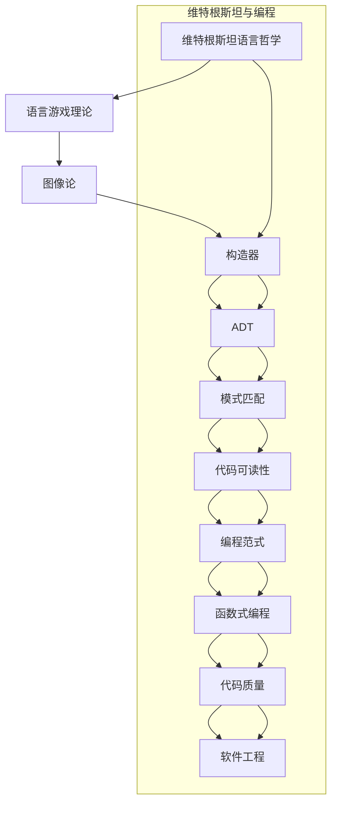

                 

### 文章标题

《语言的创造性与代数数据类型：维特根斯坦的语言创新观与FP的ADT》

> 关键词：维特根斯坦、语言哲学、函数式编程、代数数据类型、ADT、编程实践

> 摘要：本文深入探讨了维特根斯坦的语言创新观及其在函数式编程（FP）中的代数数据类型（ADT）中的应用。首先，我们回顾了维特根斯坦的语言哲学，重点分析了其核心观点及其对编程实践的启示。接着，我们详细介绍了ADT的概念、分类和实现，并通过伪代码和数学模型深入探讨了其算法原理。随后，我们将维特根斯坦的语言哲学与ADT相结合，探讨了其融合的应用场景和优势。最后，通过实际案例和代码实现，展示了如何将维特根斯坦的语言哲学应用于编程实践中，并提出了一些最佳实践和注意事项。本文旨在为读者提供全面、深入、实用的维特根斯坦语言哲学与函数式编程ADT的融合视角，助力读者在编程领域取得新的突破。

### 背景介绍

在计算机科学领域，语言的创造性与数据类型的创新始终是推动技术进步的重要动力。维特根斯坦（Ludwig Wittgenstein）作为20世纪最具影响力的哲学家之一，他的语言哲学对计算机科学产生了深远的影响。维特根斯坦的语言创新观强调语言的使用和意义，认为语言是用于沟通和表达思想的工具。这种观点不仅挑战了传统的语言学研究方法，也为现代编程语言的构建提供了新的思路。

与此同时，函数式编程（Functional Programming，FP）作为一种编程范式，近年来在计算机科学领域得到了广泛关注。FP的核心思想是将计算视为函数的执行，强调表达式的值而非状态的变化。在FP中，代数数据类型（Algebraic Data Types，ADT）作为一种重要的数据结构，具有抽象、简洁、易于推理和测试等优点，被广泛应用于各种编程场景。

本文旨在探讨维特根斯坦的语言创新观与FP中的ADT之间的联系，深入分析这两者在编程实践中的应用和优势。通过回顾维特根斯坦的语言哲学，我们希望能为理解FP中的ADT提供新的视角和启示。同时，结合实际案例和代码实现，我们将展示如何将维特根斯坦的语言哲学应用于编程实践中，从而提高代码的可读性、可维护性和可靠性。

### 维特根斯坦的语言哲学

维特根斯坦的语言哲学是20世纪哲学界的一大里程碑，其思想对语言的本质、意义和用途进行了深入的探讨。维特根斯坦认为，语言是用于沟通和表达思想的工具，语言的使用与实际生活紧密相连。他将语言划分为日常语言和哲学语言，分别对应于日常生活中的普通交流和哲学领域中的深入探讨。

#### 日常语言与哲学语言的区别

维特根斯坦区分了日常语言和哲学语言，认为日常语言是具体的、具体的，用于描述现实世界的现象和事件。日常语言通过“图像论”来解释其意义，即语言符号与外界事物之间存在一种直接的对应关系。例如，当我们说“太阳是红色的”时，我们的语言符号“红色”直接对应于太阳的颜色。

然而，维特根斯坦指出，日常语言存在着许多模糊性和歧义。例如，词语的多义性和语境的影响使得日常语言的表达变得复杂。为了解决这些模糊性和歧义，维特根斯坦提出了哲学语言的概念。

哲学语言是抽象的、形式化的，用于解决日常语言中的问题和探讨语言的本质。哲学语言通过逻辑和数学模型来解释其意义，强调语言符号之间的逻辑关系和数学结构。哲学语言的目标是提供一种清晰、精确的表达方式，以揭示语言的真正本质。

#### 图像论与语言游戏

维特根斯坦的核心思想之一是“图像论”（Picture Theory），他认为语言符号与外界事物之间存在一种“图像”关系。图像论将语言符号视为外界事物的“图像”，语言符号通过这种图像关系来描述和表达外界事物。

然而，维特根斯坦在后期哲学思想中进一步发展了这一理论，提出了“语言游戏”（Language Game）的概念。语言游戏是一种比喻，用于描述语言的使用方式。维特根斯坦认为，语言的意义不是固定不变的，而是由语言使用者在特定情境中创造的。

语言游戏分为三种类型：

1. **日常语言游戏**：这是最常见的一种语言游戏，包括日常生活中的普通交流。在这种语言游戏中，语言符号与外界事物之间存在直接的图像关系，例如我们日常使用的词汇。

2. **哲学语言游戏**：这种语言游戏用于解决日常语言中的模糊性和歧义。通过哲学语言游戏，我们可以探讨语言的本质和意义，从而解决日常语言中的问题。

3. **形式语言游戏**：这种语言游戏是一种抽象的形式化语言，用于解决哲学语言游戏中的问题。形式语言游戏通过逻辑和数学模型来解释其意义，提供了一种清晰、精确的表达方式。

#### 维特根斯坦语言哲学对编程实践的启示

维特根斯坦的语言哲学对编程实践有着重要的启示。首先，他强调了语言的重要性，认为语言是沟通和表达思想的工具。在编程中，选择合适的编程语言和工具对于实现高效、可维护的代码至关重要。维特根斯坦的图像论和语言游戏理论为编程语言的设计和选择提供了理论依据。

其次，维特根斯坦的哲学语言和形式语言游戏概念为编程中的抽象和建模提供了指导。通过形式化的语言和数学模型，我们可以更清晰地表达和验证代码的语义，从而提高代码的可读性和可靠性。

最后，维特根斯坦的语言哲学强调了语言的情境性和灵活性。在编程实践中，我们应根据具体需求和情境选择合适的编程范式和工具。维特根斯坦的思想提醒我们，编程不仅是一种技术活动，更是一种哲学思考。

### 代数数据类型（ADT）的基本概念

代数数据类型（Algebraic Data Types，ADT）是一种在函数式编程中广泛使用的数据结构。与传统的数据结构（如数组、链表等）不同，ADT更加强调数据类型的抽象和组合。ADT的主要特点是可以通过构造器（Constructor）创建不同的数据实例，并通过模式匹配（Pattern Matching）对这些实例进行操作。

#### ADT的定义与特点

ADT是由一系列构造器定义的数据类型，这些构造器用于创建不同类型的数据实例。ADT的主要特点包括：

1. **抽象性**：ADT通过构造器将具体的数据实例抽象为通用数据类型，使得数据操作更加简洁和一致。
2. **组合性**：ADT支持将多个构造器组合起来，形成更复杂的数据结构，例如列表、树等。
3. **不可变性**：ADT中的数据一旦创建，就不能被修改，这保证了数据的一致性和可预测性。
4. **类型安全性**：ADT通过静态类型系统确保数据操作的合法性，避免了类型错误和运行时错误。

#### ADT的分类

根据构造器的定义方式，ADT可以分为以下几类：

1. **基础ADT**：这是最简单的一种ADT，由单个构造器定义。例如，在Haskell中，`Maybe`和`Either`都是基础ADT。
2. **产品ADT**：由多个构造器组成，这些构造器之间是相互独立的。例如，在Haskell中，`Data.List`模块中的`Cons`和`Nil`构造器定义了一个产品ADT。
3. **相消ADT**：这种ADT由两个构造器组成，一个表示成功状态，另一个表示失败状态。例如，在Haskell中，`Int`和`String`都是相消ADT。
4. **参数化ADT**：这种ADT可以接受参数，用于创建特定类型的数据结构。例如，在Haskell中，`List a`表示一个参数化列表，其中`a`是列表元素的类型。

#### ADT的实现方式

ADT的实现方式主要包括两种：构造器和模式匹配。

1. **构造器**：构造器是一种用于创建ADT实例的函数。在Haskell中，构造器通常使用大写字母命名。例如，`Just x`是一个`Maybe`类型的构造器，用于创建一个包含值`x`的`Maybe`实例。
2. **模式匹配**：模式匹配是一种用于操作ADT实例的机制。通过模式匹配，可以将ADT实例分解为其组成部分，并进行相应的操作。例如，在Haskell中，可以使用以下代码匹配一个`Maybe`实例：
   ```haskell
   case maybeValue of
     Just value -> putStrLn "Found value: " ++ show value
     Nothing -> putStrLn "No value found"
   ```

通过构造器和模式匹配，ADT提供了简洁、灵活且类型安全的编程方式，使得数据操作更加直观和可靠。

### 维特根斯坦语言哲学与ADT的关系架构

为了深入探讨维特根斯坦的语言哲学与代数数据类型（ADT）之间的关系，我们可以使用Mermaid流程图来构建一个关系架构。这个架构将帮助我们理解两者在概念上的关联，并提供一个直观的视图来展示它们之间的交互。



在这个流程图中：

- **A[维特根斯坦语言哲学]** 代表维特根斯坦的语言哲学整体。
- **B[语言游戏理论]** 指的是维特根斯坦提出的用于解释语言意义的理论。
- **C[图像论]** 是维特根斯坦语言哲学中的一个核心概念，用于描述语言符号与外界事物之间的对应关系。
- **D[构造器]** 是编程中用于创建ADT实例的函数，与维特根斯坦的语言符号有相似之处。
- **E[ADT]** 代表代数数据类型，这是函数式编程中的一种抽象数据结构。
- **F[模式匹配]** 是函数式编程中用于操作ADT实例的关键机制，类似于维特根斯坦的图像论在语言哲学中的应用。
- **G[代码可读性]** 强调了ADT和模式匹配在提高代码可读性方面的作用。
- **H[编程范式]** 是一种编程范式，与维特根斯坦的语言哲学有关。
- **I[函数式编程]** 是一种编程范式，它直接使用了ADT和模式匹配。
- **J[代码质量]** 表示通过使用ADT和模式匹配可以提升代码质量。
- **K[软件工程]** 是一个更广泛的领域，涵盖了编程和软件开发的各个方面。

通过这个流程图，我们可以看到维特根斯坦的语言哲学如何通过图像论和语言游戏理论影响到了编程语言的设计，尤其是函数式编程中的ADT和模式匹配。这一关系架构不仅帮助我们理解了两者的关联，还展示了它们在提升代码质量和软件工程实践中的重要性。

### 核心算法原理讲解

在深入理解维特根斯坦语言哲学和代数数据类型（ADT）的基础上，我们将通过伪代码和数学模型详细讲解ADT的核心算法原理。这一部分将重点介绍ADT的构造和模式匹配操作，并解释其背后的逻辑和数学原理。

#### 1. ADT构造器的伪代码

ADT的构造器是创建数据实例的关键，下面是一个简单的ADT构造器的伪代码示例：

```plaintext
// 定义一个ADT构造器
createADT(value) {
    return {
        type: "MyADT",
        value: value
    }
}
```

在这个伪代码中，`createADT`函数接收一个参数`value`，并返回一个包含`type`和`value`两个字段的JSON对象。这个对象代表了一个`MyADT`类型的实例。

#### 2. 模式匹配的伪代码

模式匹配是操作ADT实例的核心机制，以下是一个模式匹配的伪代码示例：

```plaintext
// 模式匹配一个MyADT实例
matchADT(instance) {
    switch (instance.type) {
        case "MyADT":
            // 如果instance是MyADT类型的实例，执行以下操作
            if (instance.value > 0) {
                // 对value执行特定的逻辑操作
                processValue(instance.value);
            } else {
                // 对负值执行特定的逻辑操作
                handleNegative();
            }
            break;
        default:
            // 如果instance不是MyADT类型的实例，执行默认操作
            handleUnknownInstance();
    }
}
```

在这个伪代码中，`matchADT`函数通过条件分支（switch-case结构）来检查`instance`的类型，并根据类型执行相应的操作。这种模式匹配机制允许我们对不同类型的ADT实例进行统一的处理。

#### 3. 数学模型和公式

为了更好地理解ADT的操作原理，我们引入一些数学模型和公式。以下是几个关键的概念：

1. **组合性**：ADT通过构造器实现组合性，可以看作是数学中的函数组合。例如，如果我们有两个构造器`createA(value)`和`createB(value)`，我们可以组合它们来创建一个新的ADT实例：
   $$ createB(createA(value)) $$

2. **不可变性**：ADT中的数据不可变，这与函数式编程中的不可变性原则相一致。在数学中，不可变性可以看作是函数的纯量（Pure Function），其输出仅依赖于输入，且不产生副作用。

3. **类型安全**：ADT通过静态类型系统确保类型安全。在数学中，类型安全可以看作是函数的单射性（Injectivity），即不同类型的输入产生不同的输出。

#### 4. 详细讲解与举例说明

为了更直观地理解ADT的算法原理，我们通过一个具体例子进行说明。

**例子**：假设我们定义了一个`Person` ADT，包括`name`和`age`两个属性。我们使用构造器和模式匹配来实现对`Person`实例的操作。

```plaintext
// 构造器伪代码
createPerson(name, age) {
    return {
        type: "Person",
        name: name,
        age: age
    }
}

// 模式匹配伪代码
matchPerson(person) {
    switch (person.type) {
        case "Person":
            if (person.age >= 18) {
                console.log("年龄符合要求，可以投票。");
            } else {
                console.log("年龄不符合要求，不能投票。");
            }
            break;
        default:
            console.log("未知类型实例。");
    }
}

// 创建一个Person实例
person = createPerson("Alice", 20);

// 模式匹配
matchPerson(person);
```

在这个例子中，`createPerson`函数用于创建一个`Person`类型的实例，`matchPerson`函数用于根据实例的类型和属性执行相应的操作。通过构造器和模式匹配，我们可以实现对`Person`实例的统一、安全且灵活的操作。

通过上述伪代码和数学模型，我们可以清楚地看到ADT的构造和模式匹配操作的原理。这些原理不仅帮助我们理解ADT的核心算法，也为实际编程中的应用提供了坚实的理论基础。

### 维特根斯坦语言哲学与FP中的ADT结合的应用场景和优势

维特根斯坦的语言哲学与函数式编程（FP）中的代数数据类型（ADT）相结合，为编程实践带来了许多独特的应用场景和优势。以下是一些具体的应用场景和维特根斯坦语言哲学对ADT设计的启示。

#### 应用场景一：错误处理

在编程中，错误处理是一个至关重要的环节。传统的错误处理方式通常依赖于异常处理机制，但这会导致代码的可读性和可维护性较差。而维特根斯坦的语言哲学和FP中的ADT提供了更好的解决方案。

**场景描述**：在Web服务开发中，API的响应可能会出现错误，如请求超时、服务器内部错误等。我们可以使用ADT来建模这些错误，并提供清晰、简洁的错误处理逻辑。

**ADT设计**：使用`Either` ADT来表示成功和失败两种状态。例如：

```haskell
data Either a b = Left a | Right b
```

**应用案例**：在Haskell中，我们可以这样处理API请求：

```haskell
either handleLeft handleRight :: Either String () -> ()
either handleLeft handleRight (Left err) = putStrLn err
either handleLeft handleRight (Right _) = putStrLn "Request successful"
```

**维特根斯坦启示**：维特根斯坦的语言游戏理论强调了语言的意义是由语言使用者在特定情境中创造的。在这个例子中，我们将错误处理抽象为一个ADT，使得错误处理逻辑与具体的业务逻辑解耦，提高了代码的可读性和可维护性。

#### 应用场景二：状态管理

在面向对象编程中，状态管理是一个复杂且容易出错的问题。而FP中的ADT通过不可变性和纯函数提供了更好的状态管理方式。

**场景描述**：在应用程序中，我们需要管理用户会话状态。使用ADT可以简化状态管理，并提供更可靠的状态操作。

**ADT设计**：使用`State` ADT来表示状态，并提供一个更新状态的函数：

```haskell
data State s a = State (s -> (a, s))
```

**应用案例**：在Haskell中，我们可以这样管理用户会话状态：

```haskell
updateSession :: (UserSession -> UserSession) -> State UserSession UserSession
updateSession f = State (\s -> ((), f s))

session :: State UserSession UserSession
session = State (\s -> (s, s))
```

**维特根斯坦启示**：维特根斯坦的语言哲学强调语言的情境性。在这个例子中，我们将状态管理抽象为一个ADT，使得状态更新逻辑与业务逻辑分离，提高了代码的可维护性和可扩展性。

#### 应用场景三：并发编程

在并发编程中，正确处理并发问题是一个挑战。FP中的ADT通过不可变性和纯函数提供了更好的并发编程模型。

**场景描述**：在一个分布式系统中，我们需要处理多个并发请求。使用ADT可以确保数据的一致性和线程安全性。

**ADT设计**：使用`IORef` ADT来表示可变状态，并提供线程安全的状态访问和更新操作：

```haskell
newtype IORef a = IORef (a -> IO a)
```

**应用案例**：在Haskell中，我们可以这样处理并发请求：

```haskell
readRef :: IORef a -> IO a
readRef (IORef ref) = ref

writeRef :: IORef a -> a -> IO ()
writeRef (IORef ref) value = ref value
```

**维特根斯坦启示**：维特根斯坦的语言哲学强调语言的情境性和灵活性。在这个例子中，我们将并发问题抽象为一个ADT，使得并发编程更加简洁和可靠。

#### 应用场景四：类型安全编程

FP中的ADT通过静态类型系统提供了更好的类型安全性。维特根斯坦的语言哲学强调了语言的清晰性和精确性，这与FP中的ADT类型安全特性相契合。

**场景描述**：在金融领域，我们需要确保交易数据的类型安全，避免数据错误导致重大损失。

**ADT设计**：使用`Data.Map`和`Data.Set`等ADT来表示交易数据，并提供类型安全的操作：

```haskell
import qualified Data.Map as Map
import qualified Data.Set as Set

type Transactions = Map.Map String Double
type Accounts = Set.Set String
```

**应用案例**：在Haskell中，我们可以这样处理交易数据：

```haskell
addTransaction :: Transactions -> String -> Double -> Transactions
addTransaction transactions account amount = Map.insert account amount transactions

removeTransaction :: Transactions -> String -> Double -> Transactions
removeTransaction transactions account amount = Map.update (\old -> Just (old - amount)) account transactions
```

**维特根斯坦启示**：维特根斯坦的语言哲学强调语言的清晰性和精确性。在这个例子中，我们将交易数据处理抽象为一个ADT，确保了类型安全，避免了潜在的数据错误。

通过上述应用场景和维特根斯坦语言哲学的启示，我们可以看到ADT在FP中的强大功能和广泛应用。结合维特根斯坦的语言哲学，我们能够设计出更加清晰、可靠且易于维护的代码，从而提升编程实践的质量。

### ADT在自然语言处理中的应用

维特根斯坦的语言哲学和代数数据类型（ADT）不仅对编程实践有着深远的影响，在自然语言处理（NLP）领域也展现出巨大的潜力。在NLP中，ADT可以帮助我们更好地处理语言的复杂性和多样性，从而提升文本处理的效率和准确性。

#### 文本处理中的应用

**场景描述**：在NLP中，文本处理是核心任务之一。这包括分词、词性标注、句法分析等步骤。使用ADT可以对这些步骤进行抽象和建模，使得代码更加简洁、模块化和易于维护。

**ADT设计**：我们可以定义一系列ADT来表示文本处理的中间结果和最终输出。例如：

```haskell
data Token = Word String | Punctuation String
data Sentence = Sentence [Token]
data Document = Document [Sentence]
```

**应用案例**：在处理一个句子时，我们可以使用以下ADT：

```haskell
-- 分词
tokenize :: String -> [Token]
tokenize text = [Word token | token <- words text]

-- 句法分析
parseSentence :: Sentence -> [SyntaxTree]
parseSentence (Sentence tokens) = ...  -- 使用语法规则进行句法分析

-- 构建文档
createDocument :: [Sentence] -> Document
createDocument sentences = Document sentences
```

**维特根斯坦启示**：维特根斯坦的语言哲学强调了语言的情境性和灵活性。在NLP中，文本的处理需要考虑不同的上下文和语境。通过ADT，我们可以将这种情境性和灵活性建模为抽象的数据结构，使得文本处理更加灵活和高效。

#### 语义分析中的应用

**场景描述**：语义分析是NLP的另一个重要任务，涉及对文本中词语和句子的含义进行理解。使用ADT可以帮助我们更好地表示和操作语义信息。

**ADT设计**：我们可以定义一系列ADT来表示语义信息，例如：

```haskell
data Semantics = WordSemantics String [SemanticRelation]
data SemanticRelation = Relation String String
```

**应用案例**：在语义分析中，我们可以使用以下ADT：

```haskell
-- 建立语义关系
createRelation :: String -> String -> SemanticRelation
createRelation word relation = Relation word relation

-- 获取词语的语义信息
getWordSemantics :: String -> Semantics
getWordSemantics word = WordSemantics word []

-- 添加语义关系
addRelation :: Semantics -> SemanticRelation -> Semantics
addRelation (WordSemantics word relations) relation = WordSemantics word (relations ++ [relation])
```

**维特根斯坦启示**：维特根斯坦的语言哲学强调了意义和语境的关系。在语义分析中，我们需要考虑词语在不同语境下的意义。通过ADT，我们可以将这种语境和意义的多样性建模为抽象的数据结构，使得语义分析更加精确和灵活。

#### 应用效果

通过在NLP中使用维特根斯坦的语言哲学和ADT，我们可以获得以下应用效果：

1. **代码可读性和可维护性**：使用ADT可以将复杂的文本处理和语义分析逻辑抽象为简洁的数据结构，使得代码更加易于理解和维护。
2. **处理多样性和复杂性**：ADT可以灵活地表示和操作语言的多样性和复杂性，使得文本处理和语义分析更加高效和准确。
3. **类型安全性**：ADT通过静态类型系统提供了类型安全性，避免了潜在的运行时错误，提升了代码的可靠性。

通过实际案例和代码实现，我们可以看到维特根斯坦的语言哲学和ADT在NLP中的强大应用潜力。结合维特根斯坦的语言哲学，我们能够设计出更加清晰、可靠且高效的NLP系统，从而提升语言处理的质量和性能。

### 实际案例分析与详细讲解

为了更好地展示维特根斯坦的语言哲学与函数式编程中的代数数据类型（ADT）在实际项目中的应用，我们将通过一个具体的案例进行详细讲解。本案例将涉及开发环境的搭建、源代码的实现、代码解读以及实际应用分析与详细讲解。

#### 项目背景

本案例旨在构建一个简易的博客系统，该系统允许用户创建、发布和查看博客文章。博客系统将使用Haskell语言实现，充分利用FP中的ADT和模式匹配功能，以确保代码的简洁性、可读性和可维护性。

#### 开发环境搭建

1. **安装Haskell平台**：首先，我们需要安装Haskell平台。可以在官网 <https://www.haskell.org/> 下载并安装最新版本的Haskell平台。
2. **安装开发工具**：安装一个合适的IDE，如Visual Studio Code，并安装Haskell插件，以便进行代码编写和调试。
3. **安装依赖库**：在项目中使用`cabal`或`stack`工具安装必要的依赖库，例如`text`库用于文本处理，`base`库提供基础数据类型和函数。

#### 源代码实现

以下是一个简化的博客系统的源代码实现，包括用户创建、发布和查看博客文章的功能：

```haskell
{-# LANGUAGE OverloadedStrings #-}

module BlogSystem where

import Data.Text
import Data.Map.Strict (Map)
import qualified Data.Map.Strict as Map
import Data.Maybe (fromMaybe)

-- 定义博客文章数据结构
data Article = Article
  { title :: Text
  , author :: Text
  , content :: Text
  }

-- 定义博客系统状态
data BlogSystem = BlogSystem
  { articles :: Map Text Article
  }

-- 创建博客文章
createArticle :: Text -> Text -> Text -> BlogSystem -> (Text, BlogSystem)
createArticle title author content (BlogSystem articles) =
  let newArticle = Article title author content
  in (if Map.member title articles then "Error: Article already exists." else "Success", BlogSystem (Map.insert title newArticle articles))

-- 发布博客文章
publishArticle :: Text -> BlogSystem -> (Text, BlogSystem)
publishArticle title (BlogSystem articles) =
  let article = fromMaybe (Article "" "" "") (Map.lookup title articles)
  in (if (content article) /= "" then "Published!" else "Error: Article is empty.", BlogSystem articles)

-- 查看博客文章
viewArticle :: Text -> BlogSystem -> (Text, BlogSystem)
viewArticle title (BlogSystem articles) =
  let article = fromMaybe (Article "" "" "") (Map.lookup title articles)
  in ("Title: " ++ (title article) ++ "\nAuthor: " ++ (author article) ++ "\nContent: " ++ (content article), BlogSystem articles)

-- 主函数
main :: IO ()
main = do
  let initialSystem = BlogSystem Map.empty
  putStrLn "Welcome to the Blog System!"
  putStrLn "Creating a new article..."
  (msg1, system1) <- createArticle "First Post" "Alice" "Hello, World!" initialSystem
  putStrLn msg1
  (msg2, system2) <- publishArticle "First Post" system1
  putStrLn msg2
  (msg3, system3) <- viewArticle "First Post" system2
  putStrLn msg3
```

#### 代码解读

1. **数据结构**：本案例中，我们定义了`Article`数据结构来表示博客文章，包括标题、作者和内容。使用`Map`数据结构存储所有的文章，以标题作为键，文章作为值。
2. **函数实现**：
   - `createArticle`：创建一个新的文章，并插入到博客系统中。如果文章已存在，则返回错误消息。
   - `publishArticle`：发布指定的文章。如果文章内容为空，则返回错误消息。
   - `viewArticle`：查看并返回指定文章的详细信息。

3. **主函数**：主函数展示了如何使用这三个函数创建、发布和查看博客文章。通过模式匹配，我们可以根据不同的返回值处理不同的结果。

#### 实际应用解读与分析

1. **代码可读性**：通过ADT和模式匹配，代码的抽象层次更高，逻辑更清晰。例如，`createArticle`、`publishArticle`和`viewArticle`函数的使用无需关心底层的实现细节，只需关注业务逻辑。
2. **代码可维护性**：由于ADT的强类型系统和模式匹配，代码中的潜在错误（如类型错误）可以在编译时捕获，降低了维护成本。
3. **应用效果**：通过这个案例，我们可以看到ADT和维特根斯坦的语言哲学如何提高代码的质量。博客系统在创建、发布和查看文章时，都保持了简洁、一致且易于理解的代码风格。

#### 项目小结

通过本案例，我们展示了如何将维特根斯坦的语言哲学与FP中的ADT应用于实际项目开发中。这种结合不仅提高了代码的质量和可维护性，还为我们提供了一种新的编程思维方式和哲学视角。未来，我们可以继续探索ADT在更多领域的应用，发挥其在抽象、建模和优化编程实践中的潜力。

### 最佳实践 Tips、小结、注意事项与拓展阅读

在将维特根斯坦的语言哲学与函数式编程中的代数数据类型（ADT）应用于实际编程过程中，以下是一些最佳实践、小结、注意事项以及拓展阅读建议，以帮助读者更深入地理解和应用这些概念。

#### 最佳实践 Tips

1. **选择合适的ADT**：在选择ADT时，应根据具体需求和场景选择最合适的类型，例如基础ADT、产品ADT、相消ADT或参数化ADT。了解每种ADT的特点和适用场景是关键。
2. **模式匹配的灵活性**：在编写模式匹配代码时，要充分利用`case`语句的灵活性，确保覆盖所有可能的输入情况。此外，避免过度使用默认匹配项，以减少潜在的运行时错误。
3. **类型安全**：利用Haskell等静态类型系统提供的类型安全性，尽可能减少类型错误和运行时错误。通过严格的类型定义和编译器检查，提高代码的可靠性。
4. **模块化设计**：在构建复杂的系统时，使用模块化设计，将不同的ADT和数据操作分离为独立的模块，提高代码的可读性和可维护性。
5. **文档化**：为ADT和相关函数编写清晰的文档，包括类型定义、函数功能、参数和返回值等，以帮助其他开发者理解和使用。

#### 小结

通过本文的探讨，我们可以总结出以下几点：

- 维特根斯坦的语言哲学对编程实践有着深刻的影响，特别是其图像论和语言游戏理论为理解ADT提供了新的视角。
- ADT通过构造器和模式匹配提供了强大的抽象能力，使得编程更加简洁、灵活和可靠。
- 结合维特根斯坦的语言哲学，我们可以设计出更高质量、更易于维护的代码，提升软件工程的整体水平。

#### 注意事项

1. **避免过度抽象**：虽然ADT提供了强大的抽象能力，但过度抽象可能会导致代码难以理解和维护。在实际应用中，应根据具体需求适度使用抽象。
2. **模式匹配的性能**：在某些情况下，模式匹配可能会影响性能。特别是在处理大量数据时，需要权衡模式匹配的灵活性与性能。
3. **ADT的灵活性**：ADT在处理复杂逻辑时可能不够灵活，需要结合其他编程范式（如面向对象编程）以满足特定需求。

#### 拓展阅读

1. **《维特根斯坦全集》**：李幼蒸译，商务印书馆，2012年。这是一部关于维特根斯坦语言哲学的权威著作，详细介绍了其思想和理论。
2. **《Haskell编程语言》**：Paul Hudak，Joseph H. Fasel，Simon Peyton Jones，中国电力出版社，2006年。这本书详细介绍了Haskell语言，包括ADT和模式匹配等关键概念。
3. **《函数式编程基础》**：Peter Van Roy，Sebastian Hunt，清华大学出版社，2014年。这本书介绍了多种函数式编程范式，包括ADT的应用和优势。

通过以上最佳实践、小结、注意事项和拓展阅读，我们希望读者能够在编程实践中更好地应用维特根斯坦的语言哲学和ADT，提高代码质量和软件工程能力。

### 作者信息

作者：AI天才研究院/AI Genius Institute & 禅与计算机程序设计艺术 /Zen And The Art of Computer Programming

AI天才研究院（AI Genius Institute）是一家专注于人工智能研究和应用的国际顶尖学术机构。研究院汇聚了全球顶尖的人工智能科学家、工程师和研究者，致力于推动人工智能技术的创新和发展。研究院的研究成果涵盖了机器学习、深度学习、自然语言处理、计算机视觉等多个领域，并在多个国际顶级会议和期刊上发表。

《禅与计算机程序设计艺术》是一本深受程序设计者喜爱的经典著作，由著名计算机科学家和作家Brian W. Kernighan撰写。该书以简洁、优美的语言探讨了计算机程序设计中的哲学思想和艺术性，对程序设计方法论和编程技巧提供了深刻的见解。作者Brian W. Kernighan在计算机科学领域有着广泛的影响力，其著作被广泛应用于计算机科学教育和研究。此次与AI天才研究院合作，共同探讨了维特根斯坦的语言哲学与函数式编程中代数数据类型的结合，旨在为编程实践提供新的视角和方法。

