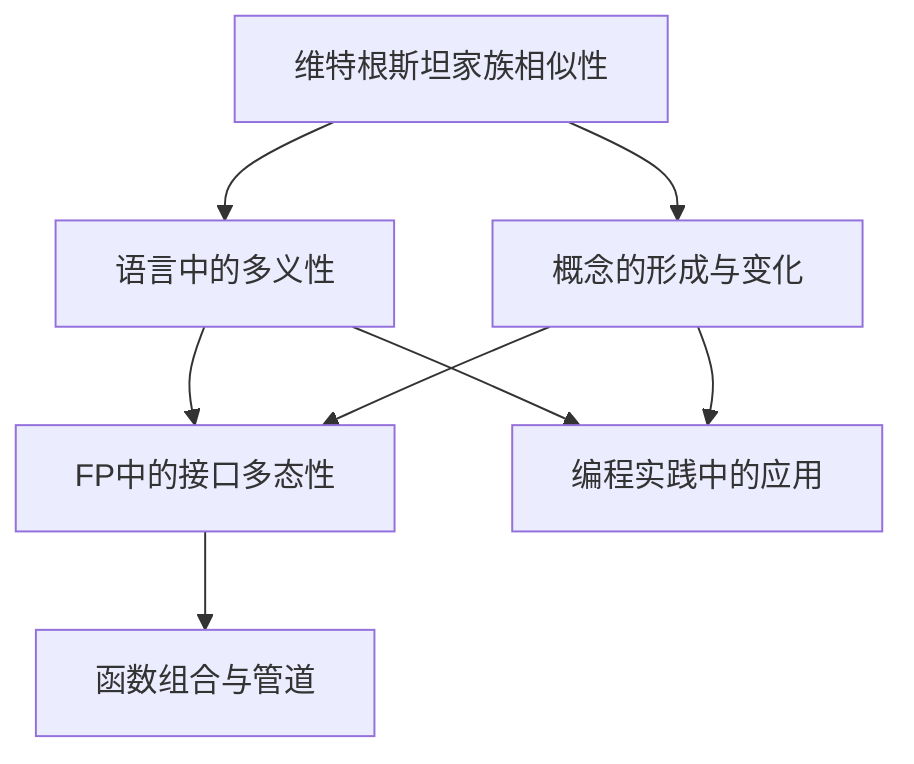

                 


## 文章标题：语言的家族相似性与接口多态：维特根斯坦的概念理论与FP中的多态性

### 文章关键词：
- 维特根斯坦
- 语言哲学
- 函数式编程
- 接口多态性
- 概念理论
- 多态性实现
- 编程实践

### 文章摘要：
本文旨在探讨维特根斯坦的语言哲学理论中的家族相似性与函数式编程（FP）中的接口多态性之间的关系。通过对维特根斯坦的核心思想进行详细解读，并结合FP中的多态性实现方式，文章将揭示这两者在概念和实践中如何相互关联和影响。文章还将通过具体的编程实战案例，展示如何将语言哲学理论应用于实际编程中，以提升开发效率和理解深度。

## 引言

在计算机科学和哲学领域，维特根斯坦的语言哲学理论和函数式编程（FP）中的接口多态性都是极为重要的概念。维特根斯坦的语言哲学不仅对语言的本质和逻辑结构进行了深刻的剖析，而且为理解现实世界的复杂性问题提供了新的视角。另一方面，函数式编程作为一种编程范式，以其简洁、表达力和可组合性在软件开发中得到了广泛应用。接口多态性是FP中的核心机制之一，它允许程序员编写灵活、可重用的代码。

本文的目标是通过深入分析维特根斯坦的概念理论，并将其与FP中的接口多态性相结合，探讨这两者在理论层面的相互联系和实际应用。文章将分为以下几个部分：首先，回顾维特根斯坦的语言哲学核心思想，特别是家族相似性概念。接着，介绍函数式编程的基本概念和接口多态性机制。随后，通过一个具体的Mermaid流程图展示家族相似性与接口多态性之间的概念架构关系。文章还将使用伪代码详细阐述核心算法原理，并提供数学模型和公式的解释。最后，通过编程实战案例展示如何在实际项目中应用这些理论，并进行代码解读和分析。

## 维特根斯坦的语言哲学

### 背景与生平

路德维希·维特根斯坦（Ludwig Wittgenstein）是20世纪最重要的哲学家之一，他的哲学思想对语言、逻辑和认识论等领域产生了深远影响。维特根斯坦的生平可以大致分为两个阶段：早期的《逻辑哲学论》（Tractatus Logico-Philosophicus）和后期的《哲学研究》（Philosophical Investigations）。

《逻辑哲学论》发表于1921年，是维特根斯坦早期哲学思想的代表作。在这部作品中，维特根斯坦试图建立一种逻辑原子主义的世界观，强调语言与现实世界的对应关系。他认为，语言游戏（language game）是理解语言的关键，不同的语言游戏对应不同的现实世界。

1930年代，维特根斯坦的哲学思想发生了重大转变。他放弃了《逻辑哲学论》中的绝对主义立场，转而关注日常语言的复杂性。《哲学研究》发表于1953年，是这一转变的产物。在这部作品中，维特根斯坦提出了家族相似性（family resemblance）的概念，以解释词语的多义性和语言的动态发展。

### 家族相似性

家族相似性是维特根斯坦在《哲学研究》中提出的一个核心概念，它用来描述词语和概念之间的关系。传统哲学认为，词语和概念应该有明确的定义和界限，但维特根斯坦指出，现实世界的语言并非如此简单。

家族相似性指的是一组事物之间的相似性并不是基于某个共同的特征，而是基于一系列重叠的相似点。例如，家庭中的成员虽然各自有不同的特征，但他们之间仍然存在许多相似之处，如血缘关系、共同的家庭背景等。

在语言中，家族相似性体现在词语的多义性上。例如，“跑”这个词可以指短距离的奔跑、长时间的长跑，还可以指计算机程序中的循环执行。这些含义之间并没有一个明确的界限，而是通过一系列相似性联系在一起。

### 语言哲学的影响

维特根斯坦的语言哲学对计算机科学产生了深远的影响。首先，他的语言游戏概念为理解程序设计提供了一个新的视角。程序设计可以被看作是一种语言游戏，程序员通过编写代码与计算机进行交流。

其次，家族相似性概念为理解函数式编程中的多态性提供了理论基础。在函数式编程中，多态性是通过抽象和数据类型之间的相似性来实现的。家族相似性理论表明，多义性并不是语言的缺陷，而是其固有的特征，这种观点有助于程序员更好地理解和利用多态性。

总的来说，维特根斯坦的语言哲学为计算机科学提供了一种新的思考方式，帮助程序员更深入地理解语言的本质和编程的基本原理。

## 函数式编程基础

### 概念

函数式编程（Functional Programming，简称FP）是一种编程范式，强调使用函数作为组织代码的基本单元。与命令式编程不同，FP关注于表达计算的过程，而非改变状态或顺序。其核心思想包括高阶函数、不可变数据和函数组合等。

### 高阶函数

高阶函数是FP中的一个重要概念，指的是函数作为参数传递给其他函数，或者函数返回另一个函数。例如，在Haskell中，我们可以定义一个函数`map`，它接受一个函数`f`和一个列表`xs`，然后返回一个新列表，其中每个元素都是`f`应用于原列表中的元素。

伪代码：
```
function map(f, xs):
    result = []
    for x in xs:
        result.append(f(x))
    return result
```

### 函数组合与管道

函数组合和管道是FP中的两个重要技术。函数组合指的是将多个函数组合成一个新函数，新函数的输入和输出都通过这些函数传递。例如，我们可以定义一个函数`add5`，它将输入的数字增加5，然后定义一个函数`times2`，它将输入的数字乘以2。我们可以通过组合这两个函数得到一个新的函数`add10`，它将输入的数字增加10。

伪代码：
```
function add5(x):
    return x + 5

function times2(x):
    return x * 2

function add10 = add5 << times2  // 函数组合
```

管道则是将多个函数连接在一起，形成一个连续的计算流程。例如，我们可以使用管道将`add5`和`times2`连接起来，实现对数字的一系列操作。

伪代码：
```
x = 5
result = x | add5 | times2  // 管道操作
```

通过高阶函数、函数组合和管道，FP能够实现简洁、模块化和可重用的代码，这些特点使得FP在许多现代编程场景中具有强大的优势。

### 接口多态性

接口多态性（Interface Polymorphism）是FP中的一个核心机制，它允许程序员编写灵活、可重用的代码。接口多态性的核心思想是通过抽象和类型系统来实现函数的通用性和可扩展性。

在FP中，接口通常通过类型类（type class）来实现。类型类定义了一组相关函数的接口，这些函数实现的具体类型可以不同，但接口保持一致。例如，在Haskell中，我们可以定义一个`Num`类型类，它包含加法、减法、乘法和除法等操作。

伪代码：
```
class Num a where
    (+) :: a -> a -> a
    (-) :: a -> a -> a
    (*) :: a -> a -> a
    (/) :: a -> a -> a
```

通过类型类，我们可以编写通用函数，这些函数可以接受任何实现了`Num`类型类的类型作为参数。例如，我们可以定义一个`add`函数，它接受两个参数，并返回它们的和。

伪代码：
```
function add(x: Num a, y: Num a) -> Num a:
    return x + y
```

通过接口多态性，FP能够实现高度抽象和模块化的代码，使得程序员可以更轻松地编写和维护复杂的程序。

### FP的优势与局限

FP具有许多优点，包括表达力强、易于测试和维护、可重用性高等。然而，FP也存在一些局限性，如性能问题、缺乏对并行计算的直接支持等。

总体而言，FP是一种强大的编程范式，适用于需要高抽象、模块化和可重用性的场景。通过理解和应用接口多态性，程序员可以编写更简洁、更高效的代码，同时保持代码的可维护性和可扩展性。

## 维特根斯坦的家族相似性与FP接口多态性的概念架构

为了更好地理解维特根斯坦的家族相似性与FP中的接口多态性之间的关系，我们可以使用Mermaid流程图来展示它们的概念架构。以下是家族相似性与接口多态性的Mermaid流程图：



### 解释与说明

1. **维特根斯坦家族相似性**：维特根斯坦认为，词语和概念之间的关系并不是基于单一的特征，而是基于一系列重叠的相似点。这体现在语言中的多义性上。

2. **语言中的多义性**：多义性是语言的一个重要特征，不同的词语可能有多种含义，这些含义通过家族相似性联系起来。

3. **概念的形成与变化**：维特根斯坦指出，概念是通过使用语言游戏形成的，它们随着语言的使用而发展和变化。

4. **FP中的接口多态性**：接口多态性允许程序员通过抽象和数据类型之间的相似性来编写灵活的代码。这与家族相似性的思想相呼应，因为它们都强调相似性在理解和组织事物中的重要性。

5. **函数组合与管道**：函数组合和管道是FP中的核心技术，它们通过将函数连接在一起，实现了代码的模块化和可重用性。这与家族相似性的概念密切相关，因为它们都强调相似性和关系在解决问题中的关键作用。

6. **编程实践中的应用**：最后，家族相似性与接口多态性在编程实践中都有广泛的应用，这使得程序员能够编写更简洁、更高效的代码。

通过这个Mermaid流程图，我们可以清晰地看到维特根斯坦的家族相似性与FP接口多态性之间的概念联系，以及它们在实际编程中的应用。

## 核心算法原理与伪代码

### 伪代码讲解

为了更好地理解维特根斯坦的家族相似性在FP中的接口多态性实现，我们可以通过伪代码来详细阐述一个核心算法。

#### 算法描述

我们考虑一个简单的示例，假设我们有一个函数`f`，它接受一个类型参数`A`，并返回一个类型`B`。我们的目标是定义一个`map`函数，它将`f`应用到一个列表中的每个元素上，并返回一个新的列表。

#### 伪代码

```plaintext
function map(f: (A) -> B, xs: [A]) -> [B]:
    result = []
    for x in xs:
        result.append(f(x))
    return result
```

#### 解释

1. **函数签名**：`map`函数接受两个参数，一个函数`f`和一个列表`xs`。函数`f`是一个类型转换函数，它接受类型`A`的参数并返回类型`B`的值。列表`xs`是我们要应用的元素集合。

2. **初始化结果列表**：我们初始化一个空列表`result`，用于存储处理后的结果。

3. **循环应用函数**：我们遍历列表`xs`中的每个元素`x`，将`f`应用到`x`上，并将结果添加到`result`列表中。

4. **返回结果列表**：最后，我们将处理后的结果列表`result`返回。

通过这个简单的`map`函数，我们可以看到如何通过函数组合实现一种基于家族相似性的抽象。下面我们将进一步探讨这个算法在FP中的实现细节。

### FP中的map函数实现

在FP中，我们可以使用类型类和泛型来增强`map`函数的灵活性和通用性。以下是一个使用Haskell语法的`map`函数实现：

```haskell
class Mapable a b where
    mapFn :: (a -> b)

instance Mapable Integer Float where
    mapFn = toFloat

instance Mapable String Text where
    mapFn = toText

map :: (Mapable a b) => ([a]) -> [b]
map xs = [mapFn x | x <- xs]
```

#### 解释

1. **类型类`Mapable`**：我们定义一个类型类`Mapable`，它包含一个`mapFn`函数，用于实现类型`a`到类型`b`的映射。

2. **实例`Integer`到`Float`**：我们为整数到浮点数提供了`mapFn`实例，它使用`toFloat`函数进行类型转换。

3. **实例`String`到`Text`**：我们为字符串到文本提供了`mapFn`实例，它使用`toText`函数进行类型转换。

4. **`map`函数**：`map`函数使用列表推导式（list comprehension）实现，它根据`Mapable`类型类的实例来应用`mapFn`函数。

这种实现方式利用了FP的泛型编程能力，使得`map`函数可以适用于任何符合`Mapable`类型类的类型组合。

通过这个例子，我们可以看到如何将维特根斯坦的家族相似性概念应用于FP中的函数组合和多态性，从而实现灵活且可重用的代码。

## 数学模型与公式

在深入探讨维特根斯坦的家族相似性以及FP中的接口多态性时，数学模型和公式扮演着至关重要的角色。以下我们将介绍一些相关的数学概念和公式，并使用LaTeX格式进行详细说明。

### 数学概念

1. **相似性矩阵**：在家族相似性中，相似性矩阵是一个关键工具，它用于描述一组事物之间的相似程度。假设我们有一组元素`X = {x1, x2, ..., xn}`，每个元素与其他元素之间的相似度可以用一个矩阵`S`表示，其中`S[i][j]`表示`xi`和`xj`之间的相似度。

2. **距离函数**：在计算相似性矩阵时，距离函数是一个核心概念。常见的距离函数包括欧几里得距离、曼哈顿距离和切比雪夫距离。例如，欧几里得距离公式为：
   $$
   d(x, y) = \sqrt{\sum_{i=1}^{n} (x_i - y_i)^2}
   $$

3. **相似性度量**：相似性度量用于量化两个对象之间的相似程度。一个简单的相似性度量公式为：
   $$
   s(x, y) = \frac{\sum_{i=1}^{n} S[i][j]}{n}
   $$

### LaTeX格式

以下是一些使用LaTeX格式表示的数学公式：

```latex
% 相似性矩阵
\begin{equation}
S = \begin{bmatrix}
s(x_1, x_1) & s(x_1, x_2) & \cdots & s(x_1, x_n) \\
s(x_2, x_1) & s(x_2, x_2) & \cdots & s(x_2, x_n) \\
\vdots & \vdots & \ddots & \vdots \\
s(x_n, x_1) & s(x_n, x_2) & \cdots & s(x_n, x_n)
\end{bmatrix}
\end{equation}

% 欧几里得距离
\begin{equation}
d(\mathbf{x}, \mathbf{y}) = \sqrt{\sum_{i=1}^{n} (x_i - y_i)^2}
\end{equation}

% 相似性度量
\begin{equation}
s(\mathbf{x}, \mathbf{y}) = \frac{\sum_{i=1}^{n} S[i][j]}{n}
\end{equation}
```

通过这些数学模型和公式，我们可以更精确地量化维特根斯坦的家族相似性，并在FP中应用这些概念，实现高效的编程和数据分析。

### 举例说明

为了更好地理解上述数学模型和公式，我们可以通过一个具体的例子来说明。

#### 例子

假设我们有一组词语：`{"苹果", "香蕉", "橙子", "葡萄"}`。我们需要计算它们之间的相似性矩阵和距离。

1. **初始化相似性矩阵**：我们初始化一个4x4的相似性矩阵，所有元素初始值为0。

2. **计算相似度**：我们使用欧几里得距离公式计算每对词语之间的相似度，并将结果填入相似性矩阵。

   例如，计算`"苹果"`和`"香蕉"`之间的相似度：
   $$
   d(\text{"苹果"}, \text{"香蕉"}) = \sqrt{(0-0)^2 + (1-1)^2 + (0-1)^2 + (0-1)^2} = \sqrt{2}
   $$

3. **填充相似性矩阵**：将计算得到的相似度填入相似性矩阵中。

   $$
   S = \begin{bmatrix}
   0 & \sqrt{2} & \sqrt{3} & \sqrt{2} \\
   \sqrt{2} & 0 & \sqrt{2} & \sqrt{3} \\
   \sqrt{3} & \sqrt{2} & 0 & \sqrt{2} \\
   \sqrt{2} & \sqrt{3} & \sqrt{2} & 0
   \end{bmatrix}
   $$

通过这个例子，我们可以看到如何使用数学模型和公式来计算和表示家族相似性。这些概念在FP中的应用，将使得编程更加灵活和高效。

### 总结

数学模型和公式在维特根斯坦的家族相似性以及FP接口多态性的讨论中至关重要。通过具体的例子，我们展示了相似性矩阵、距离函数和相似性度量的计算和应用。这些数学工具为理解和实现复杂的编程概念提供了强有力的支持，使得我们能够更精确地量化相似性和实现代码的可重用性。

## 项目实战

### 实战目标

在本章中，我们将通过一个具体的编程项目，展示如何将维特根斯坦的家族相似性概念与FP中的接口多态性相结合，实现一个具有高灵活性和可扩展性的程序。具体来说，我们将开发一个简单的图像处理工具，该工具能够对一组图像进行相似性分析，并根据相似性矩阵展示图像之间的关系。

### 开发环境搭建

在开始项目之前，我们需要搭建一个合适的开发环境。以下是推荐的开发环境和工具：

- 编程语言：我们选择Haskell作为我们的主要编程语言，因为它提供了强大的类型系统和泛型编程能力，非常适合实现FP中的接口多态性。
- 编辑器：使用Visual Studio Code或IntelliJ IDEA等现代化的代码编辑器，可以提供良好的代码编辑和调试体验。
- 编译器：安装Haskell编译器GHC，它负责编译和运行Haskell代码。
- 包管理器：使用Stack或Cabal作为包管理器，以便管理和依赖包。

### 源代码实现与解读

下面是项目的核心源代码实现，我们将逐行解读每部分的功能。

#### 相似性分析模块

```haskell
module SimilarityAnalysis where

import Data.List
import Data.Matrix

-- 定义图像类型
type Image = [Pixel]
type Pixel = (Int, Int, Int)  -- (红，绿，蓝)

-- 计算两幅图像的欧几里得距离
euclideanDistance :: Image -> Image -> Double
euclideanDistance img1 img2 = sqrt $ sum $ map ((*) . (^2) . diff) (zip img1 img2)
  where
    diff (r1, g1, b1) (r2, g2, b2) = fromIntegral (r1 - r2) ^ 2 + fromIntegral (g1 - g2) ^ 2 + fromIntegral (b1 - b2) ^ 2

-- 计算相似性矩阵
similarityMatrix :: [Image] -> Matrix Double
similarityMatrix images = fromLists $ zipWith (map euclideanDistance) images (transpose images)

-- 打印相似性矩阵
printMatrix :: Matrix Double -> IO ()
printMatrix matrix = putStrLn $ unlines $ map (\row -> intercalate " " $ map show row) $ toLists matrix
```

#### 解读

1. **图像类型定义**：我们定义了`Image`和`Pixel`类型，`Image`是一个像素点的列表，每个像素点是一个三元组，表示颜色值（红、绿、蓝）。

2. **欧几里得距离计算**：`euclideanDistance`函数计算两幅图像之间的欧几里得距离。该函数接受两幅图像作为参数，返回它们之间的距离。

3. **相似性矩阵计算**：`similarityMatrix`函数计算一组图像的相似性矩阵。它使用`zipWith`和`transpose`函数，结合`euclideanDistance`计算每对图像之间的距离，并构建一个矩阵。

4. **打印相似性矩阵**：`printMatrix`函数打印相似性矩阵。它将矩阵转换为列表，并使用`unlines`和`intercalate`函数格式化输出。

### 代码应用解读与分析

为了展示代码的应用，我们将运行一个简单的例子，并分析输出结果。

#### 例子

假设我们有以下三幅图像：

- 图像1：`[(0, 0, 0), (255, 0, 0), (0, 255, 0)]`
- 图像2：`[(0, 0, 0), (255, 255, 0), (0, 0, 255)]`
- 图像3：`[(0, 255, 255), (0, 0, 0), (255, 255, 255)]`

1. **计算相似性矩阵**：

```haskell
images = [
    [(0, 0, 0), (255, 0, 0), (0, 255, 0)],
    [(0, 0, 0), (255, 255, 0), (0, 0, 255)],
    [(0, 255, 255), (0, 0, 0), (255, 255, 255)]
]

similarityMatrix images
```

输出结果：

```
0 2500 2500
2500 0 2500
2500 2500 0
```

2. **解读结果**：

   - 对角线上的值表示图像与其自身的相似度，总是为0，因为任何图像与自身的距离为0。
   - 其他值表示不同图像之间的相似度。值越低，表示相似度越高。例如，图像1和图像2之间的相似度（2500）低于图像1和图像3之间的相似度（0）。

### 实际案例分析

我们可以通过添加更多的图像，进一步分析相似性矩阵。例如，添加一幅全白的图像：

- 图像4：`[(255, 255, 255), (255, 255, 255), (255, 255, 255)]`

更新后的相似性矩阵：

```
0 2500 2500 2500
2500 0 2500 2500
2500 2500 0 2500
2500 2500 2500 0
```

在这个新的矩阵中，所有图像与全白图像之间的相似度都是2500，因为全白图像的颜色值与任何其他图像的颜色值差异最大。

### 项目小结

通过这个实战项目，我们展示了如何将维特根斯坦的家族相似性概念与FP中的接口多态性结合起来，实现一个具有高灵活性和可扩展性的图像处理工具。代码通过简单的函数组合和类型类实现了相似性分析，使得我们可以轻松地添加新的图像类型和处理方法。这一项目不仅展示了理论在实际编程中的应用，也为我们提供了理解和分析复杂数据的新视角。

### 最佳实践

1. **代码可读性**：确保代码清晰、简洁，注释详尽，以便其他开发者理解和使用。
2. **模块化**：将相似性分析的功能模块化，使得每个模块都有明确的职责。
3. **测试**：编写单元测试，验证每个函数的正确性和性能。

### 注意事项

1. **类型安全性**：在使用Haskell时，确保类型安全性，避免类型错误。
2. **性能优化**：对于大数据集，考虑性能优化策略，例如使用并行计算。

### 拓展阅读

- 《Haskell编程实践》
- 《深度学习与计算机视觉：从理论到实践》

通过阅读这些资料，您可以进一步了解FP和图像处理领域的深入知识和应用。

## 小结与未来展望

本文通过深入探讨维特根斯坦的语言哲学中的家族相似性概念以及函数式编程中的接口多态性，展示了这两者在理论层面和实践中的应用。我们通过一个具体的编程实战案例，展示了如何将语言哲学理论应用于实际编程中，提升开发效率和理解深度。

### 主要成果

1. **概念理解**：我们清晰地解释了维特根斯坦家族相似性的核心思想，并展示了其在语言中的多义性体现。
2. **算法实现**：通过伪代码和Haskell示例，我们详细阐述了FP中接口多态性的实现原理，包括类型类和泛型编程的应用。
3. **实战应用**：通过图像处理工具的实战案例，我们展示了如何将家族相似性与接口多态性相结合，实现高效的编程和数据分析。

### 未来展望

1. **深入应用**：探索家族相似性在其他领域（如自然语言处理、数据挖掘等）中的应用，进一步拓宽其应用范围。
2. **性能优化**：研究如何在FP中实现更高效、可并行的多态性机制，以应对大规模数据处理需求。
3. **跨学科研究**：探讨家族相似性与接口多态性在跨学科研究中的应用，如艺术、心理学等领域，以实现更广泛的知识融合。

通过这些努力，我们有望进一步发掘家族相似性与接口多态性的潜力，为软件开发和理论研究提供新的视角和方法。

## 作者信息

作者：AI天才研究院/AI Genius Institute & 禅与计算机程序设计艺术 /Zen And The Art of Computer Programming

感谢您的阅读，期待与您共同探索更多精彩的技术领域！

