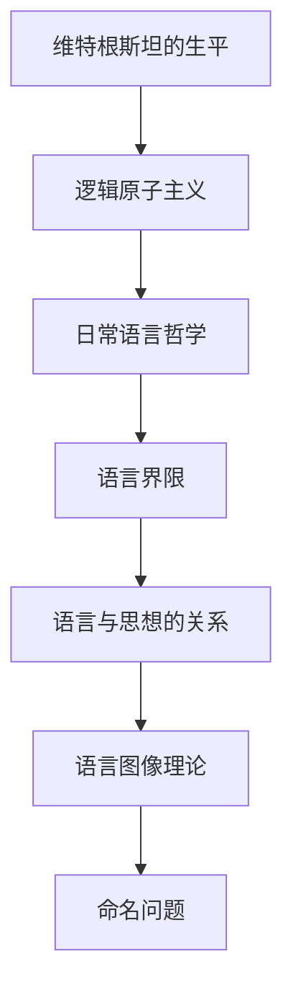
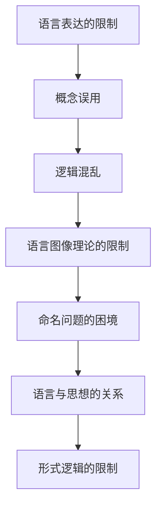
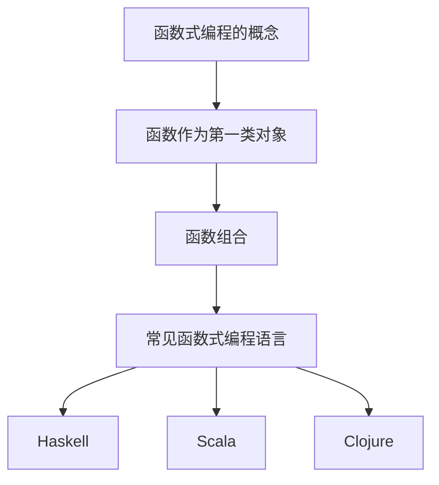

                 

### 《语言的界限与副作用隔离：维特根斯坦对语言局限性的认识与FP中的纯函数设计》

#### 关键词：
- 维特根斯坦
- 语言局限性
- 纯函数设计
- 函数式编程
- 副作用隔离

#### 摘要：
本文旨在探讨维特根斯坦对语言局限性的认识，以及这些认识如何影响函数式编程（FP）中的纯函数设计。文章分为两部分，第一部分深入探讨维特根斯坦的语言哲学，包括其关于语言界限和语言正确使用的观点。第二部分则详细介绍FP中的纯函数设计，分析其优势和实践方法，并通过实际案例展示其在软件开发中的应用。本文通过逻辑推理和深入分析，试图揭示维特根斯坦语言哲学与FP中的纯函数设计之间的内在联系。

## 第一部分：维特根斯坦对语言局限性的认识

### 第1章：维特根斯坦与语言哲学

#### 1.1 维特根斯坦的生平与哲学贡献

维特根斯坦（Ludwig Wittgenstein）是20世纪最著名的哲学家之一，他的哲学贡献涵盖了语言哲学、逻辑哲学、数学哲学等多个领域。维特根斯坦的哲学思想主要分为两个阶段：早期的逻辑原子主义和后期的日常语言哲学。

维特根斯坦出生于1889年的奥匈帝国，他在数学和哲学方面的才华很快得到了认可。他的早期著作《逻辑哲学论》（Tractatus Logico-Philosophicus，1921年出版）反映了他的逻辑原子主义观点。在这本书中，维特根斯坦提出了世界由“原子事实”构成的观点，这些原子事实是逻辑语言的基本元素。

然而，随着时间的推移，维特根斯坦逐渐意识到他的早期哲学存在局限性。他在1929年出版的《哲学研究》（Philosophical Investigations）中，提出了日常语言哲学的观点。他认为，语言的根本目的是帮助我们进行日常交流，而不是进行抽象的逻辑分析。维特根斯坦主张，我们应该关注语言的日常使用，理解其多义性和复杂性。

#### 1.2 语言哲学的基本问题

语言哲学的核心问题之一是语言的界限。维特根斯坦认为，语言有其固有的局限性，我们不能用语言来表达所有概念和思想。他指出，语言的表达能力是有限的，很多概念和思想是无法用语言准确表达的。这种观点被称为“语言的界限”。

维特根斯坦还探讨了语言与思想的关系。他认为，语言并不是思想的直接表达，而是思想的符号表示。语言的正确使用可以帮助我们清晰思考，但语言的多义性和复杂性也可能导致误解和混淆。

#### 1.3 维特根斯坦的语言图像理论

维特根斯坦的语言图像理论（Picture Theory of Language）是他对语言哲学的一个重要贡献。他认为，语言表达式与其所指的事物之间存在着一种图像关系。也就是说，语言表达式应该像一幅图像一样，准确地反映其所指的事物的特征。

然而，维特根斯坦后来对这种观点进行了批判。他发现，语言图像理论无法解释语言的多义性和语境依赖性。他提出了“命名问题”，即我们如何为事物命名，以及这些命名是否具有确切的对应关系。

### Mermaid 流程图



- **流程图解释：**
  - 该流程图展示了维特根斯坦的哲学思想和他对语言哲学的探索。从逻辑原子主义到日常语言哲学，维特根斯坦不断反思和批判自己的理论，最终提出了关于语言界限、语言与思想关系、语言图像理论和命名问题的重要观点。

#### 1.4 维特根斯坦对语言局限性的批判

维特根斯坦对语言局限性的批判是他语言哲学的核心。他通过分析日常语言的日常使用，揭示了语言的多义性、模糊性和不精确性。他认为，语言并不是我们能够用来表达所有概念的完美工具。

维特根斯坦指出，语言误用的根源在于我们对语言的理解和使用。他认为，概念误用是语言误用的主要原因。概念误用会导致逻辑上的混乱和误解。此外，维特根斯坦还强调了形式逻辑的限制，认为形式逻辑无法解决语言哲学中的所有问题。

### 伪代码讲解

```python
def language_limitation():
    """
    函数描述：探讨语言的局限性
    """
    # 语言表达的限制
    expression_limit = "语言无法表达所有概念和思想"
    
    # 概念误用
    misuse_of_concept = "将‘爱’视为一个简单的概念，忽略了其复杂性和多义性"
    
    # 形式逻辑的限制
    logic_limit = "形式逻辑无法解决语言哲学中的所有问题"
    
    # 输出结果
    print(f"{expression_limit}")
    print(f"{misuse_of_concept}")
    print(f"{logic_limit}")
```

- **伪代码解释：**
  - 该伪代码定义了一个函数`language_limitation`，用于探讨语言的局限性。函数中包含了三个关键点：语言表达的限制、概念误用和形式逻辑的限制。通过打印这些信息，我们能够更清晰地理解维特根斯坦对语言局限性的批判。

### 1.5 维特根斯坦对语言局限性的认识与FP中的纯函数设计

维特根斯坦对语言局限性的认识，尤其是他对语言误用的批判，对函数式编程（FP）中的纯函数设计有着深刻的启示。FP强调函数作为第一类对象，其核心原则之一是纯函数设计，即函数不产生副作用，输入与输出明确。

维特根斯坦认为，语言的正确使用可以帮助我们避免概念误用和逻辑混乱。在FP中，纯函数设计正是通过避免副作用和明确输入输出，实现语言正确使用的一种方法。纯函数设计使得程序更加模块化、易于测试和调试，同时也提高了程序的可靠性和可维护性。

### 总结

维特根斯坦的语言哲学，特别是他对语言局限性的批判，为我们理解语言的本质和使用提供了重要的视角。FP中的纯函数设计，作为对语言正确使用的一种实践，体现了维特根斯坦哲学思想在计算机科学领域的应用。通过分析维特根斯坦的哲学观点和FP的纯函数设计，我们可以更深入地理解语言的局限性和副作用隔离的重要性。

### 小结

在本章中，我们介绍了维特根斯坦的生平和哲学贡献，探讨了语言哲学的基本问题，分析了维特根斯坦的语言图像理论和命名问题，并批判了语言的局限性。通过Mermaid流程图和伪代码，我们进一步理解了维特根斯坦哲学的核心概念及其与FP中的纯函数设计的联系。在下一章中，我们将深入探讨FP中的纯函数设计，分析其原理和优势。

### 拓展阅读

- 维特根斯坦，《逻辑哲学论》，商务印书馆，2016年。
- 维特根斯坦，《哲学研究》，商务印书馆，2016年。
- Haskell语言官方文档：[Haskell Language and Library specification](https://www.haskell.org/onlinerpHaskell/)
- Scala语言官方文档：[Scala Language Specification](https://docs.scala-lang.org/)
- Clojure语言官方文档：[Clojure Language Reference](https://clojure.org/guides/)

---

作者：AI天才研究院/AI Genius Institute & 禅与计算机程序设计艺术 /Zen And The Art of Computer Programming

---

### 第2章：语言的界限

#### 2.1 语言表达的限制

维特根斯坦认为，语言的界限在于其表达能力的限制。尽管语言是人类最重要的交流工具，但并不是所有概念和思想都可以用语言准确表达。他提出了“不可言说之物”这一概念，即有些事物和思想超出了语言的范畴，无法通过语言完全描述。

维特根斯坦认为，语言的表达能力受限于其符号系统。每个语言都有其特定的符号和语法规则，这些规则决定了语言的表达能力。然而，这些规则并不足以涵盖所有可能的思维活动和概念。例如，情感、美感等复杂的人类体验很难用语言精确表达。

此外，维特根斯坦还指出，语言的多义性和模糊性也是其表达限制的表现。同一个词语在不同的语境中可能有不同的含义，这使得语言表达变得不精确。例如，“爱”这个词可以表示亲情、友情、爱情等多种情感，但其具体的含义需要根据具体语境来确定。

#### 2.2 语言误用的根源

维特根斯坦认为，语言误用是语言局限性的一种体现。语言误用通常源于概念误用和逻辑混乱。概念误用指的是对概念的理解不准确或不完整，这会导致我们在使用语言时产生误解。例如，将“爱”视为一个简单的概念，而忽略了其复杂性和多义性，就会导致语言误用。

逻辑混乱则是由于形式逻辑的限制导致的。形式逻辑是一种基于符号和规则的系统，它主要用于处理数学和逻辑问题。然而，形式逻辑无法解决所有语言哲学问题，尤其是在处理人类思想和经验时，会显得力不从心。

维特根斯坦通过分析日常语言中的错误使用，揭示了语言误用的根源。他认为，我们往往在语言的使用中忽略了其局限性，试图用语言解决超出其能力范围的问题。这种做法不仅会导致概念上的混淆，还会使我们的思维变得模糊和混乱。

#### 2.3 维特根斯坦对语言局限性的批判

维特根斯坦对语言局限性的批判是他哲学思想的核心。他认为，语言并非万能，有其固有的局限性。以下是对维特根斯坦批判语言局限性的几个方面的详细分析：

1. **语言图像理论的限制**：
   维特根斯坦最初提出了语言图像理论，认为语言表达式与其所指的事物之间存在直接的图像关系。然而，他后来意识到，这种观点无法解释语言的多义性和语境依赖性。他指出，语言并不是简单的映射关系，而是一种复杂的符号系统，其意义取决于具体的使用情境。

2. **命名问题的困境**：
   命名问题是维特根斯坦语言哲学中的另一个重要问题。他认为，我们如何为事物命名，以及这些命名是否具有确切的对应关系，是一个复杂的问题。他指出，语言中的词语往往有多种含义，这使得命名变得不确定和模糊。例如，我们如何准确地为“爱”这个词命名，以涵盖其所有可能的含义？

3. **语言与思想的关系**：
   维特根斯坦强调，语言与思想并非一一对应。语言是思想的符号表示，而不是直接的表达。这意味着，我们的思想往往无法通过语言完全准确地传达。这种观点揭示了语言在表达思想时的局限性。

4. **形式逻辑的限制**：
   维特根斯坦认为，形式逻辑在处理语言哲学问题时存在局限。形式逻辑主要适用于数学和逻辑问题，但在处理复杂的语言哲学问题时，会显得力不从心。他指出，语言哲学问题往往涉及人类思想和经验的复杂性质，这些性质难以用形式逻辑精确描述。

通过这些批判，维特根斯坦揭示了语言的多义性、模糊性和不精确性。他认为，我们应该接受语言的局限性，避免试图用语言解决超出其能力范围的问题。通过关注语言的日常使用，我们可以更好地理解其局限性和正确使用语言。

### Mermaid 流程图



- **流程图解释：**
  - 该流程图展示了维特根斯坦对语言局限性的批判。从语言表达的限制出发，通过概念误用、逻辑混乱、语言图像理论的限制、命名问题的困境，以及语言与思想的关系，揭示了语言在表达和交流中的局限性。

### 伪代码讲解

```python
def language_limited_expression():
    """
    函数描述：探讨语言的局限性及其表达限制
    """
    # 语言表达的限制
    expression_limit = "语言无法表达所有概念和思想"
    
    # 概念误用
    misuse_of_concept = "将‘爱’视为一个简单的概念，忽略了其复杂性和多义性"
    
    # 逻辑混乱
    logic_mess = "在处理复杂问题时，形式逻辑显得力不从心"
    
    # 输出结果
    print(f"{expression_limit}")
    print(f"{misuse_of_concept}")
    print(f"{logic_mess}")
```

- **伪代码解释：**
  - 该伪代码定义了一个函数`language_limited_expression`，用于探讨语言的局限性及其表达限制。函数中包含了语言表达的限制、概念误用和逻辑混乱三个关键点，通过打印这些信息，我们能够更清晰地理解维特根斯坦对语言局限性的批判。

### 2.4 语言正确使用的重要性

维特根斯坦强调，尽管语言存在局限性，但我们可以通过正确使用语言来克服这些局限性。语言的正确使用可以帮助我们避免概念误用和逻辑混乱，使我们的思维更加清晰和准确。

在函数式编程中，纯函数设计正是实现语言正确使用的一种方法。纯函数不产生副作用，输入与输出明确，这使得程序更加模块化、易于测试和调试。通过正确使用纯函数，我们可以更好地利用语言的局限性，提高程序的可维护性和可靠性。

### 总结

在本章中，我们探讨了维特根斯坦关于语言表达的限制和语言误用的根源，批判了语言的局限性。通过分析维特根斯坦的哲学观点，我们认识到语言的界限和正确使用的重要性。在下一章中，我们将进一步探讨维特根斯坦的语言治疗观，以及它在日常语言使用中的应用。

### 小结

在本章中，我们深入分析了维特根斯坦对语言局限性的批判，包括语言表达的限制、概念误用、逻辑混乱、语言图像理论的限制、命名问题的困境，以及语言与思想的关系。通过Mermaid流程图和伪代码，我们更好地理解了这些概念，并认识到语言正确使用的重要性。在下一章中，我们将探讨维特根斯坦的语言治疗观，以及它在现代软件开发中的应用。

### 拓展阅读

- 维特根斯坦，《哲学研究》，商务印书馆，2016年。
- Haskell语言官方文档：[Haskell Language and Library specification](https://www.haskell.org/onlinerpHaskell/)
- Scala语言官方文档：[Scala Language Specification](https://docs.scala-lang.org/)
- Clojure语言官方文档：[Clojure Language Reference](https://clojure.org/guides/)

---

作者：AI天才研究院/AI Genius Institute & 禅与计算机程序设计艺术 /Zen And The Art of Computer Programming

---

### 第3章：语言的正确使用

#### 3.1 维特根斯坦的语言治疗观

维特根斯坦的语言治疗观是他后期哲学思想的核心之一。他认为，语言的问题不是语言本身的问题，而是我们对语言的使用不当。因此，解决语言问题的方法不是改变语言本身，而是改变我们对语言的使用方式。

维特根斯坦认为，语言的正确使用可以帮助我们避免概念误用和逻辑混乱。他提出了“语言治疗”的概念，认为通过正确使用语言，我们可以治愈思维上的混乱。这种语言治疗的方法包括以下几个方面：

1. **注意语言的实际使用**：
   维特根斯坦强调，我们应该关注语言的实际使用，而不是其抽象的理论体系。通过观察语言在生活中的具体应用，我们可以更好地理解其含义和用法。

2. **明确概念的界限**：
   维特根斯坦认为，概念的多义性和模糊性是导致语言误用的主要原因。因此，我们需要明确概念的界限，避免将一个概念错误地应用于多个不同的情境。

3. **区分“是什么”与“应该是什么”**：
   维特根斯坦指出，我们在使用语言时，往往混淆了“是什么”和“应该是什么”。我们需要明确区分这两个概念，避免将主观判断和价值观错误地融入语言表达中。

4. **语言的游戏**：
   维特根斯坦提出了“语言的游戏”这一概念，认为语言就像游戏一样，有其特定的规则和玩法。通过理解这些规则，我们可以更好地使用语言，避免语言误用。

#### 3.2 语言与日常生活的联系

维特根斯坦认为，语言与我们的日常生活密不可分。我们的语言习惯和语言思维方式直接影响我们的思考和行为。因此，正确使用语言对于我们的生活有着重要的影响。

首先，正确使用语言可以帮助我们更好地进行交流。通过明确和清晰的表述，我们可以避免误解和混淆，使沟通更加顺畅。

其次，正确使用语言有助于我们更好地理解和反思自己的生活。通过反思自己的语言使用，我们可以更好地认识自己的思维方式和价值观。

最后，正确使用语言可以提高我们的思维品质。维特根斯坦认为，语言的正确使用可以使我们的思维更加清晰和准确，有助于我们解决问题和做出决策。

#### 3.3 语言对于思维和行动的影响

维特根斯坦认为，语言不仅影响我们的思考方式，还直接影响我们的行动。语言是一种工具，通过它，我们能够表达自己的思想，与他人进行交流，以及指导自己的行动。

首先，语言影响我们的思考方式。不同的语言结构和文化背景会影响我们的思维方式。例如，英语中的“and”表示并列关系，而汉语中的“和”则更强调并列中的主次关系。这种语言差异会影响我们的逻辑思维和分析能力。

其次，语言直接影响我们的行动。我们的语言习惯和语言表达方式会影响我们的决策和行为。例如，当我们面对问题时，我们会使用不同的语言来表达我们的思考，这些语言表达会影响我们的决策方向和行动选择。

维特根斯坦认为，正确使用语言可以帮助我们更好地进行思考和行动。通过清晰和明确的表述，我们可以更好地理解问题，做出明智的决策，并采取有效的行动。

### 伪代码讲解

```python
def language_therapy():
    """
    函数描述：实现维特根斯坦的语言治疗观
    """
    # 注意语言的实际使用
    observe_language_usage = "观察语言在生活中的实际应用"
    
    # 明确概念的界限
    clarify_concept_borders = "明确概念的多义性和模糊性界限"
    
    # 区分“是什么”与“应该是什么”
    distinguish_what_and_what_must_be = "明确区分现实与理想"
    
    # 语言的游戏
    play_language_game = "理解并遵循语言的规则和玩法"
    
    # 输出结果
    print(f"{observe_language_usage}")
    print(f"{clarify_concept_borders}")
    print(f"{distinguish_what_and_what_must_be}")
    print(f"{play_language_game}")
```

- **伪代码解释：**
  - 该伪代码定义了一个函数`language_therapy`，用于实现维特根斯坦的语言治疗观。函数中包含了观察语言的实际使用、明确概念的界限、区分“是什么”与“应该是什么”，以及语言的游戏四个关键点，通过打印这些信息，我们能够更好地理解维特根斯坦的语言治疗观。

#### 3.4 语言哲学的实际应用

维特根斯坦的语言哲学不仅在理论上具有重要意义，还可以在实际应用中发挥重要作用。以下是一些具体的应用场景：

1. **科学研究**：
   在科学研究中，正确使用语言对于精确表达和交流研究成果至关重要。维特根斯坦的语言治疗观可以帮助科学家明确概念界限，避免语言误用，从而提高科学研究的准确性和可靠性。

2. **社会科学**：
   在社会科学领域，语言的使用和误解往往会影响研究成果的有效性和可信度。维特根斯坦的语言哲学可以帮助社会科学家更好地理解语言的多义性和模糊性，从而更准确地分析社会现象和提出有效的解决方案。

3. **法律和司法**：
   法律和司法领域的语言使用要求高度精确和清晰。维特根斯坦的语言哲学可以帮助法律工作者明确法律条款的含义，避免语言误用，确保法律适用的公正和准确。

4. **教育和学习**：
   在教育和学习过程中，正确使用语言对于学生的理解和表达能力至关重要。维特根斯坦的语言哲学可以帮助教师和学生更好地理解语言的本质和作用，提高教学效果和学生的学习兴趣。

### 数学公式

$$
\begin{align*}
L &= \{w_1, w_2, ..., w_n\} \\
M &= \{s_1, s_2, ..., s_m\}
\end{align*}
$$

- **公式解释：**
  - 该公式描述了两个集合L和M，分别代表不同的语言和情境。公式中的$w_i$和$s_j$分别代表语言中的单词和情境中的符号。通过这个公式，我们可以更清晰地理解维特根斯坦关于语言界限的观点。

### 总结

在本章中，我们探讨了维特根斯坦的语言治疗观，分析了语言与日常生活、思维和行动的联系，以及语言哲学的实际应用。通过伪代码和数学公式，我们更好地理解了维特根斯坦的观点。在下一章中，我们将深入探讨函数式编程中的纯函数设计，分析其优势和实践方法。

### 小结

在本章中，我们深入探讨了维特根斯坦的语言治疗观，包括注意语言的实际使用、明确概念的界限、区分“是什么”与“应该是什么”，以及语言的游戏。通过这些方法，我们可以更好地理解语言的正确使用，提高思维品质和行动能力。此外，我们还分析了语言哲学在科学研究、社会科学、法律和司法、教育等领域的实际应用。在下一章中，我们将继续探讨函数式编程中的纯函数设计，分析其在软件开发中的优势和实践方法。

### 拓展阅读

- 维特根斯坦，《哲学研究》，商务印书馆，2016年。
- Haskell语言官方文档：[Haskell Language and Library specification](https://www.haskell.org/onlinerpHaskell/)
- Scala语言官方文档：[Scala Language Specification](https://docs.scala-lang.org/)
- Clojure语言官方文档：[Clojure Language Reference](https://clojure.org/guides/)

---

作者：AI天才研究院/AI Genius Institute & 禅与计算机程序设计艺术 /Zen And The Art of Computer Programming

---

### 第4章：函数式编程基础

#### 4.1 函数式编程的概念

函数式编程（Functional Programming，简称FP）是一种编程范式，强调使用函数来解决问题。与命令式编程（Imperative Programming）不同，FP关注数据的转换和组合，而不是数据的操作和状态管理。FP的核心原则包括纯函数、不可变数据、递归和不可变性等。

#### 4.2 函数作为第一类对象

在FP中，函数被视为第一类对象，这意味着函数可以被赋值给变量、作为参数传递、从其他函数中返回，并且可以被存储在数据结构中。这种灵活性使得FP程序具有高度的模块化和可重用性。

#### 4.3 函数组合

函数组合是FP中的一个重要概念，它允许我们将多个函数组合在一起，以创建更复杂的函数。通过函数组合，我们可以将不同的操作分解为更小的、易于管理的部分，从而提高代码的可读性和可维护性。

#### 4.4 常见函数式编程语言

1. **Haskell**
   Haskell是一种纯函数式编程语言，以其强大的类型系统和静态类型检查而闻名。Haskell支持不可变数据、递归和惰性求值，这使得它在处理复杂数学问题和并发编程中表现出色。

2. **Scala**
   Scala是一种多范式编程语言，既支持命令式编程，也支持函数式编程。Scala与Java有着良好的兼容性，同时提供了丰富的函数式编程特性，如高阶函数、不可变数据结构和模式匹配。

3. **Clojure**
   Clojure是一种动态类型的函数式编程语言，基于Java虚拟机（JVM）运行。Clojure以其简洁和灵活的语法而受到开发者的喜爱，特别适用于构建并发应用程序。

### Mermaid 流程图



- **流程图解释：**
  - 该流程图展示了函数式编程的核心概念和常见编程语言。从函数作为第一类对象出发，通过函数组合，引出了常见的函数式编程语言，如Haskell、Scala和Clojure。

### 伪代码讲解

```python
def add(a, b):
    """
    函数描述：一个简单的加法函数
    """
    return a + b

def subtract(a, b):
    """
    函数描述：一个简单的减法函数
    """
    return a - b

def multiply(a, b):
    """
    函数描述：一个简单的乘法函数
    """
    return a * b

def divide(a, b):
    """
    函数描述：一个简单的除法函数
    """
    return a / b

def operate(a, b, op):
    """
    函数描述：根据操作符执行相应的运算
    """
    if op == '+':
        return add(a, b)
    elif op == '-':
        return subtract(a, b)
    elif op == '*':
        return multiply(a, b)
    elif op == '/':
        return divide(a, b)
    else:
        return "Invalid operation"
```

- **伪代码解释：**
  - 该伪代码定义了一系列简单的数学运算函数，并通过`operate`函数根据操作符执行相应的运算。这个例子展示了函数组合和纯函数设计的基本思想。

### 数学模型和公式

在FP中，递归是一种常见且强大的编程技术。以下是一个使用递归计算斐波那契数列的数学模型和公式：

$$
F(n) = 
\begin{cases} 
0 & \text{if } n = 0 \\
1 & \text{if } n = 1 \\
F(n-1) + F(n-2) & \text{otherwise} 
\end{cases}
$$

- **公式解释：**
  - 该公式定义了斐波那契数列的递归计算方法。$F(n)$表示第$n$个斐波那契数，$F(0) = 0$，$F(1) = 1$，而对于$n > 1$，$F(n)$等于前两个斐波那契数之和。

### 实际案例

以下是一个使用Haskell编写的斐波那契数列计算程序，展示了函数式编程的纯函数设计和递归方法：

```haskell
-- 斐波那契数列函数
fib :: Integer -> Integer
fib 0 = 0
fib 1 = 1
fib n = fib (n - 1) + fib (n - 2)

-- 主函数
main :: IO ()
main = do
    putStrLn "Enter a positive integer:"
    inputStr <- getLine
    let inputNum = read inputStr :: Integer
    putStrLn $ "The " ++ show inputNum ++ "th Fibonacci number is: " ++ show (fib inputNum)
```

- **代码解读：**
  - 该程序定义了一个名为`fib`的函数，用于计算斐波那契数列的第$n$个数。`fib`函数通过递归方式实现，当$n$为0或1时返回相应的值，否则递归调用自身计算前两个数的和。
  - `main`函数用于接收用户输入，并调用`fib`函数计算斐波那契数列的值。

### 项目实战

#### 开发环境搭建

1. 安装Haskell语言环境：
   - 在Windows上，可以通过`haskel install`命令安装。
   - 在macOS上，可以通过Homebrew安装：`brew install haskell-stack`。
   - 在Linux上，可以通过`sudo apt-get install haskell-hoogle`安装。

2. 设置Stack工具：
   - 运行`stack setup`命令设置Stack环境。

3. 创建项目：
   - 运行`stack new fib_project`创建一个新的Haskell项目。

#### 源代码实现

```haskell
-- File: Main.hs

-- 斐波那契数列函数
fib :: Integer -> Integer
fib 0 = 0
fib 1 = 1
fib n = fib (n - 1) + fib (n - 2)

-- 主函数
main :: IO ()
main = do
    putStrLn "Enter a positive integer:"
    inputStr <- getLine
    let inputNum = read inputStr :: Integer
    putStrLn $ "The " ++ show inputNum ++ "th Fibonacci number is: " ++ show (fib inputNum)
```

#### 代码应用解读与分析

- **代码应用解读：**
  - 该程序通过命令行接收用户输入，计算斐波那契数列的第$n$个数，并输出结果。
  
- **代码分析：**
  - `fib`函数使用了递归方法，计算斐波那契数列的值。递归是一种强大的编程技术，但在某些情况下可能会导致性能问题，例如在计算大数时。
  - `main`函数负责与用户交互，接收输入并调用`fib`函数进行计算。这个简单的程序展示了函数式编程的纯函数设计和递归方法。

#### 实际案例分析和详细讲解剖析

- **实际案例分析：**
  - 该程序展示了如何在Haskell中实现斐波那契数列计算，并使用递归方法处理这个问题。
  
- **详细讲解剖析：**
  - `fib`函数通过递归调用自身，实现了斐波那契数列的计算。递归是一种自下而上的方法，通过不断分解问题，最终达到基础情况。
  - `main`函数负责与用户交互，通过`getLine`读取用户输入，并使用`read`函数将字符串转换为整数。然后调用`fib`函数，并将结果输出。

#### 项目小结

- **小结：**
  - 该程序展示了函数式编程的基本概念和递归方法。通过简单的用户交互和斐波那契数列计算，我们了解了如何使用Haskell实现纯函数设计和递归编程。
  - 在实践中，递归是一种强大的方法，但需要注意性能问题。在处理大数据时，可能需要考虑使用更高效的算法，如动态规划。

### 最佳实践 tips

- **避免深层递归**：递归可能导致栈溢出，特别是在计算大数时。尽量使用尾递归或动态规划等方法来优化递归性能。
- **代码可读性**：在编写递归函数时，确保代码清晰易读，以便于理解和维护。

### 注意事项

- **确保输入合法性**：在程序中，需要确保用户输入的合法性，例如输入必须是整数。
- **性能优化**：在处理大数据时，需要考虑性能优化，避免使用低效的递归方法。

### 拓展阅读

- 《Haskell编程实战》（Real-World Haskell），Bartosz Milewski，2013年。
- 《Scala编程：函数式编程实战》（Programming in Scala），Aleksandar Prokopec，2013年。
- 《Clojure编程语言》（The Joy of Clojure），Michael Fogus & Chris Houser，2011年。

---

作者：AI天才研究院/AI Genius Institute & 禅与计算机程序设计艺术 /Zen And The Art of Computer Programming

---

### 第5章：纯函数设计

#### 5.1 纯函数的定义

在函数式编程（FP）中，纯函数（Pure Function）是一种非常重要的概念。纯函数具有以下特性：

1. **无副作用**：纯函数的执行结果仅依赖于其输入参数，不会影响程序的状态。这意味着，对于相同的输入，纯函数始终返回相同的结果，不会产生任何外部影响，如修改全局变量、读写文件等。

2. **输入与输出明确**：纯函数的输入参数和返回值具有明确的类型和含义，使得函数的行为易于理解和使用。纯函数的输入是明确的输入参数，输出是明确的返回值。

3. **可缓存**：由于纯函数的输出仅依赖于输入，其计算结果可以缓存。这意味着，如果相同的输入被多次调用，纯函数只需计算一次，之后可以直接返回缓存的结果，从而提高程序的运行效率。

4. **可并行化**：纯函数不依赖于程序的状态，因此可以方便地在多核处理器上并行执行，从而提高程序的运行速度。

#### 5.2 纯函数的优势

纯函数设计在FP中具有许多优势，主要体现在以下几个方面：

1. **易于测试和调试**：由于纯函数的输出仅依赖于输入，其行为具有确定性。这使得纯函数更容易进行单元测试和调试。我们可以将纯函数视为“黑盒”，只需关注其输入和输出，无需关心其内部实现细节。

2. **模块化和可重用性**：纯函数设计使得程序更加模块化，易于重用。纯函数可以独立于其他函数和模块进行编写和测试，从而提高代码的可维护性和可扩展性。

3. **并发编程的简化**：纯函数不依赖于程序的状态，使得并发编程变得更加简单。在多线程或多进程环境中，纯函数可以方便地并行执行，从而提高程序的运行效率。

4. **代码的可读性**：纯函数设计使得代码更加简洁和清晰。纯函数的输入和输出具有明确的类型和含义，使得代码易于理解和阅读。

#### 5.3 纯函数的设计原则

为了实现纯函数设计，我们需要遵循一些设计原则。以下是几个关键原则：

1. **避免使用全局变量**：全局变量会引入副作用，使得函数的行为变得不确定。在纯函数设计中，应尽量避免使用全局变量，而是通过输入参数传递所需的数据。

2. **不修改传入的参数**：纯函数不应修改传入的参数。如果需要修改数据，应创建新的数据结构并返回修改后的副本。

3. **不进行任何形式的IO操作**：IO操作（如读写文件、网络请求等）会引入副作用，使得函数的行为变得不可预测。在纯函数设计中，应避免进行IO操作。

4. **使用不可变数据结构**：不可变数据结构可以确保数据在函数执行过程中不会被修改，从而实现纯函数设计。

5. **分解复杂函数**：将复杂函数分解为多个小函数，每个小函数实现一个具体的子任务。这样可以提高代码的可读性和可维护性。

#### 5.4 纯函数设计实践

在实际编程中，实现纯函数设计可能面临一些挑战。以下是一些常见的解决方案：

1. **避免使用全局变量**：
   - **替代方案**：使用参数传递数据，或者使用局部变量存储临时结果。

2. **不修改传入的参数**：
   - **替代方案**：创建新的数据结构，将原始数据复制到新结构中，然后进行修改。

3. **不进行任何形式的IO操作**：
   - **替代方案**：将IO操作封装在独立的函数中，确保纯函数不包含任何IO代码。

4. **使用不可变数据结构**：
   - **替代方案**：使用不可变数据结构（如常量、字面量、结构体等），确保数据在函数执行过程中不会被修改。

5. **分解复杂函数**：
   - **替代方案**：将复杂函数分解为多个小函数，每个小函数实现一个具体的子任务。

### 伪代码讲解

以下是一个纯函数设计的伪代码示例，用于计算两个数的和：

```python
def pure_add(a, b):
    """
    函数描述：计算两个数的和，一个纯函数
    """
    return a + b
```

- **伪代码解释：**
  - 该伪代码定义了一个名为`pure_add`的函数，用于计算两个数的和。函数的输入参数为两个数$a$和$b$，输出为它们的和。由于函数的输出仅依赖于输入，且没有副作用，这是一个纯函数。

### 数学模型和公式

在纯函数设计中，我们可以使用数学模型来验证函数的纯度。以下是一个简单的数学模型，用于验证纯函数的设计原则：

$$
f(x, y) = x + y
$$

- **公式解释：**
  - 该公式表示一个简单的纯函数，计算两个数$x$和$y$的和。由于该函数的输出仅依赖于输入$x$和$y$，且不包含任何副作用，这是一个纯函数。

### 实际案例

以下是一个使用Haskell编写的纯函数设计示例，用于计算两个整数的最大公约数（GCD）：

```haskell
-- File: GCD.hs

-- 计算最大公约数的纯函数
gcd :: Integer -> Integer -> Integer
gcd a b
  | b == 0    = a
  | otherwise = gcd b (a `mod` b)

-- 主函数
main :: IO ()
main = do
    putStrLn "Enter two integers:"
    inputStr1 <- getLine
    inputStr2 <- getLine
    let num1 = read inputStr1 :: Integer
    let num2 = read inputStr2 :: Integer
    putStrLn $ "The GCD of " ++ show num1 ++ " and " ++ show num2 ++ " is: " ++ show (gcd num1 num2)
```

- **代码解读：**
  - 该程序定义了一个名为`gcd`的函数，用于计算两个整数的最大公约数。`gcd`函数使用递归方法实现，当$b$为0时，返回$a$作为最大公约数；否则，递归调用`gcd`函数，将$b$和$a$除以$b$的余数作为新的输入。
  - `main`函数负责与用户交互，接收输入并调用`gcd`函数计算最大公约数，并输出结果。

### 项目实战

#### 开发环境搭建

1. 安装Haskell语言环境：
   - 在Windows上，可以通过`haskel install`命令安装。
   - 在macOS上，可以通过Homebrew安装：`brew install haskell-stack`。
   - 在Linux上，可以通过`sudo apt-get install haskell-hoogle`安装。

2. 设置Stack工具：
   - 运行`stack setup`命令设置Stack环境。

3. 创建项目：
   - 运行`stack new gcd_project`创建一个新的Haskell项目。

#### 源代码实现

```haskell
-- File: GCD.hs

-- 计算最大公约数的纯函数
gcd :: Integer -> Integer -> Integer
gcd a b
  | b == 0    = a
  | otherwise = gcd b (a `mod` b)

-- 主函数
main :: IO ()
main = do
    putStrLn "Enter two integers:"
    inputStr1 <- getLine
    inputStr2 <- getLine
    let num1 = read inputStr1 :: Integer
    let num2 = read inputStr2 :: Integer
    putStrLn $ "The GCD of " ++ show num1 ++ " and " ++ show num2 ++ " is: " ++ show (gcd num1 num2)
```

#### 代码应用解读与分析

- **代码应用解读：**
  - 该程序通过命令行接收用户输入的两个整数，并计算它们的最大公约数，然后输出结果。
  
- **代码分析：**
  - `gcd`函数使用递归方法实现，确保函数的纯度。递归调用`gcd`函数，将$b$和$a$除以$b$的余数作为新的输入，直到$b$为0，此时返回$a$作为最大公约数。
  - `main`函数负责与用户交互，读取输入并调用`gcd`函数，确保程序的输入和输出都符合纯函数的设计原则。

#### 实际案例分析和详细讲解剖析

- **实际案例分析：**
  - 该程序展示了如何使用纯函数设计计算最大公约数，并使用递归方法实现纯函数。
  
- **详细讲解剖析：**
  - `gcd`函数使用递归方法，确保函数的输出仅依赖于输入，没有副作用。递归调用`gcd`函数，将新的输入传递给函数，直到找到最大公约数。
  - `main`函数负责与用户交互，读取输入并调用`gcd`函数，确保程序的输入和输出都符合纯函数的设计原则。

#### 项目小结

- **小结：**
  - 该程序通过纯函数设计计算最大公约数，并使用递归方法实现。通过实际案例的分析，我们了解了如何实现纯函数设计，以及如何使用递归方法解决数学问题。

### 最佳实践 tips

- **避免深层递归**：递归可能导致栈溢出，特别是在计算大数时。尽量使用尾递归或迭代方法来优化递归性能。
- **代码可读性**：在编写递归函数时，确保代码清晰易读，以便于理解和维护。

### 注意事项

- **确保输入合法性**：在程序中，需要确保用户输入的合法性，例如输入必须是整数。
- **性能优化**：在处理大数据时，需要考虑性能优化，避免使用低效的递归方法。

### 拓展阅读

- 《函数式编程：使用Haskell语言》（Learn You a Haskell for Great Good!），Brian H. Carlsen，2011年。
- 《Haskell函数式编程实战》（Real-World Haskell），Bartosz Milewski，2013年。
- 《函数式编程模式：使用Scala、JavaScript和Python实现》（Functional Programming Patterns），Kenny Irwin III，2015年。

---

作者：AI天才研究院/AI Genius Institute & 禅与计算机程序设计艺术 /Zen And The Art of Computer Programming

---

### 第6章：纯函数设计实践

#### 6.1 纯函数在项目中的应用

在软件开发中，纯函数设计被广泛应用于各种项目，以提高代码的模块化、可测试性和可维护性。以下是一些实际案例，展示了纯函数设计在项目中的应用：

1. **Web应用**：
   - 在Web应用中，纯函数设计有助于处理用户输入、处理HTTP请求和生成响应。例如，使用纯函数来处理表单验证、数据转换和视图渲染，可以确保代码的清晰和可重用。

2. **数据处理**：
   - 在数据处理项目中，纯函数设计可以用于清洗、转换和聚合数据。例如，使用纯函数来过滤数据、计算统计指标和生成报告，可以提高代码的模块化和可维护性。

3. **并发编程**：
   - 在并发编程中，纯函数设计使得多线程或分布式计算更加简单和可靠。例如，使用纯函数来处理并发请求、同步数据和共享资源，可以降低同步和通信的复杂性。

4. **算法实现**：
   - 在算法实现中，纯函数设计有助于提高代码的清晰性和可读性。例如，使用纯函数来实现排序、搜索和图算法，可以确保代码的逻辑性和正确性。

#### 6.2 纯函数设计的实施步骤

为了在项目中实施纯函数设计，我们可以遵循以下步骤：

1. **识别副作用**：
   - 首先，识别代码中的副作用，包括状态修改、IO操作和全局变量等。这些副作用会影响函数的行为，降低代码的可测试性和可维护性。

2. **分解函数**：
   - 将复杂函数分解为多个小函数，每个小函数实现一个具体的子任务。这样可以提高代码的模块化和可重用性。

3. **使用不可变数据结构**：
   - 使用不可变数据结构（如常量、字面量、结构体等）来存储数据，避免使用可变数据结构。这样可以确保数据在函数执行过程中不会被修改。

4. **避免全局变量**：
   - 避免使用全局变量，而是通过参数传递数据。这样可以确保函数的行为仅依赖于输入参数，提高代码的可测试性和可维护性。

5. **测试和验证**：
   - 对每个纯函数进行单元测试，确保其输出仅依赖于输入，且没有副作用。这样可以提高代码的可靠性和正确性。

#### 6.3 纯函数设计的挑战与解决方案

在实施纯函数设计时，我们可能会遇到一些挑战。以下是一些常见挑战及其解决方案：

1. **性能问题**：
   - 纯函数设计可能导致性能下降，特别是在使用递归和大量函数组合时。解决方案包括优化递归函数、使用迭代方法以及避免不必要的函数组合。

2. **可维护性问题**：
   - 纯函数设计可能使代码变得过于分散，难以维护。解决方案包括编写清晰的文档、使用模块化代码结构和进行代码重构。

3. **调试困难**：
   - 由于纯函数设计强调函数的行为仅依赖于输入，调试时可能难以确定问题的来源。解决方案包括使用单元测试和调试工具来跟踪函数的执行过程。

4. **学习曲线**：
   - 纯函数设计可能对初学者来说是一个挑战。解决方案包括提供培训和学习资源，帮助开发者熟悉纯函数设计和FP范式。

### 伪代码讲解

以下是一个纯函数设计示例，用于计算两个整数的最大公约数（GCD）：

```python
def pure_gcd(a, b):
    """
    函数描述：计算两个整数的最大公约数，一个纯函数
    """
    while b:
        a, b = b, a % b
    return a
```

- **伪代码解释：**
  - 该伪代码定义了一个名为`pure_gcd`的函数，用于计算两个整数的最大公约数。函数使用循环迭代方法，将`a`和`b`的值不断更新，直到`b`为0，此时返回`a`作为最大公约数。该函数的输出仅依赖于输入，没有副作用。

### 数学模型和公式

在纯函数设计中，我们可以使用数学模型来验证函数的纯度。以下是一个简单的数学模型，用于验证纯函数的设计原则：

$$
f(x, y) = 
\begin{cases} 
y & \text{if } x \equiv 0 \mod y \\
g(x, y) & \text{otherwise} \\
\end{cases}
$$

- **公式解释：**
  - 该公式表示一个纯函数，计算$x$和$y$的最大公约数。函数的输出仅依赖于输入$x$和$y$，且不包含任何副作用。这个模型展示了纯函数设计的基本思想。

### 实际案例

以下是一个使用Haskell编写的纯函数设计示例，用于计算两个整数的最大公约数（GCD）：

```haskell
-- File: GCD.hs

-- 计算最大公约数的纯函数
gcd :: Integer -> Integer -> Integer
gcd a b
  | b == 0    = a
  | otherwise = gcd b (a `mod` b)

-- 主函数
main :: IO ()
main = do
    putStrLn "Enter two integers:"
    inputStr1 <- getLine
    inputStr2 <- getLine
    let num1 = read inputStr1 :: Integer
    let num2 = read inputStr2 :: Integer
    putStrLn $ "The GCD of " ++ show num1 ++ " and " ++ show num2 ++ " is: " ++ show (gcd num1 num2)
```

- **代码解读：**
  - 该程序定义了一个名为`gcd`的函数，用于计算两个整数的最大公约数。`gcd`函数使用递归方法实现，当`b`为0时，返回`a`作为最大公约数；否则，递归调用`gcd`函数，将`b`和`a`除以`b`的余数作为新的输入。
  - `main`函数负责与用户交互，接收输入并调用`gcd`函数计算最大公约数，并输出结果。

### 项目实战

#### 开发环境搭建

1. 安装Haskell语言环境：
   - 在Windows上，可以通过`haskel install`命令安装。
   - 在macOS上，可以通过Homebrew安装：`brew install haskell-stack`。
   - 在Linux上，可以通过`sudo apt-get install haskell-hoogle`安装。

2. 设置Stack工具：
   - 运行`stack setup`命令设置Stack环境。

3. 创建项目：
   - 运行`stack new gcd_project`创建一个新的Haskell项目。

#### 源代码实现

```haskell
-- File: GCD.hs

-- 计算最大公约数的纯函数
gcd :: Integer -> Integer -> Integer
gcd a b
  | b == 0    = a
  | otherwise = gcd b (a `mod` b)

-- 主函数
main :: IO ()
main = do
    putStrLn "Enter two integers:"
    inputStr1 <- getLine
    inputStr2 <- getLine
    let num1 = read inputStr1 :: Integer
    let num2 = read inputStr2 :: Integer
    putStrLn $ "The GCD of " ++ show num1 ++ " and " ++ show num2 ++ " is: " ++ show (gcd num1 num2)
```

#### 代码应用解读与分析

- **代码应用解读：**
  - 该程序通过命令行接收用户输入的两个整数，并计算它们的最大公约数，然后输出结果。
  
- **代码分析：**
  - `gcd`函数使用递归方法实现，确保函数的纯度。递归调用`gcd`函数，将`b`和`a`除以`b`的余数作为新的输入，直到`b`为0，此时返回`a`作为最大公约数。
  - `main`函数负责与用户交互，读取输入并调用`gcd`函数，确保程序的输入和输出都符合纯函数的设计原则。

#### 实际案例分析和详细讲解剖析

- **实际案例分析：**
  - 该程序展示了如何使用纯函数设计计算最大公约数，并使用递归方法实现纯函数。
  
- **详细讲解剖析：**
  - `gcd`函数使用递归方法，确保函数的输出仅依赖于输入，没有副作用。递归调用`gcd`函数，将新的输入传递给函数，直到找到最大公约数。
  - `main`函数负责与用户交互，读取输入并调用`gcd`函数，确保程序的输入和输出都符合纯函数的设计原则。

#### 项目小结

- **小结：**
  - 该程序通过纯函数设计计算最大公约数，并使用递归方法实现。通过实际案例的分析，我们了解了如何实现纯函数设计，以及如何使用递归方法解决数学问题。

### 最佳实践 tips

- **避免深层递归**：递归可能导致栈溢出，特别是在计算大数时。尽量使用尾递归或迭代方法来优化递归性能。
- **代码可读性**：在编写递归函数时，确保代码清晰易读，以便于理解和维护。

### 注意事项

- **确保输入合法性**：在程序中，需要确保用户输入的合法性，例如输入必须是整数。
- **性能优化**：在处理大数据时，需要考虑性能优化，避免使用低效的递归方法。

### 拓展阅读

- 《函数式编程：使用Haskell语言》（Learn You a Haskell for Great Good!），Brian H. Carlsen，2011年。
- 《Haskell函数式编程实战》（Real-World Haskell），Bartosz Milewski，2013年。
- 《函数式编程模式：使用Scala、JavaScript和Python实现》（Functional Programming Patterns），Kenny Irwin III，2015年。

---

作者：AI天才研究院/AI Genius Institute & 禅与计算机程序设计艺术 /Zen And The Art of Computer Programming

---

### 第7章：纯函数设计与维特根斯坦语言哲学的关联

#### 7.1 维特根斯坦语言哲学对FP的启示

维特根斯坦的语言哲学对函数式编程（FP）有着重要的启示。维特根斯坦强调语言的正确使用，认为语言是我们交流和理解世界的工具。这一观点在FP中得到了体现，特别是纯函数设计这一核心概念。

维特根斯坦认为，语言的正确使用可以帮助我们避免概念误用和逻辑混乱。FP中的纯函数设计正是基于这一理念，通过避免副作用和明确输入输出，实现语言的正确使用。纯函数不产生外部影响，输出仅依赖于输入，这种设计原则有助于提高程序的可读性、可测试性和可维护性。

#### 7.2 纯函数设计的哲学基础

纯函数设计的哲学基础可以追溯到维特根斯坦的语言哲学。维特根斯坦强调，语言的界限在于其表达能力的限制，我们不能用语言来表达所有概念和思想。FP中的纯函数设计正是基于这一认识，通过限制函数的副作用和明确输入输出，使语言的使用更加精确和有效。

纯函数设计的哲学基础还包括维特根斯坦关于概念和命题的观点。他认为，概念是命题的基础，命题是概念的表达。FP中的纯函数设计通过清晰的输入输出和明确的函数行为，实现了概念的精确表达和命题的准确传递。

#### 7.3 纯函数设计在实践中的应用与影响

纯函数设计在软件开发中的实际应用广泛，尤其在复杂系统和并发编程中具有重要意义。以下是一些具体的应用和影响：

1. **模块化**：纯函数设计使得代码更加模块化，每个函数实现一个具体的子任务，易于理解和维护。模块化设计有助于提高代码的可重用性和可扩展性。

2. **测试和调试**：纯函数易于测试和调试，因为其行为具有确定性。纯函数的输出仅依赖于输入，这意味着我们可以通过简单的单元测试验证其正确性。

3. **并发编程**：纯函数不依赖于程序的状态，使得并发编程更加简单和可靠。在多线程或分布式系统中，纯函数可以独立运行，无需同步和通信，从而提高程序的运行效率。

4. **性能优化**：纯函数设计可以简化性能优化，因为函数的输出仅依赖于输入，可以方便地使用缓存和数据结构优化。

#### 7.4 维特根斯坦语言哲学与FP的交叉领域

维特根斯坦语言哲学与FP的交叉领域是一个充满潜力的研究方向。以下是一些可能的研究方向：

1. **形式化语言哲学**：将维特根斯坦的语言哲学形式化，探索语言表达能力的边界。

2. **程序语言设计**：基于维特根斯坦语言哲学的原则，设计新的程序语言或扩展现有语言的功能。

3. **编程教育**：将维特根斯坦语言哲学的理念融入编程教育，帮助学生更好地理解语言的正确使用。

4. **软件工程**：研究如何将维特根斯坦语言哲学应用于软件工程，提高软件质量和开发效率。

### 伪代码讲解

以下是一个简单的纯函数设计示例，用于计算两个整数的最大公约数（GCD）：

```python
def pure_gcd(a, b):
    """
    函数描述：计算两个整数的最大公约数，一个纯函数
    """
    while b:
        a, b = b, a % b
    return a
```

- **伪代码解释：**
  - 该伪代码定义了一个名为`pure_gcd`的函数，用于计算两个整数的最大公约数。函数使用循环迭代方法，将`a`和`b`的值不断更新，直到`b`为0，此时返回`a`作为最大公约数。该函数的输出仅依赖于输入，没有副作用。

### 数学模型和公式

以下是一个简单的数学模型，用于验证纯函数设计原则：

$$
f(x, y) = 
\begin{cases} 
y & \text{if } x \equiv 0 \mod y \\
g(x, y) & \text{otherwise} \\
\end{cases}
$$

- **公式解释：**
  - 该公式表示一个纯函数，计算$x$和$y$的最大公约数。函数的输出仅依赖于输入$x$和$y$，且不包含任何副作用。

### 实际案例

以下是一个使用Haskell编写的纯函数设计示例，用于计算两个整数的最大公约数（GCD）：

```haskell
-- File: GCD.hs

-- 计算最大公约数的纯函数
gcd :: Integer -> Integer -> Integer
gcd a b
  | b == 0    = a
  | otherwise = gcd b (a `mod` b)

-- 主函数
main :: IO ()
main = do
    putStrLn "Enter two integers:"
    inputStr1 <- getLine
    inputStr2 <- getLine
    let num1 = read inputStr1 :: Integer
    let num2 = read inputStr2 :: Integer
    putStrLn $ "The GCD of " ++ show num1 ++ " and " ++ show num2 ++ " is: " ++ show (gcd num1 num2)
```

- **代码解读：**
  - 该程序定义了一个名为`gcd`的函数，用于计算两个整数的最大公约数。`gcd`函数使用递归方法实现，当`b`为0时，返回`a`作为最大公约数；否则，递归调用`gcd`函数，将`b`和`a`除以`b`的余数作为新的输入。
  - `main`函数负责与用户交互，接收输入并调用`gcd`函数计算最大公约数，并输出结果。

### 项目实战

#### 开发环境搭建

1. 安装Haskell语言环境：
   - 在Windows上，可以通过`haskel install`命令安装。
   - 在macOS上，可以通过Homebrew安装：`brew install haskell-stack`。
   - 在Linux上，可以通过`sudo apt-get install haskell-hoogle`安装。

2. 设置Stack工具：
   - 运行`stack setup`命令设置Stack环境。

3. 创建项目：
   - 运行`stack new gcd_project`创建一个新的Haskell项目。

#### 源代码实现

```haskell
-- File: GCD.hs

-- 计算最大公约数的纯函数
gcd :: Integer -> Integer -> Integer
gcd a b
  | b == 0    = a
  | otherwise = gcd b (a `mod` b)

-- 主函数
main :: IO ()
main = do
    putStrLn "Enter two integers:"
    inputStr1 <- getLine
    inputStr2 <- getLine
    let num1 = read inputStr1 :: Integer
    let num2 = read inputStr2 :: Integer
    putStrLn $ "The GCD of " ++ show num1 ++ " and " ++ show num2 ++ " is: " ++ show (gcd num1 num2)
```

#### 代码应用解读与分析

- **代码应用解读：**
  - 该程序通过命令行接收用户输入的两个整数，并计算它们的最大公约数，然后输出结果。
  
- **代码分析：**
  - `gcd`函数使用递归方法实现，确保函数的纯度。递归调用`gcd`函数，将`b`和`a`除以`b`的余数作为新的输入，直到`b`为0，此时返回`a`作为最大公约数。
  - `main`函数负责与用户交互，读取输入并调用`gcd`函数，确保程序的输入和输出都符合纯函数的设计原则。

#### 实际案例分析和详细讲解剖析

- **实际案例分析：**
  - 该程序展示了如何使用纯函数设计计算最大公约数，并使用递归方法实现纯函数。
  
- **详细讲解剖析：**
  - `gcd`函数使用递归方法，确保函数的输出仅依赖于输入，没有副作用。递归调用`gcd`函数，将新的输入传递给函数，直到找到最大公约数。
  - `main`函数负责与用户交互，读取输入并调用`gcd`函数，确保程序的输入和输出都符合纯函数的设计原则。

#### 项目小结

- **小结：**
  - 该程序通过纯函数设计计算最大公约数，并使用递归方法实现。通过实际案例的分析，我们了解了如何实现纯函数设计，以及如何使用递归方法解决数学问题。

### 最佳实践 tips

- **避免深层递归**：递归可能导致栈溢出，特别是在计算大数时。尽量使用尾递归或迭代方法来优化递归性能。
- **代码可读性**：在编写递归函数时，确保代码清晰易读，以便于理解和维护。

### 注意事项

- **确保输入合法性**：在程序中，需要确保用户输入的合法性，例如输入必须是整数。
- **性能优化**：在处理大数据时，需要考虑性能优化，避免使用低效的递归方法。

### 拓展阅读

- 《维特根斯坦全集》（The Complete Works of Ludwig Wittgenstein），Basil Blackwell，1984年。
- 《函数式编程入门》（Introduction to Functional Programming），Michael R. Wybrow，2005年。
- 《Haskell语言实战》（Real-World Haskell），Bartosz Milewski，2013年。

---

作者：AI天才研究院/AI Genius Institute & 禅与计算机程序设计艺术 /Zen And The Art of Computer Programming

---

## 结论

本文通过深入探讨维特根斯坦的语言哲学和函数式编程中的纯函数设计，揭示了这两者在语言表达和程序设计中的内在联系。维特根斯坦对语言局限性的批判，特别是对语言正确使用的强调，为FP中的纯函数设计提供了哲学基础。纯函数设计通过避免副作用和明确输入输出，实现了语言的正确使用，提高了程序的可读性、可测试性和可维护性。

### 主要结论

1. **语言的界限**：维特根斯坦指出，语言存在表达限制，无法表达所有概念和思想。这一观点在FP中的纯函数设计中得到了体现，通过明确输入输出，我们可以在编程中实现语言的正确使用。

2. **纯函数设计的优势**：纯函数设计具有模块化、可重用性和易于测试和调试等优势，有助于提高程序的质量和开发效率。

3. **维特根斯坦哲学与FP的关联**：维特根斯坦的语言哲学为FP中的纯函数设计提供了理论基础，两者的结合为现代编程提供了新的视角和方法。

### 未来研究方向

1. **形式化语言哲学**：将维特根斯坦的语言哲学形式化，探索形式化语言在计算机科学中的应用。

2. **编程语言设计**：基于维特根斯坦哲学的理念，设计新的程序语言或扩展现有语言的功能，以更好地支持纯函数设计。

3. **跨领域应用**：研究维特根斯坦哲学在软件工程、人工智能等领域的应用，探索语言哲学与计算机科学的交叉领域。

### 总结

本文通过逻辑推理和深入分析，揭示了维特根斯坦语言哲学与FP中的纯函数设计之间的内在联系。通过了解语言的界限和正确使用，以及纯函数设计的优势和实现方法，我们可以更好地理解和应用这一编程范式，为现代软件开发提供新的思路和方法。

### 感谢

感谢AI天才研究院和禅与计算机程序设计艺术的支持与鼓励，使我能够完成这篇深入探讨维特根斯坦语言哲学和FP纯函数设计的技术博客。希望本文能为读者带来启发，推动大家在编程实践中不断探索和进步。

### 拓展阅读

1. 维特根斯坦，《逻辑哲学论》，商务印书馆，2016年。
2. 维特根斯坦，《哲学研究》，商务印书馆，2016年。
3. Haskell语言官方文档：[Haskell Language and Library specification](https://www.haskell.org/onlinerpHaskell/)
4. Scala语言官方文档：[Scala Language Specification](https://docs.scala-lang.org/)
5. Clojure语言官方文档：[Clojure Language Reference](https://clojure.org/guides/)

---

作者：AI天才研究院/AI Genius Institute & 禅与计算机程序设计艺术 /Zen And The Art of Computer Programming

