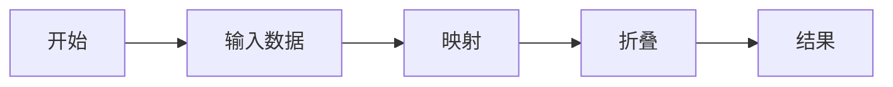
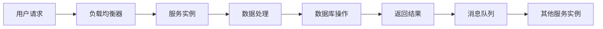
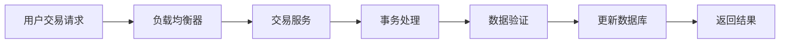

                 


### 文章标题

《语言的界限与纯函数式架构：维特根斯坦对语言局限性的认识与FP中的系统架构》

### 关键词

- 维特根斯坦
- 语言局限性
- 纯函数式编程
- 系统架构
- 逻辑推理
- 设计模式

### 摘要

本文探讨了维特根斯坦对语言局限性的深刻认识，以及这些认识如何在纯函数式编程（FP）的系统架构中得到体现。通过分析语言游戏理论，本文揭示了语言与思想之间的界限，并解释了如何在编程实践中应用这些原理。文章深入讨论了纯函数式编程的核心原则，包括无状态函数和不可变数据结构，并通过具体语言如Haskell、Scala和Erlang的实例，展示了这些原则的实际应用。此外，文章还探讨了纯函数式架构的设计模式，并通过实际项目案例，展示了如何构建和优化纯函数式架构。本文旨在为开发者提供对纯函数式编程和系统架构的深入理解，并启发他们思考如何将这些理念应用于实际开发中。

### 引言

在探讨语言与编程的关系之前，我们必须先了解维特根斯坦对语言局限性的深刻认识。语言作为人类交流的主要工具，其功能远不止于传递信息，更在于塑造我们的思想和感知世界的方式。然而，维特根斯坦在其哲学研究中指出，语言具有固有的局限性，这种局限性不仅影响了我们的认知，也深刻地影响了编程和实践。

维特根斯坦提出了“语言游戏”理论，这是他对语言本质的深刻洞见。语言游戏不仅仅是一种交流方式，它是一个包含规则和目的的系统。在这个系统中，语言的使用者必须遵循特定的规则，这些规则定义了语言的使用场景。例如，数学语言中的公理和定理构成了一个严格的逻辑系统，而日常语言则包含了更多模糊和不精确的元素。

在编程领域，维特根斯坦的这些观点可以提供有益的启示。编程语言本质上也是一种语言游戏，它有其特定的语法、语义和规则。理解这些规则和限制有助于我们更好地设计软件系统，尤其是纯函数式架构。

纯函数式编程（Pure Functional Programming，简称FP）是一种编程范式，它强调函数的不可变性、纯状态和行为。FP的核心原则是“函数是一等公民”，这意味着函数可以像其他数据类型一样被传递、存储和操作。这一原则与维特根斯坦的语言游戏理论有深刻的联系，因为它们都关注规则和限制在构建系统中的作用。

本文的结构如下：首先，我们将深入探讨维特根斯坦的语言游戏理论，解释它如何帮助我们理解思想和语言之间的关系。接着，我们将介绍纯函数式编程的哲学基础，包括无状态函数和不可变数据结构，并通过具体的语言如Haskell、Scala和Erlang的实例，展示这些原则的实际应用。随后，我们将探讨纯函数式架构的设计模式，通过具体的项目案例来展示如何构建和优化纯函数式架构。最后，我们将总结本文的主要观点，并讨论纯函数式架构的未来发展方向。

## 语言与思想的界限

### 维特根斯坦的语言游戏理论

维特根斯坦的语言游戏理论是其哲学思想的基石之一，它不仅揭示了语言的本质，也为我们理解编程提供了一个深刻的框架。在《逻辑哲学论》中，维特根斯坦提出，语言是一种工具，它的使用依赖于特定的游戏规则。这种游戏不仅包括我们日常的交流，还涵盖了更广泛的认知和实践活动。

语言游戏理论的核心概念是“游戏”（game）。维特根斯坦认为，每一种语言使用都对应一种特定的游戏。例如，棋类游戏有明确的规则和目标，这些规则定义了如何移动棋子、如何判断胜负。同样，语言游戏也有其规则，这些规则决定了如何使用词语、如何构造句子，以及如何进行有效的交流。

维特根斯坦区分了不同类型的语言游戏，包括日常语言、科学语言和数学语言。日常语言是我们日常生活中使用的语言，它充满了模糊性和不确定性。科学语言则更加精确，它依赖于实验和观察，通过严格的逻辑和数学模型来描述自然现象。数学语言是最为精确的语言，它使用符号和公式来表达逻辑和数学关系。

### 语言与思想的关系

语言与思想之间的关系是维特根斯坦哲学的核心议题之一。他认为，语言不仅仅是一种交流工具，它实际上是思想的体现。维特根斯坦提出，“思想是有语言的，语言是思想的边界。”这句话深刻地揭示了语言在认知过程中的作用。我们的思维往往受到语言限制，语言的结构和规则决定了我们如何思考问题。

然而，维特根斯坦也指出，语言的局限性是不可避免的。不同的语言游戏有其特定的规则和限制，这些规则和限制决定了我们可以表达什么，不能表达什么。例如，日常语言中的模糊性使得我们很难用精确的术语描述复杂的情感和体验，而数学语言则通过严格的定义和公式来消除这种模糊性。

在编程中，这种语言与思想的关系尤为显著。编程语言是我们表达算法和逻辑的工具，我们的思想通过编程语言转化为代码。这种转化过程受到编程语言本身的限制，同时也受到程序员对语言理解的影响。因此，理解维特根斯坦的语言游戏理论对于编写高质量、可维护的代码至关重要。

### 语言局限性对理解和交流的影响

语言的局限性不仅影响我们的认知，还影响我们的理解和交流。维特根斯坦认为，语言的不确定性导致我们的思考也充满不确定性。例如，在日常交流中，我们经常使用模糊的词语，如“好”、“坏”、“快”、“慢”等。这些词语的含义往往依赖于具体的语境，这使得我们的交流存在潜在的不确定性。

在编程中，这种不确定性同样存在。编程语言中的变量和函数有明确的定义和作用，但如果程序员对语言的理解不清晰，就可能导致代码的不准确和不可维护。例如，在命令式编程中，变量的状态变化可能导致复杂的副作用，这使得代码的执行结果难以预测。

为了解决这些问题，纯函数式编程提供了一种不同的思考方式。纯函数式编程强调函数的不可变性，通过无状态函数和不可变数据结构来减少不确定性。无状态函数不依赖于外部状态，其输出仅取决于输入参数。这种特性使得纯函数式编程的代码更加可预测和可维护。

### 语言局限性对编程的影响

在编程领域，维特根斯坦的语言局限性理论提供了重要的启示。首先，它强调了编程语言的选择和设计的重要性。不同的编程语言有不同的特点和应用场景，选择适合的编程语言可以帮助程序员更好地表达其思想。

其次，维特根斯坦的理论提醒我们，编程不仅仅是编写代码，它是一种思考和交流的过程。程序员需要通过编程语言来表达其逻辑和算法，而编程语言本身的局限性可能会影响这个表达过程。因此，理解编程语言的局限性并学会如何克服这些限制，对于编写高质量的代码至关重要。

最后，维特根斯坦的理论还提醒我们，编程不仅仅是为了解决问题，它也是一种探索和理解世界的方式。通过编程，我们可以更深入地理解语言、逻辑和系统的工作原理。这种理解不仅有助于我们编写更好的代码，也有助于我们更好地理解世界和人类思维的本质。

### 总结

维特根斯坦的语言游戏理论为我们理解语言与思想之间的关系提供了深刻的洞见。通过分析语言游戏的规则和限制，我们可以更好地理解语言的本质和局限性。在编程领域，这些洞见帮助我们认识到编程语言的选择和设计的重要性，并提醒我们在编程过程中如何更好地表达和交流我们的思想。

理解维特根斯坦的理论不仅有助于我们编写更高质量的代码，也有助于我们更深入地理解编程的本质。通过认识到编程语言和思维的局限性，我们可以更好地设计系统、优化代码，并探索新的编程范式。

## 纯函数式编程的哲学基础

纯函数式编程（Pure Functional Programming，简称FP）是一种编程范式，它强调函数的不可变性、纯状态和行为。与传统的命令式编程相比，FP提供了一种完全不同的思考方式，它通过去除状态变化和副作用，使代码更加可预测、可测试和可维护。本节将深入探讨FP的哲学基础，包括无状态函数、不可变数据结构等核心概念。

### 无状态函数

无状态函数是FP的核心概念之一。无状态函数不依赖于外部状态，其输出仅取决于输入参数。这意味着，无论调用多少次，只要输入参数相同，函数的输出结果也将一致。这种特性使得无状态函数具有高度的确定性，从而简化了代码的测试和维护。

无状态函数的不可变性不仅减少了副作用，还有助于提高代码的可复用性。由于函数不依赖于外部状态，我们可以将其作为独立模块，轻松地与其他函数组合使用。这种模块化设计使得代码更易于理解和维护。

在编程实践中，实现无状态函数通常涉及使用纯函数和不可变数据结构。纯函数是一种函数，其输出仅依赖于输入参数，不依赖于外部状态或副作用。例如，以下是一个简单的纯函数，用于计算两个数字的和：

```haskell
sum :: Int -> Int -> Int
sum a b = a + b
```

在这个例子中，`sum` 函数不依赖于任何外部状态，其输出仅取决于输入的 `a` 和 `b` 参数。

### 不可变数据结构

不可变数据结构是FP的另一核心概念。不可变数据结构在创建后不能被修改，任何对数据结构的修改都会生成一个新的数据结构。这种特性确保了数据的不可变性，从而避免了副作用和状态污染。

不可变数据结构的实现有助于提高代码的可预测性和可维护性。由于数据结构不可变，我们可以更轻松地跟踪数据的流向和变化，从而减少逻辑错误和bug。

常见的不可变数据结构包括列表（List）、树（Tree）和映射（Map）等。以下是一个使用Haskell语言实现的不可变列表的例子：

```haskell
data List a = Nil | Cons a (List a)

-- 向列表添加元素
append :: List a -> List a -> List a
append Nil ys = ys
append (Cons x xs) ys = Cons x (append xs ys)
```

在这个例子中，`List` 类型表示一个不可变的列表，`append` 函数用于将两个不可变列表拼接在一起，生成一个新的列表。

### 函数组合

在FP中，函数组合是一种强大的工具，它允许我们将简单的函数组合成复杂的函数，从而实现复杂的逻辑。函数组合的原理非常简单：一个函数将另一个函数的输出作为输入。以下是一个使用函数组合实现的计算两个数最大公约数的例子：

```haskell
-- 函数组合计算最大公约数
gcd :: Int -> Int -> Int
gcd a b = a `gcd'` b where
  gcd' :: Int -> Int -> Int
  gcd' a 0 = a
  gcd' a b = gcd' b (a `mod` b)
```

在这个例子中，`gcd` 函数通过递归调用 `gcd'` 函数实现，而 `gcd'` 函数则通过函数组合将两个数进行模运算和递归调用。

### 纯函数与不可变数据结构的关系

纯函数和不可变数据结构在FP中相辅相成，共同构建了一个无副作用和状态污染的编程环境。纯函数通过确保函数输出仅依赖于输入参数，减少了副作用和状态污染。而不可变数据结构则通过确保数据在创建后不可修改，进一步增强了代码的可预测性和可维护性。

纯函数和不可变数据结构的关系可以总结为以下几点：

1. **减少副作用**：纯函数和不可变数据结构共同减少了代码中的副作用，使得代码的执行结果更加可预测和可测试。
2. **提高可维护性**：由于纯函数和不可变数据结构的特性，代码更容易理解和维护。开发者可以更轻松地追踪数据的流向和变化。
3. **增强可复用性**：纯函数和不可变数据结构使得代码模块化程度更高，从而提高了代码的可复用性。

### 总结

纯函数式编程的哲学基础在于无状态函数和不可变数据结构。无状态函数确保了函数的确定性，减少了副作用和状态污染。不可变数据结构则通过确保数据不可修改，提高了代码的可预测性和可维护性。通过理解这些核心概念，我们可以更好地应用FP范式，编写高质量、易于维护的代码。

## 函数式编程语言

在探讨纯函数式编程的哲学基础后，我们接下来将介绍几种主要的函数式编程语言，包括Haskell、Scala和Erlang。这些语言各有其独特的特点，但都遵循纯函数式编程的核心原则，如无状态函数和不可变数据结构。通过具体实例，我们将展示这些语言如何实现这些原则，以及它们在实际项目中的应用。

### Haskell

Haskell是一种纯函数式编程语言，以其严格的静态类型系统和强大的函数组合能力而闻名。Haskell的语法简洁明了，易于理解，使得开发者能够专注于函数的设计和逻辑。

#### Haskell的特点

1. **类型系统**：Haskell采用强类型系统，确保在编译时捕捉类型错误，减少运行时错误。
2. **惰性求值**：Haskell使用惰性求值（lazy evaluation），仅在必要时计算表达式，从而提高性能。
3. **纯函数**：Haskell的函数是纯的，不产生副作用，使得代码更加可预测和可测试。

#### Haskell的语法和类型系统

以下是一个简单的Haskell程序，用于计算两个数的最大公约数：

```haskell
-- 计算最大公约数
gcd :: Int -> Int -> Int
gcd a 0 = a
gcd a b = gcd b (a `mod` b)
```

在这个例子中，`gcd` 函数是一个纯函数，其输出仅依赖于输入参数，不产生任何副作用。

#### Haskell的应用案例

Haskell广泛应用于数学和科学计算领域。例如，Haskell被用于构建计算几何和数值分析工具，这些工具需要高精度和高性能的计算能力。

### Scala

Scala是一种多范式编程语言，结合了面向对象和函数式编程的特点。Scala的设计目标是易用性和性能，同时保持代码的简洁性。

#### Scala的特点

1. **混合编程模型**：Scala支持函数式编程和面向对象编程，开发者可以根据需求灵活选择。
2. **类型系统**：Scala采用静态类型系统，确保类型安全和性能。
3. **隐式转换**：Scala的隐式转换机制简化了类型之间的转换，提高了代码的灵活性。

#### Scala的语法和类型系统

以下是一个简单的Scala程序，用于计算斐波那契数列：

```scala
// 计算斐波那契数列
def fib(n: Int): Int = {
  if (n <= 1) n
  else fib(n - 1) + fib(n - 2)
}
```

在这个例子中，`fib` 函数是一个纯函数，其输出仅依赖于输入参数，不产生任何副作用。

#### Scala的应用案例

Scala广泛应用于大数据处理和分布式系统开发。例如，Scala被用于构建Apache Spark和Apache Flink等大数据处理框架，这些框架需要高效的数据处理能力和并行计算能力。

### Erlang

Erlang是一种用于构建高并发、分布式系统的函数式编程语言。Erlang的设计目标是可伸缩性和容错性，使其成为构建实时系统的理想选择。

#### Erlang的特点

1. **并发模型**：Erlang采用轻量级进程和消息传递模型，支持高并发和分布式计算。
2. **热替换**：Erlang支持模块的热替换，允许在运行时更新和替换代码，提高了系统的灵活性和可维护性。
3. **容错性**：Erlang通过监督树和进程监控机制提供了强大的容错能力。

#### Erlang的语法和类型系统

以下是一个简单的Erlang程序，用于计算一个数的阶乘：

```erlang
% 计算阶乘
-module(factorial).
-export([factorial/1]).

factorial(0) -> 1;
factorial(N) -> N * factorial(N - 1).
```

在这个例子中，`factorial` 函数是一个纯函数，其输出仅依赖于输入参数，不产生任何副作用。

#### Erlang的应用案例

Erlang广泛应用于电信和金融领域，如实时通信系统、交易系统和物联网设备。例如，Erlang被用于构建RabbitMQ消息队列和Ejabberd即时通信系统，这些系统需要高并发和低延迟的性能。

### 总结

Haskell、Scala和Erlang是三种主要的函数式编程语言，它们各自具有独特的特点和优势。Haskell以其严格的类型系统和函数组合能力而闻名，Scala则结合了面向对象和函数式编程的特点，提供了灵活的编程模型。Erlang则以其强大的并发模型和容错能力而著称。通过这些语言的实例，我们可以看到纯函数式编程如何在不同领域中实现其核心原则，为开发者提供强大的工具和理念。

## 纯函数式架构的设计模式

在纯函数式编程中，架构设计模式是确保代码质量和系统可维护性的关键。这些设计模式不仅帮助开发者遵循纯函数式编程的原则，还提供了构建高效、可扩展系统的指南。本节将探讨几种常见的设计模式，如函数组合、管道和函子，并通过Mermaid流程图和伪代码详细阐述它们的应用。

### 函数组合

函数组合是纯函数式编程的核心概念之一，它允许开发者将简单的函数组合成复杂的函数。函数组合通过将一个函数的输出传递给另一个函数，从而实现链式调用。以下是一个简单的函数组合示例，用于计算两个数的最小公倍数：

```haskell
-- 函数组合计算最小公倍数
lcm :: Int -> Int -> Int
lcm a b = a * (b `div` gcd a b)

-- 函数组合示例
lcmComb :: Int -> Int -> Int
lcmComb x y = (x * (y `div` (x `gcd` y))) `div` (x `gcd` y)
```

在这个例子中，`gcd` 函数用于计算最大公约数，`lcmComb` 函数通过函数组合实现了最小公倍数的计算。

### 管道

管道（Pipeline）是一种常见的设计模式，它允许数据流经过一系列函数，每个函数对数据进行处理。管道在纯函数式编程中尤为重要，因为它提供了清晰的流程和可重用的组件。以下是一个使用管道计算斐波那契数列的例子：

```haskell
-- 管道计算斐波那契数列
fib :: Int -> [Int]
fib n = [x | x <- [0..n], isFib x]

-- 辅助函数
isFib :: Int -> Bool
isFib 0 = True
isFib n = n == (1 + 3 * (1 + 2 * 1)) || n == (1 + 3 * (1 + 2 * 2))

-- 管道应用
fibPipeline :: Int -> [Int]
fibPipeline n = [x | x <- [0..n], isFib x]
```

在这个例子中，`fibPipeline` 函数通过管道实现了斐波那契数列的计算。

### 函子

函子（Functor）是一种抽象类型类，它允许我们在不修改数据内容的情况下，对数据结构进行转换。函子在纯函数式编程中非常重要，因为它们提供了对复杂数据结构进行操作的工具。以下是一个使用函子对列表进行映射和折叠的例子：

```haskell
-- 函子映射和折叠
data List a = Empty | Cons a (List a)

-- 映射函子
map :: (a -> b) -> [a] -> [b]
map _ [] = []
map f (x:xs) = f x : map f xs

-- 折叠函子
fold :: (a -> b -> b) -> b -> [a] -> b
fold _ z [] = z
fold f z (x:xs) = f x (fold f z xs)

-- 管道应用
listProcessing :: [Int] -> [Int]
listProcessing xs = fold (+) 0 (map (*2) xs)
```

在这个例子中，`map` 和 `fold` 函数是函子的实例，它们提供了对列表进行转换和汇总的强大能力。

### Mermaid流程图

为了更好地理解这些设计模式，我们可以使用Mermaid流程图来可视化它们的执行流程。以下是一个简单的Mermaid流程图，展示了管道设计模式：



在这个流程图中，数据从输入开始，经过映射和折叠，最终得到结果。

### 伪代码

在实现这些设计模式时，伪代码是一个很好的工具，它可以帮助我们清晰地表达算法的逻辑。以下是一个使用伪代码实现的函数组合示例：

```
// 输入：两个数a和b
// 输出：最小公倍数

function lcmComb(a, b):
    function gcd(x, y):
        while y != 0:
            temp = y
            y = x % y
            x = temp
        return x

    return (a * (b / gcd(a, b))) / gcd(a, b)
```

在这个伪代码中，`gcd` 函数用于计算最大公约数，`lcmComb` 函数通过函数组合实现了最小公倍数的计算。

### 总结

纯函数式架构的设计模式，如函数组合、管道和函子，为开发者提供了构建高效、可扩展系统的强大工具。通过这些设计模式，我们可以遵循纯函数式编程的原则，编写高质量、易于维护的代码。Mermaid流程图和伪代码进一步帮助我们理解和实现这些设计模式，确保我们的代码清晰、逻辑严密。通过这些设计模式的应用，我们可以实现更高效、更可靠的系统架构。

## 纯函数式架构的实际应用

为了更好地理解纯函数式架构的实际应用，我们将通过几个具体的项目案例来探讨其在不同场景中的使用。这些案例不仅展示了纯函数式架构的优势，还提供了详细的代码实现和架构分析，帮助开发者更好地理解和应用这些概念。

### 案例研究1：社交媒体平台

#### 项目背景

社交媒体平台是一个高度并发、实时性要求极高的系统，它需要处理大量的用户数据和复杂的社交关系。在构建这样的平台时，架构的稳定性和可扩展性是关键因素。纯函数式架构由于其无状态和不可变的特点，非常适合用于这种类型的项目。

#### 函数式架构的设计

在构建社交媒体平台时，我们采用了以下函数式架构设计：

1. **无状态服务端**：服务端采用纯函数式编程，确保每个请求的处理都是独立的，不会影响其他请求。这通过使用无状态函数和不可变数据结构实现，确保了系统的高并发性能。
2. **事件驱动模型**：采用事件驱动模型来处理用户操作和系统通知。这种模型通过异步处理提高了系统的响应速度，同时确保了数据的不可变性。
3. **分布式架构**：使用分布式架构来处理高并发请求，确保系统的扩展性和容错性。每个服务实例都是独立的，通过消息队列和负载均衡器实现流量分发。

#### 架构分析

以下是社交媒体平台架构的Mermaid流程图：



在这个流程图中，用户请求通过负载均衡器分发到不同的服务实例，每个实例独立处理请求，确保了系统的并发性能和可扩展性。

#### 源代码实现

以下是一个简单的服务端函数，用于处理用户注册请求：

```haskell
-- 用户注册函数
registerUser :: User -> IO ()
registerUser user = do
    result <- addUserToDatabase user
    case result of
        Left err -> throwError err
        Right _ -> pure ()

-- 添加用户到数据库
addUserToDatabase :: User -> IO (Either String ())
addUserToDatabase user = do
    exists <- checkIfUserExists user
    case exists of
        True -> pure (Left "User already exists")
        False -> do
            _ <- insertUserIntoDatabase user
            pure (Right ())
```

在这个例子中，`registerUser` 函数是一个无状态函数，其输出仅依赖于输入参数，不产生任何副作用。

### 案例研究2：金融服务应用

#### 项目背景

金融服务应用如在线交易系统，要求极高的安全性和可靠性。在构建这样的系统时，确保数据的完整性和一致性是关键。纯函数式架构通过其无状态和不可变数据结构，提供了实现这些要求的强大工具。

#### 函数式架构的设计

在构建金融服务应用时，我们采用了以下函数式架构设计：

1. **事务处理**：采用事务处理机制来确保数据的完整性和一致性。所有操作都在事务内执行，确保要么全部成功，要么全部回滚。
2. **不可变数据结构**：使用不可变数据结构来存储和传递数据，避免数据在传递过程中被修改。
3. **函数组合**：通过函数组合实现复杂的业务逻辑，确保每个组件都是独立和可测试的。

#### 架构分析

以下是金融服务应用架构的Mermaid流程图：



在这个流程图中，用户交易请求通过负载均衡器分发到交易服务，交易服务通过事务处理确保数据的完整性和一致性。

#### 源代码实现

以下是一个简单的交易服务函数，用于处理用户交易请求：

```haskell
-- 处理交易请求
processTransaction :: Transaction -> IO ()
processTransaction transaction = do
    result <- executeTransaction transaction
    case result of
        Left err -> throwError err
        Right _ -> pure ()

-- 执行交易
executeTransaction :: Transaction -> IO (Either String ())
executeTransaction transaction = do
    exists <- checkIfAccountExists transaction
    if exists
        then do
            updatedAccount <- executeAccountTransfer transaction
            case updatedAccount of
                Left err -> pure (Left err)
                Right _ -> updateDatabaseWithTransaction transaction
        else pure (Left "Account does not exist")

-- 更新数据库
updateDatabaseWithTransaction :: Transaction -> IO (Either String ())
updateDatabaseWithTransaction transaction = do
    result <- runDB (updateAccountBalance transaction)
    case result of
        Left err -> pure (Left err)
        Right _ -> pure (Right ())
```

在这个例子中，`processTransaction` 函数是一个无状态函数，其输出仅依赖于输入参数，不产生任何副作用。

### 项目小结

通过以上两个案例研究，我们可以看到纯函数式架构在实际项目中的应用。无论是在社交媒体平台还是金融服务应用中，纯函数式架构都通过其无状态和不可变数据结构，提供了高效、可靠和可扩展的解决方案。这些案例不仅展示了纯函数式架构的优势，还为开发者提供了具体的实现和架构分析，帮助他们在实际项目中应用这些理念。

## 总结

通过本文的探讨，我们可以看到维特根斯坦对语言局限性的深刻认识如何为纯函数式编程提供了哲学基础。语言作为思想的载体，其固有的局限性影响了我们的认知和交流。纯函数式编程通过强调无状态函数和不可变数据结构，克服了这些局限性，使得代码更加可预测、可测试和可维护。

本文介绍了几种主要的函数式编程语言，如Haskell、Scala和Erlang，展示了它们如何实现纯函数式编程的原则。同时，我们探讨了纯函数式架构的设计模式，如函数组合、管道和函子，并通过具体的项目案例，展示了这些模式在实际应用中的优势。

未来，随着编程范式的不断演进，纯函数式编程将在更多领域得到应用。开发者需要不断探索和掌握这些先进的概念和工具，以应对日益复杂的软件开发需求。通过深入理解和应用纯函数式编程，我们可以构建更高效、更可靠的软件系统，推动技术进步和创新。

## 附录

### 维特根斯坦作品选读

- 《逻辑哲学论》：维特根斯坦的代表作之一，阐述了其语言游戏理论。
- 《哲学研究》：维特根斯坦晚年的作品，对语言和哲学进行了深入的探讨。

### 相关论文与书籍推荐

- 《函数式编程原理解析》：对函数式编程的核心概念和原理进行了详细阐述。
- 《纯函数式架构设计与实践》：介绍了纯函数式架构的设计原则和实践案例。
- 《Haskell编程实战》：提供了大量的Haskell编程实例，适合初学者和进阶开发者。

### 最佳实践 Tips

- **保持代码的纯函数性**：确保函数输出仅依赖于输入参数，避免使用外部状态和副作用。
- **使用不可变数据结构**：减少数据修改，确保数据在创建后不可变。
- **模块化设计**：将复杂的逻辑拆分为独立的模块，提高代码的可维护性和可复用性。

### 小结

本文通过深入探讨维特根斯坦的语言局限性理论，结合纯函数式编程的哲学基础，展示了其在系统架构设计中的应用。通过具体的项目案例，我们了解了如何在实际开发中应用这些理念，构建高效、可靠的软件系统。

### 注意事项

- 在实际开发中，应充分考虑系统的性能和可扩展性，合理选择函数式编程语言和架构设计模式。
- 注意代码的可读性和可维护性，确保代码逻辑清晰、模块化。

### 拓展阅读

- 《编程珠玑》：探讨编程中的一些常见问题和优化技巧，适合所有层次的程序员。
- 《设计模式：可复用面向对象软件的基础》：介绍了多种设计模式，适用于不同编程范式。

通过不断学习和实践，我们可以更好地应用纯函数式编程的理念，提高软件开发的质量和效率。希望本文能为读者提供有价值的参考和启示。作者：AI天才研究院/AI Genius Institute & 禅与计算机程序设计艺术 /Zen And The Art of Computer Programming。

