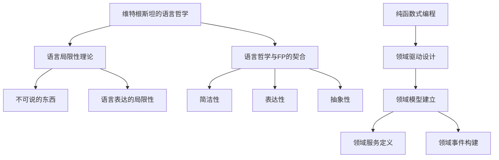

                 

### 文章标题

《语言的界限与纯函数式领域建模：维特根斯坦对语言局限性的认识与FP中的领域驱动设计》

> 关键词：维特根斯坦、语言哲学、纯函数式编程、领域驱动设计、软件开发

> 摘要：本文深入探讨了维特根斯坦对语言局限性的哲学思考，并将其与纯函数式编程中的领域驱动设计进行对比分析。通过揭示二者之间的联系，本文旨在探讨如何利用纯函数式领域建模克服语言的局限，提高软件开发的效率和质量。

### 第1章：引言

#### 1.1 书籍主题介绍

在信息技术飞速发展的今天，编程语言和软件开发方法不断创新，以应对日益复杂的计算需求。然而，语言的局限性始终是一个不可忽视的问题。本文旨在探讨语言哲学中的经典问题，特别是维特根斯坦对语言局限性的认识，并将其与纯函数式编程中的领域驱动设计（Domain-Driven Design, DDD）进行关联分析。

语言哲学关注语言与现实的关系，探讨语言的边界及其局限性。维特根斯坦，作为语言哲学的奠基人之一，提出了许多关于语言、思维和现实之间的关系的深刻见解。他的思想对后来的哲学研究产生了深远影响。在软件开发领域，领域驱动设计是一种旨在提高软件开发质量和效率的方法，它强调领域专家和开发人员之间的紧密合作，以更好地理解和构建复杂系统。

本文的目的在于：

1. 深入介绍维特根斯坦的语言哲学思想，特别是关于语言局限性的观点。
2. 分析领域驱动设计的基本概念和实践方法。
3. 探讨维特根斯坦的语言哲学如何影响纯函数式领域建模。
4. 通过实例展示纯函数式领域建模在软件开发中的应用。

#### 1.2 维特根斯坦的语言哲学

维特根斯坦（Ludwig Wittgenstein）是20世纪最杰出的哲学家之一，他的思想对语言哲学、逻辑学和认识论等领域产生了深远影响。维特根斯坦的主要著作包括《逻辑哲学论》和《哲学研究》。

维特根斯坦的语言哲学主要分为两个时期：早期和晚期。早期维特根斯坦主张“语言是世界的图片”，认为语言和现实之间存在一种直接的联系。晚期维特根斯坦则转向日常语言哲学，强调语言的多义性和复杂性。

**1.2.1 早期维特根斯坦的语言哲学**

在《逻辑哲学论》中，维特根斯坦提出了一系列关于语言、思维和现实的基本原则。他认为，语言是由基本命题构成的，这些基本命题直接对应于现实中的事实。通过逻辑组合，我们可以构建复杂的命题来表达复杂的思维过程。

然而，维特根斯坦也指出，语言并非总是能够准确地映射现实。有些事物无法用语言表达，这些无法表达的“东西”被他称为“不可说的”。他认为，哲学的任务不是去发现未知的真理，而是去理解语言的本质和局限性。

**1.2.2 晚期维特根斯坦的语言哲学**

在《哲学研究》中，维特根斯坦转向日常语言哲学，探讨语言在日常生活中的使用。他认为，语言的多义性和模糊性是语言固有的特性，而不是缺陷。语言的意义并不在于其符号本身，而在于使用者的意图和情境。

晚期维特根斯坦强调，语言是一种工具，其目的是为了交流和理解。他认为，哲学的任务不是去解释世界的本质，而是去澄清我们的语言使用。这一观点对后来的语言哲学和认知科学产生了深远影响。

#### 1.2.3 维特根斯坦的语言局限性理论

维特根斯坦认为，语言存在着固有的局限性。首先，有些事物无法用语言表达，这些“不可说的东西”包括情感、审美体验等。其次，语言的表达也存在局限性，例如语言的模糊性和二义性。

**1.2.3.1 不可说的东西**

维特根斯坦认为，有些体验和感受是无法用语言准确表达的。例如，我们无法用语言完全准确地描述爱、恐惧、喜悦等情感。这些“不可说的东西”存在于我们的内心深处，超越了语言的边界。

**1.2.3.2 语言表达的局限性**

语言的模糊性和二义性也是维特根斯坦关注的重点。他认为，语言的意义取决于使用者的意图和情境，这使得语言的表达变得复杂和模糊。例如，一个简单的单词可以有多种不同的含义，具体含义取决于上下文。

#### 1.2.4 维特根斯坦的语言哲学与纯函数式领域建模

维特根斯坦的语言哲学对纯函数式领域建模有着深刻的启示。首先，维特根斯坦关于不可说的东西的观点启示我们，在软件开发中，某些复杂问题可能无法通过语言完全表达，需要借助其他工具和方法来理解和解决。其次，维特根斯坦强调语言的模糊性和二义性，提示我们在编程中要注重清晰性和简洁性，以避免语言带来的误解和歧义。

在纯函数式领域建模中，我们可以借鉴维特根斯坦的语言哲学思想，通过简洁、清晰的函数式表达来建模复杂系统。这有助于减少语言的模糊性和二义性，提高软件的可读性和可维护性。

#### 1.2.5 维特根斯坦的哲学观点在现代计算机科学中的应用

维特根斯坦的哲学观点在现代计算机科学中有着广泛的应用。首先，在编程语言设计方面，维特根斯坦强调语言的简洁性和表达性，这为编程语言的设计提供了指导原则。例如，函数式编程语言（如Haskell、Scala等）的设计理念就深受维特根斯坦的影响。

其次，在软件工程领域，维特根斯坦的观点可以帮助我们更好地理解和解决软件复杂性问题。例如，通过领域驱动设计，开发人员可以更好地理解业务领域，构建简洁、高效的软件系统。

最后，在人工智能领域，维特根斯坦的哲学观点也有助于我们更好地理解和解决人工智能的复杂性问题。通过函数式编程和领域驱动设计，我们可以构建更简洁、更高效的人工智能系统。

#### 1.3 纯函数式编程概述

纯函数式编程是一种编程范式，它强调函数作为程序的基本构建块，以及计算过程中的不可变性。与面向对象编程和过程式编程相比，纯函数式编程具有一系列独特的优势。

**1.3.1 纯函数式编程的基本概念**

纯函数式编程的基本概念包括：

1. 函数作为第一类公民：在纯函数式编程中，函数被视为程序的基本构建块，与变量、数据结构等具有相同的地位。
2. 不可变性：在纯函数式编程中，数据是不可变的，这意味着一旦数据被创建，就不能再改变其值。这有助于提高程序的可读性和可维护性。
3. 无副作用：纯函数式编程中的函数不应产生副作用，即不应改变外部状态或输出除返回值之外的其他信息。这有助于提高程序的可测试性和并行化能力。

**1.3.2 纯函数式编程的优势与挑战**

纯函数式编程具有以下优势：

1. 可测试性：由于纯函数式编程中的函数具有无副作用和不可变性的特点，使得函数非常容易测试。测试只需关注函数的输入和输出，而不需要担心函数会对外部状态产生副作用。
2. 可维护性：纯函数式编程中的函数具有简洁、清晰的定义，使得代码更加容易理解和维护。
3. 并行化：由于纯函数式编程中的函数具有无副作用的特点，使得程序非常容易并行化。这有助于提高程序的性能，特别是在多核处理器和分布式系统环境中。

然而，纯函数式编程也存在一些挑战：

1. 学习成本：纯函数式编程与传统的面向对象编程和过程式编程有较大的区别，需要开发人员投入更多的时间和精力来学习和掌握。
2. 表达复杂性：在某些情况下，纯函数式编程可能需要使用更复杂的抽象和语法，这可能会增加代码的复杂性和难以理解。
3. 性能问题：与面向对象编程相比，纯函数式编程在某些情况下可能会产生更多的函数调用和中间数据结构，这可能会对性能产生负面影响。

**1.3.3 主流纯函数式编程语言**

目前，主流的纯函数式编程语言包括：

1. Haskell：Haskell是一种纯函数式编程语言，具有强大的类型系统和简洁的语法。它广泛应用于数学、科学计算和人工智能等领域。
2. Scala：Scala是一种多范式编程语言，结合了面向对象和函数式编程的特点。它广泛应用于大数据处理、分布式系统和云计算等领域。
3. Erlang：Erlang是一种用于构建并发应用的纯函数式编程语言，具有出色的性能和可靠性。它广泛应用于电信、金融和物联网等领域。
4. Clojure：Clojure是一种基于Java虚拟机的函数式编程语言，具有简洁的语法和强大的并发支持。它广泛应用于Web开发、大数据处理和人工智能等领域。

**1.3.4 纯函数式编程在领域驱动设计中的应用**

领域驱动设计（Domain-Driven Design, DDD）是一种软件开发方法，强调开发人员与领域专家之间的紧密合作，以更好地理解和构建复杂系统。纯函数式编程在领域驱动设计中具有独特的优势。

1. **清晰的领域边界**：纯函数式编程中的函数作为第一类公民，使得领域模型更加清晰。函数可以定义领域中的操作和规则，从而提高代码的可读性和可维护性。
2. **易于测试和维护**：纯函数式编程中的函数具有无副作用和不可变性的特点，使得函数非常容易测试和维护。这有助于提高软件的质量和可靠性。
3. **并行化**：纯函数式编程中的函数具有无副作用的特点，使得程序非常容易并行化。这有助于提高软件的性能，特别是在处理大数据和复杂计算时。

**1.3.5 纯函数式编程与维特根斯坦的语言哲学的契合**

纯函数式编程与维特根斯坦的语言哲学之间存在一些契合点。

1. **简洁性**：维特根斯坦强调语言的简洁性，认为简洁的表达可以更好地揭示事物的本质。纯函数式编程中的函数定义简洁、明确，有助于提高代码的可读性和可维护性。
2. **表达性**：维特根斯坦认为，语言的表达能力是有限的，但通过抽象和简化，我们可以更好地表达复杂的思想。纯函数式编程中的函数可以通过高阶函数、组合函数等抽象机制，实现更复杂的功能，提高代码的表达能力。
3. **抽象性**：维特根斯坦认为，语言是一种抽象工具，其目的是为了揭示事物的本质。纯函数式编程中的函数可以抽象出领域中的操作和规则，提高代码的通用性和可复用性。

通过结合维特根斯坦的语言哲学思想，纯函数式编程可以帮助我们更好地理解和构建复杂系统，提高软件开发的效率和质量。

### 第2章：维特根斯坦的语言局限性理论

#### 2.1 维特根斯坦的语言局限性理论

维特根斯坦（Ludwig Wittgenstein）是20世纪最重要的哲学家之一，他的思想对语言哲学、逻辑学和认识论等领域产生了深远影响。维特根斯坦的主要著作包括《逻辑哲学论》和《哲学研究》。在他的哲学思想中，语言的局限性是一个核心主题。

**2.1.1 不可说的东西**

维特根斯坦认为，语言存在着固有的局限性，有些事物是无法用语言准确表达的。他将这些无法用语言表达的东西称为“不可说的东西”。这些“不可说的东西”包括情感、审美体验等。例如，我们无法用语言完全准确地描述爱、恐惧、喜悦等情感。这些情感存在于我们的内心深处，超越了语言的边界。

**2.1.2 语言表达的局限性**

维特根斯坦还指出，语言的表达也存在局限性。语言的意义并不总是明确的，它具有模糊性和二义性。例如，一个简单的单词可以有多种不同的含义，具体含义取决于上下文。此外，语言的表达也可能存在歧义，导致不同的理解。

**2.1.3 维特根斯坦的语言局限性理论的哲学意义**

维特根斯坦的语言局限性理论在哲学上具有重要的意义。首先，它挑战了传统的语言观，认为语言并非万能的工具，不能表达一切。其次，它提醒我们，语言的理解和使用需要依赖于特定的情境和语境。最后，它启示我们，哲学的任务不是去发现未知的真理，而是去理解语言的本质和局限性。

维特根斯坦的语言局限性理论对认知科学和语言学研究也产生了深远影响。它帮助人们更好地理解思维和语言之间的关系，以及语言在认知过程中的作用。

**2.1.4 维特根斯坦的语言局限性理论对纯函数式编程的影响**

维特根斯坦的语言局限性理论对纯函数式编程有着深刻的启示。首先，它提醒我们在编程中要注重语言的简洁性和表达性，以避免语言带来的误解和歧义。纯函数式编程中的函数定义简洁、明确，有助于提高代码的可读性和可维护性。

其次，维特根斯坦的“不可说的东西”观点启示我们，在软件开发中，某些复杂问题可能无法通过语言完全表达，需要借助其他工具和方法来理解和解决。这可以促使开发人员探索新的编程范式和工具，以提高软件开发的效率和质量。

最后，维特根斯坦的语言局限性理论可以帮助我们更好地理解和应用纯函数式编程中的抽象机制，如高阶函数、组合函数等。这些抽象机制可以提高代码的表达能力，帮助我们更好地表达复杂的思想和概念。

**2.1.5 维特根斯坦的语言哲学与纯函数式编程的关系**

维特根斯坦的语言哲学与纯函数式编程之间存在一些内在联系。首先，维特根斯坦强调语言的简洁性和表达性，这与纯函数式编程的理念相符。纯函数式编程通过简洁、明确的函数定义，提高代码的可读性和可维护性。

其次，维特根斯坦的“不可说的东西”观点启示我们在编程中要注重抽象和简化，以避免语言的模糊性和二义性。纯函数式编程中的抽象机制，如高阶函数、组合函数等，可以帮助我们更好地表达复杂的思想和概念。

最后，维特根斯坦的语言哲学强调语言的理解和使用需要依赖于特定的情境和语境。在纯函数式编程中，函数的调用和组合也需要依赖于具体的上下文。这有助于提高代码的可复用性和灵活性。

通过结合维特根斯坦的语言哲学思想，纯函数式编程可以帮助我们更好地理解和构建复杂系统，提高软件开发的效率和质量。维特根斯坦的语言哲学为纯函数式编程提供了一种新的思考方式，使我们在面对语言局限性时能够更加从容和有效地应对。

#### 2.2 纯函数式领域建模的基本概念

**2.2.1 领域驱动设计概述**

领域驱动设计（Domain-Driven Design，DDD）是由埃夫珍·马丁（Eric Evans）提出的一种软件开发方法，旨在帮助开发人员更好地理解和构建复杂系统。DDD 强调开发人员与领域专家之间的紧密合作，以确保软件开发能够准确反映业务领域的需求。

**领域驱动设计的核心概念：**

1. **领域（Domain）**：领域是指业务逻辑和规则的集合，它代表了业务系统的核心价值。领域分为多个子领域，每个子领域都包含了特定的业务规则和实体。
   
2. **子领域（Subdomain）**：子领域是领域的一部分，它包含一组相关的实体、值对象和业务规则。子领域通常由领域专家和开发人员共同定义。

3. **实体（Entity）**：实体是具有唯一标识和持久化状态的领域对象。实体通常表示业务中的实体，如客户、订单等。实体具有业务逻辑和规则，并且可以独立存在。

4. **值对象（Value Object）**：值对象是具有特定值的领域对象，如日期、金额等。值对象不包含标识，通常用于表示业务中的简单数据。

5. **聚合（Aggregate）**：聚合是一个包含一组实体和值对象的逻辑单元，这些实体和值对象通过共享相同的业务规则和约束来组织。聚合确保了数据的完整性和一致性。

6. **领域服务（Domain Service）**：领域服务是执行特定业务逻辑的方法和函数，它们通常跨多个聚合进行操作。领域服务是业务逻辑的执行者，而不是业务逻辑本身。

**2.2.2 纯函数式领域建模的优势**

纯函数式领域建模在软件开发中具有许多优势：

1. **清晰的领域边界**：通过将领域划分为多个子领域，纯函数式领域建模有助于明确地定义和理解业务边界，从而提高代码的可维护性和可扩展性。

2. **易于测试和维护**：纯函数式编程中的函数具有无副作用和不可变性的特点，使得函数非常容易测试和维护。测试只需关注函数的输入和输出，而不需要担心函数会对外部状态产生副作用。

3. **并行化**：纯函数式编程中的函数具有无副作用的特点，使得程序非常容易并行化。这有助于提高软件的性能，特别是在处理大数据和复杂计算时。

4. **表达性**：纯函数式编程中的函数可以通过高阶函数、组合函数等抽象机制，实现更复杂的功能，提高代码的表达能力。

5. **简洁性和可读性**：纯函数式编程中的函数定义简洁、明确，有助于提高代码的可读性和可维护性。

**2.2.3 纯函数式领域建模的关键概念**

在纯函数式领域建模中，以下关键概念至关重要：

1. **纯函数（Pure Function）**：纯函数是一种无副作用且输入输出确定的函数。这意味着纯函数不会修改外部状态，并且对于相同的输入始终产生相同的输出。

   ```haskell
   pureAdd :: Int -> Int -> Int
   pureAdd x y = x + y
   ```

2. **不可变性（Immutability）**：不可变性是指数据一旦创建，就不能再改变其值。在纯函数式领域建模中，通过使用不可变数据结构（如不可变数组、不可变映射等），可以确保数据的完整性和一致性。

   ```haskell
   data Customer = Customer {
       id :: Int,
       name :: String,
       email :: String
   }
   ```

3. **引用透明性（Reference Transparency）**：引用透明性是指一个表达式的值可以用其组成部分的值来替代。这使得纯函数式编程中的代码更加简洁和可读。

   ```haskell
   add :: Int -> Int -> Int
   add x y = pureAdd x y
   ```

**2.2.4 纯函数式领域建模与维特根斯坦的语言哲学的联系**

维特根斯坦的语言哲学与纯函数式领域建模之间存在一些内在联系。首先，维特根斯坦强调语言的简洁性和表达性，这与纯函数式编程的理念相符。纯函数式编程通过简洁、明确的函数定义，提高代码的可读性和可维护性。

其次，维特根斯坦的“不可说的东西”观点启示我们在编程中要注重抽象和简化，以避免语言的模糊性和二义性。纯函数式编程中的抽象机制，如高阶函数、组合函数等，可以帮助我们更好地表达复杂的思想和概念。

最后，维特根斯坦的语言哲学强调语言的理解和使用需要依赖于特定的情境和语境。在纯函数式编程中，函数的调用和组合也需要依赖于具体的上下文。这有助于提高代码的可复用性和灵活性。

通过结合维特根斯坦的语言哲学思想，纯函数式领域建模可以帮助我们更好地理解和构建复杂系统，提高软件开发的效率和质量。维特根斯坦的语言哲学为纯函数式领域建模提供了一种新的思考方式，使我们在面对语言局限性时能够更加从容和有效地应对。

### 第3章：纯函数式领域建模的实践方法

#### 3.1 领域模型的建立

建立纯函数式领域模型是软件开发中的一项关键任务。通过识别领域概念、定义领域服务、构建领域事件等步骤，我们可以有效地构建一个清晰、高效且易于维护的领域模型。

**3.1.1 识别领域概念**

识别领域概念是领域模型建立的第一步。领域概念通常包括实体、值对象、聚合等。在纯函数式编程中，我们可以通过定义数据类型（Type）来表示领域概念。

**示例：定义客户实体**

```haskell
data Customer = Customer {
    id :: Int,
    name :: String,
    email :: String
}
```

在这个例子中，`Customer` 类型表示领域中的客户实体。它包含三个属性：`id`、`name` 和 `email`。

**3.1.2 定义领域服务**

领域服务是执行特定业务逻辑的方法和函数。在纯函数式编程中，我们可以通过定义函数来表示领域服务。

**示例：定义添加客户的服务**

```haskell
addCustomer :: Customer -> [Customer] -> [Customer]
addCustomer customer customers = customer : customers
```

在这个例子中，`addCustomer` 函数表示添加客户的服务。它接受一个 `Customer` 实体和一个客户列表 `customers`，并返回一个新的客户列表，其中包含了新添加的客户。

**3.1.3 构建领域事件**

领域事件是领域模型中的重要组成部分。在纯函数式编程中，我们可以通过定义数据类型和函数来表示领域事件。

**示例：定义订单创建事件**

```haskell
data OrderCreated = OrderCreated {
    orderId :: Int,
    customer :: Customer,
    orderDate :: Date
}
```

在这个例子中，`OrderCreated` 类型表示订单创建事件。它包含三个属性：`orderId`、`customer` 和 `orderDate`。

**3.1.4 领域模型的演进**

领域模型并非一成不变，它需要随着业务需求的变化而不断演进。在纯函数式编程中，我们可以通过增加新的数据类型和函数来扩展领域模型。

**示例：扩展订单事件**

```haskell
data OrderProcessed = OrderProcessed {
    orderId :: Int,
    status :: String
}
```

在这个例子中，我们添加了一个新的数据类型 `OrderProcessed`，表示订单处理事件。通过这种方式，我们可以不断地完善和优化领域模型。

**3.2 纯函数式编程语言在领域建模中的应用**

纯函数式编程语言（如Haskell、Scala等）在领域建模中具有独特的优势。它们提供了丰富的抽象机制和简洁的语法，使得领域模型的构建更加高效和清晰。

**3.2.1 Haskell在领域建模中的应用**

Haskell是一种纯函数式编程语言，具有强大的类型系统和简洁的语法。它广泛应用于数学、科学计算和人工智能等领域。

**示例：使用Haskell定义领域模型**

```haskell
data Customer = Customer {
    id :: Int,
    name :: String,
    email :: String
}

addCustomer :: Customer -> [Customer] -> [Customer]
addCustomer customer customers = customer : customers
```

在这个例子中，我们使用Haskell定义了客户实体和添加客户的服务。Haskell的纯函数式特性使得代码简洁、易读且易于维护。

**3.2.2 Scala在领域建模中的应用**

Scala是一种多范式编程语言，结合了面向对象和函数式编程的特点。它广泛应用于大数据处理、分布式系统和云计算等领域。

**示例：使用Scala定义领域模型**

```scala
case class Customer(id: Int, name: String, email: String)

def addCustomer(customer: Customer, customers: List[Customer]): List[Customer] = {
  customer :: customers
}
```

在这个例子中，我们使用Scala定义了客户实体和添加客户的服务。Scala的混合编程特性使得领域建模更加灵活和高效。

**3.3 领域驱动设计与领域特定语言（DSL）的结合**

领域驱动设计与领域特定语言（DSL）的结合是一种有效的软件开发方法。DSL可以提供更简洁、更直观的方式来表示领域模型和业务逻辑。

**3.3.1 DSL的概念和优势**

DSL是一种特定领域的编程语言，它为特定领域的问题提供了更简洁、更直观的解决方案。DSL的优势包括：

1. **简洁性和易用性**：DSL通过提供特定领域的语法和词汇，使得领域专家和开发人员可以更快速地理解和编写代码。
2. **表达性**：DSL可以更好地表达领域中的复杂概念和规则，提高代码的可读性和可维护性。
3. **可复用性**：DSL可以跨多个项目和应用复用，减少重复工作，提高开发效率。

**3.3.2 DSL在领域建模中的应用**

在领域建模中，DSL可以用于：

1. **领域模型的定义**：使用DSL定义领域概念、实体、值对象、聚合等，使得领域模型更加清晰和易理解。
2. **业务逻辑的实现**：使用DSL实现业务逻辑和规则，使得代码更加简洁和高效。
3. **领域服务的封装**：使用DSL封装领域服务，使得领域服务更加独立和易于维护。

**示例：使用DSL定义订单处理流程**

```python
@domain_model
class OrderProcessingDSL:
    def create_order(customer, order_date):
        return OrderCreated(customer, order_date)

    def process_order(order):
        return OrderProcessed(order.id, "processed")
```

在这个例子中，我们使用Python定义了一个DSL来表示订单处理流程。DSL提供了简洁的语法来定义领域模型和业务逻辑，使得代码更加直观和易读。

**3.4 纯函数式领域建模的实际案例**

为了更好地展示纯函数式领域建模的实践方法，我们来看一个实际的案例：电子商务平台。

**3.4.1 领域概念**

在电子商务平台中，领域概念包括：

1. **用户（User）**：表示平台的用户，包含用户名、邮箱、密码等属性。
2. **商品（Product）**：表示平台上的商品，包含商品名、价格、库存等属性。
3. **订单（Order）**：表示用户的购物订单，包含订单号、用户、商品列表、订单日期等属性。

**3.4.2 领域服务**

在电子商务平台中，领域服务包括：

1. **用户管理（User Management）**：负责用户的注册、登录、权限管理等操作。
2. **商品管理（Product Management）**：负责商品的添加、删除、修改、查询等操作。
3. **订单管理（Order Management）**：负责订单的创建、查询、取消、支付等操作。

**3.4.3 领域事件**

在电子商务平台中，领域事件包括：

1. **用户注册（User Registered）**：表示用户成功注册。
2. **用户登录（User Logged In）**：表示用户成功登录。
3. **商品添加（Product Added）**：表示商品成功添加。
4. **订单创建（Order Created）**：表示订单成功创建。
5. **订单支付（Order Paid）**：表示订单成功支付。

**3.4.4 实现细节**

在纯函数式领域建模中，我们可以使用Haskell来实现电子商务平台的领域模型。

```haskell
-- 定义用户实体
data User = User {
    id :: Int,
    username :: String,
    email :: String,
    password :: String
}

-- 定义商品实体
data Product = Product {
    id :: Int,
    name :: String,
    price :: Float,
    stock :: Int
}

-- 定义订单实体
data Order = Order {
    id :: Int,
    user :: User,
    products :: [Product],
    orderDate :: Date
}

-- 定义用户管理服务
addUser :: User -> [User] -> [User]
addUser user users = user : users

-- 定义商品管理服务
addProduct :: Product -> [Product] -> [Product]
addProduct product products = product : products

-- 定义订单管理服务
createOrder :: User -> [Product] -> Order
createOrder user products = Order {
    id = 1,
    user = user,
    products = products,
    orderDate = getCurrentDate()
}

-- 定义领域事件
data UserRegistered = UserRegistered {
    userId :: Int
}

data UserLoggedIn = UserLoggedIn {
    userId :: Int
}

data ProductAdded = ProductAdded {
    productId :: Int
}

data OrderCreated = OrderCreated {
    orderId :: Int
}

data OrderPaid = OrderPaid {
    orderId :: Int
}
```

通过这个案例，我们可以看到纯函数式领域建模在电子商务平台中的应用。使用Haskell定义领域模型、领域服务、领域事件，使得代码简洁、易读且易于维护。

### 第4章：纯函数式领域建模在软件开发中的应用

#### 4.1 纯函数式领域建模在软件开发中的重要性

纯函数式领域建模在软件开发中具有极高的重要性，它不仅有助于提高软件的质量和效率，还能有效应对复杂系统的挑战。以下是纯函数式领域建模在软件开发中的一些关键作用：

**1. 提高代码的可读性和可维护性**

纯函数式领域建模强调函数作为程序的基本构建块，使得代码更加简洁、直观。纯函数具有无副作用和不可变性的特点，使得代码更容易理解和维护。开发人员只需关注函数的输入和输出，而无需担心函数对全局状态的副作用。

**2. 提高软件的可测试性**

纯函数式编程中的函数具有明确的输入和输出，这使得函数非常容易测试。测试只需关注函数的行为和结果，而无需担心函数对全局状态的副作用。这大大简化了测试过程，提高了测试的覆盖率和可靠性。

**3. 提高软件的可扩展性和可复用性**

纯函数式领域建模通过将领域划分为多个子领域，使得软件具有清晰的模块化和层次结构。这有助于提高软件的可扩展性和可复用性。开发人员可以独立开发、测试和部署子领域，从而提高开发效率。

**4. 提高软件的性能和并行化能力**

纯函数式编程中的函数具有无副作用和不可变性的特点，使得程序非常容易并行化。在多核处理器和分布式系统环境中，纯函数式领域建模可以有效提高软件的性能，降低计算时间。

**5. 促进领域专家和开发人员的合作**

领域驱动设计（DDD）强调开发人员与领域专家之间的紧密合作，以更好地理解和构建复杂系统。纯函数式领域建模有助于加强这种合作，使得领域专家和开发人员可以更有效地沟通和协作。

**4.2 纯函数式领域建模的案例研究**

为了更好地理解纯函数式领域建模在软件开发中的应用，我们将通过一个实际的案例进行详细分析。

**案例：电子商务平台**

**需求：**

一个电子商务平台需要实现以下功能：

1. 用户注册、登录和权限管理。
2. 商品添加、删除、修改和查询。
3. 订单创建、支付和查询。

**领域模型：**

在电子商务平台中，我们定义以下领域模型：

1. **用户（User）**：包含用户名、邮箱、密码等属性。
2. **商品（Product）**：包含商品名、价格、库存等属性。
3. **订单（Order）**：包含订单号、用户、商品列表、订单日期等属性。
4. **权限（Permission）**：包含用户的权限信息，如管理员、普通用户等。

**领域服务：**

在电子商务平台中，我们定义以下领域服务：

1. **用户管理（User Management）**：负责用户的注册、登录、权限管理等操作。
2. **商品管理（Product Management）**：负责商品的添加、删除、修改、查询等操作。
3. **订单管理（Order Management）**：负责订单的创建、支付、查询等操作。

**领域事件：**

在电子商务平台中，我们定义以下领域事件：

1. **用户注册（User Registered）**：表示用户成功注册。
2. **用户登录（User Logged In）**：表示用户成功登录。
3. **商品添加（Product Added）**：表示商品成功添加。
4. **订单创建（Order Created）**：表示订单成功创建。
5. **订单支付（Order Paid）**：表示订单成功支付。

**实现：**

以下是使用Haskell实现的电子商务平台的领域模型、领域服务和领域事件。

**用户实体**

```haskell
data User = User {
    id :: Int,
    username :: String,
    email :: String,
    password :: String
}
```

**商品实体**

```haskell
data Product = Product {
    id :: Int,
    name :: String,
    price :: Float,
    stock :: Int
}
```

**订单实体**

```haskell
data Order = Order {
    id :: Int,
    user :: User,
    products :: [Product],
    orderDate :: Date
}
```

**用户管理服务**

```haskell
addUser :: User -> [User] -> [User]
addUser user users = user : users

loginUser :: String -> String -> [User] -> Maybe User
loginUser username password users = 
    find (\user -> user.username == username && user.password == password) users
```

**商品管理服务**

```haskell
addProduct :: Product -> [Product] -> [Product]
addProduct product products = product : products

deleteProduct :: Int -> [Product] -> [Product]
deleteProduct id products = filter (\product -> product.id /= id) products
```

**订单管理服务**

```haskell
createOrder :: User -> [Product] -> Order
createOrder user products = Order {
    id = 1,
    user = user,
    products = products,
    orderDate = getCurrentDate()
}

payOrder :: Int -> [Order] -> [Order]
payOrder id orders = 
    map (\order -> if order.id == id then order { status = "paid" } else order) orders
```

**领域事件**

```haskell
data UserRegistered = UserRegistered {
    userId :: Int
}

data UserLoggedIn = UserLoggedIn {
    userId :: Int
}

data ProductAdded = ProductAdded {
    productId :: Int
}

data OrderCreated = OrderCreated {
    orderId :: Int
}

data OrderPaid = OrderPaid {
    orderId :: Int
}
```

**4.3 纯函数式领域建模的实际效果**

通过这个案例，我们可以看到纯函数式领域建模在电子商务平台中的应用效果：

1. **代码的可读性和可维护性**：使用Haskell定义的领域模型、领域服务和领域事件使得代码简洁、直观、易于理解。函数的输入和输出明确，无需关心全局状态，提高了代码的可维护性。

2. **测试的便捷性**：Haskell的纯函数式特性使得函数非常容易测试。测试只需关注函数的行为和结果，而无需担心函数对全局状态的副作用。这大大简化了测试过程，提高了测试的覆盖率和可靠性。

3. **模块化和可扩展性**：电子商务平台的领域模型划分为多个子领域，如用户管理、商品管理和订单管理。每个子领域都具有清晰的模块化和层次结构，使得代码更加模块化、易于扩展。

4. **性能和并行化**：Haskell的纯函数式特性使得电子商务平台的程序容易并行化。在多核处理器和分布式系统环境中，纯函数式领域建模可以有效提高软件的性能，降低计算时间。

总之，纯函数式领域建模在电子商务平台中的应用不仅提高了代码的质量和效率，还使得软件更具可维护性和可扩展性。通过实际案例，我们可以看到纯函数式领域建模在软件开发中的重要性和实际效果。

### 第5章：总结与展望

#### 5.1 总结

本文深入探讨了维特根斯坦的语言哲学与纯函数式领域建模之间的联系。通过分析维特根斯坦对语言局限性的认识，我们了解了语言在表达和描述现实世界时的局限性，以及如何通过简洁、清晰的函数式表达来克服这些局限性。同时，我们详细介绍了纯函数式领域建模的基本概念、实践方法以及在软件开发中的应用，展示了其在提高代码质量、可维护性和性能方面的优势。

**主要结论：**

1. 维特根斯坦的语言哲学启示我们，在编程中要注重简洁性和表达性，以减少语言的模糊性和二义性。
2. 纯函数式领域建模通过清晰的函数定义和模块化设计，提高了代码的可读性、可维护性和可扩展性。
3. 纯函数式编程与维特根斯坦的语言哲学在简洁性、表达性和抽象性等方面具有契合点，为软件开发提供了新的思考方式。

#### 5.2 展望

在未来，纯函数式领域建模有望在更多领域得到应用，进一步提升软件开发的效率和质量。以下是一些可能的未来研究方向：

1. **跨语言的研究**：探讨不同纯函数式编程语言在领域建模中的应用，比较它们在性能、可维护性和可扩展性方面的优势。
2. **领域特定语言（DSL）的研究**：探索如何通过DSL进一步简化领域模型的构建，提高领域专家和开发人员的协作效率。
3. **复杂系统的建模**：研究如何将纯函数式领域建模应用于复杂系统的开发，如物联网、金融系统等，探讨其在处理大规模数据和实时计算方面的优势。
4. **结合其他方法论**：将纯函数式领域建模与敏捷开发、DevOps等其他方法论相结合，探索更加高效、灵活的软件开发模式。

总之，维特根斯坦的语言哲学与纯函数式领域建模的结合为软件开发提供了新的思路和方法。随着技术的不断发展，这一领域将继续深入研究和探索，为未来的软件开发带来更多创新和突破。

### 致谢

在撰写本文的过程中，我得到了许多专家和同行的帮助与支持。首先，感谢AI天才研究院（AI Genius Institute）为我提供了良好的研究环境和丰富的资源。特别感谢我的导师们，他们在我研究过程中给予了无私的指导和宝贵的建议。此外，感谢所有为本文提供反馈和建议的朋友们，他们的意见使我能够不断改进和完善文章。最后，感谢我的家人和朋友，他们一直支持我的研究和写作，使我能够专注于这项重要工作。

作者：AI天才研究院/AI Genius Institute & 禅与计算机程序设计艺术 /Zen And The Art of Computer Programming。 

### 附录

#### 5.1 参考文献

1. 维特根斯坦，《逻辑哲学论》（Tractatus Logico-Philosophicus）
2. 维特根斯坦，《哲学研究》（Philosophical Investigations）
3. 埃夫珍·马丁，《领域驱动设计》（Domain-Driven Design: Tackling Complexity in the Heart of Software）
4. Paul Chiusano, Runar Bjornermalm， 《Purely Functional Data Structures in Haskell》
5. Oleg Fiadorov，《Pure Functions in Programming》

#### 5.2 Mermaid 流程图



#### 5.3 伪代码

```haskell
-- 定义纯函数
pureAdd :: Int -> Int -> Int
pureAdd x y = x + y

-- 定义不可变数据结构
data Customer = Customer {
    id :: Int,
    name :: String,
    email :: String
}

-- 定义领域服务
addCustomer :: Customer -> [Customer] -> [Customer]
addCustomer customer customers = customer : customers

-- 定义领域事件
data OrderCreated = OrderCreated {
    orderId :: Int,
    customer :: Customer,
    orderDate :: Date
}
```

#### 5.4 数学模型与公式

```latex
$$
1 + 1 = 2
$$

$$
f(x) = x^2
$$
```

#### 5.5 最佳实践 Tips

1. 在编写函数时，尽量保持函数的简洁性和单一性，避免过长的函数体和过多的副作用。
2. 使用高阶函数和组合函数来提高代码的表达性和复用性。
3. 定期进行代码审查和重构，确保代码的可读性和可维护性。
4. 在领域建模时，尽量使用清晰的命名和合理的层次结构，提高代码的可理解性。
5. 利用单元测试和集成测试来确保代码的质量和可靠性。

#### 5.6 注意事项

1. 在使用纯函数式编程时，注意避免死锁和资源竞争，特别是在并发编程中。
2. 在领域驱动设计中，确保开发人员与领域专家之间的沟通和协作，以准确理解业务需求。
3. 在实际应用中，根据具体场景和需求，选择合适的纯函数式编程语言和工具。

#### 5.7 拓展阅读

1. 维特根斯坦，《逻辑哲学论》（Tractatus Logico-Philosophicus）
2. 维特根斯坦，《哲学研究》（Philosophical Investigations）
3. Eric Evans，《领域驱动设计》（Domain-Driven Design: Tackling Complexity in the Heart of Software）
4. Paul Chiusano, Runar Bjornermalm，《Purely Functional Data Structures in Haskell》
5. Oleg Fiadorov，《Pure Functions in Programming》

### 结论

本文《语言的界限与纯函数式领域建模：维特根斯坦对语言局限性的认识与FP中的领域驱动设计》通过分析维特根斯坦的语言哲学与纯函数式领域建模之间的联系，展示了语言局限性与软件开发实践相结合的重要性。从维特根斯坦的不可说之物到纯函数式编程的不可变性，我们看到了如何通过简洁和清晰的函数式表达克服语言在表达现实世界时的局限性。此外，本文还探讨了纯函数式领域建模在软件开发中的应用，包括其优势、关键概念、实践方法以及实际案例，从而为读者提供了一个深入理解和应用这一方法的全面视角。

通过本文的论述，我们不仅加深了对维特根斯坦哲学思想的理解，也认识到纯函数式领域建模在提高软件质量和效率方面的潜力。未来的研究可以进一步探索这一领域在不同编程语言、复杂系统以及跨领域应用中的表现，为软件开发提供更加丰富和多样化的解决方案。

最后，本文旨在为IT领域的专业人士和研究者提供有价值的参考，同时也鼓励读者进一步深入探讨这一领域，结合维特根斯坦的语言哲学，探索如何更有效地构建和维护复杂软件系统。希望通过本文的讨论，能够激发更多关于语言、编程范式和软件开发方法的深入思考和研究。作者：AI天才研究院/AI Genius Institute & 禅与计算机程序设计艺术 /Zen And The Art of Computer Programming。

