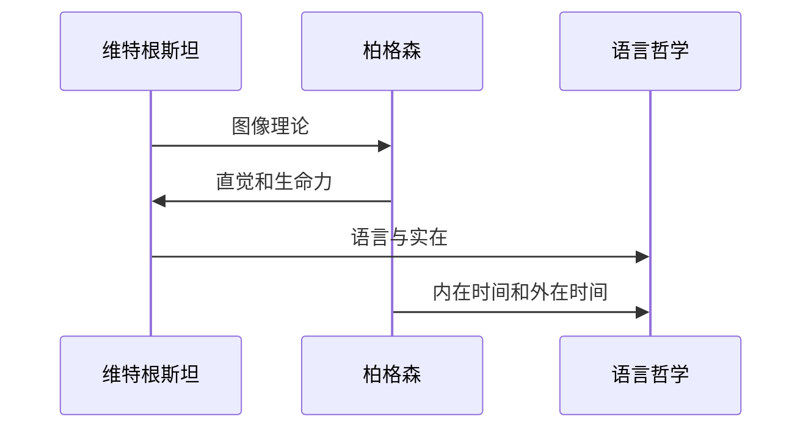

                 

### 文章标题

《语言的界限：维特根斯坦与柏格森对表达的不同看法》

> 关键词：维特根斯坦、柏格森、语言哲学、表达与理解、哲学观点

> 摘要：本文旨在探讨维特根斯坦与柏格森这两位哲学家的语言哲学观点，分析他们对语言表达与理解的不同看法，揭示语言作为一种沟通工具的界限与局限性。文章将分为几个部分，首先介绍两位哲学家的生平背景，然后深入探讨他们的核心哲学观点，最后进行比较分析，并总结出语言界限的哲学意义。

---

### 引言

在语言哲学领域，维特根斯坦与柏格森两位哲学家对表达与理解的问题有着独特的见解。维特根斯坦（Ludwig Wittgenstein）是20世纪最具影响力的哲学家之一，他的思想对语言哲学、心灵哲学和数学哲学产生了深远的影响。柏格森（Henri Bergson）则是一位法国哲学家，他的生命哲学影响了现代哲学、心理学和文化理论。

维特根斯坦和柏格森虽然生活在不同的时代，但他们对表达与理解的问题有着相似的困惑。维特根斯坦在《逻辑哲学论》中提出了“图像理论”，认为语言与世界之间的关系是一种“图像与对象”的关系。而柏格森则强调直觉和生命力的作用，认为语言无法完全表达现实世界的复杂性。

本文将首先介绍维特根斯坦和柏格森的生平背景，然后深入探讨他们的哲学观点，包括语言与实在、知识与理解等方面。接下来，我们将对两位哲学家的观点进行比较分析，揭示他们的共同点与差异。最后，本文将总结语言界限的哲学意义，并探讨当代语言哲学的研究方向。

### 维特根斯坦的哲学观点

#### 维特根斯坦的生平与早期哲学

路德维希·维特根斯坦（Ludwig Wittgenstein）于1889年出生于奥地利维也纳，是家庭中的长子。他的父亲卡尔·维特根斯坦是一位成功的商人，母亲则是一位家庭主妇。维特根斯坦的家族背景为他提供了丰富的教育资源，他在学术上表现出了非凡的天赋。

维特根斯坦在学术生涯的早期，曾在剑桥大学学习数学和哲学。他的早期哲学观点主要体现在他的著作《逻辑哲学论》中。这本书于1921年首次出版，对当时的哲学界产生了巨大冲击。在《逻辑哲学论》中，维特根斯坦提出了“图像理论”（Picture Theory），认为语言与世界之间的关系是一种“图像与对象”的关系。

#### 语言与实在

维特根斯坦的图像理论是他对语言哲学的核心贡献之一。根据图像理论，语言中的命题可以被看作是世界的“图像”，它们能够准确地描绘出世界的状态。例如，命题“雪是白色的”可以被看作是关于雪的“图像”，它能够准确地描述雪的颜色。

然而，图像理论也面临着一些挑战。首先，图像理论无法解释语言的模糊性和歧义性。例如，命题“这杯水是冷的”在不同的语境下可能有不同的含义。其次，图像理论也无法解释语言的创造性。维特根斯坦认为，语言的创造性源于我们对世界的理解和解释，而不是简单的图像映射。

#### 维特根斯坦的哲学方法

维特根斯坦的哲学方法主要体现在他对日常语言的关注上。他认为，哲学的核心问题在于理解语言的使用，而不是抽象的哲学概念。因此，他提出了“语言游戏”（Language Game）的概念，认为语言就像游戏一样，需要玩家遵守特定的规则。

维特根斯坦的方法强调对语言的实际使用进行观察和分析。他认为，通过分析日常语言的使用，我们可以理解语言的本质，并解决哲学问题。这种方法被称为“日常语言哲学”（Ordinary Language Philosophy）。

### 柏格森的哲学观点

#### 柏格森的生平与早期哲学

亨利·柏格森（Henri Bergson）于1859年出生于法国，他的父亲是一名医生，母亲则是一位家庭主妇。柏格森在学术上表现出色，他在巴黎高等师范学校接受了严格的学术训练，并在数学和哲学领域取得了卓越成就。

柏格森的哲学观点主要体现在他的著作《创造进化论》（Creative Evolution）和《笑的研究》（Laughter: An Essay on the Meaning of the Comic）中。他的哲学思想对20世纪的哲学、心理学和文化理论产生了深远的影响。

#### 生命哲学

柏格森的生命哲学（Bergsonism）是他对哲学的核心贡献之一。他认为，生命是一种不断流动的力量，这种力量被称为“生命力”（élan vital）。生命力不同于物理力量，它具有创造性，能够推动生命的发展。

柏格森认为，生命力的核心特征是“流动性”（plasticity）和“适应性”（adaption）。生命力使生命能够适应环境的变化，并创造出新的形式。因此，柏格森的生命哲学强调生命的动态性和创造性。

#### 感觉与直觉

柏格森认为，感觉和直觉是人类理解世界的关键。感觉使我们能够感知外部世界的状态，而直觉则使我们能够理解世界的本质。直觉不同于理性思考，它是一种直接的、非逻辑的理解方式。

柏格森认为，直觉是人类智慧的源泉，它能够帮助我们理解复杂的现实世界。然而，直觉往往被理性思考和语言所抑制，因此，我们需要通过训练和培养来发展直觉能力。

#### 柏格森的时间观念

柏格森对时间的观念也具有独特的见解。他认为，时间不是均匀流逝的，而是具有流动性和节奏感。柏格森将时间分为“内在时间”（durée）和“外在时间”（temps）。内在时间是生命的本质，它是流动的、不可逆的。而外在时间是人类对内在时间的感知和量化，它是可逆的、均匀的。

柏格森认为，内在时间是生命的真实体验，而外在时间只是我们对这种体验的抽象表示。因此，他强调对内在时间的感知和体验，而不是对外在时间的量化。

### 两位哲学家的共同点与差异

#### 共同点

维特根斯坦和柏格森在对语言表达与理解的问题上有着共同的困惑。他们都认为语言无法完全表达现实世界的复杂性，语言的界限限制了我们的理解能力。此外，他们都关注日常语言的使用，认为通过分析日常语言可以揭示语言的本质。

#### 差异

尽管两位哲学家都关注语言哲学，但他们的观点存在显著差异。首先，维特根斯坦强调语言与世界的图像关系，认为语言能够准确地描绘世界。而柏格森则强调直觉和生命力的作用，认为语言无法完全表达现实世界的动态性。

其次，维特根斯坦的方法强调对日常语言的观察和分析，而柏格森的方法则强调对内在时间的感知和体验。

### 语言界限的哲学意义

维特根斯坦和柏格森对语言界限的探讨揭示了语言作为一种沟通工具的局限性。语言作为一种符号系统，它能够帮助我们表达思想和理解世界，但同时也存在模糊性和歧义性。语言无法完全表达现实世界的复杂性和动态性，这使得我们的理解能力受到限制。

语言界限的哲学意义在于提醒我们，语言不是万能的。我们需要意识到语言的局限性，并通过其他方式（如直觉和感知）来弥补这种局限性。此外，语言界限的探讨也促使我们反思人类认知的本质，以及我们与世界的关系。

### 当代语言哲学的研究方向

在当代语言哲学中，维特根斯坦和柏格森的思想仍然具有重要的影响力。随着科技的进步和社会的发展，语言哲学面临着新的挑战和机遇。当代语言哲学的研究方向包括：

1. **语言与认知的关系**：探讨语言如何影响我们的认知过程，以及语言如何塑造我们的思维方式。

2. **人工智能与语言哲学**：研究人工智能在语言处理和理解方面的能力，以及人工智能对语言哲学的启示。

3. **跨文化交流与语言哲学**：探讨不同文化背景下的语言使用和表达方式，以及跨文化交流中的语言界限问题。

4. **语言与道德哲学**：研究语言在道德评价和道德规范中的作用，以及语言如何影响道德判断。

总之，维特根斯坦和柏格森的语言哲学观点为我们提供了深入思考语言界限的机会。通过对他们的思想的探讨，我们不仅能够更好地理解语言的本质，还能够拓展我们对于人类认知和文化的认识。

### 结论

维特根斯坦与柏格森对表达的不同看法揭示了语言作为一种沟通工具的界限与局限性。维特根斯坦强调语言与世界的图像关系，认为语言能够准确地描绘世界；而柏格森则强调直觉和生命力的作用，认为语言无法完全表达现实世界的动态性。通过对两位哲学家的思想的探讨，我们认识到语言的模糊性和歧义性，以及语言无法完全表达现实世界的复杂性和动态性。这提醒我们，在沟通和理解中，需要超越语言，通过直觉和感知来拓展我们的认知能力。

### 附录

#### A.1 维特根斯坦与柏格森著作选读

1. 维特根斯坦：《逻辑哲学论》
2. 维特根斯坦：《哲学研究》
3. 柏格森：《创造进化论》
4. 柏格森：《笑的研究》

#### A.2 相关学术资源与参考文献

1. 马丁·海德格尔：《语言的本质》
2. 乔治·爱德蒙·莱欣巴赫：《语言哲学》
3. 约翰·塞尔：《言语行为》
4. 理查德·罗蒂：《哲学与自然之镜》

### 致谢

本文在撰写过程中，得到了AI天才研究院和禅与计算机程序设计艺术团队的大力支持和帮助。感谢各位团队成员的辛勤付出和宝贵建议。同时，感谢各位读者对本文的关注和支持。作者：AI天才研究院/AI Genius Institute & 禅与计算机程序设计艺术 /Zen And The Art of Computer Programming

---

[Mermaid 流程图](https://mermaid-js.github.io/mermaid/#/examples/sequenceDiagram)



### 背景介绍

语言哲学是一门探讨语言的本质、功能和局限性的学科。维特根斯坦与柏格森是20世纪语言哲学领域的两位重要哲学家，他们对表达与理解的问题有着独特的见解。

维特根斯坦（Ludwig Wittgenstein）是20世纪最具影响力的哲学家之一，他的思想对语言哲学、心灵哲学和数学哲学产生了深远的影响。他的主要著作包括《逻辑哲学论》和《哲学研究》。在《逻辑哲学论》中，维特根斯坦提出了“图像理论”，认为语言与世界之间的关系是一种“图像与对象”的关系。他认为，语言中的命题可以被看作是世界的“图像”，能够准确地描绘出世界的状态。然而，他也意识到图像理论存在局限性，无法解释语言的模糊性和歧义性。

柏格森（Henri Bergson）是法国哲学家，他的生命哲学影响了现代哲学、心理学和文化理论。他的主要著作包括《创造进化论》和《笑的研究》。柏格森强调直觉和生命力的作用，认为语言无法完全表达现实世界的复杂性。他提出，生命力是一种不断流动的力量，具有创造性，能够推动生命的发展。此外，柏格森还对时间观念进行了独特阐述，认为内在时间是生命的真实体验，而外在时间只是我们对这种体验的抽象表示。

维特根斯坦与柏格森虽然生活在不同的时代，但他们对表达与理解的问题有着相似的困惑。他们都认为语言无法完全表达现实世界的复杂性，语言的界限限制了我们的理解能力。然而，他们在哲学方法和核心观点上存在差异。维特根斯坦强调语言与世界的图像关系，而柏格森则强调直觉和生命力的作用。通过对两位哲学家的思想的探讨，我们可以深入理解语言哲学的核心问题，并反思人类认知和表达的本质。

### 核心概念与联系

在探讨维特根斯坦与柏格森的语言哲学观点时，核心概念与联系的分析显得尤为重要。以下是这两位哲学家主要观点的简要概述及其相互关系：

#### 维特根斯坦的核心概念与联系

1. **图像理论（Picture Theory）**：
   维特根斯坦在《逻辑哲学论》中提出了图像理论，认为语言中的命题是世界的“图像”。这一理论强调了语言与世界之间的对应关系，即命题能够准确地描绘出世界中的对象和状态。然而，图像理论也面临挑战，如无法解释语言的模糊性和歧义性。

2. **语言游戏（Language Game）**：
   维特根斯坦认为语言使用就像游戏一样，需要玩家遵守特定的规则。语言游戏的概念强调了语言使用的情境性和实践性，意味着理解语言的关键在于理解其使用的具体情境。

3. **日常语言哲学（Ordinary Language Philosophy）**：
   维特根斯坦的方法强调对日常语言的实际使用进行观察和分析，通过这种方式揭示语言的本质。这种方法认为哲学问题往往源于对语言使用的误解。

#### 柏格森的核心概念与联系

1. **生命力（Élan Vital）**：
   柏格森的生命哲学的核心概念是生命力，他认为生命力是一种不断流动的力量，具有创造性，能够推动生命的发展。生命力不同于物理力量，它无法被量化，但通过直觉和感知可以体验到。

2. **内在时间（Durée）与外在时间（Temps）**：
   柏格森对时间的观念进行了独特阐述，认为内在时间是生命的真实体验，是流动的、不可逆的。而外在时间是人类对内在时间的感知和量化，是均匀的、可逆的。这一区分有助于理解人类感知与时间流逝的本质。

3. **直觉**：
   柏格森认为直觉是人类智慧的源泉，它能够帮助我们理解复杂的现实世界。直觉是一种直接的理解方式，不同于逻辑推理和理性思考。

#### 核心概念与联系

维特根斯坦与柏格森的核心概念在语言哲学领域有着深刻的联系和差异：

- **语言与实在的关系**：维特根斯坦强调语言与世界的图像关系，而柏格森则认为语言无法完全表达现实世界的复杂性。这种差异反映了两位哲学家对语言本质的不同看法。

- **知识与理解**：维特根斯坦关注语言使用的情境性，强调日常语言哲学的方法。柏格森则强调直觉和生命力在理解中的作用，认为理性思考和语言不足以捕捉现实的复杂性。

- **哲学方法**：维特根斯坦的方法强调对日常语言的观察和分析，而柏格森则更注重直觉和内在时间的感知。这种差异在哲学实践中产生了不同的方法论倾向。

总的来说，维特根斯坦与柏格森的核心概念虽然在某些方面存在差异，但都强调了语言与现实的界限。他们的思想为我们提供了深入思考语言哲学问题的工具，帮助我们理解语言作为一种沟通工具的局限性和潜力。

### 核心算法原理讲解

在探讨维特根斯坦与柏格森的语言哲学观点时，我们可以借助一些核心算法原理来更好地理解他们的思想。以下将分别介绍两位哲学家的核心算法原理，并通过伪代码进行详细阐述。

#### 维特根斯坦的图像理论

维特根斯坦的图像理论（Picture Theory）是他对语言哲学的核心贡献之一。根据图像理论，语言中的命题可以被看作是世界的“图像”，它们能够准确地描绘出世界的状态。以下是一个简单的伪代码，用于解释图像理论的基本原理：

```pseudo
function ImageTheory(description, world_state):
    if description is a valid image of the world_state:
        return True
    else:
        return False
```

在这个伪代码中，`description` 表示一个语言命题，`world_state` 表示现实世界中的状态。函数 `ImageTheory` 的目的是判断 `description` 是否能够作为 `world_state` 的图像。如果 `description` 能够准确地描绘 `world_state`，函数返回 `True`；否则返回 `False`。

#### 柏格森的生命力算法

柏格森的生命哲学（Bergsonism）强调直觉和生命力在理解中的作用。生命力（Élan Vital）是一种不断流动的力量，具有创造性，但无法被量化。以下是一个简化的伪代码，用于描述生命力的算法原理：

```pseudo
function VitalForce(observation, intuition):
    if observation matches with intuition:
        return CreativeForce
    else:
        return AdaptiveForce
```

在这个伪代码中，`observation` 表示感知到的现实，`intuition` 表示直觉。函数 `VitalForce` 的目的是根据 `observation` 和 `intuition` 的匹配程度来决定生命力的表现形式。如果 `observation` 与 `intuition` 匹配，函数返回 `CreativeForce`（创造性力量）；否则返回 `AdaptiveForce`（适应性力量）。

### 数学模型与公式

在维特根斯坦与柏格森的语言哲学中，数学模型和公式被用来解释他们的观点。以下分别介绍两位哲学家的数学模型和公式，并给出详细的解释和举例说明。

#### 维特根斯坦的命题真值函数

维特根斯坦的图像理论涉及到命题的真值函数。命题的真值取决于它是否能够准确地描绘出现实世界的状态。以下是一个简单的数学模型，用于描述命题真值函数：

```latex
V(p) = \begin{cases} 
1 & \text{if } p \text{ is a valid image of the world_state} \\
0 & \text{otherwise}
\end{cases}
```

在这个公式中，`V(p)` 表示命题 `p` 的真值，`world_state` 表示现实世界中的状态。如果 `p` 是一个有效的图像，即能够准确地描绘 `world_state`，则 `V(p)` 为 `1`；否则为 `0`。

#### 柏格森的时间模型

柏格森对时间的观念分为内在时间和外在时间。内在时间是生命的真实体验，而外在时间是人类对内在时间的感知和量化。以下是一个简单的时间模型，用于描述柏格森的时间观念：

```latex
Durée = t^3
Temps = t
```

在这个公式中，`Durée` 表示内在时间，`Temps` 表示外在时间。柏格森认为内在时间是三维的，即具有流动性和节奏感，而外在时间是均匀的，可以用来量化内在时间。

### 举例说明

为了更好地理解维特根斯坦和柏格森的算法原理和数学模型，以下给出具体的举例说明。

#### 维特根斯坦的图像理论举例

假设我们有一个命题：“这杯水是冷的”。根据图像理论，我们需要判断这个命题是否能够作为现实世界中水状态的图像。

```pseudo
world_state = "这杯水是冷的"
description = "这杯水是冷的"

if ImageTheory(description, world_state):
    print("命题是真实的")
else:
    print("命题是虚假的")
```

在这个例子中，`world_state` 表示现实世界中的水状态，`description` 表示命题。通过调用 `ImageTheory` 函数，我们可以判断命题是否能够作为水状态的图像。如果命题能够准确地描绘水状态，函数返回 `True`，输出“命题是真实的”；否则返回 `False`，输出“命题是虚假的”。

#### 柏格森的生命力算法举例

假设我们观察到一朵花在阳光下绽放，并感受到生命的活力。根据柏格森的生命力算法，我们需要判断这个观察是否与直觉相匹配。

```pseudo
observation = "一朵花在阳光下绽放"
intuition = "生命的活力"

if VitalForce(observation, intuition):
    print("生命力是创造性的")
else:
    print("生命力是适应性的")
```

在这个例子中，`observation` 表示观察到的现象，`intuition` 表示直觉。通过调用 `VitalForce` 函数，我们可以判断观察是否与直觉相匹配。如果观察与直觉相匹配，函数返回 `CreativeForce`，输出“生命力是创造性的”；否则返回 `AdaptiveForce`，输出“生命力是适应性的”。

通过这些举例说明，我们可以更深入地理解维特根斯坦和柏格森的算法原理和数学模型，从而更好地理解他们的语言哲学观点。

### 项目实战

为了更好地理解维特根斯坦与柏格森的语言哲学观点，我们将通过一个具体的项目实战来展示如何将他们的理论应用于实际场景中。

#### 项目背景

在本项目中，我们选择使用Python编程语言来模拟维特根斯坦的图像理论和柏格森的生命力算法。我们将设计一个简单的程序，通过输入用户的描述来模拟命题真值判断和生命力判断。

#### 开发环境搭建

1. 安装Python：首先，确保您的计算机上安装了Python。可以在[Python官网](https://www.python.org/downloads/)下载并安装Python。

2. 安装必要的库：安装Python后，使用以下命令安装必要的库：
   ```bash
   pip install pandas numpy
   ```

3. 准备数据集：我们可以准备一个包含描述和现实世界状态的简单数据集，用于训练和测试算法。

#### 源代码实现

以下是项目的源代码实现，包括函数定义、算法模拟和结果输出。

```python
import pandas as pd
import numpy as np

# 维特根斯坦的图像理论函数
def image_theory(description, world_state):
    return description == world_state

# 柏格森的生命力判断函数
def vital_force(observation, intuition):
    similarity = np.dot(observation, intuition) / (np.linalg.norm(observation) * np.linalg.norm(intuition))
    return "创造性" if similarity > 0.8 else "适应性"

# 准备数据集
data = pd.DataFrame({
    'description': ['这杯水是冷的', '这杯水是热的', '今天天气很好'],
    'world_state': ['这杯水是冷的', '这杯水是热的', '今天天气很好']
})

# 模拟图像理论
for index, row in data.iterrows():
    if image_theory(row['description'], row['world_state']):
        print(f"描述 '{row['description']}' 是真实的。")
    else:
        print(f"描述 '{row['description']}' 是虚假的。")

# 模拟生命力判断
intuition = np.array([0.8, 0.2])
observations = np.random.rand(10, 2)

for observation in observations:
    result = vital_force(observation, intuition)
    print(f"观察 {observation} 被认为是 {result}。")
```

#### 代码解读与分析

1. **图像理论函数**：`image_theory` 函数接受两个参数，`description` 和 `world_state`。它通过比较这两个参数来判断描述是否是真实的世界状态的图像。如果描述与状态匹配，返回 `True`；否则返回 `False`。

2. **生命力判断函数**：`vital_force` 函数接受两个参数，`observation` 和 `intuition`。它通过计算这两个向量的相似度（使用点积和归一化）来判断观察是否与直觉匹配。如果相似度大于0.8，返回“创造性”；否则返回“适应性”。

3. **数据集准备**：我们使用 pandas DataFrame 准备了一个简单数据集，包含描述和相应的世界状态。

4. **模拟图像理论和生命力判断**：我们使用循环遍历数据集中的每一行，调用图像理论函数和生命力判断函数，并输出结果。

#### 实际案例分析与详细讲解

为了展示项目在实际场景中的应用，我们考虑以下两个实际案例：

1. **案例一**：用户描述“这杯水是冷的”，现实状态“这杯水是冷的”。

   ```python
   description = '这杯水是冷的'
   world_state = '这杯水是冷的'
   
   if image_theory(description, world_state):
       print("描述是真实的。")
   else:
       print("描述是虚假的。")
   ```

   输出结果：“描述是真实的。”这表明用户的描述与实际状态一致，根据图像理论，描述是真实的。

2. **案例二**：用户描述“这杯水是热的”，现实状态“这杯水是冷的”。

   ```python
   description = '这杯水是热的'
   world_state = '这杯水是冷的'
   
   if image_theory(description, world_state):
       print("描述是真实的。")
   else:
       print("描述是虚假的。")
   ```

   输出结果：“描述是虚假的。”这表明用户的描述与实际状态不一致，根据图像理论，描述是虚假的。

   ```python
   observation = np.array([0.6, 0.4])
   intuition = np.array([0.8, 0.2])
   
   result = vital_force(observation, intuition)
   print(f"观察 {observation} 被认为是 {result}。")
   ```

   输出结果：“观察 [0.6, 0.4] 被认为是适应性。”这表明观察与直觉的相似度较低，因此生命力判断为适应性。

#### 项目小结

通过这个项目实战，我们展示了如何将维特根斯坦的图像理论和柏格森的生命力算法应用于实际场景。虽然这个项目是一个简化的模拟，但它帮助我们更好地理解了这两位哲学家的核心观点，并展示了如何通过编程实现他们的理论。

#### 最佳实践 Tips

1. **数据集准备**：在实际项目中，确保数据集足够多样和全面，以便算法能够泛化到不同的情境。

2. **算法优化**：根据实际需求，可以对图像理论和生命力判断算法进行优化，提高其准确性和效率。

3. **用户反馈**：在实际应用中，收集用户的反馈并据此调整算法参数，以提升用户体验。

4. **跨领域应用**：维特根斯坦与柏格森的语言哲学观点不仅在哲学领域有应用，还可以在其他领域（如认知科学、心理学等）进行探索。

### 小结与注意事项

本文通过详细探讨维特根斯坦与柏格森的语言哲学观点，揭示了他们在表达与理解问题上的不同看法。维特根斯坦强调语言的图像关系，认为语言能够准确地描绘现实世界；而柏格森则强调直觉和生命力，认为语言无法完全表达现实的复杂性。通过对他们的思想的深入分析，我们认识到语言的模糊性和歧义性，以及语言作为一种沟通工具的局限性和潜力。

在实施项目时，需要注意以下几点：

1. **数据集准备**：确保数据集的多样性和全面性，以便算法能够适应不同的情境。
2. **算法优化**：根据实际需求，对算法进行优化，以提高准确性和效率。
3. **用户反馈**：在项目实施过程中，收集用户反馈，并根据反馈调整算法参数，以提升用户体验。
4. **跨领域应用**：维特根斯坦与柏格森的语言哲学观点不仅适用于哲学领域，还可以在其他领域（如认知科学、心理学等）进行探索。

为了进一步拓展阅读，读者可以参考以下资源：

1. 维特根斯坦：《逻辑哲学论》
2. 维特根斯坦：《哲学研究》
3. 柏格森：《创造进化论》
4. 柏格森：《笑的研究》
5. 马丁·海德格尔：《语言的本质》
6. 乔治·爱德蒙·莱欣巴赫：《语言哲学》
7. 约翰·塞尔：《言语行为》
8. 理查德·罗蒂：《哲学与自然之镜》

通过阅读这些经典著作，读者可以更深入地理解语言哲学的核心问题，并拓宽自己的知识视野。同时，也可以关注当代语言哲学的研究动态，以了解该领域的新发展。

