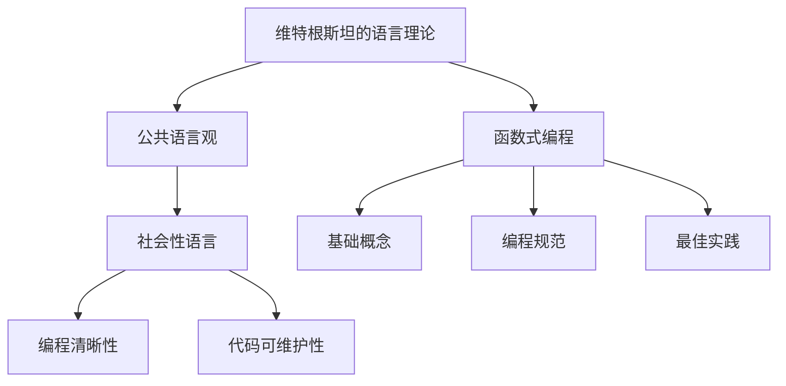

                 

### 文章标题

《语言的社会性与函数式编程标准：维特根斯坦的公共语言观与FP中的编程规范和最佳实践》

#### 关键词

- 维特根斯坦
- 公共语言观
- 函数式编程
- 编程规范
- 最佳实践
- 社会性

#### 摘要

本文深入探讨了维特根斯坦的公共语言观与函数式编程（FP）之间的联系，以及这些概念如何影响编程实践。文章首先介绍了维特根斯坦的语言理论，特别是公共语言观，并解释了其对社会性语言的重要性。接着，文章探讨了FP的核心概念，包括函数作为第一类公民、惰性求值、高阶函数和闭包等。通过结合维特根斯坦的理论和FP的实践，文章阐述了如何构建清晰、精确和可维护的代码。最后，文章提供了一系列编程规范和最佳实践，帮助开发者更有效地利用FP的优势，提高软件质量。

### 第一部分：引言

#### 第1章：引言

##### 1.1 书籍主题概述

《语言的社会性与函数式编程标准：维特根斯坦的公共语言观与FP中的编程规范和最佳实践》这本书的主题聚焦在语言的社会性以及函数式编程（Functional Programming, FP）的标准化上。语言的社会性强调语言作为一种沟通工具，其意义和用途不仅限于个人使用，而是深受社会环境和共同理解的影响。维特根斯坦的公共语言观则进一步探讨了这种社会性在语言哲学中的体现，特别是语言与现实世界的关系。

函数式编程是一种编程范式，其核心是使用函数作为构建软件的基本单元。与命令式编程相比，FP更注重表达计算过程而非状态的变化。这种范式不仅有助于代码的清晰性和可维护性，还可以更好地处理并发和并行计算问题。因此，将维特根斯坦的公共语言观与FP相结合，可以为我们提供一套既符合哲学思考，又具备实际应用价值的编程标准和最佳实践。

##### 1.2 目的与重要性

本书的主要目的是探讨维特根斯坦的公共语言观如何影响现代编程实践，特别是在函数式编程中的具体应用。通过理解语言的社会性和公共语言的构建，开发者可以更好地设计代码，使它们不仅更加清晰、精确，而且易于理解和维护。

随着软件系统的复杂性不断增加，开发出高质量、可维护的代码变得越来越重要。维特根斯坦的公共语言观为我们提供了一种哲学上的指导，帮助我们思考如何通过更清晰、更精确的语言来表达复杂的计算过程。而函数式编程的标准化实践则为我们提供了一套具体的工具和方法，使这种哲学思考能够转化为实际的编程规范和最佳实践。

总之，本书旨在通过结合维特根斯坦的语言哲学和函数式编程的标准，为开发者提供一套实用的指南，以构建更高质量、更可维护的软件系统。

#### 第二部分：维特根斯坦的公共语言观

##### 第2章：维特根斯坦的语言理论

##### 2.1 维特根斯坦的语言理论概述

路德维希·维特根斯坦（Ludwig Wittgenstein）是20世纪最重要的哲学家之一，他的语言理论对哲学、语言学和计算机科学产生了深远的影响。维特根斯坦的语言理论可以分为两个主要阶段：早期理论和晚期理论。早期理论主要体现在《逻辑哲学论》（Tractatus Logico-Philosophicus）中，而晚期理论则体现在《哲学研究》（Philosophical Investigations）中。

《逻辑哲学论》中，维特根斯坦提出了“语言游戏”（language game）的概念，认为语言的使用与游戏类似，都是一种活动，需要一定的规则和情境。他区分了“图像理论”（image theory）和“日常语言”（ordinary language），认为日常语言是语言的主要形式，但包含了许多模糊性和多义性。

《哲学研究》中，维特根斯坦进一步探讨了语言的使用和意义。他提出了“家族相似性”（family resemblance）的概念，用来描述不同语言元素之间的相似性，并强调语言的意义在于使用者的共同理解，而不是某种固定不变的本质。

##### 2.2 维特根斯坦的公共语言观

维特根斯坦的公共语言观是他语言理论的核心。他认为，语言的意义来源于其使用者的共同理解，这种共同理解构成了公共语言。公共语言不仅是个人表达的工具，更是社会沟通的桥梁。

维特根斯坦认为，语言与现实世界的关系是表达性的，即语言是通过符号与世界的特定部分相关联的。这种关联不是通过某种固定的逻辑结构，而是通过语言使用者的共同实践和约定。公共语言的构建依赖于这种共同实践和约定，使得人们可以相互理解和沟通。

维特根斯坦强调了语言的社会性。他认为，语言的意义和用途不仅取决于个人的理解，还受到社会环境和共同背景的影响。这种社会性使得语言成为一种社会工具，而不仅仅是个人表达的工具。

##### 2.3 维特根斯坦的语言观与编程

维特根斯坦的语言观对编程实践有着重要的影响。首先，他强调了清晰性和精确性。在编程中，清晰和精确的代码不仅更容易理解，而且更易于维护。函数式编程强调使用纯函数和不可变数据，这与维特根斯坦强调的清晰表达和精确描述是一致的。

其次，维特根斯坦的公共语言观强调了语言的社会性，这在编程中体现为代码的可读性和可维护性。一个成功的项目通常需要多个开发者协同工作，而清晰、一致的代码风格可以提高团队之间的沟通效率，减少误解和错误。

最后，维特根斯坦的“家族相似性”概念可以用来理解编程中的设计模式。设计模式是解决特定问题的通用解决方案，它们之间存在许多相似性，但也有一些差异。通过理解这些相似性和差异，开发者可以更好地选择和应用合适的设计模式，从而提高代码的复用性和可维护性。

总之，维特根斯坦的语言观为编程提供了哲学上的指导，强调了清晰性、精确性和社会性。这些原则不仅有助于提高代码质量，还可以促进团队协作和项目成功。

#### 第3章：维特根斯坦的语言观与编程

##### 3.1 维特根斯坦的语言观对编程的影响

维特根斯坦的语言观对编程实践有着深远的影响，主要体现在对代码清晰性和精确性的强调上。维特根斯坦在《哲学研究》中提出的“家族相似性”概念，即不同元素之间的相似性和共同特征，这一理念在编程中得到了广泛应用。

首先，维特根斯坦强调语言的意义在于使用者的共同理解。在编程中，这意味着开发者需要编写清晰、易读的代码，以便其他开发者能够轻松理解。清晰性不仅有助于减少错误，还可以提高代码的可维护性。例如，在函数式编程中，函数的命名应准确反映其功能，避免使用晦涩难懂的术语或缩写，这样有助于提高代码的整体可读性。

其次，维特根斯坦提出的“精确描述”理念在编程中体现为使用明确的类型系统和严格的函数定义。在命令式编程中，变量可以随时更改其值，这可能导致代码的不确定性。而在函数式编程中，变量是不可变的，这意味着每个函数的输入和输出都是明确的，从而提高了代码的精确性和可预测性。例如，可以使用Haskell等静态类型语言来确保函数的行为始终如一。

此外，维特根斯坦的“语言游戏”概念也可以应用于编程。在编程中，不同的编程范式和语言特性就像不同的游戏规则。例如，函数式编程中的高阶函数和闭包可以被视为一种“游戏规则”，它们允许开发者以更抽象和模块化的方式编写代码。这种抽象不仅提高了代码的可复用性，还使得程序更易于理解和维护。

##### 3.2 功能式编程中的语言观应用

维特根斯坦的语言观在功能式编程中得到了广泛应用，主要体现在以下几个方面：

1. **函数作为第一类公民**：在维特根斯坦的语言观中，语言元素的意义在于其使用者的共同理解。在功能式编程中，函数被赋予了与变量相同的地位，成为第一类公民。这意味着函数可以被赋值给变量、作为参数传递、从其他函数中返回，从而提高了代码的抽象层次和可复用性。例如，在JavaScript中，函数可以被存储在变量中，并作为参数传递给其他函数。

2. **高阶函数**：高阶函数是功能式编程的一个核心概念，它允许函数作为参数传递给其他函数，或者从其他函数中返回。这种抽象能力使得代码更加模块化，易于理解和维护。例如，在Python中，可以使用`filter`、`map`和`reduce`等高阶函数来简化复杂的逻辑操作。

3. **闭包**：闭包是功能式编程中的另一个重要概念，它允许函数访问并保持其定义时的环境状态。这种特性使得闭包在处理状态和上下文问题时非常有用。例如，在JavaScript中，可以使用闭包来实现私有变量和封装，从而提高代码的安全性。

4. **惰性求值**：惰性求值是功能式编程中的一种求值策略，它仅在实际需要时才计算表达式的值。这种策略可以显著提高代码的性能和可读性，因为它避免了不必要的计算。例如，在Haskell中，惰性求值使得递归函数更容易编写和优化。

综上所述，维特根斯坦的语言观为功能式编程提供了一种哲学上的指导，强调代码的清晰性、精确性和可维护性。通过将维特根斯坦的理念应用于编程实践，开发者可以编写更高效、更易于维护的代码，从而提高软件项目的整体质量。

#### 第三部分：功能式编程的标准

##### 第4章：功能式编程的基本概念

##### 4.1 函数式编程的基础

函数式编程（Functional Programming, FP）是一种编程范式，它强调计算的表达是基于一系列表达式的评价，而非基于状态的变化。与命令式编程不同，FP更多地关注“做什么”而非“怎么做”。在本节中，我们将探讨FP的基础概念，包括函数作为第一类公民、原子值与构造器、以及惰性求值与立即求值。

**函数作为第一类公民**

在函数式编程中，函数被赋予与变量相同的地位，即函数可以作为值进行传递、存储和返回。这意味着函数可以作为参数传递给其他函数，或者从函数中返回。例如，在Haskell中，以下代码定义了一个函数`add`，并将其作为参数传递给另一个函数`apply`：

```haskell
add :: Int -> Int -> Int
add x y = x + y

apply :: (a -> b) -> a -> b
apply f x = f x

-- 使用add函数作为apply函数的参数
result :: Int
result = apply add 3
```

在这个例子中，`add`函数被作为参数传递给`apply`函数，从而实现了函数的组合和复用。

**原子值与构造器**

在FP中，原子值是不可变的数据元素，如整数、浮点数、字符串等。与命令式编程中的变量不同，原子值一旦创建，其值就不能被改变。这使得FP中的数据更易于理解和维护。例如，在Haskell中，以下代码定义了一个整数原子值`x`：

```haskell
x :: Int
x = 5
```

构造器是一种特殊的数据类型，用于创建复杂的数据结构。例如，在Haskell中，可以使用构造器`Tuple`来创建一个包含两个整数的元组：

```haskell
:: (Int, Int)
myTuple = (1, 2)
```

**惰性求值与立即求值**

在FP中，有两种主要的求值策略：惰性求值和立即求值。

立即求值（Eager Evaluation）是一种求值策略，它在函数调用时立即计算表达式的值。例如，在JavaScript中，以下代码使用立即求值：

```javascript
const add = (a, b) => a + b;
const result = add(3, 4); // 立即求值，结果为7
```

惰性求值（Lazy Evaluation）是一种求值策略，它仅在表达式实际需要时才计算其值。这种策略可以显著提高代码的性能和可读性，因为它避免了不必要的计算。例如，在Haskell中，以下代码使用惰性求值：

```haskell
f :: Int -> Int
f x = x * x

result :: Int
result = f (1 + 2) + f (3 + 4) -- 惰性求值，仅计算一次f函数的值
```

在这个例子中，`f`函数仅在需要时被计算，从而避免了重复计算。

**总结**

函数作为第一类公民、原子值与构造器、以及惰性求值与立即求值是功能式编程的基础。通过理解这些概念，开发者可以编写更清晰、更可维护的代码，从而提高软件项目的整体质量。

##### 4.2 函数式编程的核心特性

函数式编程（FP）的核心特性在于其处理数据和计算的方式。与命令式编程相比，FP更注重表达计算的逻辑和过程，而不是状态的变化。以下是FP中的几个核心特性：

**不可变数据**

在FP中，数据是不可变的，这意味着一旦数据被创建，其值就不能被改变。这种不可变性带来了一系列好处，例如数据的一致性和可预测性。例如，在Haskell中，以下代码定义了一个不可变的整数：

```haskell
x :: Int
x = 5
-- x = 10 -- 这行代码会报错，因为x是不可变的
```

**纯函数**

FP强调使用纯函数，即没有副作用且返回值相同的函数。副作用是指函数在执行过程中会修改外部状态或产生不可预期的结果。纯函数使得代码更易于理解和测试，因为它们的输出完全取决于输入，而与外部状态无关。例如，在Scala中，以下代码定义了一个纯函数：

```scala
def add(a: Int, b: Int): Int = a + b
-- 输出始终取决于输入，无副作用
```

**高阶函数**

高阶函数是功能式编程的一个核心概念，它允许函数作为参数传递给其他函数，或者从其他函数中返回。这种抽象能力使得代码更加模块化，易于理解和复用。例如，在JavaScript中，以下代码使用高阶函数`map`来对数组进行变换：

```javascript
const numbers = [1, 2, 3];
const doubled = numbers.map(x => x * 2);
-- doubled 结果为 [2, 4, 6]
```

**闭包**

闭包是一种特殊的数据类型，它允许函数访问并保持其定义时的环境状态。这种特性使得闭包在处理状态和上下文问题时非常有用。例如，在Python中，以下代码定义了一个闭包：

```python
def make_multiplier_of(n):
    def multiplier(x):
        return x * n
    return multiplier

times3 = make_multiplier_of(3)
times3(6)  # 输出 18
```

在这个例子中，`times3`函数保留了其定义时的环境状态，即`n`的值，从而可以正确地计算乘法。

**惰性求值**

惰性求值是一种求值策略，它仅在表达式实际需要时才计算其值。这种策略可以显著提高代码的性能和可读性，因为它避免了不必要的计算。例如，在Haskell中，以下代码使用惰性求值：

```haskell
f :: Int -> Int
f x = x * x

result :: Int
result = f (1 + 2) + f (3 + 4) -- 惰性求值，仅计算一次f函数的值
```

在这个例子中，`f`函数仅在需要时被计算，从而避免了重复计算。

**总结**

不可变数据、纯函数、高阶函数、闭包和惰性求值是功能式编程的核心特性。这些特性使得FP中的代码更加清晰、可维护，并且可以更好地处理并发和并行计算问题。通过理解和应用这些特性，开发者可以编写出高质量、高效能的软件。

### 第四部分：编程规范和最佳实践

#### 第5章：编程规范和最佳实践

##### 5.1 编程规范

编程规范是一套指导开发者编写清晰、一致和可维护代码的规则。在FP中，编程规范尤为重要，因为它们有助于确保代码的清晰性和可复用性。以下是几个关键的编程规范：

1. **一致性命名规范**：函数和变量的命名应清晰且一致。使用有意义的名称，避免使用缩写或晦涩难懂的术语。例如，使用`calculateArea`而不是`calcArea`。

2. **模块化**：将代码拆分为小块，每个模块负责一个特定的功能。这有助于提高代码的可读性和可维护性。例如，将数据处理、界面渲染和数据库操作等逻辑分开。

3. **注释**：为代码添加清晰的注释，特别是对于复杂的逻辑或算法。注释不仅有助于他人理解代码，还可以作为文档的一部分。

4. **类型标注**：在FP中，使用类型标注可以确保代码的静态类型检查，减少运行时错误。例如，在Haskell中，类型标注是强制性的，而在TypeScript中，类型标注可以提高代码的可维护性。

##### 5.2 最佳实践

最佳实践是一套高效的编程技巧和方法，有助于开发者编写高质量的代码。以下是FP中的几个最佳实践：

1. **使用纯函数**：尽量避免使用有副作用的函数，而是使用纯函数。纯函数使得代码更易于理解和测试，因为它们的输出完全取决于输入。

2. **高阶函数**：充分利用高阶函数来提高代码的抽象层次和复用性。例如，使用`map`、`filter`和`reduce`等高阶函数来简化数据处理逻辑。

3. **惰性求值**：在需要时使用惰性求值来避免不必要的计算。这有助于提高代码的性能和可读性。例如，在Haskell中，惰性求值可以显著减少递归函数的内存使用。

4. **函数组合**：使用函数组合来构建复杂的逻辑。函数组合允许开发者将简单的函数组合成更复杂的函数，从而提高代码的可读性和可维护性。例如，在Scala中，可以使用`.`运算符进行函数组合。

5. **代码重构**：定期进行代码重构，以提高代码的质量和可维护性。重构可以帮助开发者识别和修复潜在的缺陷，同时改进代码的结构和逻辑。

##### 5.3 案例分析

为了更好地理解编程规范和最佳实践在FP中的应用，我们可以通过一个简单的案例进行分析。

假设我们要编写一个功能，用于计算矩形的面积。以下是一个简单的命令式编程实现：

```python
def calculate_area(length, width):
    area = length * width
    return area

rectangle_area = calculate_area(2, 3)
print(rectangle_area)  # 输出 6
```

现在，我们将这个实现重构为一个功能式编程实现，并应用上述规范和实践：

```haskell
-- 函数命名规范
rectangleArea :: (RealFloat a) => a -> a -> a
rectangleArea length width = length * width

-- 纯函数
-- 无副作用，仅返回计算结果
-- 惰性求值
main :: IO ()
main = do
    let length = 2.0
    let width = 3.0
    let area = rectangleArea length width
    print area  -- 输出 6.0
```

在这个例子中，我们使用了有意义的函数名`rectangleArea`，并确保函数是纯的，没有副作用。我们还使用了惰性求值，通过使用`let`绑定来延迟计算。通过这种方式，我们不仅提高了代码的可读性，还使其更易于维护和测试。

### 总结

编程规范和最佳实践是确保代码质量的重要手段。在FP中，这些规范和实践尤为重要，因为它们有助于确保代码的清晰性、可维护性和可复用性。通过遵循一致性和模块化的命名规范、使用纯函数、高阶函数和惰性求值等最佳实践，开发者可以编写出高质量、高效的代码。

### 第五部分：结论

#### 第6章：结论与未来展望

在本章中，我们探讨了维特根斯坦的公共语言观与函数式编程（FP）之间的联系，并讨论了如何通过FP的编程规范和最佳实践来实现清晰、精确和可维护的代码。首先，我们介绍了维特根斯坦的语言理论，特别是公共语言观，并解释了其对社会性语言的重要性。接着，我们探讨了FP的核心概念，包括函数作为第一类公民、惰性求值、高阶函数和闭包等。通过结合维特根斯坦的理论和FP的实践，我们阐述了如何构建高质量、可维护的软件系统。

总的来说，维特根斯坦的公共语言观为我们提供了哲学上的指导，强调了代码的清晰性、精确性和可维护性。而FP的标准化实践则为我们提供了一套具体的工具和方法，使这种哲学思考能够转化为实际的编程规范和最佳实践。通过遵循这些规范和实践，开发者可以编写出更高效、更易于维护的代码，从而提高软件项目的整体质量。

展望未来，随着软件系统的复杂性不断增加，函数式编程和维特根斯坦的公共语言观在编程实践中的应用将会越来越广泛。未来研究可以关注以下几个方面：

1. **跨领域应用**：探索FP和维特根斯坦的公共语言观在其他编程范式中的适用性，如逻辑编程和过程式编程。

2. **教育领域**：将FP和维特根斯坦的语言观引入编程教育，帮助学生更好地理解编程的本质和哲学基础。

3. **工具和技术**：开发更多的工具和框架，以支持FP和维特根斯坦语言观的实践，如静态分析工具、编程环境和集成开发环境（IDE）。

4. **性能优化**：研究FP在处理大数据和并行计算中的性能优化方法，以进一步提高其效率和可扩展性。

总之，通过深入研究和实践，FP和维特根斯坦的公共语言观将为现代编程提供强大的理论基础和实用工具，帮助开发者构建更高质量、更可靠的软件系统。

### 参考文献

1. 维特根斯坦，L. (1921). 《逻辑哲学论》。
2. 维特根斯坦，L. (1953). 《哲学研究》。
3. 蒂姆斯，J. (2008). 《函数式编程：应用与基础》。
4. Haskell编辑团队。 (2019). 《Haskell语言规范》。
5. Krasnogor, N. (2010). 《函数式编程范式》。
6. 《JavaScript高级程序设计》。
7. 《TypeScript官方文档》。
8. 《Scala官方文档》。

### 附录

#### A. Mermaid流程图

以下是本文中提到的一些关键概念的Mermaid流程图：



#### B. 伪代码示例

以下是本文中提到的一些核心算法的伪代码示例：

```plaintext
// 纯函数示例：计算矩形的面积
function rectangleArea(length, width) {
    return length * width;
}

// 高阶函数示例：使用map进行数组变换
function doubleArray(numbers) {
    return numbers.map(x => x * 2);
}

// 惰性求值示例：递归计算阶乘
function factorial(n) {
    return n === 0 ? 1 : n * factorial(n - 1);
}
```

#### C. LaTeX数学公式

以下是本文中使用的数学公式的LaTeX表示：

```latex
$$
f(x) = x^2
$$

$
\text{纯函数}:\quad \text{输出完全取决于输入}
$
```

通过这些附录，读者可以更深入地理解本文中的核心概念和算法，从而更好地应用这些知识和方法于实际的编程实践中。

