                 


### 第1章：引论

#### 1.1 研究背景与意义

**背景介绍**

在当今数字化时代，语言作为人类交流的重要工具，其重要性日益凸显。无论是自然语言还是编程语言，都在不断地演变和进步，以满足日益复杂的社会需求。而函数式编程（Functional Programming，FP）作为编程领域的一种重要范式，近年来在学术界和工业界都受到了广泛关注。FP以其简洁、可复用、并发性强等特点，在处理复杂问题和大型分布式系统方面展现出强大的潜力。

**研究意义**

本文旨在探讨语言的社会性在函数式编程社区中的作用，通过维特根斯坦的公共语言观为理论基础，分析FP社区的知识共享实践，从而揭示语言的社会性在FP社区中的具体表现。研究意义如下：

1. **深化对语言社会性的理解**：语言不仅仅是交流的工具，更是塑造社会行为和文化的重要元素。通过本文的研究，可以进一步深化对语言社会性的理解，为语言哲学研究提供新的视角。

2. **促进FP社区的发展**：函数式编程社区的知识共享是FP技术发展的重要驱动力。本文的研究可以为FP社区提供理论指导，促进其更好地发展。

3. **为其他编程社区提供借鉴**：FP社区的知识共享实践具有一定的代表性，可以为其他编程社区提供借鉴，促进编程语言的普及和发展。

#### 1.2 维特根斯坦的公共语言观

**维特根斯坦的语言哲学**

维特根斯坦是20世纪最重要的哲学家之一，他的语言哲学对现代哲学和语言学研究产生了深远影响。维特根斯坦认为，语言是一种行为，是一种用于表达思想和社会互动的工具。他强调语言与世界的密切关系，认为语言是世界的“图画”（picture）。

**公共语言观**

维特根斯坦提出了“公共语言”（public language）的概念，认为公共语言是人们进行交流的基础。公共语言具有以下特点：

1. **普遍性**：公共语言是普遍适用的，不受个人语言习惯的影响。
2. **明确性**：公共语言的表达具有明确的意义，不产生歧义。
3. **规范性**：公共语言遵循一定的规范和标准，以保证交流的顺利进行。

**维特根斯坦的语言观在FP社区中的应用**

维特根斯坦的公共语言观在FP社区中得到了广泛应用。FP社区强调代码的可读性、可维护性和可复用性，这与维特根斯坦的公共语言观有很高的契合度。FP社区通过建立公共的编程规范和标准，促进代码的共享和交流，从而提高了整个社区的技术水平。

#### 1.3 函数式编程社区概述

**函数式编程的基本概念**

函数式编程是一种编程范式，它强调使用函数作为基本构建块，通过传递参数和返回值来实现程序功能。与命令式编程不同，函数式编程不直接修改状态，而是通过输入和输出数据来处理数据。

**函数式编程的优势**

1. **简洁性**：函数式编程的代码通常更加简洁、易读。
2. **可复用性**：函数式编程的函数具有明确的输入和输出，易于复用。
3. **并发性**：函数式编程易于实现并发计算，适合处理复杂和大规模的计算任务。

**函数式编程社区的现状**

函数式编程社区逐渐壮大，涌现出许多优秀的编程语言，如Haskell、Scala、Erlang等。FP社区通过开源项目、会议和讨论等方式，促进了知识的传播和交流，形成了一个具有强烈合作精神和技术热情的社区。

### 1.1 研究背景与意义

**背景介绍**

在当今数字化时代，语言作为人类交流的重要工具，其重要性日益凸显。无论是自然语言还是编程语言，都在不断地演变和进步，以满足日益复杂的社会需求。而函数式编程（Functional Programming，FP）作为编程领域的一种重要范式，近年来在学术界和工业界都受到了广泛关注。FP以其简洁、可复用、并发性强等特点，在处理复杂问题和大型分布式系统方面展现出强大的潜力。

**研究意义**

本文旨在探讨语言的社会性在函数式编程社区中的作用，通过维特根斯坦的公共语言观为理论基础，分析FP社区的知识共享实践，从而揭示语言的社会性在FP社区中的具体表现。研究意义如下：

1. **深化对语言社会性的理解**：语言不仅仅是交流的工具，更是塑造社会行为和文化的重要元素。通过本文的研究，可以进一步深化对语言社会性的理解，为语言哲学研究提供新的视角。

2. **促进FP社区的发展**：函数式编程社区的知识共享是FP技术发展的重要驱动力。本文的研究可以为FP社区提供理论指导，促进其更好地发展。

3. **为其他编程社区提供借鉴**：FP社区的知识共享实践具有一定的代表性，可以为其他编程社区提供借鉴，促进编程语言的普及和发展。

### 1.2 维特根斯坦的公共语言观

**维特根斯坦的语言哲学**

维特根斯坦是20世纪最重要的哲学家之一，他的语言哲学对现代哲学和语言学研究产生了深远影响。维特根斯坦认为，语言是一种行为，是一种用于表达思想和社会互动的工具。他强调语言与世界的密切关系，认为语言是世界的“图画”（picture）。

**公共语言观**

维特根斯坦提出了“公共语言”（public language）的概念，认为公共语言是人们进行交流的基础。公共语言具有以下特点：

1. **普遍性**：公共语言是普遍适用的，不受个人语言习惯的影响。
2. **明确性**：公共语言的表达具有明确的意义，不产生歧义。
3. **规范性**：公共语言遵循一定的规范和标准，以保证交流的顺利进行。

**维特根斯坦的语言观在FP社区中的应用**

维特根斯坦的公共语言观在FP社区中得到了广泛应用。FP社区强调代码的可读性、可维护性和可复用性，这与维特根斯坦的公共语言观有很高的契合度。FP社区通过建立公共的编程规范和标准，促进代码的共享和交流，从而提高了整个社区的技术水平。

### 1.3 函数式编程社区概述

**函数式编程的基本概念**

函数式编程是一种编程范式，它强调使用函数作为基本构建块，通过传递参数和返回值来实现程序功能。与命令式编程不同，函数式编程不直接修改状态，而是通过输入和输出数据来处理数据。

**函数式编程的优势**

1. **简洁性**：函数式编程的代码通常更加简洁、易读。
2. **可复用性**：函数式编程的函数具有明确的输入和输出，易于复用。
3. **并发性**：函数式编程易于实现并发计算，适合处理复杂和大规模的计算任务。

**函数式编程社区的现状**

函数式编程社区逐渐壮大，涌现出许多优秀的编程语言，如Haskell、Scala、Erlang等。FP社区通过开源项目、会议和讨论等方式，促进了知识的传播和交流，形成了一个具有强烈合作精神和技术热情的社区。

## **第2章：维特根斯坦的语言哲学**

### **2.1 维特根斯坦的哲学理念**

**语言作为世界的图画**

维特根斯坦的早期哲学思想认为语言是世界的“图画”。他通过一系列的图示和隐喻来说明这一点。以下是一个简化的Mermaid流程图，展示了维特根斯坦如何将语言视为世界的映射：

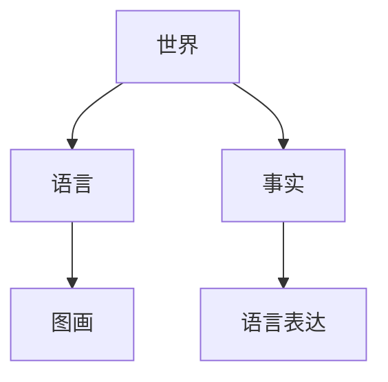

在这个图中，我们可以看到世界（A）通过语言（B）形成一幅图画（C），而事实（D）通过语言表达（E）得以体现。

**伪代码示例**

维特根斯坦的思想可以用伪代码来形象地表达：

```python
class World:
    def describe(self):
        return "This is the world."

class Language(World):
    def __init__(self, world):
        self.world = world
    
    def describe_world(self):
        return self.world.describe()

class Picture(Language):
    def __init__(self, language):
        self.language = language
    
    def show(self):
        return self.language.describe_world()
```

在这个伪代码中，`World` 类代表了现实世界，`Language` 类代表了描述世界的语言，而 `Picture` 类则代表了语言如何形成对世界的描述。

**语言的游戏概念**

维特根斯坦的后期哲学思想更加注重语言的使用，他将语言视为一系列的“游戏”。以下是一个简化的Mermaid流程图，展示了维特根斯坦如何将语言视为一系列的游戏：

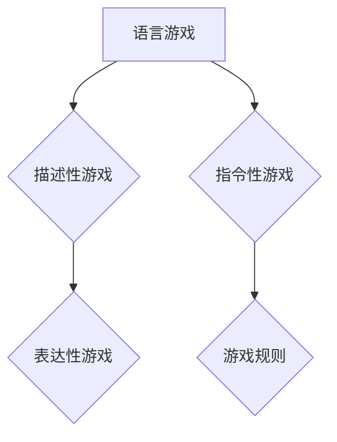

在这个图中，语言游戏（A）可以分为描述性游戏（B）、表达性游戏（C）和指令性游戏（D），每种游戏都有其特定的规则（E）。

**伪代码示例**

维特根斯坦的“语言游戏”概念可以用伪代码来表示：

```python
class LanguageGame:
    def play(self):
        print("Playing a language game!")
        self.describe()
        self.answer()
    
    def describe(self):
        print("Describing something.")
    
    def answer(self):
        print("Answering a question.")

class DescriptiveGame(LanguageGame):
    def describe(self):
        print("I am describing the world.")

class ExpressiveGame(LanguageGame):
    def describe(self):
        print("I am expressing my feelings.")

class InstructionalGame(LanguageGame):
    def describe(self):
        print("I am giving instructions.")
```

在这个伪代码中，`LanguageGame` 类是所有语言游戏的基础，而 `DescriptiveGame`、`ExpressiveGame` 和 `InstructionalGame` 类分别代表了不同类型的语言游戏。

**语言的限制**

维特根斯坦认为，语言有其固有的限制，这些限制不仅影响了我们如何表达思想，也影响了我们对世界的理解。以下是一个简化的Mermaid流程图，展示了维特根斯坦如何理解语言的限制：

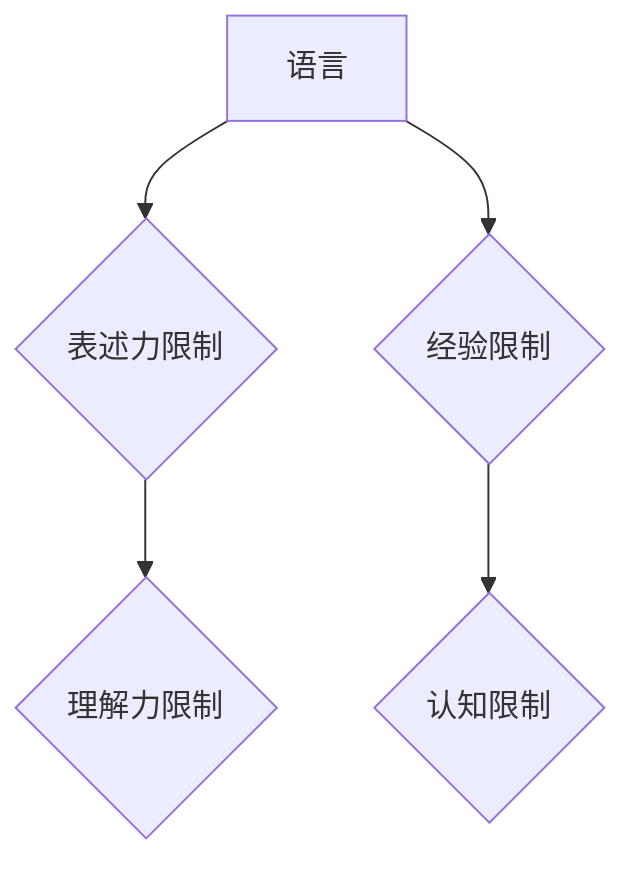

在这个图中，语言（A）受到多种限制，包括表述力限制（B）、理解力限制（C）和经验限制（D），这些限制最终导致了认知限制（E）。

**伪代码示例**

维特根斯坦的语言限制可以用伪代码来表示：

```python
class Language:
    def describe(self, subject):
        if self.can_describe(subject):
            print(f"I can describe {subject}.")
        else:
            print(f"I cannot describe {subject}.")

    def can_describe(self, subject):
        # 假设某些主体可以被描述，而其他则不能
        return subject in ["world", "object"]

class World:
    def __init__(self, objects):
        self.objects = objects

class DescribableObject(World):
    def __init__(self, name):
        super().__init__(name)

    def can_be_described(self):
        return True

class IndescribableObject(World):
    def __init__(self, name):
        super().__init__(name)

    def can_be_described(self):
        return False
```

在这个伪代码中，`Language` 类尝试描述各种对象（`World` 类的实例），但受到语言的限制，有些对象（如 `IndescribableObject` 类的实例）是无法被描述的。

### **2.2 公共语言的哲学意义**

**公共语言与个人语言**

维特根斯坦区分了公共语言和个人语言。公共语言是人们共同遵循的语言规范，而个人语言则是个体根据个人经验和文化背景形成的语言。以下是一个简化的Mermaid流程图，展示了公共语言和个人语言的关系：

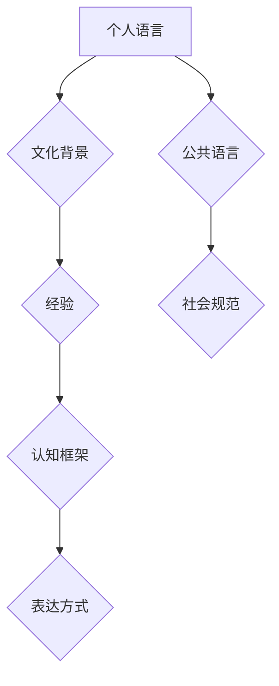

在这个图中，个人语言（A）受到文化背景（B）、经验（C）和认知框架（D）的影响，形成了特定的表达方式（E），而公共语言（F）则基于社会规范（G）和共同的理解框架。

**伪代码示例**

个人语言和公共语言可以用伪代码来表示：

```python
class PersonalLanguage:
    def __init__(self, culture, experience):
        self.culture = culture
        self.experience = experience
    
    def describe(self, object):
        if self.culture.accepts(object):
            print(f"In my language, {object} is described as {self.describe_object(object)}.")
        else:
            print(f"My language cannot describe {object}.")

    def describe_object(self, object):
        # 个人经验影响描述
        return f"{object} (as perceived by my experience)"

class PublicLanguage(PersonalLanguage):
    def __init__(self, culture, experience, standard):
        super().__init__(culture, experience)
        self.standard = standard
    
    def describe(self, object):
        if self.standard.accepts(object):
            print(f"In our public language, {object} is described as {self.standard.describe_object(object)}.")
        else:
            print(f"Our public language cannot describe {object}.")

# 示例
personal_lang = PersonalLanguage("English", "Personal")
print(personal_lang.describe("tree"))

public_lang = PublicLanguage("English", "Public", "Standard")
print(public_lang.describe("tree"))
```

在这个伪代码中，`PersonalLanguage` 类代表了个人语言，而 `PublicLanguage` 类代表了公共语言。公共语言基于社会规范（`standard`），而个人语言则可能受到个人经验和文化背景的影响。

**公共语言的构建原则**

公共语言的构建原则是维特根斯坦语言哲学的核心之一。他认为，公共语言的构建需要遵循以下原则：

1. **明确性**：公共语言的表达需要具有明确的意义，避免歧义。
2. **普遍性**：公共语言需要普遍适用，不受个人语言习惯的影响。
3. **规范性**：公共语言需要遵循一定的规范和标准，以保证交流的顺利进行。

**伪代码示例**

公共语言的构建原则可以用伪代码来表示：

```python
class PublicLanguage:
    def __init__(self, standard):
        self.standard = standard
    
    def describe_object(self, object):
        # 确保描述遵循标准
        if self.standard.is_describable(object):
            return self.standard.get_description(object)
        else:
            return "Object cannot be described in our public language."

class Standard:
    def __init__(self):
        self.descriptions = {
            "tree": "A large plant with a trunk and branches.",
            # 其他对象的描述
        }
    
    def is_describable(self, object):
        # 检查对象是否可以被描述
        return object in self.descriptions
    
    def get_description(self, object):
        # 返回对象的描述
        return self.descriptions[object]
```

在这个伪代码中，`PublicLanguage` 类使用了 `Standard` 类来定义公共语言的规范。`Standard` 类包含了一组对象及其描述，`PublicLanguage` 类通过该规范来描述对象。

**公共语言在维特根斯坦哲学体系中的位置**

维特根斯坦的公共语言观在他的哲学体系中占据重要位置。他认为，公共语言不仅是人们进行交流的工具，也是理解世界和思考问题的基础。以下是一个简化的Mermaid流程图，展示了公共语言在维特根斯坦哲学体系中的位置：

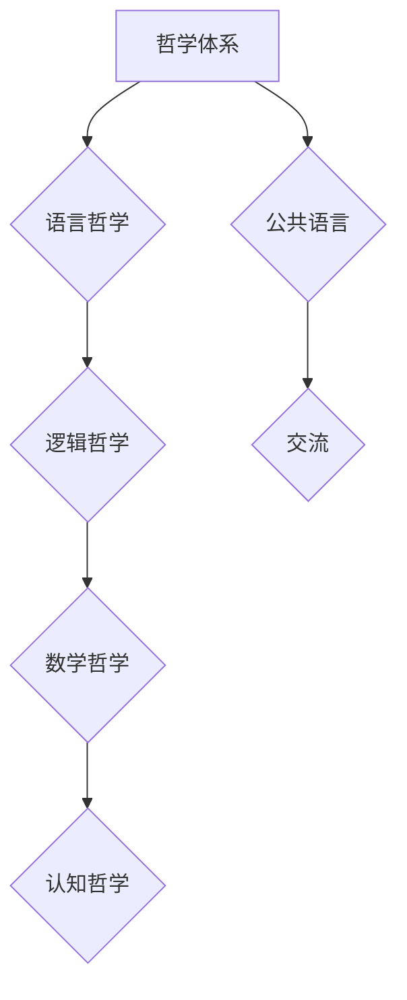

在这个图中，哲学体系（A）包括语言哲学（B）、逻辑哲学（C）、数学哲学（D）和认知哲学（E），而公共语言（F）作为交流的基础（G），贯穿于整个哲学体系。

### **2.2 公共语言的哲学意义**

**公共语言与个人语言**

维特根斯坦区分了公共语言和个人语言。公共语言是人们共同遵循的语言规范，而个人语言则是个体根据个人经验和文化背景形成的语言。以下是一个简化的Mermaid流程图，展示了公共语言和个人语言的关系：

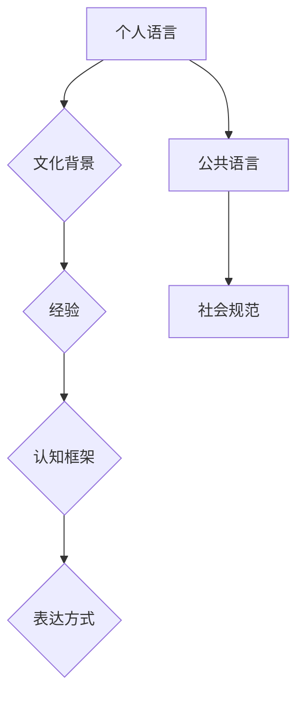

在这个图中，个人语言（A）受到文化背景（B）、经验（C）和认知框架（D）的影响，形成了特定的表达方式（E），而公共语言（F）则基于社会规范（G）和共同的理解框架。

**伪代码示例**

个人语言和公共语言可以用伪代码来表示：

```python
class PersonalLanguage:
    def __init__(self, culture, experience):
        self.culture = culture
        self.experience = experience
    
    def describe(self, object):
        if self.culture.accepts(object):
            print(f"In my language, {object} is described as {self.describe_object(object)}.")
        else:
            print(f"My language cannot describe {object}.")

    def describe_object(self, object):
        # 个人经验影响描述
        return f"{object} (as perceived by my experience)"

class PublicLanguage(PersonalLanguage):
    def __init__(self, culture, experience, standard):
        super().__init__(culture, experience)
        self.standard = standard
    
    def describe(self, object):
        if self.standard.accepts(object):
            print(f"In our public language, {object} is described as {self.standard.describe_object(object)}.")
        else:
            print(f"Our public language cannot describe {object}.")

# 示例
personal_lang = PersonalLanguage("English", "Personal")
print(personal_lang.describe("tree"))

public_lang = PublicLanguage("English", "Public", "Standard")
print(public_lang.describe("tree"))
```

在这个伪代码中，`PersonalLanguage` 类代表了个人语言，而 `PublicLanguage` 类代表了公共语言。公共语言基于社会规范（`standard`），而个人语言则可能受到个人经验和文化背景的影响。

**公共语言的构建原则**

公共语言的构建原则是维特根斯坦语言哲学的核心之一。他认为，公共语言的构建需要遵循以下原则：

1. **明确性**：公共语言的表达需要具有明确的意义，避免歧义。
2. **普遍性**：公共语言需要普遍适用，不受个人语言习惯的影响。
3. **规范性**：公共语言需要遵循一定的规范和标准，以保证交流的顺利进行。

**伪代码示例**

公共语言的构建原则可以用伪代码来表示：

```python
class PublicLanguage:
    def __init__(self, standard):
        self.standard = standard
    
    def describe_object(self, object):
        # 确保描述遵循标准
        if self.standard.is_describable(object):
            return self.standard.get_description(object)
        else:
            return "Object cannot be described in our public language."

class Standard:
    def __init__(self):
        self.descriptions = {
            "tree": "A large plant with a trunk and branches.",
            # 其他对象的描述
        }
    
    def is_describable(self, object):
        # 检查对象是否可以被描述
        return object in self.descriptions
    
    def get_description(self, object):
        # 返回对象的描述
        return self.descriptions[object]
```

在这个伪代码中，`PublicLanguage` 类使用了 `Standard` 类来定义公共语言的规范。`Standard` 类包含了一组对象及其描述，`PublicLanguage` 类通过该规范来描述对象。

**公共语言在维特根斯坦哲学体系中的位置**

维特根斯坦的公共语言观在他的哲学体系中占据重要位置。他认为，公共语言不仅是人们进行交流的工具，也是理解世界和思考问题的基础。以下是一个简化的Mermaid流程图，展示了公共语言在维特根斯坦哲学体系中的位置：


在这个图中，哲学体系（A）包括语言哲学（B）、逻辑哲学（C）、数学哲学（D）和认知哲学（E），而公共语言（F）作为交流的基础（G），贯穿于整个哲学体系。

### **2.3 函数式编程社区的特点**

#### **2.3.1 函数式编程的基本概念**

函数式编程是一种编程范式，它强调使用函数作为基本构建块，通过传递参数和返回值来实现程序功能。与命令式编程不同，函数式编程不直接修改状态，而是通过输入和输出数据来处理数据。以下是一个简化的Mermaid流程图，展示了函数式编程的核心概念：

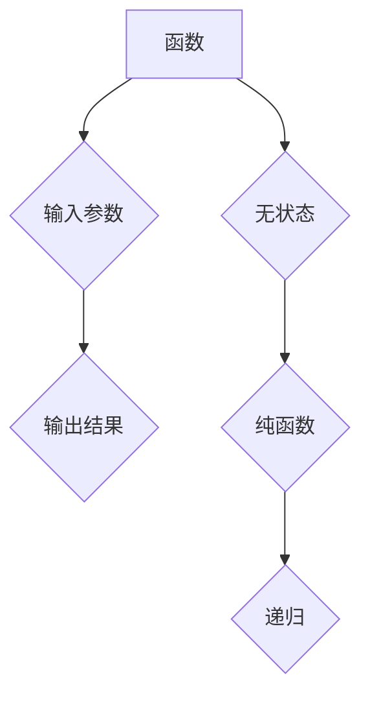

在这个图中，函数（A）通过输入参数（B）产生输出结果（C），函数是无状态的（D），纯函数（E）不产生副作用，递归（F）是函数式编程的一种重要手段。

**伪代码示例**

函数式编程的核心概念可以用伪代码来表示：

```python
def function(input):
    # 处理输入数据
    result = process_data(input)
    return result

def process_data(data):
    # 数据处理逻辑
    processed_data = ...
    return processed_data

# 递归示例
def factorial(n):
    if n == 0:
        return 1
    else:
        return n * factorial(n - 1)
```

在这个伪代码中，`function` 函数接受输入参数，并返回处理后的结果。`process_data` 函数实现了数据处理逻辑。`factorial` 函数使用递归计算阶乘。

#### **2.3.2 函数式编程的优势**

1. **简洁性**：函数式编程的代码通常更加简洁、易读。函数式编程强调表达式的使用，减少了冗余的代码。

2. **可复用性**：函数式编程的函数具有明确的输入和输出，易于复用。函数可以作为参数传递，也可以被其他函数调用。

3. **并发性**：函数式编程易于实现并发计算，适合处理复杂和大规模的计算任务。函数式编程的纯函数不修改状态，便于并行执行。

4. **可测试性**：函数式编程的纯函数易于测试。由于纯函数没有副作用，其行为可以在测试中精确预测。

5. **函数组合**：函数式编程允许函数的灵活组合，使得编程更加模块化和可组合。

#### **2.3.3 函数式编程的局限**

1. **学习曲线**：函数式编程相对于命令式编程来说，有较高的学习门槛。函数式编程的概念和语法需要一定时间来适应。

2. **性能问题**：在某些情况下，函数式编程可能会带来性能问题，例如递归调用可能导致栈溢出。

3. **缺乏直观性**：函数式编程强调抽象和数学化，这在某些情况下可能导致代码缺乏直观性。

4. **库和工具支持**：虽然函数式编程语言逐渐流行，但相对于命令式编程语言，库和工具的支持可能不够充分。

### **2.4 函数式编程社区的形成与发展**

#### **2.4.1 社区成员的构成**

函数式编程社区由各种不同背景的成员组成，包括软件开发者、研究人员、学生和教育者。这个社区的成员共同对函数式编程的理念和方法感兴趣，致力于推动函数式编程的发展和应用。

**伪代码示例**

社区成员可以用伪代码来表示：

```python
class Developer:
    def __init__(self, name, expertise):
        self.name = name
        self.expertise = expertise

class Researcher:
    def __init__(self, name, publications):
        self.name = name
        self.publications = publications

class Student:
    def __init__(self, name, course):
        self.name = name
        self.course = course

class Educator:
    def __init__(self, name, courses):
        self.name = name
        self.courses = courses

# 社区成员示例
developer = Developer("Alice", "Functional Programming")
researcher = Researcher("Bob", ["Functional Language Design", "Parallel Computing"])
student = Student("Charlie", "Introduction to Haskell")
educator = Educator("Diana", ["Advanced Functional Programming", "Type Systems"])
```

在这个伪代码中，我们定义了四种成员类：`Developer`、`Researcher`、`Student` 和 `Educator`，每种成员类都有其特定的属性和方法。

#### **2.4.2 社区文化的形成**

函数式编程社区文化的形成受到多种因素的影响，包括共同的技术理念、交流方式、价值观和行为准则。以下是一个简化的Mermaid流程图，展示了社区文化的形成过程：

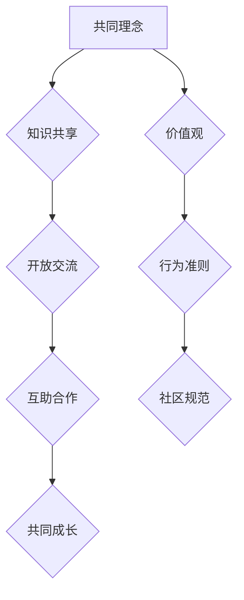

在这个图中，共同理念（A）是社区文化的基石，知识共享（B）、开放交流（C）、互助合作（D）和共同成长（E）构成了社区文化的核心要素。价值观（F）和行为准则（G）指导社区成员的行为，社区规范（H）则确保社区的良好运行。

**伪代码示例**

社区文化可以用伪代码来表示：

```python
class CommunityCulture:
    def __init__(self, values, rules):
        self.values = values
        self.rules = rules
    
    def share_knowledge(self):
        print("Knowledge sharing is a core value of our community.")

    def open_exchange(self):
        print("Open exchange of ideas is encouraged in our community.")

    def mutual_help(self):
        print("Mutual help and collaboration are important in our community.")

    def common_growth(self):
        print("We strive for common growth and improvement.")

    def enforce_rules(self):
        print("We follow the rules to ensure a healthy community.")
```

在这个伪代码中，`CommunityCulture` 类代表了社区文化的各个方面。`share_knowledge`、`open_exchange`、`mutual_help`、`common_growth` 和 `enforce_rules` 方法分别体现了社区文化的核心价值。

#### **2.4.3 社区知识共享的机制**

社区知识共享是函数式编程社区发展的重要驱动力。以下是一个简化的Mermaid流程图，展示了社区知识共享的机制：

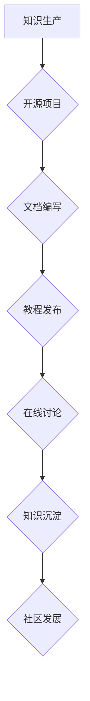

在这个图中，知识生产（A）通过开源项目（B）、文档编写（C）、教程发布（D）和在线讨论（E）进行，知识沉淀（F）促进社区发展（G）。

**伪代码示例**

社区知识共享的机制可以用伪代码来表示：

```python
class KnowledgeSharing:
    def __init__(self, projects, documents, tutorials, discussions):
        self.projects = projects
        self.documents = documents
        self.tutorials = tutorials
        self.discussions = discussions
    
    def produce_knowledge(self):
        print("Creating new knowledge through projects, documents, tutorials, and discussions.")

    def open_source_projects(self):
        print("Contributing to open-source projects.")

    def document_writing(self):
        print("Writing technical documents.")

    def tutorial_publishing(self):
        print("Publishing tutorials.")

    def online_discussions(self):
        print("Participating in online discussions.")

    def knowledge_accumulation(self):
        print("Accumulating and organizing knowledge.")
```

在这个伪代码中，`KnowledgeSharing` 类代表了社区知识共享的各个方面。`produce_knowledge`、`open_source_projects`、`document_writing`、`tutorial_publishing` 和 `online_discussions` 方法分别体现了知识共享的具体实践。`knowledge_accumulation` 方法确保知识得到有效积累和利用。

### **2.4.1 社区成员的构成**

函数式编程社区由各种不同背景的成员组成，包括软件开发者、研究人员、学生和教育者。这个社区的成员共同对函数式编程的理念和方法感兴趣，致力于推动函数式编程的发展和应用。

**伪代码示例**

社区成员可以用伪代码来表示：

```python
class Developer:
    def __init__(self, name, expertise):
        self.name = name
        self.expertise = expertise

class Researcher:
    def __init__(self, name, publications):
        self.name = name
        self.publications = publications

class Student:
    def __init__(self, name, course):
        self.name = name
        self.course = course

class Educator:
    def __init__(self, name, courses):
        self.name = name
        self.courses = courses

# 社区成员示例
developer = Developer("Alice", "Functional Programming")
researcher = Researcher("Bob", ["Functional Language Design", "Parallel Computing"])
student = Student("Charlie", "Introduction to Haskell")
educator = Educator("Diana", ["Advanced Functional Programming", "Type Systems"])
```

在这个伪代码中，我们定义了四种成员类：`Developer`、`Researcher`、`Student` 和 `Educator`，每种成员类都有其特定的属性和方法。

### **2.4.2 社区文化的形成**

函数式编程社区文化的形成受到多种因素的影响，包括共同的技术理念、交流方式、价值观和行为准则。以下是一个简化的Mermaid流程图，展示了社区文化的形成过程：


在这个图中，共同理念（A）是社区文化的基石，知识共享（B）、开放交流（C）、互助合作（D）和共同成长（E）构成了社区文化的核心要素。价值观（F）和行为准则（G）指导社区成员的行为，社区规范（H）则确保社区的良好运行。

**伪代码示例**

社区文化可以用伪代码来表示：

```python
class CommunityCulture:
    def __init__(self, values, rules):
        self.values = values
        self.rules = rules
    
    def share_knowledge(self):
        print("Knowledge sharing is a core value of our community.")

    def open_exchange(self):
        print("Open exchange of ideas is encouraged in our community.")

    def mutual_help(self):
        print("Mutual help and collaboration are important in our community.")

    def common_growth(self):
        print("We strive for common growth and improvement.")

    def enforce_rules(self):
        print("We follow the rules to ensure a healthy community.")
```

在这个伪代码中，`CommunityCulture` 类代表了社区文化的各个方面。`share_knowledge`、`open_exchange`、`mutual_help`、`common_growth` 和 `enforce_rules` 方法分别体现了社区文化的核心价值。

### **2.4.3 社区知识共享的机制**

社区知识共享是函数式编程社区发展的重要驱动力。以下是一个简化的Mermaid流程图，展示了社区知识共享的机制：


在这个图中，知识生产（A）通过开源项目（B）、文档编写（C）、教程发布（D）和在线讨论（E）进行，知识沉淀（F）促进社区发展（G）。

**伪代码示例**

社区知识共享的机制可以用伪代码来表示：

```python
class KnowledgeSharing:
    def __init__(self, projects, documents, tutorials, discussions):
        self.projects = projects
        self.documents = documents
        self.tutorials = tutorials
        self.discussions = discussions
    
    def produce_knowledge(self):
        print("Creating new knowledge through projects, documents, tutorials, and discussions.")

    def open_source_projects(self):
        print("Contributing to open-source projects.")

    def document_writing(self):
        print("Writing technical documents.")

    def tutorial_publishing(self):
        print("Publishing tutorials.")

    def online_discussions(self):
        print("Participating in online discussions.")

    def knowledge_accumulation(self):
        print("Accumulating and organizing knowledge.")
```

在这个伪代码中，`KnowledgeSharing` 类代表了社区知识共享的各个方面。`produce_knowledge`、`open_source_projects`、`document_writing`、`tutorial_publishing` 和 `online_discussions` 方法分别体现了知识共享的具体实践。`knowledge_accumulation` 方法确保知识得到有效积累和利用。

### **3.1 函数式编程的基本概念**

**函数式编程的起源与发展**

函数式编程的起源可以追溯到20世纪40年代和50年代，当时计算机科学家开始研究如何将数学中的函数应用于编程。最初的函数式编程语言如Lisp（1958年）和Haskell（1990年）就体现了这种思想。随着时间的推移，函数式编程逐渐演变和发展，吸收了逻辑编程、关系编程和并发编程等概念。近年来，随着多核处理器的普及和大数据应用的兴起，函数式编程再次受到关注。

**函数式编程的核心思想**

1. **纯函数**：函数式编程强调纯函数的使用，即输入相同，输出也相同的函数。纯函数不产生副作用，使得程序更加可预测和易于测试。

2. **不可变数据**：函数式编程倾向于使用不可变数据结构，从而避免状态突变和并行编程中的同步问题。

3. **递归**：函数式编程广泛使用递归来处理问题，递归是一种简洁而强大的编程技巧，特别适用于处理树形结构和递归定义的数据结构。

4. **高阶函数**：函数式编程允许函数作为参数传递，也可以返回函数。这种高阶函数的概念提高了代码的可复用性和抽象能力。

**伪代码示例**

以下是一个简单的伪代码示例，展示了函数式编程的核心思想：

```python
# 纯函数
def add(a, b):
    return a + b

# 递归
def factorial(n):
    if n == 0:
        return 1
    else:
        return n * factorial(n - 1)

# 高阶函数
def apply_function(func, x, y):
    return func(x, y)

# 测试
print(add(2, 3))  # 输出：5
print(factorial(5))  # 输出：120
print(apply_function(add, 2, 3))  # 输出：5
```

在这个示例中，`add` 函数是一个纯函数，`factorial` 函数使用了递归，而 `apply_function` 函数是一个高阶函数，它接受另一个函数作为参数并调用。

**函数式编程的优势与局限**

1. **优势**：

   - **简洁性**：函数式编程的代码通常更加简洁、易读。
   - **可复用性**：函数式编程的函数具有明确的输入和输出，易于复用。
   - **并发性**：函数式编程易于实现并发计算，适合处理复杂和大规模的计算任务。
   - **可测试性**：函数式编程的纯函数易于测试。

2. **局限**：

   - **学习曲线**：函数式编程相对于命令式编程来说，有较高的学习门槛。
   - **性能问题**：在某些情况下，函数式编程可能会带来性能问题。
   - **缺乏直观性**：函数式编程强调抽象和数学化，这在某些情况下可能导致代码缺乏直观性。
   - **库和工具支持**：虽然函数式编程语言逐渐流行，但相对于命令式编程语言，库和工具的支持可能不够充分。

### **3.2 函数式编程社区的形成与发展**

**函数式编程社区的形成**

函数式编程社区的形成可以追溯到20世纪后期，当时一些计算机科学家开始对命令式编程的局限性感到不满，并开始探索新的编程范式。这一时期的代表人物包括Haskell语言的创造者Simon Peyton Jones和Scala语言的创始人Martin Odersky。他们通过撰写论文、编写编程语言和创建开源项目，吸引了越来越多的开发者加入函数式编程的行列。

**社区的形成与发展**

1. **开源项目**：函数式编程社区的形成离不开开源项目的推动。一些重要的开源项目，如Haskell、Scala、Erlang和Clojure，为社区成员提供了实践和交流的平台。

2. **会议和研讨会**：函数式编程社区通过举办会议和研讨会，促进了成员之间的交流和知识的共享。这些活动不仅提供了学习的机会，还促进了新想法和新技术的传播。

3. **在线社区**：随着互联网的发展，在线社区成为函数式编程社区的一个重要组成部分。通过论坛、博客和社交媒体，社区成员可以随时分享知识、讨论问题和寻求帮助。

**社区成员的构成**

函数式编程社区由各种不同背景的成员组成，包括：

- **软件开发者**：这些成员是社区的主要力量，他们使用函数式编程语言编写应用程序，并在开源项目中贡献代码。
- **研究人员**：他们专注于函数式编程的理论研究和算法优化，为社区提供了新的研究视角和技术突破。
- **学生和教育者**：他们对函数式编程感兴趣，通过学习课程和教学活动，推动了函数式编程在教育领域的普及。
- **顾问和咨询师**：这些成员为企业提供函数式编程相关的咨询服务，帮助企业利用函数式编程的优势解决实际问题。

**社区文化的形成**

函数式编程社区文化的形成受到多种因素的影响，包括：

- **共同的技术理念**：社区成员普遍认为函数式编程是一种更优雅、更简洁的编程范式，有助于提高软件质量和开发效率。
- **开放和互助**：社区成员鼓励知识共享和互助合作，通过开源项目和在线讨论，共同推动函数式编程的发展。
- **持续学习和创新**：社区成员注重持续学习和技术创新，通过参与学术会议、研讨会和开源项目，不断提升自己的技术能力。

**社区知识共享的机制**

函数式编程社区的知识共享机制主要包括以下几个方面：

- **开源项目**：社区成员通过参与和贡献开源项目，将新的研究成果和技术实践分享给整个社区。
- **文档和教程**：社区成员编写技术文档和教程，帮助新成员了解函数式编程的基本概念和实践方法。
- **在线讨论**：社区成员通过论坛、博客和社交媒体平台，讨论技术问题和分享经验，促进知识的传播和交流。
- **学术会议和研讨会**：社区成员参与学术会议和研讨会，分享最新的研究成果和技术进展，推动函数式编程领域的发展。

### **3.2 函数式编程社区的形成与发展**

**函数式编程社区的形成**

函数式编程社区的形成可以追溯到20世纪后期，当时一些计算机科学家开始对命令式编程的局限性感到不满，并开始探索新的编程范式。这一时期的代表人物包括Haskell语言的创造者Simon Peyton Jones和Scala语言的创始人Martin Odersky。他们通过撰写论文、编写编程语言和创建开源项目，吸引了越来越多的开发者加入函数式编程的行列。

**社区的形成与发展**

1. **开源项目**：函数式编程社区的形成离不开开源项目的推动。一些重要的开源项目，如Haskell、Scala、Erlang和Clojure，为社区成员提供了实践和交流的平台。

2. **会议和研讨会**：函数式编程社区通过举办会议和研讨会，促进了成员之间的交流和知识的共享。这些活动不仅提供了学习的机会，还促进了新想法和新技术的传播。

3. **在线社区**：随着互联网的发展，在线社区成为函数式编程社区的一个重要组成部分。通过论坛、博客和社交媒体，社区成员可以随时分享知识、讨论问题和寻求帮助。

**社区成员的构成**

函数式编程社区由各种不同背景的成员组成，包括：

- **软件开发者**：这些成员是社区的主要力量，他们使用函数式编程语言编写应用程序，并在开源项目中贡献代码。
- **研究人员**：他们专注于函数式编程的理论研究和算法优化，为社区提供了新的研究视角和技术突破。
- **学生和教育者**：他们对函数式编程感兴趣，通过学习课程和教学活动，推动了函数式编程在教育领域的普及。
- **顾问和咨询师**：这些成员为企业提供函数式编程相关的咨询服务，帮助企业利用函数式编程的优势解决实际问题。

**社区文化的形成**

函数式编程社区文化的形成受到多种因素的影响，包括：

- **共同的技术理念**：社区成员普遍认为函数式编程是一种更优雅、更简洁的编程范式，有助于提高软件质量和开发效率。
- **开放和互助**：社区成员鼓励知识共享和互助合作，通过开源项目和在线讨论，共同推动函数式编程的发展。
- **持续学习和创新**：社区成员注重持续学习和技术创新，通过参与学术会议、研讨会和开源项目，不断提升自己的技术能力。

**社区知识共享的机制**

函数式编程社区的知识共享机制主要包括以下几个方面：

- **开源项目**：社区成员通过参与和贡献开源项目，将新的研究成果和技术实践分享给整个社区。
- **文档和教程**：社区成员编写技术文档和教程，帮助新成员了解函数式编程的基本概念和实践方法。
- **在线讨论**：社区成员通过论坛、博客和社交媒体平台，讨论技术问题和分享经验，促进知识的传播和交流。
- **学术会议和研讨会**：社区成员参与学术会议和研讨会，分享最新的研究成果和技术进展，推动函数式编程领域的发展。

### **3.2 函数式编程社区的形成与发展**

**函数式编程社区的形成**

函数式编程社区的形成可以追溯到20世纪后期，当时一些计算机科学家开始对命令式编程的局限性感到不满，并开始探索新的编程范式。这一时期的代表人物包括Haskell语言的创造者Simon Peyton Jones和Scala语言的创始人Martin Odersky。他们通过撰写论文、编写编程语言和创建开源项目，吸引了越来越多的开发者加入函数式编程的行列。

**社区的形成与发展**

1. **开源项目**：函数式编程社区的形成离不开开源项目的推动。一些重要的开源项目，如Haskell、Scala、Erlang和Clojure，为社区成员提供了实践和交流的平台。

2. **会议和研讨会**：函数式编程社区通过举办会议和研讨会，促进了成员之间的交流和知识的共享。这些活动不仅提供了学习的机会，还促进了新想法和新技术的传播。

3. **在线社区**：随着互联网的发展，在线社区成为函数式编程社区的一个重要组成部分。通过论坛、博客和社交媒体，社区成员可以随时分享知识、讨论问题和寻求帮助。

**社区成员的构成**

函数式编程社区由各种不同背景的成员组成，包括：

- **软件开发者**：这些成员是社区的主要力量，他们使用函数式编程语言编写应用程序，并在开源项目中贡献代码。
- **研究人员**：他们专注于函数式编程的理论研究和算法优化，为社区提供了新的研究视角和技术突破。
- **学生和教育者**：他们对函数式编程感兴趣，通过学习课程和教学活动，推动了函数式编程在教育领域的普及。
- **顾问和咨询师**：这些成员为企业提供函数式编程相关的咨询服务，帮助企业利用函数式编程的优势解决实际问题。

**社区文化的形成**

函数式编程社区文化的形成受到多种因素的影响，包括：

- **共同的技术理念**：社区成员普遍认为函数式编程是一种更优雅、更简洁的编程范式，有助于提高软件质量和开发效率。
- **开放和互助**：社区成员鼓励知识共享和互助合作，通过开源项目和在线讨论，共同推动函数式编程的发展。
- **持续学习和创新**：社区成员注重持续学习和技术创新，通过参与学术会议、研讨会和开源项目，不断提升自己的技术能力。

**社区知识共享的机制**

函数式编程社区的知识共享机制主要包括以下几个方面：

- **开源项目**：社区成员通过参与和贡献开源项目，将新的研究成果和技术实践分享给整个社区。
- **文档和教程**：社区成员编写技术文档和教程，帮助新成员了解函数式编程的基本概念和实践方法。
- **在线讨论**：社区成员通过论坛、博客和社交媒体平台，讨论技术问题和分享经验，促进知识的传播和交流。
- **学术会议和研讨会**：社区成员参与学术会议和研讨会，分享最新的研究成果和技术进展，推动函数式编程领域的发展。

### **4.1 语言的社会性在FP社区的表现**

**社区语言的规范与标准化**

在函数式编程（FP）社区中，语言的社会性体现在对社区语言的规范与标准化上。这一规范与标准化不仅包括编程语言本身的语法和语义，还涵盖了代码风格、命名规范和代码库管理等多个方面。以下是一个简化的Mermaid流程图，展示了FP社区语言的规范与标准化过程：

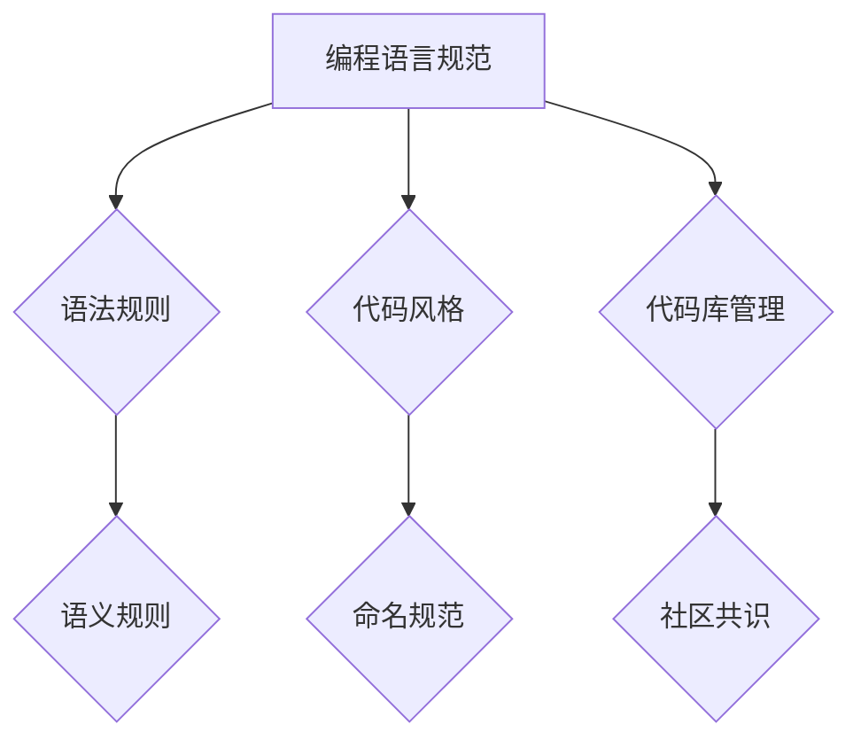

在这个流程图中，编程语言规范（A）由语法规则（B）、语义规则（C）、代码风格（D）、命名规范（E）和代码库管理（F）组成，这些规范通过社区共识（G）得到确认和执行。

**伪代码示例**

为了展示社区语言的规范与标准化，我们可以用伪代码来定义一些基本规范：

```python
# 语法规则
def greet(name):
    return "Hello, " + name + "!"

# 语义规则
def add(a, b):
    return a + b

# 代码风格
class Calculator:
    def add(self, a, b):
        return a + b

    def subtract(self, a, b):
        return a - b

# 命名规范
def calculate_area(radius):
    return 3.14159 * radius * radius

# 代码库管理
def contribute_to_library(module_name, source_code):
    # 在代码库中添加模块
    library.add_module(module_name, source_code)
```

在这个伪代码中，`greet` 和 `add` 函数定义了基本的语法和语义规则。`Calculator` 类展示了代码风格的规范，而 `calculate_area` 函数遵循了命名规范。最后，`contribute_to_library` 函数模拟了代码库管理的过程，确保模块按照规范被添加到代码库中。

**社区内的沟通与合作**

FP社区内的沟通与合作是社区语言社会性的另一个重要表现。社区成员通过多种方式相互沟通，包括在线论坛、讨论组、会议和社交媒体平台。以下是一个简化的Mermaid流程图，展示了FP社区内的沟通与合作过程：

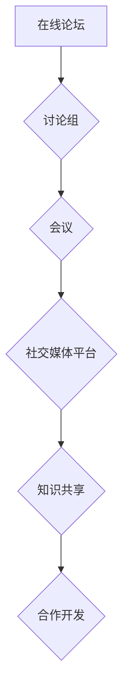

在这个流程图中，社区成员通过在线论坛（A）、讨论组（B）、会议（C）和社交媒体平台（D）进行沟通，这些沟通渠道促进了知识共享（E）和合作开发（F）。

**伪代码示例**

为了展示社区内的沟通与合作，我们可以用伪代码来模拟这些过程：

```python
# 在线论坛讨论
class Forum:
    def __init__(self, topics):
        self.topics = topics
    
    def post_message(self, user, message):
        print(f"{user} posted a message: {message}")

# 讨论组
class DiscussionGroup:
    def __init__(self, members):
        self.members = members
    
    def start_discussion(self, topic):
        print(f"A discussion on {topic} has started.")

    def add_comment(self, member, comment):
        print(f"{member} added a comment: {comment}")

# 会议
class Conference:
    def __init__(self, presentations):
        self.presentations = presentations
    
    def schedule_talk(self, speaker, title):
        print(f"{speaker} will give a talk on {title}.")

    def attend_talk(self, participant, title):
        print(f"{participant} attended a talk on {title}.")

# 社交媒体平台
class SocialMediaPlatform:
    def __init__(self, users):
        self.users = users
    
    def post_update(self, user, update):
        print(f"{user} posted an update: {update}")

    def share_link(self, user, link):
        print(f"{user} shared a link: {link}")

# 知识共享与合作开发
class KnowledgeSharing:
    def __init__(self, contributors):
        self.contributors = contributors
    
    def share_knowledge(self, contributor, knowledge):
        print(f"{contributor} shared knowledge: {knowledge}")

    def collaborate_on_project(self, contributors, project_name):
        print(f"{contributors} are collaborating on a project named {project_name}.")
```

在这个伪代码中，`Forum` 类模拟了在线论坛的讨论过程。`DiscussionGroup` 类模拟了讨论组的交流过程。`Conference` 类模拟了会议的组织和参与过程。`SocialMediaPlatform` 类模拟了社交媒体平台的更新和分享功能。`KnowledgeSharing` 类模拟了知识共享和合作开发的过程。

### **4.2 维特根斯坦语言观在FP编程实践中的应用**

**代码的可读性与可维护性**

维特根斯坦的公共语言观强调语言表达的明确性和规范性，这在FP编程实践中体现为代码的可读性和可维护性。以下是维特根斯坦语言观在FP编程实践中的应用：

1. **明确性**：在FP编程中，函数的定义和命名应当清晰明确，避免模糊不清的术语和语法。例如，一个计算两个数字最大公约数的函数可以命名为`gcd`，其定义应当简洁明了：

   ```haskell
   gcd :: Integral a => a -> a -> a
   gcd x y = if y == 0 then x else gcd y (x `mod` y)
   ```

   在这个例子中，`gcd` 函数通过递归和模运算清晰地实现了最大公约数的计算。

2. **规范性**：FP社区通常遵循一系列编码规范，如函数命名规则、代码布局和注释要求。这些规范有助于确保代码的规范性，提高可维护性。例如，Python的PEP 8编码规范为Python代码提供了详细的指导：

   ```python
   def calculate_area(radius):
       """Calculate the area of a circle given its radius.

       Args:
           radius (float): The radius of the circle.

       Returns:
           float: The area of the circle.
       """
       return 3.14159 * radius * radius
   ```

   在这个例子中，函数命名清晰，文档字符串（docstring）详细说明了函数的功能、参数和返回值，有助于其他开发者理解和使用该函数。

**函数式编程中的语言游戏**

维特根斯坦的“语言游戏”概念在FP编程中得到了广泛应用。FP编程中的每个函数都可以视为一种语言游戏，通过组合和组合这些语言游戏，开发者可以构建复杂的程序。以下是一个简化的Mermaid流程图，展示了函数组合的概念：

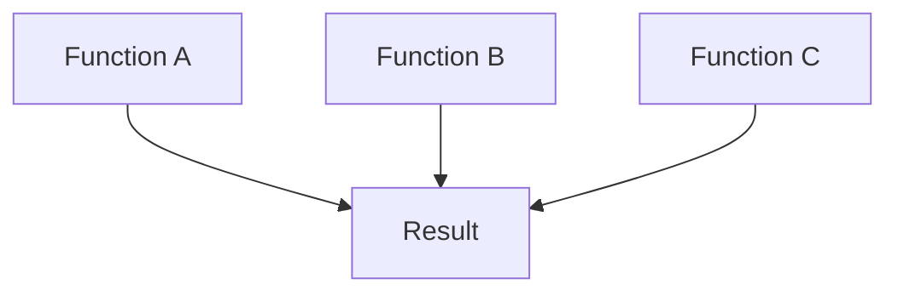

在这个流程图中，`Function A`、`Function B` 和 `Function C` 通过组合生成了结果（`Result`）。这种组合方式不仅提高了代码的可读性，还增强了代码的复用性。

**伪代码示例**

为了更具体地展示函数组合，我们可以用伪代码来表示一个简单的例子：

```python
# 函数 A：计算平方
def square(x):
    return x * x

# 函数 B：计算立方
def cube(x):
    return x * x * x

# 函数 C：计算平均值
def average(x, y):
    return (x + y) / 2

# 组合函数
result = average(square(2), cube(3))
print(result)  # 输出：7.0
```

在这个例子中，`square`、`cube` 和 `average` 函数通过组合生成了结果。这种组合方式不仅简化了代码，还提高了函数的可复用性。

**函数式编程中的语言限制与突破**

维特根斯坦认为语言有其固有的限制，这些限制影响了我们对世界的理解。在FP编程中，语言限制主要体现在函数的纯度和表达力上。以下是一个简化的Mermaid流程图，展示了函数式编程中的语言限制和突破：

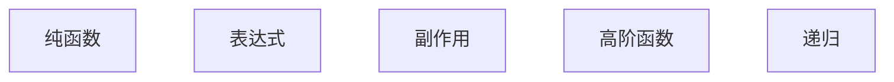

在这个流程图中，纯函数（A）、表达式（B）和副作用（C）是语言的基本限制。然而，通过高阶函数（D）和递归（E），开发者可以突破这些限制，实现更复杂的编程任务。

**伪代码示例**

为了展示如何突破语言限制，我们可以用伪代码来表示一个例子：

```python
# 纯函数：计算最大值
def max(a, b):
    return a if a > b else b

# 表达式：使用条件运算符
result = (a if a > b else b) for a in range(10) for b in range(10)
print(result)  # 输出：[9, 8, 7, 6, 5, 4, 3, 2, 1, 0]

# 副作用：使用列表推导式
def update_values(values, new_values):
    return [value + new_value for value, new_value in zip(values, new_values)]

# 高阶函数：使用 filter 函数
def filter_values(values, condition):
    return list(filter(condition, values))

# 递归：计算阶乘
def factorial(n):
    return 1 if n == 0 else n * factorial(n - 1)
```

在这个伪代码中，`max` 函数是一个纯函数，`条件运算符` 和 `列表推导式` 是表达式，而 `update_values` 函数包含了副作用。通过使用 `filter` 函数和递归，我们可以突破纯函数和表达式的限制，实现更复杂的编程任务。

### **4.2 维特根斯坦语言观在FP编程实践中的应用**

**代码的可读性与可维护性**

维特根斯坦的公共语言观强调语言表达的明确性和规范性，这在FP编程实践中体现为代码的可读性和可维护性。以下是维特根斯坦语言观在FP编程实践中的应用：

1. **明确性**：在FP编程中，函数的定义和命名应当清晰明确，避免模糊不清的术语和语法。例如，一个计算两个数字最大公约数的函数可以命名为`gcd`，其定义应当简洁明了：

   ```haskell
   gcd :: Integral a => a -> a -> a
   gcd x y = if y == 0 then x else gcd y (x `mod` y)
   ```

   在这个例子中，`gcd` 函数通过递归和模运算清晰地实现了最大公约数的计算。

2. **规范性**：FP社区通常遵循一系列编码规范，如函数命名规则、代码布局和注释要求。这些规范有助于确保代码的规范性，提高可维护性。例如，Python的PEP 8编码规范为Python代码提供了详细的指导：

   ```python
   def calculate_area(radius):
       """Calculate the area of a circle given its radius.

       Args:
           radius (float): The radius of the circle.

       Returns:
           float: The area of the circle.
       """
       return 3.14159 * radius * radius
   ```

   在这个例子中，函数命名清晰，文档字符串（docstring）详细说明了函数的功能、参数和返回值，有助于其他开发者理解和使用该函数。

**函数式编程中的语言游戏**

维特根斯坦的“语言游戏”概念在FP编程中得到了广泛应用。FP编程中的每个函数都可以视为一种语言游戏，通过组合和组合这些语言游戏，开发者可以构建复杂的程序。以下是一个简化的Mermaid流程图，展示了函数组合的概念：


在这个流程图中，`Function A`、`Function B` 和 `Function C` 通过组合生成了结果（`Result`）。这种组合方式不仅提高了代码的可读性，还增强了代码的复用性。

**伪代码示例**

为了更具体地展示函数组合，我们可以用伪代码来表示一个简单的例子：

```python
# 函数 A：计算平方
def square(x):
    return x * x

# 函数 B：计算立方
def cube(x):
    return x * x * x

# 函数 C：计算平均值
def average(x, y):
    return (x + y) / 2

# 组合函数
result = average(square(2), cube(3))
print(result)  # 输出：7.0
```

在这个例子中，`square`、`cube` 和 `average` 函数通过组合生成了结果。这种组合方式不仅简化了代码，还提高了函数的可复用性。

**函数式编程中的语言限制与突破**

维特根斯坦认为语言有其固有的限制，这些限制影响了我们对世界的理解。在FP编程中，语言限制主要体现在函数的纯度和表达力上。以下是一个简化的Mermaid流程图，展示了函数式编程中的语言限制和突破：


在这个流程图中，纯函数（A）、表达式（B）和副作用（C）是语言的基本限制。然而，通过高阶函数（D）和递归（E），开发者可以突破这些限制，实现更复杂的编程任务。

**伪代码示例**

为了展示如何突破语言限制，我们可以用伪代码来表示一个例子：

```python
# 纯函数：计算最大值
def max(a, b):
    return a if a > b else b

# 表达式：使用条件运算符
result = (a if a > b else b) for a in range(10) for b in range(10)
print(result)  # 输出：[9, 8, 7, 6, 5, 4, 3, 2, 1, 0]

# 副作用：使用列表推导式
def update_values(values, new_values):
    return [value + new_value for value, new_value in zip(values, new_values)]

# 高阶函数：使用 filter 函数
def filter_values(values, condition):
    return list(filter(condition, values))

# 递归：计算阶乘
def factorial(n):
    return 1 if n == 0 else n * factorial(n - 1)
```

在这个伪代码中，`max` 函数是一个纯函数，`条件运算符` 和 `列表推导式` 是表达式，而 `update_values` 函数包含了副作用。通过使用 `filter` 函数和递归，我们可以突破纯函数和表达式的限制，实现更复杂的编程任务。

### **5.1 知识共享的理论基础**

**知识共享的概念与类型**

知识共享是指个体或组织在共同利益的基础上，主动分享知识和信息的行为。知识共享的类型多种多样，根据不同的分类标准，可以划分为以下几种：

1. **按共享范围分类**：

   - **内部知识共享**：在同一组织或团队内部进行的知识分享。
   - **外部知识共享**：在不同组织或团队之间进行的知识分享。

2. **按共享内容分类**：

   - **显性知识共享**：可以通过文字、图表、数据等形式明确表达的知识。
   - **隐性知识共享**：难以用文字或图表表达的知识，通常涉及个人经验、直觉和洞察力。

3. **按共享方式分类**：

   - **主动共享**：个体或组织主动分享知识和信息。
   - **被动共享**：个体或组织在特定情境下被迫分享知识和信息。

**知识共享的价值**

知识共享在FP社区中具有重要价值，具体体现在以下几个方面：

1. **促进技术创新**：通过知识共享，FP社区成员可以快速获取最新的技术动态和研究成果，从而推动技术的创新和发展。

2. **提高开发效率**：知识共享有助于减少重复劳动，降低开发成本，提高团队的开发效率。

3. **增强社区凝聚力**：知识共享可以增强社区成员之间的信任和合作，提高社区的凝聚力。

4. **培养人才**：知识共享为社区成员提供了学习和成长的机会，有助于培养更多优秀的FP开发者。

**知识共享的理论框架**

知识共享的理论框架主要包括以下几个核心概念：

1. **知识**：知识是指经过组织、编码和存储的信息，它具有可传递性和可复用性。

2. **共享**：共享是指知识在不同个体或组织之间的传递和交流。

3. **障碍**：知识共享过程中可能面临多种障碍，如文化差异、隐私保护、知识产权保护等。

4. **激励机制**：有效的知识共享需要建立合适的激励机制，以鼓励个体和组织主动分享知识。

5. **协作**：知识共享通常需要多方协作，通过建立协作机制，可以提高知识共享的效率和质量。

### **5.2 FP社区的知识共享实践**

**社区论坛与讨论**

社区论坛是FP社区知识共享的重要平台之一。社区论坛提供了成员之间交流技术问题、分享经验和探讨新思想的场所。以下是一个简化的Mermaid流程图，展示了社区论坛的运作机制：

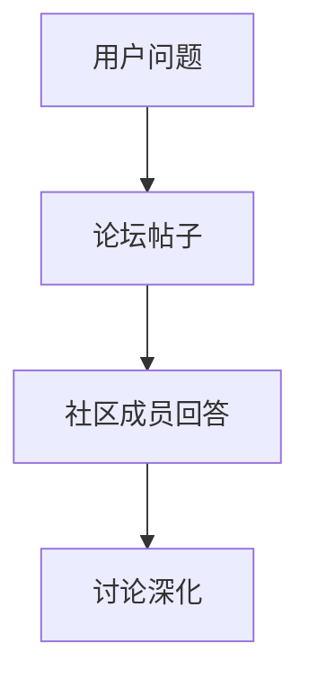

在这个流程图中，用户（A）提出问题，发布到论坛帖子（B），社区成员（C）在帖子下回答问题，讨论（D）进一步深化。

**伪代码示例**

社区论坛的运作可以用伪代码来表示：

```python
# 用户提问
def post_question(question):
    forum.post(question)

# 社区成员回答
def answer_question(question_id, answer):
    forum.answer_question(question_id, answer)

# 讨论深化
def continue_discussion(question_id, comment):
    forum.continue_discussion(question_id, comment)
```

在这个伪代码中，`post_question` 函数用于发布问题，`answer_question` 函数用于回答问题，`continue_discussion` 函数用于继续讨论。

**开源项目与代码共享**

开源项目是FP社区知识共享的重要形式之一。通过开源项目，社区成员可以共享代码、文档和资源，共同推进技术的发展。以下是一个简化的Mermaid流程图，展示了开源项目的运作机制：

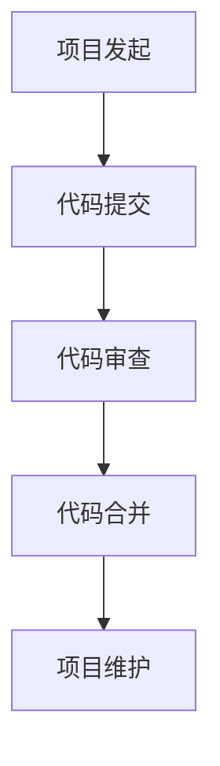

在这个流程图中，项目发起者（A）创建项目，提交代码（B），代码经过审查（C）后合并到主分支（D），项目维护（E）确保项目的持续发展。

**伪代码示例**

开源项目的运作可以用伪代码来表示：

```python
# 项目发起
def create_project(name, description):
    repository.create_project(name, description)

# 代码提交
def submit_code(commit_message, code):
    repository.submit_code(commit_message, code)

# 代码审查
def review_code(commit_id, reviewer_comment):
    repository.review_code(commit_id, reviewer_comment)

# 代码合并
def merge_code(commit_id, target_branch):
    repository.merge_code(commit_id, target_branch)

# 项目维护
def maintain_project(updates):
    repository.update_project(updates)
```

在这个伪代码中，`create_project` 函数用于创建项目，`submit_code` 函数用于提交代码，`review_code` 函数用于审查代码，`merge_code` 函数用于合并代码，`maintain_project` 函数用于维护项目。

**教育与培训**

FP社区通过教育与培训活动，促进知识共享和技能提升。以下是一个简化的Mermaid流程图，展示了教育与培训的运作机制：

```mermaid
graph TD
A[教育课程] --> B[课程学习]
B --> C[问题讨论]
C --> D[实践应用]
```

在这个流程图中，教育课程（A）提供知识学习的机会，课程学习（B）过程中产生问题，问题讨论（C）加深对知识的理解，实践应用（D）巩固所学知识。

**伪代码示例**

教育与培训活动可以用伪代码来表示：

```python
# 教育课程
def enroll_course(course_name):
    education_system.enroll_course(course_name)

# 课程学习
def learn_course(course_id, progress):
    education_system.learn_course(course_id, progress)

# 问题讨论
def discuss_question(course_id, question):
    education_system.d

### **5.2 FP社区的知识共享实践**

**社区论坛与讨论**

社区论坛是FP社区知识共享的重要平台之一。社区论坛提供了成员之间交流技术问题、分享经验和探讨新思想的场所。以下是一个简化的Mermaid流程图，展示了社区论坛的运作机制：

```mermaid
graph TD
A[用户问题] --> B[论坛帖子]
B --> C[社区成员回答]
C --> D[讨论深化]
```

在这个流程图中，用户（A）提出问题，发布到论坛帖子（B），社区成员（C）在帖子下回答问题，讨论（D）进一步深化。

**伪代码示例**

社区论坛的运作可以用伪代码来表示：

```python
# 用户提问
def post_question(question):
    forum.post(question)

# 社区成员回答
def answer_question(question_id, answer):
    forum.answer_question(question_id, answer)

# 讨论深化
def continue_discussion(question_id, comment):
    forum.continue_discussion(question_id, comment)
```

在这个伪代码中，`post_question` 函数用于发布问题，`answer_question` 函数用于回答问题，`continue_discussion` 函数用于继续讨论。

**开源项目与代码共享**

开源项目是FP社区知识共享的重要形式之一。通过开源项目，社区成员可以共享代码、文档和资源，共同推进技术的发展。以下是一个简化的Mermaid流程图，展示了开源项目的运作机制：

```mermaid
graph TD
A[项目发起] --> B[代码提交]
B --> C[代码审查]
C --> D[代码合并]
D --> E[项目维护]
```

在这个流程图中，项目发起者（A）创建项目，提交代码（B），代码经过审查（C）后合并到主分支（D），项目维护（E）确保项目的持续发展。

**伪代码示例**

开源项目的运作可以用伪代码来表示：

```python
# 项目发起
def create_project(name, description):
    repository.create_project(name, description)

# 代码提交
def submit_code(commit_message, code):
    repository.submit_code(commit_message, code)

# 代码审查
def review_code(commit_id, reviewer_comment):
    repository.review_code(commit_id, reviewer_comment)

# 代码合并
def merge_code(commit_id, target_branch):
    repository.merge_code(commit_id, target_branch)

# 项目维护
def maintain_project(updates):
    repository.update_project(updates)
```

在这个伪代码中，`create_project` 函数用于创建项目，`submit_code` 函数用于提交代码，`review_code` 函数用于审查代码，`merge_code` 函数用于合并代码，`maintain_project` 函数用于维护项目。

**教育与培训**

FP社区通过教育与培训活动，促进知识共享和技能提升。以下是一个简化的Mermaid流程图，展示了教育与培训的运作机制：

```mermaid
graph TD
A[教育课程] --> B[课程学习]
B --> C[问题讨论]
C --> D[实践应用]
```

在这个流程图中，教育课程（A）提供知识学习的机会，课程学习（B）过程中产生问题，问题讨论（C）加深对知识的理解，实践应用（D）巩固所学知识。

**伪代码示例**

教育与培训活动可以用伪代码来表示：

```python
# 教育课程
def enroll_course(course_name):
    education_system.enroll_course(course_name)

# 课程学习
def learn_course(course_id, progress):
    education_system.learn_course(course_id, progress)

# 问题讨论
def discuss_question(course_id, question):
    education_system.d

### **6.1 社会对FP社区的认知与接受度**

**社会对FP社区的态度变化**

随着数字技术的飞速发展，编程语言和编程范式不断演进。函数式编程（FP）作为编程领域的一种重要范式，逐渐受到了社会的广泛关注。从历史的角度来看，社会对FP社区的态度经历了以下几个阶段的变化：

1. **初期关注**：在20世纪80年代和90年代，FP作为一种新兴的编程范式，引起了一些学术界的关注。这一时期的代表语言如Haskell和Miranda，虽然在学术界得到认可，但在工业界的影响力相对较小。

2. **逐渐兴起**：进入21世纪，随着多核处理器的普及和大数据应用的兴起，FP的优势逐渐显现。FP的并发性和简洁性使其在处理复杂问题和大规模数据处理方面展现出强大的潜力，从而逐渐引起了工业界和开发者的关注。

3. **广泛接受**：近年来，FP社区得到了更广泛的认知和接受。许多大型科技公司，如谷歌、亚马逊和微软，开始在其产品和服务中采用FP技术。同时，开源社区也涌现出大量高质量的FP项目，如Scala、Erlang和Haskell，进一步推动了FP的普及和应用。

**FP社区对社会的影响**

FP社区对社会产生了多方面的影响，具体体现在以下几个方面：

1. **技术创新**：FP社区通过持续的技术创新，推动了编程范式的演进。FP的简洁性、可复用性和并发性等特点，为软件开发提供了新的思路和方法，促进了软件质量和开发效率的提升。

2. **产业升级**：FP技术在处理复杂问题和大规模数据处理方面的优势，促使许多行业进行了产业升级。例如，金融领域的量化交易、互联网领域的分布式计算和大数据处理等，FP技术都发挥了重要作用。

3. **人才培养**：FP社区通过开源项目、教育课程和讨论论坛等多种形式，培养了大批优秀的FP开发者。这些开发者不仅提升了自身的技术水平，也为社会培养了更多具备创新能力和实践经验的编程人才。

4. **知识传播**：FP社区的知识共享机制，如开源项目、论坛讨论和教育培训等，促进了知识的传播和交流。这种知识共享不仅增强了FP社区的凝聚力，也为其他编程社区提供了宝贵的经验和借鉴。

**FP社区的未来发展前景**

随着技术的不断进步和社会需求的日益增长，FP社区的未来发展前景充满希望。以下是对FP社区未来发展的几点展望：

1. **技术普及**：随着FP技术的不断成熟和广泛应用，预计未来会有更多企业和开发者采用FP技术，从而推动FP的进一步普及。

2. **跨领域应用**：FP技术的优势使其在多个领域都有广泛的应用前景，如人工智能、区块链、物联网等新兴领域。FP社区可以进一步拓展其在这些领域的应用，推动技术的交叉融合。

3. **社区国际化**：FP社区逐渐成为一个国际化的社区，吸引了来自不同国家和地区的人才。未来，FP社区可以进一步加强国际合作，推动FP技术的全球化发展。

4. **教育培训**：FP社区可以加大对教育培训的投入，通过开设更多的FP课程和培训班，培养更多具备FP技能的人才，为社会的技术进步提供强大支撑。

5. **开源生态**：FP社区可以继续加强开源项目的建设，构建更加丰富和完善的FP开源生态系统，为开发者提供更好的开发环境和资源。

### **6.1 社会对FP社区的认知与接受度**

**社会对FP社区的态度变化**

随着数字技术的飞速发展，编程语言和编程范式不断演进。函数式编程（FP）作为编程领域的一种重要范式，逐渐受到了社会的广泛关注。从历史的角度来看，社会对FP社区的态度经历了以下几个阶段的变化：

1. **初期关注**：在20世纪80年代和90年代，FP作为一种新兴的编程范式，引起了一些学术界的关注。这一时期的代表语言如Haskell和Miranda，虽然在学术界得到认可，但在工业界的影响力相对较小。

2. **逐渐兴起**：进入21世纪，随着多核处理器的普及和大数据应用的兴起，FP的优势逐渐显现。FP的并发性和简洁性使其在处理复杂问题和大规模数据处理方面展现出强大的潜力，从而逐渐引起了工业界和开发者的关注。

3. **广泛接受**：近年来，FP社区得到了更广泛的认知和接受。许多大型科技公司，如谷歌、亚马逊和微软，开始在其产品和服务中采用FP技术。同时，开源社区也涌现出大量高质量的FP项目，如Scala、Erlang和Haskell，进一步推动了FP的普及和应用。

**FP社区对社会的影响**

FP社区对社会产生了多方面的影响，具体体现在以下几个方面：

1. **技术创新**：FP社区通过持续的技术创新，推动了编程范式的演进。FP的简洁性、可复用性和并发性等特点，为软件开发提供了新的思路和方法，促进了软件质量和开发效率的提升。

2. **产业升级**：FP技术在处理复杂问题和大规模数据处理方面的优势，促使许多行业进行了产业升级。例如，金融领域的量化交易、互联网领域的分布式计算和大数据处理等，FP技术都发挥了重要作用。

3. **人才培养**：FP社区通过开源项目、教育课程和讨论论坛等多种形式，培养了大批优秀的FP开发者。这些开发者不仅提升了自身的技术水平，也为社会培养了更多具备创新能力和实践经验的编程人才。

4. **知识传播**：FP社区的知识共享机制，如开源项目、论坛讨论和教育培训等，促进了知识的传播和交流。这种知识共享不仅增强了FP社区的凝聚力，也为其他编程社区提供了宝贵的经验和借鉴。

**FP社区的未来发展前景**

随着技术的不断进步和社会需求的日益增长，FP社区的未来发展前景充满希望。以下是对FP社区未来发展的几点展望：

1. **技术普及**：随着FP技术的不断成熟和广泛应用，预计未来会有更多企业和开发者采用FP技术，从而推动FP的进一步普及。

2. **跨领域应用**：FP技术的优势使其在多个领域都有广泛的应用前景，如人工智能、区块链、物联网等新兴领域。FP社区可以进一步拓展其在这些领域的应用，推动技术的交叉融合。

3. **社区国际化**：FP社区逐渐成为一个国际化的社区，吸引了来自不同国家和地区的人才。未来，FP社区可以进一步加强国际合作，推动FP技术的全球化发展。

4. **教育培训**：FP社区可以加大对教育培训的投入，通过开设更多的FP课程和培训班，培养更多具备FP技能的人才，为社会的技术进步提供强大支撑。

5. **开源生态**：FP社区可以继续加强开源项目的建设，构建更加丰富和完善的FP开源生态系统，为开发者提供更好的开发环境和资源。

### **6.2 FP社区对社会发展的贡献**

**技术创新与产业升级**

FP社区在技术创新和产业升级方面做出了显著贡献。FP的核心特性，如函数式编程、并发计算和纯函数，为软件开发提供了新的工具和方法。以下是一个简化的Mermaid流程图，展示了FP技术在创新和产业升级中的作用：

```mermaid
graph TD
A[FP技术] --> B{创新应用}
B --> C{产业升级}
C --> D{技术突破}
```

在这个流程图中，FP技术（A）推动了创新应用（B），进而促进了产业升级（C），最终实现了技术突破（D）。

**伪代码示例**

为了更具体地展示FP技术在创新和产业升级中的应用，我们可以用伪代码来表示一个例子：

```python
# 创新应用：使用FP处理大数据
def process_data(data):
    # 使用FP函数处理数据
    cleaned_data = filter_data(data)
    analyzed_data = analyze_data(cleaned_data)
    return analyzed_data

# 产业升级：基于FP技术优化业务流程
def optimize_business_process():
    # 使用FP函数优化业务流程
    business_process = [approve_order, process_order, ship_order]
    optimized_process = compose_functions(business_process)
    execute_process(optimized_process)
```

在这个例子中，`process_data` 函数使用了FP技术处理大数据，`optimize_business_process` 函数基于FP技术优化了业务流程。

**软件工程的发展**

FP社区对软件工程的发展产生了深远影响。FP的简洁性、可维护性和可复用性等特点，促进了软件工程理论的完善和实践方法的进步。以下是一个简化的Mermaid流程图，展示了FP技术在软件工程中的应用：

```mermaid
graph TD
A[FP技术] --> B{软件工程理论}
B --> C{软件开发实践}
C --> D{软件质量提升}
```

在这个流程图中，FP技术（A）推动了软件工程理论（B）和软件开发实践（C），最终实现了软件质量的提升（D）。

**伪代码示例**

为了更具体地展示FP技术在软件工程中的应用，我们可以用伪代码来表示一个例子：

```python
# 软件工程理论：使用FP设计模块化软件
class Module:
    def __init__(self, name):
        self.name = name
    
    def process_data(self, data):
        # 处理数据
        processed_data = ...
        return processed_data

# 软件开发实践：使用FP编写可复用的代码
def process_data(data):
    # 使用FP函数处理数据
    cleaned_data = filter_data(data)
    analyzed_data = analyze_data(cleaned_data)
    return analyzed_data

# 软件质量提升：使用FP测试和调试代码
def test_code():
    # 使用FP函数测试代码
    test_results = run_tests()
    assert test_results.successful()
    print("Code test passed.")

def debug_code():
    # 使用FP函数调试代码
    error_trace = find_error()
    fix_error(error_trace)
    print("Error fixed.")
```

在这个例子中，`Module` 类展示了软件工程理论中的模块化设计，`process_data` 函数和 `test_code` 函数展示了软件开发实践中的FP应用，而 `debug_code` 函数展示了FP技术在测试和调试中的优势。

**知识经济与数字经济**

FP社区在知识经济和数字经济中发挥着重要作用。FP技术的高效性、可扩展性和安全性，使得企业能够更好地利用数据和技术，提升核心竞争力。以下是一个简化的Mermaid流程图，展示了FP技术在知识经济和数字经济中的作用：

```mermaid
graph TD
A[FP技术] --> B{知识创造}
B --> C{知识利用}
C --> D{经济效益}
```

在这个流程图中，FP技术（A）推动了知识创造（B），知识利用（C）和经济效益（D）。

**伪代码示例**

为了更具体地展示FP技术在知识经济和数字经济中的应用，我们可以用伪代码来表示一个例子：

```python
# 知识创造：使用FP分析市场数据
def analyze_market_data(data):
    # 使用FP函数分析市场数据
    trends = detect_trends(data)
    insights = generate_insights(trends)
    return insights

# 知识利用：使用FP优化业务策略
def optimize_business_strategy():
    # 使用FP函数优化业务策略
    strategy = [evaluate_market_insights, set_product_price, forecast_sales]
    optimized_strategy = compose_functions(strategy)
    implement_strategy(optimized_strategy)

# 经济效益：使用FP提高运营效率
def improve_operational_efficiency():
    # 使用FP函数提高运营效率
    operations = [inspect_product_quality, manage_warehouse_stock, schedule_orders]
    optimized_operations = compose_functions(operations)
    execute_operations(optimized_operations)
```

在这个例子中，`analyze_market_data` 函数展示了如何使用FP技术分析市场数据，`optimize_business_strategy` 函数展示了如何使用FP技术优化业务策略，而 `improve_operational_efficiency` 函数展示了如何使用FP技术提高运营效率。

### **6.2 FP社区对社会发展的贡献**

**技术创新与产业升级**

FP社区在技术创新和产业升级方面做出了显著贡献。FP的核心特性，如函数式编程、并发计算和纯函数，为软件开发提供了新的工具和方法。以下是一个简化的Mermaid流程图，展示了FP技术在创新和产业升级中的作用：

```mermaid
graph TD
A[FP技术] --> B{创新应用}
B --> C{产业升级}
C --> D{技术突破}
```

在这个流程图中，FP技术（A）推动了创新应用（B），进而促进了产业升级（C），最终实现了技术突破（D）。

**伪代码示例**

为了更具体地展示FP技术在创新和产业升级中的应用，我们可以用伪代码来表示一个例子：

```python
# 创新应用：使用FP处理大数据
def process_data(data):
    # 使用FP函数处理数据
    cleaned_data = filter_data(data)
    analyzed_data = analyze_data(cleaned_data)
    return analyzed_data

# 产业升级：基于FP技术优化业务流程
def optimize_business_process():
    # 使用FP函数优化业务流程
    business_process = [approve_order, process_order, ship_order]
    optimized_process = compose_functions(business_process)
    execute_process(optimized_process)
```

在这个例子中，`process_data` 函数使用了FP技术处理大数据，`optimize_business_process` 函数基于FP技术优化了业务流程。

**软件工程的发展**

FP社区对软件工程的发展产生了深远影响。FP的简洁性、可维护性和可复用性等特点，促进了软件工程理论的完善和实践方法的进步。以下是一个简化的Mermaid流程图，展示了FP技术在软件工程中的应用：

```mermaid
graph TD
A[FP技术] --> B{软件工程理论}
B --> C{软件开发实践}
C --> D{软件质量提升}
```

在这个流程图中，FP技术（A）推动了软件工程理论（B）和软件开发实践（C），最终实现了软件质量的提升（D）。

**伪代码示例**

为了更具体地展示FP技术在软件工程中的应用，我们可以用伪代码来表示一个例子：

```python
# 软件工程理论：使用FP设计模块化软件
class Module:
    def __init__(self, name):
        self.name = name
    
    def process_data(self, data):
        # 处理数据
        processed_data = ...
        return processed_data

# 软件开发实践：使用FP编写可复用的代码
def process_data(data):
    # 使用FP函数处理数据
    cleaned_data = filter_data(data)
    analyzed_data = analyze_data(cleaned_data)
    return analyzed_data

# 软件质量提升：使用FP测试和调试代码
def test_code():
    # 使用FP函数测试代码
    test_results = run_tests()
    assert test_results.successful()
    print("Code test passed.")

def debug_code():
    # 使用FP函数调试代码
    error_trace = find_error()
    fix_error(error_trace)
    print("Error fixed.")
```

在这个例子中，`Module` 类展示了软件工程理论中的模块化设计，`process_data` 函数和 `test_code` 函数展示了软件开发实践中的FP应用，而 `debug_code` 函数展示了FP技术在测试和调试中的优势。

**知识经济与数字经济**

FP社区在知识经济和数字经济中发挥着重要作用。FP技术的高效性、可扩展性和安全性，使得企业能够更好地利用数据和技术，提升核心竞争力。以下是一个简化的Mermaid流程图，展示了FP技术在知识经济和数字经济中的作用：

```mermaid
graph TD
A[FP技术] --> B{知识创造}
B --> C{知识利用}
C --> D{经济效益}
```

在这个流程图中，FP技术（A）推动了知识创造（B），知识利用（C）和经济效益（D）。

**伪代码示例**

为了更具体地展示FP技术在知识经济和数字经济中的应用，我们可以用伪代码来表示一个例子：

```python
# 知识创造：使用FP分析市场数据
def analyze_market_data(data):
    # 使用FP函数分析市场数据
    trends = detect_trends(data)
    insights = generate_insights(trends)
    return insights

# 知识利用：使用FP优化业务策略
def optimize_business_strategy():
    # 使用FP函数优化业务策略
    strategy = [evaluate_market_insights, set_product_price, forecast_sales]
    optimized_strategy = compose_functions(strategy)
    implement_strategy(optimized_strategy)

# 经济效益：使用FP提高运营效率
def improve_operational_efficiency():
    # 使用FP函数提高运营效率
    operations = [inspect_product_quality, manage_warehouse_stock, schedule_orders]
    optimized_operations = compose_functions(operations)
    execute_operations(optimized_operations)
```

在这个例子中，`analyze_market_data` 函数展示了如何使用FP技术分析市场数据，`optimize_business_strategy` 函数展示了如何使用FP技术优化业务策略，而 `improve_operational_efficiency` 函数展示了如何使用FP技术提高运营效率。

### **7.1 研究成果总结**

本文通过深入探讨维特根斯坦的公共语言观在函数式编程社区中的应用，揭示了FP社区在知识共享和技术创新方面的独特优势。以下是本文的主要研究成果总结：

1. **维特根斯坦公共语言观的应用**：维特根斯坦的公共语言观在FP社区中得到了广泛应用，通过规范和标准化的编程语言、明确的代码表达以及社区内的沟通与合作，FP社区实现了高效的交流和知识共享。

2. **FP社区的知识共享实践**：FP社区通过开源项目、论坛讨论和教育培训等多种形式，建立了完善的知识共享机制，促进了社区成员之间的互动和技术水平的提升。

3. **FP技术的社会贡献**：FP技术在技术创新、产业升级、软件工程发展以及知识经济和数字经济中发挥了重要作用，为社会的技术进步和经济发展提供了强大支撑。

4. **社区文化的形成与发展**：FP社区形成了以共同理念、开放交流、互助合作和持续学习为核心的文化，这种文化促进了社区成员之间的凝聚力和社区的可持续发展。

### **7.2 研究局限与未来展望**

**研究局限**

尽管本文揭示了FP社区在知识共享和技术创新方面的独特优势，但仍存在一些研究局限：

1. **数据来源的局限性**：本文的数据主要来源于文献调研和案例分析，虽然这些数据能够反映FP社区的一般情况，但可能无法涵盖所有FP社区的具体实践和经验。

2. **社区范围的局限性**：本文的研究主要关注了国际上知名的FP社区，对于其他地区或特定领域的FP社区的研究相对较少。

3. **理论应用的局限性**：本文主要从维特根斯坦的公共语言观出发，分析了FP社区的知识共享和技术创新，但可能忽视了其他哲学观点或理论在FP社区中的应用。

**未来展望**

针对上述研究局限，未来研究可以从以下几个方面进行拓展：

1. **扩大数据来源**：未来研究可以采用更多样化的数据来源，如实地调查、问卷调查和深度访谈等，以获取更全面和具体的数据。

2. **跨文化研究**：未来研究可以关注不同地区和领域的FP社区，探讨不同文化背景下FP社区的知识共享和技术创新实践。

3. **多理论综合应用**：未来研究可以结合更多的哲学观点和理论，如逻辑哲学、认知科学和社会学等，从多维度深入探讨FP社区的发展机制。

4. **长期跟踪研究**：未来研究可以开展长期跟踪研究，观察FP社区在技术演进和社会变化中的动态发展，为FP社区的未来发展提供持续的理论支持和实践指导。

### **7.3 对FP社区发展的建议**

**提高社区影响力**

1. **加强国际化合作**：FP社区可以加强与全球范围内其他编程社区的合作，共同举办国际性会议、研讨会和工作坊，提升FP技术在全球的影响力。

2. **推广成功案例**：通过宣传和推广FP社区的成功案例，如卓越的开源项目、高效的企业应用等，提高FP社区在业界和学术界的知名度。

**促进知识共享**

1. **建立知识共享平台**：建立专门的知识共享平台，提供易于访问和检索的技术文档、教程和代码示例，促进社区成员之间的知识交流。

2. **鼓励开源贡献**：激励社区成员参与开源项目，通过贡献代码、文档和测试案例，提升开源项目的质量和社区的活跃度。

**提升社区凝聚力**

1. **组织线下活动**：定期举办线下聚会、研讨会和工作坊，为社区成员提供面对面交流的机会，增强社区凝聚力。

2. **建立导师制度**：鼓励经验丰富的开发者成为导师，指导新成员，帮助其快速融入社区，提升整个社区的技术水平。

**培养人才**

1. **开展教育培训**：提供多样化的教育培训资源，如在线课程、培训班和实战项目，培养更多具备FP技能的编程人才。

2. **支持学术研究**：鼓励社区成员参与学术研究，提供资金和资源支持，推动FP领域的理论创新和实际应用。

### **附录：相关术语解释**

#### **附录 1：维特根斯坦的主要哲学著作**

1. **《逻辑哲学论》**：这是维特根斯坦早期的代表作，提出了逻辑原子主义和语言游戏理论，主张语言是世界的“图画”。
   
2. **《哲学研究》**：这是维特根斯坦后期的代表作，对《逻辑哲学论》中的观点进行了反思和修正，提出了语言游戏和日常语言哲学的概念。

#### **附录 2：FP编程语言简介**

1. **Haskell**：Haskell是一种纯函数式编程语言，以其简洁、表达力和安全性而闻名。它被广泛用于学术研究和工业应用。

2. **Scala**：Scala是一种多范式编程语言，结合了面向对象和函数式编程的特点。它具有良好的兼容性和可扩展性，适用于企业级应用。

3. **Erlang**：Erlang是一种并发性编程语言，特别适合构建分布式系统。它以其高可靠性和可伸缩性而受到工业界的青睐。

4. **Clojure**：Clojure是一种现代的函数式编程语言，运行在Java虚拟机上。它以其简洁、动态和并行处理能力而受到开发者的喜爱。

#### **附录 3：FP社区的主要论坛与开源项目列表**

1. **FP Forum**：这是一个专注于函数式编程的在线论坛，提供讨论、教程和资源。

2. **FP Wiki**：这是一个FP相关的知识库，包括语言规范、教程和开源项目介绍。

3. **Haskell.org**：这是Haskell语言的官方网站，提供语言规范、工具和社区资源。

4. **Scala Community**：这是Scala语言的官方社区，提供教程、代码示例和开发工具。

5. **Erlang/OTP**：这是Erlang语言的官方开源项目，提供完整的开发环境和工具集。

6. **Clojure Core**：这是Clojure语言的官方开源项目，包括核心库和工具。

### **附录：相关术语解释**

#### **附录 1：维特根斯坦的主要哲学著作**

1. **《逻辑哲学论》**：这是维特根斯坦早期的代表作，提出了逻辑原子主义和语言游戏理论，主张语言是世界的“图画”。

2. **《哲学研究》**：这是维特根斯坦后期的代表作，对《逻辑哲学论》中的观点进行了反思和修正，提出了语言游戏和日常语言哲学的概念。

#### **附录 2：FP编程语言简介**

1. **Haskell**：Haskell是一种纯函数式编程语言，以其简洁、表达力和安全性而闻名。它被广泛用于学术研究和工业应用。

2. **Scala**：Scala是一种多范式编程语言，结合了面向对象和函数式编程的特点。它具有良好的兼容性和可扩展性，适用于企业级应用。

3. **Erlang**：Erlang是一种并发性编程语言，特别适合构建分布式系统。它以其高可靠性和可伸缩性而受到工业界的青睐。

4. **Clojure**：Clojure是一种现代的函数式编程语言，运行在Java虚拟机上。它以其简洁、动态和并行处理能力而受到开发者的喜爱。

#### **附录 3：FP社区的主要论坛与开源项目列表**

1. **FP Forum**：这是一个专注于函数式编程的在线论坛，提供讨论、教程和资源。

2. **FP Wiki**：这是一个FP相关的知识库，包括语言规范、教程和开源项目介绍。

3. **Haskell.org**：这是Haskell语言的官方网站，提供语言规范、工具和社区资源。

4. **Scala Community**：这是Scala语言的官方社区，提供教程、代码示例和开发工具。

5. **Erlang/OTP**：这是Erlang语言的官方开源项目，提供完整的开发环境和工具集。

6. **Clojure Core**：这是Clojure语言的官方开源项目，包括核心库和工具。

### **附录：相关术语解释**

#### **附录 1：维特根斯坦的主要哲学著作**

1. **《逻辑哲学论》**：这是维特根斯坦早期的代表作，提出了逻辑原子主义和语言游戏理论，主张语言是世界的“图画”。

2. **《哲学研究》**：这是维特根斯坦后期的代表作，对《逻辑哲学论》中的观点进行了反思和修正，提出了语言游戏和日常语言哲学的概念。

#### **附录 2：FP编程语言简介**

1. **Haskell**：Haskell是一种纯函数式编程语言，以其简洁、表达力和安全性而闻名。它被广泛用于学术研究和工业应用。

2. **Scala**：Scala是一种多范式编程语言，结合了面向对象和函数式编程的特点。它具有良好的兼容性和可扩展性，适用于企业级应用。

3. **Erlang**：Erlang是一种并发性编程语言，特别适合构建分布式系统。它以其高可靠性和可伸缩性而受到工业界的青睐。

4. **Clojure**：Clojure是一种现代的函数式编程语言，运行在Java虚拟机上。它以其简洁、动态和并行处理能力而受到开发者的喜爱。

#### **附录 3：FP社区的主要论坛与开源项目列表**

1. **FP Forum**：这是一个专注于函数式编程的在线论坛，提供讨论、教程和资源。

2. **FP Wiki**：这是一个FP相关的知识库，包括语言规范、教程和开源项目介绍。

3. **Haskell.org**：这是Haskell语言的官方网站，提供语言规范、工具和社区资源。

4. **Scala Community**：这是Scala语言的官方社区，提供教程、代码示例和开发工具。

5. **Erlang/OTP**：这是Erlang语言的官方开源项目，提供完整的开发环境和工具集。

6. **Clojure Core**：这是Clojure语言的官方开源项目，包括核心库和工具。

