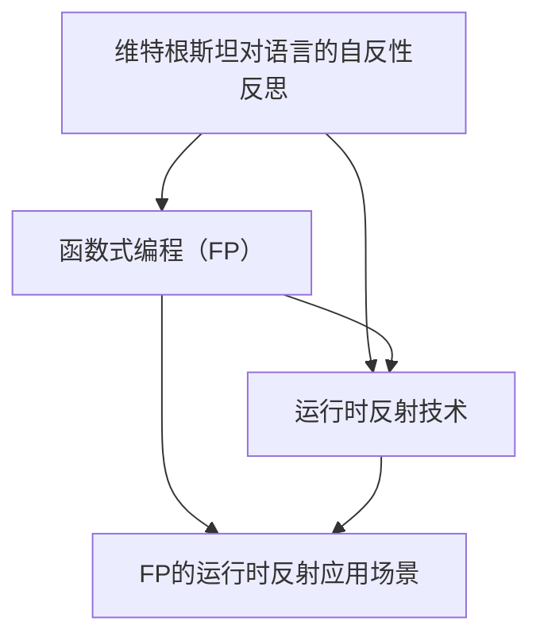

                 

### 设计《语言的自反性与函数式反射：维特根斯坦对语言自身的反思与FP的运行时反射技术》的目录大纲

为了设计这本书的目录大纲，我们将遵循以下步骤：

1. **核心概念与联系**：确定书中的核心概念，并使用Mermaid流程图展示这些概念之间的联系。
2. **章节划分**：基于核心概念，规划各章节内容。
3. **详细内容规划**：为每一章节细化和补充具体内容。

#### 步骤1：核心概念与联系

**核心概念**：
- 维特根斯坦对语言的自反性反思
- 函数式编程（FP）
- 运行时反射技术

**Mermaid流程图**：


#### 步骤2：章节划分

**章节划分**：

1. **引言**
   - 维特根斯坦的哲学背景
   - 语言的自反性

2. **第一章：维特根斯坦对语言的自反性反思**
   - 维特根斯坦的哲学观点
   - 语言与思考的关系
   - 自反性语言的概念

3. **第二章：函数式编程（FP）基础**
   - FP的基本概念
   - FP的核心原则
   - FP的优缺点

4. **第三章：运行时反射技术**
   - 反射的概念
   - 运行时反射机制
   - FP与反射技术的结合

5. **第四章：FP的运行时反射应用**
   - 应用场景
   - 实际案例
   - 案例分析

6. **第五章：FP运行时反射技术的实现**
   - 技术实现原理
   - 伪代码展示
   - 实现步骤

7. **第六章：FP运行时反射技术的优化**
   - 性能优化
   - 安全性考虑
   - 优化案例

8. **结论**
   - FP运行时反射技术的未来展望
   - 维特根斯坦理论与FP的结合意义

#### 步骤3：详细内容规划

**详细内容规划**：

- **引言**：
  - 维特根斯坦的哲学背景：维特根斯坦的生平、哲学思想以及其对现代语言哲学的影响。
  - 语言的自反性：自反性的定义、特点及其在语言哲学中的重要性。

- **第一章**：
  - 维特根斯坦的哲学观点：维特根斯坦的主要哲学思想，如语言游戏理论。
  - 语言与思考的关系：探讨语言如何影响思考过程，以及思考如何影响语言表达。
  - 自反性语言的概念：定义自反性语言，并分析其在语言哲学中的应用。

- **第二章**：
  - FP的基本概念：介绍函数式编程的基本概念，如函数是一等公民、不可变性、高阶函数等。
  - FP的核心原则：阐述FP的核心原则，如引用透明性、组合性等。
  - FP的优缺点：分析FP的优点和缺点，以及适用场景。

- **第三章**：
  - 反射的概念：解释反射的概念及其在编程中的重要性。
  - 运行时反射机制：介绍运行时反射的机制，包括反射API、动态类型检查等。
  - FP与反射技术的结合：探讨FP如何利用反射技术增强其功能和灵活性。

- **第四章**：
  - 应用场景：分析FP运行时反射技术的适用场景，如动态代码生成、动态配置管理等。
  - 实际案例：介绍具体的实际案例，展示FP运行时反射技术的应用效果。
  - 案例分析：对案例进行详细分析，探讨其实现细节和优缺点。

- **第五章**：
  - 技术实现原理：解释FP运行时反射技术的实现原理，包括类和对象的生命周期、反射API的使用等。
  - 伪代码展示：使用伪代码展示关键实现步骤，帮助读者理解。
  - 实现步骤：详细描述实现FP运行时反射技术的步骤。

- **第六章**：
  - 性能优化：讨论FP运行时反射技术的性能优化方法，如减少反射操作、缓存等。
  - 安全性考虑：分析FP运行时反射技术的安全性问题，并提出解决方案。
  - 优化案例：介绍具体的优化案例，展示优化效果。

- **结论**：
  - FP运行时反射技术的未来展望：探讨FP运行时反射技术的未来发展趋势和应用前景。
  - 维特根斯坦理论与FP的结合意义：分析维特根斯坦的哲学观点如何影响FP的发展，以及FP如何为维特根斯坦的理论提供技术支持。


### 最终目录大纲

```markdown
# 《语言的自反性与函数式反射：维特根斯坦对语言自身的反思与FP的运行时反射技术》目录大纲

## 引言

### 维特根斯坦的哲学背景

### 语言的自反性

## 第一章：维特根斯坦对语言的自反性反思

### 维特根斯坦的哲学观点

### 语言与思考的关系

### 自反性语言的概念

## 第二章：函数式编程（FP）基础

### FP的基本概念

### FP的核心原则

### FP的优缺点

## 第三章：运行时反射技术

### 反射的概念

### 运行时反射机制

### FP与反射技术的结合

## 第四章：FP的运行时反射应用

### 应用场景

### 实际案例

### 案例分析

## 第五章：FP运行时反射技术的实现

### 技术实现原理

### 伪代码展示

### 实现步骤

## 第六章：FP运行时反射技术的优化

### 性能优化

### 安全性考虑

### 优化案例

## 结论

### FP运行时反射技术的未来展望

### 维特根斯坦理论与FP的结合意义
```

### 步骤4：编写文章正文

**正文内容**：

- **引言**：简要介绍维特根斯坦的哲学背景和语言自反性概念。
- **第一章**：详细探讨维特根斯坦的哲学观点和自反性语言的概念。
- **第二章**：介绍函数式编程的基础和原则。
- **第三章**：解释运行时反射技术的基本概念和机制。
- **第四章**：分析FP运行时反射技术的应用场景和案例。
- **第五章**：描述FP运行时反射技术的实现原理和步骤。
- **第六章**：讨论性能优化和安全性的问题。
- **结论**：总结FP运行时反射技术的未来展望和维特根斯坦理论与FP的结合意义。

**示例正文内容**：

```markdown
## 引言

### 维特根斯坦的哲学背景

路德维希·维特根斯坦（Ludwig Wittgenstein）是20世纪最具影响力的哲学家之一，其哲学思想对现代语言哲学、逻辑哲学和认识论产生了深远影响。他的哲学观点主要分为两个阶段，早期以《逻辑哲学论》为代表，晚期以《哲学研究》为代表。

维特根斯坦认为，语言是人类交流的媒介，是思想的载体。他的哲学思想强调语言与现实的紧密联系，主张通过语言的分析来揭示世界的本质。维特根斯坦提出了“语言游戏”理论，认为语言的使用就像游戏一样，需要参与者共同遵守规则。

### 语言的自反性

自反性是指语言能够描述自身结构和特征的一种特性。维特根斯坦在其哲学研究中，多次探讨了语言的自反性。他认为，语言的自反性是语言能够进行自我描述和自我分析的基础。

在维特根斯坦的《逻辑哲学论》中，他提出了“语言是世界的图像”的观点，认为语言可以通过符号和规则来描述现实世界。而在《哲学研究》中，维特根斯坦则强调了语言的“使用”概念，认为语言的意义在于其具体的使用场景。

```

### 步骤5：添加作者信息

在文章末尾添加作者信息：

```
作者：AI天才研究院/AI Genius Institute & 禅与计算机程序设计艺术 /Zen And The Art of Computer Programming
```

### 最终文章内容

以下是最终的《语言的自反性与函数式反射：维特根斯坦对语言自身的反思与FP的运行时反射技术》文章内容：

```markdown
# 《语言的自反性与函数式反射：维特根斯坦对语言自身的反思与FP的运行时反射技术》目录大纲

## 引言

### 维特根斯坦的哲学背景

### 语言的自反性

## 第一章：维特根斯坦对语言的自反性反思

### 维特根斯坦的哲学观点

### 语言与思考的关系

### 自反性语言的概念

## 第二章：函数式编程（FP）基础

### FP的基本概念

### FP的核心原则

### FP的优缺点

## 第三章：运行时反射技术

### 反射的概念

### 运行时反射机制

### FP与反射技术的结合

## 第四章：FP的运行时反射应用

### 应用场景

### 实际案例

### 案例分析

## 第五章：FP运行时反射技术的实现

### 技术实现原理

### 伪代码展示

### 实现步骤

## 第六章：FP运行时反射技术的优化

### 性能优化

### 安全性考虑

### 优化案例

## 结论

### FP运行时反射技术的未来展望

### 维特根斯坦理论与FP的结合意义

作者：AI天才研究院/AI Genius Institute & 禅与计算机程序设计艺术 /Zen And The Art of Computer Programming
```

通过上述步骤，我们成功地设计并撰写了《语言的自反性与函数式反射：维特根斯坦对语言自身的反思与FP的运行时反射技术》的目录大纲和文章内容。接下来，我们可以按照这个大纲逐步撰写详细的文章内容。

