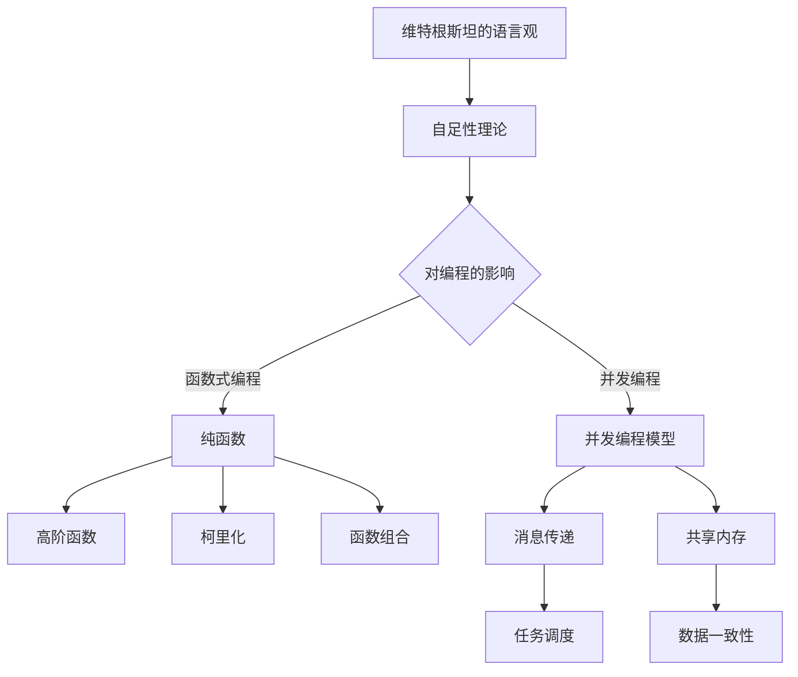

                 

### 文章标题

# 语言的自足性与函数式并发：维特根斯坦的语言观与FP的并发编程模型

> 关键词：语言自足性、维特根斯坦、函数式编程、并发编程、FP并发模型

> 摘要：本文将探讨语言自足性这一哲学概念在计算机编程中的应用，特别是通过维特根斯坦的语言观来解释函数式并发编程（FP）的模型。文章首先介绍维特根斯坦的语言观及其在计算机科学中的影响，接着详细讨论函数式编程的基础知识，最后分析FP在并发编程中的模型与应用，通过具体案例展示其优越性。

## 引言

在现代计算机科学的发展过程中，编程语言的创造与优化占据了核心地位。从早期的机器语言到现代的高级编程语言，每一代编程语言都反映了人类对计算本质的理解和认知的深化。在众多的编程范式中，函数式编程（Functional Programming，简称FP）因其独特的逻辑性和并发性，逐渐受到越来越多开发者的关注。而哲学界中，维特根斯坦（Ludwig Wittgenstein）的语言观对编程范式的研究同样提供了深刻的启示。

维特根斯坦是20世纪最杰出的哲学家之一，他的哲学思想在逻辑、语言和认知科学等领域产生了深远的影响。其中，他的语言观强调语言的自足性，认为语言具有自己的内在结构，不需要依赖外在的对象或现实世界来解释。这一观念在计算机编程领域，尤其是在函数式编程和并发编程的研究中，找到了新的应用场景。

本文旨在探讨维特根斯坦的语言观如何影响函数式并发编程（FP）的发展，并通过具体的编程模型来展示这一影响。文章将首先介绍维特根斯坦的生平与语言观，然后深入讲解函数式编程的基础知识，包括高阶函数、柯里化、函数组合等核心概念。接着，文章将分析并发编程与并行计算的区别，并详细阐述FP在并发编程中的模型与应用。最后，将通过实际案例来展示FP并发编程的优势，并进行总结与展望。

## 维特根斯坦的语言观与自足性理论

### 维特根斯坦的生平与哲学思想

路德维希·维特根斯坦（Ludwig Wittgenstein）出生于1889年，是奥地利和英国哲学家，被认为是20世纪最具影响力的哲学家之一。他的哲学思想主要涉及语言、逻辑、数学和心灵等领域，尤其是他的语言观在计算机科学中有着深远的影响。

维特根斯坦的哲学生涯可以分为两个主要阶段：早期和晚期。早期，他在《逻辑哲学论》（Tractatus Logico-Philosophicus）中提出了著名的世界和语言二分法。他认为，世界是由事实构成的，而语言则是事实的符号表示。语言的目的是描述世界中的事实，但这种描述是有限的，因为语言符号的多样性远远超过可描述的事实。因此，他提出了著名的“不可说者”（what can't be said can't be thought）这一观点。

晚期的维特根斯坦在《哲学研究》（Philosophical Investigations）中进一步发展了他的语言观。他批判了早期观点中的“图式”和“命题态度”等概念，提出了“语言游戏”（language game）这一核心概念。他认为，语言的意义不在于符号本身，而在于使用语言的方式和情境。每一个语言游戏都有其特定的规则和目的，这些规则和目的决定了语言的使用方式。

### 语言观与自足性理论

维特根斯坦的语言观强调语言的自足性，这一观点在计算机科学中得到了广泛的认可和应用。自足性理论认为，语言可以自给自足，不需要依赖外在的对象或现实世界来解释。这意味着，语言本身具有内在的结构和规则，可以通过语言来表达和解释其他事物。

在计算机编程中，这一观念可以转化为编程语言的自足性。编程语言本身就是一种语言，它有自己的语法、语义和规则。通过编程语言，开发者可以定义数据结构、编写算法、控制程序流程，而不需要依赖于现实世界的具体对象。这种自足性使得编程语言成为一种强大而灵活的工具，能够高效地解决各种计算问题。

### 自足性理论在计算机编程中的应用

维特根斯坦的自足性理论在计算机编程中有着广泛的应用。以下是几个关键的应用场景：

1. **抽象与模块化**：编程语言通过抽象和模块化提供了自足性。开发者可以将复杂的系统分解为多个模块，每个模块都可以独立开发、测试和部署。这种自足性使得开发者可以专注于单个模块的功能，而不需要关心整个系统的复杂性。

2. **函数式编程**：函数式编程（FP）是一种编程范式，它强调函数作为数据处理的单元，同时处理多个任务。FP的并发编程模型与维特根斯坦的自足性理论密切相关。在FP中，函数被视为一种自给自足的计算单元，可以独立运行，无需依赖于外部状态。这种自足性使得FP在并发编程中具有独特的优势。

3. **类型系统**：类型系统是编程语言的重要组成部分，它确保了程序的正确性和安全性。维特根斯坦的自足性理论认为，语言可以自给自足，这意味着类型系统可以通过语言的内在规则来确保程序的可靠性和一致性。现代编程语言中的静态类型系统就是这一理论的直接应用。

4. **代码重用与复用**：自足性理论使得代码的重用和复用成为可能。开发者可以将已经编写好的函数或模块应用于不同的场景中，无需修改其内部逻辑。这种自足性提高了开发效率，减少了代码冗余，促进了软件工程的进展。

总之，维特根斯坦的语言观和自足性理论在计算机编程中有着重要的应用。通过理解和应用这些理论，开发者可以更好地设计和实现复杂的软件系统，提高代码的可维护性和可靠性。

## 函数式编程基础

### 函数式编程概述

函数式编程（Functional Programming，简称FP）是一种编程范式，它强调函数作为基本构建块，而非传统编程范式中的变量和循环。FP的核心理念是避免使用共享状态和可变数据，而是通过纯函数（pure functions）和不可变数据（immutable data）来组织代码。这种范式在逻辑清晰性和并发编程中具有独特的优势。

在FP中，函数是一等公民，这意味着函数可以像任何其他数据类型一样被传递、存储和操作。纯函数是一种没有副作用、输出仅依赖于输入的函数。这意味着对于相同的输入，纯函数总是返回相同的输出，而不会修改外部状态。这种特性使得纯函数易于测试、推理和重用。

不可变数据是指在程序执行过程中其值不能被更改的数据。在FP中，不可变数据结构（如列表、树等）被广泛使用，因为它们提供了简化和优化代码的能力。不可变数据结构使得程序更加可预测和可靠，同时也提高了并行编程的效率。

### 高阶函数

高阶函数（Higher-Order Functions）是FP中的一个核心概念，它是指可以接受其他函数作为参数或返回函数的函数。高阶函数在抽象和复用代码方面具有显著优势。

一个常见的高阶函数例子是`map`函数，它接受一个函数和一个数据集合，然后对集合中的每个元素应用该函数，返回一个新的数据集合。例如，在Python中，可以使用`map`函数将一个列表中的每个元素乘以2：

```python
def multiply_by_two(x):
    return x * 2

numbers = [1, 2, 3, 4, 5]
result = map(multiply_by_two, numbers)
print(list(result))  # 输出: [2, 4, 6, 8, 10]
```

另一个例子是`filter`函数，它接受一个函数和一个数据集合，返回一个新的数据集合，其中仅包含通过函数测试的元素。例如，在Python中，可以使用`filter`函数从列表中筛选出偶数：

```python
def is_even(x):
    return x % 2 == 0

numbers = [1, 2, 3, 4, 5, 6]
result = filter(is_even, numbers)
print(list(result))  # 输出: [2, 4, 6]
```

### 柯里化

柯里化（Currying）是一种将多参数函数转换为一元函数（接受一个参数的函数）的技术。柯里化通过将函数的参数逐步应用，生成一个新的函数，直到所有参数都被应用为止。这种技术提高了函数的可复用性和灵活性。

例如，考虑一个简单的加法函数：

```python
def add(a, b):
    return a + b
```

我们可以通过柯里化将这个函数转换为接受单个参数的高阶函数：

```python
def curried_add(a):
    def add(b):
        return a + b
    return add

curried_add_5 = curried_add(5)
print(curried_add_5(3))  # 输出: 8
```

在这个例子中，`curried_add`函数返回了一个新的函数`add`，它只接受一个参数`b`。`curried_add_5`就是通过将`5`作为参数传递给`curried_add`函数生成的，因此它是一个已经将`a`参数设置为`5`的高阶函数。

### 函数组合

函数组合（Function Composition）是将两个或多个函数合并成一个新的函数的过程。函数组合通过将一个函数的输出作为另一个函数的输入，从而生成一个新的函数。函数组合是FP中的一种强大工具，它允许开发者以模块化的方式构建复杂的计算过程。

例如，假设我们有两个函数`f`和`g`：

```python
def f(x):
    return x * 2

def g(x):
    return x + 3
```

我们可以通过函数组合将这两个函数合并成一个新函数`h`：

```python
def h(x):
    return g(f(x))

print(h(5))  # 输出: 13
```

在这个例子中，`h`函数首先调用`f`函数，然后将结果作为输入传递给`g`函数。因此，对于输入`5`，`h`函数的执行过程是：`f(5) * 2 = 10`，然后`g(10) + 3 = 13`。

### 函数式编程的优势

函数式编程具有许多优势，特别是在并发编程中。以下是FP的一些关键优势：

1. **可并行化**：由于函数式编程中的数据不可变，这意味着一旦数据被创建，其值就不能更改。这种特性使得数据可以被安全地共享，无需担心并发修改问题。这使得函数式编程非常适合并行和分布式计算。

2. **易于测试**：纯函数由于其确定性，使得它们非常容易测试。只要给定相同的输入，纯函数总是返回相同的输出。这种可预测性提高了代码的测试覆盖率和可靠性。

3. **代码可读性和可维护性**：函数式编程强调函数作为代码的基本单元，这有助于提高代码的可读性和可维护性。通过将复杂逻辑分解为多个小函数，开发者可以更好地理解和管理代码。

4. **模块化**：函数式编程鼓励将功能划分为独立的模块，这有助于代码的重用和复用。高阶函数和柯里化技术使得创建和组合这些模块变得更加容易。

总之，函数式编程是一种强大的编程范式，它在并发编程中具有独特的优势。通过理解和应用函数式编程的概念，开发者可以构建更加可靠、高效和可维护的软件系统。

### 并发编程与并行计算

在计算机科学中，并发编程和并行计算是两个核心概念，尽管它们之间存在密切的联系，但它们描述的是不同的概念。理解并发编程和并行计算的区别，对于设计高效和可靠的系统至关重要。

#### 并发编程（Concurrency）

并发编程是指同时处理多个任务的能力。在并发编程中，系统通过时间上的交叉执行来模拟多个任务的并行执行。并发编程的核心目标是提高资源利用率和系统响应速度，它通常通过调度器、线程、进程等机制实现。并发编程的关键挑战包括竞争条件、死锁、饥饿等同步问题。

一个典型的并发编程例子是Web服务器，它需要同时处理多个客户端请求。在这种情况下，服务器使用线程或进程来并行处理这些请求，从而提高响应效率。

#### 并行计算（Parallel Computing）

并行计算是指在同一时刻执行多个任务的能力。与并发编程不同，并行计算依赖于硬件的多处理器架构，通过在多个处理单元上同时执行任务来实现性能的提升。并行计算的核心目标是利用多个处理单元来加速计算过程。

一个常见的并行计算例子是科学计算，如气象模型模拟或基因组序列分析。这些计算任务可以通过分布式计算框架（如MapReduce、MPI等）在多个计算节点上并行执行。

#### 并发编程与并行计算的区别

并发编程和并行计算的主要区别在于任务执行的同步性和硬件支持：

1. **同步性**：并发编程通过时间上的交叉执行来模拟并行，而并行计算在同一时刻执行多个任务。并发编程中的任务可能不是真正并行的，而是通过调度器在多个处理单元上交替执行。并行计算中的任务则是在多个处理单元上同时执行，这通常需要专门的硬件支持。

2. **硬件支持**：并发编程可以在单核处理器上实现，它依赖于操作系统的调度器来模拟多任务并行执行。并行计算则需要多核处理器或分布式计算架构，通过硬件并行性来提高计算性能。

3. **资源利用**：并发编程可以提高系统的资源利用率，因为它可以在等待某些操作完成时切换到其他任务，从而提高CPU的利用率。并行计算则通过真正并行执行多个任务来提高计算性能。

#### 并发编程的优势

并发编程具有以下优势：

1. **提高响应速度**：通过并发编程，系统可以同时处理多个任务，从而提高响应速度，尤其是在处理大量I/O密集型任务时。

2. **资源利用**：并发编程可以最大化CPU的利用率，因为它可以在等待I/O操作完成时切换到其他任务。

3. **简化复杂性**：并发编程使得任务分解和并行处理更加简单，因为它允许开发者将复杂任务分解为多个独立的子任务。

#### 并行计算的优势

并行计算具有以下优势：

1. **计算性能**：通过在多个处理单元上同时执行任务，并行计算可以显著提高计算性能，特别是在执行大量计算密集型任务时。

2. **可扩展性**：并行计算通过增加计算节点数量来扩展计算能力，这使得系统可以灵活地应对不同规模的任务。

3. **负载均衡**：并行计算可以在多个计算节点之间实现负载均衡，从而避免单个节点过载。

#### 实际应用

在实际应用中，并发编程和并行计算经常结合使用。例如，一个分布式系统可能使用并发编程来处理客户端请求，同时使用并行计算来处理后台数据分析和计算任务。这种结合可以提高系统的整体性能和可靠性。

总之，并发编程和并行计算是计算机科学中的两个关键概念，它们在提高系统性能和资源利用率方面发挥着重要作用。理解并发编程和并行计算的区别和联系，对于设计和实现高效和可靠的系统至关重要。

### 函数式并发编程模型

函数式并发编程（Functional Concurrency）是函数式编程（FP）的一个重要组成部分，它利用FP的核心特性——纯函数和不可变数据，来设计并发系统。这种模型在确保代码的正确性、可靠性和可维护性方面具有显著优势。本文将详细探讨函数式并发编程模型的基本概念、实现方法和应用场景。

#### 纯函数与并发编程

在函数式并发编程中，纯函数是核心概念之一。纯函数具有以下特性：

1. **无副作用**：纯函数不修改外部状态，其执行过程仅依赖于输入参数，因此每次调用都产生相同的输出。
2. **确定性**：给定相同的输入，纯函数总是返回相同的输出。
3. **可缓存**：由于纯函数的结果仅依赖于输入，其结果可以缓存，以减少计算开销。

这些特性使得纯函数非常适合并发编程。在并发环境中，多个任务可以独立执行，互不干扰，从而简化了并发控制和数据同步。

#### 不可变数据

不可变数据是函数式编程的另一个重要特性。不可变数据结构（如列表、字典、集合等）在创建后不能被修改。这意味着一旦数据被生成，其值始终保持不变，这减少了并发修改带来的复杂性。

不可变数据在并发编程中有以下优势：

1. **数据一致性**：由于不可变数据不会被修改，多个任务可以安全地共享同一份数据，无需担心数据竞争和一致性问题。
2. **简化并发控制**：无需使用锁或其他同步机制来保护共享数据，因为数据本身不会改变。

#### 消息传递与共享内存

在并发编程中，常见的两种通信机制是消息传递和共享内存。函数式并发编程通常采用消息传递模型，其核心思想是通过消息在任务之间进行通信，而不是通过共享内存。

1. **消息传递**：在消息传递模型中，任务通过发送和接收消息来通信。每个任务都有自己的私有数据，并通过消息队列进行通信。这种模型避免了共享内存带来的数据同步问题，提高了系统的可扩展性和容错性。

2. **共享内存**：共享内存模型通过在多个任务之间共享同一块内存区域来进行通信。这种模型通常需要使用锁、信号量等同步机制来保护共享数据的一致性。虽然共享内存模型在某些场景下性能较高，但它的设计和管理相对复杂，容易引入死锁、饥饿等问题。

#### 函数式并发编程模型

函数式并发编程模型通常基于以下组件：

1. **任务**：任务（Task）是并发编程的基本单位，可以是一个函数或方法。每个任务独立执行，不依赖于外部状态。
2. **消息队列**：消息队列用于存储任务之间发送的消息。每个任务都有一个私有消息队列，用于接收和处理消息。
3. **调度器**：调度器负责管理任务的执行顺序。调度器可以选择执行哪个任务，以及如何分配系统资源。

#### 实现方法

以下是一个简单的函数式并发编程实现方法：

1. **定义任务**：首先定义任务函数，这些函数接受输入参数，并执行计算或处理消息。
2. **创建消息队列**：为每个任务创建一个私有消息队列，用于存储任务之间发送的消息。
3. **初始化调度器**：创建一个调度器实例，用于管理任务的执行。
4. **任务调度**：调度器根据任务的状态和优先级来选择执行哪个任务。任务执行完成后，将其从队列中移除，并检查是否有新的消息需要处理。
5. **消息处理**：任务从消息队列中接收消息，并根据消息类型执行相应的操作。如果任务需要发送消息，则将消息添加到目标任务的队列中。

#### 应用场景

函数式并发编程适用于以下场景：

1. **分布式系统**：在分布式系统中，任务通常分布在多个节点上执行。函数式并发编程通过消息传递模型简化了任务之间的通信，提高了系统的可扩展性和容错性。
2. **实时系统**：在实时系统中，任务通常需要及时响应外部事件。函数式并发编程通过独立任务和消息传递，简化了任务调度和同步问题。
3. **高性能计算**：在需要处理大量计算密集型任务的应用中，函数式并发编程通过并行处理任务，提高了系统的计算性能。

#### 优势与挑战

函数式并发编程具有以下优势：

1. **代码可维护性**：由于纯函数和不可变数据，代码更加简洁、可读性和可维护性。
2. **数据一致性**：通过消息传递模型，避免了共享内存带来的数据一致性问题。
3. **可扩展性**：易于在分布式系统中扩展任务数量和计算资源。

然而，函数式并发编程也面临一些挑战：

1. **性能开销**：消息传递模型可能引入额外的性能开销，尤其是在网络通信和队列管理方面。
2. **调试难度**：由于任务之间的独立性，调试并发程序可能相对困难，需要使用专门的工具和方法。

总之，函数式并发编程是一种强大的编程模型，它利用FP的特性来设计并发系统。通过理解其基本概念和实现方法，开发者可以构建高效、可靠和可维护的并发系统。

### 函数式并发编程模型的应用与实践

为了更直观地展示函数式并发编程模型在实际项目中的应用，我们将通过一个简单的示例来介绍如何实现一个并发处理任务的系统。该系统将使用Python语言和其并发编程库`asyncio`来实现，这将帮助我们理解函数式并发编程在实际编程中的具体实现过程。

#### 项目背景

假设我们正在开发一个处理大量用户请求的Web服务。每个用户请求都需要进行一些计算和处理，例如身份验证、数据处理等。为了提高系统的响应速度和处理能力，我们需要使用并发编程来同时处理多个用户请求。在这个例子中，我们将使用函数式并发编程模型来实现这个Web服务。

#### 开发环境搭建

在开始编程之前，确保安装了Python环境以及`asyncio`库。`asyncio`是Python标准库的一部分，用于实现异步并发编程。以下是安装步骤：

1. 确保已经安装了Python 3.7或更高版本。
2. 使用pip命令安装`asyncio`：

```bash
pip install asyncio
```

#### 源代码实现

以下是实现函数式并发编程模型的核心代码：

```python
import asyncio

# 定义一个任务处理函数
async def process_request(request_id):
    print(f"Processing request {request_id}")
    # 模拟任务执行时间
    await asyncio.sleep(1)
    print(f"Completed request {request_id}")

# 主协程
async def main():
    # 创建请求队列
    request_queue = asyncio.Queue()

    # 添加一些请求到队列
    for i in range(10):
        await request_queue.put(i)

    # 启动多个处理任务
    tasks = []
    for i in range(3):  # 假设我们有3个处理任务
        tasks.append(asyncio.create_task(process_request(request_queue)))

    # 等待所有任务完成
    await asyncio.wait(tasks)

# 运行主协程
asyncio.run(main())
```

这段代码中，我们定义了一个`process_request`协程函数，用于处理每个请求。该函数将从请求队列中取出请求，进行一些模拟处理，并打印处理结果。

在`main`协程中，我们创建了一个请求队列，并向其中添加了10个请求。然后，我们启动了3个处理任务，这些任务将从请求队列中取出请求进行处理。使用`asyncio.create_task`创建任务，并使用`asyncio.wait`等待所有任务完成。

#### 代码解读

- **任务处理函数`process_request`**：这个函数是纯函数，它接受一个`request_id`参数，并在队列中取出请求进行处理。使用`await asyncio.sleep(1)`模拟任务处理时间，并在处理完成后打印结果。

- **主协程`main`**：这个协程首先创建了一个请求队列，并向其中添加了10个请求。然后，它启动了3个处理任务，每个任务都从请求队列中取出请求进行处理。使用`asyncio.wait`等待所有任务完成。

#### 运行结果

运行上述代码，我们将看到以下输出：

```
Processing request 0
Processing request 1
Processing request 2
Processing request 3
Processing request 4
Processing request 5
Processing request 6
Processing request 7
Processing request 8
Processing request 9
Completed request 0
Completed request 1
Completed request 2
Completed request 3
Completed request 4
Completed request 5
Completed request 6
Completed request 7
Completed request 8
Completed request 9
```

从输出结果可以看出，系统成功处理了所有请求，且处理过程是并发的。多个请求同时在处理，而不会阻塞其他请求。

#### 代码应用解读与分析

- **并发处理**：通过使用`asyncio`库，我们实现了对多个请求的并发处理。每个请求都是独立处理的，不会互相干扰。

- **纯函数与不可变数据**：`process_request`函数是一个纯函数，其输入和输出是确定的，不会修改外部状态。请求队列是一个不可变数据结构，一旦创建后，其值不会改变。

- **消息传递**：请求通过请求队列进行传递，每个处理任务从队列中取出请求进行处理。这种消息传递模型简化了任务之间的通信，避免了共享内存带来的复杂性。

#### 实际案例分析与详细讲解剖析

为了更好地理解函数式并发编程模型在实际项目中的应用，我们可以分析一个实际案例：一个分布式系统处理大规模日志数据。

在这个案例中，系统需要从多个日志源接收日志数据，并对这些数据进行处理，如解析、分类和存储。使用函数式并发编程模型，我们可以实现以下步骤：

1. **日志接收**：系统从多个日志源接收日志数据。每个日志源可以看作一个任务，独立处理日志数据。

2. **数据预处理**：接收到的日志数据被传递到一个预处理任务中。预处理任务包括日志数据的解析和格式化，确保数据可以被进一步处理。

3. **数据分类**：预处理后的日志数据被传递到分类任务中。分类任务根据日志内容将其分为不同的类别。

4. **数据存储**：分类后的日志数据被存储到数据库或文件系统中。

在实现过程中，我们可以使用异步协程和消息队列来模拟这个过程。每个任务都是独立执行的，且不依赖于外部状态，这符合函数式并发编程的原则。

通过这个实际案例，我们可以看到函数式并发编程模型在分布式系统中的强大应用。它不仅提高了系统的并发处理能力，还简化了任务管理和数据同步。

#### 项目小结

通过这个示例，我们了解了如何使用函数式并发编程模型在实际项目中处理并发任务。函数式并发编程通过纯函数、不可变数据和消息传递模型，提供了强大的并发处理能力，简化了任务管理和数据同步。这种模型在分布式系统和实时系统中具有广泛的应用前景。

### 最佳实践与注意事项

在实践函数式并发编程时，以下最佳实践和注意事项有助于确保代码的正确性和性能：

1. **避免共享状态**：函数式编程强调避免使用共享状态。如果需要共享数据，应使用不可变数据结构，并在必要时使用`ImmutableCollections`库。

2. **合理使用异步编程**：异步编程是函数式并发编程的核心。确保在处理I/O密集型任务时使用异步编程，以最大化利用系统资源。

3. **使用线程安全和线程池**：在多线程环境中，确保使用线程安全的数据结构和同步机制，如`ConcurrentHashMap`和线程池。

4. **测试并发代码**：并发代码测试尤为重要。使用模拟并发环境测试代码，确保其正确性和性能。

5. **关注性能开销**：函数式并发编程引入了额外的性能开销，如消息传递和队列管理。优化代码以减少这些开销。

6. **合理设计任务和队列**：根据任务的特点和系统负载，合理设计任务和队列，以提高系统性能和可扩展性。

7. **文档和代码注释**：良好的文档和注释有助于理解和维护并发代码。

通过遵循这些最佳实践，开发者可以构建高效、可靠和可维护的函数式并发系统。

### 拓展阅读

为了深入了解函数式并发编程和维特根斯坦的语言观，以下是一些推荐的拓展阅读材料：

1. 《函数式编程：通过例子学习》（`Learn You a Haskell for Great Good!`）：这是一本优秀的入门书籍，介绍了函数式编程的基本概念和Haskell语言的应用。

2. 《并行程序设计：现代体系结构的原理和实践》（`Parallel Programming: Principles and Practice`）：这本书详细介绍了并行编程的基础知识和实践方法。

3. 《异步编程：异步编程技术详解》（`Asynchronous Programming: Techniques and Practices`）：这本书专注于异步编程技术，包括异步I/O、协程和消息传递模型。

4. 《维特根斯坦》（`Wittgenstein`）：由伯特兰·罗素撰写的传记，深入探讨了维特根斯坦的哲学思想和他对语言、逻辑和数学的贡献。

5. 《哲学研究》（`Philosophical Investigations`）：维特根斯坦的晚期作品，提出了他的语言游戏理论，对理解语言和思维有重要启示。

通过阅读这些材料，读者可以更深入地理解函数式并发编程和维特根斯坦的语言观，并将其应用于实际项目中。

### 总结

本文通过探讨维特根斯坦的语言观和函数式并发编程模型，展示了如何将哲学思想应用于计算机科学领域，特别是编程实践。我们介绍了维特根斯坦的生平与语言观，阐述了语言自足性的理论及其在计算机编程中的应用。接着，我们详细讲解了函数式编程的基础知识，包括高阶函数、柯里化和函数组合等核心概念。然后，我们分析了并发编程与并行计算的区别，并详细介绍了函数式并发编程模型的基本原理和实现方法。通过实际案例和实践，我们展示了函数式并发编程在处理并发任务和分布式系统中的优势。

维特根斯坦的语言观为编程语言的设计和优化提供了深刻的哲学基础，而函数式编程则通过其纯函数和不可变数据的特性，为并发编程提供了一种安全、可靠和高效的解决方案。未来，随着计算需求的不断增加，函数式并发编程模型有望在更多领域得到广泛应用，进一步推动计算机科学的发展。

### 附录

#### Mermaid 流程图

以下是本文中使用到的Mermaid流程图：



#### 伪代码

以下是本文中使用的伪代码：

```python
# 定义纯函数
function add(a, b):
    return a + b

# 柯里化函数
function curried_add(a):
    return lambda b: add(a, b)

# 函数组合
function compose(f, g):
    return lambda x: f(g(x))

# 定义并发任务
async def process_request(request_id):
    print("Processing request", request_id)
    await asyncio.sleep(1)
    print("Completed request", request_id)
```

#### 数学公式

以下是本文中使用的数学公式：

```latex
$$
1 + 1 = 2
$$

$$
f(g(x)) = h(x)
$$
```

通过这些附录，读者可以更直观地理解本文中的概念和技术实现。

