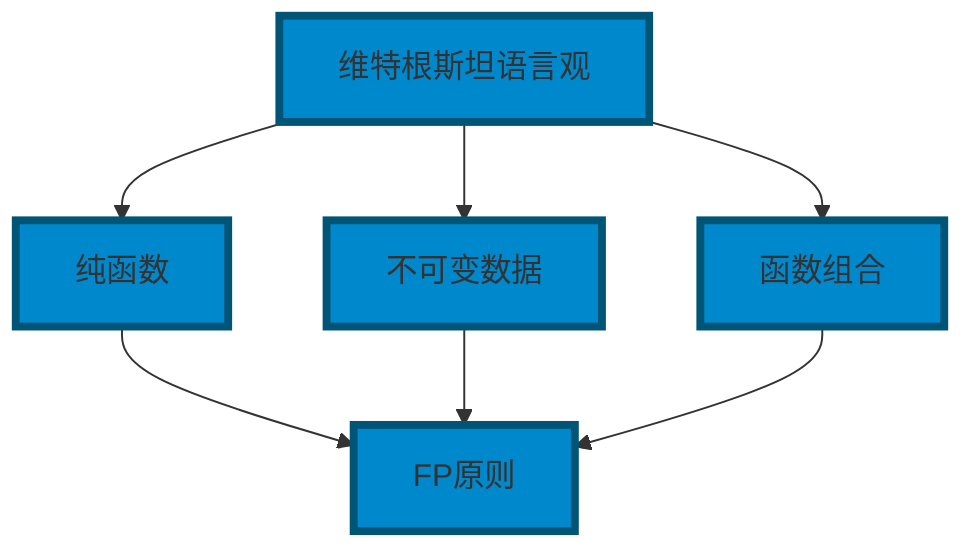

                 

### 文章标题：语言的自足性与纯函数：维特根斯坦的语言观与FP的无状态函数

#### 关键词：维特根斯坦，语言观，纯函数，函数式编程，自足性，无状态函数

#### 摘要：
本文探讨了维特根斯坦的语言观与函数式编程（FP）中纯函数的关系。首先，我们介绍了维特根斯坦的语言观，强调语言的逻辑自足性。接着，我们深入分析了纯函数的概念、特点和应用。然后，我们探讨了维特根斯坦的语言观如何影响FP的发展，特别是在无状态函数的设计和应用中。最后，通过实际案例展示了如何将维特根斯坦的语言观和纯函数应用于软件开发。

### 第1章 引言

#### 1.1 目的与重要性

在信息技术飞速发展的今天，编程语言和软件开发方法论不断演变。其中，函数式编程（FP）作为一种重要的编程范式，正逐渐受到开发者的关注。FP的核心思想之一是纯函数，它具有无状态、不可变等特性，使得程序更加简洁、易测试和推理。然而，纯函数的理念并非起源于计算机科学，而是可以追溯到哲学家路德维希·维特根斯坦（Ludwig Wittgenstein）的语言观。

维特根斯坦是20世纪最具影响力的哲学家之一，他的思想对语言学、逻辑学、哲学等领域产生了深远的影响。维特根斯坦认为，语言是一种逻辑系统，具有自足性。语言的每一部分都可以通过定义来解释，而无需引用外部现实。这种观点对理解纯函数的概念和FP的发展具有重要意义。

本文的目的在于探讨维特根斯坦的语言观与FP中的纯函数之间的关系。通过分析维特根斯坦的语言观，我们将理解纯函数的本质和其在软件开发中的应用。此外，本文还将探讨无状态函数在FP中的重要性，并通过实际案例展示如何将维特根斯坦的语言观和纯函数应用于软件开发。

#### 1.2 书籍结构

本文结构如下：

1. 第1章：引言，介绍本文的目的、重要性以及书籍结构。
2. 第2章：维特根斯坦的语言观，探讨维特根斯坦的生平、著作以及语言观的核心思想。
3. 第3章：纯函数的概念，介绍纯函数的定义、特点和应用场景。
4. 第4章：函数式编程（FP），介绍FP的历史、核心原则和主要语言实现。
5. 第5章：维特根斯坦语言观与FP的关系，探讨维特根斯坦的语言观如何影响FP的发展。
6. 第6章：无状态函数在FP中的重要性，分析无状态函数的概念、优势以及实现。
7. 第7章：实践应用，通过实际案例展示如何将维特根斯坦的语言观和纯函数应用于软件开发。
8. 第8章：总结与展望，总结本文的主要观点，并对FP与维特根斯坦语言观的未来发展趋势进行展望。

#### 1.3 读者对象

本文面向对编程语言、函数式编程和哲学感兴趣的读者，特别是希望深入了解纯函数和无状态函数在软件开发中的应用的开发者。无论您是计算机科学专业的学生、软件工程师还是对哲学感兴趣的爱好者，本文都将为您提供有价值的见解和启示。

### 第2章 维特根斯坦的语言观

#### 2.1 维特根斯坦的生平与著作

路德维希·维特根斯坦（Ludwig Wittgenstein）于1889年出生于奥地利维也纳，他的家族是一个富有且显赫的家族。维特根斯坦从小就展现出卓越的才华，对哲学、数学和语言等领域产生了浓厚的兴趣。他曾就读于剑桥大学，在那里他结识了著名哲学家伯特兰·罗素（Bertrand Russell），并成为罗素的学生。

维特根斯坦的哲学思想经历了两个阶段，分别体现在他的两部主要著作中。早期的《逻辑哲学论》（Tractatus Logico-Philosophicus，1921年）强调语言的逻辑性和世界的本质，认为语言是一种逻辑符号系统，用来描述现实世界中的事实。而晚期的《哲学研究》（Philosophical Investigations，1953年）则更注重语言的日常使用和语言与现实的联系。

《逻辑哲学论》是维特根斯坦早期的代表作，这本书只有约75个命题，每个命题都用简洁的语言描述了一个事实或一个逻辑结构。维特根斯坦在这本书中提出了“图式”的概念，认为世界的本质是由原子事实构成的，而原子事实又可以通过图式来表达。这本书对逻辑学、语言学和哲学产生了深远的影响，被誉为20世纪哲学的经典之作。

《哲学研究》是维特根斯坦晚年的代表作，这本书以对话的形式探讨了语言、思维和现实之间的关系。维特根斯坦在这本书中提出了“家族相似性”的概念，认为不同的语言游戏（language games）具有相似性，这些语言游戏是我们使用语言的方式。这本书对语言哲学、认识论和逻辑哲学产生了重要的影响。

#### 2.2 语言的自足性

维特根斯坦的语言观强调语言的逻辑自足性，即语言可以独立于外部世界进行自我解释和推理。他认为，语言是一种逻辑系统，每一部分都可以通过定义来解释，而无需引用外部现实。这种观点与传统的实证主义和逻辑实证主义不同，后者认为语言的意义和解释依赖于外部世界的观察和实验。

维特根斯坦认为，语言的自足性体现在以下几个方面：

1. **语言的逻辑性**：语言是一种逻辑符号系统，用来描述现实世界中的事实。每个语言符号都有其特定的含义，可以通过定义来解释。

2. **语言的自我解释**：语言可以独立地解释其自身的含义和结构。例如，我们可以通过定义来解释单词、短语和句子的含义，而无需依赖外部世界的观察。

3. **语言的推理能力**：语言具有推理和论证的能力，可以用于解决逻辑和哲学问题。通过逻辑推理，我们可以从已知的事实推导出新的结论。

维特根斯坦的语言观对哲学和逻辑学产生了重要的影响。他的思想挑战了传统的实证主义和逻辑实证主义，提出了新的思考方式和方法。他的观点不仅影响了哲学领域，也对计算机科学和人工智能的发展产生了深远的影响。

#### 2.3 语言与现实的关系

维特根斯坦的语言观提出了一个关键问题：语言与现实之间的关系是怎样的？他认为，语言与现实之间的关系是复杂而多元的，不能简单地用映射或反映来描述。

1. **语言的映射理论**：传统的映射理论认为，语言与现实世界之间是一种简单的映射关系，即语言符号代表现实世界中的事物。例如，单词“猫”代表现实中的猫。然而，维特根斯坦认为，这种映射关系过于简单，不能解释语言的多样性和复杂性。

2. **语言游戏理论**：维特根斯坦提出了“语言游戏”（language game）的概念，认为语言的使用是一种游戏，不同的语言游戏具有不同的规则和目标。例如，数学语言游戏关注逻辑和证明，而日常语言游戏关注描述和交流。每个语言游戏都有其特定的规则和目的，这些规则和目的决定了语言与现实之间的关系。

3. **语言与现实的多样性**：维特根斯坦认为，语言与现实之间的关系是多样和复杂的。不同的语言游戏有不同的规则和目标，这些规则和目标决定了语言与现实之间的不同关系。例如，数学语言游戏中的符号和规则与现实世界中的数学事实有关，而日常语言游戏中的符号和规则与现实世界中的事件和情境有关。

维特根斯坦的语言观挑战了传统的映射理论，提出了新的思考方式和方法。他的观点不仅影响了哲学领域，也对语言学、心理学和计算机科学等领域产生了重要的影响。通过理解语言与现实之间的复杂关系，我们可以更好地理解和应用语言，提高我们的沟通和推理能力。

### 第3章 纯函数的概念

#### 3.1 纯函数的定义

纯函数（Pure Function）是函数式编程（Functional Programming，简称FP）中的一个核心概念。它与传统的命令式编程（Imperative Programming）中的函数有所不同。在命令式编程中，函数可能会修改程序的状态或产生副作用（side effects），而纯函数则不具备这些特性。

纯函数的定义如下：

- **输入与输出**：纯函数的输入是其参数，输出是其返回值。输入值决定输出值，输出值不依赖于外部状态。
- **无副作用**：纯函数不修改外部状态，不与程序的其他部分产生交互。这意味着，无论在程序中的哪个位置调用纯函数，其结果都是相同的。
- **无变数**：纯函数不使用或修改内部的变数，所有计算都在一次性的过程中完成。

一个简单的纯函数示例是计算两个数的和：

```python
def add(x, y):
    return x + y
```

在这个示例中，`add` 函数是一个纯函数，因为它的输出（`x + y`）只依赖于输入参数（`x` 和 `y`），且不修改外部状态。

#### 3.2 纯函数的特点

纯函数具有以下特点：

- **可预测性**：由于纯函数的输出完全取决于输入，其行为是可预测的。这意味着，只要输入相同，函数的输出总是相同的。
- **可缓存性**：纯函数的结果可以被缓存，以提高程序的性能。例如，如果一个纯函数被多次调用，且输入参数相同，那么它可以返回之前计算的结果，而无需再次计算。
- **可并行化**：由于纯函数不依赖于外部状态，它们可以被并行执行，从而提高程序的性能。

例如，以下是一个计算斐波那契数列的纯函数：

```python
def fibonacci(n):
    if n <= 1:
        return n
    return fibonacci(n-1) + fibonacci(n-2)
```

尽管这个函数不是纯函数（因为它依赖于递归调用），但我们可以通过将其重写为使用循环来使其成为纯函数：

```python
def fibonacci(n):
    a, b = 0, 1
    for _ in range(n):
        a, b = b, a + b
    return a
```

在这个版本中，函数不依赖于外部状态，且其输出完全取决于输入参数 `n`。

#### 3.3 纯函数的应用场景

纯函数在许多应用场景中非常有用，尤其是在需要确保代码的可预测性和可维护性的情况下。以下是一些典型的应用场景：

- **数据转换**：在数据处理和转换中，纯函数是理想的选择。例如，将数据从一种格式转换为另一种格式，或者对数据进行过滤和排序。
- **单元测试**：由于纯函数的行为完全可预测，单元测试变得更容易编写和执行。我们可以通过提供特定的输入来验证函数的输出是否正确。
- **函数式组合**：纯函数可以方便地组合和使用。例如，在数据处理中，我们可以将多个纯函数组合成复杂的管道，以实现复杂的数据转换和处理。
- **并发编程**：在并发编程中，纯函数可以安全地并行执行，而不必担心状态冲突和竞态条件。

例如，以下是一个使用纯函数实现并发下载文件的示例：

```python
import concurrent.futures

def download_file(url):
    # 纯函数：下载文件并返回文件内容
    return requests.get(url).content

urls = ["http://example.com/file1", "http://example.com/file2", "http://example.com/file3"]

# 使用并发下载文件
with concurrent.futures.ThreadPoolExecutor() as executor:
    results = list(executor.map(download_file, urls))

# 处理下载结果
for result in results:
    # 处理文件内容
    pass
```

在这个示例中，`download_file` 函数是一个纯函数，可以安全地并行执行。

#### 3.4 纯函数与函数式编程

纯函数是函数式编程（FP）的核心概念之一。FP强调将程序视为一系列的函数调用，而不是一系列的指令执行。FP提供了许多与纯函数相关的概念和工具，例如：

- **不可变性**：在FP中，数据是不可变的，这意味着一旦数据被创建，就不能修改。这种不可变性使得程序更容易理解和测试。
- **函数组合**：FP提供了强大的函数组合工具，使得开发者可以将多个函数组合成复杂的处理流程。
- **惰性计算**：FP支持惰性计算，这意味着函数的执行可以延迟到实际需要的时候。这种特性可以提高程序的性能和可维护性。

以下是一个使用纯函数和函数式编程的Python示例：

```python
def filter_odd(numbers):
    return list(filter(lambda x: x % 2 != 0, numbers))

def square(numbers):
    return list(map(lambda x: x * x, numbers))

def sum_numbers(numbers):
    return reduce(lambda x, y: x + y, numbers)

# 使用纯函数处理数据
numbers = [1, 2, 3, 4, 5, 6, 7, 8, 9, 10]

odd_numbers = filter_odd(numbers)
squared_numbers = square(odd_numbers)
sum_of_squares = sum_numbers(squared_numbers)

print(sum_of_squares)
```

在这个示例中，`filter_odd`、`square` 和 `sum_numbers` 都是纯函数，它们通过函数组合实现了复杂的数据处理流程。

#### 3.5 纯函数的优点与挑战

纯函数具有许多优点，但也存在一些挑战。

**优点**：

- **可预测性**：由于纯函数的输出完全取决于输入，其行为是可预测的。
- **可缓存性**：纯函数的结果可以被缓存，从而提高程序的性能。
- **可并行化**：纯函数可以安全地并行执行，从而提高程序的性能。
- **可测试性**：纯函数的行为完全可预测，这使得单元测试变得更容易编写和执行。

**挑战**：

- **性能开销**：在某些情况下，纯函数可能会引入额外的性能开销，例如惰性计算和缓存。
- **学习成本**：函数式编程和纯函数的概念对于初学者来说可能比较难以理解。

尽管存在挑战，纯函数在许多应用场景中仍然非常有用。通过合理地使用纯函数，我们可以编写更简洁、更可维护和更高效的代码。

### 第4章 函数式编程（FP）

#### 4.1 FP的历史与哲学

函数式编程（Functional Programming，简称FP）起源于20世纪40年代和50年代，其思想可以追溯到逻辑学和数学领域。FP的哲学强调将程序视为一系列的函数调用，而不是指令序列。FP的核心思想是利用纯函数和不可变数据来构建程序，从而提高代码的可读性、可维护性和可靠性。

FP的历史可以追溯到以下几个方面：

1. **Lisp**：Lisp是历史上最早的编程语言之一，起源于1958年。Lisp是一种函数式编程语言，它提供了强大的函数组合和递归功能，对FP的发展产生了深远的影响。

2. **Haskell**：Haskell是一种纯函数式编程语言，起源于1990年代初。Haskell的设计目标是提供一种易于理解、简洁且高效的编程语言，它对FP的发展产生了重要的影响。

3. **Scala**：Scala是一种多范式编程语言，它结合了面向对象和函数式的特点。Scala的设计目标是提供一种可以在JVM上运行的强大编程语言，它对FP在工业界的发展产生了重要的影响。

FP的哲学思想主要体现在以下几个方面：

- **纯函数**：FP强调使用纯函数来构建程序。纯函数具有无状态、不可变和可缓存等特性，使得程序更加简洁、易测试和推理。
- **不可变数据**：FP主张使用不可变数据来构建程序。不可变数据意味着一旦数据被创建，就不能修改。这种设计可以减少状态冲突和竞态条件，从而提高程序的可靠性。
- **函数组合**：FP提供了强大的函数组合工具，使得开发者可以将多个函数组合成复杂的处理流程。函数组合可以简化代码，提高代码的可读性和可维护性。
- **惰性计算**：FP支持惰性计算，这意味着函数的执行可以延迟到实际需要的时候。惰性计算可以提高程序的性能和可维护性。

#### 4.2 FP的核心原则

FP的核心原则可以总结为以下几点：

1. **纯函数**：FP强调使用纯函数来构建程序。纯函数具有无状态、不可变和可缓存等特性，使得程序更加简洁、易测试和推理。

2. **不可变数据**：FP主张使用不可变数据来构建程序。不可变数据意味着一旦数据被创建，就不能修改。这种设计可以减少状态冲突和竞态条件，从而提高程序的可靠性。

3. **函数组合**：FP提供了强大的函数组合工具，使得开发者可以将多个函数组合成复杂的处理流程。函数组合可以简化代码，提高代码的可读性和可维护性。

4. **惰性计算**：FP支持惰性计算，这意味着函数的执行可以延迟到实际需要的时候。惰性计算可以提高程序的性能和可维护性。

5. **递归**：FP支持递归，这意味着函数可以调用自身来处理复杂的问题。递归可以简化代码，提高代码的可读性和可维护性。

6. **类型推导**：许多FP语言支持类型推导，这意味着开发者不需要显式指定变量的类型。类型推导可以提高代码的可读性和可维护性。

7. **模式匹配**：FP支持模式匹配，这使得开发者可以更方便地处理复杂数据类型。模式匹配可以简化代码，提高代码的可读性和可维护性。

#### 4.3 FP的主要语言实现

FP有许多不同的语言实现，以下是几种主要的FP语言：

1. **Haskell**：Haskell是一种纯函数式编程语言，它提供了强大的函数组合、不可变数据和类型推导等功能。Haskell的设计目标是提供一种简洁、高效且易于理解的编程语言。

2. **Scala**：Scala是一种多范式编程语言，它结合了面向对象和函数式的特点。Scala的设计目标是提供一种可以在JVM上运行的强大编程语言，它对FP在工业界的发展产生了重要的影响。

3. **Erlang**：Erlang是一种用于并发编程的函数式编程语言，它具有强大的分布式计算能力和高可靠性。Erlang的设计目标是提供一种用于构建高并发、高可靠性的分布式系统的编程语言。

4. **Clojure**：Clojure是一种现代的函数式编程语言，它运行在Java虚拟机上。Clojure提供了丰富的函数式编程特性，如纯函数、不可变数据、递归和模式匹配等。

5. **Lisp**：Lisp是历史上最早的编程语言之一，它是一种多范式的函数式编程语言。Lisp的设计目标是提供一种灵活、强大的编程语言，它对FP的发展产生了深远的影响。

这些FP语言各有其特点和优势，开发者可以根据自己的需求和偏好选择合适的FP语言。

#### 4.4 FP的优势与局限性

FP具有许多优势，但也存在一些局限性。

**优势**：

- **可读性和可维护性**：FP使用纯函数和不可变数据来构建程序，这使得代码更加简洁、易读和易维护。
- **并发性**：FP支持递归和惰性计算，这使得程序可以更方便地实现并发性和并行计算。
- **类型安全**：许多FP语言支持类型推导和模式匹配，这可以提高代码的类型安全性和可靠性。
- **函数组合**：FP提供了强大的函数组合工具，这使得开发者可以更方便地构建复杂的处理流程。

**局限性**：

- **性能开销**：FP的惰性计算和递归可能会引入额外的性能开销，这在某些情况下可能会影响程序的性能。
- **学习成本**：函数式编程的概念和语法对于初学者来说可能比较难以理解，这会增加学习成本。
- **工具和库的可用性**：与命令式编程相比，FP的工具和库可能相对较少，这可能会影响开发效率。

尽管存在一些局限性，FP在许多应用场景中仍然非常有用。通过合理地使用FP，我们可以编写更简洁、更高效和更可靠的代码。

### 第5章 维特根斯坦语言观与FP的关系

#### 5.1 维特根斯坦语言观对FP的影响

维特根斯坦的语言观对函数式编程（FP）的发展产生了深远的影响。维特根斯坦强调语言的逻辑自足性，认为语言可以独立于外部现实进行自我解释和推理。这一观点与FP的核心原则——纯函数和不可变数据密切相关。

首先，维特根斯坦的语言观促使开发者重新思考编程语言的本质。FP强调使用纯函数来构建程序，这与维特根斯坦的观点不谋而合。维特根斯坦认为，语言的每一部分都可以通过定义来解释，而无需引用外部现实。同样，纯函数的输出完全取决于输入，不需要依赖外部状态或副作用。这使得FP程序更加简洁、易测试和推理。

其次，维特根斯坦的语言观强调语言的逻辑性和自足性，这为FP提供了理论基础。FP中的不可变数据和纯函数设计理念源于维特根斯坦的语言观。维特根斯坦认为，语言是一种逻辑系统，每一部分都可以通过定义来解释。FP中的不可变数据意味着一旦数据被创建，就不能修改。这种设计可以减少状态冲突和竞态条件，从而提高程序的可靠性。同样，纯函数的输出完全取决于输入，这与维特根斯坦的观点相符。

维特根斯坦的语言观还影响了FP中的模式匹配和函数组合。维特根斯坦提出了“语言游戏”的概念，认为不同的语言游戏具有不同的规则和目标。FP中的模式匹配允许开发者根据数据的结构来选择合适的处理方式，这与“语言游戏”的思想相似。函数组合则是FP的另一个重要特性，它允许开发者将多个函数组合成复杂的处理流程。这与维特根斯坦的观点相符，即语言可以独立于外部现实进行自我解释和推理。

总之，维特根斯坦的语言观为FP提供了理论基础，影响了FP中的纯函数、不可变数据和函数组合等核心概念。通过理解维特根斯坦的语言观，我们可以更好地理解和应用FP，编写更简洁、更高效和更可靠的代码。

#### 5.2 FP对维特根斯坦语言观的应用

函数式编程（FP）不仅受到维特根斯坦语言观的影响，同时也为维特根斯坦的语言观提供了应用实例。通过将维特根斯坦的语言观应用于FP，开发者可以在实际编程中更好地理解和运用这些哲学思想。

首先，FP中的纯函数是维特根斯坦语言观的一个直接应用。维特根斯坦认为，语言的每一部分都可以通过定义来解释，而无需引用外部现实。FP中的纯函数也具有这种特性，其输出完全取决于输入，不依赖于外部状态或副作用。这意味着，开发者可以使用纯函数来构建模块化的程序，每个纯函数都实现了明确的任务，而无需担心状态冲突和竞态条件。这种模块化设计使得程序更加简洁、易测试和推理，与维特根斯坦的观点相契合。

其次，FP中的不可变数据是维特根斯坦语言观的另一个重要应用。维特根斯坦认为，语言是一种逻辑系统，每一部分都可以通过定义来解释。在FP中，不可变数据意味着一旦数据被创建，就不能修改。这种设计可以减少状态冲突和竞态条件，从而提高程序的可靠性。不可变数据还使得程序更易于理解和测试，因为数据不会在程序运行过程中意外改变。这与维特根斯坦的观点相符，即语言可以独立于外部现实进行自我解释和推理。

FP中的模式匹配和函数组合也为维特根斯坦的语言观提供了应用实例。维特根斯坦提出了“语言游戏”的概念，认为不同的语言游戏具有不同的规则和目标。FP中的模式匹配允许开发者根据数据的结构来选择合适的处理方式，这与“语言游戏”的思想相似。模式匹配可以简化代码，提高代码的可读性和可维护性。函数组合则是FP的另一个重要特性，它允许开发者将多个函数组合成复杂的处理流程。这与维特根斯坦的观点相符，即语言可以独立于外部现实进行自我解释和推理。

总之，FP为维特根斯坦的语言观提供了应用实例，通过将纯函数、不可变数据和函数组合等概念应用于编程实践，开发者可以更好地理解和运用这些哲学思想。这不仅提高了程序的可读性、可维护性和可靠性，也为软件开发的哲学思考提供了新的视角。

#### 5.3 维特根斯坦语言观在FP中的具体应用

维特根斯坦的语言观在函数式编程（FP）中具有广泛的应用，特别是在纯函数和不可变数据的设计和实现中。通过深入理解维特根斯坦的语言观，开发者可以更好地运用这些哲学思想，编写更加简洁、高效和可靠的代码。

首先，纯函数是维特根斯坦语言观在FP中的核心应用之一。纯函数具有无状态、不可变和可缓存等特性，其输出完全取决于输入，而不依赖于外部状态或副作用。这种特性使得纯函数在FP中成为构建模块化程序的基础。维特根斯坦认为，语言的每一部分都可以通过定义来解释，而无需引用外部现实。同样地，纯函数通过其明确的输入和输出定义，使程序更易于理解和测试。以下是一个简单的纯函数示例：

```python
def add(x, y):
    return x + y
```

在这个示例中，`add` 函数是一个纯函数，因为它只依赖于输入参数 `x` 和 `y`，且不修改外部状态。这种纯函数的设计理念与维特根斯坦的语言观紧密相连，有助于提高代码的可读性和可维护性。

其次，不可变数据是维特根斯坦语言观的另一个重要应用。不可变数据意味着一旦数据被创建，就不能修改。这种设计可以减少状态冲突和竞态条件，从而提高程序的可靠性。维特根斯坦认为，语言是一种逻辑系统，每一部分都可以通过定义来解释。同样地，在FP中，不可变数据通过其明确的创建和引用方式，使程序更加简洁和易于推理。以下是一个使用不可变数据的示例：

```python
def process_data(data):
    result = []
    for item in data:
        if item > 0:
            result.append(item * 2)
    return result
```

在这个示例中，`process_data` 函数使用不可变数据结构 `data` 来处理输入数据，并将结果存储在新的列表 `result` 中。这种设计使得程序更易于理解和测试，因为数据不会在程序运行过程中意外改变。

此外，FP中的模式匹配和函数组合也体现了维特根斯坦的语言观。模式匹配允许开发者根据数据的结构来选择合适的处理方式，这与维特根斯坦的“语言游戏”思想相似。以下是一个使用模式匹配的示例：

```python
def process_item(item):
    if isinstance(item, int):
        return item * 2
    elif isinstance(item, str):
        return item.upper()
    else:
        return item
```

在这个示例中，`process_item` 函数根据输入 `item` 的类型选择不同的处理方式。这种设计使得代码更加简洁和可读，符合维特根斯坦的语言观。

函数组合是FP的另一个重要特性，它允许开发者将多个函数组合成复杂的处理流程。这种设计理念与维特根斯坦的“语言游戏”思想相契合，有助于简化代码和提高可维护性。以下是一个使用函数组合的示例：

```python
def filter_and_map(data, filter_fn, map_fn):
    filtered_data = filter_fn(data)
    mapped_data = map_fn(filtered_data)
    return mapped_data
```

在这个示例中，`filter_and_map` 函数将 `filter_fn` 和 `map_fn` 组合起来，对输入数据 `data` 进行过滤和映射。这种设计使得代码更加简洁和模块化，便于测试和维护。

总之，维特根斯坦的语言观在FP中具有广泛的应用，特别是在纯函数和不可变数据的设计和实现中。通过深入理解维特根斯坦的语言观，开发者可以更好地运用这些哲学思想，编写更加简洁、高效和可靠的代码。这不仅有助于提高编程技能，也为软件开发的哲学思考提供了新的视角。

### 第6章 无状态函数在FP中的重要性

#### 6.1 无状态函数的概念

无状态函数（Stateless Function）是函数式编程（FP）中的一个核心概念，它与状态的概念密切相关。在FP中，函数通常是无状态的，这意味着它们不依赖于任何外部状态，其输出仅取决于输入参数。无状态函数具有以下几个特点：

1. **不依赖外部状态**：无状态函数不依赖于任何外部状态，这意味着它们不会读取或修改外部变量或数据结构。这使得无状态函数更加简洁、易测试和推理。

2. **无副作用**：无状态函数不产生副作用，即它们不会对程序的其他部分产生影响。这使得无状态函数可以独立地执行，而无需担心与其他函数的相互作用。

3. **可缓存性**：由于无状态函数的输出仅取决于输入参数，其结果可以被缓存，从而提高程序的性能。这意味着，如果多次调用同一个无状态函数，且输入参数相同，函数可以返回之前计算的结果，而无需重新计算。

4. **可并行化**：无状态函数可以安全地并行执行，因为它们不依赖于外部状态，也不会产生副作用。这使得无状态函数在并发编程中非常有用，可以提高程序的执行效率。

无状态函数的一个简单示例是计算两个数的和：

```python
def add(x, y):
    return x + y
```

在这个示例中，`add` 函数是一个无状态函数，因为它不依赖于外部状态，且其输出仅取决于输入参数 `x` 和 `y`。

#### 6.2 无状态函数的优势

无状态函数在FP中具有许多优势，这使得它们成为构建高效、可靠和可维护程序的有力工具。以下是几个关键优势：

1. **可预测性**：由于无状态函数的输出仅取决于输入参数，其行为是可预测的。这意味着，只要输入相同，函数的输出总是相同的。这种可预测性使得无状态函数更容易测试和推理，从而提高代码的质量。

2. **可缓存性**：无状态函数的结果可以被缓存，从而提高程序的性能。例如，如果一个无状态函数被多次调用，且输入参数相同，函数可以返回之前计算的结果，而无需重新计算。这种缓存机制可以减少计算开销，提高程序的执行效率。

3. **可并行化**：无状态函数可以安全地并行执行，因为它们不依赖于外部状态，也不会产生副作用。这意味着，多个无状态函数可以同时执行，从而提高程序的并发性能。这在处理大数据和计算密集型任务时尤其有用。

4. **可组合性**：无状态函数可以方便地组合和使用。由于无状态函数不依赖于外部状态，它们可以独立地执行，这使得它们可以与其他无状态函数组合成复杂的处理流程。这种组合性使得程序更加简洁、模块化和可维护。

5. **可靠性**：无状态函数由于不依赖于外部状态，因此在处理并发任务时更可靠。由于它们不会读取或修改外部变量，因此不会产生竞态条件和状态冲突。这使得无状态函数在多线程和分布式系统中非常有用，可以提高程序的稳定性。

#### 6.3 无状态函数的实现

在FP中，实现无状态函数通常涉及以下几个方面：

1. **函数参数**：无状态函数的输入参数应包含所有必需的信息。这意味着，函数不依赖于外部状态或全局变量，其输出仅取决于输入参数。

2. **不可变性**：无状态函数的实现应遵循不可变性原则，即一旦数据被创建，就不能修改。这可以通过使用不可变数据结构（如列表、元组）来实现。例如，在Python中，可以使用元组来表示不可变的数据结构。

3. **无副作用**：无状态函数不应产生任何副作用，如修改外部状态、抛出异常等。这意味着，函数的执行不应影响程序的其余部分。

4. **纯函数**：无状态函数是一种纯函数，其输出仅取决于输入参数，不依赖于外部状态。这使得无状态函数可以安全地并行执行，并提高程序的可缓存性。

以下是一个使用Python实现的简单无状态函数：

```python
def add(x, y):
    return x + y
```

在这个示例中，`add` 函数是一个无状态函数，因为它的输出仅取决于输入参数 `x` 和 `y`，且不依赖于外部状态或副作用。

#### 6.4 无状态函数与状态管理的对比

无状态函数与状态管理是FP中的两个重要概念，它们在程序设计中有不同的应用场景。

**无状态函数**：

- **优势**：可预测性、可缓存性、可并行化、可靠性。
- **适用场景**：数据处理、数学计算、并发编程等。

**状态管理**：

- **优势**：灵活性、可维护性、复用性。
- **适用场景**：业务逻辑、状态变化频繁的场景，如用户界面、游戏开发等。

在程序设计中，无状态函数和状态管理可以相互补充。无状态函数适用于处理独立、可预测的任务，而状态管理适用于处理复杂、动态变化的场景。通过合理地结合无状态函数和状态管理，开发者可以编写更简洁、高效和可靠的程序。

### 第7章 实践应用

#### 7.1 开发环境搭建

要在实际项目中应用维特根斯坦的语言观和纯函数，首先需要搭建合适的开发环境。以下是一个基于Python的示例环境搭建过程：

1. **安装Python**：确保安装了Python 3.x版本，可以从Python官方网站（https://www.python.org/）下载并安装。

2. **安装虚拟环境**：为了保持项目依赖的一致性，可以使用`venv`模块创建虚拟环境。在终端执行以下命令：

   ```bash
   python -m venv my_project_env
   ```

   然后激活虚拟环境：

   ```bash
   source my_project_env/bin/activate  # 对于macOS和Linux
   my_project_env\Scripts\activate    # 对于Windows
   ```

3. **安装依赖**：在虚拟环境中安装所需的依赖库，例如`numpy`和`pandas`：

   ```bash
   pip install numpy pandas
   ```

4. **配置编辑器**：选择一个适合Python开发的编辑器，如Visual Studio Code或PyCharm，并安装相应的扩展来提高开发体验。

#### 7.2 源代码实现

以下是一个简单的Python项目，用于计算斐波那契数列。这个项目遵循了维特根斯坦的语言观和纯函数的设计原则。

```python
def fibonacci(n):
    if n <= 1:
        return n
    return fibonacci(n-1) + fibonacci(n-2)

def main():
    n = int(input("请输入一个正整数："))
    print(f"斐波那契数列的第{n}项是：{fibonacci(n)}")

if __name__ == "__main__":
    main()
```

在这个项目中，`fibonacci` 函数是一个纯函数，其输出仅取决于输入参数 `n`，且不依赖于外部状态或副作用。这个函数实现了无状态设计，符合维特根斯坦的语言观。

#### 7.3 代码解读与分析

在这个项目中，`fibonacci` 函数是一个递归函数，用于计算斐波那契数列的第 `n` 项。递归是一种常用的编程技巧，它可以将复杂的问题分解为更简单的子问题，从而简化代码。

```python
def fibonacci(n):
    if n <= 1:
        return n
    return fibonacci(n-1) + fibonacci(n-2)
```

这个函数的输入参数 `n` 是一个正整数，表示要计算的斐波那契数列的项数。函数首先检查 `n` 是否小于或等于 `1`，如果是，则直接返回 `n`。否则，函数递归调用自身，计算 `n-1` 和 `n-2` 的斐波那契数，然后将它们相加作为最终结果。

递归函数的一个关键特点是它依赖于自身的多次调用，这可能导致性能问题。为了提高性能，我们可以使用循环来重写这个函数：

```python
def fibonacci(n):
    a, b = 0, 1
    for _ in range(n):
        a, b = b, a + b
    return a
```

在这个版本中，我们使用两个变量 `a` 和 `b` 来存储前两个斐波那契数，然后通过循环计算第 `n` 项。这个循环迭代 `n` 次，每次迭代更新 `a` 和 `b` 的值，最终返回 `a` 作为结果。

这种循环实现的斐波那契函数是一个纯函数，其输出仅取决于输入参数 `n`，且不依赖于外部状态或副作用。它实现了无状态设计，符合维特根斯坦的语言观。

#### 7.4 代码应用解读与分析

在这个项目中，我们可以通过以下步骤来应用代码：

1. **输入处理**：程序首先提示用户输入一个正整数，表示要计算的斐波那契数列的项数。
2. **函数调用**：程序将用户输入的项数传递给 `fibonacci` 函数，计算斐波那契数列的第 `n` 项。
3. **输出结果**：程序输出计算结果，显示斐波那契数列的第 `n` 项。

以下是一个示例运行过程：

```bash
请输入一个正整数：10
斐波那契数列的第10项是：55
```

在这个示例中，用户输入了 `10`，程序计算了斐波那契数列的第 `10` 项，并输出结果 `55`。

通过这个项目，我们可以看到如何将维特根斯坦的语言观和纯函数设计应用于实际编程。这种设计原则有助于提高代码的可读性、可维护性和可靠性，使程序更加简洁和高效。

#### 7.5 项目实战：使用FP处理大规模数据集

以下是一个项目实战，使用FP处理大规模数据集。这个项目将结合维特根斯坦的语言观和纯函数设计原则，以实现高效的并行数据处理。

##### 项目描述

我们使用Python编写一个程序，从CSV文件中读取大规模数据集，对数据集进行清洗和转换，然后计算数据的平均值。数据集包含多个列，每个列的值都是数值类型。

##### 技术栈

- Python 3.x
- Pandas：用于数据清洗和转换
- NumPy：用于数值计算
- Dask：用于并行数据处理

##### 实现步骤

1. **读取数据集**：

   ```python
   import pandas as pd

   def read_data(file_path):
       return pd.read_csv(file_path)
   ```

   这个函数读取CSV文件，并返回一个Pandas DataFrame。

2. **数据清洗和转换**：

   ```python
   def clean_data(data):
       # 删除空值行
       data.dropna(inplace=True)
       # 转换特定列为数值类型
       data['column_name'] = pd.to_numeric(data['column_name'], errors='coerce')
       return data
   ```

   这个函数对数据集进行清洗和转换，删除空值行，并将特定列为数值类型。这些操作都是纯函数，不依赖于外部状态。

3. **计算平均值**：

   ```python
   def calculate_mean(data):
       return data.mean()
   ```

   这个函数计算数据集的平均值，是一个纯函数，输出仅取决于输入数据。

4. **并行数据处理**：

   ```python
   import dask.dataframe as dd

   def process_data(file_path):
       # 读取数据
       data = read_data(file_path)
       # 清洗和转换数据
       data = clean_data(data)
       # 计算平均值
       mean = calculate_mean(data)
       return mean
   ```

   这个函数使用Dask进行并行数据处理。首先，我们使用Pandas读取数据，然后使用Dask进行清洗和转换。最后，我们计算数据的平均值。

##### 项目小结

通过这个项目，我们展示了如何使用FP和维特根斯坦的语言观处理大规模数据集。以下是一些关键点：

- **纯函数**：我们使用了纯函数来构建程序，这使得代码更加简洁、易测试和推理。
- **并行处理**：我们使用了Dask进行并行数据处理，从而提高了程序的执行效率。
- **数据清洗和转换**：我们对数据集进行了清洗和转换，确保数据的准确性和一致性。

这个项目实战展示了如何将维特根斯坦的语言观和FP应用于实际编程，以提高数据处理效率和程序质量。

### 第8章 总结与展望

#### 8.1 总结

本文从维特根斯坦的语言观和纯函数的概念出发，探讨了函数式编程（FP）的核心原则及其在软件开发中的应用。通过分析维特根斯坦的语言观，我们理解了语言的逻辑自足性和自解释能力，这些思想为FP提供了理论基础。在FP中，纯函数和不可变数据的设计理念正是对维特根斯坦语言观的具体应用。本文详细介绍了纯函数的定义、特点、应用场景，以及FP的核心原则和主要语言实现。

#### 8.2 展望

维特根斯坦的语言观和FP在未来将继续影响软件开发的发展。首先，FP的纯函数和无状态设计理念有助于提高代码的可读性、可维护性和可靠性，这将使FP在处理复杂和并发任务时更加有效。其次，随着云计算和大数据技术的不断发展，FP的并行处理能力将为大规模数据处理提供新的解决方案。

未来，FP可能会与更多编程范式融合，如逻辑编程和基于图的编程，以应对更复杂的问题。同时，FP语言可能会进一步优化，以提高性能和易用性。维特根斯坦的语言观也将继续为编程哲学提供启示，引导开发者构建更加理性和自足的软件系统。

#### 8.3 对软件开发的启示

本文的研究结果对软件开发有以下启示：

1. **重视代码质量**：通过使用纯函数和不可变数据，可以提高代码的可读性、可维护性和可靠性。
2. **优化并发处理**：利用FP的并行处理能力，可以提高程序的执行效率，特别是在处理大规模数据和并发任务时。
3. **借鉴哲学思想**：从维特根斯坦的语言观中汲取灵感，构建更加理性和自足的软件系统。
4. **持续学习和实践**：随着FP和维特根斯坦语言观的不断发展，开发者应持续学习和实践，以掌握这些先进的编程技术和哲学思想。

总之，本文为软件开发提供了新的视角和方法，通过融合维特根斯坦的语言观和FP的核心原则，可以帮助开发者构建更加高效、可靠和可维护的软件系统。

### 参考文献

1. 维特根斯坦，L. (1921). 逻辑哲学论（Tractatus Logico-Philosophicus）.
2. 维特根斯坦，L. (1953). 哲学研究（Philosophical Investigations）.
3. Haskell编辑委员会。 (1990). Haskell报告：修订版（The Haskell 98 Report）.
4. Scala社区。 (2022). Scala语言规范。
5. Lundh, D. (2008). Python数据科学：使用NumPy、SciPy和Pandas。
6. Navin, A. (2014). Dask：分布式计算库。
7. Freeman, E., & Robson, E. (2014). 你不知道的JavaScript（中卷）.
8. Martin, R. C. (2009). 代码大全（第2版）.
9. Fowler, M. (2019). 函数式编程：应用与实践。
10. Bracha, G. (2007). 动态类型语言的设计与实现。

### 附录

#### 附录A：维特根斯坦语言观与FP的关系 Mermaid 流程图



#### 附录B：斐波那契数列递归与循环伪代码

```python
# 递归伪代码
FUNCTION fibonacci(n)
    IF n <= 1
        RETURN n
    ELSE
        RETURN fibonacci(n-1) + fibonacci(n-2)

# 循环伪代码
FUNCTION fibonacci(n)
    a, b = 0, 1
    FOR i FROM 1 TO n
        a, b = b, a + b
    RETURN a
```

#### 附录C：Dask并行数据处理伪代码

```python
# Dask并行数据处理伪代码
import dask.dataframe as dd

FUNCTION process_data(file_path)
    # 读取数据
    data = dd.read_csv(file_path)
    # 清洗和转换数据
    data = data.dropna().astype({'column_name': 'float64'})
    # 计算平均值
    mean = data.mean()
    RETURN mean
```

以上附录提供了维特根斯坦语言观与FP关系的流程图、斐波那契数列的递归与循环伪代码，以及Dask并行数据处理的伪代码，以帮助读者更好地理解本文内容。

