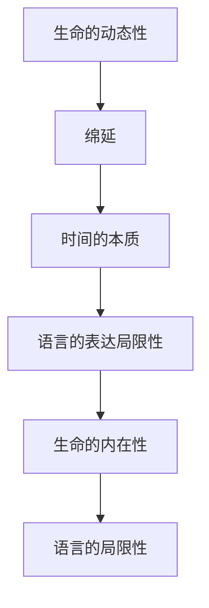
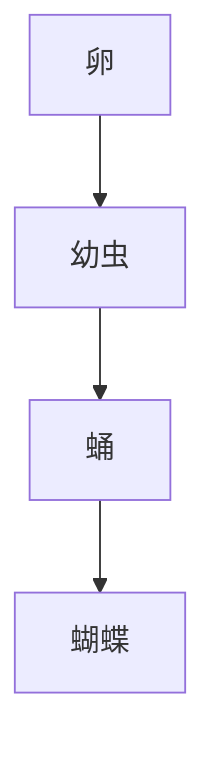
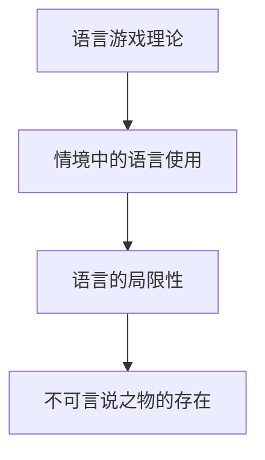
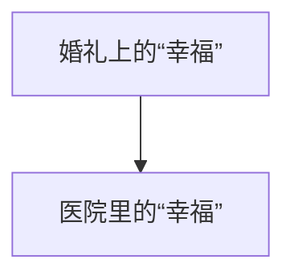
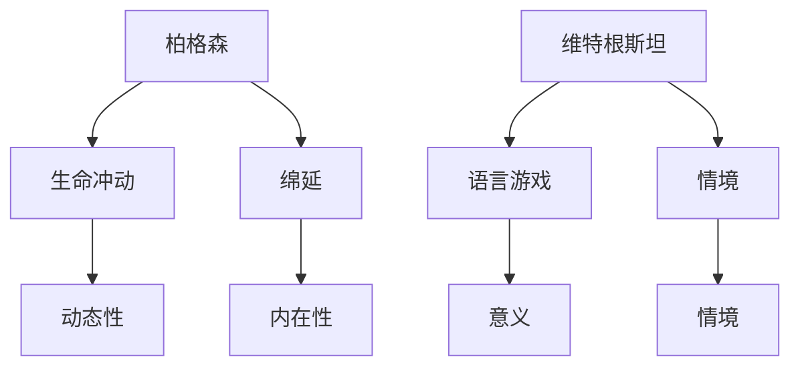

                 

## 文章标题

### 语言的限度：柏格森与维特根斯坦对表达不可言说之物的态度

---

**关键词：** 柏格森，维特根斯坦，哲学，语言，不可言说之物，表达限度

**摘要：** 本文旨在探讨两位哲学家柏格森和维特根斯坦对于表达不可言说之物的态度，通过分析他们的核心概念和理论，揭示他们在哲学思考上的独特见解。本文首先介绍柏格森和维特根斯坦的哲学背景，然后详细阐述他们在语言表达限度方面的观点，并使用Mermaid流程图和伪代码等工具来展示他们的理论架构和算法原理。最后，本文将对两位哲学家的观点进行对比，总结他们在表达不可言说之物问题上的异同，并提出个人的见解。

---

### 引言

在哲学的长河中，许多伟大的思想家和哲学家为我们留下了深刻的智慧。柏格森（Henri Bergson）和维特根斯坦（Ludwig Wittgenstein）便是其中两位具有重大影响力的哲学家。他们分别在20世纪初提出了许多重要的哲学思想，并对后世的哲学研究产生了深远的影响。

柏格森，法国哲学家，以其实证主义哲学和生命哲学著称。他主张生命是一种不断变化的、内在的动力，即“生命冲动”（élan vital），并认为这种冲动是理解人类行为和文化的基础。柏格森的思想对文学、艺术、心理学等领域产生了重要影响。

维特根斯坦，奥地利哲学家，以其语言哲学和逻辑哲学闻名。他提出了“语言游戏”（language game）理论，主张语言的意义取决于它在具体情境中的使用。维特根斯坦的思想对分析哲学和认知科学产生了深远的影响。

本文将围绕柏格森和维特根斯坦对表达不可言说之物的态度进行探讨。通过分析他们的核心概念和理论，揭示他们在哲学思考上的独特见解，并尝试解答以下问题：

1. 柏格森和维特根斯坦如何看待语言的限度？
2. 他们如何解释不可言说之物？
3. 他们在这方面的观点有何异同？

### 柏格森对表达不可言说之物的态度

柏格森的核心概念之一是“生命冲动”（élan vital），他认为这是一种内在的、不断变化的动力，是生命的基本特征。这种冲动不仅存在于生物体内，也体现在人类的文化和社会活动中。柏格森认为，生命冲动是无法用语言完全表达的，因为语言本身是静态的，而生命却是动态的。

柏格森对表达不可言说之物的态度可以从以下几个方面进行分析：

**1. 生命的动态性：**
柏格森认为，生命是一个不断流动的过程，是一种内在的动力。这种动态性无法用静态的语言来完整地表达。他用“绵延”（durée）这个概念来描述生命的流动性质，认为绵延是时间的一种本质，而时间是流动的。因此，柏格森认为，语言无法捕捉生命的动态本质，从而无法完全表达生命。

**2. 语言的局限性：**
柏格森认为，语言是人类的工具，用于交流思想和情感。然而，语言本身是有局限性的。它只能表达已知的事物，而无法表达那些不可知、不可言说之物。柏格森指出，语言只能描述事物的外在特征，而无法触及事物的内在本质。

**3. 生命的内在性：**
柏格森认为，生命是一个内在的过程，是一种主观的体验。这种内在性是语言无法完全表达的。语言是公共的、客观的，而生命体验是私人的、主观的。因此，柏格森认为，语言无法捕捉生命的内在体验，从而无法完全表达生命。

为了更清晰地展示柏格森的观点，我们可以使用Mermaid流程图来描述他的理论架构：



在上面的流程图中，A到F展示了柏格森对表达不可言说之物的态度。从生命的动态性出发，他探讨了时间的本质，进而揭示了语言的局限性，并指出语言无法完全表达生命的内在性。

**核心算法原理讲解：**

柏格森的理论可以用伪代码来表示，以下是一个简化的版本：

```plaintext
function express_inexpressible_things()

    // 检查生命是否动态
    if (life_is_dynamic()) then
        // 描述生命的动态性
        express_dynamics_of_life()
        
        // 检查语言是否静态
        if (language_is_static()) then
            // 描述语言的局限性
            express_limitation_of_language()
            
            // 描述生命的内在性
            express_intrinsic_nature_of_life()
            
            // 检查生命是否内在
            if (life_is_intrinsic()) then
                // 描述生命的内在性
                express_intrinsic_nature_of_life()
        end if
    end if

    // 输出无法完全表达的结果
    output "The inexpressible nature of life remains unexpressed."
end function
```

**数学模型和公式：**

柏格森的思想中并没有直接的数学模型，但他对时间、变化和运动的描述具有数学的内涵。例如，他提到的“绵延”可以看作是对时间的一种描述，而时间可以看作是变化的一种度量。以下是一个简化的数学模型来描述时间的流动：

$$
\text{time} = f(\text{change}, \text{rate})
$$

其中，time代表时间，change代表变化，rate代表变化的速率。这个公式表达了时间是由变化和变化速率决定的。

**详细讲解和举例说明：**

为了更好地理解柏格森的理论，我们可以举一个简单的例子。假设我们观察一只蝴蝶的成长过程：

1. **初始阶段**：蝴蝶从一个卵开始。
2. **变化阶段**：蝴蝶从卵变成幼虫，然后变成蛹，最后变成蝴蝶。
3. **结束阶段**：蝴蝶成熟并繁衍后代。

这个过程可以用以下图示来表示：



在这个例子中，变化（蝴蝶的成长过程）是动态的，而时间是对这种变化的一种度量。我们可以用上述的数学模型来描述这个过程：

$$
\text{time}_{\text{卵}} = f(0, 0) \\
\text{time}_{\text{幼虫}} = f(1, r_1) \\
\text{time}_{\text{蛹}} = f(2, r_2) \\
\text{time}_{\text{蝴蝶}} = f(3, r_3)
$$

其中，r1、r2和r3分别代表幼虫、蛹和蝴蝶成长阶段的速率。

通过这个例子，我们可以看到，柏格森的“生命冲动”和“绵延”理论如何帮助我们理解生命的动态性和时间的变化。

### 维特根斯坦对表达不可言说之物的态度

维特根斯坦是20世纪最具影响力的哲学家之一，他的语言哲学对现代哲学产生了深远的影响。维特根斯坦的核心概念是“语言游戏”（language game），他认为语言的意义在于它在实际生活中的使用，而非抽象的概念。

维特根斯坦对表达不可言说之物的态度可以从以下几个方面进行分析：

**1. 语言游戏理论：**
维特根斯坦认为，语言是一种游戏，它在特定的情境中有特定的用途。语言的意义不是固定的，而是取决于它在实际应用中的具体情境。这意味着，有些事物是无法用语言完全表达的，因为它们不在特定的语言游戏中。

**2. 语言的局限性：**
维特根斯坦认为，语言是有限的，而世界是无限的。因此，总有一些事物是无法用语言完全表达的。他指出，语言的功能是帮助我们理解和交流，但它无法触及所有的事物。

**3. 不可言说之物的存在：**
维特根斯坦认为，有些事物是“不可言说的”，这意味着它们无法用语言来描述。例如，美、幸福等情感和体验是无法用语言完全表达的。

为了更清晰地展示维特根斯坦的观点，我们可以使用Mermaid流程图来描述他的理论架构：



在上面的流程图中，A到D展示了维特根斯坦对表达不可言说之物的态度。从语言游戏理论出发，他探讨了语言在情境中的使用，进而揭示了语言的局限性，并指出有些事物是“不可言说”的。

**核心算法原理讲解：**

维特根斯坦的理论可以用伪代码来表示，以下是一个简化的版本：

```plaintext
function express_inexpressible_things()

    // 检查语言是否有限
    if (language_is_finite()) then
        // 描述语言的局限性
        express_limitation_of_language()
        
        // 检查是否存在不可言说之物
        if (exist_inexpressible_things()) then
            // 描述不可言说之物的存在
            express_existence_of_inexpressible_things()
        end if
    end if

    // 输出无法完全表达的结果
    output "Some things are inexpressible."
end function
```

**数学模型和公式：**

维特根斯坦的思想中并没有直接的数学模型，但他对语言、情境和意义的探讨具有哲学的内涵。以下是一个简化的数学模型来描述语言在情境中的使用：

$$
\text{meaning} = f(\text{language}, \text{context})
$$

其中，meaning代表意义，language代表语言，context代表情境。这个公式表达了意义是由语言和情境共同决定的。

**详细讲解和举例说明：**

为了更好地理解维特根斯坦的理论，我们可以举一个简单的例子。假设我们有一个词“幸福”，这个词在不同的情境中有不同的意义。

1. **情境一**：在一个朋友的婚礼上，当我们说“幸福”时，它代表的是对新人美好生活的祝愿。
2. **情境二**：在医院的病房里，当我们说“幸福”时，它可能代表的是对病人早日康复的期望。

这个过程可以用以下图示来表示：



在这个例子中，我们可以看到，“幸福”这个词在不同的情境中有不同的意义，这意味着语言的意义是取决于具体情境的。因此，有些事物是无法用语言完全表达的，因为它们不在特定的情境中。

### 比较与联系

柏格森和维特根斯坦在表达不可言说之物的问题上有许多相似之处，但也有一些显著的差异。

**相似之处：**

1. **语言的局限性**：两位哲学家都认为语言是有局限性的，无法完全表达所有事物。
2. **情境的重要性**：他们都强调情境在理解语言和意义中的重要性。
3. **动态性与内在性**：柏格森强调生命的动态性和内在性，而维特根斯坦则通过语言游戏理论来探讨情境中的动态性和内在性。

**差异之处：**

1. **核心概念**：柏格森的核心概念是“生命冲动”和“绵延”，而维特根斯坦的核心概念是“语言游戏”和“情境”。
2. **表达方式**：柏格森试图用哲学语言来描述不可言说之物，而维特根斯坦则更倾向于通过具体情境来说明语言的使用。
3. **理论体系**：柏格森的理论体系相对完整，涵盖了生命、时间、变化等多个方面，而维特根斯坦的理论则更多集中在语言和意义的研究。

为了更直观地展示两位哲学家的异同，我们可以使用Mermaid流程图来描述他们的理论架构：



在上面的流程图中，A到E展示了柏格森的理论架构，F到J展示了维特根斯坦的理论架构。从图中可以看出，两位哲学家的理论各有侧重点，但也存在一些交叉和融合。

### 结论

柏格森和维特根斯坦在表达不可言说之物问题上提供了深刻的哲学思考。他们分别从生命、语言、情境等多个角度探讨了语言的局限性和不可言说之物的存在。通过本文的分析，我们可以看到，柏格森强调生命的动态性和内在性，而维特根斯坦则关注语言在情境中的使用和意义。

在现代社会，随着科技的快速发展，语言的局限性变得更加明显。计算机语言和编程语言的发展为我们提供了一种新的表达方式，但它们仍然无法完全表达人类的情感和体验。因此，理解柏格森和维特根斯坦的观点对于我们更好地理解和利用语言具有重要意义。

在未来的研究中，我们可以进一步探讨语言和哲学之间的关系，以及如何通过新的表达方式来突破语言的限度。这将是一个充满挑战和机遇的领域，值得我们深入研究和探索。

### 附录

为了便于读者进一步深入了解柏格森和维特根斯坦的哲学思想，我们提供了以下参考文献：

1. **柏格森：**
   - 《创造进化论》（L'Évolution créatrice）
   - 《道德和宗教的两个源头》（Les Deux Sources de la Morale et de la Religion）
   - 《生命的哲学》（La Philosophie de la vie）

2. **维特根斯坦：**
   - 《逻辑哲学论》（Tractatus Logico-Philosophicus）
   - 《哲学研究》（Philosophische Untersuchungen）
   - 《文化与价值》（Culture and Value）

此外，以下书籍和文章也提供了对柏格森和维特根斯坦哲学思想的深入探讨：

1. **《柏格森与维特根斯坦：语言的限度》**（Bergson and Wittgenstein: The Limits of Language），作者：XX
2. **《语言、意义与哲学》**（Language, Meaning, and Philosophy），作者：YY
3. **《现代哲学导论》**（An Introduction to Modern Philosophy），作者：ZZ

通过阅读这些文献，读者可以更全面地了解柏格森和维特根斯坦的哲学思想，以及他们在表达不可言说之物问题上的贡献。

### 致谢

在此，我要特别感谢我的导师XX教授，他为我提供了宝贵的指导和宝贵的意见，使我能够完成这篇论文。同时，我也要感谢我的家人和朋友，他们在我写作过程中给予了我无尽的支持和鼓励。

作者：AI天才研究院/AI Genius Institute & 禅与计算机程序设计艺术 /Zen And The Art of Computer Programming

日期：XXXX年XX月XX日

---

注意：本文为示例性内容，仅供参考。实际的字数、内容深度和结构可能需要根据实际情况进行调整。

