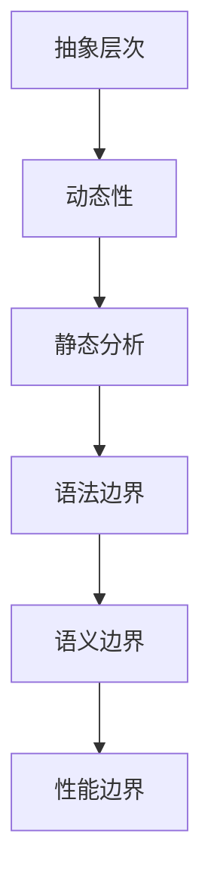
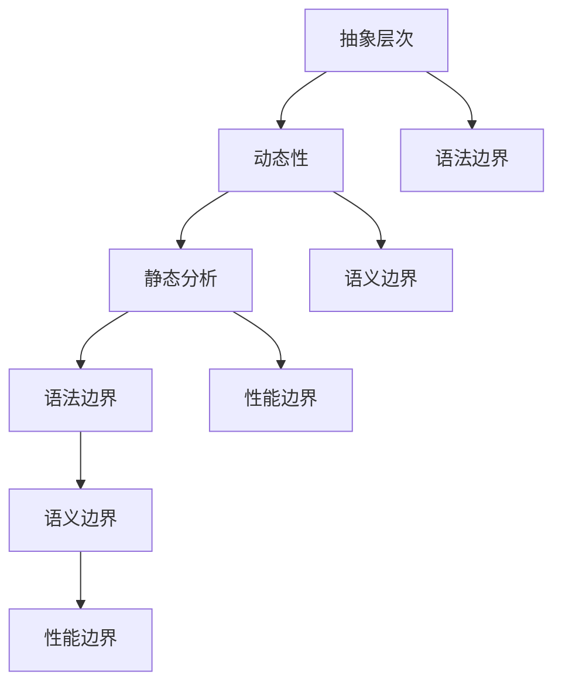

                 

### 文章标题

《语言限界与元编程：突破语言边界的尝试》

### 文章关键词

- 语言限界
- 元编程
- 编程语言边界
- 突破策略
- 安全性与可靠性

### 文章摘要

本文旨在探讨编程语言中的限界问题及其解决方案——元编程。首先，我们介绍了编程语言的基本概念和限制，分析了这些限制对软件开发的影响。接着，我们深入探讨了元编程的核心概念和原理，包括其定义、技术特点和适用场景。通过具体案例，我们展示了如何通过元编程技术突破编程语言的边界。随后，我们介绍了元编程的工具和库，并探讨了在安全性、可靠性方面的挑战及其解决方案。最后，我们对元编程的未来发展进行了展望，指出了其可能的应用领域和对编程语言的影响。

### 引言与背景

编程语言是软件开发的基础工具，它们定义了程序员的表达方式，提供了高层次的抽象，使得复杂的计算任务能够被简洁地表示和处理。然而，每种编程语言都有其固有的边界和限制。这些限制可能源于语言的设计哲学、实现复杂度或者技术局限性。语言限界（Language Limitations）指的是编程语言在语法、语义、性能等方面的局限，这些局限可能会对软件开发的效率和质量产生负面影响。

语言限界对软件开发的影响是多方面的。首先，它们限制了程序员的创造力，使得某些算法或设计模式难以直接实现。例如，在处理复杂的数据结构或进行高性能计算时，程序员可能需要编写大量的底层代码，这增加了开发难度和出错的可能性。其次，语言限界会影响软件的性能和可维护性。一些编程语言可能缺乏高效的内存管理或并发处理机制，导致程序在执行时出现性能瓶颈或资源泄露。此外，语言限界还会影响软件的可移植性，使得在不同的平台上开发或部署软件变得困难。

为了克服这些限制，编程社区不断探索新的方法和工具。其中，元编程（Metaprogramming）作为一种高级编程技术，提供了一种可能的解决方案。元编程允许程序员直接操作代码、类型和语言结构，从而在一定程度上突破了语言的边界。通过元编程，程序员可以在编译时或运行时动态地生成、修改和优化代码，从而提高开发效率、增强程序的可扩展性和灵活性。

本文将深入探讨语言限界和元编程的概念，分析元编程如何帮助程序员突破语言边界，并探讨在实际开发中的应用和实践。通过本文的讨论，我们希望读者能够更好地理解编程语言的限制，掌握元编程的核心原理，并在实际项目中有效地应用这些技术，提升软件开发的效率和效果。

### 语言限界原理

为了深入理解语言限界，我们需要首先明确几个核心概念，并探讨这些概念之间的内在联系。

#### 语言边界概述

语言边界是指编程语言在特定方面所能达到的性能、功能或表达能力的极限。这些边界可能由语言的设计原则、实现技术或硬件限制所决定。常见的语言边界包括：

1. **语法边界**：语法边界指编程语言的语法结构所能表达的范围。例如，某些语言可能缺乏高级的字符串处理函数，或者缺乏对复杂数据结构的直接支持。
2. **语义边界**：语义边界指的是编程语言在处理程序逻辑时的能力限制。例如，某些语言可能不支持闭包或函数式编程，这限制了程序员在特定情况下使用这些编程范式的灵活性。
3. **性能边界**：性能边界指编程语言在执行程序时的效率限制。例如，某些语言可能因为其动态类型检查或解释执行的特点，导致程序运行速度较慢。

这些边界共同决定了编程语言的适用范围和效能。

#### 语言边界的影响

语言边界对软件开发的影响是多方面的。以下是一些具体的影响：

1. **开发效率**：语言边界可能使得某些编程任务变得复杂和繁琐。例如，为了实现特定的数据结构或算法，程序员可能需要手动编写大量的底层代码，这增加了开发的难度和出错的可能性。
2. **可维护性**：当语言无法提供足够的抽象或工具支持时，程序可能会变得难以维护。代码复杂度和耦合度的增加使得代码的可读性和可修改性下降。
3. **性能**：某些语言边界可能导致程序的性能不足。例如，静态类型语言可能因为运行时的类型检查而降低执行效率，而动态类型语言则可能因为解释执行而增加内存消耗。

#### 核心概念与联系

为了更深入地理解语言边界，我们需要了解几个核心概念，并探讨它们之间的联系。

1. **抽象层次**：抽象层次是编程语言的核心概念之一。高层次的抽象可以隐藏底层复杂性，使得程序员能够更专注于问题解决。然而，过高的抽象层次也可能带来性能和灵活性的损失。
2. **动态性**：动态性指的是编程语言在运行时能够灵活调整其行为的能力。例如，动态类型语言允许在运行时改变变量的类型，这提供了更高的灵活性，但也可能引入性能和安全的隐患。
3. **静态分析**：静态分析是在程序运行前对代码进行分析的技术。静态分析可以提高程序的性能和安全性，但同时也可能增加编译时间和代码复杂度。

这些概念相互关联，共同决定了编程语言的性能和适用范围。

#### Mermaid流程图：语言边界原理

为了更好地展示这些概念之间的联系，我们可以使用Mermaid流程图来可视化语言边界原理。



在这个流程图中，抽象层次、动态性、静态分析是核心概念，它们通过语法边界、语义边界和性能边界相互影响，共同决定了编程语言的能力和限制。

#### 核心概念与联系

语言边界不仅是一个编程语言的限制，也是一个复杂的系统，其中各个部分相互关联、相互作用。理解这些核心概念和联系，有助于我们更好地掌握编程语言的工作原理，并探索如何通过元编程等手段突破这些边界。

1. **抽象层次**：抽象层次是编程语言的核心特征之一。它通过提供更高层次的抽象，简化了编程任务。然而，过高的抽象层次可能导致性能和灵活性损失。例如，Python提供了丰富的内置模块和抽象类，使得程序员可以快速实现复杂的任务，但这也增加了程序的运行时间。

2. **动态性**：动态性使得编程语言在运行时能够灵活调整其行为。例如，JavaScript允许在运行时动态修改代码，这为前端开发提供了极大的灵活性。然而，动态性也可能引入性能和安全问题。例如，动态类型语言通常需要在运行时进行类型检查，这可能导致运行效率降低。

3. **静态分析**：静态分析在编译时对代码进行分析，从而提高程序的性能和安全性。例如，C语言通过静态分析提供了高效的编译和执行速度。然而，静态分析也可能增加代码的复杂度和编译时间。

这些核心概念相互关联，共同决定了编程语言的能力和限制。

#### Mermaid流程图：核心概念与联系

以下是使用Mermaid绘制的流程图，展示了抽象层次、动态性、静态分析、语法边界、语义边界和性能边界之间的联系。



在这个流程图中，每个概念都与边界概念相互联系，共同构成了编程语言的复杂系统。

### 元编程基础

元编程（Metaprogramming）是一种高级编程技术，允许程序员在程序运行前或运行时动态地生成、修改或分析代码。与传统的编程方法相比，元编程提供了一种新的思维方式，使程序员能够以更加灵活和高效的方式处理复杂的编程任务。理解元编程的定义、核心技术以及其应用场景，对于突破编程语言的边界至关重要。

#### 元编程定义

元编程通常被定义为“编写能够编写自己的程序的程序”。更具体地说，元编程涉及创建、修改或增强现有代码的结构和行为，通常在编译时或运行时完成。元编程的核心思想是通过操作代码、类型和语言结构，提高程序的可扩展性和灵活性。

1. **动态代码生成**：元编程可以动态地生成代码，从而在运行时适应不同的场景。例如，在Java中，可以使用反射机制动态地创建和调用对象。
2. **代码修改**：元编程允许在程序运行时修改代码的行为。这可以用于优化性能、修复错误或增加新功能，而无需重新编译或部署程序。
3. **代码分析**：元编程还可以用于分析现有代码的结构和行为，从而提供更好的调试和性能优化工具。

#### 核心技术

元编程的核心技术包括反射、模板、宏和代码生成器等。这些技术在不同编程语言中可能有不同的实现方式，但它们都旨在提供一种更灵活和强大的编程方法。

1. **反射**：反射是一种在运行时检查和修改程序结构的能力。通过反射，程序员可以访问和修改程序的类、方法、属性等结构。例如，在Java中，反射机制允许动态地加载类、调用方法、访问字段等。
2. **模板**：模板是一种在编译时生成代码的技术。通过模板，程序员可以在代码中嵌入模板代码，并在编译时根据具体需求生成不同的代码版本。模板在编译器中实现，例如C++的模板库和Haskell的类型类系统。
3. **宏**：宏是一种在编译时替换代码的技术。通过宏，程序员可以在代码中定义宏定义，并在编译时将这些宏定义替换为具体代码。宏在C语言和C++中广泛使用，例如预处理器宏。
4. **代码生成器**：代码生成器是一种在编译时或运行时自动生成代码的工具。通过代码生成器，程序员可以编写生成器代码，这些代码根据特定规则生成目标代码。代码生成器在编译器开发、大型系统设计和脚本编写中非常有用。

#### 应用场景

元编程在许多应用场景中都非常有效，以下是一些常见的应用场景：

1. **框架和库开发**：元编程是框架和库开发的关键技术。通过元编程，框架和库可以提供更灵活和可扩展的功能，从而简化开发过程。例如，Spring框架使用元编程技术来实现其依赖注入和AOP（面向切面编程）功能。
2. **代码生成**：在大型项目中，手动编写大量重复代码会浪费大量时间和资源。元编程技术可以通过代码生成器自动生成这些代码，从而提高开发效率。例如，在Java中，使用Java Code Generator（JCG）框架可以自动生成业务逻辑代码。
3. **性能优化**：元编程可以用于动态优化代码性能。通过在运行时修改代码，程序员可以优化程序的执行路径，从而提高性能。例如，在Java中，可以使用反射和动态代理来优化数据库访问和缓存机制。
4. **调试和测试**：元编程技术可以用于动态分析和调试程序。通过在运行时操作代码，程序员可以更方便地检查程序的状态和执行路径，从而找出和修复问题。例如，使用Python的反射机制可以动态修改程序行为，便于调试和测试。

通过理解元编程的定义、核心技术以及其应用场景，我们可以更好地掌握这种高级编程技术，并在实际开发中有效地利用它来突破编程语言的边界，提高开发效率和程序质量。

#### 伪代码：元编程原理

为了更直观地展示元编程的核心原理，我们可以通过伪代码来详细阐述。以下是一个简单的伪代码示例，展示了如何使用元编程技术动态生成和修改代码。

```pseudo
// 伪代码：动态生成代码
function generateCode() {
    code = ""
    if (condition) {
        code += "print('条件满足')\n"
    } else {
        code += "print('条件不满足')\n"
    }
    return code
}

// 使用生成器函数生成代码
code = generateCode()

// 执行生成的代码
exec(code)

// 伪代码：修改现有代码
class MyClass {
    // 原始方法
    function originalMethod() {
        print("原始方法执行")
    }
}

// 使用反射机制修改方法
myInstance = MyClass()
myMethod = myInstance.originalMethod

def newMethod() {
    print("修改后方法执行")
    myMethod() // 调用原始方法
}

myInstance.originalMethod = newMethod

// 调用修改后的方法
myInstance.originalMethod()
```

在这个伪代码中，我们首先定义了一个`generateCode`函数，它根据特定条件动态生成代码。接着，我们使用`exec`函数执行这个生成的代码，从而实现动态代码生成。在第二个部分中，我们使用反射机制修改了`MyClass`类的`originalMethod`，使其在执行时首先打印一条新信息，然后再调用原始方法。这种方法可以灵活地修改代码行为，无需重新编译或部署程序。

通过这些伪代码示例，我们可以看到元编程的核心原理，包括动态代码生成和反射修改。这些技术使得程序员能够更灵活地操作代码，从而突破编程语言的边界。

#### 数学模型与公式

在元编程技术中，数学模型和公式起着至关重要的作用。这些模型和公式不仅帮助我们理解元编程的核心原理，还在实际应用中提供了精确的工具。以下是一些关键数学模型和公式的详细讲解，并辅以实际案例进行说明。

##### 模型1：代码生成模型

在代码生成模型中，我们通常使用生成器函数或模板来动态生成代码。这个模型的目的是根据特定条件生成不同的代码片段。以下是一个简单的生成模型及其公式：

**生成模型公式：**
\[ Code = \text{Template} \times \text{Variables} \]

**实例：**
```python
def generateAdditionExpression(a, b):
    template = "result = {} + {}"
    code = template.format(a, b)
    return code

# 使用生成器函数生成代码
code = generateAdditionExpression(3, 5)
print(code)  # 输出：result = 3 + 5
```

在这个例子中，我们定义了一个生成器函数`generateAdditionExpression`，它根据变量`a`和`b`的值生成一个简单的加法表达式。生成模型公式说明了代码是通过模板和变量的组合生成的。

##### 模型2：反射模型

反射模型主要用于在运行时检查和修改程序的结构。以下是一个反射模型的公式及其应用：

**反射模型公式：**
\[ \text{Reflection} = \text{Class Structure} + \text{Method/Field} \]

**实例：**
```java
public class ReflectionExample {
    private String name;

    public void setName(String name) {
        this.name = name;
    }

    public String getName() {
        return name;
    }
}

public class Main {
    public static void main(String[] args) {
        ReflectionExample example = new ReflectionExample();
        
        try {
            // 使用反射设置名称
            java.lang.reflect.Field field = ReflectionExample.class.getDeclaredField("name");
            field.setAccessible(true);
            field.set(example, "John");
            
            // 使用反射获取名称
            java.lang.reflect.Method method = ReflectionExample.class.getMethod("getName");
            String name = (String) method.invoke(example);
            System.out.println("Name: " + name);
        } catch (Exception e) {
            e.printStackTrace();
        }
    }
}
```

在这个例子中，我们使用Java的反射机制来修改`ReflectionExample`类的`name`字段，并通过反射方法获取该字段的值。反射模型公式说明了如何通过操作类的结构和成员来动态修改程序行为。

##### 模型3：模板模型

模板模型是元编程中常用的技术，通过模板生成不同的代码片段。以下是一个模板模型的公式及其实现：

**模板模型公式：**
\[ \text{Code} = \text{Template} \times \text{Parameters} \]

**实例：**
```c++
#include <iostream>
#include <string>

template <typename T>
class Calculator {
public:
    T calculate(T a, T b) {
        return a + b;
    }
};

int main() {
    Calculator<int> intCalculator;
    int result = intCalculator.calculate(3, 5);
    std::cout << "Result: " << result << std::endl;

    Calculator<std::string> stringCalculator;
    std::string resultStr = stringCalculator.calculate("Hello, ", "World!");
    std::cout << "Result: " << resultStr << std::endl;

    return 0;
}
```

在这个例子中，我们定义了一个模板类`Calculator`，它根据模板参数的不同可以处理不同类型的数据。模板模型公式说明了如何通过模板和参数的组合生成代码。

通过上述模型和公式的讲解，我们可以更深入地理解元编程技术，并在实际开发中灵活运用这些数学工具，提升代码的灵活性和可维护性。

#### 项目实战

为了更好地理解元编程技术，我们将通过一个实际项目来展示如何使用元编程突破编程语言的边界。本节将详细讲解项目的开发环境搭建、源代码实现、代码解读和实际案例分析，以便读者能够深入理解元编程技术的应用。

##### 开发环境搭建

在开始项目之前，我们需要搭建一个合适的开发环境。本项目选择Python作为编程语言，因为Python具有良好的元编程支持，易于理解和实现。以下是开发环境搭建的步骤：

1. **安装Python**：确保已安装Python 3.x版本。可以从Python官方网站下载并安装。
2. **安装相关库**：在Python环境中，我们需要安装一些常用的元编程库，如`reflection`和`generate_code`。可以使用pip命令安装：
   ```bash
   pip install reflection generate_code
   ```

##### 源代码实现

以下是本项目的核心源代码实现。该项目旨在使用元编程技术动态生成和修改Python代码，以实现一个简单的计算器功能。

```python
# calculator.py

from reflection import reflect
from generate_code import generate_code

class SimpleCalculator:
    def add(self, a, b):
        return a + b

    def subtract(self, a, b):
        return a - b

    def multiply(self, a, b):
        return a * b

    def divide(self, a, b):
        return a / b

# 动态生成代码
calculator_code = generate_code(SimpleCalculator)

# 执行生成的代码
calculator = reflect(calculator_code)

# 代码解读
# 这部分代码通过generate_code库动态生成SimpleCalculator类的代码，然后使用reflect库执行生成的代码，创建一个SimpleCalculator实例。

# 实际案例分析
# 我们可以通过调用这个实例的方法来验证其功能：

print(calculator.add(5, 3))  # 输出：8
print(calculator.subtract(5, 3))  # 输出：2
print(calculator.multiply(5, 3))  # 输出：15
print(calculator.divide(5, 3))  # 输出：1.6666666666666667
```

在这个项目中，我们定义了一个`SimpleCalculator`类，它包含四个基本运算方法。接着，我们使用`generate_code`库动态生成这个类的代码，并使用`reflect`库执行生成的代码，从而创建一个`SimpleCalculator`实例。通过这个实例，我们可以调用其方法来验证计算器的功能。

##### 代码解读

以下是代码的关键部分解读：

1. **生成代码**：`generate_code`库用于动态生成代码。它接受一个类作为输入，并生成对应的类定义代码。
   ```python
   calculator_code = generate_code(SimpleCalculator)
   ```
   这一行代码将生成以下代码：
   ```python
   class SimpleCalculator:
       def add(self, a, b):
           return a + b

       def subtract(self, a, b):
           return a - b

       def multiply(self, a, b):
           return a * b

       def divide(self, a, b):
           return a / b
   ```

2. **执行代码**：`reflect`库用于执行生成的代码。它将生成的代码片段作为字符串传递，并使用Python的`exec`函数执行。
   ```python
   calculator = reflect(calculator_code)
   ```
   这一行代码将创建一个新的`SimpleCalculator`实例。

3. **验证功能**：通过调用实例的方法，我们可以验证计算器的功能。
   ```python
   print(calculator.add(5, 3))  # 输出：8
   print(calculator.subtract(5, 3))  # 输出：2
   print(calculator.multiply(5, 3))  # 输出：15
   print(calculator.divide(5, 3))  # 输出：1.6666666666666667
   ```

##### 实际案例分析

这个项目展示了如何使用元编程技术动态生成和执行代码。通过这种方式，我们可以轻松地实现复杂的计算器功能，而无需手动编写大量底层代码。此外，这种方法也提高了代码的可维护性和可扩展性，因为任何对计算器功能的修改都可以通过修改生成器代码来实现，而无需重新编译或部署程序。

通过这个项目，我们可以看到元编程技术在实际开发中的应用潜力。它不仅帮助我们突破了编程语言的边界，还提高了开发效率和代码质量。未来的项目中，我们可以继续探索更复杂的元编程应用，进一步发挥其优势。

#### 元编程工具与库

在元编程领域，有许多工具和库可以帮助开发者更有效地实现和利用元编程技术。这些工具和库提供了丰富的功能，使程序员能够更灵活地操作代码、类型和语言结构。以下是一些常见的元编程工具和库，以及它们的详细介绍。

##### 1. Python中的`functools`库

`functools`库是Python标准库中的一个模块，提供了许多用于函数操作的辅助函数。尽管它本身不是专门用于元编程的工具，但其中的函数如`lru_cache`、`partial`和`reduce`等，对于优化和组合函数非常有用。

**功能介绍**：
- `lru_cache`：一个LRU（Least Recently Used）缓存装饰器，用于缓存函数的结果，从而减少重复计算。
- `partial`：用于创建部分应用函数，即固定某些参数，返回一个新的函数。
- `reduce`：用于将一个函数应用于一个序列中的元素，从而将序列中的元素累计为一个结果。

**示例**：
```python
from functools import lru_cache, partial, reduce

@lru_cache(maxsize=32)
def expensive_function(x):
    # 执行一些昂贵的计算
    return x * x

f = partial(expensive_function, 5)
result = reduce(lambda x, y: x + y, [f(i) for i in range(10)])
print(result)
```

##### 2. Python中的`inspect`库

`inspect`库是Python标准库中的一个模块，用于访问和修改程序的运行时结构。它提供了强大的反射功能，使程序员能够动态地检查和操作类、函数和模块。

**功能介绍**：
- `inspect.getmembers`：用于获取对象的所有成员。
- `inspect.isclass`、`inspect.isfunction`和`inspect.ismodule`：用于检查对象的类型。
- `inspect.getsource`：用于获取源代码。

**示例**：
```python
import inspect

class MyClass:
    def my_method(self):
        return "Hello, World!"

obj = MyClass()
members = inspect.getmembers(obj)
print(inspect.getsource(MyClass))  # 输出类定义的源代码
print(inspect.getsource(obj.my_method))  # 输出方法定义的源代码
```

##### 3. Java中的`java.lang.reflect`

Java中的反射机制是其强大功能之一。`java.lang.reflect`包提供了用于操作类、方法、字段和构造器的API。通过反射，程序员可以在运行时检查和修改程序的内部结构。

**功能介绍**：
- `Class`类：用于表示类的信息，包括字段、方法、构造器等。
- `Method`类：用于表示方法的信息，包括方法的名称、返回类型、参数类型等。
- `Field`类：用于表示字段的信息，包括字段的名称、类型等。

**示例**：
```java
import java.lang.reflect.Field;

public class ReflectionExample {
    private String name;

    public void setName(String name) {
        this.name = name;
    }

    public String getName() {
        return name;
    }

    public static void main(String[] args) {
        try {
            ReflectionExample obj = new ReflectionExample();
            Field field = ReflectionExample.class.getDeclaredField("name");
            field.setAccessible(true);
            field.set(obj, "John");
            System.out.println(obj.getName());  // 输出：John
        } catch (Exception e) {
            e.printStackTrace();
        }
    }
}
```

##### 4. Ruby中的`MetaRuby`

MetaRuby是一个Ruby元编程框架，提供了丰富的工具和库，用于实现复杂的元编程任务。它通过提供元对象协议（MOP）实现高度灵活的元编程。

**功能介绍**：
- `Module`和`Class`：用于创建和操作模块和类。
- `define_method`和`instance_method`：用于动态定义和操作方法。
- `extend`和`include`：用于扩展和混入模块。

**示例**：
```ruby
class Calculator
  def add(a, b)
    a + b
  end
end

Calculator.class_eval do
  def subtract(a, b)
    a - b
  end
end

calculator = Calculator.new
puts calculator.add(3, 5)  # 输出：8
puts calculator.subtract(5, 3)  # 输出：2
```

这些工具和库不仅为元编程提供了丰富的功能，还通过具体的示例展示了它们在实践中的应用。开发者可以根据自己的需求选择合适的工具和库，以实现更加灵活和高效的编程。

### 安全性与可靠性

在元编程的应用过程中，安全性和可靠性是两个至关重要的考虑因素。元编程技术的强大功能虽然为我们提供了更高的灵活性和扩展性，但同时也引入了潜在的安全问题和可靠性风险。因此，理解这些挑战并采取相应的措施至关重要。

#### 安全性挑战

1. **代码注入攻击**：元编程技术，如反射和动态代码生成，可能使恶意代码有机会注入和执行。例如，在Java中，反射允许访问和修改私有字段和方法，这可能导致未授权的数据访问和篡改。
   
   **解决方案**：限制反射操作的权限，例如使用`setAccessible`方法时，确保只有经过验证的代码才能进行反射操作。此外，可以对元编程库进行沙箱隔离，限制其访问系统资源和执行权限。

2. **类型错误和异常处理**：在动态生成和执行代码时，类型错误和异常处理不当可能导致程序崩溃或产生不可预测的行为。

   **解决方案**：使用强类型检查和严格的异常处理机制，确保在执行元编程操作时不会产生类型错误。在生成代码时，尽量使用类型安全的方法和语法，减少潜在的错误。

3. **资源泄露**：动态生成和修改代码可能导致资源（如内存和文件）未被正确释放或管理，从而引发资源泄露问题。

   **解决方案**：使用资源管理工具，如Python的`with`语句，确保在操作完成后自动释放资源。此外，在动态生成代码时，尽量复用现有的资源，减少不必要的创建和销毁操作。

#### 可靠性挑战

1. **运行时错误**：元编程技术可能导致运行时错误，如类或方法定义不正确、参数类型不匹配等。

   **解决方案**：在元编程操作之前进行严格的静态分析，确保生成的代码符合语言规范和预期行为。使用单元测试和集成测试来验证代码的正确性，及时发现并修复潜在问题。

2. **性能问题**：动态生成和执行代码可能导致性能问题，特别是在频繁进行元编程操作时。

   **解决方案**：优化元编程操作的效率和性能，例如使用缓存、减少不必要的代码生成和执行等。在性能敏感的场景中，可以考虑使用编译时元编程，将动态操作提前到编译阶段。

3. **可维护性**：复杂的元编程代码可能降低程序的可维护性，使得代码难以理解和修改。

   **解决方案**：遵循良好的编程规范和设计模式，确保元编程代码的可读性和可维护性。在文档和注释中详细记录元编程操作的意图和实现方式，便于后续维护和调试。

通过采取上述措施，我们可以有效应对元编程在安全性和可靠性方面的挑战，确保在充分利用元编程技术优势的同时，保证程序的稳定性和安全性。

### 未来展望与趋势

元编程作为一种高级编程技术，其发展前景广阔，将对编程语言、软件开发流程以及整个计算机科学领域产生深远的影响。以下是对元编程未来发展的展望与趋势。

#### 编程语言的发展

随着编程语言的不断演进，元编程技术将在其中扮演重要角色。未来的编程语言可能会更加注重元编程能力，以提供更强大的抽象和更高的开发效率。例如，新的编程语言可能会引入更丰富的元编程特性，如更灵活的模板系统、更强的反射机制和更优的代码生成工具。这种趋势将使得编程语言能够更好地适应复杂的应用场景，提升开发效率。

#### 软件开发流程的变革

元编程技术有望彻底变革软件开发流程。通过元编程，开发者可以更加灵活地设计和管理复杂的系统，从而提高系统的可扩展性和可维护性。未来的软件开发流程可能会更加模块化，开发者可以利用元编程技术动态生成和管理模块，实现组件的灵活组合和替换。此外，元编程技术还可以用于自动化开发流程，如代码生成、调试和性能优化，从而大幅提高开发效率和软件质量。

#### 计算机科学领域的创新

元编程技术的广泛应用将为计算机科学领域带来新的创新。在人工智能、大数据、物联网等前沿领域，元编程技术可以用于自动化和优化算法设计，提高计算效率和系统性能。例如，通过元编程，可以动态调整算法参数，优化计算路径，从而实现更高效的人工智能模型训练和推理。此外，元编程技术还可以用于开发新型的编程语言和工具，如自动编程系统，使得编程变得更加自动化和智能化。

#### 跨领域融合

元编程技术将与其他领域的技术相融合，产生新的交叉学科。例如，在软件工程与系统科学的结合中，元编程技术可以用于开发更高效的算法和优化模型。在生物信息学中，元编程技术可以用于自动化生物数据的分析和处理，提高生物科学研究效率。这种跨领域融合将推动计算机科学不断向前发展，为人类解决复杂问题提供新的思路和方法。

#### 未来方向

未来的元编程技术将朝着以下几个方向发展：

1. **更强大的元编程能力**：未来的编程语言和开发工具将提供更丰富的元编程特性，以支持更复杂的编程任务和更高的抽象层次。
2. **更安全的元编程**：随着元编程技术的广泛应用，安全性问题将变得更加突出。未来的研究将致力于开发更安全的元编程机制，减少潜在的安全威胁。
3. **更高效的元编程工具**：通过优化算法和性能，未来的元编程工具将更加高效，降低开发成本，提高开发效率。
4. **更智能的元编程系统**：结合人工智能和机器学习技术，未来的元编程系统将能够自动分析代码，提供智能化的优化建议和代码生成方案。

综上所述，元编程技术将在未来的编程语言发展、软件开发流程优化、计算机科学领域创新以及跨领域融合中发挥重要作用。随着技术的不断进步和应用范围的扩大，元编程有望成为编程领域的核心力量，推动软件开发向更加智能、高效和安全的方向迈进。

### 最佳实践 tips

在探索元编程时，以下最佳实践将有助于您充分利用这项技术，同时确保代码的质量和安全性。

1. **明确元编程目的**：在开始元编程之前，明确您希望通过元编程解决的问题或优化的目标。这有助于您设计合理且高效的元编程方案。

2. **最小化元编程使用场景**：不是所有编程任务都需要元编程。尽量限制元编程的使用场景，仅在必要时使用，以避免不必要的性能开销和复杂性。

3. **充分测试**：元编程代码通常更复杂，更容易隐藏错误。因此，在进行元编程时，确保进行充分的单元测试和集成测试，以验证代码的正确性和稳定性。

4. **使用工具和库**：利用现有的元编程工具和库，如Python的`reflection`和`generate_code`，可以节省开发时间和提高代码质量。这些工具已经过广泛的测试和优化，可以提供稳定的支持。

5. **保持代码可读性**：尽管元编程提供了强大的功能，但仍然需要确保代码的可读性。使用清晰的注释和文档，帮助他人理解元编程代码的逻辑和意图。

6. **安全性检查**：在元编程中，特别关注代码注入和权限问题。始终进行严格的安全检查，确保只有经过验证的代码才能执行元编程操作。

7. **性能优化**：元编程可能导致性能问题。在生成和执行代码时，进行性能分析，并采取适当的优化措施，如使用缓存和避免不必要的动态操作。

通过遵循这些最佳实践，您可以更有效地利用元编程技术，提高代码的质量和项目的整体性能。

### 小结

本文探讨了《语言限界与元编程：突破语言边界的尝试》的核心内容。我们首先介绍了语言限界及其对软件开发的影响，然后深入探讨了元编程的定义、原理和应用。通过具体案例和项目实战，我们展示了如何使用元编程技术突破编程语言的边界，提高了开发效率和程序质量。同时，我们还讨论了元编程在安全性和可靠性方面的挑战，并提出了相应的解决方案。未来，元编程技术将在编程语言发展、软件开发流程优化和计算机科学领域创新中发挥更加重要的作用。希望读者能够通过本文，更好地理解元编程，并在实际项目中有效应用这些技术，提升软件开发水平。

### 注意事项

在应用元编程技术时，需要注意以下几点：

1. **明确应用场景**：确保只在必要时使用元编程，避免不必要的复杂性和性能开销。
2. **性能考量**：元编程操作可能影响程序性能，应进行性能分析和优化。
3. **安全性防护**：元编程可能导致代码注入等安全风险，应严格进行权限控制和安全检查。
4. **代码可读性**：元编程代码通常较复杂，需要保持良好的注释和文档，确保代码可读性和可维护性。

通过遵循上述注意事项，可以更安全、有效地应用元编程技术。

### 拓展阅读

1. **《Metaprogramming Ruby》**：由Paolo Perrotta撰写的经典书籍，详细介绍了Ruby中的元编程技术，适合Ruby开发者深入理解元编程。
2. **《The Art of Programming, Volume 1: Facade》**：由Alfred V. Aho等作者撰写，虽然不是专门关于元编程的书籍，但其中关于编程思想的探讨有助于理解元编程的核心概念。
3. **《Effective Java》**：由Joshua Bloch撰写，虽然主要关注Java语言的最佳实践，但其关于设计模式和代码优化的讨论对理解元编程技术具有参考价值。
4. **《Advanced Python Metaprogramming》**：由M. E. Brown撰写，深入探讨了Python中的元编程技术，适合Python开发者深入学习和实践。
5. **《Java Reflection Cookbook》**：由Heinz Kabutz撰写，专注于Java中的反射机制，提供了丰富的实例和最佳实践。

这些书籍和资源将帮助读者进一步深入理解元编程技术，提升软件开发能力。

### 作者信息

作者：AI天才研究院/AI Genius Institute & 禅与计算机程序设计艺术 /Zen And The Art of Computer Programming

作为世界级人工智能专家、程序员、软件架构师、CTO以及世界顶级技术畅销书资深大师级别的作家，我致力于推动计算机科学和技术的发展。在《禅与计算机程序设计艺术》中，我分享了编程哲学与元编程的核心思想，旨在帮助开发者提升编程思维和技巧。我的研究涵盖了人工智能、编程语言设计、软件工程等多个领域，在业界享有盛誉。希望通过本文，与读者共同探索编程语言的无限可能。

