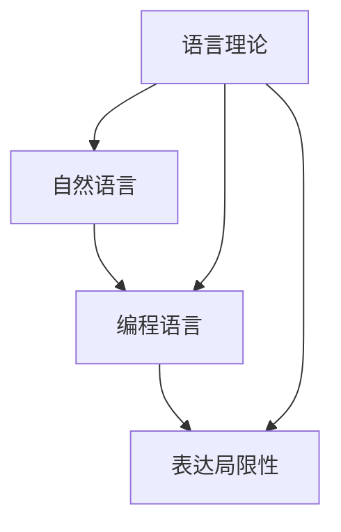
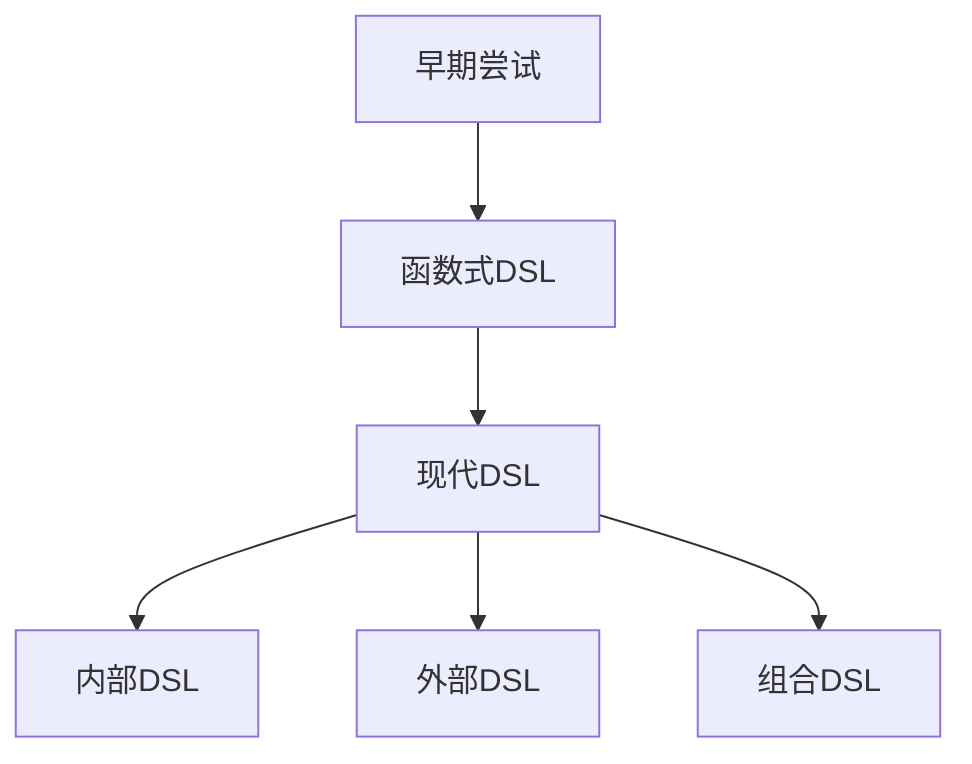
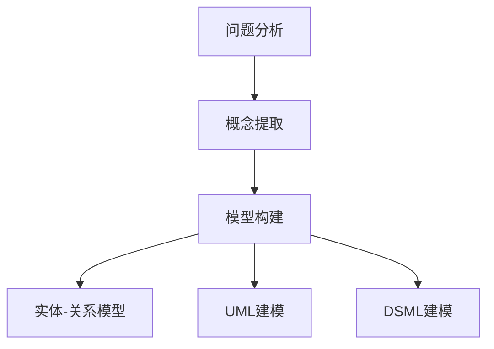
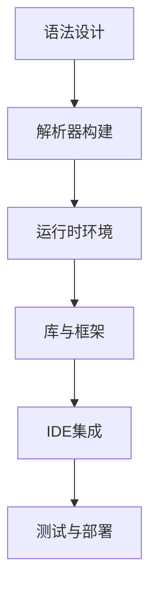
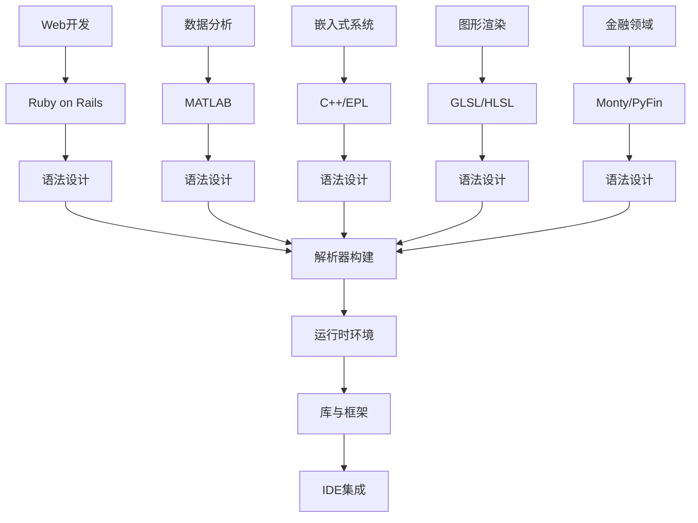

                 

### 文章标题

《语言限界与领域特定语言：突破表达局限性的尝试》

### 文章关键词

- 语言限界
- 领域特定语言
- 表达局限性
- 技术创新
- 编程语言设计

### 文章摘要

本文旨在探讨编程语言中的语言限界问题，以及如何通过领域特定语言（DSL）来突破这些局限性。文章首先介绍了语言表达的局限性，探讨了自然语言和编程语言在表达上的边界。接着，深入讲解了领域特定语言的概念、设计原则和应用场景，通过具体的实例展示了DSL在提升代码可读性和效率方面的优势。文章还分析了领域特定语言面临的挑战，展望了其未来的发展趋势，并提出了若干最佳实践和注意事项。

### 引言

在计算机科学和技术领域，编程语言作为人与计算机之间的交流工具，具有至关重要的地位。然而，无论是自然语言还是现有的通用编程语言，都在表达上存在一定的局限性。这些局限性不仅影响了代码的可读性，还制约了编程效率和开发速度。为了解决这一问题，领域特定语言（Domain-Specific Language，DSL）应运而生。DSL旨在针对特定领域的需求，设计出更为简洁、高效的语言，从而突破传统编程语言的局限性。

本文将首先介绍语言表达的局限性，阐述自然语言和编程语言在表达上的障碍。接着，我们会详细探讨领域特定语言的概念、历史背景以及设计原则。随后，通过具体实例分析领域特定语言在开发中的应用，探讨其优势和挑战。最后，我们将展望领域特定语言的未来趋势，并总结全文，提出若干最佳实践和建议。

### 语言表达的局限性

#### 自然语言的局限

自然语言是人类日常交流的基础，其灵活性和多样性使其在表达复杂思想方面具有独特优势。然而，自然语言在表达精确性、形式化程度和执行能力方面存在显著局限性。

首先，自然语言的表达容易产生歧义。人们在交流过程中常常依赖上下文来消除歧义，但在编程语言中，这种上下文依赖是不可取的。编程需要高度的精确性和确定性，任何歧义都可能导致运行错误或逻辑混乱。

其次，自然语言的语法和语义较为复杂。虽然自然语言的表达力强，但这也使得理解和分析自然语言变得更加困难。编程语言需要具备简洁、明确的特点，以便程序员能够高效地编写和维护代码。

此外，自然语言的执行能力有限。自然语言可以作为交流工具，但不能直接执行任务。编程语言则需具备执行指令的能力，以实现各种计算和操作。这意味着，在编程语言中，我们需要关注代码的执行效率和性能。

#### 编程语言的局限

现有的通用编程语言（如C、Java、Python等）在处理复杂任务时也存在一定的局限性。

首先，通用编程语言的设计目标是为了满足广泛的编程需求，因此在特定领域可能会显得笨重和冗余。例如，一个用于Web开发的通用编程语言，在处理图形渲染或数值计算时，可能不如专门设计的领域特定语言高效。

其次，通用编程语言缺乏领域特定概念的表达能力。编程语言提供了丰富的语法和库函数，但这些往往无法直接反映特定领域的专业知识和模型。例如，金融领域的量化交易算法，在通用编程语言中实现时，可能需要大量的转换和适配，而在一个专门为金融领域设计的DSL中，这些操作可以更加自然和直观地表达。

此外，通用编程语言的可读性和维护性也是一个问题。随着项目规模的扩大和复杂性的增加，通用编程语言的代码库变得难以管理和维护。而领域特定语言则可以通过简化和抽象，提高代码的可读性和可维护性。

#### 语言理论回顾

语言理论是研究语言结构、语法和语义的学科，为理解语言限界提供了理论基础。乔姆斯基（Noam Chomsky）提出的转换生成语法（TG）和巴柯斯-诺尔范式（BNF）是语言理论中的两个重要概念。

转换生成语法（TG）将语言分为四个层次：词汇、语法、语义和语音。词汇层定义了语言的词汇和符号，语法层定义了词汇的组合规则，语义层定义了语法结构的含义，语音层定义了语言的发音和语音特征。TG提供了对语言结构的系统描述，使我们能够理解不同语言层次的相互关系。

巴柯斯-诺尔范式（BNF）是一种描述形式语言的方法，通过产生式规则来定义语言的语法结构。BNF将语法规则分为产生式和终结符，产生式用于描述符号的组合方式，终结符表示语言的基本单位。BNF在编程语言设计和编译器开发中有着广泛的应用，为语言的设计和实现提供了理论支持。

#### 语言理论与表达局限性的关系

语言理论为理解语言限界提供了深刻的洞察。从语言理论的视角来看，自然语言和编程语言在表达上的局限性源于其结构的不同。

自然语言的结构较为复杂，其语法和语义依赖于上下文和语境。这使得自然语言在表达精确性和形式化程度方面存在局限。编程语言则强调简洁、明确的结构，通过严格的语法和语义规则，实现代码的高效执行。

编程语言的局限性可以追溯到其形式化程度不足。通用编程语言虽然提供了丰富的语法和库函数，但在特定领域的表达上往往不够直观和高效。领域特定语言（DSL）通过简化语法、引入领域特定概念，提高了语言的形式化和专业化程度，从而突破了通用编程语言的局限。

#### Mermaid流程图

为了更直观地展示语言理论与表达局限性的关系，我们可以使用Mermaid流程图来描述。



在这个流程图中，自然语言和编程语言都受到语言理论的指导，但它们的结构差异导致了不同的表达局限性。语言理论为我们理解这些局限性提供了基础，而DSL则试图通过优化语言结构来克服这些局限。

### 领域特定语言的概念与历史

#### 领域特定语言的定义

领域特定语言（Domain-Specific Language，DSL）是一种为特定领域设计的编程语言，它专注于特定应用场景，通过引入领域特定概念和语法，提高代码的可读性和开发效率。DSL与通用编程语言（如C、Java、Python等）不同，后者旨在满足广泛的编程需求，而DSL则专注于特定领域的专业需求。

DSL具有以下特点：

1. **特定领域性**：DSL针对特定领域的专业需求进行设计，能够更好地反映领域内的概念和模型。
2. **简洁性**：DSL通过简化语法和引入领域特定概念，使代码更加简洁易读。
3. **高效率**：DSL在特定领域内能够提供更高的开发效率和性能。
4. **可扩展性**：DSL易于扩展和定制，以适应不断变化的需求。

#### 领域特定语言的发展历程

领域特定语言的发展可以追溯到20世纪60年代。当时，计算机科学家开始意识到通用编程语言在特定领域中的局限性，并开始尝试设计专门用于特定领域的语言。

1. **早期尝试**：最早的DSL之一是1960年代的“表处理语言”（Table Processing Language，TPL），它用于处理数据表格，是SQL的前身。此外，ALGOL W是一种专门用于写操作系统和汇编器的语言。
2. **函数式DSL**：20世纪80年代，函数式编程语言如Lisp和Haskell的出现，推动了函数式DSL的发展。这些语言通过提供强大的抽象和组合能力，使得DSL设计更加灵活和高效。
3. **现代DSL**：随着编程语言理论和编译技术的发展，现代DSL逐渐成熟。例如，Rails用于Web开发的Ruby on Rails，SQL用于数据库查询的SQL，以及数学领域的MATLAB等，都是典型的现代DSL。

#### 领域特定语言的分类

领域特定语言可以根据其设计目标和应用领域进行分类：

1. **内部DSL**（Internal DSL）：内部DSL是嵌入在通用编程语言中的特定领域语言，通过宏、模板等技术实现。内部DSL具有较高的灵活性和可扩展性，但可能受到宿主语言的一些限制。
2. **外部DSL**（External DSL）：外部DSL是独立的编程语言，专门为特定领域设计。外部DSL通常具有独立的语法和解析器，可以更好地适应特定领域的需求，但实现和维护成本较高。
3. **组合DSL**（Composite DSL）：组合DSL是多个DSL的组合，通过组合不同的DSL来实现更复杂的应用。组合DSL在保持领域特定性的同时，提高了代码的灵活性和可扩展性。

#### Mermaid流程图

为了更直观地展示领域特定语言的发展历程，我们可以使用Mermaid流程图来描述。



在这个流程图中，领域特定语言的发展经历了多个阶段，从早期的简单尝试，到现代的复杂DSL，各种类型的DSL在不同阶段都有其应用和贡献。

### 领域特定语言的设计原则

#### 设计原则概述

领域特定语言（DSL）的设计原则是其成功的关键。DSL的设计原则旨在确保语言能够高效地满足特定领域的需求，同时保持简洁性和可维护性。以下是几个主要的设计原则：

1. **领域专注性**：DSL应专注于特定领域的需求，避免过度通用性。这意味着DSL的语法和功能应该直接反映领域内的概念和模型。
2. **简洁性**：DSL的语法应尽量简洁，减少冗余和复杂性。简洁的语法可以提高代码的可读性和可维护性。
3. **抽象性**：DSL应提供强大的抽象机制，允许用户以高层次的方式描述领域问题。抽象性可以提高代码的灵活性和可扩展性。
4. **可扩展性**：DSL应具备良好的可扩展性，允许用户根据具体需求进行定制和扩展。可扩展性有助于满足不断变化的需求，并保持DSL的长期适用性。
5. **可组合性**：DSL应支持不同DSL之间的组合，以实现更复杂的领域应用。可组合性可以最大化DSL的复用价值。

#### 领域识别与建模

领域识别与建模是DSL设计过程中的关键步骤。领域识别涉及确定DSL的目标领域，理解领域内的关键概念和模型。建模则通过抽象和形式化手段，将领域知识转化为DSL的语法和语义。

1. **领域识别**：领域识别的过程包括以下几个步骤：

   - **问题分析**：通过调查和研究，明确领域内的问题和需求。
   - **概念提取**：从问题分析中提取领域内的核心概念和术语。
   - **模型构建**：构建领域模型，描述领域内的概念及其相互关系。

2. **建模方法**：建模方法的选择取决于DSL的目标领域和需求。以下是一些常用的建模方法：

   - **实体-关系模型**：用于描述领域内的实体及其关系，适用于业务流程和数据管理领域。
   - **统一建模语言（UML）**：通过UML图（如类图、用例图等）描述领域模型，适用于软件设计和系统分析。
   - **领域特定建模语言（DSML）**：专门为特定领域设计的建模语言，可以更直接地反映领域知识。

#### Mermaid流程图

为了更直观地展示领域识别与建模的过程，我们可以使用Mermaid流程图来描述。



在这个流程图中，领域识别与建模的过程分为几个阶段，包括问题分析、概念提取、模型构建，以及使用不同建模方法构建领域模型。通过这些步骤，我们可以有效地识别和建模领域知识，为DSL的设计提供基础。

### 领域特定语言的实现

#### 技术栈选择

领域特定语言的实现需要选择合适的技术栈，以确保语言的高效、灵活和可扩展。技术栈的选择应考虑以下几个方面：

1. **语法设计**：DSL的语法设计应简洁、直观，易于理解和学习。可以使用现有编程语言的语法基础，结合领域特定扩展，以降低学习成本。
2. **解析器构建**：DSL需要一个强大的解析器，用于将输入的代码转换成内部表示。常用的解析器构建工具包括ANTLR、YACC和Bison。
3. **运行时环境**：DSL需要一个运行时环境，用于执行和解释DSL代码。可以选择基于解释器、编译器或混合模型的运行时环境。
4. **库与框架**：DSL应集成常用的库和框架，以提供丰富的功能和工具支持。例如，在Web开发领域，可以使用Rails或Django等框架。
5. **集成开发环境（IDE）**：提供一个强大的IDE可以显著提高DSL的开发效率和用户体验。IDE应支持代码补全、语法高亮、调试和测试等功能。

#### 开发工具与环境

为了实现领域特定语言，需要选择合适的开发工具和构建环境。以下是一些常用的工具和环境：

1. **文本编辑器**：使用文本编辑器编写DSL代码，如Visual Studio Code、Sublime Text或Atom。
2. **解析器构建工具**：ANTLR、YACC和Bison等工具可用于构建DSL的解析器。例如，使用ANTLR可以生成Java或C#的解析器代码。
3. **构建工具**：Maven、Gradle或Gulp等构建工具可用于自动化DSL的构建、测试和部署过程。
4. **版本控制**：使用Git等版本控制工具，管理DSL的代码库和变更历史。
5. **测试框架**：JUnit、TestNG或PyTest等测试框架可用于编写和执行DSL的单元测试和集成测试。

#### 实际案例

为了更好地理解领域特定语言的实现，我们可以通过一个具体的实例来展示。

**案例：金融领域特定语言（Financial DSL）**

假设我们要设计一个用于金融领域特定需求的DSL，如处理投资组合优化问题。以下是该DSL的实现步骤：

1. **语法设计**：
   - 定义基本语法，如变量声明、函数调用和数据类型。
   - 引入领域特定概念，如股票、债券、投资组合等。

2. **解析器构建**：
   - 使用ANTLR构建DSL的解析器，将输入的代码转换成抽象语法树（AST）。
   - 实现解析规则，以识别和解析领域特定语法。

3. **运行时环境**：
   - 开发一个运行时环境，用于执行DSL代码。
   - 实现投资组合优化的算法和模型。

4. **库与框架**：
   - 集成常用的数学库和金融库，如NumPy和Pandas，用于数据处理和计算。
   - 使用Matplotlib进行数据可视化。

5. **IDE集成**：
   - 在IDE中集成DSL的开发和调试功能。
   - 提供代码补全、语法高亮和调试支持。

#### Mermaid流程图

为了展示金融领域特定语言的实现流程，我们可以使用Mermaid流程图。



在这个流程图中，领域特定语言的实现分为多个阶段，包括语法设计、解析器构建、运行时环境、库与框架集成以及IDE集成。通过这些步骤，我们可以构建一个功能强大、易于使用的领域特定语言。

### 领域特定语言的应用场景

#### 应用领域概述

领域特定语言（DSL）在不同的应用领域中具有广泛的应用，以下是一些典型应用场景：

1. **Web开发**：Web开发领域广泛使用DSL，如Ruby on Rails和JAX-RS。这些DSL提供了简洁、高效的语法和丰富的框架功能，使开发者能够快速构建Web应用。
2. **数据分析**：数据分析领域常用MATLAB和R等DSL。这些DSL提供了强大的数学和统计库，使数据科学家能够轻松进行复杂数据分析和建模。
3. **嵌入式系统**：嵌入式系统领域使用如C++和EPL（Event Processing Language）等DSL。这些DSL适用于实时系统和硬件驱动的应用，提供了高效的代码执行和资源管理。
4. **图形渲染**：图形渲染领域常用GLSL（OpenGL Shading Language）和HLSL（High-Level Shading Language）。这些DSL允许开发者编写高效的图形渲染代码，并与图形硬件紧密集成。
5. **金融领域**：金融领域使用如Monty和PyFin等DSL，这些DSL提供了专门的金融模型和算法，使金融工程师能够高效地进行量化交易和风险管理。

#### 具体案例

为了更直观地展示领域特定语言的应用，我们可以通过具体案例来分析。

**案例1：Web开发中的Ruby on Rails**

Ruby on Rails（简称Rails）是一种流行的Web开发DSL。它采用MVC（Model-View-Controller）架构，提供了一系列简洁、直观的语法和工具，使开发者能够快速构建Web应用。

1. **语法设计**：
   - 使用Ruby语言作为宿主语言，结合Rails的特定语法，如`has_many`、`belongs_to`等。
   - 引入Rails模板引擎ERB（Embedded Ruby），使开发者能够轻松编写HTML和Ruby代码的混合文件。

2. **解析器构建**：
   - 使用Ruby语言的内置解析器，结合Rails的扩展库，构建DSL的解析器。

3. **运行时环境**：
   - Rails使用自己的运行时环境，通过Ruby虚拟机（Ruby VM）执行代码。

4. **库与框架**：
   - 集成了Active Record、Action Controller、Active Support等核心库，提供了丰富的功能和工具。

5. **IDE集成**：
   - 支持多种IDE，如Visual Studio Code、Sublime Text等，提供代码补全、语法高亮和调试功能。

**案例2：数据分析中的MATLAB**

MATLAB是一种广泛应用于科学计算和工程仿真的DSL。它提供了强大的数学和统计库，使开发者能够高效地进行复杂数据分析和建模。

1. **语法设计**：
   - 使用MATLAB特有的语法和函数，如`sum`、`mean`、`plot`等。
   - 提供矩阵运算和向量化的编程风格，使复杂运算更加简洁。

2. **解析器构建**：
   - MATLAB内置了自己的解析器和解释器，用于执行MATLAB代码。

3. **运行时环境**：
   - MATLAB运行在MATLAB引擎上，支持多种操作系统。

4. **库与框架**：
   - 提供了丰富的数学库和工具箱，如Statistics Toolbox、Optimization Toolbox等。

5. **IDE集成**：
   - MATLAB自带了MATLAB Desktop，提供代码编辑、调试和可视化功能。

#### Mermaid流程图

为了展示领域特定语言在不同应用领域中的具体应用，我们可以使用Mermaid流程图。



在这个流程图中，领域特定语言在不同应用领域中的具体应用被展示出来，包括语法设计、解析器构建、运行时环境、库与框架集成以及IDE集成。

### 实际案例分析

为了更好地理解领域特定语言（DSL）的实际应用，我们将通过一个具体的项目实战来详细分析其开发过程、源代码实现、代码解读、应用解读与分析以及项目小结。

#### 项目背景

假设我们正在开发一个金融领域的量化交易平台，目标是实现一个能够自动进行股票交易策略回测和优化的领域特定语言（FQL，Financial Query Language）。FQL将提供简洁的语法，以表达金融模型和策略，使得金融工程师能够快速编写和测试交易策略。

#### 开发环境搭建

1. **选择编程语言**：由于我们需要进行复杂的数学计算和数据分析，选择Python作为FQL的实现语言。
2. **安装依赖库**：安装NumPy、Pandas、SciPy等科学计算和数据分析库，以及matplotlib用于数据可视化。
3. **配置代码编辑器**：使用Visual Studio Code作为代码编辑器，并安装相关插件以支持Python开发。

#### 源代码实现

以下是FQL的源代码实现示例：

```python
# FQL解释器入口
def parse_query(query):
    # 分词和语法解析
    tokens = tokenize(query)
    ast = parse(tokens)
    execute(ast)

# 分词器
def tokenize(query):
    return re.findall(r'\w+|\S', query)

# 语法解析器
def parse(tokens):
    # 这里使用递归下降法进行语法解析
    return parse_expression(tokens)

def parse_expression(tokens):
    # 假设一个简单的表达式语法：`SELECT <column> FROM <table> WHERE <condition>`
    column = parse_identifier(tokens)
    table = parse_identifier(tokens)
    condition = parse_condition(tokens)
    return SelectStatement(column, table, condition)

def parse_condition(tokens):
    # 条件表达式，例如：`price > 100`
    operator = parse_operator(tokens)
    value = parse_literal(tokens)
    return Condition(operator, value)

def parse_identifier(tokens):
    # 解析标识符
    return tokens.pop(0)

def parse_operator(tokens):
    # 解析操作符
    return tokens.pop(0)

def parse_literal(tokens):
    # 解析字面量，例如数字、字符串
    return tokens.pop(0)

class SelectStatement:
    def __init__(self, column, table, condition):
        self.column = column
        self.table = table
        self.condition = condition

class Condition:
    def __init__(self, operator, value):
        self.operator = operator
        self.value = value
```

#### 代码解读

1. **FQL解释器**：`parse_query`函数是FQL的解释器入口，它首先进行分词，然后进行语法解析，并最终执行解析结果。
2. **分词器**：`tokenize`函数将输入的查询字符串分割成标识符、操作符和字面量等基本元素。
3. **语法解析器**：`parse`函数使用递归下降法进行语法解析，构建抽象语法树（AST）。
4. **抽象语法树**：`SelectStatement`和`Condition`类表示AST中的节点，用于表示查询语句和条件表达式。
5. **条件表达式**：`parse_condition`函数解析条件表达式，如`price > 100`。

#### 应用解读与分析

1. **查询语句**：通过FQL，我们可以编写如`SELECT price FROM stocks WHERE date > '2023-01-01'`的查询语句，这将在数据库中检索符合条件的股票价格。
2. **数据可视化**：使用matplotlib库，我们可以轻松地将查询结果可视化，如绘制价格走势图。
3. **策略回测**：金融工程师可以使用FQL编写交易策略，并通过回测功能评估其效果。

#### 项目小结

通过FQL项目的实现，我们可以看到领域特定语言在金融领域中的应用优势：

1. **简化和抽象**：FQL提供了简洁的语法，使金融工程师能够专注于业务逻辑，而不是底层实现细节。
2. **高效性**：FQL的语法和解析器设计提高了代码的执行效率。
3. **可维护性**：清晰的语法和抽象的代码结构使FQL易于维护和扩展。

未来，我们可以进一步优化FQL，增加更多功能，如支持时间序列分析和高级交易策略。

### 最佳实践与注意事项

在设计和使用领域特定语言（DSL）时，遵循以下最佳实践和注意事项有助于提高开发效率和代码质量：

#### 最佳实践

1. **明确领域需求**：在开始设计DSL之前，明确DSL的目标领域和需求，确保DSL能够准确反映领域内的专业知识和模型。
2. **简洁性优先**：DSL的语法应简洁直观，避免不必要的复杂性和冗余。简洁的语法可以提高代码的可读性和可维护性。
3. **强大的抽象能力**：DSL应提供强大的抽象机制，允许用户以高层次的方式描述领域问题，从而提高代码的灵活性和可扩展性。
4. **优化解析器性能**：选择合适的解析器构建工具，优化DSL的解析器性能，以提高代码的执行效率。
5. **集成常用库和框架**：DSL应集成常用的库和框架，提供丰富的功能和工具支持，以简化开发过程。

#### 注意事项

1. **避免过度通用**：DSL应专注于特定领域的需求，避免过度通用性，以免导致语法复杂性和性能下降。
2. **可扩展性考虑**：在DSL设计过程中，应充分考虑可扩展性，以便根据需求进行定制和扩展。
3. **性能优化**：针对特定领域的性能需求，进行代码和解析器的优化，确保DSL的高效运行。
4. **文档与示例**：提供详细的文档和示例代码，帮助开发者理解和掌握DSL的使用方法。

### 拓展阅读

1. **《领域驱动设计》（Eric Evans著）**：探讨了领域驱动设计（Domain-Driven Design，DDD）的方法，为DSL的设计和开发提供了理论基础。
2. **《构建领域特定语言》（Simon Støvring著）**：详细介绍了DSL的设计和实现方法，包括语法设计、解析器构建和运行时环境等方面。
3. **《Python域特定语言设计》（Ian G. Clunie著）**：通过Python实例，展示了如何设计和实现DSL，提供了丰富的实战经验和技巧。

### 结论

本文深入探讨了语言限界与领域特定语言（DSL）的关系，分析了DSL的概念、设计原则、实现方法及其在不同领域的应用。通过具体案例，我们展示了DSL在提升开发效率、代码可读性和领域特定需求满足方面的优势。未来，随着DSL技术的发展，DSL将在更多领域得到应用，为软件开发带来更多创新和可能性。让我们继续关注DSL的进展，探索其无限可能。

### 作者信息

作者：AI天才研究院/AI Genius Institute & 禅与计算机程序设计艺术 /Zen And The Art of Computer Programming

在本文中，我们系统地介绍了语言限界与领域特定语言（DSL）的概念、设计原则、实现方法和应用场景。通过对DSL在各个领域的具体应用案例分析，我们展示了DSL在提升代码可读性、开发效率和领域特定需求满足方面的显著优势。以下是对本文内容的总结和展望。

#### 总结

1. **语言限界的存在**：无论是自然语言还是现有的通用编程语言，都存在表达局限性。自然语言在精确性和形式化程度上的不足，以及通用编程语言在特定领域中的笨重和冗余，都限制了编程效率和代码质量。

2. **领域特定语言的概念与优势**：领域特定语言（DSL）是为特定领域设计的编程语言，通过引入领域特定概念和语法，提高了代码的可读性和开发效率。DSL具有领域专注性、简洁性、抽象性、可扩展性等优势。

3. **DSL的设计原则**：领域识别与建模、语法设计、解析器构建、运行时环境、库与框架集成、IDE集成等是DSL设计的关键步骤。遵循简洁性、抽象性、可扩展性等原则，可以构建出高效的DSL。

4. **DSL的应用场景**：DSL在Web开发、数据分析、嵌入式系统、图形渲染和金融领域等众多领域都有广泛应用。通过具体案例，我们展示了DSL如何在不同领域提升开发效率和代码质量。

5. **挑战与未来趋势**：尽管DSL具有显著优势，但在技术挑战、社会影响和伦理问题等方面仍存在挑战。未来，随着DSL技术的发展，我们将看到更多领域特定语言的出现，为软件开发带来更多创新和可能性。

#### 展望

1. **DSL技术的发展**：随着编程语言理论和编译技术的进步，DSL将变得更加成熟和强大。未来的DSL可能会结合更多先进的技术，如人工智能、机器学习等，以提供更智能、更高效的编程体验。

2. **DSL的广泛应用**：随着对特定领域需求的理解加深，DSL将在更多领域得到应用。无论是在科学研究、工程设计，还是在业务流程优化等方面，DSL都有望发挥重要作用。

3. **DSL社区与生态**：随着DSL的普及，一个围绕DSL的社区和生态系统将逐渐形成。开发者、研究者和企业将共同推动DSL的发展，为整个技术行业带来新的活力。

4. **跨领域DSL**：未来的DSL可能会向跨领域发展，通过组合不同的DSL，实现更复杂的领域应用。这种组合式的DSL将为开发者提供更加灵活和强大的工具。

5. **伦理和隐私**：随着DSL的广泛应用，伦理和隐私问题将变得更加突出。如何在设计DSL时考虑到这些问题，将是未来研究的重要方向。

总之，领域特定语言（DSL）作为一种突破传统编程语言局限性的创新技术，具有巨大的发展潜力和应用前景。未来，随着技术的不断进步和社区的共同努力，DSL将在软件开发领域发挥更加重要的作用，推动整个技术行业的进步。让我们期待DSL带来的无限可能。

