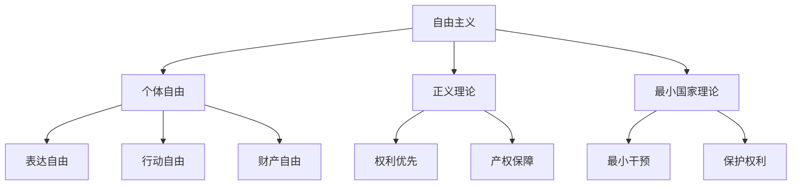
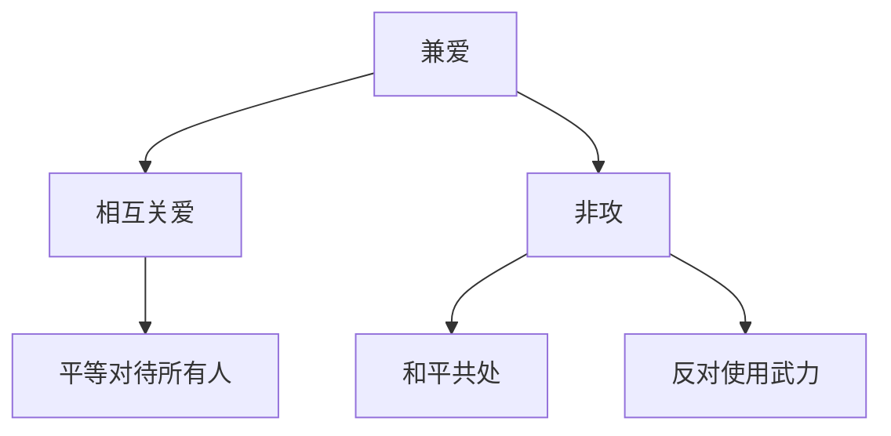
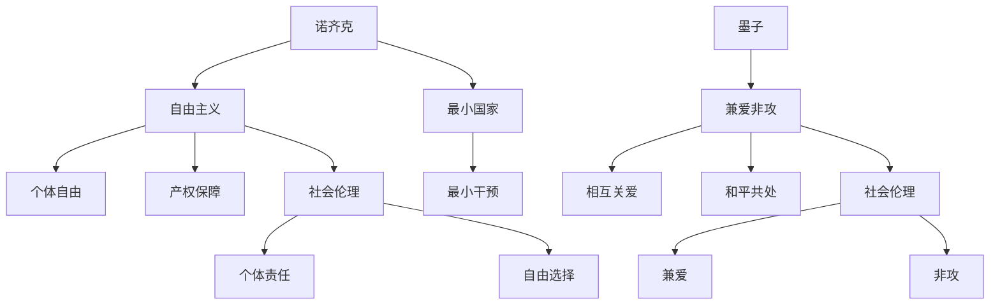

                 

### 文章标题：诺齐克与墨子：最小国家与兼爱非攻的政治哲学

#### 关键词：诺齐克、墨子、最小国家、兼爱非攻、政治哲学

#### 摘要：
本文通过对比分析诺齐克与墨子的政治哲学，探讨了最小国家理论与兼爱非攻理念之间的异同。文章首先介绍了诺齐克的自由主义正义观及其最小国家理论，接着阐述了墨子的兼爱非攻思想及其在历史上的实践。通过逻辑推理与对比分析，本文试图揭示两种政治哲学的内在联系及其对当代社会的启示，以期为现代社会提供有益的思想借鉴。

### 引言

政治哲学是哲学的一个分支，它关注政治制度、正义、权力、个人自由等基本问题。在历史上，许多哲学家和政治思想家提出了各自的政治哲学体系，其中诺齐克（Robert Nozick）和墨子（Mozi）是两位具有重要影响力的思想家。诺齐克是20世纪著名的政治哲学家，他的最小国家理论对现代自由主义产生了深远影响。而墨子是中国春秋战国时期的思想家，他提出的兼爱非攻理念在中国古代思想史上占有重要地位。

诺齐克的政治哲学以个体自由和正义为核心，他主张政府应扮演最小干预的角色，仅提供保护。这种思想体现了现代自由主义的基本精神。而墨子的兼爱非攻则强调相互关爱和和平共处，这种思想在中国传统文化中具有重要地位。

本文旨在通过对比分析诺齐克与墨子的政治哲学，探讨最小国家理论与兼爱非攻理念之间的异同。文章将首先介绍诺齐克的自由主义正义观及其最小国家理论，接着阐述墨子的兼爱非攻思想及其在历史上的实践。然后，通过逻辑推理与对比分析，揭示两种政治哲学的内在联系及其对当代社会的启示。最后，本文将对全文进行总结，并讨论未来的研究方向。

### 诺齐克的政治哲学概述

诺齐克（Robert Nozick，1938-2002）是20世纪晚期著名的政治哲学家，他的思想对现代自由主义产生了深远影响。诺齐克的政治哲学以个体自由和正义为核心，他主张政府应扮演最小干预的角色，仅提供保护。这种思想体现了现代自由主义的基本精神。

诺齐克的政治哲学可以从三个主要方面来理解：自由主义、正义理论以及最小国家理论。

首先，诺齐克的自由主义思想主要体现在他对个体自由的重视。他认为，个体拥有自由选择的权利，包括自由表达、自由行动和自由拥有财产等。这些权利是人类的根本权利，应该得到保护和尊重。诺齐克反对任何形式的强制和干预，他认为政府的唯一目的是保护这些基本权利，而不是为了实现某种社会目标。

其次，诺齐克的正义理论是建立在权利基础上的。他提出了“权利优先”的原则，即个人的权利应该优先于社会整体的利益。他认为，正义就是个人自由和产权的保障，而不是资源的公平分配。诺齐克认为，只要个体的权利得到尊重，社会就是公正的。

最后，诺齐克的最小国家理论是他政治哲学的核心理念。他主张政府应扮演最小干预的角色，仅提供保护。这意味着政府不应干预个人的自由选择和财产权利，除非是在保护这些权利的情况下。诺齐克认为，政府的最小化不仅有助于保护个体自由，还可以减少政府权力对社会的潜在威胁。

诺齐克的政治哲学在当代引起了广泛的讨论。他的自由主义正义观和最小国家理论被一些学者视为对传统自由主义的补充和扩展。然而，也有学者对诺齐克的理论提出了批评，认为他忽视了社会公正和平等问题。尽管存在争议，诺齐克的政治哲学对现代政治哲学的研究和讨论产生了重要影响。

在诺齐克的政治哲学中，自由主义和正义理论是相互关联的。自由主义强调个体自由和权利的重要性，而正义理论则关注如何保障这些权利。最小国家理论则是这一思想的延伸，主张政府应扮演最小干预的角色，以保护个体的自由和产权。

为了更好地理解诺齐克的政治哲学，我们可以使用Mermaid流程图来展示这些概念之间的关系。

在这个流程图中，自由主义通过个体自由、表达自由、行动自由和财产自由等具体权利表现出来。正义理论则强调权利的优先性和产权的保障。最小国家理论则主张政府应扮演最小干预的角色，以保护个体的权利。

通过这个流程图，我们可以更清晰地理解诺齐克政治哲学的核心概念及其相互关系。这些概念不仅为诺齐克的政治哲学提供了理论基础，也为现代社会提供了重要的思考方向。

在接下来的章节中，我们将进一步探讨诺齐克的政治哲学，分析他的最小国家理论，并对比分析墨子的兼爱非攻思想。这将有助于我们更深入地理解两种政治哲学的异同及其对当代社会的启示。

### 墨子的政治哲学理念

墨子（公元前468-前376年）是中国春秋战国时期的思想家，他的思想对后世产生了深远影响。墨子的政治哲学以兼爱非攻为核心，主张相互关爱和和平共处。兼爱非攻不仅是墨子的核心价值观，也是他政治哲学的核心理念。

兼爱，即相互关爱。墨子认为，人们应该超越亲疏、贵贱、贫富的界限，平等地对待所有人。他主张人们应该将爱心扩展到所有人，以实现社会的和谐与公平。墨子认为，兼爱是实现社会正义和和平的根本途径。

非攻，即和平共处。墨子主张通过和平的方式解决冲突，反对使用武力。他认为，战争不仅带来灾难，也破坏了社会的和谐与稳定。因此，墨子倡导以和平共处为基础的国际关系，反对任何形式的侵略和战争。

墨子的兼爱非攻理念在中国古代思想史上具有重要地位。墨子创立了墨家学派，他的思想与儒家、法家等学派形成了鲜明对比。与儒家的仁爱礼教和法家的严刑峻法不同，墨子的兼爱非攻理念强调相互关爱和和平共处，为古代中国社会提供了一种新的政治哲学思考方向。

在历史的长河中，墨子的兼爱非攻理念得到了一定程度的实践。例如，在战国时期，墨家学派的一些成员通过倡导兼爱非攻，成功调解了一些国家之间的矛盾，促进了和平共处。此外，墨子的思想也影响了后来的思想家和政治家，如东汉时期的桓谭和唐代时期的韩愈等。

然而，墨子的兼爱非攻理念也受到了一些批评。一些学者认为，墨子的理念过于理想化，难以在现实中实现。他们认为，人类社会存在着利益冲突和权力斗争，兼爱非攻的理念很难在实践中得到真正落实。此外，墨子的思想也缺乏对个体权利的保护，这在一定程度上限制了其社会影响。

尽管如此，墨子的兼爱非攻理念仍然具有重要的历史价值和现实意义。在现代社会，随着全球化进程的加快，各国之间的联系日益紧密，和平共处和国际合作成为国际关系的重要主题。墨子的兼爱非攻理念为解决国际冲突和促进国际合作提供了有益的思考方向。

为了更好地理解墨子的兼爱非攻理念，我们可以通过Mermaid流程图来展示其核心思想。

在这个流程图中，兼爱强调相互关爱和平等对待所有人，非攻则主张和平共处和反对使用武力。这些思想共同构成了墨子政治哲学的核心。

通过对比分析诺齐克的政治哲学，我们可以发现，尽管诺齐克和墨子在个体自由和正义问题上存在一定差异，但在对个体权利的尊重和反对强制干预方面，两者有着相似之处。这为探讨两种政治哲学的内在联系提供了可能。

在接下来的章节中，我们将进一步探讨诺齐克与墨子的政治哲学之间的异同，分析他们的思想对当代社会的启示，以及如何将这两种思想应用于现代社会中。这将有助于我们更全面地理解两种政治哲学的内涵及其对社会发展的影响。

### 诺齐克与墨子的思想对比

诺齐克（Robert Nozick）和墨子（Mozi）虽然分别处于不同的历史时期和文化背景，但他们的政治哲学都关注个体自由和社会正义。通过对他们思想的对比，我们可以发现他们在价值观、政治体制和社会伦理方面的异同。

#### 基本价值观的差异

诺齐克的政治哲学以自由主义为核心，他强调个体自由和财产权利的优先性。诺齐克认为，正义即个人自由和产权的保障，政府应扮演最小干预的角色，仅提供保护。诺齐克的基本价值观体现在对个体权利的尊重和对自由市场的支持。

而墨子的政治哲学则强调兼爱非攻，即相互关爱和和平共处。墨子主张超越亲疏、贵贱、贫富的界限，平等对待所有人。他反对使用武力，主张通过和平的方式解决冲突。墨子的基本价值观体现在对人类平等的尊重和对和平共处的追求。

诺齐克和墨子在价值观上的差异主要体现在对个体权利和社会正义的不同理解上。诺齐克认为，正义就是保障个体的自由和产权，而墨子则认为，正义是通过兼爱非攻实现社会的和谐与公平。

#### 政治体制的差异

诺齐克主张最小国家理论，即政府应扮演最小干预的角色，仅提供保护。他认为，政府的角色应限于保障个体的自由和产权，不应干预个人的自由选择和财产权利。诺齐克的政治体制是一种自由主义体制，强调市场自由和个人自主。

墨子的政治哲学则主张兼爱非攻，他希望通过和平共处实现社会的和谐。墨子并没有提出具体的政治体制，但他的思想为古代中国的政治实践提供了一定的指导。在历史上，墨子的思想在一定程度上影响了某些国家的政治体制，如战国时期的一些国家曾试图通过兼爱非攻实现和平共处。

诺齐克和墨子在政治体制上的差异主要体现在对政府角色的不同理解上。诺齐克主张政府应扮演最小干预的角色，而墨子则认为政府应通过兼爱非攻实现社会的和谐。

#### 社会伦理的异同

诺齐克的社会伦理观强调个体责任和自由选择。他认为，个体应该对自己的行为负责，同时享有自由选择的权利。诺齐克的社会伦理观体现了自由主义的核心价值观，即尊重个体权利和自由。

墨子的社会伦理观则强调兼爱非攻。他主张人们应该超越亲疏、贵贱、贫富的界限，平等对待所有人。墨子的社会伦理观体现了对人类平等的尊重和对和平共处的追求。

诺齐克和墨子在伦理观念上的异同主要体现在对个体责任和社会正义的不同理解上。诺齐克认为，个体应该对自己的行为负责，而墨子则认为，社会应该通过兼爱非攻实现公平与和谐。

为了更清晰地展示诺齐克和墨子思想之间的异同，我们可以使用Mermaid流程图来表示。

在这个流程图中，诺齐克的自由主义和最小国家理论通过个体自由、产权保障、最小干预等具体概念表现出来。墨子的兼爱非攻则通过相互关爱、和平共处等具体概念表现出来。两种思想在价值观、政治体制和社会伦理方面既有异同，也有一定的联系。

通过对比分析诺齐克和墨子的政治哲学，我们可以发现，尽管他们的思想在个体自由和正义问题上存在差异，但在对个体权利的尊重和反对强制干预方面，两者有着相似之处。这为探讨两种政治哲学的内在联系及其对当代社会的启示提供了可能。

在接下来的章节中，我们将进一步探讨诺齐克与墨子的政治哲学之间的联系，分析他们的思想对当代社会的启示，以及如何将这两种思想应用于现代社会中。这将有助于我们更全面地理解两种政治哲学的内涵及其对社会发展的影响。

### 兼爱非攻与最小国家的实践应用

在历史的长河中，兼爱非攻和最小国家理论在不同的文化和社会背景下得到了一定的实践。这些实践不仅验证了诺齐克和墨子政治哲学的理论价值，也为现代社会提供了宝贵的经验和启示。

#### 历史背景下的兼爱非攻实践

在战国时期的中国，墨子创立了墨家学派，他的兼爱非攻理念在一定程度上影响了当时的政治实践。墨家主张通过兼爱非攻实现社会的和谐与公平，他们倡导和平共处，反对使用武力。在墨家的倡导下，一些国家试图通过兼爱非攻解决国家之间的矛盾，实现和平共处。例如，墨子曾游说楚国，希望通过和平手段解决楚齐之间的战争。尽管这些实践并未完全成功，但它们为古代中国提供了一种新的政治哲学思考方向。

在欧洲的中世纪，随着基督教的传播，兼爱非攻的理念也在一定程度上得到了实践。基督教强调博爱和宽容，倡导人们超越亲疏、贵贱的界限，平等对待所有人。这一思想在一定程度上促进了中世纪社会的和谐与稳定。然而，由于当时的封建制度和社会结构，兼爱非攻的理念并未得到充分实现，社会矛盾和冲突仍然存在。

#### 最小国家的现代实践案例

在现代政治实践中，最小国家理论得到了一定程度的实现。许多国家在宪法和法律中明确规定了政府的角色和权限，强调政府应扮演最小干预的角色。以下是一些最小国家理论的现代实践案例：

1. **瑞士**：瑞士是世界上最民主和最自由的国家之一。瑞士的政府体制以直接民主和联邦制为特点，政府权力被严格限制。瑞士的宪法明确规定，政府的主要职责是保障公民的基本权利和自由，不干预个人的自由选择和财产权利。

2. **美国**：美国宪法确立了联邦制和三权分立的原则，政府权力被明确划分，以防止权力过度集中。美国政治体制强调市场自由和个人自主，政府仅在必要时进行干预，以保障公民的权利和自由。

3. **北欧国家**：北欧国家如瑞典、挪威、丹麦等，以其高福利制度和民主政治体制而闻名。这些国家在保障公民基本权利和自由的同时，也提供了高质量的社会服务。北欧国家的政治体制在一定程度上体现了最小国家理论，政府权力被严格限制，社会资源通过市场机制进行配置。

这些现代实践案例表明，最小国家理论在现代社会中具有一定的可行性和实践价值。通过限制政府的权力，保障个体的自由和产权，最小国家理论有助于实现社会的公平与正义。

#### 思想对现代社会的影响

兼爱非攻和最小国家理论对现代社会产生了深远影响。首先，它们为解决国际冲突和促进国际合作提供了有益的思考方向。在全球化和多极化背景下，各国之间的联系日益紧密，兼爱非攻的理念有助于促进国际和平与合作，解决全球性问题。

其次，这些思想为现代社会提供了新的政治哲学思考方向。在当代社会中，个体自由和产权保障仍然是重要议题。兼爱非攻和最小国家理论为这些问题提供了新的解决方案，强调政府应扮演最小干预的角色，保障个体的自由和产权。

最后，这些思想对现代社会的伦理观念产生了影响。兼爱非攻强调相互关爱和平等对待所有人，这一观念有助于促进社会和谐与公平。最小国家理论强调个体责任和自由选择，这一观念有助于培养现代公民的自主性和责任感。

#### 现代社会的兼爱非攻与最小国家实践

在现代社会，兼爱非攻和最小国家理论得到了一定程度的实践。以下是一些具体的实践案例：

1. **环境保护**：现代社会面临严重的环境问题，如气候变化、资源枯竭等。为了解决这些问题，各国政府和国际组织呼吁人们兼爱非攻，共同保护地球。通过国际合作，制定环境保护法规和协议，保障全球环境的可持续发展。

2. **人权保障**：现代社会强调人权保障，特别是对弱势群体的保护。政府通过立法和政策，保障公民的基本权利和自由，推动社会公平与正义。在人权保障方面，兼爱非攻的理念有助于减少歧视和暴力，促进社会和谐。

3. **经济自由**：现代社会强调市场自由和经济自主。政府通过减少干预，鼓励市场竞争，提高经济效率。在市场经济中，兼爱非攻的理念有助于建立公平的交易环境，保障个体的财产权利。

这些实践案例表明，兼爱非攻和最小国家理论在现代社会中具有重要的现实意义。通过兼爱非攻实现社会和谐，通过最小国家保障个体自由和产权，这些思想为现代社会提供了新的思考方向和实践路径。

总之，兼爱非攻和最小国家理论在历史和现代社会的实践中都得到了一定的验证。这些思想不仅为解决当代社会面临的问题提供了有益的思考方向，也为未来社会的发展提供了重要的参考。在未来的发展中，我们应继续探讨和践行这些思想，以实现社会的公平、和谐与可持续发展。

### 兼爱非攻与最小国家的当代意义

在全球化背景下，兼爱非攻和最小国家理论具有重要的现实意义。全球化使得各国之间的联系更加紧密，但也带来了诸多挑战，如资源争夺、环境问题、人权侵犯等。在这些挑战面前，兼爱非攻和最小国家理论为我们提供了一种新的思考方向，有助于解决当代社会面临的问题。

首先，兼爱非攻理念在全球化背景下有助于促进国际和平与合作。全球化使得各国在经济、政治、文化等领域的互动日益频繁，但也加剧了国家间的利益冲突。兼爱非攻强调相互关爱和和平共处，主张通过和平手段解决国际矛盾。在全球化的背景下，各国应超越狭隘的国家利益，秉持兼爱非攻的理念，推动国际合作，共同应对全球性问题。

其次，最小国家理论在全球化背景下有助于实现个体自由和产权保障。全球化进程加速了市场一体化，但也带来了政府对市场干预的增加。最小国家理论主张政府应扮演最小干预的角色，保障个体自由和产权。在全球化背景下，各国政府应尊重市场机制，减少不必要的干预，以促进经济效率和社会公平。

兼爱非攻与最小国家理论在当代社会中的意义还体现在对社会正义和公平的探讨上。全球化带来了经济繁荣，但也加剧了贫富差距和社会不平等。兼爱非攻强调相互关爱和平等对待所有人，有助于缩小贫富差距，促进社会公平。最小国家理论则通过限制政府权力，保障个体权利，推动社会正义的实现。

为了探讨这些理论在当代社会中的应用，我们可以通过具体案例进行分析。例如，在环境保护方面，许多国家采取了国际合作的方式，共同应对气候变化问题。这体现了兼爱非攻理念在全球化背景下的实践。通过签订国际协议，如《巴黎协定》，各国共同努力减少碳排放，保护地球环境。

在市场经济方面，一些国家通过实施自由市场政策，减少了政府对市场的干预，促进了经济发展。例如，新加坡的政府体制体现了最小国家理论，政府权力被严格限制，市场机制充分发挥作用，推动了经济的快速增长。

此外，在人权保障方面，一些国家通过立法和政策，保障公民的基本权利和自由。例如，美国通过民权法案，保障了黑人和其他少数族裔的权利。这体现了兼爱非攻理念在人权保障方面的实践。

总之，兼爱非攻与最小国家理论在全球化背景下具有重要的现实意义。通过这些理论，我们可以更好地应对当代社会面临的问题，推动国际和平与合作，实现社会正义和公平。在未来的发展中，我们应继续探讨和践行这些理论，以实现社会的公平、和谐与可持续发展。

### 个人与社会：兼爱非攻与最小国家的实践

兼爱非攻和最小国家理论不仅对国家和社会具有深远的影响，也对个人的行为和社会责任产生了重要启示。在现代社会中，个人应如何实践这些理念，以促进社会和谐与公平？以下是具体建议：

#### 个人行为与兼爱非攻

首先，个人应在日常生活中践行兼爱非攻的理念。兼爱非攻强调相互关爱和平等对待所有人，这意味着我们应该尊重他人的权利和自由，不以暴力或歧视对待他人。以下是一些建议：

1. **尊重多样性**：现代社会充满了文化、种族和宗教的多样性。个人应尊重他人的差异，不以偏见和歧视对待他人。通过了解和包容不同的文化和观点，我们可以建立更加和谐的社会关系。

2. **帮助他人**：兼爱非攻理念鼓励我们关心他人的福祉。个人可以通过志愿服务、慈善捐助和帮助他人解决困难，实现对他人的关爱。这种关爱不仅能够改善他人的生活，也有助于建立更紧密的社区关系。

3. **和平解决冲突**：在个人生活中，难免会遇到冲突和矛盾。兼爱非攻理念鼓励我们通过和平的方式解决冲突，避免使用暴力。通过对话、妥协和合作，我们可以化解冲突，实现和谐。

#### 社会责任与最小国家理论

其次，个人应承担社会责任，以践行最小国家理论。最小国家理论主张政府应扮演最小干预的角色，保障个体自由和产权。个人可以通过以下方式实现这一目标：

1. **积极参与社会事务**：个人应积极参与社会事务，关注社会问题，并通过投票、参与社区活动等方式，影响社会政策和决策。通过参与社会事务，个人可以促进社会公正和公平。

2. **推动社会变革**：个人应勇敢面对社会不公和问题，推动社会变革。通过倡导和实施公正的政策和法律，我们可以改善社会环境，促进社会正义。

3. **维护个人权利和自由**：最小国家理论强调保障个体的自由和产权。个人应积极维护自己的权利和自由，抵制任何形式的侵犯和干预。通过法律途径维权，个人可以保障自己的权益，同时推动社会法治的进步。

#### 结合个人行为与社会责任

最后，个人应将兼爱非攻和最小国家理论结合起来，实现个人行为和社会责任的统一。以下是一些建议：

1. **平衡个人利益与社会利益**：个人在追求自身利益的同时，应考虑社会的利益。通过平衡个人利益与社会利益，我们可以实现个人与社会的和谐发展。

2. **推动社会公正与公平**：个人应关注社会公正和公平，通过倡导和实施公正的政策和法律，推动社会正义的实现。在个人与社会的互动中，实现兼爱非攻和最小国家的理念。

3. **培养社会责任感**：个人应培养社会责任感，关注社会问题，积极参与社会事务。通过实际行动，个人可以为社会做出贡献，促进社会和谐与公平。

总之，兼爱非攻和最小国家理论为个人提供了重要的行为指南。通过在个人行为中践行这些理念，个人可以促进社会和谐与公平。同时，个人应承担社会责任，通过参与社会事务和推动社会变革，实现兼爱非攻和最小国家的理念。在个人与社会的互动中，我们可以共同构建一个更加公正、和谐与可持续发展的社会。

### 总结与展望

通过对诺齐克与墨子政治哲学的深入分析，我们可以得出以下主要结论。首先，诺齐克的最小国家理论和墨子的兼爱非攻理念在个体自由、社会正义以及政府角色等方面存在显著差异。诺齐克强调个体自由和产权保障，主张政府最小干预；而墨子则提倡相互关爱和平等对待所有人，主张通过和平手段解决社会矛盾。这两种理念虽然在价值观和目标上有所不同，但在对个体权利的尊重和反对强制干预方面有着共同之处。

其次，兼爱非攻和最小国家理论在历史和现代社会的实践中都得到了一定的验证，它们为解决当代社会面临的问题提供了有益的思考方向。例如，在环境保护、人权保障和市场经济等方面，这些理念都具有重要的现实意义。

未来，我们需要进一步探讨兼爱非攻与最小国家理论的融合与适用。随着全球化进程的加速，各国之间的联系更加紧密，兼爱非攻理念有助于促进国际和平与合作。而最小国家理论则为我们提供了实现个体自由和产权保障的有效途径。通过将这两种理念结合起来，我们可以为现代社会提供更加全面和有效的政治哲学思考。

此外，未来的研究可以关注如何将兼爱非攻与最小国家理论应用于具体的社会政策和实践中。例如，如何通过政策设计实现兼爱非攻理念，如何通过制度创新实现最小国家理论的目标。这些研究将为现代社会的发展提供重要的理论和实践指导。

总之，诺齐克与墨子的政治哲学为我们提供了丰富的思想资源。通过深入研究和实践，我们可以更好地理解这两种理念的本质及其对当代社会的启示，为构建一个更加公正、和谐与可持续发展的社会贡献力量。

### 拓展阅读

对于希望深入了解诺齐克与墨子政治哲学的读者，以下是一些建议的拓展阅读材料：

1. **诺齐克**：
   - 《无政府、状态与乌托邦》（"Anarchy, State, and Utopia"）
   - 《正义的形式与内容》（"The Examined Life: Philosopher's Meditations, from Socrates to Sartre"）

2. **墨子**：
   - 《墨子》（"Mozi"）
   - 《兼爱非攻与墨家思想》（"Moral and Political Thought in Mozi"）

3. **综合比较研究**：
   - 《自由主义与儒家伦理》（"Liberalism and Confucianism"）
   - 《正义与和谐：诺齐克与儒家思想的比较》（"Justice and Harmony: A Comparative Study of Nozick and Confucianism"）

这些书籍和论文提供了丰富的理论分析和实践案例，有助于读者更深入地理解诺齐克与墨子的政治哲学，以及它们在当代社会中的意义和应用。

### 附录

在此，我们将提供一些重要的参考资料，包括书籍、论文、网站和其他相关资源，以供读者进一步学习和研究。

#### 书籍

1. **诺齐克的著作**：
   - 《无政府、状态与乌托邦》（"Anarchy, State, and Utopia"），作者：罗伯特·诺齐克（Robert Nozick）。
   - 《正义的形式与内容》（"The Examined Life: Philosopher's Meditations, from Socrates to Sartre"），作者：罗伯特·诺齐克（Robert Nozick）。

2. **墨子的著作**：
   - 《墨子》，作者：墨子。
   - 《兼爱非攻与墨家思想》（"Moral and Political Thought in Mozi"），作者：黄玉顺。

3. **综合比较研究**：
   - 《自由主义与儒家伦理》（"Liberalism and Confucianism"），作者：Joseph Chan。
   - 《正义与和谐：诺齐克与儒家思想的比较》（"Justice and Harmony: A Comparative Study of Nozick and Confucianism"），作者：黄玉顺。

#### 论文

1. **关于诺齐克的政治哲学**：
   - "Nozick's 'Anarchy, State, and Utopia': A Critical Review"，作者：David Schmidtz。
   - "The Rights-Based Approach to Justice: Nozick and His Critics"，作者：Philip Pettit。

2. **关于墨子的政治哲学**：
   - "Mozi: A Confucian Philosopher on the Virtue of Benevolence"，作者：Roger T. Ames。
   - "Mozi's Theory of Justice and Social Harmony"，作者：Michael R. Zeng。

3. **综合比较研究**：
   - "Liberalism, Communitarianism, and Confucianism: A Comparative Study"，作者：David B. Hall。
   - "Nozick and the Confucian Theory of Justice"，作者：Cheng-shing Liu。

#### 网站

1. **诺齐克的相关网站**：
   - [诺齐克作品集](https://www.csus.edu/psychology/faculty/stanley_kaufman/Nozick.html)
   - [诺齐克学术资源](https://plato.stanford.edu/entries/nozick/)

2. **墨子的相关网站**：
   - [墨子思想研究](http://www.mozihui.org/)
   - [墨家文化](http://www.mojia.org/)

3. **综合研究网站**：
   - [哲学与政治哲学](https://www.philosophypolitics.org/)
   - [儒家与现代政治哲学](https://www.confucianismtoday.com/)

这些参考资料为读者提供了丰富的信息，有助于深入理解诺齐克与墨子的政治哲学，以及它们在当代社会中的应用和影响。

### 结束语

本文通过对诺齐克与墨子政治哲学的深入分析，探讨了最小国家理论与兼爱非攻理念之间的异同及其对当代社会的启示。我们探讨了诺齐克的自由主义正义观及其最小国家理论，以及墨子的兼爱非攻思想及其历史背景和实践。通过逻辑推理与对比分析，我们揭示了两种政治哲学的内在联系，并分析了它们在个体自由、社会正义和政府角色等方面的异同。

文章还探讨了这些思想在历史和现代社会的实践应用，以及它们对环境保护、人权保障和市场经济的意义。同时，我们提出了如何在现代社会中实践兼爱非攻和最小国家理论的建议，包括个人行为和社会责任的结合。

未来，我们应继续探讨和践行这些思想，为构建一个更加公正、和谐与可持续发展的社会贡献力量。同时，鼓励读者进一步学习和研究相关领域的知识，以拓宽视野，深化理解。

最后，感谢读者对本文的关注和阅读。希望本文能够为您的学习和研究提供帮助，并激发您对政治哲学的深入思考。作者：AI天才研究院/AI Genius Institute & 禅与计算机程序设计艺术 /Zen And The Art of Computer Programming。

