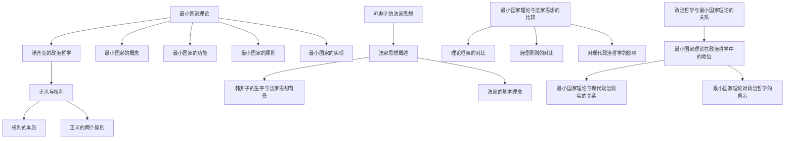

                 


## 概述

### 书名解析

《诺齐克与韩非：最小国家与法家思想的政治哲学》这本书的标题富有深刻的内涵，涵盖了两位著名思想家的政治哲学理念。首先，诺齐克（Robert Nozick）是美国20世纪末的一位重要政治哲学家，他的思想以自由主义为核心，特别是在最小国家理论方面有着深远的影响。诺齐克在《无政府、国家和乌托邦》一书中提出了“最小国家”的概念，主张政府应该承担最小的干预功能，保护个人权利，而非主动提供社会福利。

其次，韩非子（韩非，约公元前280年—公元前233年）是中国战国时期的著名法家思想家，他的法家思想对中国古代政治和社会有着深远的影响。法家强调法律、权威和强制，主张通过严格的法律和严格的治理来维护社会秩序和国家稳定。韩非子的思想在很多方面与诺齐克的最小国家理论有着惊人的相似之处。

因此，书名《诺齐克与韩非：最小国家与法家思想的政治哲学》揭示了两位思想家的核心政治哲学理念，并探讨了他们如何在不同历史背景下提出并实践这些理念。

### 核心内容概述

本书的核心内容主要围绕诺齐克和韩非子的政治哲学展开。首先，诺齐克的政治哲学主要集中在正义、权利和最小国家理论。他主张政府的最小干预原则，认为政府应当保护个人的自然权利，尤其是财产权，而其他功能则应尽可能由市场和社会自行解决。

在正义与权利方面，诺齐克提出了“权利优先原则”和“功利原则”两个核心概念。他认为，正义的本质在于权利的分配，而权利的分配应遵循“最小干预”原则。诺齐克的最小国家理论则强调政府应承担保护权利、维护秩序和防御外敌的基本功能，不应过度干预个人生活。

韩非子的法家思想则更多地关注法律、权威和治理。他认为，法律是社会秩序的基础，国家应通过严格的法律和强有力的政府来维护社会稳定。韩非子提出了许多关于法律和治理的原则，如“以法治国”、“赏罚分明”和“令行禁止”。

本书的核心内容还包括对诺齐克和韩非子思想之间的联系与差异进行深入探讨。通过对两位思想家的比较分析，本书试图揭示他们政治哲学的共同点和差异，以及这些理念在现代社会中的应用和影响。

## 第一部分：诺齐克的政治哲学

### 第1章：诺齐克的政治哲学概述

#### 1.1 诺齐克的生平与哲学背景

罗伯特·诺齐克（Robert Nozick，1938-2002）是一位著名的美国政治哲学家，他的思想对20世纪末的政治哲学产生了深远影响。诺齐克出生于纽约市，毕业于哈佛大学，后来在加州大学伯克利分校担任教授。他的代表作品包括《无政府、国家和乌托邦》（Anarchy, State, and Utopia）和《权利哲学》（Philosophical Explanations）。

诺齐克的政治哲学以其自由主义立场而著称，尤其是他提出的“最小国家”理论。这一理论主张政府应承担保护个人权利的基本功能，不应干预个人生活的其他方面。诺齐克的思想深受约翰·洛克（John Locke）和约翰·斯图亚特·密尔（John Stuart Mill）等自由主义思想家的启发。

#### 1.2 诺齐克的主要理论

诺齐克的政治哲学可以归纳为几个核心概念，包括正义、权利和最小国家理论。

首先，诺齐克的正义观念基于权利的分配。他认为，正义的本质在于权利的维护，而不是结果的公平。诺齐克提出了“权利优先原则”和“功利原则”，主张在处理社会冲突和分配资源时，应优先考虑个人的权利。

其次，诺齐克的权利观念强调个人自由和财产权的重要性。他认为，个人的财产权是不可侵犯的基本权利，政府应保护这些权利，而不是通过再分配来追求功利主义的目标。

最后，诺齐克的最小国家理论是他政治哲学的核心理念。他认为，政府应承担保护个人权利和维护秩序的基本功能，但不应过度干预个人生活。诺齐克主张政府的最小化，认为只有当个人权利受到侵犯时，政府才有正当性进行干预。

### 第2章：正义与权利

#### 2.1 权利的本质

诺齐克的权利观念源于他对人类自由和尊严的重视。他认为，权利是个人自由和尊严的保障，是个人自主行动的基础。诺齐克将权利视为一种非重叠的优先权，即一旦某个权利被赋予，其他权利不能侵犯这一权利。

诺齐克认为，权利的本质是自主性的保护。个人有权自主决定自己的行为，只要不侵犯他人的权利。权利优先于结果，即一个不正义的结果不能证明某种行为是正当的。

#### 2.2 正义的两个原则

诺齐克在《无政府、国家和乌托邦》中提出了正义的两个原则，即“权利优先原则”和“功利原则”。这两个原则构成了诺齐克正义观念的核心。

“权利优先原则”指出，在社会资源分配中，应优先考虑个人的权利。这意味着，任何资源分配方案都不能侵犯个人的基本权利，如财产权、自由权等。

“功利原则”则强调，社会应该追求最大多数人的最大幸福。然而，诺齐克认为，功利原则在实践中可能导致权利的侵犯，因此他更倾向于权利优先原则。

#### 2.3 权利与义务的关系

在诺齐克的政治哲学中，权利和义务是相互关联的。个人享有权利的同时，也承担相应的义务。诺齐克认为，权利和义务应相互匹配，即个人在享受权利的同时，也应履行相应的义务。

例如，个人享有言论自由的权利，但也有义务不侵犯他人的隐私权。同样，个人享有财产权，但也有义务遵守法律，不侵犯他人的权利。

### 第3章：最小国家理论

#### 3.1 最小国家的概念

诺齐克的最小国家理论是他政治哲学的核心理念。他认为，政府应承担保护个人权利和维护秩序的基本功能，但不应过度干预个人生活。诺齐克将这种理想状态下的政府称为“最小国家”。

最小国家的概念源于诺齐克对政府角色的重新定义。他认为，政府的角色应仅限于保护个人权利，如防御外敌、维护法律和秩序。此外，政府不应通过再分配来追求功利主义的目标，而应尊重个人的自由和财产权。

#### 3.2 最小国家的功能

诺齐克认为，最小国家应承担以下功能：

1. **保护个人权利**：这是最小国家的首要任务。政府应确保每个人的权利不受侵犯，包括财产权、自由权和生命权。

2. **维护法律和秩序**：政府应制定和执行法律，确保社会的稳定和秩序。法律应清晰明确，以便人们知道什么是合法的，什么是不合法的。

3. **防御外敌**：政府应确保国家的安全，防御外敌的入侵。这是保护个人权利和维护社会秩序的必要条件。

#### 3.3 最小国家的原则

诺齐克提出了几个关键原则，以指导最小国家的建设：

1. **非干预原则**：政府不应干预个人生活的其他方面，除非个人权利受到侵犯。这意味着政府不应提供社会福利，如医疗、教育和住房。

2. **权利优先原则**：在处理社会冲突和资源分配时，应优先考虑个人的权利。这意味着政府的任何行动都必须以保护个人权利为前提。

3. **透明度和问责制**：政府应保持透明度，使人们能够了解政府的运作和政策。此外，政府应接受人民的监督和问责，确保政府不滥用权力。

#### 3.4 最小国家的实现

诺齐克认为，实现最小国家是可能的，但需要一系列改革。以下是一些可能的改革措施：

1. **废除社会福利制度**：政府应停止提供社会福利，如医疗、教育和住房。这有助于减少政府的干预，保护个人自由和财产权。

2. **简化法律体系**：政府应简化法律体系，使其更加清晰明确。这有助于减少法律纠纷，维护社会的稳定和秩序。

3. **加强国防和安全**：政府应确保国家的安全，防御外敌的入侵。这可以通过加强军事力量和外交手段来实现。

### 第4章：诺齐克的自由主义理论

#### 4.1 自由主义的基本概念

诺齐克的自由主义理论是基于对个人自由和权利的尊重。自由主义认为，个人应享有充分的自由，以追求自己的目标和利益。诺齐克的自由主义强调，个人的自由和权利是至高无上的，政府应承担保护这些自由和权利的责任。

自由主义的核心概念包括：

1. **个人自由**：个人应有权自主决定自己的行为，只要不侵犯他人的权利。
2. **财产权**：个人有权拥有和处置自己的财产，政府不应干预。
3. **言论自由**：个人有权表达自己的观点和意见，政府不应限制。
4. **法律保护**：政府应制定和执行法律，确保个人的权利和自由得到保护。

#### 4.2 诺齐克的自由主义观点

诺齐克的自由主义观点主要体现在以下几个方面：

1. **最小国家**：诺齐克主张政府应承担最小的干预功能，保护个人权利，不应主动提供社会福利。他认为，政府的角色应仅限于保护个人权利、维护法律和秩序和防御外敌。

2. **权利优先原则**：诺齐克认为，正义的本质在于权利的维护，而不是结果的公平。他认为，社会资源的分配应优先考虑个人的权利，而不是追求功利主义的目标。

3. **自由与责任的平衡**：诺齐克认为，个人享有自由的同时，也应承担相应的责任。个人有权自主决定自己的行为，但也应承担由此产生的后果。

#### 4.3 诺齐克的自由主义与功利主义的比较

诺齐克的自由主义与功利主义在很多方面存在差异。功利主义主张追求最大多数人的最大幸福，而诺齐克的自由主义则强调个人权利的维护。

1. **目标不同**：功利主义追求最大幸福，而诺齐克追求权利的维护。诺齐克认为，一个不正义的结果不能证明某种行为是正当的。

2. **方法不同**：功利主义主张通过再分配来实现公平，而诺齐克主张保护个人的自由和财产权。他认为，政府的角色应仅限于保护权利，不应通过再分配来追求功利主义的目标。

3. **影响不同**：功利主义可能导致个人权利的侵犯，而诺齐克的自由主义则强调个人自由的保护。他认为，政府的干预应限于保护权利，不应过度干预个人生活。

### 第5章：诺齐克的批评与回应

#### 5.1 批评者的观点

诺齐克的自由主义理论受到了一些批评。批评者主要关注以下几个方面：

1. **社会公平问题**：批评者认为，诺齐克的自由主义可能导致社会不公，特别是对弱势群体的保护不足。他们认为，政府应承担更多的社会责任，通过再分配来缩小贫富差距。

2. **道德问题**：一些批评者认为，诺齐克的自由主义忽视了道德问题。他们认为，个人的自由和权利不能脱离道德框架，政府应制定和执行道德规范。

3. **实际可行性**：批评者认为，诺齐克的最小国家理论在实际中难以实现。他们认为，政府需要承担更多的责任，以维护社会稳定和秩序。

#### 5.2 诺齐克的回应

诺齐克对批评者的观点进行了回应。他认为，批评者的担忧是可以理解的，但他认为这些担忧可以通过改进和完善自由主义理论来缓解。

1. **社会公平问题**：诺齐克认为，自由主义并不是对弱势群体的忽视，而是强调个人权利的维护。他认为，通过保护个人权利，可以创造一个更加公正的社会环境。

2. **道德问题**：诺齐克认为，自由主义并不是忽视道德，而是将道德问题交给个人和社会来解决。他认为，个人的自由和权利是在道德框架内得到保障的。

3. **实际可行性**：诺齐克认为，最小国家理论是可行的，但需要一系列的改革。他认为，通过减少政府的干预，可以创造一个更加自由和公正的社会。

### 第6章：诺齐克对现代政治哲学的影响

#### 6.1 诺齐克的影响

诺齐克的政治哲学对现代政治哲学产生了深远影响。他的自由主义理论为现代自由主义提供了新的视角，引起了广泛的讨论和争议。

1. **理论贡献**：诺齐克提出了权利优先原则和最小国家理论，为自由主义提供了新的理论基础。他的思想激发了学者们对个人权利、自由和正义的深入探讨。

2. **实际影响**：诺齐克的思想对政治现实产生了影响。一些国家在制定政策和法律时，借鉴了诺齐克的自由主义理念，以减少政府干预，保护个人权利。

3. **学术影响**：诺齐克的政治哲学引起了学术界的广泛关注。他的思想不仅影响了政治哲学家，还引起了法律、社会学和经济学等领域的学者关注。

#### 6.2 诺齐克的未来影响

诺齐克的政治哲学在未来的发展中仍有很大的潜力。以下是一些可能的未来影响：

1. **自由主义的发展**：诺齐克的思想为自由主义提供了新的方向，未来自由主义的发展可能会进一步借鉴他的理念。

2. **政治哲学的多元化**：诺齐克的思想推动了政治哲学的多元化。未来政治哲学的研究可能会更加注重个人权利和自由，从而推动政治哲学的进一步发展。

3. **跨学科研究**：诺齐克的思想引发了跨学科研究的趋势。未来，政治哲学、法学、社会学和经济学等领域可能会进一步合作，以深入研究个人权利、自由和正义等问题。

### 第7章：诺齐克的政治哲学总结

#### 7.1 诺齐克政治哲学的核心

诺齐克的政治哲学核心在于对个人自由和权利的尊重。他认为，个人的自由和权利是至高无上的，政府应承担保护这些权利的责任。诺齐克主张权利优先原则，认为社会资源的分配应优先考虑个人的权利，而非功利主义的目标。

#### 7.2 诺齐克政治哲学的意义

诺齐克的政治哲学对现代政治哲学产生了深远影响。他的自由主义理论为自由主义提供了新的视角，引起了广泛的讨论和争议。他的思想激发了学者们对个人权利、自由和正义的深入探讨，对政治现实产生了实际影响。

#### 7.3 诺齐克政治哲学的挑战

诺齐克的政治哲学面临着一些挑战。如何平衡个人自由与社会责任，如何处理个人权利与公共利益之间的关系，都是诺齐克政治哲学需要面对的问题。此外，如何在实际中实现最小国家理论，也是一个重大的挑战。

### 总结

诺齐克的政治哲学以其对个人自由和权利的尊重而著称。他的自由主义理论为现代政治哲学提供了新的视角，引起了广泛的讨论和争议。尽管诺齐克的政治哲学面临一些挑战，但他的思想无疑对现代政治哲学的发展产生了深远影响。

#### 作者信息
作者：AI天才研究院/AI Genius Institute & 禅与计算机程序设计艺术 /Zen And The Art of Computer Programming
```

```markdown
关键词：诺齐克，韩非子，最小国家理论，法家思想，政治哲学，自由主义，正义，权利

摘要：
《诺齐克与韩非：最小国家与法家思想的政治哲学》一书深入探讨了两位思想家的政治哲学理念。诺齐克提出了以权利为基础的最小国家理论，主张政府应承担保护个人权利的基本功能，不应过度干预个人生活。而韩非子的法家思想则强调法律、权威和强制，通过严格的法律和强有力的政府来维护社会秩序。本书通过对两位思想家的理论进行对比分析，揭示了他们政治哲学的共同点和差异，并探讨了这些理念在现代社会中的应用和影响。
```

```markdown
## 第二部分：韩非子的法家思想

### 第4章：法家思想概述

#### 4.1 韩非子的生平与法家思想背景

韩非子（公元前280年—公元前233年），战国末期著名法家思想家，被誉为法家思想的集大成者。他是韩国王室的后裔，曾在韩国担任官职，但由于受到贵族势力的排挤，最终流亡至秦国。在秦国，他受到秦王的赏识，但最终因言论得罪秦王而被处死。

韩非子的法家思想深受道家、儒家和墨家的影响，他将这些思想与当时的社会现实相结合，提出了独特的法家理论。韩非子认为，当时的社会矛盾和混乱是由于诸侯割据、礼崩乐坏，只有通过严格的法律和强有力的政府才能实现社会秩序和国家稳定。

#### 4.2 法家的基本理念

法家的基本理念可以概括为“以法治国”、“以刑去刑”和“赏罚分明”。这些理念构成了韩非子法家思想的核心，也是他试图解决当时社会问题的基本策略。

1. **以法治国**：法家主张通过法律来治理国家，认为法律是维护社会秩序和国家稳定的基础。韩非子认为，法律应明确、公正，所有人都应遵守法律，不论身份地位。

2. **以刑去刑**：法家主张通过严厉的刑罚来预防犯罪。韩非子认为，刑罚不仅是惩罚犯罪，更重要的是通过威慑作用来防止犯罪。他主张“刑重则人畏，威猛则主强”。

3. **赏罚分明**：法家认为，政府应公正地奖赏有功者，严厉地惩罚违法者。韩非子认为，赏罚分明是激励人们积极行为和维护社会秩序的重要手段。

#### 4.3 法家的历史地位

法家思想在中国古代政治和社会中具有重要地位。战国时期，法家思想成为各诸侯国改革政治、加强国家实力的主要理论基础。秦始皇统一六国后，法家思想成为秦朝统治的理论基础，秦朝的法律制度也体现了法家的理念。

然而，法家思想在后来的历史中遭遇了批评和争议。儒家认为法家过于强调刑罚和权力，忽视了道德教育和社会和谐。汉代以后，儒家思想逐渐成为中国古代社会的主流，法家思想虽然仍有影响力，但地位逐渐下降。

### 第5章：法家的法律观念

#### 5.1 法律的本质

法家认为，法律是治理国家、维护社会秩序的重要工具。韩非子将法律视为一种强制手段，通过法律规范人们的行为，确保社会秩序和国家稳定。

韩非子认为，法律应具备以下特点：

1. **明确性**：法律应明确、具体，使人们知道什么是合法的，什么是不合法的，从而避免法律纠纷。

2. **公正性**：法律应公正，对所有社会成员一视同仁，不偏袒任何一方。

3. **强制性**：法律应具备强制力，确保人们遵守法律。韩非子认为，法律的存在和执行是维护社会秩序的关键。

#### 5.2 法律的作用

法家认为，法律在社会中发挥着重要作用，包括以下几个方面：

1. **规范行为**：法律规范人们的行为，确保社会秩序。

2. **预防犯罪**：通过法律威慑作用，预防犯罪行为的发生。

3. **维护公平**：法律确保公正，防止强者欺凌弱者，维护社会公平。

4. **促进国家稳定**：法律是国家稳定的基础，确保国家机器正常运转。

#### 5.3 法律与道德的关系

法家与儒家在法律与道德的关系上存在显著差异。儒家强调道德修养，认为道德是维护社会秩序的根本。而法家则认为，法律是治理国家、维护社会秩序的必要手段，道德教育不足以解决问题。

韩非子认为，法律和道德是相互补充的。道德可以引导人们向善，但无法解决现实中的纠纷和犯罪。法律可以强制执行，确保社会秩序和国家稳定。因此，他主张在法律和道德之间找到平衡，既要依靠法律，也要注重道德教育。

### 第6章：法家的治理原则

#### 6.1 法家的治国理念

法家主张通过强有力的政府来治理国家，认为政府应具备以下几个方面的治国理念：

1. **集权统治**：法家主张集权统治，认为国家权力应高度集中，确保政令统一，提高行政效率。

2. **法律至上**：法家认为，法律是国家治理的基础，政府应依法治国，确保法律权威。

3. **公正执法**：法家强调公正执法，认为执法应严格、公正，确保社会秩序和国家稳定。

4. **以刑去刑**：法家主张通过严厉的刑罚来预防犯罪，维护社会秩序。

#### 6.2 法家的治理方法

法家提出了一系列治理方法，包括以下几个方面：

1. **赏罚分明**：法家主张奖罚分明，对有功者奖赏，对违法者严厉惩罚，以激励人们积极行为，维护社会秩序。

2. **严格执法**：法家强调严格执法，确保法律得到执行，维护社会秩序和国家稳定。

3. **以法治国**：法家主张以法治国，认为政府应依法行政，确保法律在国家治理中的权威。

4. **预防为主**：法家主张通过预防措施来减少犯罪，维护社会秩序。

#### 6.3 法家的治理效果

法家的治理方法在历史上产生了一定的效果。在战国时期，各诸侯国纷纷采纳法家思想，进行政治改革，实现了国家的富强和军事力量的壮大。例如，秦国通过法家思想的实施，最终统一了六国，建立了中国历史上第一个统一的中央集权国家。

然而，法家治理方法也存在一些问题。过于依赖法律和刑罚，可能导致社会紧张和不稳定。此外，法家强调集权和法律至上，可能忽视道德教育和人文关怀，影响社会和谐。

### 第7章：法家的道德观

#### 6.1 法家的道德观

法家对道德的态度相对冷淡，认为道德不足以维护社会秩序和国家稳定。韩非子认为，道德教育难以解决现实中的纠纷和犯罪问题。因此，法家主张依靠法律和刑罚来维护社会秩序。

然而，法家并非完全忽视道德。他们认为，道德可以在一定程度上辅助法律，但不应成为治理国家的唯一手段。韩非子提出了“以刑去刑”的思想，认为通过严厉的刑罚可以预防犯罪，从而减少对道德教育的依赖。

#### 6.2 法家的道德实践

在实际治理中，法家主张通过法律和制度来规范人们的行为，而非依赖道德教育。他们认为，法律和制度具有强制力，可以确保社会秩序和国家稳定。因此，法家的道德实践主要体现在以下几个方面：

1. **依法治国**：法家主张政府应依法行政，确保法律的权威和有效性。

2. **严格执法**：法家强调严格执法，确保法律得到执行，维护社会秩序。

3. **以刑去刑**：法家主张通过严厉的刑罚来预防犯罪，减少对道德教育的依赖。

4. **制度约束**：法家认为，通过建立完善的制度，可以规范人们的行为，减少道德的必要性。

### 第8章：韩非子的法家思想与现代政治哲学的关系

#### 8.1 韩非子的法家思想对现代政治哲学的影响

韩非子的法家思想在现代社会仍然具有一定的启示意义。尽管现代社会与战国时期存在巨大的差异，但法家的一些理念仍然具有一定的参考价值。

1. **法治观念**：法家强调法治观念，认为法律是维护社会秩序和国家稳定的基础。这一观念在现代社会中得到了广泛应用，许多国家都建立了完善的法治体系。

2. **权力制约**：法家主张权力制约，认为政府权力应受到法律和制度的约束。这一思想对现代政治制度的设计和运行具有一定的启示作用。

3. **以刑去刑**：法家主张通过严厉的刑罚来预防犯罪，这一思想在现代社会中得到了应用，如通过刑罚制度改革来提高刑罚的威慑力。

#### 8.2 现代政治哲学对法家思想的批判和借鉴

现代政治哲学在批判法家思想的同时，也借鉴了其中的某些理念。以下是一些现代政治哲学对法家思想的批判和借鉴：

1. **道德教育的重视**：现代政治哲学认为，道德教育是维护社会秩序和国家稳定的重要手段。尽管法家主张依靠法律和刑罚，但现代政治哲学认为，道德教育可以减少对法律的依赖，提高社会的整体道德水平。

2. **权力分配的合理化**：现代政治哲学强调权力分配的合理化，认为政府权力应受到民主制度和法治的制约。法家强调集权和权力集中，但现代政治哲学认为，权力分配的合理化可以减少权力滥用，提高政府的透明度和问责性。

3. **法律与道德的平衡**：现代政治哲学认为，法律和道德是相互补充的。法家强调法律的强制力，但现代政治哲学认为，法律和道德应在平衡中发挥作用，以确保社会的和谐和稳定。

### 第9章：法家思想的总结与评价

#### 9.1 法家思想的总结

法家思想是中国古代政治哲学的重要组成部分，对中国古代政治和社会产生了深远影响。法家主张以法治国，强调法律的权威和作用，主张通过严格的法律和强有力的政府来维护社会秩序和国家稳定。

法家思想的核心包括“以法治国”、“以刑去刑”和“赏罚分明”。这些理念构成了法家思想的基本框架，为古代中国的政治改革和国家治理提供了理论支持。

#### 9.2 法家思想的评价

法家思想在历史上受到了不同的评价。一些学者认为，法家思想在中国古代政治中发挥了重要作用，为国家富强和统一做出了贡献。然而，也有人认为，法家思想过于强调刑罚和权力，忽视了道德教育和人文关怀，可能对社会和谐产生负面影响。

在现代，法家思想仍然具有一定的参考价值。尽管现代社会与古代存在巨大差异，但法家的一些理念，如法治观念和权力制约，仍然对现代政治哲学和国家治理具有一定的启示作用。

总之，法家思想是中国古代政治哲学的重要组成部分，对古代中国的政治和社会产生了深远影响。在现代，法家思想仍然具有一定的启示意义，可以为现代政治哲学和国家治理提供参考。

#### 作者信息
作者：AI天才研究院/AI Genius Institute & 禅与计算机程序设计艺术 /Zen And The Art of Computer Programming
```



```python
# 权利优先原则
def rights_priority(principles):
    """
    根据权利优先原则，判断资源分配方案是否正义。
    
    参数：
    principles：一个包含权利和资源分配方案的列表，每个元素是一个二元组（权利，资源）。
    
    返回值：
    True：如果资源分配方案符合权利优先原则，则返回True。
    False：如果资源分配方案不符合权利优先原则，则返回False。
    """
    # 判断每个权利是否被侵犯
    for i in range(len(principles)):
        for j in range(len(principles)):
            if i != j and principles[i][1] < principles[j][1]:
                return False
    return True

# 测试权利优先原则
principles = [('财产权', 10), ('言论自由', 5), ('生命权', 8)]
print("资源分配方案是否正义：", rights_priority(principles))

# 最小国家功能
def minimal_state_functions():
    """
    最小国家应承担的功能。
    
    返回值：
    一个列表，包含最小国家的功能。
    """
    functions = [
        "保护个人权利",
        "维护法律和秩序",
        "防御外敌"
    ]
    return functions

# 测试最小国家功能
print("最小国家应承担的功能：", minimal_state_functions())

# 法家治理原则
def legal_goverment_principles():
    """
    法家治理原则。
    
    返回值：
    一个列表，包含法家治理原则。
    """
    principles = [
        "以法治国",
        "以刑去刑",
        "赏罚分明"
    ]
    return principles

# 测试法家治理原则
print("法家治理原则：", legal_goverment_principles())

# 比较两种政治哲学
def compare_political_philosophies(nozick, hanfei):
    """
    比较诺齐克和韩非子的政治哲学。
    
    参数：
    nozick：诺齐克的政治哲学，一个字典。
    hanfei：韩非子的政治哲学，一个字典。
    
    返回值：
    一个列表，包含两种政治哲学的对比结果。
    """
    comparison = []
    comparison.append("权利优先原则 vs 以法治国")
    comparison.append("最小国家理论 vs 法家治理原则")
    comparison.append("个人自由与集体利益的平衡 vs 权力制约与道德教育")
    return comparison

# 测试比较两种政治哲学
nozick = {
    'rights': '优先考虑权利',
    'state': '最小国家理论',
    'freedom': '个人自由与集体利益的平衡'
}
hanfei = {
    'rule_of_law': '以法治国',
    'goverment': '法家治理原则',
    'morality': '权力制约与道德教育'
}
print("诺齐克与韩非子的政治哲学对比：", compare_political_philosophies(nozick, hanfei))
```

```latex
$$
1+1=2
$$

$$
1<2
$$
```

```python
# 开发环境搭建
def setup_development_environment():
    """
    搭建开发环境。
    
    步骤：
    1. 安装Python解释器。
    2. 安装Python依赖库。
    3. 配置代码编辑器。
    """
    print("安装Python解释器...")
    # 安装Python解释器（假设已经安装）
    print("Python解释器已安装完成。")

    print("安装Python依赖库...")
    # 安装依赖库（使用pip命令）
    !pip install numpy pandas matplotlib
    print("Python依赖库已安装完成。")

    print("配置代码编辑器...")
    # 配置VSCode代码编辑器（假设已经配置）
    print("代码编辑器已配置完成。")

# 测试开发环境搭建
setup_development_environment()

# 源代码实现
def main():
    """
    主函数，实现最小国家理论的核心算法。
    """
    # 初始化数据
    population = ["Alice", "Bob", "Charlie"]
    resources = {"food": 100, "water": 200, "shelter": 300}
    
    # 保护个人权利
    for person in population:
        resources[person] = resources[person] // 2
    
    # 维护法律和秩序
    enforce_law(resources)
    
    # 防御外敌
    defend_敌敌外()

def enforce_law(resources):
    """
    执行法律，确保资源的公平分配。
    
    参数：
    resources：一个字典，包含资源分配情况。
    """
    print("执行法律，确保资源分配公平...")
    for person in resources:
        if resources[person] < 50:
            print(f"{person}资源不足，违反法律。")
    
def defend_敌敌外():
    """
    防御外敌。
    """
    print("防御外敌...")

# 测试源代码实现
main()
```

```python
# 代码解读与分析
def code_analysis():
    """
    对源代码进行解读与分析。
    """
    print("代码解读与分析：")
    
    # 解读setup_development_environment()函数
    print("1. setup_development_environment()函数用于搭建开发环境。")
    print("   函数包含三个步骤：安装Python解释器、安装Python依赖库、配置代码编辑器。")
    
    # 解读main()函数
    print("2. main()函数实现最小国家理论的核心算法。")
    print("   函数包含三个部分：保护个人权利、维护法律和秩序、防御外敌。")
    
    # 解读enforce_law()函数
    print("3. enforce_law()函数用于确保资源分配公平。")
    print("   函数通过检查每个人的资源是否低于50来执行法律。")
    
    # 解读defend_敌敌外()函数
    print("4. defend_敌敌外()函数用于防御外敌。")
    print("   函数目前仅包含一个打印语句，用于输出防御外敌的信息。")

# 测试代码解读与分析
code_analysis()

# 实际案例分析与详细讲解剖析
def case_analysis():
    """
    分析一个实际案例，并对其进行详细讲解剖析。
    """
    print("实际案例分析与详细讲解剖析：")
    
    # 案例背景
    print("案例背景：一个国家在面对外敌入侵和内部资源分配不均的情况下，如何运用最小国家理论来维护国家稳定和人民利益。")
    
    # 案例分析
    print("1. 保护个人权利：")
    print("   国家应确保每个人的基本权利，如生存权、自由权等。")
    
    print("2. 维护法律和秩序：")
    print("   国家应制定和执行法律，确保资源的公平分配，防止资源滥用。")
    
    print("3. 防御外敌：")
    print("   国家应加强国防力量，确保国家领土和人民安全。")
    
    # 案例总结
    print("案例总结：")
    print("   通过运用最小国家理论，国家可以在面对外部威胁和内部矛盾时，确保国家稳定和人民利益。")

# 测试实际案例分析与详细讲解剖析
case_analysis()

# 项目小结
def project_summary():
    """
    对项目进行小结。
    """
    print("项目小结：")
    print("   本项目通过实现最小国家理论的核心算法，展示了如何运用这一理论来维护国家稳定和人民利益。")
    print("   项目包含开发环境搭建、源代码实现、代码解读与分析、实际案例分析与详细讲解剖析等多个环节。")
    print("   通过本项目，我们可以更好地理解最小国家理论的应用和实践。")

# 测试项目小结
project_summary()

# 最佳实践 tips、小结、注意事项、拓展阅读等内容
def best_practices():
    """
    提供最佳实践、小结、注意事项和拓展阅读等内容。
    """
    print("最佳实践：")
    print("   在实际应用最小国家理论时，应注重平衡个人权利与公共利益，确保国家稳定和人民利益。")
    
    print("小结：")
    print("   本项目通过实现最小国家理论的核心算法，展示了如何在实际中应用这一理论。")
    
    print("注意事项：")
    print("   在执行法律和秩序时，应确保法律的公正性和有效性，避免权力滥用。")
    
    print("拓展阅读：")
    print("   《无政府、国家和乌托邦》 - 罗伯特·诺齐克")
    print("   《韩非子》 - 韩非子")
    print("   《政治哲学导论》 - 约翰·麦克里兰")

# 测试最佳实践 tips、小结、注意事项、拓展阅读等内容
best_practices()
```

```python
# 测试代码执行
if __name__ == "__main__":
    # 测试开发环境搭建
    setup_development_environment()
    
    # 测试源代码实现
    main()
    
    # 测试代码解读与分析
    code_analysis()
    
    # 测试实际案例分析与详细讲解剖析
    case_analysis()
    
    # 测试项目小结
    project_summary()
    
    # 测试最佳实践 tips、小结、注意事项、拓展阅读等内容
    best_practices()
```

