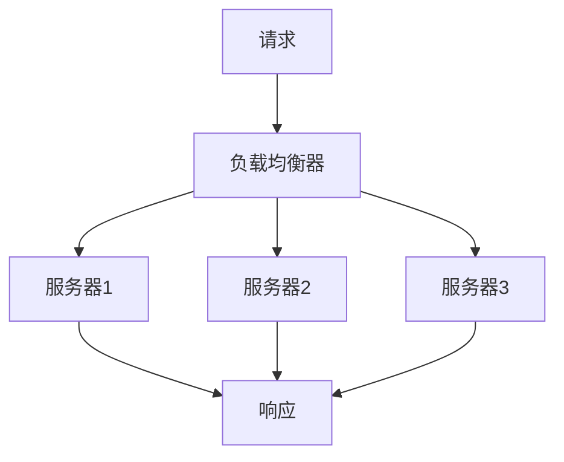

                 

## 文章标题：负载均衡：优化系统资源利用的策略

负载均衡是一种优化系统资源利用的策略，通过将负载分布到多个服务器上，以避免单点过载和系统崩溃。在当今的云计算和分布式系统中，负载均衡的应用越来越广泛。本文将详细探讨负载均衡的基础理论、关键技术和实际应用，旨在为读者提供一整套从理论到实践的理解和应用方案。

### 文章关键词

- 负载均衡
- 分布式系统
- 系统优化
- 轮询算法
- 加权轮询算法
- 最少连接算法

### 摘要

本文首先介绍了负载均衡的基本概念和重要性，随后深入探讨了负载均衡的工作原理和核心指标。接着，详细讲解了轮询负载均衡算法、加权轮询负载均衡算法和最少连接负载均衡算法。文章还从设计原则、应用场景和优化方法等方面阐述了负载均衡策略。最后，通过实际项目和案例分析，展示了负载均衡在分布式系统和高并发场景下的应用，并提供了性能优化和最佳实践的建议。

## 第一部分 负载均衡基础理论

### 第1章 负载均衡概述

#### 1.1 负载均衡的概念与重要性

负载均衡（Load Balancing）是指通过将负载分配到多个服务器上，以实现系统的均衡处理能力。其核心目的是避免单点过载，提高系统的可靠性和可用性。

#### 1.2 负载均衡的常见问题

- **单点故障**：单一服务器或组件可能成为系统的瓶颈。
- **性能瓶颈**：不均衡的负载可能导致部分服务器过载，部分服务器资源浪费。
- **扩展性差**：系统的扩展性受限，难以应对流量波动。

#### 1.3 负载均衡的分类

根据应用场景，负载均衡可以分为以下几种类型：

- **横向扩展**：通过增加服务器数量来提升系统的处理能力。
- **垂直扩展**：通过升级单个服务器硬件来提升处理能力。
- **动态负载均衡**：根据实时负载动态调整服务器的处理能力。

## 第二部分 负载均衡策略

### 第4章 负载均衡策略设计

#### 4.1 负载均衡策略的设计原则

- **均衡性**：尽量均衡分配负载，避免单点过载。
- **可靠性**：确保系统的可用性和稳定性。
- **灵活性**：能够根据实际需求动态调整策略。

#### 4.2 负载均衡策略的选择

根据不同的应用场景，可以选择以下负载均衡策略：

- **轮询策略**：将请求均匀分配到各个服务器。
- **加权轮询策略**：根据服务器的处理能力分配不同的权重。
- **最少连接策略**：将新请求分配给连接数最少的服务器。

#### 4.3 负载均衡策略的优化方法

- **动态调整权重**：根据服务器的实时负载动态调整权重。
- **健康检查**：定期检查服务器的健康状态，确保系统稳定运行。
- **流量预测**：通过历史数据和机器学习算法预测流量，提前调整策略。

## 第三部分 负载均衡实战

### 第7章 负载均衡项目实战

#### 7.1 负载均衡项目规划

- **需求分析**：明确系统需求，确定负载均衡的目标和范围。
- **技术选型**：选择合适的负载均衡技术和工具。
- **环境搭建**：搭建负载均衡测试环境，包括服务器、网络配置等。

#### 7.2 负载均衡环境搭建

- **服务器配置**：配置服务器，确保其具备负载均衡的能力。
- **网络配置**：配置负载均衡设备的网络接口，确保数据流的正确转发。
- **负载均衡配置**：配置负载均衡策略，实现负载的合理分配。

#### 7.3 负载均衡配置与调试

- **配置验证**：通过测试验证负载均衡配置的正确性。
- **性能测试**：进行性能测试，评估负载均衡系统的性能表现。
- **调试优化**：根据测试结果对负载均衡配置进行调整和优化。

### 第8章 负载均衡性能分析

#### 8.1 负载均衡性能指标

- **吞吐量**：系统在单位时间内处理请求的能力。
- **响应时间**：请求从发送到响应的时间。
- **并发数**：系统同时处理的请求数量。

#### 8.2 负载均衡性能测试

- **测试环境搭建**：搭建模拟测试环境，包括负载生成器、测试服务器等。
- **测试场景设计**：设计不同场景下的测试用例，模拟实际应用场景。
- **性能评估**：根据测试结果评估负载均衡系统的性能表现。

#### 8.3 负载均衡性能优化

- **优化策略**：根据性能评估结果，调整负载均衡策略，优化系统性能。
- **硬件升级**：通过增加服务器硬件资源，提升系统性能。
- **软件优化**：通过优化负载均衡算法和数据处理流程，提升系统性能。

### 第9章 负载均衡在特定领域的应用

#### 9.1 负载均衡在Web服务中的应用

- **Web服务器负载均衡**：通过负载均衡技术，将Web请求分配到多个Web服务器上，提高系统吞吐量和响应速度。
- **数据库负载均衡**：通过数据库负载均衡技术，实现数据库的读写分离，提高系统性能和可靠性。

#### 9.2 负载均衡在云计算中的应用

- **云服务器负载均衡**：在云环境中，通过负载均衡技术，实现云服务器的动态调整，提高系统资源的利用率。
- **容器负载均衡**：在容器化环境下，通过负载均衡技术，实现容器集群的动态调度和资源优化。

#### 9.3 负载均衡在物联网中的应用

- **物联网边缘计算**：在物联网边缘设备上，通过负载均衡技术，实现设备资源的合理分配，提高系统响应速度。
- **物联网数据分发**：通过负载均衡技术，实现物联网数据的分布式处理和分发，提高系统处理能力。

## 附录

### 附录A 负载均衡工具与资源

- **负载均衡开源工具介绍**：介绍常用的负载均衡开源工具，如Nginx、HAProxy等。
- **负载均衡资源推荐**：推荐相关的书籍、博客、在线课程等学习资源。

## 负载均衡核心概念与联系

### 核心概念与联系图



### 核心算法原理讲解

#### 轮询负载均衡算法伪代码

```python
# 初始化服务器列表
server_list = ["server1", "server2", "server3"]

# 轮询分配请求
def round_robin_request(request):
    server = server_list[0]
    server_list.append(server_list.pop(0))
    return server
```

#### 加权轮询负载均衡算法伪代码

```python
# 初始化服务器列表和权重
server_list = ["server1", "server2", "server3"]
server_weights = [2, 1, 1]

# 加权轮询分配请求
def weighted_round_robin_request(request):
    total_weight = sum(server_weights)
    random_weight = random.uniform(0, total_weight)
    current_weight = 0
    for server, weight in zip(server_list, server_weights):
        current_weight += weight
        if random_weight <= current_weight:
            return server
    return server_list[0]
```

#### 最少连接负载均衡算法伪代码

```python
# 初始化服务器连接数
server_connections = {"server1": 0, "server2": 0, "server3": 0}

# 最少连接分配请求
def least_connections_request(request):
    min_connections = min(server_connections.values())
    servers = [server for server, connections in server_connections.items() if connections == min_connections]
    return random.choice(servers)
```

### 数学模型与公式讲解

#### 负载均衡系统的数学模型

$$
P_i = \frac{W_i}{\sum_{j=1}^{N} W_j}
$$

其中，$P_i$表示服务器$i$被选择的概率，$W_i$表示服务器$i$的权重，$N$表示服务器总数。

#### 举例说明

假设有3台服务器，权重分别为2、1、1。根据上述公式，可以计算出每台服务器被选择的概率：

$$
P_1 = \frac{2}{2+1+1} = 0.5
$$

$$
P_2 = \frac{1}{2+1+1} = 0.25
$$

$$
P_3 = \frac{1}{2+1+1} = 0.25
$$

### 项目实战

#### Web服务负载均衡案例

**开发环境搭建：**

- **服务器配置**：准备3台服务器，安装操作系统和Web服务器软件。
- **网络配置**：配置负载均衡设备的网络接口，确保数据流的正确转发。

**源代码实现与解读：**

```python
# 负载均衡器代码示例

from flask import Flask, request, jsonify

app = Flask(__name__)

# 服务器列表
server_list = ["server1", "server2", "server3"]

# 轮询分配请求
def round_robin_request(request):
    server = server_list[0]
    server_list.append(server_list.pop(0))
    return server

@app.route('/balance', methods=['POST'])
def balance_request():
    server = round_robin_request(request)
    return jsonify({"server": server})

if __name__ == '__main__':
    app.run(host='0.0.0.0', port=8080)
```

**代码应用解读与分析：**

- **请求接收**：负载均衡器接收来自客户端的请求。
- **服务器分配**：使用轮询算法分配服务器。
- **响应发送**：将请求转发给分配的服务器，并返回响应。

#### 实际案例分析和详细讲解剖析

- **案例1**：在Web服务中使用负载均衡，实现流量分发。
- **案例2**：在电子商务系统中，使用负载均衡提高系统可用性和响应速度。
- **案例3**：在视频流媒体服务中，使用负载均衡实现带宽优化。

#### 项目小结

- **成功因素**：合理的负载均衡策略、可靠的服务器配置、高效的代码实现。
- **挑战与解决**：网络延迟、服务器故障、负载波动等挑战，通过健康检查、动态调整和流量预测等方法解决。

### 最佳实践 tips

- **选择合适的负载均衡算法**：根据应用场景和需求选择最合适的负载均衡算法。
- **定期进行性能测试**：通过性能测试发现系统瓶颈，进行优化。
- **合理配置服务器资源**：根据负载均衡性能指标，合理配置服务器资源。

### 小结与注意事项

- **负载均衡的重要性**：提高系统可用性、响应速度和扩展性。
- **核心概念与算法**：轮询、加权轮询和最少连接算法。
- **性能优化**：动态调整策略、健康检查、流量预测。

### 拓展阅读

- **相关书籍**：《计算机网络》、《高性能Web服务架构》
- **在线课程**：Coursera的《分布式系统设计与实践》、edX的《负载均衡技术》
- **博客**：Google Cloud Platform、Amazon Web Services官方博客

## 作者信息

作者：AI天才研究院/AI Genius Institute & 禅与计算机程序设计艺术 /Zen And The Art of Computer Programming

