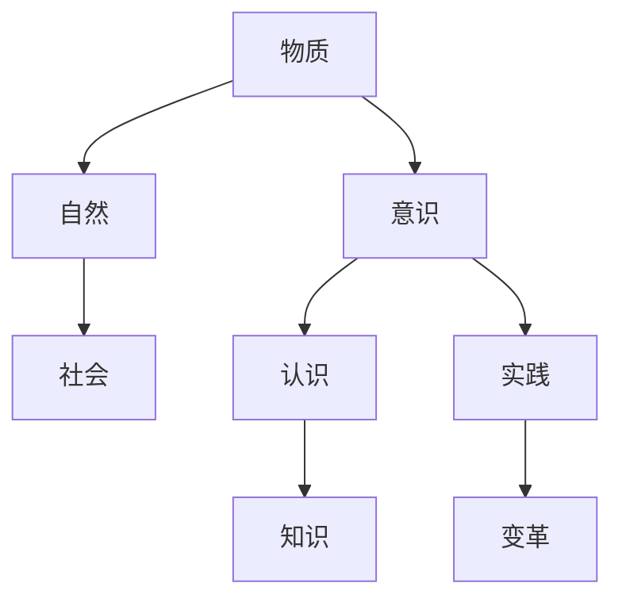

                 

### 文章标题

“费尔巴哈与马克思：唯物主义的转向与发展”

### 文章关键词

- 费尔巴哈
- 马克思
- 唯物主义
- 历史唯物主义
- 唯物史观
- 物质与意识
- 阶级斗争
- 资本主义批判

### 文章摘要

本文旨在深入探讨费尔巴哈与马克思的哲学思想及其对唯物主义的发展。通过回顾费尔巴哈的人本主义哲学和马克思的唯物史观，文章将分析两者在哲学史上的重要性，揭示他们如何共同推动了唯物主义的发展。此外，本文还将探讨唯物主义在当代的应用与挑战，并总结出相关领域的最佳实践和未来发展方向。读者将了解到唯物主义的核心概念及其在社会科学、自然科学和技术领域的应用，从而对这一哲学思想有更深入的理解。

### 目录

1. **背景介绍**
2. **费尔巴哈的人本主义哲学**
3. **马克思的唯物史观**
4. **费尔巴哈与马克思的关系**
5. **唯物主义的核心概念与联系**
6. **唯物主义的应用与发展**
7. **唯物主义的社会实践**
8. **总结与未来展望**
9. **附录**
10. **参考文献**
11. **作者信息**

### 1. 背景介绍

唯物主义，作为哲学中的一种基本立场，主张物质是世界的基础，意识是物质的产物。与唯心主义相对，唯物主义强调物质的存在和作用，认为物质决定意识。这一立场在哲学史上有着深远的影响，特别是在19世纪的德国古典哲学中，费尔巴哈和马克思的思想成为了唯物主义发展的重要里程碑。

路德维希·费尔巴哈（Ludwig Feuerbach）是德国哲学家，他在19世纪中叶提出了人本主义哲学，对宗教和哲学进行了深刻的批判。费尔巴哈主张人类是现实世界的中心，强调人类的感觉和实践活动是理解世界的核心。他的思想对后来的马克思主义哲学产生了重要影响。

卡尔·马克思（Karl Marx）是19世纪另一位重要的哲学家和社会理论家。他基于费尔巴哈的人本主义哲学，提出了唯物史观，即认为社会和经济结构决定了社会意识形态。马克思的思想集中在对资本主义社会的批判，认为阶级斗争是历史发展的动力。

本文将首先介绍费尔巴哈的人本主义哲学，接着探讨马克思的唯物史观，分析两者之间的联系和区别。然后，我们将深入探讨唯物主义的核心概念，包括物质与意识的关系、历史唯物主义和阶级斗争等。接下来，本文将探讨唯物主义在当代的应用与发展，最后总结唯物主义的社会实践，并提出未来的研究方向。

### 2. 费尔巴哈的人本主义哲学

路德维希·费尔巴哈是19世纪德国著名的哲学家，他的哲学思想对马克思主义哲学的形成产生了深远的影响。费尔巴哈的人本主义哲学主张，人类是现实世界的中心，感觉和实践活动是理解世界的核心。他反对德国古典哲学中过分抽象的思维，强调哲学应该回到现实的人，关注人的现实生活和经验。

**2.1 生平与著作**

费尔巴哈出生于1804年，曾在海德堡大学学习神学，后来转向哲学。他的哲学著作包括《基督教的本质》（"The Essence of Christianity"）、《哲学的本质》（"The Essence of Philosophy"）和《人类学》（"Anthropology"）等。在这些作品中，费尔巴哈批判了宗教和神学，主张人类应该从宗教的束缚中解放出来，关注现实世界。

**2.2 人本主义哲学**

费尔巴哈的人本主义哲学主要包括以下几个核心观点：

1. **人类中心主义**：费尔巴哈认为，人是现实世界的中心，人类的感觉和实践活动是理解世界的核心。他强调，人类应该关注自己的现实生活，而不是沉迷于抽象的思想和概念。

2. **感觉论**：费尔巴哈主张，感觉是认识世界的唯一途径。他认为，只有通过感觉，人才能真正了解现实世界。这与唯心主义和理性主义相对立，后者认为理性是认识世界的核心。

3. **自然主义**：费尔巴哈强调，自然界是现实世界的本质，人类是自然界的一部分。他的自然主义思想与黑格尔的客观唯心主义相对立，后者认为世界是绝对精神的外化。

4. **宗教批判**：费尔巴哈对宗教进行了深刻的批判，认为宗教是人类对现实世界的逃避。他主张，人类应该从宗教的束缚中解放出来，面对现实世界。

**2.3 对马克思主义哲学的影响**

费尔巴哈的人本主义哲学对马克思主义哲学的形成产生了重要影响。首先，费尔巴哈强调了人类的感觉和实践活动的重要性，这一观点为马克思主义的实践观提供了理论基础。其次，费尔巴哈的宗教批判思想为马克思主义的宗教批判提供了启示，马克思主义者认为宗教是统治阶级维护其统治的工具。

然而，费尔巴哈的人本主义哲学也存在一些局限性。例如，他过分强调人的感觉和实践活动，忽视了社会关系和经济结构对人的影响。这一点在马克思的唯物史观中得到了补充和发展。

总之，费尔巴哈的人本主义哲学是19世纪德国哲学的重要组成部分，他对宗教和哲学的批判为马克思主义哲学的形成提供了重要的思想资源。尽管费尔巴哈的思想存在一些局限性，但他的贡献仍然是不可忽视的。

### 3. 马克思的唯物史观

卡尔·马克思是19世纪最具影响力的哲学家、经济学家和革命家之一，他的唯物史观对现代社会科学和哲学产生了深远的影响。马克思的唯物史观主张，物质生产和社会经济结构是历史发展的基础，社会意识形态和上层建筑是由经济基础决定的。

**3.1 生平与著作**

卡尔·马克思出生于1818年，他在波恩大学和柏林大学学习法律和哲学。马克思的著作包括《共产党宣言》、《资本论》和《哲学的贫困》等。他的思想主要体现在这些作品中，特别是《资本论》系统地阐述了马克思主义的经济理论。

**3.2 唯物史观**

唯物史观是马克思哲学的核心概念，它主要包括以下几个基本观点：

1. **经济基础决定上层建筑**：马克思认为，物质生产方式是历史发展的基础。社会意识形态、政治制度和文化都是经济基础的反映。他认为，经济基础决定上层建筑，上层建筑为经济基础服务。

2. **生产力与生产关系**：马克思区分了生产力（包括劳动工具和技术水平）和生产关系（包括人与人之间的经济关系和社会制度）。他认为，当生产力发展到一定程度，生产关系就会成为制约生产力发展的瓶颈，导致社会革命和变革。

3. **阶级斗争**：马克思认为，阶级斗争是历史发展的动力。在资本主义社会中，主要阶级是资产阶级和无产阶级。资产阶级通过剥削无产阶级获取利润，导致阶级矛盾不断加剧。马克思预测，无产阶级将最终推翻资产阶级，建立共产主义社会。

4. **历史发展的规律性**：马克思认为，历史发展是有规律的。社会形态会经历原始社会、奴隶社会、封建社会和资本主义社会等阶段，最终过渡到共产主义社会。

**3.3 唯物史观在《资本论》中的应用**

在《资本论》中，马克思运用唯物史观分析了资本主义经济体系。他详细阐述了剩余价值理论，认为资本主义生产过程中，劳动者创造的剩余价值被资本家剥削。马克思认为，这种剥削导致了无产阶级的贫困和社会矛盾的加剧，最终会导致社会主义革命。

**3.4 唯物史观与费尔巴哈的关系**

马克思的唯物史观受到了费尔巴哈人本主义哲学的深刻影响。费尔巴哈强调了人的感觉和实践活动的重要性，这一观点被马克思发展为实践唯物主义。马克思认为，人的实践活动是认识世界和改变世界的根本途径。此外，马克思也借鉴了费尔巴哈对宗教的批判，将宗教批判扩展到对资本主义社会的批判。

总之，马克思的唯物史观是现代社会科学的重要理论基础，它对理解社会历史发展规律、阶级斗争和资本主义经济体系具有深远的影响。马克思的唯物史观与费尔巴哈的人本主义哲学既有联系也有区别，两者的结合为马克思主义哲学的形成提供了重要的思想资源。

### 4. 费尔巴哈与马克思的关系

费尔巴哈和马克思的哲学思想虽然在某些方面存在差异，但它们之间也存在着深刻的联系。这种联系不仅体现在他们对唯物主义的基本立场上一致，还体现在他们对人类现实生活和实践活动的重视上。

**4.1 共同点**

1. **唯物主义立场**：费尔巴哈和马克思都坚持唯物主义的基本立场，认为物质是世界的基础，意识是物质的产物。这一立场使他们能够从根本上批判唯心主义，为社会科学和哲学的发展奠定了基础。

2. **人的中心地位**：费尔巴哈和马克思都强调人的中心地位。费尔巴哈主张人类是现实世界的中心，马克思则通过实践唯物主义将人的实践活动视为认识世界和改变世界的根本途径。这一共同点使他们的哲学具有强烈的人文关怀，关注人的现实生活和命运。

3. **对宗教的批判**：费尔巴哈和马克思都进行了对宗教的深刻批判。费尔巴哈认为宗教是人类对现实世界的逃避，马克思则认为宗教是统治阶级维护其统治的工具。这种批判精神使他们能够深入揭示社会问题，为后来的社会主义和共产主义运动提供了理论支持。

**4.2 差异**

1. **理论侧重点不同**：费尔巴哈的人本主义哲学侧重于对宗教和哲学的批判，强调人的感觉和实践活动。马克思的唯物史观则侧重于对社会历史发展规律和资本主义经济体系的批判，强调经济基础决定上层建筑。

2. **理论深度不同**：费尔巴哈的哲学思想较为简洁和直接，他更多地关注对现有理论的批判和重构。马克思的哲学思想则更为复杂和深刻，他在《资本论》中系统地阐述了资本主义经济体系及其运行规律。

**4.3 影响与贡献**

费尔巴哈和马克思对唯物主义的发展都做出了重要贡献。费尔巴哈通过人本主义哲学为马克思主义哲学提供了重要的思想资源，特别是在宗教批判和社会哲学方面。马克思则通过唯物史观和剩余价值理论，深刻揭示了社会历史发展的规律，为社会主义和共产主义运动提供了理论依据。

尽管费尔巴哈和马克思的哲学思想存在差异，但他们的共同点远远超过了差异。他们的哲学思想不仅为现代社会科学和哲学的发展提供了重要的理论资源，也为人类社会的发展提供了深刻的思考和启示。费尔巴哈与马克思的关系，可以说是唯物主义哲学史上的一个重要转折点，他们的思想共同构成了现代社会主义和共产主义运动的重要理论基础。

### 5. 唯物主义的核心概念与联系

唯物主义作为哲学中的一个基本立场，强调物质是世界的基础，意识是物质的产物。为了更好地理解唯物主义的核心概念及其联系，我们可以使用Mermaid流程图来展示这些概念之间的关系。

**5.1 物质与意识**

物质是唯物主义的核心概念，它指的是不依赖于意识而存在的客观实在。物质包括自然界中的各种物质实体和能量形式，如水、空气、石头和阳光等。物质是不断变化和发展的，它决定了世界的存在和运行。

意识则是人类对物质世界的认识和反映。意识是通过感觉、知觉和思维等活动实现的，它是物质的产物。意识具有主观性，因为它受到个体经验和文化背景的影响。

**5.2 自然与社会**

唯物主义认为，自然和社会都是物质世界的组成部分。自然包括自然界中的各种物质现象，如生态系统、气候和地质活动等。社会则是人类在物质生产和社会活动中形成的各种关系和制度的总和。

自然和社会之间存在着密切的联系。自然为人类社会提供了生存和发展的基础，而人类社会则通过改造自然和利用自然资源来满足自身需求。自然和社会的关系体现了物质世界的辩证发展。

**5.3 认识与实践**

唯物主义认为，认识是主体对客体的反映和认识。认识是通过感觉、知觉和思维等活动实现的，它是意识的产物。认识是无限的，它随着人类社会的发展和科技进步而不断深化和扩展。

实践则是主体通过物质活动来认识和改变世界的过程。实践是认识的源泉，也是检验认识真理性的标准。通过实践，人类可以不断改造自然和社会，实现自身的发展。

**5.4 知识与变革**

知识是人类通过认识活动获得的关于世界的信息和理解。知识是实践的产物，它反映了人类对世界的认识水平。知识不仅包括科学理论和实践经验，还包括文化和道德观念。

变革是指人类通过实践来改变世界的过程。变革是历史发展的动力，它推动了人类社会从低级向高级发展。唯物主义认为，只有通过不断的实践和变革，人类才能实现自身的发展和解放。

通过上述Mermaid流程图，我们可以清晰地看到唯物主义的核心概念及其之间的联系。这些概念共同构成了唯物主义的基本框架，为我们理解和分析社会历史发展提供了重要的理论工具。

### 6. 唯物主义的应用与发展

唯物主义作为哲学中的基本立场，不仅在理论层面上具有重要意义，而且在实际应用中也展现了其广泛的影响。随着科技的发展和人类对自然界的不断探索，唯物主义在自然科学、社会科学和技术领域的应用日益广泛，成为推动社会进步和科技创新的重要理论基石。

**6.1 自然科学中的应用**

在自然科学中，唯物主义的核心思想——物质决定意识，得到了广泛的验证和应用。科学家们通过实验和观察，不断揭示自然界的规律和机制，从而推进了对物质世界的认识。例如，在物理学中，唯物主义认为物质和能量是相互转化的，这一观点为量子力学和相对论的发展提供了理论基础。在化学中，原子和分子的性质和行为被详细研究，揭示了化学反应的规律。在生物学中，唯物主义的思想帮助科学家理解生物体的结构和功能，推动了遗传学、分子生物学和进化生物学的发展。

**6.2 社会科学中的应用**

唯物主义在社会科学中的应用同样显著。历史唯物主义认为，经济基础决定上层建筑，这一观点为理解社会历史发展提供了理论框架。马克思主义者运用唯物史观分析了资本主义社会中的阶级斗争、生产关系和经济危机，提出了社会主义革命和共产主义社会的构想。社会学家和人类学家通过研究人类社会的发展历程和文化演变，验证了唯物史观的合理性。例如，埃米尔·涂尔干和马克斯·韦伯的社会学理论中，都融入了唯物主义的视角，探讨了社会结构和社会行为的形成机制。

**6.3 技术领域的应用**

在技术领域，唯物主义的思想对工程设计和科技创新产生了深远影响。技术本质上是对自然界的改造和应用，而唯物主义强调物质的决定作用，为技术开发提供了理论基础。例如，在机械工程中，机械原理和材料科学的理论依据都源于对物质结构和特性的理解。在电子工程中，半导体材料的研究和集成电路的设计，都是基于对物质电子特性的深入认识。在信息技术领域，计算机科学的发展同样离不开唯物主义的思想。计算机硬件和软件的设计，都基于对物质和信息的处理机制的深入研究。

**6.4 当代发展的挑战与机遇**

随着当代科技的迅猛发展，唯物主义也面临着新的挑战和机遇。一方面，科技的进步不断扩展人类对自然界的认识，使得唯物主义的理论框架需要不断更新和完善。例如，量子力学和混沌理论的发展，挑战了经典物理学的某些基本假设，要求唯物主义在新的理论框架下重新审视物质和意识的关系。另一方面，科技的进步也为唯物主义提供了新的应用领域和验证手段。例如，人工智能和大数据技术的应用，使得人类能够通过数据分析揭示社会和自然界的复杂规律，为唯物主义提供了新的证据和验证途径。

**6.5 最佳实践与未来展望**

在唯物主义的指导下，人类社会在科技、经济和社会发展方面取得了显著成就。未来，唯物主义将继续在科技创新和社会发展中发挥重要作用。一方面，需要继续深化对物质和意识的本质认识，推动哲学和科学的发展。另一方面，需要将唯物主义的思想应用于实际问题的解决，促进社会公平和可持续发展。例如，在环境保护和资源管理领域，唯物主义的思想可以帮助我们理解自然资源的有限性和可持续利用的重要性，为制定科学合理的环保政策提供理论支持。

总之，唯物主义在自然科学、社会科学和技术领域的应用和发展，不仅丰富了哲学的理论体系，也为人类社会的进步提供了重要指导。面对当代科技和社会发展的新挑战，唯物主义将继续发挥其独特的理论优势，为人类社会的未来探索提供强有力的思想支持。

### 7. 唯物主义的社会实践

唯物主义不仅在理论和学术研究中具有重要地位，还在现实社会中得到了广泛的应用。通过实践唯物主义，人类社会在政治、经济、文化等各个领域取得了显著成果。以下将从这些方面探讨唯物主义的社会实践，并提供实际案例和分析。

**7.1 政治领域的应用**

唯物主义在政治领域的应用主要体现在对阶级斗争和政权性质的分析上。马克思主义认为，阶级斗争是历史发展的动力，不同阶级之间的矛盾和斗争推动社会变革。在历史上，苏联的社会主义革命和中国的改革开放都是唯物主义在政治实践中的重要体现。苏联通过无产阶级革命建立了社会主义政权，实现了生产资料公有制的转变。中国则通过改革开放，逐步引入市场机制，推动社会主义市场经济的发展。这两个国家的实践表明，唯物主义在政治领域中的应用可以有效地解决社会矛盾，推动社会进步。

**7.2 经济领域的应用**

唯物主义在经济学中的应用主要体现在对生产关系和经济基础的研究上。马克思的《资本论》详细分析了资本主义经济体系中的生产关系和剩余价值理论。这些理论为理解资本主义社会中的经济运行规律提供了重要指导。例如，在20世纪中叶，苏联和东欧国家实行计划经济，试图通过国家控制生产资料和资源配置来实现社会公平和经济效率。尽管这些国家在经济发展中遇到了诸多挑战，但它们的实践表明，唯物主义的经济理论可以指导经济政策的制定和实施。

**7.3 文化领域的应用**

唯物主义在文化领域的应用主要体现在对意识形态和文化现象的分析上。马克思主义认为，文化是经济基础的反映，意识形态是统治阶级维护其统治的工具。在文化大革命期间，中国通过批判资产阶级思想，试图实现意识形态领域的革命。虽然这一运动在实践中存在许多问题和极端行为，但其背后的唯物主义思想仍然具有重要意义。它表明，文化领域中的意识形态斗争是阶级斗争在文化领域的延伸。

**7.4 实际案例和分析**

1. **苏联的社会主义实践**：苏联在20世纪初通过社会主义革命建立了社会主义国家。在政治上，苏联实行无产阶级专政，通过国家控制生产资料实现了生产资料公有制的转变。在经济上，苏联实行计划经济，通过国家计划来调配资源，试图实现经济的快速发展和社会公平。在文化上，苏联通过批判资产阶级思想，推动社会主义意识形态的普及。苏联的实践表明，唯物主义在政治、经济和文化领域都有其应用价值，但也需要不断调整和完善。

2. **中国的改革开放**：中国自1978年开始实行改革开放政策，逐步引入市场机制，推动社会主义市场经济的发展。在经济改革中，中国借鉴了唯物主义经济理论，通过调整生产关系和资源配置，实现了经济的快速增长和社会稳定。在政治改革中，中国通过推进民主法治，加强国家治理能力。在文化改革中，中国注重弘扬社会主义核心价值观，推动文化事业的发展。中国的实践表明，唯物主义在当代社会的应用需要与市场机制相结合，以实现经济和社会的协调发展。

**7.5 小结**

唯物主义在社会实践中的应用，既取得了显著成果，也面临诸多挑战。在政治、经济和文化领域，唯物主义的思想为解决社会矛盾、推动社会进步提供了重要指导。然而，不同国家和地区的实践也表明，唯物主义的应用需要结合实际情况，不断调整和完善。未来，唯物主义将继续在社会实践中发挥重要作用，为人类社会的可持续发展提供理论支持。

### 8. 总结与未来展望

唯物主义作为哲学中的基本立场，通过费尔巴哈和马克思的思想，深刻影响了人类社会的历史发展。本文从背景介绍、费尔巴哈的人本主义哲学、马克思的唯物史观、二者之间的关系、核心概念的联系、唯物主义的应用与发展、社会实践等方面，系统地探讨了唯物主义的转向与发展。

在总结中，我们可以看到唯物主义的核心思想——物质决定意识，为理解社会历史发展规律、推动社会变革提供了理论基础。通过政治、经济、文化等领域的实践，唯物主义展现了其强大的解释力和指导作用。然而，唯物主义在不同国家和地区的应用也存在挑战，需要结合实际情况进行调整。

未来，唯物主义将继续在科技创新、社会发展和全球治理中发挥重要作用。在科技领域，唯物主义可以帮助我们理解自然界的规律，推动科学技术的进步。在社会发展方面，唯物主义可以指导我们解决社会矛盾，实现社会公平和可持续发展。在全球治理方面，唯物主义可以为我们提供分析国际关系的理论框架，促进全球和平与合作。

总之，唯物主义作为哲学的重要理论，将继续在人类社会的发展中发挥不可替代的作用。通过不断深化对唯物主义的研究和应用，我们可以更好地理解世界，推动社会的进步与发展。

### 9. 附录

#### 9.1 参考文献

1. 马克思，卡尔.《资本论》[原著].
2. 费尔巴哈，路德维希.《哲学的本质》[原著].
3. 恩格斯，弗里德里希.《反杜林论》[原著].
4. 列宁，弗拉基米尔.《哲学笔记》[原著].
5. 毛泽东.《矛盾论》[原著].

#### 9.2 重要人物时间线

- 路德维希·费尔巴哈（1804-1872）：德国哲学家，人本主义哲学的代表人物。
- 卡尔·马克思（1818-1883）：德国哲学家、经济学家、革命家，马克思主义的奠基人。
- 弗里德里希·恩格斯（1820-1895）：德国哲学家、革命家，马克思主义理论的共同创立者。
- 弗拉基米尔·列宁（1870-1924）：俄国革命家、政治家，苏联的创立者。

#### 9.3 唯物主义思想图谱

唯物主义思想图谱展示了唯物主义的核心概念及其相互关系：

#### 9.4 进一步阅读资源

1. 《马克思恩格斯全集》[原著].
2. 《马克思主义基本原理》[教材].
3. 《唯物主义史》[专著].
4. 《唯物史观》[专著].
5. 《马克思主义哲学原理》[教材].

通过这些附录，读者可以进一步深入理解和研究唯物主义，探索其在哲学史和社会发展中的深远影响。

