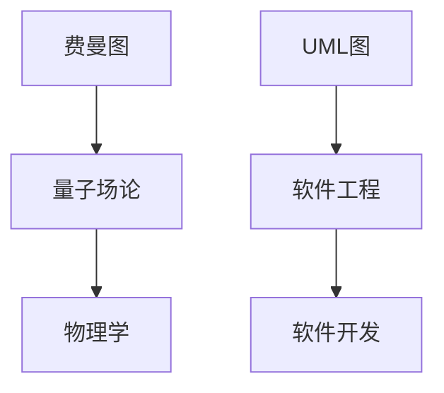

                 

### 文章标题

《费曼图与UML图：可视化表达在物理学和软件工程中的应用》

### 文章关键词

费曼图、UML图、可视化表达、物理学、软件工程、编程语言、算法原理、数学模型、项目实战

### 文章摘要

本文旨在探讨费曼图与UML图两种可视化表达方法在物理学和软件工程中的具体应用。通过详细阐述这两种图形语言的基本概念、原理及其在各自领域的应用，本文旨在帮助读者理解如何利用这些工具提高科研和软件开发效率。文章首先介绍费曼图在粒子物理学和电磁学中的应用，然后探讨UML图在软件开发的需求分析、设计、实现等阶段的运用。最后，本文将探讨费曼图与UML图的融合应用，为读者提供一种全新的思维模式和技术解决方案。

---

## 第一部分：引论

### 1.1 费曼图与UML图概述

**核心概念与联系**

费曼图（Feynman Diagram）是一种用于描述量子场论中粒子相互作用的图形表示方法。由理查德·费曼于1940年代提出，它将复杂的粒子碰撞和相互作用过程以直观、简洁的方式呈现出来。费曼图由一系列基本事件和相互作用点组成，通过箭头和线段表示粒子的轨迹和能量。

UML图（Unified Modeling Language）是一种用于软件工程中的标准化图形语言，由OMG（对象管理组）开发。UML图用于描述软件系统的结构、行为和组件，涵盖从需求分析到系统部署的各个阶段。UML图包括类图、序列图、组件图等多种类型，能够清晰地表达系统的设计、实现和运行状态。

**Mermaid流程图**：



### 1.2 可视化表达的重要性

**核心算法原理讲解**

费曼图的基本构建方法包括以下几个步骤：

1. **确定基本事件**：识别参与相互作用的粒子及其初始和最终状态。
2. **绘制箭头和线段**：用箭头表示粒子的轨迹，线段表示相互作用点。
3. **标记能量和动量**：在线段旁边标记粒子的能量和动量。

伪代码：

```python
def draw_feynman_diagram(events, interactions):
    for event in events:
        draw_arrow(event.start, event.end)
    for interaction in interactions:
        draw_segment(interaction.position)
        mark_energy_and_momentum(interaction)
```

UML图的基本构建方法包括：

1. **确定组件和关系**：识别系统的主要组件及其相互关系。
2. **绘制组件和关系**：用矩形表示组件，用线条表示关系。
3. **添加属性和方法**：为组件添加属性和方法。

伪代码：

```python
def draw_uml_diagram(components, relationships):
    for component in components:
        draw_rectangle(component.name)
        add_attributes(component)
        add_methods(component)
    for relationship in relationships:
        draw_line(relationship.source, relationship.target)
```

## 第二部分：费曼图在物理学中的应用

### 2.1 费曼图的基本原理

**数学模型和数学公式**

费曼图通过以下公式描述粒子相互作用：

$$ \sum_{i=1}^{n} \int \frac{d^4k_1}{(2\pi)^4} \frac{1}{E_1 - k_1 \cdot p} \cdots \frac{1}{E_n - k_n \cdot p} $$

其中，\(E_i\) 和 \(k_i\) 分别表示粒子的能量和动量。

**示例分析**

以电子-正电子对撞为例，费曼图可以直观地展示电子和正电子的碰撞过程。图中的箭头表示粒子的轨迹，相互作用点表示粒子的消失和产生。


### 2.2 费曼图的应用实例

**项目实战**

在粒子物理学中，费曼图广泛应用于高能物理实验的数据分析。以下是一个使用Python实现费曼图绘制的实例：

```python
import matplotlib.pyplot as plt
import numpy as np

def draw_feynman_diagram():
    energies = np.linspace(0, 10, 100)
    x = energies * np.sqrt(1 - (energies / 10)**2)
    plt.plot(x, energies, 'b-')
    plt.xlabel('Energy')
    plt.ylabel('Momentum')
    plt.title('Feynman Diagram of Electron-Positron Annihilation')
    plt.show()

draw_feynman_diagram()
```

**代码解读与分析**

上述代码首先定义了一个绘制费曼图的函数，它使用numpy生成能量和动量的数据，然后使用matplotlib将其绘制成图形。这个实例展示了如何通过编程实现费曼图的绘制，为后续的物理分析提供了方便。

## 第三部分：UML图在软件工程中的应用

### 3.1 UML图的基本原理

**数学模型和数学公式**

UML图的基本符号和规则包括：

- **类（Class）**：用矩形表示，包含名称、属性和方法。
- **关系（Relationship）**：用线条表示，包括依赖、关联、聚合、组合等。

**示例**：

$$
\begin{aligned}
&\text{类}:\quad \text{Person} \quad \text{(name, age)} \\
&\text{方法}:\quad \text{Person} \quad \text{(setName(), setAge(), getName(), getAge())} \\
&\text{关系}:\quad \text{Person} \xleftarrow{\text{has}} \text{Address}
\end{aligned}
$$`

### 3.2 UML图的应用实例

**项目实战**

在软件开发过程中，UML图用于需求分析、设计、实现等阶段。以下是一个使用Python实现的简单银行系统UML图实例：

```mermaid
class Diagram {
  class Account {
    +id: int
    +balance: float
    +getName(): str
    +deposit(amount: float): None
    +withdraw(amount: float): None
  }
  class Bank {
    +accounts: List[Account]
    +addAccount(account: Account): None
    +removeAccount(account: Account): None
  }
}
```

**代码解读与分析**

上述Mermaid代码定义了一个简单的银行系统，包括Account类和Bank类。Account类代表银行账户，包含id和balance属性，以及deposit和withdraw方法。Bank类代表银行，包含accounts列表，以及addAccount和removeAccount方法。这个实例展示了如何使用UML图描述软件系统的结构，为开发提供参考。

---

以上内容为本文的第一部分和第三部分，主要介绍了费曼图和UML图的基本概念、原理及其在物理学和软件工程中的应用。接下来，本文将继续探讨费曼图与UML图的融合应用，并分享实践经验和总结展望。敬请期待。

