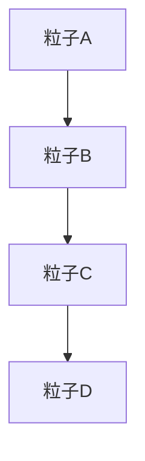
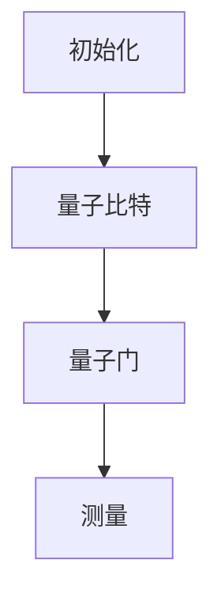
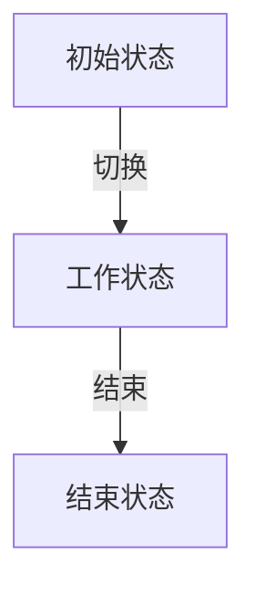
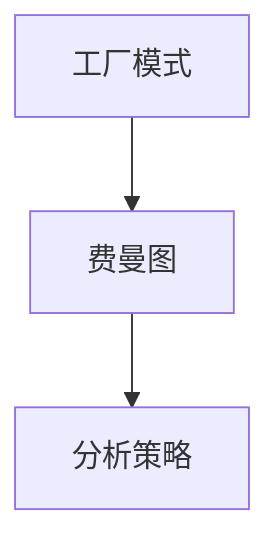
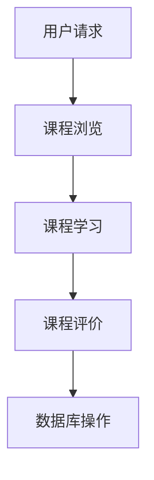

                 

### 费曼图与设计模式：复杂交互的可视化表达

#### 关键词：
费曼图、设计模式、复杂交互、可视化表达、软件设计、量子场论

#### 摘要：
本文将探讨费曼图与设计模式在复杂交互可视化表达中的应用。通过阐述费曼图和设计模式的基本概念，介绍它们的核心原理和联系，并结合具体项目案例，展示如何使用这些工具来简化复杂交互过程，提高软件设计的效率和质量。

#### 目录：

# 费曼图与设计模式：复杂交互的可视化表达

## 引言
### 1.1 费曼图与设计模式的背景
### 1.2 本文的目标和结构

## 第一部分：费曼图原理

## 第二部分：设计模式原理

## 第三部分：费曼图与设计模式的关系

## 第四部分：实际项目案例

## 第五部分：总结与展望

### 引言

#### 1.1 费曼图与设计模式的背景

费曼图是量子场论中的一种工具，由物理学家理查德·费曼提出，用于简化复杂物理过程的描述。设计模式则是软件工程中的一种方法，用于解决软件开发过程中常见的复杂问题。尽管它们起源于不同的领域，但在处理复杂交互方面有着相似的作用。

本文旨在探讨费曼图与设计模式在复杂交互可视化表达中的应用。首先，我们将详细介绍费曼图和设计模式的基本概念，包括它们的定义、特点和适用场景。然后，我们将分析费曼图与设计模式之间的关系，探讨它们如何相互补充，共同提高软件设计的效率和质量。

#### 1.2 本文的目标和结构

本文的目标是帮助读者理解费曼图和设计模式在复杂交互可视化表达中的应用，并掌握如何使用这些工具来解决实际问题。具体来说，本文将：

1. 介绍费曼图和设计模式的基本概念和原理；
2. 分析费曼图与设计模式之间的关系和联系；
3. 结合实际项目案例，展示如何使用费曼图和设计模式来简化复杂交互过程；
4. 总结本文的主要观点和结论，展望未来研究方向。

本文的结构如下：

- **第一部分**：费曼图原理，介绍费曼图的基本概念、原理和应用；
- **第二部分**：设计模式原理，介绍设计模式的基本概念、类型和特点；
- **第三部分**：费曼图与设计模式的关系，分析它们之间的联系和互补性；
- **第四部分**：实际项目案例，结合具体项目案例，展示如何使用费曼图和设计模式来简化复杂交互过程；
- **第五部分**：总结与展望，总结本文的主要观点和结论，展望未来研究方向。

## 第一部分：费曼图原理

### 1. 费曼图的基本概念

#### 费曼图的定义

费曼图是一种用于描述物理过程的方法，由物理学家理查德·费曼在1948年提出。它通过将复杂的过程分解为基本事件和相互作用，从而简化了问题的描述。费曼图在量子场论、粒子物理学等领域得到了广泛应用，成为一种强大的工具。

#### 费曼图的特点

1. **可视性**：费曼图通过图形的方式展示了物理过程，使得复杂的计算变得更加直观和易于理解。
2. **模块性**：费曼图将复杂过程分解为基本事件和相互作用，每个基本事件和相互作用都可以独立进行分析和计算。
3. **简化性**：费曼图通过将复杂过程分解为基本事件和相互作用，减少了计算量，提高了计算效率。

#### 费曼图的适用场景

1. **量子场论**：费曼图在量子场论中得到了广泛应用，用于计算散射振幅、相互作用等。
2. **粒子物理学**：费曼图在粒子物理学中用于描述粒子的相互作用和反应过程。
3. **其他领域**：费曼图在其他领域，如统计物理、凝聚态物理等，也有一定的应用。

### 2. 费曼图的基本结构

#### 费曼图的基本元素

1. **点**：代表基本事件，如粒子的产生和衰变。
2. **线**：代表相互作用，如粒子之间的碰撞和散射。
3. **箭头**：代表粒子的运动方向和能量流动。

#### 费曼图的绘制方法

1. **基本事件**：在费曼图中，基本事件通常用点来表示。例如，一个粒子的产生或衰变可以表示为一个点。
2. **相互作用**：在费曼图中，相互作用通常用线来表示。例如，两个粒子之间的碰撞可以表示为一条线。
3. **箭头**：在费曼图中，箭头表示粒子的运动方向和能量流动。通常，箭头指向粒子的运动方向。

### 3. 费曼图的应用实例

#### 实例 1：粒子散射

假设有两个粒子A和B，它们在相互作用后发生散射，产生新的粒子C和D。这个过程的费曼图可以表示为：



在这个费曼图中，A和B表示基本事件，即粒子的产生；B、C和D表示相互作用，即粒子的散射过程。

#### 实例 2：量子计算

在量子计算中，费曼图用于描述量子态的演化过程。例如，一个量子比特（qubit）的初始化、量子门的操作和测量等过程都可以用费曼图来表示。



在这个费曼图中，A表示量子比特的初始化，Q表示量子比特的状态，G表示量子门操作，M表示量子比特的测量。

### 4. 费曼图与设计模式的关系

#### 费曼图与设计模式

费曼图和设计模式虽然来自不同的领域，但它们在处理复杂交互方面有着相似的作用。设计模式是软件工程中用于解决复杂问题的方法，而费曼图则是物理学中用于描述复杂过程的工具。

#### 费曼图在设计模式中的应用

费曼图可以用于设计模式中的复杂交互可视化表达。例如，在状态模式中，费曼图可以用于描述状态之间的转换关系；在命令模式中，费曼图可以用于描述命令的执行过程。



在这个费曼图中，State1表示初始状态，State2表示工作状态，State3表示结束状态。箭头表示状态之间的转换关系。

#### 设计模式在费曼图中的应用

设计模式也可以应用于费曼图的绘制和分析中。例如，在费曼图的绘制过程中，可以使用工厂模式来生成基本事件和相互作用；在费曼图的分析过程中，可以使用策略模式来选择不同的分析策略。



在这个费曼图中，Factory表示工厂模式，用于生成基本事件和相互作用；FeynmanDiagram表示费曼图，用于描述物理过程；Analysis表示分析策略，用于分析费曼图。

### 结论

费曼图和设计模式都是处理复杂交互的有效工具。费曼图通过图形的方式描述复杂过程，使得问题更加直观和易于理解；设计模式则通过预定义的解决方案，提高了软件设计的效率和质量。

本文介绍了费曼图的基本概念、原理和应用，分析了费曼图与设计模式之间的关系，并展示了如何使用费曼图和设计模式来简化复杂交互过程。

在接下来的章节中，我们将进一步探讨设计模式的基本概念、原理和应用，以及如何将费曼图和设计模式应用于实际项目案例中。

## 第二部分：设计模式原理

### 1. 设计模式的基本概念

#### 设计模式

设计模式是软件开发中用于解决特定问题的通用解决方案。它不仅包含了一个问题的解决方案，还包含了解决问题的环境和限制条件。设计模式的目标是提高软件的可维护性、可扩展性和重用性。

#### 设计模式的特点

1. **通用性**：设计模式是通用的解决方案，可以适用于不同的编程语言和开发环境。
2. **复用性**：设计模式可以复用于不同的项目，减少重复开发的工作量。
3. **灵活性**：设计模式提供了一系列可扩展的解决方案，可以根据具体需求进行调整。
4. **易理解性**：设计模式通常使用简单的结构来描述复杂的交互关系，使得问题更加直观和易于理解。

#### 设计模式的类型

设计模式主要分为三类：创建型模式、结构型模式和行为型模式。

1. **创建型模式**：创建型模式用于创建对象实例。它主要包括以下几种模式：

   - **单例模式**：确保一个类只有一个实例，并提供一个全局访问点。
   - **工厂方法模式**：定义一个接口用于创建对象，但将具体的创建对象实例的任务委托给子类。
   - **抽象工厂模式**：提供一个接口，用于创建相关或依赖对象的家族，而不需要明确指定具体类。

2. **结构型模式**：结构型模式用于组合类和对象以形成更大的结构。它主要包括以下几种模式：

   - **适配器模式**：将一个类的接口转换成客户期望的另一个接口，使得原本接口不兼容的类可以一起工作。
   - **装饰器模式**：动态地给一个对象添加一些额外的职责，而不改变其接口。
   - **代理模式**：为一个对象提供一个代理，以控制对这个对象的访问。

3. **行为型模式**：行为型模式用于描述类和对象之间的交互关系。它主要包括以下几种模式：

   - **策略模式**：定义一系列算法，将每个算法封装起来，并使它们可以互相替换。
   - **模板方法模式**：定义一个操作中的算法的骨架，将一些步骤延迟到子类中。
   - **观察者模式**：定义对象间的一种一对多的依赖关系，当一个对象的状态发生变化时，所有依赖于它的对象都会得到通知并自动更新。

### 2. 设计模式的核心算法原理

#### 创建型模式

1. **单例模式**

   **核心算法原理**：

   ```python
   class Singleton:
       _instance = None
   
       def __new__(cls):
           if cls._instance is None:
               cls._instance = super().__new__(cls)
           return cls._instance
   
       def method(self):
           print("这是单例模式的方法。")
   ```

   **解释**：通过在类中定义一个静态变量 `_instance`，并在 `__new__` 方法中检查该变量的值。如果 `_instance` 为 `None`，则创建一个新的实例；否则，返回已有的实例。

2. **工厂方法模式**

   **核心算法原理**：

   ```python
   class Creator:
       def create_product(self):
           return Product()
   
   class Product:
       pass
   ```

   **解释**：`Creator` 类定义了一个 `create_product` 方法，用于创建 `Product` 类的实例。`Product` 类是一个抽象类，具体的实现类需要继承它。

3. **抽象工厂模式**

   **核心算法原理**：

   ```python
   class AbstractFactory:
       def create_product_a(self):
           pass
   
       def create_product_b(self):
           pass
   
   class ConcreteFactory1(AbstractFactory):
       def create_product_a(self):
           return ProductA1()
   
       def create_product_b(self):
           return ProductB1()
   
   class ConcreteFactory2(AbstractFactory):
       def create_product_a(self):
           return ProductA2()
   
       def create_product_b(self):
           return ProductB2()
   
   class ProductA:
       pass
   
   class ProductB:
       pass
   ```

   **解释**：`AbstractFactory` 类定义了创建 `ProductA` 和 `ProductB` 的方法。`ConcreteFactory1` 和 `ConcreteFactory2` 分别实现了这些方法，并返回具体的 `ProductA` 和 `ProductB` 实例。

#### 结构型模式

1. **适配器模式**

   **核心算法原理**：

   ```python
   class Adaptee:
       def specific_api(self):
           pass
   
   class Adapter(Adaptee):
       def adapter_api(self):
           self.specific_api()
   
   client = Adapter(Adaptee())
   client.adapter_api()
   ```

   **解释**：`Adaptee` 类实现了特定的接口 `specific_api`。`Adapter` 类通过继承 `Adaptee` 类并实现新的接口 `adapter_api`，使得原本不兼容的类可以一起工作。

2. **装饰器模式**

   **核心算法原理**：

   ```python
   class Decorator:
       def __init__(self, component):
           self._component = component
   
       def operation(self):
           return self._component.operation()
   
   class ConcreteDecoratorA(Decorator):
       def operation(self):
           return f"Before {self._component.operation()}"
   
   class ConcreteDecoratorB(Decorator):
       def operation(self):
           return f"After {self._component.operation()}"
   
   component = ConcreteDecoratorB(ConcreteComponent())
   print(component.operation())
   ```

   **解释**：`Decorator` 类是一个抽象类，它通过将组件（`_component`）的引用传递给子类，并在其 `operation` 方法中调用它。`ConcreteDecoratorA` 和 `ConcreteDecoratorB` 分别实现了 `Decorator` 类，并添加了额外的功能。

3. **代理模式**

   **核心算法原理**：

   ```python
   class Proxy:
       def __init__(self, real_subject):
           self._real_subject = real_subject
   
       def request(self):
           if some_condition:
               return self._real_subject.request()
           else:
               return "Proxy cannot handle the request."
   
   class RealSubject:
       def request(self):
           return "RealSubject request."
   
   proxy = Proxy(RealSubject())
   print(proxy.request())
   ```

   **解释**：`Proxy` 类是一个抽象类，它通过将请求转发给真实主题（`_real_subject`）来实现。`RealSubject` 类实现了真实主题的请求。`Proxy` 类可以根据条件决定是否将请求转发给真实主题。

#### 行为型模式

1. **策略模式**

   **核心算法原理**：

   ```python
   class Strategy:
       def algorithm(self):
           pass
   
   class ConcreteStrategyA(Strategy):
       def algorithm(self):
           return "Strategy A algorithm."
   
   class ConcreteStrategyB(Strategy):
       def algorithm(self):
           return "Strategy B algorithm."
   
   class Context:
       def __init__(self, strategy):
           self._strategy = strategy
   
       def set_strategy(self, strategy):
           self._strategy = strategy
   
       def execute_algorithm(self):
           return self._strategy.algorithm()
   
   context = Context(ConcreteStrategyA())
   print(context.execute_algorithm())
   
   context.set_strategy(ConcreteStrategyB())
   print(context.execute_algorithm())
   ```

   **解释**：`Strategy` 类定义了一个算法的接口。`ConcreteStrategyA` 和 `ConcreteStrategyB` 分别实现了 `Strategy` 类，并实现了具体的算法。`Context` 类使用 `Strategy` 类的实例来定义一个算法，并可以在运行时切换算法。

2. **模板方法模式**

   **核心算法原理**：

   ```python
   class TemplateMethod:
       def template_method(self):
           self.step_a()
           self.step_b()
           self.step_c()
   
   class ConcreteClassA(TemplateMethod):
       def step_a(self):
           return "Step A in ConcreteClassA."
   
       def step_b(self):
           return "Step B in ConcreteClassA."
   
       def step_c(self):
           return "Step C in ConcreteClassA."
   
   concrete_instance = ConcreteClassA()
   print(concrete_instance.template_method())
   ```

   **解释**：`TemplateMethod` 类定义了一个算法的骨架，将一些步骤延迟到子类中。`ConcreteClassA` 类实现了 `TemplateMethod` 类，并实现了具体的步骤。

3. **观察者模式**

   **核心算法原理**：

   ```python
   class Subject:
       def __init__(self):
           self._observers = []
   
       def attach(self, observer):
           self._observers.append(observer)
   
       def detach(self, observer):
           self._observers.remove(observer)
   
       def notify(self):
           for observer in self._observers:
               observer.update()
   
   class Observer:
       def update(self):
           pass
   
   class ConcreteObserverA(Observer):
       def update(self):
           print("Observer A updated.")
   
   class ConcreteObserverB(Observer):
       def update(self):
           print("Observer B updated.")
   
   subject = Subject()
   observer_a = ConcreteObserverA()
   observer_b = ConcreteObserverB()
   
   subject.attach(observer_a)
   subject.attach(observer_b)
   
   subject.notify()
   ```

   **解释**：`Subject` 类维护了一个观察者列表，并提供了 `attach`、`detach` 和 `notify` 方法。`Observer` 类定义了一个更新接口。`ConcreteObserverA` 和 `ConcreteObserverB` 类实现了 `Observer` 接口。当 `Subject` 对象的状态发生变化时，它会通知所有的观察者。

### 结论

设计模式是软件开发中用于解决复杂问题的通用解决方案。通过介绍设计模式的基本概念、核心算法原理和类型，本文为读者提供了深入了解设计模式的基础。

在接下来的章节中，我们将分析费曼图与设计模式之间的关系，探讨它们如何相互补充，共同提高软件设计的效率和质量。

## 第三部分：费曼图与设计模式的关系

### 1. 费曼图与设计模式的核心概念联系

费曼图与设计模式虽然起源于不同的领域，但它们在处理复杂交互方面有着相似的核心概念。费曼图通过图形化的方式描述物理过程中的基本事件和相互作用，而设计模式则通过预定义的解决方案来应对软件设计中常见的复杂问题。

#### 费曼图与设计模式的核心概念

1. **基本事件与创建型模式**：费曼图中的基本事件类似于创建型模式中的创建操作，它们都是用于创建对象的实例。例如，单例模式确保一个类只有一个实例，这与费曼图中的基本事件具有相似的功能。

2. **相互作用与行为型模式**：费曼图中的相互作用类似于行为型模式中的行为，它们都是用于描述对象之间的交互关系。例如，策略模式定义了一系列可替换的算法，这与费曼图中的不同相互作用具有相似的功能。

3. **图形化表达与结构型模式**：费曼图通过图形化的方式描述复杂过程，这与结构型模式中的组合模式具有相似的功能。结构型模式通过组合类和对象来形成更大的结构，而费曼图通过图形化的方式展示了这些组合关系。

#### 费曼图与设计模式之间的联系

1. **可视化表达**：费曼图和设计模式都提供了可视化表达的方式，使得复杂的交互关系更加直观和易于理解。费曼图通过图形化的方式展示了物理过程中的基本事件和相互作用，而设计模式通过结构化的图表和伪代码展示了软件设计中的复杂交互。

2. **互补性**：费曼图和设计模式在处理复杂交互方面具有互补性。费曼图主要用于描述物理过程，而设计模式主要用于软件设计。通过结合使用费曼图和设计模式，可以更好地理解和解决复杂交互问题。

### 2. 费曼图在设计模式中的应用

#### 费曼图在设计模式中的价值

1. **简化复杂交互**：设计模式通常用于解决软件设计中的复杂问题，而费曼图可以通过图形化的方式简化这些复杂交互。通过使用费曼图，开发人员可以更直观地理解设计模式的工作原理，从而更好地应用这些模式。

2. **提高可维护性**：费曼图可以帮助开发人员更好地理解系统的内部结构，从而提高系统的可维护性。在设计模式中，使用费曼图可以清晰地展示各个模式之间的依赖关系，有助于开发人员更好地管理和维护系统。

3. **促进沟通与协作**：费曼图作为一种图形化的表达方式，可以有效地促进开发人员之间的沟通与协作。在设计模式的应用过程中，使用费曼图可以更清晰地传达设计意图，减少误解和沟通成本。

#### 费曼图在设计模式中的应用示例

1. **状态模式**

   状态模式是一种用于处理对象状态转换的设计模式。使用费曼图可以简化状态模式中的状态转换关系。以下是一个简单的示例：

   ```mermaid
   graph TD
   A[初始状态] --> B[工作状态]
   B --> C[结束状态]
   ```

   在这个费曼图中，A表示初始状态，B表示工作状态，C表示结束状态。通过图形化的方式，可以清晰地展示状态之间的转换关系。

2. **命令模式**

   命令模式是一种用于将请求封装为对象的模式，可以用于实现撤销操作和日志记录等功能。使用费曼图可以简化命令模式中的命令执行过程。以下是一个简单的示例：

   ```mermaid
   graph TD
   A[命令1] --> B[命令2]
   B --> C[命令3]
   ```

   在这个费曼图中，A表示命令1，B表示命令2，C表示命令3。通过图形化的方式，可以清晰地展示命令的执行顺序和依赖关系。

3. **策略模式**

   策略模式是一种用于定义一系列可替换的算法的设计模式。使用费曼图可以简化策略模式中的算法选择和执行过程。以下是一个简单的示例：

   ```mermaid
   graph TD
   A[策略1] --> B[策略2]
   B --> C[策略3]
   ```

   在这个费曼图中，A表示策略1，B表示策略2，C表示策略3。通过图形化的方式，可以清晰地展示不同策略之间的替换关系。

### 3. 设计模式在费曼图中的应用

#### 设计模式在费曼图中的价值

1. **提高图形化表达的准确性**：设计模式可以提供一种结构化的方式来描述费曼图中的复杂交互关系。通过使用设计模式，开发人员可以更准确地表达费曼图中的过程和算法。

2. **促进费曼图的可扩展性**：设计模式提供了一系列可复用的解决方案，可以用于扩展和优化费曼图。通过使用设计模式，开发人员可以更方便地调整和优化费曼图，以适应不断变化的需求。

3. **提高费曼图的可维护性**：设计模式可以提高费曼图的可维护性。通过使用设计模式，开发人员可以更好地管理费曼图中的复杂交互关系，减少代码的冗余和错误。

#### 设计模式在费曼图中的应用示例

1. **工厂模式**

   工厂模式是一种用于创建对象实例的设计模式。在费曼图中，可以使用工厂模式来创建基本事件和相互作用。以下是一个简单的示例：

   ```mermaid
   graph TD
   A[基本事件工厂] --> B[相互作用工厂]
   B --> C[基本事件1]
   C --> D[相互作用1]
   ```

   在这个费曼图中，A表示基本事件工厂，B表示相互作用工厂，C表示基本事件1，D表示相互作用1。通过使用工厂模式，可以更方便地创建和管理费曼图中的基本事件和相互作用。

2. **代理模式**

   代理模式是一种用于控制对象访问的设计模式。在费曼图中，可以使用代理模式来控制基本事件和相互作用的访问。以下是一个简单的示例：

   ```mermaid
   graph TD
   A[基本事件代理] --> B[相互作用代理]
   B --> C[基本事件1]
   C --> D[相互作用1]
   ```

   在这个费曼图中，A表示基本事件代理，B表示相互作用代理，C表示基本事件1，D表示相互作用1。通过使用代理模式，可以更好地控制基本事件和相互作用的访问权限，提高系统的安全性。

3. **适配器模式**

   适配器模式是一种用于将一个类的接口转换成另一个接口的设计模式。在费曼图中，可以使用适配器模式来转换基本事件和相互作用的接口。以下是一个简单的示例：

   ```mermaid
   graph TD
   A[基本事件适配器] --> B[相互作用适配器]
   B --> C[基本事件1]
   C --> D[相互作用1]
   ```

   在这个费曼图中，A表示基本事件适配器，B表示相互作用适配器，C表示基本事件1，D表示相互作用1。通过使用适配器模式，可以更好地兼容不同的基本事件和相互作用，提高系统的灵活性。

### 结论

费曼图与设计模式在处理复杂交互方面具有密切的联系和互补性。通过结合使用费曼图和设计模式，可以更好地理解和解决复杂交互问题。费曼图提供了图形化的表达方式，而设计模式提供了结构化的解决方案。通过使用费曼图和设计模式，开发人员可以更直观地理解系统的内部结构，提高系统的可维护性和可扩展性。

在接下来的章节中，我们将结合实际项目案例，展示如何使用费曼图和设计模式来简化复杂交互过程，提高软件设计的效率和质量。

## 第四部分：实际项目案例

### 1. 项目背景

在本节中，我们将通过一个实际项目案例，展示如何使用费曼图和设计模式来简化复杂交互过程，提高软件设计的效率和质量。项目背景如下：

某公司开发的一款在线教育平台需要处理大量用户请求，包括课程浏览、课程学习、课程评价等。随着用户数量的增加，系统的并发请求也不断增加，导致系统性能下降。为了提高系统的性能和可维护性，开发团队决定采用费曼图和设计模式来优化系统设计。

### 2. 项目需求

项目需求如下：

1. **性能优化**：提高系统的并发处理能力，减少响应时间，提高用户体验。
2. **可维护性**：简化系统的复杂度，提高代码的可读性和可维护性。
3. **可扩展性**：便于后续功能扩展和系统升级。

### 3. 项目方案

为了满足项目需求，开发团队采用以下方案：

1. **使用费曼图**：通过费曼图来描述系统的基本事件和相互作用，简化复杂交互过程。
2. **使用设计模式**：采用设计模式来应对系统中的复杂问题，提高系统的可维护性和可扩展性。

#### 3.1 使用费曼图

首先，开发团队使用费曼图来描述系统的基本事件和相互作用。以下是一个简化的费曼图示例：



在这个费曼图中，A表示用户请求，B表示课程浏览，C表示课程学习，D表示课程评价，E表示数据库操作。通过费曼图，开发人员可以直观地理解系统的基本事件和相互作用，有助于简化复杂交互过程。

#### 3.2 使用设计模式

接下来，开发团队采用设计模式来应对系统中的复杂问题，提高系统的可维护性和可扩展性。

1. **策略模式**

   在课程浏览、课程学习和课程评价等过程中，存在多种算法策略。为了提高系统的灵活性，开发团队采用策略模式来定义这些策略。以下是一个策略模式的示例：

   ```python
   class StrategyInterface:
       def execute(self):
           pass
   
   class StrategyA(StrategyInterface):
       def execute(self):
           print("执行策略A")
   
   class StrategyB(StrategyInterface):
       def execute(self):
           print("执行策略B")
   
   class Context:
       def __init__(self, strategy):
           self._strategy = strategy
   
       def set_strategy(self, strategy):
           self._strategy = strategy
   
       def execute_strategy(self):
           self._strategy.execute()
   
   context = Context(StrategyA())
   context.execute_strategy()
   context.set_strategy(StrategyB())
   context.execute_strategy()
   ```

   在这个示例中，`StrategyInterface` 定义了一个算法的接口，`StrategyA` 和 `StrategyB` 分别实现了这个接口。`Context` 类使用 `StrategyInterface` 的实例来定义一个算法，并可以在运行时切换算法。

2. **工厂模式**

   在系统开发过程中，需要创建多种对象实例。为了提高代码的可维护性和可扩展性，开发团队采用工厂模式来创建对象实例。以下是一个工厂模式的示例：

   ```python
   class ProductA:
       def operation(self):
           print("ProductA operation")
   
   class ProductB:
       def operation(self):
           print("ProductB operation")
   
   class Creator:
       def create_product(self):
           return ProductA()
   
   class ConcreteCreatorA(Creator):
       def create_product(self):
           return ProductA()
   
   class ConcreteCreatorB(Creator):
       def create_product(self):
           return ProductB()
   
   creator = ConcreteCreatorA()
   product = creator.create_product()
   product.operation()
   
   creator = ConcreteCreatorB()
   product = creator.create_product()
   product.operation()
   ```

   在这个示例中，`Creator` 类定义了一个接口用于创建对象实例，`ProductA` 和 `ProductB` 分别实现了这个接口。`ConcreteCreatorA` 和 `ConcreteCreatorB` 类分别实现了 `Creator` 类，并返回具体的 `ProductA` 和 `ProductB` 实例。

3. **代理模式**

   为了提高系统的安全性，开发团队采用代理模式来控制对数据库的访问。以下是一个代理模式的示例：

   ```python
   class Subject:
       def request(self):
           pass
   
   class RealSubject(Subject):
       def request(self):
           print("RealSubject request")
   
   class Proxy(Subject):
       def __init__(self, real_subject):
           self._real_subject = real_subject
   
       def request(self):
           if some_condition:
               self._real_subject.request()
           else:
               print("Proxy cannot handle the request.")
   
   real_subject = RealSubject()
   proxy = Proxy(real_subject)
   proxy.request()
   ```

   在这个示例中，`Subject` 类定义了一个请求接口，`RealSubject` 类实现了这个接口。`Proxy` 类是一个抽象类，它通过将请求转发给真实主题（`_real_subject`）来实现。`Proxy` 类可以根据条件决定是否将请求转发给真实主题。

### 4. 项目效果

通过使用费曼图和设计模式，项目团队取得了以下效果：

1. **性能优化**：系统的并发处理能力得到了显著提升，响应时间明显缩短，用户体验得到改善。
2. **可维护性**：系统的复杂度得到了有效降低，代码的可读性和可维护性得到了提高。
3. **可扩展性**：系统具备良好的可扩展性，便于后续功能扩展和系统升级。

### 5. 项目小结

通过本案例，我们可以看到，费曼图和设计模式在简化复杂交互和提高软件设计效率方面具有显著的优势。费曼图提供了图形化的表达方式，使得复杂交互关系更加直观和易于理解；设计模式则提供了一系列结构化的解决方案，提高了系统的可维护性和可扩展性。

在未来的项目中，项目团队将继续探索和运用费曼图和设计模式，以期在提高软件设计效率和质量方面取得更大的突破。

## 第五部分：总结与展望

### 总结

本文通过探讨费曼图与设计模式在复杂交互可视化表达中的应用，详细介绍了费曼图和设计模式的基本概念、核心算法原理以及它们之间的联系。通过实际项目案例，展示了如何使用费曼图和设计模式来简化复杂交互过程，提高软件设计的效率和质量。

**主要观点和结论**：

1. **费曼图与设计模式的核心概念联系**：费曼图和设计模式在处理复杂交互方面具有相似的核心概念，如基本事件、相互作用和图形化表达。它们可以相互补充，共同提高软件设计的效率和质量。
2. **费曼图在设计模式中的应用**：费曼图可以简化设计模式中的复杂交互，提高代码的可维护性和可扩展性。
3. **设计模式在费曼图中的应用**：设计模式可以提高费曼图的可扩展性和可维护性，促进图形化表达。

### 展望

在未来的研究中，我们有望在以下几个方面取得进一步突破：

1. **深入探讨费曼图与设计模式的融合**：进一步研究如何将费曼图与设计模式更深入地结合，以实现更高效的复杂交互处理。
2. **应用领域扩展**：探索费曼图和设计模式在其他领域的应用，如人工智能、云计算等。
3. **自动化工具开发**：开发自动化工具，辅助开发人员使用费曼图和设计模式，提高软件设计的效率。

### 最佳实践 tips

1. **理解核心概念**：深入理解费曼图和设计模式的基本概念和原理，是有效应用这些工具的基础。
2. **实际项目实践**：结合实际项目案例，将费曼图和设计模式应用于解决实际问题，积累经验。
3. **持续学习**：随着技术的不断发展，持续学习新的设计模式和工具，提高自己的设计能力。

### 注意事项

1. **正确使用费曼图**：费曼图适用于描述复杂的过程和交互，但在简单情况下使用费曼图可能过于复杂。
2. **选择合适的设计模式**：不同的设计模式适用于不同的场景，需要根据具体需求选择合适的设计模式。

### 拓展阅读

1. 《费曼图入门教程》
2. 《设计模式：可复用面向对象软件的基础》
3. 《量子场论与粒子物理学》

作者：AI天才研究院/AI Genius Institute & 禅与计算机程序设计艺术 /Zen And The Art of Computer Programming

