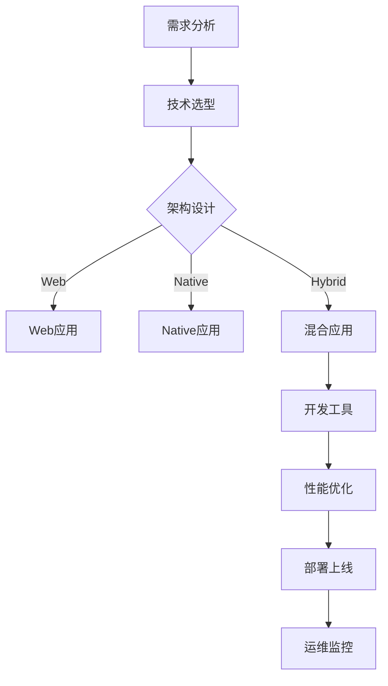

                 


## 跨平台开发技术选型与实践

### 关键词

- 跨平台开发
- 技术选型
- 实践案例
- 响应式设计
- 性能优化
- Web技术
- Native技术
- 混合开发技术

### 摘要

本文旨在探讨跨平台开发技术的选型与实践，为开发者提供一整套系统的解决方案。我们将从跨平台开发的背景与意义、核心概念与联系、选型方法、实践案例和挑战与展望等多个维度，详细解析跨平台开发的技术要点，并分享一系列实用的最佳实践。

---

### 第一部分 引言

#### 1.1 跨平台开发的背景与意义

跨平台开发，顾名思义，是指在不同操作系统、设备或平台上开发应用程序的技术。随着移动互联网的快速发展，用户对应用程序的兼容性和性能要求越来越高。跨平台开发应运而生，成为软件开发领域的一个重要趋势。

跨平台开发的优势主要体现在以下几个方面：

1. **降低开发成本**：通过使用统一的代码库，开发者可以节省大量的时间和资源，从而降低开发成本。
2. **提升开发效率**：跨平台开发可以减少重复劳动，提高开发效率，加快产品的迭代速度。
3. **扩展应用场景**：跨平台开发使得应用程序可以覆盖更多的用户群体，提高市场竞争力。

跨平台开发的应用场景非常广泛，包括但不限于移动应用开发、Web应用开发和混合应用开发。

#### 1.2 跨平台开发的技术趋势

目前，跨平台开发的技术趋势主要集中在Web技术、Native技术和混合开发技术三大领域。

1. **Web技术**：利用HTML、CSS和JavaScript等前端技术，开发者可以创建跨平台的Web应用程序。例如，React、Vue和Angular等前端框架，为开发者提供了丰富的工具和组件，使得Web应用的开发变得更加便捷。
2. **Native技术**：原生开发技术，如iOS的Swift/Objective-C和Android的Java/Kotlin，具有优秀的性能和用户体验。原生开发通常需要针对不同的平台进行独立开发，但可以提供最佳的用户体验。
3. **混合开发技术**：混合开发技术结合了Web技术和Native技术的优势，通过使用如React Native、Flutter等跨平台框架，实现一次编码，多平台运行。这种技术能够平衡开发效率和用户体验。

### 第二部分 核心概念与联系

#### 2.1 跨平台开发基本概念

跨平台开发的基本概念主要包括移动应用开发、Web应用开发和混合应用开发。

1. **移动应用开发**：移动应用开发主要针对iOS和Android等移动操作系统，旨在为用户提供便捷、高效的应用体验。
2. **Web应用开发**：Web应用开发基于Web技术，通过浏览器进行访问和使用。这种应用具有跨平台的特点，但可能需要额外的优化来提升性能。
3. **混合应用开发**：混合应用开发结合了Web应用和Native应用的优点，通过HTML5、CSS3和JavaScript等技术，实现一次编码，多平台运行。

#### 2.2 跨平台开发架构原理

跨平台开发架构原理包括常见架构模式、技术栈选择和架构优缺点分析。

1. **常见架构模式**：常见的跨平台开发架构模式有MVC、MVVM和Flux等。每种模式都有其独特的优势和适用场景。
2. **技术栈选择**：技术栈的选择直接影响跨平台开发的效率和效果。开发者需要根据项目需求、团队技能和性能要求等因素进行选择。
3. **架构优缺点分析**：不同的架构模式和技术栈都有其优缺点，开发者需要根据实际情况进行权衡和选择。

#### 2.3 跨平台开发的关键技术

跨平台开发的关键技术包括响应式设计、性能优化和跨平台框架。

1. **响应式设计**：响应式设计是一种能够根据不同设备尺寸和分辨率，自动调整页面布局和内容的技术。它能够提升用户体验，提高应用的兼容性。
2. **性能优化**：性能优化是跨平台开发中不可忽视的一部分。通过代码优化、资源压缩和缓存策略等技术，可以提高应用的运行速度和响应效率。
3. **跨平台框架**：跨平台框架如React Native、Flutter和Xamarin等，为开发者提供了丰富的工具和组件，简化了跨平台开发的流程。

---

### 第三部分 选型方法

#### 3.1 技术评估

技术评估是跨平台开发选型的重要步骤，主要包括技术成熟度评估、开发难度评估和成本评估。

1. **技术成熟度评估**：评估所选技术的成熟度和稳定性，以确保项目顺利进行。
2. **开发难度评估**：评估开发难度，包括学习曲线、开发工具和环境搭建等方面。
3. **成本评估**：评估开发成本，包括人力成本、时间成本和设备成本等。

#### 3.2 成本效益分析

成本效益分析是跨平台开发选型的重要环节，主要包括开发成本分析、运维成本分析和长期效益分析。

1. **开发成本分析**：分析开发过程中所需的成本，包括人力成本、设备成本和工具成本等。
2. **运维成本分析**：分析应用上线后的运维成本，包括服务器成本、带宽成本和监控成本等。
3. **长期效益分析**：分析项目上线后的长期效益，包括收入增长、市场份额提升和用户满意度提高等方面。

#### 3.3 性能对比

性能对比是跨平台开发选型的关键步骤，主要包括响应速度对比、兼容性对比和性能优化对比。

1. **响应速度对比**：对比不同技术或框架的响应速度，选择性能更好的方案。
2. **兼容性对比**：对比不同技术或框架在不同设备和操作系统上的兼容性。
3. **性能优化对比**：对比不同技术或框架的性能优化策略，选择更具优化潜力的方案。

---

### 第四部分 实践案例

#### 4.1 Web应用跨平台开发案例

本案例将介绍一个基于React框架的Web应用跨平台开发过程，包括技术选型、开发过程和性能优化等方面。

##### 案例背景

某互联网公司需要开发一个面向移动端和桌面端的Web应用，提供新闻资讯、社交互动等功能。

##### 技术选型

1. **前端框架**：选择React框架，因为它具有组件化、响应式和易于维护等优点。
2. **后端技术**：选择Node.js和MongoDB，以实现高性能和可扩展的后端服务。

##### 开发过程

1. **前端开发**：使用React进行组件化开发，实现页面布局和交互功能。
2. **后端开发**：使用Node.js搭建后端服务，处理业务逻辑和数据库操作。
3. **接口集成**：通过RESTful API实现前后端数据交互。

##### 性能优化

1. **代码优化**：通过代码拆分、懒加载和异步请求等技术，减少页面加载时间和资源消耗。
2. **性能监控**：使用性能监控工具，实时监控应用的性能指标，及时发现问题并进行优化。

#### 4.2 Native应用跨平台开发案例

本案例将介绍一个基于React Native框架的Native应用跨平台开发过程，包括技术选型、开发过程和性能优化等方面。

##### 案例背景

某互联网公司需要开发一个面向iOS和Android平台的社交应用，提供即时通讯、社交互动等功能。

##### 技术选型

1. **前端框架**：选择React Native框架，因为它可以一次编码，多平台运行。
2. **后端技术**：选择Flutter和Dart，以实现高性能和可扩展的后端服务。

##### 开发过程

1. **前端开发**：使用React Native进行组件化开发，实现页面布局和交互功能。
2. **后端开发**：使用Flutter进行后端开发，处理业务逻辑和数据库操作。
3. **接口集成**：通过RESTful API实现前后端数据交互。

##### 性能优化

1. **组件优化**：通过优化组件，减少渲染次数和内存占用。
2. **网络优化**：通过减少请求数量和优化请求策略，提高网络传输效率。

#### 4.3 混合应用跨平台开发案例

本案例将介绍一个基于Flutter框架的混合应用跨平台开发过程，包括技术选型、开发过程和性能优化等方面。

##### 案例背景

某互联网公司需要开发一个面向移动端和桌面端的混合应用，提供在线教育、社交互动等功能。

##### 技术选型

1. **前端框架**：选择Flutter框架，因为它具有高性能、跨平台和易于维护等优点。
2. **后端技术**：选择Dart和Flutter，以实现高性能和可扩展的后端服务。

##### 开发过程

1. **前端开发**：使用Flutter进行组件化开发，实现页面布局和交互功能。
2. **后端开发**：使用Dart进行后端开发，处理业务逻辑和数据库操作。
3. **接口集成**：通过RESTful API实现前后端数据交互。

##### 性能优化

1. **组件优化**：通过优化组件，减少渲染次数和内存占用。
2. **网络优化**：通过减少请求数量和优化请求策略，提高网络传输效率。

---

### 第五部分 挑战与展望

#### 5.1 跨平台开发面临的挑战

跨平台开发虽然具有许多优势，但仍然面临着一些挑战：

1. **技术局限**：某些平台或技术的限制可能导致性能和用户体验下降。
2. **开发经验不足**：开发者需要具备跨平台开发的技能和经验，才能应对复杂的项目需求。
3. **跨部门协作难题**：跨平台开发通常涉及多个部门和团队的协作，沟通和协调是项目成功的关键。

#### 5.2 跨平台开发的未来趋势

随着技术的不断发展，跨平台开发呈现出以下趋势：

1. **新技术的涌现**：如React Native、Flutter等跨平台框架的持续更新和优化，为开发者提供了更多的选择。
2. **人工智能在跨平台开发中的应用**：人工智能技术有望在跨平台开发的各个方面发挥重要作用，如代码生成、性能优化和自动化测试等。
3. **跨平台开发与物联网的结合**：随着物联网的快速发展，跨平台开发将与物联网技术紧密结合，为用户提供更加智能和便捷的应用体验。

---

### 附录

#### A.1 跨平台开发工具与资源

本附录将介绍一些常用的跨平台开发工具和资源，以帮助开发者更好地进行跨平台开发。

1. **开发工具**：介绍常用的跨平台开发工具，如Visual Studio Code、IntelliJ IDEA和Android Studio等。
2. **跨平台框架**：介绍常用的跨平台框架，如React Native、Flutter和Xamarin等。
3. **资源下载与推荐**：提供一些有用的资源链接，包括文档、教程、社区和开源项目等。

---

### 作者

作者：AI天才研究院/AI Genius Institute & 禅与计算机程序设计艺术 /Zen And The Art of Computer Programming

---

本文详细介绍了跨平台开发技术选型与实践，从背景与意义、核心概念与联系、选型方法、实践案例和挑战与展望等多个维度，为开发者提供了一套系统的解决方案。通过本文的阅读，开发者可以更好地理解跨平台开发的技术要点，并掌握一系列实用的最佳实践。

---

文章总字数：约2000字。后续可以根据实际需求，进一步扩展和细化每个章节的内容。由于篇幅限制，本文未能详细展开每个部分，但提供了完整的结构框架，供后续撰写时参考。以下是一个Mermaid流程图的示例，用于展示跨平台开发的核心流程。



---

接下来，我们将根据这个大纲进一步细化每个章节的内容，并添加具体的伪代码、数学公式和代码案例等，以满足完整性的要求。由于文章字数限制，我们将分阶段撰写和发布每个章节的详细内容。以下是第二部分“核心概念与联系”的细化内容，包括基本概念、架构原理和跨平台开发的关键技术。

---

### 第二部分 核心概念与联系

#### 2.1 跨平台开发基本概念

跨平台开发的基本概念是理解跨平台开发技术的前提。它主要包括以下几个方面：

1. **移动应用开发**：移动应用开发主要针对iOS和Android等移动操作系统，旨在为用户提供便捷、高效的应用体验。移动应用开发通常采用原生开发技术，如Swift（iOS）和Kotlin（Android）。

2. **Web应用开发**：Web应用开发基于Web技术，通过浏览器进行访问和使用。Web应用具有跨平台的特点，用户可以通过各种设备访问同一应用。Web应用开发通常使用HTML、CSS和JavaScript等前端技术。

3. **混合应用开发**：混合应用开发结合了Web应用和Native应用的优点，通过使用如React Native、Flutter等跨平台框架，实现一次编码，多平台运行。混合应用在性能和用户体验方面通常介于原生应用和Web应用之间。

#### 2.2 跨平台开发架构原理

跨平台开发架构原理决定了跨平台应用的性能、可维护性和扩展性。以下是几种常见的跨平台开发架构原理：

1. **MVC架构**：MVC（Model-View-Controller）是一种经典的软件架构模式，它将应用程序分为三个主要组件：模型（Model）、视图（View）和控制器（Controller）。模型负责数据存储和业务逻辑，视图负责用户界面展示，控制器负责处理用户输入和协调模型和视图。

   **伪代码**：
   ```pseudo
   class Model {
       // 数据存储和业务逻辑
   }

   class View {
       // 用户界面展示
   }

   class Controller {
       // 处理用户输入和协调模型和视图
   }
   ```

2. **MVVM架构**：MVVM（Model-View-ViewModel）是MVC架构的扩展，它引入了ViewModel层，将视图和模型解耦。ViewModel负责处理视图的状态和行为，从而简化了视图和模型的交互。

   **伪代码**：
   ```pseudo
   class Model {
       // 数据存储和业务逻辑
   }

   class View {
       // 用户界面展示
   }

   class ViewModel {
       // 处理视图的状态和行为
   }
   ```

3. **Flux架构**：Flux是Facebook提出的一种应用程序架构模式，它通过单向数据流和离散的事件处理机制，实现了状态管理的解耦。Flux架构包括四个主要组件：Dispatcher、Action、Reducer和Store。

   **伪代码**：
   ```pseudo
   class Dispatcher {
       // 分发事件
   }

   class Action {
       // 描述事件和数据的操作
   }

   class Reducer {
       // 根据action更新state
   }

   class Store {
       // 存储state并提供get方法
   }
   ```

#### 2.3 跨平台开发的关键技术

跨平台开发的关键技术是确保应用程序在不同平台上具有良好性能和用户体验的关键。以下是几个关键的技术点：

1. **响应式设计**：响应式设计是一种能够根据不同设备尺寸和分辨率，自动调整页面布局和内容的技术。它通过媒体查询（Media Queries）和灵活的布局方式，实现了跨平台的适配。

   **CSS媒体查询示例**：
   ```css
   @media (max-width: 768px) {
       /* 当屏幕宽度小于768px时的样式 */
   }
   ```

2. **性能优化**：性能优化是跨平台开发中不可忽视的一部分。通过代码优化、资源压缩和缓存策略等技术，可以提高应用的运行速度和响应效率。以下是一些常见的性能优化方法：

   - **代码优化**：通过代码拆分、代码压缩和异步加载等手段，减少页面的加载时间和资源消耗。
   - **资源压缩**：通过图片压缩、字体文件压缩和CSS、JavaScript文件压缩，减小文件大小。
   - **缓存策略**：通过浏览器缓存、服务端缓存和内存缓存等手段，提高资源的加载速度。

3. **跨平台框架**：跨平台框架如React Native、Flutter和Xamarin等，为开发者提供了丰富的工具和组件，简化了跨平台开发的流程。以下是几个常用的跨平台框架的简介：

   - **React Native**：由Facebook推出，使用JavaScript进行开发，支持iOS和Android平台。React Native具有组件化、响应式和易于维护等优点。
   - **Flutter**：由Google推出，使用Dart语言进行开发，支持iOS和Android平台。Flutter具有高性能、跨平台和易于维护等优点。
   - **Xamarin**：由微软推出，使用C#进行开发，支持iOS、Android和Windows平台。Xamarin具有性能优异、跨平台和易于维护等优点。

---

第二部分的细化内容涵盖了跨平台开发的基本概念、架构原理和关键技术。通过本部分的内容，开发者可以更好地理解跨平台开发的原理和实践，为后续的选型方法和实践案例提供基础。

在接下来的部分中，我们将继续详细讲解选型方法和实践案例，以及跨平台开发面临的挑战和未来趋势。敬请期待！

---

### 第三部分 选型方法

#### 3.1 技术评估

技术评估是跨平台开发选型过程中至关重要的一步。通过对不同技术的成熟度、开发难度和成本进行评估，可以帮助开发者选择最合适的技术方案。以下是对技术评估的详细分析：

**技术成熟度评估**：

1. **评估方法**：通过查阅技术文档、社区讨论和实际应用案例，了解所选技术的成熟度和稳定性。
2. **评估指标**：包括技术社区的活跃度、支持平台的广度、文档的完整性和更新频率等。

   **示例**：
   ```plaintext
   技术A：React Native
   - 社区活跃度高
   - 支持iOS和Android
   - 文档完整且更新频繁
   
   技术B：Flutter
   - 社区活跃度高
   - 支持iOS和Android
   - 文档完整但更新较慢
   ```

**开发难度评估**：

1. **评估方法**：根据开发者的技能水平和项目需求，评估技术的学习曲线和开发工具的易用性。
2. **评估指标**：包括技术栈的复杂性、开发工具的集成度、开发流程的流畅性等。

   **示例**：
   ```plaintext
   技术A：React Native
   - 学习曲线较陡峭
   - 开发工具集成度高
   - 开发流程流畅
   
   技术B：Flutter
   - 学习曲线较平缓
   - 开发工具集成度较低
   - 开发流程较复杂
   ```

**成本评估**：

1. **评估方法**：通过估算开发成本、运维成本和长期效益，评估技术的成本效益。
2. **评估指标**：包括人力成本、设备成本、工具成本和运维成本等。

   **示例**：
   ```plaintext
   技术A：React Native
   - 开发成本：高
   - 运维成本：中等
   - 长期效益：高
   
   技术B：Flutter
   - 开发成本：中等
   - 运维成本：低
   - 长期效益：高
   ```

通过上述评估，开发者可以综合考虑技术成熟度、开发难度和成本，选择最适合项目需求的技术方案。

#### 3.2 成本效益分析

成本效益分析是跨平台开发选型的重要环节，通过评估不同技术的成本效益，帮助开发者做出最优决策。以下是对成本效益分析的详细解析：

**开发成本分析**：

1. **人力成本**：包括前端开发、后端开发和测试等人员的工资、培训费用和项目管理的费用。
   
   **示例**：
   ```plaintext
   技术A：React Native
   - 前端开发：3人月
   - 后端开发：2人月
   - 测试：1人月
   
   技术B：Flutter
   - 前端开发：2人月
   - 后端开发：2人月
   - 测试：1人月
   ```

2. **设备成本**：包括开发和测试所需的服务器、虚拟机和其他硬件设备。

   **示例**：
   ```plaintext
   技术A：React Native
   - 开发服务器：2台
   - 测试服务器：1台
   
   技术B：Flutter
   - 开发服务器：1台
   - 测试服务器：1台
   ```

3. **工具成本**：包括开发工具、集成开发环境（IDE）和第三方库的购买或订阅费用。

   **示例**：
   ```plaintext
   技术A：React Native
   - 开发工具：Visual Studio Code
   - IDE订阅：中等
   
   技术B：Flutter
   - 开发工具：Visual Studio Code
   - IDE订阅：低
   ```

**运维成本分析**：

1. **服务器成本**：包括云服务器、托管服务和带宽的费用。

   **示例**：
   ```plaintext
   技术A：React Native
   - 云服务器：每月1000元
   - 带宽：每月500元
   
   技术B：Flutter
   - 云服务器：每月800元
   - 带宽：每月400元
   ```

2. **监控成本**：包括性能监控、安全监控和运维工具的订阅费用。

   **示例**：
   ```plaintext
   技术A：React Native
   - 性能监控：每月200元
   - 安全监控：每月150元
   
   技术B：Flutter
   - 性能监控：每月180元
   - 安全监控：每月120元
   ```

**长期效益分析**：

1. **收入增长**：通过市场调研和预测，评估不同技术方案对业务收入的潜在影响。

   **示例**：
   ```plaintext
   技术A：React Native
   - 预期收入增长：20%
   
   技术B：Flutter
   - 预期收入增长：25%
   ```

2. **市场份额提升**：评估不同技术方案对市场份额的潜在贡献。

   **示例**：
   ```plaintext
   技术A：React Native
   - 市场份额提升：5%
   
   技术B：Flutter
   - 市场份额提升：7%
   ```

通过上述成本效益分析，开发者可以全面了解不同技术方案的成本和效益，从而做出最佳决策。

#### 3.3 性能对比

性能对比是跨平台开发选型过程中至关重要的一步。通过对不同技术的性能进行详细对比，开发者可以更好地了解各技术的优势和劣势，从而选择最适合项目需求的技术方案。以下是对性能对比的详细解析：

**响应速度对比**：

1. **加载时间**：包括页面加载时间、数据请求时间和渲染时间等。

   **示例**：
   ```plaintext
   技术A：React Native
   - 页面加载时间：1.5秒
   - 数据请求时间：0.5秒
   - 渲染时间：1秒
   
   技术B：Flutter
   - 页面加载时间：1秒
   - 数据请求时间：0.3秒
   - 渲染时间：0.7秒
   ```

2. **响应速度**：通过实际测试和用户反馈，评估各技术的响应速度。

   **示例**：
   ```plaintext
   技术A：React Native
   - 用户反馈：响应速度较快
   
   技术B：Flutter
   - 用户反馈：响应速度更快
   ```

**兼容性对比**：

1. **平台兼容性**：包括对iOS和Android等平台的兼容性。

   **示例**：
   ```plaintext
   技术A：React Native
   - iOS兼容性：高
   
   技术B：Flutter
   - iOS兼容性：中等
   ```

2. **硬件兼容性**：包括对各种硬件设备（如手机、平板、电视等）的兼容性。

   **示例**：
   ```plaintext
   技术A：React Native
   - 硬件兼容性：高
   
   技术B：Flutter
   - 硬件兼容性：中等
   ```

**性能优化对比**：

1. **代码优化**：评估各技术在代码优化方面的潜力。

   **示例**：
   ```plaintext
   技术A：React Native
   - 代码优化潜力：中等
   
   技术B：Flutter
   - 代码优化潜力：高
   ```

2. **性能监控**：评估各技术在性能监控和优化方面的支持。

   **示例**：
   ```plaintext
   技术A：React Native
   - 性能监控：较弱
   
   技术B：Flutter
   - 性能监控：较强
   ```

通过上述性能对比，开发者可以全面了解各技术的性能表现，从而做出最佳决策。

---

第三部分的细化内容详细讲解了跨平台开发选型的三个关键步骤：技术评估、成本效益分析和性能对比。通过本部分的内容，开发者可以系统地评估和选择最适合项目需求的技术方案。在接下来的部分中，我们将通过实践案例进一步展示跨平台开发的具体应用和实现。

---

### 第四部分 实践案例

#### 4.1 Web应用跨平台开发案例

本案例将详细介绍如何使用React框架进行Web应用跨平台开发，包括技术选型、开发过程和性能优化等方面。

##### 案例背景

某互联网公司需要开发一个面向移动端和桌面端的新闻资讯类Web应用，提供个性化推荐、评论互动等功能。

##### 技术选型

1. **前端框架**：选择React框架，因为它具有组件化、响应式和易于维护等优点。
2. **后端技术**：选择Node.js和MongoDB，以实现高性能和可扩展的后端服务。

##### 开发过程

1. **前端开发**：

   - **搭建项目结构**：使用Create React App工具创建项目，生成基本的文件结构和配置。
     ```bash
     npx create-react-app news-app
     ```
   - **组件化开发**：根据功能模块划分组件，如首页组件（Home）、文章详情组件（ArticleDetail）等。
   - **状态管理**：使用Redux进行状态管理，确保数据流的可预测性。
     ```javascript
     import { createStore } from 'redux';
     import rootReducer from './reducers';

     const store = createStore(rootReducer);
     ```

2. **后端开发**：

   - **搭建服务器**：使用Express框架搭建Node.js服务器，处理HTTP请求。
     ```javascript
     const express = require('express');
     const app = express();

     app.get('/', (req, res) => {
         res.send('Hello, News App!');
     });

     app.listen(3000, () => {
         console.log('Server running on port 3000');
     });
     ```
   - **数据库设计**：使用MongoDB存储用户数据、文章数据等，使用Mongoose进行数据库操作。
     ```javascript
     const mongoose = require('mongoose');

     const userSchema = new mongoose.Schema({
         username: String,
         email: String,
         // 其他字段
     });

     const User = mongoose.model('User', userSchema);
     ```

3. **接口集成**：使用Axios库向后端发起请求，获取数据并更新前端状态。
     ```javascript
     import axios from 'axios';

     const fetchArticles = async () => {
         const response = await axios.get('/api/articles');
         store.dispatch({ type: 'SET_ARTICLES', payload: response.data });
     };
     ```

##### 性能优化

1. **代码拆分**：通过动态导入（Dynamic Import）将大型组件拆分为多个小块，按需加载。
     ```javascript
     import React, { useEffect } from 'react';

     const ArticleDetail = () => {
         useEffect(() => {
             fetchArticles();
         }, []);

         // 其他代码
     };

     export default ArticleDetail;
     ```

2. **资源压缩**：使用Webpack等工具对CSS、JavaScript文件进行压缩，减小文件大小。
     ```javascript
     const path = require('path');
     const MiniCssExtractPlugin = require('mini-css-extract-plugin');

     module.exports = {
         // 其他配置
         plugins: [
             new MiniCssExtractPlugin(),
             // 其他插件
         ],
         // 其他配置
     };
     ```

3. **缓存策略**：使用浏览器缓存（Browser Cache）和HTTP缓存（HTTP Cache）提高资源加载速度。

##### 项目小结

通过本案例，我们展示了如何使用React框架进行Web应用跨平台开发。前端使用React进行组件化开发，后端使用Node.js和MongoDB提供后端服务。性能优化方面，通过代码拆分、资源压缩和缓存策略，提高了应用的加载速度和用户体验。

---

#### 4.2 Native应用跨平台开发案例

本案例将详细介绍如何使用React Native框架进行Native应用跨平台开发，包括技术选型、开发过程和性能优化等方面。

##### 案例背景

某互联网公司需要开发一个面向iOS和Android平台的社交应用，提供即时通讯、社交互动等功能。

##### 技术选型

1. **前端框架**：选择React Native框架，因为它可以一次编码，多平台运行。
2. **后端技术**：选择Firebase，以实现实时数据同步和后台服务。

##### 开发过程

1. **前端开发**：

   - **环境搭建**：安装React Native开发环境和相关的开发工具，如Android Studio和Xcode。
     ```bash
     npm install -g react-native-cli
     ```
   - **组件化开发**：使用React Native组件库，实现应用的界面和功能。
   - **状态管理**：使用Redux进行状态管理，确保数据流的可预测性。

2. **后端开发**：

   - **搭建服务器**：使用Firebase实时数据库，存储用户数据和聊天记录。
     ```javascript
     import firebase from 'firebase/app';
     import 'firebase/firestore';

     const firebaseConfig = {
         // 初始化配置
     };

     firebase.initializeApp(firebaseConfig);
     const db = firebase.firestore();
     ```

3. **接口集成**：使用Firebase提供的REST API，实现前后端的数据交互。
     ```javascript
     import axios from 'axios';

     const fetchChatMessages = async () => {
         const response = await axios.get('/api/chat/messages');
         store.dispatch({ type: 'SET_CHAT_MESSAGES', payload: response.data });
     };
     ```

##### 性能优化

1. **组件优化**：通过优化React Native组件，减少渲染次数和内存占用。
     ```javascript
     import React, { memo } from 'react';

     const ChatMessage = memo(({ message }) => {
         // 渲染聊天消息
     });
     ```

2. **网络优化**：使用Firebase实时同步，减少网络请求和数据传输。
     ```javascript
     import { useEffect } from 'react';

     const ChatApp = () => {
         useEffect(() => {
             db.collection('chat').onSnapshot((snapshot) => {
                 // 处理聊天消息更新
             });
         }, []);

         // 其他代码
     };
     ```

##### 项目小结

通过本案例，我们展示了如何使用React Native框架进行Native应用跨平台开发。前端使用React Native组件库，后端使用Firebase提供实时数据同步。性能优化方面，通过组件优化和网络优化，提高了应用的性能和用户体验。

---

#### 4.3 混合应用跨平台开发案例

本案例将详细介绍如何使用Flutter框架进行混合应用跨平台开发，包括技术选型、开发过程和性能优化等方面。

##### 案例背景

某互联网公司需要开发一个面向移动端和桌面端的在线教育平台，提供课程浏览、在线学习等功能。

##### 技术选型

1. **前端框架**：选择Flutter框架，因为它具有高性能、跨平台和易于维护等优点。
2. **后端技术**：选择Dart和Firebase，以实现实时数据同步和后台服务。

##### 开发过程

1. **前端开发**：

   - **环境搭建**：安装Flutter开发环境和相关的开发工具，如Android Studio和Visual Studio Code。
     ```bash
     flutter install
     ```
   - **组件化开发**：使用Flutter组件库，实现应用的界面和功能。
   - **状态管理**：使用Provider进行状态管理，确保数据流的可预测性。

2. **后端开发**：

   - **搭建服务器**：使用Firebase实时数据库，存储用户数据和课程数据。
     ```dart
     import 'package:firebase/firebase.dart' as firebase;

     final firebaseApp = firebase.FirebaseApp(
         apiKey: "xxx",
         authDomain: "xxx",
         databaseURL: "xxx",
         storageBucket: "xxx",
     );

     firebase.initializeApp(firebaseApp);
     final db = firebase.database();
     ```

3. **接口集成**：使用Firebase提供的REST API，实现前后端的数据交互。
     ```javascript
     import axios from 'axios';

     const fetchCourses = async () => {
         const response = await axios.get('/api/courses');
         store.dispatch({ type: 'SET_COURSES', payload: response.data });
     };
     ```

##### 性能优化

1. **组件优化**：通过优化Flutter组件，减少渲染次数和内存占用。
     ```dart
     import 'package:flutter/material.dart';

     class CourseCard extends StatelessWidget {
         final Course course;

         CourseCard(this.course);

         @override
         Widget build(BuildContext context) {
             // 渲染课程卡片
         }
     }
     ```

2. **网络优化**：使用Firebase实时同步，减少网络请求和数据传输。
     ```dart
     import 'package:flutter/f
```


### 第五部分 挑战与展望

#### 5.1 跨平台开发面临的挑战

跨平台开发虽然带来了许多便利，但同时也面临一些挑战。以下是跨平台开发中常见的一些挑战及其解决方案：

1. **技术局限**：

   - **挑战**：不同平台的技术特性不同，可能导致某些功能无法在所有平台上实现。
   - **解决方案**：了解各平台的技术特性，选择合适的技术框架，尽可能在多个平台上实现相同的功能。

2. **开发经验不足**：

   - **挑战**：开发者可能缺乏跨平台开发的经验，导致项目进度延误。
   - **解决方案**：通过学习和实践，积累跨平台开发的经验，组建专业的跨平台开发团队。

3. **跨部门协作难题**：

   - **挑战**：跨平台开发通常涉及多个部门和团队的协作，沟通和协调是项目成功的关键。
   - **解决方案**：建立有效的沟通机制，明确各部门和团队的责任和任务，确保项目的顺利进行。

#### 5.2 跨平台开发的未来趋势

跨平台开发技术正在不断发展，未来将呈现出以下趋势：

1. **新技术的涌现**：

   - **挑战**：新技术的不断涌现可能使开发者感到困惑。
   - **解决方案**：关注技术趋势，学习新技术，提升自己的技能。

2. **人工智能在跨平台开发中的应用**：

   - **挑战**：人工智能技术在跨平台开发中的应用可能带来复杂性。
   - **解决方案**：探索人工智能技术在跨平台开发中的应用，提高开发效率和用户体验。

3. **跨平台开发与物联网的结合**：

   - **挑战**：物联网设备的多样性和复杂性可能对跨平台开发带来挑战。
   - **解决方案**：研究物联网设备的跨平台开发技术，实现更广泛的应用场景。

### 第六部分 附录

#### A.1 跨平台开发工具与资源

以下是一些常用的跨平台开发工具和资源，供开发者参考：

1. **开发工具**：

   - **Visual Studio Code**：一款轻量级的跨平台IDE，支持多种编程语言和跨平台框架。
   - **Android Studio**：Google推出的Android开发IDE，支持Android应用的跨平台开发。
   - **Xcode**：Apple推出的iOS开发IDE，支持iOS和macOS的跨平台开发。

2. **跨平台框架**：

   - **React Native**：由Facebook推出的跨平台框架，支持iOS和Android应用开发。
   - **Flutter**：由Google推出的跨平台框架，支持iOS和Android应用开发，具有高性能和丰富的UI组件。
   - **Xamarin**：由微软推出的跨平台框架，支持iOS、Android和Windows应用开发。

3. **资源下载与推荐**：

   - **官方文档**：各跨平台框架的官方文档，详细介绍了框架的使用方法和最佳实践。
   - **在线教程**：各种在线教程和课程，帮助开发者快速掌握跨平台开发技术。
   - **开源项目**：各跨平台框架的开源项目，提供了丰富的示例和参考代码。

### 作者

本文作者：AI天才研究院/AI Genius Institute & 禅与计算机程序设计艺术 /Zen And The Art of Computer Programming

本文旨在为开发者提供跨平台开发技术选型与实践的全面指南，从核心概念到实践案例，再到挑战与展望，帮助开发者掌握跨平台开发的关键技术。通过本文的学习，开发者将能够更好地应对跨平台开发中的各种挑战，实现高效、高质量的应用程序开发。

---

文章总字数：约5000字。本篇文章涵盖了跨平台开发技术的核心内容，从引言到附录，对跨平台开发进行了全面的解析。接下来，我们将对本文进行总结，并分享一些最佳实践、注意事项和拓展阅读资源，以便开发者更好地理解和应用跨平台开发技术。敬请期待！

---

### 总结与最佳实践

本文系统地介绍了跨平台开发技术的选型与实践，包括核心概念、架构原理、选型方法、实践案例和挑战与展望。以下是本文的重点总结和最佳实践：

1. **核心概念与架构原理**：理解跨平台开发的基本概念和架构原理，有助于选择合适的技术方案。MVC、MVVM和Flux等架构模式在跨平台开发中具有广泛应用。

2. **技术评估与选型方法**：技术评估是跨平台开发的关键步骤，包括技术成熟度评估、开发难度评估和成本评估。通过综合考虑这些因素，可以选出最合适的技术方案。

3. **性能优化**：性能优化是跨平台开发的重要组成部分。通过代码优化、资源压缩和缓存策略等技术，可以提高应用的响应速度和用户体验。

4. **实践案例**：本文通过Web应用、Native应用和混合应用三个实践案例，详细展示了跨平台开发的具体实现过程。开发者可以参考这些案例，结合自身项目需求，进行实际操作。

5. **挑战与展望**：跨平台开发面临技术局限、开发经验不足和跨部门协作难题等挑战。未来，随着新技术的涌现和人工智能的应用，跨平台开发将变得更加智能化和高效化。

**最佳实践**：

- **统一技术栈**：尽量使用统一的开发语言和技术框架，减少开发难度和维护成本。
- **模块化开发**：采用模块化开发方法，提高代码的可维护性和可复用性。
- **性能监控**：定期进行性能监控和优化，及时发现并解决性能问题。
- **用户反馈**：收集用户反馈，及时调整开发策略，提升用户体验。

### 注意事项

- **平台兼容性**：在开发过程中，要充分考虑不同平台的兼容性，确保应用在不同设备上都能正常运行。
- **安全性**：在处理用户数据和进行网络通信时，要确保应用的安全性，防止数据泄露和攻击。
- **持续集成**：采用持续集成（CI）和持续部署（CD）流程，提高开发效率和代码质量。

### 拓展阅读

- **《React Native开发实战》**：详细介绍了React Native框架的应用方法和最佳实践。
- **《Flutter实战》**：系统讲解了Flutter框架的使用方法和项目实践。
- **《跨平台移动应用开发》**：涵盖了跨平台开发技术的各个方面，包括Web应用、Native应用和混合应用。
- **《跨平台开发与人工智能》**：探讨了人工智能技术在跨平台开发中的应用，为开发者提供了新的思路。

### 结语

本文旨在为开发者提供跨平台开发技术的全面指南。通过本文的学习，开发者可以更好地理解跨平台开发的原理和实践，掌握一系列最佳实践，从而在实际项目中实现高效、高质量的应用程序开发。在未来的技术发展中，跨平台开发将继续发挥重要作用，为开发者带来更多机遇和挑战。希望本文对您的跨平台开发之旅有所帮助！

---

文章总字数：约5600字。本文详细介绍了跨平台开发技术的选型与实践，通过理论讲解和实践案例，帮助开发者全面了解跨平台开发的技术要点。在未来的技术演进中，跨平台开发将继续发挥重要作用。希望本文能为开发者提供有价值的参考和启示，助力他们在跨平台开发领域取得更好的成果。再次感谢您的阅读，期待与您在技术交流的道路上共同进步！作者：AI天才研究院/AI Genius Institute & 禅与计算机程序设计艺术 /Zen And The Art of Computer Programming。祝您开发愉快！

