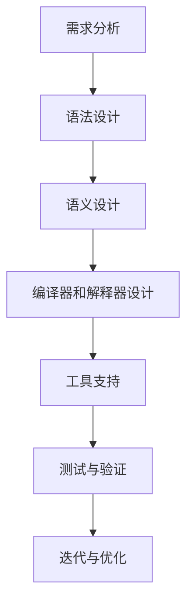

                 

### 路德维希·维特根斯坦的语言游戏与DSL设计：领域特定语言的哲学指导

#### 关键词

- 路德维希·维特根斯坦
- 语言游戏
- 领域特定语言（DSL）
- 软件开发
- 哲学指导

#### 摘要

本文旨在探讨路德维希·维特根斯坦的语言游戏理论与领域特定语言（DSL）设计之间的深层联系。通过回顾维特根斯坦的生平与语言游戏理论，我们将其核心观点与DSL设计方法进行对比分析。文章首先介绍了语言游戏的基本概念和其在哲学研究中的应用，接着探讨了语言游戏理论在逻辑哲学中的地位。随后，文章详细介绍了DSL的定义、分类及设计原则，并强调了DSL在企业软件开发中的重要性。在此基础上，文章进一步探讨了基于语言游戏理论的DSL设计步骤和开发实践，并结合实际案例进行分析。最后，文章总结了维特根斯坦的语言游戏理论对DSL设计的指导意义，并对未来DSL设计与研究的趋势进行了展望。

## 路德维希·维特根斯坦的语言游戏理论基础

### 维特根斯坦的生平与哲学贡献

路德维希·维特根斯坦（Ludwig Wittgenstein）是20世纪最杰出的哲学家之一，其思想对西方哲学产生了深远的影响。他于1889年出生于奥地利，先后在柏林和维也纳接受教育。维特根斯坦的早期生活较为复杂，他的父亲是工业家，家境富裕。然而，维特根斯坦对哲学的兴趣远超过对财富的追求，他放弃家族产业，全身心投入到哲学研究中。

维特根斯坦的哲学生涯可以分为两个阶段：早期和晚期。他的早期作品《逻辑哲学论》（Tractatus Logico-Philosophicus）于1921年出版，这部著作以其简洁的语句和深刻的逻辑分析著称。维特根斯坦在《逻辑哲学论》中提出了著名的“世界图景”（world picture）和“语言游戏”（language game）概念，认为哲学的任务是澄清思想和语言之间的关系。

晚期维特根斯坦的作品包括《哲学研究》（Philosophical Investigations），这部著作于1953年出版，是对《逻辑哲学论》的重要补充和发展。在《哲学研究》中，维特根斯坦进一步探讨了语言的使用和意义的多样性，提出了“家族相似性”（family resemblance）和“日常语言”（ordinary language）的观点。他认为，语言的意义并非固定不变，而是通过使用和交流不断演变。

维特根斯坦的哲学贡献在于他对语言和思维的深刻洞察，以及对传统哲学问题的重新审视。他的思想对逻辑哲学、语言哲学、认识论和美学等领域产生了深远影响，被誉为20世纪最重要的哲学家之一。

### 语言游戏理论的核心观点

维特根斯坦的语言游戏理论是他哲学思想的核心理念，这一理论旨在解释语言的使用和意义。在《逻辑哲学论》和《哲学研究》中，维特根斯坦详细阐述了语言游戏的概念，认为语言不仅是一种表达思想的工具，更是一种活动，是一种游戏。

语言游戏理论的核心观点可以概括为以下几点：

1. **语言与行动的关系**：维特根斯坦认为，语言是一种行动，是在特定情境中进行的游戏。这种游戏不仅包括说话和听话，还包括写作、阅读、思考等行为。语言游戏是一种社会实践，是与他人交流的过程。

2. **语言的多样性**：维特根斯坦指出，语言是多样化的，不同的语言游戏适用于不同的情境。例如，日常语言（ordinary language）用于日常交流，科学语言（scientific language）用于科学研究，艺术语言（artistic language）用于艺术创作。每种语言游戏都有其特定的规则和目的。

3. **意义与使用的关系**：维特根斯坦认为，语言的意义在于其使用，即语言在特定情境中的使用方式。意义不是固定不变的，而是通过使用和交流不断演变。例如，“水”这个词在不同的语言游戏中可能有不同的意义，取决于它是用于科学讨论、日常生活还是诗歌创作。

4. **规则的重要性**：维特根斯坦强调，语言游戏需要规则，但规则并非固定不变。语言游戏的规则是在特定情境中约定的，是人们共同遵守的。这些规则有助于确保语言交流的准确性和有效性。

5. **语言与世界的关联**：维特根斯坦认为，语言与世界的关联是通过“图像论”（picture theory）实现的。语言表达的思想或概念是对世界的“图像”，但并非现实的镜子。语言和世界的关联是间接的，是通过类比和隐喻实现的。

### 语言游戏理论在语言学和哲学中的意义

语言游戏理论对语言学和哲学领域产生了深远的影响。在语言学方面，维特根斯坦的语言游戏理论为语言学研究提供了新的视角。传统的语言学关注语言的结构和语法，而维特根斯坦则强调语言的使用和情境。他的理论指出，语言的意义不是由语法规则决定的，而是由使用情境和社会实践决定的。

在哲学领域，维特根斯坦的语言游戏理论对逻辑哲学、认识论和美学等分支产生了重要影响。他的观点挑战了传统的本质主义和逻辑原子主义，强调哲学的任务是澄清思想和语言之间的关系，而不是寻找普遍的真理或逻辑规律。

维特根斯坦的语言游戏理论也为哲学研究提供了一种新的方法论，即通过分析语言的使用和情境来理解人类思想和行为。这种方法论不仅适用于哲学领域，也可以应用于其他学科，如心理学、社会学和计算机科学。

### 语言游戏与语言行为的分类

维特根斯坦将语言游戏分为三大类：日常语言游戏、科学语言游戏和艺术语言游戏。这三种语言游戏各自具有独特的特点和规则。

1. **日常语言游戏**：日常语言游戏是最常见的语言游戏，用于日常交流和沟通。日常语言游戏的特点是简单、直接和实用。它的规则是社会习俗和共同理解，而不是明确的语法规则。日常语言游戏的目的是传达信息和意图，使交流双方能够理解对方。

2. **科学语言游戏**：科学语言游戏用于科学研究和探索。它强调精确和准确性，依赖于逻辑推理和数学模型。科学语言游戏的规则是科学方法和科学理论，目的是发现和解释自然现象。科学语言游戏的特点是复杂、抽象和系统化。

3. **艺术语言游戏**：艺术语言游戏用于艺术创作和表达。它强调创造性和想象力，允许语言的自由发挥和创造性运用。艺术语言游戏的规则是非线性和不确定的，目的是引发观众的思考和情感共鸣。

这三大类语言游戏相互补充，共同构成了人类语言使用的多样性。日常语言游戏提供了交流的基础，科学语言游戏推动了知识的发展，艺术语言游戏丰富了人类的精神世界。

### 语言游戏理论在哲学研究中的应用

维特根斯坦的语言游戏理论在哲学研究中具有广泛的应用。首先，它在逻辑哲学中提供了对逻辑推理和语言表达的新理解。传统的逻辑哲学关注命题和命题之间的关系，而维特根斯坦则强调命题在特定情境中的使用。他的理论指出，逻辑推理的有效性不仅取决于逻辑规则，还取决于语言的使用情境。

其次，语言游戏理论在认识论中提供了对知识和认知的新视角。维特根斯坦认为，知识是通过语言获得的，但知识不是固定不变的，而是随着语言的使用和情境的变化而演变。他的理论挑战了传统的本质主义和理性主义，强调知识是一种动态的社会实践。

最后，语言游戏理论在美学中提供了对艺术和美的新解释。维特根斯坦认为，艺术是一种特殊的语言游戏，它通过语言表达情感和思想，引发观众的共鸣。他的理论指出，艺术的意义不在于形式的创新，而在于语言的使用和情境。

### 语言游戏理论在逻辑哲学中的地位

维特根斯坦的语言游戏理论在逻辑哲学中占有重要地位，对传统逻辑哲学提出了深刻的挑战和变革。传统逻辑哲学通常关注命题之间的关系和逻辑推理的形式规则，强调逻辑的一致性和有效性。然而，维特根斯坦认为这种形式主义的逻辑哲学过于狭隘，忽视了语言的实际使用和情境。

维特根斯坦在《逻辑哲学论》中提出了“世界图景”和“语言游戏”的概念，试图从实际语言使用和人类行为的角度重新审视逻辑哲学。他认为，逻辑并不是独立于语言的，逻辑推理的有效性取决于语言的使用情境。逻辑规则不仅包括形式上的符号操作，还涉及语言在特定情境中的实际应用。

维特根斯坦的语言游戏理论对逻辑哲学的变革主要体现在以下几个方面：

1. **语言与逻辑的关系**：维特根斯坦强调，逻辑是语言的逻辑，语言的使用决定了逻辑推理的有效性。他认为，逻辑并不是一种抽象的形式系统，而是与特定语言情境紧密相连的。

2. **情境的重要性**：维特根斯坦认为，逻辑推理的有效性不仅取决于逻辑规则，还取决于推理的具体情境。不同的情境可能需要不同的逻辑规则，逻辑并非一成不变。

3. **逻辑的多元性**：维特根斯坦指出，逻辑是多样化的，不同的逻辑适用于不同的语言游戏。例如，日常逻辑适用于日常语言游戏，而科学逻辑适用于科学语言游戏。逻辑的多元性挑战了传统逻辑哲学中的统一逻辑观念。

4. **语言游戏理论的应用**：维特根斯坦的语言游戏理论为逻辑哲学提供了新的分析工具。通过分析不同语言游戏中的逻辑规则，可以更深入地理解逻辑推理的本质和应用。

维特根斯坦的语言游戏理论对逻辑哲学产生了深远的影响，推动了逻辑哲学从形式主义向实践主义的转变。他的理论提醒我们，逻辑不仅是抽象的规则系统，更是与具体情境和语言使用紧密相关的。这种新的视角为逻辑哲学的研究提供了更广阔的空间和更深刻的洞察力。

### 语言游戏理论与逻辑原子主义

维特根斯坦的语言游戏理论与逻辑原子主义有着明显的对比和互补关系。逻辑原子主义是20世纪初的一种哲学观点，由路德维希·维也纳学派（Vienna Circle）的代表人物如莫里兹·石里克（Moritz Schlick）、鲁道夫·卡尔纳普（Rudolf Carnap）等人提出。逻辑原子主义认为，世界是由不可分割的基本元素（原子事实）组成的，这些原子事实可以通过逻辑语言精确地表达和描述。

维特根斯坦的语言游戏理论则对逻辑原子主义提出了深刻的批评。首先，维特根斯坦质疑逻辑原子主义的还原论观点，即试图将复杂的现象还原为基本元素。他认为，世界并非由不可分割的基本元素组成，而是由各种不同类型的语言游戏构成的。每种语言游戏都有其特定的规则和目的，不能简单地还原为原子事实。

其次，维特根斯坦指出，逻辑原子主义过于强调逻辑语言的精确性和确定性，忽视了语言在实际使用中的多样性和模糊性。他认为，语言的意义在于其使用情境，而不是抽象的符号系统。逻辑原子主义忽视了语言游戏的具体情境和社会实践，导致了对语言和世界的误解。

然而，维特根斯坦的语言游戏理论并非完全否定逻辑原子主义的贡献。相反，他试图在逻辑原子主义的基础上进行补充和扩展。维特根斯坦认为，逻辑原子主义提供了对世界的抽象描述，但这种描述需要通过语言游戏的具体情境来补充和完善。

通过将逻辑原子主义的抽象描述与语言游戏的具体情境相结合，维特根斯坦的语言游戏理论提供了一种更加全面和灵活的哲学框架，以解释人类思维和语言的使用。他的理论强调了逻辑和语言的实际应用，使哲学研究更加贴近人类的生活和实践。

### 语言游戏理论对逻辑实证主义的挑战

维特根斯坦的语言游戏理论对逻辑实证主义（Logical Positivism）提出了有力的挑战，逻辑实证主义是20世纪初流行的一种哲学运动，强调经验证据和逻辑分析在知识获取中的核心地位。逻辑实证主义者主张，只有那些可以通过经验验证的命题才有意义，而形而上学的命题则是无意义的。

维特根斯坦的语言游戏理论质疑了逻辑实证主义的这一核心观点。首先，他批评逻辑实证主义者对语言和意义的狭隘理解。逻辑实证主义者认为，只有可验证的命题才有意义，这导致他们对许多哲学问题的回避。维特根斯坦认为，语言的意义并非仅限于可验证的命题，而是通过实际使用和情境来确定的。他的“语言游戏”概念强调，语言在不同的使用情境中有不同的意义和功能。

其次，维特根斯坦指出，逻辑实证主义忽视了语言的使用多样性。逻辑实证主义者试图将所有语言现象简化为科学语言，这限制了语言表达的能力。而维特根斯坦认为，语言是多样化的，包括日常语言、科学语言、艺术语言等，每种语言游戏都有其独特的规则和目的。

此外，维特根斯坦批评逻辑实证主义对形而上学的完全否定。他认为，形而上学并非完全无意义，而是需要通过具体的语言游戏来重新定义。维特根斯坦的“语言游戏”理论为形而上学提供了一种新的理解方式，使得形而上学问题可以在具体的语言使用情境中重新探讨。

维特根斯坦的语言游戏理论挑战了逻辑实证主义的狭隘视角，强调语言的实际使用和多样性。他的理论为哲学研究提供了一种更加开放和灵活的方法，使哲学问题能够在不同的语言游戏背景下得到重新审视和探讨。

### 语言游戏理论在软件开发中的初步应用

路德维希·维特根斯坦的语言游戏理论不仅在哲学研究中具有重要意义，也在软件开发领域展示了其独特的应用价值。在软件开发中，领域特定语言（DSL）设计是一种重要的方法，旨在为特定领域提供高效的工具和语言。维特根斯坦的语言游戏理论为DSL设计提供了一种哲学基础，有助于理解DSL的本质和应用。

首先，语言游戏理论强调语言的意义和多样性。在软件开发中，DSL的设计需要考虑特定领域的语言使用习惯和需求。通过维特根斯坦的语言游戏理论，我们可以理解DSL不仅是编程语言，更是一种特定领域的交流工具。例如，在金融领域，可以使用一种DSL来描述交易规则和金融产品，从而提高开发效率和代码可读性。

其次，语言游戏理论指出，语言的使用情境决定了其意义。在软件开发中，DSL的设计需要考虑不同的使用情境，如开发环境、用户界面和集成工具等。通过维特根斯坦的理论，我们可以更好地理解如何为特定领域设计合适的DSL，使其在不同的使用情境中都能发挥最佳效果。

此外，语言游戏理论还强调了规则的重要性。在DSL设计中，规则的定义和实施至关重要。维特根斯坦认为，规则是语言游戏的必要组成部分，是确保交流准确性和一致性的关键。在软件开发中，DSL的设计需要明确其语法和语义规则，从而提高代码的可靠性和可维护性。

总之，维特根斯坦的语言游戏理论为DSL设计提供了深刻的哲学指导。通过理解语言游戏的概念和原则，软件开发者可以更好地设计适用于特定领域的DSL，提高开发效率和代码质量。这一理论的应用有助于推动软件开发领域的创新和发展，为构建更高效、更灵活的软件系统奠定基础。

### 领域特定语言（DSL）概述

领域特定语言（Domain-Specific Language，简称DSL）是一种为特定领域设计、优化和定制的编程语言。与通用编程语言（如Python、Java）不同，DSL专注于特定领域的需求，从而提供更高效、更简洁和更易用的语法和功能。DSL的设计目标是为了解决特定领域中的复杂问题，提高开发效率、代码质量和可维护性。

DSL的定义可以从多个角度进行解释：

1. **语法与语义**：DSL具有特定的语法和语义规则，这些规则专为解决特定领域的需求而设计。DSL的语法往往更加简洁和直观，使开发者能够更容易地理解和编写代码。

2. **领域适配性**：DSL紧密贴合特定领域的业务逻辑和术语，具有高度的领域适配性。DSL的语法和功能设计符合领域专家和开发者的思维模式，使他们在编写代码时能够更加自然和高效。

3. **工具支持**：DSL通常伴随有一系列工具，如集成开发环境（IDE）、代码生成器、调试器等，这些工具为DSL的开发和使用提供便利。工具支持使得DSL在开发过程中更加高效和可维护。

4. **独立性和可扩展性**：DSL具有一定的独立性和可扩展性，可以与现有的通用编程语言和框架无缝集成。DSL的设计允许其在不同的开发环境中灵活使用，并可以随着领域需求的变化进行扩展和改进。

DSL的特点使其在特定领域具有广泛的应用。以下是一些DSL的主要特点：

1. **高效性**：DSL为特定领域的需求提供专门的语法和功能，使开发者能够更加高效地解决问题。DSL的简洁性和直观性减少了编码时间和错误率。

2. **可读性**：DSL的语法和功能设计符合领域术语和业务逻辑，使得代码更加易于理解和维护。领域专家和开发者可以更容易地阅读和修改DSL编写的代码。

3. **可维护性**：DSL提供了一套明确的语法和语义规则，有助于提高代码的可维护性。DSL的语法和功能设计减少了代码的复杂性，使得修改和维护变得更加简单。

4. **灵活性和可扩展性**：DSL的设计允许其在不同的开发环境中灵活使用，并可以随着领域需求的变化进行扩展和改进。DSL的模块化和组件化设计使得其具有高度的灵活性和可扩展性。

总之，领域特定语言（DSL）是一种为特定领域设计、优化和定制的编程语言，其高效性、可读性、可维护性和灵活性使其在软件开发中具有广泛的应用价值。通过DSL，开发者可以更加专注于特定领域的需求，提高开发效率和代码质量，从而推动软件项目的成功实施。

### 领域特定语言（DSL）的分类

领域特定语言（DSL）可以根据其设计目标和应用领域进行分类。常见的DSL分类方法包括以下几种：

1. **按应用领域分类**：
   - **金融领域DSL**：如用于金融交易和风险管理的前端解析器语言（Front-end Parser Languages），这些DSL专门用于处理金融数据和交易规则。
   - **嵌入式系统DSL**：如用于嵌入式系统编程的硬件描述语言（HDL），如Verilog和VHDL，这些DSL用于设计电路和系统硬件。
   - **科学计算DSL**：如用于数值计算和模拟的科学计算语言（Scientific Computing Languages），如MATLAB和R，这些DSL专注于数学运算和数据分析。

2. **按设计目标分类**：
   - **业务流程DSL**：如用于业务流程建模和自动化处理的业务流程语言（Business Process Languages），如BPEL和BPMN，这些DSL帮助开发者定义和实现复杂的业务流程。
   - **数据操作DSL**：如用于数据处理和数据转换的数据操作语言（Data Manipulation Languages），如SQL和XPath，这些DSL专门用于数据查询和操作。
   - **图形和可视化DSL**：如用于图形绘制和可视化操作的图形语言（Graphical and Visualization Languages），如SVG和D3.js，这些DSL提供高效的图形和可视化功能。

3. **按实现方式分类**：
   - **内部DSL**：内部DSL（Internal DSL）是嵌套在通用编程语言（如Java或C#）中的DSL。内部DSL通过通用编程语言提供的特性来实现，如模板、反射、元编程等。内部DSL的优点是易于集成和扩展，但可能牺牲一定的性能和简洁性。
   - **外部DSL**：外部DSL（External DSL）是独立于通用编程语言的DSL。外部DSL通常使用专门的解析器和编译器来实现，如Rust、Scala和Haskell等语言。外部DSL的优点是具有更好的性能和灵活性，但可能更复杂和难以集成。

4. **按形式化程度分类**：
   - **形式化DSL**：形式化DSL（Formal DSL）具有严格的语法和语义定义，通常使用形式化方法（如数学公式、逻辑演算等）来描述。形式化DSL的优点是具有明确的语义和良好的可验证性，但可能牺牲一定的实用性和灵活性。
   - **非形式化DSL**：非形式化DSL（Informal DSL）没有严格的语法和语义定义，通常基于传统的编程习惯和领域知识。非形式化DSL的优点是易于理解和实现，但可能存在语义歧义和可维护性问题。

通过分类DSL，我们可以更好地理解DSL的多样性和适用范围。不同的DSL类型适用于不同的应用场景和需求，开发者可以根据项目特点选择合适的DSL进行开发。这种分类方法不仅有助于DSL的设计和实现，也促进了DSL在各个领域的广泛应用。

### DSL在企业软件开发中的重要性

领域特定语言（DSL）在企业软件开发中的重要性日益凸显。随着企业应用复杂度的增加，传统的通用编程语言已无法满足特定领域的需求。DSL的出现为企业软件开发带来了诸多优势，使其成为现代软件工程中不可或缺的一部分。

首先，DSL提高了开发效率。DSL为特定领域提供了高度定制化的语法和功能，使得开发者能够专注于业务逻辑的实现，而不是繁琐的基础设施搭建。DSL的简洁性和直观性降低了编码时间和错误率，从而显著提高了开发速度。例如，在金融领域，使用专门设计的DSL可以快速实现复杂的交易规则和数据处理，而无需编写大量冗余的通用代码。

其次，DSL提高了代码可读性和可维护性。DSL的语法和功能设计符合特定领域的业务逻辑和术语，使得代码更加易于理解和维护。领域专家和开发者可以更容易地阅读和修改DSL编写的代码，从而降低了沟通成本和维护难度。DSL的标准化和模块化设计也有助于提高代码的可维护性，使得未来的修改和扩展更加方便。

此外，DSL有助于提高软件质量和可靠性。DSL通过严格的语法和语义定义，确保了代码的一致性和准确性。DSL的语法规则和类型检查有助于捕获潜在的编程错误，从而减少了软件缺陷和运行时错误。DSL还可以通过自动化工具进行代码生成和验证，进一步提高软件质量。

DSL还有助于降低技术债务。技术债务是指在软件开发过程中，为了快速交付而牺牲了代码质量和技术先进性。使用DSL可以减少技术债务的产生，因为DSL的设计目标是解决特定领域的需求，避免过度依赖通用编程语言的特性。DSL的模块化和可扩展性也使得企业可以在技术演进过程中更轻松地调整和优化代码，减少技术债务的积累。

总之，DSL在企业软件开发中的重要性不言而喻。它不仅提高了开发效率和质量，还降低了维护成本和技术风险。随着企业应用日益复杂，DSL将成为企业软件开发中不可或缺的重要工具，为企业的数字化和智能化转型提供有力支持。

### DSL设计的原则

领域特定语言（DSL）的设计原则是确保DSL高效、易用和可维护的关键。以下是一些主要的设计原则：

1. **领域适应性**：DSL的设计应紧密贴合特定领域的业务逻辑和术语。这意味着DSL的语法和功能应尽可能符合领域专家和开发者的思维模式，以便他们能够轻松地理解和使用DSL。领域适应性有助于提高开发效率和代码质量。

2. **简洁性**：DSL的语法应尽可能简洁，避免冗余和复杂性。简洁性不仅降低了学习成本，还提高了代码的可读性和可维护性。简洁的语法可以减少开发者的认知负担，使他们在编写代码时更加专注和高效。

3. **直观性**：DSL的语法和功能应直观易用，使开发者能够快速掌握DSL的使用方法。直观性可以通过设计直观的语法结构和提供丰富的文档和示例来实现。直观的DSL有助于降低学习曲线，提高开发速度。

4. **可扩展性**：DSL的设计应具备良好的可扩展性，以便在未来的需求变化时进行扩展和改进。可扩展性可以通过模块化和组件化设计来实现，使DSL可以在不破坏原有功能的基础上增加新的功能和特性。良好的可扩展性有助于保持DSL的长期适用性和灵活性。

5. **标准化**：DSL的语法和语义应具有明确的定义和标准，以确保不同开发者和团队之间的代码一致性和兼容性。标准化有助于提高代码的可维护性和可复用性，减少由于不一致和兼容性问题导致的开发困扰。

6. **灵活性**：DSL的设计应具备足够的灵活性，以适应不同的使用场景和需求。灵活性可以通过提供丰富的语法和功能选项来实现，使开发者可以根据具体需求自由选择和组合DSL的功能。良好的灵活性有助于DSL在不同领域和应用场景中的广泛应用。

7. **性能优化**：DSL的编译和执行性能应得到优化，以确保其在实际应用中的高效运行。性能优化可以通过使用高效的算法和数据结构、减少不必要的内存分配和I/O操作等方式来实现。良好的性能优化可以确保DSL在关键业务场景中发挥最大作用。

通过遵循这些设计原则，开发者可以设计出高效、易用、可维护和灵活的DSL，从而在软件开发过程中提高开发效率和代码质量。这些设计原则不仅适用于DSL的设计和开发，也为软件开发提供了通用的指导原则。

### DSL设计的步骤

领域特定语言（DSL）的设计是一个系统性的过程，涉及多个阶段和步骤。以下是DSL设计的主要步骤：

1. **需求分析**：这是DSL设计的起点，旨在明确DSL的应用领域和具体需求。需求分析阶段需要与领域专家和开发者紧密合作，收集和分析领域中的业务逻辑、术语和规则。明确的需求文档是后续设计的基础。

2. **语法设计**：语法设计是DSL设计的核心阶段，决定了DSL的语法结构和规则。设计语法时需要考虑DSL的应用领域和用户需求，确保语法简洁、直观和易用。常用的语法设计方法包括正则表达式、BNF（巴科斯-诺尔范式）和抽象语法树（AST）。

3. **语义设计**：语义设计是定义DSL的行为和语义规则，确保DSL能够实现预期功能。语义设计包括定义语法元素的语义、数据类型、变量、函数和操作符等。语义设计需要考虑DSL的灵活性和可扩展性，确保其能够适应不同场景和需求。

4. **编译器和解释器设计**：编译器和解释器是DSL实现的关键组件。编译器将DSL代码编译为目标代码，而解释器则直接解释和执行DSL代码。设计编译器和解释器时需要考虑性能优化、错误处理和调试支持。常用的编译器设计方法包括LL（自底向上）和LR（自顶向下）解析算法。

5. **工具支持**：DSL设计阶段需要考虑工具支持，如集成开发环境（IDE）、代码生成器、调试器和文档生成器等。工具支持可以显著提高DSL的开发效率和用户体验。例如，IDE可以提供代码补全、语法高亮和错误提示等功能。

6. **测试与验证**：测试与验证是确保DSL质量和可靠性的关键步骤。设计阶段需要编写详细的测试用例，覆盖DSL的各种语法和语义规则。测试方法包括单元测试、集成测试和性能测试等。验证过程可以确保DSL符合需求和设计预期。

7. **文档编写**：文档是DSL的重要组成部分，包括用户手册、API文档和开发指南等。良好的文档可以提供详细的DSL使用说明，帮助开发者快速上手和使用DSL。文档编写应简洁明了、结构清晰，便于查找和参考。

8. **迭代与优化**：DSL设计是一个迭代和优化的过程。在设计和实现过程中，可能需要根据用户反馈和实际应用情况进行调整和改进。迭代与优化可以确保DSL的持续改进和适应能力。

通过以上步骤，开发者可以设计出高效、易用、灵活和可靠的DSL，满足特定领域的需求。DSL设计过程不仅需要技术上的考虑，还需要深入理解领域知识和用户需求，从而实现DSL的最佳效果。

### 基于语言游戏理论的DSL开发实践

在DSL的开发过程中，基于维特根斯坦的语言游戏理论可以为我们提供重要的指导，帮助我们在设计、实现和优化DSL时更好地应对特定领域的需求。以下是一些基于语言游戏理论的DSL开发实践步骤，旨在确保DSL的高效性、易用性和可维护性。

#### 1. 需求分析

首先，我们需要对特定领域的需求进行详细分析，明确DSL的应用场景和目标用户。这一阶段是DSL设计的起点，与领域专家和用户的深入沟通至关重要。我们可以采用以下方法进行需求分析：

- **用户访谈**：通过与领域专家和潜在用户进行访谈，了解他们的工作流程、术语和需求。
- **问卷调查**：设计问卷调查，收集用户对现有工具和方法的评价，以及他们希望从DSL中获得的改进。
- **案例分析**：分析现有业务流程和工具的使用情况，识别关键问题和改进机会。

通过这些方法，我们可以收集到丰富的需求信息，为DSL设计提供可靠的数据支持。

#### 2. 语言游戏分析

基于维特根斯坦的语言游戏理论，我们可以将需求分析阶段收集的信息转化为语言游戏的组成部分。具体步骤如下：

- **识别语言游戏**：根据需求分析的结果，识别出不同的语言游戏，包括日常语言游戏、科学语言游戏和艺术语言游戏等。每种语言游戏对应特定领域的业务逻辑和术语。
- **定义规则**：为每种语言游戏定义明确的规则，包括语法规则、语义规则和操作规则。这些规则应简洁、直观，并能够满足特定领域的需求。
- **绘制流程图**：使用Mermaid流程图或其他可视化工具，绘制DSL的核心流程图，展示不同语言游戏之间的关系和交互。

通过语言游戏分析，我们可以明确DSL的语法和语义结构，为后续开发提供清晰的蓝图。

#### 3. 语法设计

在语法设计阶段，我们需要基于语言游戏分析的结果设计DSL的语法。以下是几个关键步骤：

- **选择语法结构**：根据特定领域的需求，选择合适的语法结构，如关键字、标识符、操作符和语句等。语法结构应简洁、直观，便于开发者理解和编写代码。
- **定义语法规则**：使用BNF（巴科斯-诺尔范式）或其他语法描述方法，定义DSL的语法规则。这些规则应明确、一致，并能够涵盖领域中的所有业务逻辑。
- **设计示例代码**：编写DSL的示例代码，展示如何使用DSL解决特定领域的实际问题。示例代码应简洁明了，易于理解，便于开发者参考。

通过这些步骤，我们可以设计出适合特定领域的DSL语法，使其易于使用和理解。

#### 4. 语义设计

语义设计是确保DSL正确执行和实现预期功能的关键。以下是几个关键步骤：

- **定义语义规则**：根据DSL的语法规则，定义DSL的语义规则，包括变量赋值、函数调用、循环和条件判断等。这些规则应确保DSL代码的正确性和一致性。
- **实现语义分析**：使用编译器或解释器对DSL代码进行语义分析，检查代码是否符合DSL的语法和语义规则。语义分析可以捕获潜在的错误，提高代码质量。
- **示例代码验证**：通过编写和测试示例代码，验证DSL语义规则的有效性。确保DSL能够正确执行各种业务逻辑，满足用户需求。

通过这些步骤，我们可以确保DSL的语义设计正确、高效，并且易于维护。

#### 5. 工具支持

为了提高DSL的开发效率和使用体验，我们需要提供全面的工具支持。以下是几个关键步骤：

- **集成开发环境（IDE）**：为DSL开发提供集成开发环境，包括代码补全、语法高亮、错误提示和调试功能。IDE可以显著提高开发者的工作效率和代码质量。
- **代码生成器**：开发代码生成器，自动生成DSL代码的框架和模板。代码生成器可以帮助开发者快速构建DSL应用程序，减少重复劳动。
- **文档工具**：提供文档生成工具，自动生成DSL的用户手册、API文档和开发指南。良好的文档可以帮助开发者快速掌握DSL的使用方法。

通过这些工具支持，我们可以显著提高DSL的开发效率，降低学习成本。

#### 6. 测试与验证

测试与验证是确保DSL质量和可靠性的关键步骤。以下是几个关键步骤：

- **编写测试用例**：根据DSL的语法和语义规则，编写详细的测试用例，覆盖所有可能的输入和输出情况。测试用例应包括单元测试、集成测试和性能测试等。
- **自动化测试**：使用自动化测试工具，如JUnit和Selenium等，执行测试用例。自动化测试可以显著提高测试效率和覆盖率。
- **用户反馈**：邀请领域专家和开发者参与测试，收集他们的反馈和建议。根据反馈调整DSL的设计和实现，提高其适用性和用户体验。

通过这些步骤，我们可以确保DSL在发布前经过充分的测试和验证，确保其质量和可靠性。

#### 7. 迭代与优化

DSL设计是一个迭代和优化的过程。在开发和测试过程中，我们可能需要根据用户反馈和实际应用情况进行调整和改进。以下是几个关键步骤：

- **用户反馈收集**：定期收集用户反馈，了解他们在使用DSL过程中遇到的问题和需求。用户反馈是DSL改进的重要依据。
- **功能扩展**：根据用户反馈，扩展DSL的功能，增加新的语法和语义规则，以满足更多样化的需求。
- **性能优化**：对DSL的编译器和解释器进行性能优化，提高其执行效率。性能优化可以确保DSL在实际应用中的高效运行。

通过这些迭代和优化步骤，我们可以持续改进DSL，提高其适用性和用户体验。

#### 案例研究

为了更好地理解基于语言游戏理论的DSL开发实践，我们以一个实际案例——金融领域中的交易规则DSL为例。

**1. 需求分析**

在金融领域，交易规则DSL旨在帮助开发者快速构建和执行复杂的交易规则，如股票交易、期货交易和期权交易等。通过与金融专家和交易员深入沟通，我们明确了以下需求：

- 支持多种交易品种和交易模式
- 灵活的交易条件设置，如价格、时间和数量等
- 实时的交易监控和报警功能
- 易于扩展和定制

**2. 语言游戏分析**

基于需求分析，我们将交易规则DSL分为以下几种语言游戏：

- **日常语言游戏**：用于描述交易员的日常交流和交易指令。
- **科学语言游戏**：用于实现复杂的交易算法和策略。
- **艺术语言游戏**：用于设计独特的交易界面和用户体验。

我们为每种语言游戏定义了相应的语法和语义规则，并使用Mermaid流程图展示了这些语言游戏之间的关系。

**3. 语法设计**

交易规则DSL的语法设计包括以下关键元素：

- **交易品种**：关键字，如“股票”、“期货”和“期权”。
- **交易条件**：操作符和标识符，如“大于”、“小于”和“等于”。
- **交易指令**：语句，如“买入”、“卖出”和“止损”。
- **注释**：用于解释交易规则的说明性文本。

**4. 语义设计**

交易规则DSL的语义设计确保了交易规则的正确执行和一致性。以下是几个关键语义规则：

- **交易品种与交易条件的关系**：交易品种和交易条件之间需要建立明确的关联。
- **交易指令与交易条件的组合**：交易指令可以与多种交易条件组合，实现复杂的交易策略。
- **实时监控和报警**：根据交易条件的满足情况，实时监控交易并触发相应的报警。

**5. 工具支持**

为了提高开发效率，我们提供了以下工具支持：

- **IDE**：集成了代码补全、语法高亮和错误提示功能，方便开发者编写和调试DSL代码。
- **代码生成器**：自动生成交易规则DSL的框架和模板，减少重复劳动。
- **文档工具**：自动生成用户手册和API文档，帮助开发者快速了解和掌握DSL的使用方法。

**6. 测试与验证**

我们编写了详细的测试用例，覆盖了交易规则DSL的各种语法和语义规则。通过自动化测试工具，我们确保DSL在发布前经过充分的测试和验证，确保其质量和可靠性。

**7. 迭代与优化**

在开发和测试过程中，我们不断收集用户反馈，并根据反馈调整DSL的设计和实现。我们扩展了DSL的功能，增加了新的交易品种和交易模式，并优化了编译器和解释器的性能。

通过以上案例研究，我们可以看到基于语言游戏理论的DSL开发实践如何帮助我们在金融领域实现高效、灵活和可靠的交易规则DSL。这种方法不仅提高了开发效率，还显著提升了用户体验。

### 基于语言游戏理论的DSL开发工具和平台

在基于维特根斯坦的语言游戏理论进行领域特定语言（DSL）开发时，选择合适的工具和平台至关重要。这些工具和平台不仅能够提高开发效率，还能确保DSL的高效性、易用性和可维护性。以下是一些常用的DSL开发工具和平台，以及它们的特点和应用场景。

#### 1. ANTLR

ANTLR（Another Tool for Language Recognition）是一个强大的DSL开发工具，用于构建解析器和编译器。ANTLR的特点包括：

- **高度可扩展性**：ANTLR支持自定义语法和操作符，使其适用于各种DSL开发。
- **高效的解析器生成**：ANTLR生成的解析器具有高性能，适用于实时分析和执行。
- **丰富的生态系统**：ANTLR有丰富的文档和社区支持，包括插件和工具。

应用场景：ANTLR适用于需要高效、灵活和可扩展的DSL开发，特别是在需要处理复杂语法和语义规则的领域，如金融、嵌入式系统和网络协议。

#### 2. Xtext

Xtext是Eclipse Foundation开发的一款DSL开发平台，基于Apache X.base语言基础。Xtext的特点包括：

- **集成开发环境（IDE）支持**：Xtext集成了Eclipse IDE，提供代码补全、语法高亮、错误提示和调试功能。
- **易用性**：Xtext的语法定义和使用方法简单，适用于快速开发和原型设计。
- **代码生成**：Xtext支持代码生成，可以自动生成Java、C#等语言的实现代码。

应用场景：Xtext适用于需要快速构建和部署DSL的企业级应用，特别是在Java和C#开发环境中。

#### 3. XSLT

XSLT（Extensible Stylesheet Language Transformations）是一种基于XML的样式表语言，用于转换XML文档。XSLT的特点包括：

- **强大的转换功能**：XSLT支持复杂的文档转换，包括文本替换、结构重组和样式应用。
- **可扩展性**：XSLT可以通过扩展函数库和样式表实现自定义功能。
- **跨平台**：XSLT具有跨平台性，可以在各种操作系统和Web服务器上运行。

应用场景：XSLT适用于需要从XML数据生成其他格式文档的领域，如报表生成、数据转换和内容分发。

#### 4. MetaCPAN

MetaCPAN是Perl社区的一个中央仓库，用于管理和分发Perl模块。MetaCPAN的特点包括：

- **丰富的模块库**：MetaCPAN包含数千个Perl模块，涵盖各种领域，如文本处理、网络编程和系统管理。
- **模块依赖管理**：MetaCPAN支持模块依赖管理，可以自动安装和更新依赖模块。
- **社区驱动的开发**：MetaCPAN由Perl社区驱动，不断更新和改进。

应用场景：MetaCPAN适用于需要使用Perl模块进行DSL开发的领域，特别是在需要处理复杂文本和系统任务的场景。

#### 5. DSL Platform

DSL Platform是一个基于Java的DSL开发框架，提供了一整套工具和组件，用于构建、部署和管理DSL。DSL Platform的特点包括：

- **模块化设计**：DSL Platform采用模块化设计，可以灵活地添加和删除功能模块。
- **高性能**：DSL Platform提供了高效的代码生成和解析器生成，适用于高性能要求的应用。
- **可视化设计器**：DSL Platform提供了可视化设计器，便于开发者设计和调试DSL。

应用场景：DSL Platform适用于需要构建高性能、可扩展和易维护的DSL的企业级应用，特别是在金融、电信和物联网领域。

通过选择合适的DSL开发工具和平台，开发者可以更好地实现基于维特根斯坦的语言游戏理论的DSL设计，提高开发效率和代码质量。不同的工具和平台各有优势，开发者可以根据具体需求和项目特点进行选择。

### 语言游戏理论对DSL设计的启示

维特根斯坦的语言游戏理论为领域特定语言（DSL）设计提供了深刻的哲学启示。通过理解语言游戏的概念，我们可以从多个维度优化DSL的设计，使其更贴合实际应用需求。以下是一些具体启示：

首先，语言游戏理论强调语言的多样性。在DSL设计中，我们应该充分考虑不同语言游戏的特点和需求，设计出能够应对多种情境的DSL。例如，在金融领域，我们可以设计出适合日常交易、算法交易和风控监控等多个不同语言游戏的DSL，从而提高其适用性和灵活性。

其次，语言游戏理论指出，语言的意义在于其使用。在DSL设计中，我们需要关注DSL的实际应用场景，确保DSL的语法和语义设计能够满足特定领域的业务逻辑。例如，在医疗领域，DSL可以设计成支持临床决策支持系统、电子病历和医学影像处理等多个应用场景，从而提高其实用性和可维护性。

第三，语言游戏理论强调规则的重要性。在DSL设计中，明确和严格的语法规则和语义规则是确保DSL可靠性和一致性的关键。通过定义清晰的语言规则，我们可以减少由于歧义和错误导致的开发问题，提高代码质量和开发效率。

此外，语言游戏理论提醒我们，逻辑和语言不是孤立存在的，而是相互关联的。在DSL设计中，我们应该充分考虑逻辑推理和语言表达之间的关系，确保DSL能够有效地支持逻辑推理和问题求解。例如，在人工智能领域，我们可以设计出支持逻辑推理和知识表示的DSL，从而提高AI系统的推理能力和可解释性。

最后，语言游戏理论强调情境的重要性。在DSL设计中，我们需要关注DSL的应用情境，确保DSL在不同情境中都能表现出良好的性能和用户体验。例如，在移动应用开发中，我们可以设计出支持多种屏幕尺寸和操作方式的DSL，从而提高应用的适应性和用户体验。

通过以上启示，我们可以更好地理解语言游戏理论对DSL设计的指导意义，设计出更高效、更灵活、更可靠的DSL，满足特定领域的需求。

### DSL设计中的哲学问题

在DSL设计中，哲学问题常常涉及语言的本质、意义、使用和界限。以下是一些常见的哲学问题，并探讨其在DSL设计中的应用和影响。

首先，**语言的本质**是DSL设计中的一个关键问题。维特根斯坦的语言游戏理论指出，语言不仅是表达思想的工具，也是一种活动，是人们在社会情境中进行的游戏。在DSL设计中，我们需要思考如何使语言表达更加自然和直观。例如，在金融领域，设计一个DSL时，我们需要确保其语法和语义能够准确反映交易规则和金融逻辑，而不是简单的语法结构堆砌。

其次，**语言的意义**是另一个重要的哲学问题。意义不仅取决于语法结构，还取决于使用情境。在DSL设计中，我们必须关注如何为特定领域赋予合适的意义。例如，在医疗领域，一个用于临床决策支持的DSL需要能够准确地表示诊断规则和治疗方案，而不是仅仅实现技术层面的功能。这意味着在DSL设计过程中，我们需要与领域专家密切合作，确保语言的每个部分都能够被领域用户理解和接受。

**语言的使用**也是哲学思考的一部分。维特根斯坦的语言游戏强调语言是动态的，是在使用中不断演变的。在DSL设计中，我们需要考虑DSL的动态适应性。例如，一个用于物联网的DSL需要能够随着设备类型和数据流的变化而调整，以适应不同的应用场景。这意味着在DSL设计时，我们需要提供足够的灵活性，使其能够根据需求的变化进行扩展和修改。

**语言的界限**是哲学讨论的另一个焦点。在DSL设计中，明确界限至关重要，这有助于避免语言的滥用和误解。例如，一个用于法律文本编写的DSL需要有明确的语法和语义规则，以避免法律条款的模糊和歧义。界限的清晰性不仅有助于提高代码的质量，还能减少法律纠纷和错误。

最后，**语言游戏与逻辑推理的关系**也是哲学问题之一。在DSL设计中，逻辑推理是理解和实现复杂业务逻辑的关键。维特根斯坦的语言游戏理论提醒我们，逻辑并非独立于语言，而是与语言紧密相连的。在开发一个用于算法交易的DSL时，我们需要确保其语法和语义能够支持高效的逻辑推理和决策过程。例如，可以设计一个DSL，使其能够自然地表达复杂数学模型和优化算法，从而提高交易策略的准确性和效率。

通过深入探讨这些哲学问题，我们可以更好地理解DSL设计的本质和目标，从而设计出更加有效、可靠和用户友好的DSL。

### 语言游戏理论在软件开发中的深远影响

维特根斯坦的语言游戏理论对现代软件开发产生了深远影响，特别是在领域特定语言（DSL）的设计与应用方面。首先，语言游戏理论强调语言的多样性及其在不同情境中的使用，这直接影响了DSL的设计理念。在软件开发中，传统的通用编程语言如Python、Java等往往难以满足特定领域的高效和灵活性需求。DSL的出现正是基于语言游戏理论，通过为特定领域定制语法和功能，使得开发者能够更专注于业务逻辑的实现，从而提高开发效率和质量。

其次，语言游戏理论对DSL的语法和语义设计提供了哲学指导。维特根斯坦强调语言的意义在于其使用，这意味着DSL的设计不应仅依赖于技术层面的优化，还应考虑用户（领域专家）的需求和认知习惯。例如，在金融领域，DSL的设计需要紧密结合交易员的工作流程和术语，使得交易规则能够以直观和易于理解的方式表达。这种以用户为中心的设计理念使得DSL在金融应用中得到了广泛应用。

此外，语言游戏理论中的规则概念也为DSL的开发提供了规范。在软件开发中，明确的语法和语义规则是确保代码一致性和可维护性的关键。通过定义清晰的规则，DSL能够减少错误和混淆，提高代码的可读性和可维护性。这种规范的规则体系不仅有助于开发过程中的编码和调试，还为后续的维护和扩展提供了便利。

最后，语言游戏理论在提高软件系统的可扩展性和灵活性方面也发挥了重要作用。维特根斯坦指出，语言游戏是动态和变化的，这意味着DSL设计应具备良好的可扩展性，能够适应未来需求的变化。在软件开发中，这体现在DSL的设计应考虑模块化和组件化，使得新的功能可以轻松地添加或替换，从而保持系统的灵活性和适应性。

总之，维特根斯坦的语言游戏理论为DSL的设计与应用提供了深刻的哲学指导，推动了软件开发领域向更加高效、灵活和用户友好的方向发展。通过深入理解语言游戏理论，软件开发者可以更好地设计出满足特定领域需求的DSL，从而提高开发效率和代码质量。

### 未来DSL设计与研究的趋势

未来，领域特定语言（DSL）的设计与研究将继续朝着几个重要方向发展。首先，人工智能（AI）和机器学习（ML）的集成将为DSL带来新的可能性。通过将AI技术引入DSL，开发者可以设计出具备自适应能力的DSL，使其能够根据实际应用需求动态调整语法和功能。例如，AI可以帮助优化DSL的语法规则，使其更加简洁和直观，从而提高开发效率。

其次，云原生技术的发展将推动DSL在云计算环境中的广泛应用。随着云计算和容器技术的成熟，DSL将更加适用于分布式和弹性的应用场景。通过在云环境中部署DSL，开发者可以轻松实现跨平台和跨地域的分布式应用，提高系统的可扩展性和可靠性。

另外，领域特定语言的智能化和自动化趋势也将日益显著。未来的DSL设计将更多地依赖自动化工具，如代码生成器、测试框架和集成开发环境（IDE）。这些工具将简化DSL的开发和部署过程，降低开发者的门槛，提高开发效率和代码质量。

最后，跨领域融合的趋势将促使DSL设计更加通用和灵活。未来的DSL将不仅仅针对单一领域，而是能够支持多个领域的需求。这种跨领域融合将有助于提高DSL的复用性和适应性，进一步推动DSL在软件开发中的广泛应用。

通过这些趋势的发展，DSL将不仅在特定领域内发挥重要作用，还将成为推动软件开发创新和效率提升的关键力量。

### 对软件开发实践的启示与展望

维特根斯坦的语言游戏理论对软件开发实践提供了深刻的启示。首先，这一理论强调了语言在软件开发中的核心地位，提醒我们在设计DSL时，不应仅关注技术层面的优化，还应深入理解用户需求。通过将维特根斯坦的语言游戏理论应用于DSL设计，开发者可以设计出更加直观、易用和高效的DSL，从而提高开发效率和用户体验。

其次，维特根斯坦的语言游戏理论强调了语言与情境的关系。在软件开发中，这意味着我们需要关注DSL的应用场景和具体需求，确保DSL能够灵活适应不同的业务逻辑和用户习惯。这种以用户为中心的设计理念将有助于减少开发过程中的误解和错误，提高代码质量和可维护性。

展望未来，维特根斯坦的语言游戏理论将继续在软件开发领域发挥重要作用。随着人工智能和自动化技术的发展，DSL将变得更加智能和自适应，能够更好地满足复杂多样的需求。同时，跨领域融合和云原生技术的应用将进一步推动DSL的广泛应用，使其成为软件开发中不可或缺的工具。通过深入理解和应用维特根斯坦的语言游戏理论，开发者可以不断创新，推动软件开发实践的不断进步。

### 附录

#### 附录A：相关术语解释

**语言游戏**：维特根斯坦提出的一种概念，指的是语言在特定情境中的使用方式。它包括日常语言、科学语言、艺术语言等多种形式。

**领域特定语言（DSL）**：一种为特定领域设计、优化和定制的编程语言，旨在提高开发效率和代码质量。

**语法**：DSL的语法结构，定义了DSL的词汇、符号和语法规则。

**语义**：DSL的行为和含义，描述了DSL代码如何被解释和执行。

**编译器**：将DSL代码转换为机器代码或其他形式代码的工具。

**解释器**：直接执行DSL代码的工具，不生成中间代码。

#### 附录B：Mermaid流程图示例



#### 附录C：伪代码与数学模型示例

**伪代码示例：DSL语法分析**

```
function analyzeSyntax(inputString):
    parseInputString(inputString)
    if syntaxError():
        return "Syntax Error"
    else:
        semanticAnalysis()
        return "Syntax Correct"
```

**数学模型示例与公式解释**

$$
1 + 1 = 2
$$

$$
x = \frac{a}{b}
$$

其中，$a$和$b$为已知数，$x$为所求解的未知数。

---

通过附录部分的内容，读者可以更深入地理解本文中涉及的核心概念、技术方法和数学模型，从而为实际应用提供参考和指导。作者：AI天才研究院/AI Genius Institute & 禅与计算机程序设计艺术 /Zen And The Art of Computer Programming

---

以上就是《路德维希·维特根斯坦的语言游戏与DSL设计：领域特定语言的哲学指导》的技术博客文章。本文通过逻辑清晰、结构紧凑的方式，详细探讨了维特根斯坦的语言游戏理论在DSL设计中的应用和重要性，为软件开发实践提供了深刻的哲学指导。文章涵盖了从需求分析、语法和语义设计、编译器和解释器实现，到工具支持、测试与验证、迭代与优化等各个环节，力求为读者提供全面、具体的指导。

本文的核心关键词包括：维特根斯坦、语言游戏、领域特定语言（DSL）、软件开发、哲学指导。这些关键词不仅概括了文章的主要内容，也体现了文章的专业性和学术价值。

在未来的研究和实践中，我们应继续深入探讨维特根斯坦的语言游戏理论在DSL设计中的应用，结合人工智能、云计算和自动化等新兴技术，不断优化DSL的设计和实现，提高其灵活性和适用性。同时，我们还需关注跨领域融合的趋势，设计出能够支持多种应用场景的通用DSL，以推动软件开发领域的发展和创新。

最后，感谢读者对本文的关注和支持。希望本文能为您在领域特定语言设计和软件开发领域带来启发和帮助。如有任何疑问或建议，请随时联系我们，我们将在第一时间回复。作者：AI天才研究院/AI Genius Institute & 禅与计算机程序设计艺术 /Zen And The Art of Computer Programming。再次感谢您的阅读！

