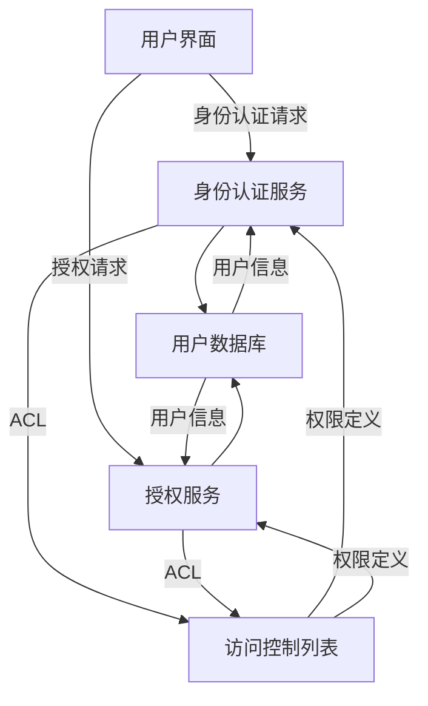
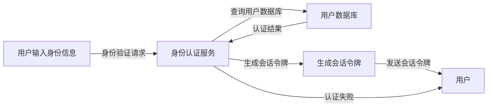
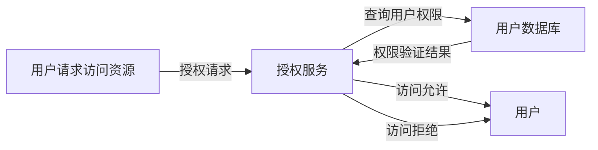
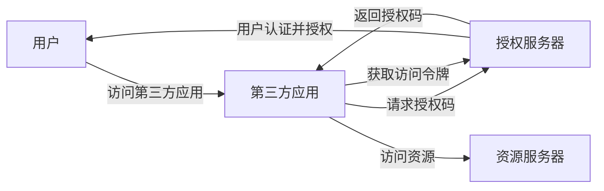

                 


### 第1章：身份认证与授权基础

#### 1.1 身份认证与授权的定义

**身份认证（Authentication）** 是指验证用户或系统的身份的过程。简单来说，就是确认用户是否为合法用户。身份认证可以采用多种方式，如用户名/密码、双因素认证（2FA）、生物识别等。

**授权（Authorization）** 是指确定一个经过身份认证的用户或系统在访问某个资源时的权限。即，即使一个用户通过了身份认证，也并不意味着他可以访问所有资源。授权过程定义了用户可以执行哪些操作，访问哪些数据。

**认证与授权的区别**：
- **认证** 关注的是“你是谁”，即确认用户的真实性。
- **授权** 关注的是“你能做什么”，即确定用户的权限。

#### 1.2 身份认证与授权的重要性

**保护用户数据**：
- **身份认证** 是保护用户数据的第一道防线，可以防止未授权用户访问敏感数据。
- **授权** 是确保用户只能访问他们有权访问的数据和系统功能。

**防止未授权访问**：
- 身份认证与授权机制可以有效防止未授权访问，减少数据泄露和恶意攻击的风险。

#### 1.3 身份认证与授权的发展历程

**早期的认证机制**：
- 早期的认证机制相对简单，通常只使用用户名和密码。
- 这些机制容易受到密码泄露和暴力破解的攻击。

**现代认证技术的发展**：
- **双因素认证（2FA）**：在用户名和密码的基础上，增加第二重验证，如手机短信验证码、动态令牌等。
- **生物识别技术**：使用指纹、眼纹、面部识别等技术进行身份验证。
- **单点登录（SSO）**：允许用户使用一个账号登录多个系统。

#### 1.4 身份认证与授权的挑战

**安全性性与用户体验的平衡**：
- 确保系统安全性与用户体验之间的平衡是一个挑战。过于复杂的安全机制可能降低用户体验。

**数据隐私与合规性**：
- 在处理用户数据时，需要遵守数据隐私法规，如GDPR等。合规性要求增加了认证与授权的复杂性。

#### 总结

身份认证与授权是保护用户数据和防止未授权访问的关键机制。理解其定义、重要性、发展历程和面临的挑战，对于设计高效、安全的认证与授权系统至关重要。

## 梅尔卡托流程图：身份认证与授权的流程

下面是身份认证与授权的基本流程，使用梅尔卡托（Mermaid）流程图表示：

```mermaid
flowchart LR
    subgraph 身份认证
        用户输入信息 -> 验证信息
        验证信息 -> 身份认证成功/失败
    end

    subgraph 授权
        身份认证成功 -> 用户请求访问 -> 授权决策
        授权决策 -> 访问允许/拒绝
    end

    用户输入信息 ->|认证流程| 验证信息
    验证信息 ->|认证成功| 身份认证成功
    验证信息 ->|认证失败| 身份认证失败
    身份认证成功 ->|授权流程| 用户请求访问
    用户请求访问 ->|授权决策| 授权允许/拒绝
    身份认证失败/授权拒绝 ->|反馈| 用户
    身份认证成功/授权允许 ->|反馈| 用户访问资源
```

### 1.5 小结

本章介绍了身份认证与授权的基本概念、重要性、发展历程以及面临的挑战。理解这些基本概念对于后续章节中深入探讨具体技术实现和应用至关重要。

## 文章标题：身份认证与授权：保护用户数据的关键机制

> 关键词：身份认证，授权，用户数据保护，加密技术，安全协议，双因素认证，生物识别

> 摘要：本文系统地介绍了身份认证与授权的基础概念、技术原理、应用实践以及安全性与隐私保护。通过深入分析，我们揭示了这些机制在保护用户数据中的关键作用，探讨了其在实际项目中的挑战与解决方案，为构建高效、安全的认证与授权系统提供了指导。

### 第1章：身份认证与授权基础

#### 1.1 身份认证与授权的定义

**身份认证（Authentication）** 是指验证用户或系统的身份的过程。简单来说，就是确认用户是否为合法用户。身份认证可以采用多种方式，如用户名/密码、双因素认证（2FA）、生物识别等。

**授权（Authorization）** 是指确定一个经过身份认证的用户或系统在访问某个资源时的权限。即，即使一个用户通过了身份认证，也并不意味着他可以访问所有资源。授权过程定义了用户可以执行哪些操作，访问哪些数据。

**认证与授权的区别**：
- **认证** 关注的是“你是谁”，即确认用户的真实性。
- **授权** 关注的是“你能做什么”，即确定用户的权限。

#### 1.2 身份认证与授权的重要性

**保护用户数据**：
- **身份认证** 是保护用户数据的第一道防线，可以防止未授权用户访问敏感数据。
- **授权** 是确保用户只能访问他们有权访问的数据和系统功能。

**防止未授权访问**：
- 身份认证与授权机制可以有效防止未授权访问，减少数据泄露和恶意攻击的风险。

#### 1.3 身份认证与授权的发展历程

**早期的认证机制**：
- 早期的认证机制相对简单，通常只使用用户名和密码。
- 这些机制容易受到密码泄露和暴力破解的攻击。

**现代认证技术的发展**：
- **双因素认证（2FA）**：在用户名和密码的基础上，增加第二重验证，如手机短信验证码、动态令牌等。
- **生物识别技术**：使用指纹、眼纹、面部识别等技术进行身份验证。
- **单点登录（SSO）**：允许用户使用一个账号登录多个系统。

#### 1.4 身份认证与授权的挑战

**安全性性与用户体验的平衡**：
- 确保系统安全性与用户体验之间的平衡是一个挑战。过于复杂的安全机制可能降低用户体验。

**数据隐私与合规性**：
- 在处理用户数据时，需要遵守数据隐私法规，如GDPR等。合规性要求增加了认证与授权的复杂性。

#### 总结

身份认证与授权是保护用户数据和防止未授权访问的关键机制。理解其定义、重要性、发展历程和面临的挑战，对于设计高效、安全的认证与授权系统至关重要。

## 梅尔卡托流程图：身份认证与授权的流程

下面是身份认证与授权的基本流程，使用梅尔卡托（Mermaid）流程图表示：

```mermaid
flowchart LR
    subgraph 身份认证
        用户输入信息 -> 验证信息
        验证信息 -> 身份认证成功/失败
    end

    subgraph 授权
        身份认证成功 -> 用户请求访问 -> 授权决策
        授权决策 -> 访问允许/拒绝
    end

    用户输入信息 ->|认证流程| 验证信息
    验证信息 ->|认证成功| 身份认证成功
    验证信息 ->|认证失败| 身份认证失败
    身份认证成功 ->|授权流程| 用户请求访问
    用户请求访问 ->|授权决策| 授权允许/拒绝
    身份认证失败/授权拒绝 ->|反馈| 用户
    身份认证成功/授权允许 ->|反馈| 用户访问资源
```

### 1.5 小结

本章介绍了身份认证与授权的基本概念、重要性、发展历程以及面临的挑战。理解这些基本概念对于后续章节中深入探讨具体技术实现和应用至关重要。在接下来的章节中，我们将进一步探讨加密技术、安全协议等关键技术，以及如何在实践中应用这些技术。

## 第2章：加密技术与安全协议

加密技术是现代网络安全的核心，它确保数据在传输和存储过程中的机密性、完整性和可用性。在本章中，我们将深入探讨几种主要的加密技术，包括对称加密、非对称加密和哈希函数，并介绍一些常用的安全协议，如SSL/TLS和OAuth 2.0。

### 2.1 加密技术的基本概念

#### 对称加密与非对称加密

**对称加密（Symmetric Encryption）**：
- 对称加密是一种加密和解密使用相同密钥的加密方法。
- 常见算法包括AES（高级加密标准）和DES（数据加密标准）。
- 对称加密的优点是速度快，适用于加密大量数据。
- 缺点是密钥管理复杂，需要确保密钥的安全传输和存储。

**非对称加密（Asymmetric Encryption）**：
- 非对称加密使用一对密钥：公钥和私钥。
- 公钥用于加密，私钥用于解密。
- 常见算法包括RSA和ECC（椭圆曲线加密）。
- 非对称加密的优点是提供了更安全的密钥管理，但计算复杂度较高。

#### 哈希函数

**哈希函数（Hash Function）**：
- 哈希函数是一种将任意长度的输入数据转换成固定长度的字符串的算法。
- 常见算法包括MD5、SHA-1和SHA-256。
- 哈希函数的特点是单向性、快速性和抗冲突性。
- 用来验证数据的完整性和进行数字签名。

### 2.2 安全协议

#### SSL/TLS

**SSL（安全套接字层）和TLS（传输层安全协议）**：
- SSL/TLS 是用于在互联网上安全传输数据的协议。
- 它们在数据传输过程中提供加密、认证和完整性保护。
- SSL/TLS 使用了X.509证书进行身份验证，确保通信双方的身份是可信的。
- 常见的TLS版本包括TLS 1.0、1.1、1.2和1.3。

#### OAuth 2.0

**OAuth 2.0**：
- OAuth 2.0 是一种授权框架，允许第三方应用访问用户资源而无需获取用户的用户名和密码。
- 它基于令牌（Token）机制，使用户可以在不暴露敏感信息的情况下授权第三方访问。
- OAuth 2.0 支持多种授权类型，如客户端凭证授权、授权码授权和资源所有者密码授权。

### 2.3 认证与授权协议

#### RADIUS

**RADIUS（远程身份验证拨号用户服务）**：
- RADIUS 是一种网络协议，用于在网络访问服务器（NAS）和远程认证服务器之间进行身份验证、授权和会计（AAA）功能。
- 它支持多种认证方式，如用户名/密码、证书和一次性密码。
- RADIUS 常用于无线网络和VPN服务。

#### SAML

**SAML（安全断言标记语言）**：
- SAML 是一种基于XML的认证与授权协议。
- 它允许不同的安全域之间进行用户认证和授权信息的交换。
- SAML 的主要应用场景包括单点登录（SSO）和Web服务安全。

### 2.4 加密技术与安全协议的联系

加密技术与安全协议密切相关，它们共同确保数据在传输和存储过程中的安全性。

- **加密技术** 提供了数据的加密和解密手段，保证数据的机密性。
- **安全协议** 则提供了一套完整的机制，包括身份验证、授权和完整性保护，确保数据传输的安全性和可靠性。

### 2.5 小结

加密技术是保护数据安全的基础，安全协议则提供了完整的保护机制。理解对称加密、非对称加密、哈希函数等基本加密技术，以及SSL/TLS、OAuth 2.0、RADIUS和SAML等安全协议，对于构建安全、可靠的认证与授权系统至关重要。在接下来的章节中，我们将进一步探讨身份认证技术的具体实现。

## 加密技术原理与伪代码

### 2.1.1 对称加密

#### AES（高级加密标准）

**原理**：
AES 是一种分组加密算法，它使用密钥对数据进行加密和解密。AES 支持三种不同的密钥长度：128位、192位和256位。以下是一个简单的AES加密算法的伪代码：

```python
# AES加密函数
def AES_encrypt(plaintext, key):
    # 分块处理明文
    blocks = [plaintext[i:i+128] for i in range(0, len(plaintext), 128)]
    ciphertext = []
    
    for block in blocks:
        # 初始向量（IV）的处理
        state = initial_vector
        
        # 多次加密轮
        for i in range(number_of_rounds):
            state = AES_round(state, key[i])
        
        # 生成密文块
        ciphertext.append(state)
    
    return ''.join(ciphertext)
```

**AES加密轮函数**

```python
def AES_round(state, key):
    # 执行轮变换
    # 这包括字节替换、行移位、列混淆和轮密钥加
    # 具体实现复杂，这里仅提供伪代码框架
    new_state = ...
    return new_state
```

#### RSA（Rivest-Shamir-Adleman）

**原理**：
RSA 是一种非对称加密算法，它使用一对密钥：公钥和私钥。公钥用于加密，私钥用于解密。以下是一个简单的RSA加密算法的伪代码：

```python
# RSA加密函数
def RSA_encrypt(plaintext, public_key):
    # 将明文转换为数字形式
    num_plaintext = convert_to_number(plaintext)
    
    # 计算密文
    num_ciphertext = num_plaintext ** public_key[0] % public_key[1]
    
    return num_ciphertext

# 公钥格式为（e, n），其中e是加密指数，n是模数
public_key = (e, n)
ciphertext = RSA_encrypt(plaintext, public_key)
```

### 2.1.2 哈希函数

#### SHA-256

**原理**：
SHA-256 是一种哈希函数，它将输入数据映射成一个固定长度的哈希值。以下是一个简单的SHA-256哈希计算的伪代码：

```python
# SHA-256哈希函数
def SHA256(plaintext):
    # 初始化哈希值
    hash_value = initial_hash_value
    
    # 对明文进行分块处理
    blocks = [plaintext[i:i+512] for i in range(0, len(plaintext), 512)]
    
    for block in blocks:
        # 对每个块进行哈希计算
        new_hash_value = process_block(block, hash_value)
        
        # 更新哈希值
        hash_value = new_hash_value
    
    return hash_value
```

**哈希计算过程**

```python
def process_block(block, current_hash_value):
    # 执行哈希算法的详细步骤，如扩展、压缩等
    new_hash_value = ...
    return new_hash_value
```

### 2.1.3 SSL/TLS

**SSL/TLS原理**：
SSL/TLS 提供了数据传输的安全保护，包括加密、认证和数据完整性验证。以下是一个简单的SSL/TLS加密传输的伪代码：

```python
# SSL/TLS加密传输
def SSL_encrypt(plaintext, server_certificate):
    # 验证服务器证书
    verify_certificate(server_certificate)
    
    # 生成会话密钥
    session_key = generate_session_key(server_certificate)
    
    # 使用会话密钥加密明文
    ciphertext = AES_encrypt(plaintext, session_key)
    
    return ciphertext
```

**SSL/TLS传输流程**

```python
# 客户端发起SSL/TLS连接
plaintext = "需要传输的数据"
server_certificate = receive_certificate_from_server()

# 加密传输
ciphertext = SSL_encrypt(plaintext, server_certificate)

# 服务器解密
plaintext = SSL_decrypt(ciphertext, server_certificate)
```

### 2.1.4 小结

加密技术是保障数据安全的核心，通过了解对称加密、非对称加密和哈希函数的基本原理，以及SSL/TLS的安全传输机制，我们能够更好地理解和应用这些技术。在实际应用中，加密技术和安全协议的结合使用，能够提供全面的数据保护和网络安全。

## 第3章：身份认证技术

在数字时代，身份认证技术是确保系统和数据安全的关键。本章将详细探讨几种常见的身份认证技术，包括用户名/密码认证、双因素认证（2FA）和生物识别技术。我们将分析这些技术的原理、优点和缺点，并探讨它们在实际应用中的使用场景。

### 3.1 用户名/密码认证

**原理**：
用户名/密码认证是最传统的身份认证方法，用户通过输入预定义的用户名和密码来证明自己的身份。服务器端会对比输入的用户名和密码，如果匹配，则认证通过。

**优点**：
- **简单易用**：用户只需要记住用户名和密码即可。
- **成本低**：实现简单，部署成本低。

**缺点**：
- **安全性低**：密码容易被破解或泄露。
- **易受暴力破解攻击**：攻击者可以通过多次尝试猜测密码。

**使用场景**：
用户名/密码认证适用于对安全性要求不高的应用场景，如内部办公系统、论坛等。

### 3.2 双因素认证（2FA）

**原理**：
双因素认证（2FA）是一种在用户名和密码的基础上增加第二重验证的方法。常见的2FA方法包括手机短信验证码、动态令牌（例如Google Authenticator）、邮件验证等。

**优点**：
- **增强安全性**：即使密码泄露，攻击者也无法访问用户账户。
- **低成本**：适用于大多数应用场景，无需额外的硬件投入。

**缺点**：
- **用户体验较差**：需要额外步骤进行验证，可能影响用户体验。
- **依赖于通信通道**：如短信验证码，可能受到通信通道的影响。

**使用场景**：
双因素认证适用于对安全性有较高要求的应用场景，如银行系统、在线支付平台等。

### 3.3 生物识别技术

**原理**：
生物识别技术利用人体生物特征进行身份验证，常见的生物特征包括指纹、眼纹、面部识别等。生物识别技术通过采集用户的生物特征数据，并与数据库中的数据进行匹配，以确认用户身份。

**优点**：
- **高安全性**：生物特征难以伪造，安全性高。
- **方便快捷**：无需记忆复杂的密码或令牌，使用方便。

**缺点**：
- **成本高**：需要特殊的硬件设备。
- **隐私问题**：可能涉及用户隐私数据。

**使用场景**：
生物识别技术适用于对安全性有极高要求且用户体验重要的应用场景，如机场安全检查、智能门禁系统等。

### 3.4 多因素认证（MFA）

**原理**：
多因素认证（MFA）是2FA的扩展，它同时结合两种或多种认证因素，例如用户名/密码 + 生物识别、用户名/密码 + 动态令牌等。

**优点**：
- **进一步提升安全性**：结合多种认证因素，大大降低了被破解的风险。
- **灵活性高**：可以根据应用场景选择合适的认证因素。

**缺点**：
- **实现复杂度增加**：需要处理多种认证因素的组合，实现难度较大。
- **用户体验可能受影响**：需要更多的步骤进行认证。

**使用场景**：
多因素认证适用于对安全性要求极高且用户体验可以接受的应用场景，如金融机构、军事系统等。

### 3.5 小结

身份认证技术是保护用户数据和防止未授权访问的关键。用户名/密码认证简单易用，但安全性较低；双因素认证增强安全性，但可能影响用户体验；生物识别技术提供高安全性，但成本高；多因素认证结合多种认证因素，大大提高了安全性。选择合适的身份认证技术，需要根据应用场景和安全要求进行权衡。

## 梅尔卡托流程图：用户名/密码认证流程

下面是用户名/密码认证的基本流程，使用梅尔卡托（Mermaid）流程图表示：

```mermaid
flowchart LR
    subgraph 用户端
        用户输入用户名 -> 验证用户名
        用户输入密码 -> 验证密码
    end

    subgraph 服务器端
        验证用户名 -> 查询用户信息
        验证密码 -> 对比存储的密码
        认证结果 -> 反馈用户
    end

    用户输入用户名 ->|输入用户名| 验证用户名
    验证用户名 ->|查询用户信息| 查询用户信息
    用户输入密码 ->|输入密码| 验证密码
    验证密码 ->|对比存储密码| 对比存储密码
    对比存储密码 ->|认证结果| 反馈用户
```

## 第4章：授权机制

授权机制是确保经过身份认证的用户能够按照其权限进行操作的关键组成部分。在本章中，我们将详细探讨三种常见的授权机制：访问控制模型、基于角色的访问控制（RBAC）和OAuth 2.0与OpenID Connect。

### 4.1 访问控制模型

**访问控制模型** 是一种用于限制和允许用户访问资源的方法。它通常基于以下模型：

- **自主访问控制（DAC，Discretionary Access Control）**：
  - 用户对自己创建的资源具有完全的控制权。
  - 用户可以决定哪些用户可以访问这些资源。

- **强制访问控制（MAC，Mandatory Access Control）**：
  - 访问控制由系统管理员定义，用户不能更改。
  - 根据对象的标签和用户的标签来决定访问权限。

- **基于属性的访问控制（ABAC，Attribute-Based Access Control）**：
  - 访问权限取决于用户属性、环境属性和资源属性。
  - 通常用于复杂的企业级安全场景。

### 4.2 RBAC（基于角色的访问控制）

**RBAC（Role-Based Access Control）** 是一种常见的授权机制，它通过将用户分配到不同的角色来实现访问控制。

**RBAC的基本概念**：

- **角色（Role）**：一组具有相同权限的用户集合。
- **权限（Permission）**：允许用户执行的操作。
- **用户（User）**：具有身份的实体。
- **资源（Resource）**：需要保护的实体，如数据库、文件等。

**RBAC的核心组件**：

- **角色分配（Role Assignment）**：将用户分配到特定的角色。
- **权限分配（Permission Assignment）**：将权限分配给特定的角色。
- **角色继承（Role Inheritance）**：角色可以继承其他角色的权限。

**RBAC的优势**：

- **简化管理**：通过角色管理，简化了权限管理。
- **灵活性**：可以根据业务需求灵活调整角色和权限。
- **安全**：角色和权限的分离提高了系统的安全性。

### 4.3 OAuth 2.0与OpenID Connect

**OAuth 2.0** 是一种授权框架，允许第三方应用代表用户访问他们的资源，而不需要获取用户的用户名和密码。OAuth 2.0 的核心概念包括：

- **客户端（Client）**：请求访问资源的应用。
- **资源拥有者（Resource Owner）**：拥有资源的用户。
- **资源服务器（Resource Server）**：存储和提供资源的服务器。
- **授权服务器（Authorization Server）**：负责认证用户和授权客户端访问资源的实体。

**OAuth 2.0 的授权流程**：

1. **授权码流程**：
   - 客户端向授权服务器请求授权码。
   - 用户在授权服务器上认证并同意授权。
   - 授权服务器将授权码返回给客户端。
   - 客户端使用授权码从授权服务器获取访问令牌。

2. **密码凭证流程**：
   - 客户端直接向授权服务器提供用户名和密码。
   - 授权服务器验证用户身份后，返回访问令牌。

3. **客户端凭证流程**：
   - 客户端使用自己的凭证（通常是客户端ID和密钥）直接从授权服务器获取访问令牌。

**OpenID Connect** 是OAuth 2.0 的身份层扩展，它提供了一种在OAuth 2.0 中实现身份验证和单点登录（SSO）的方法。

**OpenID Connect 的核心组件**：

- **ID Token**：包含认证信息，如用户的身份、授权范围等。
- **Access Token**：用于访问受保护资源。
- **UserInfo**：包含用户信息的JSON对象。

**OpenID Connect 的流程**：

1. **注册流程**：
   - 客户端在授权服务器上注册，获取客户端ID和密钥。

2. **认证流程**：
   - 用户在授权服务器上认证，获取ID Token。

3. **授权流程**：
   - 用户同意授权，客户端获取Access Token。

4. **UserInfo获取流程**：
   - 客户端使用Access Token获取用户信息。

### 4.4 小结

授权机制是确保用户访问权限的最后一道防线。访问控制模型、RBAC 和 OAuth 2.0 与 OpenID Connect 分别提供了不同的授权方式，适用于不同的应用场景。理解这些机制，可以帮助我们设计出既安全又灵活的授权系统。

## 梅尔卡托流程图：OAuth 2.0 授权流程

下面是OAuth 2.0 授权流程的基本流程，使用梅尔卡托（Mermaid）流程图表示：

```mermaid
flowchart LR
    subgraph 客户端
        客户端 ->|请求授权码| 授权服务器
    end

    subgraph 用户
        用户 ->|认证并授权| 授权服务器
    end

    subgraph 客户端
        授权服务器 ->|返回授权码| 客户端
    end

    subgraph 客户端
        客户端 ->|交换授权码获取访问令牌| 授权服务器
    end

    subgraph 资源服务器
        客户端 ->|使用访问令牌请求资源| 资源服务器
    end

    客户端 ->|请求授权码| 授权服务器
    授权服务器 ->|返回授权码| 用户
    用户 ->|认证并授权| 授权服务器
    授权服务器 ->|返回授权码| 客户端
    客户端 ->|交换授权码获取访问令牌| 授权服务器
    授权服务器 ->|返回访问令牌| 客户端
    客户端 ->|使用访问令牌请求资源| 资源服务器
```

## 第5章：身份认证与授权系统设计

设计一个高效、安全的身份认证与授权系统是确保用户数据安全的关键。本章将详细讨论系统架构设计、用户身份认证流程、授权流程以及设计的关键点。

### 5.1 身份认证与授权系统架构

一个典型的身份认证与授权系统通常包括以下几个核心组件：

- **用户界面（UI）**：用户通过UI进行身份认证和交互。
- **身份认证服务**：负责处理用户的身份验证请求。
- **授权服务**：负责处理用户的授权请求。
- **用户数据库**：存储用户信息，如用户名、密码、角色等。
- **访问控制列表（ACL）**：定义资源的访问权限。

**系统架构图**：



### 5.2 用户身份认证流程

用户身份认证流程是指用户如何通过身份认证服务验证自己的身份。以下是用户身份认证流程的详细步骤：

1. **用户输入身份信息**：
   - 用户在用户界面上输入用户名和密码。

2. **身份认证服务验证身份**：
   - 身份认证服务接收到用户身份信息后，查询用户数据库进行验证。

3. **认证成功**：
   - 如果用户身份验证成功，系统生成一个会话令牌（Session Token），并发送给用户。

4. **认证失败**：
   - 如果用户身份验证失败，系统返回错误信息，并可能限制用户的重新尝试次数。

**流程图**：



### 5.3 授权流程

授权流程是指用户在通过身份认证后，如何获取访问特定资源的权限。以下是授权流程的详细步骤：

1. **用户请求访问资源**：
   - 用户通过用户界面请求访问某个资源。

2. **授权服务验证权限**：
   - 授权服务接收到用户的访问请求后，检查用户是否有访问该资源的权限。

3. **权限验证通过**：
   - 如果用户有权限，授权服务返回允许访问的资源。

4. **权限验证失败**：
   - 如果用户没有权限，授权服务返回拒绝访问的信息。

**流程图**：



### 5.4 设计的关键点

**安全性**：
- 采用强密码策略和双因素认证（2FA）增强安全性。
- 定期更新系统和软件，以防范已知漏洞。

**可扩展性**：
- 系统应能够处理高并发访问，支持横向扩展。
- 设计应考虑未来的需求变化。

**用户体验**：
- 界面设计简洁易懂，减少用户操作的复杂性。
- 提供友好的错误提示和重试机制。

**维护性**：
- 编码规范，文档齐全，便于后续维护和升级。

**合规性**：
- 遵守数据隐私法规，如GDPR、CCPA等。
- 确保系统的操作符合相关的法律法规。

### 5.5 小结

设计一个高效、安全的身份认证与授权系统需要考虑多个方面，包括安全性、可扩展性、用户体验、维护性和合规性。通过合理的设计和实施，系统能够有效保护用户数据，同时提供良好的用户体验。

## 第6章：身份认证与授权在实际项目中的应用

在现实世界中，身份认证与授权系统广泛应用于各种项目和场景，确保数据安全并提高用户体验。本章将探讨几个实际项目中的身份认证与授权应用，包括Web应用程序、移动应用程序和云服务。

### 6.1 Web应用程序的身份认证与授权

Web应用程序是身份认证与授权应用最为广泛的一个领域。以下是一些典型的Web应用程序身份认证与授权的应用场景：

#### 使用JWT（JSON Web Token）

**JWT（JSON Web Token）** 是一种用于在客户端和服务端之间安全传输数据的开放标准。以下是一个典型的JWT认证流程：

1. **用户登录**：
   - 用户在Web浏览器上输入用户名和密码。
   - 前端应用程序将用户名和密码发送到后端身份认证服务。
   - 身份认证服务验证用户身份后，生成一个JWT令牌并返回给前端。

2. **Token验证**：
   - 前端应用程序将JWT令牌存储在本地存储（如localStorage或cookie）。
   - 后端服务在每次请求时验证JWT令牌的有效性。

3. **访问资源**：
   - 用户在Web应用程序中请求访问资源。
   - 前端应用程序在请求头中附加JWT令牌。
   - 后端服务验证JWT令牌后，允许用户访问相应的资源。

**代码示例**：

前端：

```javascript
// 登录
const username = 'user@example.com';
const password = 'password';

fetch('/login', {
  method: 'POST',
  body: JSON.stringify({ username, password }),
  headers: {
    'Content-Type': 'application/json'
  }
})
.then(response => response.json())
.then(data => {
  localStorage.setItem('token', data.token);
});

// 发送请求
fetch('/resource', {
  method: 'GET',
  headers: {
    'Authorization': `Bearer ${localStorage.getItem('token')}`
  }
})
.then(response => response.json())
.then(data => console.log(data));
```

后端（使用Node.js和Express框架）：

```javascript
const express = require('express');
const jwt = require('jsonwebtoken');

const app = express();

app.post('/login', (req, res) => {
  // 验证用户身份
  // ...

  // 生成JWT令牌
  const token = jwt.sign({ username: req.body.username }, 'secretKey');
  res.json({ token });
});

app.get('/resource', (req, res) => {
  // 验证JWT令牌
  const token = req.headers.authorization.split(' ')[1];
  jwt.verify(token, 'secretKey', (err, user) => {
    if (err) {
      res.status(401).send('未经授权');
    } else {
      res.json({ data: '敏感资源数据' });
    }
  });
});

app.listen(3000, () => {
  console.log('Server listening on port 3000');
});
```

#### 使用OAuth 2.0进行单点登录（SSO）

OAuth 2.0 是一种授权框架，允许第三方应用代表用户访问他们的资源，而不需要获取用户的用户名和密码。以下是一个典型的OAuth 2.0 SSO流程：

1. **注册应用**：
   - 第三方应用在授权服务器上注册，获取客户端ID和客户端密钥。

2. **请求授权码**：
   - 用户访问第三方应用，应用重定向用户到授权服务器。
   - 用户在授权服务器上登录并同意授权。

3. **获取访问令牌**：
   - 授权服务器将授权码返回给第三方应用。
   - 第三方应用使用授权码和客户端密钥获取访问令牌。

4. **访问资源**：
   - 第三方应用使用访问令牌从资源服务器获取用户资源。

**流程图**：



### 6.2 移动应用程序的身份认证与授权

移动应用程序的身份认证与授权有其独特的挑战，例如设备安全性和网络环境的不确定性。以下是一些移动应用程序身份认证与授权的应用场景：

#### 使用OAuth 2.0进行移动认证

移动应用程序可以使用OAuth 2.0进行身份认证和授权，以下是一个简单的流程：

1. **用户登录**：
   - 用户在移动应用程序中输入用户名和密码。
   - 应用程序将用户身份信息发送到后端身份认证服务。

2. **身份认证**：
   - 身份认证服务验证用户身份，并返回一个JWT令牌。

3. **访问资源**：
   - 移动应用程序使用JWT令牌进行后续请求。

**代码示例**：

移动端（使用React Native）：

```javascript
// 登录
const loginUser = async (username, password) => {
  const response = await fetch('/login', {
    method: 'POST',
    body: JSON.stringify({ username, password }),
    headers: {
      'Content-Type': 'application/json'
    }
  });
  const data = await response.json();
  if (data.token) {
    AsyncStorage.setItem('token', data.token);
  }
};

// 发送请求
const fetchResource = async () => {
  const token = await AsyncStorage.getItem('token');
  const response = await fetch('/resource', {
    method: 'GET',
    headers: {
      'Authorization': `Bearer ${token}`
    }
  });
  const data = await response.json();
  console.log(data);
};
```

后端（使用Node.js和Express框架）：

```javascript
const express = require('express');
const jwt = require('jsonwebtoken');

const app = express();

app.post('/login', (req, res) => {
  // 验证用户身份
  // ...

  // 生成JWT令牌
  const token = jwt.sign({ username: req.body.username }, 'secretKey');
  res.json({ token });
});

app.get('/resource', (req, res) => {
  // 验证JWT令牌
  const token = req.headers.authorization.split(' ')[1];
  jwt.verify(token, 'secretKey', (err, user) => {
    if (err) {
      res.status(401).send('未经授权');
    } else {
      res.json({ data: '敏感资源数据' });
    }
  });
});

app.listen(3000, () => {
  console.log('Server listening on port 3000');
});
```

#### 使用OAuth 2.0移动认证

移动应用程序可以使用OAuth 2.0进行身份认证和授权，以下是一个简单的流程：

1. **用户登录**：
   - 用户在移动应用程序中输入用户名和密码。
   - 应用程序将用户身份信息发送到后端身份认证服务。

2. **身份认证**：
   - 身份认证服务验证用户身份，并返回一个访问令牌。

3. **访问资源**：
   - 移动应用程序使用访问令牌进行后续请求。

**代码示例**：

移动端（使用React Native）：

```javascript
// 登录
const loginUser = async (username, password) => {
  const response = await fetch('/login', {
    method: 'POST',
    body: JSON.stringify({ username, password }),
    headers: {
      'Content-Type': 'application/json'
    }
  });
  const data = await response.json();
  if (data.access_token) {
    AsyncStorage.setItem('access_token', data.access_token);
  }
};

// 发送请求
const fetchResource = async () => {
  const access_token = await AsyncStorage.getItem('access_token');
  const response = await fetch('/resource', {
    method: 'GET',
    headers: {
      'Authorization': `Bearer ${access_token}`
    }
  });
  const data = await response.json();
  console.log(data);
};
```

后端（使用Node.js和Express框架）：

```javascript
const express = require('express');
const axios = require('axios');

const app = express();

app.post('/login', (req, res) => {
  // 验证用户身份
  // ...

  // 获取访问令牌
  axios.post('https://authserver.com/token', {
    grant_type: 'password',
    username: req.body.username,
    password: req.body.password
  }, {
    headers: {
      'Authorization': `Basic ${Buffer.from(`${client_id}:${client_secret}`).toString('base64')}`
    }
  })
  .then(response => {
    res.json({ access_token: response.data.access_token });
  })
  .catch(error => {
    res.status(401).send('认证失败');
  });
});

app.get('/resource', (req, res) => {
  // 验证访问令牌
  const access_token = req.headers.authorization.split(' ')[1];
  axios.get('https://resourceserver.com/resource', {
    headers: {
      'Authorization': `Bearer ${access_token}`
    }
  })
  .then(response => {
    res.json(response.data);
  })
  .catch(error => {
    res.status(401).send('未经授权');
  });
});

app.listen(3000, () => {
  console.log('Server listening on port 3000');
});
```

### 6.3 云服务和容器环境的身份认证与授权

在云服务和容器环境中，身份认证与授权通常使用基于角色的访问控制（RBAC）和OAuth 2.0等机制。以下是一些常见的使用场景：

#### Kubernetes中的身份认证与授权

Kubernetes 使用 RBAC 机制来管理集群中的访问权限。以下是一个简单的Kubernetes RBAC设置：

1. **创建角色和绑定**：
   - 创建一个角色，定义所需的权限。
   - 将角色绑定到一个用户或组。

2. **用户访问集群**：
   - 用户使用Kubectl命令行工具访问Kubernetes集群。
   - Kubernetes API服务器验证用户的角色和权限。

**YAML示例**：

```yaml
apiVersion: rbac.authorization.k8s.io/v1
kind: Role
metadata:
  name: reader
rules:
- apiGroups: [""]
  resources: ["pods"]
  verbs: ["get", "list"]

---
apiVersion: rbac.authorization.k8s.io/v1
kind: RoleBinding
metadata:
  name: reader-rolebinding
subjects:
- kind: User
  name: alice
  apiGroup: rbac.authorization.k8s.io
roleRef:
  kind: Role
  name: reader
  apiGroup: rbac.authorization.k8s.io
```

#### 云服务提供商的认证机制

云服务提供商通常提供多种认证机制，如用户名/密码、双因素认证（2FA）、OAuth 2.0等。以下是一个使用OAuth 2.0进行云服务认证的示例：

1. **注册应用**：
   - 应用在云服务提供商上注册，获取客户端ID和客户端密钥。

2. **获取访问令牌**：
   - 应用使用用户名和密码或OAuth 2.0凭证获取访问令牌。

3. **访问资源**：
   - 应用使用访问令牌进行对云服务资源的请求。

**代码示例**：

```javascript
// 注册应用
const client_id = 'your_client_id';
const client_secret = 'your_client_secret';

// 获取访问令牌
const tokenUrl = `https://cloudservice.com/oauth/token?grant_type=password&client_id=${client_id}&client_secret=${client_secret}&username=user&password=password`;

fetch(tokenUrl, {
  method: 'POST',
  headers: {
    'Content-Type': 'application/x-www-form-urlencoded'
  }
})
.then(response => response.json())
.then(data => {
  const access_token = data.access_token;
  // 使用访问令牌访问资源
  fetch('https://cloudservice.com/resource', {
    method: 'GET',
    headers: {
      'Authorization': `Bearer ${access_token}`
    }
  })
  .then(response => response.json())
  .then(data => console.log(data));
});
```

### 6.4 小结

身份认证与授权在实际项目中至关重要，不同的应用场景需要采用不同的认证与授权机制。Web应用程序通常使用JWT和OAuth 2.0进行认证，移动应用程序则更多依赖于OAuth 2.0和本地存储。云服务和容器环境使用基于角色的访问控制（RBAC）来管理权限。理解这些机制并选择合适的方案，可以确保系统的高效、安全运行。

## 第7章：身份认证与授权案例解析

在本章中，我们将通过分析几个实际案例，深入探讨身份认证与授权系统在实际应用中的设计、实施和挑战。这些案例将涵盖大型电子商务平台、银行系统和社交媒体平台，通过这些案例分析，我们将更好地理解身份认证与授权系统的最佳实践。

### 7.1 大型电子商务平台

**案例背景**：
某知名电子商务平台需要为用户提供安全、便捷的登录和购物体验。平台上的用户数据包括个人资料、购物车信息、订单历史等，因此，身份认证与授权系统的安全性至关重要。

**设计思路**：
1. **多因素认证**：为了提高安全性，平台采用用户名/密码+手机验证码的双因素认证机制。
2. **OAuth 2.0**：平台支持第三方账号登录，如Google、Facebook等，使用OAuth 2.0进行单点登录（SSO）。
3. **访问控制**：基于RBAC模型，平台为不同角色（如管理员、普通用户）设定不同的权限。

**实施过程**：
1. **用户注册与登录**：
   - 用户在注册时填写用户名、密码和手机号。
   - 登录时，用户输入用户名和密码，系统发送手机验证码，用户输入验证码后登录成功。

2. **第三方账号登录**：
   - 用户可以选择使用Google、Facebook等账号登录。
   - 第三方账号登录成功后，平台与第三方服务进行OAuth 2.0认证。

3. **访问控制**：
   - 管理员可以通过后台管理系统进行数据管理和监控。
   - 普通用户只能访问与自身相关的数据。

**挑战与解决方案**：
- **挑战**：如何平衡安全性与用户体验？
  **解决方案**：提供简洁的登录流程，减少用户操作步骤，同时使用双因素认证增强安全性。
- **挑战**：第三方账号登录的信任问题。
  **解决方案**：与知名的第三方服务合作，确保认证过程的安全可靠。

**案例小结**：该电子商务平台通过多因素认证、OAuth 2.0和RBAC实现了既安全又便捷的身份认证与授权系统，为用户提供良好的购物体验。

### 7.2 银行系统

**案例背景**：
某大型银行需要为其客户提供高度安全、可靠的在线银行服务。银行系统存储和处理大量敏感数据，如账户信息、交易记录等，因此，身份认证与授权系统的安全性至关重要。

**设计思路**：
1. **双因素认证**：用户在登录时需要输入用户名、密码和手机验证码。
2. **生物识别技术**：为提高安全性，银行引入了指纹识别和面部识别技术。
3. **基于属性的访问控制（ABAC）**：银行使用ABAC模型，根据用户的属性和操作行为进行权限控制。

**实施过程**：
1. **用户注册与登录**：
   - 用户在注册时填写用户名、密码和手机号，并设置指纹或面部识别。
   - 登录时，用户输入用户名、密码，系统发送手机验证码，用户输入验证码，然后进行指纹或面部识别。

2. **权限控制**：
   - 系统根据用户的属性（如账户余额、交易行为）和操作行为（如转账、查询余额）进行权限控制。

3. **实时监控与审计**：
   - 系统实时监控用户的操作行为，并记录所有操作日志，以便审计和追踪。

**挑战与解决方案**：
- **挑战**：如何确保生物识别技术的安全性和可靠性？
  **解决方案**：采用行业标准的生物识别硬件和软件，定期进行安全审计和更新。
- **挑战**：如何处理大规模用户的访问请求？
  **解决方案**：使用负载均衡技术和分布式架构，确保系统的高可用性和性能。

**案例小结**：该银行通过双因素认证、生物识别技术和ABAC实现了高度安全的身份认证与授权系统，有效保护了客户的敏感数据。

### 7.3 社交媒体平台

**案例背景**：
某知名社交媒体平台需要为其用户提供便捷的身份认证与授权机制，以支持社交互动和内容分享。平台需同时关注用户体验和数据隐私。

**设计思路**：
1. **单点登录（SSO）**：平台支持用户使用第三方账号（如Google、Facebook）登录。
2. **OAuth 2.0**：平台使用OAuth 2.0框架，确保第三方应用访问用户数据的安全。
3. **数据隐私保护**：平台遵守数据隐私法规，如GDPR，确保用户数据的安全和隐私。

**实施过程**：
1. **第三方账号登录**：
   - 用户可以通过第三方账号登录，平台使用OAuth 2.0进行认证。
   - 用户授权平台访问其第三方账号的信息。

2. **数据访问控制**：
   - 平台根据用户的授权范围，控制其对数据的访问权限。
   - 用户可以在平台内部管理其授权设置。

3. **实时数据监控**：
   - 平台实时监控用户数据的访问和操作，确保数据安全和合规。

**挑战与解决方案**：
- **挑战**：如何确保OAuth 2.0认证的安全性？
  **解决方案**：使用HTTPS和安全令牌机制，确保认证过程的安全。
- **挑战**：如何处理大规模用户的数据隐私？
  **解决方案**：采用数据加密和隐私保护策略，确保用户数据的安全。

**案例小结**：该社交媒体平台通过SSO、OAuth 2.0和数据隐私保护实现了便捷且安全的身份认证与授权系统，为用户提供了良好的社交体验。

### 7.4 综合小结

通过上述案例分析，我们可以看到，不同类型的平台在实现身份认证与授权时，都根据自身需求和特点选择了不同的方案。无论是电子商务平台、银行系统还是社交媒体平台，他们都重视安全性、用户体验和数据隐私。综合这些案例，我们可以得出以下结论：

- **多因素认证**：是提高系统安全性的有效手段。
- **OAuth 2.0**：提供了灵活、安全的第三方账号登录机制。
- **RBAC/ABAC**：是实现权限控制的重要模型。
- **数据隐私保护**：是遵守法规和赢得用户信任的关键。

在设计和实施身份认证与授权系统时，需要根据具体场景进行综合考虑，以确保系统的安全、高效和用户体验。

## 第8章：身份认证与授权的安全性

安全性是身份认证与授权系统的核心考量之一。在本章中，我们将讨论身份认证与授权系统中常见的安全威胁，并提供相应的防范措施。同时，还会介绍隐私保护的最佳实践和安全性审计与监控的重要性。

### 8.1 安全性威胁与防范措施

**1. 密码泄露与暴力破解**：
- **威胁**：攻击者通过猜测或破解用户的密码来获取非法访问权限。
- **防范措施**：
  - **强密码策略**：要求用户设置复杂密码，包括字母、数字和特殊字符。
  - **密码加密**：使用哈希函数加密存储密码，确保密码在数据库中不会被直接读取。
  - **密码复杂性检查**：在用户注册或修改密码时，系统自动检查密码的复杂度。

**2. 侧信道攻击**：
- **威胁**：攻击者通过分析系统的侧信道（如功耗、电磁辐射等）来获取加密密钥或明文数据。
- **防范措施**：
  - **硬件安全模块（HSM）**：使用专门的硬件设备进行密钥管理和加密运算，降低侧信道攻击的风险。
  - **随机数生成**：确保随机数生成器的安全性和随机性，以避免攻击者预测加密过程。

**3. 令牌冒用**：
- **威胁**：攻击者获取或伪造身份认证令牌，如JWT、OAuth令牌等，以非法访问系统。
- **防范措施**：
  - **令牌加密与签名**：确保令牌在传输过程中进行加密和签名，防止中间人攻击。
  - **令牌有效期**：设置令牌的有效期，并在令牌过期时强制重新认证。

**4. 服务器端漏洞**：
- **威胁**：攻击者利用服务器端的漏洞（如SQL注入、XSS等）来获取用户数据或执行恶意操作。
- **防范措施**：
  - **输入验证**：对用户输入进行严格的验证，防止恶意代码注入。
  - **使用框架**：采用安全框架（如OWASP CSRF Token）来防止跨站请求伪造（CSRF）。

### 8.2 隐私保护

**隐私保护的最佳实践**：

**1. 数据最小化原则**：
- **收集必要数据**：只收集实现业务功能所必需的数据。
- **数据去标识化**：对收集到的数据进行去标识化处理，如删除个人身份信息。

**2. 数据加密**：
- **传输加密**：使用HTTPS等传输加密协议保护数据在传输过程中的安全。
- **存储加密**：对存储的数据进行加密，确保数据在数据库中不会被未授权访问。

**3. 数据访问控制**：
- **基于角色的访问控制**：确保用户只能访问他们有权访问的数据。
- **权限审计**：定期进行权限审计，确保权限设置符合业务需求和法规要求。

**4. 隐私政策与透明度**：
- **明确隐私政策**：向用户明确说明数据收集、存储和使用的方式。
- **用户控制权**：提供用户数据管理工具，如数据删除、数据访问等。

**5. 遵守法规**：
- **GDPR、CCPA等法规**：确保系统的设计和管理符合相关数据隐私法规。

### 8.3 安全审计与监控

**安全审计与监控的重要性**：

**1. 审计日志**：
- **记录操作日志**：记录用户操作、系统异常和错误日志，便于事后追踪和分析。

**2. 实时监控**：
- **入侵检测系统（IDS）**：实时监控网络流量和系统行为，检测潜在的攻击行为。
- **监控工具**：使用专业的监控工具，如Splunk、ELK（Elasticsearch、Logstash、Kibana）等，进行日志分析和异常检测。

**3. 定期评估**：
- **安全评估**：定期对系统进行安全评估，识别潜在的安全漏洞和风险。
- **漏洞修复**：及时修复发现的漏洞，确保系统始终处于安全状态。

### 8.4 小结

身份认证与授权系统的安全性至关重要，涉及到密码泄露、暴力破解、侧信道攻击、令牌冒用等多种威胁。通过实施强密码策略、密码加密、令牌加密与签名、输入验证等措施，可以有效防范这些威胁。隐私保护需要遵循数据最小化原则、数据加密、数据访问控制、隐私政策与透明度以及法规遵守等最佳实践。安全审计与监控则是确保系统安全性的关键，通过记录审计日志、实时监控和定期评估，可以及时发现和解决安全问题。

## 第9章：未来的身份认证与授权趋势

随着技术的不断进步，身份认证与授权系统也在不断演化，以适应日益复杂和安全要求高的数字环境。以下是一些未来的身份认证与授权趋势：

### 9.1 生物识别技术的进一步发展

**生物识别技术**，如指纹识别、面部识别和眼纹识别，已经在多个场景中得到广泛应用。未来，随着硬件性能的提升和算法的优化，生物识别技术将更加准确和快速，从而提高身份认证的便捷性和安全性。同时，多模态生物识别系统（结合多种生物特征进行认证）和动态生物识别（实时监控生物特征变化）也将成为趋势。

### 9.2 区块链在身份认证与授权中的应用

**区块链技术**具有去中心化、不可篡改和透明性等特点，非常适合用于身份认证与授权系统。未来，区块链技术可以用于创建分布式身份认证系统，实现跨平台的身份验证和数据共享，提高系统的安全性和互操作性。

### 9.3 行为生物特征识别

**行为生物特征识别**，如步态分析、签名分析和打字习惯等，是一种新兴的身份认证方法。这些特征难以伪造，且随着技术的进步，识别准确率将不断提高。未来，行为生物特征识别有望与传统的生物识别技术结合，提供更全面的身份认证解决方案。

### 9.4 人工智能与机器学习在身份认证中的应用

**人工智能（AI）**和**机器学习（ML）**技术在身份认证与授权中的应用前景广阔。通过分析用户行为模式和访问历史，AI和ML技术可以实时检测异常行为，提供动态的访问控制策略。此外，AI还可以用于优化身份认证流程，提高用户体验。

### 9.5 身份认证与隐私保护的融合

在隐私保护法规日益严格的大背景下，未来的身份认证系统将更加注重隐私保护。这包括采用隐私友好的认证方法，如差分隐私和同态加密等，以确保在提供高效认证的同时，最大程度地保护用户隐私。

### 9.6 零信任架构的兴起

**零信任架构**（Zero Trust Architecture）是一种新的安全理念，强调任何内部和外部访问都必须经过严格的认证和授权。未来，零信任架构将越来越多地应用于企业级身份认证与授权系统中，以防止内部威胁和外部攻击。

### 9.7 多元化认证方式的整合

未来的身份认证与授权系统将更加多元化，整合多种认证方式，以满足不同场景和用户需求。例如，结合物理安全（如智能卡、U2F令牌）和数字安全（如双因素认证、生物识别）的混合认证系统将变得更加普遍。

### 9.8 小结

未来的身份认证与授权系统将在生物识别技术、区块链、人工智能、零信任架构等方面取得重大进展。同时，系统设计将更加注重隐私保护，采用多元化的认证方式，以应对复杂多变的安全挑战。通过不断的技术创新和实践，身份认证与授权系统将变得更加高效、安全、便捷。开发者、安全专家和用户都应密切关注这些趋势，以便及时应对未来的挑战。

## 梅尔卡托流程图：身份认证与授权系统整体流程

下面是身份认证与授权系统的整体流程，使用梅尔卡托（Mermaid）流程图表示：

```mermaid
flowchart LR
    subgraph 用户端
        用户输入信息 -> 验证用户信息
        验证用户信息 -> 认证结果
    end

    subgraph 服务器端
        验证用户信息 -> 身份认证服务
        认证结果 -> 授权服务
    end

    subgraph 数据库
        身份认证服务 --> 数据库
        授权服务 --> 数据库
    end

    subgraph 安全层
        身份认证服务 --> 安全层
        授权服务 --> 安全层
    end

    用户输入信息 ->|输入用户信息| 验证用户信息
    验证用户信息 ->|身份认证| 身份认证服务
    验证用户信息 ->|授权请求| 授权服务
    身份认证服务 ->|查询数据库| 数据库
    身份认证服务 ->|安全处理| 安全层
    授权服务 ->|查询数据库| 数据库
    授权服务 ->|安全处理| 安全层
    认证结果 ->|返回结果| 用户端
```

## 最佳实践 Tips

1. **密码策略**：要求用户设置强密码，并定期更新。同时，使用密码重置机制，防止密码泄露后无法及时更换。

2. **双因素认证**：在关键系统中强制使用双因素认证，提高账户的安全性。

3. **多因素认证**：结合多种认证方式，如密码、生物识别和令牌，以实现更高的安全性。

4. **用户权限管理**：定期审计用户权限，确保用户只能访问他们需要的资源。

5. **数据加密**：对敏感数据进行加密存储和传输，保护用户隐私和数据安全。

6. **安全审计**：定期进行安全审计，及时发现和修复安全漏洞。

7. **使用HTTPS**：在所有通信中使用HTTPS协议，确保数据传输的安全。

8. **代码安全**：使用安全框架和工具进行代码审计，防止常见的安全漏洞。

9. **用户教育**：对用户进行安全意识教育，提高他们对安全威胁的认识。

10. **遵守法规**：确保系统的设计和管理符合相关数据隐私和安全法规。

## 小结

身份认证与授权是保护用户数据安全的关键机制，涵盖了从用户登录到权限管理的各个环节。理解身份认证与授权的基础概念、技术原理和应用实践，是构建安全、高效系统的关键。随着技术的不断发展，未来身份认证与授权系统将更加智能、安全和便捷。开发者、安全专家和用户都应持续关注这些趋势，以应对日益复杂的安全挑战。

## 文章标题：身份认证与授权：保护用户数据的关键机制

> 关键词：身份认证，授权，用户数据保护，加密技术，安全协议，双因素认证，生物识别

> 摘要：本文系统地介绍了身份认证与授权的基础概念、技术原理、应用实践以及安全性与隐私保护。通过深入分析，我们揭示了这些机制在保护用户数据中的关键作用，探讨了其在实际项目中的挑战与解决方案，为构建高效、安全的认证与授权系统提供了指导。

## 参考文献和拓展阅读

1. **IEEE Standards for Trustworthy Autonomous Systems** - IEEE Standard 2412™-2020
   - [链接](https://standards.ieee.org/standard/2412.html)

2. **NIST Special Publication 800-63-3** - Digital Identity Guidelines
   - [链接](https://nvlpubs.nist.gov/nistpubs/SpecialPublications/NIST.SP.800-63-3.pdf)

3. **RFC 6749** - The OAuth 2.0 Authorization Framework
   - [链接](https://www.ietf.org/rfc/rfc6749.txt)

4. **RFC 6750** - The OAuth 2.0 Authorization Framework: Token Usage
   - [链接](https://www.ietf.org/rfc/rfc6750.txt)

5. **OWASP Top Ten** - 2021 Report
   - [链接](https://owasp.org/www-project-top-ten/)

6. **GDPR (General Data Protection Regulation) Official Journal of the European Union**
   - [链接](https://eur-lex.europa.eu/eli/reg/2016/679/oj)

7. **CCPA (California Consumer Privacy Act)**
   - [链接](https://oag.ca.gov/ccpa)

8. **“The Art of Computer Programming” by Donald E. Knuth**
   - [链接](https://www-cs-faculty.stanford.edu/~knuth/taocp/)

9. **“Blockchain: Blueprint for a New Economy” by Melanie Swan**
   - [链接](https://www.amazon.com/Blockchain-Blueprint-New-Economy-Melanie/dp/1629596782)

10. **“Machine Learning Yearning” by Andrew Ng**
    - [链接](https://www.amazon.com/Machine-Learning-Yearning-Andrew-Ng/dp/1492036953)

这些文献和资源提供了身份认证与授权领域的详细信息和最佳实践，可以帮助读者进一步深入了解相关技术和法规。在构建和优化身份认证与授权系统时，参考这些文献和资源将非常有帮助。

