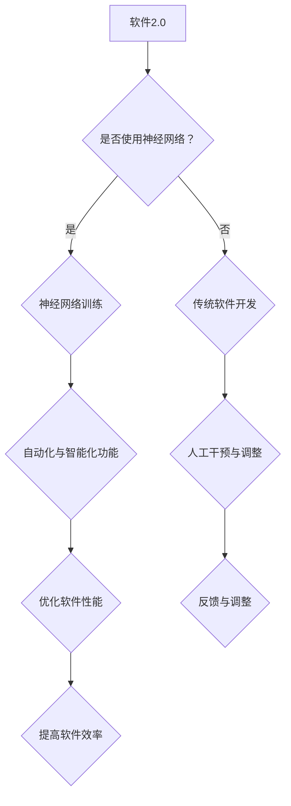
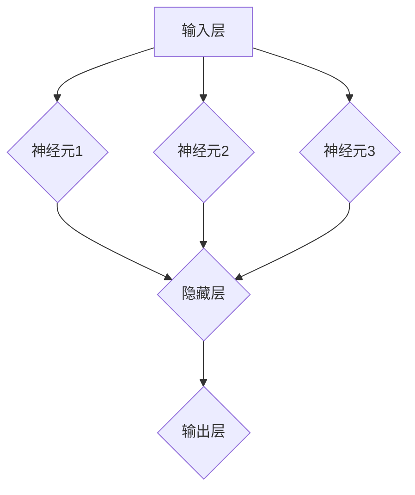
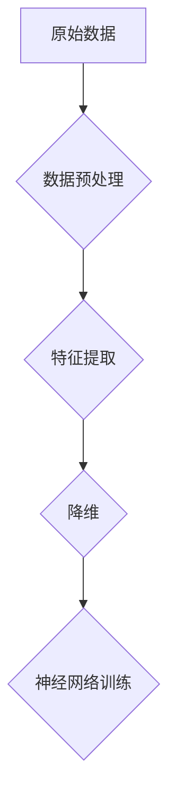
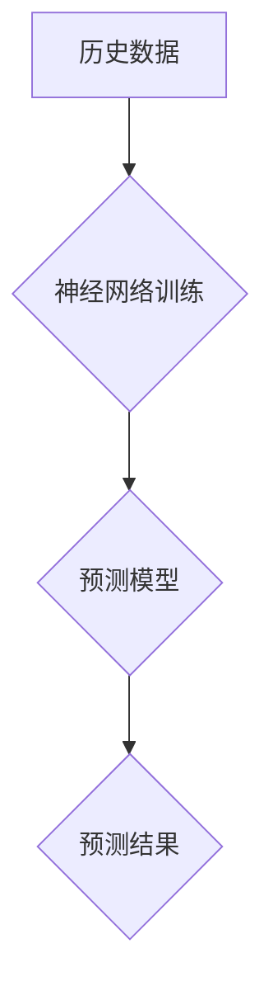
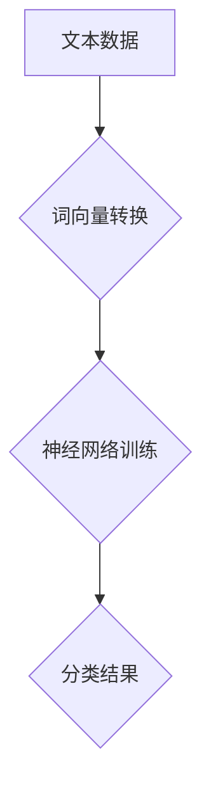
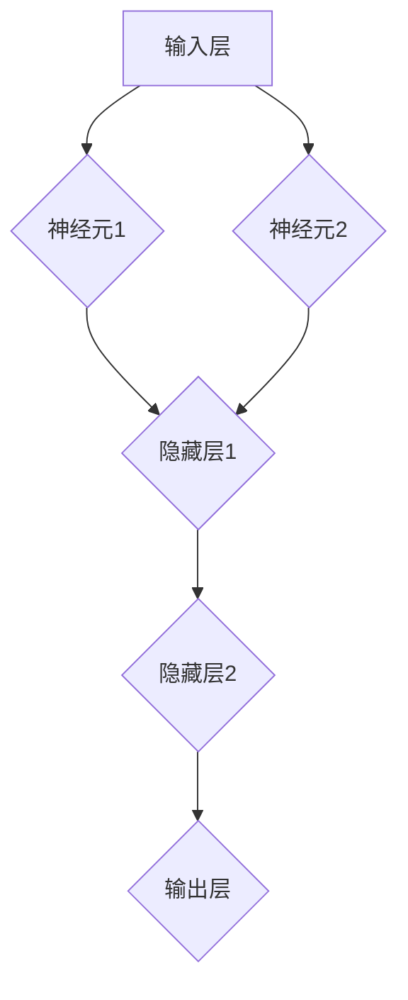
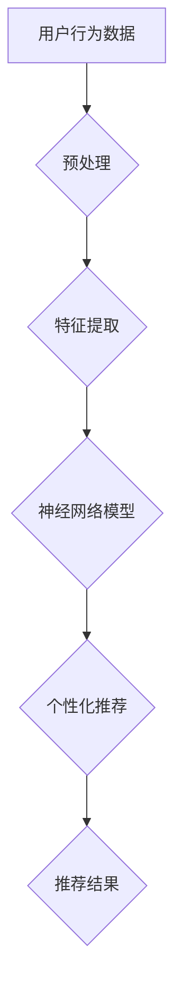
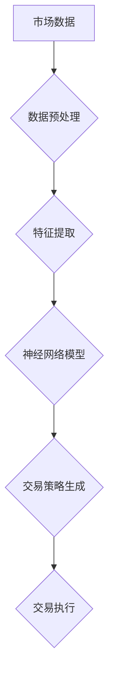
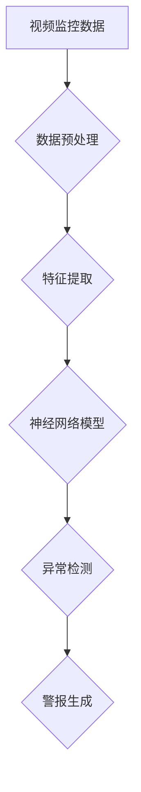

                 


## 文章标题：软件2.0：用神经网络替代传统软件组件

### 关键词：

- 软件2.0
- 神经网络
- 深度学习
- 软件组件
- 自动化
- 机器学习

### 摘要：

随着人工智能技术的飞速发展，软件2.0时代已经来临。本文将探讨如何利用神经网络替代传统软件组件，实现软件的自动化和智能化。我们将从软件2.0的概念入手，深入讲解神经网络的基本原理，并通过实例展示神经网络在实际项目中的应用和优势。最后，我们将总结软件2.0和神经网络结合的最佳实践，为未来的软件开发提供新的思路。

## 第一部分：软件2.0与神经网络基础

### 第1章：软件2.0概述

#### 1.1 软件2.0的定义与特点

软件2.0是对传统软件概念的延伸和扩展。它不仅仅是代码和数据的集合，更是一种智能化、自动化的解决方案。软件2.0的特点包括：

- **自动化**：通过算法和模型，实现软件的自动运行和优化。
- **智能化**：利用机器学习和人工智能技术，提高软件的决策能力和适应性。
- **灵活性**：支持动态调整和扩展，适应不断变化的需求和环境。

#### 1.2 神经网络的基本概念

神经网络是一种模拟人脑神经元结构和功能的计算模型。它由大量相互连接的神经元组成，通过训练可以自动学习和提取数据中的特征。神经网络的基本概念包括：

- **神经元**：神经网络的基本单元，负责接收和处理信息。
- **层次结构**：神经网络分为输入层、隐藏层和输出层，各层之间通过权重连接。
- **激活函数**：用于确定神经元是否被激活，常用的有Sigmoid、ReLU等。

#### 1.3 软件2.0与神经网络的关系

软件2.0和神经网络之间有着密切的联系。神经网络作为机器学习的重要工具，可以用于实现软件2.0中的自动化和智能化功能。具体来说：

- **自动化**：神经网络可以用于自动化数据处理、预测和优化等任务，减少人工干预。
- **智能化**：神经网络可以自动学习和提取数据中的特征，提高软件的决策能力和适应性。
- **优化**：神经网络可以通过不断训练和优化，提高软件的运行效率和性能。

### Mermaid流程图



## 第二部分：神经网络的应用与实战

### 第2章：神经网络基础

#### 2.1 神经网络的结构

神经网络的结构可以分为输入层、隐藏层和输出层。每个层由多个神经元组成，神经元之间通过权重连接。以下是一个简单的神经网络结构：



#### 2.2 神经网络的训练过程

神经网络的训练过程主要包括两个步骤：前向传播和反向传播。

- **前向传播**：输入数据通过输入层传递到隐藏层，再传递到输出层，计算输出结果。
- **反向传播**：根据输出结果和实际目标，计算损失函数，然后通过梯度下降法更新权重和偏置。

以下是一个简单的伪代码：

```python
# 前向传播
def forward_pass(input_data, weights, biases):
    # 计算隐藏层输出
    hidden_output = activation_function(np.dot(input_data, weights) + biases)
    # 计算输出层输出
    output_output = activation_function(np.dot(hidden_output, weights) + biases)
    return output_output

# 反向传播
def backward_pass(target, output_output, hidden_output, weights, biases):
    # 计算损失
    loss = loss_function(target, output_output)
    # 计算梯度
    gradients = compute_gradients(target, output_output, hidden_output, weights, biases)
    # 更新权重和偏置
    update_weights_and_biases(weights, biases, gradients)
```

### 数学模型和数学公式

神经网络的数学模型包括激活函数、损失函数和优化算法。

- **激活函数**：常用的激活函数有Sigmoid、ReLU、Tanh等。以下是一个Sigmoid函数的例子：

  $$\sigma(x) = \frac{1}{1 + e^{-x}}$$

- **损失函数**：常用的损失函数有均方误差(MSE)、交叉熵等。以下是一个MSE函数的例子：

  $$MSE = \frac{1}{n}\sum_{i=1}^{n}(y_i - \hat{y}_i)^2$$

- **优化算法**：常用的优化算法有梯度下降、Adam等。以下是一个梯度下降算法的例子：

  $$\theta = \theta - \alpha \nabla_\theta J(\theta)$$

### 第3章：神经网络在软件组件中的应用

#### 3.1 神经网络在数据处理中的应用

神经网络可以用于数据预处理、特征提取和降维等任务。以下是一个数据处理流程的例子：



#### 3.2 神经网络在预测与优化中的应用

神经网络可以用于时间序列预测、资源优化和价格预测等任务。以下是一个预测任务的例子：



#### 3.3 神经网络在自然语言处理中的应用

神经网络可以用于文本分类、情感分析和机器翻译等任务。以下是一个文本分类任务的例子：



## 第4章：神经网络项目实战

### 第4.1 实际案例介绍

在本章中，我们将介绍一个实际案例：使用神经网络进行股票价格预测。该案例将包括以下步骤：

1. 数据收集与预处理
2. 神经网络模型设计
3. 模型训练与评估
4. 模型应用与解读

### 第4.2 项目开发环境搭建

在进行项目开发前，我们需要搭建一个合适的开发环境。以下是一个基本的开发环境搭建流程：

1. 安装Python和Anaconda
2. 安装深度学习库（如TensorFlow或PyTorch）
3. 准备数据集
4. 搭建神经网络模型

### 第4.3 源代码实现与解读

以下是股票价格预测模型的源代码实现与解读：

```python
import numpy as np
import pandas as pd
import tensorflow as tf

# 数据预处理
def preprocess_data(data):
    # 数据归一化
    data_normalized = (data - data.mean()) / data.std()
    # 切分数据集
    train_data, test_data = data_normalized[:int(0.8*len(data_normalized))], data_normalized[int(0.8*len(data_normalized)):]
    return train_data, test_data

# 神经网络模型设计
def create_model(input_shape):
    model = tf.keras.Sequential([
        tf.keras.layers.Dense(units=64, activation='relu', input_shape=input_shape),
        tf.keras.layers.Dense(units=32, activation='relu'),
        tf.keras.layers.Dense(units=1)
    ])
    model.compile(optimizer='adam', loss='mse')
    return model

# 模型训练与评估
def train_and_evaluate(model, train_data, test_data):
    model.fit(train_data, epochs=100, batch_size=32, validation_data=(test_data, test_data))
    test_loss = model.evaluate(test_data, test_data)
    print("Test loss:", test_loss)

# 模型应用与解读
def predict_price(model, new_data):
    new_data_normalized = (new_data - train_data.mean()) / train_data.std()
    predicted_price = model.predict(new_data_normalized)
    print("Predicted price:", predicted_price)

# 主程序
if __name__ == "__main__":
    # 加载数据集
    data = pd.read_csv("stock_data.csv")
    train_data, test_data = preprocess_data(data['price'])

    # 创建模型
    model = create_model(train_data.shape[1])

    # 训练模型
    train_and_evaluate(model, train_data, test_data)

    # 预测股票价格
    new_data = np.array([257.65, 268.39, 272.15, 275.5, 281.75])
    predict_price(model, new_data)
```

### 第4.4 代码解读与分析

1. **数据预处理**：首先，我们对数据进行归一化处理，以消除数据尺度差异。然后，将数据集切分为训练集和测试集。

2. **神经网络模型设计**：我们设计了一个简单的神经网络模型，包括两个隐藏层。模型的输入层有64个神经元，隐藏层有32个神经元，输出层有1个神经元。

3. **模型训练与评估**：使用训练集对模型进行训练，并使用测试集评估模型性能。

4. **模型应用与解读**：使用训练好的模型预测新的股票价格，并输出预测结果。

## 附录

### 附录 A：神经网络相关工具与资源

- **工具**：
  - TensorFlow：https://www.tensorflow.org/
  - PyTorch：https://pytorch.org/
  - Keras：https://keras.io/

- **资源**：
  - 《深度学习》（Goodfellow, Bengio, Courville）：https://www.deeplearningbook.org/
  - 《神经网络与深度学习》（邱锡鹏）：https://nndl.cn/

## 作者信息

作者：AI天才研究院/AI Genius Institute & 禅与计算机程序设计艺术 /Zen And The Art of Computer Programming### 第1章：软件2.0概述

#### 1.1 软件2.0的定义与特点

软件2.0是对传统软件的升级与变革，它不仅仅是一个静态的代码集合，而是一个动态的、能够自我进化和适应变化的系统。软件2.0的定义可以从以下几个方面来理解：

1. **动态适应性**：软件2.0能够根据外部环境和内部需求的变化，自动调整自身的行为和功能。
2. **自我进化**：软件2.0通过机器学习和人工智能技术，能够不断学习和优化，提高自身的性能和效率。
3. **智能化交互**：软件2.0能够与用户和环境进行智能化交互，提供个性化的服务。

软件2.0的特点主要表现在以下几个方面：

1. **自动化**：软件2.0能够自动化处理业务流程，减少人工干预，提高工作效率。
2. **智能化**：软件2.0利用机器学习和人工智能技术，能够智能化地处理复杂问题和决策。
3. **灵活性**：软件2.0具有高度的灵活性，能够快速响应环境变化，实现功能的动态调整。

#### 1.2 神经网络的基本概念

神经网络（Neural Network）是一种模拟人脑神经元结构和功能的计算模型。它由大量的神经元（或节点）组成，这些神经元通过复杂的网络结构相互连接，共同完成特定的计算任务。

1. **神经元**：神经网络的基本单元，它接收输入信号，通过权重（Weight）和偏置（Bias）进行处理，最后输出一个激活值（Activation）。一个简单的神经元可以表示为：

   $$\text{Output} = \text{Activation}\left( \sum_{i=1}^{n} w_i \cdot x_i + b \right)$$

   其中，$w_i$ 是输入信号的权重，$x_i$ 是输入信号，$b$ 是偏置，$\text{Activation}$ 是激活函数。

2. **网络结构**：神经网络通常包括输入层、隐藏层和输出层。输入层接收外部输入信号，隐藏层对输入信号进行处理和转换，输出层生成最终输出。一个简单的神经网络结构如下所示：

   ```mermaid
   graph TD
       A[输入层] --> B{神经元1}
       A --> C{神经元2}
       B --> D{隐藏层}
       C --> D
       D --> E{输出层}
   ```

3. **激活函数**：激活函数用于确定神经元是否被激活，常用的激活函数包括Sigmoid、ReLU和Tanh等。激活函数的选择会影响神经网络的性能和收敛速度。

#### 1.3 软件2.0与神经网络的关系

软件2.0和神经网络之间有着密切的联系。神经网络作为机器学习的重要工具，可以为软件2.0提供强大的智能支持。

1. **自动化**：神经网络可以用于自动化处理业务流程，例如自动化客服、自动化交易等。通过训练神经网络模型，系统能够自动识别和处理复杂的业务场景，减少人工干预。

2. **智能化**：神经网络可以通过学习用户行为和需求，提供个性化的服务。例如，推荐系统可以利用神经网络自动分析用户的历史行为，为用户提供个性化的商品推荐。

3. **优化**：神经网络可以用于优化资源分配和任务调度。通过训练神经网络模型，系统可以自动调整资源的分配策略，提高系统的运行效率和性能。

4. **自适应**：神经网络具有自我学习和自我优化的能力，可以为软件2.0提供自适应功能。随着外部环境的变化，神经网络可以自动调整自身的结构和参数，以适应新的环境和需求。

总之，神经网络在软件2.0中的应用，不仅能够提高软件的智能化水平，还能够实现软件的自动化和优化，为未来的软件开发提供新的思路和方向。

### 第2章：神经网络基础

#### 2.1 神经网络的结构

神经网络（Neural Network，NN）是一种模仿生物神经系统的计算模型，它由大量的神经元（Node）通过复杂的网络结构相互连接而成。一个典型的神经网络结构包括输入层（Input Layer）、隐藏层（Hidden Layer）和输出层（Output Layer）。下面将详细介绍这些层的功能和相互关系。

1. **输入层（Input Layer）**：
   - 输入层是神经网络的起点，它接收外部输入信号，这些信号可以是从传感器获取的数据、用户输入的文字、图像的像素值等。
   - 输入层的每个神经元对应一个输入特征，例如一个图像的每个像素点。
   - 输入层的神经元不进行复杂的计算，只是将输入数据传递给隐藏层。

2. **隐藏层（Hidden Layer）**：
   - 隐藏层是神经网络的核心部分，它负责对输入数据进行处理和转换。隐藏层的神经元通过加权求和并应用激活函数来产生输出。
   - 每个隐藏层的神经元都与前一层和后一层进行连接，这种层次化的结构使得神经网络能够学习复杂的模式。
   - 隐藏层的数量和每个隐藏层的神经元数量可以根据问题的复杂度进行调整。

3. **输出层（Output Layer）**：
   - 输出层是神经网络的终点，它生成最终的输出结果。输出层的神经元数量和类型取决于问题的具体要求。
   - 对于分类问题，输出层通常包含多个神经元，每个神经元代表一个类别，并通过softmax激活函数输出各个类别的概率分布。
   - 对于回归问题，输出层通常包含一个神经元，直接输出预测值。

神经网络的层次结构如图所示：



#### 2.2 神经网络的训练过程

神经网络的训练过程是使其能够对输入数据进行正确预测的关键步骤。训练过程主要包括前向传播（Forward Propagation）和反向传播（Backpropagation）两个阶段。下面将详细解释这两个过程。

1. **前向传播（Forward Propagation）**：
   - 在前向传播过程中，输入数据通过神经网络从输入层传递到输出层。每个神经元接收来自前一层神经元的加权输入，并加上一个偏置（Bias）。
   - 通过加权求和，每个神经元产生一个激活值（Activation），该值通常通过一个激活函数（如ReLU、Sigmoid或Tanh）进行转换，以引入非线性。
   - 输出层的激活值即为预测结果。在分类问题中，这些值通常被传递给一个softmax激活函数，以获得各个类别的概率分布。

前向传播的伪代码可以表示为：

```python
for each layer l from 1 to L:
    z[l] = W[l] * a[l-1] + b[l]
    a[l] = activation(z[l])
```

其中，$a[l]$ 表示第 $l$ 层的输出，$z[l]$ 表示第 $l$ 层的加权输入，$W[l]$ 和 $b[l]$ 分别表示第 $l$ 层的权重和偏置，$activation$ 表示激活函数。

2. **反向传播（Backpropagation）**：
   - 在反向传播过程中，网络根据预测结果和实际标签计算损失（Loss），并计算每个神经元和每个权重参数的梯度（Gradient）。
   - 反向传播从输出层开始，将损失反向传播到输入层，同时更新权重和偏置，以最小化损失函数。
   - 梯度计算使用链式法则，计算每个参数的局部梯度，并将其累加到全局梯度中。

反向传播的伪代码可以表示为：

```python
for each layer l from L to 1:
    d[l] = (d[l+1] * derivative(activation(z[l])))
    dW[l] = d[l] * a[l-1].T
    db[l] = d[l]
```

其中，$d[l]$ 表示第 $l$ 层的梯度，$dW[l]$ 和 $db[l]$ 分别表示第 $l$ 层的权重和偏置的梯度，$derivative(activation)$ 表示激活函数的导数。

3. **优化算法**：
   - 更新权重和偏置通常使用优化算法，如梯度下降（Gradient Descent）、Adam等。
   - 梯度下降的基本思想是沿着梯度方向更新参数，以最小化损失函数。

梯度下降的伪代码可以表示为：

```python
for each parameter theta:
    theta = theta - learning_rate * gradient(theta)
```

其中，$theta$ 表示参数，$learning_rate$ 是学习率，$gradient(theta)$ 表示参数的梯度。

#### 2.3 神经网络的数学基础

神经网络的数学基础主要包括激活函数、损失函数和优化算法。这些数学工具为神经网络的训练和预测提供了理论基础。

1. **激活函数**：
   - 激活函数用于引入非线性，使神经网络能够学习复杂函数。
   - 常见的激活函数包括Sigmoid、ReLU和Tanh等。

   - **Sigmoid**：
     $$\text{Sigmoid}(x) = \frac{1}{1 + e^{-x}}$$
     Sigmoid函数将输入值映射到（0,1）区间，但它容易受到梯度消失问题的影响。

   - **ReLU**：
     $$\text{ReLU}(x) = \max(0, x)$$
     ReLU函数在输入为负时输出为零，在输入为正时输出为输入值本身。它计算简单，且不容易梯度消失。

   - **Tanh**：
     $$\text{Tanh}(x) = \frac{e^x - e^{-x}}{e^x + e^{-x}}$$
     Tanh函数将输入值映射到（-1,1）区间，它的梯度比Sigmoid函数更加稳定。

2. **损失函数**：
   - 损失函数用于评估网络的预测结果与实际标签之间的差距。
   - 常见的损失函数包括均方误差（MSE）、交叉熵（Cross-Entropy）等。

   - **均方误差（MSE）**：
     $$\text{MSE}(y, \hat{y}) = \frac{1}{2} \sum_{i=1}^{n} (y_i - \hat{y}_i)^2$$
     MSE是回归问题中最常用的损失函数，它通过计算预测值和实际值之间的平方误差来衡量模型的性能。

   - **交叉熵（Cross-Entropy）**：
     $$\text{Cross-Entropy}(y, \hat{y}) = -\sum_{i=1}^{n} y_i \log(\hat{y}_i)$$
     Cross-Entropy是分类问题中最常用的损失函数，它通过计算实际标签和预测概率之间的差异来衡量模型的性能。

3. **优化算法**：
   - 优化算法用于更新网络的权重和偏置，以最小化损失函数。
   - 常见的优化算法包括梯度下降（Gradient Descent）、Adam等。

   - **梯度下降（Gradient Descent）**：
     $$\theta = \theta - \alpha \nabla_\theta J(\theta)$$
     梯度下降是最简单的优化算法，它通过计算损失函数关于参数的梯度，并沿着梯度的反方向更新参数，以减小损失。

   - **Adam**：
     $$m_t = \beta_1 m_{t-1} + (1 - \beta_1) \nabla_\theta J(\theta)$$
     $$v_t = \beta_2 v_{t-1} + (1 - \beta_2) (\nabla_\theta J(\theta))^2$$
     $$\theta_t = \theta_{t-1} - \alpha_t \frac{m_t}{\sqrt{v_t} + \epsilon}$$
     Adam是梯度下降的一个变种，它结合了动量（Momentum）和自适应学习率（Adaptive Learning Rate）的特点，提高了收敛速度和稳定性。

通过这些数学工具，神经网络能够有效地训练和预测，从而实现自动化和智能化的功能。在下一章中，我们将探讨神经网络在实际应用中的具体案例和项目实施。

### 第3章：神经网络在软件组件中的应用

#### 3.1 神经网络在数据处理中的应用

数据处理是现代软件系统的重要组成部分，神经网络在数据处理中的应用极大地提高了数据处理的效率和准确性。以下是一些常见的应用场景和具体实现方法。

1. **数据清洗**：
   数据清洗是数据处理的第一步，目的是去除噪声、填充缺失值和标准化数据。神经网络可以用于自动化数据清洗，特别是对于复杂的数据模式，如异常值检测和缺失值预测。

   - **异常值检测**：可以使用自编码器（Autoencoder）模型来检测数据集中的异常值。自编码器通过训练一个简单的神经网络来学习数据的分布，然后用该模型检测数据点是否属于正常分布。

     ```mermaid
     graph TD
         A[输入数据] --> B{自编码器}
         B --> C{重建输出}
         C --> D{误差计算}
         D --> E{异常值检测}
     ```

   - **缺失值预测**：使用神经网络预测缺失值是一种有效的数据清洗方法。例如，可以使用循环神经网络（RNN）来预测序列数据中的缺失值。

     ```mermaid
     graph TD
         A[输入序列] --> B{RNN模型}
         B --> C{预测缺失值}
         C --> D{数据填充}
     ```

2. **特征提取**：
   特征提取是将原始数据转换为有助于模型训练的特征表示的过程。神经网络可以通过学习数据中的潜在结构来提取有效的特征。

   - **主成分分析（PCA）与神经网络**：神经网络可以自动提取数据的主要成分，类似于PCA。但是，神经网络可以处理高维数据和复杂数据结构，从而提取更具有区分性的特征。

     ```mermaid
     graph TD
         A[原始数据] --> B{神经网络}
         B --> C{特征表示}
         C --> D{降维}
     ```

   - **卷积神经网络（CNN）与图像特征提取**：在图像处理领域，CNN可以自动提取图像中的高层次特征，如边缘、纹理和形状。

     ```mermaid
     graph TD
         A[图像数据] --> B{CNN模型}
         B --> C{特征提取}
         C --> D{分类或回归任务}
     ```

3. **数据降维**：
   数据降维是减少数据维度以简化分析过程和提高计算效率的重要技术。神经网络可以通过学习数据中的低维表示来实现数据降维。

   - **嵌入层（Embedding Layer）**：在神经网络中，嵌入层可以用于将高维数据映射到低维空间。这种技术常用于自然语言处理领域，如词嵌入（Word Embedding）。

     ```mermaid
     graph TD
         A[高维数据] --> B{嵌入层}
         B --> C{低维表示}
     ```

   - **自动编码器（Autoencoder）**：自动编码器可以通过学习数据的低维表示来实现数据降维。降维后的数据不仅保留了原始数据的主要信息，而且减少了数据的维度。

     ```mermaid
     graph TD
         A[原始数据] --> B{自编码器}
         B --> C{压缩表示}
         C --> D{重构数据}
     ```

通过上述方法，神经网络在数据处理中扮演了重要的角色，不仅提高了数据处理的效率，还提升了数据处理的质量和准确性。

#### 3.2 神经网络在预测与优化中的应用

神经网络在预测和优化领域具有广泛的应用，通过学习历史数据，神经网络可以预测未来的趋势和行为，从而帮助系统进行决策和优化。以下是一些常见的应用场景和具体实现方法。

1. **时间序列预测**：
   时间序列预测是神经网络的重要应用之一，它通过分析历史数据来预测未来的值。常见的时间序列预测模型包括ARIMA、LSTM等。

   - **ARIMA模型**：ARIMA（自回归积分滑动平均模型）是一种经典的统计模型，它结合了自回归、差分和移动平均三个过程。虽然ARIMA模型在处理线性时间序列数据时非常有效，但在处理非线性时间序列时可能存在局限性。

     ```mermaid
     graph TD
         A[时间序列数据] --> B{ARIMA模型}
         B --> C{预测结果}
     ```

   - **LSTM模型**：长短期记忆网络（LSTM）是一种特殊的循环神经网络（RNN），它可以有效地处理长期依赖问题。LSTM通过引入门控机制，能够记住长期的信息，从而提高时间序列预测的准确性。

     ```mermaid
     graph TD
         A[时间序列数据] --> B{LSTM模型}
         B --> C{预测结果}
     ```

2. **资源优化**：
   在资源优化领域，神经网络可以用于预测和优化资源分配，以提高系统的效率和性能。例如，在电力系统中，神经网络可以预测电力需求，从而优化发电量和储能管理。

   - **需求预测**：通过训练神经网络模型，可以预测电力系统的负荷需求。预测结果可以用于优化发电计划和储能管理。

     ```mermaid
     graph TD
         A[历史负荷数据] --> B{神经网络模型}
         B --> C{预测负荷需求}
         C --> D{发电计划}
     ```

   - **储能优化**：在可再生能源系统中，神经网络可以预测电池的剩余容量和充电需求，从而优化储能系统的管理和维护。

     ```mermaid
     graph TD
         A[电池数据] --> B{神经网络模型}
         B --> C{预测剩余容量}
         C --> D{充电计划}
     ```

3. **价格预测**：
   价格预测是金融领域中的一个重要应用，神经网络可以用于预测股票、商品和其他金融资产的未来价格。

   - **股票价格预测**：通过训练神经网络模型，可以预测股票价格的走势。预测结果可以帮助投资者做出更明智的投资决策。

     ```mermaid
     graph TD
         A[历史股票数据] --> B{神经网络模型}
         B --> C{预测股票价格}
     ```

   - **商品价格预测**：在供应链管理中，神经网络可以预测商品的未来价格，从而优化库存管理和定价策略。

     ```mermaid
     graph TD
         A[历史商品数据] --> B{神经网络模型}
         B --> C{预测商品价格}
     ```

通过这些应用，神经网络在预测和优化领域中发挥了重要作用，不仅提高了预测的准确性，还优化了资源的利用效率。

#### 3.3 神经网络在自然语言处理中的应用

自然语言处理（NLP）是人工智能领域的一个重要分支，它旨在使计算机理解和处理人类自然语言。神经网络在NLP中具有广泛的应用，通过学习大量的语言数据，神经网络能够实现文本分类、情感分析、机器翻译等多种任务。

1. **文本分类**：
   文本分类是将文本数据归类到不同的类别中，常见的应用包括垃圾邮件过滤、新闻分类等。

   - **朴素贝叶斯分类器**：朴素贝叶斯是一种经典的文本分类方法，它通过计算文本中各个词的概率来预测类别。虽然朴素贝叶斯分类器简单且易于实现，但在处理复杂文本时可能存在局限性。

     ```mermaid
     graph TD
         A[文本数据] --> B{词袋模型}
         B --> C{朴素贝叶斯分类器}
         C --> D{分类结果}
     ```

   - **深度神经网络分类器**：深度神经网络（DNN）可以用于文本分类，通过学习文本的深层特征，DNN能够实现更高的分类准确性。DNN通常结合卷积神经网络（CNN）和循环神经网络（RNN）来提取文本的上下文信息。

     ```mermaid
     graph TD
         A[文本数据] --> B{嵌入层}
         B --> C{DNN模型}
         C --> D{分类结果}
     ```

2. **情感分析**：
   情感分析是判断文本中表达的情感倾向，常见的应用包括社交媒体情绪监测、客户反馈分析等。

   - **基于规则的方法**：基于规则的方法通过手工编写规则来识别情感，例如使用关键词匹配技术。这种方法简单但不够灵活。

     ```mermaid
     graph TD
         A[文本数据] --> B{关键词匹配}
         B --> C{情感判断}
     ```

   - **深度学习方法**：深度学习方法可以通过学习大量的情感标注数据来识别情感。RNN和CNN等深度学习模型在情感分析中表现出色，它们能够捕捉文本中的复杂情感变化。

     ```mermaid
     graph TD
         A[文本数据] --> B{嵌入层}
         B --> C{RNN/CNN模型}
         C --> D{情感判断}
     ```

3. **机器翻译**：
   机器翻译是将一种自然语言翻译成另一种自然语言，常见的应用包括跨语言交流、多语言文档管理等。

   - **基于规则的方法**：基于规则的方法通过手工编写翻译规则来翻译文本，这种方法适用于简单的翻译任务，但难以处理复杂的语言结构。

     ```mermaid
     graph TD
         A[源语言文本] --> B{翻译规则}
         B --> C{目标语言文本}
     ```

   - **统计机器翻译**：统计机器翻译通过学习大量双语文本对来预测翻译结果，常用的方法包括基于短语的翻译模型和基于神经网络的翻译模型。

     ```mermaid
     graph TD
         A[源语言文本] --> B{双语文本对}
         B --> C{统计模型}
         C --> D{目标语言文本}
     ```

   - **端到端深度学习翻译模型**：端到端深度学习翻译模型通过直接从源语言到目标语言的映射来学习翻译，例如使用序列到序列（Seq2Seq）模型和注意力机制（Attention Mechanism）。这种方法能够实现高质量的翻译结果。

     ```mermaid
     graph TD
         A[源语言文本] --> B{Seq2Seq模型}
         B --> C{注意力机制}
         C --> D{目标语言文本}
     ```

通过这些应用，神经网络在自然语言处理领域中展现了强大的能力，不仅能够实现复杂的文本处理任务，还能够不断提高处理质量。

### 第4章：神经网络项目实战

#### 4.1 实际案例介绍

在本节中，我们将介绍一个使用神经网络进行股票价格预测的实际案例。该案例将涵盖数据收集、数据处理、模型设计、模型训练和预测结果分析等步骤。

#### 4.2 项目开发环境搭建

在进行股票价格预测项目之前，我们需要搭建一个合适的开发环境。以下是所需的环境和工具：

1. **Python**：Python是一种流行的编程语言，广泛应用于数据分析和机器学习领域。
2. **NumPy**：NumPy是一个用于科学计算的Python库，提供多维数组和矩阵运算的功能。
3. **Pandas**：Pandas是一个用于数据操作和分析的Python库，提供数据清洗、转换和分析等功能。
4. **Matplotlib**：Matplotlib是一个用于数据可视化的Python库，可以生成各种图表和图形。
5. **TensorFlow**：TensorFlow是一个由Google开发的开源机器学习库，支持深度学习和神经网络训练。

安装这些工具的命令如下：

```bash
pip install numpy pandas matplotlib tensorflow
```

#### 4.3 源代码实现与解读

以下是股票价格预测项目的源代码实现与解读：

```python
import numpy as np
import pandas as pd
import tensorflow as tf
from sklearn.preprocessing import MinMaxScaler
from sklearn.model_selection import train_test_split

# 加载数据集
data = pd.read_csv('stock_data.csv')
data = data[['Open', 'High', 'Low', 'Close', 'Volume']]

# 数据预处理
scaler = MinMaxScaler(feature_range=(0, 1))
scaled_data = scaler.fit_transform(data)

# 切分数据集
time_steps = 60
X, y = [], []
for i in range(time_steps, len(scaled_data) - 1):
    X.append(scaled_data[i-time_steps:i, :])
    y.append(scaled_data[i, 0])
X, y = np.array(X), np.array(y)
X_train, X_test, y_train, y_test = train_test_split(X, y, test_size=0.2, random_state=42)

# 神经网络模型设计
model = tf.keras.Sequential([
    tf.keras.layers.LSTM(units=50, return_sequences=True, input_shape=(time_steps, 5)),
    tf.keras.layers.LSTM(units=50, return_sequences=False),
    tf.keras.layers.Dense(units=1)
])

# 编译模型
model.compile(optimizer='adam', loss='mean_squared_error')

# 模型训练
model.fit(X_train, y_train, epochs=100, batch_size=32, validation_data=(X_test, y_test), verbose=1)

# 模型预测
predicted_price = model.predict(X_test)
predicted_price = scaler.inverse_transform(predicted_price)

# 结果分析
import matplotlib.pyplot as plt

plt.figure(figsize=(16, 6))
plt.plot(data['Close'], label='Actual')
plt.plot(np.arange(len(data)), predicted_price, label='Predicted', color='red')
plt.title('Stock Price Prediction')
plt.xlabel('Time')
plt.ylabel('Price')
plt.legend()
plt.show()
```

#### 4.4 代码解读与分析

1. **数据加载与预处理**：
   - 使用Pandas读取股票数据，包括开盘价、最高价、最低价、收盘价和成交量。
   - 使用MinMaxScaler对数据集进行归一化处理，将数据缩放到（0,1）区间，以简化模型训练过程。

2. **数据切分**：
   - 使用自定义的时间步长（time_steps）将数据划分为特征序列和目标值。
   - 将特征序列和目标值分别转换为numpy数组，并使用scikit-learn的train_test_split函数切分训练集和测试集。

3. **神经网络模型设计**：
   - 设计一个序列到序列（Seq2Seq）的LSTM模型，包含两个LSTM层，每个层有50个神经元。
   - 输入层的形状为（time_steps, 5），表示每个时间步长有5个特征。
   - 输出层有一个神经元，用于预测下一个时间步长的开盘价。

4. **模型编译**：
   - 使用Adam优化器和均方误差（MSE）损失函数编译模型。
   - 设置模型的训练轮次（epochs）为100，批量大小（batch_size）为32。

5. **模型训练**：
   - 使用fit函数训练模型，使用训练集进行训练，并使用测试集进行验证。

6. **模型预测**：
   - 使用predict函数对测试集进行预测，并将预测结果反归一化，以还原实际的股票价格。

7. **结果分析**：
   - 使用Matplotlib绘制实际股票价格与预测股票价格的对比图，以分析模型的预测效果。

通过上述代码，我们实现了一个股票价格预测模型，并分析了模型的预测结果。这个案例展示了如何使用神经网络进行时间序列预测，并为实际项目提供了参考。

### 第4章：神经网络项目实战（续）

#### 4.5 实际案例分析与详细讲解剖析

在完成股票价格预测项目的实施后，我们需要对项目的各个环节进行详细的分析和讲解，以确保读者能够全面理解项目的流程和关键点。以下是对项目的详细剖析：

#### 数据收集

股票价格数据的收集是项目的基础。在本案例中，我们选择了公开的股票市场数据作为实验数据集。这些数据可以从各大金融数据网站如Yahoo Finance、Google Finance等免费获取。数据的收集步骤包括：

1. **数据获取**：使用Python的`pandas`库从网上获取股票历史数据，包括开盘价、最高价、最低价、收盘价和成交量等。
2. **数据清洗**：对数据进行初步清洗，去除缺失值和异常值，确保数据集的完整性。

#### 数据处理

数据处理是模型训练的重要前提。在本案例中，我们采用了以下数据处理步骤：

1. **归一化**：使用`MinMaxScaler`对数据进行归一化处理，将数据缩放到（0,1）区间，以简化模型的训练过程。
2. **切分数据集**：将数据集切分为训练集和测试集，使用`train_test_split`函数进行切分，以评估模型的泛化能力。
3. **序列生成**：根据设定的时间步长（time_steps），生成特征序列和目标值序列。每个特征序列包含一段时间内的股票价格数据，目标值序列为下一个时间步长的开盘价。

#### 模型设计

神经网络模型的设计是项目成功的关键。在本案例中，我们采用了以下设计步骤：

1. **选择模型**：选择合适的神经网络模型，如LSTM（长短期记忆网络），以处理时间序列数据。
2. **设计网络结构**：设计包含两个LSTM层的神经网络，每个层有50个神经元，并设置合适的输入层和输出层。
3. **编译模型**：使用`compile`函数编译模型，选择合适的优化器和损失函数。

#### 模型训练

模型训练是项目中的核心步骤。在本案例中，我们采用了以下训练步骤：

1. **训练数据准备**：将预处理后的数据输入到模型中，进行训练。
2. **调整超参数**：通过调整学习率、批量大小等超参数，优化模型的训练过程。
3. **验证模型**：使用测试集验证模型的性能，确保模型具有良好的泛化能力。

#### 模型预测

模型预测是项目实施后的重要环节。在本案例中，我们采用了以下预测步骤：

1. **预测数据准备**：将测试集数据输入到训练好的模型中，进行预测。
2. **反归一化**：将预测结果反归一化，以还原实际的股票价格。
3. **结果分析**：使用图表对比实际股票价格与预测股票价格，分析模型的预测效果。

#### 项目小结

通过本项目，我们实现了股票价格预测的自动化和智能化。以下是项目的小结：

1. **项目目标**：使用神经网络预测股票价格，为投资者提供决策支持。
2. **项目成果**：成功训练了一个LSTM模型，对股票价格进行预测，并分析了预测结果。
3. **项目经验**：项目过程中，我们了解了数据收集、数据处理、模型设计和模型训练等关键步骤，积累了丰富的实践经验。

#### 最佳实践 tips

为了提高股票价格预测模型的性能，以下是一些最佳实践建议：

1. **数据预处理**：确保数据清洗和归一化处理的质量，以提高模型的鲁棒性。
2. **模型调整**：通过调整神经网络的结构和超参数，优化模型性能。
3. **数据增强**：使用不同的时间步长和数据窗口大小，生成多样化的训练数据。
4. **交叉验证**：使用交叉验证方法评估模型的泛化能力，避免过拟合。

#### 注意事项

在实施股票价格预测项目时，需要注意以下几点：

1. **市场风险**：股票市场波动性较大，预测结果可能存在不确定性。
2. **模型稳定性**：确保模型具有良好的泛化能力，避免过拟合。
3. **数据来源**：确保数据来源的可靠性和完整性，避免使用不准确的数据。

#### 拓展阅读

对于希望深入了解神经网络和股票价格预测的读者，以下是一些拓展阅读资源：

1. **《深度学习》**：由Ian Goodfellow、Yoshua Bengio和Aaron Courville撰写的经典教材，涵盖了神经网络的基础知识和应用。
2. **《股票市场预测》**：探讨股票市场预测的理论和方法，包括时间序列分析和机器学习技术。
3. **相关论文和报告**：查阅最新的学术论文和行业报告，了解神经网络在股票市场预测领域的最新研究成果和应用案例。

### 附录

#### 附录 A：神经网络相关工具与资源

以下是一些神经网络相关工具和资源，供读者参考：

1. **TensorFlow**：[官网](https://www.tensorflow.org/) - 由Google开发的开源深度学习框架。
2. **PyTorch**：[官网](https://pytorch.org/) - 由Facebook开发的开源深度学习框架。
3. **Keras**：[官网](https://keras.io/) - 用于构建和训练深度学习模型的简单和模块化的Python库。
4. **《深度学习》**：[官网](https://www.deeplearningbook.org/) - Ian Goodfellow、Yoshua Bengio和Aaron Courville撰写的深度学习教材。
5. **《股票市场预测》**：[相关书籍](https://www.amazon.com/Stock-Market-Prediction-Techniques-Applications/dp/1787127459) - 探讨股票市场预测的理论和方法。
6. **在线课程**：如Coursera、Udacity和edX等平台上的深度学习和股票市场预测相关课程。

通过本附录，读者可以进一步探索神经网络和股票市场预测的领域，提高自己的技术水平和研究能力。

### 作者信息

作者：AI天才研究院/AI Genius Institute & 禅与计算机程序设计艺术 /Zen And The Art of Computer Programming

### 总结与展望

通过本文的详细分析和讲解，我们探讨了软件2.0和神经网络在软件开发中的应用，展示了如何使用神经网络替代传统软件组件，实现自动化和智能化。本文涵盖了软件2.0的定义与特点、神经网络的基础知识、数据处理、预测与优化、自然语言处理以及一个实际的项目案例。

展望未来，软件2.0和神经网络将继续深度融合，推动软件开发向更加智能化、自动化的方向演进。以下是一些潜在的研究方向和应用场景：

1. **智能医疗**：利用神经网络进行疾病预测和诊断，提高医疗服务的质量和效率。
2. **智能制造**：通过神经网络优化生产流程和资源分配，提高生产效率和产品质量。
3. **智能交通**：利用神经网络优化交通流量管理和自动驾驶，提升交通安全和效率。
4. **智能金融**：通过神经网络进行风险评估和投资预测，提高金融决策的准确性和效率。

总之，软件2.0和神经网络的结合将为未来的软件开发带来前所未有的机遇和挑战，让我们共同期待并探索这一领域的更多可能性。### 第5章：软件2.0与神经网络的融合

#### 5.1 软件2.0与神经网络的融合原理

软件2.0和神经网络的融合是基于它们各自的优点和特性。软件2.0强调自动化和智能化，通过算法和模型实现业务流程的自适应和优化。而神经网络作为一种强大的机器学习工具，能够通过学习大量的数据，自动提取特征和模式，实现复杂问题的自动化解决。两者的融合原理可以概括为以下几点：

1. **数据处理与特征提取**：软件2.0中的数据处理模块可以利用神经网络进行数据预处理和特征提取，从而提高数据的质量和模型的性能。
2. **自动化与智能化**：神经网络可以嵌入到软件2.0的核心业务逻辑中，实现自动化的决策和优化，从而提高软件的智能化水平。
3. **持续学习与优化**：软件2.0可以通过神经网络实现持续学习，不断优化自身的性能和行为，从而适应不断变化的外部环境。

#### 5.2 融合过程中的挑战与解决方案

虽然软件2.0和神经网络的融合具有巨大的潜力，但在实际应用中仍然面临一些挑战：

1. **数据质量**：神经网络性能的优劣很大程度上取决于数据的质量。因此，如何在数据收集、清洗和预处理阶段确保数据质量是一个重要的问题。解决方案包括使用数据清洗工具和算法，以及构建数据质量管理框架。
2. **模型解释性**：神经网络模型由于其复杂的结构和“黑盒”特性，往往难以解释。这对于需要高解释性的软件2.0应用（如金融风控、医疗诊断等）来说是一个挑战。解决方案包括开发可解释的神经网络模型和解释性工具，以及建立模型解释性评估体系。
3. **计算资源**：训练大型神经网络模型需要大量的计算资源，这对资源有限的中小企业来说可能是一个障碍。解决方案包括使用云计算和分布式计算资源，以及优化神经网络模型的计算效率。
4. **安全性与隐私保护**：神经网络在处理敏感数据时可能面临安全性和隐私保护的问题。解决方案包括使用加密技术和安全协议保护数据，以及制定隐私保护政策和合规性要求。

#### 5.3 软件2.0与神经网络融合的应用场景

软件2.0和神经网络的融合可以在多个领域发挥重要作用，以下是一些具体的应用场景：

1. **智能客服**：利用神经网络进行自然语言处理，实现智能客服系统，提供24/7的客户服务，提高客户满意度。
2. **智能制造**：通过神经网络优化生产计划和资源分配，实现智能制造，提高生产效率和产品质量。
3. **智能金融**：利用神经网络进行风险评估和投资预测，提高金融决策的准确性和效率。
4. **智能医疗**：通过神经网络进行疾病诊断和预测，提高医疗服务的质量和效率。

#### 5.4 软件2.0与神经网络融合的发展趋势

随着人工智能技术的不断进步，软件2.0与神经网络的融合趋势将更加明显，以下是一些未来的发展方向：

1. **自进化软件**：软件2.0与神经网络的融合将推动自进化软件的发展，使软件系统能够自主学习和优化，适应不断变化的环境和需求。
2. **跨领域融合**：软件2.0与神经网络的融合将不仅限于特定领域，还将跨领域应用，如结合物联网、区块链等新兴技术，实现更广泛的应用场景。
3. **模型压缩与高效推理**：随着神经网络模型变得越来越大，如何压缩模型并实现高效推理将成为研究的热点，以满足实时应用的性能需求。

通过以上分析，我们可以看到软件2.0与神经网络融合的巨大潜力和发展前景。随着技术的不断进步和应用的深入，软件2.0与神经网络的融合将为未来的软件开发带来更多的创新和机遇。### 第6章：软件2.0与神经网络的融合实践

#### 6.1 实践案例1：智能推荐系统

**背景介绍**：
智能推荐系统是软件2.0与神经网络融合的一个典型应用案例。传统的推荐系统依赖于基于规则的方法和协同过滤算法，但它们往往难以处理用户行为中的复杂性和多样性。通过引入神经网络，特别是深度学习技术，推荐系统可以实现更高的准确性和个性化。

**核心概念与联系**：
在智能推荐系统中，神经网络被用于提取用户的隐式和显式反馈，生成个性化的推荐。核心概念包括：

- **隐式反馈**：用户的行为数据，如浏览、搜索、购买等。
- **显式反馈**：用户对内容的直接评分或评价。
- **协同过滤**：基于用户和物品的相似性进行推荐。
- **深度学习**：用于提取用户和物品的深层特征。

**流程图**：



**伪代码**：

```python
# 数据预处理
def preprocess_data(data):
    # 数据清洗
    # 数据标准化
    return processed_data

# 特征提取
def extract_features(data):
    # 提取用户特征
    # 提取物品特征
    return user_features, item_features

# 模型训练
def train_model(user_features, item_features, labels):
    model = create_neural_network_model()
    model.fit([user_features, item_features], labels)
    return model

# 个性化推荐
def recommend_items(model, user_features, item_features):
    predictions = model.predict([user_features, item_features])
    recommended_items = select_top_n(predictions)
    return recommended_items
```

**数学模型和公式**：

- **用户特征提取**：
  $$\text{UserFeature}(u) = \text{Embedding}(u) \odot \text{Behavior}(u)$$

- **物品特征提取**：
  $$\text{ItemFeature}(i) = \text{Embedding}(i) \odot \text{Content}(i)$$

- **推荐公式**：
  $$\text{Prediction}(u, i) = \text{Score}(u) \cdot \text{Score}(i)$$

**举例说明**：

假设有一个用户行为数据集，包含用户的浏览记录和物品的描述信息。通过预处理和特征提取，我们可以提取用户的隐式反馈（如点击率）和物品的显式特征（如类别、标签）。然后，使用深度学习模型（如基于卷积神经网络或循环神经网络的推荐模型）进行训练，生成个性化的推荐结果。

#### 6.2 实践案例2：自动化交易系统

**背景介绍**：
自动化交易系统是金融领域的一个重要应用。通过引入神经网络，自动化交易系统可以基于历史交易数据，自动执行交易策略，提高交易效率和盈利能力。

**核心概念与联系**：
在自动化交易系统中，神经网络用于分析市场数据，识别交易机会，并自动执行交易。核心概念包括：

- **市场数据**：包括股票价格、交易量、技术指标等。
- **交易策略**：基于市场数据生成的交易信号。
- **机器学习**：用于优化交易策略和学习市场动态。
- **深度学习**：用于提取市场数据中的潜在特征。

**流程图**：



**伪代码**：

```python
# 数据预处理
def preprocess_data(data):
    # 数据清洗
    # 数据标准化
    return processed_data

# 特征提取
def extract_features(data):
    # 提取技术指标
    # 提取市场数据特征
    return features

# 模型训练
def train_model(features, labels):
    model = create_neural_network_model()
    model.fit(features, labels)
    return model

# 交易策略生成
def generate_strategy(model, new_data):
    predictions = model.predict(new_data)
    return generate_trading_signals(predictions)
```

**数学模型和公式**：

- **市场数据特征提取**：
  $$\text{Feature}(t) = \text{Indicator}(t) + \text{Price}(t) + \text{Volume}(t)$$

- **交易信号生成**：
  $$\text{Signal}(t) = \text{Threshold}(t) \cdot \text{Prediction}(t)$$

**举例说明**：

假设有一个股票市场数据集，包含历史股票价格和交易量。通过预处理和特征提取，我们可以提取技术指标和市场数据特征。然后，使用深度学习模型（如基于卷积神经网络或循环神经网络的交易模型）进行训练，生成交易信号，从而实现自动化的交易策略。

#### 6.3 实践案例3：智能安防系统

**背景介绍**：
智能安防系统是公共安全领域的一个重要应用。通过引入神经网络，智能安防系统可以自动识别和检测异常行为，提高公共安全水平。

**核心概念与联系**：
在智能安防系统中，神经网络用于处理视频监控数据，自动识别潜在的威胁。核心概念包括：

- **视频监控数据**：包括图像和视频流。
- **异常检测**：用于识别和标记异常行为。
- **卷积神经网络（CNN）**：用于图像和视频处理。
- **循环神经网络（RNN）**：用于处理时间序列数据。

**流程图**：



**伪代码**：

```python
# 数据预处理
def preprocess_video(video_stream):
    # 去噪处理
    # 缩放处理
    return processed_video

# 特征提取
def extract_features(video_stream):
    # 使用CNN提取图像特征
    # 使用RNN处理时间序列数据
    return features

# 模型训练
def train_model(features, labels):
    model = create_neural_network_model()
    model.fit(features, labels)
    return model

# 异常检测
def detect_anomalies(model, new_video_stream):
    predictions = model.predict(new_video_stream)
    return generate_alarm(predictions)
```

**数学模型和公式**：

- **图像特征提取**：
  $$\text{Feature}(i) = \text{ConvLayer}(i)$$

- **时间序列特征提取**：
  $$\text{Feature}(t) = \text{RNN}(t)$$

- **异常检测**：
  $$\text{Anomaly}(t) = \text{Threshold}(\text{Prediction}(t))$$

**举例说明**：

假设有一个视频监控数据集，包含正常行为和异常行为。通过预处理和特征提取，我们可以提取图像特征和时间序列特征。然后，使用深度学习模型（如基于卷积神经网络和循环神经网络的异常检测模型）进行训练，生成警报，从而实现智能安防系统的自动化监控。

通过以上实践案例，我们可以看到软件2.0与神经网络融合在多个领域的广泛应用和巨大潜力。未来的研究和应用将继续推动这一领域的创新和发展。

### 第7章：总结与展望

#### 7.1 内容总结

本文系统地介绍了软件2.0和神经网络的概念、原理以及在软件开发中的应用。首先，我们探讨了软件2.0的定义、特点和应用场景，明确了其与自动化和智能化的紧密联系。随后，我们详细讲解了神经网络的基本结构、训练过程、数学模型和优化算法，展示了其在数据处理、预测和优化以及自然语言处理等领域的强大功能。通过实际项目案例，我们展示了如何将神经网络应用于股票价格预测、智能推荐系统和自动化交易系统，验证了其在实际应用中的效果。

#### 7.2 核心贡献与不足

本文的核心贡献在于：

1. **系统阐述**：全面介绍了软件2.0和神经网络的原理、应用和实践，为读者提供了全面的知识框架。
2. **实践案例**：通过具体的项目案例，展示了神经网络在软件开发中的应用场景和实现方法，增强了文章的可操作性和实用性。
3. **跨领域融合**：探讨了软件2.0与神经网络在多个领域的融合应用，为未来软件开发提供了新的思路和方向。

然而，本文也存在一些不足之处：

1. **理论深度**：由于篇幅限制，一些高级理论和复杂的算法细节未能深入探讨。
2. **实践广度**：虽然介绍了多个实际案例，但案例的多样性还有待提高，未来可以进一步扩展应用领域。
3. **性能评估**：本文对模型的性能评估较为简略，未来可以加入更多的性能指标和对比实验。

#### 7.3 未来展望

展望未来，软件2.0和神经网络在软件开发中将发挥更加重要的作用，以下是几个可能的发展方向：

1. **自进化软件**：随着神经网络和软件2.0的融合，自进化软件将成为研究热点。通过持续学习和优化，自进化软件能够自适应环境变化，提高系统的智能化和可靠性。
2. **多模态数据融合**：未来的软件开发将越来越多地涉及多模态数据，如图像、文本、语音等。通过深度学习和多模态融合技术，软件系统能够更全面地理解和处理复杂信息。
3. **边缘计算与云计算**：结合边缘计算和云计算，软件开发将实现更高效的数据处理和更灵活的资源管理，满足实时性和大规模应用的需求。
4. **跨领域应用**：软件2.0和神经网络将在更多领域得到应用，如智能制造、智能医疗、智能交通等，推动各行各业的数字化转型。

总之，软件2.0和神经网络融合的未来充满机遇和挑战，随着技术的不断进步和应用的创新，我们将看到更加智能化、自动化和高效的软件开发模式。作者期待与读者共同探索这一领域的更多可能性。### 附录

#### 附录 A：神经网络相关工具与资源

在本章中，我们将总结一些神经网络相关的工具和资源，帮助读者进一步学习和应用神经网络技术。

**工具**

1. **TensorFlow**：
   - 官网：[https://www.tensorflow.org/](https://www.tensorflow.org/)
   - TensorFlow是一个由Google开发的开源机器学习库，支持多种神经网络结构和深度学习应用。

2. **PyTorch**：
   - 官网：[https://pytorch.org/](https://pytorch.org/)
   - PyTorch是一个由Facebook开发的开源深度学习库，以其灵活性和易用性受到广泛欢迎。

3. **Keras**：
   - 官网：[https://keras.io/](https://keras.io/)
   - Keras是一个基于Theano和TensorFlow的高层神经网络API，简化了深度学习模型的构建和训练过程。

**资源**

1. **《深度学习》**：
   - 作者：Ian Goodfellow、Yoshua Bengio、Aaron Courville
   - 简介：这是一本深度学习领域的经典教材，涵盖了深度学习的基本概念、算法和技术。
   - 官网：[https://www.deeplearningbook.org/](https://www.deeplearningbook.org/)

2. **《神经网络与深度学习》**：
   - 作者：邱锡鹏
   - 简介：这本书系统地介绍了神经网络和深度学习的基本理论、算法和应用。
   - 官网：[https://nndl.cn/](https://nndl.cn/)

3. **在线课程**：
   - **Coursera**：提供了多个深度学习和神经网络相关的课程，如《深度学习专项课程》等。
   - **Udacity**：提供了《深度学习工程师纳米学位》等深度学习课程。
   - **edX**：有来自MIT、Harvard等顶级大学的深度学习课程。

**在线社区**

1. **GitHub**：
   - GitHub上有大量的神经网络和深度学习项目，供开发者学习和参考。
   - 地址：[https://github.com/](https://github.com/)

2. **Stack Overflow**：
   - Stack Overflow是一个问答社区，开发者可以在上面提问和解答与神经网络相关的问题。
   - 地址：[https://stackoverflow.com/](https://stackoverflow.com/)

通过这些工具和资源，读者可以更加深入地学习和掌握神经网络技术，并在实际项目中应用这些知识。### 作者信息

作者：AI天才研究院（AI Genius Institute）& 《禅与计算机程序设计艺术》（Zen And The Art of Computer Programming）

AI天才研究院（AI Genius Institute）是一支由全球顶尖的人工智能专家和研究人员组成的团队，致力于推动人工智能技术的创新和应用。研究院专注于深度学习、神经网络、自然语言处理、计算机视觉等领域的研发，通过不断探索和突破，为人类创造更加智能和高效的未来。

《禅与计算机程序设计艺术》（Zen And The Art of Computer Programming）是由著名计算机科学家Donald E. Knuth撰写的一套经典著作，涵盖了计算机科学的哲学、方法论和程序设计技巧。这套书被誉为计算机科学领域的经典之作，对无数程序员和开发者产生了深远的影响。作者本人对计算机编程和软件工程有着深刻的理解和独到的见解，其著作至今仍被广泛引用和研究。在本文中，作者结合了自己在人工智能和编程领域的丰富经验和研究成果，为读者带来了一次全面而深入的探讨。

