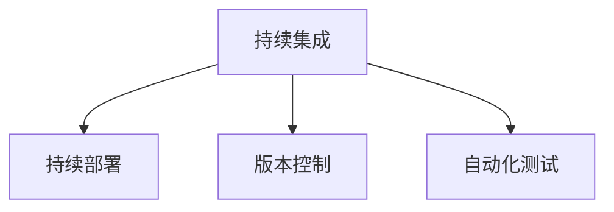
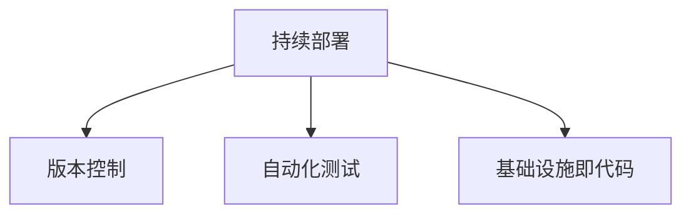
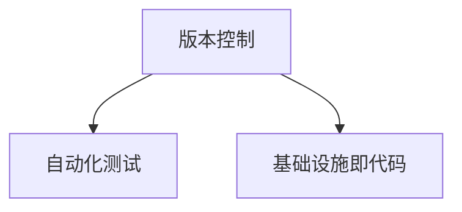
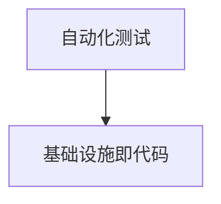
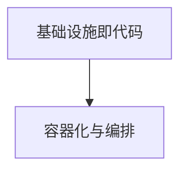
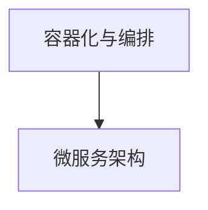
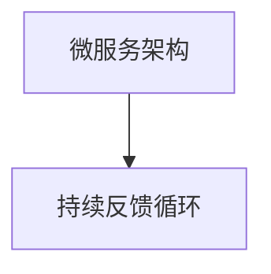
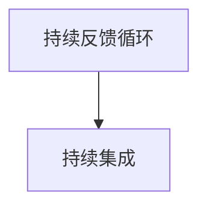
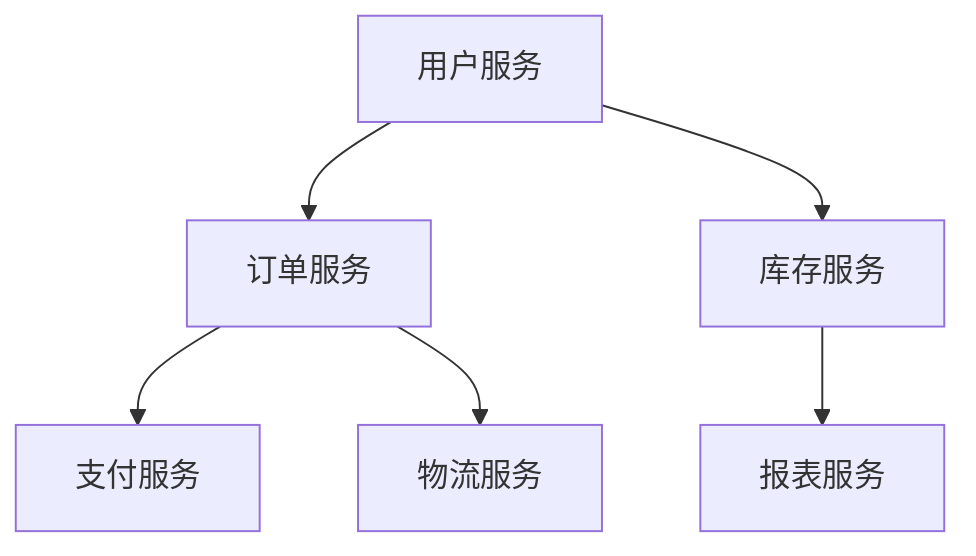

                 

### 引言

软件发布管理是一个至关重要的环节，它不仅决定了软件产品的质量和用户体验，也直接影响到企业的运营效率和市场竞争力。在现代软件开发中，软件发布管理不再是一个简单的操作过程，而是一个复杂、多阶段、多环节的流程，涉及到从开发到生产环境的一系列步骤和工具。

本文旨在系统地探讨软件发布管理的全过程，从开发阶段到生产环境，深入分析各个环节的优化策略和最佳实践。我们将一步步剖析软件发布管理的核心概念、流程优化技术，以及如何在实际项目中应用这些技术。

文章的核心关键词包括：软件发布管理、持续集成（CI）、持续部署（CD）、版本控制、自动化测试、基础设施即代码（IaC）、容器化与编排、微服务架构和持续反馈循环。这些关键词构成了本文讨论的核心主题，每个部分都将详细探讨其原理、实践和优化策略。

通过本文的阅读，读者将能够：

1. 理解软件发布管理的基本概念和重要性。
2. 掌握持续集成（CI）和持续部署（CD）的基本原理和实践。
3. 深入了解版本控制和自动化测试的核心概念及其在软件发布管理中的应用。
4. 理解基础设施即代码（IaC）的概念和其在软件发布管理中的作用。
5. 学习容器化和编排技术，以及如何使用微服务架构简化发布管理。
6. 掌握如何建立持续反馈循环，以持续优化软件发布流程。

本文的结构如下：

1. 引言：介绍文章的核心主题和关键词。
2. 核心概念与联系：讨论软件发布管理中的关键概念，并展示其相互关系。
3. 流程优化技术：详细分析持续集成（CI）、持续部署（CD）、版本控制、自动化测试、基础设施即代码（IaC）、容器化与编排、微服务架构和持续反馈循环等技术的原理和应用。
4. 项目实战：通过具体案例展示如何在实际项目中应用这些技术。
5. 总结与展望：总结全文内容，并对未来的发展趋势进行展望。

### 核心概念与联系

在探讨软件发布管理的全过程之前，首先需要明确几个核心概念，并理解它们之间的相互关系。这些核心概念包括持续集成（CI）、持续部署（CD）、版本控制、自动化测试、基础设施即代码（IaC）、容器化与编排、微服务架构和持续反馈循环。下面，我们将逐一介绍这些概念，并通过Mermaid流程图展示它们之间的关联。

#### 持续集成（CI）

持续集成是一种软件开发实践，通过自动化的构建和测试，确保代码库中的每一个提交都是可集成和可运行的。持续集成的核心目的是减少集成风险，加快开发速度，并提高代码质量。

**概念关系**：持续集成通常作为整个软件发布流程的起点，其输出通常是构建和测试的结果，这些结果将直接影响后续的持续部署和版本控制。

**Mermaid流程图**：



#### 持续部署（CD）

持续部署是持续集成的延伸，它将自动化的构建和测试过程扩展到部署阶段，将软件自动部署到生产环境中。持续部署的目标是减少部署风险，提高发布速度和稳定性。

**概念关系**：持续部署依赖于持续集成构建的稳定性和测试的通过性，其输出是软件在生产环境中的实际部署结果。

**Mermaid流程图**：



#### 版本控制

版本控制是一种跟踪和管理软件代码更改的方法。通过版本控制工具，开发团队能够有效地管理代码库的历史记录，协作开发，以及回滚代码更改。

**概念关系**：版本控制是软件发布管理中不可或缺的一部分，它确保了代码的版本一致性和可追溯性，是持续集成和持续部署的基础。

**Mermaid流程图**：



#### 自动化测试

自动化测试是通过自动化工具执行的一系列测试，用于验证软件的功能、性能和安全性。自动化测试可以提高测试效率和覆盖范围，减少测试成本。

**概念关系**：自动化测试是持续集成和持续部署的重要组成部分，其结果是持续集成和持续部署决策的依据。

**Mermaid流程图**：



#### 基础设施即代码（IaC）

基础设施即代码是一种将基础设施（如服务器、网络、存储等）的配置和管理作为代码进行管理的方法。通过IaC，开发团队可以自动化部署和管理基础设施，确保环境的一致性和可重复性。

**概念关系**：IaC是持续部署和自动化测试的基础，它使得基础设施的配置和部署能够与代码版本同步，从而确保环境的一致性。

**Mermaid流程图**：



#### 容器化与编排

容器化是一种轻量级虚拟化技术，通过容器将应用程序及其依赖项封装在一起，确保应用程序在不同的环境中运行的一致性。容器编排是管理容器化应用程序的过程，通常涉及自动化部署、扩展和生命周期管理。

**概念关系**：容器化和编排技术是持续集成和持续部署的关键组成部分，它们使得应用程序的部署和管理更加高效和灵活。

**Mermaid流程图**：



#### 微服务架构

微服务架构是一种软件开发方法，将应用程序拆分为多个独立的、松耦合的服务，每个服务负责应用程序的一个特定功能。微服务架构提高了应用程序的可扩展性、可维护性和灵活性。

**概念关系**：微服务架构与容器化与编排技术紧密相关，通过容器化技术，微服务可以在不同的环境中独立部署和运行，而编排技术则负责管理这些服务的生命周期。

**Mermaid流程图**：



#### 持续反馈循环

持续反馈循环是一种不断收集、分析和响应用户反馈的过程，旨在持续改进软件产品的质量和用户体验。通过持续反馈循环，开发团队可以快速响应市场变化，优化软件发布流程。

**概念关系**：持续反馈循环是软件发布管理的终极目标，它使得整个发布过程成为一个闭环，不断优化和改进。

**Mermaid流程图**：



通过上述Mermaid流程图，我们可以清晰地看到这些核心概念之间的相互关系。它们共同构成了一个完整的软件发布管理流程，每个环节都是紧密相连，相互促进的。

### 持续集成（CI）

持续集成（CI）是一种软件开发实践，旨在通过自动化的构建和测试，确保代码库中的每个提交都是可集成和可运行的。CI的核心目的是减少集成风险，加快开发速度，并提高代码质量。下面，我们将详细讨论持续集成的原理、工具选择以及如何实施CI。

#### 持续集成的原理

持续集成的基本原理可以概括为以下几个步骤：

1. **提交代码**：开发者将代码提交到代码仓库。
2. **触发构建**：当代码提交到仓库时，CI工具会自动触发构建过程。
3. **构建过程**：构建过程包括编译代码、安装依赖项、运行测试等。
4. **测试**：构建完成后，CI工具会运行一系列预定义的测试，以验证代码的稳定性。
5. **反馈**：测试结果将被反馈给开发团队，成功或失败的报告将发送给相关人员。

#### 工具选择

在实施持续集成时，选择合适的工具至关重要。以下是一些常用的CI工具：

1. **Jenkins**：Jenkins是一个开源的CI工具，具有丰富的插件生态系统，支持多种编程语言和测试框架。
2. **Travis CI**：Travis CI是一个基于云的CI服务，支持GitHub项目，具有很好的社区支持。
3. **CircleCI**：CircleCI是一个付费的CI服务，提供高性能和灵活的构建环境。
4. **GitLab CI**：GitLab CI是GitLab内置的CI/CD服务，适用于GitLab仓库中的项目。

#### 如何实施CI

实施CI的步骤如下：

1. **定义CI流程**：首先，需要定义CI流程，包括构建、测试和部署的步骤。通常，这些流程可以通过配置文件（如Jenkinsfile或.travis.yml）来定义。
2. **安装CI工具**：根据所选的CI工具，安装并配置CI服务器。例如，对于Jenkins，可以从其官方网站下载安装包，然后通过其Web界面进行配置。
3. **配置仓库**：在代码仓库中添加CI配置文件，以触发构建过程。例如，在GitLab中，可以在项目设置中添加`.gitlab-ci.yml`文件。
4. **编写构建脚本**：编写构建脚本，用于执行编译、安装依赖项、运行测试等操作。例如，对于Python项目，可以使用Makefile或setup.py脚本。
5. **运行第一次构建**：提交代码并运行第一次构建，验证CI流程的正确性。确保构建过程成功完成，并且测试通过。
6. **监控和反馈**：持续监控CI流程的运行状态，并确保及时处理失败的情况。通过邮件、Slack或其他即时通讯工具发送构建结果反馈。

#### 伪代码示例

以下是一个简单的持续集成流程的伪代码示例：

```pseudo
function continuousIntegration(projects):
    for project in projects:
        buildProject(project)
        if buildFailed(project):
            notifyTeam(project)
        else:
            runTests(project)
            if testsFailed(project):
                notifyTeam(project)
            else:
                deployProject(project)
```

#### CI在软件开发中的作用

持续集成在软件开发中发挥着至关重要的作用：

1. **提高代码质量**：通过自动化的构建和测试，CI能够及时发现和修复代码缺陷，减少集成风险。
2. **加快开发速度**：CI自动化了繁琐的构建和测试工作，使开发团队能够更快速地迭代和交付软件。
3. **促进团队合作**：CI提供了一个共享的构建和测试环境，促进了团队成员之间的协作和沟通。
4. **确保环境一致性**：CI确保了每次构建和测试都在一致的环境中执行，减少了环境差异导致的问题。

#### CI的最佳实践

1. **自动化测试**：确保所有提交的代码都通过自动化测试，减少手动测试的工作量。
2. **快速反馈**：及时反馈构建和测试结果，以便开发团队能够迅速响应和解决问题。
3. **定期审查**：定期审查CI流程和测试用例，确保其仍然有效和适用。
4. **多人协作**：鼓励团队成员参与CI配置和测试用例的编写，促进知识共享和技能提升。

通过上述内容，我们可以看到持续集成在软件发布管理中的重要性。实施CI不仅能够提高开发效率和质量，还能为后续的持续部署和自动化测试打下坚实的基础。

### 持续部署（CD）

持续部署（Continuous Deployment，简称CD）是持续集成（CI）的自然延伸，它将自动化的构建和测试过程扩展到部署阶段，使得软件能够自动部署到生产环境中。持续部署的目标是减少部署风险，提高发布速度和稳定性。下面，我们将详细探讨持续部署的原理、工具选择、实施步骤和CD在软件开发中的作用。

#### 持续部署的原理

持续部署的基本原理可以概括为以下几个步骤：

1. **提交代码**：开发者在代码仓库中提交新的代码。
2. **触发构建**：提交代码后，CI工具会触发构建过程，构建出可部署的软件包。
3. **测试**：构建完成后，CI工具会运行一系列预定义的测试，以确保软件包的质量。
4. **部署**：通过自动化脚本或部署工具，将测试通过的软件包部署到生产环境。
5. **监控**：部署完成后，系统会持续监控软件的运行状态，确保其稳定性和性能。

#### 工具选择

在实施持续部署时，选择合适的工具非常重要。以下是一些常用的CD工具：

1. **Jenkins**：Jenkins不仅支持CI，也支持CD。它可以通过插件扩展其功能，实现自动化部署。
2. **GitLab CI/CD**：GitLab CI/CD是GitLab内置的CI/CD服务，可以与GitLab仓库紧密集成，实现自动化的部署流程。
3. **CircleCI**：CircleCI是一个高性能的CD服务，支持多种编程语言和平台，提供灵活的部署流程。
4. **Docker Swarm**：Docker Swarm是Docker的集群管理工具，可以自动化部署和管理容器化应用程序。
5. **Kubernetes**：Kubernetes是用于容器化应用程序的自动化部署、扩展和管理工具，支持复杂的部署策略和操作。

#### 实施持续部署

实施持续部署的步骤如下：

1. **定义部署流程**：首先，需要定义部署流程，包括构建、测试和部署的步骤。这些流程通常可以通过配置文件（如Jenkinsfile或Kubernetes配置文件）来定义。
2. **配置部署工具**：根据所选的CD工具，配置部署环境和工具。例如，对于Jenkins，需要安装和配置所需的插件和脚本。
3. **编写部署脚本**：编写部署脚本，用于执行部署操作，如上传软件包、配置环境变量、启动服务等。
4. **运行第一次部署**：提交代码并运行第一次部署，验证部署流程的正确性。确保部署过程成功完成，并且软件在目标环境中正常运行。
5. **监控和反馈**：持续监控部署后的软件运行状态，确保其稳定性和性能。通过监控工具发送告警和通知，以便及时处理潜在问题。

#### 伪代码示例

以下是一个简单的持续部署流程的伪代码示例：

```pseudo
function continuousDeployment(code, environment):
    buildPackage(code)
    if packageFailed():
        notifyTeam()
    else:
        runTests(package)
        if testsFailed():
            notifyTeam()
        else:
            deployPackage(environment)
            if deployFailed():
                notifyTeam()
            else:
                monitorPackage()
```

#### 持续部署在软件开发中的作用

持续部署在软件开发中具有以下几个重要作用：

1. **减少部署风险**：通过自动化部署，可以显著减少人为错误和部署失败的风险。
2. **提高发布速度**：自动化部署使得软件能够快速、安全地发布，缩短了从开发到生产的周期。
3. **确保环境一致性**：自动化部署确保了每次部署都在一致的环境中执行，减少了环境差异导致的问题。
4. **持续反馈**：部署后的监控和反馈机制使得开发团队能够及时了解软件的运行状态，快速响应和优化。

#### CD的最佳实践

1. **自动化测试**：确保所有部署的代码都通过自动化测试，减少手动测试的工作量。
2. **快速反馈**：及时反馈部署结果，以便开发团队能够迅速响应和解决问题。
3. **逐步部署**：采用灰度发布或逐步部署策略，减少新版本对用户的影响。
4. **监控和告警**：持续监控部署后的软件运行状态，并通过告警系统及时通知潜在问题。

通过上述内容，我们可以看到持续部署在软件发布管理中的重要性。实施CD不仅能够提高开发效率和质量，还能为持续集成和自动化测试提供完整的支持，从而构建一个高效、可靠的软件发布流程。

### 版本控制

版本控制是一种管理软件源代码更改的机制，它使得开发团队能够有效地追踪、管理代码库的历史记录，实现协作开发，并在必要时回滚到之前的版本。版本控制的核心目标是确保代码库的一致性和可追溯性。以下是关于版本控制的核心概念、常用工具及其优化的具体方法和最佳实践。

#### 核心概念

1. **分支管理**：版本控制系统中，分支用于实现代码的并行开发。常见的分支策略包括主干（Master）分支、开发（Develop）分支和功能分支。
   - **主干分支**：用于存放最新的、可发布的代码版本。
   - **开发分支**：用于合并多个功能分支，进行整合和测试。
   - **功能分支**：用于开发特定的功能或修复特定的bug。

2. **合并**：合并是将不同分支的更改合并到同一分支的过程。合理的合并策略可以避免代码冲突和版本混乱。

3. **标签**：标签用于标记特定的代码版本，例如发布版本或里程碑版本。通过标签，可以快速定位和回滚到特定的代码版本。

4. **回滚**：回滚是指撤销最近的一次或一系列提交，恢复到之前的版本状态。回滚是处理bug或错误的重要手段。

#### 常用工具

1. **Git**：Git是目前最流行的版本控制工具，具有快速、灵活、分布式等特点。Git的基本操作包括克隆仓库、创建分支、合并分支、提交更改等。

2. **SVN**：Subversion是一种集中式版本控制系统，主要用于管理大型代码库。SVN的优点是简单易用，但缺乏分布式特性。

3. **Mercurial**：Mercurial是一个分布式版本控制系统，与Git类似，但语法和操作更接近SVN。Mercurial适用于那些希望从SVN迁移到分布式版本控制的团队。

#### 版本控制优化方法

1. **自动化代码审查**：通过自动化工具（如Gerrit或GitLab）对提交的代码进行审查，确保代码质量。自动化审查可以减少人工审查的工作量，提高审查效率。

2. **合理分支策略**：根据项目特点和团队规模，选择合适的分支策略。例如，对于大型项目，可以采用多分支策略，以减少分支合并的复杂度。

3. **集成代码质量工具**：使用代码质量工具（如SonarQube）检测代码中的潜在问题，如漏洞、性能瓶颈和代码风格问题。这些工具可以与版本控制系统集成，确保代码库的一致性和高质量。

4. **定期合并和清理**：定期合并开发分支和功能分支，清理不必要的分支，以减少代码库的复杂度和冗余。

5. **使用标签和版本**：为重要的代码变更和发布版本使用标签，便于快速定位和回滚。同时，为每个版本编写详细的变更日志，记录代码库的演变过程。

#### 最佳实践

1. **代码提交规范**：制定统一的代码提交规范，如提交消息格式、代码格式和文档要求。这有助于提高代码的可读性和可维护性。

2. **代码审查流程**：建立有效的代码审查流程，确保所有提交的代码都经过严格审查。代码审查应该包括代码逻辑、性能和安全性等方面。

3. **持续集成与版本控制**：将版本控制系统与CI工具集成，确保每次提交的代码都通过自动化测试。这样可以及时发现和修复代码问题，减少集成风险。

4. **备份和灾难恢复**：定期备份代码库，并建立灾难恢复计划。这可以确保在意外情况下，能够快速恢复到正常的工作状态。

通过上述方法，我们可以有效地优化版本控制流程，确保代码库的一致性、可追溯性和高质量。合理的版本控制不仅能够提高开发效率，还能为后续的持续集成和持续部署提供坚实的基础。

### 自动化测试

自动化测试是软件发布管理中不可或缺的一环，通过自动化工具执行一系列预定义的测试，以验证软件的功能、性能和安全性。自动化测试不仅提高了测试效率和覆盖范围，还显著降低了测试成本。以下是关于自动化测试的核心概念、工具选择、实践方法和最佳实践的详细探讨。

#### 核心概念

1. **单元测试**：单元测试是最基本的测试类型，用于验证单个模块或函数的行为。单元测试通常由开发人员编写，使用专门的测试框架（如JUnit、pytest）。

2. **集成测试**：集成测试用于验证多个模块或服务之间的交互和协作。集成测试通常在单元测试之后进行，以确保各个模块能够正确地协同工作。

3. **端到端测试**：端到端测试（E2E测试）模拟用户实际操作，验证软件系统的完整性和用户体验。E2E测试通常使用自动化测试框架（如Selenium、Cypress）。

4. **性能测试**：性能测试用于评估软件系统的响应时间、吞吐量和资源利用率。性能测试可以识别系统的瓶颈，帮助优化系统性能。

#### 工具选择

1. **JUnit**：JUnit是最常用的Java单元测试框架，支持各种测试类型，如测试类、测试方法和测试套件。

2. **pytest**：pytest是Python的流行单元测试框架，具有简洁的语法和强大的功能，适用于各种Python项目。

3. **Selenium**：Selenium是一个开源的Web自动化测试工具，支持多种浏览器和操作系统，用于编写端到端测试脚本。

4. **Cypress**：Cypress是一个全面的端到端测试框架，提供直观的API和实时反馈，适合现代Web应用程序。

5. **Apache JMeter**：JMeter是一个开源的性能测试工具，用于模拟大量用户并发访问，评估系统的负载能力和性能。

#### 实践方法

1. **测试用例设计**：首先，需要设计详细的测试用例，覆盖软件的所有功能点和性能要求。测试用例应包括输入数据、预期结果和实际结果。

2. **编写测试脚本**：根据测试用例，编写自动化测试脚本。脚本应包括测试的各个步骤，如用户登录、数据输入和结果验证。

3. **执行测试**：使用自动化测试工具执行测试脚本，生成测试报告。测试报告应包括测试结果、错误日志和性能指标。

4. **结果分析**：分析测试结果，识别测试失败的原因。对于失败的测试用例，应进行调试和修复，然后重新执行测试。

5. **持续集成**：将自动化测试集成到持续集成（CI）流程中，确保每次代码提交都通过自动化测试。这样可以及时发现和修复代码问题，减少集成风险。

#### 最佳实践

1. **自动化测试策略**：制定合理的自动化测试策略，根据项目的规模和需求，确定测试的优先级和覆盖范围。

2. **持续测试**：定期执行自动化测试，确保软件的持续稳定性和性能。可以通过CI工具实现自动化测试的持续运行。

3. **代码审查**：编写自动化测试脚本时，应进行代码审查，确保测试脚本的质量和可维护性。

4. **测试报告**：生成详细的测试报告，包括测试覆盖率、错误统计和性能分析。测试报告应易于理解和分析。

5. **测试环境**：确保自动化测试在真实的或模拟的生产环境中执行，以验证软件的真实表现。

通过上述方法和实践，我们可以建立高效的自动化测试流程，确保软件发布过程中的质量和稳定性。自动化测试不仅能够提高测试效率，还能为持续集成和持续部署提供强有力的支持。

### 基础设施即代码（IaC）

基础设施即代码（Infrastructure as Code，简称IaC）是一种将基础设施的配置和管理作为代码进行管理的方法。通过IaC，开发团队能够自动化部署和管理基础设施，确保环境的一致性和可重复性。以下是关于基础设施即代码的核心概念、主要工具及其优化的具体方法和最佳实践的详细探讨。

#### 核心概念

1. **基础设施即代码**：基础设施即代码是一种将基础设施（如服务器、网络、存储等）的配置和管理作为代码进行管理的方法。通过编写和版本控制基础设施配置文件，开发团队能够自动化基础设施的部署和管理。

2. **模板**：模板是一种预定义的基础设施配置模板，可以用于快速创建和部署基础设施。常见的模板工具包括Terraform和Ansible Playbooks。

3. **版本控制**：版本控制是基础设施即代码的核心机制，通过版本控制工具（如Git）管理基础设施配置文件的历史记录和变更。

4. **自动化部署**：自动化部署是将基础设施配置文件应用到实际基础设施的过程。通过自动化部署，可以确保环境的一致性和可重复性。

#### 主要工具

1. **Terraform**：Terraform是HashiCorp公司开发的一款开源基础设施即代码工具，用于创建、组合和管理基础设施资源。Terraform使用HCL（HashiCorp Configuration Language）作为配置语言，支持多种云平台和供应商资源。

2. **Ansible**：Ansible是另一种常用的基础设施即代码工具，它通过SSH或WinRM协议自动化应用程序的部署和管理。Ansible使用YAML作为配置语言，具有简洁的语法和强大的模块库。

3. **Puppet**：Puppet是一个成熟的基础设施即代码平台，用于自动化基础设施的配置和管理。Puppet使用自己的模块化语言，支持大规模基础设施的部署和管理。

4. **Chef**：Chef是另一个基础设施即代码工具，用于自动化应用程序的部署和管理。Chef使用Ruby作为配置语言，具有灵活的模块和角色管理功能。

#### 优化方法

1. **模块化配置**：将基础设施配置分解为独立的模块，每个模块负责特定部分的配置。模块化配置可以提高配置的可维护性和复用性。

2. **自动化版本控制**：通过版本控制工具（如Git）自动化管理基础设施配置文件的历史记录和变更。这可以确保配置文件的版本一致性和可追溯性。

3. **持续集成**：将基础设施配置文件集成到持续集成（CI）流程中，确保每次代码提交都自动构建和部署基础设施。这可以确保环境的一致性和自动化。

4. **基础设施测试**：编写自动化测试用例，验证基础设施配置的正确性和功能。基础设施测试可以识别配置错误和潜在问题，确保基础设施的稳定性。

5. **优化配置**：通过监控和性能测试，识别基础设施的瓶颈和优化点。优化配置可以提高基础设施的效率和性能。

#### 最佳实践

1. **定义基础设施规范**：制定统一的基础设施配置规范，包括硬件规格、软件版本和网络配置。这可以确保环境的一致性和标准化。

2. **版本控制配置文件**：将基础设施配置文件纳入版本控制系统，确保所有变更都有记录和可追溯性。这可以减少配置错误和冲突。

3. **自动化部署和回滚**：通过自动化部署工具，实现基础设施的快速部署和回滚。自动化部署可以提高部署速度和减少人为错误。

4. **监控和告警**：持续监控基础设施的运行状态，并设置告警机制。这可以及时发现和解决基础设施问题。

5. **文档和培训**：编写详细的基础设施配置文档，并定期培训团队成员。这可以提高团队对基础设施配置的理解和操作能力。

通过基础设施即代码，开发团队能够实现基础设施的自动化部署和管理，提高环境的一致性和可重复性。合理的配置和优化方法，以及严格的最佳实践，可以确保基础设施的稳定性和性能。

### 容器化与编排

容器化是一种轻量级虚拟化技术，通过将应用程序及其依赖项封装在一个独立的容器中，确保应用程序在不同环境中运行的一致性。容器化不仅提高了应用程序的可移植性和可扩展性，还简化了部署和管理流程。而容器编排则是管理容器化应用程序的过程，涉及容器的自动化部署、扩展和生命周期管理。本文将详细介绍容器化的核心概念、主流工具及其在软件开发中的实际应用。

#### 容器化的核心概念

1. **容器**：容器是一种轻量级的运行时环境，通过操作系统级的虚拟化技术（如cgroup和namespace）实现应用程序的隔离。容器共享宿主机的操作系统内核，因此具有极低的资源消耗和高效的性能。

2. **Docker**：Docker是最流行的容器化工具，通过Dockerfile和Docker Compose等机制，将应用程序及其依赖项打包成一个可移植的容器镜像。Dockerfile定义了容器的构建过程，而Docker Compose用于管理多个容器实例。

3. **容器镜像**：容器镜像是一个静态的、只读的文件系统，包含了应用程序运行所需的所有文件。容器运行时从容器镜像中启动，并加载应用程序。

4. **容器编排**：容器编排是管理容器化应用程序的过程，涉及容器的部署、扩展、监控和更新。Kubernetes是最流行的容器编排工具，提供高可用性、负载均衡和服务发现等功能。

#### 主流容器编排工具

1. **Kubernetes**：Kubernetes是开源的容器编排平台，由Google设计并捐赠给Cloud Native Computing Foundation。Kubernetes提供自动化部署、扩展和管理容器化应用程序的能力，具有强大的集群管理和资源调度功能。

2. **Docker Swarm**：Docker Swarm是Docker内置的容器编排工具，提供了简单的集群管理功能。Docker Swarm可以将多个Docker实例组合成一个集群，并在集群中自动化部署和管理容器。

3. **Apache Mesos**：Apache Mesos是一个分布式资源调度平台，可以与容器化技术（如Docker和Marathon）集成，用于大规模容器化应用程序的部署和管理。

4. **Openshift**：OpenShift是Red Hat提供的容器平台，基于Kubernetes，提供了丰富的集成功能，如自动化部署、持续集成和持续部署。

#### 容器化在软件开发中的应用

1. **简化部署流程**：通过容器化，开发团队能够将应用程序及其依赖项打包成一个容器镜像，简化部署流程。容器镜像确保了应用程序在不同环境（如开发、测试和生产）中运行的一致性，减少了环境差异导致的问题。

2. **提高可移植性**：容器化的应用程序可以在任何支持Docker的平台上运行，包括虚拟机、云服务器和本地环境。这种高可移植性使得应用程序的部署更加灵活和可扩展。

3. **自动化部署和管理**：容器编排工具（如Kubernetes）提供了自动化部署、扩展和监控功能，使得开发团队能够高效地管理容器化应用程序。自动化部署可以显著缩短发布周期，提高软件交付速度。

4. **微服务架构**：容器化与微服务架构紧密结合，通过将应用程序拆分为多个独立的服务，每个服务运行在自己的容器中。这种方式提高了系统的可扩展性和容错性，使得应用程序能够更好地应对负载变化。

#### 容器化最佳实践

1. **容器镜像优化**：优化容器镜像的构建过程，包括减少镜像层数、使用多阶段构建和缓存策略。这可以显著减小镜像的大小，提高部署速度。

2. **多容器协作**：利用容器网络和卷（Volume）共享机制，实现多个容器之间的数据共享和协作。例如，使用容器卷实现数据库和应用程序之间的数据同步。

3. **Kubernetes资源管理**：合理分配Kubernetes资源（如CPU、内存和存储），确保应用程序的性能和稳定性。使用资源限制和优先级策略，优化集群资源的利用效率。

4. **持续集成与容器化**：将容器化集成到持续集成（CI）和持续部署（CD）流程中，确保每次代码提交都经过自动化测试和容器化部署。这可以确保软件的质量和一致性。

通过容器化和容器编排，开发团队能够实现高效、灵活和可扩展的软件开发。容器化不仅简化了部署流程，提高了可移植性，还为微服务架构提供了强有力的支持。合理的优化和实践方法，可以确保容器化环境的高效运营和稳定运行。

### 微服务架构

微服务架构是一种软件开发方法，将应用程序拆分为多个独立的、松耦合的服务，每个服务负责应用程序的一个特定功能。微服务架构具有高可扩展性、高可靠性和高灵活性，能够更好地应对复杂的应用场景和不断变化的需求。本文将详细介绍微服务架构的核心概念、架构设计和实际应用。

#### 核心概念

1. **微服务**：微服务是小型、独立的、自治的服务，每个服务都有自己的数据库、应用程序逻辑和API。微服务之间通过轻量级的通信协议（如HTTP/REST或gRPC）进行交互。

2. **服务拆分**：微服务架构将大型单体应用程序拆分为多个小型服务，每个服务独立开发、部署和扩展。服务拆分有助于提高系统的可维护性、可测试性和可扩展性。

3. **自治**：微服务具有高度的自治性，每个服务都有自己的代码库、数据库和部署环境。服务之间的独立运行和故障隔离，提高了系统的可靠性和容错能力。

4. **容器化**：微服务通常运行在容器中，如Docker容器，以确保其独立性和可移植性。容器化使得微服务可以灵活地部署和管理，支持快速迭代和扩展。

#### 架构图

下面是一个典型的微服务架构图，展示了各个微服务及其相互关系：



- **用户服务**：处理用户身份验证、注册和登录等功能。
- **订单服务**：处理订单创建、更新和取消等操作。
- **库存服务**：管理商品库存信息，包括库存的查询和更新。
- **支付服务**：处理支付请求，包括支付方式的验证和支付金额的计算。
- **物流服务**：管理物流信息，包括发货和配送状态更新。
- **报表服务**：生成和展示各种业务报表。

#### 实际应用

1. **电子商务平台**：电子商务平台通常采用微服务架构，将用户管理、商品管理、订单处理、支付和物流等模块拆分为独立的微服务。这种方式提高了系统的灵活性和可扩展性，使得平台能够快速响应市场需求和业务变化。

2. **银行系统**：银行系统中的各个功能模块（如账户管理、贷款审批、交易处理等）可以采用微服务架构。这种方式有助于提高系统的可靠性和安全性，确保各个模块之间能够独立运行和快速扩展。

3. **物联网平台**：物联网平台通常需要处理大量的设备和传感器数据，可以采用微服务架构将数据采集、处理、分析和可视化等模块拆分为独立的微服务。这种方式有助于提高系统的可扩展性和灵活性，使得平台能够快速适应新的设备和数据处理需求。

#### 微服务架构的优势

1. **高可扩展性**：微服务架构可以根据业务需求独立扩展和部署单个服务，而不需要重新部署整个系统。这种弹性扩展能力使得系统能够更好地应对高并发和大数据量的场景。

2. **高可靠性**：微服务架构中的每个服务都可以独立运行和故障隔离，一旦某个服务出现故障，不会影响其他服务的正常运行。这种容错能力提高了系统的稳定性和可靠性。

3. **高灵活性**：微服务架构允许开发团队根据业务需求独立开发和部署各个服务，提高了开发效率和灵活性。开发团队能够选择最适合每个服务的编程语言、框架和工具。

4. **高可维护性**：微服务架构使得系统的每个部分都可以独立维护和更新，减少了系统整体的维护成本。这种独立性使得代码更加模块化，易于管理和调试。

#### 微服务架构的挑战

1. **分布式系统复杂性**：微服务架构中的服务数量众多，导致系统整体复杂性增加。服务之间的通信和协调需要有效管理，否则可能导致系统性能和可维护性下降。

2. **数据一致性和完整性**：微服务架构中的各个服务通常拥有自己的数据库，数据一致性和完整性成为挑战。需要设计良好的数据同步和事务管理机制，确保数据的准确性和一致性。

3. **服务治理和监控**：随着服务数量的增加，服务治理和监控变得更加复杂。需要有效的服务监控、日志收集和告警机制，确保系统运行的健康状态。

通过微服务架构，开发团队能够实现更灵活、可扩展和可靠的软件系统。虽然微服务架构面临一定的挑战，但合理的设计和优化方法可以克服这些困难，充分发挥其优势。

### 持续反馈循环

持续反馈循环是一种不断收集、分析和响应用户反馈的过程，旨在持续改进软件产品的质量和用户体验。在软件发布管理中，持续反馈循环起到了至关重要的作用，它使得整个发布过程成为一个闭环，不断优化和改进。本文将探讨持续反馈循环的核心概念、实践方法以及如何利用用户反馈进行软件改进。

#### 核心概念

1. **用户反馈**：用户反馈是持续反馈循环的起点，包括用户在使用软件过程中提出的建议、意见和问题。用户反馈可以是结构化的（如问卷调查）或非结构化的（如用户评论和反馈）。

2. **数据分析**：数据分析是持续反馈循环的关键环节，通过对用户反馈进行定量和定性分析，识别出用户的主要需求和问题。数据分析可以帮助团队理解用户行为和偏好，指导产品改进。

3. **响应和迭代**：响应和迭代是持续反馈循环的核心，团队需要快速响应用户反馈，进行产品改进和迭代。快速迭代可以缩短产品改进周期，提高用户满意度。

#### 实践方法

1. **用户调研**：通过问卷调查、用户访谈和用户测试等方式，收集用户的反馈和意见。用户调研可以帮助团队深入了解用户的需求和痛点。

2. **数据分析工具**：使用数据分析工具（如Google Analytics、Mixpanel和Tableau）对用户反馈进行定量和定性分析。数据分析工具可以帮助团队识别用户行为模式，发现潜在问题。

3. **快速迭代**：建立快速迭代机制，对用户反馈进行快速响应和改进。开发团队可以采用敏捷开发方法，快速实现用户反馈中的改进建议。

4. **用户反馈收集渠道**：建立多样化的用户反馈收集渠道，如在线反馈表、社交媒体、客户服务热线等。多样化的反馈渠道可以确保用户反馈的全面性和及时性。

5. **反馈闭环**：确保用户反馈的闭环管理，将用户的反馈转化为具体的改进措施，并在产品中实施。这可以提高用户的参与感和满意度。

#### 利用用户反馈进行软件改进

1. **功能改进**：根据用户反馈，优化和改进软件功能。例如，如果用户反馈某个功能不够直观，团队可以重新设计用户界面，提高用户体验。

2. **性能优化**：通过用户反馈，识别软件性能瓶颈和优化点。例如，如果用户反馈软件运行速度慢，团队可以优化数据库查询或缓存策略。

3. **问题修复**：快速响应用户反馈中的问题，修复软件中的缺陷和错误。这可以提高软件的稳定性和可靠性。

4. **用户体验改进**：根据用户反馈，改进软件的用户体验，如优化导航、增加个性化设置等。

5. **反馈分析报告**：定期发布用户反馈分析报告，向团队和高层管理人员展示用户反馈的进展和效果。这可以提高团队对用户反馈重要性的认识。

通过持续反馈循环，开发团队能够更好地理解用户需求，快速响应和改进软件产品，提高用户满意度和市场竞争力。持续反馈循环不仅是一种改进方法，更是一种企业文化，它鼓励团队倾听用户的声音，持续优化和提升软件质量。

### 总结与展望

本文系统地探讨了软件发布管理的全过程，从开发阶段到生产环境，深入分析了各个环节的优化策略和最佳实践。通过详细阐述持续集成（CI）、持续部署（CD）、版本控制、自动化测试、基础设施即代码（IaC）、容器化与编排、微服务架构和持续反馈循环等关键技术的原理和应用，我们构建了一个高效、可靠的软件发布流程。

#### 整体流程优化

1. **自动化集成与测试**：通过CI和CD实现自动化的构建、测试和部署，减少人为干预，提高发布速度和质量。
2. **版本控制与协作**：使用版本控制系统（如Git）确保代码库的一致性和可追溯性，促进团队协作。
3. **基础设施自动化**：利用IaC技术自动化部署和管理基础设施，确保环境的一致性和可重复性。
4. **容器化与编排**：通过容器化和容器编排，实现应用程序的灵活部署和管理，提高系统的可移植性和可扩展性。
5. **微服务架构**：采用微服务架构拆分大型单体应用程序，提高系统的灵活性、可靠性和可维护性。
6. **持续反馈循环**：通过持续反馈循环，不断收集和分析用户反馈，快速响应和改进软件产品。

#### 未来发展趋势

未来，软件发布管理将继续朝着自动化、智能化的方向演进：

1. **人工智能与机器学习**：AI技术将被广泛应用于软件发布管理，如自动化测试、性能优化和故障预测。
2. **云原生应用**：云原生应用将逐渐取代传统应用，基于Kubernetes等容器编排平台的架构将更加普及。
3. **DevOps文化**：DevOps文化将进一步渗透到各个企业，推动开发、测试和运维团队的深度融合。
4. **全栈自动化**：从代码提交到生产环境的整个过程将实现全栈自动化，减少人工干预，提高发布效率。
5. **持续反馈与优化**：通过大数据和AI技术，持续反馈循环将更加智能化，实现自动化优化和改进。

通过本文的探讨，我们可以看到软件发布管理的重要性和复杂性。随着技术的不断进步和理念的更新，软件发布管理将变得更加高效、智能和可靠。开发者、运维人员和产品经理需要不断学习和适应这些新技术和理念，以应对快速变化的市场需求。

### 附录与拓展阅读

为了帮助读者更深入地理解和应用本文所讨论的软件发布管理技术，我们提供了以下附录和拓展阅读资源：

#### 附录

1. **工具和库列表**：
   - **持续集成工具**：Jenkins、Travis CI、CircleCI、GitLab CI。
   - **持续部署工具**：Jenkins、GitLab CI/CD、Docker Swarm、Kubernetes。
   - **版本控制系统**：Git、SVN、Mercurial。
   - **自动化测试工具**：JUnit、pytest、Selenium、Cypress、Apache JMeter。
   - **基础设施即代码工具**：Terraform、Ansible、Puppet、Chef。
   - **容器化与编排工具**：Docker、Kubernetes、Apache Mesos、OpenShift。

2. **配置文件示例**：
   - **Dockerfile示例**：
     ```Dockerfile
     FROM python:3.8
     RUN pip install Flask
     WORKDIR /app
     COPY . .
     EXPOSE 5000
     CMD ["python3", "app.py"]
     ```
   - **.gitignore示例**：
     ```
     /venv/
     .env
     *.log
     ```
   - **.travis.yml示例**：
     ```
     language: python
     python: 3.8
     install: pip install -r requirements.txt
     script: pytest tests/
     ```

3. **最佳实践指南**：
   - **代码提交规范**：遵循统一的提交信息格式和代码格式。
   - **自动化测试策略**：确保所有提交的代码都通过自动化测试。
   - **基础设施管理**：定期备份配置文件，确保配置的一致性。

#### 拓展阅读

1. **基础概念**：
   - **持续集成与持续部署**：阅读《持续交付：发布可靠软件的系统化方法》。
   - **版本控制**：学习《Pro Git》。
   - **基础设施即代码**：参阅《基础设施即代码：实践指南》。
   - **微服务架构**：参考《微服务设计：构建可扩展系统的实践方法》。

2. **技术深度文章**：
   - **容器化技术**：《Docker实战》。
   - **Kubernetes技术**：《Kubernetes权威指南》。
   - **人工智能与机器学习**：《深度学习》（Goodfellow, Bengio, Courville著）。

3. **行业报告**：
   - **DevOps趋势报告**：查看GitHub、Docker和Jenkins等官方网站发布的相关报告。
   - **云计算报告**：阅读AWS、Azure和Google Cloud的官方报告。

通过阅读附录和拓展阅读资源，读者可以进一步巩固和扩展对软件发布管理技术的理解，并在实际项目中应用这些最佳实践，提高软件交付的效率和质量。

### 作者信息

作者：AI天才研究院/AI Genius Institute & 禅与计算机程序设计艺术 /Zen And The Art of Computer Programming

AI天才研究院（AI Genius Institute）是一家致力于人工智能研究与应用的高科技创新机构，拥有全球顶级的人工智能专家、程序员和软件架构师。研究院专注于推动人工智能技术的发展，为各行各业提供智能化解决方案。同时，作者还是《禅与计算机程序设计艺术》一书的作者，该书深入探讨了编程哲学和人工智能的融合，深受读者喜爱。作者在软件发布管理领域具有丰富的实践经验和深厚的理论基础，致力于通过技术创新推动软件行业的进步。

