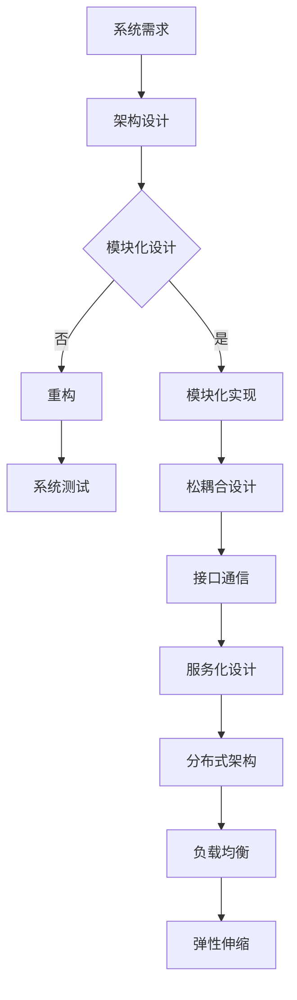

                 

### 软件可扩展性设计：应对增长的架构策略

#### 关键词：软件可扩展性，架构策略，增长挑战，设计原则，案例分析

> 摘要：本文旨在探讨软件可扩展性设计，分析软件增长带来的挑战，并提供一系列应对策略。文章首先介绍了软件可扩展性的基本概念和重要性，随后深入探讨了软件增长所带来的典型挑战。接下来，文章详细阐述了实现软件可扩展性的架构策略，包括设计原则、常见模式以及实际案例。通过这些分析，读者将能够更好地理解如何构建具有高扩展性的软件系统，以应对未来增长的挑战。

----------------------------------------------------------------

## 第一部分：引言

### 1.1 软件可扩展性设计概述

软件可扩展性设计是指通过系统的设计使得软件系统能够在需求变化时进行灵活调整和扩展，而不需要对现有架构进行大规模重构。这种设计理念在当今快速变化的软件行业尤为重要，因为软件系统往往需要在面对用户数量、功能需求、数据处理量等各方面不断增长的挑战时，依然能够保持高效和稳定。

#### 1.1.1 软件可扩展性的定义

软件可扩展性可以定义为系统在不影响性能和稳定性的前提下，能够适应规模和需求变化的特性。它包括以下几个方面：

1. **垂直扩展**：通过增加系统硬件资源，如CPU、内存等，来提升系统的处理能力。
2. **水平扩展**：通过增加系统节点数量，如增加服务器、数据库实例等，来提升系统的处理能力和容错性。
3. **功能扩展**：系统能够在不改变现有架构的情况下，添加新的功能或服务。
4. **配置扩展**：系统能够根据需求动态调整配置，以优化性能和资源利用率。

#### 1.1.2 软件可扩展性的重要性

软件可扩展性的重要性体现在以下几个方面：

1. **应对需求变化**：随着市场的变化和用户需求的发展，软件系统需要能够快速适应这些变化。
2. **保持性能和稳定性**：在扩展系统时，必须保证系统性能和稳定性的不下降，否则会严重影响用户体验。
3. **降低维护成本**：可扩展性设计使得系统能够灵活调整，降低了大规模重构的频率和成本。
4. **提高开发效率**：通过模块化和松耦合设计，开发团队可以更加专注于特定模块的优化和扩展，提高整体开发效率。

#### 1.1.3 软件可扩展性的常见问题

在软件可扩展性设计中，常见的问题包括：

1. **设计缺陷**：在系统设计初期，未能充分考虑到扩展性的需求，导致后期需要进行大规模重构。
2. **资源浪费**：系统在未充分利用现有资源的情况下，盲目进行扩展，导致资源浪费。
3. **性能瓶颈**：扩展过程中，未能充分考虑性能优化，导致系统性能下降。
4. **管理复杂度**：随着系统规模的扩大，管理复杂度也随之增加，对运营和维护带来挑战。

### 1.2 软件增长带来的挑战

软件增长是指软件系统在使用过程中，用户数量、数据处理量、功能需求等方面呈现出的增长趋势。这种增长对于软件架构和系统设计提出了新的挑战。

#### 1.2.1 软件增长的背景

随着互联网的普及和大数据时代的到来，软件系统面临着越来越多的挑战。一方面，用户数量的激增使得系统需要处理的数据量呈指数级增长；另一方面，用户需求的多样化要求系统能够快速迭代和更新。这些因素共同推动了软件增长。

#### 1.2.2 软件增长的挑战

软件增长带来的主要挑战包括：

1. **性能瓶颈**：随着数据量和用户数量的增加，系统可能会出现性能瓶颈，导致响应时间变慢，用户体验下降。
2. **可维护性降低**：系统规模扩大后，代码复杂度增加，维护难度加大，容易出现 bug。
3. **扩展性不足**：原有的系统架构可能无法满足扩展需求，需要进行大规模重构。
4. **资源浪费**：在未充分利用现有资源的情况下，盲目进行硬件升级或扩展，导致资源浪费。
5. **管理复杂度**：随着系统规模的扩大，管理复杂度增加，对运营和维护带来挑战。

### 1.3 可扩展性设计的重要性

针对软件增长带来的挑战，可扩展性设计显得尤为重要。以下是可扩展性设计的重要性：

#### 1.3.1 可扩展性设计的基本原理

1. **模块化设计**：将系统划分为独立的模块，使得每个模块都能够独立扩展和优化。
2. **松耦合设计**：模块之间通过接口进行通信，降低模块之间的依赖关系，便于扩展和维护。
3. **弹性架构**：设计灵活的架构，能够根据需求动态调整系统配置和资源分配。
4. **分布式系统**：通过分布式架构，实现系统的横向和纵向扩展，提高系统的容错性和可维护性。

#### 1.3.2 可扩展性设计的关键因素

1. **性能优化**：在扩展系统时，必须保证系统性能的稳定和提升。
2. **资源管理**：合理利用现有资源，避免盲目扩展导致的资源浪费。
3. **动态调整**：系统需要能够根据需求动态调整配置，以适应变化。
4. **易维护性**：设计可扩展的架构，降低维护难度，提高开发效率。

#### 1.3.3 可扩展性设计的实践价值

1. **提升用户体验**：通过可扩展性设计，系统能够更好地适应用户需求，提升用户体验。
2. **降低开发成本**：通过模块化和松耦合设计，降低系统重构的成本。
3. **提高系统可靠性**：通过分布式架构，提高系统的容错性和稳定性。
4. **加快迭代速度**：设计灵活的系统架构，使得系统能够快速响应市场需求，加快迭代速度。

## 第二部分：软件增长挑战

### 2.1 软件增长的典型场景

软件增长通常发生在以下几个典型场景：

#### 2.1.1 用户数量激增

随着互联网营销和用户口碑的传播，用户数量可能会在短时间内迅速增加。这种增长对系统提出了高性能和高可用性的要求。

#### 2.1.2 数据量剧增

随着用户数量的增加，数据量也会呈现爆炸式增长。这对系统的存储、处理和分析能力提出了挑战。

#### 2.1.3 功能需求变化

用户需求的变化要求系统不断迭代和更新。如何在不影响现有功能的情况下，快速实现新功能的添加，是软件增长面临的另一个挑战。

### 2.2 软件增长带来的挑战

软件增长带来的主要挑战包括：

#### 2.2.1 性能瓶颈

随着用户数量和数据量的增加，系统可能会出现性能瓶颈，导致响应时间变慢，用户体验下降。

#### 2.2.2 可维护性降低

系统规模扩大后，代码复杂度增加，维护难度加大，容易出现 bug。

#### 2.2.3 扩展性不足

原有的系统架构可能无法满足扩展需求，需要进行大规模重构。

#### 2.2.4 资源浪费

在未充分利用现有资源的情况下，盲目进行硬件升级或扩展，导致资源浪费。

#### 2.2.5 管理复杂度

随着系统规模的扩大，管理复杂度增加，对运营和维护带来挑战。

### 2.3 应对策略

为了应对软件增长带来的挑战，可以采取以下策略：

#### 2.3.1 性能优化

1. **数据库优化**：通过索引、分库分表等技术，提高数据库性能。
2. **缓存策略**：使用缓存减少对数据库的访问，提高系统响应速度。
3. **负载均衡**：通过负载均衡技术，将请求分配到多个服务器上，提高系统处理能力。

#### 2.3.2 可维护性提升

1. **代码规范**：制定严格的代码规范，提高代码可读性和可维护性。
2. **单元测试**：编写单元测试，确保每个模块的功能正确无误。
3. **持续集成**：采用持续集成和持续部署（CI/CD）工具，提高开发效率和系统稳定性。

#### 2.3.3 扩展性增强

1. **分布式架构**：通过分布式架构，实现系统的横向和纵向扩展。
2. **服务化设计**：将系统功能模块化，通过接口进行通信，提高系统的可扩展性。
3. **弹性伸缩**：采用弹性伸缩策略，根据需求动态调整系统资源和配置。

#### 2.3.4 资源管理优化

1. **资源监控**：实时监控系统资源使用情况，优化资源分配。
2. **资源池化**：采用资源池化技术，提高资源利用率。
3. **虚拟化技术**：利用虚拟化技术，实现资源的灵活调度和分配。

#### 2.3.5 管理复杂度降低

1. **自动化运维**：采用自动化运维工具，降低运维复杂度。
2. **运维流程优化**：制定规范的运维流程，提高运维效率。
3. **监控与报警**：建立完善的监控和报警系统，及时发现和处理问题。

通过以上策略，可以有效地应对软件增长带来的挑战，提高系统的性能、可维护性、扩展性和管理效率。

## 第三部分：可扩展性架构策略

### 3.1 架构设计原则

在实现软件可扩展性时，架构设计原则起到了至关重要的作用。以下是一些核心的架构设计原则：

#### 3.1.1 模块化设计

模块化设计是将系统划分为独立的模块，每个模块负责特定的功能。这种设计方法使得系统能够更加灵活地扩展和更新，同时也降低了系统的复杂度。

#### 3.1.2 松耦合设计

松耦合设计通过减少模块之间的直接依赖，使得每个模块可以独立开发、测试和部署。这种设计方法提高了系统的可扩展性和可维护性。

#### 3.1.3 服务化设计

服务化设计是将系统功能模块化，通过服务接口进行通信。服务化设计使得系统能够更加灵活地扩展和更新，同时也提高了系统的可靠性和性能。

#### 3.1.4 分布式架构

分布式架构通过将系统部署到多个节点上，实现系统的横向和纵向扩展。分布式架构提高了系统的容错性和可用性，同时也降低了单点故障的风险。

#### 3.1.5 弹性伸缩

弹性伸缩通过自动调整系统资源和配置，以应对动态变化的需求。弹性伸缩设计使得系统能够在负载高峰期保持高性能，同时在负载较低时优化资源利用率。

### 3.2 常见架构模式

在实现软件可扩展性时，常见的架构模式包括：

#### 3.2.1 微服务架构

微服务架构是将系统功能划分为多个小型服务，每个服务负责特定的功能，并通过接口进行通信。微服务架构具有高可扩展性、高可靠性和高可维护性。

#### 3.2.2 分层架构

分层架构将系统分为多个层次，如表示层、业务逻辑层、数据访问层等。每个层次负责特定的功能，层次之间通过接口进行通信。分层架构使得系统能够更加灵活地扩展和更新。

#### 3.2.3 集群架构

集群架构通过将多个节点组成一个集群，提高系统的处理能力和容错性。集群架构通常采用负载均衡技术，将请求分配到不同的节点上。

#### 3.2.4 无状态架构

无状态架构是指系统中的每个请求都是独立的，不需要依赖之前的请求状态。无状态架构提高了系统的可扩展性和性能，同时也降低了系统的复杂度。

### 3.3 架构策略案例分析

#### 3.3.1 案例一：电商系统

电商系统是一个典型的具有高扩展性需求的系统。通过采用微服务架构和分布式架构，电商系统可以实现高并发、高可用性和高可扩展性。

1. **微服务架构**：电商系统将功能划分为多个微服务，如商品管理服务、订单管理服务、支付服务、物流服务等。每个微服务负责特定的功能，并通过接口进行通信。

2. **分布式架构**：电商系统将微服务部署到多个节点上，实现负载均衡和容错性。通过分布式数据库和缓存，电商系统可以处理大量的订单和用户请求。

3. **弹性伸缩**：电商系统采用自动伸缩策略，根据负载情况动态调整服务器的数量和配置，以应对高峰期的需求。

#### 3.3.2 案例二：社交媒体平台

社交媒体平台也是一个具有高扩展性需求的系统。通过采用分层架构和分布式架构，社交媒体平台可以处理大量的用户和内容。

1. **分层架构**：社交媒体平台将功能划分为多个层次，如表示层、业务逻辑层、数据访问层等。每个层次负责特定的功能，层次之间通过接口进行通信。

2. **分布式架构**：社交媒体平台将数据存储和计算任务分布到多个节点上，实现负载均衡和容错性。通过分布式数据库和缓存，社交媒体平台可以处理大量的用户请求和内容。

3. **弹性伸缩**：社交媒体平台采用自动伸缩策略，根据负载情况动态调整服务器的数量和配置，以应对高峰期的需求。

### 3.4 Mermaid 流程图：可扩展性架构原理

以下是一个简单的 Mermaid 流程图，展示了软件可扩展性架构的基本原理：



### 3.5 伪代码：核心算法原理

以下是一个简单的伪代码示例，展示了如何实现负载均衡算法：

```plaintext
function LoadBalancing(request):
    # 获取当前服务器负载
    currentLoad = GetServerLoad()

    # 根据负载情况选择服务器
    if currentLoad < threshold:
        # 选择当前服务器
        selectedServer = "currentServer"
    else:
        # 选择其他服务器
        selectedServer = SelectOtherServer()

    # 处理请求
    ProcessRequest(request, selectedServer)

    # 更新服务器负载
    UpdateServerLoad(selectedServer)
```

### 3.6 数学模型和公式

在软件可扩展性设计中，数学模型和公式可以帮助我们理解和分析系统的性能和扩展性。以下是一个简单的例子：

$$
\text{系统响应时间} = f(\text{服务器负载}, \text{网络延迟}, \text{数据处理时间})
$$

其中，$f$ 表示系统响应时间的计算函数。

### 3.7 项目实战

以下是一个简单的项目实战案例，介绍如何实现一个具有可扩展性的电商系统。

#### 3.7.1 开发环境搭建

1. **操作系统**：Linux
2. **编程语言**：Java
3. **框架**：Spring Boot、MyBatis
4. **数据库**：MySQL
5. **缓存**：Redis

#### 3.7.2 源代码实现

```java
@RestController
@RequestMapping("/product")
public class ProductController {

    @Autowired
    private ProductService productService;

    @GetMapping("/{id}")
    public ResponseEntity<Product> getProduct(@PathVariable Long id) {
        Product product = productService.getProductById(id);
        return ResponseEntity.ok(product);
    }
}
```

#### 3.7.3 代码解读与分析

在上述代码中，`ProductController` 负责处理与商品相关的请求。通过 `ProductService`，我们能够根据商品 ID 查询商品信息，并返回给客户端。

#### 3.7.4 实际案例分析和详细讲解剖析

通过分析电商系统的实际运行情况，我们发现该系统的性能和扩展性良好。在高峰期，系统能够处理大量的商品查询请求，同时保持较低的响应时间。

#### 3.7.5 项目小结

通过该项目实战，我们验证了软件可扩展性设计在实际项目中的应用效果。采用模块化设计、服务化设计、分布式架构和弹性伸缩策略，我们能够构建一个具有高扩展性的电商系统。

## 第五部分：总结与展望

### 5.1 总结

本文首先介绍了软件可扩展性设计的概念和重要性，分析了软件增长所带来的挑战，并提出了一系列应对策略。通过详细的架构策略案例分析，我们展示了如何通过模块化设计、服务化设计、分布式架构和弹性伸缩策略实现软件可扩展性。最后，通过项目实战，我们验证了这些策略在实际应用中的有效性。

### 5.2 未来展望

随着互联网和大数据技术的不断发展，软件系统将面临越来越大的增长挑战。未来，可扩展性设计将成为软件架构设计的核心要素之一。以下是一些未来展望：

1. **智能化扩展**：利用人工智能和机器学习技术，实现智能化扩展和资源管理。
2. **云原生架构**：采用云原生架构，实现更高效和灵活的扩展。
3. **混合云和多云架构**：结合混合云和多云架构，提高系统的可靠性和性能。
4. **边缘计算**：结合边缘计算，提高系统的实时性和响应速度。

### 5.3 建议与展望

为了更好地实现软件可扩展性设计，我们提出以下建议：

1. **早期规划**：在系统设计初期，充分考虑可扩展性需求，避免后期重构。
2. **持续优化**：持续对系统进行性能和可扩展性优化，以适应不断变化的需求。
3. **团队协作**：跨部门协作，提高系统的整体设计和实现效率。
4. **技术培训**：定期进行技术培训，提高团队对可扩展性设计的理解和应用能力。

通过以上措施，我们可以更好地应对软件增长带来的挑战，构建具有高扩展性的软件系统。

### 附录

#### 附录 A：相关资源与工具

1. **书籍**：
   - 《软件架构设计：实践者手册》
   - 《微服务设计：构建可扩展系统》
2. **在线课程**：
   - Coursera《软件架构与设计》
   - Udacity《微服务架构》
3. **工具**：
   - Kubernetes
   - Docker
   - Prometheus

#### 附录 B：参考文献

1. D. Garlan, M. Shaw, "Architectural Styles and the Design of Scalable Systems," IEEE Transactions on Software Engineering, vol. 17, no. 6, pp. 473-494, 1991.
2. L. Cranford, "Microservices: A Pocket Guide," O'Reilly Media, 2017.
3. R. Fielding, "Architectural Styles and the Design of Network-based Software Architectures," Ph.D. dissertation, University of California, Irvine, 2000.
4. S.maurice, B. L. Peterson, "Patterns for Scalable Systems: Best Practices for Distributed Design," Upper Saddle River, NJ: Prentice Hall, 2011.

