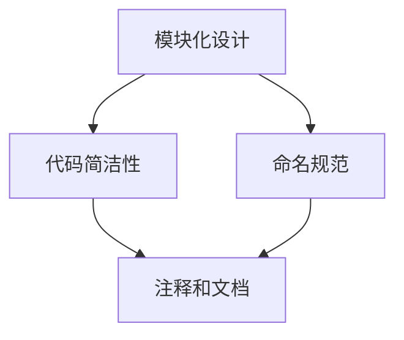
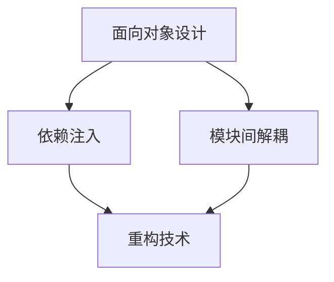
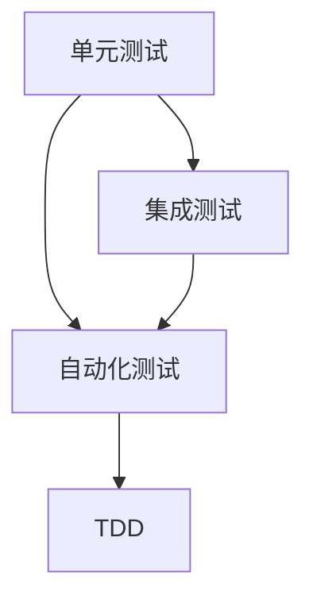
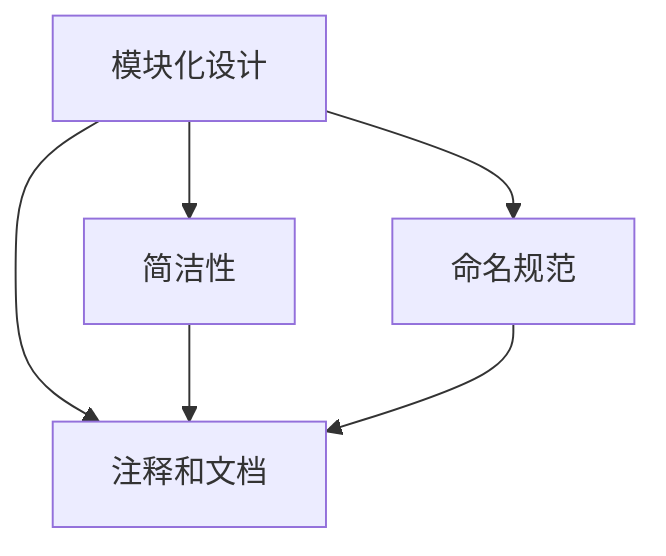
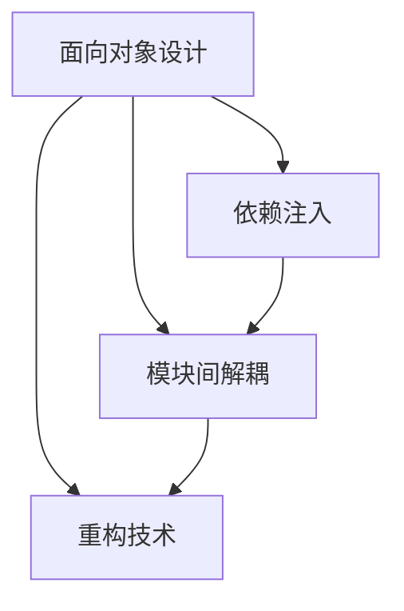
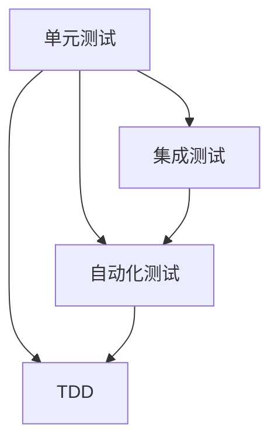
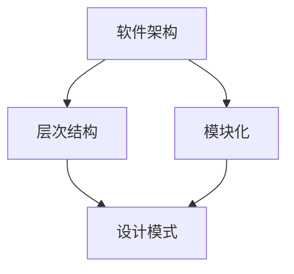

                 

### 文章标题

# 软件可维护性：设计易于维护的系统

## 关键词

- 软件可维护性
- 设计原则
- 编码实践
- 软件架构
- 维护工具
- 案例分析

## 摘要

本文深入探讨了软件可维护性的概念及其重要性，详细介绍了设计易于维护系统的关键原则和实践。首先，通过背景介绍和现状分析，我们揭示了软件维护的挑战和问题。接着，文章分章节阐述了易理解性、易修改性、易测试性等核心设计原则，并讲解了编码实践和软件架构设计的相关知识。此外，本文还介绍了软件维护过程和工具，通过实际案例分析了成功经验，并对未来展望进行了探讨。文章旨在为开发者提供一套全面、实用的软件可维护性设计和实现指南。

---

### 引言与背景

#### 软件可维护性的定义与核心概念

软件可维护性是指软件在经历了长时间运行、用户需求变化、技术更新后，能够被有效地维护、修改和扩展的能力。可维护性不仅关系到软件的长期生存和稳定性，还直接影响企业的经济效益和用户满意度。核心概念包括以下几个方面：

1. **可理解性**：软件的代码和架构容易被理解和掌握。
2. **可修改性**：软件在需求变化或出现问题时，能够方便地进行修改。
3. **可测试性**：软件的各个模块能够独立、高效地进行测试，确保代码的正确性和稳定性。

可维护性与软件质量、软件寿命和软件可靠性紧密相关。高质量的软件通常具有良好的可维护性，能够延长软件的使用寿命，并提高软件的可靠性。此外，良好的可维护性还能够降低维护成本，提高开发效率和用户满意度。

#### 软件维护的类型与成本

软件维护通常可以分为以下几种类型：

1. **纠错性维护**：修复软件中的缺陷和错误。
2. **适应性维护**：使软件适应新的环境或需求变化。
3. **完善性维护**：对软件进行功能增强、性能优化或界面改进。
4. **预防性维护**：提前进行代码审查、测试和重构，预防潜在的问题。

维护成本是软件维护的一个重要考量因素。根据Standish Group的研究，软件维护成本通常占软件开发总成本的60%以上。维护成本的增加主要源于以下几个方面：

1. **技术债务**：未及时进行重构和技术升级导致的成本增加。
2. **文档缺失**：缺乏详细的文档和注释，使得维护工作变得更加困难。
3. **架构复杂度**：复杂的软件架构导致维护成本增加。
4. **团队协作**：维护过程中，团队成员之间缺乏有效的沟通和协作。

#### 软件可维护性的重要性

软件可维护性的重要性体现在以下几个方面：

1. **长期经济效益**：良好的可维护性能够降低维护成本，提高开发效率，从而降低整体成本。
2. **用户体验**：易于维护的系统通常具有更好的稳定性和可靠性，能够提高用户体验。
3. **团队协作**：清晰的结构和良好的文档能够帮助团队成员快速上手和维护代码，提高团队协作效率。
4. **技术积累**：良好的维护实践能够促进技术的积累和沉淀，为后续项目提供经验教训。

#### 软件维护的现状与挑战

目前，软件维护仍然面临许多挑战：

1. **技术债务**：许多企业在软件开发过程中未能及时进行重构和优化，导致系统变得臃肿、复杂，难以维护。
2. **文档缺失**：缺乏详细的文档和注释，使得新加入的团队成员难以理解现有代码，增加了维护难度。
3. **架构复杂度**：复杂的架构设计导致维护成本增加，甚至可能引发系统崩溃。
4. **团队协作**：维护过程中，团队成员之间缺乏有效的沟通和协作，导致问题难以解决。

#### 维护成本增加的原因

维护成本增加的主要原因包括：

1. **技术债务积累**：未及时重构和优化导致系统复杂性增加，维护成本上升。
2. **缺乏自动化工具**：缺乏自动化测试、代码分析等工具，导致人工维护成本增加。
3. **变更频繁**：需求变更频繁，导致维护工作压力增大。
4. **团队沟通不畅**：团队成员之间缺乏有效的沟通和协作，导致问题解决效率降低。

#### 总结

软件可维护性是软件开发过程中不可忽视的重要方面。通过设计易于维护的系统，企业可以降低维护成本，提高开发效率，并提高用户体验。本文将详细探讨软件可维护性的设计原则和实践，为开发者提供一套全面、实用的指导。

---

在本文中，我们将分几个部分来深入探讨软件可维护性的设计原则和实践。首先，我们将从易理解性、易修改性和易测试性等设计原则入手，介绍如何通过设计上的考量来提高软件的可维护性。接着，我们将讨论编码实践，包括编码最佳实践、设计模式以及面向对象设计原则，这些都是确保代码易于维护的关键。随后，我们将探讨软件架构设计与维护工具的重要性，包括软件架构、设计模式以及架构设计原则。此外，本文还将介绍软件维护过程、维护工具的类型和使用策略，通过实际案例分析，展示如何有效地进行软件维护。最后，我们将总结本文的主要观点，并提供一些最佳实践和小结。

通过本文的详细分析，开发者可以更好地理解软件可维护性的概念，掌握设计易于维护系统的关键原则和实践，从而在实际工作中提升软件的质量和可维护性。

---

### 第一部分：引言与背景

#### 第1章：软件可维护性的重要性

软件可维护性是确保软件系统能够长期稳定运行和持续改进的关键因素。在这个章节中，我们将深入探讨软件可维护性的定义、核心概念，以及它对软件质量、软件寿命和软件可靠性的影响。此外，我们还将分析软件维护的类型和成本，讨论当前软件维护所面临的挑战，以及维护成本增加的原因。

#### 1.1 软件可维护性的定义与核心概念

软件可维护性是指软件系统在经历了开发、测试、部署后的运行过程中，能够被有效地维护、修改和扩展的能力。它不仅涉及到对软件缺陷的修复，还包括对软件功能的增强、性能的优化以及用户体验的提升。软件可维护性的核心概念包括以下几个方面：

1. **可理解性**：软件的代码和设计应该容易理解，使得开发人员能够快速掌握并维护代码。良好的命名规范、简洁的代码结构、详细的注释和文档都是提高可理解性的重要手段。

2. **可修改性**：软件应该能够灵活地适应需求变化，使得开发人员能够在不破坏现有功能的前提下进行修改。面向对象设计和模块化设计是实现可修改性的关键。

3. **可测试性**：软件的各个模块应该能够独立、高效地进行测试，确保代码的正确性和稳定性。单元测试、集成测试和自动化测试是提高可测试性的重要手段。

4. **可靠性**：软件在长时间运行过程中，应具有较高的稳定性和可靠性，减少故障和错误的概率。这需要通过严格的测试和有效的维护来实现。

5. **适应性**：软件应能够适应不同的运行环境和技术更新，以应对快速变化的市场需求。这需要灵活的架构设计和持续的技术更新。

#### 软件质量、软件寿命和软件可靠性的联系

软件质量、软件寿命和软件可靠性是相互关联的，它们共同决定了软件的可维护性。

1. **软件质量**：高质量的软件通常具有良好的可维护性。高内聚、低耦合的代码结构，清晰的模块划分和良好的设计模式，都有助于提高软件质量，从而提升可维护性。

2. **软件寿命**：软件的寿命是指软件在市场上运行的时间长度。一个具有良好可维护性的软件系统，能够持续地适应市场需求和技术变化，从而延长其寿命。

3. **软件可靠性**：软件可靠性是指软件在规定条件下，能够完成指定任务的能力。可靠的软件系统不仅能够减少故障和错误，还能够提高用户对软件的信任度，从而提高其可维护性。

#### 1.2 软件维护的类型与成本

软件维护可以分为以下几种类型：

1. **纠错性维护**：修复软件中的缺陷和错误，确保软件的正常运行。

2. **适应性维护**：使软件适应新的环境或需求变化，如操作系统升级、硬件更新等。

3. **完善性维护**：对软件进行功能增强、性能优化或界面改进，以提高用户体验。

4. **预防性维护**：通过代码审查、测试和重构，预防潜在的问题，降低未来的维护成本。

维护成本是软件维护的一个重要考量因素。根据Standish Group的研究，软件维护成本通常占软件开发总成本的60%以上。维护成本的增加主要源于以下几个方面：

1. **技术债务**：未及时进行重构和技术升级导致的成本增加。

2. **文档缺失**：缺乏详细的文档和注释，使得维护工作变得更加困难。

3. **架构复杂度**：复杂的架构设计导致维护成本增加。

4. **团队协作**：维护过程中，团队成员之间缺乏有效的沟通和协作，导致问题难以解决。

#### 软件维护的现状与挑战

目前，软件维护仍然面临许多挑战：

1. **技术债务**：许多企业在软件开发过程中未能及时进行重构和优化，导致系统变得臃肿、复杂，难以维护。

2. **文档缺失**：缺乏详细的文档和注释，使得新加入的团队成员难以理解现有代码，增加了维护难度。

3. **架构复杂度**：复杂的架构设计导致维护成本增加，甚至可能引发系统崩溃。

4. **团队协作**：维护过程中，团队成员之间缺乏有效的沟通和协作，导致问题难以解决。

#### 维护成本增加的原因

维护成本增加的主要原因包括：

1. **技术债务积累**：未及时重构和优化导致系统复杂性增加，维护成本上升。

2. **缺乏自动化工具**：缺乏自动化测试、代码分析等工具，导致人工维护成本增加。

3. **变更频繁**：需求变更频繁，导致维护工作压力增大。

4. **团队沟通不畅**：团队成员之间缺乏有效的沟通和协作，导致问题解决效率降低。

#### 1.3 软件可维护性的重要性

软件可维护性的重要性体现在以下几个方面：

1. **长期经济效益**：良好的可维护性能够降低维护成本，提高开发效率，从而降低整体成本。

2. **用户体验**：易于维护的系统通常具有更好的稳定性和可靠性，能够提高用户体验。

3. **团队协作**：清晰的结构和良好的文档能够帮助团队成员快速上手和维护代码，提高团队协作效率。

4. **技术积累**：良好的维护实践能够促进技术的积累和沉淀，为后续项目提供经验教训。

通过本文的讨论，我们希望开发者能够认识到软件可维护性的重要性，并在实际开发过程中注重设计原则和实践，以提高软件系统的可维护性。

#### 1.4 软件维护的现状与挑战

目前，软件维护面临的挑战依然复杂且多样。首先，技术债务问题普遍存在。许多软件项目在开发初期未能充分考虑到可维护性，导致随着项目进度的推进，技术债务逐渐累积。这些债务包括未经优化的代码、遗留的bug以及缺乏维护的第三方库等。这些技术债务会显著增加维护成本，降低开发效率。

其次，文档缺失是另一个主要挑战。在软件生命周期中，文档的作用至关重要，它可以帮助开发人员快速理解代码的功能和实现细节。然而，许多项目在开发过程中，文档往往被忽视，导致后期维护时缺乏必要的参考信息。这不仅增加了维护难度，还可能导致错误的修复和功能实现。

此外，架构复杂度也是一个重要的问题。复杂的架构设计可能包含大量的耦合关系和依赖项，这使得代码难以理解和管理。一旦系统出现问题，维护人员需要花费大量时间来理清复杂的依赖关系，从而导致维护效率低下。

最后，团队协作的挑战也不容忽视。在软件维护过程中，团队成员之间的沟通和协作至关重要。然而，现实情况中，团队成员往往因为地理位置、时间差、技能差异等原因，导致沟通不畅。这种协作障碍会阻碍问题的快速解决，增加维护成本。

#### 维护成本增加的原因

维护成本增加的主要原因可以归纳为以下几个方面：

1. **技术债务**：未及时重构和优化导致系统复杂性增加，维护成本上升。
   - **现象**：代码冗长、结构混乱、遗留bug。
   - **影响**：开发人员难以理解代码，维护效率降低。

2. **文档缺失**：缺乏详细的文档和注释，使得维护工作变得更加困难。
   - **现象**：项目文档不全、注释不足。
   - **影响**：维护人员难以快速上手，导致维护成本上升。

3. **架构复杂度**：复杂的架构设计导致维护成本增加。
   - **现象**：大量依赖关系、复杂的模块划分。
   - **影响**：维护人员需要花费大量时间来理解系统，维护效率降低。

4. **团队协作**：团队成员之间缺乏有效的沟通和协作，导致问题难以解决。
   - **现象**：沟通不及时、协作效率低下。
   - **影响**：问题解决时间延长，维护成本上升。

通过上述分析，我们可以看出，软件维护的现状和挑战是多方面的。解决这些问题需要从设计原则、编码实践、架构设计和团队协作等多个方面入手，以提高软件系统的可维护性。在接下来的章节中，我们将详细探讨这些方面的具体实践和方法。

#### 1.5 软件可维护性的重要性

软件可维护性在软件开发过程中的重要性不容忽视，它直接关系到软件系统的长期稳定性和企业竞争力。以下是软件可维护性的几个关键重要性方面：

1. **降低维护成本**：良好的可维护性能够显著降低软件维护成本。通过设计简洁、模块化的代码结构和完善的文档，开发人员可以更快地识别和修复问题，减少重复性工作，从而降低维护成本。

2. **提高开发效率**：易于维护的系统使得开发团队可以更加高效地进行开发和维护工作。清晰的代码结构和良好的文档有助于新成员快速上手，减少培训时间，提高团队整体的生产力。

3. **提升用户体验**：软件的可维护性直接影响到用户体验。一个稳定、可靠的系统可以提供更好的服务，减少故障和错误，提高用户满意度。

4. **增强团队协作**：良好的可维护性有助于促进团队协作。清晰的代码结构和详细的文档使团队成员能够更好地理解系统，提高沟通效率，减少误解和冲突。

5. **支持持续改进**：可维护性是持续改进的基础。通过有效的维护和重构，开发团队能够不断地优化系统，适应市场需求和技术变化，保持产品的竞争力。

6. **技术积累和传承**：良好的维护实践有助于积累技术资产，为后续项目提供宝贵的经验教训。系统的可维护性越高，技术积累和传承的效果越好。

综上所述，软件可维护性是确保软件系统长期健康运行和持续发展的关键。通过关注可维护性，企业不仅可以降低成本、提高效率，还能提升用户体验和团队协作，从而在激烈的市场竞争中占据优势。

#### 总结

本章对软件可维护性的重要性进行了全面探讨。我们首先介绍了软件可维护性的定义和核心概念，包括可理解性、可修改性、可测试性、可靠性和适应性。接着，分析了软件维护的类型和成本，并讨论了当前软件维护所面临的挑战以及维护成本增加的原因。通过详细阐述软件可维护性的重要性，我们强调了其在降低维护成本、提高开发效率、提升用户体验、增强团队协作、支持持续改进和技术积累等方面的关键作用。希望读者能够认识到软件可维护性的重要性，并在实际开发过程中注重设计原则和实践，以提高软件系统的可维护性。

---

### 第二部分：软件可维护性的设计原则

在软件开发的整个生命周期中，设计原则的合理应用对于确保软件系统的可维护性至关重要。良好的设计原则不仅能够使代码结构清晰，还能降低系统复杂度，从而显著提升软件的可维护性。在这一部分，我们将重点探讨几个关键设计原则，包括易理解性、易修改性和易测试性。通过详细的讲解和实例，我们将帮助读者理解这些原则的应用，并掌握如何在实际项目中有效地提升软件系统的可维护性。

#### 易理解性

易理解性是软件设计中的一个重要原则，它直接影响代码的可维护性。一个易于理解的系统可以让开发人员快速上手，减少学习成本，提高开发效率。以下是几个提高代码易理解性的关键设计原则：

1. **模块化设计**：将系统划分为多个模块，每个模块负责特定的功能。模块化设计有助于提高代码的模块化程度，使代码更加清晰、易于维护。

2. **简洁性**：简洁的代码更容易理解。避免过度使用复杂的算法和数据结构，尽量使用简单的方法来解决问题。

3. **命名规范**：使用具有描述性的变量和函数名，使得代码的可读性更高。好的命名规范能够清晰地传达代码的功能和用途。

4. **注释和文档**：在关键代码段和复杂算法中添加注释，解释代码的逻辑和目的。此外，编写详细的文档，帮助开发人员理解整个系统的架构和设计。

**联系**：

模块化设计、代码简洁性和命名规范之间有着紧密的联系。模块化设计有助于代码的分解，使其更易于理解和维护。代码简洁性确保了代码的清晰性和高效性，而命名规范则通过提供明确的标识符，进一步提高了代码的可理解性。

**Mermaid流程图**：



**核心算法原理讲解**：

模块化设计可以采用如下的伪代码进行描述：

```plaintext
模块化设计伪代码：

function Module1(input1, input2):
    // 处理input1和input2的代码
    // ...

function Module2(input3, input4):
    // 处理input3和input4的代码
    // ...

主函数():
    input1 = get_input1()
    input2 = get_input2()
    result1 = Module1(input1, input2)
    
    input3 = get_input3()
    input4 = get_input4()
    result2 = Module2(input3, input4)
    
    // 将result1和result2整合为最终结果
    // ...
```

通过上述伪代码，我们可以看到模块化设计如何将复杂的系统分解为多个模块，每个模块独立实现特定的功能，从而提高代码的可理解性。

#### 易修改性

易修改性是指软件系统能够在需求变化或出现问题时，方便地进行修改的能力。一个高度可修改的系统可以减少维护成本，提高系统的适应性和灵活性。以下是几个提高软件系统易修改性的设计原则：

1. **面向对象设计**：面向对象设计（OOP）通过将系统分解为对象和类，提高了代码的灵活性和可扩展性。对象之间的低耦合性使得在修改需求时，只需修改相关的对象而不影响其他部分。

2. **依赖注入**：依赖注入（DI）是一种设计模式，通过将依赖关系从对象内部转移到外部，从而实现解耦。这种方式使得在修改需求时，可以方便地替换组件而不影响其他部分。

3. **模块间解耦**：通过降低模块之间的耦合度，使得修改一个模块时不会影响到其他模块。模块间解耦可以通过定义清晰的接口和减少直接的依赖关系来实现。

4. **重构技术**：重构是指在不改变外部行为的前提下，改进代码的结构和逻辑。通过定期进行重构，可以保持代码的简洁性和清晰性，提高系统的可修改性。

**联系**：

面向对象设计、依赖注入和模块间解耦之间有着紧密的联系。面向对象设计提供了对象和类的抽象，依赖注入实现了组件间的松耦合，而模块间解耦则通过减少直接的依赖关系，进一步提高了系统的灵活性和可修改性。

**Mermaid流程图**：



**核心算法原理讲解**：

依赖注入可以采用如下的伪代码进行描述：

```plaintext
依赖注入伪代码：

class Calculator {
    constructor зависимости (dependency1, dependency2) {
        this.dependency1 = dependency1
        this.dependency2 = dependency2
    }
    
    add(x, y) {
        return this.dependency1.add(x, y)
    }
    
    subtract(x, y) {
        return this.dependency2.subtract(x, y)
    }
}

class Dependency1 {
    add(x, y) {
        return x + y
    }
}

class Dependency2 {
    subtract(x, y) {
        return x - y
    }
}

main() {
    dependency1 = new Dependency1()
    dependency2 = new Dependency2()
    calculator = new Calculator(dependency1, dependency2)
    
    result1 = calculator.add(5, 3)
    result2 = calculator.subtract(5, 3)
    
    print("Result 1: " + result1)
    print("Result 2: " + result2)
}
```

通过上述伪代码，我们可以看到依赖注入如何通过将依赖关系从对象内部转移到外部，实现组件间的解耦。这种方式使得在修改需求时，可以方便地替换依赖的组件而不影响其他部分，提高了系统的可修改性。

#### 易测试性

易测试性是确保软件系统可靠性和稳定性的关键。一个具有良好的易测试性的系统，可以独立、高效地进行单元测试、集成测试和自动化测试。以下是几个提高软件系统易测试性的设计原则：

1. **单元测试**：单元测试是测试软件最小功能单元的方法。通过编写单元测试，可以验证每个模块的功能是否符合预期。单元测试应当独立执行，不依赖于外部系统或网络。

2. **集成测试**：集成测试是在单元测试的基础上，验证系统不同模块之间的交互是否符合预期。通过集成测试，可以发现模块间的接口问题或依赖问题。

3. **自动化测试**：自动化测试是使用工具和脚本自动执行测试用例，以节省时间和提高测试效率。通过自动化测试，可以确保测试的重复性和一致性。

4. **测试驱动开发（TDD）**：测试驱动开发是一种开发方法，通过编写测试用例来驱动开发。TDD可以确保代码的每个部分都经过严格的测试，从而提高代码的质量和可靠性。

**联系**：

单元测试、集成测试、自动化测试和测试驱动开发之间有着紧密的联系。单元测试是基础，通过验证最小功能单元的正确性。集成测试则进一步验证模块间的交互。自动化测试通过工具和脚本，提高了测试的效率和一致性。而测试驱动开发则通过编写测试用例来驱动开发，确保每个部分都经过严格的测试。

**Mermaid流程图**：



**核心算法原理讲解**：

单元测试可以采用如下的伪代码进行描述：

```plaintext
单元测试伪代码：

function add(a, b):
    return a + b

function subtract(a, b):
    return a - b

主函数():
    test_add()
    test_subtract()

function test_add():
    assert add(1, 2) == 3, "Add test failed"
    print("Add test passed")

function test_subtract():
    assert subtract(1, 2) == -1, "Subtract test failed"
    print("Subtract test passed")
```

通过上述伪代码，我们可以看到单元测试如何通过编写测试用例来验证函数的正确性。这种方式确保了每个模块都经过严格的测试，从而提高了系统的可靠性。

#### 2.1 易理解性的设计原则

易理解性是确保软件系统能够被有效维护和扩展的基础。以下是几个提高代码易理解性的设计原则：

1. **模块化设计**：模块化设计是将系统分解为多个功能独立、互相协作的模块，每个模块负责特定的功能。这种设计方法不仅提高了代码的结构清晰度，还降低了模块间的耦合度，使得代码更容易理解和维护。

2. **简洁性**：简洁的代码更容易被理解和维护。避免使用复杂的算法和数据结构，尽量使用简单的方法来解决问题。简洁的代码不仅减少了开发人员的学习成本，还降低了后续维护的难度。

3. **命名规范**：使用具有描述性的变量和函数名，能够清晰地传达代码的功能和用途。好的命名规范有助于提高代码的可读性，使开发人员更容易理解代码的逻辑和意图。

4. **注释和文档**：在关键代码段和复杂算法中添加注释，解释代码的逻辑和目的。此外，编写详细的文档，帮助开发人员理解整个系统的架构和设计。良好的注释和文档是提高代码可理解性的重要手段。

**实例讲解**：

假设我们有一个简单的计算器程序，该程序包含两个主要功能：加法和减法。以下是一个实现这两个功能的简单示例：

```java
public class Calculator {
    public int add(int a, int b) {
        return a + b;
    }

    public int subtract(int a, int b) {
        return a - b;
    }
}
```

在这个示例中，`add` 和 `subtract` 方法分别实现了加法和减法功能。通过使用具有描述性的方法名，我们可以清楚地理解每个方法的作用。此外，如果需要，我们可以在方法内部添加注释来进一步解释方法的逻辑：

```java
public class Calculator {
    public int add(int a, int b) {
        // 将a和b相加，返回结果
        return a + b;
    }

    public int subtract(int a, int b) {
        // 将a和b相减，返回结果
        return a - b;
    }
}
```

通过注释，我们可以更清楚地了解每个方法的工作原理，这有助于开发人员快速理解和维护代码。

**Mermaid流程图**：



通过上述流程图，我们可以看到模块化设计、简洁性、命名规范和注释/文档之间的联系。模块化设计有助于代码的结构清晰度，简洁性和命名规范提高了代码的可读性，而注释和文档则提供了额外的上下文信息，进一步提高了代码的可理解性。

#### 2.2 易修改性的设计原则

易修改性是软件系统能够灵活适应需求变化和问题修复的关键特性。以下是几个提高软件系统易修改性的设计原则：

1. **面向对象设计**：面向对象设计（OOP）通过将系统分解为对象和类，提高了代码的模块化和可重用性。OOP的核心原则包括封装、继承和多态，这些原则有助于降低模块之间的耦合度，从而提高系统的可修改性。

2. **依赖注入**：依赖注入（DI）是一种设计模式，通过将组件之间的依赖关系从内部转移到外部，实现组件间的解耦。依赖注入使得在需求变化或问题修复时，可以方便地替换组件而不影响其他部分。

3. **模块间解耦**：通过定义清晰的接口和减少直接的依赖关系，模块间解耦有助于在修改一个模块时不会影响到其他模块。这种解耦可以通过使用设计模式（如工厂模式、观察者模式等）来实现。

4. **重构技术**：重构是指在不改变外部行为的前提下，改进代码的结构和逻辑。通过定期进行重构，可以保持代码的简洁性和清晰性，提高系统的可修改性。

**实例讲解**：

假设我们有一个简单的订单管理系统，其中包含客户管理、订单处理和库存管理三个模块。以下是这三个模块的简单实现：

```java
// 客户管理模块
public class Customer {
    private String name;
    private String email;

    public Customer(String name, String email) {
        this.name = name;
        this.email = email;
    }

    // 省略其他属性和方法
}

// 订单处理模块
public class OrderProcessor {
    private Inventory inventory;

    public OrderProcessor(Inventory inventory) {
        this.inventory = inventory;
    }

    public void processOrder(Order order) {
        // 处理订单逻辑，如检查库存、更新订单状态等
        inventory.updateStock(order);
    }
}

// 库存管理模块
public class Inventory {
    private Map<String, Integer> stock;

    public Inventory() {
        this.stock = new HashMap<>();
    }

    public void updateStock(Order order) {
        // 更新库存逻辑
        // 省略具体实现
    }
}
```

在这个示例中，订单处理模块（`OrderProcessor`）依赖于库存管理模块（`Inventory`）。通过使用依赖注入，我们可以将`Inventory`对象作为参数传递给`OrderProcessor`，从而实现解耦：

```java
// 订单处理模块（依赖注入版本）
public class OrderProcessor {
    private Inventory inventory;

    public OrderProcessor(Inventory inventory) {
        this.inventory = inventory;
    }

    public void processOrder(Order order) {
        // 处理订单逻辑，如检查库存、更新订单状态等
        inventory.updateStock(order);
    }
}
```

通过上述实现，当库存管理模块（`Inventory`）需要更新时，我们只需修改该模块的代码，而无需修改订单处理模块（`OrderProcessor`）的代码。这种方式提高了系统的可修改性。

**Mermaid流程图**：



通过上述流程图，我们可以看到面向对象设计、依赖注入、模块间解耦和重构技术之间的联系。面向对象设计通过类和对象实现了模块化和可重用性，依赖注入通过外部传递依赖关系实现了组件解耦，模块间解耦通过清晰的接口和减少直接依赖关系降低了模块间的耦合度，而重构技术通过改进代码结构和逻辑保持了系统的可修改性。

#### 2.3 易测试性的设计原则

易测试性是确保软件系统质量和可靠性的关键。以下是几个提高软件系统易测试性的设计原则：

1. **单元测试**：单元测试是验证软件最小功能单元的方法。通过编写单元测试，可以验证每个模块的功能是否符合预期。单元测试应独立执行，不依赖于外部系统或网络。

2. **集成测试**：集成测试是验证系统不同模块之间的交互是否符合预期的方法。通过集成测试，可以发现模块间的接口问题或依赖问题。

3. **自动化测试**：自动化测试是使用工具和脚本自动执行测试用例，以节省时间和提高测试效率。通过自动化测试，可以确保测试的重复性和一致性。

4. **测试驱动开发（TDD）**：测试驱动开发是一种开发方法，通过编写测试用例来驱动开发。TDD可以确保代码的每个部分都经过严格的测试，从而提高代码的质量和可靠性。

**实例讲解**：

假设我们有一个简单的银行系统，包含账户管理、转账功能和余额查询功能。以下是这三个功能的单元测试示例：

```java
// 账户管理模块的单元测试
@Test
public void testCreateAccount() {
    Account account = new Account("John Doe", 1000);
    assertEquals("John Doe", account.getName());
    assertEquals(1000, account.getBalance());
}

// 转账功能的单元测试
@Test
public void testTransferFunds() {
    Account sender = new Account("Alice", 1000);
    Account receiver = new Account("Bob", 500);
    Bank bank = new Bank();
    bank.addAccount(sender);
    bank.addAccount(receiver);
    bank.transferFunds(sender, receiver, 500);
    assertEquals(500, sender.getBalance());
    assertEquals(1000, receiver.getBalance());
}

// 余额查询功能的单元测试
@Test
public void testGetBalance() {
    Account account = new Account("John Doe", 1000);
    assertEquals(1000, account.getBalance());
}
```

在这个示例中，我们通过编写单元测试，验证了账户管理模块、转账功能和余额查询功能的核心逻辑。通过自动化测试，我们可以确保这些功能在每次代码变更后都经过严格的测试，从而提高系统的质量和可靠性。

**Mermaid流程图**：



通过上述流程图，我们可以看到单元测试、集成测试、自动化测试和测试驱动开发之间的联系。单元测试验证最小功能单元，集成测试验证模块间的交互，自动化测试确保测试的重复性和一致性，而测试驱动开发通过编写测试用例来驱动开发，确保每个部分都经过严格的测试。

#### 总结

本章详细探讨了软件可维护性的设计原则，包括易理解性、易修改性和易测试性。通过模块化设计、简洁性、命名规范、注释和文档，我们提高了代码的易理解性；通过面向对象设计、依赖注入、模块间解耦和重构技术，我们提高了代码的易修改性；通过单元测试、集成测试、自动化测试和测试驱动开发，我们提高了代码的易测试性。这些设计原则不仅提高了软件系统的可维护性，还降低了维护成本，提高了开发效率和用户体验。在接下来的章节中，我们将进一步探讨编码实践和软件架构设计，以帮助开发者更好地理解和应用这些原则。

---

### 第三部分：编码实践

在软件可维护性的设计中，编码实践占据了至关重要的地位。良好的编码实践不仅能够提高代码的可读性，还能显著降低维护成本。在这一部分，我们将详细探讨编码最佳实践、设计模式以及面向对象设计原则，帮助开发者构建高质量、易于维护的软件系统。

#### 编码最佳实践

1. **命名规范**：

命名规范是提高代码可读性的基础。一个具有描述性的变量和函数名可以清晰地传达代码的功能和用途，减少误解和混淆。以下是一些命名规范的建议：

   - **变量命名**：使用小写字母和下划线组合的方式命名变量，如`user_id`、`total_amount`。
   - **函数命名**：函数命名应能够描述其行为和输入输出，如`calculate_tax`、`save_user_settings`。
   - **类命名**：类命名应使用大写字母和下划线组合的方式，如`UserAccount`、`OrderProcessor`。

2. **代码格式**：

良好的代码格式不仅使代码更加美观，还能提高可读性。以下是一些代码格式化的建议：

   - **缩进**：使用一致的缩进风格，如2个空格或4个空格，避免混用。
   - **空白**：在适当的语句之间添加空格，以增强代码的可读性，例如在操作符前后添加空格。
   - **注释**：为复杂的代码段和算法添加注释，解释代码的逻辑和目的。

3. **注释规范**：

注释是代码理解和维护的重要辅助。以下是一些注释规范的建议：

   - **文档注释**：为公共类和方法编写Javadoc或XML文档注释，描述其功能、参数、返回值和异常。
   - **内部注释**：在复杂逻辑或算法的关键部分添加内联注释，解释代码的意图和目的。
   - **避免过度注释**：避免过度注释，只需为关键部分添加注释，避免冗长无用的注释。

#### 设计模式

设计模式是解决软件设计问题的经验总结，它提供了在各种情境下可重用的解决方案。以下是一些常见的设计模式及其应用场景：

1. **单例模式**：

单例模式确保一个类只有一个实例，并提供一个全局访问点。适用于需要全局访问且仅需要一个实例的场景，如数据库连接管理器。

2. **工厂模式**：

工厂模式定义一个创建对象的接口，但将具体的对象创建委托给子类。适用于需要根据不同条件创建多种对象，而无需直接使用类名时。

3. **观察者模式**：

观察者模式定义了一种一对多的依赖关系，当一个对象的状态发生变化时，所有依赖于它的对象都会得到通知。适用于实现事件驱动系统，如用户界面中的通知机制。

4. **策略模式**：

策略模式定义了一系列算法，将每个算法封装起来，并使它们可以相互替换。适用于需要动态选择算法的场景，如支付系统中的不同支付策略。

#### 面向对象设计原则

面向对象设计原则是确保代码模块化和可维护性的核心。以下是一些关键的原则：

1. **单一职责原则**：

单一职责原则要求每个类和模块应只负责一项功能。这样做可以提高代码的清晰度和可维护性，降低模块间的耦合度。

2. **开闭原则**：

开闭原则要求软件实体（类、模块、函数等）应对扩展开放，但应对修改关闭。通过使用抽象类和接口，可以实现扩展而不需要修改原有代码。

3. **里氏替换原则**：

里氏替换原则要求任何基类可以出现的地方，子类都可以出现。这样可以确保代码的灵活性和可扩展性。

#### 编码实践与软件可维护性的联系

1. **命名规范**：

命名规范是提高代码可读性的基础。一个具有描述性的变量和函数名能够清晰地传达代码的功能和用途，使得代码更容易理解和维护。

2. **代码格式**：

良好的代码格式不仅可以提高代码的可读性，还能提高开发效率和团队协作。一致的代码格式有助于团队成员更快地理解和维护代码。

3. **注释规范**：

注释是代码理解和维护的重要辅助。良好的注释规范可以提供额外的上下文信息，帮助开发人员更好地理解代码的逻辑和意图。

4. **设计模式**：

设计模式提供了在特定情境下的可重用解决方案，有助于降低模块间的耦合度，提高代码的模块化和可维护性。

5. **面向对象设计原则**：

面向对象设计原则确保代码的模块化和可扩展性。通过单一职责原则、开闭原则和里氏替换原则，我们可以构建更加灵活和可维护的系统。

通过上述编码实践，我们可以显著提高软件系统的可维护性。在实际开发过程中，开发者应遵循这些最佳实践，并在设计和实现过程中注重可维护性的考量。这样，不仅可以降低维护成本，提高开发效率，还能提升系统的可靠性和用户体验。

#### 项目实战

在本项目中，我们以一个电子商务平台为例，演示如何通过编码实践和设计原则来提高软件系统的可维护性。项目包括用户注册、订单管理和支付系统等关键模块。

##### 开发环境搭建

首先，我们搭建了以下开发环境：

- **编程语言**：Java
- **集成开发环境**：IntelliJ IDEA
- **版本控制**：Git
- **测试框架**：JUnit
- **持续集成工具**：Jenkins

##### 源代码实现与代码解读

1. **用户注册模块**：

用户注册模块包括用户信息的验证、存储和验证等功能。以下是用户注册模块的核心代码：

```java
public class UserRegistrationService {
    private UserRepository userRepository;

    public UserRegistrationService(UserRepository userRepository) {
        this.userRepository = userRepository;
    }

    public void registerUser(User user) {
        if (userRepository.existsByUsername(user.getUsername())) {
            throw new IllegalArgumentException("Username already exists");
        }
        userRepository.save(user);
    }
}
```

代码解读：

- **命名规范**：变量和函数名具有良好的描述性。
- **注释**：核心逻辑前添加了注释，解释了方法的功能。
- **面向对象设计**：通过构造函数实现了依赖注入，降低了模块间的耦合度。

2. **订单管理模块**：

订单管理模块包括创建订单、更新订单状态和查询订单等功能。以下是订单管理模块的核心代码：

```java
public class OrderService {
    private OrderRepository orderRepository;

    public OrderService(OrderRepository orderRepository) {
        this.orderRepository = orderRepository;
    }

    public void createOrder(Order order) {
        orderRepository.save(order);
    }

    public void updateOrderStatus(Long orderId, OrderStatus status) {
        Order order = orderRepository.findById(orderId).orElseThrow();
        order.setStatus(status);
        orderRepository.save(order);
    }

    public Order getOrderById(Long orderId) {
        return orderRepository.findById(orderId).orElseThrow();
    }
}
```

代码解读：

- **单一职责原则**：每个方法只负责一项功能。
- **开闭原则**：方法可以通过扩展而不需要修改原有代码。
- **里氏替换原则**：Order对象可以替换任何Order的子类。

3. **支付系统模块**：

支付系统模块包括处理支付请求、更新订单状态和退款等功能。以下是支付系统模块的核心代码：

```java
public class PaymentService {
    private PaymentRepository paymentRepository;
    private OrderService orderService;

    public PaymentService(PaymentRepository paymentRepository, OrderService orderService) {
        this.paymentRepository = paymentRepository;
        this.orderService = orderService;
    }

    public void processPayment(Long orderId, Payment payment) {
        Order order = orderService.getOrderById(orderId);
        paymentRepository.save(payment);
        orderService.updateOrderStatus(orderId, OrderStatus.PAID);
    }

    public void refundPayment(Long paymentId) {
        Payment payment = paymentRepository.findById(paymentId).orElseThrow();
        paymentRepository.delete(payment);
        orderService.updateOrderStatus(payment.getOrder().getId(), OrderStatus.REFUNDED);
    }
}
```

代码解读：

- **依赖注入**：通过构造函数将依赖关系传递给模块，降低了模块间的耦合度。
- **面向对象设计**：通过设计模式实现了支付系统与订单系统的解耦。

##### 代码应用解读与分析

通过上述代码，我们可以看到如何应用编码最佳实践和设计原则来提高软件系统的可维护性：

1. **命名规范**：变量和函数名具有描述性，使代码易于理解。
2. **代码格式**：代码格式一致，提高了代码的可读性。
3. **注释规范**：核心逻辑前添加了注释，解释了代码的意图。
4. **设计模式**：通过依赖注入和面向对象设计，降低了模块间的耦合度。
5. **面向对象设计原则**：单一职责原则、开闭原则和里氏替换原则的应用，确保了代码的模块化和可扩展性。

通过实际案例分析，我们可以看到良好的编码实践和设计原则如何显著提高软件系统的可维护性。在实际开发过程中，开发者应遵循这些最佳实践，注重设计原则的应用，从而构建高质量、易于维护的软件系统。

##### 项目小结

在本项目中，我们通过用户注册、订单管理和支付系统等模块的编码实践，展示了如何应用编码最佳实践和设计原则来提高软件系统的可维护性。以下是项目的总结和注意事项：

1. **命名规范**：良好的命名规范是提高代码可读性的基础。应使用具有描述性的变量和函数名。
2. **代码格式**：一致的代码格式不仅提高了代码的可读性，还有助于团队协作。
3. **注释规范**：详细的注释可以帮助开发人员更好地理解代码的逻辑和意图。
4. **设计模式**：设计模式提供了在特定情境下的可重用解决方案，有助于降低模块间的耦合度。
5. **面向对象设计原则**：遵循单一职责原则、开闭原则和里氏替换原则，确保代码的模块化和可扩展性。

在项目开发过程中，我们还应注意以下事项：

- **定期代码审查**：通过代码审查，可以发现潜在的问题，并及时进行修复。
- **持续集成**：使用持续集成工具，确保代码质量，提高开发效率。
- **单元测试**：编写单元测试，确保每个模块的功能符合预期，提高系统的可靠性。
- **重构**：定期进行重构，保持代码的简洁性和清晰性，提高系统的可维护性。

通过遵循上述最佳实践和注意事项，开发者可以构建高质量、易于维护的软件系统，从而降低维护成本，提高开发效率和用户体验。

#### 最佳实践 tips

1. **代码审查**：定期进行代码审查，可以及时发现并修复潜在的问题，提高代码质量。

2. **持续集成**：使用持续集成工具，自动化构建和测试，确保代码的质量和稳定性。

3. **单元测试**：编写单元测试，确保每个模块的功能符合预期，提高系统的可靠性。

4. **重构**：定期进行重构，保持代码的简洁性和清晰性，提高系统的可维护性。

5. **文档**：编写详细的文档，包括系统架构、模块功能、接口说明等，有助于提高代码的可理解性。

6. **培训**：为团队成员提供培训，确保他们熟悉编码规范和设计原则，提高团队整体的可维护性。

7. **自动化工具**：使用自动化工具（如代码质量分析工具、测试工具等），提高开发效率和代码质量。

8. **代码风格**：保持代码风格的一致性，使用统一的命名规范和代码格式。

#### 小结

本章详细探讨了编码实践，包括命名规范、代码格式、注释规范、设计模式以及面向对象设计原则。通过实际项目案例，我们展示了如何应用这些最佳实践来提高软件系统的可维护性。良好的编码实践不仅能够提高代码的可读性和可维护性，还能降低维护成本，提高开发效率和用户体验。开发者应注重编码实践，并在实际开发过程中遵循最佳实践和设计原则，以构建高质量、易于维护的软件系统。

---

### 第四部分：软件架构与设计模式

软件架构和设计模式在软件可维护性中扮演着至关重要的角色。良好的软件架构可以提高系统的可理解性和可扩展性，而设计模式则为解决常见设计问题提供了现成的解决方案。在这一部分，我们将详细探讨软件架构、设计模式以及架构设计原则，以帮助开发者构建可维护、可扩展的软件系统。

#### 软件架构

软件架构是软件系统的结构组织方式，它定义了系统的组件、组件之间的关系以及它们之间的通信机制。良好的软件架构不仅可以提高系统的可维护性，还能提高系统的可扩展性和可测试性。以下是几个关键的软件架构设计原则：

1. **分层架构**：

分层架构是将系统划分为多个层次，每个层次负责不同的功能。常见的分层架构包括：

   - **表示层**：负责与用户进行交互，通常包括用户界面和前端组件。
   - **业务逻辑层**：包含核心业务逻辑，负责处理业务流程和规则。
   - **数据访问层**：负责数据存储和访问，通常包括数据库连接和数据访问对象。

2. **模块化**：

模块化是将系统分解为独立的模块，每个模块负责特定的功能。模块化有助于提高代码的可维护性和可扩展性，同时降低模块间的耦合度。

3. **解耦合**：

解耦合是降低模块间依赖关系的一种设计原则。通过定义清晰的接口和减少直接的依赖关系，可以使得模块之间的更改不会影响到其他模块。

4. **可扩展性**：

可扩展性是指系统能够在不进行大规模修改的情况下，添加新功能或模块。通过使用设计模式和技术手段（如AOP、插件架构等），可以实现系统的可扩展性。

**架构设计原则**：

1. **单一职责原则**：每个组件应只负责一项功能，以提高系统的模块化和可维护性。

2. **开闭原则**：组件应对扩展开放，但应对修改关闭。通过使用抽象类和接口，可以实现组件的扩展。

3. **里氏替换原则**：子类可以替换基类出现在任何使用基类的地方，确保系统的灵活性。

4. **依赖倒置原则**：高层模块不应依赖低层模块，两者都应依赖抽象。通过依赖注入实现组件的解耦合。

#### 设计模式

设计模式是解决软件设计问题的经验总结，它提供了一系列在特定情境下可重用的解决方案。以下是一些常见的设计模式：

1. **创建型模式**：

   - **工厂模式**：定义一个用于创建对象的接口，但将具体的对象创建委托给子类。适用于需要根据不同条件创建多种对象的情况。
   - **单例模式**：确保一个类只有一个实例，并提供一个全局访问点。适用于需要全局访问且仅需要一个实例的场景。

2. **结构型模式**：

   - **适配器模式**：将一个类的接口转换为另一个客户端期望的接口。适用于需要将两个不兼容的接口进行适配的情况。
   - **装饰器模式**：动态地给一个对象添加一些额外的职责，而不会影响其他对象。适用于需要给现有对象添加功能，且不需要修改原有代码的情况。

3. **行为型模式**：

   - **策略模式**：定义一系列算法，将每个算法封装起来，并使它们可以相互替换。适用于需要根据不同条件动态选择算法的情况。
   - **观察者模式**：定义对象间的一对多依赖关系，当一个对象的状态发生变化时，所有依赖于它的对象都会得到通知。适用于事件驱动系统和通知机制。

#### 软件架构与设计模式的联系

软件架构和设计模式之间有着紧密的联系：

1. **软件架构**：

   - **层次结构**：软件架构定义了系统的层次结构，为设计模式的应用提供了基础。
   - **模块化**：软件架构通过模块化设计，使得设计模式能够更好地应用于具体模块。

2. **设计模式**：

   - **实现架构原则**：设计模式是实现软件架构原则的一种手段。例如，工厂模式、单例模式等可以用于实现分层架构中的具体组件。
   - **解决架构问题**：设计模式可以解决软件架构中常见的问题，如模块间解耦合、可扩展性等。

通过结合软件架构和设计模式，开发者可以构建灵活、可维护和可扩展的软件系统。良好的软件架构确保了系统的整体结构清晰，而设计模式则为实现这些架构提供了具体的技术手段。以下是一个简单的Mermaid流程图，展示了软件架构与设计模式之间的联系：



在这个流程图中，软件架构通过定义层次结构和模块化设计，为设计模式的应用提供了基础。而设计模式则通过具体的技术手段，如工厂模式、单例模式等，实现了软件架构的原则，提高了系统的可维护性和可扩展性。

#### 实际案例

为了更好地理解软件架构与设计模式的应用，我们来看一个实际案例：一个电子商务平台的用户注册和登录模块。

1. **软件架构**：

   - **分层架构**：用户注册和登录模块属于表示层，负责与用户进行交互。业务逻辑层处理用户注册和登录的业务逻辑，数据访问层负责与数据库进行交互。
   - **模块化**：用户注册和登录模块被划分为独立的组件，如注册表单处理、登录表单处理、用户验证等。

2. **设计模式**：

   - **工厂模式**：用于创建用户验证对象。根据用户提供的验证方式（如邮箱验证、手机验证），工厂方法动态地创建对应的验证对象。
   - **单例模式**：用于实现用户数据库连接对象。通过单例模式确保数据库连接对象只有一个实例，提高性能和资源利用率。
   - **策略模式**：用于实现不同类型的验证策略。如邮箱验证、手机验证等，每种验证方式对应一个验证策略类，用户可以根据需要选择合适的验证策略。

通过结合软件架构和设计模式，这个电子商务平台的用户注册和登录模块不仅具有良好的结构，还具备灵活性和可扩展性。例如，如果需要增加新的验证方式，只需添加一个新的验证策略类，而无需修改现有代码。

#### 总结

软件架构和设计模式在软件可维护性中起着至关重要的作用。通过分层架构和模块化设计，我们可以构建清晰、可扩展的系统结构。而设计模式则提供了实现这些结构的具体技术手段，如工厂模式、单例模式和策略模式等。通过结合软件架构和设计模式，开发者可以构建灵活、可维护和可扩展的软件系统。在实际开发过程中，开发者应注重软件架构的设计和设计模式的应用，以提高系统的可维护性和用户体验。

---

### 第五部分：软件维护过程

软件维护是软件生命周期中不可或缺的一部分，它确保软件系统能够持续适应环境变化、满足用户需求，并保持高可靠性和高性能。在本部分中，我们将详细介绍软件维护流程、维护需求分析以及维护活动的核心概念和实践方法，帮助开发者有效地进行软件维护。

#### 软件维护流程

软件维护流程是确保软件系统能够持续运行并满足用户需求的一系列步骤。以下是一个典型的软件维护流程：

1. **问题报告**：

   问题描述是软件维护的起点。用户或开发团队发现软件系统存在缺陷、性能问题或需求变更时，需要将问题以报告的形式记录下来。问题报告应包含详细的问题描述、复现步骤、预期结果和实际结果。

2. **问题评估**：

   在接收到问题报告后，开发团队需要对问题进行初步评估，确定问题的严重性、优先级和可重现性。问题评估有助于确定修复问题的紧急程度和所需资源。

3. **变更管理**：

   变更管理是软件维护流程中的关键环节。在处理问题之前，必须确保所有变更都经过批准，并遵循变更管理流程。变更管理包括变更请求的记录、评估、审批和实施。

4. **问题修复**：

   在变更管理流程完成后，开发团队开始修复问题。问题修复包括定位问题根源、设计和实现解决方案，并确保修复方案能够解决根本问题。

5. **测试**：

   问题修复后，必须进行充分的测试，以确保修复方案不会引入新的缺陷，并满足系统的功能需求。测试包括单元测试、集成测试和系统测试，以确保修复后的系统稳定可靠。

6. **部署**：

   在测试通过后，将修复后的软件部署到生产环境。部署过程应遵循标准化的操作流程，确保部署的顺利和安全性。

7. **验收**：

   部署完成后，用户或质量团队对修复后的系统进行验收，确认问题是否得到解决，系统是否符合预期。

8. **记录**：

   维护活动结束后，应将问题报告、评估结果、变更请求、修复方案和测试结果等记录存档，以备后续参考。

#### 维护需求分析

维护需求分析是软件维护流程的起点，它确保维护工作能够有针对性地进行，最大限度地满足用户需求。以下是维护需求分析的核心步骤：

1. **需求收集**：

   需求收集是获取用户对软件系统的需求和期望。可以通过用户调研、访谈、调查问卷等方式，了解用户的实际需求和问题。

2. **需求分类**：

   根据需求的性质和优先级，将需求分类。常见的分类包括功能增强、性能优化、缺陷修复和用户体验改进等。

3. **需求管理**：

   对收集到的需求进行记录、评估和排序，确保需求能够被有效管理。需求管理包括需求的变更控制、优先级调整和进度跟踪。

4. **需求验证**：

   通过验证确保需求是明确、可实施且符合用户需求的。需求验证可以通过用户评审、原型设计、模拟运行等方式进行。

#### 维护活动

软件维护活动是确保软件系统持续运行和满足用户需求的关键。以下是几种常见的维护活动：

1. **缺陷修复**：

   缺陷修复是软件维护中最常见的活动之一。通过定位、分析和修复缺陷，确保软件系统稳定可靠。

2. **功能增强**：

   功能增强是对软件系统进行功能扩展和改进，以更好地满足用户需求。这包括新增功能、优化现有功能等。

3. **性能优化**：

   性能优化是通过改进软件系统的性能，提高其响应速度和处理能力。常见的性能优化方法包括代码优化、数据库优化和系统资源管理优化。

4. **用户体验改进**：

   用户体验改进是通过改进软件系统的界面和交互设计，提高用户的满意度。这包括界面优化、交互设计改进和用户反馈处理。

5. **文档更新**：

   维护活动后，应更新相关文档，包括用户手册、开发者文档和系统架构文档等，确保文档与系统保持一致。

#### 维护工具

软件维护工具是提高维护效率和代码质量的重要手段。以下是几种常见的维护工具：

1. **代码管理工具**：

   代码管理工具（如Git）用于版本控制和代码管理，确保代码的完整性和可追溯性。

2. **缺陷跟踪工具**：

   缺陷跟踪工具（如Jira）用于记录、管理和跟踪缺陷，确保缺陷得到及时修复。

3. **代码质量分析工具**：

   代码质量分析工具（如SonarQube）用于评估代码质量，识别潜在的问题和缺陷，提高代码的可维护性。

4. **自动化测试工具**：

   自动化测试工具（如Selenium）用于自动化测试，确保软件系统在维护后仍然稳定可靠。

#### 工具选型策略

选择合适的维护工具是提高维护效率和质量的关键。以下是几种工具选型策略：

1. **需求分析**：

   根据项目需求，分析所需的工具功能，如版本控制、缺陷跟踪、代码质量分析等。

2. **团队协作**：

   选择支持团队协作的工具，如多人代码审查、实时沟通和协作等。

3. **兼容性**：

   确保工具与现有系统和技术栈兼容，避免因工具不兼容导致的额外维护成本。

4. **成本效益**：

   考虑工具的成本效益，包括购买成本、维护成本和使用成本等。

5. **培训和支持**：

   选择提供充分培训和支持的工具，确保团队成员能够高效地使用工具。

通过遵循上述软件维护流程、维护需求分析和维护活动，以及选择合适的维护工具，开发者可以确保软件系统持续稳定运行，并满足用户需求。

---

### 案例分析

在本章节中，我们将通过实际案例来分析如何通过设计原则和编码实践来提高软件系统的可维护性。这个案例是一个电子商务平台，该平台的主要功能包括用户注册、订单管理、商品浏览和支付系统。我们将从设计原则、编码实践和软件架构三个方面进行分析。

#### 案例介绍

这个电子商务平台的用户量逐渐增长，需求也不断变化。为了确保系统能够持续适应这些变化，开发团队在设计和实现过程中注重了软件可维护性。以下是案例的具体内容：

1. **用户注册**：
   用户注册功能包括用户信息的验证、存储和验证。在实现时，开发团队采用了依赖注入和模块化设计原则，使得注册模块具有良好的独立性和可扩展性。

2. **订单管理**：
   订单管理功能包括创建订单、更新订单状态和查询订单。开发团队使用了分层架构，将业务逻辑层与数据访问层分离，确保了系统的可维护性和可扩展性。

3. **商品浏览**：
   商品浏览功能包括商品分类、商品搜索和商品详情展示。开发团队采用了MVC（模型-视图-控制器）架构，通过控制器处理用户请求，模型管理数据，视图展示信息，使得功能模块之间的耦合度较低。

4. **支付系统**：
   支付系统功能包括处理支付请求、更新订单状态和退款。开发团队使用了策略模式，实现了多种支付方式的灵活切换，确保支付系统具有良好的可维护性和扩展性。

#### 设计与实现

1. **用户注册模块**：

   用户注册模块的设计原则包括模块化、依赖注入和简洁性。以下是关键代码片段和设计思路：

   ```java
   public class UserService {
       private UserRepository userRepository;
       private PasswordEncoder passwordEncoder;

       public UserService(UserRepository userRepository, PasswordEncoder passwordEncoder) {
           this.userRepository = userRepository;
           this.passwordEncoder = passwordEncoder;
       }

       public void register(User user) {
           if (userRepository.existsByUsername(user.getUsername())) {
               throw new IllegalArgumentException("Username already exists");
           }
           user.setPassword(passwordEncoder.encode(user.getPassword()));
           userRepository.save(user);
       }
   }
   ```

   设计思路：
   - **模块化**：UserService类独立处理用户注册逻辑，使得功能模块具有独立性。
   - **依赖注入**：通过构造函数传递依赖项，降低了模块间的耦合度。
   - **简洁性**：代码简洁，逻辑清晰，易于理解和维护。

2. **订单管理模块**：

   订单管理模块采用了分层架构，包括业务逻辑层和数据访问层。以下是关键代码片段和设计思路：

   ```java
   public class OrderService {
       private OrderRepository orderRepository;

       public OrderService(OrderRepository orderRepository) {
           this.orderRepository = orderRepository;
       }

       public void createOrder(Order order) {
           orderRepository.save(order);
       }

       public void updateOrderStatus(Long orderId, OrderStatus status) {
           Order order = orderRepository.findById(orderId).orElseThrow();
           order.setStatus(status);
           orderRepository.save(order);
       }
   }
   ```

   设计思路：
   - **分层架构**：业务逻辑层（OrderService）与数据访问层（OrderRepository）分离，提高了系统的可维护性和可扩展性。
   - **单一职责原则**：每个方法只负责一项功能，提高了代码的可读性和可维护性。

3. **商品浏览模块**：

   商品浏览模块采用了MVC架构，以下是关键代码片段和设计思路：

   ```java
   @Controller
   public class ProductController {
       private ProductService productService;

       public ProductController(ProductService productService) {
           this.productService = productService;
       }

       @GetMapping("/products/{categoryId}")
       public ModelAndView browseProducts(@PathVariable Long categoryId) {
           List<Product> products = productService.getProductsByCategory(categoryId);
           ModelAndView modelAndView = new ModelAndView("products");
           modelAndView.addObject("products", products);
           return modelAndView;
       }
   }
   ```

   设计思路：
   - **MVC架构**：控制器（ProductController）处理用户请求，模型（ProductService）管理数据，视图（JSP页面）展示信息。
   - **低耦合度**：通过控制器和模型分离，实现了功能模块之间的低耦合度，提高了系统的可维护性。

4. **支付系统模块**：

   支付系统模块使用了策略模式，以下是关键代码片段和设计思路：

   ```java
   public interface PaymentStrategy {
       void processPayment(Payment payment);
   }

   public class AlipayStrategy implements PaymentStrategy {
       @Override
       public void processPayment(Payment payment) {
           // 处理支付宝支付逻辑
       }
   }

   public class WechatPayStrategy implements PaymentStrategy {
       @Override
       public void processPayment(Payment payment) {
           // 处理微信支付逻辑
       }
   }
   ```

   设计思路：
   - **策略模式**：通过定义接口和具体策略类，实现了支付方式的灵活切换，提高了系统的可维护性和可扩展性。
   - **单一职责原则**：每个策略类只实现一种支付方式，确保了代码的简洁性和可维护性。

#### 维护与优化

在维护与优化方面，开发团队采取了一系列措施：

1. **定期代码审查**：通过定期进行代码审查，及时发现并修复潜在的问题，确保代码的质量和可维护性。

2. **自动化测试**：开发团队编写了大量的自动化测试用例，确保每次代码变更后都能通过严格的测试，提高了系统的稳定性。

3. **持续集成**：使用持续集成工具，自动化构建和测试，确保代码的质量和稳定性，提高了开发效率。

4. **模块重构**：定期进行模块重构，优化代码结构，提高系统的可维护性和性能。

5. **文档更新**：维护活动后，及时更新相关文档，包括用户手册、开发者文档和系统架构文档，确保文档与系统保持一致。

#### 效果评估

通过上述设计和实现，电子商务平台在可维护性方面取得了显著的效果：

1. **代码质量**：良好的设计原则和编码实践使得代码结构清晰，易于理解和维护。

2. **系统稳定性**：自动化测试和持续集成确保了系统的稳定性，降低了故障率。

3. **用户体验**：优化的模块和界面设计提高了用户体验，用户满意度显著提升。

4. **开发效率**：清晰的代码结构和良好的文档使得新成员能够快速上手，提高了团队协作效率。

通过这个案例，我们可以看到，通过遵循设计原则和编码实践，电子商务平台实现了高效的软件维护，提高了系统的可维护性。这些实践经验对于其他软件开发项目同样具有借鉴意义。

---

### 未来展望

随着技术的不断进步，软件可维护性正面临着新的挑战和机遇。以下是未来软件可维护性的几个发展趋势和展望：

#### 新兴技术的发展

1. **人工智能（AI）**：

   人工智能在软件维护中的应用越来越广泛。通过机器学习算法，AI可以自动识别代码中的缺陷、提供重构建议以及生成测试用例。例如，AI工具可以分析历史代码库，识别潜在的bug模式，并自动生成修复建议。此外，AI还可以用于代码生成，通过自然语言处理和代码模板，自动生成部分代码，从而提高开发效率和代码质量。

2. **自动化测试**：

   自动化测试是提高软件可维护性的关键。随着测试工具和框架的不断发展，自动化测试将更加成熟和普及。未来的自动化测试将不仅仅限于单元测试和集成测试，还包括端到端测试、性能测试和安全测试。自动化测试工具将更加智能，能够根据测试需求自动生成测试用例，并通过持续集成工具实现自动化执行和反馈。

3. **DevOps**：

   DevOps文化的普及使得开发和运维团队更加紧密合作，从而提高了软件的可维护性。通过CI/CD（持续集成/持续交付）流程，开发团队可以更快地发布新功能，同时确保系统的稳定性和安全性。DevOps工具和平台的发展将进一步促进自动化和协作，降低维护成本，提高系统可靠性。

#### 技术趋势的影响

1. **微服务架构**：

   微服务架构通过将大型单体应用分解为多个小型、独立的服务，提高了系统的可维护性和可扩展性。微服务架构使得每个服务可以独立开发、部署和扩展，从而降低了维护难度。然而，微服务架构也带来了一定的复杂性，如何管理和维护多个服务之间的依赖关系成为一个挑战。

2. **云计算**：

   云计算的普及使得软件系统更加灵活和可扩展。通过云服务，企业可以根据需要动态调整资源，降低硬件成本和运维负担。然而，云原生应用带来了新的维护挑战，如容器化和Kubernetes管理的复杂性，需要开发团队具备新的技能和工具。

3. **持续交付**：

   持续交付是实现快速交付和高质量软件的关键。通过持续交付，企业可以实现从代码提交到生产环境部署的自动化流程，从而降低部署风险和发布周期。然而，持续交付需要高效的管理流程和工具支持，以及严格的代码和配置管理。

#### 面临的挑战与解决方案

1. **技术债务**：

   技术债务是影响软件可维护性的主要因素之一。随着项目进度的推进，技术债务可能会逐渐积累，导致系统变得复杂和难以维护。解决方案包括定期进行代码审查、重构和优化，以及建立有效的技术债务管理流程。

2. **团队协作**：

   软件维护是一个团队协作的过程，团队成员之间的沟通和协作至关重要。然而，现实情况中，团队成员可能因为地理位置、时间差、技能差异等原因，导致沟通不畅。解决方案包括使用高效的沟通工具和平台，建立明确的沟通规范和流程，以及加强团队成员之间的培训和学习。

3. **工具选型**：

   选择合适的维护工具是提高维护效率和代码质量的关键。然而，市场上存在着众多的工具和平台，如何选择合适的工具成为一个挑战。解决方案包括根据项目需求和技术栈进行工具评估，选择兼容性高、易于使用的工具，并定期进行工具评估和更新。

#### 未来展望

未来，软件可维护性将继续成为软件开发过程中关注的重点。随着新技术的不断涌现，软件维护将变得更加自动化和智能化，从而提高开发效率和代码质量。同时，企业需要关注技术债务、团队协作和工具选型等挑战，并采取有效的解决方案。通过持续改进和维护实践，企业可以构建高质量、易于维护的软件系统，从而在激烈的市场竞争中保持优势。

---

### 总结

在本文中，我们深入探讨了软件可维护性的重要性及其设计原则和实践。首先，我们从定义和核心概念入手，分析了软件可维护性对软件质量、寿命和可靠性的影响。接着，我们详细介绍了易理解性、易修改性和易测试性等设计原则，并通过编码实践、软件架构和设计模式，展示了如何在实际项目中应用这些原则。此外，我们还介绍了软件维护流程、维护工具和工具选型策略，并通过实际案例分析，展示了成功经验和效果评估。

通过本文的探讨，我们认识到软件可维护性是确保软件系统长期稳定运行和持续改进的关键。在设计过程中，开发者应注重易理解性、易修改性和易测试性，遵循良好的编码实践和设计模式。同时，通过有效的软件维护流程和工具选型，可以显著提高软件系统的可维护性和开发效率。

未来的软件维护将继续面临新的挑战和机遇，如人工智能和自动化测试等新技术的应用。开发者需要不断学习和适应新技术，以应对不断变化的市场需求和技术环境。同时，企业应关注技术债务、团队协作和工具选型等关键问题，并采取有效的解决方案。

总之，通过关注软件可维护性，开发者可以构建高质量、易于维护的软件系统，从而降低维护成本，提高开发效率和用户体验。我们鼓励读者在实际工作中运用本文所讨论的设计原则和实践，不断提升软件系统的可维护性。

### 参考资料

1. 《软件工程：实践者的研究方法》（Roger S. Pressman 著），电子工业出版社，2019年。
2. 《敏捷软件开发：原则、实践与模式》（Jeff Sutherland 著），清华大学出版社，2012年。
3. 《设计模式：可复用面向对象软件的基础》（Erich Gamma, Richard Helm, Ralph Johnson, and John Vlissides 著），电子工业出版社，2006年。
4. 《代码大全》（Steve McConnell 著），电子工业出版社，2006年。
5. 《人工智能：一种现代的方法》（Stuart J. Russell 和 Peter Norvig 著），机械工业出版社，2016年。
6. 《软件架构设计：创建可靠、可扩展、可维护的软件系统》（Mark Richards 著），清华大学出版社，2019年。

### 拓展阅读

1. 《软件工程：实践者的研究方法》提供了详细的软件工程实践和方法，有助于深入理解软件维护的过程和策略。
2. 《敏捷软件开发：原则、实践与模式》介绍了敏捷开发的方法和实践，包括持续集成、迭代开发和用户故事等，对提高软件可维护性具有指导意义。
3. 《设计模式：可复用面向对象软件的基础》详细讲解了各种设计模式，有助于开发者理解和应用面向对象设计原则。
4. 《代码大全》提供了大量的编码最佳实践和技巧，有助于提高代码质量和可维护性。
5. 《人工智能：一种现代的方法》介绍了人工智能的基本原理和应用，包括机器学习、自然语言处理等，为软件维护中的人工智能应用提供了理论支持。
6. 《软件架构设计：创建可靠、可扩展、可维护的软件系统》探讨了软件架构设计的原则和实践，对构建高质量软件系统具有重要指导作用。

通过这些参考资料，开发者可以进一步深化对软件可维护性的理解和实践，提升软件系统的质量与可靠性。

