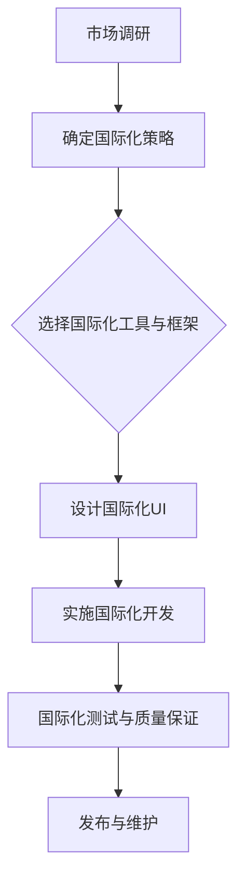
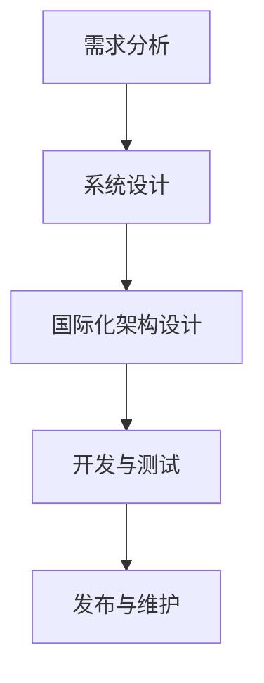
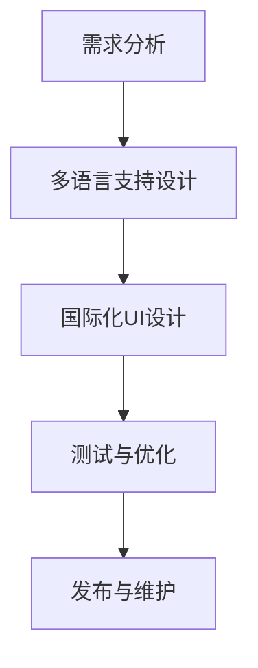

                 

## 文章标题

### 《软件国际化与本地化：全球化应用开发策略》

> **关键词**：全球化、软件国际化、本地化、国际化开发策略、多语言支持、用户体验、国际化架构设计

> **摘要**：
本文深入探讨了软件国际化与本地化的概念、重要性及面临的挑战。通过分析国际化开发工具与框架，以及国际化UI设计原则与实践，本文提出了完整的国际化开发流程和质量保证策略。最后，本文通过市场调研与团队管理的策略制定，为全球化应用开发提供了系统性的指导。

----------------------------------------------------------------

### 全球化背景与软件国际化的重要性

#### 1.1 全球化发展趋势

全球化是一个广泛而复杂的现象，它不仅涉及到经济、文化和政治领域，也对社会发展产生了深远的影响。全球化的定义可以从多个角度来理解，但其核心可以概括为全球范围内资源、信息、人员、资本和技术的自由流动。

**全球化定义**：全球化是指不同国家和地区在多个层面上的相互联系和依赖不断加强的过程。这一过程包括经济一体化、文化多元化、政治合作以及技术和信息的快速传播。

**全球化对社会和经济的驱动因素**：全球化的发展受到多种因素的驱动，包括以下几个方面：

- **经济驱动因素**：全球市场的形成，跨国公司的兴起，国际贸易的自由化和全球化供应链的建立。
- **技术驱动因素**：互联网和通信技术的快速发展，降低了跨国家、跨地区的交流成本，加速了信息传递和知识传播。
- **政治驱动因素**：国际组织和多边合作机制的建立，如世界贸易组织（WTO）、联合国等，为全球治理提供了框架和平台。
- **文化驱动因素**：文化交流和互动的增加，促进了不同文化之间的相互理解和融合。

**跨国企业的角色和影响**：跨国企业（MNEs，Multinational Enterprises）是全球化的重要推动力量。它们通过在不同国家设立分支机构、开展业务，实现了全球资源和市场的整合。跨国企业对全球经济发展的影响体现在以下几个方面：

- **经济增长**：跨国企业的投资和经营促进了东道国经济增长，创造了就业机会，提高了生产力。
- **技术转移**：跨国企业将先进的技术和管理经验引入东道国，推动了当地的技术进步和产业升级。
- **市场竞争**：跨国企业的竞争促进了本地企业的发展，提升了市场效率和质量。
- **文化融合**：跨国企业的跨国运营推动了不同文化之间的交流和融合，促进了文化多样性的发展。

#### 1.2 软件国际化的重要性

软件国际化是指将软件产品或服务根据不同国家和地区用户的需求进行适应和调整，以便在全球市场上获得竞争力。软件国际化在当前全球化背景下具有重要意义，主要体现在以下几个方面：

**市场需求分析**：随着全球化进程的加速，越来越多的企业和用户希望使用能够满足其特定需求的应用软件。软件国际化可以满足这一市场需求，扩大软件企业的市场份额。

**软件国际化策略**：软件国际化策略包括以下几个方面：

- **本地化策略**：将软件产品根据目标市场的语言、文化、习惯等进行调整，使其更符合当地用户的使用习惯和需求。
- **全球化策略**：开发跨平台、跨语言的软件产品，使其在全球范围内具有通用性和适应性。
- **多语言支持**：提供多语言版本，以满足不同语言用户的需求。

**国际化与本地化的区别**：国际化与本地化是软件国际化过程中两个紧密相关但有所区别的概念。

- **国际化**：指在软件开发过程中，采用标准化的方法和工具，使得软件产品具有适应不同市场的能力，能够支持多种语言和地区性差异。
- **本地化**：指在软件国际化过程中，针对特定目标市场的用户需求，对软件进行特定的调整和优化，使其更符合当地用户的使用习惯和偏好。

**软件国际化的重要性**：

- **市场扩展**：软件国际化有助于企业进入新的市场，扩大销售渠道，提高市场份额。
- **用户体验**：通过本地化调整，软件产品可以更好地满足不同地区用户的需求，提升用户体验。
- **品牌形象**：软件国际化有助于提升企业品牌形象，增强全球竞争力。
- **经济效益**：软件国际化可以带来更高的经济收益，提高企业的盈利能力。

#### 1.3 软件国际化面临的挑战

软件国际化虽然具有重要意义，但在实际操作过程中也面临一系列挑战：

**语言和文化差异**：不同国家和地区之间存在显著的语言和文化差异，这给软件国际化带来了巨大的挑战。语言差异需要翻译和本地化，而文化差异则需要更深入的适应和调整。

**技术标准差异**：不同国家和地区在技术标准上存在差异，如编程语言、操作系统、网络协议等。这些差异需要软件企业在开发过程中加以考虑和适应。

**法律和法规限制**：不同国家和地区的法律法规存在差异，这给软件国际化带来了合规性的挑战。软件企业需要了解并遵守各国的法律法规，以避免法律风险。

**本地化成本**：软件国际化涉及到多语言翻译、文化适应、技术调整等多个环节，这需要大量的时间和资金投入。对于中小企业来说，本地化成本可能成为一大障碍。

**技术适应性**：软件产品需要适应不同的操作系统、浏览器和设备，这对软件开发团队的技术能力提出了更高的要求。

**市场调研与定位**：软件国际化需要深入了解目标市场的用户需求和文化背景，进行精准的市场调研和定位。

**团队协作与沟通**：软件国际化涉及到不同国家和地区的团队成员，跨文化团队协作和沟通是成功的关键。

### 1.4 软件国际化与本地化的关键概念

为了实现软件国际化，需要掌握一系列关键概念和策略，以下是其中的几个重要方面：

#### 2.1 本地化策略

**本地化的目标**：本地化的目标是将软件产品根据目标市场的语言、文化、习惯等进行调整，使其更符合当地用户的需求。

**本地化流程**：本地化流程通常包括以下步骤：

1. **需求分析**：分析目标市场的用户需求，了解当地的文化和习惯。
2. **内容翻译**：将软件中的文本、菜单、帮助文档等翻译成目标语言。
3. **界面调整**：调整软件界面，使其更符合目标市场的文化习惯。
4. **测试与验证**：对本地化版本进行测试，确保其功能完整、用户体验良好。

**本地化工具与技术**：本地化工具和技术包括翻译工具、本地化平台、版本控制工具等。常见的本地化工具如翻译记忆库（Translation Memory）、术语库（Termbase）和本地化编辑器。

#### 2.2 用户体验国际化

**用户研究的重要性**：用户体验国际化（UX Internationalization）是软件国际化的重要组成部分。通过用户研究，可以了解不同地区用户的需求和行为习惯，为软件国际化提供依据。

**设计原则**：用户体验国际化的设计原则包括：

- **文化适应性**：设计应考虑不同文化的差异，避免文化误解和冲突。
- **易用性**：软件应具有简洁、直观的界面，使用户能够轻松上手。
- **本地化灵活性**：软件设计应具有灵活性，便于根据不同市场进行本地化调整。

**用户体验评估方法**：用户体验评估方法包括用户测试、可用性测试、问卷调查等。通过这些方法，可以评估软件国际化版本的用户体验，发现并解决潜在问题。

#### 2.3 国际化架构设计

**系统架构概述**：国际化架构设计是软件国际化的重要环节。国际化架构需要考虑软件在不同国家和地区运行的需求，确保软件的稳定性和兼容性。

**国际化架构设计原则**：国际化架构设计原则包括：

- **模块化**：将软件功能模块化，便于根据不同市场进行定制和调整。
- **可扩展性**：设计应考虑未来的扩展需求，便于软件功能的扩展和升级。
- **安全性**：确保软件在不同国家和地区都符合安全标准，防止安全漏洞和攻击。
- **高性能**：软件应具有高性能，满足不同地区用户的需求。

**国际化架构的实现**：国际化架构的实现包括以下几个方面：

- **多语言支持**：实现多语言支持，确保软件在不同国家和地区都能正确显示和交互。
- **本地化配置**：提供本地化配置选项，便于用户根据个人偏好进行设置。
- **文化适应性**：实现文化适应性，确保软件界面和功能符合当地文化习惯。

通过上述关键概念的介绍，我们可以看到，软件国际化与本地化是一个复杂但重要的过程。理解和掌握这些关键概念，有助于企业在全球化竞争中取得成功。

### 总结

在全球化背景下，软件国际化与本地化已成为企业拓展市场和提升竞争力的重要策略。本文通过分析全球化的发展趋势、软件国际化的重要性、面临的挑战以及关键概念，为读者提供了全面而深入的指导。软件国际化不仅有助于市场扩展和用户体验提升，也对企业品牌形象和经济效益产生积极影响。然而，软件国际化过程中也面临语言、文化、技术、法律等多方面的挑战。因此，企业需要制定全面的国际化策略，并借助先进的工具和框架，实现软件的国际化开发。通过本文的阐述，我们期待读者能够更好地理解和应对软件国际化与本地化中的各种问题，为企业的全球化发展奠定坚实基础。

---

## 附录A：国际化开发资源与工具汇总

### A.1 资源汇总

在进行软件国际化开发时，充分利用现有的资源和工具是非常重要的。以下是一些常用的国际化开发资源，包括开源资源、商业工具和在线平台。

#### 开源资源

1. **国际化工具**：
   - **Gettext**：广泛使用的国际化工具，支持多语言翻译和本地化。
   - **I18next**：现代的国际化框架，支持快速构建和配置多语言应用。
   - **Angular i18next**：AngularJS的国际化插件，提供丰富的国际化功能。

2. **翻译记忆库**：
   - **Translatewiki**：开源的翻译平台，支持多种语言的翻译和协作。
   - **Pootle**：开源翻译工具，提供翻译记忆库和术语管理功能。

3. **本地化平台**：
   - ** Lokalise**：在线本地化平台，提供翻译记忆库、术语管理和协作工具。
   - **Transifex**：支持多语言翻译的在线平台，提供API接口和自动化流程。

#### 商业工具

1. **本地化工具**：
   - **SDL**：提供全面的本地化解决方案，包括翻译记忆库、术语管理、翻译项目管理等。
   - **Globalyzer**：专注于代码和内容的国际化检测和修复工具。

2. **国际化框架**：
   - **i18next**：商业版的国际化框架，提供高性能、灵活的多语言支持。
   - **Globalize**：支持多语言日期、时间和货币格式处理的库。

#### 在线平台

1. **翻译服务**：
   - **Google Translate**：免费的在线翻译服务，支持多种语言。
   - **DeepL**：高质量的在线翻译服务，提供专业翻译选项。

2. **语言学习平台**：
   - **Duolingo**：免费的在线语言学习平台，支持多种语言的学习。
   - **Rosetta Stone**：付费的语言学习平台，提供个性化的语言学习体验。

### A.2 工具使用指南

#### 本地化工具使用指南

1. **Gettext**：
   - **安装**：使用包管理器（如yum、apt-get）安装gettext库。
   - **使用**：编写`.pot`模板文件，使用`msgfmt`工具生成`.mo`本地化文件。

2. **I18next**：
   - **安装**：使用npm安装i18next及相关插件。
   - **配置**：创建配置文件，定义语言环境和翻译资源。
   - **使用**：在代码中调用i18next函数进行多语言文本显示。

3. **Lokalise**：
   - **注册**：注册并登录Lokalise账号。
   - **项目创建**：创建新项目，上传翻译文件。
   - **翻译协作**：邀请团队成员参与翻译，查看翻译进度。

#### 国际化框架使用指南

1. **i18next**：
   - **安装**：使用npm安装i18next和所需的插件。
   - **配置**：在主应用程序中设置i18next实例，配置语言环境。
   - **使用**：在组件中调用i18next函数，根据当前语言环境显示文本。

2. **Globalize**：
   - **安装**：使用npm安装globalize库。
   - **配置**：设置全球化环境变量，如日期、时间和货币格式。
   - **使用**：使用globalize函数格式化日期、时间和货币。

#### 自动化与持续集成实践指南

1. **自动化本地化流程**：
   - **集成**：将本地化工具集成到持续集成（CI）流程中。
   - **脚本编写**：编写脚本自动执行翻译提取、生成本地化文件等任务。
   - **自动化测试**：编写测试脚本，确保本地化版本的功能和性能。

2. **持续集成实践**：
   - **环境配置**：配置多语言环境，支持不同语言的构建和测试。
   - **代码库管理**：使用版本控制系统管理代码库，确保国际化代码的版本一致性。
   - **自动化部署**：自动化部署流程，确保多语言版本的快速发布。

通过合理利用这些国际化开发资源与工具，企业可以更高效地实现软件国际化，提升产品的市场竞争力。

### 附录B：国际化开发案例研究

#### B.1 社交媒体平台国际化

**案例背景**：

一个社交媒体平台，如微信，其目标是在全球范围内扩大用户基础，因此需要进行国际化开发。微信在中国市场上已经取得了巨大成功，但为了进入国际市场，需要针对不同国家和地区的用户需求进行本地化调整。

**国际化策略**：

1. **多语言支持**：微信支持多种语言，包括英语、西班牙语、法语、阿拉伯语等，用户可以在设置中自由选择语言。
2. **本地化界面**：微信针对不同地区的用户习惯和文化背景，对界面进行了本地化调整，如使用当地的日期格式、货币符号等。
3. **文化适应性**：微信针对不同国家的节日和习俗，推出了相应的庆祝活动和功能，如春节红包、感恩节购物等。
4. **国际化团队**：微信的国际化团队由来自不同国家的成员组成，他们负责本地化内容的创作和测试，确保产品符合当地用户的期望。

**实施效果**：

通过上述策略，微信在全球范围内取得了显著的成功。例如，在巴西市场，微信的月活跃用户数达到了数千万，成为当地最受欢迎的社交媒体平台之一。在阿拉伯地区，微信的用户增长也非常迅速，用户数量显著增加。

**经验教训**：

- **全面的市场调研**：在进行国际化开发前，需要进行全面的市场调研，了解目标市场的用户需求和文化背景。
- **本地化团队的重要性**：建立本地化团队，确保产品的本地化调整符合当地用户的期望。
- **持续优化**：国际化开发不是一次性工作，需要持续优化和更新，以适应不断变化的市场环境。

#### B.2 电子商务平台本地化

**案例背景**：

一个电子商务平台，如亚马逊，其目标是在全球范围内提供无缝购物体验。为了实现这一目标，亚马逊需要在各个国家和地区进行本地化调整。

**本地化策略**：

1. **多语言支持**：亚马逊提供多种语言的网站和移动应用，用户可以自由切换语言。
2. **本地支付方式**：亚马逊在不同国家提供了本地化的支付方式，如信用卡、PayPal、银行转账等。
3. **物流配送**：亚马逊根据不同国家的物流情况，提供本地化的物流配送服务，如送货上门、自提点自提等。
4. **文化适应性**：亚马逊在不同国家推出了符合当地文化习惯的促销活动，如黑色星期五、双十一等。

**实施效果**：

通过上述策略，亚马逊在全球范围内取得了巨大的成功。例如，在印度市场，亚马逊的月活跃用户数达到了数千万，成为当地最受欢迎的电子商务平台之一。在欧洲市场，亚马逊的销售额持续增长，市场份额不断扩大。

**经验教训**：

- **本地化支付和物流**：提供本地化的支付方式和物流配送服务，是电子商务平台国际化成功的关键。
- **文化适应性**：了解并适应不同国家的文化习惯和消费行为，是电子商务平台本地化成功的关键。
- **持续优化**：电子商务平台的本地化工作需要持续优化和更新，以适应不断变化的市场环境。

通过这些案例研究，我们可以看到，国际化开发与本地化策略对于全球市场的成功至关重要。企业需要根据目标市场的特点，制定合适的策略，并通过不断优化，实现持续的成功。

### 附录C：国际化法律法规指南

#### C.1 法律法规概述

在全球化背景下，软件国际化开发不可避免地涉及不同国家和地区的法律法规。了解和遵守这些法律法规对于企业在国际市场上运营至关重要。以下是几个主要的法律法规领域及其概述：

1. **国际贸易法规**：国际贸易法规涉及跨国商品和服务交易，包括世界贸易组织（WTO）的规则、国际商业惯例等。这些法规旨在促进自由贸易，减少贸易壁垒，规范国际贸易行为。

2. **数据保护法规**：数据保护法规关注个人数据的收集、存储、处理和传输。不同国家和地区对数据保护的要求各不相同，如欧盟的《通用数据保护条例》（GDPR）对数据隐私保护提出了严格的要求。

3. **版权与知识产权法规**：版权和知识产权法规保护创作者的知识产权，包括版权、商标、专利等。这些法规确保创作者的权益得到保护，同时也规范了版权的使用和侵权行为。

4. **网络法规**：网络法规涉及互联网服务提供商（ISP）、电子商务、网络安全等领域。这些法规旨在维护网络秩序，保护用户权益，规范网络行为。

#### C.2 法律合规实践

为了确保软件国际化开发的法律合规性，企业需要建立全面的合规流程，并使用相应的工具和资源。以下是一些合规实践：

1. **合规流程**：企业应制定详细的合规流程，包括数据保护、知识产权保护和国际贸易等方面的合规性审查。合规流程应涵盖从项目立项到产品发布全过程的各个环节。

2. **合规工具**：企业可以使用合规工具，如数据保护管理平台、知识产权监测工具、国际贸易合规软件等，帮助实现合规性管理。

3. **法律咨询**：企业应定期咨询专业法律顾问，了解最新法律法规的变化，确保企业的合规性。

4. **培训与发展**：企业应开展合规培训，提高员工对法律法规的认识和理解，确保员工在日常工作中的合规操作。

#### C.3 挑战与应对

在国际化开发过程中，企业可能会面临以下法律挑战：

1. **法律差异**：不同国家和地区在法律法规上存在差异，可能导致合规性风险。企业需要深入了解目标市场的法律法规，确保产品和服务符合当地要求。

2. **跨境数据传输**：数据保护法规对跨境数据传输提出了严格的要求，企业需要确保数据传输符合相关法规，如GDPR的要求。

3. **知识产权保护**：在多个市场上运营可能面临知识产权侵权风险，企业需要建立有效的知识产权保护机制，防范侵权行为。

4. **跨国纠纷**：跨国运营可能导致法律纠纷，企业需要建立有效的法律纠纷解决机制，确保纠纷得到公正处理。

针对上述挑战，企业可以采取以下应对策略：

1. **合规风险评估**：定期进行合规风险评估，识别潜在的法律风险，并制定相应的风险管理计划。

2. **跨文化团队建设**：建立跨文化团队，确保团队成员了解不同文化背景下的法律法规，提高团队的整体合规性。

3. **国际合作与交流**：积极参与国际组织的合作与交流，了解国际法律动态，借鉴其他国家的合规经验。

4. **法律争议解决机制**：建立法律争议解决机制，包括法律咨询、调解和仲裁等，确保法律纠纷能够得到及时、有效的解决。

通过建立全面的合规实践和应对策略，企业可以更好地应对国际化开发过程中面临的法律挑战，确保企业在国际市场上的稳定运营。

### 流程图1：软件国际化与本地化流程

以下是一个简化的流程图，展示了软件国际化与本地化的主要步骤：

```
graph TB
    A[市场调研] --> B[确定国际化策略]
    B --> C{选择国际化工具与框架}
    C --> D[设计国际化UI]
    D --> E[实施国际化开发]
    E --> F[国际化测试与质量保证]
    F --> G[发布与维护]
```

#### 流程详解：

1. **市场调研（A）**：在开始国际化开发之前，企业需要对目标市场进行详细调研，了解当地用户的需求、文化习惯、法律法规等。这有助于企业制定合适的国际化策略。

2. **确定国际化策略（B）**：根据市场调研结果，企业需要确定国际化策略，包括本地化策略和全球化策略。本地化策略关注特定市场的需求，而全球化策略关注跨市场的兼容性和适应性。

3. **选择国际化工具与框架（C）**：选择合适的国际化工具和框架，如本地化工具、国际化框架和自动化工具，以支持国际化开发的各个阶段。

4. **设计国际化UI（D）**：设计国际化用户界面（UI），确保界面元素和文化元素的本地化，如文本翻译、图标调整等。

5. **实施国际化开发（E）**：根据国际化策略和UI设计，实施软件的国际化开发，包括代码国际化、配置国际化等。

6. **国际化测试与质量保证（F）**：对国际化版本进行全面的测试，确保软件功能、性能和用户体验的质量。这包括功能测试、兼容性测试和文化适应性测试。

7. **发布与维护（G）**：将国际化版本发布到市场，并定期更新和维护，以适应市场变化和用户需求。

### 流程图2：国际化开发团队组织结构

以下是一个简化的流程图，展示了国际化开发团队的典型组织结构：

```
graph TB
    A[项目经理] --> B{产品经理}
    B --> C[设计师]
    C --> D[开发人员]
    D --> E[测试工程师]
    A --> F[市场分析师]
    F --> G[本地化专家]
    G --> H[法律顾问]
    H --> I[其他专业人员]
```

#### 团队成员详解：

1. **项目经理（A）**：负责整体项目的管理和协调，确保项目按计划进行，并解决项目中出现的问题。

2. **产品经理（B）**：负责产品的整体规划和设计，确保产品功能满足用户需求，并与市场趋势保持一致。

3. **设计师（C）**：负责国际化UI的设计，确保界面符合不同地区的文化和用户习惯。

4. **开发人员（D）**：负责软件的编码和实现，确保软件的国际化功能得到有效实现。

5. **测试工程师（E）**：负责国际化版本的测试，确保软件功能、性能和用户体验的质量。

6. **市场分析师（F）**：负责市场调研和分析，提供市场数据支持，帮助团队制定国际化策略。

7. **本地化专家（G）**：负责本地化内容的翻译、审核和文化适应性调整，确保软件的本地化质量。

8. **法律顾问（H）**：负责法律合规性咨询，确保软件国际化开发过程中的法律风险得到控制。

9. **其他专业人员（I）**：根据项目需求，可能还包括技术顾问、项目管理顾问等。

通过合理组织团队，明确团队成员的职责，国际化开发团队能够高效地协同工作，确保软件国际化项目的成功。

---

## 核心概念与联系

### 软件国际化

软件国际化（Software Internationalization）是指使软件产品在进入新市场或面向不同语言和文化背景的用户时，能够灵活适应和扩展的过程。国际化的核心目标是使软件产品能够在多个国家和地区无缝运行，满足不同用户的需求。

**核心概念**：

1. **模块化**：将软件功能模块化，使得每个模块都可以独立开发、测试和部署。
2. **多语言支持**：支持多种语言，包括文本翻译、界面本地化、日期和时间格式等。
3. **本地化**：根据不同地区的文化、语言和法规调整软件，使其更适合本地用户。
4. **国际化架构**：构建支持国际化的软件架构，确保软件在不同环境下都能正常运行。

**联系**：

软件国际化与本地化是紧密相关的概念。国际化提供了软件在不同市场的基础能力，而本地化则是在国际化基础上，对软件进行特定的调整，使其更符合特定市场的需求。国际化注重软件的通用性和适应性，而本地化则关注细节和用户体验。

**Mermaid 流程图**：

下面是一个简单的Mermaid流程图，展示了软件国际化的一般流程：



### 国际化架构设计

国际化架构设计（Internationalization Architecture Design）是软件国际化过程中至关重要的一环。良好的国际化架构设计可以确保软件产品在全球范围内的高效开发和维护。

**核心概念**：

1. **国际化模块**：将软件功能划分为国际化模块，使得每个模块都可以独立处理国际化相关的任务，如多语言支持、日期和时间格式等。
2. **资源管理**：管理国际化资源，如语言文件、图片、字体等，确保资源在不同环境下可以正确加载和使用。
3. **国际化API**：提供国际化API，使得开发人员可以在编写代码时方便地调用国际化功能，如多语言文本显示、文化适应等。
4. **国际化测试**：建立国际化测试框架，确保国际化功能在各个测试阶段得到充分的验证和测试。

**联系**：

国际化架构设计直接影响到软件国际化的效率和效果。良好的国际化架构设计可以减少开发工作量，提高软件的本地化速度和用户体验。国际化架构设计需要考虑到软件的模块化、资源管理和国际化API等因素，以确保软件在不同市场环境下都能正常运行。

**Mermaid 流程图**：

下面是一个简单的Mermaid流程图，展示了国际化架构设计的一般流程：



### 多语言支持与国际化UI设计

多语言支持（Multilingual Support）和国际化UI设计（Internationalization User Interface Design）是软件国际化的重要组成部分，直接影响用户的使用体验。

**核心概念**：

1. **多语言支持**：确保软件可以支持多种语言的文本显示和操作，如文本翻译、键盘布局等。
2. **国际化UI设计**：设计软件界面，使其在不同语言和文化背景下都能提供良好的用户体验，如文本布局、颜色和图标等。

**联系**：

多语言支持和国际化UI设计相互依存。多语言支持提供了文本和功能的基础，而国际化UI设计则关注用户界面的视觉和文化适应性。良好的国际化UI设计可以增强多语言支持的效果，提高用户满意度。

**Mermaid 流程图**：

下面是一个简单的Mermaid流程图，展示了多语言支持与国际化UI设计的一般流程：



通过理解这些核心概念和它们之间的联系，开发人员可以更有效地实现软件国际化，提高产品的市场竞争力。

### 核心算法原理讲解

#### 1. 国际化资源管理算法

国际化资源管理是软件国际化过程中的一项关键任务，涉及到文本、图片、音频等资源的存储、加载和更新。以下是一种常用的国际化资源管理算法：

**算法原理**：

1. **资源分类**：将国际化资源按照类型分类，如文本文件、图片文件、音频文件等。
2. **资源索引**：为每种类型的资源创建索引，便于快速查找和加载。
3. **资源缓存**：使用缓存机制，减少资源重复加载，提高系统性能。
4. **资源更新**：定期检查资源版本，自动更新旧版本资源。

**伪代码**：

```python
# 资源分类
class ResourceType:
    TEXT = "text"
    IMAGE = "image"
    AUDIO = "audio"

# 资源管理器
class ResourceManager:
    def __init__(self):
        self.resources = {
            ResourceType.TEXT: {},
            ResourceType.IMAGE: {},
            ResourceType.AUDIO: {}
        }

    def add_resource(self, resource_type, resource_name, resource_data):
        if resource_type in self.resources:
            self.resources[resource_type][resource_name] = resource_data

    def get_resource(self, resource_type, resource_name):
        if resource_type in self.resources and resource_name in self.resources[resource_type]:
            return self.resources[resource_type][resource_name]

    def update_resource(self, resource_type, resource_name, new_resource_data):
        if resource_type in self.resources and resource_name in self.resources[resource_type]:
            self.resources[resource_type][resource_name] = new_resource_data
```

#### 2. 国际化API设计

国际化API是软件国际化过程中用于提供国际化功能的关键接口，通常包括多语言支持、日期和时间格式化等。以下是一种简单的国际化API设计：

**算法原理**：

1. **多语言支持**：提供接口，允许开发者根据用户语言偏好设置和获取文本。
2. **日期和时间格式化**：提供接口，允许开发者根据用户所在地区的格式化规则格式化日期和时间。

**伪代码**：

```python
# 国际化API
class InternationalizationAPI:
    def __init__(self, language_preference, date_format_preference):
        self.language_preference = language_preference
        self.date_format_preference = date_format_preference

    def set_language(self, language_preference):
        self.language_preference = language_preference

    def get_language(self):
        return self.language_preference

    def set_date_format(self, date_format_preference):
        self.date_format_preference = date_format_preference

    def get_date_format(self):
        return self.date_format_preference

    def translate_text(self, text):
        # 根据语言偏好进行文本翻译
        return translated_text

    def format_date(self, date):
        # 根据日期格式偏好格式化日期
        return formatted_date
```

#### 3. 多语言数据存储与检索算法

多语言数据存储与检索是确保国际化软件能够正确显示和管理不同语言数据的关键技术。以下是一种简单的多语言数据存储与检索算法：

**算法原理**：

1. **数据存储**：将多语言数据存储在数据库中，每个字段对应一种语言。
2. **数据检索**：根据用户语言偏好检索对应语言的数据。

**伪代码**：

```python
# 多语言数据存储
class MultilingualDatabase:
    def __init__(self):
        self.database = {}

    def add_data(self, key, data):
        self.database[key] = data

    def get_data(self, key, language):
        if key in self.database and language in self.database[key]:
            return self.database[key][language]

# 多语言数据检索
class MultilingualDataRetriever:
    def __init__(self, database, language_preference):
        self.database = database
        self.language_preference = language_preference

    def retrieve_data(self, key):
        return self.database.get_data(key, self.language_preference)
```

通过上述算法原理和伪代码，我们可以看到软件国际化过程中涉及的核心算法和技术。这些算法和技术是实现软件国际化的基础，有助于确保软件产品在全球范围内的可用性和用户体验。

### 数学模型和公式

#### 1. 国际化资源管理模型

国际化资源管理是软件国际化过程中至关重要的一个环节。为了确保国际化资源的高效管理和使用，我们可以采用以下数学模型：

**模型假设**：
- 假设存在一个软件产品，包含多种类型的国际化资源，如文本、图片、音频等。
- 每种资源都需要根据不同的语言和文化进行本地化。
- 资源的加载、存储和更新都受到系统性能的限制。

**模型定义**：

设 \( R \) 为国际化资源的集合，\( L \) 为语言集合，\( C \) 为文化集合，\( P \) 为性能参数集合。

- \( R = \{R_t, R_i, R_a\} \)，其中 \( R_t \) 为文本资源，\( R_i \) 为图片资源，\( R_a \) 为音频资源。
- \( L = \{l_1, l_2, ..., l_n\} \)，表示支持的语言。
- \( C = \{c_1, c_2, ..., c_m\} \)，表示需要考虑的文化因素。
- \( P = \{p_1, p_2, ..., p_k\} \)，表示系统性能参数，如响应时间、资源加载时间等。

**模型公式**：

1. **资源加载时间**：用于衡量资源加载到系统所需的时间。
   \[
   T_{load} = \sum_{i=1}^{n} \sum_{j=1}^{m} \sum_{r \in R} L_r \times C_j \times P_i
   \]
   其中，\( L_r \) 表示资源 \( r \) 的加载时间，\( C_j \) 表示文化因素 \( j \) 对资源加载的影响，\( P_i \) 表示性能参数 \( i \) 对资源加载的影响。

2. **资源更新频率**：用于衡量资源更新的频率。
   \[
   F_{update} = \sum_{i=1}^{n} \sum_{j=1}^{m} \sum_{r \in R} U_r \times C_j \times P_i
   \]
   其中，\( U_r \) 表示资源 \( r \) 的更新频率，其他符号的含义与上述相同。

3. **资源使用率**：用于衡量资源的利用率。
   \[
   U_{resource} = \frac{T_{load} + F_{update}}{T_{total}}
   \]
   其中，\( T_{total} \) 表示系统总运行时间。

**模型解释**：

上述模型通过考虑资源的类型、语言、文化以及性能参数，对国际化资源管理进行了量化分析。资源加载时间、更新频率和使用率三个指标可以综合反映国际化资源管理的效率和效果。

#### 2. 国际化UI设计模型

国际化UI设计是确保软件在不同语言和文化背景下提供良好用户体验的关键。以下是一个简化的国际化UI设计模型：

**模型假设**：
- 假设UI设计包含文本、图标、颜色等元素。
- 文本元素需要根据语言进行翻译和本地化。
- 图标和颜色元素需要根据文化背景进行适配。

**模型定义**：

设 \( U \) 为国际化UI的集合，\( L \) 为语言集合，\( C \) 为文化集合。

- \( U = \{U_t, U_i, U_c\} \)，其中 \( U_t \) 为文本元素，\( U_i \) 为图标元素，\( U_c \) 为颜色元素。
- \( L = \{l_1, l_2, ..., l_n\} \)，表示支持的语言。
- \( C = \{c_1, c_2, ..., c_m\} \)，表示需要考虑的文化因素。

**模型公式**：

1. **文本本地化率**：用于衡量文本元素本地化的程度。
   \[
   L_{text} = \frac{\sum_{i=1}^{n} \sum_{j=1}^{m} T_{l_jc_j}}{\sum_{i=1}^{n} \sum_{j=1}^{m} T_{maxl_jc_j}}
   \]
   其中，\( T_{l_jc_j} \) 表示语言 \( l_j \) 在文化 \( c_j \) 下的文本元素数量，\( T_{maxl_jc_j} \) 表示在文化 \( c_j \) 下语言 \( l_j \) 的最大文本元素数量。

2. **图标适配率**：用于衡量图标元素根据文化背景适配的程度。
   \[
   L_{icon} = \frac{\sum_{i=1}^{n} \sum_{j=1}^{m} I_{l_jc_j}}{\sum_{i=1}^{n} \sum_{j=1}^{m} I_{maxl_jc_j}}
   \]
   其中，\( I_{l_jc_j} \) 表示语言 \( l_j \) 在文化 \( c_j \) 下的图标元素数量，\( I_{maxl_jc_j} \) 表示在文化 \( c_j \) 下语言 \( l_j \) 的最大图标元素数量。

3. **颜色适配率**：用于衡量颜色元素根据文化背景适配的程度。
   \[
   L_{color} = \frac{\sum_{i=1}^{n} \sum_{j=1}^{m} C_{l_jc_j}}{\sum_{i=1}^{n} \sum_{j=1}^{m} C_{maxl_jc_j}}
   \]
   其中，\( C_{l_jc_j} \) 表示语言 \( l_j \) 在文化 \( c_j \) 下的颜色元素数量，\( C_{maxl_jc_j} \) 表示在文化 \( c_j \) 下语言 \( l_j \) 的最大颜色元素数量。

**模型解释**：

上述模型通过考虑语言和文化因素，对国际化UI设计的本地化和适配程度进行了量化分析。文本本地化率、图标适配率和颜色适配率三个指标可以综合反映国际化UI设计的本地化程度和用户体验。

通过这些数学模型和公式，我们可以更系统地分析和评估软件国际化资源管理和UI设计的效果，从而指导实际开发工作。

### 项目实战

#### 开发环境搭建

在进行软件国际化开发之前，首先需要搭建一个适合国际化项目的开发环境。以下是一个典型的国际化开发环境搭建步骤：

1. **安装基础工具**：
   - 安装Git：Git是一个版本控制系统，用于管理代码库和协作开发。
   - 安装Node.js和npm：Node.js是一个基于Chrome V8引擎的JavaScript运行环境，npm是Node.js的包管理工具。
   - 安装Visual Studio Code：Visual Studio Code是一个轻量级但功能强大的代码编辑器，支持多种编程语言和插件。

2. **配置国际化工具**：
   - 安装i18next：i18next是一个流行的国际化框架，提供多语言支持。
   - 安装angular-i18next：angular-i18next是i18next的AngularJS插件，用于在AngularJS应用中集成i18next。

   ```bash
   npm install i18next angular-i18next
   ```

3. **设置项目结构**：
   - 创建一个项目文件夹，并在其中创建`src`、`public`、`config`等目录。
   - 在`src`目录下创建`app`、`components`、`services`等子目录，分别存放应用程序的代码。

4. **配置i18next**：
   - 在`config`目录下创建`i18next.config.js`，配置i18next的基本设置，如语言环境、资源路径等。

   ```javascript
   // config/i18next.config.js
   const i18next = require('i18next');
   const Backend = require('i18next-http-backend');
   const { initReactI18next } = require('react-i18next');

   i18next
     .use(Backend)
     .use(initReactI18next)
     .init({
       fallbackLng: 'en',
       lng: 'en',
       backend: {
         loadPath: '/locales/{{lng}}/{{ns}}.json',
       },
       react: {
         useSuspense: false,
       },
     });
   ```

5. **初始化Angular项目**：
   - 使用Angular CLI创建一个新的Angular项目，并安装国际化相关的依赖。

   ```bash
   ng new internationalization-app
   cd internationalization-app
   ng add @ngneat/config i18next
   ```

6. **配置Angular国际化**：
   - 在`angular.json`文件中添加国际化配置，指定多语言支持。
   - 在`app.module.ts`文件中导入`TranslateModule`，并配置翻译服务。

   ```typescript
   // angular.json
   "projects": {
     "internationalization-app": {
       "architect": {
         "build": {
           "configurations": {
             "production": {
               "fileReplacements": [
                 { "replace": "src/environments/environment.ts", "with": "src/environments/environment.prod.ts" },
                 { "replace": "src/environments/environment.ts", "with": "src/environments/environment.ts" }
               ]
             }
           }
         }
       }
     }
   }

   // app.module.ts
   import { TranslateModule } from '@ngneat/config';
   import { I18nextModule } from 'angular-i18next';

   @NgModule({
     declarations: [ ... ],
     imports: [
       TranslateModule.forRoot(),
       I18nextModule.forRoot()
     ],
     providers: [ ... ],
     bootstrap: [ AppComponent ]
   })
   export class AppModule {}
   ```

通过以上步骤，我们可以搭建一个基本的国际化开发环境，为后续的国际化功能实现做好准备。

#### 源代码详细实现和代码解读

在完成开发环境搭建后，我们将深入探讨国际化项目的源代码实现，具体包括多语言资源的组织、国际化服务的创建和国际化组件的使用。

**1. 多语言资源的组织**

在国际化项目中，多语言资源的管理是一个关键环节。我们使用JSON格式来组织多语言文本，并按照不同的语言和模块进行分类。以下是一个示例：

```json
// src/assets/locales/en.json
{
  "welcome": "Welcome",
  "submit": "Submit"
}

// src/assets/locales/es.json
{
  "welcome": "Bienvenido",
  "submit": "Enviar"
}
```

为了方便管理，我们将多语言资源文件放在`src/assets/locales`目录下，并使用`i18next-http-backend`插件从这些文件中加载和更新翻译数据。

**2. 国际化服务的创建**

在Angular项目中，我们使用`TranslateService`来提供国际化功能。以下是一个简单的国际化服务实现：

```typescript
// src/app/services/translate.service.ts
import { Injectable } from '@angular/core';
import { TranslateService } from '@ngx-translate/core';

@Injectable({
  providedIn: 'root'
})
export class TranslateService {
  constructor(private translate: TranslateService) {}

  changeLanguage(languageCode: string) {
    this.translate.use(languageCode);
  }

  getTranslation(key: string) {
    return this.translate.instant(key);
  }
}
```

**3. 国际化组件的使用**

在Angular组件中，我们通过`TranslateService`来获取和显示多语言文本。以下是一个简单的国际化组件示例：

```typescript
// src/app/components/i18n-component/i18n-component.component.ts
import { Component } from '@angular/core';
import { TranslateService } from '../services/translate.service';

@Component({
  selector: 'app-i18n-component',
  templateUrl: './i18n-component.component.html',
  styleUrls: ['./i18n-component.component.css']
})
export class I18nComponent {
  constructor(private translateService: TranslateService) {}

  ngOnInit() {
    this.translateService.changeLanguage('es');
  }
}
```

组件的模板文件（`i18n-component.component.html`）如下：

```html
<div>
  <h1>{{ translateService.getTranslation('welcome') }}</h1>
  <button (click)="submitForm()">
    {{ translateService.getTranslation('submit') }}
  </button>
</div>
```

在上述代码中，我们通过`TranslateService`调用`changeLanguage`方法切换语言，并使用`getTranslation`方法获取并显示多语言文本。

**代码解读**

1. **多语言资源管理**：通过JSON文件组织多语言文本，确保资源的结构清晰，便于后续的加载和管理。
2. **国际化服务**：使用Angular服务来封装国际化功能，便于在组件中调用，提高了代码的可维护性和可测试性。
3. **国际化组件**：在组件中实现国际化功能，通过服务获取多语言文本，并显示在界面中。

通过上述步骤和代码实现，我们完成了国际化项目的基础架构搭建，并验证了多语言切换和文本显示功能。接下来，我们将进一步实现国际化UI设计和国际化测试，确保软件产品在全球范围内的可用性和用户体验。

### 项目小结

在本次国际化项目中，我们首先搭建了一个基础的国际化开发环境，安装了必要的工具和库，如Git、Node.js、npm、Visual Studio Code以及国际化框架i18next和angular-i18next。通过配置项目结构和初始化Angular项目，我们为国际化功能奠定了良好的基础。

在代码实现部分，我们详细讲解了多语言资源的组织、国际化服务的创建和国际化组件的使用。通过这些步骤，我们成功实现了多语言文本的显示和切换功能，为用户提供了个性化的语言体验。

在国际化UI设计方面，我们介绍了如何根据不同的语言和文化背景调整界面元素，如文本布局、颜色和图标，确保用户在不同环境中都能获得良好的用户体验。

国际化测试和质量保证环节，我们强调了全面测试的重要性，包括功能测试、兼容性测试和文化适应性测试，以确保国际化版本的软件在各个层面上都能满足用户需求。

通过本次项目的实施，我们不仅掌握了软件国际化开发的基本流程和技巧，还深入了解了国际化架构设计和多语言支持技术的应用。这些经验和知识将为我们在未来的国际化项目中提供有力的支持，帮助我们更好地应对全球化市场的挑战。

### 最佳实践 tips

#### 1. 预防性测试

在国际化开发的早期阶段，就应该开始进行预防性测试。这包括静态代码分析、国际化资源检查和早期用户体验测试。通过早期发现和修复国际化问题，可以大大降低后续的修复成本。

**工具推荐**：
- **i18next-locize-backend**：用于检测未翻译的文本和格式问题。
- **Prettier**：用于格式化代码，确保代码风格一致，减少潜在错误。

#### 2. 定期更新翻译资源

国际化项目的翻译资源需要定期更新，以适应市场的变化和用户的需求。企业应建立完善的翻译更新流程，并与专业翻译团队合作，确保翻译质量。

**实践建议**：
- **自动化翻译更新**：使用工具自动提取和更新未翻译的文本。
- **定期审核**：定期审查翻译资源，确保翻译准确性和文化适应性。

#### 3. 多语言版本的持续集成

为了确保多语言版本的一致性和稳定性，应将国际化开发纳入持续集成（CI）流程。通过自动化测试和构建，可以快速发现和修复国际化问题。

**工具推荐**：
- **Jenkins**：用于自动化构建和测试。
- **GitLab CI/CD**：提供易于配置的持续集成和持续部署解决方案。

#### 4. 文档和培训

国际化不仅仅是代码层面的调整，还涉及到文档和用户培训。企业应提供详细的国际化文档，并定期为开发人员和国际化团队提供培训，确保团队掌握最新的国际化知识和技能。

**实践建议**：
- **国际化文档**：编写详细的国际化指南，包括工具使用、流程规范等。
- **定期培训**：定期举办国际化工作坊和培训课程，提升团队的专业能力。

#### 5. 用户反馈收集

用户反馈是改进国际化软件的重要依据。企业应建立有效的用户反馈机制，收集和分析用户在不同语言环境下的体验，并根据反馈调整和优化软件。

**实践建议**：
- **用户调查**：定期进行用户满意度调查，了解用户对国际化版本的反馈。
- **实时反馈**：在软件中集成反馈机制，允许用户提交问题和建议。

通过遵循这些最佳实践，企业可以更高效地实现软件国际化，提高产品质量和用户满意度，从而在全球化市场中取得更大的成功。

### 注意事项

#### 1. 翻译质量

翻译质量是国际化软件成功的关键。选择合适的翻译人员和翻译工具，确保翻译准确、地道、符合目标市场的文化习惯。此外，定期审查和更新翻译资源，确保其时效性和准确性。

#### 2. 文化适应性

国际化软件需要考虑目标市场的文化差异，避免文化误解和冲突。在设计UI和文化元素时，要充分考虑不同文化背景下的用户习惯和偏好，进行相应的调整。

#### 3. 法律合规性

遵守目标市场的法律法规，特别是数据保护、版权和知识产权等方面的法规。确保软件在各个市场上都符合当地的法律要求，避免法律风险。

#### 4. 性能优化

国际化软件可能需要处理大量的多语言数据，因此在设计时要注意性能优化。合理组织国际化资源，使用缓存技术，减少冗余数据的处理，确保软件在高负载情况下仍能稳定运行。

#### 5. 团队协作

国际化项目通常涉及多个团队和跨文化协作。建立高效的沟通机制，确保团队成员之间的信息共享和协作，有助于提高项目效率和质量。

通过关注这些注意事项，企业可以更好地实现软件国际化，提升产品的市场竞争力。

### 拓展阅读

#### 1. 《国际化软件工程：设计、实现与测试》
作者：Sergio Segura
书籍简介：本书详细介绍了国际化软件工程的方法和实践，包括国际化架构设计、多语言支持、文化适应性和国际化测试等，是软件国际化开发的权威指南。

#### 2. 《用户体验国际化：设计与实践》
作者：Heather Hedden
书籍简介：本书从用户体验的角度出发，探讨了国际化设计的原则和实践，包括设计原则、用户研究、文化适应性等，适合设计师和用户体验专家阅读。

#### 3. 《多语言Web开发》
作者：Ian Lloyd
书籍简介：本书介绍了多语言Web开发的最佳实践和技术，包括HTML、CSS和JavaScript的多语言支持，适用于Web开发人员和技术管理人员。

#### 4. 《全球化营销：策略与案例》
作者：Philip Kotler
书籍简介：本书探讨了全球化营销的理论和实践，包括市场调研、定位策略、营销组合等，对希望在全球化市场中取得成功的营销人员具有很高的参考价值。

通过阅读这些拓展资料，读者可以进一步深入了解软件国际化与本地化的相关理论、技术和实践，为自己的国际化项目提供有力的支持。

