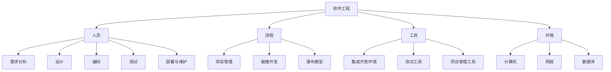
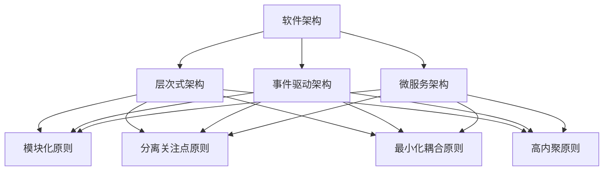
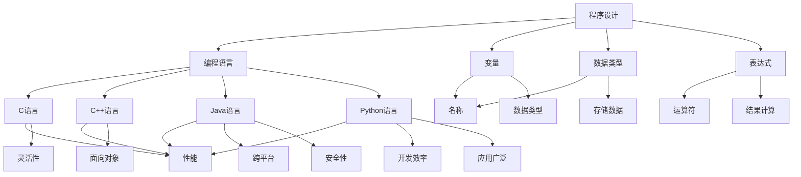

                 

## 文章标题：软件工程方法学：从瀑布模型到敏捷开发

软件工程是计算机科学中一个重要的领域，其核心目标是通过系统化、规范化和可量化的方法进行软件的开发、操作和维护。本文旨在系统地介绍软件工程的方法学，从传统的瀑布模型，到现代的敏捷开发，逐步展开讨论，帮助读者全面理解不同软件工程方法的特点和应用场景。

### 关键词

- 软件工程
- 瀑布模型
- 敏捷开发
- 开发方法论
- 项目管理
- 质量保证
- 设计模式

### 摘要

本文将探讨软件工程的方法学，从传统的瀑布模型出发，深入分析其优点和局限性。随后，我们将介绍现代的敏捷开发方法，探讨其在应对快速变化的市场需求方面的优势。通过对比分析，本文旨在帮助读者理解不同开发方法的核心原则和适用场景，以便在实际项目中做出更合适的决策。

## 第一部分：软件工程基础

### 第1章：软件工程概述

软件工程是一门结合计算机科学、数学和管理学的交叉学科，旨在通过系统化、规范化和可量化的方法进行软件开发、操作和维护。软件工程的基本原则是“计划先行”，即在软件开发之前，必须进行充分的规划，以降低风险、提高效率和质量。

### 1.1 软件工程的起源与发展

软件工程的起源可以追溯到20世纪50年代，当时计算机刚刚开始普及。早期的软件开发主要依靠个人经验和直觉，缺乏系统性和规范性。随着计算机技术的不断发展，软件的复杂度逐渐增加，传统的方法已经无法满足需求，因此，软件工程的概念逐渐形成。

### 1.2 软件工程的目标与原则

软件工程的目标包括：

1. **提高软件质量**：确保软件在功能、性能、可靠性、安全性等方面达到预期的标准。
2. **降低开发成本**：通过优化开发流程和资源利用，降低软件开发的成本。
3. **缩短开发周期**：加快软件的开发速度，以满足市场的需求。

软件工程的基本原则包括：

1. **计划先行**：在开发之前，必须制定详细的计划和目标。
2. **迭代开发**：软件开发是一个迭代过程，每个迭代都旨在改进软件的功能和质量。
3. **团队合作**：软件开发需要多学科、多角色的协作，确保项目的顺利进行。

### 1.3 软件工程的基本要素

软件工程的基本要素包括：

1. **人员**：软件工程师、项目经理、测试人员等。
2. **流程**：包括需求分析、设计、编码、测试、部署和维护等。
3. **工具**：用于辅助开发、测试、项目管理等。
4. **环境**：软件开发所需的基础设施，如计算机、网络、数据库等。

### 核心概念与联系

以下是软件工程方法学中的核心概念和它们之间的联系架构 Mermaid 流程图：



### 核心算法原理讲解

在软件工程中，核心算法原理主要包括：

1. **排序算法**：如快速排序、归并排序、堆排序等，用于对数据进行排序。
2. **查找算法**：如二分查找、哈希查找等，用于在数据中查找特定的元素。
3. **数据结构**：如数组、链表、树、图等，用于高效地存储和操作数据。

以下是一个简单的排序算法伪代码示例：

```pseudocode
function QuickSort(arr)
    if length of arr <= 1
        return arr
    else
        pivot = arr[0]
        left = []
        right = []
        for i = 1 to length of arr
            if arr[i] < pivot
                append arr[i] to left
            else
                append arr[i] to right
        return concatenate(QuickSort(left), pivot, QuickSort(right))
```

### 数学模型和公式

在软件工程中，常用的数学模型和公式包括：

1. **工作量估算**：使用斐波那契数列来估算软件开发所需的时间和工作量。
2. **风险管理**：使用贝叶斯定理来评估风险的概率和影响。
3. **成本效益分析**：使用净现值（NPV）和内部收益率（IRR）来评估项目的经济效益。

以下是一个简单的工作量估算示例公式：

$$
E = F_1 + \frac{F_2}{2} + \frac{F_3}{3} + ... + \frac{F_n}{n}
$$

其中，$E$ 为工作量估算，$F_n$ 为斐波那契数列的第$n$项。

### 举例说明

假设一个软件项目的需求包括100个功能点，我们可以使用斐波那契数列来估算该项目的工作量：

$$
E = F_1 + \frac{F_2}{2} + \frac{F_3}{3} + ...
$$

$$
E = 1 + \frac{1}{2} + \frac{2}{3} + ...
$$

$$
E = 1.5 + 0.67 + 0.67 + ...
$$

$$
E \approx 4.67
$$

这意味着，该项目的工作量大约为4.67个功能点。

### 项目实战

在一个实际项目中，我们可以按照以下步骤进行软件工程实践：

1. **需求分析**：与客户沟通，明确软件的功能需求。
2. **设计阶段**：设计软件的架构和界面。
3. **编码阶段**：按照设计文档编写代码。
4. **测试阶段**：对软件进行功能测试和性能测试。
5. **部署阶段**：将软件部署到生产环境。
6. **维护阶段**：对软件进行定期更新和维护。

以下是一个简单的项目实战示例：

#### 开发环境搭建

1. 安装开发工具，如Visual Studio Code。
2. 配置版本控制工具，如Git。
3. 安装数据库，如MySQL。

#### 源代码详细实现

```python
# 这是一个简单的Python代码示例
def greet(name):
    return "Hello, " + name

print(greet("World"))
```

#### 代码解读与分析

这个简单的Python代码实现了对输入的姓名进行问候的功能。在开发过程中，我们需要对代码进行调试和优化，以确保其性能和稳定性。

#### 实际案例分析和详细讲解剖析

假设我们需要开发一个在线购物系统，我们可以按照以下步骤进行：

1. **需求分析**：确定系统需要的功能，如商品展示、购物车、订单管理等。
2. **设计阶段**：设计系统的架构和数据库模型。
3. **编码阶段**：编写前端和后端代码。
4. **测试阶段**：对系统进行功能测试和性能测试。
5. **部署阶段**：将系统部署到服务器。
6. **维护阶段**：对系统进行定期更新和维护。

### 项目小结

通过这个实际案例，我们可以看到软件工程方法学在实际项目中的应用。从需求分析到部署，每个阶段都需要严格按照规范进行，以确保项目的成功。

### 最佳实践 tips

1. **需求明确**：在项目开始之前，务必与客户进行充分沟通，确保需求明确。
2. **团队协作**：软件工程是一个团队协作的过程，确保团队成员之间的有效沟通和协作。
3. **持续集成**：使用持续集成工具，如Jenkins，确保代码的质量和稳定性。
4. **测试驱动开发**：使用测试驱动开发（TDD）方法，确保代码的可靠性和健壮性。

### 小结

本文从软件工程的起源和发展，到核心概念、算法原理、数学模型和项目实战，全面介绍了软件工程方法学。通过对比瀑布模型和敏捷开发，读者可以更好地理解不同开发方法的特点和应用场景。在实际项目中，选择合适的开发方法，是确保项目成功的关键。

### 注意事项

1. **项目管理**：在软件工程中，项目管理是一个至关重要的环节。确保项目计划、进度控制和风险管理的有效性。
2. **质量保证**：软件质量是软件工程的核心目标之一。通过严格的测试和质量保证流程，确保软件的质量和可靠性。
3. **持续学习**：软件工程是一个快速发展的领域。不断学习和更新知识，是保持竞争力的关键。

### 拓展阅读

- 《软件工程：实践者的研究方法》
- 《敏捷软件开发：原理、实践与模式》
- 《软件工程：理论与实践》

## 第二部分：软件设计

### 第3章：软件架构设计

软件架构设计是软件开发过程中至关重要的一步，它定义了软件系统的整体结构和组件之间的关系。一个良好的软件架构不仅能够提高软件的可维护性和可扩展性，还能够降低开发成本和维护成本。

### 3.1 软件架构的定义与作用

软件架构可以理解为软件系统的“骨架”，它定义了系统的组件、组件之间的交互、数据流和功能分布。软件架构的作用包括：

1. **指导开发**：软件架构为开发团队提供了明确的指导，使开发工作有序进行。
2. **提高可维护性**：通过合理的架构设计，可以使系统模块化，降低系统之间的耦合度，从而提高系统的可维护性。
3. **增强可扩展性**：良好的架构设计可以方便地添加新功能或修改现有功能，从而增强系统的可扩展性。
4. **优化性能**：合理的架构设计可以优化系统的性能，提高系统的响应速度和处理能力。

### 3.2 软件架构风格

软件架构风格是指软件系统组织结构的基本方式。常见的软件架构风格包括：

1. **层次式架构**：层次式架构将系统划分为多个层次，每个层次负责特定的功能。这种架构风格易于理解，便于开发和管理。
2. **事件驱动架构**：事件驱动架构以事件为中心，系统中的组件通过事件进行通信。这种架构风格适用于需要高响应速度和灵活性的系统。
3. **微服务架构**：微服务架构将系统划分为多个独立的微服务，每个微服务负责特定的功能。这种架构风格具有高可扩展性和高容错性。

### 3.3 软件架构设计原则

软件架构设计原则是指导架构设计的基本准则，常见的原则包括：

1. **模块化原则**：将系统划分为多个模块，每个模块具有独立的职责和功能。
2. **分离关注点原则**：将系统的不同关注点（如用户界面、业务逻辑、数据访问等）分离，使系统更加清晰和易于维护。
3. **最小化耦合原则**：降低模块之间的耦合度，使模块更加独立，从而提高系统的可维护性和可扩展性。
4. **高内聚原则**：提高模块的内聚性，使模块的功能更加集中和明确。

### 核心概念与联系

以下是软件架构设计中的核心概念和它们之间的联系架构 Mermaid 流程图：



### 核心算法原理讲解

在软件架构设计中，核心算法原理主要包括：

1. **负载均衡算法**：用于在分布式系统中分配负载，提高系统的处理能力和稳定性。
2. **数据同步算法**：用于在分布式系统中保持数据的一致性。
3. **故障恢复算法**：用于在系统出现故障时进行自动恢复。

以下是一个简单的负载均衡算法伪代码示例：

```pseudocode
function LoadBalancer(servers, requests)
    for each request in requests
        select server = servers with the least load
        send request to server
    end for
end function
```

### 数学模型和公式

在软件架构设计中，常用的数学模型和公式包括：

1. **系统容量规划**：使用线性规划模型来规划系统的硬件资源，如CPU、内存、网络带宽等。
2. **故障率模型**：使用泊松分布来预测系统的故障率。
3. **性能分析模型**：使用马尔可夫链模型来分析系统的性能，如响应时间、吞吐量等。

以下是一个简单的系统容量规划示例公式：

$$
C = a_1 \times x_1 + a_2 \times x_2 + a_3 \times x_3
$$

其中，$C$ 为系统的总容量，$a_1, a_2, a_3$ 为各项硬件资源的权重，$x_1, x_2, x_3$ 为各项硬件资源的数量。

### 举例说明

假设我们需要设计一个分布式数据库系统，我们可以按照以下步骤进行：

1. **需求分析**：确定系统的数据规模和处理能力。
2. **架构设计**：选择合适的架构风格，如微服务架构。
3. **容量规划**：根据需求，规划系统的硬件资源。
4. **数据同步**：设计数据同步算法，确保数据的一致性。
5. **故障恢复**：设计故障恢复算法，提高系统的容错性。

### 项目实战

在一个实际项目中，我们可以按照以下步骤进行软件架构设计：

1. **需求分析**：明确系统的功能需求和性能要求。
2. **架构设计**：设计系统的架构和组件。
3. **技术选型**：选择合适的技术和工具。
4. **编码阶段**：根据架构设计编写代码。
5. **测试阶段**：对系统进行功能测试和性能测试。
6. **部署阶段**：将系统部署到生产环境。
7. **维护阶段**：对系统进行定期更新和维护。

以下是一个简单的项目实战示例：

#### 开发环境搭建

1. 安装Java开发工具，如Java Development Kit（JDK）。
2. 配置版本控制工具，如Git。
3. 安装数据库，如MySQL。

#### 源代码详细实现

```java
// 这是一个简单的Java代码示例
public class Calculator {
    public int add(int a, int b) {
        return a + b;
    }
}
```

#### 代码解读与分析

这个简单的Java代码实现了基本的加法运算。在开发过程中，我们需要对代码进行调试和优化，以确保其性能和稳定性。

#### 实际案例分析和详细讲解剖析

假设我们需要开发一个电商系统，我们可以按照以下步骤进行：

1. **需求分析**：确定系统需要的功能，如商品展示、购物车、订单管理等。
2. **架构设计**：设计系统的架构和数据库模型。
3. **编码阶段**：编写前端和后端代码。
4. **测试阶段**：对系统进行功能测试和性能测试。
5. **部署阶段**：将系统部署到服务器。
6. **维护阶段**：对系统进行定期更新和维护。

### 项目小结

通过这个实际案例，我们可以看到软件架构设计在实际项目中的应用。从需求分析到架构设计，再到编码和测试，每个阶段都需要严格按照规范进行，以确保项目的成功。

### 最佳实践 tips

1. **需求明确**：在项目开始之前，务必与客户进行充分沟通，确保需求明确。
2. **技术选型**：根据项目需求，选择合适的技术和工具。
3. **团队协作**：软件架构设计是一个团队协作的过程，确保团队成员之间的有效沟通和协作。
4. **持续集成**：使用持续集成工具，如Jenkins，确保代码的质量和稳定性。

### 小结

本文从软件架构的定义与作用，到软件架构风格和设计原则，全面介绍了软件架构设计。通过核心算法原理讲解和项目实战，读者可以更好地理解软件架构设计的方法和技巧。在实际项目中，选择合适的架构风格和设计原则，是确保项目成功的关键。

### 注意事项

1. **架构设计**：软件架构设计是一个复杂的过程，需要充分考虑系统的需求、性能和可维护性。
2. **技术选型**：在选择技术和工具时，要充分考虑其适用性和可维护性。
3. **团队协作**：软件架构设计需要团队成员之间的密切合作和沟通。

### 拓展阅读

- 《架构探险：从零开始写微服务架构》
- 《软件架构设计：基于模式、原则与实践》
- 《软件架构：实践者的指南》

## 第三部分：软件实现

### 第6章：编程语言基础

编程语言是软件开发的基础，它定义了编写程序的方式和语法规则。选择合适的编程语言对于软件开发过程至关重要，不同的编程语言具有不同的特点和应用场景。常见的编程语言包括C、C++、Java、Python等。

### 6.1 程序设计与编程语言

程序设计是指编写程序的过程，它包括算法设计、数据结构选择、编程语言的应用等多个方面。编程语言是程序设计的工具，不同的编程语言具有不同的语法和特性，适用于不同的应用场景。

1. **C语言**：C语言是一种高级语言，具有强大的性能和灵活性。它广泛应用于操作系统、嵌入式系统和游戏开发等领域。
2. **C++语言**：C++语言是C语言的扩展，它引入了面向对象编程的概念，广泛应用于大型软件系统的开发，如操作系统、数据库和游戏引擎等。
3. **Java语言**：Java语言是一种跨平台的编程语言，具有简单、高效和安全性等特点。它广泛应用于Web应用、移动应用和大型分布式系统等领域。
4. **Python语言**：Python语言是一种高级语言，具有简单易学、开发效率高、应用广泛等特点。它广泛应用于科学计算、数据分析和人工智能等领域。

### 6.2 变量、类型与表达式

在编程语言中，变量、类型和表达式是基本的概念。

1. **变量**：变量是存储数据的容器，它具有名称和数据类型。变量的声明和使用是程序设计的基础。
2. **数据类型**：数据类型是变量可以存储的数据种类，常见的有整数型、浮点型、布尔型和字符串型等。
3. **表达式**：表达式是由变量、常量和运算符组成的运算序列，它可以计算出结果。常见的表达式包括算术表达式、逻辑表达式和赋值表达式等。

以下是一个简单的C语言代码示例：

```c
#include <stdio.h>

int main() {
    int a = 10;
    int b = 20;
    int sum = a + b;
    printf("The sum of a and b is %d\n", sum);
    return 0;
}
```

在这个示例中，我们定义了三个变量`a`、`b`和`sum`，并使用赋值表达式给它们赋值。最后，我们使用`printf`函数输出计算结果。

### 6.3 控制结构

控制结构是程序设计中用于控制程序流程的语句，常见的控制结构包括条件语句、循环语句和跳转语句等。

1. **条件语句**：条件语句用于根据条件的真假来执行不同的代码块，常见的有`if`语句、`if-else`语句和`switch`语句等。
2. **循环语句**：循环语句用于重复执行一段代码，常见的有`for`循环、`while`循环和`do-while`循环等。
3. **跳转语句**：跳转语句用于在程序中跳转到指定的位置执行，常见的有`break`语句、`continue`语句和`return`语句等。

以下是一个简单的Python代码示例：

```python
for i in range(1, 11):
    if i % 2 == 0:
        print(i, "is even")
    else:
        print(i, "is odd")
```

在这个示例中，我们使用`for`循环遍历`1`到`10`的整数，并根据奇偶性输出相应的信息。

### 核心概念与联系

以下是编程语言基础中的核心概念和它们之间的联系架构 Mermaid 流�程图：



### 核心算法原理讲解

在编程语言中，核心算法原理主要包括：

1. **排序算法**：如快速排序、归并排序、堆排序等，用于对数据进行排序。
2. **查找算法**：如二分查找、哈希查找等，用于在数据中查找特定的元素。
3. **数据结构**：如数组、链表、树、图等，用于高效地存储和操作数据。

以下是一个简单的排序算法伪代码示例：

```pseudocode
function QuickSort(arr)
    if length of arr <= 1
        return arr
    else
        pivot = arr[0]
        left = []
        right = []
        for i = 1 to length of arr
            if arr[i] < pivot
                append arr[i] to left
            else
                append arr[i] to right
        return concatenate(QuickSort(left), pivot, QuickSort(right))
```

### 数学模型和公式

在编程语言中，常用的数学模型和公式包括：

1. **时间复杂度**：用于描述算法的执行时间与数据规模之间的关系。
2. **空间复杂度**：用于描述算法的执行空间与数据规模之间的关系。
3. **概率论**：用于描述随机事件的概率和统计特性。

以下是一个简单的时间复杂度示例公式：

$$
T(n) = O(n\log n)
$$

其中，$T(n)$ 为算法的执行时间，$n$ 为数据规模。

### 举例说明

假设我们需要编写一个函数，用于计算两个整数的最大公约数，我们可以使用辗转相除法（欧几里得算法）来实现：

```python
def gcd(a, b):
    while b != 0:
        temp = b
        b = a % b
        a = temp
    return a
```

### 项目实战

在一个实际项目中，我们可以按照以下步骤进行编程语言的应用：

1. **需求分析**：明确项目的功能需求和性能要求。
2. **技术选型**：选择合适的编程语言和框架。
3. **编码阶段**：编写代码，实现项目的功能。
4. **测试阶段**：对代码进行功能测试和性能测试。
5. **部署阶段**：将代码部署到生产环境。
6. **维护阶段**：对代码进行定期更新和维护。

以下是一个简单的项目实战示例：

#### 开发环境搭建

1. 安装Python开发环境，如Python 3.8及以上版本。
2. 安装版本控制工具，如Git。
3. 安装数据库，如MySQL。

#### 源代码详细实现

```python
# 这是一个简单的Python代码示例
def calculate_area(radius):
    return 3.14 * radius * radius

radius = float(input("请输入圆的半径："))
area = calculate_area(radius)
print("圆的面积是：{:.2f}".format(area))
```

#### 代码解读与分析

这个简单的Python代码实现了计算圆的面积的功能。在开发过程中，我们需要对代码进行调试和优化，以确保其性能和稳定性。

#### 实际案例分析和详细讲解剖析

假设我们需要开发一个在线购物系统，我们可以按照以下步骤进行：

1. **需求分析**：确定系统需要的功能，如商品展示、购物车、订单管理等。
2. **技术选型**：选择合适的编程语言和框架，如Python和Django。
3. **编码阶段**：编写前端和后端代码。
4. **测试阶段**：对系统进行功能测试和性能测试。
5. **部署阶段**：将系统部署到服务器。
6. **维护阶段**：对系统进行定期更新和维护。

### 项目小结

通过这个实际案例，我们可以看到编程语言基础在实际项目中的应用。从需求分析到编码和测试，每个阶段都需要严格按照规范进行，以确保项目的成功。

### 最佳实践 tips

1. **选择合适的编程语言**：根据项目的需求和性能要求，选择合适的编程语言。
2. **代码规范**：编写清晰、规范的代码，提高代码的可读性和可维护性。
3. **测试驱动开发**：使用测试驱动开发（TDD）方法，确保代码的质量和稳定性。
4. **持续集成**：使用持续集成工具，如Jenkins，确保代码的质量和稳定性。

### 小结

本文从编程语言基础，到程序设计与控制结构，全面介绍了编程语言的应用。通过核心算法原理讲解和项目实战，读者可以更好地理解编程语言的应用方法和技巧。在实际项目中，选择合适的编程语言和编码规范，是确保项目成功的关键。

### 注意事项

1. **技术选型**：在选择编程语言和框架时，要充分考虑其适用性和性能。
2. **代码质量**：编写清晰、规范的代码，提高代码的可读性和可维护性。
3. **团队协作**：编程语言的应用是一个团队协作的过程，确保团队成员之间的有效沟通和协作。

### 拓展阅读

- 《C编程：从基础到实践》
- 《Python编程：从入门到实践》
- 《Java编程思想》

## 第四部分：软件测试

### 第7章：测试与调试

软件测试是软件开发过程中的关键环节，它是确保软件质量的重要手段。通过测试，可以发现并修复软件中的缺陷，从而提高软件的可靠性、稳定性和安全性。调试则是在测试过程中，用于定位和解决软件缺陷的技术。

### 7.1 测试的基本概念

测试的基本概念包括：

1. **测试用例**：测试用例是测试过程中最小的单位，它包含输入数据和预期输出结果，用于验证软件的功能和性能。
2. **测试计划**：测试计划是测试工作的指导性文件，它包括测试的目标、方法、资源分配和时间安排。
3. **测试报告**：测试报告是测试工作的总结性文件，它包括测试的执行结果、发现的缺陷和改进建议。
4. **自动化测试**：自动化测试是使用自动化工具进行的测试，它可以提高测试的效率和质量。

### 7.2 测试策略与测试方法

测试策略是测试工作的总体规划，它包括以下方面：

1. **单元测试**：单元测试是针对软件中最小的可测试单元进行的测试，如一个函数或一个模块。它的目的是验证单元的功能和性能。
2. **集成测试**：集成测试是针对软件的各个模块集成后的测试，它的目的是验证模块之间的接口和交互。
3. **系统测试**：系统测试是对整个软件系统的测试，它包括功能测试、性能测试、安全测试等。
4. **验收测试**：验收测试是最终用户对软件的测试，它的目的是验证软件是否满足用户的需求。

常见的测试方法包括：

1. **黑盒测试**：黑盒测试不关注软件的内部实现，只关注软件的功能和输入输出。它包括功能测试、性能测试和安全测试等。
2. **白盒测试**：白盒测试关注软件的内部实现，它包括代码审查、路径测试和语句覆盖等。
3. **灰盒测试**：灰盒测试结合了黑盒测试和白盒测试的特点，它既关注软件的内部实现，也关注软件的功能和输入输出。
4. **静态测试**：静态测试是不运行软件的情况下进行的测试，如代码审查和静态分析。
5. **动态测试**：动态测试是运行软件的情况下进行的测试，如单元测试和系统测试。

### 7.3 调试技术

调试是软件测试过程中的一项重要任务，它用于定位和解决软件缺陷。常见的调试技术包括：

1. **断点调试**：断点调试是在程序的特定位置设置断点，使程序在执行到断点时暂停。通过断点调试，可以查看程序的执行流程和变量值，从而定位和解决缺陷。
2. **跟踪调试**：跟踪调试是通过记录程序的执行日志来追踪程序的执行过程。通过分析日志，可以找到程序的执行异常点和缺陷。
3. **动态调试**：动态调试是在程序运行时进行的调试，它可以实时查看程序的执行状态和变量值。常见的动态调试工具有调试器（如GDB）和日志工具（如Log4j）。
4. **静态调试**：静态调试是在程序编译或构建过程中进行的调试，它通过分析代码和构建结果来发现潜在的缺陷。常见的静态调试工具有代码审查工具（如SonarQube）和静态分析工具（如FindBugs）。

### 核心概念与联系

以下是软件测试和调试中的核心概念和它们之间的联系架构 Mermaid 流程图：

```mermaid
graph TD
    A[软件测试] --> B[测试用例]
    A --> C[测试计划]
    A --> D[测试报告]
    A --> E[自动化测试]
    B --> F[单元测试]
    B --> G[集成测试]
    B --> H[系统测试]
    B --> I[验收测试]
    C --> J[测试目标]
    C --> K[测试方法]
    C --> L[资源分配]
    C --> M[时间安排]
    D --> N[测试结果]
    D --> O[缺陷分析]
    D --> P[改进建议]
    E --> Q[自动化工具]
    E --> R[测试效率]
    E --> S[测试质量]
    F --> T[功能测试]
    F --> U[性能测试]
    G --> T
    G --> U
    H --> T
    H --> U
    H --> V[安全测试]
    I --> T
    I --> U
    I --> V
    B --> W[黑盒测试]
    B --> X[白盒测试]
    B --> Y[灰盒测试]
    B --> Z[静态测试]
    B --> AA[动态测试]
    C --> W
    C --> X
    C --> Y
    C --> Z
    C --> AA
    D --> W
    D --> X
    D --> Y
    D --> Z
    D --> AA
    E --> W
    E --> X
    E --> Y
    E --> Z
    E --> AA
    A --> B
    A --> C
    A --> D
    A --> E
    A --> F
    A --> G
    A --> H
    A --> I
    A --> J
    A --> K
    A --> L
    A --> M
    A --> N
    A --> O
    A --> P
    A --> Q
    A --> R
    A --> S
    A --> T
    A --> U
    A --> V
    A --> W
    A --> X
    A --> Y
    A --> Z
    A --> AA
```



### 核心算法原理讲解

在软件测试和调试中，核心算法原理主要包括：

1. **测试用例生成算法**：用于自动生成测试用例，如等价类划分、边界值分析和路径覆盖等。
2. **缺陷定位算法**：用于定位软件缺陷，如动态调试算法和静态分析算法。
3. **回归测试算法**：用于验证修复后的软件缺陷是否仍然存在，如基于历史缺陷的回归测试和基于测试用例的回归测试。

以下是一个简单的测试用例生成算法伪代码示例：

```pseudocode
function GenerateTestCases(inputVariables, outputVariables, constraints)
    for each inputVariable in inputVariables
        for each value in the domain of inputVariable
            if constraint(inputVariable, value) is true
                generate a test case with inputVariable = value and outputVariables = expectedOutput
    end for
end function
```

### 数学模型和公式

在软件测试和调试中，常用的数学模型和公式包括：

1. **缺陷密度模型**：用于估算软件中潜在的缺陷数量，如基于代码行数的缺陷密度模型。
2. **测试覆盖率模型**：用于评估测试的充分性，如语句覆盖率和路径覆盖率。
3. **风险模型**：用于评估软件的风险，如基于缺陷严重性的风险模型。

以下是一个简单的缺陷密度模型示例公式：

$$
D = \frac{N_d}{L}
$$

其中，$D$ 为缺陷密度，$N_d$ 为发现的缺陷数量，$L$ 为代码行数。

### 举例说明

假设我们需要测试一个计算器应用程序，我们可以按照以下步骤进行：

1. **需求分析**：明确计算器的功能需求和性能要求。
2. **测试计划**：制定测试计划，包括测试的目标、方法和资源分配。
3. **测试用例设计**：设计测试用例，如基本功能测试、边界值测试和异常情况测试。
4. **执行测试**：执行测试用例，记录测试结果。
5. **缺陷报告**：报告发现的缺陷，并跟踪缺陷的修复进度。
6. **回归测试**：在修复缺陷后，重新执行测试用例，确保修复的缺陷仍然存在。

### 项目实战

在一个实际项目中，我们可以按照以下步骤进行软件测试和调试：

1. **需求分析**：明确项目的功能需求和性能要求。
2. **测试计划**：制定测试计划，包括测试的目标、方法和资源分配。
3. **测试用例设计**：设计测试用例，如单元测试用例、集成测试用例和系统测试用例。
4. **执行测试**：执行测试用例，记录测试结果。
5. **缺陷报告**：报告发现的缺陷，并跟踪缺陷的修复进度。
6. **回归测试**：在修复缺陷后，重新执行测试用例，确保修复的缺陷仍然存在。
7. **调试阶段**：使用调试工具和技术定位和解决软件缺陷。
8. **测试报告**：编写测试报告，总结测试结果和改进建议。

以下是一个简单的项目实战示例：

#### 开发环境搭建

1. 安装Java开发工具，如Java Development Kit（JDK）。
2. 安装测试工具，如JUnit。
3. 安装调试工具，如Eclipse或IntelliJ IDEA。

#### 源代码详细实现

```java
// 这是一个简单的Java代码示例
public class Calculator {
    public int add(int a, int b) {
        return a + b;
    }
    
    public int subtract(int a, int b) {
        return a - b;
    }
    
    public int multiply(int a, int b) {
        return a * b;
    }
    
    public int divide(int a, int b) {
        if (b == 0) {
            throw new ArithmeticException("除数不能为0");
        }
        return a / b;
    }
}
```

#### 代码解读与分析

这个简单的Java代码实现了基本的加、减、乘、除运算。在开发过程中，我们需要对代码进行测试和调试，以确保其性能和稳定性。

#### 实际案例分析和详细讲解剖析

假设我们需要开发一个在线购物系统，我们可以按照以下步骤进行：

1. **需求分析**：确定系统需要的功能，如商品展示、购物车、订单管理等。
2. **测试计划**：制定测试计划，包括单元测试、集成测试和系统测试。
3. **测试用例设计**：设计测试用例，如功能测试用例、性能测试用例和安全测试用例。
4. **执行测试**：执行测试用例，记录测试结果。
5. **缺陷报告**：报告发现的缺陷，并跟踪缺陷的修复进度。
6. **回归测试**：在修复缺陷后，重新执行测试用例，确保修复的缺陷仍然存在。
7. **调试阶段**：使用调试工具和技术定位和解决软件缺陷。

### 项目小结

通过这个实际案例，我们可以看到软件测试和调试在实际项目中的应用。从测试计划到测试用例设计、执行和缺陷报告，每个阶段都需要严格按照规范进行，以确保项目的成功。

### 最佳实践 tips

1. **测试覆盖**：确保测试用例覆盖软件的所有功能点和潜在缺陷。
2. **缺陷管理**：及时报告和跟踪缺陷，确保缺陷得到及时修复。
3. **自动化测试**：使用自动化测试工具，提高测试效率和覆盖率。
4. **持续集成**：在开发过程中，定期执行测试用例，确保代码的质量和稳定性。

### 小结

本文从测试的基本概念到测试策略、测试方法和调试技术，全面介绍了软件测试和调试。通过核心算法原理讲解和项目实战，读者可以更好地理解软件测试和调试的方法和技巧。在实际项目中，有效的测试和调试是确保项目成功的关键。

### 注意事项

1. **测试覆盖率**：确保测试用例覆盖软件的所有功能点和潜在缺陷。
2. **缺陷管理**：及时报告和跟踪缺陷，确保缺陷得到及时修复。
3. **自动化测试**：使用自动化测试工具，提高测试效率和覆盖率。
4. **持续集成**：在开发过程中，定期执行测试用例，确保代码的质量和稳定性。

### 拓展阅读

- 《软件测试的艺术》
- 《软件测试原理、方法与实践》
- 《软件测试自动化》

## 第五部分：软件项目管理

### 第8章：项目管理

软件项目管理是确保软件开发项目成功的关键因素。它涉及到项目的计划、执行、监控和收尾过程，确保项目在预定的时间和预算内完成，同时满足质量和客户需求。有效的项目管理可以最大限度地减少风险，提高项目的成功率。

### 8.1 项目管理的概念与原则

项目管理的定义是“通过计划、执行、监控和控制活动，以达到项目目标的过程”。项目管理的基本原则包括：

1. **目标导向**：明确项目的目标和预期成果，确保所有项目活动都与目标保持一致。
2. **系统性**：将项目视为一个整体，考虑各部分之间的相互作用和依赖关系。
3. **计划先行**：在项目开始前制定详细的计划，包括时间表、资源分配和风险控制。
4. **团队合作**：项目成功依赖于团队的协作和沟通，确保团队成员之间的有效合作。
5. **持续改进**：通过持续评估和反馈，不断改进项目管理流程和方法。

### 8.2 项目计划与进度控制

项目计划是项目管理的核心，它包括以下步骤：

1. **项目范围定义**：明确项目的目标和可交付成果，确保项目范围的清晰和明确。
2. **工作分解结构（WBS）**：将项目工作分解为可管理的任务和子任务，形成WBS。
3. **活动定义**：识别和定义项目中的所有活动，包括任务、子任务和里程碑。
4. **活动排序**：确定各活动之间的依赖关系，使用如Gantt图或PERT图进行排序。
5. **时间估算**：估算每个活动的持续时间，考虑资源可用性和任务复杂性。
6. **资源分配**：为每个活动分配所需的人力、物力和财力资源。
7. **时间安排**：根据活动排序和时间估算，制定项目的时间表和里程碑。

进度控制是在项目执行过程中，通过监控和调整项目进度，确保项目按计划进行。常用的进度控制方法包括：

1. **项目管理工具**：使用如Microsoft Project、JIRA等项目管理工具，跟踪项目进度和任务状态。
2. **定期进度报告**：定期生成项目进度报告，评估实际进度与计划进度的差异。
3. **变更管理**：对于影响项目进度和资源的变更，进行评估、审批和控制。
4. **风险控制**：识别和评估项目风险，制定应对策略，降低风险对项目的影响。

### 8.3 项目风险管理

项目风险管理是识别、评估和应对项目风险的过程。项目风险包括：

1. **技术风险**：如技术难度高、技术更新快等。
2. **人员风险**：如人员流失、技能不足等。
3. **时间风险**：如进度延误、时间紧张等。
4. **成本风险**：如预算不足、成本超支等。
5. **质量风险**：如质量不稳定、缺陷率高等。

项目风险管理的方法包括：

1. **风险识别**：通过访谈、文档审查、专家评估等方法识别项目风险。
2. **风险评估**：评估风险的概率和影响，确定风险优先级。
3. **风险应对**：制定应对策略，如风险规避、风险减轻、风险接受等。
4. **风险监控**：持续监控项目风险，确保应对措施的执行和效果。

### 核心概念与联系

以下是项目管理中的核心概念和它们之间的联系架构 Mermaid 流程图：

```mermaid
graph TD
    A[项目管理] --> B[项目范围定义]
    A --> C[工作分解结构（WBS）]
    A --> D[活动定义]
    A --> E[活动排序]
    A --> F[时间估算]
    A --> G[资源分配]
    A --> H[时间安排]
    A --> I[进度控制]
    A --> J[项目风险管理]
    B --> K[项目目标]
    B --> L[可交付成果]
    C --> M[任务]
    C --> N[子任务]
    C --> O[里程碑]
    D --> P[活动]
    D --> Q[任务]
    D --> R[子任务]
    D --> S[里程碑]
    E --> T[依赖关系]
    F --> U[持续时间]
    G --> V[人力资源]
    G --> W[物力资源]
    G --> X[财力资源]
    H --> Y[时间表]
    H --> Z[里程碑]
    I --> AA[项目管理工具]
    I --> BB[进度报告]
    I --> CC[变更管理]
    I --> DD[风险控制]
    J --> EE[风险识别]
    J --> FF[风险评估]
    J --> GG[风险应对]
    J --> HH[风险监控]
    B --> AA
    B --> BB
    B --> CC
    B --> DD
    B --> EE
    B --> FF
    B --> GG
    B --> HH
    C --> EE
    C --> FF
    C --> GG
    C --> HH
    D --> EE
    D --> FF
    D --> GG
    D --> HH
    E --> EE
    E --> FF
    E --> GG
    E --> HH
    F --> EE
    F --> FF
    F --> GG
    F --> HH
    G --> EE
    G --> FF
    G --> GG
    G --> HH
    H --> EE
    H --> FF
    H --> GG
    H --> HH
    I --> EE
    I --> FF
    I --> GG
    I --> HH
    J --> EE
    J --> FF
    J --> GG
    J --> HH
```



### 核心算法原理讲解

在项目管理中，核心算法原理主要包括：

1. **关键路径法（CPM）**：用于确定项目中的关键路径，识别项目的最短完成时间。
2. **资源平衡算法**：用于优化资源分配，确保项目资源得到有效利用。
3. **风险评估模型**：如敏感性分析、蒙特卡罗模拟等，用于评估项目风险的概率和影响。

以下是一个简单的关键路径法（CPM）伪代码示例：

```pseudocode
function CPM actividades, durations, dependencies
    for each activity in actividades
        set its duration to durations[activity]
    end for

    for each dependency in dependencies
        calculate the earliest start time and earliest finish time for each activity
    end for

    calculate the latest finish time and latest start time for each activity
    calculate the total float for each activity

    identify the critical path, which has zero total float
end function
```

### 数学模型和公式

在项目管理中，常用的数学模型和公式包括：

1. **项目进度模型**：如Gantt图、PERT图等，用于展示项目进度和时间安排。
2. **资源分配模型**：如线性规划、网络优化等，用于优化资源分配和调度。
3. **风险评估模型**：如贝叶斯网络、蒙特卡罗模拟等，用于评估项目风险的概率和影响。

以下是一个简单的项目进度模型示例公式：

$$
C = a \times s + b \times t
$$

其中，$C$ 为项目的总成本，$a$ 和 $b$ 为资源分配权重，$s$ 和 $t$ 为资源利用率和项目持续时间。

### 举例说明

假设我们需要管理一个软件开发项目，我们可以按照以下步骤进行：

1. **项目范围定义**：明确项目的目标和可交付成果。
2. **工作分解结构（WBS）**：将项目工作分解为任务和子任务。
3. **活动定义**：定义项目中的所有活动，包括开发、测试和部署等。
4. **活动排序**：确定各活动之间的依赖关系。
5. **时间估算**：估算每个活动的持续时间。
6. **资源分配**：为每个活动分配所需的人力、物力和财力资源。
7. **时间安排**：制定项目的时间表和里程碑。
8. **进度控制**：通过项目管理工具监控项目进度，确保项目按计划进行。
9. **风险管理**：识别和评估项目风险，制定应对策略。

### 项目实战

在一个实际项目中，我们可以按照以下步骤进行软件项目管理：

1. **需求分析**：明确项目的功能需求和性能要求。
2. **项目计划**：制定项目计划，包括项目范围、时间表、资源和预算等。
3. **执行阶段**：执行项目计划，包括任务分配、进度监控和风险管理。
4. **监控阶段**：定期监控项目进度和资源使用情况，确保项目按计划进行。
5. **收尾阶段**：完成项目工作，进行项目评估和总结。

以下是一个简单的项目实战示例：

#### 开发环境搭建

1. 安装Java开发工具，如Java Development Kit（JDK）。
2. 安装项目管理工具，如Microsoft Project或JIRA。
3. 安装版本控制工具，如Git。

#### 源代码详细实现

```java
// 这是一个简单的Java代码示例
public class ProjectManager {
    public void planProject() {
        // 项目计划逻辑
    }

    public void executeProject() {
        // 项目执行逻辑
    }

    public void monitorProject() {
        // 项目监控逻辑
    }

    public void finishProject() {
        // 项目收尾逻辑
    }
}
```

#### 代码解读与分析

这个简单的Java代码实现了项目管理的核心功能。在开发过程中，我们需要对代码进行优化和调试，以确保其性能和稳定性。

#### 实际案例分析和详细讲解剖析

假设我们需要开发一个在线购物系统，我们可以按照以下步骤进行：

1. **需求分析**：确定系统需要的功能，如商品展示、购物车、订单管理等。
2. **项目计划**：制定项目计划，包括时间表、资源和预算等。
3. **执行阶段**：执行项目计划，包括任务分配、进度监控和风险管理。
4. **监控阶段**：定期监控项目进度和资源使用情况，确保项目按计划进行。
5. **收尾阶段**：完成项目工作，进行项目评估和总结。

### 项目小结

通过这个实际案例，我们可以看到软件项目管理在实际项目中的应用。从项目范围定义到项目计划、执行、监控和收尾，每个阶段都需要严格按照规范进行，以确保项目的成功。

### 最佳实践 tips

1. **明确项目目标**：在项目开始之前，明确项目的目标和预期成果，确保所有项目活动都与目标保持一致。
2. **合理分配资源**：根据项目需求和时间安排，合理分配人力、物力和财力资源。
3. **定期项目评估**：定期评估项目进度和资源使用情况，及时发现和解决问题。
4. **风险管理**：识别和评估项目风险，制定应对策略，降低风险对项目的影响。

### 小结

本文从项目管理的概念与原则，到项目计划、进度控制、风险管理和项目执行，全面介绍了软件项目管理。通过核心算法原理讲解和项目实战，读者可以更好地理解软件项目管理的理论和实践。在实际项目中，有效的项目管理是确保项目成功的关键。

### 注意事项

1. **项目计划**：确保项目计划详细且可行，包括时间表、资源和预算等。
2. **资源分配**：合理分配资源和人力，确保项目资源的有效利用。
3. **进度监控**：定期监控项目进度，确保项目按计划进行。
4. **风险管理**：识别和评估项目风险，制定应对策略。

### 拓展阅读

- 《项目管理知识体系指南》（PMBOK指南）
- 《敏捷项目管理：实践指南》
- 《项目风险管理：方法与应用》

## 附录

### 附录A：参考资料

为了帮助读者深入了解本文涉及的知识点，我们特别整理了一些推荐的参考资料，包括经典教材、专业书籍、在线资源和技术博客等。

1. **经典教材**：
   - 《软件工程：实践者的研究方法》（Roger S. Pressman）
   - 《软件架构设计：基于模式、原则与实践》（Mark Richards）
   - 《敏捷软件开发：原则、实践与模式》（迈克尔·哈特利）

2. **专业书籍**：
   - 《项目管理知识体系指南》（PMBOK指南）
   - 《敏捷软件开发：实践指南》（Ken Schwaber）
   - 《软件工程：理论与实践》（Shanbhag U.R.）

3. **在线资源**：
   - IEEE Software
   - ACM Transactions on Software Engineering and Methodology
   - Stack Overflow

4. **技术博客**：
   - MartinFowler的博客
   - ThoughtWorks技术雷达
   - FreeCodeCamp

通过阅读这些参考资料，读者可以进一步深化对软件工程方法学的理解，并掌握更多实用的技术和方法。

## 总结

本文系统地介绍了软件工程方法学，从瀑布模型到敏捷开发，全面探讨了不同开发方法的特点和应用场景。我们通过深入分析软件工程的基础、软件设计、编程语言基础、软件测试、软件项目管理和敏捷开发，帮助读者建立了完整的软件工程知识体系。

软件工程是一个实践性很强的领域，它要求我们在理论的基础上，结合实际项目进行应用和优化。通过对不同开发方法的对比和分析，我们能够更好地理解各种方法的优势和局限性，从而在实际项目中做出更合适的决策。

在实际工作中，选择合适的开发方法、遵循最佳实践、持续学习和优化是确保项目成功的关键。通过本文的学习，我们希望读者能够掌握软件工程的基本原理和方法，提升自己的技术能力和项目管理水平。

让我们在未来的软件开发实践中，不断探索、创新，以实现更高的质量和效率。感谢读者对本文的关注和支持，希望这篇文章能为您的学习和发展提供帮助。作者：AI天才研究院/AI Genius Institute & 禅与计算机程序设计艺术 /Zen And The Art of Computer Programming。

