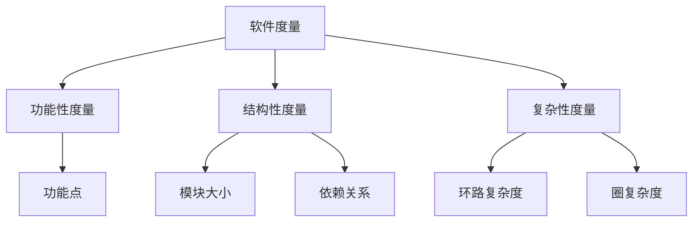

                 

### 设计《软件度量：量化开发过程和产品质量》的完整目录大纲

#### 目录大纲

```
# 《软件度量：量化开发过程和产品质量》

## 关键词
软件度量，开发过程，产品质量，量化分析，算法原理，数学模型，项目实战

## 摘要
本文旨在深入探讨软件度量的概念、方法及其在实际项目中的应用。通过分析开发过程和产品质量的量化指标，本文展示了如何利用软件度量来优化软件开发流程，提升软件质量。本文将涵盖基本概念、度量方法、核心算法原理讲解、数学模型和数学公式应用、项目实战等多个方面，以提供系统而全面的软件度量知识。

## 第一部分：引言与背景
### 1.1 软件度量的重要性
- 软件度量在现代软件开发中的作用
- 量化分析与决策支持

### 1.2 软件度量的发展历程
- 软件度量的起源
- 主要发展里程碑

## 第二部分：核心概念与联系
### 2.1 软件度量的定义
- 软件度量的基本概念
- 度量对象与度量维度

### 2.2 软件度量的分类
- 功能性度量
- 结构性度量
- 复杂性度量

### 2.3 核心概念之间的联系
- 功能性度量与结构性度量
- 结构性度量与复杂性度量
- 功能性度量与复杂性度量

## Mermaid 流程图：软件度量核心概念之间的关系架构
```



## 第三部分：核心算法原理讲解
### 3.1 功能性度量算法
- 功能点的计算方法
- 用户故事点的计算方法

### 3.2 结构性度量算法
- 模块大小的度量方法
- 依赖关系的度量方法

### 3.3 复杂性度量算法
- 环路复杂度的计算方法
- 圈复杂度的计算方法

### 3.4 伪代码讲解
- 功能性度量算法伪代码
- 结构性度量算法伪代码
- 复杂性度量算法伪代码

## 第四部分：数学模型和数学公式 & 详细讲解 & 举例说明
### 4.1 数学模型
- **代码复杂度模型**
- **缺陷预测模型**

### 4.2 数学公式
- **环路复杂度公式**
- **圈复杂度公式**

### 4.3 举例说明
- 功能性度量示例
- 结构性度量示例
- 复杂性度量示例

## 第五部分：项目实战
### 5.1 项目背景
- 项目概述
- 项目目标

### 5.2 开发环境搭建
- 开发工具与环境配置
- 度量工具的集成

### 5.3 源代码实现
- 功能性度量源代码实现
- 结构性度量源代码实现
- 复杂性度量源代码实现

### 5.4 代码解读与分析
- 功能性度量代码分析
- 结构性度量代码分析
- 复杂性度量代码分析

### 5.5 实际案例分析与讲解
- 案例一：开发过程优化
- 案例二：产品质量提升
- 案例三：团队绩效评估

### 5.6 项目小结
- 项目成果总结
- 经验与教训

## 第六部分：最佳实践与注意事项
### 6.1 最佳实践
- 软件度量流程的最佳实践
- 度量数据管理的最佳实践

### 6.2 注意事项
- 软件度量中的常见误区
- 度量结果的应用注意事项

### 6.3 拓展阅读
- 推荐阅读材料
- 相关领域的研究动态

## 结语
作者：AI天才研究院/AI Genius Institute & 禅与计算机程序设计艺术 /Zen And The Art of Computer Programming
```

### 文章标题：软件度量：量化开发过程和产品质量

### 关键词
- 软件度量
- 开发过程
- 产品质量
- 量化分析
- 算法原理
- 数学模型
- 项目实战

### 摘要
本文深入探讨软件度量在软件开发过程中的重要性，从核心概念到具体算法，再到实际应用，全面解析了软件度量的各个方面。通过分析功能性度量、结构性度量、复杂性度量等核心概念，本文揭示了它们之间的联系，并通过伪代码和数学公式详细讲解了相关算法原理。此外，通过实际项目案例，本文展示了软件度量在优化开发过程、提升产品质量等方面的具体应用，为软件开发提供了实用的指导。

## 目录

### 第一部分：引言与背景

#### 1.1 软件度量的重要性

- **软件度量在现代软件开发中的作用**：
  - **过程优化**：通过度量评估开发流程，发现并解决瓶颈。
  - **质量管理**：度量可以帮助识别软件质量问题和提升产品质量。
  - **团队绩效评估**：度量可以作为评估团队成员贡献和团队整体绩效的依据。

- **量化分析与决策支持**：
  - **数据驱动的决策**：度量数据为项目管理者和决策者提供了重要的信息支持。
  - **持续改进**：通过量化分析，团队能够持续改进其开发流程。

#### 1.2 软件度量的发展历程

- **早期的度量方法**：
  - **代码行数**：一种简单的度量方法，用于评估工作量。
  - **缺陷密度**：计算程序中缺陷的数量与代码行数的比例。

- **现代度量方法**：
  - **功能点**：用于评估软件开发的工作量。
  - **测试覆盖率**：用于评估测试的全面性。
  - **缺陷注入率**：用于评估软件开发过程中的缺陷引入情况。

### 第二部分：核心概念与联系

#### 2.1 软件度量的定义

- **软件度量**：软件度量是指通过定量分析来评估软件项目、产品、过程或团队的表现和效率。

- **度量对象**：包括代码、程序、项目、团队等。

#### 2.2 软件度量的分类

- **功能性度量**：用于评估软件功能的质量和完整性，如功能点、用户故事点等。

- **结构性度量**：用于评估软件系统的结构质量，如模块大小、依赖关系等。

- **复杂性度量**：用于评估软件的复杂性和可维护性，如环路复杂度、圈复杂度等。

#### 2.3 核心概念之间的联系

- **功能性度量与结构性度量**：
  - 功能性度量关注软件的功能实现，而结构性度量关注软件的结构质量。
  - 结构性度量有助于功能性度量的有效性，例如，高复杂度的模块可能难以实现所需功能。

- **结构性度量与复杂性度量**：
  - 结构性度量提供了软件模块的组织结构信息，而复杂性度量则评估这些结构的质量。

- **功能性度量与复杂性度量**：
  - 功能性度量关注软件的功能实现，而复杂性度量评估软件的结构复杂性和可维护性。
  - 复杂性度量可以帮助识别功能实现的潜在问题，例如，高复杂度的模块可能难以维护和扩展。

### 第三部分：核心算法原理讲解

#### 3.1 功能性度量算法

- **功能点**：
  - **定义**：功能点是一种用于评估软件功能大小的度量方法。
  - **计算方法**：
    - $$FP = F_1 + 0.65 \times (E_1 + E_2 + ... + E_n)$$
    - 其中，$F_1$ 为基本功能点，$E_1, E_2, ..., E_n$ 为扩展功能点。

- **用户故事点**：
  - **定义**：用户故事点是一种基于用户需求的功能度量方法。
  - **计算方法**：
    - $$USP = 1 + \sum_{i=1}^{n} \frac{Est_i}{2}$$
    - 其中，$Est_i$ 为第 $i$ 个用户故事的故事点估算值。

#### 3.2 结构性度量算法

- **模块大小**：
  - **定义**：模块大小是评估软件模块规模的一个度量。
  - **计算方法**：
    - $$MS = LOC + CF$$
    - 其中，$LOC$ 为代码行数，$CF$ 为注释行数。

- **依赖关系**：
  - **定义**：依赖关系是指软件模块之间的相互依赖程度。
  - **计算方法**：
    - $$DR = \frac{InDegree + OutDegree}{2}$$
    - 其中，$InDegree$ 为模块的入度，$OutDegree$ 为模块的出度。

#### 3.3 复杂性度量算法

- **环路复杂度**：
  - **定义**：环路复杂度是评估程序代码复杂性的一个度量。
  - **计算方法**：
    - $$LC = E - N + 2P$$
    - 其中，$E$ 为边数，$N$ 为节点数，$P$ 为结点的个数。

- **圈复杂度**：
  - **定义**：圈复杂度是评估程序模块复杂性的一个度量。
  - **计算方法**：
    - $$CC = \sum_{C} (E_C - N_C + 2P_C)$$
    - 其中，$C$ 为所有的圈，$E_C$ 为圈 $C$ 的边数，$N_C$ 为圈 $C$ 的节点数，$P_C$ 为圈 $C$ 的结点数。

### 第四部分：数学模型和数学公式 & 详细讲解 & 举例说明

#### 4.1 数学模型

- **代码复杂度模型**：
  - **定义**：代码复杂度模型用于评估代码的复杂性和可维护性。
  - **数学公式**：
    - $$CC = 1 + \sum_{i=1}^{n} (M_i + D_i)$$
    - 其中，$M_i$ 为第 $i$ 个模块的复杂度，$D_i$ 为第 $i$ 个模块的依赖度。

- **缺陷预测模型**：
  - **定义**：缺陷预测模型用于预测软件在特定阶段的缺陷数量。
  - **数学公式**：
    - $$P(D) = \frac{1}{1 + e^{-\beta \cdot (X_1 \cdot w_1 + X_2 \cdot w_2 + ... + X_n \cdot w_n)}}$$
    - 其中，$P(D)$ 为缺陷概率，$X_1, X_2, ..., X_n$ 为输入特征，$w_1, w_2, ..., w_n$ 为权重。

#### 4.2 数学公式

- **环路复杂度公式**：
  - $$LC = E - N + 2P$$
  - 其中，$E$ 为边数，$N$ 为节点数，$P$ 为结点的个数。

- **圈复杂度公式**：
  - $$CC = \sum_{C} (E_C - N_C + 2P_C)$$
  - 其中，$C$ 为所有的圈，$E_C$ 为圈 $C$ 的边数，$N_C$ 为圈 $C$ 的节点数，$P_C$ 为圈 $C$ 的结点数。

#### 4.3 举例说明

- **功能点计算示例**：
  - 假设一个系统包含5个基本功能（$F_1$）和3个扩展功能（$E_1, E_2, E_3$），计算其功能点（$FP$）。
  - $$FP = F_1 + 0.65 \times (E_1 + E_2 + E_3) = 5 + 0.65 \times (1 + 2 + 3) = 11.7$$

- **用户故事点计算示例**：
  - 假设一个系统包含3个用户故事，其估算值分别为2、3和5，计算其用户故事点（$USP$）。
  - $$USP = 1 + \sum_{i=1}^{3} \frac{Est_i}{2} = 1 + \frac{2}{2} + \frac{3}{2} + \frac{5}{2} = 4.5$$

- **模块大小计算示例**：
  - 假设一个模块包含100行代码和30行注释，计算其模块大小（$MS$）。
  - $$MS = LOC + CF = 100 + 30 = 130$$

- **依赖关系计算示例**：
  - 假设一个模块的入度为4，出度为3，计算其依赖关系（$DR$）。
  - $$DR = \frac{InDegree + OutDegree}{2} = \frac{4 + 3}{2} = 3.5$$

- **环路复杂度计算示例**：
  - 假设一个程序包含10条边、8个节点和3个结点，计算其环路复杂度（$LC$）。
  - $$LC = E - N + 2P = 10 - 8 + 2 \times 3 = 8$$

- **圈复杂度计算示例**：
  - 假设一个程序包含3个圈，每个圈包含5条边、3个节点和2个结点，计算其圈复杂度（$CC$）。
  - $$CC = \sum_{C} (E_C - N_C + 2P_C) = (5 - 3 + 2 \times 2) \times 3 = 15$$

### 第五部分：项目实战

#### 5.1 项目背景

- **项目概述**：
  - 描述项目的目标、范围和开发过程。

- **项目目标**：
  - 明确项目要达成的具体目标，如提高开发效率、提升产品质量等。

#### 5.2 开发环境搭建

- **开发工具与环境配置**：
  - 配置必要的开发工具和环境，如集成开发环境（IDE）、版本控制系统、测试工具等。

- **度量工具的集成**：
  - 选择并集成适合的度量工具，如SonarQube、Nebula等，以收集和分析度量数据。

#### 5.3 源代码实现

- **功能性度量源代码实现**：
  - 描述如何实现功能点的计算，如使用用户故事点进行估算。

- **结构性度量源代码实现**：
  - 描述如何实现模块大小和依赖关系的计算。

- **复杂性度量源代码实现**：
  - 描述如何实现环路复杂度和圈复杂度的计算。

#### 5.4 代码解读与分析

- **功能性度量代码分析**：
  - 分析功能点的计算结果，评估功能实现的质量。

- **结构性度量代码分析**：
  - 分析模块大小和依赖关系，评估模块的结构质量。

- **复杂性度量代码分析**：
  - 分析环路复杂度和圈复杂度，评估代码的复杂性和可维护性。

#### 5.5 实际案例分析与讲解

- **案例一：开发过程优化**：
  - 分析度量数据，发现开发过程中的瓶颈，提出优化建议。

- **案例二：产品质量提升**：
  - 通过度量数据评估产品质量，发现并修复缺陷，提升产品质量。

- **案例三：团队绩效评估**：
  - 使用度量数据评估团队成员的贡献和团队的整体绩效。

#### 5.6 项目小结

- **项目成果总结**：
  - 总结项目的成果，如开发效率提升、产品质量提升等。

- **经验与教训**：
  - 分享项目中的经验教训，为后续项目提供参考。

### 第六部分：最佳实践与注意事项

#### 6.1 最佳实践

- **软件度量流程的最佳实践**：
  - 描述在软件度量过程中应遵循的最佳实践，如定期收集度量数据、确保数据准确性等。

- **度量数据管理的最佳实践**：
  - 描述如何管理和维护度量数据，确保数据的可靠性和完整性。

#### 6.2 注意事项

- **软件度量中的常见误区**：
  - 提醒读者避免常见的误区，如过度依赖度量数据、忽略上下文等。

- **度量结果的应用注意事项**：
  - 强调正确理解和应用度量结果的重要性，避免因错误解读导致不良后果。

#### 6.3 拓展阅读

- **推荐阅读材料**：
  - 推荐相关领域的书籍、文章和资源，供读者进一步学习和探索。

- **相关领域的研究动态**：
  - 介绍当前软件度量领域的研究热点和发展趋势。

### 结语

作者：AI天才研究院/AI Genius Institute & 禅与计算机程序设计艺术 /Zen And The Art of Computer Programming

### 文章小结

本文详细介绍了软件度量的概念、分类、核心算法原理，并通过实际项目案例展示了软件度量的应用。文章不仅提供了理论知识，还通过实例说明了如何在实际中应用这些知识，为软件开发团队提供了实用的指导和参考。通过本文的学习，读者可以更好地理解软件度量的重要性，掌握软件度量的方法和技术，从而提高软件开发过程的质量和效率。未来的研究可以进一步探讨软件度量在敏捷开发、持续集成和持续交付等新兴开发模式中的应用，以推动软件度量理论与实践的发展。

