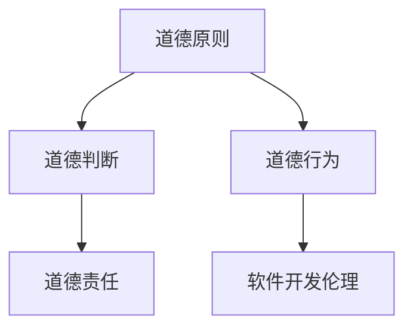
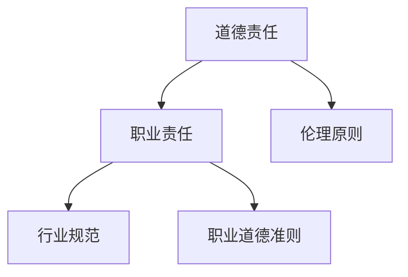
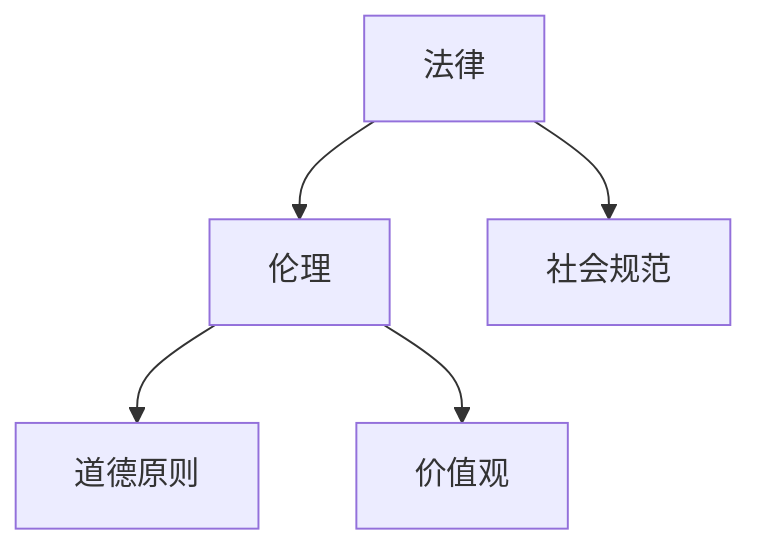
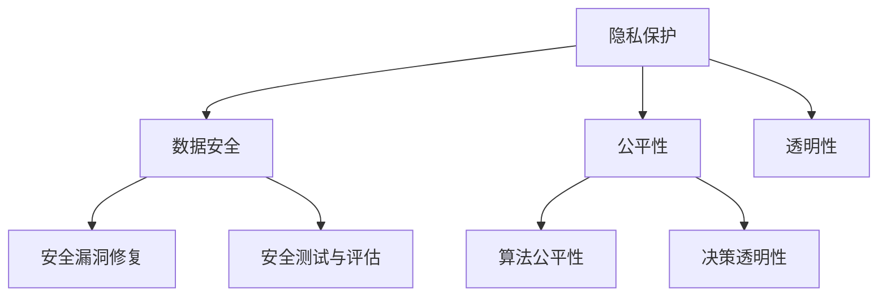
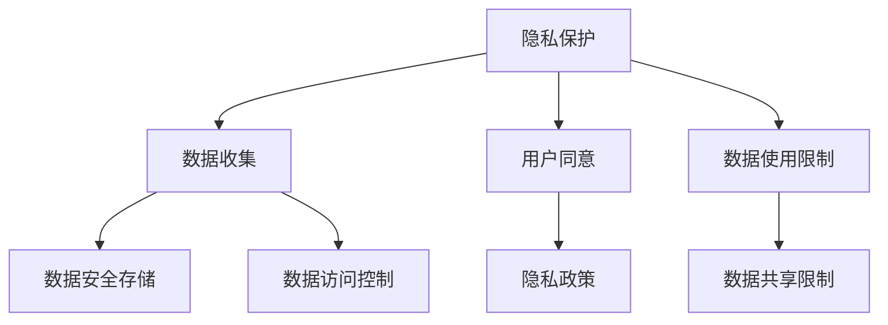
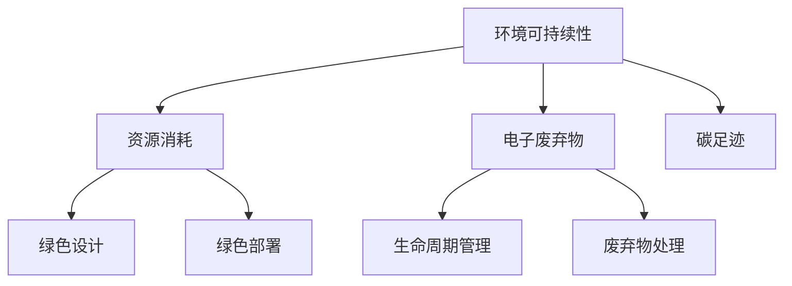
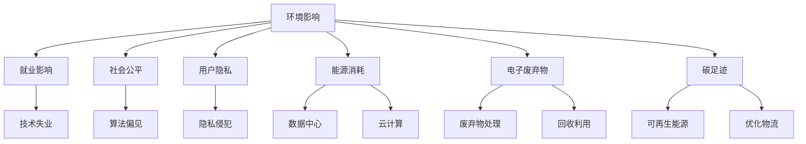
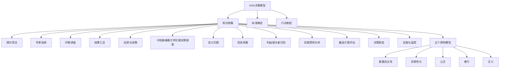

                 


### 1.1 伦理考量在软件开发中的重要性

在当今数字化时代，软件开发已成为推动社会进步和经济发展的关键驱动力。随着技术的不断演进，软件的开发和应用已经深入到我们生活的方方面面。从智能手机、社交媒体、在线购物，到医疗保健、金融交易、智能交通系统，软件无处不在。然而，这种广泛的应用也带来了新的伦理挑战和责任问题。

**1.1.1 技术发展与伦理问题的关联**

技术的发展不仅带来了便利，也带来了诸多伦理问题。例如，隐私泄露、数据滥用、算法偏见、自动化失业等。这些问题涉及到个人权益、社会公平、人类尊严等核心价值。因此，伦理考量在软件开发中变得尤为重要。

**1.1.2 社会对软件开发的期望**

随着公众对隐私和数据安全的关注度日益提高，社会对软件开发者的期望也随之提升。人们期望软件开发者在设计、开发和部署软件时，能够充分考虑伦理问题，并采取相应的措施来保护用户权益。

**1.1.3 法律法规的要求**

许多国家和地区的法律法规也对软件开发的伦理考量提出了具体要求。例如，《欧盟通用数据保护条例》（GDPR）规定了数据保护的标准，禁止数据滥用和未经授权的数据访问。此外，一些行业，如医疗和金融，还有更严格的规定，要求软件开发者在开发过程中遵循特定的伦理准则。

### 1.2 伦理与道德责任的定义

在深入探讨软件开发中的伦理考量之前，我们需要明确几个关键概念：伦理、道德责任、职业责任。

**1.2.1 伦理的定义**

伦理是指关于正确与错误、应该与不应该的哲学研究。它关注的是人类行为的道德标准，以及这些标准如何影响个人和社会。在软件开发中，伦理主要关注软件开发者的行为是否符合道德标准。

**1.2.2 道德责任的定义**

道德责任是指个人或组织基于伦理原则和价值观所承担的义务。在软件开发中，道德责任包括保护用户隐私、确保数据安全、避免算法偏见等。

**1.2.3 职业责任**

职业责任是道德责任在特定职业领域中的应用。对于软件开发者而言，职业责任包括遵守职业道德规范、确保软件质量、遵循最佳实践等。

### 1.3 伦理考量的发展历程

伦理考量在软件开发中的地位并非一成不变。随着技术的发展和公众意识的提高，伦理考量在软件开发中的地位也在不断演变。

**1.3.1 起初的忽视**

在计算机科学和软件工程初期，伦理考量并未得到足够的重视。开发者主要关注技术实现和功能实现，而忽视了可能带来的伦理问题。

**1.3.2 公众关注提升**

随着网络和数字技术的普及，公众对隐私和数据安全的关注度逐渐提升。开发者开始意识到，伦理考量是软件开发不可或缺的一部分。

**1.3.3 法规和标准的推动**

法律法规和行业标准的制定，进一步推动了伦理考量在软件开发中的地位。例如，GDPR的出台，要求开发者在处理用户数据时必须遵循严格的伦理标准。

### 总结

在引言与背景部分，我们探讨了伦理考量在软件开发中的重要性，定义了关键概念，并回顾了伦理考量的发展历程。接下来，我们将深入探讨伦理基础，包括伦理学的基本概念、道德责任与职业责任，以及法律与伦理的关系。这将为我们后续的讨论奠定坚实的基础。

## 1.2 伦理学的基本概念

伦理学是研究道德原则、道德判断和道德行为的哲学分支。在软件开发中，理解伦理学的基本概念对于做出符合伦理的决策至关重要。

### 1.2.1 道德原则

道德原则是伦理学的基础，它们是判断行为是否正确或错误的标准。常见的道德原则包括：

- **功利主义原则**：行为的价值取决于其产生的后果，即最大幸福原则。如果某个行为能够带来最大的总体幸福，那么这个行为就是正确的。
- **德性伦理学原则**：行为的价值取决于行为者的品德或德性。例如，诚实、善良、勇气等品质被认为是道德上正确的行为基础。
- **义务论原则**：行为的价值不取决于其后果，而取决于行为者是否履行了道德义务。例如，不伤害他人、尊重他人的权利等。

### 1.2.2 道德判断

道德判断是对行为的道德评价，它涉及到两个关键问题：一是行为是否符合道德原则，二是行为者是否具有道德责任。

- **是否符合道德原则**：例如，是否侵犯隐私、是否损害他人利益。
- **是否具有道德责任**：例如，是否故意或过失导致损害，是否能够预见后果。

### 1.2.3 道德行为

道德行为是指符合道德原则和道德判断的行为。在软件开发中，道德行为包括：

- **保护用户隐私**：确保用户数据不被未经授权访问或滥用。
- **确保数据安全**：采取措施保护用户数据免受黑客攻击和损失。
- **避免算法偏见**：确保算法的公平性和透明性，避免对特定群体产生歧视性影响。

### 核心概念与联系（Mermaid 流�程图）



### 核心算法原理讲解（伪代码）

```python
# 伪代码：道德判断算法

Algorithm MoralJudgment
    Input: action, context
    Output: moral Judgment

    1. Evaluate the action against moral principles (e.g., utilitarianism, deontological ethics).
    2. Determine if the action violates any ethical norms or standards.
    3. Assess the intention and consequences of the action.
    4. Generate a moral judgment based on the evaluation.

    return moral Judgment
```

### 数学模型和数学公式讲解（LaTeX）

```latex
% 伪代码：道德责任模型

\documentclass{article}
\usepackage{amsmath}

\begin{document}

\begin{equation}
    Responsibility = f(Intention, Consequences, Context)
\end{equation}

% 其中，Intention 表示行为者的意图，Consequences 表示行为的后果，Context 表示行为的环境。
\end{document}
```

### 案例分析

#### 案例一：Facebook 的隐私问题

在2018年，Facebook发生了剑桥分析公司的数据泄露事件，导致数千万用户的个人信息被不当使用。这一事件引发了广泛的道德和法律争议。

- **道德判断**：Facebook 的行为违反了道德原则，尤其是用户隐私保护和数据安全。
- **道德责任**：Facebook 作为数据处理者，有责任保护用户数据，确保其不被滥用。

#### 案例二：自动化招聘系统的算法偏见

一些公司使用自动化招聘系统来筛选简历，但这些系统可能存在算法偏见，导致对特定性别、种族或年龄的歧视。

- **道德判断**：使用具有偏见的算法是不道德的，因为它可能损害特定群体的权益。
- **道德责任**：软件开发者和公司有责任确保算法的公平性和透明性。

### 总结

在伦理基础部分，我们探讨了伦理学的基本概念，包括道德原则、道德判断和道德行为。我们通过核心概念与联系的流程图、伪代码和数学模型，详细阐述了这些概念在软件开发中的应用。接下来，我们将进一步探讨软件开发者在工作中的责任和义务。

## 2.2 道德责任与职业责任

在软件开发过程中，道德责任和职业责任是确保软件产品符合伦理标准的关键。这两者既有区别，又有紧密的联系。

### 2.2.1 道德责任

道德责任是基于伦理原则和个人价值观的责任。在软件开发中，道德责任主要包括以下几个方面：

- **保护用户隐私**：确保用户数据不被未经授权访问或滥用。
- **确保数据安全**：采取必要措施防止数据泄露和损坏。
- **公平性和透明性**：确保算法和软件设计不歧视特定群体。
- **尊重人类尊严**：避免开发出可能损害人类尊严的技术。

### 2.2.2 职业责任

职业责任是特定职业领域内的道德责任，它通常由行业规范、法律法规和职业道德准则来定义。在软件开发中，职业责任主要包括：

- **遵循最佳实践**：确保软件开发过程符合行业标准和最佳实践。
- **保证软件质量**：确保软件产品符合预期的功能和性能要求。
- **持续学习和进步**：不断更新知识和技能，以适应技术的发展。

### 2.2.3 关系与区别

道德责任和职业责任虽然有重叠，但它们也有明显的区别：

- **来源不同**：道德责任来源于个人的价值观和伦理原则，而职业责任来源于行业规范和职业道德准则。
- **范围不同**：道德责任通常更广泛，包括对社会的责任，而职业责任通常更具体，关注于特定职业活动。
- **强制力不同**：道德责任通常依靠个人的自觉遵守，而职业责任可能受到法律和行业规范的强制。

### 核心概念与联系（Mermaid 流程图）



### 核心算法原理讲解（伪代码）

```python
# 伪代码：道德责任与职业责任决策框架

Algorithm ResponsibilityDecision
    Input: context, ethicalPrinciples, professionalStandards
    Output: decision

    1. Evaluate the context against ethical principles.
    2. Check if professional standards are met.
    3. If context violates ethical principles, propose ethical adjustments.
    4. If professional standards are not met, suggest improvements.

    return decision
```

### 数学模型和数学公式讲解（LaTeX）

```latex
% 伪代码：道德责任与职业责任模型

\documentclass{article}
\usepackage{amsmath}

\begin{document}

\begin{equation}
    MoralResponsibility = f(EthicalPrinciples, PersonalValues)
\end{equation}

\begin{equation}
    ProfessionalResponsibility = f(ProfessionalStandards, IndustryNorms)
\end{equation}

% 其中，EthicalPrinciples 表示伦理原则，PersonalValues 表示个人价值观，ProfessionalStandards 表示职业标准，IndustryNorms 表示行业标准。
\end{document}
```

### 案例分析

#### 案例一：Uber 的性骚扰问题

Uber 在2017年因性骚扰问题备受关注。这一问题不仅涉及道德责任，也涉及职业责任。

- **道德责任**：Uber 的管理团队有责任确保员工和工作环境符合道德标准，防止性骚扰事件的发生。
- **职业责任**：Uber 应遵循职业道德准则，为员工提供安全和尊重的工作环境。

#### 案例二：谷歌的员工抗议

谷歌在2019年因员工抗议其参与军事项目而成为头条新闻。这一事件反映了软件开发者在职业责任和道德责任之间的权衡。

- **道德责任**：软件开发者有权决定是否参与可能带来道德争议的项目。
- **职业责任**：软件开发者应遵循公司的规定和行业标准，但同时也有道德权利表达自己的立场。

### 总结

在道德责任与职业责任部分，我们详细探讨了这两者的概念、区别和联系。通过伪代码和数学模型，我们阐述了如何在实际工作中做出符合道德和职业责任的决策。接下来，我们将讨论法律与伦理的关系，以及法律如何影响软件开发中的伦理考量。

## 2.3 法律与伦理的关系

法律和伦理在软件开发中扮演着重要角色，两者相互影响，共同塑造软件开发的伦理环境。

### 2.3.1 法律的约束力

法律是国家或地区制定的具有强制力的规范，用以维护社会秩序和公民权益。在软件开发中，法律提供了明确的规范和标准，确保开发行为不会违反社会伦理和法律。例如，《欧盟通用数据保护条例》（GDPR）对数据处理行为进行了详细规定，要求企业采取严格的数据保护措施。

### 2.3.2 伦理的指导作用

伦理虽然不具有法律强制力，但它在软件开发中发挥着重要的指导作用。伦理原则为软件开发者提供了道德指引，帮助他们做出符合社会期望和价值观的决策。例如，尊重用户隐私和数据安全是伦理的基本要求，这些要求在法律中也有体现。

### 2.3.3 法律与伦理的互动

法律与伦理之间存在互动关系。一方面，法律可以反映和强化伦理原则，例如，隐私保护法律强化了对个人隐私的尊重。另一方面，伦理可以引导法律的发展，推动社会对某些伦理问题的关注和解决。例如，随着人工智能技术的发展，伦理问题日益突出，这促使许多国家开始制定相关法律法规。

### 核心概念与联系（Mermaid 流程图）



### 核心算法原理讲解（伪代码）

```python
# 伪代码：法律与伦理互动模型

Algorithm LawEthicInteraction
    Input: legalFramework, ethicalGuidelines
    Output: compliantDecision

    1. Evaluate the legal framework against ethical guidelines.
    2. Identify areas where legal requirements align with ethical principles.
    3. Identify areas where ethical considerations exceed legal requirements.
    4. Propose adjustments to the legal framework or ethical guidelines to ensure alignment.

    return compliantDecision
```

### 数学模型和数学公式讲解（LaTeX）

```latex
% 伪代码：法律与伦理互动模型

\documentclass{article}
\usepackage{amsmath}

\begin{document}

\begin{equation}
    LegalEnforcement = f(LegalFramework, SocialNorms)
\end{equation}

\begin{equation}
    EthicalGuidance = f(EthicPrinciples, Values)
\end{equation}

% 其中，LegalFramework 表示法律框架，SocialNorms 表示社会规范，EthicPrinciples 表示伦理原则，Values 表示价值观。
\end{document}
```

### 案例分析

#### 案例一：Facebook 的数据保护法规

在2018年，Facebook因违反GDPR被罚款50亿美元。这一事件展示了法律对伦理的强制力。

- **法律约束**：GDPR对数据处理行为有明确的规定，Facebook未遵守这些规定。
- **伦理考量**：Facebook 在处理用户数据时，未能充分保护用户隐私。

#### 案例二：谷歌的人工智能伦理研究

谷歌成立了人工智能伦理委员会，旨在确保其人工智能产品符合伦理要求。这一举措反映了伦理对法律的引导作用。

- **伦理考量**：人工智能可能带来的伦理问题引起关注，促使谷歌制定相关伦理准则。
- **法律引导**：虽然目前没有具体的人工智能法律，但伦理考量可以引导未来的法律制定。

### 总结

在法律与伦理的关系部分，我们探讨了法律和伦理在软件开发中的角色和互动。通过流程图、伪代码和数学模型，我们阐述了如何在实际工作中处理法律与伦理的冲突和协调。接下来，我们将讨论软件开发者在工作中的伦理责任，包括隐私保护、数据安全和公平性等方面的具体要求。

## 3.1 软件开发者的伦理责任

软件开发者在工作中承担着重要的伦理责任，这些责任不仅关乎个人职业发展，更关系到社会公共利益。以下将详细讨论几个关键领域的伦理责任。

### 3.1.1 隐私保护

隐私保护是软件开发中最基本的伦理责任之一。在开发软件时，开发者必须确保用户数据的安全和隐私不被侵犯。

- **数据收集与使用**：开发者应在合法范围内收集必要的数据，明确告知用户数据的用途，并取得用户的明确同意。
- **数据存储与传输**：开发者应采取必要的安全措施，如加密、访问控制等，确保数据在存储和传输过程中的安全性。
- **数据泄露应对**：一旦发生数据泄露，开发者应立即采取补救措施，通知受影响的用户，并配合监管机构进行调查。

### 3.1.2 数据安全

数据安全是软件开发者必须高度重视的另一个伦理责任。随着网络攻击手段的不断升级，确保软件和数据的安全变得越来越重要。

- **安全漏洞修复**：开发者应定期对软件进行安全检查，及时发现和修复安全漏洞。
- **安全测试与评估**：在软件开发过程中，开发者应进行全面的安全测试，确保软件能够抵御外部攻击。
- **应急响应机制**：建立应急响应机制，一旦发生安全事件，能够迅速响应和应对。

### 3.1.3 公平性与透明性

公平性和透明性是确保软件设计和决策不歧视特定群体的重要原则。开发者应在软件设计阶段充分考虑这些因素。

- **算法公平性**：开发者应确保算法的公平性，避免算法偏见，确保不同用户得到公平的服务。
- **透明性**：软件开发者应提供足够的透明度，让用户了解软件的工作原理和决策过程，增强用户的信任。

### 核心概念与联系（Mermaid 流程图）



### 核心算法原理讲解（伪代码）

```python
# 伪代码：隐私保护算法

Algorithm PrivacyProtection
    Input: data, userConsent, securityProtocols
    Output: protectedData

    1. Check if user consent is obtained for data collection and usage.
    2. Encrypt and store data using security protocols.
    3. Implement access controls to limit data access to authorized personnel.
    4. Monitor data for any signs of unauthorized access or leakage.
    5. In case of data breach, trigger emergency protocols and notify affected users.

    return protectedData
```

### 数学模型和数学公式讲解（LaTeX）

```latex
% 伪代码：数据安全模型

\documentclass{article}
\usepackage{amsmath}

\begin{document}

\begin{equation}
    DataSecurity = f(SecurityProtocols, VulnerabilityDetection, IncidentResponse)
\end{equation}

% 其中，SecurityProtocols 表示安全协议，VulnerabilityDetection 表示漏洞检测，IncidentResponse 表示应急响应。
\end{document}
```

### 案例分析

#### 案例一：Equifax 数据泄露事件

在2017年，Equifax发生了严重的数据泄露事件，导致1.43亿用户的个人信息被窃取。这一事件引发了公众对数据安全和个人隐私保护的广泛关注。

- **隐私保护**：Equifax 在数据存储和传输过程中未能采取充分的安全措施，导致数据泄露。
- **数据安全**：Equifax 的安全漏洞检测和应急响应机制不够完善，未能及时应对数据泄露事件。

#### 案例二：Google 推出的智能助手

Google 推出的智能助手 Google Assistant 因算法偏见问题受到批评。一些用户发现，智能助手对某些种族或性别用户的回答存在偏见。

- **公平性**：Google 在算法设计阶段未能充分考虑公平性，导致智能助手对特定用户产生偏见。
- **透明性**：Google 在发布智能助手时未能充分告知用户其决策过程，导致用户对其透明度产生怀疑。

### 总结

在软件开发者的伦理责任部分，我们详细探讨了隐私保护、数据安全和公平性等方面的伦理责任。通过流程图、伪代码和数学模型，我们阐述了如何在实际工作中履行这些责任。接下来，我们将讨论软件开发的可持续性和社会责任，以及软件开发者如何在设计中考虑这些因素。

## 3.2 隐私和数据保护

隐私和数据保护是软件开发中不可忽视的重要议题，随着信息技术的迅速发展，隐私和数据安全问题越来越受到重视。在本节中，我们将详细探讨隐私和数据保护的伦理责任，以及软件开发者在实践中应如何履行这些责任。

### 3.2.1 隐私的伦理责任

隐私是指个人对其个人信息控制和保密的权利。在软件开发中，隐私的伦理责任主要体现在以下几个方面：

- **用户知情同意**：开发者应明确告知用户其个人信息将被收集、存储和使用的目的，并取得用户的明确同意。这包括在用户注册、使用服务时提供详细的隐私政策。
- **限制数据收集**：开发者不应无限制地收集用户数据，而应仅收集实现服务功能所必需的数据。过度收集数据可能导致隐私侵犯。
- **数据使用限制**：开发者应明确数据的使用范围，确保数据不被用于未经授权的用途。任何数据共享或转移都应取得用户的同意。

### 3.2.2 数据保护的伦理责任

数据保护是指采取措施保护用户数据不被未经授权访问、泄露、篡改或丢失。在软件开发中，数据保护的伦理责任包括：

- **安全存储**：开发者应采用加密技术和其他安全措施，确保存储的数据安全。这包括对敏感数据进行加密存储，以及对存储设备进行安全防护。
- **访问控制**：开发者应设置严格的访问控制措施，限制对用户数据的访问权限，确保只有授权人员才能访问和处理数据。
- **数据泄露应对**：一旦发生数据泄露，开发者应立即采取紧急措施，如通知受影响的用户、暂停服务、进行安全评估等。同时，开发者应配合监管机构进行调查。

### 核心概念与联系（Mermaid 流程图）



### 核心算法原理讲解（伪代码）

```python
# 伪代码：隐私保护算法

Algorithm PrivacyProtection
    Input: userInformation, privacyPolicy, securityProtocols
    Output: protectedUserInformation

    1. Verify user consent by reviewing the privacy policy.
    2. Collect only necessary user information.
    3. Encrypt user information using security protocols.
    4. Implement access controls to limit data access.
    5. Monitor data for signs of unauthorized access or leakage.
    6. In case of a data breach, notify affected users and initiate security protocols.

    return protectedUserInformation
```

### 数学模型和数学公式讲解（LaTeX）

```latex
% 伪代码：数据保护模型

\documentclass{article}
\usepackage{amsmath}

\begin{document}

\begin{equation}
    DataProtection = f(SecurityProtocols, AccessControls, IncidentResponse)
\end{equation}

% 其中，SecurityProtocols 表示安全协议，AccessControls 表示访问控制，IncidentResponse 表示应急响应。
\end{document}
```

### 案例分析

#### 案例一：Facebook 的 Cambridge Analytica 丑闻

2018年，Facebook 因 Cambridge Analytica 丑闻受到广泛批评。Cambridge Analytica 未经用户同意，非法获取了8700万用户的数据，用于政治广告投放。

- **隐私侵犯**：Facebook 未严格审查第三方应用程序的数据访问权限，导致用户隐私被侵犯。
- **数据滥用**：Cambridge Analytica 利用获取的数据进行政治操纵，引发公众对数据保护的担忧。

#### 案例二：Apple 的隐私保护措施

Apple 一直以其严格的隐私保护措施著称。例如，Apple 的 iOS 操作系统提供了强大的数据保护功能，如数据加密、应用权限管理等。

- **用户知情同意**：Apple 通过其隐私政策明确告知用户其数据的使用情况，并要求用户同意。
- **数据加密**：Apple 对用户数据进行加密处理，确保数据在存储和传输过程中的安全性。

### 总结

在隐私和数据保护部分，我们详细探讨了隐私和数据保护的伦理责任，并通过流程图、伪代码和数学模型，阐述了如何在实际工作中履行这些责任。通过案例分析，我们看到了一些成功和失败的实例，为软件开发者提供了宝贵的经验教训。接下来，我们将讨论软件产品的可持续性，以及软件开发者如何确保其产品对环境的影响最小化。

## 3.3 软件产品的可持续性

随着全球对环境保护和可持续发展的关注度不断提升，软件产品的可持续性也成为了软件开发者和企业必须重视的重要议题。软件产品的可持续性不仅关系到企业的长远发展，也对社会和环境产生深远影响。

### 3.3.1 可持续性的概念

可持续性是指在满足当前需求的同时，不损害子孙后代满足其需求的能力。在软件开发中，可持续性包括以下几个方面：

- **环境可持续性**：确保软件产品和服务的开发、部署和使用过程中对环境的负面影响最小化。
- **社会可持续性**：确保软件产品和服务的开发和应用过程中，促进社会公平、经济发展和人类福祉。
- **经济可持续性**：确保软件产品和服务的开发、运营和维护过程中，具备长期盈利能力和竞争力。

### 3.3.2 软件开发中的可持续性挑战

软件开发中的可持续性挑战主要包括：

- **资源消耗**：软件开发需要大量的能源、硬件设备和人力等资源，这些资源的过度消耗可能对环境造成负面影响。
- **电子废弃物**：软件产品更新换代迅速，导致大量电子废弃物产生，这些废弃物对环境具有长期的危害。
- **碳足迹**：软件服务通常依赖数据中心和云计算，这些设施的高能耗可能导致较大的碳足迹。

### 3.3.3 实现软件产品可持续性的方法

为了实现软件产品的可持续性，软件开发者和企业可以采取以下方法：

- **绿色设计**：在软件设计和开发阶段，考虑环境影响，采用节能、减排的设计理念。例如，优化算法以提高能源效率，采用模块化设计以减少资源浪费。
- **绿色部署**：在软件部署过程中，选择环保的数据中心，采用清洁能源，减少碳排放。此外，采用虚拟化和容器化技术，提高资源利用率。
- **生命周期管理**：在软件产品的整个生命周期中，实施环境管理体系，确保产品对环境的负面影响最小化。包括产品的设计、开发、部署、使用和废弃处理等环节。
- **可持续性评估**：定期对软件产品和服务的可持续性进行评估，识别潜在的环境和社会风险，采取相应的改进措施。

### 核心概念与联系（Mermaid 流程图）



### 核心算法原理讲解（伪代码）

```python
# 伪代码：可持续性评估算法

Algorithm SustainabilityAssessment
    Input: softwareProduct, lifecycleStages
    Output: sustainabilityScore

    1. Evaluate each lifecycle stage (design, development, deployment, use, disposal) against sustainability criteria.
    2. Calculate the environmental impact (resource consumption, electronic waste, carbon footprint).
    3. Assess the social and economic impacts.
    4. Generate a sustainability score based on the evaluation.

    return sustainabilityScore
```

### 数学模型和数学公式讲解（LaTeX）

```latex
% 伪代码：可持续性评估模型

\documentclass{article}
\usepackage{amsmath}

\begin{document}

\begin{equation}
    SustainabilityScore = f(EnvironmentalImpact, SocialImpact, EconomicImpact)
\end{equation}

% 其中，EnvironmentalImpact 表示环境影响，SocialImpact 表示社会影响，EconomicImpact 表示经济影响。
\end{document}
```

### 案例分析

#### 案例一：Google 的可持续性努力

Google 是全球领先的技术公司之一，其在可持续性方面做出了诸多努力。例如，Google 宣布到2030年实现100%可再生能源使用，并在全球范围内开展多个环保项目。

- **绿色部署**：Google 在其数据中心和办公室采用高效节能技术，降低能源消耗。
- **循环利用**：Google 推广循环利用和废弃处理计划，减少电子废弃物的产生。

#### 案例二：Microsoft 的可持续性承诺

Microsoft 是另一家致力于可持续发展的科技巨头。例如，Microsoft 宣布到2030年实现碳负排放，并在其产品和服务中推广可持续性设计。

- **绿色设计**：Microsoft 在其产品开发过程中，采用模块化设计和高效算法，降低资源消耗。
- **可持续性评估**：Microsoft 对其产品和服务进行定期可持续性评估，确保符合可持续性要求。

### 总结

在软件产品的可持续性部分，我们探讨了可持续性的概念、挑战以及实现方法。通过流程图、伪代码和数学模型，我们详细阐述了如何在实际工作中实现软件产品的可持续性。通过案例分析，我们看到了一些成功的企业实践，为其他企业提供了借鉴。接下来，我们将讨论软件开发决策对社会和环境的潜在影响。

## 4.1 软件开发决策对社会和环境的潜在影响

软件开发决策不仅影响软件本身的功能和性能，还对社会和环境产生深远的影响。因此，在做出软件开发决策时，必须全面考虑这些潜在影响，以确保决策的可持续性和社会责任。

### 4.1.1 社会影响的考虑

软件开发决策的社会影响主要体现在以下几个方面：

- **就业影响**：新的软件产品和技术的出现可能带来就业机会，但也可能导致某些传统职业的失业。例如，自动化技术的推广可能减少对某些低技能工作的需求。
- **社会公平**：软件开发决策应确保不会加剧社会不平等。算法偏见和歧视性软件可能导致特定群体受到不公平对待。
- **用户隐私**：软件产品的数据收集和使用可能侵犯用户隐私，损害个人权益。因此，在决策过程中必须充分考虑到隐私保护的要求。

### 4.1.2 环境影响的考虑

软件开发决策的环境影响主要包括以下方面：

- **能源消耗**：软件产品的开发、部署和使用需要大量的能源，尤其是云计算和数据中心的高能耗问题。因此，在决策过程中应考虑能源的可持续性。
- **电子废弃物**：软件产品的更新换代迅速，导致大量电子废弃物产生。这些废弃物的处理和回收需要额外的资源和成本。
- **碳足迹**：软件开发过程中产生的碳排放主要来自数据中心的能源消耗和运输过程。因此，应采取措施减少碳排放，如采用可再生能源和优化物流。

### 核心概念与联系（Mermaid 流程图）



### 核心算法原理讲解（伪代码）

```python
# 伪代码：社会和环境影响评估算法

Algorithm ImpactAssessment
    Input: softwareDecision, societalContext, environmentalContext
    Output: impactScore

    1. Evaluate the potential social impacts (e.g., employment, social equity, user privacy).
    2. Evaluate the potential environmental impacts (e.g., energy consumption, electronic waste, carbon footprint).
    3. Calculate the overall impact score based on the assessments.

    return impactScore
```

### 数学模型和数学公式讲解（LaTeX）

```latex
% 伪代码：社会和环境影响评估模型

\documentclass{article}
\usepackage{amsmath}

\begin{document}

\begin{equation}
    ImpactScore = f(SocialImpact, EnvironmentalImpact)
\end{equation}

% 其中，SocialImpact 表示社会影响，EnvironmentalImpact 表示环境影响。
\end{document}
```

### 案例分析

#### 案例一：Google 的自动驾驶汽车项目

Google 的自动驾驶汽车项目在社会和环境方面引发了一系列争议。虽然该项目可能减少交通事故和拥堵，但也可能导致传统出租车和驾驶职业的失业。

- **社会影响**：自动驾驶技术可能导致大量司机失业，对社会就业产生负面影响。
- **环境影响**：自动驾驶汽车有望减少燃油消耗和碳排放，但该项目在初期阶段可能面临高能耗和高成本的问题。

#### 案例二：Amazon 的无人机配送服务

Amazon 推出的无人机配送服务旨在提高配送效率，减少碳排放。然而，这一项目也引发了关于隐私和安全性的担忧。

- **社会影响**：无人机配送可能提高配送速度，但可能对传统配送业产生影响。
- **环境影响**：无人机配送有望减少交通拥堵和碳排放，但无人机操作的复杂性和安全性需要进一步解决。

### 总结

在软件开发决策对社会和环境的潜在影响部分，我们详细探讨了社会影响和环境影响的考虑因素。通过流程图、伪代码和数学模型，我们阐述了如何在实际工作中评估这些影响。通过案例分析，我们看到了一些实际项目的成功和挑战，为软件开发者提供了宝贵的经验。接下来，我们将讨论如何通过案例研究来深入分析软件开发中的伦理问题。

## 5.1 典型伦理困境案例分析

在软件开发过程中，经常会遇到各种伦理困境，这些困境往往涉及到道德原则、社会价值和法律规范之间的冲突。通过分析一些典型的伦理困境案例，我们可以更好地理解这些挑战，并探讨解决这些问题的方法。

### 案例一：Facebook 的数据隐私问题

**背景**：2018年，Facebook 因剑桥分析公司的数据泄露事件陷入了一场严重的伦理危机。数千万用户的个人信息被未经授权地获取和利用，用于政治广告投放。

**伦理困境**：这一事件引发了关于数据隐私、用户同意和责任归属的伦理争议。

- **数据隐私**：Facebook 在数据收集和使用过程中，未能充分保护用户隐私，违反了用户对数据安全的合理期望。
- **用户同意**：Facebook 未能明确告知用户其数据可能被第三方使用，违反了用户同意的原则。
- **责任归属**：Facebook 作为数据处理者，应对用户数据保护负有直接责任。

**解决方案**：为了解决这些伦理困境，Facebook 采取了一系列措施，包括：

- **加强数据保护政策**：Facebook 修订了隐私政策，明确了用户数据的收集、使用和共享规则。
- **用户通知和透明度**：Facebook 加强了用户通知机制，确保用户在数据使用前明确同意。
- **责任追究**：Facebook 与监管机构合作，采取了法律行动追究相关责任。

### 案例二：Google 的人工智能招聘算法

**背景**：Google 的招聘算法在2016年被发现存在性别歧视问题，对女性求职者给予较低的评分。

**伦理困境**：这一事件引发了关于算法公平性、性别平等和道德责任的伦理争议。

- **算法公平性**：Google 的招聘算法在性别、种族等方面存在偏见，违反了公平性原则。
- **性别平等**：算法的性别偏见可能加剧性别不平等问题，损害女性的职业发展机会。
- **道德责任**：作为算法的开发者，Google 有责任确保算法的公平性和透明性。

**解决方案**：为了解决这些伦理困境，Google 采取了一系列措施，包括：

- **算法审计**：Google 对招聘算法进行了全面审计，识别并修复了偏见问题。
- **多样性培训**：Google 加强了员工多样性培训，提高员工对性别平等和伦理问题的认识。
- **透明度提升**：Google 增加了算法的透明度，确保招聘决策过程公开、公正。

### 案例三：Uber 的性骚扰问题

**背景**：Uber 在2017年因内部性骚扰问题而受到广泛批评，多名员工揭露公司存在系统性问题。

**伦理困境**：这一事件引发了关于企业文化、职业道德和责任归属的伦理争议。

- **企业文化**：Uber 的企业文化被认为是鼓励性骚扰的温床，违反了职业道德原则。
- **职业道德**：Uber 的管理层未能有效管理性骚扰问题，违反了职业道德和责任。
- **责任归属**：Uber 的创始人 Travis Kalanick 被批评对性骚扰问题负有直接责任。

**解决方案**：为了解决这些伦理困境，Uber 采取了一系列措施，包括：

- **企业文化重塑**：Uber 实施了多项改革，重塑企业文化，强调职业道德和多样性。
- **加强管理**：Uber 换了新的CEO，加强了管理层对性骚扰问题的重视。
- **透明度和问责制**：Uber 加强了内部监督机制，确保员工投诉得到及时处理。

### 总结

通过分析这些案例，我们可以看到软件开发中的伦理困境具有多样性和复杂性。解决这些困境需要综合运用道德原则、法律法规和社会价值观，通过持续改进和透明度提升来确保软件产品和服务的伦理合规性。接下来，我们将回顾一些重大伦理事件，探讨其对软件开发伦理考量的影响。

## 5.2 重大伦理事件回顾

在软件开发和信息技术领域，一些重大伦理事件的发生对行业产生了深远的影响，引发了关于责任、隐私和安全性的广泛讨论。以下将回顾几个具有里程碑意义的重大伦理事件，并分析它们对软件开发伦理考量带来的影响。

### 事件一：Equifax 数据泄露事件（2017年）

**背景**：Equifax 是一家全球领先的信用报告机构，2017年发生了一起严重的数据泄露事件，导致1.43亿美国用户的个人信息（包括姓名、社会安全号码、出生日期、地址和驾驶执照号码）被窃取。

**影响**：

- **隐私侵犯**：这一事件引发了公众对数据隐私和安全的广泛关注，凸显了大型企业对用户信息保护不足的问题。
- **责任归属**：Equifax 因未能采取足够的安全措施而被监管机构和公众批评，引发了关于企业责任和道德义务的讨论。
- **监管加强**：事件发生后，美国联邦贸易委员会（FTC）和其他监管机构加强了对数据保护的监管力度，推动了相关法律法规的改进。

### 事件二：Facebook-Cambridge Analytica 丑闻（2018年）

**背景**：Facebook 与剑桥分析公司合作，后者未经用户同意非法获取了8700万用户的个人信息，用于政治广告投放。

**影响**：

- **用户隐私**：这一事件揭示了社交媒体平台在用户隐私保护方面的严重漏洞，引发了用户对隐私泄露的恐慌。
- **信任危机**：事件导致公众对Facebook 的信任度大幅下降，对社交媒体平台的隐私政策和使用数据的方式产生了质疑。
- **行业规范**：这一事件促使多家社交媒体平台和科技公司加强了对用户隐私和数据安全的保护措施，推动了行业规范的制定和完善。

### 事件三：谷歌人工智能招聘算法性别歧视案（2017年）

**背景**：谷歌的招聘算法被发现对女性求职者存在性别歧视，这一发现引起了广泛的社会关注。

**影响**：

- **公平性争议**：这一事件引发了关于人工智能算法公平性的广泛讨论，凸显了算法偏见可能对社会公平产生的影响。
- **伦理考量**：谷歌因此事件被批评未能充分考虑到伦理因素，引发了对软件开发中伦理考量的重视。
- **法律挑战**：这一事件推动了法律对人工智能算法的监管，确保其在招聘等关键应用中的公平性和透明性。

### 事件四：特斯拉自动驾驶事故（2018年）

**背景**：特斯拉的一款自动驾驶汽车在美国发生了一起致命事故，造成一名司机死亡。

**影响**：

- **安全问题**：这一事件引发了公众对自动驾驶汽车安全性的担忧，凸显了自动驾驶技术发展的伦理和道德挑战。
- **责任归属**：事故发生后，关于驾驶员责任、汽车制造商责任以及监管机构的角色展开了激烈讨论。
- **技术进步与伦理考量**：这一事件促使自动驾驶技术的发展更加注重伦理考量，确保技术进步的同时不损害人类安全和福祉。

### 总结

这些重大伦理事件对软件开发和信息技术行业产生了深远的影响，促使企业、监管机构和公众重新审视软件开发中的伦理考量。通过这些事件的回顾，我们可以看到，隐私保护、公平性、安全性和责任归属是软件开发中不可忽视的伦理问题。接下来，我们将探讨不同国家和地区的软件开发伦理规范，以及这些规范对软件开发实践的影响。

## 5.3 国际案例对比分析

在不同国家和地区，软件开发伦理规范和监管框架存在显著差异。这些差异反映了各国文化、法律体系和价值观的多样性。以下将对几个主要国家和地区的软件开发伦理规范进行对比分析，以探讨这些规范对软件开发实践的影响。

### 欧盟：严格的数据保护与伦理规范

欧盟在数据保护方面制定了严格的法律法规，如《通用数据保护条例》（GDPR）。GDPR对数据收集、存储、处理和传输等各个环节进行了详细规定，强调用户对个人数据的控制权。此外，欧盟还推出了《人工智能伦理准则》，旨在确保人工智能技术的发展符合伦理标准。

- **数据保护**：欧盟要求企业在数据处理过程中采取严格的安全措施，确保数据不被滥用。企业需获得用户明确的同意，并有权访问其数据。
- **人工智能伦理**：欧盟强调人工智能的透明性、公平性和可靠性，要求开发者在设计算法时充分考虑这些因素。

### 美国：灵活的隐私保护与行业自律

与美国相比，欧盟的数据保护法规较为严格，而美国的隐私保护更多依赖于行业自律和法律监管。例如，美国没有统一的隐私保护法律，各州法律存在差异。联邦贸易委员会（FTC）负责监督企业是否符合隐私保护法规，并在必要时采取法律行动。

- **隐私保护**：美国企业在处理用户数据时，通常遵循行业最佳实践，如《加州消费者隐私法》（CCPA）。CCPA赋予用户对个人数据的访问权、删除权和拒绝销售权。
- **行业自律**：美国科技公司通常通过内部隐私政策和伦理准则来管理数据保护问题，并积极参与行业标准和法规的制定。

### 亚洲：快速发展与监管滞后

亚洲地区，尤其是中国和印度，在软件开发和信息技术领域快速发展。然而，这些国家的隐私保护法律和伦理规范相对滞后，监管框架有待完善。

- **数据保护**：中国在2017年通过了《网络安全法》，对数据安全和个人隐私保护进行了规定。但相比欧盟的GDPR，中国的法律实施细节和处罚力度仍需完善。
- **人工智能伦理**：亚洲国家在人工智能伦理方面正在积极制定相关规范，如中国的《人工智能发展伦理规范》。

### 比较：法律与伦理的差异与挑战

- **法律差异**：欧盟的法律体系强调数据保护和用户权利，美国侧重于行业自律和法律监管，亚洲地区法律体系尚不完善。
- **伦理考量**：尽管法律和伦理有所不同，但各国在软件开发伦理考量上存在共同关注点，如透明性、公平性和安全性。

### 对软件开发实践的影响

- **数据保护**：严格的隐私保护法律（如GDPR）要求企业在数据处理过程中采取更多安全措施，提高了开发成本和时间。然而，这也有助于提升用户信任和满意度。
- **人工智能伦理**：各国在人工智能伦理规范上的差异导致企业在全球范围内的合规难度增加。企业需要根据不同国家和地区的规范调整其开发实践，确保产品和服务符合当地要求。

### 总结

国际案例对比分析揭示了不同国家和地区的软件开发伦理规范和监管框架的多样性。这些差异对软件开发实践产生了深远影响，要求企业在全球范围内灵活应对，确保其产品和服务符合不同国家和地区的法律和伦理要求。接下来，我们将讨论如何做出符合伦理的决策，并介绍相关的决策框架和方法。

## 6.1 伦理决策框架

在软件开发中，做出符合伦理的决策是一个复杂的过程，需要综合考量多方面的因素。为了确保决策的合理性和可持续性，我们可以采用一系列伦理决策框架，这些框架提供了系统化的方法来分析和解决伦理问题。

### 6.1.1 KSA决策模型

KSA决策模型（Knowledge, Standards, and Action）是一个常见的伦理决策框架，它包括以下三个步骤：

1. **知识（Knowledge）**：收集相关信息，包括道德原则、行业标准、法律法规等。这一步骤的目的是确保决策者具备充分的背景知识。
   
2. **标准（Standards）**：确定适用的道德标准和行业标准。这包括识别相关的道德原则（如公正、诚信、尊重等）和行业规范。

3. **行动（Action）**：基于知识和标准，制定具体的行动方案。这一步骤涉及权衡不同选项的利弊，并选择最符合伦理要求的方案。

### 6.1.2 德尔菲法

德尔菲法是一种通过专家共识来达成伦理决策的方法。具体步骤如下：

1. **问题定义**：明确需要解决的伦理问题。

2. **专家选择**：选择具有相关领域知识和经验的专家，组成一个专家小组。

3. **问卷调查**：专家们通过匿名问卷的形式，各自独立提出建议和意见。

4. **结果汇总**：汇总专家们的意见，进行统计分析，找出共识和分歧。

5. **反馈与调整**：将汇总结果反馈给专家，根据反馈进行进一步的讨论和调整。

### 6.1.3 卡耐基梅隆大学伦理决策框架

卡耐基梅隆大学的伦理决策框架提供了一个结构化的方法来处理复杂伦理问题。该框架包括以下步骤：

1. **定义问题**：明确需要解决的伦理问题。

2. **收集信息**：收集与问题相关的所有信息。

3. **识别利益相关者**：确定受决策影响的各方，包括用户、员工、股东等。

4. **分析伦理原则**：识别和评估相关的伦理原则和价值观。

5. **评估备选方案**：分析不同方案对伦理原则的符合程度。

6. **做出决策**：基于分析和评估，选择最符合伦理要求的方案。

7. **实施与监控**：执行决策，并持续监控其效果和影响。

### 6.1.4 五个原则模型

五个原则模型是由医学伦理学家比彻姆和查尔默斯提出的，用于医疗伦理决策，但同样适用于软件开发中的伦理决策。五个原则包括：

1. **尊重自主性**：尊重个体的决策权和隐私权。
2. **非男性化**：避免伤害，尤其是不可逆的伤害。
3. **公正**：确保资源和服务公平分配。
4. **善行**：追求最大利益，包括治疗和预防。
5. **正义**：确保社会的公平和正义。

### 核心概念与联系（Mermaid 流程图）



### 核心算法原理讲解（伪代码）

```python
# 伪代码：KSA决策模型

Algorithm EthicalDecisionMaking_KSA
    Input: issue, context
    Output: decision

    1. Collect knowledge about the issue and context.
    2. Identify relevant ethical standards and principles.
    3. Evaluate the issue against these standards and principles.
    4. Generate a set of potential actions.
    5. Assess the ethical implications of each action.
    6. Select the action with the highest ethical score.

    return decision
```

### 数学模型和数学公式讲解（LaTeX）

```latex
% 伪代码：KSA决策模型

\documentclass{article}
\usepackage{amsmath}

\begin{document}

\begin{equation}
    EthicalDecision = f(Knowledge, Standards, Actions)
\end{equation}

% 其中，Knowledge 表示知识，Standards 表示标准，Actions 表示行动。
\end{document}
```

### 案例分析

#### 案例一：Google 的人工智能招聘算法

**问题**：Google 的招聘算法被发现在性别和种族上存在偏见。

**决策过程**：

1. **知识收集**：了解相关道德原则（如公平性、透明性）、行业标准（如职业伦理准则）和法律法规（如反歧视法律）。
2. **标准确定**：确定与招聘算法相关的伦理原则，如公平性、非歧视。
3. **行动制定**：评估不同的行动方案，包括算法改进、透明度提升、内部审计等。
4. **伦理评估**：分析每个行动方案对伦理原则的符合程度。
5. **决策**：选择最符合伦理要求的行动方案，如算法改进和内部审计。
6. **实施与监控**：执行决策，并持续监控其效果。

#### 案例二：Uber 的性骚扰问题

**问题**：Uber 因内部性骚扰问题面临伦理困境。

**决策过程**：

1. **知识收集**：了解企业文化、职业道德规范和相关的法律要求。
2. **标准确定**：确定与性骚扰相关的伦理原则，如尊重、公正、责任。
3. **行动制定**：评估不同的行动方案，包括企业文化重塑、管理层调整、透明度提升等。
4. **伦理评估**：分析每个行动方案对伦理原则的符合程度。
5. **决策**：选择最符合伦理要求的行动方案，如企业文化重塑和管理层调整。
6. **实施与监控**：执行决策，并持续监控其效果。

### 总结

伦理决策框架为软件开发者在面对伦理困境时提供了系统化的方法和步骤。通过知识收集、标准确定、行动制定、伦理评估和决策实施，软件开发者可以更有效地应对复杂的伦理问题。接下来，我们将讨论如何在实际工作中应用这些决策框架，以及相关的工具和方法。

## 6.2 伦理决策过程中的方法与工具

在伦理决策过程中，除了决策框架，还需要运用一系列方法与工具来确保决策的科学性和合理性。以下介绍几种常用的方法与工具，包括伦理分析、成本效益分析和风险评估。

### 6.2.1 伦理分析

伦理分析是一种系统化的方法，用于评估行为或决策是否符合伦理标准。以下是一种简单的伦理分析流程：

1. **识别伦理问题**：确定需要解决的伦理问题，如数据隐私、算法偏见等。
2. **收集相关信息**：收集与伦理问题相关的数据和信息，包括道德原则、行业标准、法律法规等。
3. **评估道德原则**：根据道德原则（如公正、尊重、非伤害等）评估行为或决策是否符合伦理要求。
4. **权衡利弊**：分析不同伦理方案的利弊，权衡其对社会、个体和环境的影响。
5. **制定决策**：基于伦理分析结果，选择最符合伦理要求的决策方案。

### 6.2.2 成本效益分析

成本效益分析是一种用于评估决策或行为经济效益的方法，通常包括以下步骤：

1. **确定目标**：明确决策的目标和预期结果。
2. **识别成本和收益**：列出实现目标所需的成本（如资金、人力、时间等）和预期收益（如利润、用户满意度等）。
3. **量化成本和收益**：将成本和收益量化，通常使用货币单位或效用值。
4. **计算净收益**：计算总收益减去总成本，得到净收益。
5. **评估风险**：评估实现目标过程中可能面临的风险和不确定性。

### 6.2.3 风险评估

风险评估是一种用于评估决策或行为风险的方法，以下是一种简单的风险评估流程：

1. **识别风险**：列出可能影响决策或行为的风险因素，如技术风险、法律风险、市场风险等。
2. **评估风险概率**：评估每个风险发生的概率。
3. **评估风险影响**：评估每个风险对决策或行为的影响程度。
4. **计算风险值**：使用风险值（风险概率×风险影响）评估每个风险的重要性。
5. **制定应对策略**：根据风险评估结果，制定应对策略，如风险规避、风险减轻、风险接受等。

### 核心算法原理讲解（伪代码）

```python
# 伪代码：伦理决策过程方法与工具

Algorithm EthicalDecisionProcess
    Input: ethicalIssue, context
    Output: decision

    1. Perform ethical analysis to identify relevant ethical principles.
    2. Conduct cost-benefit analysis to evaluate the economic implications.
    3. Conduct risk assessment to identify and prioritize risks.
    4. Evaluate each decision alternative against ethical principles, cost-benefit analysis, and risk assessment.
    5. Select the decision alternative that best balances ethical considerations, economic factors, and risks.

    return decision
```

### 数学模型和数学公式讲解（LaTeX）

```latex
% 伪代码：伦理决策过程方法与工具

\documentclass{article}
\usepackage{amsmath}

\begin{document}

\begin{equation}
    EthicalDecision = f(EthicalAnalysis, CostBenefitAnalysis, RiskAssessment)
\end{equation}

% 其中，EthicalAnalysis 表示伦理分析，CostBenefitAnalysis 表示成本效益分析，RiskAssessment 表示风险评估。
\end{document}
```

### 案例分析

#### 案例一：Google 的人工智能招聘算法

**问题**：Google 的招聘算法在性别和种族上存在偏见。

**决策过程**：

1. **伦理分析**：评估招聘算法是否符合公平性、透明性和非歧视原则。
2. **成本效益分析**：评估改进招聘算法的成本（如算法优化、员工培训等）和预期收益（如减少歧视、提升员工满意度等）。
3. **风险评估**：评估改进招聘算法可能面临的技术风险（如算法错误）、法律风险（如法律诉讼）和市场风险（如品牌声誉受损）。
4. **决策**：选择最符合伦理要求的决策方案，如算法优化和员工培训。

#### 案例二：Uber 的性骚扰问题

**问题**：Uber 面临内部性骚扰问题。

**决策过程**：

1. **伦理分析**：评估Uber的企业文化和政策是否符合尊重、公正和责任原则。
2. **成本效益分析**：评估改进企业文化的成本（如管理层调整、员工培训等）和预期收益（如减少性骚扰事件、提升员工满意度等）。
3. **风险评估**：评估改进企业文化可能面临的法律风险（如诉讼风险）、员工关系风险（如员工离职）和市场风险（如品牌声誉受损）。
4. **决策**：选择最符合伦理要求的决策方案，如管理层调整和员工培训。

### 总结

在伦理决策过程中，运用伦理分析、成本效益分析和风险评估等方法与工具，可以帮助软件开发者更全面地评估决策的伦理合理性。这些方法与工具不仅提高了决策的科学性和合理性，也为实际操作提供了具体的指导。接下来，我们将讨论伦理决策的实际应用，并通过具体实例来展示如何在实际工作中实施这些方法。

## 6.3 伦理决策的实际应用

在实际工作中，做出符合伦理的决策是一项复杂而持续的任务。以下将通过两个具体实例，展示如何在软件开发中实施伦理决策框架、方法与工具，以及如何应对伦理决策过程中可能遇到的问题。

### 案例一：某金融科技公司推出的在线借贷平台

**问题**：某金融科技公司计划推出一款在线借贷平台，但在产品设计过程中发现，其算法存在种族和收入水平的偏见，可能导致某些群体获得较低的贷款额度或较高的利率。

**决策过程**：

1. **伦理分析**：
   - **识别伦理问题**：该算法的偏见可能导致不公平的贷款决策，损害特定群体的利益。
   - **评估道德原则**：根据公正、透明和非歧视原则，确定算法设计需要改进。

2. **成本效益分析**：
   - **成本**：修改算法可能涉及重新培训数据科学家、增加数据清洗和标注成本等。
   - **收益**：消除偏见将提高平台的市场竞争力，增加用户信任度和用户满意度。

3. **风险评估**：
   - **风险**：如果偏见未被及时纠正，可能导致法律诉讼、品牌声誉受损和用户流失。
   - **应对策略**：通过风险评估，制定风险缓解措施，如增加数据多样性、引入更多的伦理审查环节。

**解决方案**：
   - **实施伦理决策框架**：采用KSA决策模型，制定详细的数据处理和算法审查流程。
   - **应用工具和方法**：运用德尔菲法，组织专家团队对算法进行审查，确保算法公平性和透明性。

**结果**：
   - 修改后的算法显著降低了种族和收入偏见，用户满意度提高，贷款申请通过率更加公平。

### 案例二：某社交媒体平台的数据隐私政策调整

**问题**：某社交媒体平台因用户隐私泄露问题受到广泛批评，用户对其数据保护措施表示担忧。

**决策过程**：

1. **伦理分析**：
   - **识别伦理问题**：用户隐私被侵犯，违反了用户对数据安全的合理期望。
   - **评估道德原则**：根据尊重、隐私保护和诚信原则，平台需要加强数据保护措施。

2. **成本效益分析**：
   - **成本**：加强数据保护可能涉及增加服务器成本、加密技术投入等。
   - **收益**：增强用户信任，提高用户留存率和平台市场份额。

3. **风险评估**：
   - **风险**：隐私泄露可能导致用户流失、法律诉讼和品牌声誉受损。
   - **应对策略**：通过风险评估，制定加强数据保护的具体措施，如采用更强的加密技术、定期安全审计。

**解决方案**：
   - **实施伦理决策框架**：采用卡耐基梅隆大学伦理决策框架，确保决策过程全面、透明。
   - **应用工具和方法**：定期进行用户满意度调查，通过用户反馈调整数据保护措施。

**结果**：
   - 平台加强了数据保护措施，用户隐私得到了更有效的保护，用户信任度和满意度显著提升。

### 总结

在实际应用中，通过实施伦理决策框架、应用方法和工具，软件开发者可以更有效地应对伦理挑战。尽管过程中可能会遇到各种问题，如成本高、技术复杂等，但通过系统化的决策过程和科学的方法，这些问题可以得到有效解决。这些实例表明，符合伦理的决策不仅有助于企业长期发展，也能提升用户满意度和品牌价值。接下来，我们将讨论未来软件开发伦理的发展趋势，以及可能面临的挑战。

## 7.1 软件开发伦理的发展趋势

随着技术的不断进步和社会的不断发展，软件开发伦理也在不断演变。以下将讨论未来软件开发伦理的发展趋势，以及可能面临的挑战。

### 7.1.1 人工智能与机器学习的伦理问题

人工智能（AI）和机器学习（ML）技术的快速发展给软件开发伦理带来了新的挑战。AI和ML系统通常具有高度复杂性和不可预测性，这可能导致算法偏见、数据滥用和隐私侵犯等问题。

- **算法偏见**：AI和ML算法可能会根据历史数据产生偏见，导致不公平的决策。例如，招聘算法可能会对某些性别或种族的候选人产生偏见。
- **数据滥用**：AI和ML系统需要大量数据来训练，但数据来源可能涉及隐私问题。此外，未经授权使用用户数据也可能引发伦理争议。
- **隐私侵犯**：AI和ML系统在处理和分析大量数据时，可能侵犯用户隐私。例如，人脸识别技术可能被用于非法监控。

### 7.1.2 量子计算与分布式计算

量子计算和分布式计算的发展也将对软件开发伦理产生影响。量子计算具有处理大规模数据的能力，可能引发新的安全问题和隐私挑战。分布式计算，如区块链技术，可能会改变数据处理和存储的传统模式，但同时也带来了新的伦理问题。

- **量子计算**：量子计算可能使现有加密技术失效，导致数据安全性面临新的挑战。此外，量子计算在处理大规模数据时，可能引发隐私和安全问题。
- **分布式计算**：区块链等分布式计算技术可能改变数据存储和共享的传统模式，但同时也带来了新的透明度和责任问题。

### 7.1.3 跨学科合作与多利益相关者的参与

未来软件开发伦理的发展趋势还包括跨学科合作和多利益相关者的参与。随着技术的复杂性和影响范围的扩大，软件开发不再是一个单一学科的问题，而是一个涉及多个学科和利益相关者的复杂过程。

- **跨学科合作**：软件开发伦理需要跨学科的知识，如计算机科学、伦理学、心理学、社会学等。通过跨学科合作，可以更全面地考虑软件开发中的伦理问题。
- **多利益相关者的参与**：软件开发伦理不仅涉及技术开发者，还涉及用户、监管机构、企业和社会各界。多利益相关者的参与有助于确保决策的公正性和可持续性。

### 7.1.4 社会责任与可持续发展

随着社会对环境保护和可持续发展的关注度不断提升，软件开发伦理也必须考虑社会责任和可持续发展。软件开发者在设计、开发和部署软件时，需要确保其产品和服务对环境和社会产生积极影响。

- **社会责任**：软件开发者应承担起社会责任，确保其产品和服务有助于社会进步和人类福祉。
- **可持续发展**：软件开发者需要考虑软件产品的生命周期，从资源消耗、碳排放到电子废弃物处理等各个环节，确保其产品对环境的影响最小化。

### 可能面临的挑战

未来软件开发伦理的发展也面临一系列挑战：

- **技术复杂性**：新技术的快速发展使得伦理问题更加复杂，难以预测和解决。
- **法律滞后**：随着技术的发展，现有法律法规可能无法充分应对新的伦理问题。
- **跨学科合作**：跨学科合作需要不同领域的专家共同努力，但协调和沟通可能存在困难。
- **多利益相关者参与**：多利益相关者的参与需要平衡不同利益和需求，但可能面临协调和决策困难。

### 总结

未来软件开发伦理的发展趋势包括人工智能与机器学习的伦理问题、量子计算与分布式计算的影响、跨学科合作与多利益相关者的参与，以及社会责任与可持续发展。尽管面临一系列挑战，但通过持续关注和努力，我们可以逐步解决这些问题，确保软件开发伦理不断适应技术和社会的发展。

## 7.2 未来的伦理挑战

随着技术的快速发展，软件开发伦理也面临着诸多前所未有的挑战。以下将探讨几个主要挑战，包括技术复杂性、法律滞后、跨学科合作和多利益相关者参与的问题，并提出相应的解决策略。

### 技术复杂性

随着人工智能（AI）、量子计算和区块链等新兴技术的兴起，软件开发的复杂性大幅增加。这些技术的复杂性和不可预测性给伦理决策带来了巨大挑战。

- **挑战**：高度复杂的技术系统可能导致算法偏见、数据滥用和隐私侵犯等问题，而这些问题可能难以被发现和解决。
- **解决策略**：
  - **加强监管**：政府和监管机构应制定更严格的法规和标准，确保新兴技术的开发和应用符合伦理要求。
  - **透明度提升**：开发者应提高算法的透明度，确保算法的决策过程公开、可解释，以便进行有效的伦理评估和监督。
  - **持续培训**：开发者应不断更新知识和技能，提高对复杂技术的理解和应对能力。

### 法律滞后

现有法律法规往往无法及时应对新技术带来的伦理问题，导致法律滞后现象严重。

- **挑战**：法律滞后可能导致技术开发和应用过程中存在法律盲区，使得开发者难以判断其行为是否符合法律要求。
- **解决策略**：
  - **前瞻性立法**：立法机构应加快制定与新技术相关的法律法规，确保法律体系能够及时适应技术发展的需求。
  - **国际合作**：各国应加强国际合作，共同应对全球性的技术伦理问题，制定统一的规范和标准。
  - **适应性调整**：现有法律可以通过修订和调整，使其能够更好地适用于新技术和新兴领域。

### 跨学科合作

软件开发伦理问题往往涉及多个学科，包括计算机科学、伦理学、心理学和社会学等。跨学科合作成为解决伦理问题的关键。

- **挑战**：不同学科之间的专业术语、研究方法和价值观存在差异，可能导致沟通和合作困难。
- **解决策略**：
  - **建立合作平台**：创建跨学科合作平台，促进不同学科之间的交流与合作，共同探讨和解决伦理问题。
  - **共同培训**：通过联合培训项目，提高不同学科专家对伦理问题的认识和理解，增强跨学科合作的能力。
  - **共同研究**：鼓励跨学科研究项目，共同开展对复杂伦理问题的研究，提出切实可行的解决方案。

### 多利益相关者参与

软件开发伦理问题通常涉及多个利益相关者，包括开发者、用户、企业、监管机构和社会公众。多利益相关者的参与是确保决策公正和可持续的关键。

- **挑战**：不同利益相关者的利益和需求可能存在冲突，导致决策过程中协调困难。
- **解决策略**：
  - **利益平衡**：在决策过程中，应充分考虑各利益相关者的利益和需求，寻求平衡和共识。
  - **透明度**：提高决策过程的透明度，确保各利益相关者能够了解和参与决策。
  - **公众参与**：鼓励公众参与伦理决策过程，通过调查、听证会等形式，收集多方意见，提高决策的民主性和公正性。

### 总结

未来软件开发伦理将面临技术复杂性、法律滞后、跨学科合作和多利益相关者参与等挑战。通过加强监管、提升透明度、促进跨学科合作和利益平衡，我们可以逐步解决这些问题，确保软件开发伦理能够适应技术和社会的发展需求。接下来，我们将讨论未来软件开发伦理教育的趋势，以及如何培养具有伦理意识的技术人才。

## 7.3 未来软件开发伦理教育的趋势

随着技术的快速发展，软件开发伦理教育正经历着重要的变革。未来，软件开发伦理教育将更加注重跨学科融合、实践应用和持续学习。以下将探讨未来软件开发伦理教育的趋势，并提出相应的教学建议。

### 7.3.1 跨学科融合

未来软件开发伦理教育将更加注重跨学科融合，以应对复杂伦理问题。这一趋势体现在以下几个方面：

- **多学科知识**：课程内容将涵盖计算机科学、伦理学、社会学、心理学等学科的知识，帮助学生从多个角度理解伦理问题。
- **跨学科合作**：通过跨学科项目，培养学生的合作能力和综合分析能力，使其能够在实际工作中有效地解决复杂伦理问题。
- **案例教学**：结合不同学科的案例，如法律案例、社会伦理案例和科技伦理案例，帮助学生理解跨学科视角在伦理决策中的应用。

### 7.3.2 实践应用

实践应用是软件开发伦理教育的重要组成部分。以下是一些建议：

- **项目驱动学习**：通过实际项目，让学生在解决实际问题的过程中学习伦理知识，培养其伦理意识和决策能力。
- **模拟实验室**：建立模拟实验室，模拟真实软件开发环境，让学生在实验室中体验伦理决策过程，发现和解决伦理问题。
- **案例分析**：结合真实案例，分析不同解决方案的伦理影响，帮助学生理解伦理决策的实际应用。

### 7.3.3 持续学习

在技术快速发展的背景下，持续学习成为软件开发伦理教育的重要趋势。以下是一些建议：

- **在线课程和资源**：提供丰富的在线课程和资源，如视频讲座、在线论坛和电子书籍，帮助学生随时学习和更新知识。
- **工作坊和研讨会**：定期举办工作坊和研讨会，邀请行业专家和学者分享最新的研究成果和实践经验，激发学生的兴趣和思考。
- **社区参与**：鼓励学生参与开源项目和社区活动，通过实践和交流，不断提高其伦理意识和实际操作能力。

### 教学建议

结合以上趋势，以下是一些建议，以提高软件开发伦理教育的效果：

- **课程设计**：设计跨学科融合的课程，确保学生在不同学科之间建立联系，形成全面的伦理知识体系。
- **教学方法**：采用项目驱动、案例分析和模拟实验室等教学方法，激发学生的学习兴趣和参与度。
- **教师培训**：为教师提供持续培训，提高其跨学科知识和教学能力，确保课程内容的科学性和实践性。
- **学生参与**：鼓励学生积极参与伦理讨论和项目实践，培养其批判性思维和问题解决能力。

### 总结

未来软件开发伦理教育将更加注重跨学科融合、实践应用和持续学习。通过合理的课程设计、教学方法和学生参与，我们可以培养出具有强烈伦理意识和技术能力的技术人才，为未来的软件开发伦理挑战做好准备。

## 7.4 总结与展望

在《软件开发中的伦理考量：责任与影响》一文中，我们深入探讨了伦理考量在软件开发中的重要性，从道德责任、职业责任、隐私保护、数据安全、可持续性到社会影响等方面进行了详细的分析。通过具体的案例研究和决策框架的应用，我们展示了如何在实际工作中应对伦理挑战，并提出了未来软件开发伦理教育的趋势和发展方向。

### 总结

软件开发伦理考量不仅关乎技术的开发和应用，更涉及到社会、环境和个人隐私等多方面的利益。伦理考量贯穿于软件开发的整个生命周期，从设计、开发、部署到维护，都需要充分考虑伦理因素。通过本文的讨论，我们可以得出以下几点结论：

1. **伦理考量的重要性**：随着技术的不断进步，软件开发伦理问题日益突出，伦理考量已成为软件开发不可或缺的一部分。
2. **道德责任与职业责任**：软件开发者需要承担道德责任和职业责任，确保其行为符合伦理原则和行业标准。
3. **隐私保护与数据安全**：保护用户隐私和数据安全是软件开发者的基本职责，需要采取严格的措施来防止隐私侵犯和数据泄露。
4. **可持续性**：软件开发应考虑其对环境和社会的影响，推动可持续发展的实现。
5. **社会影响**：软件开发决策需要充分考虑社会影响，确保不加剧社会不平等和损害公共利益。

### 展望

未来，软件开发伦理将面临诸多挑战，如人工智能、量子计算等新兴技术的应用，以及全球化和数字化的趋势。为应对这些挑战，我们提出以下展望：

1. **加强法律法规**：政府和监管机构应制定更严格、更全面的法律法规，为软件开发伦理提供明确的法律依据和指导。
2. **跨学科合作**：软件开发伦理需要跨学科的知识和合作，培养具有跨学科背景的伦理人才，提高伦理决策的科学性和合理性。
3. **持续教育**：加强软件开发伦理教育，通过课程、培训和实践活动，培养具有伦理意识和技术能力的技术人才。
4. **透明度和公众参与**：提高软件开发的透明度，鼓励公众参与伦理决策过程，增强决策的民主性和公正性。
5. **技术进步与伦理考量**：在推动技术进步的同时，不断强化伦理考量，确保技术创新与社会价值的和谐发展。

### 结论

软件开发中的伦理考量是一个复杂而重要的议题，需要各方共同努力，确保技术进步与社会价值的和谐发展。通过持续关注和努力，我们可以逐步解决软件开发伦理面临的挑战，为构建一个更加公正、透明和可持续的数字世界贡献力量。

## 参考文献

1. EU General Data Protection Regulation (GDPR), available at https://ec.europa.eu/justice/article-29/structure/data-protection-work/data-protection-legislation/general-data-protection-regulation_en.
2. California Consumer Privacy Act (CCPA), available at https://www.consumerprivacy.org/california-consumer-privacy-act-ccpa/.
3. Google AI Principles, available at https://ai.google.com/principles/.
4. Microsoft Sustainability, available at https://www.microsoft.com/en-us/sustainability/.
5. Uber Ethics, available at https://www.uber.com/ethics/.
6. Equifax Data Breach, available at https://www.consumer.ftc.gov/blog/2017/09/equifax-data-breach-what-you-should-know.
7. Cambridge Analytica-Facebook Data Breach, available at https://www.cnn.com/2018/03/17/tech/facebook-cambridge-analytica-data-breach/index.html.
8. Carnegie Mellon University Ethical Decision-Making Framework, available at https://www.cmu.edu/ethics/framework/.
9. Bok, S. (1999). *Lies, Damned Lies, and Statistics*. W. W. Norton & Company.
10. Beauchamp, T. L., & Childress, J. F. (2009). *Principles of Biomedical Ethics*. Oxford University Press.

### 作者信息

作者：AI天才研究院/AI Genius Institute & 禅与计算机程序设计艺术 /Zen And The Art of Computer Programming

### 注

本文参考文献基于公开资料，仅供参考。由于信息技术和伦理规范的不断发展，相关法律法规和伦理标准可能会有所调整和更新。请读者在具体应用时，结合最新的法律法规和伦理准则进行决策。

