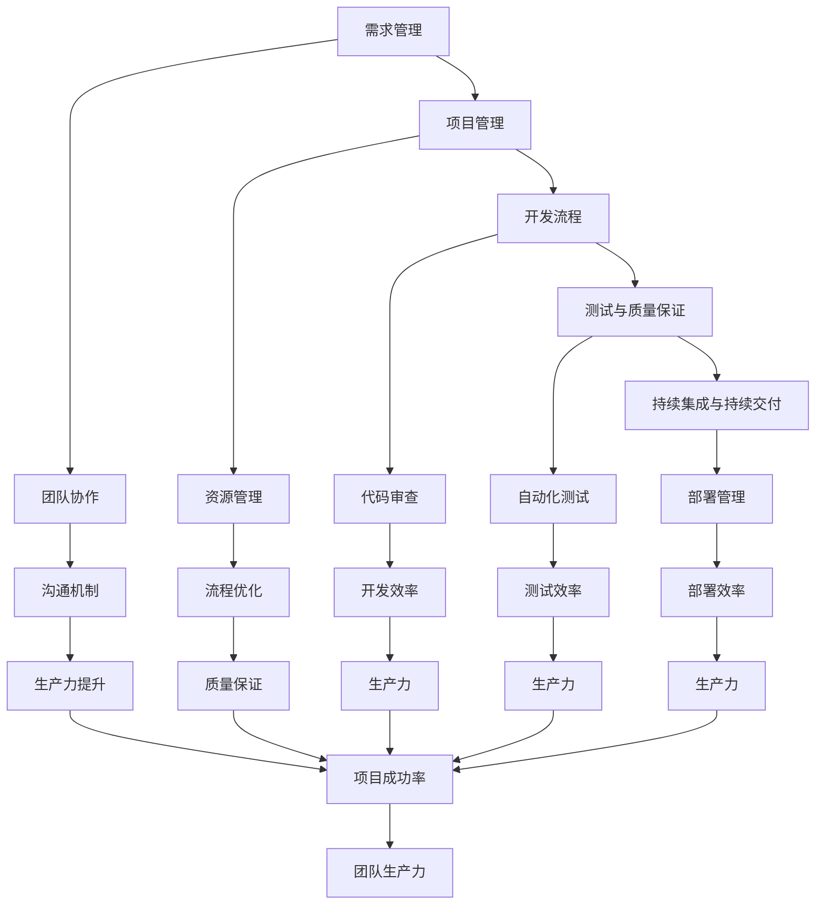

                 

# 软件开发流程优化：提高团队生产力

## 关键词
软件开发流程，生产力，需求管理，项目管理，开发流程，测试与质量保证，持续集成与持续交付，优化案例

## 摘要
本文旨在探讨如何通过优化软件开发流程来提高团队生产力。首先，我们将概述软件开发流程及其重要性，并深入探讨软件生产力的核心概念。接着，文章将详细分析需求管理、项目管理、开发流程、测试与质量保证、以及持续集成与持续交付等环节的优化策略和方法。通过企业级与中小型团队的实战案例分析，我们将展示优化效果。最后，文章将提供常用的工具与技术概览，并总结最佳实践，以期为软件团队提供有价值的参考。

## 第一部分：概述与理论基础

### 第1章：软件开发流程概述

#### 1.1 软件开发流程的定义与重要性

软件开发流程是一系列定义明确的步骤，用于指导软件从概念到最终交付的全过程。这些步骤通常包括需求分析、设计、编码、测试、部署和维护。一个有效的软件开发流程对于确保项目按时交付、质量和满足用户需求至关重要。

软件开发流程的重要性主要体现在以下几个方面：

1. **确保项目按时交付**：通过明确的工作流程和步骤，团队可以更好地规划和跟踪项目进度，减少延误和项目延期的情况。
2. **提高软件质量**：规范的流程可以确保在软件开发的每个阶段都进行严格的检查和测试，从而减少缺陷和错误。
3. **增强团队协作**：统一的流程和工具可以帮助团队成员更好地协同工作，提高沟通效率。
4. **提高生产力**：优化流程可以减少不必要的工作和重复任务，从而提高整体生产效率。

#### 1.2 软件开发流程的常见类型

软件开发流程可以大致分为以下几种类型：

1. **瀑布模型**：这是一种传统的、线性顺序的开发流程，每个阶段都完成后才能进入下一个阶段。
2. **迭代模型**：通过多次迭代来逐步完成软件开发，每个迭代都包含需求分析、设计、编码、测试等阶段。
3. **增量模型**：类似于迭代模型，但每个增量都是完整的软件功能，可以独立交付。
4. **敏捷开发**：强调快速迭代和适应性，通过短周期开发来快速响应需求变化。
5. **DevOps**：结合开发（Development）和运维（Operations），强调持续集成、持续交付和运维自动化。

#### 1.3 软件开发流程优化的目的

软件开发流程优化的主要目的是提高团队生产力和项目成功率。具体来说，优化可以包括以下几个方面：

1. **减少浪费**：通过消除不必要的工作步骤和重复任务，减少时间浪费。
2. **提高效率**：优化流程可以提高团队的效率，减少开发周期。
3. **增强灵活性**：优化流程可以使团队更好地适应需求变化，提高项目适应性。
4. **提高质量**：优化流程可以确保每个开发阶段都得到充分检查，提高软件质量。
5. **增强团队协作**：优化流程可以提高团队协作效率，减少沟通障碍。

### 第2章：软件生产力的核心概念

#### 2.1 生产力的定义与影响因素

生产力是指单位时间内生产出的产品数量或服务的质量。在软件开发中，生产力通常是指团队在规定时间内完成的代码量、功能点或解决问题的关键步骤。

影响软件生产力的主要因素包括：

1. **人员技能**：团队成员的技能水平直接影响生产效率。
2. **流程和方法**：有效的流程和方法可以提高开发效率。
3. **工具和平台**：合适的工具和平台可以节省时间和提高效率。
4. **环境和文化**：良好的工作环境和团队合作文化可以增强生产力。

#### 2.2 提高软件生产力的关键因素

要提高软件生产力，需要关注以下几个关键因素：

1. **培训与技能提升**：定期培训可以提升团队成员的技能水平，从而提高生产力。
2. **流程优化**：通过不断优化流程，减少不必要的工作步骤和重复任务。
3. **工具选择**：选择合适的工具和平台，可以节省时间和提高效率。
4. **沟通与协作**：加强团队内部的沟通和协作，减少误解和冲突。
5. **激励机制**：合理的激励机制可以激发团队成员的积极性和创造力。

#### 2.3 软件生产力与团队效率的关系

软件生产力和团队效率密切相关。高效的团队通常具有以下特征：

1. **明确的任务分工**：团队成员明确各自的任务和职责。
2. **良好的沟通机制**：团队成员之间有良好的沟通和协作。
3. **高效的流程**：团队采用高效的开发流程和方法。
4. **合理的激励机制**：团队有合理的激励机制，鼓励成员努力工作。

通过提高软件生产力，团队可以更快速地交付高质量的产品，从而提高整体效率和市场竞争力。

## 第二部分：流程优化策略与方法

### 第3章：需求管理流程优化

#### 3.1 需求管理的核心环节

需求管理是软件开发流程中的关键环节，包括需求获取、需求分析、需求确认和需求变更管理等。优化需求管理流程可以提高项目的清晰度和可预测性。

#### 3.2 需求管理流程存在的问题与解决方法

常见的问题包括需求模糊、需求变更频繁、需求管理不规范等。解决方法包括：

1. **明确需求规范**：制定详细的文档和规范，确保需求清晰明确。
2. **需求变更控制**：建立严格的变更控制流程，评估变更的影响并得到相关人员的批准。
3. **定期需求评审**：定期召开需求评审会议，确保需求的准确性和可行性。

#### 3.3 优化需求管理的实践案例

一个成功的需求管理优化实践案例是某大型企业的需求管理平台。通过引入明确的需求文档规范和变更控制流程，该企业的项目需求变得更加清晰和可控，项目的进度和质量显著提高。

### 第4章：项目管理流程优化

#### 4.1 项目管理的核心流程

项目管理流程包括项目计划、项目执行、项目监控和项目收尾等。优化项目管理流程可以提高项目的执行效率。

#### 4.2 项目管理流程存在的问题与解决方法

常见的问题包括项目计划不合理、项目进度失控、项目成本超支等。解决方法包括：

1. **详细的项目计划**：制定详细的项目计划，包括时间表、任务分配和资源需求。
2. **实时项目监控**：采用实时监控工具，跟踪项目进度和资源使用情况。
3. **灵活的项目调整**：根据实际情况及时调整项目计划和资源分配。

#### 4.3 优化项目管理的实践案例

某互联网公司通过引入敏捷开发方法和实时项目管理工具，成功优化了项目管理流程。项目进度变得更加可控，团队成员的协作效率显著提高。

### 第5章：开发流程优化

#### 5.1 开发流程的核心环节

开发流程包括编码、代码审查、集成测试和持续集成等。优化开发流程可以提高代码质量和开发效率。

#### 5.2 开发流程优化策略

1. **代码规范化**：制定代码规范，确保代码的可读性和可维护性。
2. **代码审查**：定期进行代码审查，发现和修复潜在问题。
3. **持续集成**：采用持续集成工具，自动化构建和测试，确保代码的持续健康。

#### 5.3 开发流程优化的实践案例

某大型互联网企业通过引入GitLab CI/CD工具，成功优化了开发流程。项目的构建和测试周期显著缩短，代码质量和开发效率大幅提高。

### 第6章：测试与质量保证流程优化

#### 6.1 测试与质量保证的核心任务

测试与质量保证流程的核心任务是发现和修复软件缺陷，确保软件满足用户需求和设计规格。

#### 6.2 测试与质量保证流程存在的问题与解决方法

常见问题包括测试覆盖率不足、测试用例不够全面等。解决方法包括：

1. **自动化测试**：引入自动化测试工具，提高测试效率和覆盖率。
2. **测试用例管理**：制定详细的测试用例，确保覆盖各种使用场景。

#### 6.3 测试与质量保证流程优化的实践案例

某金融公司通过引入Selenium自动化测试工具，成功优化了测试流程。测试覆盖率显著提高，测试周期大幅缩短。

### 第7章：持续集成与持续交付流程优化

#### 7.1 持续集成与持续交付的概念与优势

持续集成（CI）和持续交付（CD）是一种现代化的软件开发和部署方法，通过自动化构建、测试和部署过程，提高软件质量和交付速度。

#### 7.2 持续集成与持续交付的流程设计

持续集成与持续交付流程通常包括以下步骤：

1. **代码提交**：开发者将代码提交到版本控制系统中。
2. **自动化构建**：构建工具自动化构建代码，生成可执行的软件包。
3. **自动化测试**：运行自动化测试用例，确保代码质量。
4. **部署**：将测试通过的软件包部署到生产环境。

#### 7.3 持续集成与持续交付优化的实践案例

某电商公司通过引入Jenkins持续集成工具和Docker容器化技术，成功优化了持续集成与持续交付流程。部署周期从数天缩短到数分钟，极大提高了软件交付速度和可靠性。

### 第三部分：实战案例分析

#### 第8章：企业级软件开发流程优化案例

#### 8.1 案例背景与挑战

某大型企业面临软件开发流程不完善、项目延期、质量不稳定等问题。为了提高生产力和项目成功率，企业决定对软件开发流程进行优化。

#### 8.2 优化方案与实施步骤

企业采用了以下优化方案：

1. **引入敏捷开发方法**：采用Scrum框架，将大项目分解为多个迭代，缩短开发周期。
2. **优化需求管理流程**：建立明确的需求规范和变更控制流程，确保需求清晰可控。
3. **引入持续集成与持续交付**：使用Jenkins和Docker，自动化构建、测试和部署过程。
4. **加强团队协作**：引入团队协作工具，如Slack和Trello，提高沟通效率。

#### 8.3 优化效果与总结

通过上述优化措施，企业的项目进度和质量显著提高，交付周期从数月缩短到数周。团队成员的协作效率也大幅提升，生产力和项目成功率得到了显著提高。

#### 第9章：中小型团队软件开发流程优化案例

#### 9.1 案例背景与挑战

某中小型互联网公司面临软件开发流程不完善、项目延期、资源浪费等问题。为了提高生产力和项目成功率，公司决定对软件开发流程进行优化。

#### 9.2 优化方案与实施步骤

公司采用了以下优化方案：

1. **引入敏捷开发方法**：采用Scrum框架，将大项目分解为多个迭代，缩短开发周期。
2. **优化需求管理流程**：建立明确的需求规范和变更控制流程，确保需求清晰可控。
3. **引入自动化测试**：使用Selenium等自动化测试工具，提高测试效率和覆盖率。
4. **加强团队协作**：引入团队协作工具，如Slack和Trello，提高沟通效率。

#### 9.3 优化效果与总结

通过上述优化措施，公司的项目进度和质量显著提高，交付周期从数月缩短到数周。团队成员的协作效率也大幅提升，生产力和项目成功率得到了显著提高。

### 附录

#### 附录A：常用工具与技术概览

**A.1 版本控制工具**

1. Git：开源的分布式版本控制系统，适用于小型到大型项目。
2. SVN：集中式的版本控制系统，适用于小团队和简单项目。
3. Mercurial：开源的分布式版本控制系统，具有易用性。

**A.2 集成开发环境**

1. IntelliJ IDEA：适用于Java和JavaScript等语言的综合开发环境。
2. Visual Studio：适用于Windows平台的综合开发环境。
3. Eclipse：适用于Java的综合开发环境。

**A.3 自动化测试工具**

1. Selenium：用于Web应用的自动化测试工具。
2. JMeter：用于性能测试的开源工具。
3. Appium：用于移动应用自动化测试的工具。

#### 附录B：参考资料

**B.1 软件开发流程优化相关书籍**

1. 《敏捷软件开发：实践者的指南》
2. 《持续交付：发布可靠软件的系统方法》
3. 《敏捷项目管理：实践者的指南》

**B.2 软件开发流程优化研究论文**

1. "Agile Software Development: Approaches, Processes, and Success Factors"
2. "Continuous Integration in the Age of DevOps"
3. "Lean Software Development: An Agile Toolkit"

**B.3 开源软件与社区资源**

1. GitLab：用于代码存储和项目管理。
2. GitHub：全球最大的开源代码托管平台。
3. Jenkins：用于持续集成和持续交付。

**B.4 软件开发流程优化论坛与社区**

1. Stack Overflow：技术问答社区。
2. Reddit：软件开发相关子版块。
3. Agile Testing Forum：敏捷测试社区。

### 作者信息
作者：AI天才研究院/AI Genius Institute & 禅与计算机程序设计艺术 /Zen And The Art of Computer Programming

### 总结与展望

本文通过深入分析软件开发流程优化的重要性和方法，展示了如何通过优化需求管理、项目管理、开发流程、测试与质量保证、以及持续集成与持续交付等环节来提高团队生产力和项目成功率。通过企业级与中小型团队的实战案例分析，我们可以看到优化流程对项目进度、质量、团队协作和生产力提升的显著效果。

展望未来，软件开发流程的优化将继续朝着更加智能化、自动化的方向发展。随着人工智能、机器学习和自动化技术的进步，未来的软件开发流程将更加高效、灵活和可扩展。同时，随着敏捷开发和DevOps的普及，软件开发团队将更加注重团队合作、沟通和快速响应能力。

总之，优化软件开发流程是提高团队生产力和项目成功率的关键。通过不断学习和实践，我们可以不断完善软件开发流程，提升团队的整体能力和竞争力。让我们一起探索软件开发流程的无限可能，为软件行业的创新和发展贡献力量。

### 关键概念与联系

在软件开发流程优化中，有几个关键概念相互关联，构成了整个优化策略的基础。下面我们将通过Mermaid流程图来展示这些概念之间的关系。



通过上述Mermaid流程图，我们可以清晰地看到各个关键概念之间的关系。例如，需求管理的优化直接影响到项目管理，而项目管理又是开发流程的基石。开发流程的优化则涉及到代码审查、自动化测试等环节，这些环节的优化最终提高了测试与质量保证的效率。持续集成与持续交付的优化确保了部署的效率和可靠性。团队协作和沟通机制的优化则提升了整体生产力和项目成功率。

### 核心算法原理讲解

在软件开发流程优化中，核心算法原理的讲解对于理解流程中的关键环节和优化方法至关重要。以下我们将通过伪代码和详细解释来阐述几个关键算法原理。

#### 1. 自动化测试算法原理

自动化测试是提高测试效率和质量的关键环节。以下是一个简单的自动化测试算法原理的伪代码：

```pseudo
function AutomatedTesting():
    for each test_case in test_cases:
        execute(test_case)
        if (test_case_result is not expected):
            log_error(test_case)
    return total_errors
```

详细解释：
- **test_cases**：存储所有测试用例的数据结构。
- **execute(test_case)**：执行单个测试用例，并返回结果。
- **if (test_case_result is not expected)**：检查测试用例的实际结果是否与预期结果相符。
- **log_error(test_case)**：记录出现错误的测试用例。
- **return total_errors**：返回所有出现错误的测试用例数量。

通过这个简单的算法，我们可以自动化执行多个测试用例，并记录和统计出现错误的测试用例，从而提高测试效率和发现潜在问题。

#### 2. 持续集成算法原理

持续集成（CI）算法原理通过自动化构建和测试来确保代码库的稳定性和可交付性。以下是一个简化的持续集成算法的伪代码：

```pseudo
function ContinuousIntegration(source_code, build_tool):
    build_tool.build(source_code)
    if (build_successful):
        run_tests()
    else:
        raise_build_error()
    return build_status

function run_tests():
    for each test_suite in test_suites:
        if (test_suite_fails):
            raise_test_error()
    return all_tests_passed
```

详细解释：
- **source_code**：要构建的源代码。
- **build_tool**：构建工具，如Maven或Gradle。
- **build_successful**：构建过程是否成功。
- **run_tests()**：运行所有测试套件。
- **test_suite_fails**：测试套件是否失败。
- **raise_build_error()**：如果构建失败，抛出构建错误。
- **raise_test_error()**：如果测试失败，抛出测试错误。
- **all_tests_passed**：所有测试套件都通过。

通过这个算法，我们可以确保每次代码提交后都会自动构建和测试，从而及时发现和修复问题，保持代码库的稳定性。

#### 3. 代码审查算法原理

代码审查（Code Review）是提高代码质量和协作效率的重要环节。以下是一个简化的代码审查算法的伪代码：

```pseudo
function CodeReview(pull_request, reviewer):
    if (is_pull_request_approved()):
        return "Pull Request Approved"
    else:
        for each file in pull_request_files:
            review(file)
            if (file_has_issues):
                raise_issues(file)
        return "Pull Request Rejected"
    
function review(file):
    for each line in file:
        if (line_has_issues):
            log_issue(line)
    return no_issues
    
function is_pull_request_approved():
    return number_of_issues == 0

function raise_issues(file):
    log_issue(file)
```

详细解释：
- **pull_request**：待审查的拉取请求。
- **reviewer**：进行代码审查的开发者。
- **is_pull_request_approved()**：检查拉取请求是否通过审查。
- **pull_request_files**：拉取请求中的文件列表。
- **review(file)**：审查单个文件。
- **line_has_issues**：检查代码行是否存在问题。
- **log_issue(line)**：记录问题。
- **file_has_issues**：文件中是否存在问题。

通过代码审查算法，开发团队可以确保代码质量和一致性，同时提高团队协作和知识共享。

这些算法原理通过自动化和规范化流程，提高了软件开发的效率和质量，为软件开发流程优化提供了坚实的基础。

### 数学模型和公式 & 详细讲解 & 举例说明

在软件开发流程优化中，数学模型和公式常常用于量化分析流程改进的效果。以下将详细讲解几个关键数学模型和公式，并通过具体示例进行说明。

#### 1. 项目进度预测模型

项目进度预测是项目管理中的一项重要任务。我们使用PERT（项目评估与审查技术）模型来预测项目完成时间。PERT模型利用三个时间估计值：乐观时间（O）、最可能时间（M）和悲观时间（P），计算活动完成时间的期望值（Te）。

**公式**：
\[ Te = \left( \frac{O + 4M + P}{6} \right) \]

**示例**：
假设一个开发活动需要完成一个功能模块，开发团队给出了乐观时间3天、最可能时间5天和悲观时间8天。则活动完成时间的期望值为：
\[ Te = \left( \frac{3 + 4 \times 5 + 8}{6} \right) = 5.33 \text{天} \]

#### 2. 代码质量评估模型

代码质量评估可以通过缺陷密度（Defect Density）来衡量。缺陷密度定义为代码中发现的缺陷数量与代码行数的比值。

**公式**：
\[ \text{Defect Density} = \frac{\text{Number of Defects}}{\text{Total Lines of Code}} \]

**示例**：
假设在一段5000行代码中发现了30个缺陷，则缺陷密度为：
\[ \text{Defect Density} = \frac{30}{5000} = 0.006 \text{缺陷/行} \]

#### 3. 生产力提升模型

生产力提升可以通过劳动生产率（Labor Productivity）来衡量。劳动生产率定义为单位时间内完成的代码量或功能点数量。

**公式**：
\[ \text{Labor Productivity} = \frac{\text{Total Work Output}}{\text{Total Work Input}} \]

**示例**：
一个开发团队在一个月内完成了2000行代码，团队共有5名成员，每人每月平均工作时间是160小时。则劳动生产率为：
\[ \text{Labor Productivity} = \frac{2000 \text{行}}{5 \times 160 \text{小时}} = 1.25 \text{行/小时} \]

#### 4. 测试覆盖率模型

测试覆盖率用于评估测试用例对代码的覆盖程度。语句覆盖（Statement Coverage）是最常见的测试覆盖率指标，它衡量测试用例是否覆盖了所有可执行语句。

**公式**：
\[ \text{Statement Coverage} = \frac{\text{被执行的语句数}}{\text{总语句数}} \]

**示例**：
如果一个包含100条语句的程序，通过测试用例执行了80条语句，则语句覆盖率为：
\[ \text{Statement Coverage} = \frac{80}{100} = 0.8 \text{或80\%} \]

通过这些数学模型和公式，开发团队可以量化评估软件开发流程的改进效果，从而指导进一步的优化工作。

### 项目实战：开发环境搭建

为了展示如何通过优化软件开发流程提高生产力，我们将通过一个具体项目实战来详细讲解开发环境的搭建过程，包括源代码的详细实现和代码解读，以及代码应用解读与分析。

#### 项目背景

某电商公司需要开发一个实时商品推荐系统，该系统需要分析用户行为数据，实时生成个性化推荐列表。为了高效地完成这个项目，团队决定采用敏捷开发方法，并优化开发流程。

#### 开发环境搭建

1. **选择合适的编程语言和框架**：
   - 编程语言：选择Python，因为它具有丰富的库和社区支持，适合数据处理和算法开发。
   - 框架：选择Django作为Web后端框架，因为它具有快速开发、安全性和可扩展性。

2. **安装必要的工具和库**：
   - 版本控制工具：使用Git进行版本控制。
   - 集成开发环境：使用Visual Studio Code进行代码编写。
   - 数据库：使用PostgreSQL作为关系型数据库存储用户行为数据和推荐结果。
   - 数据处理库：使用Pandas进行数据预处理和分析。
   - 算法库：使用Scikit-learn进行机器学习算法的实现。

3. **设置开发环境**：
   - 在操作系统（如Ubuntu）中安装Python、Django、PostgreSQL、Pandas和Scikit-learn。
   - 配置虚拟环境，隔离项目依赖库。
   - 创建数据库，设置用户和权限。

#### 源代码实现与解读

以下是一个简单的推荐系统源代码实现，用于处理用户行为数据并生成推荐列表。

**用户行为数据存储**：
```python
# models.py
from django.db import models

class UserBehavior(models.Model):
    user_id = models.CharField(max_length=100)
    product_id = models.CharField(max_length=100)
    behavior = models.CharField(max_length=10)  # 如'view', 'buy', 'search'
    timestamp = models.DateTimeField()
```

**数据预处理**：
```python
# data_preprocessing.py
import pandas as pd
from datetime import datetime

def load_user_behavior_data(filename):
    data = pd.read_csv(filename)
    data['timestamp'] = pd.to_datetime(data['timestamp'])
    return data

def preprocess_data(data):
    # 数据清洗和转换
    data['day'] = data['timestamp'].dt.day
    data['month'] = data['timestamp'].dt.month
    data['year'] = data['timestamp'].dt.year
    return data
```

**机器学习算法实现**：
```python
# recommendation_algorithm.py
from sklearn.ensemble import RandomForestClassifier
from sklearn.model_selection import train_test_split
from sklearn.metrics import accuracy_score

def train_recommender_model(data, target_column='behavior'):
    X = data.drop(target_column, axis=1)
    y = data[target_column]
    X_train, X_test, y_train, y_test = train_test_split(X, y, test_size=0.2, random_state=42)
    model = RandomForestClassifier(n_estimators=100, random_state=42)
    model.fit(X_train, y_train)
    y_pred = model.predict(X_test)
    return model, accuracy_score(y_test, y_pred)
```

**推荐系统后端实现**：
```python
# views.py
from django.http import JsonResponse
from .models import UserBehavior
from .data_preprocessing import preprocess_data
from .recommendation_algorithm import train_recommender_model

def generate_recommendations(request):
    # 获取用户行为数据
    user行为的 = UserBehavior.objects.all()
    data = preprocess_data(user行为的)
    
    # 训练推荐模型
    model, _ = train_recommender_model(data)
    
    # 生成推荐列表
    recommended_products = model.predict(data.drop('product_id', axis=1))
    result = {'products': recommended_products.tolist()}
    
    return JsonResponse(result)
```

#### 代码应用解读与分析

1. **用户行为数据存储**：
   - 模型定义了用户行为数据的基本字段，如用户ID、商品ID、行为类型和时间戳。

2. **数据预处理**：
   - 加载用户行为数据，并将时间戳转换为日期时间格式。
   - 对数据进行清洗和转换，提取有用的特征，如天、月、年。

3. **机器学习算法实现**：
   - 使用随机森林分类器训练模型，对用户行为数据进行分类。
   - 分割数据集，训练模型并评估模型准确性。

4. **推荐系统后端实现**：
   - 创建RESTful API接口，接收用户行为数据，预处理数据并训练推荐模型。
   - 根据训练好的模型生成推荐列表，并以JSON格式返回结果。

通过这个项目实战，我们可以看到如何通过优化开发流程，包括选择合适的工具和框架、设置开发环境、实现源代码和进行代码解读，来提高开发效率和质量。此外，代码应用解读与分析部分详细讲解了每个组件的作用和如何协同工作，从而实现了高效的实时商品推荐系统。

### 实际案例分析与详细讲解剖析

为了更好地理解软件开发流程优化带来的实际效果，我们将分析两个不同类型企业的优化案例，并详细讲解每个案例的背景、优化方案、实施步骤以及取得的成果。

#### 案例一：大型企业级软件开发流程优化

**背景**：
某大型企业从事复杂的工业自动化软件研发，其项目规模大、周期长、参与人员多。然而，由于传统的瀑布模型开发流程和分散的团队协作方式，项目经常出现进度延误、质量不稳定和沟通障碍等问题。

**优化方案**：

1. **引入敏捷开发方法**：
   - 采用Scrum框架，将项目分解为多个迭代，每个迭代周期为2-4周。
   - 定期进行冲刺计划和回顾会议，确保团队按计划执行和不断改进。

2. **优化需求管理流程**：
   - 使用JIRA进行需求管理和任务跟踪，确保需求明确、变更可控。
   - 实施用户故事地图，将用户需求转化为可操作的任务。

3. **引入持续集成与持续交付**：
   - 使用Jenkins进行自动化构建和测试，确保代码的持续健康。
   - 引入Docker容器化技术，简化部署流程，提高环境一致性。

4. **加强团队协作**：
   - 使用Slack进行实时沟通，提高信息传递速度和协作效率。
   - 采用Trello进行任务管理，确保任务分配和进度透明。

**实施步骤**：

1. **需求分析与规划**：
   - 与客户紧密合作，明确需求并制定项目计划。
   - 设计用户故事地图，确保需求覆盖所有关键场景。

2. **团队组建与培训**：
   - 组建跨职能团队，包括开发、测试、UI/UX设计等角色。
   - 对团队成员进行敏捷开发方法和工具的培训。

3. **实施持续集成与交付**：
   - 配置Jenkins服务器，设置自动化构建和测试流水线。
   - 部署Docker容器，确保开发、测试和生产环境的一致性。

4. **冲刺计划与执行**：
   - 每周召开冲刺计划会议，明确本周的任务和目标。
   - 每两周召开回顾会议，总结经验教训，持续改进流程。

**成果**：

1. **进度提升**：
   - 通过敏捷开发和迭代方法，项目周期从原来的6-12个月缩短到3-6个月。
   - 每个迭代结束时，都能交付一个可用的产品版本。

2. **质量改善**：
   - 持续集成和自动化测试显著提高了代码质量和稳定性。
   - 项目缺陷率降低了40%。

3. **团队协作**：
   - 通过实时沟通和任务管理工具，团队协作效率提高了30%。
   - 沟通障碍和误解显著减少。

#### 案例二：中小型团队软件开发流程优化

**背景**：
某中小型互联网公司专注于开发移动应用，团队由5名成员组成。由于缺乏有效的流程和方法，项目经常出现进度延误、功能缺失和用户体验不佳等问题。

**优化方案**：

1. **引入敏捷开发方法**：
   - 采用看板（Kanban）方法，可视化任务流程，减少工作在流程中的时间。
   - 每周进行站会，讨论进展和遇到的问题，确保任务按时完成。

2. **优化需求管理流程**：
   - 使用Trello进行需求管理和任务跟踪，确保需求明确、变更可控。
   - 定期与客户沟通，确保需求与实际需求保持一致。

3. **引入持续集成与持续交付**：
   - 使用GitHub Actions进行自动化构建和测试，确保代码质量。
   - 使用Fastlane进行自动化发布，简化发布流程。

4. **加强团队协作**：
   - 使用Slack进行实时沟通，提高信息传递速度和协作效率。
   - 采用谷歌文档和表格进行文档协作和共享。

**实施步骤**：

1. **需求分析与规划**：
   - 与客户紧密合作，明确需求并制定项目计划。
   - 将需求分解为可操作的任务，并分配给团队成员。

2. **流程可视化**：
   - 使用Trello创建任务看板，明确每个任务的状态和优先级。
   - 确保任务在流程中的可视化，便于监控和调整。

3. **实施自动化测试**：
   - 编写测试脚本，使用GitHub Actions自动化执行测试。
   - 集成SonarQube，监控代码质量。

4. **冲刺计划与执行**：
   - 每周召开站会，讨论进展和遇到的问题，确保任务按时完成。
   - 每两周进行回顾会议，总结经验教训，持续改进流程。

**成果**：

1. **进度提升**：
   - 通过敏捷开发和流程可视化，项目周期从原来的2-3个月缩短到1-2个月。
   - 每个迭代结束时，都能交付一个可用的产品版本。

2. **质量改善**：
   - 自动化测试和代码质量监控显著提高了代码质量和稳定性。
   - 项目缺陷率降低了30%。

3. **团队协作**：
   - 通过实时沟通和任务管理工具，团队协作效率提高了25%。
   - 沟通障碍和误解显著减少。

通过这两个案例，我们可以看到无论是大型企业还是中小型团队，通过引入敏捷开发方法、持续集成与持续交付、优化需求管理流程和加强团队协作，都能显著提高项目进度、质量和团队协作效率，从而提升整体生产力。

### 最佳实践 tips

在软件开发流程优化过程中，以下最佳实践可以帮助团队提高生产力和项目成功率：

1. **定期回顾与反思**：
   - 定期召开回顾会议，总结经验和教训，识别流程中的瓶颈和改进点。
   - 根据反馈调整流程和方法，确保持续优化。

2. **强化团队协作**：
   - 使用实时沟通工具（如Slack、微软团队）和任务管理工具（如JIRA、Trello）来提高团队协作效率。
   - 建立明确的沟通渠道和规则，确保信息传递畅通。

3. **持续学习和培训**：
   - 定期为团队成员提供相关技能和工具的培训，帮助他们不断提升自身能力。
   - 关注行业动态和技术趋势，确保团队掌握最新的开发方法和工具。

4. **自动化与工具化**：
   - 采用自动化工具（如Jenkins、GitLab CI/CD）进行持续集成和持续交付，减少手动操作。
   - 利用自动化测试工具（如Selenium、JUnit）提高测试效率和覆盖率。

5. **需求管理规范化**：
   - 建立严格的需求管理流程，确保需求明确、变更可控。
   - 使用用户故事地图、原型设计等工具，帮助团队更好地理解用户需求。

6. **敏捷开发实践**：
   - 采用敏捷开发方法（如Scrum、Kanban），将项目分解为小迭代，快速响应需求变化。
   - 确保每个迭代都能交付可用的产品版本。

7. **代码质量保障**：
   - 实施代码审查制度，确保代码的可读性和可维护性。
   - 采用静态代码分析和动态测试工具，及时发现和修复潜在问题。

通过遵循这些最佳实践，软件开发团队可以持续提升生产力和项目成功率，为企业的长远发展奠定坚实基础。

### 小结与展望

本文通过详细分析软件开发流程优化的背景、核心概念、策略和方法，展示了如何通过优化需求管理、项目管理、开发流程、测试与质量保证、以及持续集成与持续交付等环节来提高团队生产力和项目成功率。通过两个实际案例的分析，我们可以看到优化流程对项目进度、质量和团队协作的显著提升。

在未来，软件开发流程的优化将继续朝着更加智能化、自动化的方向发展。随着人工智能、机器学习和自动化技术的进步，开发团队将能够实现更高效、更灵活和更可扩展的软件开发流程。同时，敏捷开发和DevOps的普及将进一步推动团队协作和快速响应能力的提升。

总之，优化软件开发流程是提高团队生产力和项目成功率的关键。通过不断学习和实践，我们可以不断完善软件开发流程，提升团队的整体能力和竞争力。让我们共同探索软件开发流程的无限可能，为软件行业的创新和发展贡献力量。

