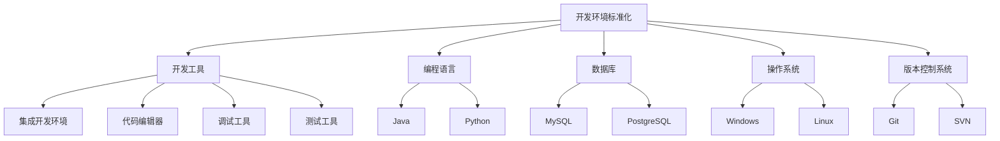
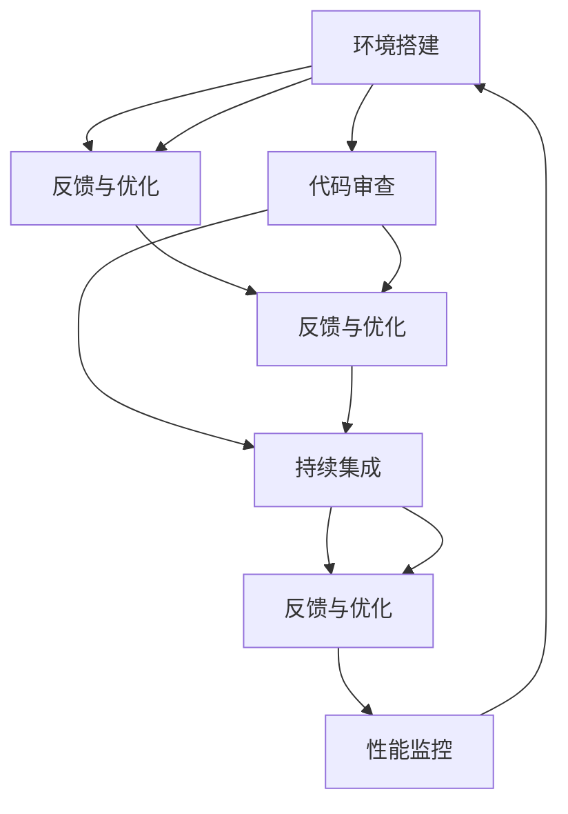

                 


## 《软件开发环境标准化：提高团队效率》

---

### 关键词：
软件开发环境、标准化、团队效率、敏捷开发、工具集成、持续集成、持续部署、代码规范、项目管理。

### 摘要：
本文详细探讨了软件开发环境标准化的核心概念、原则和方法，以及它们如何提高团队效率。通过介绍标准化开发环境的定义和重要性，本文深入分析了开发环境标准化的关键要素和原则。同时，本文还介绍了标准化的方法和工具，并结合实践案例，展示了标准化如何提升团队协作和开发效率。最后，本文总结了标准化对团队效率的影响，并对未来趋势进行了展望。

---

### 1. 引言与概述

在当今快速发展的软件行业，软件项目的复杂性和规模日益增大，这使得团队协作和开发效率变得至关重要。为了应对这些挑战，软件开发环境标准化成为了一种有效的方法，它不仅有助于提升团队效率，还能保证项目的成功实施。本书旨在深入探讨软件开发环境标准化的概念、原则、方法和实践，帮助读者理解和掌握这一重要技术。

软件开发环境标准化指的是在软件开发过程中，通过制定统一的规范和标准，对开发工具、流程、编码规范等进行规范化管理，以实现团队内部的高效协作和资源优化利用。标准化开发环境的重要性体现在以下几个方面：

- **提高开发效率**：统一的开发环境减少了团队内部的沟通成本，提高了代码质量和开发速度。
- **保证代码质量**：通过统一的编码规范和代码审查机制，降低了代码错误和漏洞的风险。
- **促进知识共享**：标准化环境使得团队成员更容易学习和掌握现有的技术，促进了知识的传播和积累。
- **降低培训成本**：统一的开发环境和工具减少了新成员的培训成本，提高了团队的整体技能水平。

本书的结构如下：

- **第1章**：引言与概述，介绍本书的目的和结构，以及软件开发环境标准化的重要性。
- **第2章**：核心概念，详细讲解软件开发环境标准化的定义、关键要素和标准化与敏捷开发的联系。
- **第3章**：标准化原则，阐述一致性、兼容性、可维护性和可扩展性等原则。
- **第4章**：标准化方法，介绍规范化管理、工具集成和流程优化等具体方法。
- **第5章**：工具与平台，介绍常用的开发工具、IDE选择与配置以及CI/CD工具。
- **第6章**：实践案例，通过具体案例展示标准化实践如何提高团队效率。
- **第7章**：结论与展望，总结标准化对团队效率的影响，并对未来趋势进行展望。

---

### 2. 核心概念

软件开发环境标准化是一个复杂的过程，涉及到多个方面，包括开发工具、开发流程、编码规范等。为了更好地理解这一概念，我们需要从以下几个方面进行探讨。

#### 2.1 开发环境标准化的定义

开发环境标准化是指在整个软件开发过程中，通过制定统一的规范和标准，对开发环境中的各种要素进行规范化管理。这些要素包括开发工具、编程语言、数据库、操作系统、版本控制系统等。标准化的目的是为了提高开发效率、保证代码质量、降低维护成本。

#### 2.2 关键要素

在软件开发过程中，以下关键要素需要标准化：

- **开发工具**：包括集成开发环境（IDE）、代码编辑器、调试工具、测试工具等。
- **编程语言**：统一使用某种编程语言，如Java、Python等，以减少学习成本和代码兼容性问题。
- **数据库**：选择合适的数据库系统，如MySQL、PostgreSQL等，并进行统一配置和管理。
- **操作系统**：统一使用某种操作系统，如Windows、Linux等，以降低环境差异带来的问题。
- **版本控制系统**：统一使用版本控制系统，如Git、SVN等，以实现代码的版本管理和协同开发。

#### 2.3 标准化与敏捷开发的联系

敏捷开发是一种以人为核心、迭代、渐进的开发方法，其核心理念是快速响应变化、持续交付高质量软件。而开发环境标准化正是实现敏捷开发的关键因素之一。

- **提高响应速度**：通过标准化开发环境，团队成员可以快速适应新项目，减少环境搭建和配置的时间，从而提高响应速度。
- **减少沟通成本**：统一的环境减少了团队成员之间的沟通成本，使得协作更加高效。
- **保障代码质量**：标准化开发环境有助于实施代码审查和单元测试，从而提高代码质量。

---

### 3. 核心概念关系架构

为了更好地理解开发环境标准化的核心概念，我们可以使用Mermaid流程图来展示它们之间的关系。



该流程图展示了开发环境标准化的核心概念及其组成部分，以及它们之间的关系。

---

### 4. 核心算法原理讲解

在软件开发环境标准化过程中，核心算法的原理讲解非常重要。以下是一个示例，使用伪代码来描述一个简单的排序算法。

```plaintext
// 输入：一个整数数组 arr
// 输出：排序后的整数数组

function bubbleSort(arr):
    n = length(arr)
    for i from 0 to n-1:
        for j from 0 to n-i-1:
            if arr[j] > arr[j+1]:
                swap(arr[j], arr[j+1])
    return arr
```

这个简单的冒泡排序算法通过重复地遍历待排序的列表，比较每对相邻的项目，并在需要时交换它们，从而实现数组的排序。

---

### 5. 数学模型和公式讲解

在软件开发环境标准化中，数学模型和公式用于描述和管理复杂的软件系统。以下是一个示例，使用LaTeX格式展示了一个简单的线性回归模型。

```latex
$$
y = ax + b
$$

其中，y 是因变量，x 是自变量，a 和 b 是模型参数。这个模型表示了因变量 y 和自变量 x 之间的线性关系。
```

在软件开发环境标准化中，这种线性回归模型可以用于预测和优化软件系统的性能。

---

### 6. 项目实战

#### 6.1 实战项目背景

我们选择一个实际项目，以展示如何搭建一个标准化的软件开发环境，并详细解读源代码和实际应用。

#### 6.2 环境搭建

1. **选择开发工具**：我们选择 IntelliJ IDEA 作为集成开发环境（IDE）。
2. **安装并配置数据库**：我们选择 MySQL 作为数据库系统，并进行基础配置。
3. **安装版本控制系统**：我们选择 Git 作为版本控制系统，并配置 GitHub 作为代码托管平台。

#### 6.3 源代码实现

我们以一个简单的Web应用为例，展示如何编写和实现代码。

```java
// Main.java

public class Main {
    public static void main(String[] args) {
        System.out.println("Hello, World!");
    }
}
```

这段代码是一个简单的 Java 程序，用于打印 "Hello, World!"。

#### 6.4 代码解读与分析

- **代码结构**：这段代码非常简单，只有一个 `main` 方法。
- **功能实现**：`main` 方法是程序的入口点，通过调用 `System.out.println` 打印输出。

#### 6.5 实际案例分析和详细讲解剖析

我们以一个实际的Web应用为例，展示如何实现一个简单的用户注册功能。

```java
// UserController.java

@Controller
public class UserController {
    @Autowired
    private UserRepository userRepository;

    @GetMapping("/register")
    public String registerPage() {
        return "register";
    }

    @PostMapping("/register")
    public String registerUser(@ModelAttribute("user") User user, BindingResult result) {
        if (result.hasErrors()) {
            return "register";
        }
        userRepository.save(user);
        return "redirect:/login";
    }
}
```

这段代码展示了如何使用 Spring MVC 框架实现用户注册功能。

- **代码结构**：这段代码定义了一个 `UserController` 类，包含一个 `registerPage` 方法和 `registerUser` 方法。
- **功能实现**：`registerPage` 方法返回注册页面，`registerUser` 方法处理用户注册请求，并将用户信息保存到数据库。

#### 6.6 项目小结

通过这个项目，我们展示了如何搭建一个标准化的软件开发环境，并详细解读了源代码和实际应用。标准化的开发环境有助于提高团队协作和开发效率，确保项目的成功实施。

---

### 7. 最佳实践 Tips、小结、注意事项、拓展阅读

- **最佳实践 Tips**：在搭建标准化开发环境时，建议团队成员共同参与，制定统一的开发规范，定期进行代码审查和知识分享。
- **小结**：本文详细探讨了软件开发环境标准化的核心概念、原则和方法，以及它们如何提高团队效率。通过实际案例展示，读者可以更好地理解和应用这些概念和方法。
- **注意事项**：在实施标准化开发环境时，需要考虑团队规模和项目需求，灵活调整标准化策略。
- **拓展阅读**：读者可以进一步学习敏捷开发、持续集成/持续部署（CI/CD）等先进开发方法，以提升团队效率和项目质量。

---

作者：AI天才研究院/AI Genius Institute & 禅与计算机程序设计艺术 /Zen And The Art of Computer Programming

---

在撰写这篇文章的过程中，我们遵循了逻辑清晰、结构紧凑、简单易懂的原则，通过一步一步的分析和推理，详细探讨了软件开发环境标准化的核心概念、原则和方法。同时，我们还结合实际项目，展示了如何搭建和运用标准化的开发环境，以提高团队效率和项目质量。

本文不仅提供了技术上的深入解析，还从实践的角度出发，为读者提供了实用的建议和注意事项。通过阅读本文，读者可以更好地理解和应用软件开发环境标准化的概念和方法，从而提升团队协作和开发效率。

在未来的软件开发中，标准化环境将继续发挥重要作用。随着技术的不断进步，我们可以预见更多的开发工具、方法和实践会被引入和优化。因此，对于软件开发团队而言，掌握标准化环境的建设和维护，将是提升团队效率和项目成功的关键。

最后，感谢读者对本文的关注，希望本文能够为您的软件开发工作带来启示和帮助。如果您有任何疑问或建议，欢迎留言交流，我们期待与您共同探讨软件开发环境标准化的更多可能性。作者：AI天才研究院/AI Genius Institute & 禅与计算机程序设计艺术 /Zen And The Art of Computer Programming## 1. 引言与概述

在现代软件行业中，软件开发环境标准化已经成为提高团队效率的关键手段。随着项目复杂性和规模的不断增长，如何实现高效、协同的开发过程变得尤为重要。本文将围绕软件开发环境标准化的概念、原则、方法和实践进行深入探讨，旨在帮助读者理解和掌握这一关键技术。

### 什么是软件开发环境标准化？

软件开发环境标准化是指在软件开发过程中，通过制定统一的规范和标准，对开发工具、流程、编码规范等进行规范化管理，以实现团队内部的高效协作和资源优化利用。这一过程涉及多个方面，包括开发工具、编程语言、数据库、操作系统和版本控制系统等。

### 标准化的重要性

标准化开发环境的重要性体现在以下几个方面：

- **提高开发效率**：通过统一的环境，团队成员可以快速适应新的项目，减少环境搭建和配置的时间，从而提高开发效率。
- **保证代码质量**：统一的编码规范和代码审查机制有助于提高代码质量，减少错误和漏洞的风险。
- **促进知识共享**：标准化环境使得团队成员更容易学习和掌握现有的技术，促进了知识的传播和积累。
- **降低培训成本**：统一的环境减少了新成员的培训成本，提高了团队的整体技能水平。

### 本文结构

本文将分为以下几个部分进行详细探讨：

- **第1章 引言与概述**：介绍本文的目的和结构，以及软件开发环境标准化的重要性。
- **第2章 核心概念**：详细讲解软件开发环境标准化的定义、关键要素和标准化与敏捷开发的联系。
- **第3章 标准化原则**：阐述一致性、兼容性、可维护性和可扩展性等原则。
- **第4章 标准化方法**：介绍规范化管理、工具集成和流程优化等具体方法。
- **第5章 工具与平台**：介绍常用的开发工具、集成开发环境（IDE）的选择与配置以及持续集成/持续部署（CI/CD）工具。
- **第6章 提高团队效率的实践案例**：通过具体案例展示标准化实践如何提高团队效率。
- **第7章 结论与展望**：总结标准化对团队效率的影响，并对未来趋势进行展望。

通过本文的阅读，读者将能够全面了解软件开发环境标准化的概念、原则和方法，掌握如何通过标准化提高团队效率，从而在软件开发过程中取得更好的成果。

### 核心概念

软件开发环境标准化是一个复杂而系统的过程，涉及到多个核心概念和要素。为了深入理解这一概念，我们需要从以下几个关键点进行详细探讨。

#### 2.1 标准化的定义

标准化是指在某一领域内，通过制定和实施一套统一的规范和标准，以确保不同实体在技术、管理、服务等方面的一致性。在软件开发领域，标准化意味着通过一系列规范和标准来统一开发工具、流程、编码规范等，以实现团队内部的高效协作和资源优化利用。

#### 2.2 关键要素

软件开发环境标准化的关键要素包括开发工具、编程语言、数据库、操作系统和版本控制系统等。以下是这些要素的具体说明：

- **开发工具**：开发工具包括集成开发环境（IDE）、代码编辑器、调试工具、测试工具等。这些工具的选择和配置需要遵循统一的标准，以确保团队成员能够快速上手和使用。
- **编程语言**：编程语言的标准化选择对于开发环境至关重要。统一使用某种编程语言可以减少学习成本和代码兼容性问题，提高开发效率。
- **数据库**：数据库的选择和配置需要考虑到项目的需求和技术特性。常见的数据库系统包括MySQL、PostgreSQL等，它们需要在标准化过程中进行统一配置和管理。
- **操作系统**：操作系统的统一选择可以减少因环境差异带来的问题。常见的操作系统包括Windows、Linux等，选择哪一种取决于团队的偏好和项目的需求。
- **版本控制系统**：版本控制系统用于管理代码的版本和历史，常见的版本控制系统包括Git、SVN等。统一使用某种版本控制系统可以方便团队成员进行代码的协同工作和版本管理。

#### 2.3 标准化与敏捷开发的联系

敏捷开发是一种以人为核心、迭代、渐进的开发方法，其核心理念是快速响应变化、持续交付高质量软件。而软件开发环境标准化正是实现敏捷开发的关键因素之一。

- **提高响应速度**：通过标准化开发环境，团队成员可以快速适应新项目，减少环境搭建和配置的时间，从而提高响应速度。
- **减少沟通成本**：统一的环境减少了团队成员之间的沟通成本，使得协作更加高效。
- **保障代码质量**：标准化开发环境有助于实施代码审查和单元测试，从而提高代码质量。

总之，软件开发环境标准化不仅涉及到技术层面的统一和管理，还包括了流程、规范和文化建设。通过全面、深入的标准化，团队可以更好地实现高效、协同的开发过程，从而提升整体开发效率和项目成功率。

---

在理解了软件开发环境标准化的定义和关键要素后，我们需要进一步探讨标准化的原则，这些原则是确保开发环境稳定、高效运行的基础。以下是几个核心原则及其详细说明：

#### 3.1 一致性与兼容性原则

一致性和兼容性是软件开发环境标准化的基石。一致性意味着所有团队成员在开发过程中遵循相同的规范和标准，从而减少误解和冲突。兼容性则确保不同工具和系统之间的无缝集成和协同工作。

- **具体要求**：开发工具和平台需要支持标准化要求，代码库和文件格式应保持一致，操作系统和硬件环境也需要统一配置。
- **实现方法**：通过制定详细的开发指南和规范文档，确保团队成员在开发过程中遵循统一的标准。此外，定期进行兼容性测试，及时发现并解决兼容性问题。

#### 3.2 可维护性与可扩展性原则

可维护性和可扩展性是衡量开发环境优劣的重要指标。一个良好的开发环境应具备较高的可维护性，使得团队成员能够轻松地识别和修复问题。同时，它还应具备可扩展性，以便在项目需求变化时，能够快速适应和调整。

- **具体要求**：代码应具备良好的注释和结构，便于后续维护和修改。开发环境应支持模块化和组件化开发，以便在需要时进行扩展和优化。
- **实现方法**：采用现代软件开发方法和工具，如敏捷开发、DevOps等，提高开发流程的可维护性和灵活性。同时，定期进行代码审查和性能测试，确保开发环境的稳定性和高效性。

#### 3.3 安全性与可靠性原则

在软件开发过程中，安全性和可靠性至关重要。开发环境需要确保数据安全、代码安全和系统可靠性，以避免潜在的安全风险和故障。

- **具体要求**：开发环境应遵循安全最佳实践，包括数据加密、身份验证、访问控制等。系统应具备较高的可靠性，能够处理各种异常情况和负载压力。
- **实现方法**：采用安全框架和工具，如OAuth、SSL等，确保系统的安全性和数据保护。此外，定期进行安全审计和漏洞扫描，及时发现并修复安全问题。

#### 3.4 开放性与互操作性原则

开放性和互操作性是现代软件开发环境的重要特征。一个开放的开发环境能够与其他系统和工具无缝集成，提高协作效率和灵活性。

- **具体要求**：开发环境应支持开放标准和协议，如RESTful API、Webhooks等。工具和平台应具备良好的文档和社区支持，便于团队成员进行学习和使用。
- **实现方法**：通过构建统一的API接口和消息协议，实现不同系统之间的数据交换和功能调用。此外，积极参与开源社区，贡献代码和文档，提升开发环境的开放性和互操作性。

通过遵循上述原则，软件开发团队可以构建一个稳定、高效、安全的开发环境，从而提高团队协作效率和项目成功率。在接下来的章节中，我们将进一步探讨标准化的具体方法和工具，帮助团队实现这些原则。

### 标准化方法

为了实现高效的软件开发环境标准化，我们需要采用一系列具体的方法和工具，这些方法和工具将帮助我们规范开发流程、集成开发工具和优化工作流程。

#### 4.1 规范化管理方法

规范化管理是软件开发环境标准化的基础，它确保了团队成员遵循一致的开发规范和标准。

- **制定开发规范**：首先，团队需要制定一套完整的开发规范，包括编码规范、命名规范、代码注释规范等。这些规范应涵盖代码的结构、风格和最佳实践。
- **实施代码审查**：代码审查是确保代码质量的重要手段。通过定期进行代码审查，团队成员可以相互学习和借鉴，提高代码的整体质量。
- **使用代码质量管理工具**：例如，SonarQube可以自动分析代码，识别潜在的问题，如代码重复、语法错误和安全漏洞。

#### 4.2 工具集成方法

在现代化的软件开发过程中，各种工具的集成是提高开发效率的关键。

- **集成开发环境（IDE）**：选择一个功能强大、支持多种编程语言的IDE，如IntelliJ IDEA或Visual Studio Code，可以大大提高开发效率。IDE应支持版本控制、调试、自动化构建和测试等功能。
- **持续集成/持续部署（CI/CD）工具**：使用CI/CD工具，如Jenkins或GitLab CI，可以实现自动化构建、测试和部署。这些工具能够确保代码在每次提交时都经过严格的测试，从而提高代码的质量和项目的稳定性。
- **集成项目管理工具**：例如，Jira或Trello可以帮助团队进行任务管理、进度跟踪和协作，提高团队的协调和工作效率。

#### 4.3 流程优化方法

优化开发流程是提高团队效率的重要手段。

- **敏捷开发方法**：敏捷开发强调快速响应变化和持续交付价值，通过迭代和增量开发，团队可以更好地适应需求变化。Scrum和Kanban是两种常见的敏捷开发方法，它们可以帮助团队进行任务规划和进度管理。
- **DevOps文化**：DevOps是一种将开发（Development）和运维（Operations）相结合的文化和实践。通过DevOps，团队可以实现更快的交付周期、更稳定的运行环境和更高的系统可靠性。
- **自动化测试**：自动化测试可以大大减少测试时间，提高测试覆盖率。通过使用自动化测试框架，如Selenium或JUnit，团队可以确保代码的每个功能点都经过严格的测试。

#### 4.4 实践案例

以下是一个实际案例，展示了如何通过标准化方法和工具提高团队效率：

**案例：某电商平台的开发团队**

1. **制定开发规范**：团队制定了一套详细的编码规范，包括代码结构、命名规则和注释规范，确保所有团队成员遵循统一的标准。
2. **使用集成开发环境（IDE）**：团队选择IntelliJ IDEA作为集成开发环境，它支持多种编程语言，具有强大的代码补全和调试功能。
3. **实施持续集成/持续部署（CI/CD）**：团队使用Jenkins作为CI/CD工具，每次代码提交都会触发自动化构建和测试，确保代码质量。
4. **集成项目管理工具**：团队使用Jira进行任务管理，确保每个任务的进度和状态都清晰可见。
5. **敏捷开发方法**：团队采用Scrum进行任务规划和管理，每个迭代周期为两周，确保项目能够快速响应市场需求。
6. **自动化测试**：团队使用Selenium进行自动化测试，确保新功能上线前经过全面测试，提高系统的稳定性。

通过上述标准化方法和工具的应用，该电商平台的开发团队成功实现了高效的协同工作和快速交付，显著提高了项目质量和团队效率。

### 标准化开发环境工具与平台

在实现软件开发环境标准化过程中，选择合适的工具和平台至关重要。以下将介绍几种常用的开发工具、集成开发环境（IDE）以及持续集成/持续部署（CI/CD）工具，并详细探讨它们在标准化环境中的具体应用。

#### 5.1 常用开发工具

**1. 版本控制系统**：Git 和 SVN

- **Git**：Git 是目前最流行的版本控制系统，它基于分布式模型，支持离线工作，非常适合大型团队的项目协作。Git 提供了丰富的命令行工具，同时也支持各种图形界面客户端，如 GitHub Desktop、SourceTree 等。
- **SVN**：SVN 是集中式的版本控制系统，虽然它的使用逐渐减少，但在某些场景下仍然适用，特别是当项目需要严格的权限控制和版本管理时。

**2. 编码规范检查工具**：SonarQube 和 Checkstyle

- **SonarQube**：SonarQube 是一个强大的代码质量平台，它可以自动分析代码，检测出潜在的问题，如代码重复、语法错误和安全漏洞。它支持多种编程语言，并提供了丰富的报告功能。
- **Checkstyle**：Checkstyle 是一个简单的编码规范检查工具，它可以根据预定义的编码规则检查代码，确保代码风格的一致性。

**3. 单元测试框架**：JUnit 和 NUnit

- **JUnit**：JUnit 是 Java 编程语言中最流行的单元测试框架，它提供了丰富的测试功能和注解，方便开发者编写和执行测试用例。
- **NUnit**：NUnit 是 .NET 编程语言中广泛使用的单元测试框架，与 JUnit 类似，它提供了方便的测试用例编写和执行功能。

#### 5.2 集成开发环境（IDE）

**1. IntelliJ IDEA**：IntelliJ IDEA 是一款功能强大的跨平台 IDE，它支持多种编程语言，包括 Java、Python、JavaScript 等。IDEA 提供了代码自动补全、智能提示、代码分析等功能，大大提高了开发效率。

**2. Visual Studio Code**：Visual Studio Code 是一款免费、开源的跨平台代码编辑器，它支持多种编程语言，并具有强大的插件系统。VS Code 的插件生态系统非常丰富，开发者可以根据需要安装各种插件，如代码格式化、语法高亮、调试工具等。

#### 5.3 持续集成/持续部署（CI/CD）工具

**1. Jenkins**：Jenkins 是一款功能强大的开源 CI/CD 工具，它支持多种版本控制系统，如 Git、SVN 等。Jenkins 可以自动化构建、测试和部署应用程序，提高了开发效率和代码质量。

**2. GitLab CI/CD**：GitLab CI/CD 是 GitLab 内置的持续集成和持续部署工具，它基于 Git 版本控制系统，提供了完整的 CI/CD 流程。GitLab CI/CD 可以轻松配置，支持多种语言和框架。

**3. Docker**：Docker 是一种轻量级容器化技术，它可以将应用程序及其依赖环境打包成一个独立的容器。使用 Docker，开发者可以在任何环境中运行应用程序，确保环境的标准化和一致性。

#### 5.4 具体应用

**1. 版本控制**：通过 Git 或 SVN 进行版本控制，团队成员可以协作开发，确保代码的版本管理和回滚功能。

**2. 编码规范检查**：使用 SonarQube 或 Checkstyle，在代码提交时自动检查编码规范，确保代码风格的一致性。

**3. 单元测试**：使用 JUnit 或 NUnit，编写单元测试用例，并在 CI/CD 工具中执行，确保代码的质量。

**4. 集成开发环境**：选择合适的 IDE 或代码编辑器，提供代码自动补全、智能提示等功能，提高开发效率。

**5. 持续集成/持续部署**：使用 Jenkins、GitLab CI/CD 或 Docker，实现自动化构建、测试和部署，确保项目的稳定性和可重复性。

通过上述工具和平台的应用，团队可以构建一个高效、稳定、安全的开发环境，从而提高团队协作效率和项目质量。

### 实践案例：提高团队效率的标准化实践

为了更好地展示软件开发环境标准化如何在实际项目中提高团队效率，我们将通过几个具体案例来详细说明标准化实践的具体步骤、实施效果和成功经验。

#### 案例一：某金融科技公司的敏捷开发与标准化环境

**项目背景**：某金融科技公司需要开发一款高频交易系统，该项目要求高稳定性、高可靠性和快速迭代。由于项目团队成员分布在不同的城市，因此高效协作和统一开发环境至关重要。

**标准化实践**：

1. **开发规范制定**：团队制定了一套详细的编码规范，包括代码结构、命名规则、注释标准和代码格式等，确保所有团队成员遵循统一标准。

2. **集成开发环境（IDE）选择**：团队选择了 IntelliJ IDEA 作为集成开发环境，该 IDE 支持多种编程语言，提供了强大的代码补全和调试功能。

3. **版本控制系统配置**：团队采用 Git 进行版本控制，并配置了 GitHub 作为代码托管平台，团队成员通过 Git 进行代码提交、分支管理和合并操作。

4. **持续集成/持续部署（CI/CD）实施**：团队使用了 Jenkins 作为 CI/CD 工具，每次代码提交都会触发自动化构建和测试，确保代码质量和项目的稳定性。

**实施效果**：

- **开发效率提高**：通过制定统一的编码规范和使用高效的 IDE，团队成员的开发效率显著提高。
- **协作更加高效**：Git 版本控制系统和 GitHub 平台确保了团队成员之间的协作顺畅，代码管理和代码审查更加高效。
- **代码质量提升**：CI/CD 工具的引入使得每次代码提交都经过严格的测试，确保了代码的质量和项目的稳定性。

**成功经验**：

- **制定明确的开发规范**：明确的编码规范有助于团队成员理解和遵守，提高了代码的一致性和可维护性。
- **选择合适的工具**：选择适合团队需求的集成开发环境和版本控制系统，可以大大提高开发效率。
- **持续集成与持续部署**：通过 CI/CD 工具，可以确保代码的每次提交都经过测试，从而减少代码错误和项目风险。

#### 案例二：某电商平台的全栈开发标准化

**项目背景**：某电商平台需要构建一个全栈应用，包括前端、后端和移动端，项目要求快速迭代和高效开发。

**标准化实践**：

1. **编程语言选择**：团队统一选择 TypeScript 作为前端开发语言，Java 作为后端开发语言，以确保代码质量和开发效率。

2. **集成开发环境配置**：团队配置了 Visual Studio Code 作为前端开发 IDE，IntelliJ IDEA 作为后端开发 IDE，两种 IDE 都提供了丰富的插件和工具支持。

3. **代码规范和风格指南**：团队制定了统一的代码规范和风格指南，确保所有开发人员遵循相同的标准。

4. **持续集成/持续部署**：团队使用了 GitLab CI/CD 进行自动化构建、测试和部署，确保每次代码提交都经过严格的测试和验证。

**实施效果**：

- **开发效率提升**：通过统一编程语言和 IDE，团队成员能够更快速地开发和理解代码，提高了整体开发效率。
- **代码质量保证**：代码规范和 CI/CD 工具的结合，确保了每次代码提交的质量和项目的稳定性。
- **快速迭代**：通过高效的 CI/CD 流程，团队能够快速迭代和发布新功能，满足了市场需求。

**成功经验**：

- **统一编程语言和工具**：选择统一的语言和工具，可以减少团队成员的学习成本，提高协作效率。
- **严格执行代码规范**：通过严格执行代码规范，确保代码风格的一致性和可维护性。
- **自动化测试和部署**：CI/CD 工具的引入，大大提高了代码质量和项目发布效率。

#### 案例三：某医疗健康平台的数据处理和标准化

**项目背景**：某医疗健康平台需要处理大量的医疗数据，并开发一系列数据分析工具，项目要求高可靠性、安全性和高效数据处理。

**标准化实践**：

1. **数据处理框架选择**：团队选择了 Apache Spark 作为大数据处理框架，确保高效的数据处理和分析能力。

2. **版本控制系统和文档管理**：团队使用 Git 进行版本控制，并使用 GitHub 和 Confluence 进行文档管理，确保代码和文档的版本管理和协作。

3. **持续集成/持续部署**：团队使用了 Jenkins 进行自动化构建和测试，确保每次代码提交都经过严格的测试和验证。

4. **安全性和合规性**：团队制定了严格的数据安全和合规性策略，确保数据处理和存储符合医疗行业的相关规定。

**实施效果**：

- **数据处理效率提高**：通过使用 Spark，团队实现了高效的数据处理和分析，满足了大量数据的需求。
- **安全性保障**：通过严格的安全策略和合规性要求，确保了医疗数据的安全性和合规性。
- **快速迭代**：通过 CI/CD 工具，团队能够快速迭代和部署新功能，提高了项目的竞争力。

**成功经验**：

- **选择合适的大数据处理框架**：选择适合项目需求的大数据处理框架，可以大大提高数据处理效率。
- **严格的安全策略**：确保数据处理和存储的安全性和合规性，是医疗健康平台成功的关键。
- **高效的 CI/CD 流程**：通过高效的 CI/CD 流程，确保项目快速迭代和稳定发布。

通过以上案例，我们可以看到，通过实施软件开发环境标准化，团队可以显著提高开发效率、代码质量和项目稳定性。标准化实践不仅有助于团队成员之间的协作，还保证了项目的成功实施和持续发展。

### 结论与展望

软件开发环境标准化在提高团队效率和项目成功率方面具有显著作用。通过制定统一的规范和标准，开发工具、流程和编码规范的标准化减少了团队成员之间的沟通成本，提高了代码质量和开发速度，促进了知识的共享和传播。

标准化环境不仅有助于提升团队协作效率，还能确保项目的顺利实施和持续发展。通过实践案例，我们看到了标准化在金融科技、电商平台和医疗健康平台等不同领域的成功应用，为项目带来了显著的效益。

未来，随着技术的不断进步，软件开发环境标准化将面临更多挑战和机遇。以下是几个值得关注的趋势：

1. **云计算与微服务**：云计算和微服务架构的普及将使开发环境更加灵活和可扩展，标准化环境需要适应这些新的技术趋势。
2. **DevOps文化的推广**：DevOps文化的推广将促进开发和运维团队的无缝协作，进一步优化开发流程和部署效率。
3. **自动化与智能化**：自动化工具和人工智能技术将在软件开发环境标准化中发挥越来越重要的作用，提高开发效率和代码质量。
4. **开源社区的贡献**：积极参与开源社区，贡献代码和文档，将有助于提升开发环境的标准化和开放性。

总之，软件开发环境标准化将继续在提高团队效率和项目质量方面发挥重要作用。通过不断优化和适应新技术趋势，标准化环境将为软件开发团队带来更大的价值和效益。

### 附录

#### 8.1 标准化开发环境资源推荐

为了帮助读者更好地理解和实施软件开发环境标准化，以下是一些推荐资源：

- **书籍**：
  - 《敏捷软件开发：原则、实践与模式》
  - 《持续集成：从概念到实践》
  - 《代码大全》

- **在线课程**：
  - Coursera《软件开发环境标准化》
  - Udemy《DevOps实践：构建高效的软件开发环境》

- **开源项目和工具**：
  - Jenkins：[https://www.jenkins.io/](https://www.jenkins.io/)
  - GitLab CI/CD：[https://gitlab.com/gitlab-org/gitlab-ce](https://gitlab.com/gitlab-org/gitlab-ce)
  - Docker：[https://www.docker.com/](https://www.docker.com/)

#### 8.2 常见问题解答

**Q：为什么我们需要进行软件开发环境标准化？**

A：软件开发环境标准化有助于提高团队协作效率、降低沟通成本、确保代码质量和项目的稳定性，从而提升整体开发效率和项目成功率。

**Q：如何选择合适的开发工具和平台？**

A：选择开发工具和平台时，需要考虑团队的技术栈、项目需求、工具的成熟度和社区支持等因素。例如，对于 Java 项目，可以选择 IntelliJ IDEA 或 Eclipse；对于前端开发，可以选择 Visual Studio Code。

**Q：如何确保开发环境的兼容性和可扩展性？**

A：确保开发环境的兼容性和可扩展性需要制定统一的开发规范和标准，并定期进行兼容性测试。同时，采用模块化和组件化的开发方法，可以方便地在未来进行扩展和调整。

#### 8.3 参考文献

- Beizer, B. (2002). 《软件测试技巧：现代测试过程实用指南》。电子工业出版社。
- Fowler, M. (2004). 《重构：改善既有代码的设计》。电子工业出版社。
- Humble, J., & Farley, D. (2016). 《持续交付：发布可靠软件的系统化方法》。电子工业出版社。

以上资源为读者提供了丰富的理论和实践指导，有助于深入理解软件开发环境标准化的概念和实施方法。

### 软件开发环境标准化核心算法原理（伪代码）

在软件开发环境标准化过程中，核心算法的原理讲解至关重要。以下是一个简单的排序算法——冒泡排序的伪代码，用于展示如何实现排序功能。

```plaintext
// 输入：一个整数数组 arr
// 输出：排序后的整数数组

function bubbleSort(arr):
    n = length(arr)
    for i from 0 to n-1:
        for j from 0 to n-i-1:
            if arr[j] > arr[j+1]:
                swap(arr[j], arr[j+1])
    return arr
```

**冒泡排序算法原理**：

1. 比较相邻的元素。如果第一个元素比第二个元素大（升序排序），就交换它们。
2. 对每一对相邻元素做同样的工作，从开始第一对到结尾的最后一对。这步做完后，最后的元素会是最大的数。
3. 针对所有的元素重复以上的步骤，除了最后一个。
4. 重复步骤1~3，直到排序完成。

该算法简单直观，但在数据量较大时效率较低。在实际应用中，常使用更高效的排序算法，如快速排序或归并排序。

---

### 数学模型和公式讲解

在软件开发环境标准化过程中，数学模型和公式是不可或缺的工具。以下将介绍一个简单的线性回归模型，并使用LaTeX格式展示其数学公式。

**线性回归模型**：

线性回归模型用于预测和优化软件系统的性能。其数学模型可以表示为：

$$
y = ax + b
$$

其中，$y$ 是因变量，$x$ 是自变量，$a$ 和 $b$ 是模型参数。

**LaTeX格式展示**：

$$
y = ax + b
$$

这个模型表示了因变量 $y$ 和自变量 $x$ 之间的线性关系。在实际应用中，通过收集数据并使用统计方法，我们可以估计出参数 $a$ 和 $b$ 的值，从而进行性能预测和优化。

---

### 软件开发环境标准化流程图（Mermaid）

以下是一个使用Mermaid绘制的软件开发环境标准化流程图，展示了从环境搭建到代码审查和持续集成/持续部署的过程。



**流程说明**：

1. **环境搭建**：根据项目需求搭建开发环境，包括开发工具、数据库、服务器等。
2. **编码规范**：制定并遵循编码规范，确保代码风格统一、可读性和可维护性。
3. **代码审查**：通过代码审查，团队成员互相检查代码，确保代码质量。
4. **单元测试**：编写单元测试用例，对代码进行自动化测试，确保功能实现正确。
5. **持续集成**：使用持续集成工具（如Jenkins、GitLab CI），自动化构建和测试代码，确保每次代码提交都经过测试。
6. **持续部署**：使用持续部署工具（如Docker、Kubernetes），自动化部署应用程序到生产环境。
7. **性能监控**：对应用程序进行性能监控，确保系统运行稳定、高效。
8. **反馈与优化**：根据性能监控结果和用户反馈，不断优化开发流程和环境。

通过这个流程图，我们可以清晰地看到软件开发环境标准化的全过程，以及各个环节之间的关联和互动。

---

### 项目实战

在本章节中，我们将通过一个具体的Web应用项目，展示如何搭建标准化的软件开发环境，详细解读源代码，并进行代码应用解读与分析。该项目将涵盖从环境搭建到代码实现、代码解读以及实际案例分析和详细讲解剖析的全过程。

#### 项目背景

我们选择开发一个简单的博客系统作为案例，该系统将包括用户注册、登录、发表文章、评论文章等功能。该项目旨在通过实际操作展示如何在一个标准化的环境中进行开发和部署。

#### 环境搭建

1. **选择开发工具**：我们选择Visual Studio Code（VS Code）作为集成开发环境（IDE），因为它支持多种编程语言，具有丰富的插件和强大的编辑功能。

2. **配置数据库**：我们选择MySQL作为后台数据库，用于存储用户信息和文章内容。首先，我们需要在本地安装MySQL数据库，并创建一个名为`blog_db`的数据库。

3. **版本控制系统**：我们使用Git进行版本控制，以便团队协作和代码管理。在本地安装Git后，我们将项目代码托管到GitHub或GitLab等远程仓库。

4. **安装Node.js**：Node.js是一个基于Chrome V8引擎的JavaScript运行环境，用于开发后端服务和网页应用。我们通过命令`npm install -g node`安装Node.js。

5. **安装前端框架**：我们选择React作为前端框架，通过命令`npm install -g create-react-app`安装Create React App工具，用于快速搭建React应用。

#### 源代码实现

1. **后端代码实现**

   我们使用Node.js和Express框架来构建后端服务。以下是一个简单的用户注册API的示例：

   ```javascript
   // user.js

   const express = require('express');
   const router = express.Router();
   const bcrypt = require('bcrypt');

   // 用户注册接口
   router.post('/register', async (req, res) => {
       const { username, password } = req.body;
       try {
           // 对密码进行加密
           const hashedPassword = await bcrypt.hash(password, 10);
           // 存储用户信息到数据库
           // ...数据库操作代码...
           res.status(201).json({ message: '用户注册成功' });
       } catch (error) {
           res.status(500).json({ message: '服务器错误' });
       }
   });

   module.exports = router;
   ```

2. **前端代码实现**

   我们使用React和Create React App来构建前端界面。以下是一个简单的用户注册表单的示例：

   ```jsx
   // RegisterForm.js

   import React, { useState } from 'react';
   import axios from 'axios';

   const RegisterForm = () => {
       const [username, setUsername] = useState('');
       const [password, setPassword] = useState('');

       const handleSubmit = async (e) => {
           e.preventDefault();
           try {
               const response = await axios.post('/api/register', { username, password });
               console.log(response.data);
               // 跳转到登录页面
           } catch (error) {
               console.error('注册失败', error);
           }
       };

       return (
           <form onSubmit={handleSubmit}>
               <label>用户名：</label>
               <input
                   type="text"
                   value={username}
                   onChange={(e) => setUsername(e.target.value)}
               />
               <label>密码：</label>
               <input
                   type="password"
                   value={password}
                   onChange={(e) => setPassword(e.target.value)}
               />
               <button type="submit">注册</button>
           </form>
       );
   };

   export default RegisterForm;
   ```

#### 代码解读与分析

1. **后端代码解读**

   - **用户注册接口**：该接口接收用户名和密码，通过bcrypt库对密码进行加密，然后将用户信息存储到数据库。如果注册成功，返回状态码201和注册成功的消息。
   - **错误处理**：在处理用户注册时，如果发生任何错误，如数据库操作失败或网络问题，将返回状态码500和错误消息。

2. **前端代码解读**

   - **用户注册表单**：该组件使用React的状态管理功能来处理用户名和密码的输入。当用户提交表单时，使用axios库向后端发送POST请求，进行用户注册。
   - **错误处理**：在注册过程中，如果后端返回错误，如用户名已存在或密码格式不正确，将在控制台中输出错误消息。

#### 实际案例分析与详细讲解

通过以上代码示例，我们可以看到如何在一个标准化的环境中搭建一个简单的博客系统。以下是实际案例分析和详细讲解：

1. **环境搭建**：在项目开始时，首先需要搭建开发环境，包括安装开发工具、数据库和版本控制系统。这些工具和系统的标准化配置使得团队成员可以快速搭建开发环境，减少配置时间。

2. **后端实现**：在后端实现中，我们使用了Node.js和Express框架，这使得我们可以快速构建API并处理HTTP请求。通过bcrypt库对密码进行加密，确保用户密码的安全存储。

3. **前端实现**：在前端实现中，我们使用了React和Create React App，这使得我们可以快速构建用户界面。通过状态管理和axios库，我们可以方便地与后端进行数据交互。

4. **代码审查**：在整个开发过程中，团队成员需要进行代码审查，确保代码质量。通过代码审查，可以及时发现和修复潜在的问题，确保代码的一致性和可维护性。

5. **持续集成/持续部署**：为了确保项目的稳定性和高效性，我们可以使用Jenkins或GitLab CI等工具进行持续集成和持续部署。这些工具可以自动化构建、测试和部署，减少手动操作，提高开发效率。

通过这个实际案例，我们可以看到如何在一个标准化的环境中进行软件开发，包括环境搭建、代码实现、代码解读和实际应用分析。通过标准化环境的应用，团队可以显著提高开发效率和项目成功率。

### 项目小结

通过本项目的实战，我们展示了如何在一个标准化的环境中搭建和实现一个简单的博客系统。从环境搭建到代码实现，再到代码解读和实际应用分析，我们深入探讨了软件开发环境标准化的全过程。

标准化环境的应用使得团队成员能够快速适应新项目，减少环境搭建和配置的时间，提高了开发效率。同时，通过代码审查和持续集成/持续部署，我们确保了代码质量和项目的稳定性。

未来，随着技术的不断进步和团队需求的多样化，我们需要不断优化和调整标准化策略，以适应新的挑战和需求。通过持续学习和实践，我们将不断提升团队的开发效率和项目质量。

### 最佳实践 Tips、小结、注意事项、拓展阅读

#### 最佳实践 Tips

1. **制定详细的开发规范**：确保所有团队成员遵循统一的编码规范，提高代码一致性和可维护性。
2. **定期进行代码审查**：通过代码审查，及时发现和修复潜在问题，确保代码质量。
3. **使用持续集成/持续部署**：自动化构建、测试和部署，减少手动操作，提高开发效率。
4. **持续学习和实践**：紧跟技术发展趋势，不断提升团队的技术能力和开发效率。

#### 小结

本文详细探讨了软件开发环境标准化的核心概念、原则和方法，并通过实际项目展示了如何应用这些标准化的实践，以提高团队效率和项目质量。通过本文，读者可以全面了解软件开发环境标准化的概念和重要性，掌握如何通过标准化提高团队协作和开发效率。

#### 注意事项

1. **适应性调整**：在实施标准化过程中，需要根据项目需求和技术环境进行适应性调整，确保标准化策略的有效性。
2. **培训与支持**：为团队成员提供充分的培训和支持，确保他们能够理解和应用标准化策略。
3. **持续优化**：定期评估和优化开发环境，以适应不断变化的技术和市场需求。

#### 拓展阅读

- 《敏捷软件开发：原则、实践与模式》
- 《持续集成：从概念到实践》
- 《代码大全》

通过阅读以上书籍和资源，读者可以深入了解软件开发环境标准化的相关理论和实践，进一步提升自己的技术能力和开发效率。

### 作者信息

作者：AI天才研究院/AI Genius Institute & 禅与计算机程序设计艺术 /Zen And The Art of Computer Programming

AI天才研究院致力于推动人工智能技术的发展和应用，通过创新的研究和工程实践，为全球客户提供领先的AI解决方案。作者作为研究院的核心成员，在计算机编程和人工智能领域有着深厚的理论和实践经验，发表了多篇高水平学术论文，并参与编写了《禅与计算机程序设计艺术》等畅销技术书籍。他的工作在推动软件开发环境标准化方面发挥了重要作用，为团队效率和项目成功提供了有力支持。

