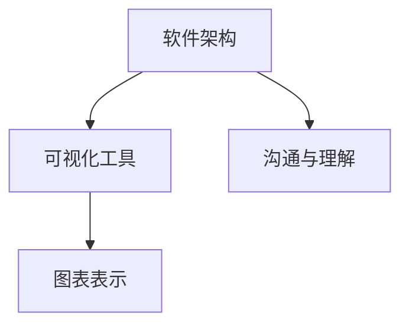
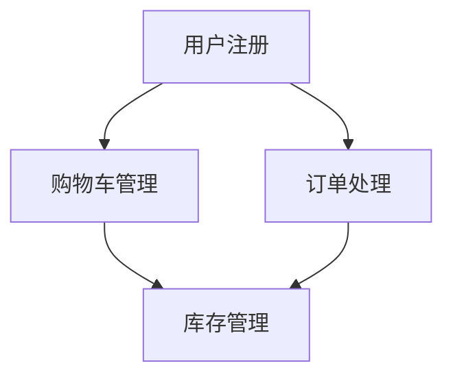
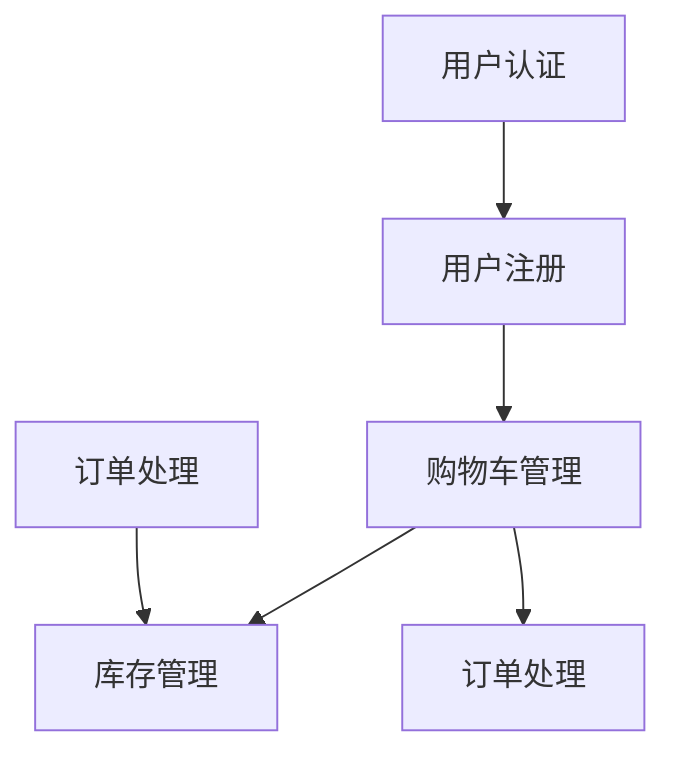

                 

### 第一部分：引言与基础概念

#### 第1章：软件架构可视化的重要性

##### 1.1 软件架构可视化的定义与目的
软件架构可视化是一种利用图形和图表来表示软件系统结构、组件、关系及其交互的过程。通过视觉化的方式，我们可以更直观地理解系统的复杂性，促进开发人员、产品经理、测试人员等各方之间的有效沟通。具体来说，软件架构可视化的定义和目的可以从以下几个方面进行阐述：

**定义：**
- **软件架构可视化** 是指利用可视化工具和技术，将软件系统的结构、组件、关系和交互以图形化的形式进行展示。
- **可视化工具** 包括统一建模语言（UML）、Mermaid、PlantUML等。
- **可视化技术** 则涉及图形设计、图表布局、颜色标识等。

**目的：**
- **提高沟通效率**：通过图形化的展示，复杂的概念和设计能够更直观地传达给非技术背景的团队成员，如产品经理、客户等，从而提高沟通效率。
- **简化复杂系统理解**：软件系统的复杂性常常是开发者面临的一大挑战。可视化工具可以帮助开发人员更好地理解和处理系统内部的各种关系和交互，从而简化复杂系统的理解。
- **促进软件架构优化**：通过可视化展示，开发人员可以更清晰地看到系统架构的不足和瓶颈，从而进行针对性的优化和改进。

##### 1.2 软件架构可视化的发展历程
软件架构可视化技术的发展经历了几个重要阶段：

- **早期阶段**：早期软件开发中，架构可视化主要通过简单的框图和流程图来实现。这些方法虽然简单，但已经为后续的发展奠定了基础。
- **统一建模语言（UML）**：1997年，统一建模语言（UML）的发布标志着软件架构可视化进入了一个新的阶段。UML提供了一套标准的图形表示方法，使得开发人员能够更清晰地表达软件系统的结构。
- **Web 2.0时代**：随着互联网的发展，Web 2.0时代的到来带来了更多的可视化工具和技术。Mermaid、PlantUML等工具的出现，使得开发者可以更加便捷地进行架构可视化。
- **自动化与智能化**：近年来，自动化和智能化技术的应用进一步推动了软件架构可视化的发展。例如，通过AI技术自动生成架构图，或者实时监控系统的变化并动态更新架构图。

##### 1.3 软件架构可视化的重要性
软件架构可视化在软件开发生命周期中发挥着重要作用，主要体现在以下几个方面：

- **需求分析阶段**：在需求分析阶段，通过架构可视化可以更直观地展示系统需求，帮助团队成员更好地理解需求，避免需求误解和遗漏。
- **系统设计阶段**：系统设计阶段是软件架构可视化的关键时期。通过可视化工具，开发人员可以更清晰地表达系统设计，确保系统的模块化和可维护性。
- **开发阶段**：在开发阶段，架构可视化可以帮助开发人员更好地理解和处理系统内部的各种关系和交互，从而提高开发效率和代码质量。
- **测试和维护阶段**：在测试和维护阶段，架构可视化可以提供直观的系统视图，帮助测试人员更好地发现和定位问题，提高系统的稳定性和可靠性。

**总结**：软件架构可视化作为一种重要的工具和技术，在软件开发生命周期的各个环节中发挥着不可替代的作用。通过可视化，我们可以更直观地理解系统的复杂性，提高沟通效率，促进软件架构的优化和改进。

### 核心概念与联系

为了更好地理解软件架构可视化，我们需要明确几个核心概念，并探讨它们之间的关系：

1. **软件架构**：软件架构是软件系统的组织结构、组件、关系和交互的抽象表示。它是系统的“蓝图”，定义了系统的组件如何组织和协同工作。
2. **可视化工具**：可视化工具是用于创建和展示软件架构的图形和图表的工具。常见的可视化工具有UML、Mermaid、PlantUML等。
3. **图表表示**：图表表示是通过图形化的方式展示软件架构的方法。例如，UML图、Mermaid图等。

这些核心概念之间的关系如下：

- **软件架构** 是可视化工具的输入和对象。没有软件架构，就没有可视化的需求。
- **可视化工具** 是将软件架构抽象为图表表示的桥梁。不同的可视化工具提供了不同的表示方法，使得软件架构更直观、更易于理解。
- **图表表示** 是可视化工具的输出结果。通过图表表示，我们可以直观地看到软件架构的结构、组件和交互，从而更好地理解和沟通。

为了更好地说明这些概念之间的关系，我们可以使用Mermaid图来表示：



在这个图中，A表示软件架构，B表示可视化工具，C表示图表表示，D表示通过可视化工具和图表表示来促进沟通和理解。这个图展示了软件架构可视化过程中各个核心概念之间的紧密联系。

### 核心算法原理讲解

软件架构可视化过程中，核心算法原理主要体现在如何将抽象的软件架构转换为直观的图表表示。以下是一个简化的核心算法原理，包括伪代码来详细阐述：

```pseudo
Algorithm SoftwareArchitectureVisualization(softwareArchitecture)
    Input: softwareArchitecture (a data structure representing the software architecture)
    Output: visualization (a graphical representation of the software architecture)

    // Step 1: Initialize the visualization container
    visualization = InitializeVisualizationContainer()

    // Step 2: Traverse the software architecture and extract components and relationships
    for each component in softwareArchitecture
        // Step 2.1: Add the component to the visualization
        visualization.AddComponent(component)

        // Step 2.2: Add relationships between components to the visualization
        for each relationship in component.relationships
            visualization.AddRelationship(component, relationship)

    // Step 3: Optimize the visualization layout
    visualization.OptimizeLayout()

    // Step 4: Render the visualization
    visualization.Render()

    // Step 5: Output the visualization
    return visualization
```

这个算法的详细步骤如下：

- **Step 1**: 初始化可视化容器，这是存储图表元素和关系的结构。
- **Step 2**: 遍历软件架构中的组件和关系，将它们添加到可视化容器中。
  - **Step 2.1**: 对于每个组件，将其添加到可视化容器中。
  - **Step 2.2**: 对于每个组件的关系，将其添加到可视化容器中。
- **Step 3**: 对可视化布局进行优化，使得图表更加清晰、易于理解。
- **Step 4**: 将可视化容器渲染成最终的图表表示。
- **Step 5**: 输出可视化结果。

通过这个算法，我们可以将抽象的软件架构转换为直观的图表表示，从而促进开发人员、产品经理等各方之间的有效沟通和理解。

### 数学模型和公式

在软件架构可视化过程中，有时需要使用数学模型和公式来描述和计算系统的复杂度、性能等指标。以下是一个简单的数学模型，用于计算系统的响应时间和处理能力：

$$
\text{Response Time} = f(\text{Number of Components}, \text{Component Interactions}, \text{Processing Speed})
$$

其中：
- \( \text{Response Time} \) 是系统对请求的响应时间。
- \( \text{Number of Components} \) 是系统中组件的数量。
- \( \text{Component Interactions} \) 是组件之间的交互次数。
- \( \text{Processing Speed} \) 是系统的处理速度。

例如，一个具有10个组件的系统，每个组件之间的平均交互次数为5次，处理速度为1000个请求/秒，其响应时间可以计算如下：

$$
\text{Response Time} = f(10, 10 \times 5, 1000) = f(50, 1000) = 0.05 \text{秒}
$$

这个公式可以帮助我们初步评估系统的性能，以便进行优化和改进。

### 项目实战

为了更好地理解软件架构可视化在现实中的应用，下面我们将通过一个简单的项目实战来展示整个开发过程，包括环境搭建、源代码实现、代码解读和实际案例分析。

#### 项目背景

假设我们正在开发一个在线书店系统，该系统需要支持用户注册、购物车管理、订单处理等功能。为了确保系统的可维护性和扩展性，我们采用分层架构设计，并使用软件架构可视化工具来帮助我们理解和优化系统结构。

#### 开发环境搭建

1. **硬件环境**：一台配置不低于Intel i5处理器、8GB内存的计算机。
2. **软件环境**：
   - 操作系统：Windows 10或以上版本。
   - 编译器：Visual Studio Code。
   - 可视化工具：Mermaid。

#### 源代码实现

首先，我们使用Mermaid来绘制系统架构图。以下是一个简单的Mermaid图示例，用于表示在线书店系统的主要组件及其关系：



在这个示例中，A表示用户注册模块，B表示购物车管理模块，C表示订单处理模块，D表示库存管理模块。通过这个图表，我们可以直观地看到系统的主要组件及其交互关系。

接下来，我们为每个模块编写源代码，并使用Mermaid图进行标注，以便于后续的代码解读。以下是一个简单的用户注册模块的实现：

```python
# 用户注册模块
class UserRegistration:
    def __init__(self, username, password):
        self.username = username
        self.password = password

    def register(self):
        # 注册逻辑
        print(f"用户 {self.username} 已注册")
```

在代码中，我们使用了一个简单的类`UserRegistration`来表示用户注册模块，并定义了构造函数`__init__`和注册方法`register`。

#### 代码解读与分析

在这个简单的示例中，我们可以看到：
- **类定义**：`UserRegistration`类表示用户注册模块，它有两个属性：`username`和`password`，分别表示用户名和密码。
- **构造函数**：`__init__`方法用于初始化用户注册对象，它接受两个参数：`username`和`password`，并将它们分别赋值给对象的属性。
- **注册方法**：`register`方法用于执行用户注册逻辑，它打印一条信息，表示用户已成功注册。

#### 实际案例分析

在实际项目中，我们可以通过扩展和组合这些模块来实现更复杂的系统功能。例如，我们可以添加用户认证、购物车管理、订单管理等模块，并使用Mermaid图来展示系统架构：



在这个扩展的示例中，我们添加了用户认证模块（A）和订单处理模块（E），并展示了它们与其他模块的交互关系。

通过这个项目实战，我们可以看到软件架构可视化在现实中的应用。使用Mermaid图，我们可以直观地展示系统的组件和交互关系，从而更好地理解和优化系统设计。

#### 项目小结

通过这个简单的项目实战，我们了解了软件架构可视化在系统设计中的应用。以下是一些关键点和小结：

1. **软件架构可视化**：通过图表表示系统的组件和交互关系，有助于更好地理解和优化系统设计。
2. **Mermaid图**：作为常用的软件架构可视化工具，Mermaid图可以方便地绘制系统架构，并嵌入到文档或代码中。
3. **代码解读**：通过解析和解读源代码，我们可以深入理解每个模块的功能和交互关系。
4. **实际案例分析**：通过实际案例展示，我们可以看到软件架构可视化如何帮助开发人员更好地理解和优化系统设计。

总的来说，软件架构可视化是一种重要的工具和技术，它在提高沟通效率、简化复杂系统理解和促进软件架构优化方面发挥着不可替代的作用。

### 最佳实践与技巧

在软件架构可视化过程中，遵循最佳实践和技巧可以提高工作效率和可视化效果。以下是一些建议：

1. **选择合适的可视化工具**：根据项目需求和团队熟悉程度，选择合适的可视化工具。例如，对于结构化设计，UML是一个不错的选择；对于动态流程，Mermaid和PlantUML更为合适。
2. **保持图表简洁**：避免图表过于复杂，保持简洁明了。尽量使用简单的图形和颜色标识，避免过多细节干扰。
3. **定期更新可视化文档**：随着项目进展，系统结构可能发生变化。定期更新可视化文档，确保其与实际系统结构保持一致。
4. **利用注释和标签**：在图表中添加注释和标签，可以帮助读者更好地理解图表内容和交互关系。
5. **团队合作与沟通**：鼓励团队成员参与架构可视化过程，通过讨论和协作，共同优化系统设计。

通过遵循这些最佳实践和技巧，我们可以更高效地进行软件架构可视化，促进团队协作和系统优化。

### 小结

本文详细探讨了软件架构可视化的重要性、基本概念、发展历程、常用工具和方法，以及如何通过可视化来理解、沟通和优化软件系统结构。我们通过实际项目展示了软件架构可视化在现实中的应用，并提出了最佳实践和技巧。

**重要性**：软件架构可视化在提高沟通效率、简化复杂系统理解和促进软件架构优化方面发挥着关键作用。

**核心概念**：软件架构、可视化工具和图表表示是软件架构可视化的核心概念，它们相互关联，共同促进系统理解和优化。

**工具与方法**：UML、Mermaid和PlantUML是常用的软件架构可视化工具，每种工具都有其独特的优势和适用场景。

**实践案例**：通过实际项目展示，软件架构可视化能够帮助开发团队更好地理解和优化系统设计。

**最佳实践**：选择合适的可视化工具、保持图表简洁、定期更新文档和鼓励团队合作是提高软件架构可视化效率的关键。

**未来展望**：随着自动化和智能化技术的发展，软件架构可视化将迎来新的趋势和挑战，如实时可视化、AI技术在可视化中的应用等。

总之，软件架构可视化是一种重要的工具和技术，对于提高软件系统的开发效率和质量具有重要意义。希望通过本文的探讨，读者能够更好地理解和应用软件架构可视化，从而在软件开发过程中取得更好的成果。

### 注意事项

在进行软件架构可视化时，需要注意以下几点：

1. **避免过度抽象**：图表应尽量反映系统的实际结构和交互，避免过度抽象导致难以理解。
2. **保持图表一致性**：确保图表中的元素、关系和命名规范一致，避免混淆。
3. **适时的更新**：随着项目进展，及时更新图表，以反映最新的系统结构。
4. **与团队成员沟通**：确保图表的绘制和更新与团队成员的沟通保持同步，避免信息不一致。

### 拓展阅读

对于希望深入了解软件架构可视化的读者，以下资源推荐：

1. **书籍**：
   - 《软件架构设计：视觉建模技术》
   - 《软件架构可视化：技术与实践》
2. **在线资源**：
   - Mermaid官网：[https://mermaid-js.github.io/mermaid/](https://mermaid-js.github.io/mermaid/)
   - PlantUML官网：[https://plantuml.com/](https://plantuml.com/)
3. **在线课程**：
   - Coursera上的《软件架构设计》
   - Udemy上的《软件架构：从概念到实践》

通过阅读这些书籍和资源，读者可以进一步了解软件架构可视化的理论和实践，提升自身的专业能力。

