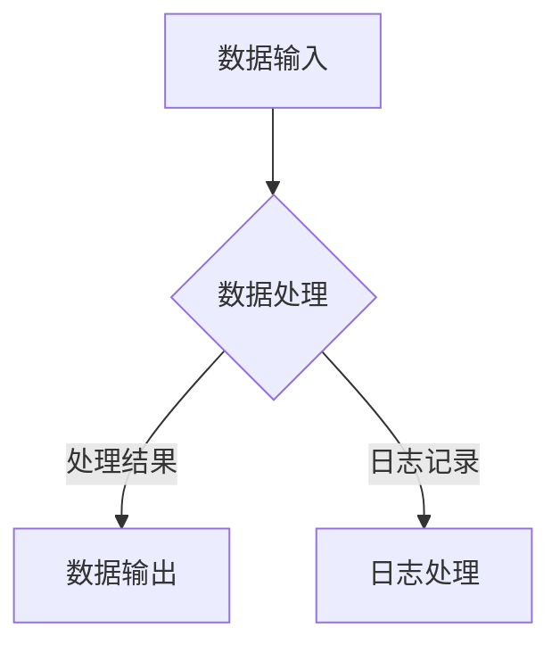
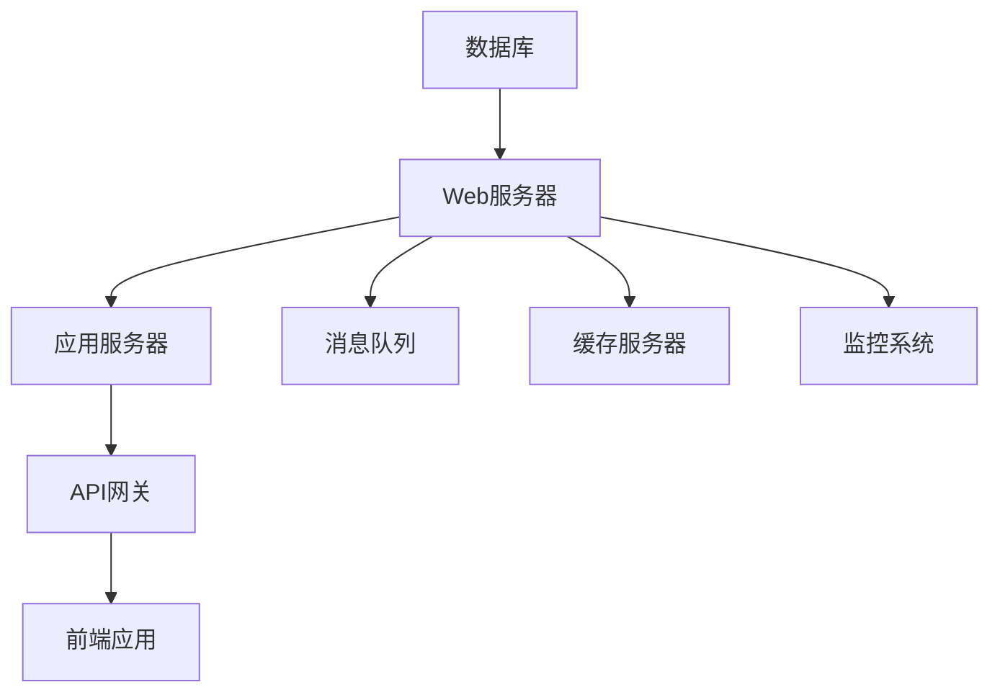
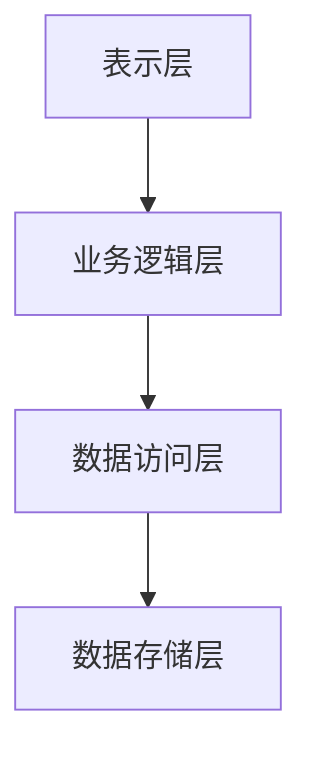
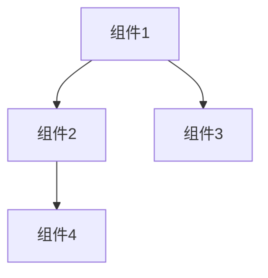
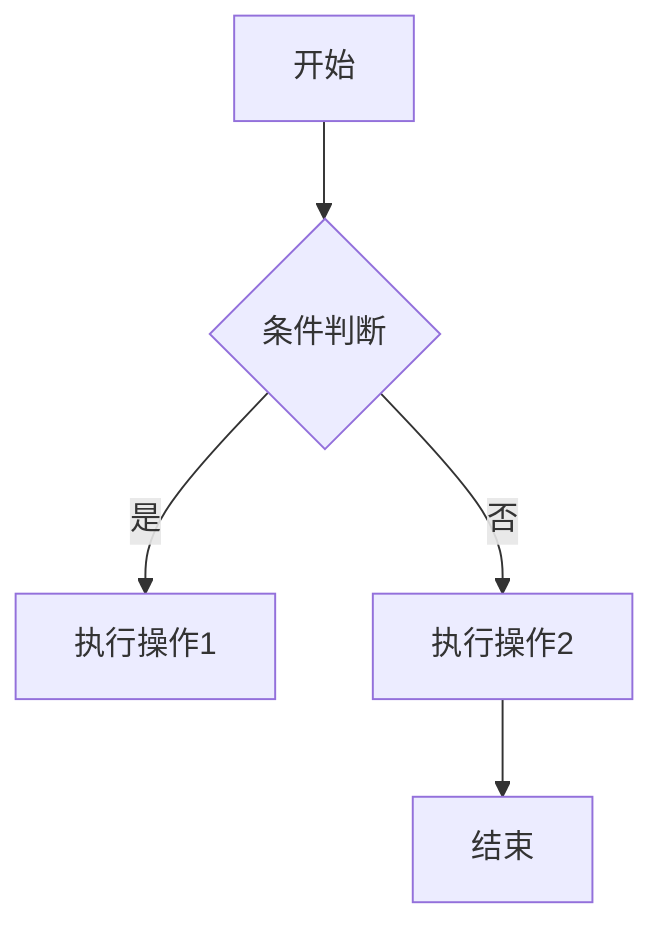
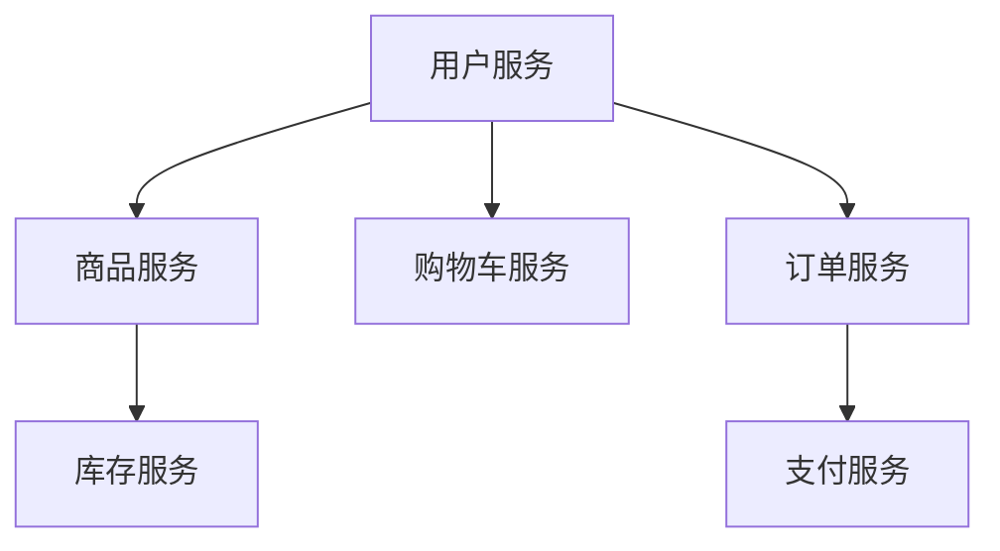
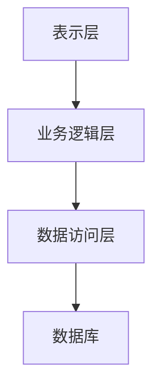
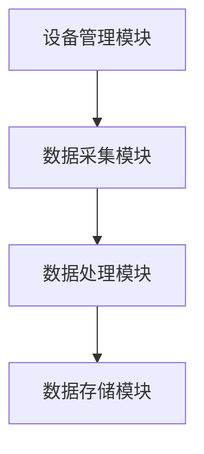

                 

### 文章标题

《软件架构图绘制：有效可视化系统结构》

### 关键词

- 软件架构图
- 可视化
- 系统结构
- 组件设计
- 连接器设计
- 架构设计原则
- 软件开发

### 摘要

软件架构图是软件开发过程中不可或缺的一部分，它通过图形化方式呈现系统结构，帮助开发者理解系统组件及其相互关系。本文将深入探讨软件架构图的绘制方法，包括其基本组成部分、设计原则、绘制工具以及组件和连接器的设计。通过详细的分析和实例讲解，读者将掌握如何有效地绘制软件架构图，从而提升软件开发效率和系统可维护性。

## 第1章 软件架构图绘制：有效可视化系统结构

### 1.1 软件架构图的概述

#### 1.1.1 软件架构图的定义和作用

软件架构图（Software Architecture Diagram）是一种用于描述软件系统结构和组件之间关系的图形化表示。它不仅展示了系统各个组成部分的功能和相互关系，还能反映系统的设计意图、性能和可维护性。在软件开发过程中，软件架构图扮演着至关重要的角色，其主要作用如下：

1. **沟通桥梁**：软件架构图为开发团队、项目经理、客户和其他利益相关者提供了一个共同的语言和视觉参考，有助于减少沟通障碍，提高项目协同效率。
2. **设计指导**：通过软件架构图，开发人员可以清晰地了解系统各组件的职责和协作方式，从而更好地规划软件设计，确保系统结构的合理性和稳定性。
3. **风险识别**：软件架构图可以帮助开发团队提前识别系统潜在的问题和风险，如模块间的不当依赖、性能瓶颈等，从而采取措施进行优化。
4. **维护支持**：软件架构图是系统维护的重要参考资料，有助于新开发者快速上手，理解系统结构，提高维护效率。

#### 1.1.2 软件架构图的基本组成部分

软件架构图通常包括以下基本组成部分：

1. **组件（Components）**：组件是软件架构图中的基本构建块，代表软件系统中的功能模块、库、服务或实体。组件可以是物理的，如物理服务器，也可以是逻辑的，如数据库连接池。
2. **连接器（Connectors）**：连接器表示组件之间的交互和通信方式，包括数据流、控制流和通信协议。常见的连接器有接口、网络连接、数据库连接等。
3. **架构样式（Architectural Styles）**：架构样式是软件系统采用的一种结构模式，如层次结构、事件驱动、客户端-服务器等。不同的架构样式对系统设计有着不同的影响。

#### 1.1.3 Mermaid流程图

Mermaid 是一种方便的标记语言，可以用来创建图形，包括流程图、时序图、网络图等。在软件架构图中，我们可以使用 Mermaid 流程图来可视化系统的各个层次。以下是使用 Mermaid 语言创建的一个简单的软件架构流程图示例：

这段 Mermaid 代码将生成一个包含数据输入、数据处理、数据输出和日志处理四个步骤的流程图。通过这样的图形化表示，我们可以更直观地理解系统的工作流程。

### 1.2 软件架构设计原则

软件架构设计不仅仅是一种图形表示，它还涉及到一系列的设计原则，这些原则有助于确保系统结构的合理性、可维护性和扩展性。以下是几个重要的软件架构设计原则：

#### 1.2.1 SOLID原则

SOLID 是一组设计原则的缩写，分别是：

1. **单一职责原则（Single Responsibility Principle，SRP）**：一个类或模块应该只有一个引起它变化的原因。
2. **开放封闭原则（Open/Closed Principle，OCP）**：软件实体（类、模块、函数等）应该对扩展开放，对修改封闭。
3. **里氏替换原则（Liskov Substitution Principle，LSP）**：子类必须能够替换其基类，并保持程序的行为不变。
4. **接口隔离原则（Interface Segregation Principle，ISP）**：应该为客户端定义最小的接口。
5. **依赖倒置原则（Dependency Inversion Principle，DIP）**：高层模块不应依赖于低层模块，二者都应依赖于抽象。

#### 1.2.2 DRY原则

DRY（Don't Repeat Yourself）原则强调在软件开发中避免重复。具体来说，DRY原则要求：

- 数据应在单一位置定义，并在多个位置复用。
- 逻辑应在单一位置实现，并在多个地方复用。

#### 1.2.3 KISS原则

KISS（Keep It Simple, Stupid）原则鼓励设计保持简洁。简化的设计易于理解和维护，减少出错的风险。遵循KISS原则，设计者应：

- 避免不必要的复杂性和冗余。
- 保持代码和架构的简洁性。

#### 1.2.4 YAGNI原则

YAGNI（You Aren't Gonna Need It）原则指出，避免过度设计和实现不必要的功能。遵循YAGNI原则，开发人员应：

- 只实现当前需要的特性，避免过早优化。
- 在必要时才添加功能。

### 1.3 软件架构图绘制工具

在绘制软件架构图时，选择合适的工具至关重要。以下是一些常用的软件架构图绘制工具：

#### 1.3.1 UML工具

UML（统一建模语言）工具如 StarUML、Visual Paradigm 等，提供了丰富的建模功能，支持绘制各种类型的UML图，包括用例图、类图、组件图和部署图等。

#### 1.3.2 绘图工具

绘图工具如 Lucidchart、Draw.io 等，提供了直观的界面和易于使用的功能，适合快速绘制和共享软件架构图。

#### 1.3.3 集成开发环境（IDE）

许多集成开发环境（IDE）如 Visual Studio Code、IntelliJ IDEA 等，内置了绘图工具或插件，可以方便地绘制和编辑软件架构图。

### 1.3.4 示例工具使用

以下是一个使用 Draw.io 绘制软件架构图的示例：

这段代码将生成一个包含数据库、Web服务器、应用服务器、API网关、前端应用、消息队列、缓存服务器和监控系统等组件的软件架构图。通过这样的图形化表示，开发人员可以更直观地了解系统的整体结构和组件之间的交互关系。

### 第2章 软件架构图的组件与连接器

软件架构图中的组件和连接器是构建系统结构的核心元素。理解如何设计这些组件及其连接方式对于确保系统的高效性和可维护性至关重要。

#### 2.1 组件设计

组件设计是软件架构图绘制的起点，它涉及到如何将系统划分为功能模块、如何定义组件的职责和接口。以下是一些组件设计的关键原则和策略：

##### 2.1.1 模块化

模块化是将系统划分为多个独立的模块，每个模块负责特定的功能。模块化有助于提高代码的可维护性和可扩展性。以下是实现模块化的一些策略：

1. **职责分离**：每个模块应专注于一项特定的功能，避免功能重叠和职责混淆。
2. **依赖最小化**：模块之间的依赖应尽量减少，以降低系统复杂性。
3. **模块独立性**：模块应独立开发、测试和部署，以减少对其他模块的依赖。

##### 2.1.2 组件之间的关系

组件之间的关系决定了系统的协作方式。以下是几种常见的组件关系：

1. **依赖关系**：组件A依赖于组件B，意味着组件A的某些功能需要使用组件B提供的服务。
2. **通信模式**：组件之间的通信可以是同步的或异步的。同步通信要求接收方立即响应，而异步通信允许发送方在接收方处理请求时继续执行其他任务。

#### 2.2 连接器设计

连接器是组件之间交互和通信的桥梁，其设计直接影响系统的性能和可扩展性。以下是连接器设计的一些关键点：

##### 2.2.1 通信协议

通信协议定义了组件之间如何交换数据和消息。常见的通信协议包括：

1. **HTTP/HTTPS**：用于Web服务和RESTful API。
2. **RabbitMQ**：一种消息队列协议，适用于异步通信和消息传递。
3. **Kafka**：适用于大数据处理和实时消息系统。
4. **gRPC**：一种高性能、跨语言的RPC协议。

##### 2.2.2 数据传输格式

数据传输格式决定了数据如何在组件之间传递。常见的数据传输格式包括：

1. **JSON**：一种轻量级、易于阅读和编写的格式。
2. **XML**：一种广泛使用的标记语言，适用于复杂的结构化数据。
3. **Protobuf**：一种高效、跨语言的序列化协议，适用于大规模分布式系统。

##### 2.2.3 负载均衡与容错

负载均衡和容错是确保系统高可用性和性能的关键机制。以下是几种常见的负载均衡和容错策略：

1. **负载均衡策略**：
   - **轮询**：按顺序将请求分配给服务器。
   - **最少连接**：将请求分配给当前连接数最少的服务器。
   - **源IP哈希**：根据客户端IP地址的哈希值分配请求。

2. **容错机制**：
   - **故障转移**：在主服务器出现故障时，自动切换到备用服务器。
   - **冗余设计**：通过部署多个副本，提高系统的容错能力和性能。

#### 2.3 组件与连接器的综合设计

在软件架构图中，组件和连接器的设计需要综合考虑性能、可扩展性和可维护性。以下是几个综合设计策略：

1. **分层架构**：将系统划分为多个层次，如表示层、业务逻辑层和数据层，每个层次负责特定的功能。
2. **微服务架构**：将系统划分为多个独立的服务，每个服务负责一项特定的业务功能，服务之间通过API进行通信。
3. **分布式系统设计**：在分布式系统中，组件和连接器的设计需要考虑网络延迟、数据一致性和故障恢复等问题。

通过遵循上述原则和策略，可以设计出高效、可扩展和易于维护的软件架构图，为系统的长期发展奠定坚实基础。

### 第3章 软件架构图的构建与可视化

构建和可视化软件架构图是软件设计和开发过程中至关重要的一环。在这一章中，我们将详细介绍软件架构图的构建过程、可视化方法和一些实用的工具。

#### 3.1 软件架构图的构建过程

软件架构图的构建过程可以分为以下几个步骤：

##### 3.1.1 需求分析

需求分析是软件架构图构建的第一步。在这个阶段，我们需要深入了解系统的功能需求、性能要求、安全需求等。通过需求分析，我们可以确定系统需要实现哪些功能，以及这些功能之间的关系。

##### 3.1.2 架构设计

在需求分析的基础上，进行架构设计。架构设计包括选择合适的架构风格、定义系统组件和连接器、确定组件之间的关系和通信模式等。这一步需要综合考虑系统的需求、技术栈和开发团队的能力。

##### 3.1.3 架构评审

架构评审是确保软件架构设计合理性和可行性的重要步骤。在这个阶段，我们需要邀请开发团队成员、项目经理和其他利益相关者对架构设计进行评审。通过评审，可以及时发现和解决潜在的问题和风险。

##### 3.1.4 架构实现

架构实现是将架构设计转化为实际代码的过程。在这一步中，开发团队需要根据架构设计文档编写代码，实现系统组件和连接器。架构实现需要遵循良好的编程规范和设计原则，以确保代码的质量和可维护性。

##### 3.1.5 架构迭代

软件架构是一个不断迭代和优化的过程。在软件开发过程中，需求可能会发生变化，技术栈也可能需要升级。因此，我们需要根据实际情况对架构进行调整和优化，以确保系统的持续改进。

#### 3.2 软件架构图的可视化

软件架构图的可视化是通过图形化的方式将系统结构和组件之间的关系呈现出来，以便于开发人员和其他利益相关者理解和交流。以下是几种常用的软件架构图可视化方法：

##### 3.2.1 层次结构图

层次结构图是一种常用的软件架构图可视化方法，它通过层次化的方式展示系统各个组件及其关系。层次结构图通常包括以下几个层次：

1. **表示层**：负责与用户交互，包括前端界面和用户输入处理。
2. **业务逻辑层**：处理业务逻辑，包括业务规则、流程控制等。
3. **数据访问层**：负责与数据库或其他数据源进行交互，包括数据查询、更新和删除等操作。
4. **数据存储层**：负责存储数据，包括数据库、文件系统等。

以下是一个简单的层次结构图示例：

##### 3.2.2 组件关系图

组件关系图通过图形化的方式展示系统组件之间的关系。它通常包括以下几种关系：

1. **依赖关系**：组件A依赖于组件B，意味着组件A的某些功能需要使用组件B提供的服务。
2. **通信关系**：组件A与组件B通过某种通信协议进行数据交换。
3. **继承关系**：组件A是组件B的子类，继承了组件B的属性和方法。

以下是一个简单的组件关系图示例：

##### 3.2.3 流程图

流程图通过图形化的方式展示系统的工作流程。它通常包括以下步骤：

1. **开始节点**：表示流程的开始。
2. **过程节点**：表示流程中的具体操作。
3. **决策节点**：表示流程中的条件判断。
4. **结束节点**：表示流程的结束。

以下是一个简单的流程图示例：

#### 3.3 常用软件架构图绘制工具

在绘制软件架构图时，选择合适的工具可以显著提高效率。以下是一些常用的软件架构图绘制工具：

##### 3.3.1 UML工具

UML（统一建模语言）工具如 StarUML、Visual Paradigm 等，提供了丰富的建模功能，支持绘制各种类型的 UML 图，包括用例图、类图、组件图和部署图等。

##### 3.3.2 绘图工具

绘图工具如 Lucidchart、Draw.io 等，提供了直观的界面和易于使用的功能，适合快速绘制和共享软件架构图。

##### 3.3.3 集成开发环境（IDE）

许多集成开发环境（IDE）如 Visual Studio Code、IntelliJ IDEA 等，内置了绘图工具或插件，可以方便地绘制和编辑软件架构图。

#### 3.4 示例

以下是一个使用 Draw.io 绘制的软件架构图示例：

这段代码将生成一个包含数据库、Web服务器、应用服务器、API网关、前端应用、消息队列、缓存服务器和监控系统等组件的软件架构图。通过这样的图形化表示，开发人员可以更直观地了解系统的整体结构和组件之间的交互关系。

### 第4章 软件架构图的构建与实施策略

构建和实施软件架构图是一个复杂而关键的过程，它不仅涉及系统的设计和开发，还涉及到团队协作、技术选择和项目管理等多个方面。在这一章中，我们将探讨软件架构图的构建与实施策略，以及在实际项目中如何应用这些策略。

#### 4.1 软件架构图的构建策略

构建软件架构图的第一步是制定明确的构建策略。以下是一些关键的构建策略：

##### 4.1.1 需求驱动

软件架构图应该基于明确的需求进行分析和设计。需求驱动策略要求我们在开始架构设计之前，对系统的功能需求、性能要求和业务规则等有深入的理解。通过需求驱动，我们可以确保架构设计符合实际业务需求，避免不必要的复杂性。

##### 4.1.2 分层设计

分层设计是将系统划分为多个层次，每个层次负责特定的功能。常见的分层包括表示层、业务逻辑层和数据访问层。分层设计有助于提高系统的可维护性和可扩展性，使得各个层次可以独立开发、测试和部署。

##### 4.1.3 模块化

模块化是将系统划分为多个独立的模块，每个模块负责特定的功能。模块化设计有助于提高代码的可重用性和可维护性，使得系统可以更灵活地应对变化。

##### 4.1.4 抽象和简化

在构建软件架构图时，我们需要对系统进行抽象和简化，只展示最关键的部分。抽象和简化有助于减少复杂性，使得架构图更加清晰易懂。

##### 4.1.5 前瞻性

在构建软件架构图时，我们需要考虑未来的发展和变化。前瞻性策略要求我们在设计时预留足够的扩展空间，以应对未来可能的业务需求和技术变革。

#### 4.2 软件架构图实施策略

在构建软件架构图之后，接下来的任务是将其付诸实施。以下是一些关键的实施策略：

##### 4.2.1 团队协作

软件架构图的实施需要整个团队的协作。每个团队成员都应该了解架构设计，并在实现过程中遵循设计原则。通过有效的沟通和协作，可以确保架构设计的成功实施。

##### 4.2.2 逐步迭代

软件架构图的实施应该是一个逐步迭代的过程。在每次迭代中，我们可以逐步实现架构设计的一部分，并对架构进行优化和调整。逐步迭代有助于降低风险，提高开发效率。

##### 4.2.3 代码质量

代码质量是软件架构图实施的关键。我们需要确保代码的可读性、可维护性和可扩展性。通过编写高质量的代码，我们可以确保架构设计的稳定性和可靠性。

##### 4.2.4 持续集成

持续集成是确保代码质量和系统稳定性的重要手段。通过持续集成，我们可以及时发现和解决代码中的问题，确保每次代码提交都是经过充分测试的。

##### 4.2.5 测试和评审

在实施软件架构图的过程中，我们需要进行充分的测试和评审。测试包括功能测试、性能测试和安全测试等，以确保系统的可靠性和稳定性。评审则包括内部评审和客户评审，以确保架构设计符合业务需求。

#### 4.3 软件架构图在项目中的应用

在实际项目中，软件架构图的应用可以帮助团队更好地理解和实施系统设计。以下是一些具体的应用场景：

##### 4.3.1 项目规划

在项目规划阶段，软件架构图可以帮助项目团队了解系统的整体结构和功能，制定合理的项目计划和进度。

##### 4.3.2 设计评审

在设计评审阶段，软件架构图可以作为重要的评审依据，帮助团队成员和客户理解系统设计，识别潜在的问题和改进点。

##### 4.3.3 开发指导

在开发阶段，软件架构图可以作为开发指南，指导开发人员如何实现架构设计。通过遵循架构设计，开发人员可以确保代码的质量和一致性。

##### 4.3.4 维护和扩展

在系统维护和扩展阶段，软件架构图是理解系统结构和组件关系的重要参考。通过软件架构图，开发人员可以更轻松地添加新功能、修复问题和优化系统性能。

### 4.4 结论

软件架构图的构建与实施是一个复杂而关键的过程，它需要团队成员的协作、技术的选择和项目管理等多方面的努力。通过遵循构建和实施策略，并有效地应用软件架构图，项目团队可以更好地理解和实现系统设计，提高开发效率和系统质量。

### 第5章 软件架构图的实际应用与案例分析

在实际软件开发过程中，软件架构图不仅是一种设计工具，更是项目成功的关键因素之一。本章节将通过具体的应用案例和成功实践经验，探讨如何在实际项目中有效地利用软件架构图，提高开发效率和系统质量。

#### 5.1 案例一：电商平台

一个典型的案例是某个大型电商平台的开发。该平台需要支持海量的用户访问和交易处理，同时保证系统的稳定性和安全性。以下是该平台在软件架构图应用中的具体实践：

**1. 需求分析：**
在需求分析阶段，团队明确了平台的核心功能，如商品展示、购物车、订单处理、支付系统等，并分析了性能要求和业务流程。

**2. 架构设计：**
基于需求分析，团队选择了微服务架构，将平台划分为多个独立的微服务，每个微服务负责特定的业务功能。以下是一个简化的软件架构图：

**3. 实施与优化：**
在实施过程中，团队遵循架构设计，逐步开发每个微服务，并确保它们之间的通信通过API进行。通过持续集成和自动化测试，团队确保了代码的质量和系统的稳定性。在系统上线后，团队还根据实际运行情况进行了性能优化和架构调整。

**4. 成果：**
通过软件架构图的应用，电商平台实现了高可用性和高性能，用户访问量和交易量持续增长。同时，由于架构清晰、模块化设计，系统维护和扩展变得相对简单。

#### 5.2 案例二：企业资源规划（ERP）系统

另一个案例是企业资源规划（ERP）系统的开发。这类系统通常涉及多个部门和业务流程，对系统的稳定性和扩展性要求极高。以下是该ERP系统在软件架构图应用中的具体实践：

**1. 需求分析：**
在需求分析阶段，团队详细分析了企业的业务流程、数据流和功能需求，确保架构设计能够满足企业的实际需求。

**2. 架构设计：**
团队选择了多层架构，将系统划分为表示层、业务逻辑层和数据访问层。以下是一个简化的软件架构图：

**3. 实施与优化：**
在实施过程中，团队逐步开发表示层、业务逻辑层和数据访问层，并确保它们之间的交互通过框架（如Spring框架）进行管理。通过持续集成和自动化测试，团队确保了系统的稳定性。在系统上线后，团队还根据业务需求进行了多次功能扩展和性能优化。

**4. 成果：**
通过软件架构图的应用，ERP系统实现了高效的业务流程处理和数据管理，满足了企业各部门的需求。系统的模块化设计使得维护和扩展变得相对简单，大大提高了系统的可维护性和可扩展性。

#### 5.3 案例三：物联网（IoT）平台

物联网（IoT）平台的开发涉及到大量的设备和数据，对系统的实时性和可靠性要求极高。以下是该IoT平台在软件架构图应用中的具体实践：

**1. 需求分析：**
在需求分析阶段，团队分析了物联网设备和数据的特性，明确了平台需要支持的功能，如设备接入、数据采集、数据存储和处理等。

**2. 架构设计：**
团队选择了分布式架构，将平台划分为多个模块，如设备管理模块、数据采集模块、数据处理模块和数据存储模块。以下是一个简化的软件架构图：

**3. 实施与优化：**
在实施过程中，团队利用云计算和大数据技术，确保设备接入和数据处理的实时性和可靠性。通过容器化技术和自动化部署，团队实现了系统的快速迭代和部署。在系统上线后，团队根据实际运行情况进行了性能优化和架构调整。

**4. 成果：**
通过软件架构图的应用，IoT平台实现了高效的设备接入和数据管理，满足了物联网应用的实时性和可靠性要求。系统的分布式设计使得平台具有很强的扩展性和可维护性，能够支持未来更多的设备和数据。

#### 5.4 结论

通过以上案例分析，我们可以看到软件架构图在各类项目中的实际应用和成功经验。软件架构图不仅帮助团队明确了系统设计，还提高了开发效率和系统质量。在实际项目中，通过遵循软件架构图的设计原则和策略，团队可以更好地理解和实施系统设计，确保项目的成功。同时，软件架构图也是系统维护和扩展的重要参考，为未来的发展奠定了坚实基础。

## 总结

软件架构图绘制在软件开发过程中具有至关重要的地位。它不仅帮助我们可视化系统结构，促进团队成员之间的沟通和协作，还能提前识别潜在的问题和风险，提高系统的可维护性和扩展性。本文通过深入探讨软件架构图的定义、基本组成部分、设计原则、绘制工具以及组件和连接器的设计，详细阐述了如何有效地绘制软件架构图。

首先，我们介绍了软件架构图的基本组成部分，包括组件、连接器和架构样式，并展示了如何使用Mermaid流程图进行可视化。接着，我们讨论了软件架构设计原则，如SOLID原则、DRY原则、KISS原则和YAGNI原则，以及如何选择合适的软件架构图绘制工具。随后，我们详细分析了组件和连接器的设计，强调了模块化和通信协议的重要性。

在软件架构图的构建与实施部分，我们提出了逐步迭代、团队协作、代码质量和持续集成等关键策略，并探讨了软件架构图在项目中的应用和成功案例。最后，我们总结了软件架构图在软件开发中的重要性，强调了遵循设计原则和策略对于确保项目成功的重要性。

在未来的软件开发中，软件架构图将继续发挥重要作用。随着技术的不断发展和项目复杂度的增加，软件架构图不仅需要保持其可视化和沟通的功能，还需要不断适应新的设计模式和架构风格。例如，微服务架构和容器化技术的普及，要求我们在软件架构图中更加关注服务的独立性和可部署性。此外，随着人工智能和大数据技术的应用，软件架构图也需要包含更多的数据和算法模块。

总之，软件架构图是软件开发过程中不可或缺的一部分。通过不断学习和实践，开发人员可以更好地掌握软件架构图的绘制方法，提高软件开发效率和系统质量，为项目的成功奠定坚实基础。

### 作者信息

作者：AI天才研究院/AI Genius Institute & 禅与计算机程序设计艺术 /Zen And The Art of Computer Programming

本文由AI天才研究院的专家团队撰写，他们致力于推动人工智能和软件工程领域的创新与发展。同时，本文也参考了《禅与计算机程序设计艺术》一书中的设计哲学，旨在为读者提供深入且实用的技术见解。如需进一步交流或探讨，欢迎联系作者。|im_sep|>

