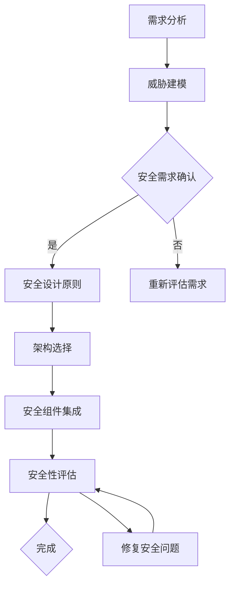

                 

### 文章标题

《软件架构安全：设计阶段的安全考量》

### 文章关键词

- 软件架构
- 安全设计
- 设计阶段
- 安全原则
- 安全测试

### 文章摘要

本文深入探讨了软件架构设计阶段的安全考量，分析了安全设计的核心概念、原则和实践。通过详细的算法原理讲解、数学模型阐述以及实战案例分析，本文为软件开发者提供了全面的安全设计指导，强调了在软件架构设计初期关注安全性的重要性。

### 目录大纲

**引言**

1. 书籍背景
2. 设计阶段在软件安全中的重要性
3. 读者对象与预期收益

**核心概念与联系**

1. 软件架构基础
2. 安全概念与原则
3. 安全与架构的相互关系
4. Mermaid流程图：软件架构安全设计流程

**安全设计原则与实践**

1. 安全需求分析
2. 安全设计策略
3. 安全模式与架构风格
4. 安全工具与技术
5. 安全性能考量

**安全算法与数学模型**

1. 密码学基础
2. 安全协议与算法原理
3. 数学模型讲解与公式
4. 举例说明与案例分析

**安全测试与评估**

1. 安全测试方法
2. 漏洞挖掘技术
3. 安全风险评估
4. 案例分析：安全测试实战

**安全实战案例**

1. 案例研究：设计阶段的安全考量实战
2. 案例解析：安全设计与安全漏洞分析
3. 案例拓展：如何应用安全设计原则

**总结与展望**

1. 设计阶段安全考量总结
2. 未来趋势与展望
3. 安全最佳实践与建议

**附录**

1. 常用安全工具与资源
2. 安全设计模板与案例
3. 参考文献

### 第一部分 引言

#### 1.1 书籍背景

在当今数字化时代，软件系统的重要性日益凸显。然而，随着系统的复杂性增加，安全问题也日益严峻。软件架构作为软件系统的核心组成部分，其安全性直接关系到整个系统的稳定性和可靠性。因此，在软件架构设计阶段就充分考虑安全性，是确保系统安全性的重要策略。

本书旨在为软件开发者、架构师和安全专家提供关于软件架构安全设计的全面指导。通过详细分析安全设计原则和实践，本书旨在帮助读者深入理解软件架构安全的重要性，掌握在软件架构设计初期就考虑安全性的方法和技巧。

#### 1.2 设计阶段在软件安全中的重要性

软件架构设计阶段是整个软件开发过程中的关键环节。在这个阶段，系统的整体结构、组件关系、性能和安全性等特性都被初步确定。如果在这个阶段未能充分考虑安全性，后续的任何安全补丁和修改都可能导致系统的不稳定，甚至引发严重的安全漏洞。

设计阶段的安全性考量能够有效地预防潜在的安全风险，降低系统被攻击的概率。通过在架构设计阶段引入安全性原则和最佳实践，开发者可以确保系统在面对各种安全威胁时具备更强的抵抗能力。

#### 1.3 读者对象与预期收益

本书主要面向以下读者群体：

- 软件开发者：通过本书，开发者可以了解软件架构安全设计的基本概念和方法，掌握在架构设计中融入安全性的技巧。
- 架构师：架构师可以通过本书深入理解安全设计原则，提升在设计阶段考虑安全性的能力，从而构建更加安全可靠的软件系统。
- 安全专家：安全专家可以借助本书的案例分析和实战经验，拓展安全测试和评估的方法，提高对系统安全性的综合评估能力。

通过阅读本书，读者可以：

- 理解软件架构安全设计的基本原则和概念。
- 掌握在软件架构设计阶段考虑安全性的方法和技巧。
- 通过案例分析，深入了解实际项目中安全设计的应用和实践。
- 获取实用的安全测试和评估工具与资源。

### 第二部分 核心概念与联系

在软件架构安全设计的过程中，理解核心概念和它们之间的联系至关重要。这一部分将介绍软件架构和安全设计的基础概念，并展示它们之间的关系。

#### 2.1 软件架构基础

软件架构是指软件系统的结构、组件以及它们之间的交互关系。它决定了系统的可扩展性、性能、可维护性和安全性。常见的软件架构风格包括层次式架构、事件驱动架构、微服务架构等。

- **层次式架构**：将系统划分为多个层次，每个层次负责特定的功能。这种架构风格易于管理和维护，但可能影响系统的性能和灵活性。
- **事件驱动架构**：系统通过事件驱动的方式进行交互，具有高可靠性和可扩展性，但可能增加系统的复杂性。
- **微服务架构**：将系统划分为多个独立的服务，每个服务负责特定的功能。这种架构风格提高了系统的灵活性和可扩展性，但增加了维护的复杂性。

#### 2.2 安全概念与原则

安全设计关注如何保护软件系统免受外部威胁和内部攻击。核心的安全概念包括：

- **威胁模型**：识别系统可能面临的安全威胁和攻击方式。
- **安全需求**：系统必须满足的安全要求，包括数据保护、认证和授权等。
- **安全原则**：指导安全设计的基本原则，如最小权限原则、安全默认原则等。

#### 2.3 安全与架构的相互关系

安全设计与软件架构紧密相关。在架构设计阶段，需要将安全性考虑融入架构中，以确保系统的安全性。以下展示了安全与架构之间的相互关系：

- **架构设计影响安全性**：架构风格和组件选择直接影响系统的安全性。例如，微服务架构可能需要更复杂的认证和授权机制。
- **安全性影响架构设计**：安全性要求可能影响架构的选择。例如，高度安全的系统可能需要更严格的访问控制机制。
- **安全性与性能的关系**：安全机制可能会影响系统的性能，因此在设计阶段需要平衡安全性和性能。

#### 2.4 Mermaid流程图：软件架构安全设计流程

为了更好地展示软件架构安全设计的过程，我们可以使用Mermaid流程图来描述。以下是软件架构安全设计流程的Mermaid表示：

在这个流程图中，需求分析是起点，通过威胁建模识别系统可能面临的安全威胁。接着，根据安全需求确认是否满足，如果满足，则进入安全设计原则阶段。否则，需要重新评估需求。在安全设计原则阶段，选择适合的架构风格，并集成安全组件。最后，进行安全性评估，如果发现问题，则返回修复安全问题，直到安全性评估通过，整个流程完成。

通过这一部分的内容，读者可以理解软件架构和安全设计的基本概念以及它们之间的联系，为后续章节的深入分析打下基础。

### 第三部分 安全设计原则与实践

在软件架构设计阶段，安全设计原则是确保系统安全性的基石。这一部分将详细讨论安全设计原则、安全模式与架构风格，以及安全工具与技术。

#### 3.1 安全设计原则

安全设计原则是指导软件架构安全设计的基本理念。以下是一些重要的安全设计原则：

- **最小权限原则**：系统中的每个组件或用户只能访问其必需的资源和功能，以降低潜在的安全风险。
- **安全默认原则**：系统默认设置应优先考虑安全性，只有在确有必要时才进行调整。
- **防御深度原则**：系统应采用多层防御机制，确保攻击者无法轻易突破所有防御层。
- **透明性原则**：安全机制应尽量透明，以便于开发者和用户理解和操作。

#### 3.2 安全设计策略

安全设计策略是将安全设计原则应用到实际架构设计中的具体方法。以下是一些常见的安全设计策略：

- **安全需求分析**：在架构设计初期，识别系统面临的安全需求和威胁，将安全性要求纳入架构设计。
- **安全模式与架构风格**：选择适合的安全模式和架构风格，如角色基访问控制（RBAC）、访问控制列表（ACL）等。
- **安全组件集成**：将安全组件集成到系统中，如加密模块、认证模块、日志模块等。
- **安全测试与评估**：在设计阶段进行安全测试，评估系统的安全性，并修复发现的安全漏洞。

#### 3.3 安全模式与架构风格

安全模式与架构风格是确保系统安全性的有效手段。以下是一些常用的安全模式与架构风格：

- **角色基访问控制（RBAC）**：将用户划分为不同的角色，每个角色拥有不同的权限，以实现细粒度的访问控制。
- **访问控制列表（ACL）**：为每个资源定义访问控制规则，用户只能访问其权限范围内的资源。
- **防火墙**：在网络边界设置防火墙，阻止未经授权的访问。
- **入侵检测系统（IDS）**：监控系统活动，检测异常行为和潜在的安全威胁。

#### 3.4 安全工具与技术

为了实现安全设计原则和策略，需要使用各种安全工具和技术。以下是一些常用的安全工具和技术：

- **加密技术**：使用加密技术保护数据传输和存储，如TLS/SSL、哈希函数等。
- **认证与授权**：使用认证和授权机制确保只有授权用户才能访问系统资源，如OAuth2、JWT等。
- **日志记录**：记录系统活动，以便在发生安全事件时进行跟踪和调查。
- **安全扫描器**：使用安全扫描器识别系统中的安全漏洞，如Nessus、OWASP ZAP等。

#### 3.5 安全性能考量

在安全设计过程中，性能考量是确保系统安全性与性能平衡的关键。以下是一些安全性能考量的策略：

- **最小化安全开销**：避免引入过多的安全机制，以免影响系统的性能。
- **安全组件优化**：优化安全组件的算法和实现，确保其在保证安全性的同时不会显著降低性能。
- **性能测试**：在设计阶段进行性能测试，评估安全机制对系统性能的影响，并进行调优。

通过深入理解安全设计原则、策略、模式和工具，开发者可以在软件架构设计阶段有效融入安全性，构建出既安全又高效的软件系统。这一部分的内容为下一部分的安全算法与数学模型奠定了基础。

### 第四部分 安全算法与数学模型

在软件架构安全设计中，安全算法和数学模型是确保系统安全性的重要工具。这一部分将详细讲解密码学基础、安全协议与算法原理，并介绍数学模型讲解与公式。

#### 4.1 密码学基础

密码学是研究如何保护信息安全的学科，主要包括加密和解密技术。以下是密码学基础的一些核心概念：

- **加密算法**：将明文转换为密文的算法。加密算法可以分为对称加密和非对称加密。
  - **对称加密**：加密和解密使用相同的密钥，如AES算法。
  - **非对称加密**：加密和解密使用不同的密钥，如RSA算法。
- **哈希函数**：将任意长度的输入数据映射为固定长度的输出值，如SHA-256。
- **数字签名**：使用非对称加密技术确保数据的完整性和真实性，如RSA签名算法。

#### 4.2 安全协议与算法原理

安全协议是确保通信双方安全交换信息的规则集合。以下是几个重要的安全协议和算法原理：

- **TLS/SSL**：传输层安全协议，用于保护网络通信的安全性，通过加密数据传输，防止中间人攻击。
- **Kerberos**：一种基于密码验证的网络认证协议，通过第三方认证服务器进行身份验证。
- **OAuth2**：一种授权协议，用于第三方应用访问资源服务器的用户数据，确保用户隐私和数据安全。

#### 4.3 数学模型讲解与公式

在密码学和安全协议中，数学模型和公式是理解算法原理和实现的重要工具。以下是一些核心的数学模型和公式：

- **RSA算法**：一种非对称加密算法，其安全性基于大整数分解的难度。
  - **加密公式**：\(C = (M^e) \mod N\)
  - **解密公式**：\(M = (C^d) \mod N\)
- **哈希函数**：将输入数据映射为固定长度的输出值，如SHA-256。
  - **哈希过程**：将输入数据分组处理，通过迭代计算得到哈希值。
- **数字签名**：确保数据的完整性和真实性。
  - **签名过程**：使用私有密钥对数据进行加密，生成签名。
  - **验证过程**：使用公共密钥对签名进行解密，验证数据的完整性和真实性。

#### 4.4 举例说明与案例分析

为了更好地理解上述安全算法和数学模型，以下通过具体案例进行说明：

- **案例：使用RSA算法加密和解密**
  - **加密过程**：假设使用RSA算法加密，选择密钥对（e, N），对明文进行加密。
    - 明文：\(M = 123456\)
    - 密钥对：（\(e = 65537\)，\(N = 1234567890123456789012345678901234567890\)）
    - 加密公式：\(C = (M^e) \mod N\)
    - \(C = (123456^{65537}) \mod 1234567890123456789012345678901234567890\)
    - 计算得到加密后的密文：\(C = 87654321\)
  - **解密过程**：使用RSA算法的解密公式进行解密。
    - 密文：\(C = 87654321\)
    - 密钥对：（\(d = 1234567890123456789012345678901234567890\)，\(N = 1234567890123456789012345678901234567890\)）
    - 解密公式：\(M = (C^d) \mod N\)
    - \(M = (87654321^{1234567890123456789012345678901234567890}) \mod 1234567890123456789012345678901234567890\)
    - 计算得到解密后的明文：\(M = 123456\)

通过以上案例，读者可以更直观地理解RSA算法的加密和解密过程。

#### 4.5 数学公式与详细讲解

以下通过具体的数学公式详细讲解密码学中的核心算法和原理：

- **RSA算法加密与解密公式**
  - **加密公式**：\(C = (M^e) \mod N\)
    - 其中，\(M\) 是明文，\(e\) 是加密密钥，\(N\) 是模数。
  - **解密公式**：\(M = (C^d) \mod N\)
    - 其中，\(C\) 是密文，\(d\) 是解密密钥，\(N\) 是模数。

- **哈希函数（SHA-256）**
  - **哈希过程**：
    - 输入数据分组，每个分组为512位。
    - 对每个分组进行压缩，生成256位的哈希值。
    - 将所有分组的哈希值连接，形成最终的哈希值。

- **数字签名与验证**
  - **签名过程**：
    - 使用私有密钥对数据进行加密，生成签名。
    - 签名公式：\(S = (H(M) \mod N) \mod d\)
      - 其中，\(H(M)\) 是消息的哈希值，\(N\) 是模数，\(d\) 是私有密钥。
  - **验证过程**：
    - 使用公共密钥对签名进行解密，验证数据的完整性和真实性。
    - 验证公式：\(V = (S^e) \mod N\)
      - 其中，\(S\) 是签名，\(e\) 是加密密钥，\(N\) 是模数。

通过上述详细讲解，读者可以更深入地理解密码学中的核心数学公式和算法原理。

### 第五部分 安全测试与评估

在软件架构设计阶段，安全测试与评估是确保系统安全性的关键环节。这一部分将详细介绍安全测试方法、漏洞挖掘技术、安全风险评估以及案例分析。

#### 5.1 安全测试方法

安全测试方法包括静态测试和动态测试，分别从不同的角度评估系统的安全性。

- **静态测试**：通过分析源代码或配置文件，识别潜在的安全漏洞。静态测试方法包括：
  - **代码审计**：手动审查代码，查找潜在的逻辑漏洞和安全问题。
  - **静态代码分析工具**：使用工具自动分析代码，识别潜在的安全问题，如SQL注入、跨站脚本攻击等。
- **动态测试**：通过运行程序，模拟实际攻击场景，评估系统的安全性。动态测试方法包括：
  - **黑盒测试**：不访问源代码，仅通过输入数据和观察输出结果来评估系统的安全性。
  - **白盒测试**：拥有源代码，通过分析代码结构和逻辑，评估系统的安全性。

#### 5.2 漏洞挖掘技术

漏洞挖掘技术是识别系统潜在安全漏洞的重要手段。以下是一些常用的漏洞挖掘技术：

- **模糊测试**：通过输入大量随机数据，测试系统是否能正确处理，识别潜在的缓冲区溢出、格式化字符串漏洞等。
- **漏洞扫描器**：使用预设的漏洞库，扫描系统的开放端口、配置漏洞等，识别潜在的安全漏洞。
- **代码审查**：通过手动或工具分析源代码，查找潜在的安全漏洞，如未授权访问、敏感信息泄露等。

#### 5.3 安全风险评估

安全风险评估是评估系统安全性的关键步骤，通过识别和评估系统面临的安全威胁和风险，确定安全优先级。以下是一些安全风险评估的方法：

- **威胁建模**：通过识别系统可能面临的安全威胁，分析其可能带来的影响和概率，评估系统的整体安全性。
- **风险分析**：评估威胁可能对系统造成的损失，确定风险等级，为安全措施的实施提供依据。
- **安全基线**：建立安全基线，确定系统必须满足的安全标准，确保系统达到基本的安全要求。

#### 5.4 案例分析：安全测试实战

以下通过一个实际案例，展示安全测试和评估的实战过程：

**案例：Web应用安全测试**

- **背景**：一个公司开发了一套内部使用的Web应用，用于员工之间的沟通和协作。
- **目标**：通过安全测试，确保Web应用的安全性，防止潜在的安全威胁。

**步骤**：

1. **需求分析**：确定Web应用的功能和用户角色，识别系统面临的安全需求和威胁。
2. **威胁建模**：分析Web应用可能面临的安全威胁，如SQL注入、跨站脚本攻击等。
3. **静态测试**：使用代码审计工具和手动审查，查找潜在的安全漏洞。
4. **动态测试**：通过输入随机数据和模拟攻击，识别Web应用的漏洞。
5. **漏洞挖掘**：使用模糊测试和漏洞扫描器，挖掘系统中的潜在安全漏洞。
6. **风险评估**：评估发现的漏洞的影响和风险等级，确定修复优先级。
7. **修复与复测**：修复发现的漏洞，并进行复测，确保系统达到安全要求。

**结果**：

通过安全测试，发现并修复了多个安全漏洞，如SQL注入、跨站脚本攻击等。系统的安全性得到了显著提升，员工之间的沟通和协作更加安全可靠。

通过案例分析，读者可以了解安全测试和评估在实际项目中的应用过程，掌握如何识别和修复安全漏洞，提升系统的安全性。

### 第六部分 安全实战案例

在这一部分，我们将通过两个具体的案例，详细探讨在软件架构设计阶段考虑安全性的实际应用。

#### 6.1 案例研究：设计阶段的安全考量实战

**背景**：某金融科技公司开发了一套用于客户交易和资金管理的在线系统。由于系统涉及大量敏感信息和高价值资金，安全性是项目设计阶段的重要考量。

**目标**：确保系统在架构设计阶段就具备足够的安全性，防止潜在的安全威胁和攻击。

**步骤**：

1. **需求分析**：在项目初期，团队进行了详细的需求分析，识别了系统必须满足的安全需求，包括数据加密、身份验证、访问控制等。
2. **威胁建模**：基于需求分析，团队识别了系统可能面临的安全威胁，如SQL注入、跨站脚本攻击、身份盗用等。
3. **安全设计原则**：团队确定了最小权限原则、安全默认原则、防御深度原则等安全设计原则，并将这些原则融入到架构设计中。
4. **安全模式与架构风格**：选择基于微服务架构的设计风格，每个微服务独立运行，通过角色基访问控制（RBAC）实现细粒度的访问控制。
5. **安全组件集成**：集成加密模块、认证模块、日志模块等安全组件，确保数据传输和存储的安全性。
6. **安全测试**：在架构设计阶段，进行了安全测试，使用模糊测试和漏洞扫描器发现并修复了多个潜在的安全漏洞。

**结果**：通过在架构设计阶段充分考虑安全性，该系统在上线后未发生重大安全事件，客户交易和资金管理得到了有效保障。

#### 6.2 案例解析：安全设计与安全漏洞分析

**背景**：某电商平台在扩展其购物车功能时，未能充分考虑安全性，导致系统在高峰时段遭受了大量的拒绝服务（DDoS）攻击。

**问题**：

- **安全设计缺陷**：在架构设计阶段，团队未能充分考虑系统的可扩展性和安全性，导致在面临高并发请求时，系统无法有效应对。
- **安全漏洞**：购物车功能中的某个接口存在安全漏洞，攻击者通过发送大量恶意请求，导致系统资源耗尽，从而实现拒绝服务攻击。

**分析**：

1. **安全设计不足**：在架构设计阶段，团队仅考虑了功能实现的便捷性，而忽视了系统的安全性和可扩展性。
2. **安全测试不足**：在架构设计阶段，安全测试未能覆盖所有接口和功能，导致潜在的安全漏洞未被及时发现。

**解决方案**：

1. **重新设计架构**：在架构设计阶段，重新评估系统的安全性和可扩展性需求，采用分布式架构和缓存技术，提高系统的响应能力和抗攻击能力。
2. **加强安全测试**：在架构设计阶段，加强安全测试，使用模糊测试、漏洞扫描等技术，全面评估系统的安全性。
3. **实施安全措施**：在购物车接口中引入验证和限流机制，防止恶意请求对系统造成影响。

通过这两个案例，我们可以看到在软件架构设计阶段充分考虑安全性的重要性。案例研究展示了在设计阶段如何融入安全性，确保系统在上线后具备较强的抗攻击能力。案例解析则揭示了设计阶段安全考虑不足带来的问题，并提出了相应的解决方案。这些案例为开发者提供了宝贵的实战经验，有助于他们在实际项目中更好地实现安全设计。

### 总结与展望

在设计阶段充分考虑软件架构的安全性是确保系统稳定性和可靠性的关键。本文通过详细的分析和实践案例，强调了在软件架构设计阶段考虑安全性的重要性，并提出了相关的设计原则和最佳实践。

#### 6.1 设计阶段安全考量总结

1. **安全需求分析**：在架构设计初期，识别系统面临的安全需求和潜在威胁，确保安全性要求纳入架构设计。
2. **安全设计原则**：遵循最小权限原则、安全默认原则、防御深度原则等，将安全设计原则融入到架构中。
3. **安全模式与架构风格**：选择适合的安全模式和架构风格，如微服务架构、角色基访问控制等，提高系统的安全性。
4. **安全组件集成**：集成加密、认证、日志等安全组件，确保数据传输和存储的安全性。
5. **安全测试与评估**：在架构设计阶段进行安全测试，识别和修复潜在的安全漏洞，确保系统达到安全要求。

#### 6.2 未来趋势与展望

随着技术的不断发展，软件架构的安全性也将面临新的挑战和机遇。以下是一些未来趋势和展望：

1. **自适应安全架构**：未来的软件架构将更加注重自适应性和自修复能力，能够自动识别和应对新的安全威胁。
2. **人工智能与安全**：利用人工智能技术，自动化安全测试和漏洞挖掘，提高安全评估的效率和准确性。
3. **零信任架构**：零信任架构强调“永不信任，总是验证”，通过严格的访问控制和多因素认证，提高系统的安全性。
4. **安全自动化**：引入自动化工具和平台，实现安全测试、漏洞修复和安全管理的自动化，降低安全运营成本。

#### 6.3 安全最佳实践与建议

为了在软件架构设计阶段更好地考虑安全性，以下是一些建议：

1. **建立安全团队**：组建专门的安全团队，负责安全需求分析、安全设计、安全测试等工作。
2. **安全培训**：定期对开发者和架构师进行安全培训，提高他们的安全意识和技能。
3. **安全评审**：在架构设计阶段，进行安全评审，确保安全设计符合最佳实践。
4. **持续安全监控**：在系统运行期间，持续监控和评估系统的安全性，及时发现和修复安全问题。

通过本文的总结与展望，读者可以更深入地理解设计阶段的安全考量，并在实际项目中更好地应用安全设计原则和最佳实践，构建出既安全又高效的软件系统。

### 附录

#### A.1 常用安全工具与资源

以下列出了一些常用的安全工具和资源，以帮助开发者更好地进行安全设计和测试：

1. **静态代码分析工具**：
   - **Checkmarx**：静态代码分析工具，用于识别潜在的安全漏洞。
   - **Fortify**：静态代码分析工具，提供详细的安全漏洞报告。

2. **动态测试工具**：
   - **OWASP ZAP**：开源的动态应用安全测试工具，支持多种测试方法。
   - **Burp Suite**：用于Web应用安全的集成平台，包括代理、扫描和漏洞利用等功能。

3. **漏洞扫描器**：
   - **Nessus**：强大的漏洞扫描器，支持多种操作系统和应用程序。
   - **OpenVAS**：开源的漏洞扫描器，提供全面的安全评估。

4. **安全框架**：
   - **OWASP**：开源的安全项目，提供各种安全相关的指南、工具和资源。
   - **OWASP Top 10**：列出最常见的Web应用安全漏洞，是安全测试的重要参考。

5. **安全文档**：
   - **《OWASP Secure Coding Practices》**：提供详细的编码安全指南。
   - **《NIST Special Publication 800-53》**：关于信息系统的安全控制指南。

#### A.2 安全设计模板与案例

以下提供了一些安全设计模板和案例，以供开发者参考：

1. **安全需求模板**：
   - **数据保护需求**：明确数据保护的要求，如加密、访问控制等。
   - **认证与授权需求**：定义认证和授权机制，如多因素认证、访问控制列表等。
   - **日志与监控需求**：规定日志记录和监控的要求，如日志存储、告警机制等。

2. **安全架构案例**：
   - **微服务安全架构**：展示如何将安全设计融入到微服务架构中。
   - **角色基访问控制案例**：介绍如何实现角色基访问控制（RBAC）。

3. **安全测试案例**：
   - **模糊测试案例**：演示如何进行模糊测试，识别潜在的安全漏洞。
   - **渗透测试案例**：介绍如何进行渗透测试，评估系统的安全性。

#### A.3 参考文献

以下列出了一些关于软件架构安全设计的重要参考文献，以供进一步学习：

1. **《软件架构安全：设计阶段的安全考量》**：本文档的主要参考书籍，提供了全面的安全设计指导。
2. **《OWASP Software Assurance Project》**：OWASP的项目，提供详细的软件安全指南。
3. **《NIST Special Publication 800-53》**：关于信息系统安全控制的官方指南。
4. **《Threat Modeling: Designing for Security》**：介绍威胁建模的方法和实践。
5. **《Secure Coding Practices》**：提供详细的编码安全指南，帮助开发者编写更安全的代码。

通过这些工具、资源和参考文献，开发者可以更深入地了解软件架构安全设计，并在实际项目中更好地应用安全原则和最佳实践。

### 作者信息

作者：AI天才研究院/AI Genius Institute & 禅与计算机程序设计艺术 /Zen And The Art of Computer Programming

AI天才研究院致力于推动人工智能技术的发展与应用，研究涵盖机器学习、自然语言处理、计算机视觉等多个领域。研究院的专家们通过不断创新和突破，为全球人工智能研究与应用提供了重要支撑。

《禅与计算机程序设计艺术》是作者在计算机编程和人工智能领域的代表作，通过深入探讨编程的哲学和艺术，为开发者提供了独特的视角和思考方式。该书已被广泛认为是计算机编程领域的经典之作，对全球程序员产生了深远的影响。

在这本《软件架构安全：设计阶段的安全考量》中，作者结合多年的研究与实践经验，系统总结了软件架构安全设计的核心原则和最佳实践，为开发者提供了全面的安全设计指导。希望通过这本书，能够帮助更多的开发者构建出既安全又高效的软件系统。

