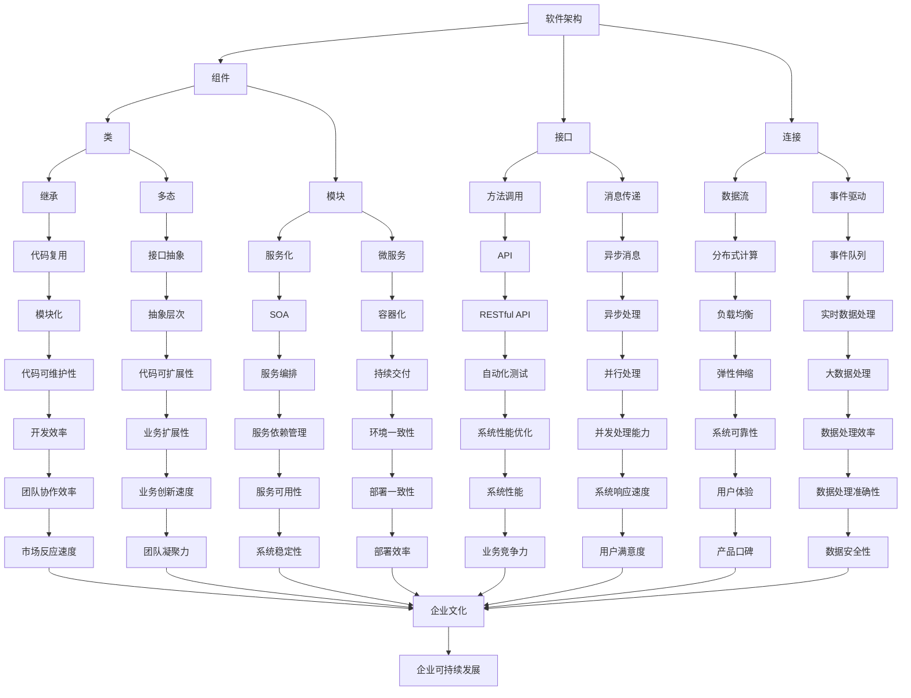

                 

### 引言

在当今快速发展的技术时代，软件架构师的角色越来越受到重视。他们不仅是技术专家，更是团队的核心领导者，能够在复杂的技术环境中做出明智的决策。从技术专家到决策者，这是一个充满挑战和机遇的成长之路。本文旨在探讨软件架构师的成长之路，通过分析其在软件架构、技术管理、团队协作和决策能力方面的成长路径，为读者提供一条清晰的职业发展指南。

首先，我们将探讨软件架构的基本概念和重要性，理解其在软件开发过程中的核心作用。接着，我们将深入分析软件架构的设计原则、风格和模型，并通过Mermaid流程图展示核心概念之间的关系。随后，我们将转向技术管理的提升，包括团队管理、技术风险管理和技术决策与规划等方面。

在团队协作与沟通部分，我们将讨论团队协作的基础、跨部门沟通与合作以及冲突管理与解决。最后，我们将关注决策能力的培养，从战略决策到运营决策，全面阐述决策能力的培养方法和实践。

通过这篇文章，我们希望能够为那些希望成为软件架构师的读者提供一个系统化的成长路径，帮助他们在职业道路上迈出坚实的步伐。

### 软件架构基础

#### 1.1 软件架构的定义与重要性

软件架构是软件系统的组织结构和运行机制的基本框架，它定义了系统中各个组件如何相互连接和交互。一个良好的软件架构不仅是实现软件功能的关键，更是保障软件质量、可维护性和可扩展性的基础。软件架构的重要性体现在以下几个方面：

1. **系统整体性**：软件架构为整个系统提供了一个高层次的设计视图，使得系统组件之间的关系和功能模块的划分清晰可见。这种整体性有助于开发者理解系统的全貌，从而更加有效地进行开发和维护。

2. **可维护性**：良好的软件架构设计可以减少系统的复杂度，使得代码模块化、模块之间解耦。这有助于未来的代码维护和扩展，减少因修改一个模块而导致的全局问题。

3. **可扩展性**：通过软件架构，系统可以更加灵活地适应未来的需求变化。例如，引入新的模块或替换旧模块时，只需调整架构中相关部分的连接，而不需要全面重构系统。

4. **质量保障**：软件架构设计时考虑到的性能、安全性、可靠性等质量因素，可以提前在开发阶段就得到规划和实现，从而减少后期因质量问题带来的成本和风险。

#### 1.2 软件架构的基本概念

为了更好地理解软件架构，我们需要了解以下几个基本概念：

1. **组件（Component）**：组件是软件架构中的基本构建块，它可以是类、模块或子系统。组件通过接口进行通信，这些接口定义了组件之间的交互方式和约束条件。

2. **接口（Interface）**：接口是组件之间的通信边界，它定义了组件之间的交互协议。通过接口，组件可以独立开发、测试和部署，而不会影响其他组件。

3. **连接（Connection）**：连接是组件之间的交互路径，它可以是方法调用、消息传递或数据流。连接方式的选择取决于系统的需求和架构风格。

4. **架构风格（Architecture Style）**：架构风格是指系统中组件和连接的组织方式。常见的架构风格包括事件驱动、分层架构和微服务架构。

5. **架构模型（Architecture Model）**：架构模型是对软件架构的抽象描述，它通常包括组件模型、连接模型和交互模型。常见的架构模型有MVC模型、CQRS模型和DDD模型。

#### 1.3 软件架构的发展历程

软件架构的发展历程可以分为几个阶段：

1. **早期阶段**：早期的软件架构主要关注如何组织代码，以实现功能模块的分离和模块化。这一阶段的代表性架构风格是过程式架构和模块化架构。

2. **面向对象阶段**：随着面向对象编程的出现，软件架构开始强调类和对象的设计与组织。这一阶段的代表性架构风格是面向对象架构，其核心思想是封装、继承和多态。

3. **服务化阶段**：随着互联网的兴起，软件架构开始向服务化方向演进。微服务架构和SOA（服务导向架构）成为这一阶段的代表。服务化架构使得系统更加模块化、可扩展和可复用。

4. **云原生阶段**：云原生技术（如容器、微服务、自动化部署等）的出现，使得软件架构变得更加灵活和高效。这一阶段的代表性架构风格是云原生架构，它充分利用了云计算和分布式计算的优势。

#### 1.4 软件架构与核心概念联系

为了更好地理解软件架构，我们需要了解它与核心概念之间的关系。以下是一个Mermaid流程图，展示了软件架构中的关键概念及其相互关系：

这个Mermaid流程图展示了软件架构与核心概念之间的复杂关系，通过视觉化方式帮助读者更好地理解这些概念及其相互影响。

#### 1.5 软件架构设计原则

软件架构设计原则是指导软件架构设计的重要理论基础。以下是一些常见的软件架构设计原则：

1. **SOLID原则**：SOLID是一组常用的软件设计原则，分别是单职责原则（Single Responsibility Principle，SRP）、开闭原则（Open/Closed Principle，OCP）、里氏替换原则（Liskov Substitution Principle，LSP）、接口隔离原则（Interface Segregation Principle，ISP）和依赖倒置原则（Dependency Inversion Principle，DIP）。这些原则有助于提高软件的可维护性和可扩展性。

2. **DRY原则**：DRY（Don't Repeat Yourself）原则强调代码的可重用性和一致性。通过减少重复代码，可以提高代码的可维护性和可读性。

3. **YAGNI原则**：YAGNI（You Aren't Gonna Need It）原则建议只实现当前需要的功能，避免过度设计。这样可以减少开发成本和未来的维护工作量。

4. **KISS原则**：KISS（Keep It Simple, Stupid）原则强调简洁性，主张设计应该尽可能简单。简单的系统更容易理解、测试和维护。

5. **DRY原则**：DRY（Don't Repeat Yourself）原则强调代码的可重用性和一致性。通过减少重复代码，可以提高代码的可维护性和可读性。

6. **YAGNI原则**：YAGNI（You Aren't Gonna Need It）原则建议只实现当前需要的功能，避免过度设计。这样可以减少开发成本和未来的维护工作量。

7. **KISS原则**：KISS（Keep It Simple, Stupid）原则强调简洁性，主张设计应该尽可能简单。简单的系统更容易理解、测试和维护。

通过遵循这些原则，软件架构师可以设计出更高质量、更易于维护的软件架构。

#### 1.6 软件架构风格

软件架构风格是系统组件和连接的组织方式，不同的架构风格适用于不同的应用场景。以下是一些常见的软件架构风格：

1. **事件驱动架构（Event-Driven Architecture，EDA）**：事件驱动架构基于事件来组织系统组件，各个组件通过事件进行通信。这种架构风格适用于实时系统、复杂的业务流程和异步处理。

2. **分层架构（Layered Architecture）**：分层架构将系统划分为多个层次，每个层次负责不同的功能。常见的层次包括表示层、业务逻辑层、数据访问层和数据存储层。这种架构风格有助于系统的模块化和可维护性。

3. **微服务架构（Microservices Architecture）**：微服务架构将系统拆分为多个独立的、小型服务，每个服务负责一个特定的业务功能。这种架构风格适用于大规模分布式系统，可以提高系统的灵活性和可扩展性。

4. **服务导向架构（Service-Oriented Architecture，SOA）**：服务导向架构通过服务来组织系统，各个服务通过接口进行通信。这种架构风格强调服务的松耦合和可复用性，适用于企业级应用。

5. **分布式计算架构（Distributed Computing Architecture）**：分布式计算架构通过分布式系统来处理大规模数据和高并发请求。这种架构风格适用于需要高性能和高可靠性的系统。

通过选择合适的软件架构风格，软件架构师可以设计出更适应业务需求的系统。

#### 1.7 软件架构模型

软件架构模型是对软件架构的抽象描述，常见的软件架构模型包括：

1. **MVC模型（Model-View-Controller）**：MVC模型将系统划分为模型（Model）、视图（View）和控制器（Controller）三个部分。模型负责处理数据，视图负责显示数据，控制器负责处理用户输入和协调模型与视图的交互。

2. **CQRS模型（Command Query Responsibility Segregation）**：CQRS模型将系统的读写操作分离，分为命令（Command）和查询（Query）两部分。命令负责处理业务操作，查询负责处理数据查询。这种架构风格可以提高系统的性能和响应速度。

3. **DDD模型（Domain-Driven Design）**：DDD模型强调领域模型的设计，通过领域模型来驱动整个系统的设计和开发。这种架构风格适用于复杂业务系统，可以提高系统的灵活性和可扩展性。

通过了解这些软件架构模型，软件架构师可以更好地设计出适应业务需求的系统。

### 第二部分：技术管理提升

#### 2.1 技术管理概述

技术管理是软件架构师不可或缺的一部分，它涵盖了从技术战略规划到技术团队管理的各个方面。技术管理的核心目标是确保技术资源得到合理利用，技术团队能够高效运作，同时确保项目按时交付并达到预期质量。以下是技术管理的一些关键职责和目标：

1. **技术战略规划**：技术管理需要制定长期的技术战略，明确技术的发展方向、技术选型和技术栈的规划。这有助于确保团队在技术上的持续进步和竞争力。

2. **资源分配**：技术管理需要合理分配技术资源，包括人力、时间和预算。这要求技术管理者具备全局视野和资源优化能力。

3. **团队管理**：技术管理涉及团队的组织、人员选拔、绩效评估和团队文化建设。技术管理者需要关注团队成员的技能提升和职业发展，以保持团队的活力和创新能力。

4. **风险管理**：技术管理需要识别和评估技术风险，并制定相应的风险应对策略。这有助于减少因技术问题导致的项目延误和质量问题。

5. **技术决策**：技术管理需要参与技术决策，从多个技术方案中选择最佳方案，确保技术决策符合业务需求和团队能力。

6. **质量保障**：技术管理需要制定质量标准，确保技术团队遵循最佳实践，进行代码审查、测试和持续集成，从而提高软件质量。

#### 2.2 技术团队管理

技术团队管理是技术管理的核心组成部分，有效的技术团队管理可以显著提升团队的效率和创造力。以下是技术团队管理的一些关键方面：

1. **角色和职责**：明确团队成员的角色和职责，确保每个成员都清楚自己的工作内容和目标。常见的角色包括项目经理、开发人员、测试工程师、运维工程师等。

2. **团队协作与沟通**：建立高效的团队协作机制，确保团队成员之间的沟通畅通。这可以通过定期的团队会议、代码审查、站立会议等方式实现。

3. **技能提升与培训**：定期为团队成员提供培训和学习机会，帮助他们不断提升技能和知识。这可以通过内部培训、外部课程、技术分享会等方式实现。

4. **绩效评估**：建立公正的绩效评估体系，定期对团队成员进行评估。评估结果可以用于奖励优秀员工、提升团队成员的技能和改进团队工作流程。

5. **团队文化建设**：建立积极向上的团队文化，鼓励团队成员相互支持、共同进步。团队文化可以是开放、包容、创新、协作等。

6. **激励与反馈**：为团队成员提供适当的激励和反馈，以保持他们的积极性和创造力。激励可以是奖金、晋升、培训等，反馈可以是定期的绩效反馈、团队建设活动等。

#### 2.3 技术风险管理

技术风险管理是技术管理的重要组成部分，它涉及识别、评估和应对技术风险。以下是技术风险管理的一些关键步骤和策略：

1. **风险识别**：通过技术评审、代码审查、测试等方式，识别潜在的技术风险。这些风险可能包括代码质量、系统性能、安全性、兼容性等方面。

2. **风险评估**：对识别出的风险进行评估，确定其影响范围和严重程度。这可以帮助技术管理者优先处理高风险问题。

3. **风险应对**：根据风险评估结果，制定相应的风险应对策略。常见的应对策略包括风险规避、风险减轻、风险接受和风险转移。

4. **风险监控**：建立风险监控机制，定期检查技术风险的状态和变化。这可以帮助技术管理者及时发现和处理新出现的风险。

5. **应急预案**：为可能发生的技术风险制定应急预案，确保在风险发生时能够快速响应和应对。

6. **知识共享**：鼓励团队成员分享技术风险管理的经验和教训，以提高整个团队的风险管理能力。

通过有效的技术风险管理，技术管理者可以减少因技术问题导致的项目延误和质量问题，从而确保项目的顺利进行。

### 第三部分：团队协作与沟通

#### 3.1 团队协作基础

团队协作是软件架构师成功的关键之一，高效的团队协作能够显著提升项目质量和效率。团队协作的基础包括以下几个方面：

1. **目标一致性**：团队成员需要明确共同的目标，了解项目的重要性和每个人的职责。这有助于减少团队内部的分歧和冲突。

2. **沟通机制**：建立有效的沟通机制，确保团队成员能够及时、准确地交流信息。这可以通过定期会议、即时通讯工具、邮件等方式实现。

3. **角色与职责**：明确团队成员的角色和职责，确保每个人都知道自己的任务和期望。这有助于提高团队的工作效率和责任感。

4. **分工协作**：合理分配任务，确保每个成员都能在自己的优势领域发挥作用。分工协作可以减少重复工作，提高工作效率。

5. **共享资源**：共享团队资源和工具，如代码库、文档、测试环境等。这有助于团队成员之间的协作和知识共享。

6. **共同成长**：鼓励团队成员相互学习和成长，提供培训和学习机会。这有助于提升团队的整体技能水平，增强团队的凝聚力。

#### 3.2 跨部门沟通与合作

跨部门沟通与合作在大型项目中尤为重要，不同部门之间的协作效率直接影响到项目的整体进度和质量。以下是跨部门沟通与合作的关键步骤：

1. **明确项目目标和范围**：在项目启动阶段，与跨部门团队成员明确项目目标和范围，确保大家对项目的理解一致。

2. **建立沟通渠道**：建立跨部门沟通渠道，如定期会议、邮件列表、即时通讯群组等。这些渠道有助于跨部门成员之间的信息交流和问题解决。

3. **共享文档和资源**：建立共享的文档和资源库，如项目计划、需求文档、设计文档等。这有助于跨部门成员之间快速获取所需信息。

4. **定期会议和报告**：定期举行跨部门会议和报告，汇总项目进展、问题和风险。这有助于及时发现问题并进行调整。

5. **共同解决问题**：鼓励跨部门成员共同面对问题，共同寻找解决方案。这有助于提高团队的协作能力和解决问题的效率。

6. **培养跨部门文化**：通过组织团队建设活动、分享会等，培养跨部门成员之间的信任和合作关系。这有助于增强团队的凝聚力和协作精神。

#### 3.3 冲突管理与解决

在团队协作过程中，冲突是不可避免的。有效的冲突管理能够减少团队内部的摩擦，提高工作效率和团队氛围。以下是冲突管理与解决的关键步骤：

1. **识别冲突**：及时识别团队中的冲突，这可以通过观察成员的行为、倾听他们的反馈、进行匿名调查等方式实现。

2. **理解冲突原因**：深入了解冲突的根源，这可以通过一对一谈话、小组讨论、调查问卷等方式实现。

3. **沟通与谈判**：通过沟通和谈判，寻找解决冲突的方法。这可以包括直接对话、调解、妥协等方式。

4. **制定解决方案**：根据冲突原因和团队成员的意见，制定切实可行的解决方案。这可以包括改变工作流程、调整团队成员角色、提供培训等方式。

5. **执行与监控**：实施解决方案，并监控其效果。这可以通过定期的团队会议、绩效评估等方式实现。

6. **总结与反馈**：总结冲突管理和解决的过程，为未来的团队协作提供经验和教训。这可以通过团队建设活动、培训等方式实现。

通过有效的冲突管理，团队可以更加和谐、高效地运作，提高项目的成功率。

### 第四部分：决策能力培养

#### 4.1 决策理论概述

决策是软件架构师在职业生涯中不可或缺的一部分，有效的决策能力能够帮助他们在复杂的技术和管理环境中做出明智的选择。决策理论为决策过程提供了系统的方法和框架，以下是几个关键决策理论：

1. **理性决策理论（Rational Decision Making）**：理性决策理论假设决策者是完全理性的，他们会收集所有相关的信息，评估所有可能的选项，并选择最优方案。理性决策理论的主要步骤包括：
   - 识别问题
   - 收集信息
   - 制定备选方案
   - 评估备选方案
   - 选择最佳方案
   - 实施和监控决策结果

2. **有限理性决策理论（Bounded Rationality）**：由于时间和认知限制，决策者无法处理所有信息，因此有限理性决策理论认为决策者在有限的资源和时间下做出足够好的决策。有限理性决策理论的主要步骤包括：
   - 识别问题
   - 收集有限信息
   - 选择合理的决策准则
   - 生成备选方案
   - 选择足够好的方案
   - 实施和监控决策结果

3. **行为决策理论（Behavioral Decision Making）**：行为决策理论关注人类决策行为中的认知偏差和情感因素。行为决策理论认为，决策者的决策过程受到心理、情感和社会因素的影响，这些因素可能导致决策偏差。行为决策理论的主要步骤包括：
   - 识别问题
   - 收集信息
   - 评估备选方案
   - 选择实际可行的方案
   - 实施和监控决策结果
   - 反思和调整决策过程

通过了解这些决策理论，软件架构师可以更全面地理解决策过程，从而提高决策的有效性。

#### 4.2 战略决策

战略决策是软件架构师在高层次上制定的决策，它关系到公司的长期发展方向和竞争策略。战略决策通常包括以下几个步骤：

1. **识别战略问题**：战略问题可能包括市场变化、技术变革、竞争对手的威胁等。识别战略问题是制定有效战略决策的第一步。

2. **制定战略目标**：明确公司的长期目标和愿景，这些目标将指导战略决策的方向。战略目标应具体、可衡量和可实现。

3. **分析外部环境**：通过SWOT分析（优势、劣势、机会、威胁）等方法，分析公司的外部环境，了解市场趋势、竞争对手和潜在机会。

4. **评估内部能力**：分析公司的内部资源、技术能力和团队优势，了解公司实现战略目标的能力。

5. **制定战略方案**：根据外部环境和内部能力，制定多个战略方案。这些方案应具备不同的风险和收益，以供选择。

6. **评估和选择方案**：对每个战略方案进行评估，包括其可行性、风险和潜在收益。选择最佳方案，确保其与公司目标和愿景相符。

7. **实施和监控**：实施战略决策，并定期监控其效果。根据实际情况进行调整，确保战略决策的有效执行。

通过有效的战略决策，软件架构师可以指导公司应对外部挑战，抓住市场机遇，实现长期发展。

#### 4.3 运营决策

运营决策是软件架构师在日常工作中频繁做出的决策，它关系到项目的短期执行和运营效率。运营决策通常包括以下几个步骤：

1. **识别运营问题**：识别项目或业务运营中存在的问题，如延迟、质量缺陷、资源浪费等。

2. **收集数据**：收集与运营问题相关的数据，如工作日志、测试报告、用户反馈等。这些数据有助于更准确地识别问题。

3. **分析问题根源**：通过数据分析，找到问题的根源。这可以包括代码质量、流程优化、团队协作等方面。

4. **制定解决方案**：根据问题根源，制定相应的解决方案。解决方案应具体、可行，并能有效解决问题。

5. **评估解决方案**：评估解决方案的可行性和潜在效果，确保其不会带来新的问题。

6. **实施和监控**：实施解决方案，并监控其效果。定期评估解决方案的效果，根据实际情况进行调整。

7. **持续改进**：通过持续改进，不断提高运营效率和项目质量。这可以包括流程优化、技能提升、工具改进等。

通过有效的运营决策，软件架构师可以确保项目的顺利进行，提高团队的工作效率和项目成功率。

### 决策能力培养

#### 4.4 决策能力模型

为了提高决策能力，软件架构师需要建立一套决策能力模型，该模型包括以下几个关键要素：

1. **信息收集与分析能力**：有效的决策依赖于准确和全面的信息。软件架构师需要具备收集和分析信息的能力，包括市场趋势、技术发展、团队状态等。

2. **逻辑推理与判断力**：决策能力要求软件架构师能够运用逻辑推理和判断力，从多个备选方案中识别最佳方案。这需要具备良好的逻辑思维能力和判断力。

3. **风险意识与应对策略**：在决策过程中，软件架构师需要具备风险意识，能够识别潜在的风险，并制定相应的应对策略。这有助于降低决策风险，提高决策的成功率。

4. **沟通与协作能力**：决策往往涉及多个团队和部门，软件架构师需要具备良好的沟通与协作能力，确保信息流畅，协调各方资源，共同实现决策目标。

5. **灵活性与适应性**：决策过程中可能会出现意想不到的情况，软件架构师需要具备灵活性和适应性，能够根据实际情况调整决策方案，确保决策的有效性。

6. **持续学习和反思能力**：决策能力是一个不断发展的过程，软件架构师需要持续学习新知识、新方法，并不断反思和改进决策过程，以提高决策能力。

#### 4.5 决策能力培养方法

为了培养决策能力，软件架构师可以采取以下方法：

1. **案例学习**：通过学习历史决策案例，了解不同决策方法、策略和结果。这有助于软件架构师在实际决策中借鉴经验和教训。

2. **模拟练习**：通过模拟真实决策场景，软件架构师可以在实践中提高决策能力。这可以包括业务决策模拟、项目管理模拟等。

3. **思维训练**：通过逻辑思维、判断力训练等思维训练方法，提高软件架构师的逻辑推理和分析能力。

4. **经验分享**：组织经验分享会，邀请资深软件架构师分享他们的决策经验和教训。这有助于软件架构师从他人的经验中学习，提高决策能力。

5. **反思与总结**：定期反思自己的决策过程和结果，总结经验教训，不断改进决策方法。

6. **持续学习**：关注新技术、新方法的发展动态，不断充实自己的知识储备，提高决策的准确性。

通过以上方法，软件架构师可以逐步提高自己的决策能力，为团队和公司的发展做出更加明智和有效的决策。

### 总结

从技术专家到决策者，软件架构师的成长之路充满了挑战和机遇。本文通过分析软件架构基础、技术管理提升、团队协作与沟通以及决策能力培养，为读者提供了一条清晰的职业发展路径。软件架构师不仅需要掌握技术深度，更要有广度，具备管理、协作和决策能力。通过不断学习和实践，软件架构师可以在这个快速变化的技术时代中脱颖而出，成为团队的核心领导者。

在此，我们鼓励读者积极实践文中提到的原则和方法，不断提升自己的技术和管理能力。同时，也欢迎读者分享自己的经验和见解，共同推动软件架构师职业的发展。

### 参考文献

1. **Mayer-Schönberger, V., & Cukier, K. (2013). Big Data: A Revolution That Will Transform How We Live, Work, and Think. Eamon Dolan/Mariner Books.**
   - 介绍了大数据对决策的影响，为软件架构师提供了新的视角。

2. **Brooks, F. P. (1975). The Mythical Man-Month: Essays on Software Engineering. Addison-Wesley.**
   - 分析了软件工程中的常见问题，为技术管理提供了重要的启示。

3. **Fowler, M. (2002). Patterns of Enterprise Application Architecture. Addison-Wesley.**
   - 探讨了软件架构设计中的最佳实践，为架构设计提供了有力支持。

4. **Schwartz, R. J. (1991). The Art of Computer Programming. Addison-Wesley.**
   - 讲解了算法原理和设计，为软件架构师提供了算法基础。

5. **Kim, G., & Kim, S. (2016). Lean Software Development: An Agile Toolkit for Software Leaders, Managers, and Scrummasters. Addison-Wesley.**
   - 介绍了精益软件开发方法，为技术管理提供了新的思路。

6. **Larman, C. (2003). Applying UML and Patterns: An Introduction to Object-Oriented Analysis and Design and the IT Industry. Prentice Hall.**
   - 探讨了UML和设计模式的应用，为软件架构师提供了实用的工具。

7. **Kotter, J. P. (1996). Leading Change. Harvard Business Review.**
   - 分析了领导变革的方法，为软件架构师在团队管理中提供了指导。

通过参考这些经典著作，软件架构师可以不断深化自己的专业知识，提升职业素养。希望本文能为您的职业发展提供有益的启示。作者：AI天才研究院/AI Genius Institute & 禅与计算机程序设计艺术 /Zen And The Art of Computer Programming。

