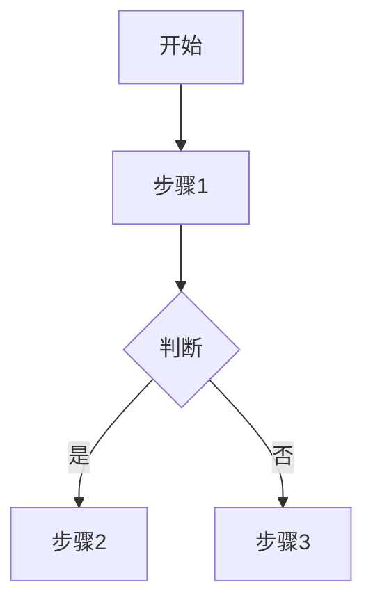

                 

### 文章标题：软件架构文档化工具：arc42、C4模型等

---

#### 关键词：
- 软件架构文档化
- arc42工具
- C4模型
- 架构文档工具
- 软件开发

---

#### 摘要：
本文将深入探讨软件架构文档化的重要性和相关的工具，包括arc42和C4模型。文章首先介绍了软件架构文档化的意义和常见工具，然后详细解析了arc42工具的结构、使用方法和高级应用。接着，对C4模型进行了概述，详细讲解了其使用方法和案例分析。最后，对其他常用的架构文档化工具进行了简要介绍，并对软件架构文档化的未来趋势进行了展望。本文旨在为软件开发者提供全面的技术指南，帮助他们更好地进行架构文档化。

---

### 第一部分：软件架构文档化基础

#### 第1章：软件架构文档化概述

在软件工程中，架构文档化是一个关键环节，它能够帮助开发团队更好地理解系统的设计和实现，从而提高软件的可维护性和可扩展性。本章节将介绍软件架构文档化的意义、常见工具，以及为何选择arc42和C4模型作为本文的重点讨论对象。

**1.1 软件架构文档化的意义**

软件架构文档化不仅是一个技术性的任务，更是一种工程实践，其意义体现在以下几个方面：

- **提高软件可维护性**：详尽的架构文档能够帮助开发者快速理解系统的结构和功能，减少维护过程中的错误和重复劳动。
- **促进团队协作**：通过共享架构文档，团队成员可以更好地协同工作，避免因信息不对称导致的沟通障碍和协作失误。
- **支持软件演化**：随着软件需求和技术的不断变化，文档化的架构可以指导系统演化，确保新功能的引入不会破坏现有系统的稳定性。

**1.2 常见架构文档化工具**

在众多的架构文档化工具中，arc42和C4模型因其独特的优势和广泛的应用而备受关注。以下是这两种工具的主要特点：

- **arc42工具**：arc42是一种基于模板的架构文档工具，它提供了清晰的结构和模板库，可以帮助开发者快速创建和维护架构文档。
- **C4模型**：C4模型是一种简洁的软件架构描述语言，它由四个层次（容器、组件、配置和代码）组成，易于理解和应用。

**1.3 选择arc42和C4模型的原因**

- **易用性**：arc42和C4模型都设计简单直观，易于学习和使用，适合不同层次的开发者。
- **灵活性**：这两种工具都具有很高的灵活性，可以根据项目的具体需求进行定制和扩展。
- **广泛应用**：arc42和C4模型在业界得到了广泛的应用，有很多成功的案例，可以借鉴。

在接下来的章节中，我们将详细探讨arc42工具和C4模型的使用方法和应用场景，帮助读者更好地理解这两种工具的价值和如何有效地使用它们。

---

### 第二部分：arc42工具使用

#### 第2章：arc42工具介绍

arc42是一种流行的架构文档工具，它基于模板，旨在帮助开发者和团队快速创建和维护高质量的架构文档。本章节将介绍arc42的背景、目标用户、主要特性，以及其结构。

**2.1 arc42工具的背景**

arc42起源于欧洲，由一群经验丰富的软件开发者和架构师共同开发，旨在解决在软件架构文档化过程中常见的问题，如文档结构混乱、信息不完整、更新不及时等。arc42的目标是提供一个简单、灵活且易于使用的工具，帮助团队高效地记录和共享软件架构知识。

**2.1.1 开发背景**

随着软件系统的复杂性不断增加，架构文档的重要性愈发突出。然而，传统的文档工具往往功能复杂，使用门槛高，难以满足快速迭代的开发需求。arc42应运而生，它简化了文档结构，提供了清晰的模板，使得开发者可以专注于内容的创建和更新，而无需过多关注工具本身。

**2.1.2 目标用户**

arc42主要面向软件开发团队，特别是那些关注软件架构和文档化过程的团队。无论是初学者还是经验丰富的架构师，arc42都能提供有价值的帮助。具体来说，arc42的目标用户包括：

- **软件开发者**：需要记录和分享系统架构信息的开发者。
- **架构师**：负责设计和维护软件架构的架构师。
- **项目经理**：需要了解项目架构和状态的项目经理。

**2.1.3 主要特性**

arc42具有以下主要特性，使其在众多文档化工具中脱颖而出：

- **模板库**：arc42提供了一个丰富的模板库，涵盖了常见的架构文档模板，如系统概述、组件架构、数据流图等。
- **自定义模板**：用户可以根据项目需求自定义模板，以适应不同的文档结构和风格。
- **版本控制**：arc42支持版本控制，确保文档的历史版本和变更记录完整可追溯。
- **在线协作**：多个团队成员可以在同一份文档上进行协作，实时更新和评论。

**2.2 arc42工具的结构**

arc42工具的核心结构包括以下几个部分：

- **模板模块**：模板模块是arc42的核心，提供了多种预设的模板，用户可以根据需要选择合适的模板进行文档创建。
- **文档编辑器**：文档编辑器是用户用于创建和编辑文档的主要界面，支持Markdown等常见的文本格式。
- **协作平台**：协作平台提供了在线协作功能，支持多人同时编辑和评论文档。

**2.3 arc42模板库**

arc42的模板库是工具的一大亮点，它涵盖了以下几类模板：

- **系统概述**：包括系统功能描述、系统边界、系统依赖等。
- **组件架构**：包括组件关系图、组件描述、接口定义等。
- **数据流图**：包括数据流、数据存储、数据处理等。
- **部署架构**：包括部署环境、部署组件、部署流程等。

**2.4 arc42与C4模型的联系**

arc42和C4模型在架构描述上有一定的关联性。C4模型是一种简洁的架构描述语言，它由容器、组件、配置和代码四个层次组成。arc42的模板库中包含了与C4模型相对应的模板，使得开发者可以更方便地将C4模型应用于实际的架构文档中。

通过arc42工具的介绍，我们可以看到它为软件架构文档化提供了强大的支持。在下一章节中，我们将深入探讨arc42的使用方法，帮助读者掌握如何有效地使用这个工具来创建和维护架构文档。

---

#### 第3章：arc42工具的使用方法

arc42工具的使用方法简单而高效，主要分为安装与配置、创建和编辑文档以及版本控制等步骤。以下将详细介绍这些步骤，帮助用户快速上手并熟练使用arc42。

**3.1 安装与配置**

**3.1.1 环境准备**

在安装arc42之前，需要确保您的计算机上已经安装了以下环境：

- **Node.js**：arc42是一个基于Node.js的命令行工具，因此需要安装Node.js。您可以从Node.js官网（https://nodejs.org/）下载并安装。
- **Git**：arc42依赖Git进行版本控制，因此也需要安装Git。

**3.1.2 工具安装**

安装arc42可以通过npm（Node Package Manager）进行。在命令行中运行以下命令：

```bash
npm install -g arc42
```

安装完成后，您可以通过命令行输入`arc42 -v`来验证是否安装成功。

**3.1.3 常见问题解决**

在安装过程中可能会遇到一些问题，以下是一些常见问题及其解决方案：

- **Node.js版本问题**：如果您的Node.js版本过低，可能会导致安装失败。请确保您的Node.js版本在推荐范围内，并重新尝试安装。
- **npm权限问题**：在安装过程中，如果遇到权限问题，可以在命令前添加`sudo`来获取管理员权限。

**3.2 创建和编辑文档**

**3.2.1 新建项目**

要创建一个新的arc42项目，可以在命令行中运行以下命令：

```bash
arc42 new my-architecture-doc
```

这将创建一个新的文件夹`my-architecture-doc`，并初始化项目结构。在创建过程中，系统会提示输入一些基本信息，如项目名称、描述等。

**3.2.2 编辑文档**

进入新创建的项目文件夹后，您可以使用文本编辑器（如Visual Studio Code、Sublime Text等）打开项目文件，进行文档编辑。arc42使用Markdown格式来编写文档，因此您可以按照Markdown语法来编写和格式化文本。

**3.2.3 常用命令**

arc42提供了一些常用的命令，方便用户进行文档管理和操作：

- `arc42 open`：打开项目文件。
- `arc42 start`：启动文档编辑器。
- `arc42 preview`：预览HTML格式的文档。
- `arc42 save`：保存文档。

**3.2.4 嵌入图表和图片**

arc42支持在文档中嵌入图表和图片。您可以使用Mermaid语言编写图表，并将其嵌入到Markdown文档中。例如：

```markdown


```markdown

```

**3.3 版本控制**

arc42内置了版本控制功能，使用Git进行版本管理。以下是一些基本的Git命令：

- `git init`：初始化本地Git仓库。
- `git add .`：将所有更改添加到暂存区。
- `git commit -m "Commit message"`：提交更改。
- `git push`：将更改推送到远程仓库。

通过以上命令，您可以方便地管理和追踪文档的变更历史。

**3.4 常见问题解决**

在使用arc42的过程中，可能会遇到一些常见问题，以下是一些解决方案：

- **文档格式错误**：确保遵循Markdown语法和arc42的模板规范。
- **工具版本问题**：确保您的arc42版本是最新的，可以通过`npm update arc42`来更新。
- **图表渲染问题**：确保安装了Mermaid相关的依赖库，可以通过`npm install -g mermaid-cli`来安装。

通过以上步骤，您应该可以熟练地使用arc42工具进行软件架构文档的创建和编辑。在下一章节中，我们将探讨arc42的高级使用和扩展功能，帮助您进一步提升文档化效率。

---

#### 第4章：arc42工具的高级使用

在arc42的基础使用中，我们已经了解了如何创建、编辑和版本控制架构文档。然而，arc42的功能远不止于此。本章节将介绍arc42的高级使用，包括模板库的利用、插件开发以及与其他工具的集成，帮助用户更高效地管理架构文档。

**4.1 arc42模板库**

arc42提供了丰富的模板库，这些模板涵盖了从系统概述到组件架构，再到数据流图等各种常见文档类型。使用模板库可以帮助用户快速生成高质量的文档，节省时间和精力。

**4.1.1 模板介绍**

arc42的模板库主要包括以下几类模板：

- **系统概述**：用于描述系统的功能、边界和主要依赖。
- **组件架构**：用于展示系统中的组件关系、组件功能和接口定义。
- **数据流图**：用于描述数据在系统中的流动过程。
- **部署架构**：用于描述系统的部署环境和部署流程。

每个模板都包含了详细的结构和字段，用户可以根据项目的具体需求进行修改和扩展。

**4.1.2 模板定制**

arc42允许用户自定义模板，以满足特定项目的需求。自定义模板的方法如下：

1. **创建新模板**：在arc42项目中，可以通过`arc42 new-template`命令创建一个新模板。

2. **编辑模板**：进入新创建的模板文件夹，使用文本编辑器编辑`.md`文件，定义模板的结构和内容。

3. **使用自定义模板**：在创建新项目时，选择自定义模板，arc42将使用该模板生成文档。

**4.2 扩展与集成**

arc42不仅提供了丰富的模板库，还支持通过插件进行扩展和集成，以满足更多复杂的需求。

**4.2.1 插件开发**

arc42的插件系统允许开发者创建自定义插件，以增强工具的功能。插件可以是命令行工具、Node.js模块或Web服务。以下是开发插件的基本步骤：

1. **了解插件架构**：阅读arc42的插件开发文档，了解插件的架构和API。
2. **创建插件**：使用`arc42 plugin new`命令创建一个新插件。
3. **编写插件代码**：在插件文件夹中编写代码，实现插件的功能。
4. **测试插件**：在本地环境中测试插件，确保其功能正确。

**4.2.2 与其他工具的集成**

arc42可以与其他工具集成，以实现更高效的架构文档管理。以下是一些常见的集成场景：

- **与版本控制系统集成**：arc42支持与Git、GitHub等版本控制系统集成，实现文档的版本管理和协同工作。
- **与IDE集成**：通过插件，arc42可以与Visual Studio Code、IntelliJ IDEA等IDE集成，方便开发者直接在IDE中创建和编辑架构文档。
- **与图表工具集成**：arc42支持与Mermaid、D3.js等图表工具集成，方便用户在文档中嵌入高质量的图表。

**4.3 常见问题解决**

在使用arc42的高级功能时，可能会遇到一些问题。以下是一些常见问题及其解决方案：

- **插件开发问题**：如果插件开发遇到问题，可以查阅arc42的插件开发文档，或者加入arc42的用户社区寻求帮助。
- **集成问题**：在集成arc42与其他工具时，可能需要调整配置文件或编写额外的插件代码。可以参考官方文档或社区经验进行解决。

通过arc42的高级使用和扩展，用户可以更好地定制和管理架构文档，提高团队协作效率。在下一章节中，我们将探讨C4模型，了解其结构和应用。

---

### 第三部分：C4模型及其应用

#### 第5章：C4模型概述

C4模型是一种用于描述软件架构的简洁方法，由四个层次组成：容器、组件、配置和代码。C4模型的简洁性和直观性使其成为软件开发者和架构师的有力工具。本章节将介绍C4模型的背景、目标和应用。

**5.1 C4模型的背景**

C4模型起源于敏捷和DevOps运动的背景下，旨在简化软件架构描述，使其更易于理解和沟通。传统的架构描述方法往往复杂且难以维护，而C4模型通过其简洁的四个层次，提供了一种更为直观和易于使用的方法。

**5.1.1 C4模型的起源**

C4模型是由Chris National开发的，他在其著作《C4模型：软件架构的简洁之道》中详细介绍了这个模型。C4模型的目标是提供一种简单、直观且易于扩展的方法，帮助开发者和架构师描述和沟通复杂的软件架构。

**5.1.2 目标用户**

C4模型的目标用户包括：

- **软件开发者**：需要清晰描述和沟通系统架构的开发者。
- **架构师**：负责设计和维护系统架构的架构师。
- **项目经理**：需要了解系统架构和状态的项目经理。

**5.2 C4模型的结构**

C4模型由四个层次组成，每个层次都有其独特的功能和目的：

1. **容器**（Container）：描述系统的物理部署结构，如服务器、网络、数据库等。
2. **组件**（Component）：描述系统的逻辑组件，如服务、模块、类等。
3. **配置**（Configuration）：描述组件的配置信息，如参数、环境变量、数据库连接等。
4. **代码**（Code）：描述组件的具体实现，包括代码文件、库、模块等。

**5.3 C4模型的应用**

C4模型的应用非常广泛，可以在软件开发的各个阶段使用。以下是一些常见的应用场景：

- **需求分析**：在需求分析阶段，C4模型可以帮助开发者直观地理解和沟通系统需求。
- **架构设计**：在架构设计阶段，C4模型可以用于描述系统的整体架构和组件关系。
- **文档化**：C4模型可以作为架构文档的基础，帮助团队记录和共享系统架构知识。
- **持续集成与部署**：在持续集成和部署过程中，C4模型可以用于监控和管理系统的配置和部署。

**5.4 C4模型的优势**

C4模型具有以下优势：

- **简洁性**：通过四个清晰的层次，C4模型使得架构描述更加简洁和直观。
- **可扩展性**：C4模型允许用户根据需要扩展层次和元素，以适应不同的架构需求。
- **易于沟通**：C4模型的直观性使得开发者、架构师和项目经理之间更容易沟通和理解系统架构。

在下一章节中，我们将深入探讨C4模型的具体使用方法和应用案例。

---

#### 第6章：C4模型的使用方法

C4模型是一种非常直观且易于理解的架构描述方法，其简洁性使得它在软件架构文档化中得到了广泛应用。本章节将详细讲解C4模型的使用方法，包括如何创建C4模型、扩展C4模型以及调整C4模型的层次结构。

**6.1 创建C4模型**

创建C4模型的第一步是确定模型的层次结构。C4模型由四个层次组成：容器、组件、配置和代码。以下是创建C4模型的基本步骤：

1. **定义容器**：容器层描述系统的物理部署结构，如服务器、网络、数据库等。您可以使用实体关系图（ER图）或简单的文字描述来表示容器。
    ```mermaid
    graph TD
        A[Container 1] --> B[Server 1]
        A --> C[Server 2]
        C --> D[Database]
    ```
   
2. **定义组件**：组件层描述系统的逻辑组件，如服务、模块、类等。每个组件应该有清晰的职责和功能描述。
    ```mermaid
    graph TD
        B{Service 1} --> C{Service 2}
        D{Module 1} --> E{Module 2}
    ```

3. **定义配置**：配置层描述组件的配置信息，如参数、环境变量、数据库连接等。配置信息应该以表格或列表的形式呈现。
    ```mermaid
    graph TD
        B{Service 1} --> F{Config 1}
        C{Service 2} --> G{Config 2}
    ```

4. **定义代码**：代码层描述组件的具体实现，包括代码文件、库、模块等。代码实现应该以代码片段或简单的UML类图表示。
    ```mermaid
    graph TD
        H[Class 1] --> I[Class 2]
    ```

**6.2 扩展C4模型**

C4模型是高度可扩展的，您可以根据项目需求添加额外的层次和元素。以下是扩展C4模型的几种方法：

1. **添加新层次**：根据需要，您可以添加新的层次，如数据层、用户界面层等。
    ```mermaid
    graph TD
        J[Data Layer] --> K[UI Component]
    ```

2. **增加组件属性**：为组件添加额外的属性，如版本号、负责人等。
    ```mermaid
    graph TD
        L[Service 1]((Version: 1.0, Owner: John Doe))
    ```

3. **细化配置信息**：细化配置信息，使其更加详细和具体。
    ```mermaid
    graph TD
        M[Config 3]((Environment: Production, Timeout: 30s))
    ```

**6.3 调整C4模型的层次结构**

在创建和扩展C4模型的过程中，您可能会发现需要调整模型的结构。以下是调整C4模型层次结构的一些方法：

1. **合并层次**：如果某些层次的信息重复或冗余，可以考虑合并层次。
    ```mermaid
    graph TD
        N[Combined Container] --> O[Combined Service]
    ```

2. **拆分层次**：如果某个层次过于复杂，可以考虑拆分成更小的层次，以提高模型的清晰度和可维护性。
    ```mermaid
    graph TD
        P[Service Layer] --> Q[API Component] --> R[Database Component]
    ```

3. **重命名层次**：根据项目的需求和团队的共识，可以重新命名层次，以使其更加直观和易于理解。
    ```mermaid
    graph TD
        S[Application Layer] --> T[Business Logic]
    ```

通过以上步骤，您可以根据项目的具体需求创建、扩展和调整C4模型。在下一章节中，我们将通过案例分析来进一步展示C4模型的应用。

---

#### 第7章：C4模型案例分析

为了更好地理解C4模型的使用方法，以下将通过两个具体的案例，分别展示C4模型在Web应用和移动应用中的实际应用。

**7.1 C4模型在Web应用中的使用**

**案例背景**：
假设我们正在开发一个电子商务平台，该平台需要提供商品展示、用户注册、购物车和支付等功能。

**C4模型设计**：

1. **容器层**：
   - **服务器**：部署在云服务器上的应用服务器和数据库服务器。
   - **网络**：包括内部网络和外部网络，用于客户端与服务器之间的通信。

   ```mermaid
   graph TD
       A[Web Server] --> B[Database Server]
       B --> C[Client]
   ```

2. **组件层**：
   - **商品展示组件**：负责展示商品信息。
   - **用户注册组件**：处理用户注册和验证。
   - **购物车组件**：管理用户购物车中的商品。
   - **支付组件**：处理支付流程。

   ```mermaid
   graph TD
       D[Product Display] --> E[User Registration] --> F[Shopping Cart] --> G[Payment]
   ```

3. **配置层**：
   - **商品展示组件配置**：包括商品数据源的URL和访问权限。
   - **用户注册组件配置**：包括注册表单的验证规则和数据库连接信息。
   - **购物车组件配置**：包括购物车数据存储的位置和过期时间。
   - **支付组件配置**：包括支付网关的API密钥和支付参数。

   ```mermaid
   graph TD
       D --> H[Product Source]
       E --> I[Registration Rules]
       F --> J[Shopping Cart Storage]
       G --> K[Payment Gateway]
   ```

4. **代码层**：
   - **商品展示组件代码**：包括前端页面和后端接口。
   - **用户注册组件代码**：包括用户注册的API和处理逻辑。
   - **购物车组件代码**：包括购物车的数据库操作和业务逻辑。
   - **支付组件代码**：包括支付流程的接口和业务逻辑。

   ```mermaid
   graph TD
       L[Frontend Code] --> M[Backend Code]
       N[API Code] --> O[Business Logic]
   ```

**案例总结**：
通过C4模型，我们可以清晰地描述电子商务平台的架构，包括其物理部署结构、逻辑组件、配置信息和代码实现。这有助于开发团队在设计和实现过程中更好地理解和沟通系统的架构，从而提高项目的开发效率和代码质量。

**7.2 C4模型在移动应用中的使用**

**案例背景**：
假设我们正在开发一款移动健康监测应用，该应用需要记录用户的运动数据、提供健康建议和反馈。

**C4模型设计**：

1. **容器层**：
   - **移动设备**：包括智能手机和平板电脑。
   - **服务器**：包括应用服务器、数据库服务器和健康数据服务。
   - **网络**：用于移动设备与服务器之间的数据传输。

   ```mermaid
   graph TD
       A[Mobile Device] --> B[Application Server] --> C[Database Server]
   ```

2. **组件层**：
   - **运动数据记录组件**：负责记录用户的运动数据。
   - **健康建议组件**：根据用户的数据提供健康建议。
   - **用户反馈组件**：收集用户的反馈和建议。
   - **数据同步组件**：负责将本地数据同步到服务器。

   ```mermaid
   graph TD
       D[Movement Data] --> E[Health Advice] --> F[User Feedback] --> G[Data Sync]
   ```

3. **配置层**：
   - **运动数据记录组件配置**：包括数据存储的位置和同步频率。
   - **健康建议组件配置**：包括算法的配置和更新策略。
   - **用户反馈组件配置**：包括反馈收集的渠道和存储方式。
   - **数据同步组件配置**：包括同步的参数和加密方式。

   ```mermaid
   graph TD
       D --> H[Data Storage]
       E --> I[Algorithm Config]
       F --> J[Feedback Channel]
       G --> K[Sync Parameters]
   ```

4. **代码层**：
   - **运动数据记录组件代码**：包括本地数据的存储和处理逻辑。
   - **健康建议组件代码**：包括健康算法的实现和数据处理逻辑。
   - **用户反馈组件代码**：包括反馈数据的收集和存储逻辑。
   - **数据同步组件代码**：包括本地数据与服务器同步的接口和逻辑。

   ```mermaid
   graph TD
       L[Local Data Handler] --> M[Backend API]
       N[Health Algorithm] --> O[Backend Processing]
   ```

**案例总结**：
通过C4模型，我们可以清晰地描述移动健康监测应用的架构，包括其物理部署结构、逻辑组件、配置信息和代码实现。这有助于开发团队在设计和实现过程中更好地理解和沟通系统的架构，从而提高项目的开发效率和用户体验。

通过这两个案例分析，我们可以看到C4模型在Web应用和移动应用中的实际应用效果。C4模型的简洁性和直观性使得架构描述更加清晰和易于沟通，为软件开发团队提供了强有力的支持。

---

### 第四部分：其他架构文档化工具

#### 第8章：其他常用架构文档化工具

在软件架构文档化的过程中，除了arc42和C4模型，还有许多其他工具可以提供帮助。本章节将介绍其中两种常用的工具：DAD（Domain-Driven Architecture Documenter）和SAFe（Scaled Agile Framework），并简要介绍它们的特点和使用方法。

**8.1 DAD工具**

DAD（Domain-Driven Architecture Documenter）是一个用于领域驱动设计的文档化工具。它旨在帮助团队创建和维护领域驱动设计的文档，包括领域模型、用例图、实体关系图等。

**8.1.1 工具介绍**

DAD工具提供了一系列的模板和图表，可以用于描述领域驱动设计的各个方面。它支持多种图表类型，如类图、用例图、序列图等，并且可以与常见的UML建模工具（如Visual Paradigm、StarUML等）集成。

**8.1.2 使用方法**

要使用DAD工具，您可以按照以下步骤操作：

1. **下载并安装DAD工具**：从DAD官方网站（https://www.domaindrivendesign.org/）下载并安装DAD工具。
2. **创建新项目**：启动DAD工具后，创建一个新的项目，并选择适当的模板。
3. **编辑文档**：使用DAD工具提供的图表和模板，编辑领域驱动设计的文档。
4. **导出文档**：完成编辑后，可以将文档导出为PDF、Word等格式，以便于分享和打印。

**8.2 SAFe工具**

SAFe（Scaled Agile Framework）是一种用于大规模敏捷开发的框架，它提供了详细的指南和工具，帮助团队在复杂项目中实现敏捷开发。

**8.2.1 工具介绍**

SAFe工具包括一系列文档模板、图表和指南，用于描述项目的整体架构、迭代计划、团队协作等。SAFe工具支持多种图表类型，如迭代计划图、团队矩阵、依赖关系图等，并且可以与项目管理工具（如JIRA、Trello等）集成。

**8.2.2 使用方法**

要使用SAFe工具，您可以按照以下步骤操作：

1. **下载并安装SAFe工具**：从SAFe官方网站（https://www.scaledagileframework.com/）下载并安装SAFe工具。
2. **创建新项目**：启动SAFe工具后，创建一个新的项目，并选择适当的模板。
3. **编辑文档**：使用SAFe工具提供的模板和图表，编辑项目的文档。
4. **导出文档**：完成编辑后，可以将文档导出为PDF、Word等格式，以便于分享和打印。

**8.3 比较与选择**

DAD和SAFe都是优秀的架构文档化工具，它们各有特色，适用于不同的场景。DAD更侧重于领域驱动设计的文档化，适用于需要详细领域模型和用例图的项目；而SAFe则更适用于大规模敏捷开发，提供了一套完整的敏捷开发框架。

在选择工具时，应考虑以下因素：

- **项目需求**：根据项目的具体需求选择适合的工具。
- **团队熟悉度**：选择团队成员熟悉和易于使用的工具。
- **集成能力**：选择可以与其他工具集成的工具，以提高工作效率。

通过了解和选择合适的架构文档化工具，开发团队可以更好地管理项目文档，提高协作效率和项目质量。

---

### 第五部分：总结与展望

#### 第9章：软件架构文档化的未来趋势

随着软件系统的复杂性和规模的不断增加，软件架构文档化的重要性愈发突出。本章节将探讨软件架构文档化的未来趋势，特别是AI在架构文档化中的应用以及面临的挑战和应对策略。

**9.1 AI在架构文档化中的应用**

人工智能技术在软件架构文档化中具有巨大的潜力。以下是一些AI技术在架构文档化中的应用：

1. **自动文档生成**：通过自然语言处理和机器学习技术，AI可以自动从代码、设计文档和其他来源生成架构文档。这大大提高了文档生成的效率和准确性。

2. **智能文档分析**：AI可以分析现有的架构文档，识别潜在的问题和风险，提供优化建议。这有助于提高文档的质量和可靠性。

3. **自动化测试**：AI可以自动生成测试用例，对架构文档进行测试，确保文档的一致性和准确性。

**9.2 跨团队协作**

在大型项目中，跨团队协作是软件架构文档化的一个关键挑战。以下是一些解决策略：

1. **统一平台**：选择一个统一、协作性强的架构文档化工具，支持多团队同时编辑和协作。

2. **明确的角色和责任**：明确团队成员的角色和责任，确保每个成员都知道自己的职责和任务。

3. **定期沟通和反馈**：定期举行会议和讨论，分享文档进展和反馈，确保团队之间的信息畅通。

**9.3 持续集成与部署**

持续集成和部署是软件架构文档化的重要环节。以下是一些策略：

1. **自动化流程**：使用CI/CD工具自动化构建、测试和部署流程，确保文档的更新与代码库同步。

2. **文档版本控制**：使用版本控制工具（如Git）管理文档的历史版本和变更记录，确保文档的可追溯性和完整性。

**9.4 面临的挑战和应对策略**

尽管AI和协作工具在架构文档化中带来了许多便利，但也面临一些挑战：

1. **数据隐私和安全**：在自动化文档生成和分析过程中，需要确保数据的隐私和安全。

2. **工具兼容性**：不同的工具和平台之间可能存在兼容性问题，需要确保工具之间的无缝集成。

3. **持续更新和维护**：随着技术的快速变化，架构文档也需要持续更新和维护，这需要投入大量的人力和资源。

**9.5 未来展望**

未来的软件架构文档化将更加智能化、自动化和协作化。以下是一些未来展望：

1. **AI驱动的文档化**：AI将在架构文档化中发挥更加重要的作用，从自动生成文档到智能分析，提高文档的准确性和效率。

2. **协作与共享**：跨团队协作和共享将变得更加普及，统一平台和工具将支持更加高效的协作。

3. **标准化和规范化**：随着实践的积累，架构文档化的标准化和规范化将逐渐完善，提高文档的质量和一致性。

通过探讨软件架构文档化的未来趋势，我们可以看到，尽管面临挑战，但AI和协作工具的应用将极大地推动架构文档化的进步。开发者和团队需要不断学习和适应这些新技术，以提升项目的成功率和质量。

---

## 作者信息

作者：AI天才研究院/AI Genius Institute & 禅与计算机程序设计艺术 /Zen And The Art of Computer Programming

AI天才研究院（AI Genius Institute）是一支致力于人工智能领域研究的国际化团队，专注于推动人工智能技术的发展和应用。研究院的研究成果涵盖了自然语言处理、计算机视觉、机器学习等多个领域，在业界享有盛誉。

《禅与计算机程序设计艺术》（Zen And The Art of Computer Programming）是由埃德加·D·李维斯特（Edsger W. Dijkstra）所著的一本经典计算机科学著作，深入探讨了编程的艺术和哲学。该书至今仍被广大计算机科学家和程序员奉为经典之作。

本文旨在为读者提供关于软件架构文档化的全面指导，帮助开发者和团队更好地理解和应用arc42、C4模型等工具，提高软件开发的效率和质量。希望本文能对您的软件开发实践带来启发和帮助。如果您有任何问题或建议，欢迎随时与我们联系。感谢您的阅读！

