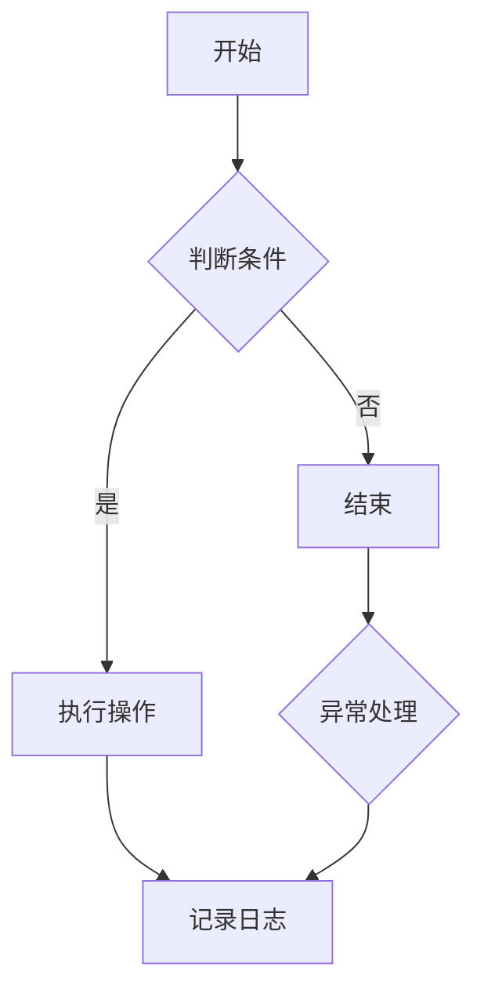
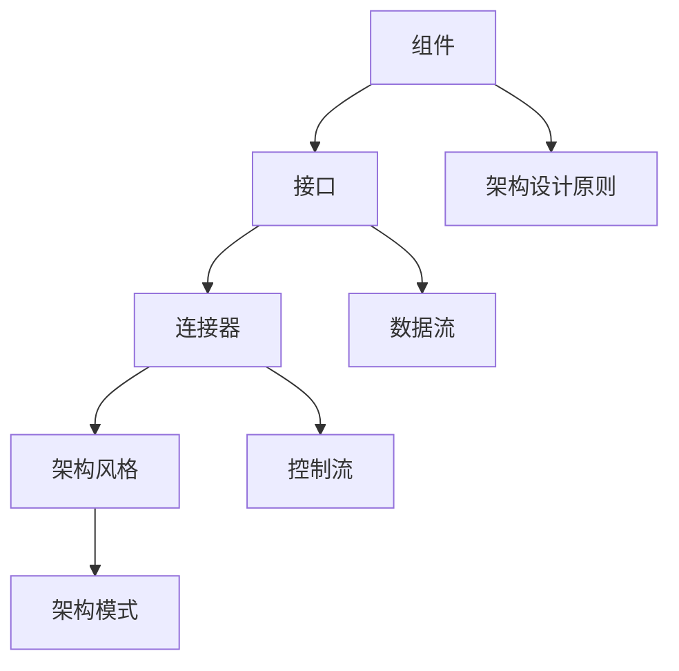

                 


### 文章标题

《软件架构文档化：有效传递设计意图》

### 文章关键词

- 软件架构
- 文档化
- 设计意图
- 架构文档
- 最佳实践

### 文章摘要

本文将深入探讨软件架构文档化的过程，以及如何通过有效的文档传递设计意图。我们将从背景介绍、核心概念、编写与表达、实战案例和架构文档的维护与更新等多个方面展开讨论。通过本文的阅读，读者将掌握软件架构文档化的关键技术和实践方法，为实际项目的成功打下坚实的基础。

### 目录大纲

**第一部分：软件架构文档化概述**

1.1 软件架构文档化的背景和重要性  
1.2 设计意图在软件架构文档中的作用  
1.3 架构文档的基本类型和特点

**第二部分：架构文档的核心概念与联系**

2.1 软件架构的基本概念  
2.2 架构风格与设计原则  
2.3 Mermaid 流程图展示架构流程  
2.4 架构文档中的核心概念联系图

**第三部分：架构文档的编写与表达**

3.1 文档编写的最佳实践  
3.2 设计意图的表达方法  
3.3 使用伪代码阐述核心算法原理  
3.4 数学模型和公式的详细讲解与举例

**第四部分：架构文档化实战案例**

4.1 实战案例一：项目背景与目标  
4.2 实战案例二：架构设计与实现  
4.3 实战案例三：架构文档编写与优化  
4.4 实战案例总结与反思

**第五部分：架构文档的维护与更新**

5.1 架构文档的维护策略  
5.2 设计意图的持续传递  
5.3 架构文档的迭代与优化  
5.4 架构文档的版本控制

**附录：常用工具与技术**

6.1 架构文档工具介绍  
6.2 自动化文档生成工具  
6.3 常用架构模板与示例

### 正文部分

**第一部分：软件架构文档化概述**

#### 1.1 软件架构文档化的背景和重要性

软件架构文档化是软件开发过程中的重要环节，它不仅有助于团队间的沟通与协作，还能为后续的维护与优化提供有力支持。在快速迭代的软件开发过程中，架构文档化的作用愈发显著。一方面，它确保了团队成员对系统架构的统一理解；另一方面，它为项目管理人员提供了清晰的决策依据。

架构文档化的重要性体现在以下几个方面：

1. **促进团队协作**：架构文档化有助于团队成员对系统架构的全面了解，降低了沟通成本，提高了协作效率。

2. **支持项目管理和决策**：清晰的架构文档为项目管理提供了有力支持，有助于识别项目风险、制定合理的项目计划和资源分配策略。

3. **促进系统维护**：架构文档化有助于后续的系统维护与优化，为开发人员提供了宝贵的参考信息。

4. **确保设计意图的传递**：架构文档不仅是系统架构的体现，更是设计意图的传递工具。通过文档化，设计者能够将设计思路和决策逻辑清晰地传达给相关人员。

#### 1.2 设计意图在软件架构文档中的作用

设计意图是软件架构文档的核心内容，它反映了系统设计的初衷和目标。在软件架构文档中，设计意图的作用主要体现在以下几个方面：

1. **指导架构设计**：设计意图为架构设计提供了明确的方向和目标，有助于架构师在设计和决策过程中保持一致性。

2. **评估架构质量**：设计意图有助于评估架构的质量和合理性，为后续的优化提供依据。

3. **支持技术决策**：设计意图在技术选型、性能优化等方面具有重要的指导作用，有助于团队做出科学、合理的决策。

4. **传递设计思路**：设计意图是设计思路的体现，通过文档化，设计者能够将设计思路和决策逻辑清晰地传达给相关人员。

#### 1.3 架构文档的基本类型和特点

架构文档通常分为以下几类：

1. **概述文档**：包括项目背景、目标、架构概述等，为读者提供对系统的全局认识。

2. **详细设计文档**：包括模块划分、接口定义、数据结构等，详细描述系统的设计细节。

3. **开发指南**：为开发人员提供开发过程中的参考和指导，包括编码规范、设计模式等。

4. **测试文档**：包括测试计划、测试用例、测试报告等，用于验证系统的功能和性能。

5. **部署文档**：包括系统部署、配置、运维等，用于确保系统的稳定运行。

不同类型的架构文档具有各自的特点：

1. **概述文档**：简洁明了，重点突出，为读者提供对系统的快速了解。

2. **详细设计文档**：详细全面，涉及系统的各个层面，为开发人员提供全面的参考。

3. **开发指南**：针对开发过程中的具体问题，提供详细的指导和建议。

4. **测试文档**：关注系统的功能和性能，为测试人员提供全面的测试依据。

5. **部署文档**：关注系统的部署和运维，确保系统的稳定运行。

**第二部分：架构文档的核心概念与联系**

#### 2.1 软件架构的基本概念

软件架构是指系统的整体结构和组织形式，它决定了系统的性能、可维护性、可扩展性等关键特性。软件架构的基本概念包括：

1. **组件**：系统中的功能模块，具有明确的输入、输出和处理逻辑。

2. **接口**：组件之间的交互接口，定义了组件之间的通信方式和数据格式。

3. **连接器**：组件之间的连接关系，包括数据流、控制流等。

4. **架构风格**：系统架构的基本组织方式，如分层架构、事件驱动架构等。

5. **架构模式**：解决特定问题的一组架构设计原则和方法。

#### 2.2 架构风格与设计原则

架构风格是指系统架构的基本组织方式，它对系统的性能、可维护性、可扩展性等关键特性具有重要影响。常见的架构风格包括：

1. **分层架构**：将系统分为多个层次，每个层次负责不同的功能，各层次之间通过接口进行通信。

2. **事件驱动架构**：通过事件驱动系统的各个组件，实现组件之间的松耦合。

3. **面向服务架构**：将系统划分为多个服务，每个服务提供特定的功能，服务之间通过接口进行通信。

架构设计原则是指导架构设计的基本原则，包括：

1. **模块化**：将系统划分为多个模块，每个模块具有独立的功能和接口。

2. **解耦**：降低组件之间的依赖关系，提高系统的可维护性和可扩展性。

3. **可复用性**：设计可复用的组件和接口，降低开发成本。

4. **性能优化**：关注系统的性能，如响应时间、吞吐量等。

5. **安全性**：确保系统的安全，如数据保护、身份验证等。

#### 2.3 Mermaid 流程图展示架构流程

Mermaid 是一种简单易用的图表绘制工具，可以用于绘制架构流程图。以下是一个简单的 Mermaid 流程图示例：



#### 2.4 架构文档中的核心概念联系图

为了更好地理解架构文档中的核心概念，我们可以使用 Mermaid 绘制核心概念联系图。以下是一个示例：



**第三部分：架构文档的编写与表达**

#### 3.1 文档编写的最佳实践

编写高质量的架构文档需要遵循以下最佳实践：

1. **清晰的结构**：确保文档结构清晰，层次分明，便于读者阅读。

2. **简洁的语言**：使用简洁、易懂的语言描述，避免冗长、复杂的句子。

3. **准确的术语**：使用准确的术语和定义，确保读者能够正确理解文档内容。

4. **规范的格式**：遵循统一的格式规范，如字体、字号、行间距等。

5. **详细的注释**：对重要的模块、接口和连接器等进行详细的注释，便于后续维护。

6. **及时更新**：定期更新文档，确保文档内容与系统实际情况一致。

#### 3.2 设计意图的表达方法

设计意图的表达是架构文档的核心内容，以下几种方法可以帮助我们更好地表达设计意图：

1. **概述**：简要描述设计意图，明确设计目标和原则。

2. **用例**：通过用例描述系统的功能和用户需求，展示设计意图。

3. **流程图**：使用 Mermaid 等工具绘制架构流程图，直观地展示设计意图。

4. **伪代码**：使用伪代码描述核心算法原理，便于读者理解。

5. **图表**：绘制核心概念联系图、模块关系图等，帮助读者全面理解设计意图。

#### 3.3 使用伪代码阐述核心算法原理

以下是一个简单的伪代码示例，用于描述一个排序算法的基本原理：

```python
function sort(array):
    n = length(array)
    for i from 0 to n-1:
        for j from 0 to n-i-1:
            if array[j] > array[j+1]:
                swap(array[j], array[j+1])
    return array
```

#### 3.4 数学模型和公式的详细讲解与举例

以下是一个简单的数学模型示例，用于描述一个线性回归模型：

$$
y = w_0 + w_1x_1 + w_2x_2 + \ldots + w_nx_n
$$

其中，$y$ 是预测值，$w_0, w_1, w_2, \ldots, w_n$ 是模型参数，$x_1, x_2, \ldots, x_n$ 是输入特征。

以下是一个具体的例子：

假设我们要预测房价，输入特征包括房屋面积、楼层、户型等。我们可以建立一个线性回归模型，使用以下公式：

$$
y = w_0 + w_1x_1 + w_2x_2 + w_3x_3
$$

其中，$w_0, w_1, w_2, w_3$ 是模型参数，$x_1, x_2, x_3$ 分别代表房屋面积、楼层和户型。

通过训练数据集，我们可以计算出模型参数，从而预测新的房屋价格。

**第四部分：架构文档化实战案例**

#### 4.1 实战案例一：项目背景与目标

本项目是一款在线购物平台，旨在为用户提供便捷的购物体验。项目目标包括：

1. 提供丰富的商品信息，涵盖各类商品。
2. 支持用户注册、登录、购物车、订单管理等基本功能。
3. 确保系统的性能、可维护性和可扩展性。

#### 4.2 实战案例二：架构设计与实现

在本项目中，我们采用分层架构，将系统划分为表示层、业务逻辑层和数据访问层。以下是一个简化的架构设计：

1. **表示层**：负责与用户交互，包括用户界面和前端逻辑。
2. **业务逻辑层**：处理业务逻辑，如用户注册、登录、购物车管理等。
3. **数据访问层**：负责与数据库进行交互，实现数据的增删改查操作。

#### 4.3 实战案例三：架构文档编写与优化

在编写架构文档时，我们遵循以下步骤：

1. **概述**：简要描述项目背景、目标和架构设计原则。
2. **详细设计**：详细描述各层的模块划分、接口定义和数据结构。
3. **用例**：通过用例描述系统的功能和用户需求。
4. **流程图**：绘制系统流程图，展示各层之间的交互关系。
5. **伪代码**：使用伪代码描述核心算法原理。
6. **图表**：绘制核心概念联系图、模块关系图等。

在编写过程中，我们不断优化文档，确保其简洁明了、易于理解。同时，我们注重文档的版本控制，确保文档与系统实际情况一致。

#### 4.4 实战案例总结与反思

通过本项目的实践，我们深刻体会到架构文档化的重要性。以下是我们的一些反思和总结：

1. **文档化的好处**：架构文档化有助于团队间的沟通与协作，提高了开发效率。同时，它为后续的系统维护和优化提供了有力支持。
2. **文档的质量**：高质量的架构文档不仅要求结构清晰、语言简洁，还需要准确反映系统实际情况。因此，编写文档时需要严谨对待，不断优化。
3. **持续更新**：架构文档需要定期更新，以适应系统的发展和变化。只有保持文档的实时性，才能真正发挥其作用。

**第五部分：架构文档的维护与更新**

#### 5.1 架构文档的维护策略

为了确保架构文档的准确性和时效性，我们需要制定合理的维护策略：

1. **定期审查**：定期对架构文档进行审查，确保其内容与系统实际情况一致。
2. **变更管理**：在系统变更时，及时更新架构文档，记录变更原因和影响。
3. **版本控制**：使用版本控制工具，如 Git，管理架构文档的版本，确保文档的可追溯性。
4. **文档评审**：邀请相关团队成员参与文档评审，确保文档的质量和准确性。

#### 5.2 设计意图的持续传递

设计意图的持续传递是架构文档的重要目标。为了实现这一目标，我们需要采取以下措施：

1. **培训**：定期组织培训，让团队成员了解系统架构和设计意图。
2. **文档解读**：为架构文档编写详细的解读文档，帮助团队成员更好地理解设计意图。
3. **沟通交流**：鼓励团队成员在开发过程中沟通交流，确保设计意图的准确传递。

#### 5.3 架构文档的迭代与优化

架构文档不是一成不变的，它需要随着项目的进展和系统的变化进行迭代和优化。以下是一些具体的优化措施：

1. **重构**：在系统重构时，重新审视架构文档，确保其内容与重构方案一致。
2. **技术升级**：随着技术的进步，及时更新架构文档，引入新的技术和方法。
3. **用户反馈**：收集用户反馈，了解系统在实际使用中的问题，为架构文档的优化提供依据。
4. **持续改进**：鼓励团队成员持续改进架构文档，提高文档的质量和实用性。

#### 5.4 架构文档的版本控制

版本控制是架构文档维护的重要环节。以下是一些版本控制的实践建议：

1. **Git**：使用 Git 等版本控制工具，管理架构文档的版本历史。
2. **分支策略**：采用分支策略，确保架构文档在开发和维护过程中的稳定性和安全性。
3. **合并与冲突解决**：在合并不同分支的修改时，注意解决潜在的冲突，确保文档的一致性。
4. **文档说明**：在每次提交时，附上详细的修改说明，便于追溯和理解文档变化。

**附录：常用工具与技术**

#### 6.1 架构文档工具介绍

以下是一些常用的架构文档工具：

1. **Mermaid**：用于绘制流程图、时序图等。
2. **Doxia**：用于生成文档。
3. **Markdown**：用于编写和格式化文档。

#### 6.2 自动化文档生成工具

以下是一些自动化文档生成工具：

1. **Doxygen**：用于生成 API 文档。
2. **Swagger**：用于生成 RESTful API 文档。
3. **Gulp**：用于自动化文档构建。

#### 6.3 常用架构模板与示例

以下是一些常用的架构模板和示例：

1. **微服务架构**：适用于分布式系统。
2. **容器化架构**：适用于容器化部署。
3. **区块链架构**：适用于区块链应用。

### 作者信息

作者：AI天才研究院/AI Genius Institute & 禅与计算机程序设计艺术 /Zen And The Art of Computer Programming

### 总结与拓展

本文从软件架构文档化的背景和重要性、架构文档的核心概念与联系、编写与表达、实战案例、维护与更新等方面，系统地介绍了软件架构文档化的方法和实践。通过本文的阅读，读者将掌握软件架构文档化的关键技术和实践方法，为实际项目的成功打下坚实的基础。

未来，随着软件架构的不断发展和变化，架构文档化将面临新的挑战和机遇。我们期待更多的研究人员和开发人员关注架构文档化领域，共同推动软件架构文档化的进步，为软件产业的繁荣做出贡献。

### 最佳实践 tips

1. **文档结构**：确保文档结构清晰，层次分明，便于读者阅读。

2. **术语统一**：使用统一的术语和定义，确保文档的一致性。

3. **图表使用**：合理使用图表，帮助读者更好地理解文档内容。

4. **版本控制**：使用版本控制工具，确保文档的版本一致性和可追溯性。

5. **文档评审**：邀请团队成员参与文档评审，确保文档的质量和准确性。

### 注意事项

1. **文档更新**：定期更新文档，确保其与系统实际情况一致。

2. **沟通协作**：鼓励团队成员在开发过程中沟通交流，确保设计意图的准确传递。

3. **文档解读**：编写详细的解读文档，帮助团队成员更好地理解文档内容。

4. **文档保存**：使用安全的存储方式，确保文档的安全性和可访问性。

### 拓展阅读

1. 《软件架构设计：实践者手册》  
2. 《软件架构：定义与设计》  
3. 《架构师修炼之道》

以上是本文的完整内容。希望本文能够对读者在软件架构文档化方面有所启发和帮助。如果您有任何疑问或建议，欢迎在评论区留言，我们将持续为您解答和更新相关内容。作者：AI天才研究院/AI Genius Institute & 禅与计算机程序设计艺术 /Zen And The Art of Computer Programming

