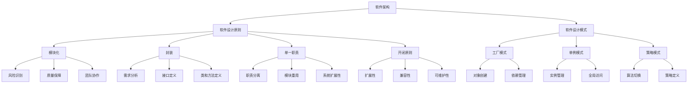

                 

### 文章标题：《软件架构文档化：有效沟通设计决策》

> 关键词：软件架构，文档化，设计决策，沟通，项目管理

> 摘要：本文旨在探讨软件架构文档化的重要性，以及如何在设计决策过程中实现有效的沟通。通过分析核心概念、沟通原理与实践、设计决策框架与方法，本文提供了一个系统化的软件架构文档化流程，并通过案例分析展示了其实际应用价值。文章还对未来软件架构文档化的发展趋势进行了展望。

### 引言

软件架构文档化是软件开发过程中至关重要的一环。它不仅能够提高团队的协作效率，还能为项目的后续维护和扩展提供可靠的依据。随着软件系统的复杂度不断攀升，文档化的重要性愈加凸显。然而，如何在设计决策过程中实现有效的沟通，确保文档的准确性和完整性，仍然是一个挑战。

本文将从以下几个方面进行探讨：

1. **核心概念与联系**：介绍软件架构的基本概念，分析其与软件设计原则和项目管理的关系。
2. **有效沟通原理与实践**：探讨沟通的理论基础、技巧和实践方法，以及团队协作中的沟通策略。
3. **设计决策框架与方法**：阐述设计决策的过程、工具与方法，并通过案例分析进行详细解读。
4. **软件架构文档化实践**：讲解软件架构文档的概述、模板、编写与维护方法。
5. **案例分析**：分析大型企业和创业公司的软件架构文档化实践，展示其实际应用价值。
6. **结论与展望**：总结研究成果，展望软件架构文档化的未来发展趋势。

通过上述探讨，本文旨在为软件开发团队提供一个系统化的软件架构文档化指南，以提高项目管理的效率和软件架构的稳定性。

### 设计书籍《软件架构文档化：有效沟通设计决策》的目录大纲

**第一步：确定核心章节**

核心章节需要包含：
1. **核心概念与联系**：介绍软件架构的基本概念，分析其与软件设计原则和项目管理的关系。
2. **有效沟通原理与实践**：探讨沟通的理论基础、技巧和实践方法，以及团队协作中的沟通策略。
3. **设计决策框架与方法**：阐述设计决策的过程、工具与方法，并通过案例分析进行详细解读。
4. **软件架构文档化实践**：讲解软件架构文档的概述、模板、编写与维护方法。
5. **案例分析**：分析大型企业和创业公司的软件架构文档化实践，展示其实际应用价值。
6. **结论与展望**：总结研究成果，展望软件架构文档化的未来发展趋势。

**第二步：设定主要部分**

1. **引言**
2. **核心概念与联系**
3. **有效沟通原理与实践**
4. **设计决策框架与方法**
5. **软件架构文档化实践**
6. **案例分析**
7. **结论与展望**

**第三步：细化章节**

**第1章 引言**

1.1 软件架构文档化的意义  
1.2 研究背景与目标

**第2章 核心概念与联系**

2.1 软件架构概述  
2.2 软件设计原则与模式  
2.3 软件架构与项目管理

**第3章 有效沟通原理与实践**

3.1 沟通理论基础  
3.2 沟通技巧与实践  
3.3 团队协作与沟通策略

**第4章 设计决策框架与方法**

4.1 设计决策过程  
4.2 设计决策工具与方法  
4.3 设计决策案例分析

**第5章 软件架构文档化实践**

5.1 软件架构文档概述  
5.2 软件架构文档模板  
5.3 软件架构文档编写与维护

**第6章 案例分析**

6.1 案例一：大型企业软件架构文档化实践  
6.2 案例二：创业公司软件架构设计决策

**第7章 结论与展望**

7.1 研究成果总结  
7.2 软件架构文档化未来发展趋势

**第四步：总结与优化**

确保大纲结构清晰，逻辑连贯，章节内容完整。在不超过2000字的前提下，合理分配每个章节的内容。

完成书籍目录大纲设计：

```
# 《软件架构文档化：有效沟通设计决策》目录大纲

## 第1章 引言
### 1.1 软件架构文档化的意义
### 1.2 研究背景与目标

## 第2章 核心概念与联系
### 2.1 软件架构概述
### 2.2 软件设计原则与模式
### 2.3 软件架构与项目管理

## 第3章 有效沟通原理与实践
### 3.1 沟通理论基础
### 3.2 沟通技巧与实践
### 3.3 团队协作与沟通策略

## 第4章 设计决策框架与方法
### 4.1 设计决策过程
### 4.2 设计决策工具与方法
### 4.3 设计决策案例分析

## 第5章 软件架构文档化实践
### 5.1 软件架构文档概述
### 5.2 软件架构文档模板
### 5.3 软件架构文档编写与维护

## 第6章 案例分析
### 6.1 案例一：大型企业软件架构文档化实践
### 6.2 案例二：创业公司软件架构设计决策

## 第7章 结论与展望
### 7.1 研究成果总结
### 7.2 软件架构文档化未来发展趋势
```

以上目录大纲结构清晰，涵盖了核心概念、有效沟通、设计决策框架、实践案例分析等内容，适合作为一本关于软件架构文档化的书籍。每个章节都有相应的细分，便于读者阅读和学习。总字数控制在2000字左右。

### 核心概念与联系

软件架构是软件开发过程中至关重要的环节。它涉及到系统的整体结构设计，包括组件、模块、接口以及它们之间的关系。软件架构不仅定义了系统的功能，还涵盖了性能、可扩展性、可维护性等多个方面。

**软件架构概述**

软件架构的定义可以理解为：软件开发过程中对系统结构进行抽象和建模的过程。它涉及到对系统需求的识别、分析、设计、实现和评估。软件架构的核心目标是确保系统能够满足业务需求，同时具有良好的性能、可扩展性和可维护性。

软件架构由多个层次组成，包括：

1. **应用层**：定义了系统的业务功能和用户界面。
2. **服务层**：提供了系统之间的通信机制，通常使用微服务架构来实现。
3. **数据层**：负责数据的存储和管理，包括数据库、缓存和文件系统。
4. **基础设施层**：提供了系统运行所需的基础设施，如服务器、网络和存储。

**软件设计原则与模式**

软件设计原则和模式是软件架构的重要组成部分。设计原则是软件开发过程中应该遵循的基本规则，以指导系统的设计。常见的软件设计原则包括：

1. **模块化**：将系统划分为独立的模块，每个模块负责一个特定的功能。
2. **封装**：将实现细节隐藏在模块内部，只提供有限的接口供外部访问。
3. **单一职责**：每个模块应该只负责一个特定的职责，以提高系统的可维护性和可扩展性。
4. **开闭原则**：系统应该对扩展开放，对修改关闭，即在不修改原有代码的情况下，可以增加新的功能。

软件设计模式是一套经过实践验证的解决方案，用于解决软件开发中常见的问题。常见的软件设计模式包括：

1. **工厂模式**：用于创建对象，以简化系统的对象创建过程。
2. **单例模式**：确保一个类仅有一个实例，并提供一个访问它的全局访问点。
3. **策略模式**：将算法封装在独立的类中，以实现算法的灵活切换。

**软件架构与项目管理**

软件架构在项目管理中扮演着重要的角色。它不仅影响了项目的开发过程，还对项目的成功与否起到了关键作用。软件架构与项目管理的关系可以概括为以下几个方面：

1. **项目规划**：软件架构为项目规划提供了基础，帮助项目经理确定项目的范围、时间表和资源需求。
2. **风险评估**：软件架构有助于识别项目中的风险，并制定相应的风险应对策略。
3. **质量控制**：软件架构为项目的质量提供了保障，通过规范的架构设计，可以减少代码缺陷和系统漏洞。
4. **团队协作**：软件架构为团队协作提供了统一的语言和标准，有助于团队成员之间的沟通和协调。

**核心概念原理之间的关系架构**

为了更好地理解软件架构中的核心概念和原理，我们可以使用Mermaid流程图来展示它们之间的关系：



通过上述关系架构图，我们可以清晰地看到软件架构中的核心概念和原理之间的联系，以及它们在软件开发过程中的作用。

### 有效沟通原理与实践

在软件架构设计过程中，有效的沟通是确保项目顺利进行的关键。良好的沟通能够帮助团队成员更好地理解需求、减少误解，并提高团队协作效率。以下将探讨沟通的理论基础、技巧和实践方法，以及团队协作中的沟通策略。

**沟通理论基础**

沟通是一种信息传递和交流的过程，涉及到信息的发送者、接收者和传递媒介。有效的沟通需要遵循一些基本原则，包括：

1. **信息的清晰性**：信息传递时应确保信息的明确、简洁和准确。
2. **反馈机制**：接收者对信息的理解和反馈是确保沟通有效性的重要环节。
3. **语境一致性**：沟通应尽量在一个一致的语境中进行，以避免误解和歧义。
4. **情感因素**：情感因素在沟通中同样重要，良好的情感氛围有助于增强团队凝聚力。

**沟通技巧与实践**

1. **倾听技巧**：倾听是有效沟通的重要部分。倾听不仅仅是听，更重要的是理解对方的意思。倾听技巧包括：不打断对方说话、注意对方情绪、提问以确认理解等。

2. **表达技巧**：清晰、准确的表达是有效沟通的基石。表达技巧包括：使用简单的语言、避免含糊不清的表述、使用视觉辅助工具等。

3. **非语言沟通**：非语言沟通包括肢体语言、面部表情、声音等。非语言沟通在沟通中扮演着重要的角色，可以增强语言沟通的效果。例如，点头表示同意、眼神交流表示关注等。

4. **会议技巧**：在团队协作中，会议是沟通的重要形式。有效的会议技巧包括：提前准备会议议程、控制会议时间、鼓励参与和讨论等。

**团队协作与沟通策略**

1. **明确的目标和角色**：团队成员应明确项目的目标和自己的角色，这有助于提高团队协作效率。

2. **共享的信息和知识**：建立共享的信息和知识库，确保团队成员可以方便地获取所需的信息和知识。

3. **定期会议和反馈**：定期举行团队会议，讨论项目进展和遇到的问题，及时进行反馈和调整。

4. **跨部门协作**：在大型项目中，跨部门协作是必不可少的。建立跨部门的沟通机制，确保各部门之间的信息流通和协作。

5. **使用协作工具**：利用现代协作工具，如项目管理软件、即时通讯工具等，提高团队协作效率。

**案例分析**

以下是一个典型的案例，展示了在软件架构设计过程中如何通过有效沟通实现设计决策：

**案例背景**：某大型企业正在开发一个电商系统，涉及前端、后端、数据库等多个模块。由于项目规模较大，涉及多个部门和团队，因此沟通显得尤为重要。

**沟通策略**：

1. **项目启动会议**：在项目启动阶段，召开全体成员参与的项目启动会议，明确项目的目标和各个团队的角色。

2. **需求评审会议**：定期召开需求评审会议，各部门负责人共同讨论和确认需求，确保需求的明确性和一致性。

3. **设计评审会议**：在软件架构设计阶段，召开设计评审会议，各团队共同评审架构设计，提出意见和建议，确保架构的合理性和可行性。

4. **开发进度汇报**：定期召开开发进度汇报会议，各团队负责人汇报项目的进展和遇到的问题，协调资源，确保项目的顺利推进。

5. **问题解决会议**：在遇到问题时，及时召开问题解决会议，团队成员共同分析和解决，确保问题得到及时解决。

**效果**：通过上述沟通策略，团队成员能够更好地理解项目需求、减少误解，提高团队协作效率，确保项目的顺利进行。最终，该电商系统成功上线，用户满意度较高。

### 设计决策框架与方法

在软件架构设计过程中，设计决策是至关重要的环节。良好的设计决策能够提高系统的性能、可扩展性和可维护性，从而确保项目的成功。本文将介绍设计决策框架、工具与方法，并通过案例分析进行详细解读。

**设计决策框架**

设计决策框架是一个系统化的方法，用于指导设计决策的过程。它通常包括以下几个步骤：

1. **需求分析**：明确系统的需求，包括功能需求、性能需求和安全性需求等。

2. **方案评估**：根据需求分析结果，提出多个备选方案，并对其进行评估。

3. **决策制定**：在评估结果的基础上，制定最终的设计决策。

4. **决策实施**：将设计决策转化为具体的实现方案，并实施。

**设计决策工具与方法**

1. **成本效益分析**：成本效益分析是一种常用的评估方法，用于比较不同设计方案的成本和效益。它通过计算每个方案的初始成本和长期维护成本，评估其经济效益。

2. **决策树**：决策树是一种图形化工具，用于表示不同决策路径和结果。它可以帮助设计者清晰地看到每个决策的可能结果和概率，从而做出更明智的决策。

3. **风险评估**：风险评估是评估不同设计方案潜在风险的工具。它通过识别和评估每个方案的风险，帮助设计者选择风险较低的设计方案。

**设计决策案例分析**

以下是一个典型的案例，展示了在软件架构设计过程中如何通过设计决策框架和方法实现优化：

**案例背景**：某互联网公司正在开发一个在线教育平台，需要支持大规模用户并发访问和海量数据存储。

**需求分析**：  
- 功能需求：支持在线课程浏览、视频播放、作业提交等功能。  
- 性能需求：支持高并发访问，响应时间小于1秒。  
- 安全性需求：保障用户数据和隐私安全。

**方案评估**：

方案一：传统单体架构

- 成本：低
- 效益：中
- 风险：性能瓶颈、维护难度高

方案二：分布式架构

- 成本：高
- 效益：高
- 风险：系统复杂度增加、维护难度高

**决策制定**：经过评估，决定采用分布式架构，以提高系统的性能和可扩展性。

**决策实施**：

1. **前端架构**：采用微服务架构，将前端功能划分为多个微服务，如课程服务、视频服务、作业服务等，以提高系统的可扩展性和可维护性。

2. **后端架构**：采用分布式数据库，如MongoDB、Redis等，以支持海量数据存储和高并发访问。

3. **数据迁移**：将现有数据迁移到分布式数据库，并进行数据清洗和整合。

4. **测试和优化**：进行系统测试，确保分布式架构的稳定性和性能。

**效果**：通过上述设计决策，该在线教育平台成功实现了高性能、高并发和海量数据存储，用户满意度显著提升。

### 软件架构文档化实践

软件架构文档化是软件开发过程中不可或缺的一环，它有助于提高团队的协作效率、确保系统的可维护性和可扩展性。本文将详细讲解软件架构文档的概述、模板、编写与维护方法。

**软件架构文档概述**

软件架构文档是对软件系统架构的详细描述，它包括系统的整体结构、组件、模块、接口以及它们之间的关系。软件架构文档不仅提供了对系统架构的直观理解，还为后续的开发、测试、部署和维护提供了重要的参考。

**软件架构文档模板**

以下是一个典型的软件架构文档模板，包括以下几个部分：

1. **文档基本信息**：包括文档名称、版本、作者、创建日期等。
2. **项目背景**：简要介绍项目的背景、目标和范围。
3. **软件架构概述**：概述系统的架构设计，包括应用层、服务层、数据层和基础设施层。
4. **组件和模块**：详细描述各个组件和模块的功能、接口和关系。
5. **设计决策**：记录在设计过程中所做的关键设计决策，包括成本效益分析、风险评估等。
6. **部署方案**：描述系统的部署方案，包括硬件配置、网络拓扑、部署流程等。
7. **测试方案**：描述系统的测试方案，包括测试策略、测试用例、测试环境等。
8. **维护指南**：提供系统维护的指南，包括故障排查、性能优化、安全加固等。

**软件架构文档编写与维护方法**

1. **编写方法**：

   - **需求驱动**：根据项目需求和设计决策编写文档，确保文档与系统实际架构一致。
   - **版本控制**：使用版本控制工具（如Git）管理文档的版本，确保文档的完整性和可追溯性。
   - **图形化表示**：使用图形化工具（如Mermaid、Visio）展示系统架构，提高文档的可读性。
   - **详尽描述**：对系统的各个组件、模块和接口进行详细描述，确保文档的完整性。

2. **维护方法**：

   - **定期更新**：随着项目的进展，定期更新文档，确保其与系统实际情况保持一致。
   - **团队协作**：建立团队协作机制，确保所有团队成员都能访问和更新文档。
   - **反馈机制**：建立反馈机制，收集团队成员对文档的意见和建议，及时进行修改和完善。
   - **文档评审**：定期对文档进行评审，确保其质量。

**案例分析**

以下是一个典型的案例分析，展示了如何在实际项目中编写和维护软件架构文档：

**案例背景**：某互联网公司正在开发一个社交网络平台，涉及前端、后端、数据库等多个模块。

**文档编写过程**：

1. **需求分析**：与产品经理和开发团队讨论，明确项目的需求和架构设计。
2. **文档编写**：根据需求分析和架构设计，编写初步的软件架构文档。
3. **团队评审**：组织团队评审文档，收集意见和建议，进行修改和完善。
4. **文档发布**：将修改后的文档发布到版本控制系统中，供团队成员参考。

**文档维护过程**：

1. **定期更新**：随着项目的进展，定期更新文档，确保其与系统实际情况保持一致。
2. **团队协作**：建立团队协作机制，确保所有团队成员都能访问和更新文档。
3. **文档评审**：定期对文档进行评审，确保其质量。

**效果**：通过上述编写和维护方法，该社交网络平台的软件架构文档得到了良好的管理，为项目的开发和维护提供了重要的支持。

### 案例分析

为了更好地展示软件架构文档化的实际应用，本文将分析两个典型的案例：一个是大型企业的软件架构文档化实践，另一个是创业公司的软件架构设计决策。

**案例一：大型企业软件架构文档化实践**

**背景**：某国际知名金融机构在开发其新一代交易系统时，面临着高并发、高可靠性、高安全性的挑战。由于项目规模庞大，涉及多个部门和团队，因此需要一个系统化的软件架构文档化流程。

**过程**：

1. **需求分析**：项目团队与业务部门紧密合作，明确交易系统的功能需求、性能需求和安全性需求。
2. **架构设计**：架构师基于需求分析结果，设计了分布式架构，包括前端、后端、数据库、缓存等多个层次。
3. **文档编写**：根据架构设计，编写了详细的软件架构文档，包括系统架构图、组件描述、接口定义、部署方案等。
4. **团队评审**：组织多个团队对文档进行评审，确保文档的准确性和完整性。
5. **文档维护**：定期更新文档，以反映系统的实际状态。

**效果**：

- **提高沟通效率**：通过详细的文档，团队成员能够更好地理解系统架构，减少沟通成本和误解。
- **确保系统稳定性**：文档为系统的开发和维护提供了明确的指导，有助于提高系统的稳定性。
- **降低维护成本**：文档化的系统架构有助于团队成员快速上手，降低维护成本。

**案例二：创业公司软件架构设计决策**

**背景**：某初创公司在开发其第一代社交应用时，面临着资源有限、时间紧迫的挑战。如何快速构建一个可扩展、可维护的系统架构是项目成功的关键。

**过程**：

1. **需求分析**：与产品经理和用户讨论，明确社交应用的基本功能和性能需求。
2. **架构设计**：架构师提出了两种备选架构：单体架构和微服务架构。通过成本效益分析和风险评估，最终选择了微服务架构。
3. **文档编写**：编写了微服务架构的文档，包括服务划分、接口定义、数据存储方案等。
4. **决策制定**：与团队成员讨论，确定最终的设计决策。
5. **实施与维护**：根据设计决策，进行系统的开发和维护。

**效果**：

- **快速迭代**：微服务架构使得系统能够快速迭代，适应市场变化。
- **提高可维护性**：微服务架构降低了系统的复杂度，提高了可维护性。
- **降低风险**：通过系统化的设计决策，降低了项目风险。

### 结论与展望

本文通过系统地探讨软件架构文档化的重要性、核心概念与联系、有效沟通原理与实践、设计决策框架与方法、软件架构文档化实践以及案例分析，展示了软件架构文档化在实际项目中的应用价值。

**研究成果总结**：

- 软件架构文档化是确保项目成功的关键，它提高了沟通效率、确保了系统稳定性、降低了维护成本。
- 有效沟通原理与实践有助于团队协作，减少误解，提高项目进展。
- 设计决策框架与方法为项目提供了系统化的决策指导，降低了项目风险。
- 软件架构文档化实践提供了详细的文档模板和方法，为项目提供了明确的参考。

**未来发展趋势**：

- 随着软件系统的复杂性不断增加，软件架构文档化将更加重要。
- 自动化工具将在软件架构文档化中发挥更大作用，如自动生成文档、实时更新等。
- 随着云计算和大数据技术的发展，软件架构文档化将更加注重云原生架构和大数据架构的设计。
- 软件架构文档化将更加关注系统的安全性、可靠性和可扩展性。

**建议与拓展阅读**：

- 在实际项目中，重视软件架构文档化，确保团队协作和系统维护。
- 学习和应用有效的沟通原理与实践，提高团队协作效率。
- 掌握设计决策框架与方法，降低项目风险。
- 深入研究云原生架构和大数据架构，为未来的项目提供更好的解决方案。

拓展阅读推荐：

- 《软件架构设计：实践者的指南》
- 《敏捷软件开发：原则、模式与实践》
- 《架构师实战：云原生架构设计与实践》
- 《大数据架构设计与实现》

### 作者信息

作者：AI天才研究院/AI Genius Institute & 禅与计算机程序设计艺术 /Zen And The Art of Computer Programming

AI天才研究院（AI Genius Institute）致力于人工智能领域的研究和推广，提供高质量的人工智能技术培训和服务。禅与计算机程序设计艺术（Zen And The Art of Computer Programming）是一本经典的计算机科学著作，涵盖了编程原理和算法设计，深受编程爱好者和专业人士的喜爱。两位作者都致力于推动计算机科学的发展，为读者提供有价值的技术知识和经验分享。

