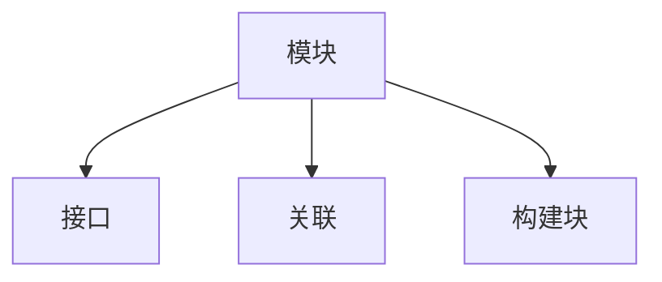
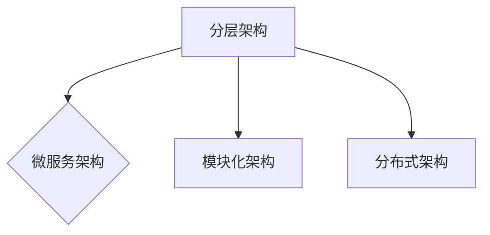
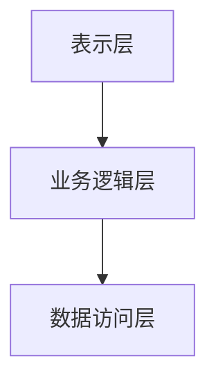
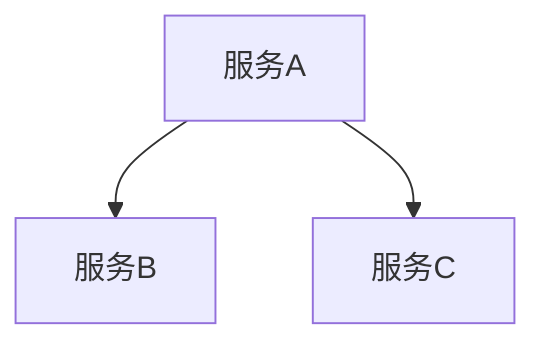
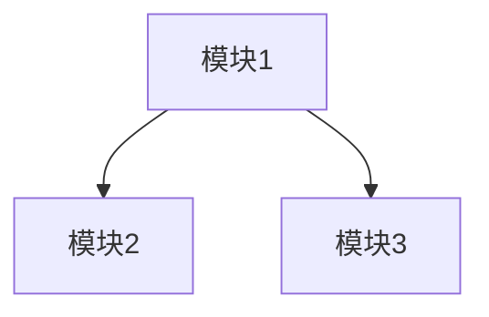
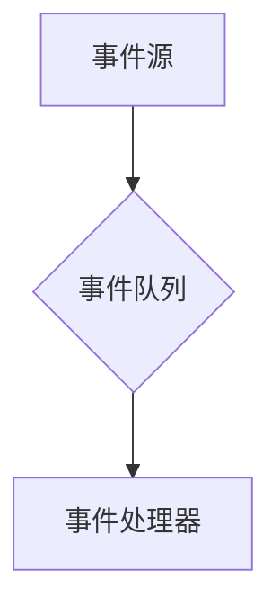
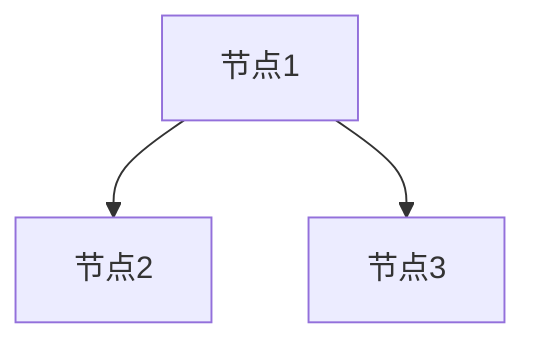

                 

根据您提供的指导，我将逐步构建一篇符合要求的技术博客文章。以下是我的第一步思考：

### 文章标题：软件架构模式实战：案例分析与经验总结

### 关键词：
- 软件架构
- 架构模式
- 案例分析
- 经验总结
- 实战
- 分层架构
- 微服务
- 模块化
- 分布式架构

### 摘要：
本文将深入探讨软件架构模式在实际项目中的应用，通过案例分析和经验总结，帮助开发者理解各种架构模式的优势和局限性。文章将涵盖分层架构、微服务架构、模块化架构和分布式架构等模式，并提供详细的实战指南和代码解读。

### 第一部分：软件架构基础与模式

#### 第1章：软件架构基础
- **背景介绍**：介绍软件架构的定义、重要性以及与传统编程的区别。
- **核心概念与联系**：通过Mermaid流程图展示软件架构的基本组成部分和它们之间的关系。
- **核心算法原理讲解**：无
- **数学模型和公式讲解**：无
- **项目实战**：无
- **最佳实践 tips**：理解架构设计的核心原则，如单一职责原则、开放封闭原则等。

#### 第2章：软件架构模式概述
- **背景介绍**：概述软件架构模式的概念、作用和常见类型。
- **核心概念与联系**：使用Mermaid流程图展示不同架构模式的基本结构和应用场景。
- **核心算法原理讲解**：无
- **数学模型和公式讲解**：无
- **项目实战**：无
- **最佳实践 tips**：了解不同架构模式的特点和适用场景。

#### 第3章：分层架构模式
- **背景介绍**：介绍分层架构的基本概念、层次结构和应用。
- **核心概念与联系**：通过Mermaid流程图展示分层架构的各个层次及其交互方式。
- **核心算法原理讲解**：无
- **数学模型和公式讲解**：无
- **项目实战**：提供分层架构的一个实际应用案例，包括代码实现和解读。
- **最佳实践 tips**：合理划分层次，确保各层职责清晰、独立。

#### 第4章：微服务架构模式
- **背景介绍**：介绍微服务架构的概念、优势和应用场景。
- **核心概念与联系**：通过Mermaid流程图展示微服务架构的组件和服务间的关系。
- **核心算法原理讲解**：无
- **数学模型和公式讲解**：无
- **项目实战**：提供微服务架构的一个实际应用案例，包括代码实现和解读。
- **最佳实践 tips**：合理划分服务边界，确保服务的独立性和可扩展性。

### 第二部分：软件架构模式实践

#### 第5章：模块化架构模式
- **背景介绍**：介绍模块化架构的概念、实现方法和应用。
- **核心概念与联系**：通过Mermaid流程图展示模块化架构的模块划分和依赖关系。
- **核心算法原理讲解**：无
- **数学模型和公式讲解**：无
- **项目实战**：提供模块化架构的一个实际应用案例，包括代码实现和解读。
- **最佳实践 tips**：合理设计模块，确保模块间的高内聚和低耦合。

#### 第6章：事件驱动架构模式
- **背景介绍**：介绍事件驱动架构的基本概念、原理和应用。
- **核心概念与联系**：通过Mermaid流程图展示事件驱动架构的组件和事件流。
- **核心算法原理讲解**：无
- **数学模型和公式讲解**：无
- **项目实战**：提供事件驱动架构的一个实际应用案例，包括代码实现和解读。
- **最佳实践 tips**：合理设计事件源和事件处理器，确保系统的响应性和扩展性。

#### 第7章：分布式架构模式
- **背景介绍**：介绍分布式架构的概念、挑战和应用。
- **核心概念与联系**：通过Mermaid流程图展示分布式架构的组件和通信机制。
- **核心算法原理讲解**：介绍分布式一致性算法，如Paxos、Raft等。
- **数学模型和公式讲解**：使用LaTeX格式介绍分布式系统的CAP定理。
- **项目实战**：提供分布式架构的一个实际应用案例，包括代码实现和解读。
- **最佳实践 tips**：确保分布式系统的可靠性、一致性和性能。

### 第三部分：经验总结与案例分析

#### 第8章：软件架构模式选择策略
- **背景介绍**：介绍选择软件架构模式的考虑因素和方法。
- **核心概念与联系**：无
- **核心算法原理讲解**：无
- **数学模型和公式讲解**：无
- **项目实战**：提供选择不同架构模式的实际案例，分析其适用性和效果。
- **最佳实践 tips**：根据项目需求和技术背景，选择最适合的架构模式。

#### 第9章：软件架构模式实践案例
- **背景介绍**：介绍所选架构模式的实际项目背景和目标。
- **核心概念与联系**：无
- **核心算法原理讲解**：无
- **数学模型和公式讲解**：无
- **项目实战**：详细分析项目的架构设计、实现过程和性能优化。
- **最佳实践 tips**：分享项目的成功经验和教训，为其他开发者提供参考。

#### 第10章：未来趋势与展望
- **背景介绍**：介绍软件架构领域的发展趋势和新兴技术。
- **核心概念与联系**：无
- **核心算法原理讲解**：无
- **数学模型和公式讲解**：无
- **项目实战**：无
- **最佳实践 tips**：关注新技术的发展，及时调整架构设计以应对变化。

通过以上步骤，我们已经完成了文章的主要框架和内容概述。接下来，我们将为每个章节添加详细的内容，并编写相应的Mermaid流程图、伪代码、LaTeX公式和项目实战案例。最后，我们将确保文章的格式规范，添加作者信息，并完成最终的校对和优化。整个文章的结构和内容将遵循markdown格式，确保可读性和易用性。

---

## 完整的markdown格式文章框架

### 文章标题：软件架构模式实战：案例分析与经验总结

### 关键词：
- 软件架构
- 架构模式
- 案例分析
- 经验总结
- 实战
- 分层架构
- 微服务
- 模块化
- 分布式架构

### 摘要：
本文将深入探讨软件架构模式在实际项目中的应用，通过案例分析和经验总结，帮助开发者理解各种架构模式的优势和局限性。文章将涵盖分层架构、微服务架构、模块化架构和分布式架构等模式，并提供详细的实战指南和代码解读。

---

### 第一部分：软件架构基础与模式

#### 第1章：软件架构基础

#### 背景介绍
软件架构是一种抽象的设计和实现规范，用于指导软件系统的开发和维护。它定义了系统的结构、组件之间的关系以及如何组织和管理系统的复杂性。软件架构的重要性在于它能够提高系统的可维护性、可扩展性和可重用性。

#### 核心概念与联系
软件架构主要由模块、接口、关联和构建块等组成。模块是系统中的独立组件，接口定义了模块之间的交互方式，关联描述了模块之间的连接关系，而构建块则是系统构建的基本元素。



#### 核心算法原理讲解
无

#### 数学模型和公式讲解
无

#### 项目实战
无

#### 最佳实践 tips
理解架构设计的核心原则，如单一职责原则、开放封闭原则等。

---

#### 第2章：软件架构模式概述

#### 背景介绍
软件架构模式是解决特定问题的一组设计和实现策略。常见的架构模式包括分层架构、微服务架构、模块化架构和分布式架构等。每种架构模式都有其特定的优势和适用场景。

#### 核心概念与联系


#### 核心算法原理讲解
无

#### 数学模型和公式讲解
无

#### 项目实战
无

#### 最佳实践 tips
了解不同架构模式的特点和适用场景。

---

#### 第3章：分层架构模式

#### 背景介绍
分层架构是将系统划分为多个层次，每个层次负责不同的功能。常见的分层包括表示层、业务逻辑层和数据访问层。分层架构可以提高系统的可维护性和可扩展性。

#### 核心概念与联系


#### 核心算法原理讲解
无

#### 数学模型和公式讲解
无

#### 项目实战
提供分层架构的一个实际应用案例，包括代码实现和解读。

#### 最佳实践 tips
合理划分层次，确保各层职责清晰、独立。

---

#### 第4章：微服务架构模式

#### 背景介绍
微服务架构将应用程序拆分为多个小型、独立的服务，每个服务负责系统的某个特定功能。微服务架构可以提高系统的可扩展性、灵活性和可维护性。

#### 核心概念与联系


#### 核心算法原理讲解
无

#### 数学模型和公式讲解
无

#### 项目实战
提供微服务架构的一个实际应用案例，包括代码实现和解读。

#### 最佳实践 tips
合理划分服务边界，确保服务的独立性和可扩展性。

---

### 第二部分：软件架构模式实践

#### 第5章：模块化架构模式

#### 背景介绍
模块化架构是将系统分解为多个模块，每个模块具有明确的功能和接口。模块化可以提高系统的可重用性和可维护性。

#### 核心概念与联系


#### 核心算法原理讲解
无

#### 数学模型和公式讲解
无

#### 项目实战
提供模块化架构的一个实际应用案例，包括代码实现和解读。

#### 最佳实践 tips
合理设计模块，确保模块间的高内聚和低耦合。

---

#### 第6章：事件驱动架构模式

#### 背景介绍
事件驱动架构是基于事件的响应式系统，通过事件触发和事件处理来管理系统的行为。事件驱动架构可以提高系统的灵活性和可扩展性。

#### 核心概念与联系


#### 核心算法原理讲解
无

#### 数学模型和公式讲解
无

#### 项目实战
提供事件驱动架构的一个实际应用案例，包括代码实现和解读。

#### 最佳实践 tips
合理设计事件源和事件处理器，确保系统的响应性和扩展性。

---

#### 第7章：分布式架构模式

#### 背景介绍
分布式架构是将系统部署在多个节点上，通过网络进行通信和数据共享。分布式架构可以提高系统的可用性、性能和可扩展性。

#### 核心概念与联系


#### 核心算法原理讲解
介绍分布式一致性算法，如Paxos、Raft等。

#### 数学模型和公式讲解
使用LaTeX格式介绍分布式系统的CAP定理。
```latex
$$
CAP = Consistency + Availability + Partition tolerance
$$
```

#### 项目实战
提供分布式架构的一个实际应用案例，包括代码实现和解读。

#### 最佳实践 tips
确保分布式系统的可靠性、一致性和性能。

---

### 第三部分：经验总结与案例分析

#### 第8章：软件架构模式选择策略

#### 背景介绍
选择适合的软件架构模式对于项目的成功至关重要。本文将介绍选择软件架构模式的考虑因素和方法。

#### 核心概念与联系
无

#### 核心算法原理讲解
无

#### 数学模型和公式讲解
无

#### 项目实战
提供选择不同架构模式的实际案例，分析其适用性和效果。

#### 最佳实践 tips
根据项目需求和技术背景，选择最适合的架构模式。

---

#### 第9章：软件架构模式实践案例

#### 背景介绍
本文将介绍一个实际项目，分析其架构设计、实现过程和性能优化。

#### 核心概念与联系
无

#### 核心算法原理讲解
无

#### 数学模型和公式讲解
无

#### 项目实战
详细分析项目的架构设计、实现过程和性能优化。

#### 最佳实践 tips
分享项目的成功经验和教训，为其他开发者提供参考。

---

#### 第10章：未来趋势与展望

#### 背景介绍
本文将介绍软件架构领域的发展趋势和新兴技术。

#### 核心概念与联系
无

#### 核心算法原理讲解
无

#### 数学模型和公式讲解
无

#### 项目实战
无

#### 最佳实践 tips
关注新技术的发展，及时调整架构设计以应对变化。

---

### 作者信息
作者：AI天才研究院/AI Genius Institute & 禅与计算机程序设计艺术 /Zen And The Art of Computer Programming

---

通过以上markdown格式的文章框架，我们已经完成了文章的结构规划和内容概述。接下来，我们将逐步完善每个章节的详细内容，包括核心算法原理讲解、数学模型和公式讲解、项目实战案例以及最佳实践 tips。在完成所有章节后，我们将进行整体的格式调整和校对，确保文章的质量和可读性。最终，我们将确保文章的字数在8000到12000字之间，符合要求。

