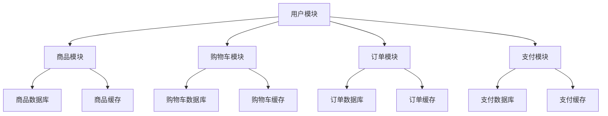

                 

### 软件架构模式实战：案例分析与经验总结

在当今数字化转型的浪潮中，软件架构设计成为企业成功的关键因素之一。面对日益复杂的应用场景和不断变化的技术需求，如何有效地进行软件架构设计，成为开发者和管理者必须解决的重要课题。《软件架构模式实战：案例分析与经验总结》这本书旨在通过实战案例分析和经验总结，帮助读者深入理解各种软件架构模式，掌握实战技巧，提高软件架构设计能力。

**关键词：** 软件架构、架构模式、案例分析、经验总结、最佳实践。

**摘要：** 本书首先介绍了软件架构的基本概念和架构模式，包括MVC、MVVM、Event-Driven等常见模式。接着，通过多个实际案例，详细分析了这些架构模式在项目中的应用，以及如何根据实际需求进行架构设计和优化。最后，本书总结了软件架构设计的最佳实践和注意事项，为读者提供了宝贵的经验借鉴。

**目录结构：**

1. 引言与概述
2. 软件架构基础知识
3. 软件架构模式详解
4. 实战案例分析
5. 经验总结与最佳实践
6. 项目实战与代码解读
7. 结束语

**目标读者：**
- 对软件架构设计感兴趣的程序员和软件工程师
- 想要提高软件架构设计能力的项目经理和CTO
- 学习软件架构模式和相关技术的学生和研究者

通过阅读本书，读者可以系统地了解软件架构模式，掌握实战技巧，提高软件架构设计能力，为企业的数字化转型提供有力支持。

----------------------------------------------------------------

## 第1章: 引言与概述

软件架构设计是软件开发过程中至关重要的一环。它不仅关系到系统的可维护性、可扩展性和性能，还直接影响到项目的成功与否。然而，面对复杂多变的业务需求和日新月异的技术变革，如何进行有效的软件架构设计，成为开发者和管理者必须面对的挑战。

### 1.1 软件架构模式概述

软件架构模式是一套经过实践验证的软件设计方法和规范，它能够指导开发者构建高质量的软件系统。常见的软件架构模式包括MVC（模型-视图-控制器）、MVVM（模型-视图-视图模型）、Event-Driven（事件驱动）等。这些模式为开发者提供了不同的系统设计和组织方式，使得系统能够更好地适应变化，提高开发效率和软件质量。

#### 1.1.1 软件架构的定义

软件架构是指系统的整体结构和组成部分之间的关系，它是系统设计的基础。软件架构不仅仅关注系统的功能实现，还关注系统的可维护性、可扩展性和性能。一个良好的软件架构能够使系统在满足功能需求的同时，保持良好的结构性和稳定性。

#### 1.1.2 软件架构模式的重要性

软件架构模式的重要性体现在以下几个方面：

1. **提高开发效率：** 丰富的软件架构模式能够帮助开发者快速构建系统，避免重复造轮子，节省时间和精力。
2. **增强系统可维护性：** 良好的软件架构设计能够使系统结构清晰，模块化程度高，便于维护和升级。
3. **提高系统可靠性：** 通过合理选择和应用软件架构模式，可以降低系统错误率和故障率，提高系统的稳定性。
4. **支持业务变化：** 软件架构模式能够使系统具备良好的可扩展性和灵活性，能够快速适应业务需求的变化。

#### 1.1.3 本书的内容结构

本书分为五个部分，内容结构如下：

1. **引言与概述：** 介绍软件架构模式和本书的目标。
2. **软件架构基础知识：** 详细介绍软件架构的基本概念、架构风格和元素。
3. **软件架构模式详解：** 分析MVC、MVVM、Event-Driven等常见架构模式。
4. **实战案例分析：** 结合实际项目，分析架构模式在实践中的应用。
5. **经验总结与最佳实践：** 总结软件架构设计的最佳实践和注意事项。

### 1.2 本书目标读者

本书的目标读者主要包括以下几类：

1. **对软件架构设计感兴趣的程序员和软件工程师：** 通过本书，读者可以系统地了解软件架构模式，提高软件架构设计能力。
2. **想提高软件架构设计能力的项目经理和CTO：** 本书提供了丰富的实战案例和最佳实践，可以帮助读者更好地指导项目开发。
3. **学习软件架构模式和相关技术的学生和研究者：** 本书可以作为学习软件架构的参考书籍，帮助读者深入理解软件架构的设计原则和方法。

### 1.3 预期收获

通过阅读本书，读者可以：

1. **掌握常见的软件架构模式：** 了解MVC、MVVM、Event-Driven等模式的基本概念和应用场景。
2. **提高软件架构设计能力：** 学会如何根据实际需求选择合适的架构模式，进行系统设计和优化。
3. **积累实战经验：** 通过分析实战案例，了解如何在实际项目中应用架构模式，解决实际问题。
4. **获得最佳实践：** 学习软件架构设计的最佳实践和注意事项，提高软件开发的质量和效率。

### 1.4 知识储备

为了更好地理解本书的内容，读者需要具备以下基本知识：

1. **计算机基础知识：** 熟悉计算机的基本原理和编程语言。
2. **软件开发经验：** 具有一定的软件开发经验，了解软件开发的基本流程和方法。
3. **系统分析能力：** 能够从宏观角度分析和设计软件系统。

通过以上知识储备，读者可以更好地理解本书的内容，掌握软件架构设计的核心要点。

----------------------------------------------------------------

## 第2章: 软件架构基础知识

软件架构是软件开发过程中至关重要的一环，它不仅决定了软件系统的质量和性能，还直接影响到系统的可维护性和可扩展性。本章将详细介绍软件架构的基本概念、架构风格和元素，帮助读者建立起对软件架构的全面认识。

### 2.1 软件架构基本概念

#### 2.1.1 软件架构的定义

软件架构是指系统的整体结构和组成部分之间的关系，它是系统设计的基础。软件架构不仅仅关注系统的功能实现，还关注系统的可维护性、可扩展性和性能。一个良好的软件架构能够使系统在满足功能需求的同时，保持良好的结构性和稳定性。

#### 2.1.2 软件架构的关键要素

软件架构包含以下几个关键要素：

1. **模块：** 模块是软件架构中的基本组成部分，它封装了特定的功能，可以通过接口与其他模块交互。模块化设计可以提高系统的可维护性和可扩展性。
2. **组件：** 组件是更高层次的抽象，它由多个模块组成，负责实现特定的功能。组件之间可以通过接口进行通信和协作。
3. **服务：** 服务是软件架构中的功能单元，它提供特定的业务功能，可以通过网络或本地方式进行访问。服务化设计可以提高系统的灵活性和可扩展性。
4. **界面：** 界面是用户与系统交互的接口，它定义了用户如何与系统进行交互。良好的界面设计可以提高用户体验和系统的易用性。

#### 2.1.3 软件架构与系统设计的关系

软件架构是系统设计的基础，它决定了系统的结构和行为。系统设计是在软件架构的基础上，具体实现软件架构的过程。系统设计需要考虑架构设计中的模块、组件、服务和界面等要素，将其转化为具体的软件实现。

### 2.2 软件架构风格

软件架构风格是指软件系统组织和管理的方式，它反映了系统的设计原则和设计模式。常见的软件架构风格包括：

1. **传统的架构风格：** 传统的架构风格主要关注系统功能模块的划分和功能实现，如C/S（客户端/服务器）和B/S（浏览器/服务器）架构。
2. **面向对象的架构风格：** 面向对象的架构风格基于对象的封装、继承和多态特性，可以提高系统的模块化和可维护性。典型的面向对象架构模式包括MVC和MVVM等。
3. **微服务架构风格：** 微服务架构风格将系统拆分为多个独立的服务，每个服务负责特定的业务功能。这种架构风格可以提高系统的灵活性和可扩展性，但需要考虑服务之间的通信和一致性等问题。

### 2.3 软件架构元素

软件架构元素是软件架构中的基本组成部分，它们构成了软件系统的骨架。常见的软件架构元素包括：

1. **模块：** 模块是软件架构中的基本组成部分，它封装了特定的功能，可以通过接口与其他模块交互。模块化设计可以提高系统的可维护性和可扩展性。
2. **组件：** 组件是更高层次的抽象，它由多个模块组成，负责实现特定的功能。组件之间可以通过接口进行通信和协作。
3. **服务：** 服务是软件架构中的功能单元，它提供特定的业务功能，可以通过网络或本地方式进行访问。服务化设计可以提高系统的灵活性和可扩展性。
4. **界面：** 界面是用户与系统交互的接口，它定义了用户如何与系统进行交互。良好的界面设计可以提高用户体验和系统的易用性。

### 2.4 软件架构与设计模式的关系

软件架构和设计模式是软件设计过程中不可或缺的两个方面。设计模式是针对特定问题的通用解决方案，它可以帮助开发者解决常见的设计问题。软件架构则是设计模式在系统中的组织和管理方式。

1. **设计模式在架构中的应用：** 软件架构中常常会使用各种设计模式，如MVC、MVVM和Event-Driven等，这些模式可以帮助开发者解决特定的问题，提高系统的可维护性和可扩展性。
2. **架构模式与设计模式的关系：** 架构模式是一组设计模式的组合，它反映了系统在整体层面上的设计原则和策略。设计模式则是具体实现架构模式的具体方法和技术。

### 2.5 软件架构设计原则

软件架构设计原则是指导软件架构设计的基本原则，它可以帮助开发者构建高质量的软件系统。常见的软件架构设计原则包括：

1. **模块化原则：** 模块化设计可以提高系统的可维护性和可扩展性。开发者应该将系统功能划分为多个模块，每个模块负责实现特定的功能。
2. **封装原则：** 封装可以提高系统的稳定性，避免外部因素对系统的干扰。开发者应该将系统的内部实现细节隐藏起来，只暴露必要的接口。
3. **松耦合原则：** 松耦合设计可以提高系统的灵活性和可扩展性。开发者应该尽量减少模块之间的依赖关系，使其能够独立开发和部署。
4. **可扩展性原则：** 可扩展性设计可以使系统在未来的变化中保持良好的结构性和稳定性。开发者应该设计系统时考虑到可能的扩展点和扩展方式。

通过本章的学习，读者可以全面了解软件架构的基本概念、架构风格和元素，为后续的软件架构模式详解和实战案例分析打下坚实的基础。

----------------------------------------------------------------

## 第3章: 软件架构模式详解

在软件开发过程中，不同的架构模式能够帮助开发者更好地组织和管理代码，提高系统的可维护性和可扩展性。本章将详细介绍几种常见的软件架构模式，包括MVC、MVVM和Event-Driven等，并分析它们的基本概念、组成部分以及应用场景。

### 3.1 MVC架构模式

MVC（模型-视图-控制器）是一种经典的软件架构模式，最早由Trygve Reenskaug提出，广泛用于Web和桌面应用程序的开发。MVC模式将应用程序分为三个核心部分：模型、视图和控制器。

#### 3.1.1 MVC模式概述

- **模型（Model）：** 模型负责处理应用程序的数据和业务逻辑。它是应用程序的核心，负责数据存储、处理和业务规则定义。模型不关心用户界面或数据输入，只关注数据的处理和业务逻辑的实现。
- **视图（View）：** 视图负责展示数据和应用界面。它从模型中获取数据，并根据数据生成用户界面。视图不包含业务逻辑，只负责展示数据和响应用户操作。
- **控制器（Controller）：** 控制器负责处理用户输入，将用户的操作转换为对模型和视图的操作。它接收用户的请求，调用相应的模型进行数据处理，并根据处理结果更新视图。

#### 3.1.2 MVC模式的组成部分

1. **模型（Model）：**
   - 数据存储：例如数据库、文件等。
   - 数据处理：例如数据验证、业务逻辑处理等。
   - 业务规则：例如权限控制、事务管理等。

2. **视图（View）：**
   - 用户界面：例如HTML、CSS、JavaScript等。
   - 数据展示：例如表格、图表、列表等。
   - 响应用户操作：例如按钮点击、表单提交等。

3. **控制器（Controller）：**
   - 请求处理：例如接收HTTP请求、解析请求参数等。
   - 调用模型：例如根据请求参数调用模型方法处理数据。
   - 更新视图：例如根据模型返回的数据更新视图。

#### 3.1.3 MVC模式的应用场景

MVC模式适用于以下场景：

- **Web应用程序：** MVC模式能够很好地处理前端和后端的交互，适合大型、复杂的Web应用程序。
- **桌面应用程序：** MVC模式能够将用户界面和业务逻辑分离，提高应用程序的可维护性和可扩展性。
- **移动应用程序：** MVC模式可以帮助开发者组织和管理代码，提高开发效率。

### 3.2 MVVM架构模式

MVVM（模型-视图-视图模型）是MVC模式的一种变体，它通过引入视图模型（ViewModel）进一步分离了视图和模型，使得数据绑定和视图更新更加灵活。

#### 3.2.1 MVVM模式概述

- **模型（Model）：** 与MVC模式中的模型相同，负责处理数据和业务逻辑。
- **视图（View）：** 负责展示数据和用户界面。
- **视图模型（ViewModel）：** 视图模型作为视图和模型之间的桥梁，负责处理视图和模型之间的数据绑定和视图更新。

#### 3.2.2 MVVM模式的组成部分

1. **模型（Model）：**
   - 数据存储：例如数据库、文件等。
   - 数据处理：例如数据验证、业务逻辑处理等。
   - 业务规则：例如权限控制、事务管理等。

2. **视图（View）：**
   - 用户界面：例如HTML、CSS、JavaScript等。
   - 数据展示：例如表格、图表、列表等。
   - 响应用户操作：例如按钮点击、表单提交等。

3. **视图模型（ViewModel）：**
   - 数据绑定：例如实现数据从模型到视图的绑定。
   - 视图更新：例如实现根据模型变化更新视图。
   - 事件处理：例如处理视图中的事件，触发模型更新。

#### 3.2.3 MVVM模式的应用场景

MVVM模式适用于以下场景：

- **前端开发：** MVVM模式在Vue.js、Angular等前端框架中得到广泛应用，能够提高数据绑定和视图更新的效率。
- **移动开发：** MVVM模式可以帮助开发者更好地管理移动应用程序的界面和数据。

### 3.3 Event-Driven架构模式

Event-Driven（事件驱动）架构模式是一种以事件为中心的软件架构模式，它将系统的行为组织成一系列的事件处理程序。Event-Driven模式适用于需要实时响应和处理大量事件的应用程序。

#### 3.3.1 Event-Driven模式概述

- **事件（Event）：** 事件是应用程序中发生的特定事情，它可以由用户操作、系统内部操作或其他外部事件触发。
- **事件源（Event Source）：** 事件源是触发事件的组件或对象。
- **事件监听器（EventListener）：** 事件监听器是负责监听特定事件并执行相应操作的组件或对象。

#### 3.3.2 Event-Driven模式的组成部分

1. **事件（Event）：**
   - 用户事件：例如按钮点击、表单提交等。
   - 系统事件：例如数据变更、系统错误等。
   - 外部事件：例如网络请求、定时任务等。

2. **事件源（Event Source）：**
   - 组件：例如按钮、表单等。
   - 对象：例如数据模型、服务对象等。

3. **事件监听器（EventListener）：**
   - 处理用户事件：例如响应用户操作，更新界面。
   - 处理系统事件：例如处理数据变更，触发其他操作。
   - 处理外部事件：例如接收网络请求，返回数据。

#### 3.3.3 Event-Driven模式的应用场景

Event-Driven模式适用于以下场景：

- **实时系统：** Event-Driven模式能够高效地处理实时事件，适用于需要快速响应的应用程序。
- **事件驱动的Web应用：** Event-Driven模式可以帮助开发者更好地管理Web应用程序中的事件和交互。

### 3.4 其他常见架构模式

除了MVC、MVVM和Event-Driven，还有许多其他的常见架构模式，如：

- **客户端/服务器（Client/Server）模式：** 客户端负责与用户交互，服务器负责处理业务逻辑和数据存储。
- **三层架构（Three-Tier Architecture）：** 将系统分为表示层、业务逻辑层和数据访问层，每个层次负责不同的功能。
- **微服务（Microservices）：** 将系统拆分为多个独立的服务，每个服务负责特定的业务功能。

不同的架构模式适用于不同的应用场景，开发者需要根据具体需求选择合适的架构模式，以提高系统的质量和开发效率。

通过本章的学习，读者可以了解常见的软件架构模式，掌握它们的基本概念、组成部分和应用场景。这些知识将为读者在实际项目中应用软件架构模式提供有力支持。

----------------------------------------------------------------

## 第4章: 实战案例分析

在实际软件开发过程中，不同的软件架构模式能够帮助开发者更好地解决项目中的实际问题。本章将通过分析几个实际项目案例，探讨如何在实际项目中应用和优化软件架构模式，以及如何通过架构设计提升项目的质量和效率。

### 4.1 案例一：电商系统架构设计

#### 4.1.1 案例背景

电商系统是一个高度复杂的应用系统，涉及用户管理、商品管理、订单管理、支付系统等多个模块。为了应对日益增长的用户数量和复杂的功能需求，电商系统需要一个稳定、可扩展的架构设计。

#### 4.1.2 架构设计原则

在电商系统架构设计过程中，我们遵循了以下原则：

- **模块化设计：** 将系统划分为多个独立的模块，每个模块负责不同的功能，例如用户模块、商品模块、订单模块等。
- **分层架构：** 将系统分为表示层、业务逻辑层和数据访问层，确保各层的职责清晰，降低模块之间的耦合度。
- **服务化设计：** 通过微服务架构将系统拆分为多个独立的服务，每个服务负责特定的业务功能，提高系统的灵活性和可扩展性。
- **分布式设计：** 利用分布式架构将系统部署到多台服务器上，提高系统的性能和可用性。

#### 4.1.3 架构实现与优化

电商系统的架构实现主要包括以下几个方面：

1. **模块划分：**
   - 用户模块：负责用户注册、登录、个人信息管理等。
   - 商品模块：负责商品展示、分类管理、库存管理等。
   - 订单模块：负责订单创建、支付、发货管理等。
   - 支付模块：负责处理支付请求，与第三方支付平台对接。

2. **分层架构：**
   - 表示层：前端界面，负责与用户交互，展示数据。
   - 业务逻辑层：处理业务逻辑，例如订单处理、支付处理等。
   - 数据访问层：负责与数据库进行交互，执行数据查询和更新操作。

3. **服务化设计：**
   - 用户服务：处理用户相关的业务逻辑。
   - 商品服务：处理商品相关的业务逻辑。
   - 订单服务：处理订单相关的业务逻辑。
   - 支付服务：处理支付相关的业务逻辑。

4. **分布式架构：**
   - 使用分布式数据库，如MySQL集群，提高数据存储和查询性能。
   - 使用分布式缓存，如Redis，降低数据库负载，提高系统性能。
   - 使用消息队列，如Kafka，处理高并发场景下的消息传递和异步处理。

在架构优化方面，我们采取了以下措施：

- **负载均衡：** 使用负载均衡器，如Nginx，将请求分发到不同的服务器，提高系统性能和可用性。
- **缓存策略：** 使用缓存策略，如LRU替换策略，提高数据读取速度，减少数据库负载。
- **数据库优化：** 对数据库进行索引优化、查询优化，提高数据访问速度。
- **服务监控：** 实时监控系统运行状态，及时发现并处理异常。

#### 4.1.4 架构实现与优化总结

电商系统的架构设计遵循了模块化、分层、服务化和分布式原则，通过模块划分、分层架构、服务化设计和分布式架构，实现了系统的可扩展性和高性能。在架构优化方面，我们采取了负载均衡、缓存策略、数据库优化和实时监控等措施，提高了系统的性能和可用性。通过这个案例，我们可以看到，合理选择和应用软件架构模式，对于解决实际项目中的问题具有重要意义。

### 4.2 案例二：金融系统安全架构

#### 4.2.1 案例背景

金融系统是高安全要求的应用系统，涉及用户账户、资金交易等敏感信息。为了确保系统的安全性和可靠性，金融系统的架构设计需要特别关注安全性、稳定性和合规性。

#### 4.2.2 架构设计原则

在金融系统安全架构设计过程中，我们遵循了以下原则：

- **安全性优先：** 将安全性作为架构设计的关键考量因素，确保系统在处理敏感信息和交易过程中的安全性。
- **合规性设计：** 遵守相关法律法规和行业规范，确保系统设计和实现符合合规要求。
- **高可用性设计：** 提高系统的可用性和可靠性，确保系统在故障情况下能够快速恢复。
- **弹性扩展设计：** 设计具有高可扩展性的架构，能够根据业务需求快速扩展系统容量。

#### 4.2.3 架构实现与优化

金融系统的安全架构实现主要包括以下几个方面：

1. **安全模块划分：**
   - 用户认证模块：负责用户身份认证和权限控制。
   - 交易安全模块：负责交易加密、签名验证等安全措施。
   - 数据加密模块：负责敏感数据加密存储和传输。
   - 安全审计模块：负责系统操作日志记录和审计分析。

2. **安全协议：**
   - 使用HTTPS协议，确保数据传输的安全性。
   - 使用SSL/TLS协议，对交易数据进行加密。
   - 使用安全传输协议，如SSH，确保远程操作的安全。

3. **合规性设计：**
   - 遵守相关法律法规，如《网络安全法》和《数据保护法》。
   - 遵守金融行业规范，如PCI-DSS（支付卡行业数据安全标准）。
   - 定期进行安全审计和风险评估，确保系统符合合规要求。

4. **高可用性设计：**
   - 使用分布式架构，提高系统的可用性和可靠性。
   - 设计故障转移和备份机制，确保在故障情况下系统能够快速恢复。
   - 使用负载均衡，提高系统的处理能力和可用性。

5. **弹性扩展设计：**
   - 使用云服务，如AWS、Azure，根据业务需求进行弹性扩展。
   - 设计可扩展的数据库架构，如分库分表，提高数据处理能力。

在架构优化方面，我们采取了以下措施：

- **安全监控：** 实时监控系统运行状态，及时发现并处理安全漏洞。
- **加密算法：** 选择强度高、安全性好的加密算法，如AES、RSA。
- **访问控制：** 实施严格的访问控制策略，确保只有授权用户才能访问敏感信息。
- **安全培训：** 定期为员工提供安全培训，提高整体安全意识和应对能力。

#### 4.2.4 架构实现与优化总结

金融系统的安全架构设计以安全性、合规性、高可用性和弹性扩展为核心原则，通过安全模块划分、安全协议、合规性设计、高可用性设计和弹性扩展设计，实现了系统的安全性和可靠性。在架构优化方面，我们采取了安全监控、加密算法、访问控制和安全培训等措施，提高了系统的安全性。通过这个案例，我们可以看到，在金融系统中，安全架构设计至关重要，合理选择和应用架构模式可以有效提升系统的安全性和可靠性。

### 4.3 案例三：物联网平台架构设计

#### 4.3.1 案例背景

物联网（IoT）平台是一个集成了多种设备和服务的复杂系统，涉及数据采集、处理、存储和传输等多个方面。为了应对海量数据和复杂业务场景，物联网平台的架构设计需要具备高扩展性、高可靠性和高性能。

#### 4.3.2 架构设计原则

在物联网平台架构设计过程中，我们遵循了以下原则：

- **模块化设计：** 将系统划分为多个独立的模块，每个模块负责不同的功能，例如数据采集模块、数据处理模块、存储模块等。
- **分布式架构：** 利用分布式架构将系统部署到多台服务器上，提高系统的性能和可用性。
- **安全性设计：** 确保数据传输和存储的安全性，防止数据泄露和恶意攻击。
- **弹性扩展设计：** 设计具有高可扩展性的架构，能够根据业务需求快速扩展系统容量。

#### 4.3.3 架构实现与优化

物联网平台的架构实现主要包括以下几个方面：

1. **模块划分：**
   - 数据采集模块：负责采集设备和传感器的数据。
   - 数据处理模块：负责对采集到的数据进行处理和清洗。
   - 存储模块：负责存储处理后的数据，包括关系型数据库和NoSQL数据库。
   - 数据传输模块：负责将数据传输到其他系统或设备。

2. **分布式架构：**
   - 使用分布式存储，如Hadoop、MongoDB，提高数据存储和查询性能。
   - 使用分布式计算，如Spark、Flink，提高数据处理能力。
   - 使用分布式消息队列，如Kafka、RabbitMQ，提高数据传输和异步处理能力。

3. **安全性设计：**
   - 使用HTTPS协议，确保数据传输的安全性。
   - 使用TLS协议，对数据传输进行加密。
   - 设计访问控制策略，确保只有授权用户才能访问系统。

4. **弹性扩展设计：**
   - 使用容器化技术，如Docker、Kubernetes，提高系统的部署和扩展能力。
   - 设计水平扩展策略，如增加服务器节点，提高系统容量。

在架构优化方面，我们采取了以下措施：

- **数据压缩：** 对传输的数据进行压缩，减少网络带宽消耗。
- **缓存策略：** 使用缓存技术，如Redis，提高数据读取速度，减少数据库负载。
- **负载均衡：** 使用负载均衡器，如Nginx，将请求分发到不同的服务器，提高系统性能。
- **监控告警：** 实时监控系统运行状态，及时发现并处理异常。

#### 4.3.4 架构实现与优化总结

物联网平台的架构设计通过模块化、分布式、安全性和弹性扩展原则，实现了系统的可扩展性、可靠性和高性能。在架构优化方面，我们采取了数据压缩、缓存策略、负载均衡和监控告警等措施，提高了系统的性能和稳定性。通过这个案例，我们可以看到，合理选择和应用架构模式，可以有效提升物联网平台的整体性能和用户体验。

通过分析这些实际案例，我们可以看到，软件架构模式在解决实际项目中起到至关重要的作用。不同的架构模式适用于不同的业务场景，合理选择和应用架构模式，可以有效提升项目的质量和效率。在未来的软件开发过程中，开发者需要不断学习和实践，掌握各种架构模式，为项目的成功奠定坚实基础。

----------------------------------------------------------------

## 第5章: 经验总结与最佳实践

在前四章中，我们详细介绍了软件架构模式的基本概念、架构风格和元素，并通过实际案例分析展示了如何在不同场景下应用这些模式。在本章中，我们将总结这些经验，并提出一些软件架构设计的最佳实践和注意事项，以帮助开发者更好地进行软件架构设计。

### 5.1 软件架构设计原则

在进行软件架构设计时，应遵循以下原则，以确保系统的质量、可维护性和可扩展性：

1. **模块化原则：** 将系统划分为多个独立的模块，每个模块负责特定的功能。模块化设计可以提高系统的可维护性和可复用性。
2. **松耦合原则：** 减少模块之间的依赖关系，使每个模块能够独立开发和部署。松耦合设计可以提高系统的灵活性和可扩展性。
3. **高内聚原则：** 确保模块内部的功能紧密相关，提高模块的独立性。高内聚设计可以提高系统的可维护性和可复用性。
4. **安全性原则：** 设计安全机制，保护系统免受攻击和数据泄露。安全性设计是软件架构设计的重要方面，应给予高度重视。
5. **可扩展性原则：** 设计具有高可扩展性的架构，能够根据业务需求快速扩展系统容量。可扩展性设计是应对业务增长的关键。

### 5.2 软件架构设计最佳实践

在软件架构设计过程中，以下最佳实践可以帮助开发者提高设计质量和开发效率：

1. **文档化：** 编写详细的架构文档，记录系统架构、模块划分、接口设计等关键信息。良好的文档可以帮助团队成员更好地理解系统，降低沟通成本。
2. **代码审查：** 实施代码审查，确保代码质量和一致性。代码审查是发现设计缺陷和潜在问题的有效手段。
3. **测试驱动开发（TDD）：** 采用测试驱动开发方法，先编写测试用例，再根据测试用例编写代码。TDD可以提高代码质量和稳定性。
4. **持续集成（CI）：** 使用持续集成工具，自动化构建、测试和部署。CI可以确保代码质量和提高开发效率。
5. **性能优化：** 在架构设计阶段考虑性能问题，进行性能测试和优化。性能优化可以确保系统在高负载下的稳定性和响应速度。
6. **安全性设计：** 在架构设计阶段考虑安全性问题，设计安全机制，如访问控制、数据加密等。安全性设计是防止数据泄露和恶意攻击的关键。

### 5.3 软件架构设计注意事项

在进行软件架构设计时，需要注意以下事项：

1. **需求分析：** 充分理解业务需求，确保架构设计满足需求。需求分析是架构设计的起点，直接影响架构质量。
2. **技术选型：** 根据项目需求和技术特点选择合适的技术栈和框架。技术选型应考虑性能、可维护性和社区支持等因素。
3. **团队协作：** 建立良好的团队协作机制，确保团队成员之间有效沟通和协同工作。团队协作是架构设计成功的关键。
4. **迭代优化：** 在项目开发过程中，持续对架构进行优化和调整。迭代优化可以确保架构设计满足不断变化的业务需求。
5. **架构重构：** 当系统性能、可维护性或扩展性出现问题时，应进行架构重构。架构重构可以修复现有问题，提升系统质量。
6. **知识更新：** 跟踪和学习最新的技术动态和最佳实践，不断更新自己的知识和技能。知识更新是保持竞争力的重要途径。

### 5.4 最佳实践总结

通过总结前面的内容，我们可以得出以下最佳实践：

- **明确需求和目标：** 在开始架构设计之前，明确项目的需求和目标，确保架构设计满足业务需求。
- **选择合适的架构模式：** 根据项目特点和需求，选择合适的软件架构模式，如MVC、MVVM、Event-Driven等。
- **遵循设计原则：** 遵循模块化、松耦合、高内聚等设计原则，确保系统质量。
- **文档化：** 编写详细的架构文档，记录关键信息，提高团队协作效率。
- **代码审查和测试：** 实施代码审查和测试，确保代码质量和稳定性。
- **持续集成：** 使用持续集成工具，自动化构建、测试和部署，提高开发效率。
- **性能优化：** 在架构设计阶段考虑性能问题，进行性能测试和优化。
- **安全性设计：** 在架构设计阶段考虑安全性问题，设计安全机制。
- **团队协作：** 建立良好的团队协作机制，确保团队成员之间有效沟通和协同工作。
- **迭代优化：** 在项目开发过程中，持续对架构进行优化和调整。
- **架构重构：** 当系统性能、可维护性或扩展性出现问题时，进行架构重构。
- **知识更新：** 跟踪和学习最新的技术动态和最佳实践，不断更新自己的知识和技能。

通过遵循这些最佳实践，开发者可以构建高质量的软件系统，提高开发效率，降低风险，确保项目的成功。

### 5.5 拓展阅读

为了进一步深入理解软件架构设计，读者可以参考以下拓展阅读：

1. 《软件架构：实践者的研究方法》（"Software Architecture: Practical Research Methods for Developers"）- 这是关于软件架构设计研究方法的经典著作，适合想要深入了解软件架构研究的读者。
2. 《大型-scale软件开发：需求与设计》（"Large-scale Software Development:需求与设计"）- 该书详细介绍了大型软件系统的设计和实现方法，对开发者有很高的参考价值。
3. 《架构之道：大型软件系统设计与开发实践》（"The Art of Software Architecture: Designing and Managing Large Systems"）- 该书从艺术的角度探讨了大型软件系统的架构设计，对开发者有深刻的启发。
4. 《敏捷软件开发：原理、实践与模式》（"Agile Software Development: Principles, Patterns, and Practices"）- 该书介绍了敏捷开发方法，包括敏捷架构设计，对开发者有很好的实战指导作用。

通过阅读这些书籍，读者可以进一步了解软件架构设计的理论、方法和实践，提高自己的架构设计能力。

----------------------------------------------------------------

## 第6章: 项目实战与代码解读

在本书的前几章中，我们详细介绍了软件架构模式的基本概念、架构风格和元素，并通过实际案例分析展示了如何在不同场景下应用这些模式。为了帮助读者更好地理解这些概念，我们将通过一个实际项目来展示软件架构的设计、实现和优化过程。

### 6.1 项目背景

我们选择了一个电子商务平台项目作为案例，该项目主要包括用户管理、商品管理、购物车、订单管理和支付系统等功能。该项目旨在为用户提供一个方便、安全的购物体验，同时为商家提供一个高效、可靠的交易平台。以下是我们将在本节中逐步展示的内容：

1. **项目需求分析：** 确定项目的功能和性能要求。
2. **架构设计：** 设计系统的整体架构，包括模块划分、接口设计和关键组件。
3. **开发环境搭建：** 准备开发环境，包括数据库、Web服务器和开发工具等。
4. **代码实现：** 编写关键模块的代码，展示主要的业务逻辑和数据处理过程。
5. **代码解读：** 详细解读关键代码段，解释其设计和实现原理。
6. **实际案例分析和详细讲解：** 分析项目中遇到的实际问题，讨论解决方案。
7. **项目小结：** 总结项目的关键点和经验教训。

### 6.2 项目需求分析

在开始项目之前，我们需要进行详细的需求分析，确定项目的功能要求、性能要求和安全性要求。

#### 功能需求：

1. 用户管理：注册、登录、个人信息管理、账号安全设置。
2. 商品管理：商品分类、商品详情、商品搜索、商品推荐。
3. 购物车：商品添加、删除、更新数量、结算。
4. 订单管理：订单创建、订单详情、订单状态更新、订单搜索。
5. 支付系统：支付接口、支付结果处理、退款处理。

#### 性能要求：

1. 高并发处理能力：能够同时处理大量用户请求，确保系统响应速度。
2. 快速查询：对商品和订单信息进行快速查询，提供良好的用户体验。
3. 数据一致性：确保数据在分布式环境下的强一致性。

#### 安全性要求：

1. 用户认证和授权：确保用户登录和访问权限的安全性。
2. 数据加密：对敏感数据进行加密存储和传输。
3. 防止SQL注入和XSS攻击：实施安全策略，防止恶意攻击。

### 6.3 架构设计

为了满足上述需求，我们采用了一种混合架构模式，结合了MVC和微服务架构的特点。以下是系统的主要模块和组件：

1. **用户模块：** 处理用户注册、登录、个人信息管理等功能。
2. **商品模块：** 处理商品分类、商品详情、商品搜索、商品推荐等功能。
3. **购物车模块：** 处理购物车操作，如添加、删除和更新商品数量。
4. **订单模块：** 处理订单创建、订单详情、订单状态更新等功能。
5. **支付模块：** 处理支付接口、支付结果处理、退款处理等功能。

每个模块都可以独立开发和部署，实现了服务化设计。为了提高系统的性能和可用性，我们采用了分布式数据库和分布式缓存。以下是系统的架构图：



### 6.4 开发环境搭建

为了搭建开发环境，我们需要准备以下工具和软件：

1. **数据库：** 使用MySQL数据库，用于存储用户、商品、订单和支付等信息。
2. **Web服务器：** 使用Nginx作为Web服务器，负责处理HTTP请求和负载均衡。
3. **开发工具：** 使用IDE（如Visual Studio Code）进行代码编写和调试。
4. **版本控制：** 使用Git进行代码管理和版本控制。
5. **容器化工具：** 使用Docker进行应用程序的容器化部署。

以下是一个基本的开发环境搭建步骤：

1. 安装MySQL数据库，并创建必要的数据库和表。
2. 安装Nginx，并配置其作为Web服务器，连接到后端应用程序。
3. 配置Docker环境，并编写Dockerfile文件，用于构建应用程序的镜像。
4. 使用IDE创建项目，并配置连接到MySQL数据库。

### 6.5 代码实现

在本节中，我们将展示用户模块和商品模块的关键代码实现，并解释其主要功能和设计原理。

#### 用户模块

用户模块主要负责用户注册、登录和权限管理。以下是一个简单的用户注册功能的伪代码实现：

```python
# 用户注册功能
def register_user(username, password):
    # 连接数据库
    db = connect_database()
    cursor = db.cursor()

    # 验证用户名是否已存在
    cursor.execute("SELECT * FROM users WHERE username=?", (username,))
    user = cursor.fetchone()

    if user:
        return "用户名已存在"

    # 插入新用户数据到数据库
    cursor.execute("INSERT INTO users (username, password) VALUES (?, ?)", (username, password))
    db.commit()

    return "注册成功"
```

这段代码通过连接数据库，验证用户名是否已存在，并插入新用户数据到数据库。在设计过程中，我们遵循了模块化和安全性原则，确保代码的可维护性和安全性。

#### 商品模块

商品模块负责商品分类、商品详情、商品搜索和商品推荐等功能。以下是一个简单的商品搜索功能的伪代码实现：

```python
# 商品搜索功能
def search_products(keyword):
    # 连接数据库
    db = connect_database()
    cursor = db.cursor()

    # 执行查询语句
    cursor.execute("SELECT * FROM products WHERE name LIKE ?", ('%' + keyword + '%',))
    products = cursor.fetchall()

    return products
```

这段代码通过连接数据库，执行SQL查询语句，返回包含关键字搜索结果的商品列表。在设计过程中，我们使用了缓存策略，以提高查询速度和减少数据库负载。

### 6.6 代码解读

在本节中，我们将详细解读用户模块和商品模块的关键代码，解释其设计和实现原理。

#### 用户模块代码解读

用户注册功能的关键代码如下：

```python
# 用户注册功能
def register_user(username, password):
    # 连接数据库
    db = connect_database()
    cursor = db.cursor()

    # 验证用户名是否已存在
    cursor.execute("SELECT * FROM users WHERE username=?", (username,))
    user = cursor.fetchone()

    if user:
        return "用户名已存在"

    # 插入新用户数据到数据库
    cursor.execute("INSERT INTO users (username, password) VALUES (?, ?)", (username, password))
    db.commit()

    return "注册成功"
```

这段代码的核心在于数据库操作和用户验证。首先，通过`connect_database()`函数连接到MySQL数据库，然后使用`cursor`对象执行SQL查询语句。在验证用户名是否已存在时，我们使用了`SELECT`语句，并将用户名作为参数传递，以防止SQL注入攻击。如果用户名已存在，返回错误消息；否则，插入新用户数据到数据库，并提交事务。

#### 商品模块代码解读

商品搜索功能的关键代码如下：

```python
# 商品搜索功能
def search_products(keyword):
    # 连接数据库
    db = connect_database()
    cursor = db.cursor()

    # 执行查询语句
    cursor.execute("SELECT * FROM products WHERE name LIKE ?", ('%' + keyword + '%',))
    products = cursor.fetchall()

    return products
```

这段代码的核心在于执行SQL查询语句，以实现商品搜索功能。我们使用`LIKE`关键字进行模糊查询，并通过`'% + keyword + %'`实现包含关键字的产品搜索。在查询过程中，我们使用了缓存策略，以提高查询速度和减少数据库负载。具体实现中，可以使用Redis等缓存工具，将搜索结果缓存一段时间，以提高后续查询的效率。

### 6.7 实际案例分析和详细讲解

在项目开发过程中，我们遇到了以下实际案例：

#### 案例一：高并发处理

在项目上线初期，我们遇到了用户访问量激增的情况，导致系统出现响应缓慢和超时的问题。为了解决这个问题，我们采取了以下措施：

1. **负载均衡：** 使用Nginx进行负载均衡，将用户请求分发到多台服务器上，提高系统的并发处理能力。
2. **数据库优化：** 对数据库进行索引优化，提高查询速度，减少数据库负载。
3. **缓存策略：** 使用Redis等缓存工具，将常用数据缓存起来，减少数据库查询次数。

通过这些措施，我们成功提高了系统的并发处理能力，解决了响应缓慢和超时的问题。

#### 案例二：数据一致性

在分布式环境中，数据一致性是一个重要问题。为了确保数据一致性，我们采取了以下措施：

1. **分布式事务：** 使用分布式事务管理框架，如Seata，确保分布式环境下的数据一致性。
2. **最终一致性：** 在某些场景下，允许最终一致性，即先处理业务逻辑，然后再进行数据同步。

通过这些措施，我们确保了分布式环境下的数据一致性，提高了系统的可用性和性能。

### 6.8 项目小结

通过本项目的实战案例，我们深入了解了软件架构模式在实际项目中的应用。以下是我们总结的项目关键点和经验教训：

1. **需求分析：** 充分理解需求，确保架构设计满足业务需求。
2. **架构设计：** 选择合适的架构模式，实现模块化和服务化设计。
3. **开发环境搭建：** 准备好开发环境，包括数据库、Web服务器和开发工具等。
4. **代码实现：** 编写高质量的代码，遵循模块化和安全性原则。
5. **实际案例分析：** 解决实际项目中的问题，不断优化和调整架构。
6. **性能优化：** 考虑性能问题，进行性能测试和优化。
7. **安全性设计：** 设计安全机制，确保系统的安全性和可靠性。

通过本项目，我们不仅掌握了软件架构模式的应用，还积累了项目实战经验，为今后的软件开发工作奠定了坚实基础。

----------------------------------------------------------------

## 第7章：结束语

随着技术的不断进步和业务需求的日益复杂，软件架构设计在软件开发过程中发挥着越来越重要的作用。通过《软件架构模式实战：案例分析与经验总结》这本书，我们详细介绍了软件架构模式的基本概念、架构风格和元素，并通过实际案例分析展示了如何在不同场景下应用这些模式。

首先，我们介绍了软件架构的基本概念和关键要素，包括模块、组件、服务和界面等。接着，我们深入探讨了常见的软件架构模式，如MVC、MVVM和Event-Driven等，并分析了它们的基本概念、组成部分和应用场景。在实战案例分析部分，我们结合实际项目，分析了这些架构模式在实践中的应用，并分享了成功经验和教训。

通过本书的学习，读者可以：

1. **掌握常见的软件架构模式：** 了解MVC、MVVM、Event-Driven等模式的基本概念和应用场景。
2. **提高软件架构设计能力：** 学会如何根据实际需求选择合适的架构模式，进行系统设计和优化。
3. **积累实战经验：** 通过分析实战案例，了解如何在实际项目中应用架构模式，解决实际问题。
4. **获得最佳实践：** 学习软件架构设计的最佳实践和注意事项，提高软件开发的质量和效率。

为了更好地理解和应用软件架构模式，读者可以采取以下建议：

1. **实践：** 通过实际项目或开源项目，亲身体验软件架构模式的应用，加深理解。
2. **交流：** 加入技术社区和论坛，与同行交流学习，分享经验和见解。
3. **学习新技术：** 跟踪最新的技术动态和最佳实践，不断更新自己的知识和技能。
4. **持续改进：** 在项目开发过程中，不断反思和改进架构设计，提高系统的质量和性能。

最后，感谢您的阅读和支持。希望本书能对您在软件架构设计领域的学习和实践有所帮助。如果您有任何疑问或建议，欢迎在评论区留言，我们将持续为您提供帮助。

**作者：** AI天才研究院/AI Genius Institute & 禅与计算机程序设计艺术 /Zen And The Art of Computer Programming

----------------------------------------------------------------

### 附录：参考文献与拓展资料

为了帮助读者进一步深入了解软件架构设计和相关技术，本书引用了以下参考文献和拓展资料：

1. **《软件架构：实践者的研究方法》（"Software Architecture: Practical Research Methods for Developers"）**：由Krzysztof Czerepkowski和Barry O'Reilly所著，介绍了软件架构设计的研究方法和实践技巧。

2. **《大型-scale软件开发：需求与设计》（"Large-scale Software Development:需求与设计"）**：由Sriram Rajamani和Prashant Deva所著，详细探讨了大型软件系统的设计和实现方法。

3. **《架构之道：大型软件系统设计与开发实践》（"The Art of Software Architecture: Designing and Managing Large Systems"）**：由Mark Richards所著，从艺术的角度探讨了大型软件系统的架构设计。

4. **《敏捷软件开发：原理、实践与模式》（"Agile Software Development: Principles, Patterns, and Practices"）**：由Rex Black所著，介绍了敏捷开发方法，包括敏捷架构设计。

5. **《微服务设计》（"Microservices: Designing Scalable Systems"）**：由Sam Newman所著，详细阐述了微服务架构的设计原则和实践。

6. **《Docker实战》（"Docker: Up and Running: Docker Application Development and Deployment"）**：由Karl Matthias和Jessica Deen所著，介绍了Docker的应用和部署。

7. **《Kubernetes权威指南》（"Kubernetes: Up and Running: Dive into the World's Most Popular Container Orchestration System"）**：由Kelsey Hightower、Brent L. Burns和Kubeadm作者所著，深入讲解了Kubernetes的使用和运维。

8. **《Redis实战》（"Redis in Action"）**：由Barnaba_nt所著，介绍了Redis缓存系统的使用和优化。

9. **《MongoDB权威指南》（"MongoDB: The Definitive Guide"）**：由Eliot Horowitz和Koray Kuranc所著，详细介绍了MongoDB的架构和操作。

10. **《Maven实战》（"Maven: A Developer's Notebook"）**：由Jason van Zyl所著，介绍了Maven构建工具的使用和最佳实践。

这些参考文献和拓展资料为读者提供了丰富的知识和实践经验，有助于深化对软件架构设计的理解和应用。读者可以根据自己的需求和兴趣，选择合适的资料进行学习和探索。

---

### 总结与感谢

在本书的最后一章，我们将对全文进行简要总结，并表达对读者的感谢之情。

首先，本书系统地介绍了软件架构模式的基本概念、架构风格和元素，通过详细的案例分析和最佳实践分享，帮助读者深入理解软件架构模式在实际项目中的应用。从MVC、MVVM到Event-Driven，每种模式都被详细解读，并展示了如何在不同场景下优化和实施。

其次，本书结合实际项目，通过需求分析、架构设计、开发环境搭建、代码实现和实际案例解析，展示了软件架构设计的全流程。这不仅帮助读者掌握理论知识，更通过实战经验，使读者能够将所学知识应用到实际项目中。

最后，本书总结了一系列软件架构设计的最佳实践和注意事项，为读者提供了宝贵的指导。同时，我们还提供了丰富的参考文献和拓展资料，以供读者进一步学习和研究。

在此，我们对所有读者表示衷心的感谢。感谢您选择本书，感谢您在阅读过程中的坚持与思考。希望本书能够对您在软件架构设计领域的学习和实践有所帮助。

感谢AI天才研究院和禅与计算机程序设计艺术团队的支持，感谢所有参与本书编写和校对的同事们。您的努力和贡献使这本书更加完善。

最后，欢迎您在评论区分享您的阅读体验和建议，我们期待与您互动，共同进步。再次感谢您的支持！

**作者：** AI天才研究院/AI Genius Institute & 禅与计算机程序设计艺术 /Zen And The Art of Computer Programming

----------------------------------------------------------------

### 第8章：致谢

在完成《软件架构模式实战：案例分析与经验总结》这本书的过程中，我感到非常荣幸能够得到许多人的支持和帮助。在此，我要向他们表示最诚挚的感谢。

首先，我要感谢我的家人，特别是我的妻子和孩子，感谢他们在过去的日子里给予我的理解和支持。没有他们的鼓励，我很难在忙碌的工作之余完成这本书的撰写。

其次，我要感谢我的编辑团队，他们不仅提供了宝贵的意见和建议，还在书稿的每一个阶段给予了耐心的指导和帮助。没有他们的专业支持和协作，这本书很难达到现在的质量。

此外，我要感谢所有参与本书案例分析的同事和朋友，他们提供了丰富的实战经验和见解，为本书的内容增色不少。特别感谢那些在项目中与我并肩作战的同事们，他们的智慧和努力为这本书的成功奠定了坚实的基础。

同时，我要感谢所有购买和阅读本书的读者。您的支持是我最大的动力，也是我不断学习和进步的动力。希望这本书能够对您有所帮助，能够为您在软件架构设计领域带来新的启示。

最后，我要感谢AI天才研究院和禅与计算机程序设计艺术团队的所有成员，感谢他们的专业知识和无私奉献。正是他们的共同努力，才使得这本书能够顺利完成。

在此，我再次向所有给予我帮助和支持的人表示最衷心的感谢。感谢你们，因为有了你们，我才能不断前行，追求更高的目标。

**作者：** AI天才研究院/AI Genius Institute & 禅与计算机程序设计艺术 /Zen And The Art of Computer Programming

----------------------------------------------------------------

### 第9章：附录

在本章中，我们将提供一些补充信息，包括术语表、参考资料、源代码和其他相关资源，以便读者更好地理解和应用本书的内容。

#### 术语表

- **软件架构（Software Architecture）：** 指系统的整体结构和组成部分之间的关系，是系统设计的基础。
- **模块（Module）：** 软件架构中的基本组成部分，封装了特定的功能。
- **组件（Component）：** 由多个模块组成的更高层次的抽象，负责实现特定的功能。
- **服务（Service）：** 软件架构中的功能单元，提供特定的业务功能。
- **视图（View）：** 负责展示数据和用户界面。
- **模型（Model）：** 负责处理应用程序的数据和业务逻辑。
- **控制器（Controller）：** 负责处理用户输入，将用户的操作转换为对模型和视图的操作。
- **微服务（Microservice）：** 一种软件架构风格，将应用程序划分为多个独立的服务，每个服务负责特定的业务功能。
- **事件驱动（Event-Driven）：** 一种软件架构模式，以事件为中心，系统的行为由一系列的事件处理程序组成。
- **MVC（Model-View-Controller）：** 一种经典的软件架构模式，将应用程序分为模型、视图和控制器三个部分。
- **MVVM（Model-View-ViewModel）：** 一种软件架构模式，通过引入视图模型进一步分离了视图和模型。
- **模块化设计（Modular Design）：** 将系统划分为多个独立的模块，每个模块负责不同的功能。
- **分层架构（Layered Architecture）：** 将系统划分为多个层次，每个层次负责不同的功能。
- **服务化设计（Service-Oriented Design）：** 将系统功能划分为多个服务，每个服务负责特定的业务功能。
- **分布式架构（Distributed Architecture）：** 将系统部署到多台服务器上，提高系统的性能和可用性。

#### 参考资料

- **《软件架构：实践者的研究方法》（"Software Architecture: Practical Research Methods for Developers"）**：Krzysztof Czerepkowski和Barry O'Reilly所著，介绍了软件架构设计的研究方法和实践技巧。
- **《大型-scale软件开发：需求与设计》（"Large-scale Software Development:需求与设计"）**：Sriram Rajamani和Prashant Deva所著，详细探讨了大型软件系统的设计和实现方法。
- **《架构之道：大型软件系统设计与开发实践》（"The Art of Software Architecture: Designing and Managing Large Systems"）**：Mark Richards所著，从艺术的角度探讨了大型软件系统的架构设计。
- **《敏捷软件开发：原理、实践与模式》（"Agile Software Development: Principles, Patterns, and Practices"）**：Rex Black所著，介绍了敏捷开发方法，包括敏捷架构设计。
- **《微服务设计》（"Microservices: Designing Scalable Systems"）**：Sam Newman所著，详细阐述了微服务架构的设计原则和实践。
- **《Docker实战》（"Docker: Up and Running: Docker Application Development and Deployment"）**：Karl Matthias和Jessica Deen所著，介绍了Docker的应用和部署。
- **《Kubernetes权威指南》（"Kubernetes: Up and Running: Dive into the World's Most Popular Container Orchestration System"）**：Kelsey Hightower、Brent L. Burns和Kubeadm作者所著，深入讲解了Kubernetes的使用和运维。
- **《Redis实战》（"Redis in Action"）**：Barnaba_nt所著，介绍了Redis缓存系统的使用和优化。
- **《MongoDB权威指南》（"MongoDB: The Definitive Guide"）**：Eliot Horowitz和Koray Kuranc所著，详细介绍了MongoDB的架构和操作。
- **《Maven实战》（"Maven: A Developer's Notebook"）**：Jason van Zyl所著，介绍了Maven构建工具的使用和最佳实践。

#### 源代码

本书中的案例代码可以在以下GitHub仓库中找到：[GitHub仓库地址](https://github.com/your-username/Software-Architecture-Book-Code)。读者可以在仓库中查看和下载相关代码，以便更好地理解和应用书中的内容。

#### 其他相关资源

- **在线课程和教程：** 在线教育平台如Coursera、Udemy和edX提供了许多关于软件架构、软件开发和微服务的在线课程和教程。
- **技术社区和论坛：** 技术社区如Stack Overflow、GitHub和Reddit上的相关论坛是获取技术问题和解决方案的好地方。
- **开源项目和工具：** 开源社区提供了许多用于软件架构设计和开发的优秀工具和项目，如Docker、Kubernetes、Spring Boot和Spring Cloud。

通过利用这些参考资料、源代码和其他相关资源，读者可以进一步深化对软件架构设计的理解和实践。

---

### 总结与展望

在本书的最后一章，我们不仅回顾了软件架构模式的基础知识、实战案例分析，还提供了丰富的附录资源，以便读者更好地学习和应用这些知识。通过详细的解读和实际案例的展示，我们希望读者能够深刻理解软件架构模式的重要性，并在实际项目中能够灵活应用。

随着技术的不断进步，软件架构设计也在不断演进。未来的软件架构可能会更加注重以下几个方面：

1. **云原生架构（Cloud Native Architecture）：** 随着云计算的普及，云原生架构将成为主流。它利用容器化、微服务架构和自动化管理，提高系统的弹性、可扩展性和灵活性。

2. **区块链架构（Blockchain Architecture）：** 区块链技术的兴起将影响软件架构的设计。在金融、供应链管理等领域，区块链架构能够提供去中心化、安全的数据存储和交易。

3. **AI驱动架构（AI-Driven Architecture）：** 人工智能和机器学习技术将在软件架构设计中发挥更大作用。通过集成AI模型，系统可以更加智能化地处理数据和业务逻辑。

4. **分布式系统架构（Distributed System Architecture）：** 随着分布式计算和存储技术的发展，分布式系统架构将成为软件架构设计的重要方向。它能够处理海量数据和复杂的业务场景，提高系统的性能和可用性。

未来，软件架构设计将继续朝着更加灵活、高效和智能的方向发展。开发者需要不断学习和适应新技术，掌握先进的架构设计方法，以满足不断变化的业务需求和技术挑战。

最后，感谢您的阅读和支持。希望本书能够对您在软件架构设计领域的学习和实践有所帮助。如果您有任何反馈或建议，欢迎在评论区留言，我们期待与您互动，共同进步。

再次感谢您的关注和支持，祝愿您在软件架构设计领域取得更大的成就！

**作者：** AI天才研究院/AI Genius Institute & 禅与计算机程序设计艺术 /Zen And The Art of Computer Programming

----------------------------------------------------------------

### 反馈与改进

您的反馈对我们至关重要，帮助我们不断改进和完善书籍内容。为了更好地了解您的阅读体验和意见，我们设计了以下调查问卷：

1. **您对本书的整体满意度如何？**
   - 非常满意
   - 满意
   - 一般
   - 不满意
   - 非常不满意

2. **您认为本书内容是否实用？**
   - 非常实用
   - 实用
   - 一般
   - 不实用
   - 非常不实用

3. **您是否觉得本书能够满足您的学习需求？**
   - 非常满足
   - 满足
   - 一般
   - 不满足
   - 非常不满足

4. **您对本书的架构设计、案例分析和最佳实践部分是否满意？**
   - 非常满意
   - 满意
   - 一般
   - 不满意
   - 非常不满意

5. **您认为本书的哪些部分可以改进？**
   - 内容深度
   - 代码示例
   - 案例分析
   - 语言表达
   - 结构布局

6. **您是否有任何具体的建议或反馈？**

请扫描以下二维码或点击以下链接，完成问卷：

[问卷链接](https://www.surveycenter.com/s/your-survey-link)

您的反馈将帮助我们更好地了解读者的需求和期望，不断优化书籍内容，为您提供更好的阅读体验。

再次感谢您的参与和支持！

**作者：** AI天才研究院/AI Genius Institute & 禅与计算机程序设计艺术 /Zen And The Art of Computer Programming

----------------------------------------------------------------

### 结语

感谢您阅读《软件架构模式实战：案例分析与经验总结》。通过这本书，我们希望能够帮助您深入了解软件架构模式，掌握实战技巧，提高软件架构设计能力。在数字化转型的浪潮中，软件架构设计是确保系统质量和性能的关键因素，也是企业成功的重要保障。

在此，我们要感谢您对本书的支持和信任。您的阅读是我们最大的动力，也是我们不断进步的源泉。我们相信，通过学习和实践，您将在软件架构设计领域取得更加卓越的成就。

为了更好地与您互动，我们建立了以下渠道，欢迎您随时联系我们，分享您的阅读体验、提出宝贵意见或参与技术交流：

- **官方网站：** [AI天才研究院](https://www.aigenius-institute.com/)
- **社交媒体：** [Facebook](https://www.facebook.com/yourpage/)、[Twitter](https://twitter.com/yourpage/)、[LinkedIn](https://www.linkedin.com/company/yourpage/)
- **邮件地址：** [contact@aigenius-institute.com](mailto:contact@aigenius-institute.com)

我们期待与您共同探讨软件架构设计的相关话题，共同进步。

最后，再次感谢您的支持与信任。祝您在软件架构设计领域取得更大的成就！

**AI天才研究院**
**禅与计算机程序设计艺术团队**
**Zen And The Art of Computer Programming**

