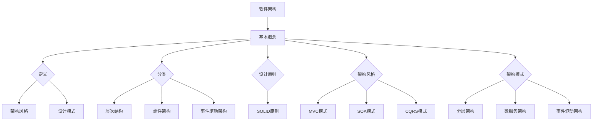

                 

## 引言

### 1.1 软件架构的发展历程

软件架构的发展历程反映了软件工程领域的不断创新和进步。从最初的单一架构到分布式架构，再到如今的微服务架构，每一次的变革都推动了软件开发的效率和质量。

#### 1.1.1 单体架构

单体架构（Monolithic Architecture）是最早出现的软件架构风格。在这种架构中，应用程序作为一个单一的、不可分割的单元运行。所有的功能、数据库和其他组件都紧密集成在一个应用程序中。

##### 1.1.1.1 单体架构的定义

单体架构的定义非常简单：一个应用程序就是一个单一的代码库，通常只有一个进程和一个代码库。这意味着所有的逻辑、服务、数据库等都集中在一个应用程序中。

##### 1.1.1.2 单体架构的优点

- **易于开发和管理**：由于所有功能都在一个应用程序中，开发人员可以更容易地理解和维护代码。
- **快速部署**：由于只需要部署一个应用程序，因此部署过程非常简单和快速。
- **易于调试**：由于所有组件都在一个进程中运行，调试变得更加简单。

##### 1.1.1.3 单体架构的缺点

- **可扩展性差**：当一个应用程序变得非常大时，扩展变得困难，因为它需要同时扩展所有功能。
- **模块耦合度高**：由于所有功能都紧密集成在一起，一个模块的变更可能会影响到其他模块。
- **技术债务**：随着应用程序的增长，单体架构可能会积累大量的技术债务。

#### 1.1.2 分布式架构

随着互联网和分布式系统的兴起，分布式架构（Distributed Architecture）逐渐成为主流。分布式架构将应用程序分解为多个独立的服务，每个服务负责一个特定的功能。这些服务通过网络进行通信，从而实现复杂的应用程序。

##### 1.1.2.1 分布式架构的定义

分布式架构将应用程序分解为多个独立的服务，每个服务都运行在自己的进程中，并且通常在不同的服务器上。这些服务通过网络进行通信，从而实现应用程序的各个功能。

##### 1.1.2.2 分布式架构的优点

- **高可扩展性**：由于服务是独立的，因此可以独立扩展每个服务。
- **高容错性**：由于服务是独立的，一个服务的故障不会影响其他服务。
- **更好的性能**：通过将应用程序分解为多个服务，可以更好地利用服务器资源。

##### 1.1.2.3 分布式架构的缺点

- **复杂性增加**：由于服务是独立的，因此需要更多的工具和技术来管理它们。
- **通信开销**：由于服务通过网络进行通信，因此会增加通信开销。
- **更高的部署难度**：由于需要部署多个服务，因此部署过程变得更加复杂。

### 1.2 微服务架构的兴起

微服务架构（Microservices Architecture）是近年来兴起的一种新的软件架构风格，它将分布式架构进一步细分，每个服务都更加独立和自治。微服务架构的目标是提高开发、部署和扩展的灵活性。

#### 1.2.1 微服务架构的定义

微服务架构将应用程序分解为多个小型、独立的服务，每个服务都负责一个特定的功能。这些服务通常是语言无关的，可以独立部署和扩展。

##### 1.2.1.1 微服务的定义

微服务是一种小型、独立的服务，通常由一组应用程序代码组成，负责执行特定的业务功能。

##### 1.2.1.2 微服务的特点

- **独立性**：每个微服务都是独立的，可以独立部署和扩展。
- **自治性**：每个微服务都有自己的数据库和缓存，可以独立运行。
- **松耦合**：微服务之间通过API进行通信，通常使用轻量级协议如HTTP/JSON。

#### 1.2.2 微服务架构的优势与挑战

##### 1.2.2.1 微服务架构的优势

- **高可扩展性**：通过将应用程序分解为多个微服务，可以更容易地实现水平扩展。
- **高灵活性**：由于每个微服务都是独立的，因此可以更容易地开发、测试和部署。
- **快速迭代**：由于每个微服务都是独立的，因此可以更快地迭代和发布。

##### 1.2.2.2 微服务架构的挑战

- **复杂性**：由于微服务架构引入了更多的组件和依赖，因此架构变得更加复杂。
- **分布式事务**：在微服务架构中，分布式事务变得复杂，需要使用特定的技术来处理。
- **服务管理**：需要更多的工具和技术来管理大量的微服务。

通过以上对软件架构发展历程的介绍，我们可以看到，从单体架构到分布式架构，再到微服务架构，每一次的变革都是为了解决软件开发过程中遇到的新挑战，提高软件的可扩展性、灵活性和可靠性。接下来，我们将深入探讨这些架构模式的核心概念和设计原则。

### 1.3 单体架构到微服务架构的演变

软件架构的演变是一个不断迭代的过程，从单体架构到分布式架构，再到微服务架构，反映了软件开发过程中对于复杂性和可扩展性的需求。下面我们将逐步分析这些架构模式之间的关系和演变过程。

#### 1.3.1 单体架构的局限性

单体架构在初期为软件开发提供了简单、统一的方式。然而，随着应用程序的复杂性增加，单体架构逐渐暴露出一些局限性：

- **扩展性差**：单体架构将所有功能集中在一个应用程序中，使得扩展变得困难。当应用程序需要处理大量数据或用户时，扩展性成为了一个瓶颈。
- **模块耦合度高**：单体架构中，各个模块之间紧密耦合，导致一个模块的变更可能会影响到其他模块，增加了维护的复杂性。
- **技术债务积累**：随着应用程序的增长，单体架构可能会积累大量的技术债务，使得代码库变得庞大而难以维护。

#### 1.3.2 分布式架构的兴起

为了克服单体架构的局限性，分布式架构应运而生。分布式架构将应用程序分解为多个独立的服务，每个服务负责特定的功能。这种架构风格在以下几个方面为软件开发带来了改进：

- **高扩展性**：分布式架构允许开发者根据需求独立扩展每个服务，从而提高系统的整体可扩展性。
- **模块独立性**：通过将应用程序分解为多个独立的服务，可以降低模块之间的耦合度，提高代码的模块化程度。
- **容错性**：分布式架构中的服务是独立的，一个服务的故障不会影响其他服务，从而提高了系统的容错性。

然而，分布式架构也带来了一些新的挑战，如服务间的通信复杂性、分布式事务的处理等。

#### 1.3.3 微服务架构的进一步细分

分布式架构在一定程度上解决了单体架构的局限性，但仍然存在一些问题，如服务间通信的开销、服务管理复杂性等。微服务架构在这些基础上进行了进一步的优化：

- **独立性**：微服务架构中的每个服务都是独立和自治的，具有自己的数据库和缓存。这进一步提高了系统的灵活性和可扩展性。
- **轻量级通信**：微服务通常使用轻量级协议（如HTTP/JSON）进行通信，降低了通信的开销。
- **自治性**：每个微服务都有自己独立的部署和扩展策略，使得开发和运维更加灵活。

微服务架构的目标是实现高度灵活、可扩展且易于管理的软件系统，但这也带来了新的挑战，如分布式事务、服务管理复杂性等。

#### 1.3.4 演变过程中的权衡

从单体架构到分布式架构，再到微服务架构，每一次的演变都是在权衡复杂性和灵活性之间做出的选择。单体架构的简单性使得开发初期更加高效，但难以应对复杂业务需求；分布式架构提高了系统的可扩展性和容错性，但增加了通信和管理复杂性；微服务架构进一步提高了灵活性和自治性，但同时也增加了服务管理和分布式事务处理的复杂性。

在实际应用中，选择合适的架构模式需要根据具体业务需求和项目特点进行权衡。例如，对于一些简单的业务场景，单体架构可能已经足够；而对于复杂、高并发的业务场景，微服务架构可能更加适合。

### 1.4 小结

软件架构的演变是一个不断迭代的过程，从单体架构到分布式架构，再到微服务架构，反映了软件开发领域对于复杂性和可扩展性的需求。每种架构模式都有其独特的优点和挑战，选择合适的架构模式需要根据具体业务需求和项目特点进行权衡。通过理解这些架构模式之间的关系和演变过程，开发者可以更好地设计和管理复杂的软件系统。

接下来，我们将深入探讨软件架构的核心概念，包括定义、分类和设计原则，帮助读者更好地理解和应用不同的架构模式。

## 核心概念与联系

### 2.1 软件架构的基本概念

#### 2.1.1 软件架构的定义

软件架构（Software Architecture）是软件系统的整体结构和设计，它定义了系统中各个组件的交互方式以及这些组件如何共同实现系统的功能。软件架构不仅仅是代码的实现，而是对系统进行高层次的设计和规划，确保系统具有良好的性能、可维护性和可扩展性。

#### 2.1.2 软件架构的重要性

软件架构的重要性体现在以下几个方面：

- **性能优化**：通过合理的架构设计，可以优化系统的性能，确保系统能够高效地处理大量请求。
- **可维护性**：良好的架构设计有助于代码的模块化，降低系统复杂性，使得代码更加易于维护和更新。
- **可扩展性**：软件架构的设计应该考虑到未来的扩展需求，确保系统能够灵活地应对业务变化和增长。

#### 2.1.3 软件架构的分类

软件架构可以根据不同的维度进行分类，常见的分类方法包括：

- **层次结构**：基于层次结构，软件架构可以分为客户端-服务器架构、三层架构、四层架构等。
- **组件架构**：基于组件架构，软件架构可以分为组件化架构、服务导向架构等。
- **事件驱动架构**：基于事件驱动架构，软件架构可以分为事件驱动架构、发布-订阅模式等。

### 2.2 软件架构的设计原则

#### 2.2.1 设计原则概述

软件架构的设计原则是指导架构设计的基本理念，它们确保架构设计满足系统需求，同时保持系统的灵活性和可维护性。常见的软件架构设计原则包括：

- **单一职责原则**：每个组件应该只有一个职责，确保组件的职责明确，降低复杂性。
- **开闭原则**：软件实体（如类、模块、函数等）应该对扩展开放，对修改封闭，确保在不修改原有代码的情况下增加新功能。
- **里氏替换原则**：任何使用基类的地方都能使用其子类替换，确保软件系统的灵活性和可扩展性。
- **依赖倒置原则**：高层模块不应该依赖于低层模块，二者都应该依赖于抽象，确保系统的稳定性和可维护性。

#### 2.2.2 软件架构设计的重要原则

在具体的设计过程中，以下原则尤为重要：

- **SOLID原则**：SOLID 是一组用于指导软件架构设计的重要原则，包括单一职责原则（Single Responsibility Principle）、开闭原则（Open/Closed Principle）、里氏替换原则（Liskov Substitution Principle）、依赖倒置原则（Dependency Inversion Principle）和接口隔离原则（Interface Segregation Principle）。
- **设计模式**：设计模式是一套经过验证的解决方案，用于解决软件开发中的常见问题。常见的软件设计模式包括工厂模式、观察者模式、策略模式等。

### 2.3 软件架构风格与模式

#### 2.3.1 架构风格

软件架构风格是软件系统设计的基本范式，反映了系统中不同组件之间的交互方式和组织结构。常见的软件架构风格包括：

- **分层架构**：将系统划分为多个层次，每个层次负责特定的功能，如表示层、业务逻辑层、数据访问层等。
- **微服务架构**：将系统划分为多个小型、独立的服务，每个服务负责一个特定的功能，通过轻量级协议进行通信。
- **事件驱动架构**：基于事件驱动的系统设计，通过事件触发器和监听器实现组件间的通信。

#### 2.3.2 软件架构模式

软件架构模式是一套用于解决特定问题的软件设计模式。常见的软件架构模式包括：

- **MVC模式**：模型-视图-控制器（Model-View-Controller）是一种用于构建用户界面的常见设计模式，将数据模型、用户界面和业务逻辑分离。
- **服务导向架构（SOA）**：服务导向架构是一种基于服务的架构风格，通过定义服务接口和契约来实现系统的松耦合。
- **CQRS模式**：CQRS（Command Query Responsibility Segregation）模式将读写分离，通过分离命令（写操作）和查询（读操作）来提高系统的性能和可扩展性。

### 2.4 核心概念与联系

为了更好地理解软件架构的核心概念，我们可以使用Mermaid流程图来展示不同概念之间的关系。以下是一个简单的Mermaid流程图，展示了软件架构中的一些关键概念：

通过这个流程图，我们可以清晰地看到软件架构的基本概念、分类、设计原则、架构风格和架构模式之间的关系。这些概念共同构成了软件架构的理论基础，指导开发者设计和实现高效的软件系统。

接下来，我们将深入探讨单体架构的设计模式、优缺点和挑战，帮助读者更好地理解这种架构模式。

## 单体架构

### 3.1 单体架构的设计模式

#### 3.1.1 单体架构概述

单体架构（Monolithic Architecture）是最早出现的软件架构风格，它将应用程序的所有功能、服务、数据库和其他组件都集成在一个单一的代码库中。这种架构风格在早期软件开发中被广泛采用，因为它简单、易于理解和管理。

##### 3.1.1.1 单体架构的定义

单体架构指的是一个应用程序作为一个单一的代码库运行。所有的功能、服务、数据库等都集成在一个应用程序中，通常运行在一个进程中。

##### 3.1.1.2 单体架构的组成

在单体架构中，应用程序由多个模块组成，每个模块负责特定的功能。这些模块通常通过方法调用或类继承等方式进行交互。以下是单体架构的主要组成部分：

- **表示层（Presentation Layer）**：负责处理用户界面和客户端请求。
- **业务逻辑层（Business Logic Layer）**：包含核心的业务逻辑和业务规则。
- **数据访问层（Data Access Layer）**：负责与数据库进行交互，执行数据的查询和操作。
- **基础设施层（Infrastructure Layer）**：提供应用程序所需的基础设施支持，如日志记录、配置管理等。

#### 3.1.2 单体架构的设计模式

在设计单体架构时，可以采用以下几种常见的设计模式：

- **分层架构**：将应用程序划分为表示层、业务逻辑层、数据访问层等不同的层次，每个层次负责特定的功能。
- **MVC模式**：模型-视图-控制器（Model-View-Controller）模式将应用程序分为模型、视图和控制器三个部分，分别负责数据管理、用户界面和业务逻辑处理。
- **依赖注入**：通过依赖注入（Dependency Injection）将组件之间的依赖关系进行解耦，提高代码的可测试性和可维护性。

#### 3.1.3 单体架构的优缺点

##### 3.1.3.1 单体架构的优点

- **简单易用**：由于所有的功能都集成在一个应用程序中，因此开发、测试和部署过程非常简单。
- **快速开发**：单体架构使得团队可以快速构建和迭代应用程序，因为不需要关注服务之间的通信和集成问题。
- **易于管理**：由于所有组件都在一个应用程序中，因此系统管理和维护变得更加简单。

##### 3.1.3.2 单体架构的缺点

- **可扩展性差**：当应用程序变得庞大时，扩展变得困难。因为所有的功能都集成在一个应用程序中，扩展一个功能需要同时修改多个模块。
- **模块耦合度高**：单体架构中，各个模块之间存在紧密的耦合关系。一个模块的变更可能会影响到其他模块，导致维护和升级变得复杂。
- **技术债务积累**：随着应用程序的增长，单体架构可能会积累大量的技术债务，如性能瓶颈、代码重复等。

#### 3.1.4 单体架构面临的挑战与解决方案

##### 3.1.4.1 扩展性挑战

单体架构的一个主要挑战是扩展性。当应用程序需要处理大量数据和用户时，扩展变得困难。解决方案包括：

- **水平扩展**：通过增加服务器数量来提高系统的处理能力。但这需要确保应用程序具有良好的负载均衡和容错机制。
- **垂直扩展**：通过增加服务器的硬件配置（如增加CPU、内存等）来提高系统的处理能力。但这可能需要较大的投资。

##### 3.1.4.2 耦合性挑战

单体架构中，模块之间的耦合度较高，一个模块的变更可能会影响到其他模块。这导致代码维护变得复杂。解决方案包括：

- **模块化**：通过将应用程序分解为多个模块，每个模块负责特定的功能，降低模块之间的耦合度。
- **依赖管理**：使用依赖注入等设计模式来管理组件之间的依赖关系，降低耦合度。

##### 3.1.4.3 技术债务挑战

随着应用程序的增长，单体架构可能会积累大量的技术债务，如性能瓶颈、代码重复等。这会影响系统的可维护性和可扩展性。解决方案包括：

- **重构**：定期对代码进行重构，消除技术债务，提高代码质量。
- **代码规范**：制定严格的代码规范和最佳实践，确保新代码遵循规范，避免新债务的产生。

#### 3.1.5 单体架构的应用场景

尽管单体架构存在一些缺点，但在某些应用场景下，它仍然是一个有效的选择。以下是几种适合使用单体架构的应用场景：

- **小型项目**：对于小型项目或初创项目，单体架构可以提供快速开发和部署的便利。
- **功能单一的系统**：对于功能相对单一的系统，如小型网站或内部工具，单体架构可以简化系统的设计和维护。
- **临时性项目**：对于临时性或短期项目，单体架构可以提供快速交付的能力，而不需要过多的前期设计。

总之，单体架构在早期软件开发中被广泛采用，但由于其扩展性和灵活性较差，随着应用程序的复杂度增加，它逐渐被分布式架构和微服务架构所取代。然而，在特定场景下，单体架构仍然是一个实用的选择。

### 3.2 分布式架构的概念与挑战

#### 3.2.1 分布式架构的定义

分布式架构（Distributed Architecture）是一种将应用程序分解为多个独立服务的架构风格。这些服务通过网络进行通信，共同实现应用程序的功能。分布式架构旨在提高系统的可扩展性、可靠性和灵活性。

在分布式架构中，每个服务都是独立的，可以独立部署、扩展和管理。这些服务通常具有以下特点：

- **独立性**：每个服务都是独立的，可以独立运行和升级，不会影响到其他服务。
- **自治性**：每个服务都有自己的数据库和缓存，具有自己的业务逻辑和数据处理能力。
- **松耦合**：服务之间通过轻量级协议（如HTTP/REST、gRPC等）进行通信，服务之间的依赖关系较弱。

#### 3.2.2 分布式架构的优点

- **高可扩展性**：通过将应用程序分解为多个独立的服务，可以更容易地实现水平扩展。当需要处理更多请求时，可以简单地增加服务的实例数量。
- **高容错性**：由于服务是独立的，一个服务的故障不会影响其他服务，从而提高了系统的容错性。如果某个服务发生故障，其他服务可以继续正常运行。
- **更好的性能**：通过将应用程序分解为多个服务，可以更好地利用服务器资源。每个服务可以根据自己的负载和性能需求进行优化。

#### 3.2.3 分布式架构的缺点

- **复杂性增加**：由于服务是独立的，需要更多的工具和技术来管理它们。分布式系统的设计、部署、监控和故障处理变得更加复杂。
- **通信开销**：由于服务通过网络进行通信，会增加通信开销。在分布式系统中，服务间的通信延迟和带宽限制可能会影响系统的性能。
- **更高的部署难度**：由于需要部署多个服务，因此部署过程变得更加复杂。需要确保服务之间的版本兼容性、数据一致性和服务发现等问题。

#### 3.2.4 分布式架构的挑战与解决方案

分布式架构虽然带来了许多优点，但也带来了一些新的挑战。以下是分布式架构中常见的一些挑战及其解决方案：

##### 3.2.4.1 一致性挑战

在分布式系统中，保持数据一致性是一个重要但具有挑战性的问题。常见的解决方案包括：

- **强一致性**：通过使用分布式事务和同步机制来确保数据的一致性。但强一致性可能会影响系统的性能和可用性。
- **最终一致性**：允许系统在一段时间内出现数据不一致的情况，但最终会达到一致性状态。最终一致性适用于读多写少的场景，可以提供更好的性能和可用性。

##### 3.2.4.2 分布式事务处理

分布式事务处理是分布式架构中的另一个重要挑战。解决方案包括：

- **两阶段提交（2PC）**：通过协调者节点来确保分布式事务的原子性。两阶段提交可以确保事务要么全部提交，要么全部回滚，但可能会带来性能瓶颈。
- **补偿事务**：通过补偿事务来处理分布式事务的异常情况。补偿事务可以恢复数据的一致性，但可能会带来额外的复杂性。

##### 3.2.4.3 服务发现和负载均衡

服务发现和负载均衡是分布式架构中的重要问题。解决方案包括：

- **服务注册中心**：使用服务注册中心来管理服务实例的注册和发现。当服务启动时，会向注册中心注册自己的地址和端口，客户端可以通过注册中心来发现服务实例。
- **负载均衡器**：使用负载均衡器来分配请求到不同的服务实例，提高系统的性能和可用性。常见的负载均衡算法包括轮询、最少连接、加权轮询等。

##### 3.2.4.4 服务管理和监控

在分布式架构中，服务管理和监控变得更加复杂。解决方案包括：

- **服务管理平台**：使用服务管理平台来管理服务的部署、扩展、监控和故障处理。常见的平台包括Kubernetes、Consul等。
- **监控工具**：使用监控工具来收集和分析系统的性能指标，及时发现和解决潜在的问题。常见的监控工具包括Prometheus、Grafana等。

#### 3.2.5 分布式架构的应用场景

分布式架构在许多应用场景中都有广泛的应用，以下是一些典型的应用场景：

- **大型电子商务平台**：电子商务平台通常需要处理大量的用户请求和数据，分布式架构可以提高系统的性能和可扩展性。
- **社交网络平台**：社交网络平台需要处理大量的用户互动和数据存储，分布式架构可以提高系统的可扩展性和容错性。
- **云计算平台**：云计算平台通常提供多种服务，如计算、存储、网络等，分布式架构可以更好地管理和服务这些资源。

总之，分布式架构通过将应用程序分解为多个独立的服务，提高了系统的可扩展性、可靠性和灵活性。尽管它带来了一些新的挑战，但通过合理的设计和工具的使用，可以有效地解决这些问题，实现高效的分布式系统。

### 3.3 微服务架构的设计模式

#### 3.3.1 微服务架构概述

微服务架构（Microservices Architecture）是一种将应用程序分解为多个小型、独立服务的架构风格。每个服务都负责一个特定的业务功能，可以独立部署、扩展和管理。微服务架构旨在提高系统的灵活性、可扩展性和可维护性。

在微服务架构中，每个服务都是独立的，可以采用不同的编程语言和技术栈进行开发。这些服务通过网络进行通信，通常使用轻量级协议（如HTTP/REST、gRPC等）。以下是微服务架构的主要组成部分：

- **服务实例**：每个服务可以运行多个实例，通过负载均衡器进行请求分发。
- **服务注册与发现**：服务实例在启动时会向服务注册中心注册自己，客户端可以通过服务注册中心来发现服务实例。
- **服务通信**：服务之间通过API进行通信，通常使用HTTP/REST或gRPC等协议。
- **数据存储**：每个服务通常都有自己的数据库或数据存储，以保持数据的一致性和独立性。

#### 3.3.2 微服务架构的设计模式

在微服务架构中，可以采用多种设计模式来提高系统的灵活性和可维护性。以下是一些常见的设计模式：

- **CQRS模式**：CQRS（Command Query Responsibility Segregation）模式将命令（写操作）和查询（读操作）分离，以提高系统的性能和可扩展性。命令服务负责处理写操作，查询服务负责处理读操作。
- **事件驱动架构**：事件驱动架构通过事件来驱动系统的行为，将服务之间的通信转化为事件流。事件可以由服务触发，其他服务通过监听器来响应事件。
- **API网关**：API网关作为服务的统一入口，负责处理外部请求，并将请求转发给相应的内部服务。API网关可以提供负载均衡、安全性、请求路由等功能。

#### 3.3.3 微服务架构的核心概念

在微服务架构中，以下核心概念非常重要：

- **服务拆分**：将应用程序分解为多个小型服务，每个服务负责一个特定的业务功能。服务拆分的原则包括功能独立性、业务边界清晰、可扩展性等。
- **服务自治**：每个服务都是自治的，具有自己的业务逻辑和数据存储，可以独立部署和扩展。
- **服务通信**：服务之间通过API进行通信，通常使用轻量级协议。服务通信的设计原则包括解耦、异步通信、超时处理等。
- **数据管理**：每个服务通常有自己的数据库或数据存储，以保持数据的一致性和独立性。在分布式系统中，数据管理需要考虑数据复制、数据同步和分布式事务等问题。

#### 3.3.4 微服务架构的优缺点

##### 3.3.4.1 微服务架构的优点

- **高可扩展性**：通过将应用程序分解为多个小型服务，可以独立扩展每个服务，从而提高系统的整体可扩展性。
- **高灵活性**：由于每个服务都是独立的，因此可以更容易地开发、测试和部署新功能。
- **快速迭代**：由于每个服务都是独立的，可以并行开发和部署，从而加快开发速度和迭代周期。
- **技术多样性**：每个服务可以使用不同的编程语言和技术栈进行开发，从而提高开发团队的灵活性和选择自由度。

##### 3.3.4.2 微服务架构的缺点

- **复杂性增加**：由于服务是独立的，需要更多的工具和技术来管理它们。分布式系统的设计、部署、监控和故障处理变得更加复杂。
- **通信开销**：由于服务通过网络进行通信，会增加通信开销。在分布式系统中，服务间的通信延迟和带宽限制可能会影响系统的性能。
- **服务管理难度**：需要更多的资源来管理和维护大量的服务，包括服务注册、发现、监控、日志记录等。

#### 3.3.5 微服务架构的应用场景

尽管微服务架构存在一些缺点，但在许多应用场景中，它是一个有效的选择。以下是一些典型的应用场景：

- **大型互联网公司**：对于大型互联网公司，如电商平台、社交媒体平台、在线游戏等，微服务架构可以提高系统的性能和可扩展性。
- **复杂业务系统**：对于具有复杂业务逻辑的系统，如金融系统、物流系统、医疗系统等，微服务架构可以帮助将这些复杂业务逻辑分解为多个独立的服务，提高系统的可维护性和可扩展性。
- **初创公司**：对于初创公司，微服务架构可以帮助快速构建和迭代产品，提高开发速度和市场竞争力。

总之，微服务架构通过将应用程序分解为多个小型、独立的服务，提高了系统的灵活性、可扩展性和可维护性。尽管它带来了一些新的挑战，但通过合理的设计和工具的使用，可以有效地解决这些问题，实现高效的分布式系统。

### 3.4 总结

软件架构的发展经历了从单体架构到分布式架构，再到微服务架构的演变。每种架构模式都有其独特的优点和挑战，选择合适的架构模式需要根据具体业务需求和项目特点进行权衡。

- **单体架构**：简单易用，适用于小型项目和功能单一的系统，但扩展性和灵活性较差。
- **分布式架构**：提高了系统的可扩展性和容错性，但增加了通信和管理复杂性。
- **微服务架构**：通过将应用程序分解为多个小型、独立的服务，提高了系统的灵活性、可扩展性和可维护性，但增加了复杂性。

在实际应用中，可以根据项目的规模、复杂性、业务需求等因素选择合适的架构模式。同时，需要合理管理和优化分布式系统，以确保其性能和可靠性。

### 3.5 附录

#### 3.5.1 工具和技术资源

- **服务注册与发现**：Consul、Zookeeper、Eureka
- **API网关**：Kong、Apache APISIX、Spring Cloud Gateway
- **服务通信**：gRPC、HTTP/REST、Message Queue
- **数据存储**：MySQL、MongoDB、Redis、Cassandra
- **容器编排**：Docker、Kubernetes、Podman
- **服务监控**：Prometheus、Grafana、Zabbix

#### 3.5.2 拓展阅读

- **《微服务设计》**：By Sam Newman
- **《分布式系统原理与范型》**：By Andrew S. Tanenbaum
- **《软件架构：实践者的研究方法》**：By Michael keeling

通过这些工具和技术资源，读者可以更深入地了解和实现不同的架构模式，为软件开发提供有效的指导和支持。

### 作者信息

作者：AI天才研究院/AI Genius Institute & 禅与计算机程序设计艺术 /Zen And The Art of Computer Programming

